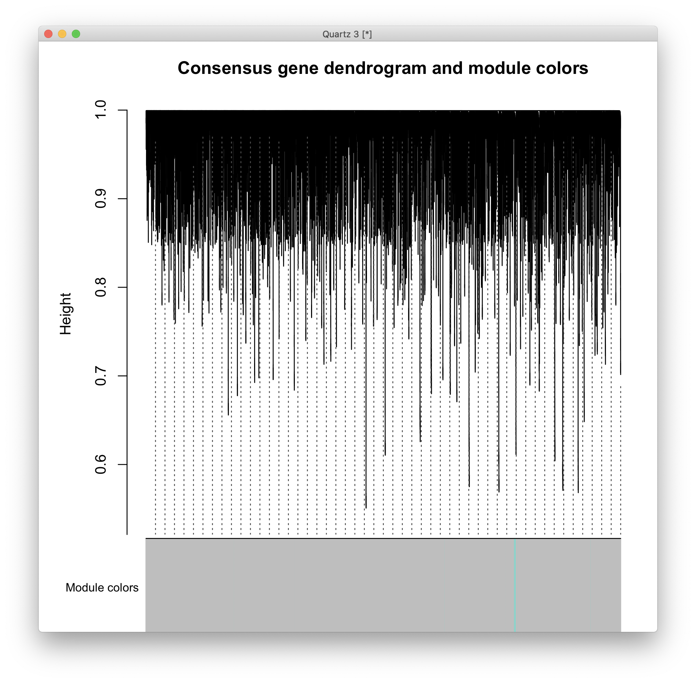
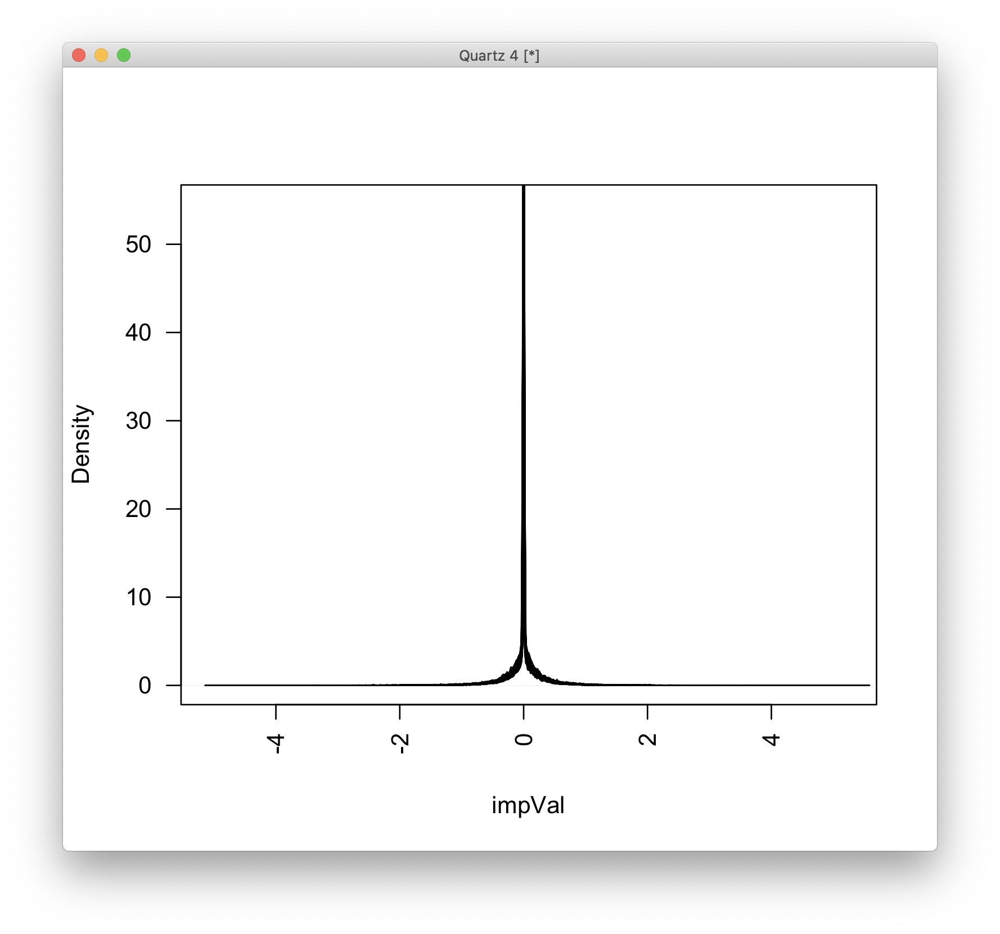
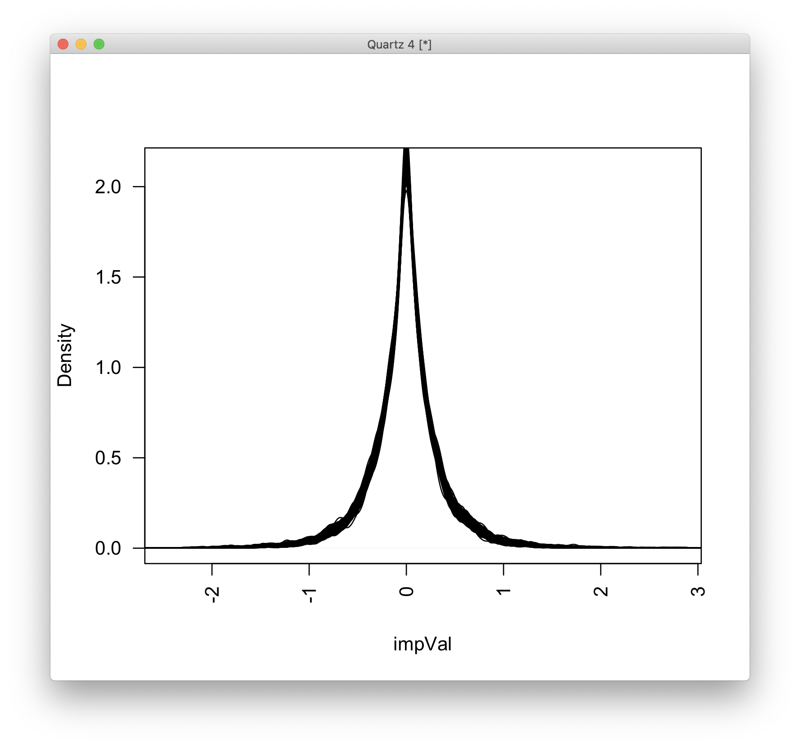
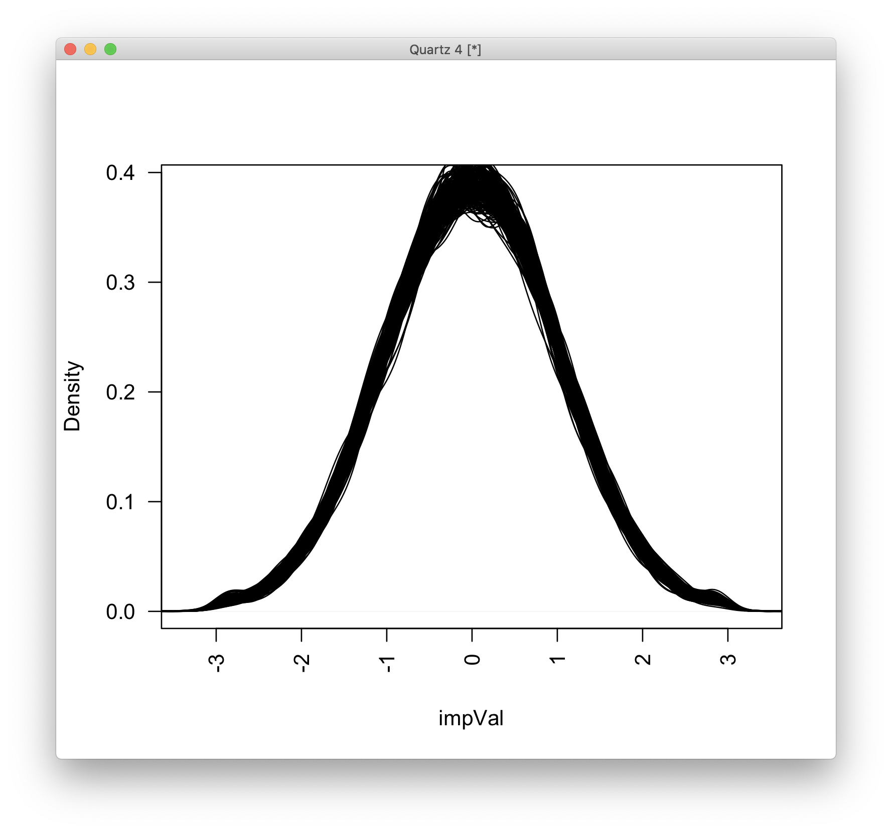

# 2020-12-15 11:25:39

I'm curious to whether the WGCNA analysis might boost the imputation results.

```r
imp = read.delim('~/data/expression_impute/ANAT_cropped_imp_MASHR_ACC.tab')
datExpr0 = imp[, 3:ncol(imp)]  # remove FID and IID

library(WGCNA)
gsg = goodSamplesGenes(datExpr0, verbose = 3);
datExpr0 = datExpr0[gsg$goodSamples, gsg$goodGenes]

sampleTree = hclust(dist(datExpr0), method = "average")
quartz()
plot(sampleTree, main = "Sample clustering to detect outliers", sub="",
     xlab="", cex.lab = 1.5, cex.axis = 1.5, cex.main = 2)
```


A couple odd ones, but nothing too bad.

```r
datExpr = datExpr0
nGenes = ncol(datExpr)
nSamples = nrow(datExpr)

enableWGCNAThreads()

# Choose a set of soft-thresholding powers
powers = c(c(1:10), seq(from = 12, to=20, by=2))
# Call the network topology analysis function
sft = pickSoftThreshold(datExpr, powerVector = powers, verbose = 5)
# Plot the results:
quartz()
par(mfrow = c(1,2));
cex1 = 0.9;
# Scale-free topology fit index as a function of the soft-thresholding power
plot(sft$fitIndices[,1], -sign(sft$fitIndices[,3])*sft$fitIndices[,2],
     xlab="Soft Threshold (power)",
     ylab="Scale Free Topology Model Fit,signed R^2",type="n",
    main = paste("Scale independence"));
text(sft$fitIndices[,1], -sign(sft$fitIndices[,3])*sft$fitIndices[,2],
    labels=powers,cex=cex1,col="red");
# this line corresponds to using an R^2 cut-off of h
abline(h=0.90,col="red")
# Mean connectivity as a function of the soft-thresholding power
plot(sft$fitIndices[,1], sft$fitIndices[,5],
    xlab="Soft Threshold (power)",ylab="Mean Connectivity", type="n",
    main = paste("Mean connectivity"))
text(sft$fitIndices[,1], sft$fitIndices[,5], labels=powers, cex=cex1,col="red")
```


We should be OK with only 6 again, but it looks like even 3 is enough. It does
look like the data is not necessarily very rich... maybe too sparse? We might
need other types of networks here.

```r
net3 = blockwiseModules(datExpr, power = 3,
                     TOMType = "unsigned", minModuleSize = 30,
                     reassignThreshold = 0, mergeCutHeight = 0.25,
                     numericLabels = TRUE, pamRespectsDendro = FALSE,
                     saveTOMs = F, maxBlockSize=nGenes, verbose = 3)

net6 = blockwiseModules(datExpr, power = 6,
                     TOMType = "unsigned", minModuleSize = 30,
                     reassignThreshold = 0, mergeCutHeight = 0.25,
                     numericLabels = TRUE, pamRespectsDendro = FALSE,
                     saveTOMs = F, maxBlockSize=nGenes, verbose = 3)
```

Now, the idea is to regress the modules against the brain phenotype. But maybe
we can get even fancier, and add clinical variables to the regression too? Maybe
some sort of DX*brain?

Let's evaluate the networks first:

```r
net = net3
consMEs = net$multiMEs;
moduleLabels = net$colors;
# Convert the numeric labels to color labels
moduleColors = labels2colors(moduleLabels)
consTree = net$dendrograms[[1]];
quartz()
plotDendroAndColors(consTree, moduleColors, "Module colors",
                    dendroLabels = FALSE, hang = 0.03,
                    addGuide = TRUE, guideHang = 0.05,
                    main = "Consensus gene dendrogram and module colors")
```



I didn't get anything for power = 6, and a single network for power = 3. But
there's nothing really there...

Let's clean up the data a bit and then maybe try other types of networks?

```r
library(caret)
pp_order = c('zv', 'nzv')
pp = preProcess(datExpr0, method = pp_order)
datExpr = predict(pp, datExpr0)
nGenes = ncol(datExpr)
nSamples = nrow(datExpr)

gsg = goodSamplesGenes(datExpr, verbose = 3);
# all OK
powers = c(c(1:10), seq(from = 12, to=20, by=2))
sft = pickSoftThreshold(datExpr, powerVector = powers, verbose = 5)
```

This will give me 2 or 3 again... let's see if other methods of creating the
network work better.

```
r$> sft = pickSoftThreshold(datExpr, powerVector = powers, verbose = 5, corFnc = bicor)   
pickSoftThreshold: will use block size 3696.
 pickSoftThreshold: calculating connectivity for given powers...
   ..working on genes 1 through 3696 of 12102
   ..working on genes 3697 through 7392 of 12102
   ..working on genes 7393 through 11088 of 12102
   ..working on genes 11089 through 12102 of 12102
   Power SFT.R.sq slope truncated.R.sq  mean.k. median.k.  max.k.
1      1    0.946 -3.73          0.940 810.0000  6.95e+02 1640.00
2      2    0.980 -2.49          0.986  94.4000  6.23e+01  398.00
3      3    0.987 -1.99          0.997  15.7000  7.39e+00  121.00
4      4    0.982 -1.77          0.992   3.4500  1.28e+00   42.00
5      5    0.981 -1.71          0.994   0.9870  2.71e-01   15.90
6      6    0.952 -1.59          0.984   0.3790  6.49e-02    6.38
7      7    0.873 -1.89          0.968   0.2010  1.74e-02    5.53
8      8    0.862 -1.79          0.927   0.1380  5.14e-03    5.11
9      9    0.854 -1.68          0.921   0.1120  1.56e-03    4.78
10    10    0.886 -1.55          0.968   0.0979  4.94e-04    4.50
11    12    0.873 -1.45          0.943   0.0831  5.52e-05    4.05
12    14    0.877 -1.38          0.948   0.0742  6.97e-06    3.70
13    16    0.872 -1.34          0.942   0.0678  9.02e-07    3.42
14    18    0.865 -1.31          0.930   0.0628  1.19e-07    3.20
15    20    0.858 -1.27          0.906   0.0588  1.59e-08    3.03
r$> sft = pickSoftThreshold(datExpr, powerVector = powers, verbose = 5, corFnc = 'bicor', 
    networkType = 'signed')                                                               
pickSoftThreshold: will use block size 3696.
 pickSoftThreshold: calculating connectivity for given powers...
monitor, intercept, record, and search and seize any communication or
   ..working on genes 1 through 3696 of 12102
   ..working on genes 3697 through 7392 of 12102
   ..working on genes 7393 through 11088 of 12102
   ..working on genes 11089 through 12102 of 12102
   Power SFT.R.sq   slope truncated.R.sq  mean.k. median.k.  max.k.
1      1  0.00537  -60.00          0.986 6050.000  6.05e+03 6070.00
2      2  0.97200 -155.00          0.971 3050.000  3.04e+03 3150.00
3      3  0.98600  -59.80          0.983 1550.000  1.54e+03 1680.00
4      4  0.97800  -31.20          0.972  792.000  7.80e+02  917.00
5      5  0.97500  -19.60          0.969  408.000  3.98e+02  514.00
6      6  0.97600  -13.60          0.971  212.000  2.04e+02  296.00
7      7  0.97900  -10.10          0.976  111.000  1.05e+02  174.00
8      8  0.98300   -7.89          0.981   58.600  5.45e+01  104.00
9      9  0.98800   -6.41          0.989   31.200  2.84e+01   63.70
10    10  0.99100   -5.40          0.992   16.800  1.49e+01   39.60
11    12  0.99500   -4.09          0.994    5.000  4.20e+00   16.10
12    14  0.99700   -3.31          0.997    1.580  1.21e+00    6.96
13    16  0.89000   -3.13          0.946    0.547  3.57e-01    3.57
14    18  0.93700   -2.38          0.964    0.220  1.08e-01    2.45
15    20  0.93700   -1.89          0.958    0.110  3.35e-02    2.24

r$> sft = pickSoftThreshold(datExpr, powerVector = powers, verbose = 5, corFnc = 'bicor', 
    networkType = 'signed hybrid')
pickSoftThreshold: will use block size 3696.
 pickSoftThreshold: calculating connectivity for given powers...
   ..working on genes 1 through 3696 of 12102
   ..working on genes 3697 through 7392 of 12102
   ..working on genes 7393 through 11088 of 12102
   ..working on genes 11089 through 12102 of 12102
   Power SFT.R.sq slope truncated.R.sq  mean.k. median.k. max.k.
1      1    0.932 -3.92          0.935 405.0000  3.48e+02 836.00
2      2    0.976 -2.52          0.985  47.2000  3.11e+01 202.00
3      3    0.983 -2.00          0.997   7.8500  3.76e+00  61.40
4      4    0.983 -1.77          0.996   1.7300  6.16e-01  21.00
5      5    0.974 -1.66          0.993   0.5000  1.17e-01   7.82
6      6    0.917 -1.55          0.985   0.1960  2.56e-02   3.30
7      7    0.876 -1.59          0.975   0.1060  6.17e-03   2.66
8      8    0.889 -1.45          0.969   0.0742  1.61e-03   2.46
9      9    0.880 -1.33          0.936   0.0606  4.54e-04   2.30
10    10    0.863 -1.25          0.921   0.0534  1.30e-04   2.20
11    12    0.870 -1.17          0.923   0.0456  1.15e-05   2.07
12    14    0.871 -1.11          0.912   0.0407  1.13e-06   1.96
13    16    0.853 -1.11          0.882   0.0373  1.15e-07   1.89
14    18    0.840 -1.13          0.880   0.0346  1.22e-08   1.88
15    20    0.834 -1.13          0.875   0.0324  1.37e-09   1.87
 r$>source('~/tmp/code1.R')                               
r$> library(doParallel)
r$> sft<-hpickSoftThreshold(datExpr,powerVector = powers, corFnc = bicor, networkType = "h
    ybrid2", verbose = 5)                                                                 
pickSoftThreshold: will use block size 3696.
 pickSoftThreshold: calculating connectivity for given powers...
   ..working on genes 1 through 3696 of 12102
   ..working on genes 3697 through 7392 of 12102
   ..working on genes 7393 through 11088 of 12102
   ..working on genes 11089 through 12102 of 12102
   Power SFT.R.sq  slope truncated.R.sq  mean.k. median.k.  max.k.
1      1    0.952 -47.20          0.939 6460.000  6.40e+03 6870.00
2      2    0.959 -23.40          0.947 3450.000  3.39e+03 3950.00
3      3    0.965 -15.50          0.955 1850.000  1.80e+03 2290.00
4      4    0.971 -11.50          0.963  998.000  9.55e+02 1350.00
5      5    0.977  -9.07          0.971  540.000  5.09e+02  804.00
6      6    0.983  -7.48          0.978  293.000  2.71e+02  485.00
7      7    0.986  -6.33          0.982  160.000  1.45e+02  297.00
8      8    0.988  -5.47          0.985   87.500  7.78e+01  184.00
9      9    0.990  -4.82          0.988   48.300  4.19e+01  116.00
10    10    0.994  -4.30          0.993   26.800  2.26e+01   73.50
11    12    0.997  -3.55          0.996    8.450  6.80e+00   30.90
12    14    0.994  -3.03          0.993    2.790  2.09e+00   13.60
13    16    0.993  -2.61          1.000    1.000  6.51e-01    6.38
14    18    0.919  -2.76          0.967    0.410  2.08e-01    5.28
15    20    0.923  -2.26          0.956    0.207  6.84e-02    4.73
```

So, regardless of how I pick the power, the network will likely look quite
crummy. Let me just give it a chance and see, before trying out EN:

```r
net6 = blockwiseModules(datExpr, power = 1,
                     TOMType = "signed", minModuleSize = 30,
                     reassignThreshold = 0, mergeCutHeight = 0.25,
                     numericLabels = TRUE, pamRespectsDendro = FALSE,
                     saveTOMs = F, maxBlockSize=nGenes, verbose = 3,
                     corType='bicor')
```

Nope... no significant modules either. Probably something related to the weird
distribution of the imputed data?

```r
X = as.matrix(datExpr)
quartz()
plot(density(X[1, ]), las=2, main="", xlab="impVal")
for (s in 2:nrow(X)) {
  lines(density(X[s, ]), las=2)
}
```



So, this was already expected, with each line being a different subject, and
infividual lines show the overall expression density over genes.

How does that look for the EN model though?

```r
imp = read.delim('~/data/expression_impute/ANAT_cropped_imp_EN_ACC')
datExpr0 = imp[, 3:ncol(imp)]
library(caret)
pp_order = c('zv', 'nzv')
pp = preProcess(datExpr0, method = pp_order)
datExpr = predict(pp, datExpr0)

X = as.matrix(datExpr)
quartz()
plot(density(X[1, ]), las=2, main="", xlab="impVal")
for (s in 2:nrow(X)) {
  lines(density(X[s, ]), las=2)
}
```



It's broader, but still very sparse. Or maybe not, if we take into consideration
the X axis scale. If these are effects from the reference dataset, then it makes
sense, meaning that some are over and others are under expressed, but they are
mostly around 0 (they're not actually 0... I just checke it). Maybe if we
transform the data it'd help?

```r
library(bestNormalize)
Xgrex = X
for (v in 1:ncol(Xgrex)) {
    if ((v %% 100)==0) {
        print(sprintf('%d / %d', v, ncol(Xgrex)))
    }
    bn = orderNorm(Xgrex[, v])
    Xgrex[, v] = bn$x.t
}
pp_order = c('center', 'scale')
pp = preProcess(Xgrex, method = pp_order)
Xgrex = predict(pp, Xgrex)
```

Let's replot the density:

```r
plot(density(Xgrex[1, ]), las=2, main="", xlab="impVal")
for (s in 2:nrow(X)) {
  lines(density(Xgrex[s, ]), las=2)
}
```



Yep, pretty much what I expected. Let's see if that makes a difference in the
networks. Note that I'm using the MASH model again for this:

```r
sft = pickSoftThreshold(Xgrex, powerVector = powers, verbose = 5, corFnc = bicor)
```

```
pickSoftThreshold: will use block size 3696.
 pickSoftThreshold: calculating connectivity for given powers...
   ..working on genes 1 through 3696 of 12102
   ..working on genes 3697 through 7392 of 12102
   ..working on genes 7393 through 11088 of 12102
   ..working on genes 11089 through 12102 of 12102
   Power SFT.R.sq  slope truncated.R.sq  mean.k. median.k. max.k.
1      1    0.134 -35.80          0.929 652.0000  6.52e+02 685.00
2      2    0.639 -26.00          0.829  55.6000  5.54e+01  65.10
3      3    0.987  -9.28          0.988   6.2900  6.06e+00  12.60
4      4    0.985  -3.72          0.981   1.0100  7.94e-01   6.12
5      5    0.939  -2.32          0.962   0.3050  1.22e-01   4.66
6      6    0.911  -1.89          0.986   0.1730  2.22e-02   4.24
7      7    0.836  -1.86          0.930   0.1320  4.91e-03   3.95
8      8    0.837  -1.80          0.937   0.1100  1.28e-03   3.70
9      9    0.385  -2.37          0.415   0.0947  3.90e-04   3.48
10    10    0.387  -2.33          0.421   0.0835  1.32e-04   3.29
11    12    0.848  -1.65          0.941   0.0678  1.69e-05   2.95
12    14    0.839  -1.59          0.935   0.0574  2.42e-06   2.67
13    16    0.805  -1.52          0.871   0.0500  3.48e-07   2.44
14    18    0.808  -1.45          0.863   0.0447  5.22e-08   2.24
15    20    0.802  -1.41          0.848   0.0406  7.81e-09   2.14
```

Not looking very promising...

```r
net3 = blockwiseModules(Xgrex, power = 3,
                     TOMType = "signed", minModuleSize = 30,
                     reassignThreshold = 0, mergeCutHeight = 0.25,
                     numericLabels = TRUE, pamRespectsDendro = FALSE,
                     saveTOMs = F, maxBlockSize=nGenes, verbose = 3,
                     corType='bicor')
```

# TODO
 * DX*brain analysis on modules?
 * clean up imputation results using caret?
 * maybe EN results will do better?
 * how stable are these networks? (http://pages.stat.wisc.edu/~yandell/statgen/ucla/WGCNA/wgcna.html)
 * check FDR after stability analysis
 * use signed networks? (that's what Science paper did, and removed all      covariates first too)
 * use robustness (bicor)
 * try csuWGCNA (https://github.com/RujiaDai/csuWGCNA, like in Science paper)