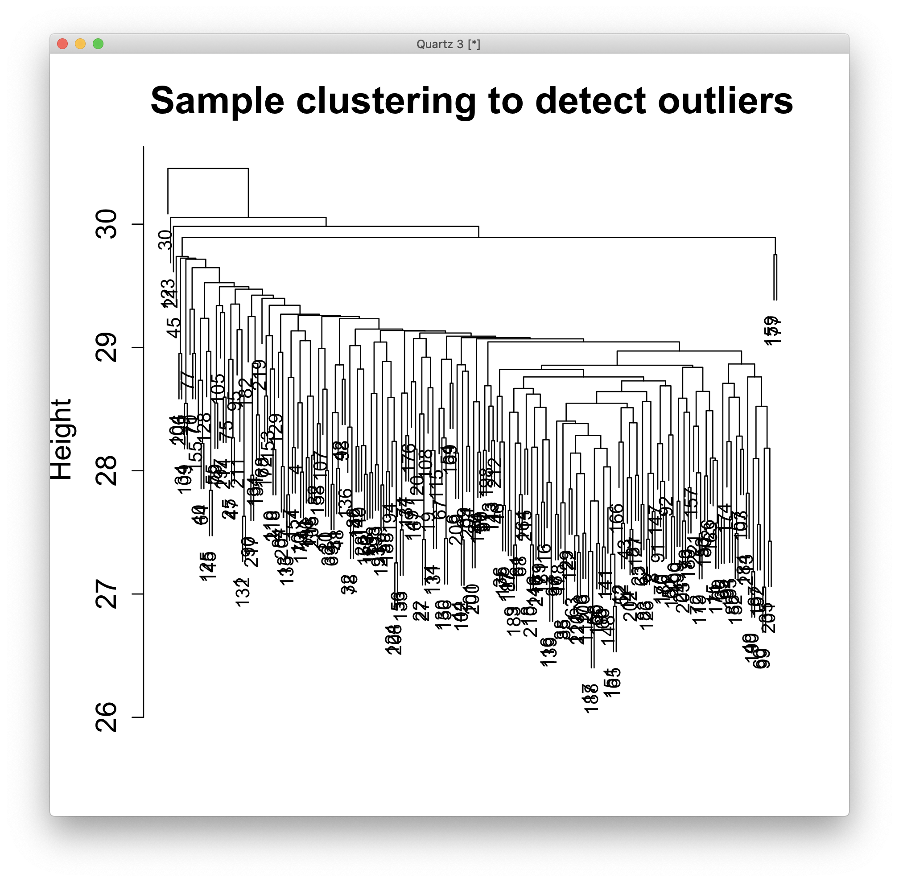
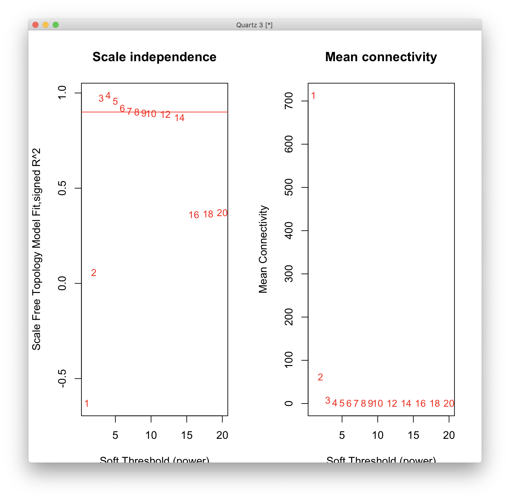

# 2020-12-15 11:25:39

I'm curious to whether the WGCNA analysis might boost the imputation results.

```r
imp = read.delim('~/data/expression_impute/ANAT_cropped_imp_MASHR_ACC.tab')
datExpr0 = imp[, 3:ncol(imp)]  # remove FID and IID

library(WGCNA)
gsg = goodSamplesGenes(datExpr0, verbose = 3);
datExpr0 = datExpr0[gsg$goodSamples, gsg$goodGenes]

sampleTree = hclust(dist(datExpr0), method = "average")
quartz()
plot(sampleTree, main = "Sample clustering to detect outliers", sub="",
     xlab="", cex.lab = 1.5, cex.axis = 1.5, cex.main = 2)
```



A couple odd ones, but nothing too bad.

```r
datExpr = datExpr0
nGenes = ncol(datExpr)
nSamples = nrow(datExpr)

enableWGCNAThreads()

# Choose a set of soft-thresholding powers
powers = c(c(1:10), seq(from = 12, to=20, by=2))
# Call the network topology analysis function
sft = pickSoftThreshold(datExpr, powerVector = powers, verbose = 5)
# Plot the results:
quartz()
par(mfrow = c(1,2));
cex1 = 0.9;
# Scale-free topology fit index as a function of the soft-thresholding power
plot(sft$fitIndices[,1], -sign(sft$fitIndices[,3])*sft$fitIndices[,2],
     xlab="Soft Threshold (power)",
     ylab="Scale Free Topology Model Fit,signed R^2",type="n",
    main = paste("Scale independence"));
text(sft$fitIndices[,1], -sign(sft$fitIndices[,3])*sft$fitIndices[,2],
    labels=powers,cex=cex1,col="red");
# this line corresponds to using an R^2 cut-off of h
abline(h=0.90,col="red")
# Mean connectivity as a function of the soft-thresholding power
plot(sft$fitIndices[,1], sft$fitIndices[,5],
    xlab="Soft Threshold (power)",ylab="Mean Connectivity", type="n",
    main = paste("Mean connectivity"))
text(sft$fitIndices[,1], sft$fitIndices[,5], labels=powers, cex=cex1,col="red")
```



We should be OK with only 6 again, but it looks like even 3 is enough. It does
look like the data is not necessarily very rich... maybe too sparse? We might
need other types of networks here.

```r
net3 = blockwiseModules(datExpr, power = 3,
                     TOMType = "unsigned", minModuleSize = 30,
                     reassignThreshold = 0, mergeCutHeight = 0.25,
                     numericLabels = TRUE, pamRespectsDendro = FALSE,
                     saveTOMs = TRUE,
                     saveTOMFileBase = "pmACC", maxBlockSize=nGenes,
                    verbose = 3)

net6 = blockwiseModules(datExpr, power = 6,
                     TOMType = "unsigned", minModuleSize = 30,
                     reassignThreshold = 0, mergeCutHeight = 0.25,
                     numericLabels = TRUE, pamRespectsDendro = FALSE,
                     saveTOMs = TRUE,
                     saveTOMFileBase = "pmACC", maxBlockSize=nGenes,
                    verbose = 3)
```

Now, the idea is to regress the modules against the brain phenotype. But maybe
we can get even fancier, and add clinical variables to the regression too? Maybe
some sort of DX*brain?

# TODO
 * DX*brain analysis on modules?
 * clean up impu
 * how stable are these networks? (http://pages.stat.wisc.edu/~yandell/statgen/ucla/WGCNA/wgcna.html)
 * check FDR after stability analysis
 * use signed networks? (that's what Science paper did, and removed all      covariates first too)
 * use robustness (bicor)
 * try csuWGCNA (https://github.com/RujiaDai/csuWGCNA, like in Science paper)