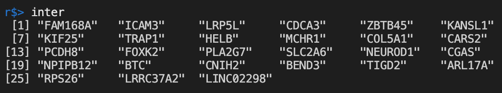

# 2020-12-21 14:15:46

Let's play a bit with the ABCD transcript imputation. First, let's load the data
and save it as RDS, because the files are quite big.

Now that I have the files downloaded, let's see how many subjects have
Freesurfer data, and then we can worry about the Qc parameters.

I'll also need to remove anyone not WNH because of the imputation model.

```r
# start with everyone who was imputed
imp = readRDS('~/data/expression_impute/results/ABCD_v201_ACC_predict_1KG_mashr.rds')
# keep only WNH
mds.cluster = read.table('~/data/expression_impute/HM3_b37mds.mds', head=1)
quartz()
colors=rep("red",length(mds.cluster$C1));
colors[which(mds.cluster$FID == "CEU")] <- "lightblue";
colors[which(mds.cluster$FID == "CHB")] <- "brown";
colors[which(mds.cluster$FID == "YRI")] <- "yellow";
colors[which(mds.cluster$FID == "TSI")] <- "green";
colors[which(mds.cluster$FID == "JPT")] <- "purple";
colors[which(mds.cluster$FID == "CHD")] <- "orange";
colors[which(mds.cluster$FID == "MEX")] <- "grey50";
colors[which(mds.cluster$FID == "GIH")] <- "black";
colors[which(mds.cluster$FID == "ASW")] <- "darkolivegreen";
colors[which(mds.cluster$FID == "LWK")] <- "magenta";
colors[which(mds.cluster$FID == "MKK")] <- "darkblue";
plot(mds.cluster$C2, mds.cluster$C1, col=colors,
         ylab="Dimension 1", xlab="Dimension 2",pch=20)
legend("topleft", c("CEU", "CHB", "YRI", "TSI", "JPT", "CHD",
                     "MEX", "GIH", "ASW","LWK", "MKK", 'ABCD'),
       fill=c("lightblue", "brown", "yellow", "green", "purple",
              "orange", "grey50", "black", "darkolivegreen", "magenta",
              "darkblue", 'red'))
```


I don't want to lose that many people, so let's cap it below and above zero for
now to keep it simple.

```r
imwnh = mds.cluster[mds.cluster$C1 < 0 & mds.cluster$C2 > 0, 'IID']
# 6233 out of 11301
imp$IID2 = sapply(imp$IID, function(x) paste(strsplit(x=x,
                                                      split='_')[[1]][2:3],
                                            collapse='_'))
imp.wnh = imp[imp$IID2 %in% imwnh, ]
# 6031 left, let's see who has freesurfer
junk = read.delim('~/data/expression_impute/abcd_smrip101.txt')
fs = read.delim('~/data/expression_impute/abcd_smrip101.txt', skip=2, head=0)
colnames(fs) = colnames(junk)
fs.imp = fs[fs$src_subject_id %in% imp.wnh$IID2, ]
# 5897 imputed WNH left with Freesurfer
junk = read.delim('~/data/expression_impute/freesqc01.txt')
# quick hack to avoid description line
fsqc = read.delim('~/data/expression_impute/freesqc01.txt', skip=2, head=0)
colnames(fsqc) = colnames(junk)
good_subj = fsqc[which(fsqc$fsqc_qc == 1), 'src_subject_id']
# 11076 out of 11556 are marked as good
fs.use = fs.imp[fs.imp$src_subject_id %in% good_subj, ]
# 5714 usable subjects
brain = merge(fs.use, fsqc, by='src_subject_id')

data = merge(brain, imp, by.x='src_subject_id', by.y='IID2', all.x=F, all.y=F)
```

Now it's just a matter of running the regressions:

```r
grex_vars = colnames(data)[grepl(colnames(data), pattern='^ENS')]
library(caret)
pp_order = c('zv', 'nzv')
pp = preProcess(data[, grex_vars], method = pp_order)
X = predict(pp, data[, grex_vars])

library(bestNormalize)
Xnorm = X
for (v in 1:ncol(Xnorm)) {
    if ((v %% 100)==0) {
        print(sprintf('%d / %d', v, ncol(Xnorm)))
    }
    bn = orderNorm(Xnorm[, v])
    Xnorm[, v] = bn$x.t
}

# clean up some of the brain as well
# whole rhACC
data$rh_ACC_vol = data$smri_vol_cdk_cdacaterh + data$smri_vol_cdk_rracaterh
data$rh_ACC_thick = data$smri_thick_cdk_cdacaterh + data$smri_thick_cdk_rracaterh
data$rh_ACC_area = data$smri_area_cdk_cdacaterh + data$smri_area_cdk_rracaterh
# whole caACC
data$caACC_vol = data$smri_vol_cdk_cdacatelh + data$smri_vol_cdk_cdacaterh
data$caACC_area = data$smri_area_cdk_cdacaterh + data$smri_area_cdk_cdacatelh
data$caACC_thick = data$smri_thick_cdk_cdacaterh + data$smri_thick_cdk_cdacatelh
# whole roACC
data$roACC_vol = data$smri_vol_cdk_rracaterh + data$smri_vol_cdk_rracatelh
data$roACC_area = data$smri_area_cdk_rracaterh + data$smri_area_cdk_rracatelh
data$roACC_thick = data$smri_thick_cdk_rracaterh + data$smri_thick_cdk_rracatelh
# whole ACC
data$ACC_vol = data$roACC_vol + data$caACC_vol
data$ACC_area = data$roACC_area + data$caACC_area
data$ACC_thick = data$roACC_thick + data$caACC_thick

brain_vars = c()
for (p in c('area', 'thick', 'vol')) {
    for (bv in c('rh_ACC', 'caACC', 'roACC', 'ACC')) {
        brain_vars = c(brain_vars, sprintf('%s_%s', bv, p))
    }
    for (bv in c('smri_%s_cdk_cdacaterh', 'smri_%s_cdk_rracaterh')) {
        brain_vars = c(brain_vars, sprintf(bv, p))
    }
}

for (v in brain_vars) {
    m = mean(data[, v], na.rm=T)
    s = sd(data[, v], na.rm=T)
    data[which(data[, v] > m + 3*s), v] = NA
    data[which(data[, v] < m - 3*s), v] = NA
}
data$age = data$interview_age.x
data$sex = factor(data$sex.x)
dataRaw = data
dataRaw[, colnames(X)] = X
dataNorm = data
dataNorm[, colnames(X)] = Xnorm

library(RegParallel)

all_res = c()
for (bv in brain_vars) {
    fm_str = sprintf('[*] ~ %s + age + sex + fsqc_qu_motion + fsqc_qu_pialover + fsqc_qu_wmunder + fsqc_qu_inhomogeneity + fsqc_qu_artifact', bv)
    myres <- RegParallel(data = dataRaw, formula = fm_str,
                         FUN = function(formula, data) lm(formula = formula,
                                                          data = data),
                         FUNtype = 'lm',
                         variables = colnames(X),
                         p.adjust = "none")
    all_res = rbind(all_res, myres)
}
``` 

And then I ran the same stuff for dataNorm, and saved the results, like:

```r
saveRDS(all_res, file='~/data/expression_impute/ABCD_brainToGenesRaw_12222020.rds')
```

Let's see if we can find any sort of overlap now:

```r
library(GeneOverlap)
load('~/data/rnaseq_derek/rnaseq_results_11122020.rData')
thresh = c(.05, .01, .005, .001)
df = data.frame(brain=c(), brain_p=c(), rna_p=c(), brain_hit=c(),
                rna_hits=c(), overlap=c(), pval=c())
cnt = 1
for (bv in brain_vars) {
    imp_res =  all_res[all_res$Term == bv,]
    imp_res$ensembl_gene_id = sapply(imp_res$Variable,
                                     function(x) strsplit(x=x, split='\\.')[[1]][1])
    both_res = merge(rnaseq_acc, imp_res, by='ensembl_gene_id', all.x=F,
                     all.y=F)
    for (ti in 1:length(thresh)) {
        imp_genes = both_res[both_res$P < thresh[ti], 'hgnc_symbol']
        for (tr in 1:length(thresh)) {
            rna_genes = both_res[both_res$P.Value < thresh[tr], 'hgnc_symbol']
            go.obj <- newGeneOverlap(imp_genes, rna_genes,
                                    genome.size=nrow(both_res))
            go.obj <- testGeneOverlap(go.obj)
            inter = intersect(imp_genes, rna_genes)
            pval = getPval(go.obj)
            df[cnt, 'brain'] = bv
            df[cnt, 'brain_p'] = thresh[ti]
            df[cnt, 'rna_p'] = thresh[tr]
            df[cnt, 'brain_hit'] = length(imp_genes)
            df[cnt, 'rna_hit'] = length(rna_genes)
            df[cnt, 'overlap'] = length(inter)
            df[cnt, 'pval'] = pval
            cnt = cnt + 1
        }
    }
}
write.csv(df, file='~/data/expression_impute/ABCD_overlaps.csv', row.names=F)
```

Can we best visualize this overlap?

```r
df = read.csv('~/data/expression_impute/ABCD_overlaps_norm.csv')
df = df[df$brain=='ACC_vol',]
df = df[df$brain_p > .001,]
df = df[df$rna_p > .001,]
df$FDR = p.adjust(df$pval, method='fdr')
```


So, that's the crux of the ABCD ACC overlap result. We could make that into a
nice picture too, if needed. But let's see who those genes are:

```r
library(GeneOverlap)
load('~/data/rnaseq_derek/rnaseq_results_11122020.rData')
bv = 'ACC_vol'
imp_res =  all_res[all_res$Term == bv,]
imp_res$ensembl_gene_id = sapply(imp_res$Variable,
                                function(x) strsplit(x=x, split='\\.')[[1]][1])
both_res = merge(rnaseq_acc, imp_res, by='ensembl_gene_id', all.x=F,
                all.y=F)
ti=2
tr=1
imp_genes = both_res[both_res$P < thresh[ti], 'hgnc_symbol']
rna_genes = both_res[both_res$P.Value < thresh[tr], 'hgnc_symbol']
go.obj <- newGeneOverlap(imp_genes, rna_genes,
                        genome.size=nrow(both_res))
go.obj <- testGeneOverlap(go.obj)
inter = intersect(imp_genes, rna_genes)
pval = getPval(go.obj)
```



## Caudate

For completeness, we should run the same analysis for the caudate. Here, our
brain variable candidates will be fewer:

```r
junk = read.delim('~/data/expression_impute/abcd_smrip201.txt')
fs = read.delim('~/data/expression_impute/abcd_smrip201.txt', skip=2, head=0)
colnames(fs) = colnames(junk)
fs.imp = fs[fs$src_subject_id %in% imp.wnh$IID2, ]
junk = read.delim('~/data/expression_impute/freesqc01.txt')
fsqc = read.delim('~/data/expression_impute/freesqc01.txt', skip=2, head=0)
colnames(fsqc) = colnames(junk)
good_subj = fsqc[which(fsqc$fsqc_qc == 1), 'src_subject_id']
fs.use = fs.imp[fs.imp$src_subject_id %in% good_subj, ]
brain = merge(fs.use, fsqc, by='src_subject_id')
data = merge(brain, imp, by.x='src_subject_id', by.y='IID2', all.x=F, all.y=F)
data$Caudate_vol = data$smri_vol_scs_caudaterh + data$smri_vol_scs_caudatelh

brain_vars = c('Caudate_vol')

for (v in brain_vars) {
    m = mean(data[, v], na.rm=T)
    s = sd(data[, v], na.rm=T)
    data[which(data[, v] > m + 3*s), v] = NA
    data[which(data[, v] < m - 3*s), v] = NA
}
data$age = data$interview_age.x
data$sex = factor(data$sex.x)
dataRaw = data
dataRaw[, colnames(X)] = X
dataNorm = data
dataNorm[, colnames(X)] = Xnorm

all_res = c()
for (bv in brain_vars) {
    fm_str = sprintf('[*] ~ %s + age + sex + fsqc_qu_motion + fsqc_qu_pialover + fsqc_qu_wmunder + fsqc_qu_inhomogeneity + fsqc_qu_artifact', bv)
    myres <- RegParallel(data = dataNorm, formula = fm_str,
                         FUN = function(formula, data) lm(formula = formula,
                                                          data = data),
                         FUNtype = 'lm',
                         variables = colnames(X),
                         p.adjust = "none")
    all_res = rbind(all_res, myres)
}

load('~/data/rnaseq_derek/rnaseq_results_11122020.rData')
thresh = c(.05, .01, .005, .001)
df = data.frame(brain=c(), brain_p=c(), rna_p=c(), brain_hit=c(),
                rna_hits=c(), overlap=c(), pval=c())
cnt = 1
for (bv in brain_vars) {
    imp_res =  all_res[all_res$Term == bv,]
    imp_res$ensembl_gene_id = sapply(imp_res$Variable,
                                     function(x) strsplit(x=x, split='\\.')[[1]][1])
    both_res = merge(rnaseq_caudate, imp_res, by='ensembl_gene_id', all.x=F,
                     all.y=F)
    for (ti in 1:length(thresh)) {
        imp_genes = both_res[both_res$P < thresh[ti], 'hgnc_symbol']
        for (tr in 1:length(thresh)) {
            rna_genes = both_res[both_res$P.Value < thresh[tr], 'hgnc_symbol']
            go.obj <- newGeneOverlap(imp_genes, rna_genes,
                                    genome.size=nrow(both_res))
            go.obj <- testGeneOverlap(go.obj)
            inter = intersect(imp_genes, rna_genes)
            pval = getPval(go.obj)
            df[cnt, 'brain'] = bv
            df[cnt, 'brain_p'] = thresh[ti]
            df[cnt, 'rna_p'] = thresh[tr]
            df[cnt, 'brain_hit'] = length(imp_genes)
            df[cnt, 'rna_hit'] = length(rna_genes)
            df[cnt, 'overlap'] = length(inter)
            df[cnt, 'pval'] = pval
            cnt = cnt + 1
        }
    }
}
```

As expected, nothing but negatives:

```r
df = df[df$brain_p > .001,]
df = df[df$rna_p > .001,]
df$FDR = p.adjust(df$pval, method='fdr')
```


Just because I have these results up, let me run the overlaps within PM:

```r
load('~/data/rnaseq_derek/rnaseq_results_11122020.rData')
thresh = c(.05, .01, .005)
df = data.frame(acc_p=c(), caudate_p=c(), acc_hits=c(),
                caudate_hits=c(), overlap=c(), pval=c())
cnt = 1
for (ta in 1:length(thresh)) {
    acc_genes = rnaseq_acc[rnaseq_acc$P.Value < thresh[ta], 'hgnc_symbol']
    for (tc in 1:length(thresh)) {
        cau_genes = rnaseq_caudate[rnaseq_caudate$P.Value < thresh[tc],
                                   'hgnc_symbol']
        go.obj <- newGeneOverlap(acc_genes, cau_genes,
                                 genome.size=min(nrow(rnaseq_acc),
                                                 nrow(rnaseq_caudate)))
        go.obj <- testGeneOverlap(go.obj)
        inter = intersect(acc_genes, cau_genes)
        pval = getPval(go.obj)
        df[cnt, 'acc_p'] = thresh[ta]
        df[cnt, 'caudate_p'] = thresh[tc]
        df[cnt, 'acc_hits'] = length(acc_genes)
        df[cnt, 'caudate_hits'] = length(cau_genes)
        df[cnt, 'overlap'] = length(inter)
        df[cnt, 'pval'] = pval
        cnt = cnt + 1
    }
}
df$FDR = p.adjust(df$pval, method='fdr')
write.csv(df, file='~/data/rnaseq_derek/PM_overlaps.csv', row.names=F)
```

And let's examine those 10 genes in the .005 overlap a bit closer:

```r
ta = 3
tc = 3
acc_genes = rnaseq_acc[rnaseq_acc$P.Value < thresh[ta], 'hgnc_symbol']
cau_genes = rnaseq_caudate[rnaseq_caudate$P.Value < thresh[tc],
                            'hgnc_symbol']
go.obj <- newGeneOverlap(acc_genes, cau_genes,
                            genome.size=min(nrow(rnaseq_acc),
                                            nrow(rnaseq_caudate)))
go.obj <- testGeneOverlap(go.obj)
inter = intersect(acc_genes, cau_genes)
```


## Correlations

Let's see if there is a correlation between ABCD and PM results:

```r
imp = readRDS('~/data/expression_impute/ABCD_brainToGenesNorm_12222020.rds')
imp = imp[imp$Term=='ACC_vol', ]
load('~/data/rnaseq_derek/rnaseq_results_11122020.rData')
imp$ensembl_gene_id = sapply(imp$Variable,
                             function(x) strsplit(x=x, split='\\.')[[1]][1])
both_res = merge(rnaseq_acc, imp, by='ensembl_gene_id', all.x=F, all.y=F)
```

No soup for you...

```
r$> cor.test(both_res$P, both_res$P.Value, method='spearman')                                                                  

        Spearman's rank correlation rho

data:  both_res$P and both_res$P.Value
S = 1.7371e+11, p-value = 0.7636
alternative hypothesis: true rho is not equal to 0
sample estimates:
        rho 
0.002986394 

Warning message:
In cor.test.default(both_res$P, both_res$P.Value, method = "spearman") :
  Cannot compute exact p-value with ties

r$> cor.test(sign(both_res$t.y)*both_res$P, sign(both_res$t.x)*both_res$P.Value, method='spearman')                            

        Spearman's rank correlation rho

data:  sign(both_res$t.y) * both_res$P and sign(both_res$t.x) * both_res$P.Value
S = 1.7626e+11, p-value = 0.241
alternative hypothesis: true rho is not equal to 0
sample estimates:
        rho 
-0.01163867 
```

# TODO
 * identify which genes are overlapping
 * make some nice plots of the overlap