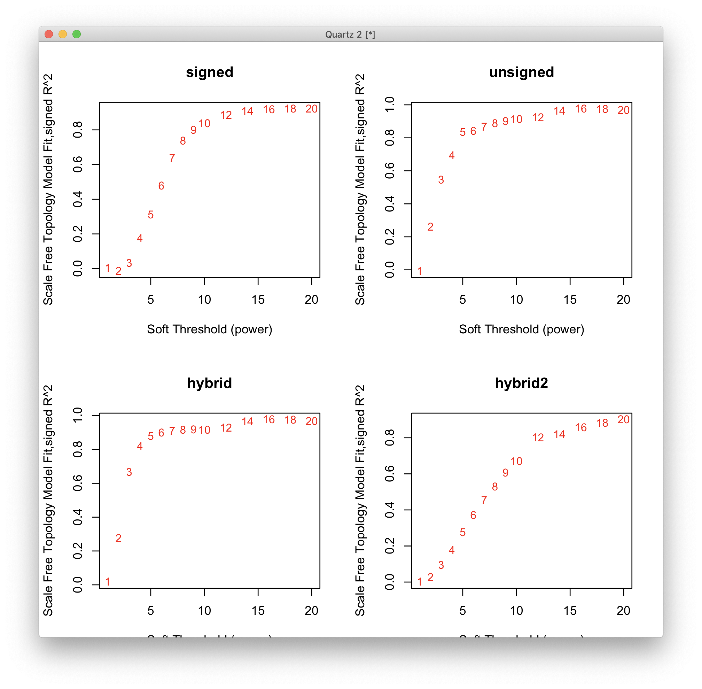
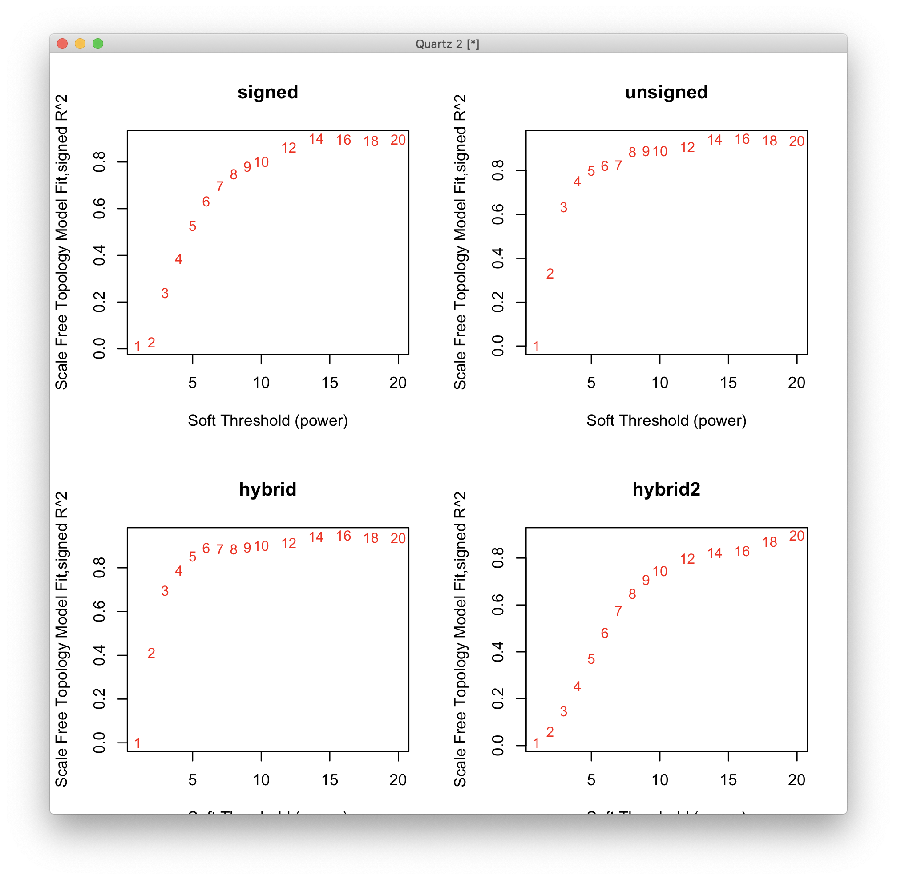
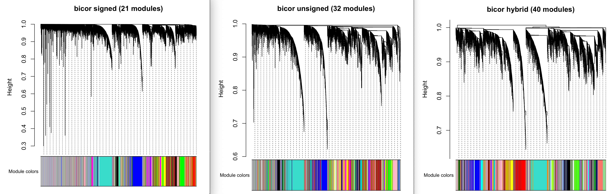
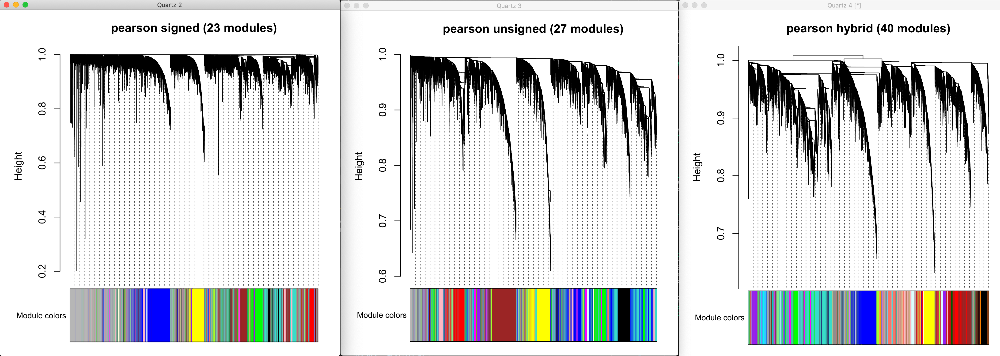
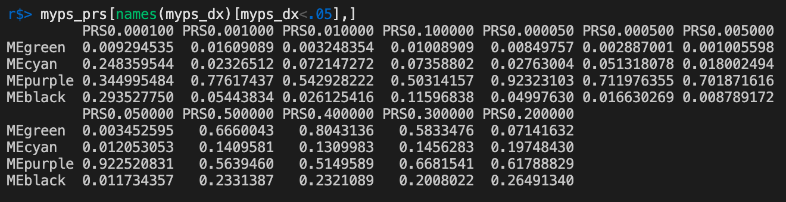
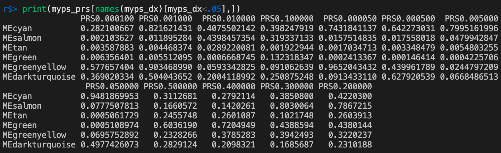
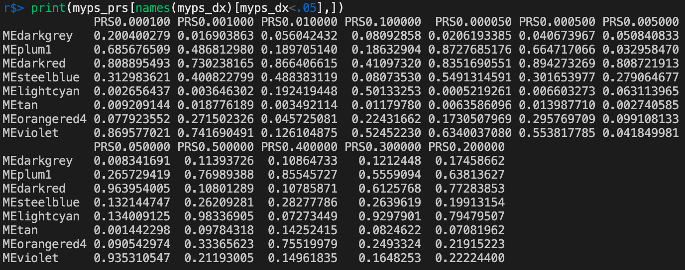
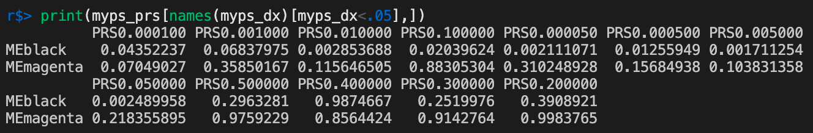
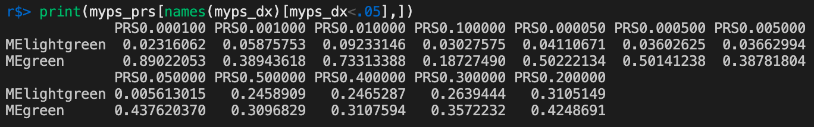
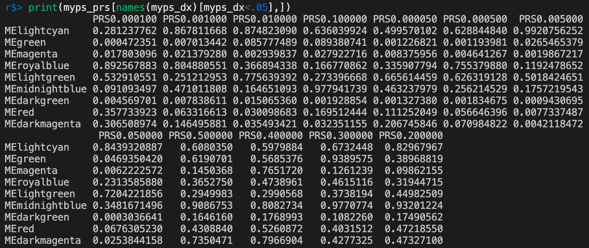

# 2020-12-28 10:23:57

Let's repeat the WGCNA results but this time evaluating how robust those
clusters actually are:

```r
myregion = 'ACC'
data = readRDS('~/data/rnaseq_derek/complete_rawCountData_05132020.rds')
rownames(data) = data$submitted_name  # just to ensure compatibility later
# remove obvious outlier (that's NOT caudate) labeled as ACC
rm_me = rownames(data) %in% c('68080')
data = data[!rm_me, ]
data = data[data$Region==myregion, ]
more = readRDS('~/data/rnaseq_derek/data_from_philip_POP_and_PCs.rds')
more = more[!duplicated(more$hbcc_brain_id),]
data = merge(data, more[, c('hbcc_brain_id', 'comorbid', 'comorbid_group',
                            'substance', 'substance_group')],
             by='hbcc_brain_id', all.x=T, all.y=F)

# at this point we have 55 samples for ACC
grex_vars = colnames(data)[grepl(colnames(data), pattern='^ENS')]
count_matrix = t(data[, grex_vars])
data = data[, !grepl(colnames(data), pattern='^ENS')]
id_num = sapply(grex_vars, function(x) strsplit(x=x, split='\\.')[[1]][1])
rownames(count_matrix) = id_num
dups = duplicated(id_num)
id_num = id_num[!dups]
count_matrix = count_matrix[!dups, ]

G_list0 = readRDS('~/data/rnaseq_derek/mart_rnaseq.rds')
G_list <- G_list0[!is.na(G_list0$hgnc_symbol),]
G_list = G_list[G_list$hgnc_symbol!='',]
G_list <- G_list[!duplicated(G_list$ensembl_gene_id),]
imnamed = rownames(count_matrix) %in% G_list$ensembl_gene_id
count_matrix = count_matrix[imnamed, ]
# we're down from 60K to 38K samples by only looking at the ones with hgnc symbol. We might be losing too much here, so it's a step to reconsider in the future

data$POP_CODE = as.character(data$POP_CODE)
data[data$POP_CODE=='WNH', 'POP_CODE'] = 'W'
data[data$POP_CODE=='WH', 'POP_CODE'] = 'W'
data$POP_CODE = factor(data$POP_CODE)
data$Individual = factor(data$hbcc_brain_id)
data[data$Manner.of.Death=='Suicide (probable)', 'Manner.of.Death'] = 'Suicide'
data[data$Manner.of.Death=='unknown', 'Manner.of.Death'] = 'natural'
data$MoD = factor(data$Manner.of.Death)
data$batch = factor(as.numeric(data$run_date))
data$Diagnosis = factor(data$Diagnosis, levels=c('Control', 'Case'))

library(caret)
pp_order = c('zv', 'nzv')
pp = preProcess(t(count_matrix), method = pp_order)
X = predict(pp, t(count_matrix))
geneCounts = t(X)
G_list2 = merge(rownames(geneCounts), G_list, by=1)
colnames(G_list2)[1] = 'ensembl_gene_id'
imautosome = which(G_list2$chromosome_name != 'X' &
                   G_list2$chromosome_name != 'Y' &
                   G_list2$chromosome_name != 'MT')
geneCounts = geneCounts[imautosome, ]
G_list2 = G_list2[imautosome, ]
library(edgeR)
isexpr <- filterByExpr(geneCounts, group=data$Diagnosis)
genes = DGEList( geneCounts[isexpr,], genes=G_list2[isexpr,] ) 
genes = calcNormFactors( genes)

library(WGCNA)
datExpr0 = t(cpm(genes, log=T))
rm_vars = data[,c('pcnt_optical_duplicates', 'clusters', 'RINe', 'batch')]
rm_vars$batch = as.numeric(rm_vars$batch)
datExpr1 = empiricalBayesLM(datExpr0, rm_vars, verbose=2) 
datExpr = datExpr1$adjustedData

nGenes = ncol(datExpr)
nSamples = nrow(datExpr)

enableWGCNAThreads()
net = blockwiseModules(datExpr, power = 6,
                       TOMType = "unsigned", minModuleSize = 30,
                       reassignThreshold = 0, mergeCutHeight = 0.25,
                       numericLabels = TRUE, pamRespectsDendro = FALSE,
                       saveTOMs = FALSE,
                       maxBlockSize=nGenes,
                       verbose = 3)
save(net, datExpr, data,
     file='~/data/WGCNA/pmACC_unsigned_pw6_mms30_mch25.RData')
```

And let's check if we're getting the same values as before:

```r
library(WGCNA)
load('~/data/WGCNA/pmACC_unsigned_pw6_mms30_mch25.RData')
moduleLabels = net$colors
moduleColors = labels2colors(net$colors)
MEs = net$MEs;
geneTree = net$dendrograms[[1]];

MEs0 = moduleEigengenes(datExpr, moduleColors)$eigengenes
MEs = orderMEs(MEs0)

keep_me = !is.na(data$C1)
mydata = cbind(MEs, data)[keep_me,]
res_MEs = MEs[keep_me,]
library(MASS)
myps = c()
for (v in colnames(MEs)) {
    fm_str = sprintf('%s ~ Diagnosis + Age + C1 + C2 + C3 + C4 + C5 + C6 + C7 + C8 + C9 +
                     C10 + MoD + substance_group + comorbid_group + POP_CODE +
                     Sex', v)
    res.lm <- lm(as.formula(fm_str), data = mydata)
    step <- stepAIC(res.lm, direction = "both", trace = F,
                    scope = list(lower = as.formula('~ Diagnosis')))
    myp = summary(step)$coefficients['DiagnosisCase', 'Pr(>|t|)']
    cat(sprintf('%s', v), 'p =', myp, '\n')
    myps = c(myps, myp)
}
names(myps) = colnames(MEs)
```

So, there's some stuff there. I'm just not sure about a few things:

What modules should we look into?

```
r$> myps[myps<.05]                                 
  MEroyalblue MElightyellow       MEblack 
  0.020849906   0.023761104   0.002744299 
```

And according to this I can just run the target data and reference data using
the same input, to calculate robustness:

https://support.bioconductor.org/p/115857/

Peter is one of the authors, so we're safe here too.

```r
multiExpr = multiData(Set1 = datExpr, Set2 = datExpr)
colorList = list(Set1 = moduleColors)
enableWGCNAThreads()
mp = modulePreservation(multiExpr, colorList, referenceNetworks=1,
                          nPermutations = 10,
                          networkType = "unsigned",
                          randomSeed = 42,
                          quickCor=0, corFnc = "cor", parallelCalculation = T,
                          verbose = 4, 
                          indent = 0)
```

So, this code works. But as Philip pointed out, the current results don't add
much. Can we get a few modules that map to different GO sets? That would
contribute a lot more to the story. Otherwise, this network analysis will likely
not go in, even if it's robust.

So, let's see what other networks we can create here:

# 2020-12-29 14:39:06

This actually might be a good idea if we can find complementary results to the
main PM results, but also if these results correlate better to PRS?

```r
powers = c(c(1:10), seq(from = 12, to=20, by=2))
sft_bs = pickSoftThreshold(datExpr, powerVector = powers, verbose = 5,
                           corFnc = 'bicor', networkType = 'signed')
sft_bu = pickSoftThreshold(datExpr, powerVector = powers, verbose = 5,
                           corFnc = 'bicor', networkType = 'unsigned')
sft_bh = pickSoftThreshold(datExpr, powerVector = powers, verbose = 5,
                           corFnc = 'bicor', networkType = 'signed hybrid')
source('~/tmp/code1.R')                               
library(doParallel)
sft_bh2 = hpickSoftThreshold(datExpr, powerVector = powers, corFnc = bicor,
                             networkType = "hybrid2", verbose = 5)
```

Let's compare some of those results:

```r
quartz()
par(mfrow = c(2,2));
cex1 = 0.9;

plot(sft_bs$fitIndices[,1], -sign(sft_bs$fitIndices[,3])*sft_bs$fitIndices[,2],
     xlab="Soft Threshold (power)",
     ylab="Scale Free Topology Model Fit,signed R^2",type="n",
    main = 'signed');
text(sft_bs$fitIndices[,1], -sign(sft_bs$fitIndices[,3])*sft_bs$fitIndices[,2],
    labels=powers,cex=cex1,col="red");

plot(sft_bu$fitIndices[,1], -sign(sft_bu$fitIndices[,3])*sft_bu$fitIndices[,2],
     xlab="Soft Threshold (power)",
     ylab="Scale Free Topology Model Fit,signed R^2",type="n",
    main = 'unsigned');
text(sft_bu$fitIndices[,1], -sign(sft_bu$fitIndices[,3])*sft_bu$fitIndices[,2],
    labels=powers,cex=cex1,col="red");

plot(sft_bh$fitIndices[,1], -sign(sft_bh$fitIndices[,3])*sft_bh$fitIndices[,2],
     xlab="Soft Threshold (power)",
     ylab="Scale Free Topology Model Fit,signed R^2",type="n",
    main = 'hybrid');
text(sft_bh$fitIndices[,1], -sign(sft_bh$fitIndices[,3])*sft_bh$fitIndices[,2],
    labels=powers,cex=cex1,col="red");

plot(sft_bh2$fitIndices[,1], -sign(sft_bh2$fitIndices[,3])*sft_bh2$fitIndices[,2],
     xlab="Soft Threshold (power)",
     ylab="Scale Free Topology Model Fit,signed R^2",type="n",
    main = 'hybrid2');
text(sft_bh2$fitIndices[,1], -sign(sft_bh2$fitIndices[,3])*sft_bh2$fitIndices[,2],
    labels=powers,cex=cex1,col="red");
```



We clearly have a lot of work to do here. Apparently different network
configurations might give different results. Let's go slowly then:

```r
nets = blockwiseModules(datExpr, power = 9, corType='bicor',
                        TOMType = "signed", minModuleSize = 30,
                        reassignThreshold = 0, mergeCutHeight = 0.25,
                        numericLabels = TRUE, pamRespectsDendro = FALSE,
                        saveTOMs = F, maxBlockSize=nGenes, verbose = 3)

netu = blockwiseModules(datExpr, power = 5, corType='bicor',
                        TOMType = "unsigned", minModuleSize = 30,
                        reassignThreshold = 0, mergeCutHeight = 0.25,
                        numericLabels = TRUE, pamRespectsDendro = FALSE,
                        saveTOMs = F, maxBlockSize=nGenes, verbose = 3)

neth = blockwiseModules(datExpr, power = 4, corType='bicor',
                        TOMType = "signed Nowick", minModuleSize = 30,
                        reassignThreshold = 0, mergeCutHeight = 0.25,
                        numericLabels = TRUE, pamRespectsDendro = FALSE,
                        saveTOMs = F, maxBlockSize=nGenes, verbose = 3)

save(nets, netu, neth, datExpr, data,
     file='~/data/WGCNA/bicor_networks.RData')
# this might take a bit longer to investigate how to run, so let's play only
# with the implemented ones...
ADJ1 = Hadjacency(datExpr=datExpr, type='hybrid2', power=12, corFnc='bicor')
dissADJ=1-ADJ1
dissTOM=TOMdist(ADJ1)
collectGarbage()
hierTOM = hclust(as.dist(dissTOM),method="average");
colorDynamicHybridTOM = labels2colors(cutreeDynamic(hierTOM, distM= dissTOM , cutHeight = 0.998,
                     deepSplit=2, pamRespectsDendro = FALSE))
```

Look here if the last method is really needed:

https://horvath.genetics.ucla.edu/html/CoexpressionNetwork/Rpackages/WGCNA/Tutorials/Consensus-NetworkConstruction-man.pdf

Let's run the same plots using Pearson correlation then:

```r
powers = c(c(1:10), seq(from = 12, to=20, by=2))
sft_ps = pickSoftThreshold(datExpr, powerVector = powers, verbose = 5,
                           corFnc = 'cor', networkType = 'signed')
sft_pu = pickSoftThreshold(datExpr, powerVector = powers, verbose = 5,
                           corFnc = 'cor', networkType = 'unsigned')
sft_ph = pickSoftThreshold(datExpr, powerVector = powers, verbose = 5,
                           corFnc = 'cor', networkType = 'signed hybrid')
source('~/tmp/code1.R')   
library(doParallel)                            
sft_ph2 = hpickSoftThreshold(datExpr, powerVector = powers, corFnc = cor,
                             networkType = "hybrid2", verbose = 5)
```

Let's compare some of those results:

```r
quartz()
par(mfrow = c(2,2));
cex1 = 0.9;

plot(sft_ps$fitIndices[,1], -sign(sft_ps$fitIndices[,3])*sft_ps$fitIndices[,2],
     xlab="Soft Threshold (power)",
     ylab="Scale Free Topology Model Fit,signed R^2",type="n",
    main = 'signed');
text(sft_ps$fitIndices[,1], -sign(sft_ps$fitIndices[,3])*sft_ps$fitIndices[,2],
    labels=powers,cex=cex1,col="red");

plot(sft_pu$fitIndices[,1], -sign(sft_pu$fitIndices[,3])*sft_pu$fitIndices[,2],
     xlab="Soft Threshold (power)",
     ylab="Scale Free Topology Model Fit,signed R^2",type="n",
    main = 'unsigned');
text(sft_pu$fitIndices[,1], -sign(sft_pu$fitIndices[,3])*sft_pu$fitIndices[,2],
    labels=powers,cex=cex1,col="red");

plot(sft_ph$fitIndices[,1], -sign(sft_ph$fitIndices[,3])*sft_ph$fitIndices[,2],
     xlab="Soft Threshold (power)",
     ylab="Scale Free Topology Model Fit,signed R^2",type="n",
    main = 'hybrid');
text(sft_ph$fitIndices[,1], -sign(sft_ph$fitIndices[,3])*sft_ph$fitIndices[,2],
    labels=powers,cex=cex1,col="red");

plot(sft_ph2$fitIndices[,1], -sign(sft_ph2$fitIndices[,3])*sft_ph2$fitIndices[,2],
     xlab="Soft Threshold (power)",
     ylab="Scale Free Topology Model Fit,signed R^2",type="n",
    main = 'hybrid2');
text(sft_ph2$fitIndices[,1], -sign(sft_ph2$fitIndices[,3])*sft_ph2$fitIndices[,2],
    labels=powers,cex=cex1,col="red");
```



There are some minor differences, but I don't think they're anything that would
impact the main results. Let's see how the actual networks turn out though.

```r
netps = blockwiseModules(datExpr, power = 9, corType='pearson',
                        TOMType = "signed", minModuleSize = 30,
                        reassignThreshold = 0, mergeCutHeight = 0.25,
                        numericLabels = TRUE, pamRespectsDendro = FALSE,
                        saveTOMs = F, maxBlockSize=nGenes, verbose = 3)

netpu = blockwiseModules(datExpr, power = 5, corType='pearson',
                        TOMType = "unsigned", minModuleSize = 30,
                        reassignThreshold = 0, mergeCutHeight = 0.25,
                        numericLabels = TRUE, pamRespectsDendro = FALSE,
                        saveTOMs = F, maxBlockSize=nGenes, verbose = 3)

netph = blockwiseModules(datExpr, power = 4, corType='pearson',
                        TOMType = "signed Nowick", minModuleSize = 30,
                        reassignThreshold = 0, mergeCutHeight = 0.25,
                        numericLabels = TRUE, pamRespectsDendro = FALSE,
                        saveTOMs = F, maxBlockSize=nGenes, verbose = 3)
```

Let's see how many modules each method found, and the dendograms:

```r
plot_dendo = function(consMEs, moduleLabels, consTree, t_str) {
    moduleColors = labels2colors(moduleLabels)
    quartz()
    plotDendroAndColors(consTree, moduleColors,
                        "Module colors",
                        dendroLabels = FALSE, hang = 0.03,
                        addGuide = TRUE, guideHang = 0.05,
                        main = sprintf('%s (%d modules)', t_str,
                                       length(unique(moduleLabels))))
}

plot_dendo(nets$multiMEs, nets$colors, nets$dendrograms[[1]],
            'bicor signed')
plot_dendo(netu$multiMEs, netu$colors, netu$dendrograms[[1]],
            'bicor unsigned')
plot_dendo(neth$multiMEs, neth$colors, neth$dendrograms[[1]],
            'bicor hybrid')
```



OK, so we have some sensible looking modules. Do any of them related to
Diagnosis?

```r
library(MASS)
test_network = function(net, datExpr, data) {
    moduleLabels = net$colors
    moduleColors = labels2colors(net$colors)

    MEs0 = moduleEigengenes(datExpr, moduleColors)$eigengenes
    MEs = orderMEs(MEs0)

    keep_me = !is.na(data$C1)
    mydata = cbind(MEs, data)[keep_me,]
    res_MEs = MEs[keep_me,]

    myps = c()
    for (v in colnames(MEs)) {
        fm_str = sprintf('%s ~ Diagnosis + Age + C1 + C2 + C3 + C4 + C5 + MoD + substance_group + comorbid_group + POP_CODE +
                        Sex', v)
        res.lm <- lm(as.formula(fm_str), data = mydata)
        step <- stepAIC(res.lm, direction = "both", trace = F,
                        scope = list(lower = as.formula('~ Diagnosis')))
        myp = summary(step)$coefficients['DiagnosisCase', 'Pr(>|t|)']
        # cat(sprintf('%s', v), 'p =', myp, '\n')
        myps = c(myps, myp)
    }
    names(myps) = colnames(MEs)
    return(myps)
}
myps = test_network(nets, datExpr, data)
print(myps[myps<.05])
myps = test_network(netu, datExpr, data)
print(myps[myps<.05])
myps = test_network(neth, datExpr, data)
print(myps[myps<.05])
```

```
r$> myps = test_network(nets, datExpr, data)                                                            

r$> print(myps[myps<.05])                                                                               
   MEgreen     MEcyan   MEpurple    MEblack 
0.01294846 0.04933322 0.03069839 0.02049723 

r$> myps = test_network(netu, datExpr, data)                                                            

r$> print(myps[myps<.05])                                                                               
         MEcyan        MEsalmon           MEtan         MEgreen   MEgreenyellow MEdarkturquoise 
    0.006688690     0.022805288     0.024347245     0.029962506     0.005653356     0.045000607 

r$> myps = test_network(neth, datExpr, data)                                                            

r$> print(myps[myps<.05])                                                                               
  MEdarkgrey      MEplum1    MEdarkred  MEsteelblue  MElightcyan        MEtan MEorangered4     MEviolet 
 0.045479132  0.003717134  0.025081553  0.004669829  0.017769053  0.016028208  0.018631847  0.037184452 
```

For completeness, here are the same plots and results for the Pearson networks:



```
r$> myps = test_network(netps, datExpr, data)                                                           

r$> print(myps[myps<.05])                                                                               
    MEblack   MEmagenta 
0.006549514 0.004716908 

r$> myps = test_network(netpu, datExpr, data)                                                           

r$> print(myps[myps<.05])                                                                               
MElightgreen      MEgreen 
 0.007919262  0.046446573 

r$> myps = test_network(netph, datExpr, data)                                                           

r$> print(myps[myps<.05])                                                                               
   MElightcyan        MEgreen      MEmagenta    MEroyalblue   MElightgreen MEmidnightblue 
   0.005697386    0.047098583    0.017611509    0.043009596    0.047101048    0.013534146 
   MEdarkgreen          MEred  MEdarkmagenta 
   0.015583847    0.048103504    0.006810022 
```

So, we have several options here. The main question is where these modules map
to, and whether they're stable. I can at least leave running WG for all of the
significant ones, and check their robustness later:

```r
library(WebGestaltR)

ncpu=7
data_dir = '~/data/WGCNA/'
region = 'acc'
# for (n in c('nets', 'netu', 'neth')) {
for (n in c('netps', 'netpu', 'netph')) {
    eval(parse(text=sprintf('myps = test_network(%s, datExpr, data)', n)))
    eval(parse(text=sprintf('moduleLabels = %s$colors', n)))
    moduleColors = labels2colors(moduleLabels)
    good_modules = names(myps)[myps<.05] 
    for (col2 in good_modules) {
        col = gsub(x=col2, pattern='^ME', replacement='')
        mygenes = names(moduleLabels)[moduleColors==col]
        tmp2 = G_list[G_list$ensembl_gene_id %in% mygenes, 'hgnc_symbol']

        # my own GMTs
        db = sprintf('my_%s_sets', region)
        cat(region, db, n, col, '\n')
        project_name = sprintf('%s_%s_%s_%s', region, n, col, db)
        db_file = sprintf('~/data/post_mortem/%s.gmt', db)
        enrichResult <- try(WebGestaltR(enrichMethod="ORA",
                                    organism="hsapiens",
                                    enrichDatabaseFile=db_file,
                                    enrichDatabaseType="genesymbol",
                                    interestGene=tmp2,
                                    outputDirectory = data_dir,
                                    interestGeneType="genesymbol",
                                    referenceSet='genome',
                                    sigMethod="top", topThr=150000,
                                    minNum=3, projectName=project_name,
                                    isOutput=T, isParallel=T,
                                    nThreads=ncpu, perNum=10000, maxNum=900))
        if (class(enrichResult) != "try-error") {
            out_fname = sprintf('%s/WG3_%s_%s_%s_%s_10K.csv', data_dir, region, db,
                                n, col)
            write.csv(enrichResult, file=out_fname, row.names=F)
        }

        DBs = c('geneontology_Biological_Process_noRedundant',
                'geneontology_Cellular_Component_noRedundant',
                'geneontology_Molecular_Function_noRedundant')
        for (db in DBs) {
            cat(region, db, n, col, '\n')
            project_name = sprintf('%s_%s_%s_%s', region, n, col, db)
            db_file = sprintf('~/data/post_mortem/%s.gmt', db)
            enrichResult <- try(WebGestaltR(enrichMethod="ORA",
                                        organism="hsapiens",
                                        enrichDatabase=db,
                                        enrichDatabaseType="genesymbol",
                                        interestGene=tmp2,
                                        outputDirectory = data_dir,
                                        interestGeneType="genesymbol",
                                        referenceSet='genome',
                                        sigMethod="top", topThr=150000,
                                        minNum=3, projectName=project_name,
                                        isOutput=T, isParallel=T,
                                        nThreads=ncpu, perNum=10000, maxNum=900))
            if (class(enrichResult) != "try-error") {
                out_fname = sprintf('%s/WG3_%s_%s_%s_%s_10K.csv', data_dir, region,
                                    db, n, col)
                write.csv(enrichResult, file=out_fname, row.names=F)
            }
        }
    }
}
```

# 2020-12-30 09:29:07

Before I spend too much time looking into the WG results and robustness, what's
the association of these modules and PRS?

```r
fname = '~/data/post_mortem/genotyping/1KG/merged_PM_1KG_PRS_12032020.csv'
prs = read.csv(fname)
prs$hbcc_brain_id = sapply(prs$IID,
                          function(x) {
                              br = strsplit(x, '_')[[1]][2];
                              as.numeric(gsub(br, pattern='BR',
                                              replacement=''))})
imWNH = data$C1 > 0 & data$C2 < -.075
wnh_brains = data[which(imWNH),]$hbcc_brain_id

# using the most appropriate PRS, make sure we don't switch subject order
m = merge(data, prs, by='hbcc_brain_id', sort=F)
prs_names = sapply(c(.0001, .001, .01, .1, .00005, .0005, .005, .05,
                      .5, .4, .3, .2),
                   function(x) sprintf('PRS%f', x))
m[, prs_names] = NA
keep_me = m$hbcc_brain_id %in% wnh_brains
m[keep_me, prs_names] = m[keep_me, 64:75]
m[!keep_me, prs_names] = m[!keep_me, 52:63]
data.prs = m[, c(1:51, 76:87)]

library(MASS)
test_network_prs = function(net, datExpr, data) {
    moduleLabels = net$colors
    moduleColors = labels2colors(moduleLabels)
    
    MEs0 = moduleEigengenes(datExpr, moduleColors)$eigengenes
    MEs = orderMEs(MEs0)

    mydata = cbind(MEs, data)

    prs_names = sapply(c(.0001, .001, .01, .1, .00005, .0005, .005, .05,
                      .5, .4, .3, .2),
                   function(x) sprintf('PRS%f', x))
    myps = matrix(nrow=length(colnames(MEs)), ncol=length(prs_names),
                  dimnames=list(colnames(MEs), prs_names))
    for (iv in 1:length(colnames(MEs))) {
        v = colnames(MEs)[iv]
        for (ip in 1:length(prs_names)) {
            p = prs_names[ip]
            fm_str = sprintf('%s ~ %s + Age + C1 + C2 + C3 + C4 + C5 + MoD + substance_group + comorbid_group + POP_CODE +
                        Sex', v, p)
            res.lm <- lm(as.formula(fm_str), data = mydata)
            keep_str = sprintf('~ %s', p)
            step <- stepAIC(res.lm, direction = "both", trace = F,
                            scope = list(lower = as.formula(keep_str)))
            myp = summary(step)$coefficients[p, 'Pr(>|t|)']
            myps[iv, ip] = myp
        }
    }
    return(myps)
}
keep_me = !is.na(data$C1)
myps_dx = test_network(nets, datExpr, data)
myps_prs = test_network_prs(nets, datExpr[keep_me,], data.prs)
print(myps_prs[names(myps_dx)[myps_dx<.05],])

myps_dx = test_network(netu, datExpr, data)
myps_prs = test_network_prs(netu, datExpr[keep_me,], data.prs)
print(myps_prs[names(myps_dx)[myps_dx<.05],])

myps_dx = test_network(neth, datExpr, data)
myps_prs = test_network_prs(neth, datExpr[keep_me,], data.prs)
print(myps_prs[names(myps_dx)[myps_dx<.05],])
```

Here I'm only showing the modules that were significant for DX as well.







Overall the pattern is similar to what we saw for the straight-up PM results,
with the highest PRS profiles not doing so great. Does it change for the Pearson
modules?







Results are somewhat similar, but we might be able to extend up to .1? 

Let me try a stepwise regression for DX ~ PRS to see if that makes a difference.
The lrtest only works if we have similar terms, so let's decide on the best
model with PRS and then remove it for baseline.

```r
mydata = data.prs

library(fmsb)
library(lmtest)
prs_names = sapply(sort(c(.0001, .001, .01, .1, .00005, .0005, .005, .05,
                      .5, .4, .3, .2)),
                   function(x) sprintf('PRS%f', x))
for (prs in prs_names) {
    fm_root = 'Diagnosis ~ %s Sex + Age + C1 + C2 + C3 + C4 + C5'
    fm_str = sprintf(fm_root, sprintf('%s +', prs))
    mod.full = glm(as.formula(fm_str), family=binomial, data=mydata)
    keep_str = sprintf('~ %s', prs)
    step.full <- stepAIC(mod.full, direction = "both", trace = F,
                         scope = list(lower = as.formula(keep_str)))
    myterms = attr(step.full$terms, 'term.labels')
    right_hand = paste(myterms[2:length(myterms)], collapse = ' + ')
    fm_str = sprintf('Diagnosis ~ %s', right_hand)
    mod.baseline = glm(as.formula(fm_str), family=binomial, data=mydata)
    adjustedR2 = NagelkerkeR2(step.full)$R2 - NagelkerkeR2(mod.baseline)$R2
    prs.significance = lrtest(mod.baseline, step.full)
    myp = prs.significance$"Pr(>Chisq)"[2] 
    cat(sprintf('%s: pval = %.3f, R2=%.3f\n', prs, myp, adjustedR2))
}
```

```
PRS0.000050: pval = 0.412, R2=0.012
PRS0.000100: pval = 0.676, R2=0.003
PRS0.000500: pval = 0.531, R2=0.007
PRS0.001000: pval = 0.479, R2=0.009
PRS0.005000: pval = 0.014, R2=0.099
PRS0.010000: pval = 0.178, R2=0.032
PRS0.050000: pval = 0.425, R2=0.012
PRS0.100000: pval = 0.068, R2=0.059
PRS0.200000: pval = 0.081, R2=0.054
PRS0.300000: pval = 0.037, R2=0.077
PRS0.400000: pval = 0.008, R2=0.122
PRS0.500000: pval = 0.003, R2=0.148
```

Didn't change much from the previous results... at least we have several modules
significant at .005. Let's play a bit with the idea of module membership as a
rank:

```r
library(WebGestaltR)

ncpu=7
data_dir = '~/data/WGCNA/'
region = 'acc'
for (n in c('nets', 'netu', 'neth')) {
# for (n in c('netps', 'netpu', 'netph')) {
    eval(parse(text=sprintf('myps = test_network(%s, datExpr, data)', n)))
    eval(parse(text=sprintf('moduleLabels = %s$colors', n)))
    moduleColors = labels2colors(moduleLabels)
    MEs0 = moduleEigengenes(datExpr, moduleColors)$eigengenes
    MEs = orderMEs(MEs0)
    geneModuleMembership = as.data.frame(cor(datExpr, MEs, use = "p"))
    good_modules = names(myps)[myps<.05] 
    for (col in good_modules) {
        ranks = geneModuleMembership[, col]
        tmp2 = data.frame(hgnc_symbol=genes$genes$hgnc_symbol, rank=ranks)
        tmp2 = tmp2[order(ranks, decreasing=T),]

        # my own GMTs
        db = sprintf('my_%s_sets', region)
        cat(region, db, n, col, '\n')
        project_name = sprintf('%s_%s_%s_%s', region, n, col, db)
        db_file = sprintf('~/data/post_mortem/%s.gmt', db)
        enrichResult <- try(WebGestaltR(enrichMethod="GSEA",
                            organism="hsapiens",
                            enrichDatabaseFile=db_file,
                            enrichDatabaseType="genesymbol",
                            interestGene=tmp2,
                            outputDirectory = data_dir,
                            interestGeneType="genesymbol",
                            sigMethod="top", topThr=150000,
                            minNum=3, projectName=project_name,
                            isOutput=T, isParallel=T,
                            nThreads=ncpu, perNum=10000, maxNum=800))
        if (class(enrichResult) != "try-error") {
            out_fname = sprintf('%s/WG3_%s_%s_%s_%s_10K.csv', data_dir, region, db,
                                n, col)
            write.csv(enrichResult, file=out_fname, row.names=F)
        }

        DBs = c('geneontology_Biological_Process_noRedundant',
                'geneontology_Cellular_Component_noRedundant',
                'geneontology_Molecular_Function_noRedundant')
        for (db in DBs) {
            cat(region, db, n, col, '\n')
            project_name = sprintf('%s_%s_%s_%s', region, n, col, db)
            db_file = sprintf('~/data/post_mortem/%s.gmt', db)
            enrichResult <- try(WebGestaltR(enrichMethod="GSEA",
                                organism="hsapiens",
                                enrichDatabase=db,
                                interestGene=tmp2,
                                interestGeneType="genesymbol",
                                sigMethod="top", topThr=150000,
                                outputDirectory = data_dir,
                                minNum=5, projectName=project_name,
                                isOutput=T, isParallel=T,
                                nThreads=ncpu, perNum=10000, maxNum=800))
            if (class(enrichResult) != "try-error") {
                out_fname = sprintf('%s/WG3_%s_%s_%s_%s_10K.csv', data_dir, region,
                                    db, n, col)
                write.csv(enrichResult, file=out_fname, row.names=F)
            }
        }
    }
}
```

Now, we have a shit-ton of results. Let's start by compiling everything into a
big spreadsheet. Note that the ORA results are net_color names, and the GSEA
results are net_MEcolor.

```r
load('~/data/WGCNA/bicor_networks.RData')
load('~/data/WGCNA/pearson_networks.RData')
data_dir = '~/data/WGCNA/'
library(WGCNA)
all_res = c()
for (n in c('nets', 'netu', 'neth', 'netps', 'netpu', 'netph')) {
    eval(parse(text=sprintf('myps = test_network(%s, datExpr, data)', n)))
    good_modules = names(myps)[myps<.05] 
    for (col in good_modules) {
        ora_col = substring(col, 3)
        DBs = c('geneontology_Biological_Process_noRedundant',
                'geneontology_Cellular_Component_noRedundant',
                'geneontology_Molecular_Function_noRedundant')
        for (db in DBs) {
            mydir = sprintf('%s/Project_acc_%s_%s_%s', data_dir, n, ora_col, db)
            fname = sprintf('%s/enrichment_results_acc_%s_%s_%s.txt', mydir, n,
                            ora_col, db)
            if (file.exists(fname)) {
                df = read.delim(fname)
                res = df[df$FDR<.05,]
                res$net = n
                res$col = ora_col
                res$db = db
                all_res = rbind(all_res, res)
            }
        }
        db = 'my_acc_sets'
        mydir = sprintf('%s/Project_acc_%s_%s_%s', data_dir, n, ora_col, db)
        fname = sprintf('%s/enrichment_results_acc_%s_%s_%s.txt', mydir, n,
                        ora_col, db)
        if (file.exists(fname)) {
            df = read.delim(fname)
            res = df[df$pValue<.05,]
            res$net = n
            res$description = res$link
            res$col = ora_col
            res$db = db
            all_res = rbind(all_res, res)
        }
    }
}
out_fname
```

# TODO
 * how stable are these networks? (http://pages.stat.wisc.edu/~yandell/statgen/ucla/WGCNA/wgcna.html)
 * check FDR after stability analysis
 * use signed networks? (that's what Science paper did, and removed all      covariates first too)
 * use robustness (bicor)
 * try csuWGCNA (https://github.com/RujiaDai/csuWGCNA, like in Science paper)
 * is bicor the best thing to use here?
 * recutBlockwiseTrees?
 * how about ranking the genes based on some sort of module membership value?