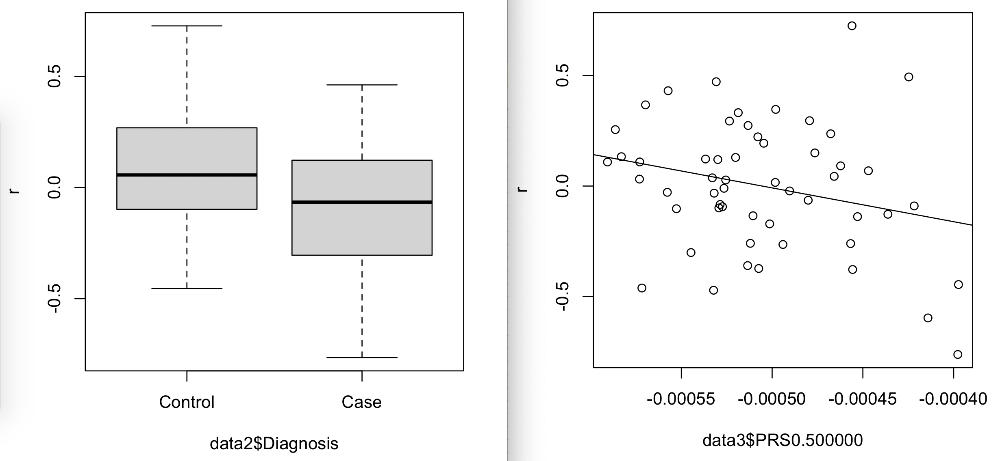
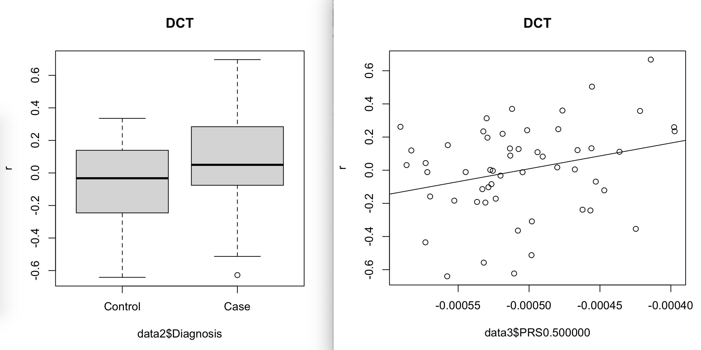
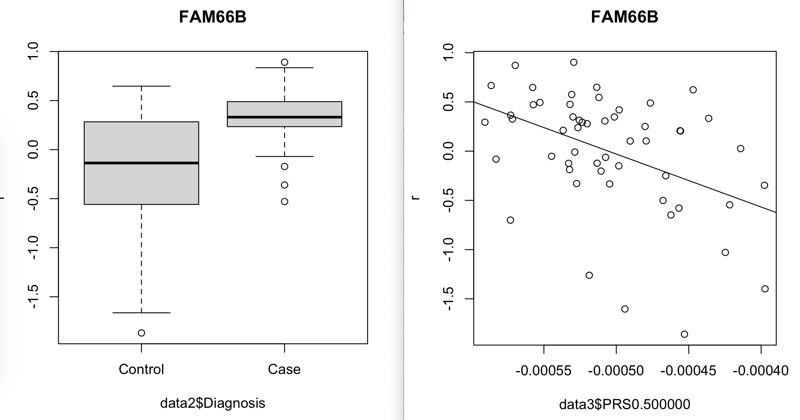
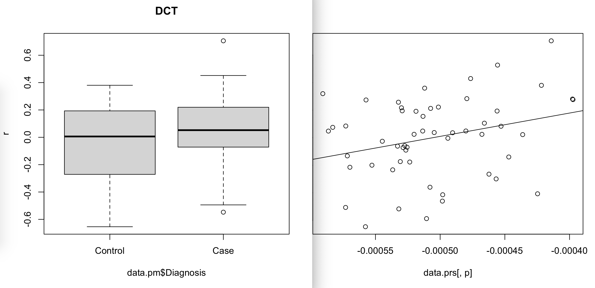
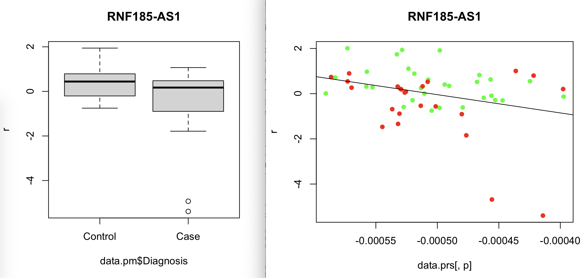
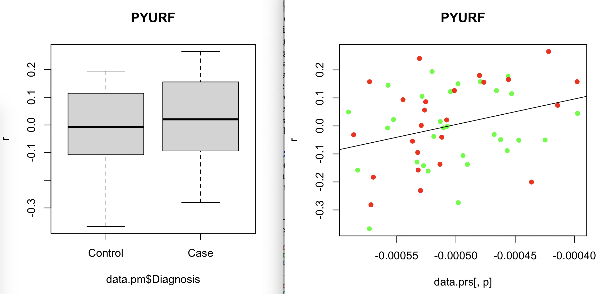
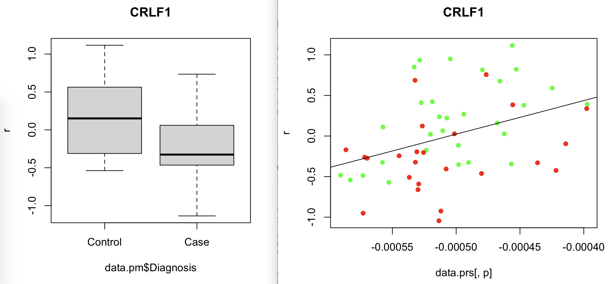

# 2020-12-29 10:55:09

A gene that works, FJX1:



And another one:



some code:

```r
r$> r = residuals(lm(vobj.pm$E[i,] ~ PC1 + PC2 + PC7 + PC8 + PC9, data=data2))                          

r$> boxplot(r $ data2$Diagnosis)                                                                        
Error in r$data2 : $ operator is invalid for atomic vectors

r$> boxplot(r ~ data2$Diagnosis)                                                                        

r$> boxplot(r ~ data2$Diagnosis, main='DCT')                                                            

r$> boxplot(r ~ data2$Diagnosis, main='DCT')                                                            

r$> quartz()                                                                                            

r$> r = residuals(lm(vobj.prs$E[i,] ~ PC1 + PC2 + PC7 + PC8 + PC9, data=data3))                         

r$> plot(r ~ data3$PRS0.500000)                                                                         

r$> abline(lm(r ~ data3$PRS0.500000))                                                                   

r$> plot(r ~ data3$PRS0.500000, main='DCT')                                                             

r$> abline(lm(r ~ data3$PRS0.500000))       
```

Now, one that doesn't work:



So, it's clear in the data. But it looks like there is some sort of
misalignment, or maybe I shouldn't include PRS or Diagnosis in voom? 

Let's check the alignment first. I think that's it, because when I create the
data matrix through merging it's resorting my samples?

```r
myregion = 'ACC'
data = readRDS('~/data/rnaseq_derek/complete_rawCountData_05132020.rds')
rownames(data) = data$submitted_name  # just to ensure compatibility later
# remove obvious outlier (that's NOT caudate) labeled as ACC
rm_me = rownames(data) %in% c('68080')
data = data[!rm_me, ]
data = data[data$Region==myregion, ]
more = readRDS('~/data/rnaseq_derek/data_from_philip_POP_and_PCs.rds')
more = more[!duplicated(more$hbcc_brain_id),]
data = merge(data, more[, c('hbcc_brain_id', 'comorbid', 'comorbid_group',
                            'substance', 'substance_group')],
             by='hbcc_brain_id', all.x=T, all.y=F)

# at this point we have 55 samples for ACC
grex_vars = colnames(data)[grepl(colnames(data), pattern='^ENS')]
count_matrix = t(data[, grex_vars])
data = data[, !grepl(colnames(data), pattern='^ENS')]
id_num = sapply(grex_vars, function(x) strsplit(x=x, split='\\.')[[1]][1])
rownames(count_matrix) = id_num
dups = duplicated(id_num)
id_num = id_num[!dups]
count_matrix = count_matrix[!dups, ]

G_list0 = readRDS('~/data/rnaseq_derek/mart_rnaseq.rds')
G_list <- G_list0[!is.na(G_list0$hgnc_symbol),]
G_list = G_list[G_list$hgnc_symbol!='',]
G_list <- G_list[!duplicated(G_list$ensembl_gene_id),]
imnamed = rownames(count_matrix) %in% G_list$ensembl_gene_id
count_matrix = count_matrix[imnamed, ]
# we're down from 60K to 38K samples by only looking at the ones with hgnc symbol. We might be losing too much here, so it's a step to reconsider in the future

data$POP_CODE = as.character(data$POP_CODE)
data[data$POP_CODE=='WNH', 'POP_CODE'] = 'W'
data[data$POP_CODE=='WH', 'POP_CODE'] = 'W'
data$POP_CODE = factor(data$POP_CODE)
data$Individual = factor(data$hbcc_brain_id)
data[data$Manner.of.Death=='Suicide (probable)', 'Manner.of.Death'] = 'Suicide'
data[data$Manner.of.Death=='unknown', 'Manner.of.Death'] = 'natural'
data$MoD = factor(data$Manner.of.Death)
data$batch = factor(as.numeric(data$run_date))
data$Diagnosis = factor(data$Diagnosis, levels=c('Control', 'Case'))

library(caret)
pp_order = c('zv', 'nzv')
pp = preProcess(t(count_matrix), method = pp_order)
X = predict(pp, t(count_matrix))
geneCounts = t(X)
G_list2 = merge(rownames(geneCounts), G_list, by=1)
colnames(G_list2)[1] = 'ensembl_gene_id'
imautosome = which(G_list2$chromosome_name != 'X' &
                   G_list2$chromosome_name != 'Y' &
                   G_list2$chromosome_name != 'MT')
geneCounts = geneCounts[imautosome, ]
G_list2 = G_list2[imautosome, ]
library(edgeR)
isexpr <- filterByExpr(geneCounts, group=data$Diagnosis)
genes = DGEList( geneCounts[isexpr,], genes=G_list2[isexpr,] ) 
genes.pm = calcNormFactors( genes)

lcpm = cpm(genes, log=T)
set.seed(42)
lcpm.pca <- prcomp(t(lcpm), scale=TRUE)

library(nFactors)
eigs <- lcpm.pca$sdev^2
nS = nScree(x=eigs)
keep_me = 1:nS$Components$nkaiser
mydata = data.frame(lcpm.pca$x[, keep_me])
data.pm = cbind(data, mydata)
rownames(data.pm) = data$hbcc_brain_id

# Grabbing PRS
fname = '~/data/post_mortem/genotyping/1KG/merged_PM_1KG_PRS_12032020.csv'
prs = read.csv(fname)
prs$hbcc_brain_id = sapply(prs$IID,
                          function(x) {
                              br = strsplit(x, '_')[[1]][2];
                              as.numeric(gsub(br, pattern='BR',
                                              replacement=''))})
imWNH = data$C1 > 0 & data$C2 < -.075
wnh_brains = data[which(imWNH),]$hbcc_brain_id

# using the most appropriate PRS, make sure we don't switch subject order
m = merge(data.pm, prs, by='hbcc_brain_id', sort=F)
prs_names = sapply(c(.0001, .001, .01, .1, .00005, .0005, .005, .05,
                      .5, .4, .3, .2),
                   function(x) sprintf('PRS%f', x))
m[, prs_names] = NA
keep_me = m$hbcc_brain_id %in% wnh_brains
m[keep_me, prs_names] = m[keep_me, 75:86]
m[!keep_me, prs_names] = m[!keep_me, 63:74]
data.prs = m[, c(1:61, 87:98)]

# assumes data.pm and data.prs are in the same order!
genes2 = genes[, data.pm$hbcc_brain_id %in% data.prs$hbcc_brain_id]
```

Let's now redo some of those plots:

```r
p = "PRS0.500000"
form = as.formula(sprintf('~ %s + PC1 + PC2 + PC7 + PC8 + PC9', p))
design = model.matrix( form, data.prs)
vobj.prs = voom( genes2, design, plot=FALSE)
    
form = as.formula('~ Diagnosis + PC1 + PC2 + PC7 + PC8 + PC9')
design = model.matrix( form, data.pm)
vobj.pm = voom( genes, design, plot=FALSE)

g = 'DCT'
i = which(genes$genes$hgnc_symbol==g)
r = residuals(lm(vobj.pm$E[i,] ~ PC1 + PC2 + PC7 + PC8 + PC9, data=data.pm))
boxplot(r ~ data.pm$Diagnosis, main=g)                                                 
quartz()
r = residuals(lm(vobj.prs$E[i,] ~ PC1 + PC2 + PC7 + PC8 + PC9, data=data.prs))
plot(r ~ data.prs[, p], main=g)
abline(lm(r ~ data.prs[, p])
```



This makes a lot more sense. Let's then re-run the overlaps:

```r
library(GeneOverlap)
load('~/data/rnaseq_derek/rnaseq_results_11122020.rData')

prs_names = sapply(c(.0001, .001, .01, .1, .00005, .0005, .005, .05,
                      .5, .4, .3, .2),
                   function(x) sprintf('PRS%f', x))
all_res = c()
for (p in prs_names) {
    cat(p, '\n')
    form = as.formula(sprintf('~ %s + PC1 + PC2 + PC7 + PC8 + PC9', p))
    design = model.matrix( form, data.prs)
    vobj = voom( genes2, design, plot=FALSE)
    prs.fit <- lmFit(vobj, design)
    prs.fit2 <- eBayes( prs.fit )
    res = topTable(prs.fit2, coef=p, number=Inf)

    for (t in c(.05, .01, .005, .001)) {
        prs_genes = res[res$P.Value < t & res$t > 0, 'hgnc_symbol']
        dx_genes = rnaseq_acc[rnaseq_acc$P.Value < t & rnaseq_acc$t > 0,
                              'hgnc_symbol']
        go.obj <- newGeneOverlap(prs_genes, dx_genes, genome.size=nrow(res))
        go.obj <- testGeneOverlap(go.obj)
        inter = intersect(prs_genes, dx_genes)
        pval1 = getPval(go.obj)
        allUp = union(res[res$t > 0, 'hgnc_symbol'],
                      rnaseq_acc[rnaseq_acc$t > 0, 'hgnc_symbol'])
        go.obj <- newGeneOverlap(prs_genes, dx_genes, genome.size=length(allUp))
        go.obj <- testGeneOverlap(go.obj)
        pval2 = getPval(go.obj)
        this_res = c(p, t, 'up', length(prs_genes), length(dx_genes), length(inter),
                     pval1, pval2)
        all_res = rbind(all_res, this_res)
    }
    for (t in c(.05, .01, .005, .001)) {
        prs_genes = res[res$P.Value < t & res$t < 0, 'hgnc_symbol']
        dx_genes = rnaseq_acc[rnaseq_acc$P.Value < t & rnaseq_acc$t < 0,
                              'hgnc_symbol']
        go.obj <- newGeneOverlap(prs_genes, dx_genes, genome.size=nrow(res))
        go.obj <- testGeneOverlap(go.obj)
        inter = intersect(prs_genes, dx_genes)
        pval1 = getPval(go.obj)
        allDown = union(res[res$t < 0, 'hgnc_symbol'],
                      rnaseq_acc[rnaseq_acc$t < 0, 'hgnc_symbol'])
        go.obj <- newGeneOverlap(prs_genes, dx_genes, genome.size=length(allDown))
        go.obj <- testGeneOverlap(go.obj)
        pval2 = getPval(go.obj)
        this_res = c(p, t, 'down', length(prs_genes), length(dx_genes), length(inter),
                     pval1, pval2)
        all_res = rbind(all_res, this_res)
    }
    for (t in c(.05, .01, .005, .001)) {
        prs_genes = res[res$P.Value < t, 'hgnc_symbol']
        dx_genes = rnaseq_acc[rnaseq_acc$P.Value < t, 'hgnc_symbol']
        go.obj <- newGeneOverlap(prs_genes, dx_genes, genome.size=nrow(res))
        go.obj <- testGeneOverlap(go.obj)
        inter = intersect(prs_genes, dx_genes)
        pval1 = getPval(go.obj)
        pval2 = NA
        this_res = c(p, t, 'abs', length(prs_genes), length(dx_genes), length(inter),
                     pval1, pval2)
        all_res = rbind(all_res, this_res)
    }
}
colnames(all_res) = c('PRS', 'nomPvalThresh', 'direction', 'PRsgenes', 'PMgenes',
                      'overlap', 'pvalWhole', 'pvalDirOnly')
out_fname = '~/data/post_mortem/all_accUpDown_prs_overlap_results_12292020.csv'
write.csv(all_res, file=out_fname, row.names=F)
```

Numbers look a bit better now, but there's still a big drop when evaluating
PRS0.5. Let's plot one of the genes that looks bad there:

```r
p = 'PRS0.500000'
form = as.formula(sprintf('~ %s + PC1 + PC2 + PC7 + PC8 + PC9', p))
design = model.matrix( form, data.prs)
vobj = voom( genes2, design, plot=FALSE)
prs.fit <- lmFit(vobj, design)
prs.fit2 <- eBayes( prs.fit )
res = topTable(prs.fit2, coef=p, number=Inf)

m = merge(res, rnaseq_acc, by=0, suffixes = c('.prs', '.pm'))
write.csv(m, row.names=F, file='~/tmp/new_prs.csv')

form = as.formula(sprintf('~ %s + PC1 + PC2 + PC7 + PC8 + PC9', p))
design = model.matrix( form, data.prs)
vobj.prs = voom( genes2, design, plot=FALSE)
    
form = as.formula('~ Diagnosis + PC1 + PC2 + PC7 + PC8 + PC9')
design = model.matrix( form, data.pm)
vobj.pm = voom( genes, design, plot=FALSE)

g = 'RNF185-AS1'
i = which(genes$genes$hgnc_symbol==g)
r = residuals(lm(vobj.pm$E[i,] ~ PC1 + PC2 + PC7 + PC8 + PC9, data=data.pm))
boxplot(r ~ data.pm$Diagnosis, main=g)                                                 
quartz()
r = residuals(lm(vobj.prs$E[i,] ~ PC1 + PC2 + PC7 + PC8 + PC9, data=data.prs))
idx = data.prs$Diagnosis=='Case'
plot(r ~ data.prs[, p], main=g, pch=16, col='green')
points(r[idx] ~ data.prs[idx, p], pch=16, col='red')
abline(lm(r ~ data.prs[, p]))
```



This is an example that works, even though it might be somewhat corrupted by
outliers. 



Another example that works, now in a different direction.



This is one of the fails, and it's clearly inverted. But the thing is that
there's no real relationship between PRS and the gene.

# 2020-12-31 12:15:22

If we look at the higher PRSs, such as .5, the overlap is still not good, but if
we look at the more stringent ones (e.g. .00005), they are highly significant.
And that makes sense, as more stringent PRS means we're more likely to be
working with genes that have the expected PRS pattern (higher PRS for cases than
controls), which would match what we get in the DGE for CaseVScontrols. 

The plots above use PRS0.5, for
two genes that match direction (top), and one that doesn't match (bottom). The
important thing in those plots is the placement of red and green dots with
respect to PRS (X axis in the scatterplot). In the ideal world, we'd expect red
points to the right and green points to the left. And by using more stringent
PRS cutoffs I think we're zooming in on those "ideal" genes, and this way
increasing the overlap.

Let me run these results for Caudate too, and then I can figure out the best way
to summarize them for the paper:

```r
library(GeneOverlap)
load('~/data/rnaseq_derek/rnaseq_results_11122020.rData')

prs_names = sapply(c(.0001, .001, .01, .1, .00005, .0005, .005, .05,
                      .5, .4, .3, .2),
                   function(x) sprintf('PRS%f', x))
all_res = c()
for (p in prs_names) {
    cat(p, '\n')
    form = as.formula(sprintf('~ %s + PC1 + PC3 + PC5 + PC6 + PC8', p))
    design = model.matrix( form, data.prs)
    vobj = voom( genes2, design, plot=FALSE)
    prs.fit <- lmFit(vobj, design)
    prs.fit2 <- eBayes( prs.fit )
    res = topTable(prs.fit2, coef=p, number=Inf)

    for (t in c(.05, .01, .005, .001)) {
        prs_genes = res[res$P.Value < t & res$t > 0, 'hgnc_symbol']
        dx_genes = rnaseq_caudate[rnaseq_caudate$P.Value < t & rnaseq_acc$t > 0,
                              'hgnc_symbol']
        go.obj <- newGeneOverlap(prs_genes, dx_genes, genome.size=nrow(res))
        go.obj <- testGeneOverlap(go.obj)
        inter = intersect(prs_genes, dx_genes)
        pval1 = getPval(go.obj)
        allUp = union(res[res$t > 0, 'hgnc_symbol'],
                      rnaseq_acc[rnaseq_acc$t > 0, 'hgnc_symbol'])
        go.obj <- newGeneOverlap(prs_genes, dx_genes, genome.size=length(allUp))
        go.obj <- testGeneOverlap(go.obj)
        pval2 = getPval(go.obj)
        this_res = c(p, t, 'up', length(prs_genes), length(dx_genes), length(inter),
                     pval1, pval2)
        all_res = rbind(all_res, this_res)
    }
    for (t in c(.05, .01, .005, .001)) {
        prs_genes = res[res$P.Value < t & res$t < 0, 'hgnc_symbol']
        dx_genes = rnaseq_caudate[rnaseq_caudate$P.Value < t & rnaseq_acc$t < 0,
                              'hgnc_symbol']
        go.obj <- newGeneOverlap(prs_genes, dx_genes, genome.size=nrow(res))
        go.obj <- testGeneOverlap(go.obj)
        inter = intersect(prs_genes, dx_genes)
        pval1 = getPval(go.obj)
        allDown = union(res[res$t < 0, 'hgnc_symbol'],
                      rnaseq_acc[rnaseq_acc$t < 0, 'hgnc_symbol'])
        go.obj <- newGeneOverlap(prs_genes, dx_genes, genome.size=length(allDown))
        go.obj <- testGeneOverlap(go.obj)
        pval2 = getPval(go.obj)
        this_res = c(p, t, 'down', length(prs_genes), length(dx_genes), length(inter),
                     pval1, pval2)
        all_res = rbind(all_res, this_res)
    }
    for (t in c(.05, .01, .005, .001)) {
        prs_genes = res[res$P.Value < t, 'hgnc_symbol']
        dx_genes = rnaseq_caudate[rnaseq_caudate$P.Value < t, 'hgnc_symbol']
        go.obj <- newGeneOverlap(prs_genes, dx_genes, genome.size=nrow(res))
        go.obj <- testGeneOverlap(go.obj)
        inter = intersect(prs_genes, dx_genes)
        pval1 = getPval(go.obj)
        pval2 = NA
        this_res = c(p, t, 'abs', length(prs_genes), length(dx_genes), length(inter),
                     pval1, pval2)
        all_res = rbind(all_res, this_res)
    }
}
colnames(all_res) = c('PRS', 'nomPvalThresh', 'direction', 'PRsgenes', 'PMgenes',
                      'overlap', 'pvalWhole', 'pvalDirOnly')
out_fname = '~/data/post_mortem/all_caudateUpDown_prs_overlap_results_12312020.csv'
write.csv(all_res, file=out_fname, row.names=F)
```


# TODO
 * can we deal with these outliers? Maybe some robust regressions or winsorizing?