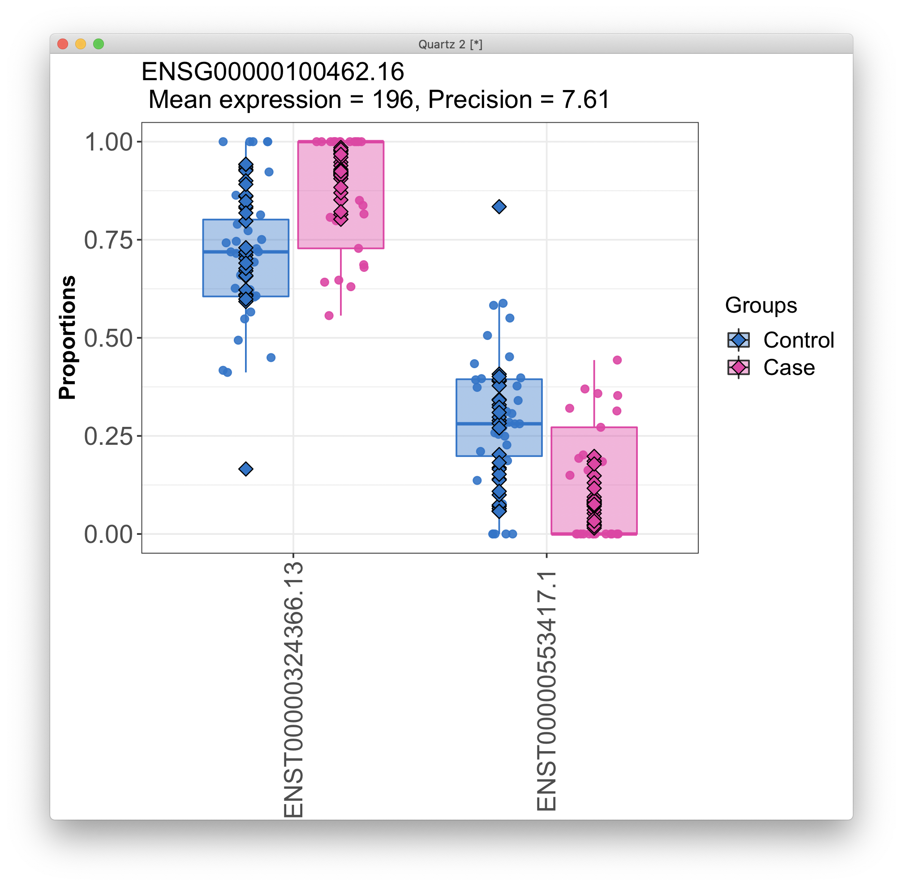

# 2020-12-31 15:19:27

Let's try a more traditional DTU analysys, like the one here:

http://bioconductor.org/packages/release/workflows/vignettes/rnaseqDTU/inst/doc/rnaseqDTU.html

I'm having trouble importing David's data... not quite sure what format it's in.
Why don't I just go ahead and re-run the quantification step? I can use salmon,
like in the workflow above, or use rsem and kallisto like this:

https://ycl6.gitbook.io/guide-to-rna-seq-analysis/raw-read-processing/mapping

Or maybe spend some more time trying to do the tximport using none type? I did
some research and id4, the item right before "protein_coding" type of column, is
the transcript length in base pairs unit. ID1 is the transcript id. 

# 2021-01-04 09:22:57

Can we find some example RSEM TPM output?

https://github.com/bli25broad/RSEM_tutorial

So, it's just a matter of extracting some of that information. Let's do a single
sample.

# 2021-01-05 11:13:29

None of that was working, so I asked David and Derek for the data. Let's run
this for RSEM first, then we can try Kallisto. Finally, if none of that works,
we can try Salmon, using the raw fastq files, as Derek saud he didn't do any
trimming.

```r
library(tximport)
# from David
df = read.delim('~/data/isoforms/shaw_adhd.rsem_output.tpm.tsv')
# from Derek
cnts = read.delim('~/data/isoforms/isoform_counts.txt')
a = lapply(df[,1], function(x) strsplit(as.character(x), split="\\|"))
meta_iso = t(data.frame(a))
colnames(meta_iso) = c('id1', 'ensembleID', 'id2', 'id3', 'iso_name',
                        'hgnc_symbol','id4', 'read_type')
data_iso = df[, 2:ncol(df)]

subjs = colnames(data_iso)
fnames = c()
used_subjs = c()
for (s in subjs) {
    print(s)
    sdf = cbind(meta_iso, data_iso[, s])
    colnames(sdf)[ncol(sdf)] = 'tpm'
    if (s %in% colnames(cnts)) {
        m = merge(sdf, cnts[, c('sample_id', s)], by.x='id1', by.y='sample_id')
        colnames(m)[ncol(m)] = 'count'
        m = m[!is.na(m$tpm), ]
        fname = sprintf('~/tmp/%s.tsv', s)
        write.table(m, file=fname, sep='\t', row.names=F, quote=F)
        fnames = c(fnames, fname)
        used_subjs = c(used_subjs, s)
    } else {
        cat('not found\n')
    }
}
txdf = data.frame(TXNAME=meta_iso[,'id1'], GENEID=meta_iso[,'ensembleID'])
txdf = txdf[order(txdf$GENEID),] 
rownames(txdf) = NULL
rsem = tximport(fnames, type='none', geneIdCol = 'ensembleID', txIdCol='id1',
             abundanceCol = 'tpm', lengthCol='id4', countsCol='count',
             txOut=T, importer=read.delim, countsFromAbundance="dtuScaledTPM",
             tx2gene=txdf, txIn=T)
for (i in c('abundance', 'counts', 'length')) {
    colnames(rsem[[i]]) = as.numeric(substring(used_subjs, 2))
}
save(rsem, txdf, file='~/data/isoforms/tximport_rsem_DTU.RData')
```

Now, let's go back to the analysis. I'm actually using this as the basis:

https://ycl6.gitbook.io/guide-to-rna-seq-analysis/differential-expression-analysis/differential-transcript-usage/dtu-using-drimseq

# 2021-01-06 10:35:26

Let's then start with the ACC samples first:

```r
load('~/data/isoforms/tximport_rsem_DTU.RData')
txi = rsem
myregion = 'ACC'

data = readRDS('~/data/rnaseq_derek/complete_rawCountData_05132020.rds')
rownames(data) = data$submitted_name  # just to ensure compatibility later
data = data[data$Region==myregion, ]
more = readRDS('~/data/rnaseq_derek/data_from_philip_POP_and_PCs.rds')
more = more[!duplicated(more$hbcc_brain_id),]
data = merge(data, more[, c('hbcc_brain_id', 'comorbid', 'comorbid_group',
                            'substance', 'substance_group')],
             by='hbcc_brain_id', all.x=T, all.y=F)
samples = data[, !grepl(colnames(data), pattern='^ENS')]
keep_me = colnames(txi$counts) %in% samples$submitted_name
for (i in c('abundance', 'counts', 'length')) {
    txi[[i]] = txi[[i]][, keep_me]
}
# sort samples to match order in rsem
rownames(samples) = samples$submitted_name
samples = samples[colnames(txi$counts), ]

samples$POP_CODE = as.character(samples$POP_CODE)
samples[samples$POP_CODE=='WNH', 'POP_CODE'] = 'W'
samples[samples$POP_CODE=='WH', 'POP_CODE'] = 'W'
samples$POP_CODE = factor(samples$POP_CODE)
samples$Individual = factor(samples$hbcc_brain_id)
samples[samples$Manner.of.Death=='Suicide (probable)', 'Manner.of.Death'] = 'Suicide'
samples[samples$Manner.of.Death=='unknown', 'Manner.of.Death'] = 'natural'
samples$MoD = factor(samples$Manner.of.Death)
samples$batch = factor(as.numeric(samples$run_date))
samples$Diagnosis = factor(samples$Diagnosis, levels=c('Control', 'Case'))

# going back to the workflow
# remove rows that has zero counts across all samples
cts = txi$counts
cts = cts[rowSums(cts) > 0,]

txdf.sub = txdf[match(rownames(cts), txdf$TXNAME),]
counts = data.frame(gene_id = txdf.sub$GENEID, feature_id = txdf.sub$TXNAME)
counts = cbind(counts, cts)

library(DRIMSeq)
samples$group = samples$Diagnosis
samples$sample_id = as.character(samples$submitted_name)
d0 = dmDSdata(counts = counts, samples = samples)

n = nrow(samples)
n.small = min(table(samples$group))

d = DRIMSeq::dmFilter(d0,
                      min_samps_feature_expr = n.small, min_feature_expr = 10,
                      min_samps_feature_prop = n.small, min_feature_prop = 0.1,
                      min_samps_gene_expr = n, min_gene_expr = 10)

countData = round(as.matrix(counts(d)[,-c(1:2)]))
```

Now we do a similar analysis as before, looking for PCs:

```r
set.seed(42)
pca <- prcomp(t(countData), scale=TRUE)

library(nFactors)
eigs <- pca$sdev^2
nS = nScree(x=eigs)
keep_me = 1:nS$Components$nkaiser
mydata = data.frame(pca$x[, keep_me])
data.pm = cbind(samples, mydata)
rownames(data.pm) = samples$submitted_name
num_vars = c('pcnt_optical_duplicates', 'clusters', 'Age', 'RINe', 'PMI',
             'C1', 'C2', 'C3', 'C4', 'C5', 'C6', 'C7', 'C8', 'C9', 'C10')
pc_vars = colnames(mydata)
num_corrs = matrix(nrow=length(num_vars), ncol=length(pc_vars),
                   dimnames=list(num_vars, pc_vars))
num_pvals = num_corrs
for (x in num_vars) {
    for (y in pc_vars) {
        res = cor.test(samples[, x], mydata[, y])
        num_corrs[x, y] = res$estimate
        num_pvals[x, y] = res$p.value
    }
}

categ_vars = c('batch', 'Diagnosis', 'MoD', 'substance_group',
               'comorbid_group', 'POP_CODE', 'Sex')
categ_corrs = matrix(nrow=length(categ_vars), ncol=length(pc_vars),
                   dimnames=list(categ_vars, pc_vars))
categ_pvals = categ_corrs
for (x in categ_vars) {
    for (y in pc_vars) {
        res = kruskal.test(mydata[, y], samples[, x])
        categ_corrs[x, y] = res$statistic
        categ_pvals[x, y] = res$p.value
    }
}

print(which(num_pvals < .01, arr.ind = T))
print(which(categ_pvals < .01, arr.ind = T))
```

```
                        row col
pcnt_optical_duplicates   1   1
clusters                  2   1
C8                       13   1
clusters                  2   2
PMI                       5   2
RINe                      4   3
RINe                      4   4
      row col
batch   1   1
batch   1   2
batch   1   3
```

So, we need to remove the first 4 PCs:

```r
design = model.matrix(~group + PC1 + PC2 + PC3, data = data.pm)

set.seed(42)
system.time({
    # Estimate the precision (Higher dispersion is associated with lower precision)
    d <- dmPrecision(d, design = design)
    # Fit regression coefficients
    d <- dmFit(d, design = design)
    # Perform null hypothesis testing on the coefficient of interest
    d <- dmTest(d, coef = "groupCase")     
})
```

# 2021-01-07 11:45:15

Continuing the analysis:

```r
# Single p-value per gene
res.g = DRIMSeq::results(d)

# Single p-value per transcript
res.t = DRIMSeq::results(d, level = "feature")

# setting NAs to 1 so it doesn't screw up future analysis
no.na <- function(x) ifelse(is.na(x), 1, x)
res.g$pvalue <- no.na(res.g$pvalue)
res.t$pvalue <- no.na(res.t$pvalue)
```

We actually have some results there surviving FDR:

```
r$> table(res.g$adj_pvalue < 0.05)                                                              

FALSE  TRUE 
10597    57 

r$> table(res.t$adj_pvalue < 0.05)                                                              

FALSE  TRUE 
30883    99 
```

```r
# posthoc procedure to improve the false discovery rate (FDR) and overall false discovery rate (OFDR) control. It sets the p-values and adjusted p-values for transcripts with small per-sample proportion SD to 1

smallProportionSD <- function(d, filter = 0.1) {
        # Generate count table
        cts = as.matrix(subset(counts(d), select = -c(gene_id, feature_id)))
        # Summarise count total per gene
        gene.cts = rowsum(cts, counts(d)$gene_id)
        # Use total count per gene as count per transcript
        total.cts = gene.cts[match(counts(d)$gene_id, rownames(gene.cts)),]
        # Calculate proportion of transcript in gene
        props = cts/total.cts
        rownames(props) = rownames(total.cts)
        
        # Calculate standard deviation
        propSD = sqrt(matrixStats::rowVars(props))
        # Check if standard deviation of per-sample proportions is < 0.1
        propSD < filter
}

filt = smallProportionSD(d)

res.t.filt = DRIMSeq::results(d, level = "feature")
res.t.filt$pvalue[filt] = 1
res.t.filt$adj_pvalue[filt] = 1
```

```
r$> table(filt)                                                                                 
filt
FALSE  TRUE 
12883 17902 
```

So, about 18K of the 31K have small per-sample proportion and were adjusted to
1.

```
r$> table(res.t$adj_pvalue < 0.05)                                                            

FALSE  TRUE 
30883    99 

r$> table(res.t.filt$adj_pvalue < 0.05)                                                       

FALSE  TRUE 
30894    88 
```

So, there are 88 after filtering, instead of the original 99.

Now we do the stageR procedure:

```r
strp <- function(x) substr(x,1,15)
# Construct a vector of per-gene p-values for the screening stage
pScreen = res.g$pvalue
names(pScreen) = strp(res.g$gene_id)
# Construct a one column matrix of the per-transcript confirmation p-values
pConfirmation = matrix(res.t.filt$pvalue, ncol = 1)
dimnames(pConfirmation) = list(strp(res.t.filt$feature_id), "transcript")
# res.t is used twice to construct a 4-column data.frame that contain both original IDs and IDs without version numbers
tx2gene = data.frame(res.t[,c("feature_id", "gene_id")], 
                     res.t[,c("feature_id", "gene_id")])

for (i in 1:2) tx2gene[,i] = strp(tx2gene[,i])

library(stageR)
stageRObj = stageRTx(pScreen = pScreen, pConfirmation = pConfirmation, 
                     pScreenAdjusted = FALSE, tx2gene = tx2gene[,1:2])
stageRObj = stageWiseAdjustment(stageRObj, method = "dtu", alpha = 0.05)
drim.padj = getAdjustedPValues(stageRObj, order = FALSE,
                               onlySignificantGenes = TRUE)
# this summarizes the adjusted p-values from the two-stage analysis. Only genes that passed the filter are included in the table.
drim.padj = merge(tx2gene, drim.padj, by.x = c("gene_id","feature_id"),
                  by.y = c("geneID","txID"))
```

```
r$> length(unique(drim.padj[drim.padj$gene < 0.05,]$gene_id))                                 
[1] 57

r$> table(drim.padj$transcript < 0.05)                                                        

FALSE  TRUE 
  108    71 
```

There are 57 screened genes in this dataset, and 71 transcripts pass the
confirmation stage on a target 5% overall false discovery rate (OFDR). This
means that, in expectation, no more than 5% of the genes that pass screening
will either (1) not contain any DTU, so be falsely screened genes, or (2)
contain a falsely confirmed transcript.

Let's make a quick plot:

```r
gene_id = unique(drim.padj[order(drim.padj$transcript,
                                 drim.padj$gene),]$gene_id.1)[1]

quartz()
plotProportions(d, gene_id = gene_id, group_variable = "group",
                plot_type = "boxplot1")
```



So, that's interesting... lots to explore here.

Let's finish the code to export the results:

```r
# just need to do this once
library(GenomicFeatures)
txdb <- makeTxDbFromGFF('~/Downloads/gencode.v36.annotation.gtf')
saveDb(txdb, '~/data/post_mortem/gencode.v36.annotation.sqlite')
```

```r
txdb <- loadDb('~/data/post_mortem/gencode.v36.annotation.sqlite')

# Create a data.frame containing counts in long-format data with reshape2::melt
drim.prop = reshape2::melt(counts[counts$feature_id %in% proportions(d)$feature_id,], id = c("gene_id", "feature_id"))
drim.prop = drim.prop[order(drim.prop$gene_id, drim.prop$variable,
                      drim.prop$feature_id),]
# Calculate proportions from counts
library(dplyr)
drim.prop = drim.prop %>%
        group_by(gene_id, variable) %>%
        mutate(total = sum(value)) %>%
        group_by(variable, add=TRUE) %>%
        mutate(prop = value/total)
drim.prop = reshape2::dcast(drim.prop[,c(1,2,3,6)],
                            gene_id + feature_id ~ variable)
# Average proportions calculated from fitted proportions
drim.mean = as.data.frame(sapply( levels(samples$group),
                          function(lvl) rowMeans(proportions(d)[, 3:ncol(proportions(d))][, samples$group == lvl, drop = FALSE]) ))
# log2 fold change in proportions
drim.log2fcp = log2(drim.mean[2]/drim.mean[1])
colnames(drim.log2fcp) = "log2fcp"
rownames(drim.log2fcp) = proportions(d)$feature_id
# Merge to create result data
drimData = cbind(drim.prop[,1:2], drim.mean, drim.prop[, 3:ncol(drim.prop)])

# NEED TO WORK ON THIS LATER... SOMETHING FUNKY WITH THE DIFFERENT LIBRARY LOADING ORDER
drimData = merge(annoData, drimData, by.x = c("GeneID","TranscriptID"), by.y = c("gene_id","feature_id"))
drimData = drimData[order(drimData$GeneID, drimData$TranscriptID),]
```


# TODO
 * keep going with analysis
 * run DEXSeq as well
 * try DTE
 * try DGE using these tools
 * try Kallisto
 * try Salmon