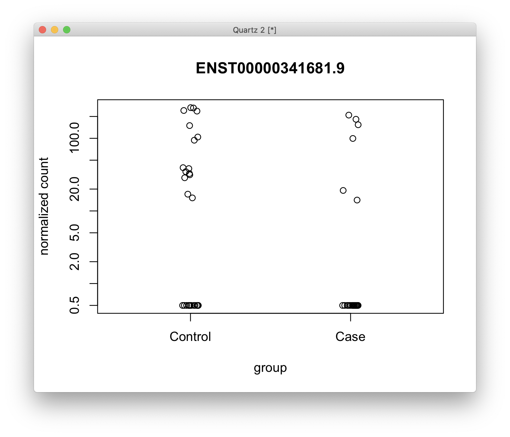
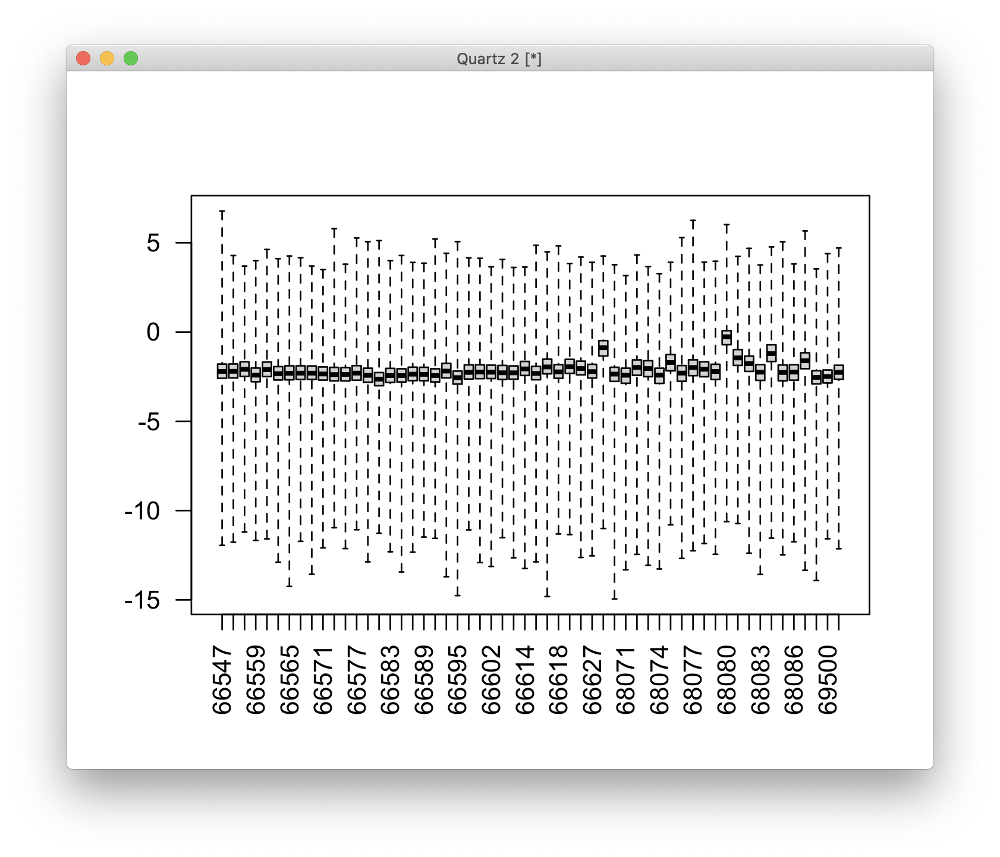
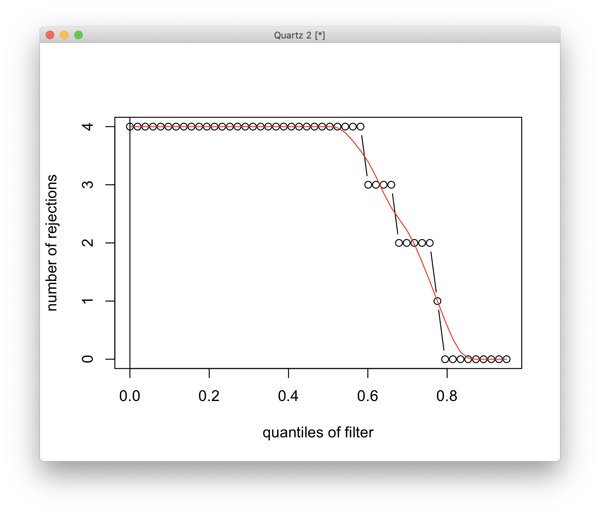

# 2021-01-08 13:50:04

Since we ran a more traditional DTU, let's run a more traditional DTE as well,
again following:

https://ycl6.gitbook.io/guide-to-rna-seq-analysis/differential-expression-analysis/differential-transcript-expression/dte-analysis-with-star-+-rsem-input

```r
library(tximport)
# from David
df = read.delim('~/data/isoforms/shaw_adhd.rsem_output.tpm.tsv')
# from Derek
cnts = read.delim('~/data/isoforms/isoform_counts.txt')
a = lapply(df[,1], function(x) strsplit(as.character(x), split="\\|"))
meta_iso = t(data.frame(a))
colnames(meta_iso) = c('id1', 'ensembleID', 'id2', 'id3', 'iso_name',
                        'hgnc_symbol','id4', 'read_type')
data_iso = df[, 2:ncol(df)]

subjs = colnames(data_iso)
fnames = c()
used_subjs = c()
for (s in subjs) {
    print(s)
    sdf = cbind(meta_iso, data_iso[, s])
    colnames(sdf)[ncol(sdf)] = 'tpm'
    if (s %in% colnames(cnts)) {
        m = merge(sdf, cnts[, c('sample_id', s)], by.x='id1', by.y='sample_id')
        colnames(m)[ncol(m)] = 'count'
        m = m[!is.na(m$tpm), ]
        fname = sprintf('~/tmp/%s.tsv', s)
        write.table(m, file=fname, sep='\t', row.names=F, quote=F)
        fnames = c(fnames, fname)
        used_subjs = c(used_subjs, s)
    } else {
        cat('not found\n')
    }
}
txdf = data.frame(TXNAME=meta_iso[,'id1'], GENEID=meta_iso[,'ensembleID'])
txdf = txdf[order(txdf$GENEID),] 
rownames(txdf) = NULL
rsem = tximport(fnames, type='none', geneIdCol = 'ensembleID', txIdCol='id1',
             abundanceCol = 'tpm', lengthCol='id4', countsCol='count',
             txOut=T, importer=read.delim, countsFromAbundance="no",
             tx2gene=txdf, txIn=T)
for (i in c('abundance', 'counts', 'length')) {
    colnames(rsem[[i]]) = as.numeric(substring(used_subjs, 2))
}
save(rsem, txdf, file='~/data/isoforms/tximport_rsem_DTE.RData')
```

Let's then start with the ACC samples first:

```r
load('~/data/isoforms/tximport_rsem_DTE.RData')
txi = rsem
myregion = 'ACC'

data = readRDS('~/data/rnaseq_derek/complete_rawCountData_05132020.rds')
rownames(data) = data$submitted_name  # just to ensure compatibility later
data = data[data$Region==myregion, ]
library(gdata)
more = read.xls('~/data/post_mortem/POST_MORTEM_META_DATA_JAN_2021.xlsx')
more = more[!duplicated(more$hbcc_brain_id),]
data = merge(data, more[, c('hbcc_brain_id', 'comorbid_group_update',
                            'substance_group', 'evidence_level')],
             by='hbcc_brain_id', all.x=T, all.y=F)
samples = data[, !grepl(colnames(data), pattern='^ENS')]
keep_me = colnames(txi$counts) %in% samples$submitted_name
for (i in c('abundance', 'counts', 'length')) {
    txi[[i]] = txi[[i]][, keep_me]
}
# sort samples to match order in rsem
rownames(samples) = samples$submitted_name
samples = samples[colnames(txi$counts), ]

samples$POP_CODE = as.character(samples$POP_CODE)
samples[samples$POP_CODE=='WNH', 'POP_CODE'] = 'W'
samples[samples$POP_CODE=='WH', 'POP_CODE'] = 'W'
samples$POP_CODE = factor(samples$POP_CODE)
samples$Individual = factor(samples$hbcc_brain_id)
samples[samples$Manner.of.Death=='Suicide (probable)', 'Manner.of.Death'] = 'Suicide'
samples[samples$Manner.of.Death=='unknown', 'Manner.of.Death'] = 'natural'
samples$MoD = factor(samples$Manner.of.Death)
samples$batch = factor(as.numeric(samples$run_date))
samples$Diagnosis = factor(samples$Diagnosis, levels=c('Control', 'Case'))
samples$substance_group = factor(samples$substance_group)
samples$comorbid_group = factor(samples$comorbid_group_update)
samples$evidence_level = factor(samples$evidence_level)

# going back to the workflow... let's first determine our PCs
# remove rows that has zero counts across all samples
cts = round(txi$counts)
cts = cts[rowSums(cts) > 0,]
library(caret)
pp_order = c('zv', 'nzv')
pp = preProcess(t(cts), method = pp_order)
X = predict(pp, t(cts))
txCounts = t(X)

pca <- prcomp(t(txCounts), scale=TRUE)

library(nFactors)
eigs <- pca$sdev^2
nS = nScree(x=eigs)
keep_me = 1:nS$Components$nkaiser
mydata = data.frame(pca$x[, keep_me])
data.pm = cbind(samples, mydata)
rownames(data.pm) = data$hbcc_brain_id
```

Now, let's see which PCs to remove for DTE:

```r
num_vars = c('pcnt_optical_duplicates', 'clusters', 'Age', 'RINe', 'PMI',
             'C1', 'C2', 'C3', 'C4', 'C5', 'C6', 'C7', 'C8', 'C9', 'C10')
pc_vars = colnames(mydata)
num_corrs = matrix(nrow=length(num_vars), ncol=length(pc_vars),
                   dimnames=list(num_vars, pc_vars))
num_pvals = num_corrs
for (x in num_vars) {
    for (y in pc_vars) {
        res = cor.test(data.pm[, x], data.pm[, y])
        num_corrs[x, y] = res$estimate
        num_pvals[x, y] = res$p.value
    }
}

categ_vars = c('batch', 'Diagnosis', 'MoD', 'substance_group',
               'comorbid_group', 'POP_CODE', 'Sex')
categ_corrs = matrix(nrow=length(categ_vars), ncol=length(pc_vars),
                   dimnames=list(categ_vars, pc_vars))
categ_pvals = categ_corrs
for (x in categ_vars) {
    for (y in pc_vars) {
        res = kruskal.test(data.pm[, y], data.pm[, x])
        categ_corrs[x, y] = res$statistic
        categ_pvals[x, y] = res$p.value
    }
}

print(which(num_pvals < .01, arr.ind = T))
print(which(categ_pvals < .01, arr.ind = T))
```

```
                        row col
pcnt_optical_duplicates   1   1
clusters                  2   1
C8                       13   1
RINe                      4   2
pcnt_optical_duplicates   1   3
PMI                       5   3
RINe                      4   4
      row col
batch   1   1
batch   1   3
MoD     3   9
```

```r
fm = ~ Diagnosis + PC1 + PC2 + PC3 + PC4 + PC9
dds = DESeqDataSetFromMatrix(countData = txCounts, colData = data.pm,
                             design = fm)
dds = DESeq(dds)
res <- results(dds, name = "Diagnosis_Case_vs_Control", alpha = 0.05)
```

```
$> summary(res)                                                                            

out of 169352 with nonzero total read count
adjusted p-value < 0.05
LFC > 0 (up)       : 4, 0.0024%
LFC < 0 (down)     : 0, 0%
outliers [1]       : 0, 0%
low counts [2]     : 0, 0%
(mean count < 0)
[1] see 'cooksCutoff' argument of ?results
[2] see 'independentFiltering' argument of ?results
```

The tutorial I've been referencing above has some code for volcano plots if
that'd be useful.

But I could also run stageR here to get some boost in the results.

```r
plotCounts(dds, gene=which.min(res$padj), intgroup="Diagnosis") 
```



This top result looks like crap though. In fact, all our 4 results look like
that. Maybe I could remove a couple samples?

```r
boxplot(log10(assays(dds)[["cooks"]]), range=0, las=2)
```



How is the adaptive filtering working?

```r
plot(metadata(res)$filterNumRej, 
     type="b", ylab="number of rejections",
     xlab="quantiles of filter")
lines(metadata(res)$lo.fit, col="red")
abline(v=metadata(res)$filterTheta)
```



That looks funky too...

# 2021-01-12 10:52:15

Let's use edgeR here because their filters looked a bit better. I'll follow the
flow from the stageR paper described in:

https://github.com/statOmics/stageWiseTestingPaper/blob/master/stageWiseTestingPaper/DTU_DTE/caseStudy/prostateCancerCaseStudy_DTE_stageR.R

```r
load('~/data/isoforms/tximport_rsem_DTE.RData')
txi = rsem
myregion = 'ACC'

data = readRDS('~/data/rnaseq_derek/complete_rawCountData_05132020.rds')
rownames(data) = data$submitted_name  # just to ensure compatibility later
data = data[data$Region==myregion, ]
library(gdata)
more = read.xls('~/data/post_mortem/POST_MORTEM_META_DATA_JAN_2021.xlsx')
more = more[!duplicated(more$hbcc_brain_id),]
data = merge(data, more[, c('hbcc_brain_id', 'comorbid_group_update',
                            'substance_group', 'evidence_level')],
             by='hbcc_brain_id', all.x=T, all.y=F)
samples = data[, !grepl(colnames(data), pattern='^ENS')]
keep_me = colnames(txi$counts) %in% samples$submitted_name
for (i in c('abundance', 'counts', 'length')) {
    txi[[i]] = txi[[i]][, keep_me]
}
# sort samples to match order in rsem
rownames(samples) = samples$submitted_name
samples = samples[colnames(txi$counts), ]

samples$POP_CODE = as.character(samples$POP_CODE)
samples[samples$POP_CODE=='WNH', 'POP_CODE'] = 'W'
samples[samples$POP_CODE=='WH', 'POP_CODE'] = 'W'
samples$POP_CODE = factor(samples$POP_CODE)
samples$Individual = factor(samples$hbcc_brain_id)
samples[samples$Manner.of.Death=='Suicide (probable)', 'Manner.of.Death'] = 'Suicide'
samples[samples$Manner.of.Death=='unknown', 'Manner.of.Death'] = 'natural'
samples$MoD = factor(samples$Manner.of.Death)
samples$batch = factor(as.numeric(samples$run_date))
samples$Diagnosis = factor(samples$Diagnosis, levels=c('Control', 'Case'))
samples$substance_group = factor(samples$substance_group)
samples$comorbid_group = factor(samples$comorbid_group_update)
samples$evidence_level = factor(samples$evidence_level)

# going back to the workflow... let's first determine our PCs
# remove rows that has zero counts across all samples
cts = round(txi$counts)
cts = cts[rowSums(cts) > 0,]
library(caret)
pp_order = c('zv', 'nzv')
pp = preProcess(t(cts), method = pp_order)
X = predict(pp, t(cts))
txCounts = t(X)

library(edgeR)
isexpr <- filterByExpr(txCounts, group=data$Diagnosis)
txCountsExpr = txCounts[isexpr,]

pca <- prcomp(t(txCountsExpr), scale=TRUE)

library(nFactors)
eigs <- pca$sdev^2
nS = nScree(x=eigs)
keep_me = 1:nS$Components$nkaiser
mydata = data.frame(pca$x[, keep_me])
data.pm = cbind(samples, mydata)
rownames(data.pm) = data$hbcc_brain_id
```

Now, let's see which PCs to remove for DTE:

```r
num_vars = c('pcnt_optical_duplicates', 'clusters', 'Age', 'RINe', 'PMI',
             'C1', 'C2', 'C3', 'C4', 'C5', 'C6', 'C7', 'C8', 'C9', 'C10')
pc_vars = colnames(mydata)
num_corrs = matrix(nrow=length(num_vars), ncol=length(pc_vars),
                   dimnames=list(num_vars, pc_vars))
num_pvals = num_corrs
for (x in num_vars) {
    for (y in pc_vars) {
        res = cor.test(data.pm[, x], data.pm[, y])
        num_corrs[x, y] = res$estimate
        num_pvals[x, y] = res$p.value
    }
}

categ_vars = c('batch', 'Diagnosis', 'MoD', 'substance_group',
               'comorbid_group', 'POP_CODE', 'Sex')
categ_corrs = matrix(nrow=length(categ_vars), ncol=length(pc_vars),
                   dimnames=list(categ_vars, pc_vars))
categ_pvals = categ_corrs
for (x in categ_vars) {
    for (y in pc_vars) {
        res = kruskal.test(data.pm[, y], data.pm[, x])
        categ_corrs[x, y] = res$statistic
        categ_pvals[x, y] = res$p.value
    }
}

print(which(num_pvals < .01, arr.ind = T))
print(which(categ_pvals < .01, arr.ind = T))
```

```
                        row col
pcnt_optical_duplicates   1   1
clusters                  2   1
C8                       13   1
RINe                      4   2
pcnt_optical_duplicates   1   3
PMI                       5   3
RINe                      4   4
C6                       11   4
      row col
batch   1   1
batch   1   2
batch   1   3
```

```r
fm = ~ Diagnosis + PC1 + PC2 + PC3 + PC4
d=DGEList(txCountsExpr)
d=calcNormFactors(d)
design=model.matrix(fm, data=data.pm)
d=estimateGLMCommonDisp(d,design)
d=estimateGLMTrendedDisp(d,design)
d=estimateGLMTagwiseDisp(d,design)
fit=glmFit(d, design)
lrt=glmLRT(fit,coef="DiagnosisCase")


# from https://github.com/statOmics/stageWiseTestingPaper/blob/master/stageWiseTestingPaper/functions/perGeneQValue_kvdb.R
perGeneQValueExact = function(pGene, theta, geneSplit) {
  stopifnot(length(pGene)==length(geneSplit))

  ## Compute the numerator \sum_{i=1}^M 1-(1-theta)^{n_i}
  ## Below we first identify the summands which are the same
  ## (because they have the same n_i), then do the sum via the
  ## mapply
  numExons     = listLen(geneSplit)
  tab          = tabulate(numExons)
  notZero      = (tab>0)
  numerator    = mapply(function(m, n) m * (1 - (1-theta)^n),
                            m = tab[notZero],
                            n = which(notZero))
  numerator    = rowSums(numerator)

  ## Compute the denominator: for each value of theta, the number
  ## of genes with pGene <= theta[i].
  ## Note that in cut(..., right=TRUE), the intervals are
  ## right-closed (left open) intervals.
  bins   = cut(pGene, breaks=c(-Inf, as.vector(theta)), right = TRUE, include.lowest = TRUE)
  counts = tabulate(bins, nbins = nlevels(bins))
  denom  = cumsum(counts)
  stopifnot(denom[length(denom)]==length(pGene))

  return(numerator/denom)
}

perGeneQValue_kvdb = function(object, pvals, method = perGeneQValueExact) {
  wTest= which(!is.na(pvals))
  geneID    = factor(object[["groupID"]][wTest])
  geneSplit = split(seq(along=geneID), geneID)

  ## summarise p-values of exons for one gene: take the minimum
  pGene = sapply(geneSplit, function(i) min(pvals[i]))

  ## Determine the thetas to be used
  theta = unique(sort(pGene))

  ## compute q-values associated with each theta
  q = method(pGene, theta, geneSplit)

  ## return a named vector of q-values per gene
  res        = rep(NA_real_, length(pGene))
  res        = q[match(pGene, theta)]
  res = pmin(1, res)
  names(res) = names(geneSplit)
  return(res)
}
#####################

### stage-wise testing
library(stageR)
strp <- function(x) substr(x,1,15)
pvals=lrt$table$PValue
genesAll=txdf$GENEID[match(rownames(d$counts),txdf$TXNAME)]
object=list()
object$groupID=genesAll
qvals=perGeneQValue_kvdb(object=object,pvals=pvals)
pConfirmation=matrix(pvals,ncol=1,dimnames=list(rownames(lrt),"transcript"))
pScreen=qvals

stageRObj = stageRTx(pScreen=pScreen, pConfirmation=pConfirmation,
                     pScreenAdjusted=TRUE, tx2gene=txdf)
stageRObj = stageWiseAdjustment(stageRObj, method="dte", alpha=0.05)
```

We only got one significant gene / transcript:

```
r$> getSignificantGenes(stageRObj)                                                      
The returned adjusted p-values are based on a stage-wise testing approach and are only valid for the provided target OFDR level of 5%. If a different target OFDR level is of interest,the entire adjustment should be re-run. 

                   FDR adjusted p-value
ENSG00000135245.10         7.669107e-05

r$> getSignificantTx(stageRObj)                                                         
The returned adjusted p-values are based on a stage-wise testing approach and are only valid for the provided target OFDR level of 5%. If a different target OFDR level is of interest,the entire adjustment should be re-run. 

                  stage-wise adjusted p-value
ENST00000257696.5                2.432001e-05
```

Is there a difference if we do the PCA on the lcpm matrix?

```r
pca <- prcomp(t(cpm(txCountsExpr, log=T)), scale=TRUE)

library(nFactors)
eigs <- pca$sdev^2
nS = nScree(x=eigs)
keep_me = 1:nS$Components$nkaiser
mydata = data.frame(pca$x[, keep_me])
data.pm = cbind(samples, mydata)
rownames(data.pm) = data$hbcc_brain_id
```

Now, let's see which PCs to remove for DTE:

```r
num_vars = c('pcnt_optical_duplicates', 'clusters', 'Age', 'RINe', 'PMI',
             'C1', 'C2', 'C3', 'C4', 'C5', 'C6', 'C7', 'C8', 'C9', 'C10')
pc_vars = colnames(mydata)
num_corrs = matrix(nrow=length(num_vars), ncol=length(pc_vars),
                   dimnames=list(num_vars, pc_vars))
num_pvals = num_corrs
for (x in num_vars) {
    for (y in pc_vars) {
        res = cor.test(data.pm[, x], data.pm[, y])
        num_corrs[x, y] = res$estimate
        num_pvals[x, y] = res$p.value
    }
}

categ_vars = c('batch', 'Diagnosis', 'MoD', 'substance_group',
               'comorbid_group', 'POP_CODE', 'Sex')
categ_corrs = matrix(nrow=length(categ_vars), ncol=length(pc_vars),
                   dimnames=list(categ_vars, pc_vars))
categ_pvals = categ_corrs
for (x in categ_vars) {
    for (y in pc_vars) {
        res = kruskal.test(data.pm[, y], data.pm[, x])
        categ_corrs[x, y] = res$statistic
        categ_pvals[x, y] = res$p.value
    }
}

print(which(num_pvals < .01, arr.ind = T))
print(which(categ_pvals < .01, arr.ind = T))
```

```
                        row col
clusters                  2   1
Age                       3   1
PMI                       5   1
RINe                      4   2
RINe                      4   3
RINe                      4   4
pcnt_optical_duplicates   1   5
clusters                  2   5
C8                       13   5
pcnt_optical_duplicates   1   6
C1                        6  10
C2                        7  10
C4                        9  10
C7                       12  10
C9                       14  10
RINe                      4  11
               row col
batch            1   1
batch            1   5
comorbid_group   5   6
batch            1  10
POP_CODE         6  10
MoD              3  11
```

OK, let's see if this works better:

```r
fm = ~ Diagnosis + PC1 + PC2 + PC3 + PC4 + PC5 + PC6 + PC10 + PC11
d=DGEList(txCountsExpr)
d=calcNormFactors(d)
design=model.matrix(fm, data=data.pm)
d=estimateGLMCommonDisp(d,design)
d=estimateGLMTrendedDisp(d,design)
d=estimateGLMTagwiseDisp(d,design)
fit=glmFit(d, design)
lrt=glmLRT(fit,coef="DiagnosisCase")

strp <- function(x) substr(x,1,15)
pvals=lrt$table$PValue
genesAll=txdf$GENEID[match(rownames(d$counts),txdf$TXNAME)]
object=list()
object$groupID=genesAll
qvals=perGeneQValue_kvdb(object=object,pvals=pvals)
pConfirmation=matrix(pvals,ncol=1,dimnames=list(rownames(lrt),"transcript"))
pScreen=qvals

stageRObj = stageRTx(pScreen=pScreen, pConfirmation=pConfirmation,
                     pScreenAdjusted=TRUE, tx2gene=txdf)
stageRObj = stageWiseAdjustment(stageRObj, method="dte", alpha=0.05)
```

Nothing is significant now... 

How about a combination of the edgeR filtering with DESSeq, and then maybe even
IHW?

```r
pca <- prcomp(t(txCountsExpr), scale=TRUE)
library(nFactors)
eigs <- pca$sdev^2
nS = nScree(x=eigs)
keep_me = 1:nS$Components$nkaiser
mydata = data.frame(pca$x[, keep_me])
data.pm = cbind(samples, mydata)
rownames(data.pm) = data$hbcc_brain_id
fm = ~ Diagnosis + PC1 + PC2 + PC3 + PC4
library(DESeq2)
dds = DESeqDataSetFromMatrix(countData = txCountsExpr, colData = data.pm,
                             design = fm)
keep <- rowSums(counts(dds)) >= 10
dds <- dds[keep,]
dds = DESeq(dds)
res <- results(dds, name = "Diagnosis_Case_vs_Control", alpha = 0.05)
resOrdered <- res[order(res$pvalue),]
```

Note that for DESeq2, it wouldn't make sense to transform to logCPM before
taking the PCs:

"In order to test for differential expression, we operate on raw counts and use
discrete distributions as described in the previous section on differential
expression. However for other downstream analyses – e.g. for visualization or
clustering – it might be useful to work with transformed versions of the count
data."... that's from their vignete:
https://bioconductor.org/packages/release/bioc/vignettes/DESeq2/inst/doc/DESeq2.html#p-values-and-adjusted-p-values?

But how about IHW?

```r
library(IHW)
resIHW <- results(dds, filterFun=ihw)
summary(resIHW)
sum(resIHW$padj < 0.05, na.rm=TRUE)
```

Now, that gives me a way better result... now it's just a matter of exploring
it.

```
r$> summary(resIHW)                                                                     

out of 70359 with nonzero total read count
adjusted p-value < 0.1
LFC > 0 (up)       : 12967, 18%
LFC < 0 (down)     : 8055, 11%
outliers [1]       : 0, 0%
[1] see 'cooksCutoff' argument of ?results
see metadata(res)$ihwResult on hypothesis weighting


r$> sum(resIHW$padj < 0.1, na.rm=TRUE)                                                  
[1] 21022

r$> sum(resIHW$padj < 0.05, na.rm=TRUE)                                                 
[1] 16662
```

Before I continue exploring this, could I use it for DGE and DTU as well?

Actually, this doesn't look right. I have to specify the name in the res
parameter...


# Useful links:

* http://master.bioconductor.org/packages/release/workflows/vignettes/rnaseqGene/inst/doc/rnaseqGene.html
* https://bioconductor.org/packages/release/bioc/vignettes/DESeq2/inst/doc/DESeq2.html

# TODO
 * stageR for DTE
 * Caudate!
 * IHW liek in https://bioconductor.org/packages/release/bioc/vignettes/DESeq2/inst/doc/DESeq2.html#p-values-and-adjusted-p-values?
 * try Kallisto
 * try Salmon