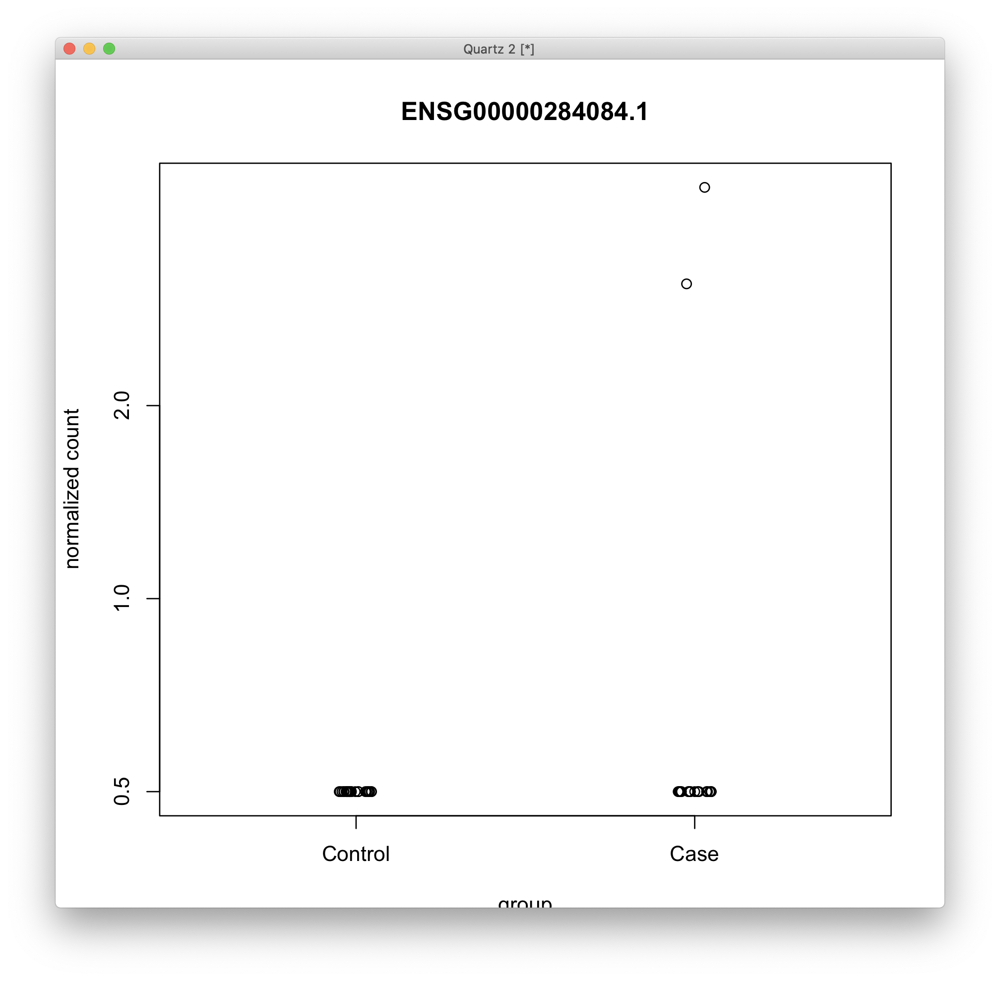

# 2021-01-12 17:13:33

DESeq2 has some interesting capabilities, such as the inde[endent filtering and
IHW. Could we use it for DGE and DTE as well? I'm mostly focusing on:

http://master.bioconductor.org/packages/release/workflows/vignettes/rnaseqGene/inst/doc/rnaseqGene.html

and

https://bioconductor.org/packages/release/bioc/vignettes/DESeq2/inst/doc/DESeq2.html

Let's try DGE first:

```r
myregion = 'ACC'
data = readRDS('~/data/rnaseq_derek/complete_rawCountData_05132020.rds')
rownames(data) = data$submitted_name  # just to ensure compatibility later
# remove obvious outlier (that's NOT caudate) labeled as ACC
rm_me = rownames(data) %in% c('68080')
data = data[!rm_me, ]
data = data[data$Region==myregion, ]
library(gdata)
more = read.xls('~/data/post_mortem/POST_MORTEM_META_DATA_JAN_2021.xlsx')
more = more[!duplicated(more$hbcc_brain_id),]
data = merge(data, more[, c('hbcc_brain_id', 'comorbid_group_update',
                            'substance_group', 'evidence_level')],
             by='hbcc_brain_id', all.x=T, all.y=F)

# at this point we have 55 samples for ACC
grex_vars = colnames(data)[grepl(colnames(data), pattern='^ENS')]
count_matrix = t(data[, grex_vars])
data = data[, !grepl(colnames(data), pattern='^ENS')]

data$POP_CODE = as.character(data$POP_CODE)
data[data$POP_CODE=='WNH', 'POP_CODE'] = 'W'
data[data$POP_CODE=='WH', 'POP_CODE'] = 'W'
data$POP_CODE = factor(data$POP_CODE)
data$Individual = factor(data$hbcc_brain_id)
data[data$Manner.of.Death=='Suicide (probable)', 'Manner.of.Death'] = 'Suicide'
data[data$Manner.of.Death=='unknown', 'Manner.of.Death'] = 'natural'
data$MoD = factor(data$Manner.of.Death)
data$batch = factor(as.numeric(data$run_date))
data$Diagnosis = factor(data$Diagnosis, levels=c('Control', 'Case'))
data$substance_group = factor(data$substance_group)
data$comorbid_group = factor(data$comorbid_group_update)
data$evidence_level = factor(data$evidence_level)

library(caret)
pp_order = c('zv')
pp = preProcess(t(count_matrix), method = pp_order)
X = predict(pp, t(count_matrix))
geneCounts = t(X)

library(GenomicFeatures)
txdb <- loadDb('~/data/post_mortem/Homo_sapies.GRCh38.97.sqlite')
txdf <- select(txdb, keys(txdb, "GENEID"), columns=c('GENEID','TXCHROM'),
               "GENEID")
noversion = data.frame(GENEID = substr(rownames(geneCounts), 1, 15))
noversion = merge(noversion, txdf, by='GENEID', sort=F)
imautosome = which(noversion$TXCHROM != 'X' &
                   noversion$TXCHROM != 'Y' &
                   noversion$TXCHROM != 'MT')
geneCounts = geneCounts[imautosome, ]
noversion = noversion[imautosome, ]
# there are no duplicates here for ACC

set.seed(42)
lcpm.pca <- prcomp(t(geneCounts), scale=TRUE)

library(nFactors)
eigs <- lcpm.pca$sdev^2
nS = nScree(x=eigs)
keep_me = 1:nS$Components$nkaiser
mydata = data.frame(lcpm.pca$x[, keep_me])
data.pm = cbind(data, mydata)
rownames(data.pm) = data$hbcc_brain_id
```

Now, let's see first if our main PM results are still there:

```r
num_vars = c('pcnt_optical_duplicates', 'clusters', 'Age', 'RINe', 'PMI',
             'C1', 'C2', 'C3', 'C4', 'C5', 'C6', 'C7', 'C8', 'C9', 'C10')
pc_vars = colnames(mydata)
num_corrs = matrix(nrow=length(num_vars), ncol=length(pc_vars),
                   dimnames=list(num_vars, pc_vars))
num_pvals = num_corrs
for (x in num_vars) {
    for (y in pc_vars) {
        res = cor.test(data.pm[, x], data.pm[, y])
        num_corrs[x, y] = res$estimate
        num_pvals[x, y] = res$p.value
    }
}

categ_vars = c('batch', 'Diagnosis', 'MoD', 'substance_group',
               'comorbid_group', 'POP_CODE', 'Sex', 'evidence_level')
categ_corrs = matrix(nrow=length(categ_vars), ncol=length(pc_vars),
                   dimnames=list(categ_vars, pc_vars))
categ_pvals = categ_corrs
for (x in categ_vars) {
    for (y in pc_vars) {
        res = kruskal.test(data.pm[, y], data.pm[, x])
        categ_corrs[x, y] = res$statistic
        categ_pvals[x, y] = res$p.value
    }
}

print(which(num_pvals < .01, arr.ind = T))
print(which(categ_pvals < .01, arr.ind = T))
```

```
                        row col
pcnt_optical_duplicates   1   1
clusters                  2   1
C8                       13   1
RINe                      4   2
RINe                      4   3
pcnt_optical_duplicates   1   4
PMI                       5   4
C6                       11   7
               row col
batch            1   1
batch            1   2
batch            1   4
evidence_level   8   4
```

Debatable whether we should include PC7... let's leave it out for now:

```r
countdata = round(geneCounts)
colnames(countdata) = rownames(data.pm)
form = ~ Diagnosis + PC1 + PC2 + PC3 + PC4

library(DESeq2)
dds <- DESeqDataSetFromMatrix(countData = countdata,
                              colData = data.pm,
                              design = form)
# removing rows of the DESeqDataSet that have no counts, or only a single count
# across all samples. Additional filtering will be applied later
keep <- rowSums(counts(dds)) > 1
dds <- dds[keep,]

dds <- DESeq(dds)
res <- results(dds, name = "Diagnosis_Case_vs_Control", alpha = 0.05)
```

```
r$> summary(res)                                                                        

out of 44290 with nonzero total read count
adjusted p-value < 0.05
LFC > 0 (up)       : 6, 0.014%
LFC < 0 (down)     : 0, 0%
outliers [1]       : 0, 0%
low counts [2]     : 0, 0%
(mean count < 0)
[1] see 'cooksCutoff' argument of ?results
[2] see 'independentFiltering' argument of ?results
```

```r
library(IHW)
resIHW <- results(dds, name = "Diagnosis_Case_vs_Control", alpha = 0.05,
                  filterFun=ihw)
summary(resIHW)
```

```
r$> summary(resIHW)                                                                     

out of 44290 with nonzero total read count
adjusted p-value < 0.05
LFC > 0 (up)       : 2, 0.0045%
LFC < 0 (down)     : 0, 0%
outliers [1]       : 0, 0%
[1] see 'cooksCutoff' argument of ?results
see metadata(res)$ihwResult on hypothesis weighting
```

I don't think this is particularly bad, assuming we can keep the 6 genes (if
they make sense), and we still have some meaningful GSEA results? There are 11
if we go for .1 FDR btw.

```
r$> rownames(res[res$padj < .05,])                                                      
[1] "ENSG00000103995.14" "ENSG00000135245.10" "ENSG00000240758.2"  "ENSG00000258864.1" 
[5] "ENSG00000258890.7"  "ENSG00000284084.1" 

r$> rownames(res[res$padj < .1,])                                                       
 [1] "ENSG00000002016.17" "ENSG00000078401.7"  "ENSG00000103995.14" "ENSG00000135245.10"
 [5] "ENSG00000169245.6"  "ENSG00000196584.3"  "ENSG00000240758.2"  "ENSG00000258864.1" 
 [9] "ENSG00000258890.7"  "ENSG00000268100.1"  "ENSG00000284084.1" 
```

```r
library(WebGestaltR)

data_dir = '~/data/rnaseq_derek/'
ncpu=6

region='acc'

ranks = -log(res$pvalue) * sign(res$log2FoldChange)
tmp2 = data.frame(geneid=substring(rownames(res), 1, 15), rank=ranks)
tmp2 = tmp2[order(ranks, decreasing=T),]

# my own GMTs
db = sprintf('my_%s_sets', region)
cat(region, db, '\n')
db_file = sprintf('~/data/post_mortem/%s.gmt', db)
enrichResult <- try(WebGestaltR(enrichMethod="GSEA",
                    organism="hsapiens",
                    enrichDatabaseFile=db_file,
                    enrichDatabaseType="genesymbol",
                    interestGene=tmp2,
                    outputDirectory = data_dir,
                    interestGeneType="ensembl_gene_id",
                    sigMethod="top", topThr=150000,
                    minNum=3,
                    isOutput=F, isParallel=T,
                    nThreads=ncpu, perNum=1000, maxNum=800))
out_fname = sprintf('%s/WG_DESeq2_ENSID_%s_%s_1K.csv', data_dir, region, db)
write.csv(enrichResult, file=out_fname, row.names=F)

DBs = c('geneontology_Biological_Process_noRedundant',
        'geneontology_Cellular_Component_noRedundant',
        'geneontology_Molecular_Function_noRedundant')
for (db in DBs) {
    cat(region, db, '\n')
    enrichResult <- WebGestaltR(enrichMethod="GSEA",
                                organism="hsapiens",
                                enrichDatabase=db,
                                interestGene=tmp2,
                                interestGeneType="ensembl_gene_id",
                                sigMethod="top", topThr=150000,
                                outputDirectory = data_dir,
                                minNum=5,
                                isOutput=F, isParallel=T,
                                nThreads=ncpu, perNum=1000)
    out_fname = sprintf('%s/WG_DESeq2_ENSID_%s_%s_1K.csv', data_dir, region, db)
    write.csv(enrichResult, file=out_fname, row.names=F)
}
```

Or maybe just using the log change as the rank is enough?

```r
library(WebGestaltR)

data_dir = '~/data/rnaseq_derek/'
ncpu=6

region='acc'

ranks = res$log2FoldChange
tmp2 = data.frame(geneid=substring(rownames(res), 1, 15), rank=ranks)
tmp2 = tmp2[order(ranks, decreasing=T),]

# my own GMTs
db = sprintf('my_%s_sets', region)
cat(region, db, '\n')
db_file = sprintf('~/data/post_mortem/%s.gmt', db)
enrichResult <- try(WebGestaltR(enrichMethod="GSEA",
                    organism="hsapiens",
                    enrichDatabaseFile=db_file,
                    enrichDatabaseType="genesymbol",
                    interestGene=tmp2,
                    outputDirectory = data_dir,
                    interestGeneType="ensembl_gene_id",
                    sigMethod="top", topThr=150000,
                    minNum=3,
                    isOutput=F, isParallel=T,
                    nThreads=ncpu, perNum=1000, maxNum=800))
out_fname = sprintf('%s/WG_DESeq2LFC_ENSID_%s_%s_1K.csv', data_dir, region, db)
write.csv(enrichResult, file=out_fname, row.names=F)

DBs = c('geneontology_Biological_Process_noRedundant',
        'geneontology_Cellular_Component_noRedundant',
        'geneontology_Molecular_Function_noRedundant')
for (db in DBs) {
    cat(region, db, '\n')
    enrichResult <- WebGestaltR(enrichMethod="GSEA",
                                organism="hsapiens",
                                enrichDatabase=db,
                                interestGene=tmp2,
                                interestGeneType="ensembl_gene_id",
                                sigMethod="top", topThr=150000,
                                outputDirectory = data_dir,
                                minNum=5,
                                isOutput=F, isParallel=T,
                                nThreads=ncpu, perNum=1000)
    out_fname = sprintf('%s/WG_DESeq2LFC_ENSID_%s_%s_1K.csv', data_dir, region, db)
    write.csv(enrichResult, file=out_fname, row.names=F)
}
```

In the meanwhile, let's plot the 6 good genes to see if they are just a fluke:

```r
quartz()
topGene <- rownames(res)[which.min(res$padj)]
plotCounts(dds, gene = topGene, intgroup=c("Diagnosis"))
```



No, this is a no-go. It doesn't mean I can't go with DESSeq2, but we need to
make sure we remove these weird genes. Maybe using nzv?

```r
myregion = 'ACC'
data = readRDS('~/data/rnaseq_derek/complete_rawCountData_05132020.rds')
rownames(data) = data$submitted_name  # just to ensure compatibility later
# remove obvious outlier (that's NOT caudate) labeled as ACC
rm_me = rownames(data) %in% c('68080')
data = data[!rm_me, ]
data = data[data$Region==myregion, ]
library(gdata)
more = read.xls('~/data/post_mortem/POST_MORTEM_META_DATA_JAN_2021.xlsx')
more = more[!duplicated(more$hbcc_brain_id),]
data = merge(data, more[, c('hbcc_brain_id', 'comorbid_group_update',
                            'substance_group', 'evidence_level')],
             by='hbcc_brain_id', all.x=T, all.y=F)

# at this point we have 55 samples for ACC
grex_vars = colnames(data)[grepl(colnames(data), pattern='^ENS')]
count_matrix = t(data[, grex_vars])
data = data[, !grepl(colnames(data), pattern='^ENS')]

data$POP_CODE = as.character(data$POP_CODE)
data[data$POP_CODE=='WNH', 'POP_CODE'] = 'W'
data[data$POP_CODE=='WH', 'POP_CODE'] = 'W'
data$POP_CODE = factor(data$POP_CODE)
data$Individual = factor(data$hbcc_brain_id)
data[data$Manner.of.Death=='Suicide (probable)', 'Manner.of.Death'] = 'Suicide'
data[data$Manner.of.Death=='unknown', 'Manner.of.Death'] = 'natural'
data$MoD = factor(data$Manner.of.Death)
data$batch = factor(as.numeric(data$run_date))
data$Diagnosis = factor(data$Diagnosis, levels=c('Control', 'Case'))
data$substance_group = factor(data$substance_group)
data$comorbid_group = factor(data$comorbid_group_update)
data$evidence_level = factor(data$evidence_level)

library(caret)
pp_order = c('zv', 'nzv')
pp = preProcess(t(count_matrix), method = pp_order)
X = predict(pp, t(count_matrix))
geneCounts = t(X)

library(GenomicFeatures)
txdb <- loadDb('~/data/post_mortem/Homo_sapies.GRCh38.97.sqlite')
txdf <- select(txdb, keys(txdb, "GENEID"), columns=c('GENEID','TXCHROM'),
               "GENEID")
noversion = data.frame(GENEID = substr(rownames(geneCounts), 1, 15))
noversion = merge(noversion, txdf, by='GENEID', sort=F)
imautosome = which(noversion$TXCHROM != 'X' &
                   noversion$TXCHROM != 'Y' &
                   noversion$TXCHROM != 'MT')
geneCounts = geneCounts[imautosome, ]
noversion = noversion[imautosome, ]
# there are no duplicates here for ACC

set.seed(42)
lcpm.pca <- prcomp(t(geneCounts), scale=TRUE)

library(nFactors)
eigs <- lcpm.pca$sdev^2
nS = nScree(x=eigs)
keep_me = 1:nS$Components$nkaiser
mydata = data.frame(lcpm.pca$x[, keep_me])
data.pm = cbind(data, mydata)
rownames(data.pm) = data$hbcc_brain_id
```

Now, let's see how the PCs change after nzv:

```r
num_vars = c('pcnt_optical_duplicates', 'clusters', 'Age', 'RINe', 'PMI',
             'C1', 'C2', 'C3', 'C4', 'C5', 'C6', 'C7', 'C8', 'C9', 'C10')
pc_vars = colnames(mydata)
num_corrs = matrix(nrow=length(num_vars), ncol=length(pc_vars),
                   dimnames=list(num_vars, pc_vars))
num_pvals = num_corrs
for (x in num_vars) {
    for (y in pc_vars) {
        res = cor.test(data.pm[, x], data.pm[, y])
        num_corrs[x, y] = res$estimate
        num_pvals[x, y] = res$p.value
    }
}

categ_vars = c('batch', 'Diagnosis', 'MoD', 'substance_group',
               'comorbid_group', 'POP_CODE', 'Sex', 'evidence_level')
categ_corrs = matrix(nrow=length(categ_vars), ncol=length(pc_vars),
                   dimnames=list(categ_vars, pc_vars))
categ_pvals = categ_corrs
for (x in categ_vars) {
    for (y in pc_vars) {
        res = kruskal.test(data.pm[, y], data.pm[, x])
        categ_corrs[x, y] = res$statistic
        categ_pvals[x, y] = res$p.value
    }
}

print(which(num_pvals < .01, arr.ind = T))
print(which(categ_pvals < .01, arr.ind = T))
```

```
                        row col
pcnt_optical_duplicates   1   1
clusters                  2   1
C8                       13   1
RINe                      4   2
pcnt_optical_duplicates   1   4
PMI                       5   4
C6                       11   7
               row col
batch            1   1
batch            1   4
evidence_level   8   4
```

I still won't include 7:

```r
countdata = round(geneCounts)
colnames(countdata) = rownames(data.pm)
form = ~ Diagnosis + PC1 + PC2 + PC4

library(DESeq2)
dds <- DESeqDataSetFromMatrix(countData = countdata,
                              colData = data.pm,
                              design = form)
# removing rows of the DESeqDataSet that have no counts, or only a single count
# across all samples. Additional filtering will be applied later
keep <- rowSums(counts(dds)) > 1
dds <- dds[keep,]

dds <- DESeq(dds)
resNZV <- results(dds, name = "Diagnosis_Case_vs_Control", alpha = 0.05)
```

```
r$> summary(resNZV)                                                                     

out of 42245 with nonzero total read count
adjusted p-value < 0.05
LFC > 0 (up)       : 7, 0.017%
LFC < 0 (down)     : 1, 0.0024%
outliers [1]       : 0, 0%
low counts [2]     : 0, 0%
(mean count < 0)
[1] see 'cooksCutoff' argument of ?results
[2] see 'independentFiltering' argument of ?results
```

```r
quartz()
topGene <- rownames(resNZV)[which.min(resNZV$padj)]
plotCounts(dds, gene = topGene, intgroup=c("Diagnosis"))
```


Still... but hard to tell if this is just by chance though... some stats will be
needed here.

# 2021-01-13 07:08:47

What if we do the same filtering as before, using edgeR?

```r
myregion = 'ACC'
data = readRDS('~/data/rnaseq_derek/complete_rawCountData_05132020.rds')
rownames(data) = data$submitted_name  # just to ensure compatibility later
# remove obvious outlier (that's NOT caudate) labeled as ACC
rm_me = rownames(data) %in% c('68080')
data = data[!rm_me, ]
data = data[data$Region==myregion, ]
library(gdata)
more = read.xls('~/data/post_mortem/POST_MORTEM_META_DATA_JAN_2021.xlsx')
more = more[!duplicated(more$hbcc_brain_id),]
data = merge(data, more[, c('hbcc_brain_id', 'comorbid_group_update',
                            'substance_group', 'evidence_level')],
             by='hbcc_brain_id', all.x=T, all.y=F)

# at this point we have 55 samples for ACC
grex_vars = colnames(data)[grepl(colnames(data), pattern='^ENS')]
count_matrix = t(data[, grex_vars])
data = data[, !grepl(colnames(data), pattern='^ENS')]

data$POP_CODE = as.character(data$POP_CODE)
data[data$POP_CODE=='WNH', 'POP_CODE'] = 'W'
data[data$POP_CODE=='WH', 'POP_CODE'] = 'W'
data$POP_CODE = factor(data$POP_CODE)
data$Individual = factor(data$hbcc_brain_id)
data[data$Manner.of.Death=='Suicide (probable)', 'Manner.of.Death'] = 'Suicide'
data[data$Manner.of.Death=='unknown', 'Manner.of.Death'] = 'natural'
data$MoD = factor(data$Manner.of.Death)
data$batch = factor(as.numeric(data$run_date))
data$Diagnosis = factor(data$Diagnosis, levels=c('Control', 'Case'))
data$substance_group = factor(data$substance_group)
data$comorbid_group = factor(data$comorbid_group_update)
data$evidence_level = factor(data$evidence_level)

library(caret)
pp_order = c('zv', 'nzv')
pp = preProcess(t(count_matrix), method = pp_order)
X = predict(pp, t(count_matrix))
geneCounts = t(X)

library(GenomicFeatures)
txdb <- loadDb('~/data/post_mortem/Homo_sapies.GRCh38.97.sqlite')
txdf <- select(txdb, keys(txdb, "GENEID"), columns=c('GENEID','TXCHROM'),
               "GENEID")
noversion = data.frame(GENEID = substr(rownames(geneCounts), 1, 15))
noversion = merge(noversion, txdf, by='GENEID', sort=F)
imautosome = which(noversion$TXCHROM != 'X' &
                   noversion$TXCHROM != 'Y' &
                   noversion$TXCHROM != 'MT')
geneCounts = geneCounts[imautosome, ]
noversion = noversion[imautosome, ]
# there are no duplicates here for ACC

library(edgeR)
isexpr <- filterByExpr(geneCounts, group=data$Diagnosis)
geneCountsExpr = geneCounts[isexpr,]
genesExpr = noversion[isexpr,]

set.seed(42)
lcpm.pca <- prcomp(t(geneCountsExpr), scale=TRUE)

library(nFactors)
eigs <- lcpm.pca$sdev^2
nS = nScree(x=eigs)
keep_me = 1:nS$Components$nkaiser
mydata = data.frame(lcpm.pca$x[, keep_me])
data.pm = cbind(data, mydata)
rownames(data.pm) = data$hbcc_brain_id
```

Now, let's see how the PCs change after nzv and filterByExpr:

```r
num_vars = c('pcnt_optical_duplicates', 'clusters', 'Age', 'RINe', 'PMI',
             'C1', 'C2', 'C3', 'C4', 'C5', 'C6', 'C7', 'C8', 'C9', 'C10')
pc_vars = colnames(mydata)
num_corrs = matrix(nrow=length(num_vars), ncol=length(pc_vars),
                   dimnames=list(num_vars, pc_vars))
num_pvals = num_corrs
for (x in num_vars) {
    for (y in pc_vars) {
        res = cor.test(data.pm[, x], data.pm[, y])
        num_corrs[x, y] = res$estimate
        num_pvals[x, y] = res$p.value
    }
}

categ_vars = c('batch', 'Diagnosis', 'MoD', 'substance_group',
               'comorbid_group', 'POP_CODE', 'Sex', 'evidence_level')
categ_corrs = matrix(nrow=length(categ_vars), ncol=length(pc_vars),
                   dimnames=list(categ_vars, pc_vars))
categ_pvals = categ_corrs
for (x in categ_vars) {
    for (y in pc_vars) {
        res = kruskal.test(data.pm[, y], data.pm[, x])
        categ_corrs[x, y] = res$statistic
        categ_pvals[x, y] = res$p.value
    }
}

print(which(num_pvals < .01, arr.ind = T))
print(which(categ_pvals < .01, arr.ind = T))
```

```
pcnt_optical_duplicates   1   1
clusters                  2   1
C8                       13   1
RINe                      4   2
pcnt_optical_duplicates   1   3
PMI                       5   3
               row col
batch            1   1
batch            1   3
evidence_level   8   3
```

```r
countdata = round(geneCountsExpr)
colnames(countdata) = rownames(data.pm)
form = ~ Diagnosis + PC1 + PC2 + PC3

library(DESeq2)
dds <- DESeqDataSetFromMatrix(countData = countdata,
                              colData = data.pm,
                              design = form)
dds <- DESeq(dds)
resNZV <- results(dds, name = "Diagnosis_Case_vs_Control", alpha = 0.05)
```

Nothing survives. But if I use IHW, it does:

```r
library(IHW)
resIHW <- results(dds, name = "Diagnosis_Case_vs_Control", alpha = 0.05,
                  filterFun=ihw)
```

```
    summary(resIHW)                                                                        

Attaching package: ‘IHW’

The following object is masked from ‘package:ggplot2’:

    alpha


out of 22203 with nonzero total read count
adjusted p-value < 0.05
LFC > 0 (up)       : 2, 0.009%
LFC < 0 (down)     : 0, 0%
outliers [1]       : 0, 0%
[1] see 'cooksCutoff' argument of ?results
see metadata(res)$ihwResult on hypothesis weighting
```

And there are 3 at q < .1. Let's see how the .05 look like:

```r
quartz()
topGene <- rownames(resIHW)[which.min(resIHW$padj)]
plotCounts(dds, gene = topGene, intgroup=c("Diagnosis"))
topGene2 <- rownames(resIHW)[sort(resIHW$padj, index.return=T)$ix[2]]
plotCounts(dds, gene = topGene2, intgroup=c("Diagnosis")) 

save.image('~/data/rnaseq_derek//DGE_DESeq2_acc.RData')
```


That is a bit better than all those zero counts from before. But do we keep out
GSEA results?

```r
library(WebGestaltR)

data_dir = '~/data/rnaseq_derek/'
ncpu=6

region='acc'

ranks = -log(resIHW$pvalue) * sign(resIHW$log2FoldChange)
tmp2 = data.frame(geneid=substring(rownames(resIHW), 1, 15), rank=ranks)
tmp2 = tmp2[order(ranks, decreasing=T),]

# my own GMTs
db = sprintf('my_%s_sets', region)
cat(region, db, '\n')
db_file = sprintf('~/data/post_mortem/%s.gmt', db)
enrichResult <- try(WebGestaltR(enrichMethod="GSEA",
                    organism="hsapiens",
                    enrichDatabaseFile=db_file,
                    enrichDatabaseType="genesymbol",
                    interestGene=tmp2,
                    outputDirectory = data_dir,
                    interestGeneType="ensembl_gene_id",
                    sigMethod="top", topThr=150000,
                    minNum=3,
                    isOutput=F, isParallel=T,
                    nThreads=ncpu, perNum=1000, maxNum=800))
out_fname = sprintf('%s/WG_DESeq2_IHW_ENSID_%s_%s_1K.csv', data_dir, region, db)
write.csv(enrichResult, file=out_fname, row.names=F)

DBs = c('geneontology_Biological_Process_noRedundant',
        'geneontology_Cellular_Component_noRedundant',
        'geneontology_Molecular_Function_noRedundant')
for (db in DBs) {
    cat(region, db, '\n')
    enrichResult <- WebGestaltR(enrichMethod="GSEA",
                                organism="hsapiens",
                                enrichDatabase=db,
                                interestGene=tmp2,
                                interestGeneType="ensembl_gene_id",
                                sigMethod="top", topThr=150000,
                                outputDirectory = data_dir,
                                minNum=5,
                                isOutput=F, isParallel=T,
                                nThreads=ncpu, perNum=1000)
    out_fname = sprintf('%s/WG_DESeq2_IHW_ENSID_%s_%s_1K.csv', data_dir, region, db)
    write.csv(enrichResult, file=out_fname, row.names=F)
}
```

Or maybe just using the log change as the rank is enough?

```r
library(WebGestaltR)

data_dir = '~/data/rnaseq_derek/'
ncpu=6

region='acc'

ranks = resIHW$log2FoldChange
tmp2 = data.frame(geneid=substring(rownames(resIHW), 1, 15), rank=ranks)
tmp2 = tmp2[order(ranks, decreasing=T),]

# my own GMTs
db = sprintf('my_%s_sets', region)
cat(region, db, '\n')
db_file = sprintf('~/data/post_mortem/%s.gmt', db)
enrichResult <- try(WebGestaltR(enrichMethod="GSEA",
                    organism="hsapiens",
                    enrichDatabaseFile=db_file,
                    enrichDatabaseType="genesymbol",
                    interestGene=tmp2,
                    outputDirectory = data_dir,
                    interestGeneType="ensembl_gene_id",
                    sigMethod="top", topThr=150000,
                    minNum=3,
                    isOutput=F, isParallel=T,
                    nThreads=ncpu, perNum=1000, maxNum=800))
out_fname = sprintf('%s/WG_DESeq2LFC_IHW_ENSID_%s_%s_1K.csv', data_dir, region, db)
write.csv(enrichResult, file=out_fname, row.names=F)

DBs = c('geneontology_Biological_Process_noRedundant',
        'geneontology_Cellular_Component_noRedundant',
        'geneontology_Molecular_Function_noRedundant')
for (db in DBs) {
    cat(region, db, '\n')
    enrichResult <- WebGestaltR(enrichMethod="GSEA",
                                organism="hsapiens",
                                enrichDatabase=db,
                                interestGene=tmp2,
                                interestGeneType="ensembl_gene_id",
                                sigMethod="top", topThr=150000,
                                outputDirectory = data_dir,
                                minNum=5,
                                isOutput=F, isParallel=T,
                                nThreads=ncpu, perNum=1000)
    out_fname = sprintf('%s/WG_DESeq2LFC_IHW_ENSID_%s_%s_1K.csv', data_dir, region, db)
    write.csv(enrichResult, file=out_fname, row.names=F)
}
```

These were actually the best results so far! And using logP was better than LFC.
I'll change the scripts above to run 10K then just so we have better results,
including the plots:

```r
library(WebGestaltR)

data_dir = '~/data/rnaseq_derek/'
ncpu=6

region='acc'

ranks = -log(resIHW$pvalue) * sign(resIHW$log2FoldChange)
tmp2 = data.frame(geneid=substring(rownames(resIHW), 1, 15), rank=ranks)
tmp2 = tmp2[order(ranks, decreasing=T),]

# my own GMTs
db = sprintf('my_%s_sets', region)
cat(region, db, '\n')
db_file = sprintf('~/data/post_mortem/%s.gmt', db)
project_name = sprintf('WG_DESeq2_IHW_ENSID_%s_%s_10K', region, db)
enrichResult <- try(WebGestaltR(enrichMethod="GSEA",
                    organism="hsapiens",
                    enrichDatabaseFile=db_file,
                    enrichDatabaseType="genesymbol",
                    interestGene=tmp2,
                    outputDirectory = data_dir,
                    interestGeneType="ensembl_gene_id",
                    sigMethod="top", topThr=150000,
                    minNum=3, projectName=project_name,
                    isOutput=T, isParallel=T,
                    nThreads=ncpu, perNum=10000, maxNum=800))
out_fname = sprintf('%s/WG_DESeq2_IHW_ENSID_%s_%s_10K.csv', data_dir, region, db)
write.csv(enrichResult, file=out_fname, row.names=F)

DBs = c('geneontology_Biological_Process_noRedundant',
        'geneontology_Cellular_Component_noRedundant',
        'geneontology_Molecular_Function_noRedundant')
for (db in DBs) {
    cat(region, db, '\n')
    project_name = sprintf('WG_DESeq2_IHW_ENSID_%s_%s_10K', region, db)
    enrichResult <- WebGestaltR(enrichMethod="GSEA",
                                organism="hsapiens",
                                enrichDatabase=db,
                                interestGene=tmp2,
                                interestGeneType="ensembl_gene_id",
                                sigMethod="top", topThr=150000,
                                outputDirectory = data_dir,
                                minNum=5,
                                isOutput=T, isParallel=T,
                                projectName=project_name,
                                nThreads=ncpu, perNum=10000)
    out_fname = sprintf('%s/WG_DESeq2_IHW_ENSID_%s_%s_10K.csv', data_dir, region, db)
    write.csv(enrichResult, file=out_fname, row.names=F)
}
```

Are those FDR genes related to anything interesting? ENSG00000103995.14 is
CEP152, which is related to centrosome function and microcephaly.
ENSG00000135245.10 is HILPDA, related to hypoxia, cell growth and proliferation.


## DTE

If this pipeline works, then we should try it for DTE as well:

```r
load('~/data/isoforms/tximport_rsem_DTE.RData')
txi = rsem
myregion = 'ACC'

data = readRDS('~/data/rnaseq_derek/complete_rawCountData_05132020.rds')
rownames(data) = data$submitted_name  # just to ensure compatibility later
data = data[data$Region==myregion, ]
library(gdata)
more = read.xls('~/data/post_mortem/POST_MORTEM_META_DATA_JAN_2021.xlsx')
more = more[!duplicated(more$hbcc_brain_id),]
data = merge(data, more[, c('hbcc_brain_id', 'comorbid_group_update',
                            'substance_group', 'evidence_level')],
             by='hbcc_brain_id', all.x=T, all.y=F)
samples = data[, !grepl(colnames(data), pattern='^ENS')]
keep_me = colnames(txi$counts) %in% samples$submitted_name
for (i in c('abundance', 'counts', 'length')) {
    txi[[i]] = txi[[i]][, keep_me]
}
# sort samples to match order in rsem
rownames(samples) = samples$submitted_name
samples = samples[colnames(txi$counts), ]

samples$POP_CODE = as.character(samples$POP_CODE)
samples[samples$POP_CODE=='WNH', 'POP_CODE'] = 'W'
samples[samples$POP_CODE=='WH', 'POP_CODE'] = 'W'
samples$POP_CODE = factor(samples$POP_CODE)
samples$Individual = factor(samples$hbcc_brain_id)
samples[samples$Manner.of.Death=='Suicide (probable)', 'Manner.of.Death'] = 'Suicide'
samples[samples$Manner.of.Death=='unknown', 'Manner.of.Death'] = 'natural'
samples$MoD = factor(samples$Manner.of.Death)
samples$batch = factor(as.numeric(samples$run_date))
samples$Diagnosis = factor(samples$Diagnosis, levels=c('Control', 'Case'))
samples$substance_group = factor(samples$substance_group)
samples$comorbid_group = factor(samples$comorbid_group_update)
samples$evidence_level = factor(samples$evidence_level)

# going back to the workflow... let's first determine our PCs
# remove rows that has zero counts across all samples
cts = round(txi$counts)
cts = cts[rowSums(cts) > 0,]
library(caret)
pp_order = c('zv', 'nzv')
pp = preProcess(t(cts), method = pp_order)
X = predict(pp, t(cts))
txCounts = t(X)

library(edgeR)
isexpr <- filterByExpr(txCounts, group=data$Diagnosis)
txCountsExpr = txCounts[isexpr,]

pca <- prcomp(t(txCountsExpr), scale=TRUE)

library(nFactors)
eigs <- pca$sdev^2
nS = nScree(x=eigs)
keep_me = 1:nS$Components$nkaiser
mydata = data.frame(pca$x[, keep_me])
data.pm = cbind(samples, mydata)
rownames(data.pm) = data$hbcc_brain_id
```

Now, let's see which PCs to remove for DTE:

```r
num_vars = c('pcnt_optical_duplicates', 'clusters', 'Age', 'RINe', 'PMI',
             'C1', 'C2', 'C3', 'C4', 'C5', 'C6', 'C7', 'C8', 'C9', 'C10')
pc_vars = colnames(mydata)
num_corrs = matrix(nrow=length(num_vars), ncol=length(pc_vars),
                   dimnames=list(num_vars, pc_vars))
num_pvals = num_corrs
for (x in num_vars) {
    for (y in pc_vars) {
        res = cor.test(data.pm[, x], data.pm[, y])
        num_corrs[x, y] = res$estimate
        num_pvals[x, y] = res$p.value
    }
}

categ_vars = c('batch', 'Diagnosis', 'MoD', 'substance_group',
               'comorbid_group', 'POP_CODE', 'Sex')
categ_corrs = matrix(nrow=length(categ_vars), ncol=length(pc_vars),
                   dimnames=list(categ_vars, pc_vars))
categ_pvals = categ_corrs
for (x in categ_vars) {
    for (y in pc_vars) {
        res = kruskal.test(data.pm[, y], data.pm[, x])
        categ_corrs[x, y] = res$statistic
        categ_pvals[x, y] = res$p.value
    }
}

print(which(num_pvals < .01, arr.ind = T))
print(which(categ_pvals < .01, arr.ind = T))
```

```
                        row col
pcnt_optical_duplicates   1   1
clusters                  2   1
C8                       13   1
RINe                      4   2
pcnt_optical_duplicates   1   3
PMI                       5   3
RINe                      4   4
C6                       11   4
      row col
batch   1   1
batch   1   2
batch   1   3
```

```r
countdata = round(txCountsExpr)
colnames(countdata) = rownames(data.pm)
form = ~ Diagnosis + PC1 + PC2 + PC3 + PC4

library(DESeq2)
dds <- DESeqDataSetFromMatrix(countData = countdata,
                              colData = data.pm,
                              design = form)
dds <- DESeq(dds)
res <- results(dds, name = "Diagnosis_Case_vs_Control", alpha = 0.05)
```

```
r$> summary(res)                                                                           

out of 70359 with nonzero total read count
adjusted p-value < 0.05
LFC > 0 (up)       : 1, 0.0014%
LFC < 0 (down)     : 0, 0%
outliers [1]       : 0, 0%
low counts [2]     : 0, 0%
(mean count < 7)
[1] see 'cooksCutoff' argument of ?results
[2] see 'independentFiltering' argument of ?results
```

Nothing survives. But if I use IHW, it does:

```r
library(IHW)
resIHW <- results(dds, name = "Diagnosis_Case_vs_Control", alpha = 0.05,
                  filterFun=ihw)
```

```
r$> summary(resIHW)                                                                        

out of 70359 with nonzero total read count
adjusted p-value < 0.05
LFC > 0 (up)       : 3, 0.0043%
LFC < 0 (down)     : 0, 0%
outliers [1]       : 0, 0%
[1] see 'cooksCutoff' argument of ?results
see metadata(res)$ihwResult on hypothesis weighting
```

```r
quartz()
topGene <- rownames(resIHW)[which.min(resIHW$padj)]
plotCounts(dds, gene = topGene, intgroup=c("Diagnosis"))
topGene2 <- rownames(resIHW)[sort(resIHW$padj, index.return=T)$ix[2]]
plotCounts(dds, gene = topGene2, intgroup=c("Diagnosis")) 
```


At least the results are not being driven by zeros. ENST00000257696.5 is a
transcript for HILPDA. ENST00000333219.8 is a transcript for ING1, inhibitor of
growth. Mostly related to cance, though. ENST00000641022.1 is a transcript of
MAPK10. From Genecards,  MAP kinases act as integration points for multiple
biochemical signals, and thus are involved in a wide variety of cellular
processes, such as proliferation, differentiation, transcription regulation and
development. This kinase is specifically expressed in a subset of neurons in the
nervous system, and is activated by threonine and tyrosine phosphorylation,

What if we do stageR now, after all this filtering?

```r
# from https://github.com/statOmics/stageWiseTestingPaper/blob/master/stageWiseTestingPaper/functions/perGeneQValue_kvdb.R
perGeneQValueExact = function(pGene, theta, geneSplit) {
  stopifnot(length(pGene)==length(geneSplit))

  ## Compute the numerator \sum_{i=1}^M 1-(1-theta)^{n_i}
  ## Below we first identify the summands which are the same
  ## (because they have the same n_i), then do the sum via the
  ## mapply
  numExons     = listLen(geneSplit)
  tab          = tabulate(numExons)
  notZero      = (tab>0)
  numerator    = mapply(function(m, n) m * (1 - (1-theta)^n),
                            m = tab[notZero],
                            n = which(notZero))
  numerator    = rowSums(numerator)

  ## Compute the denominator: for each value of theta, the number
  ## of genes with pGene <= theta[i].
  ## Note that in cut(..., right=TRUE), the intervals are
  ## right-closed (left open) intervals.
  bins   = cut(pGene, breaks=c(-Inf, as.vector(theta)), right = TRUE, include.lowest = TRUE)
  counts = tabulate(bins, nbins = nlevels(bins))
  denom  = cumsum(counts)
  stopifnot(denom[length(denom)]==length(pGene))

  return(numerator/denom)
}

perGeneQValue_kvdb = function(object, pvals, method = perGeneQValueExact) {
  wTest= which(!is.na(pvals))
  geneID    = factor(object[["groupID"]][wTest])
  geneSplit = split(seq(along=geneID), geneID)

  ## summarise p-values of exons for one gene: take the minimum
  pGene = sapply(geneSplit, function(i) min(pvals[i]))

  ## Determine the thetas to be used
  theta = unique(sort(pGene))

  ## compute q-values associated with each theta
  q = method(pGene, theta, geneSplit)

  ## return a named vector of q-values per gene
  res        = rep(NA_real_, length(pGene))
  res        = q[match(pGene, theta)]
  res = pmin(1, res)
  names(res) = names(geneSplit)
  return(res)
}
#####################

### stage-wise testing
library(stageR)
strp <- function(x) substr(x,1,15)
pvals=res$pvalue
genesAll=txdf$GENEID[match(rownames(counts(dds)),txdf$TXNAME)]
object=list()
object$groupID=genesAll
qvals=perGeneQValue_kvdb(object=object,pvals=pvals)
pConfirmation=matrix(pvals,ncol=1,dimnames=list(rownames(res),"transcript"))
pScreen=qvals

stageRObj = stageRTx(pScreen=pScreen, pConfirmation=pConfirmation,
                     pScreenAdjusted=TRUE, tx2gene=txdf)
stageRObj = stageWiseAdjustment(stageRObj, method="dte", alpha=0.05)
save.image('~/data/isoforms/DTE_DESeq2_acc.RData')
```

```
r$> getSignificantGenes(stageRObj)                                                         
The returned adjusted p-values are based on a stage-wise testing approach and are only valid for the provided target OFDR level of 5%. If a different target OFDR level is of interest,the entire adjustment should be re-run. 

                   FDR adjusted p-value
ENSG00000135245.10         0.0001531623

r$> getSignificantTx(stageRObj)                                                            
The returned adjusted p-values are based on a stage-wise testing approach and are only valid for the provided target OFDR level of 5%. If a different target OFDR level is of interest,the entire adjustment should be re-run. 

                  stage-wise adjusted p-value
ENST00000257696.5                4.857028e-05
```

So, that's the same result as before, which is re-assuring. 
## Some plots

Let's start with some Volcano plots:

```r
library(EnhancedVolcano)
pCutoff = 0.05
FCcutoff = 1.0

p = EnhancedVolcano(data.frame(resIHW), lab = NA, x = 'log2FoldChange',
                    y = 'padj', xlab = bquote(~Log[2]~ 'fold change'),
                    ylab = bquote(~-Log[10]~adjusted~italic(P)),
                    ylim = c(0, 2),
                    pCutoff = pCutoff, FCcutoff = FCcutoff, pointSize = 1.0,
                    labSize = 2.0, title = "Volcano plot",
                    subtitle = "DGE ACC PM ADHD vs. Normal",
                    caption = paste0('log2 FC cutoff: ', FCcutoff,
                                     '; p-value cutoff: ', pCutoff,
                                     '\nTotal = ', nrow(resIHW), ' variables'),
                    legendPosition = 'bottom', legendLabSize = 10,
                    legendIconSize = 4.0)
print(p)
```


The red one is ENSG00000135245.10, HILPDA. How about our DTE results?

```r
library(EnhancedVolcano)
pCutoff = 0.05
FCcutoff = 1.0

p = EnhancedVolcano(data.frame(resIHW), lab = NA, x = 'log2FoldChange',
                    y = 'padj', xlab = bquote(~Log[2]~ 'fold change'),
                    ylab = bquote(~-Log[10]~adjusted~italic(P)),
                    ylim = c(0, 5),
                    pCutoff = pCutoff, FCcutoff = FCcutoff, pointSize = 1.0,
                    labSize = 2.0, title = "Volcano plot",
                    subtitle = "DTE ACC PM ADHD vs. Normal",
                    caption = paste0('log2 FC cutoff: ', FCcutoff,
                                     '; p-value cutoff: ', pCutoff,
                                     '\nTotal = ', nrow(resIHW), ' variables'),
                    legendPosition = 'bottom', legendLabSize = 10,
                    legendIconSize = 4.0)
print(p)
```


The red one is the transcript for HILPDA.

```r
res.dte = resIHW
load('~/data/rnaseq_derek/DTE_DESeq2_acc.RData')
res.dge = resIHW
both_res = merge(res.dte, res.dge, by=1, 
                 all.x=F, all.y=F)
quartz()
plot(-log10(both_res$P.Value), -log10(both_res$pvalue),
     ylab='DTU -log10(p)', xlab='DGE -log10(p)', main='Caudate PM')
worst_FDR_gene = drim.padj[which.max(drim.padj$gene), 'gene_id']
worst_p = both_res[both_res$ensembl_gene_id==worst_FDR_gene, 'pvalue']
abline(h=-log10(worst_p), col='red')
to_text = which(both_res$pvalue < worst_p)
text(-log10(both_res$P.Value)[to_text], -log10(both_res$pvalue)[to_text],
     both_res$hgnc_symbol[to_text], cex=.7, pos=1)
```

## Taking PCs into consideration early

What happens if I take the PCs into consideration early in the process... in the
filtering step?

```r
myregion = 'ACC'
data = readRDS('~/data/rnaseq_derek/complete_rawCountData_05132020.rds')
rownames(data) = data$submitted_name  # just to ensure compatibility later
# remove obvious outlier (that's NOT caudate) labeled as ACC
rm_me = rownames(data) %in% c('68080')
data = data[!rm_me, ]
data = data[data$Region==myregion, ]
library(gdata)
more = read.xls('~/data/post_mortem/POST_MORTEM_META_DATA_JAN_2021.xlsx')
more = more[!duplicated(more$hbcc_brain_id),]
data = merge(data, more[, c('hbcc_brain_id', 'comorbid_group_update',
                            'substance_group', 'evidence_level')],
             by='hbcc_brain_id', all.x=T, all.y=F)

# at this point we have 55 samples for ACC
grex_vars = colnames(data)[grepl(colnames(data), pattern='^ENS')]
count_matrix = t(data[, grex_vars])
data = data[, !grepl(colnames(data), pattern='^ENS')]

data$POP_CODE = as.character(data$POP_CODE)
data[data$POP_CODE=='WNH', 'POP_CODE'] = 'W'
data[data$POP_CODE=='WH', 'POP_CODE'] = 'W'
data$POP_CODE = factor(data$POP_CODE)
data$Individual = factor(data$hbcc_brain_id)
data[data$Manner.of.Death=='Suicide (probable)', 'Manner.of.Death'] = 'Suicide'
data[data$Manner.of.Death=='unknown', 'Manner.of.Death'] = 'natural'
data$MoD = factor(data$Manner.of.Death)
data$batch = factor(as.numeric(data$run_date))
data$Diagnosis = factor(data$Diagnosis, levels=c('Control', 'Case'))
data$substance_group = factor(data$substance_group)
data$comorbid_group = factor(data$comorbid_group_update)
data$evidence_level = factor(data$evidence_level)

library(caret)
pp_order = c('zv', 'nzv')
pp = preProcess(t(count_matrix), method = pp_order)
X = predict(pp, t(count_matrix))
geneCounts = t(X)

library(GenomicFeatures)
txdb <- loadDb('~/data/post_mortem/Homo_sapies.GRCh38.97.sqlite')
txdf <- select(txdb, keys(txdb, "GENEID"), columns=c('GENEID','TXCHROM'),
               "GENEID")
noversion = data.frame(GENEID = substr(rownames(geneCounts), 1, 15))
noversion = merge(noversion, txdf, by='GENEID', sort=F)
imautosome = which(noversion$TXCHROM != 'X' &
                   noversion$TXCHROM != 'Y' &
                   noversion$TXCHROM != 'MT')
geneCounts = geneCounts[imautosome, ]
noversion = noversion[imautosome, ]

set.seed(42)
lcpm.pca <- prcomp(t(geneCounts), scale=TRUE)

library(nFactors)
eigs <- lcpm.pca$sdev^2
nS = nScree(x=eigs)
keep_me = 1:nS$Components$nkaiser
mydata = data.frame(lcpm.pca$x[, keep_me])
data.pm = cbind(data, mydata)
rownames(data.pm) = data$hbcc_brain_id
```

Now, let's see how the PCs change after only nzv:

```r
num_vars = c('pcnt_optical_duplicates', 'clusters', 'Age', 'RINe', 'PMI',
             'C1', 'C2', 'C3', 'C4', 'C5', 'C6', 'C7', 'C8', 'C9', 'C10')
pc_vars = colnames(mydata)
num_corrs = matrix(nrow=length(num_vars), ncol=length(pc_vars),
                   dimnames=list(num_vars, pc_vars))
num_pvals = num_corrs
for (x in num_vars) {
    for (y in pc_vars) {
        res = cor.test(data.pm[, x], data.pm[, y])
        num_corrs[x, y] = res$estimate
        num_pvals[x, y] = res$p.value
    }
}

categ_vars = c('batch', 'Diagnosis', 'MoD', 'substance_group',
               'comorbid_group', 'POP_CODE', 'Sex', 'evidence_level')
categ_corrs = matrix(nrow=length(categ_vars), ncol=length(pc_vars),
                   dimnames=list(categ_vars, pc_vars))
categ_pvals = categ_corrs
for (x in categ_vars) {
    for (y in pc_vars) {
        res = kruskal.test(data.pm[, y], data.pm[, x])
        categ_corrs[x, y] = res$statistic
        categ_pvals[x, y] = res$p.value
    }
}

print(which(num_pvals < .01, arr.ind = T))
print(which(categ_pvals < .01, arr.ind = T))
```

```
                        row col
pcnt_optical_duplicates   1   1
clusters                  2   1
C8                       13   1
RINe                      4   2
pcnt_optical_duplicates   1   4
PMI                       5   4
C6                       11   7
               row col
batch            1   1
batch            1   4
evidence_level   8   4
```

I won't take 7 into consideration because I don't know if we'll keep all 10
population PCs.

```r
library(edgeR)
fm = ~ Diagnosis + PC1 + PC2 + PC4
design=model.matrix(fm, data=data.pm)
isexpr <- filterByExpr(geneCounts, design=design)
geneCountsExpr = geneCounts[isexpr,]
genesExpr = noversion[isexpr,]

countdata = round(geneCountsExpr)
colnames(countdata) = rownames(data.pm)

library(DESeq2)
dds <- DESeqDataSetFromMatrix(countData = countdata,
                              colData = data.pm,
                              design = fm)
dds <- DESeq(dds)
res <- results(dds, name = "Diagnosis_Case_vs_Control", alpha = 0.05)
```

r$> summary(res)                                                                           

out of 25424 with nonzero total read count
adjusted p-value < 0.05
LFC > 0 (up)       : 7, 0.028%
LFC < 0 (down)     : 0, 0%
outliers [1]       : 0, 0%
low counts [2]     : 0, 0%
(mean count < 1)
[1] see 'cooksCutoff' argument of ?results
[2] see 'independentFiltering' argument of ?results

```r
library(IHW)
resIHW <- results(dds, name = "Diagnosis_Case_vs_Control", alpha = 0.05,
                  filterFun=ihw)
```

```
r$> summary(resIHW)                                                                        

out of 25424 with nonzero total read count
adjusted p-value < 0.05
LFC > 0 (up)       : 7, 0.028%
LFC < 0 (down)     : 0, 0%
outliers [1]       : 0, 0%
[1] see 'cooksCutoff' argument of ?results
see metadata(res)$ihwResult on hypothesis weighting
```

No difference here. For the record, I get one more for down in q < .1 with FDR
and three using IHW. In any case, let's plot those just to see if they're at all
interesting.

```r
for (g in 1:7) {
    topGene <- rownames(res)[sort(res$padj, index.return=T)$ix[g]]
    png(sprintf('~/tmp/%s.png', topGene), width=7, height=7, units = "in",
                res = 300)
    plotCounts(dds, gene = topGene, intgroup=c("Diagnosis"))
    dev.off()
}
```

At least it doesn't look like they're being driven by zeros again. But we do
need to do GSEA again!

```r
library(WebGestaltR)

data_dir = '~/data/rnaseq_derek/'
ncpu=6

region='acc'

ranks = -log(res$pvalue) * sign(res$log2FoldChange)
tmp2 = data.frame(geneid=substring(rownames(res), 1, 15), rank=ranks)
tmp2 = tmp2[order(ranks, decreasing=T),]

# my own GMTs
db = sprintf('my_%s_sets', region)
cat(region, db, '\n')
db_file = sprintf('~/data/post_mortem/%s.gmt', db)
enrichResult <- try(WebGestaltR(enrichMethod="GSEA",
                    organism="hsapiens",
                    enrichDatabaseFile=db_file,
                    enrichDatabaseType="genesymbol",
                    interestGene=tmp2,
                    outputDirectory = data_dir,
                    interestGeneType="ensembl_gene_id",
                    sigMethod="top", topThr=150000,
                    minNum=3,
                    isOutput=F, isParallel=T,
                    nThreads=ncpu, perNum=1000, maxNum=800))
out_fname = sprintf('%s/WG_DESeq2_PCAfirst_ENSID_%s_%s_1K.csv', data_dir, region, db)
write.csv(enrichResult, file=out_fname, row.names=F)

DBs = c('geneontology_Biological_Process_noRedundant',
        'geneontology_Cellular_Component_noRedundant',
        'geneontology_Molecular_Function_noRedundant')
for (db in DBs) {
    cat(region, db, '\n')
    enrichResult <- WebGestaltR(enrichMethod="GSEA",
                                organism="hsapiens",
                                enrichDatabase=db,
                                interestGene=tmp2,
                                interestGeneType="ensembl_gene_id",
                                sigMethod="top", topThr=150000,
                                outputDirectory = data_dir,
                                minNum=5,
                                isOutput=F, isParallel=T,
                                nThreads=ncpu, perNum=1000)
    out_fname = sprintf('%s/WG_DESeq2_PCAfirst_ENSID_%s_%s_1K.csv', data_dir, region, db)
    write.csv(enrichResult, file=out_fname, row.names=F)
}
```

Or maybe just using the log change as the rank is enough?

```r
library(WebGestaltR)

data_dir = '~/data/rnaseq_derek/'
ncpu=6

region='acc'

ranks = res$log2FoldChange
tmp2 = data.frame(geneid=substring(rownames(res), 1, 15), rank=ranks)
tmp2 = tmp2[order(ranks, decreasing=T),]

# my own GMTs
db = sprintf('my_%s_sets', region)
cat(region, db, '\n')
db_file = sprintf('~/data/post_mortem/%s.gmt', db)
enrichResult <- try(WebGestaltR(enrichMethod="GSEA",
                    organism="hsapiens",
                    enrichDatabaseFile=db_file,
                    enrichDatabaseType="genesymbol",
                    interestGene=tmp2,
                    outputDirectory = data_dir,
                    interestGeneType="ensembl_gene_id",
                    sigMethod="top", topThr=150000,
                    minNum=3,
                    isOutput=F, isParallel=T,
                    nThreads=ncpu, perNum=1000, maxNum=800))
out_fname = sprintf('%s/WG_DESeq2LFC_PCAfirst_ENSID_%s_%s_1K.csv', data_dir, region, db)
write.csv(enrichResult, file=out_fname, row.names=F)

DBs = c('geneontology_Biological_Process_noRedundant',
        'geneontology_Cellular_Component_noRedundant',
        'geneontology_Molecular_Function_noRedundant')
for (db in DBs) {
    cat(region, db, '\n')
    enrichResult <- WebGestaltR(enrichMethod="GSEA",
                                organism="hsapiens",
                                enrichDatabase=db,
                                interestGene=tmp2,
                                interestGeneType="ensembl_gene_id",
                                sigMethod="top", topThr=150000,
                                outputDirectory = data_dir,
                                minNum=5,
                                isOutput=F, isParallel=T,
                                nThreads=ncpu, perNum=1000)
    out_fname = sprintf('%s/WG_DESeq2LFC_PCAfirst_ENSID_%s_%s_1K.csv', data_dir, region, db)
    write.csv(enrichResult, file=out_fname, row.names=F)
}
```

Yep, still there and as usual -logP results are much stronger.

While I wait on the GSEA results, let's see if this PCA-first approach works for
DTE as well:

```r
load('~/data/isoforms/tximport_rsem_DTE.RData')
txi = rsem
myregion = 'ACC'

data = readRDS('~/data/rnaseq_derek/complete_rawCountData_05132020.rds')
rownames(data) = data$submitted_name  # just to ensure compatibility later
data = data[data$Region==myregion, ]
library(gdata)
more = read.xls('~/data/post_mortem/POST_MORTEM_META_DATA_JAN_2021.xlsx')
more = more[!duplicated(more$hbcc_brain_id),]
data = merge(data, more[, c('hbcc_brain_id', 'comorbid_group_update',
                            'substance_group', 'evidence_level')],
             by='hbcc_brain_id', all.x=T, all.y=F)
samples = data[, !grepl(colnames(data), pattern='^ENS')]
keep_me = colnames(txi$counts) %in% samples$submitted_name
for (i in c('abundance', 'counts', 'length')) {
    txi[[i]] = txi[[i]][, keep_me]
}
# sort samples to match order in rsem
rownames(samples) = samples$submitted_name
samples = samples[colnames(txi$counts), ]

samples$POP_CODE = as.character(samples$POP_CODE)
samples[samples$POP_CODE=='WNH', 'POP_CODE'] = 'W'
samples[samples$POP_CODE=='WH', 'POP_CODE'] = 'W'
samples$POP_CODE = factor(samples$POP_CODE)
samples$Individual = factor(samples$hbcc_brain_id)
samples[samples$Manner.of.Death=='Suicide (probable)', 'Manner.of.Death'] = 'Suicide'
samples[samples$Manner.of.Death=='unknown', 'Manner.of.Death'] = 'natural'
samples$MoD = factor(samples$Manner.of.Death)
samples$batch = factor(as.numeric(samples$run_date))
samples$Diagnosis = factor(samples$Diagnosis, levels=c('Control', 'Case'))
samples$substance_group = factor(samples$substance_group)
samples$comorbid_group = factor(samples$comorbid_group_update)
samples$evidence_level = factor(samples$evidence_level)

# going back to the workflow... let's first determine our PCs
# remove rows that has zero counts across all samples
cts = round(txi$counts)
cts = cts[rowSums(cts) > 0,]
library(caret)
pp_order = c('zv', 'nzv')
pp = preProcess(t(cts), method = pp_order)
X = predict(pp, t(cts))
txCounts = t(X)

pca <- prcomp(t(txCounts), scale=TRUE)

library(nFactors)
eigs <- pca$sdev^2
nS = nScree(x=eigs)
keep_me = 1:nS$Components$nkaiser
mydata = data.frame(pca$x[, keep_me])
data.pm = cbind(samples, mydata)
rownames(data.pm) = data$hbcc_brain_id
```

Now, let's see which PCs to remove for DTE without filtering:

```r
num_vars = c('pcnt_optical_duplicates', 'clusters', 'Age', 'RINe', 'PMI',
             'C1', 'C2', 'C3', 'C4', 'C5', 'C6', 'C7', 'C8', 'C9', 'C10')
pc_vars = colnames(mydata)
num_corrs = matrix(nrow=length(num_vars), ncol=length(pc_vars),
                   dimnames=list(num_vars, pc_vars))
num_pvals = num_corrs
for (x in num_vars) {
    for (y in pc_vars) {
        res = cor.test(data.pm[, x], data.pm[, y])
        num_corrs[x, y] = res$estimate
        num_pvals[x, y] = res$p.value
    }
}

categ_vars = c('batch', 'Diagnosis', 'MoD', 'substance_group',
               'comorbid_group', 'POP_CODE', 'Sex')
categ_corrs = matrix(nrow=length(categ_vars), ncol=length(pc_vars),
                   dimnames=list(categ_vars, pc_vars))
categ_pvals = categ_corrs
for (x in categ_vars) {
    for (y in pc_vars) {
        res = kruskal.test(data.pm[, y], data.pm[, x])
        categ_corrs[x, y] = res$statistic
        categ_pvals[x, y] = res$p.value
    }
}

print(which(num_pvals < .01, arr.ind = T))
print(which(categ_pvals < .01, arr.ind = T))
```

```
                        row col
pcnt_optical_duplicates   1   1
clusters                  2   1
C8                       13   1
RINe                      4   2
pcnt_optical_duplicates   1   3
PMI                       5   3
RINe                      4   4
      row col
batch   1   1
batch   1   3
MoD     3   9
```

```r
library(edgeR)
fm = ~ Diagnosis + PC1 + PC2 + PC3 + PC4 + PC9
design=model.matrix(fm, data=data.pm)
isexpr <- filterByExpr(txCounts, design=design)
txCountsExpr = txCounts[isexpr,]

countdata = round(txCountsExpr)
colnames(countdata) = rownames(data.pm)
library(DESeq2)
dds <- DESeqDataSetFromMatrix(countData = countdata,
                              colData = data.pm,
                              design = fm)
dds <- DESeq(dds)
res <- results(dds, name = "Diagnosis_Case_vs_Control", alpha = 0.05)
```

```
r$> summary(res)                                                                           

out of 107305 with nonzero total read count
adjusted p-value < 0.05
LFC > 0 (up)       : 4, 0.0037%
LFC < 0 (down)     : 0, 0%
outliers [1]       : 0, 0%
low counts [2]     : 0, 0%
(mean count < 1)
[1] see 'cooksCutoff' argument of ?results
[2] see 'independentFiltering' argument of ?results
```

```r
library(IHW)
resIHW <- results(dds, name = "Diagnosis_Case_vs_Control", alpha = 0.05,
                  filterFun=ihw)
```

```
r$> summary(resIHW)                                                                        

out of 107305 with nonzero total read count
adjusted p-value < 0.05
LFC > 0 (up)       : 4, 0.0037%
LFC < 0 (down)     : 0, 0%
outliers [1]       : 0, 0%
[1] see 'cooksCutoff' argument of ?results
see metadata(res)$ihwResult on hypothesis weighting
```

```r
for (g in 1:4) {
    topGene <- rownames(res)[sort(res$padj, index.return=T)$ix[g]]
    png(sprintf('~/tmp/%s.png', topGene), width=7, height=7, units = "in",
                res = 300)
    plotCounts(dds, gene = topGene, intgroup=c("Diagnosis"))
    dev.off()
}
```

All 4 are still somewhat influenced by the zeros...

What if I use the same filtering I used for DRIMSeq DTU analysis? I cannot use
DRIMSeq here because it's only suitable for usage (proportion), but I could
maybe still use the same filtering to remove the zeros?

```r
cts = txi$counts
cts = cts[rowSums(cts) > 0,]

txdf.sub = txdf[match(rownames(cts), txdf$TXNAME),]
counts = data.frame(gene_id = txdf.sub$GENEID, feature_id = txdf.sub$TXNAME)
counts = cbind(counts, cts)

library(DRIMSeq)
samples$group = samples$Diagnosis
samples$sample_id = as.character(samples$submitted_name)
d0 = dmDSdata(counts = counts, samples = samples)

n = nrow(samples)
n.small = min(table(samples$group))

d = DRIMSeq::dmFilter(d0,
                      min_samps_feature_expr = n.small, min_feature_expr = 10,
                      min_samps_feature_prop = n.small, min_feature_prop = 0.1,
                      min_samps_gene_expr = n, min_gene_expr = 10)

countData = round(as.matrix(counts(d)[,-c(1:2)]))

set.seed(42)
pca <- prcomp(t(countData), scale=TRUE)

library(nFactors)
eigs <- pca$sdev^2
nS = nScree(x=eigs)
keep_me = 1:nS$Components$nkaiser
mydata = data.frame(pca$x[, keep_me])
data.pm = cbind(samples, mydata)
rownames(data.pm) = samples$submitted_name
num_vars = c('pcnt_optical_duplicates', 'clusters', 'Age', 'RINe', 'PMI',
             'C1', 'C2', 'C3', 'C4', 'C5', 'C6', 'C7', 'C8', 'C9', 'C10')
pc_vars = colnames(mydata)
num_corrs = matrix(nrow=length(num_vars), ncol=length(pc_vars),
                   dimnames=list(num_vars, pc_vars))
num_pvals = num_corrs
for (x in num_vars) {
    for (y in pc_vars) {
        res = cor.test(samples[, x], mydata[, y])
        num_corrs[x, y] = res$estimate
        num_pvals[x, y] = res$p.value
    }
}

categ_vars = c('batch', 'Diagnosis', 'MoD', 'substance_group',
               'comorbid_group', 'POP_CODE', 'Sex', 'evidence_level')
categ_corrs = matrix(nrow=length(categ_vars), ncol=length(pc_vars),
                   dimnames=list(categ_vars, pc_vars))
categ_pvals = categ_corrs
for (x in categ_vars) {
    for (y in pc_vars) {
        res = kruskal.test(mydata[, y], samples[, x])
        categ_corrs[x, y] = res$statistic
        categ_pvals[x, y] = res$p.value
    }
}

print(which(num_pvals < .01, arr.ind = T))
print(which(categ_pvals < .01, arr.ind = T))
```

```
                        row col
pcnt_optical_duplicates   1   1
clusters                  2   1
C8                       13   1
RINe                      4   2
pcnt_optical_duplicates   1   3
PMI                       5   3
RINe                      4   4
C6                       11   4
      row col
batch   1   1
batch   1   3
```

```r
fm = ~ Diagnosis + PC1 + PC2 + PC3 + PC4
library(DESeq2)
rownames(countData) = counts(d)[, 2]
dds <- DESeqDataSetFromMatrix(countData = countData,
                              colData = data.pm,
                              design = fm)
dds <- DESeq(dds)
res <- results(dds, name = "Diagnosis_Case_vs_Control", alpha = 0.05)
```

```
r$> summary(res)                                                                           

out of 24512 with nonzero total read count
adjusted p-value < 0.05
LFC > 0 (up)       : 2, 0.0082%
LFC < 0 (down)     : 0, 0%
outliers [1]       : 0, 0%
low counts [2]     : 0, 0%
(mean count < 8)
[1] see 'cooksCutoff' argument of ?results
[2] see 'independentFiltering' argument of ?results
```

```r
for (g in 1:2) {
    topGene <- rownames(res)[sort(res$padj, index.return=T)$ix[g]]
    print(topGene)
    png(sprintf('~/tmp/filt_%s.png', topGene), width=7, height=7, units = "in",
                res = 300)
    plotCounts(dds, gene = topGene, intgroup=c("Diagnosis"))
    dev.off()
}
```

At least this time they're not driven by zeros. IHW doesn't help. But we do
still get both genes after stageR:

```
r$> getSignificantGenes(stageRObj)                                                         
The returned adjusted p-values are based on a stage-wise testing approach and are only valid for the provided target OFDR level of 5%. If a different target OFDR level is of interest,the entire adjustment should be re-run. 

                   FDR adjusted p-value
ENSG00000135245.10         5.985088e-05
ENSG00000153487.12         2.579611e-02

r$> getSignificantTx(stageRObj)                                                            
The returned adjusted p-values are based on a stage-wise testing approach and are only valid for the provided target OFDR level of 5%. If a different target OFDR level is of interest,the entire adjustment should be re-run. 

                  stage-wise adjusted p-value
ENST00000257696.5                1.153336e-05
ENST00000333219.8                9.941918e-03
```

Again, ENSG00000135245 is HILPDA and ENSG00000153487 is ING1.

## Back to DGE

So, the 7 genes affected by DGE AC are:

ENSG00000135245.10 
ENSG00000240758.2 
ENSG00000078401.7 
ENSG00000090104.12 
ENSG00000103995.14 
ENSG00000002016.17 
ENSG00000268100.1 

If we take it to FDR .1, we get 10:

ENSG00000135245.10 
ENSG00000240758.2 
ENSG00000078401.7 
ENSG00000090104.12 
ENSG00000103995.14 
ENSG00000002016.17 
ENSG00000268100.1 
ENSG00000169245.6 
ENSG00000258890.7 
ENSG00000124659.6 

Now, is this at all a good overlap with the developmental sets?

```r
library(WebGestaltR)
data_dir = '~/data/rnaseq_derek/'
ncpu=2
region = 'acc'
mygenes = c()
resIHW <- results(dds, name = "Diagnosis_Case_vs_Control", alpha = 0.05, 
                      filterFun=ihw)
for (g in 1:7) { 
    topTx <- rownames(res)[sort(res$padj, index.return=T)$ix[g]] 
    mygenes = c(mygenes, substr(topTx, 1, 15))
}
DBs = c(sprintf('my_%s_sets', region), # just to get GWAS and TWAS sets
        sprintf('%s_manySets_co0.990', region),
        sprintf('%s_manySets_co0.950', region),
        sprintf('%s_manySets', region))
for (db in DBs) {
    cat(region, db, '\n')
    db_file = sprintf('~/data/post_mortem/%s.gmt', db)
    enrichResult <- try(WebGestaltR(enrichMethod="ORA",
                                    organism="hsapiens",
                                    enrichDatabaseFile=db_file,
                                    enrichDatabaseType="genesymbol",
                                    interestGene=mygenes,
                                    outputDirectory = data_dir,
                                    interestGeneType="ensembl_gene_id",
                                    referenceSet='genome',
                                    sigMethod="top", topThr=150000,
                                    minNum=3,
                                    isOutput=F, isParallel=T,
                                    nThreads=ncpu, perNum=10000, maxNum=900))
    if (class(enrichResult) != "try-error") {
        out_fname = sprintf('%s/WG4_ORA_%s_%s_10K.csv', data_dir, region, db)
        write.csv(enrichResult, file=out_fname, row.names=F)
    }
}
```

No overlap...


# TODO
 * Caudate?
 * do DX*region under this framework
 * try Kallisto
 * try Salmon
 * check Science paper to see what other analysis we can do to co bine the two results
 * make -log10(p) for DGE against DTU and DGE against DTE