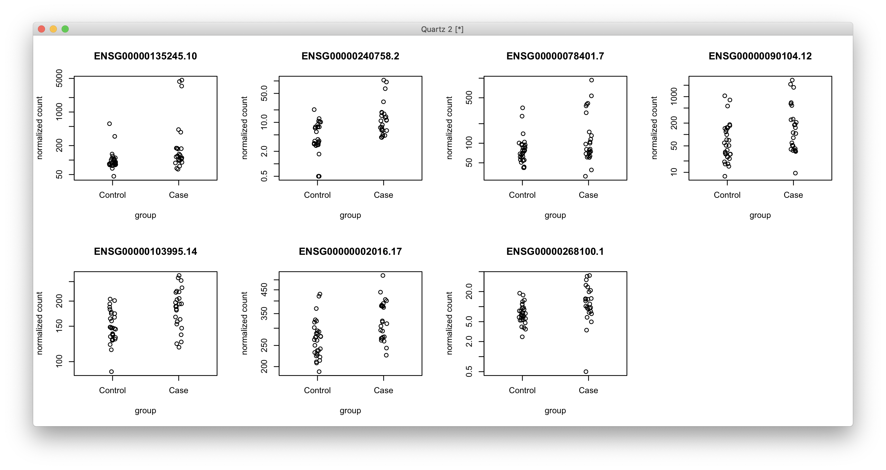
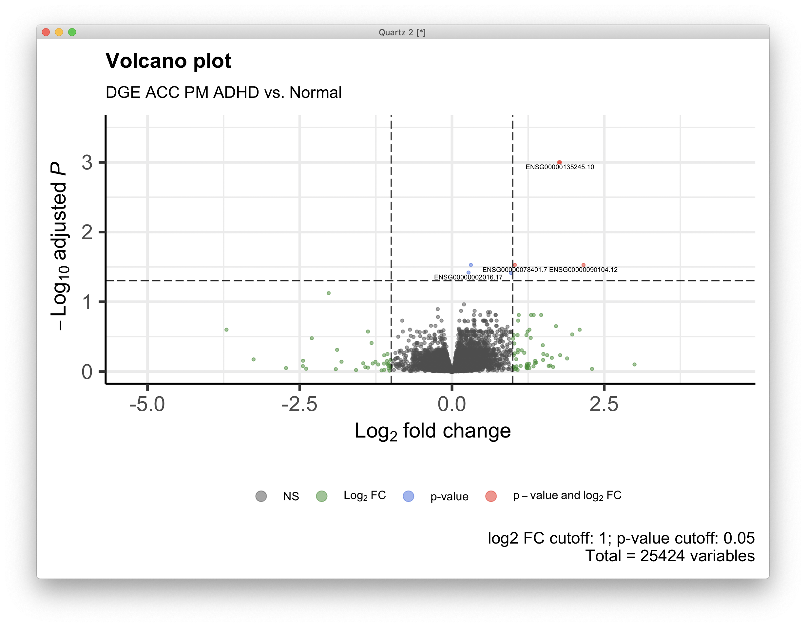
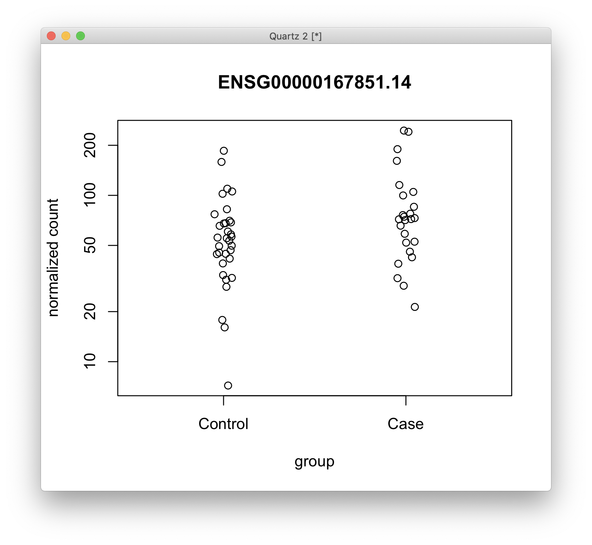
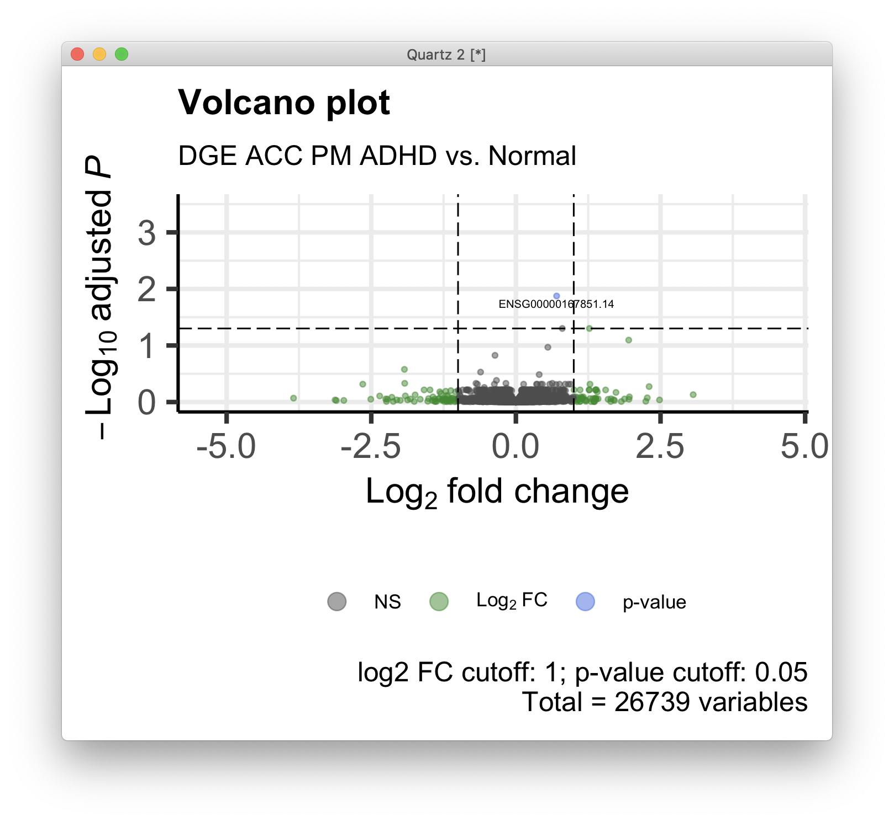

# 2021-01-13 13:52:09

Re-running the summary analysis for DGE, DTE, and DTU so far.

## DGE ACC

```r
myregion = 'ACC'
data = readRDS('~/data/rnaseq_derek/complete_rawCountData_05132020.rds')
rownames(data) = data$submitted_name  # just to ensure compatibility later
# remove obvious outlier (that's NOT caudate) labeled as ACC
rm_me = rownames(data) %in% c('68080')
data = data[!rm_me, ]
data = data[data$Region==myregion, ]
library(gdata)
more = read.xls('~/data/post_mortem/POST_MORTEM_META_DATA_JAN_2021.xlsx')
more = more[!duplicated(more$hbcc_brain_id),]
data = merge(data, more[, c('hbcc_brain_id', 'comorbid_group_update',
                            'substance_group', 'evidence_level')],
             by='hbcc_brain_id', all.x=T, all.y=F)

# at this point we have 55 samples for ACC
grex_vars = colnames(data)[grepl(colnames(data), pattern='^ENS')]
count_matrix = t(data[, grex_vars])
data = data[, !grepl(colnames(data), pattern='^ENS')]
# data only contains sample metadata, and count_matrix has actual counts

# cleaning up some variables
data$POP_CODE = as.character(data$POP_CODE)
data[data$POP_CODE=='WNH', 'POP_CODE'] = 'W'
data[data$POP_CODE=='WH', 'POP_CODE'] = 'W'
data$POP_CODE = factor(data$POP_CODE)
data$Individual = factor(data$hbcc_brain_id)
data[data$Manner.of.Death=='Suicide (probable)', 'Manner.of.Death'] = 'Suicide'
data[data$Manner.of.Death=='unknown', 'Manner.of.Death'] = 'natural'
data$MoD = factor(data$Manner.of.Death)
data$batch = factor(as.numeric(data$run_date))
data$Diagnosis = factor(data$Diagnosis, levels=c('Control', 'Case'))
data$substance_group = factor(data$substance_group)
data$comorbid_group = factor(data$comorbid_group_update)
data$evidence_level = factor(data$evidence_level)

# removing genes with zero or near-zero variance
library(caret)
pp_order = c('zv', 'nzv')
pp = preProcess(t(count_matrix), method = pp_order)
X = predict(pp, t(count_matrix))
geneCounts = t(X)

# removing everything but autosomes
library(GenomicFeatures)
txdb <- loadDb('~/data/post_mortem/Homo_sapies.GRCh38.97.sqlite')
txdf <- select(txdb, keys(txdb, "GENEID"), columns=c('GENEID','TXCHROM'),
               "GENEID")
# store gene names in geneCoiunts without version in end of name
noversion = data.frame(GENEID = substr(rownames(geneCounts), 1, 15))
noversion = merge(noversion, txdf, by='GENEID', sort=F)
imautosome = which(noversion$TXCHROM != 'X' &
                   noversion$TXCHROM != 'Y' &
                   noversion$TXCHROM != 'MT')
geneCounts = geneCounts[imautosome, ]
noversion = noversion[imautosome, ]

# checking which PCs are associated with our potential nuiscance variables
set.seed(42)
lcpm.pca <- prcomp(t(geneCounts), scale=TRUE)
# how many PCs to keep... using Kaiser thredhold, close to eigenvalues < 1
library(nFactors)
eigs <- lcpm.pca$sdev^2
nS = nScree(x=eigs)
keep_me = 1:nS$Components$nkaiser
mydata = data.frame(lcpm.pca$x[, keep_me])
# create main metadata data frame including metadata and PCs
data.pm = cbind(data, mydata)
rownames(data.pm) = data$hbcc_brain_id

# check which PCs are associated at nominal p<.01
num_vars = c('pcnt_optical_duplicates', 'clusters', 'Age', 'RINe', 'PMI',
             'C1', 'C2', 'C3', 'C4', 'C5')
pc_vars = colnames(mydata)
num_corrs = matrix(nrow=length(num_vars), ncol=length(pc_vars),
                   dimnames=list(num_vars, pc_vars))
num_pvals = num_corrs
for (x in num_vars) {
    for (y in pc_vars) {
        res = cor.test(data.pm[, x], data.pm[, y])
        num_corrs[x, y] = res$estimate
        num_pvals[x, y] = res$p.value
    }
}

categ_vars = c('batch', 'Diagnosis', 'MoD', 'substance_group',
               'comorbid_group', 'POP_CODE', 'Sex', 'evidence_level')
categ_corrs = matrix(nrow=length(categ_vars), ncol=length(pc_vars),
                   dimnames=list(categ_vars, pc_vars))
categ_pvals = categ_corrs
for (x in categ_vars) {
    for (y in pc_vars) {
        res = kruskal.test(data.pm[, y], data.pm[, x])
        categ_corrs[x, y] = res$statistic
        categ_pvals[x, y] = res$p.value
    }
}

print(which(num_pvals < .01, arr.ind = T))
print(which(categ_pvals < .01, arr.ind = T))
```

```
                        row col
pcnt_optical_duplicates   1   1
clusters                  2   1
RINe                      4   2
pcnt_optical_duplicates   1   4
PMI                       5   4
               row col
batch            1   1
batch            1   4
evidence_level   8   4
```

```r
# removing genes with low expression
library(edgeR)
fm = ~ Diagnosis + PC1 + PC2 + PC4
design=model.matrix(fm, data=data.pm)
isexpr <- filterByExpr(geneCounts, design=design)
geneCountsExpr = geneCounts[isexpr,]
genesExpr = noversion[isexpr,]

# preparing DESeqData and running main analysis
countdata = round(geneCountsExpr)
colnames(countdata) = rownames(data.pm)
library(DESeq2)
dds <- DESeqDataSetFromMatrix(countData = countdata,
                              colData = data.pm,
                              design = fm)
dds <- DESeq(dds)
res <- results(dds, name = "Diagnosis_Case_vs_Control", alpha = 0.05)
print(summary(res))
```

```
out of 25424 with nonzero total read count
adjusted p-value < 0.05
LFC > 0 (up)       : 7, 0.028%
LFC < 0 (down)     : 0, 0%
outliers [1]       : 0, 0%
low counts [2]     : 0, 0%
(mean count < 1)
[1] see 'cooksCutoff' argument of ?results
[2] see 'independentFiltering' argument of ?results
```

Let's take a look at these 7 genes:

```r
quartz()
par(mfrow=c(2, 4))
for (g in 1:7) {
    topGene <- rownames(res)[sort(res$padj, index.return=T)$ix[g]]
    cat(topGene, '\n')
    plotCounts(dds, gene = topGene, intgroup=c("Diagnosis"))
}
```

 

And a brief list for the future:

```
ENSG00000135245.10 
ENSG00000240758.2 
ENSG00000078401.7 
ENSG00000090104.12 
ENSG00000103995.14 
ENSG00000002016.17 
ENSG00000268100.1 
```

We can beautify those plots later. For now, let's run GSEA:

```r
library(WebGestaltR)

data_dir = '~/data/rnaseq_derek/'
ncpu=6

region='acc'

ranks = -log(res$pvalue) * sign(res$log2FoldChange)
tmp2 = data.frame(geneid=substring(rownames(res), 1, 15), rank=ranks)
tmp2 = tmp2[order(ranks, decreasing=T),]

DBs = c(sprintf('my_%s_sets', region), # just to get GWAS and TWAS sets
        sprintf('%s_manySets_co0.990', region),
        sprintf('%s_manySets_co0.950', region),
        sprintf('%s_manySets', region))
for (db in DBs) {
    cat(region, db, '\n')
    db_file = sprintf('~/data/post_mortem/%s.gmt', db)
    project_name = sprintf('WG4_%s_%s_10K', region, db)
    enrichResult <- try(WebGestaltR(enrichMethod="GSEA",
                        organism="hsapiens",
                        enrichDatabaseFile=db_file,
                        enrichDatabaseType="genesymbol",
                        interestGene=tmp2,
                        outputDirectory = data_dir,
                        interestGeneType="ensembl_gene_id",
                        sigMethod="top", topThr=150000,
                        minNum=3, projectName=project_name,
                        isOutput=T, isParallel=T,
                        nThreads=ncpu, perNum=10000, maxNum=800))
    out_fname = sprintf('%s/WG4_%s_%s_10K.csv', data_dir, region, db)
    write.csv(enrichResult, file=out_fname, row.names=F)
}

DBs = c('geneontology_Biological_Process_noRedundant',
        'geneontology_Cellular_Component_noRedundant',
        'geneontology_Molecular_Function_noRedundant')
for (db in DBs) {
    cat(region, db, '\n')
    project_name = sprintf('WG4_%s_%s_10K', region, db)
    enrichResult <- WebGestaltR(enrichMethod="GSEA",
                                organism="hsapiens",
                                enrichDatabase=db,
                                interestGene=tmp2,
                                interestGeneType="ensembl_gene_id",
                                sigMethod="top", topThr=150000,
                                outputDirectory = data_dir,
                                minNum=5, projectName=project_name,
                                isOutput=T, isParallel=T,
                                nThreads=ncpu, perNum=10000)
    out_fname = sprintf('%s/WG4_%s_%s_10K.csv', data_dir, region, db)
    write.csv(enrichResult, file=out_fname, row.names=F)
}
```

And let's also make a volcano plot:

```r
library(EnhancedVolcano)
pCutoff = 0.05
FCcutoff = 1.0

p = EnhancedVolcano(data.frame(res), lab = rownames(res), x = 'log2FoldChange',
                    y = 'padj', xlab = bquote(~Log[2]~ 'fold change'),
                    selectLab = rownames(res)[res$padj < .05],
                    ylab = bquote(~-Log[10]~adjusted~italic(P)),
                    ylim = c(0, 3.5),
                    pCutoff = pCutoff, FCcutoff = FCcutoff, pointSize = 1.0,
                    labSize = 2.0, title = "Volcano plot",
                    subtitle = "DGE ACC PM ADHD vs. Normal",
                    caption = paste0('log2 FC cutoff: ', FCcutoff,
                                     '; p-value cutoff: ', pCutoff,
                                     '\nTotal = ', nrow(res), ' variables'),
                    legendPosition = 'bottom', legendLabSize = 10,
                    legendIconSize = 4.0)
print(p)
```



Finally, rename the results so we can run comparisons later:

```r
dge_acc = res
GE_acc = dds
```

## DGE caudate

We repeat the same stuff, but now for the Caudate. I'll only repeat the bits of
the code that change. For example, the PCA results:

```
                        row col
pcnt_optical_duplicates   1   1
clusters                  2   1
RINe                      4   3
      row col
batch   1   1
batch   1   4
batch   1   5
batch   1   6
batch   1   8
```

which makes:

```r
fm = ~ Diagnosis + PC1 + PC3 + PC4 + PC5 + PC6 + PC8
```

```
out of 26739 with nonzero total read count
adjusted p-value < 0.05
LFC > 0 (up)       : 1, 0.0037%
LFC < 0 (down)     : 0, 0%
outliers [1]       : 0, 0%
low counts [2]     : 0, 0%
(mean count < 1)
[1] see 'cooksCutoff' argument of ?results
[2] see 'independentFiltering' argument of ?results

ENSG00000167851.14
```





As usual, the Caudate results aren't as strong. 

```r
dge_caudate = res
GE_caudate = dds
```

## DTE ACC

## DTE Caudate

## DTU ACC

## DTU Caudate
