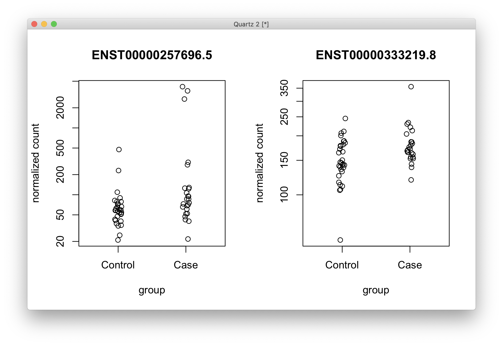

# 2021-01-13 13:52:09

Re-running the summary analysis for DGE, DTE, and DTU so far.

## DGE ACC

```r
myregion = 'ACC'
data = readRDS('~/data/rnaseq_derek/complete_rawCountData_05132020.rds')
rownames(data) = data$submitted_name  # just to ensure compatibility later
# remove obvious outlier (that's NOT caudate) labeled as ACC
rm_me = rownames(data) %in% c('68080')
data = data[!rm_me, ]
data = data[data$Region==myregion, ]
library(gdata)
more = read.xls('~/data/post_mortem/POST_MORTEM_META_DATA_JAN_2021.xlsx')
more = more[!duplicated(more$hbcc_brain_id),]
data = merge(data, more[, c('hbcc_brain_id', 'comorbid_group_update',
                            'substance_group', 'evidence_level')],
             by='hbcc_brain_id', all.x=T, all.y=F)

# at this point we have 55 samples for ACC
grex_vars = colnames(data)[grepl(colnames(data), pattern='^ENS')]
count_matrix = t(data[, grex_vars])
data = data[, !grepl(colnames(data), pattern='^ENS')]
# data only contains sample metadata, and count_matrix has actual counts

# cleaning up some variables
data$POP_CODE = as.character(data$POP_CODE)
data[data$POP_CODE=='WNH', 'POP_CODE'] = 'W'
data[data$POP_CODE=='WH', 'POP_CODE'] = 'W'
data$POP_CODE = factor(data$POP_CODE)
data$Individual = factor(data$hbcc_brain_id)
data[data$Manner.of.Death=='Suicide (probable)', 'Manner.of.Death'] = 'Suicide'
data[data$Manner.of.Death=='unknown', 'Manner.of.Death'] = 'natural'
data$MoD = factor(data$Manner.of.Death)
data$batch = factor(as.numeric(data$run_date))
data$Diagnosis = factor(data$Diagnosis, levels=c('Control', 'Case'))
data$substance_group = factor(data$substance_group)
data$comorbid_group = factor(data$comorbid_group_update)
data$evidence_level = factor(data$evidence_level)

# removing genes with zero or near-zero variance
library(caret)
pp_order = c('zv', 'nzv')
pp = preProcess(t(count_matrix), method = pp_order)
X = predict(pp, t(count_matrix))
geneCounts = t(X)

# removing everything but autosomes
library(GenomicFeatures)
txdb <- loadDb('~/data/post_mortem/Homo_sapies.GRCh38.97.sqlite')
txdf <- select(txdb, keys(txdb, "GENEID"), columns=c('GENEID','TXCHROM'),
               "GENEID")
# store gene names in geneCoiunts without version in end of name
noversion = data.frame(GENEID = substr(rownames(geneCounts), 1, 15))
noversion = merge(noversion, txdf, by='GENEID', sort=F)
imautosome = which(noversion$TXCHROM != 'X' &
                   noversion$TXCHROM != 'Y' &
                   noversion$TXCHROM != 'MT')
geneCounts = geneCounts[imautosome, ]
noversion = noversion[imautosome, ]

# removing genes with low expression
library(edgeR)
isexpr <- filterByExpr(geneCounts, group=data$Diagnosis)
geneCountsExpr = geneCounts[isexpr,]
genesExpr = noversion[isexpr,]

# checking which PCs are associated with our potential nuiscance variables
set.seed(42)
lcpm.pca <- prcomp(t(geneCountsExpr), scale=TRUE)
# how many PCs to keep... using Kaiser thredhold, close to eigenvalues < 1
library(nFactors)
eigs <- lcpm.pca$sdev^2
nS = nScree(x=eigs)
keep_me = 1:nS$Components$nkaiser
mydata = data.frame(lcpm.pca$x[, keep_me])
# create main metadata data frame including metadata and PCs
data.pm = cbind(data, mydata)
rownames(data.pm) = data$hbcc_brain_id

# check which PCs are associated at nominal p<.01
num_vars = c('pcnt_optical_duplicates', 'clusters', 'Age', 'RINe', 'PMI',
             'C1', 'C2', 'C3', 'C4', 'C5')
pc_vars = colnames(mydata)
num_corrs = matrix(nrow=length(num_vars), ncol=length(pc_vars),
                   dimnames=list(num_vars, pc_vars))
num_pvals = num_corrs
for (x in num_vars) {
    for (y in pc_vars) {
        res = cor.test(data.pm[, x], data.pm[, y])
        num_corrs[x, y] = res$estimate
        num_pvals[x, y] = res$p.value
    }
}

categ_vars = c('batch', 'Diagnosis', 'MoD', 'substance_group',
               'comorbid_group', 'POP_CODE', 'Sex', 'evidence_level')
categ_corrs = matrix(nrow=length(categ_vars), ncol=length(pc_vars),
                   dimnames=list(categ_vars, pc_vars))
categ_pvals = categ_corrs
for (x in categ_vars) {
    for (y in pc_vars) {
        res = kruskal.test(data.pm[, y], data.pm[, x])
        categ_corrs[x, y] = res$statistic
        categ_pvals[x, y] = res$p.value
    }
}

print(which(num_pvals < .01, arr.ind = T))
print(which(categ_pvals < .01, arr.ind = T))
```

```
                        row col
pcnt_optical_duplicates   1   1
clusters                  2   1
RINe                      4   2
pcnt_optical_duplicates   1   3
PMI                       5   3
               row col
batch            1   1
batch            1   3
evidence_level   8   3
```

```r
fm = ~ Diagnosis + PC1 + PC2 + PC3
design=model.matrix(fm, data=data.pm)

# preparing DESeqData and running main analysis
countdata = round(geneCountsExpr)
colnames(countdata) = rownames(data.pm)
library(DESeq2)
dds <- DESeqDataSetFromMatrix(countData = countdata,
                              colData = data.pm,
                              design = fm)
dds <- DESeq(dds)
library(IHW)
resIHW <- results(dds, name = "Diagnosis_Case_vs_Control", alpha = 0.05,
                  filterFun=ihw)
print(summary(resIHW))
```

```
out of 22203 with nonzero total read count
adjusted p-value < 0.05
LFC > 0 (up)       : 2, 0.009%
LFC < 0 (down)     : 0, 0%
outliers [1]       : 0, 0%
[1] see 'cooksCutoff' argument of ?results
see metadata(res)$ihwResult on hypothesis weighting
```

Let's take a look at these 2 genes:

```r
quartz()
par(mfrow=c(1, 2))
for (g in 1:2) {
    topGene <- rownames(resIHW)[sort(resIHW$padj, index.return=T)$ix[g]]
    cat(topGene, '\n')
    plotCounts(dds, gene = topGene, intgroup=c("Diagnosis"))
}
```


And a brief list for the future:

```
ENSG00000135245.10 
ENSG00000103995.14
```

We can beautify those plots later. For now, let's run GSEA:

```r
library(WebGestaltR)

data_dir = '~/data/rnaseq_derek/'
ncpu=2

region='acc'

ranks = -log(resIHW$pvalue) * sign(resIHW$log2FoldChange)
tmp2 = data.frame(geneid=substring(rownames(resIHW), 1, 15), rank=ranks)
tmp2 = tmp2[order(ranks, decreasing=T),]

DBs = c(sprintf('my_%s_sets', region), # just to get GWAS and TWAS sets
        sprintf('%s_manySets_co0.990', region),
        sprintf('%s_manySets_co0.950', region),
        sprintf('%s_manySets', region))
for (db in DBs) {
    cat(region, db, '\n')
    db_file = sprintf('~/data/post_mortem/%s.gmt', db)
    project_name = sprintf('WG5_%s_%s_10K', region, db)
    enrichResult <- try(WebGestaltR(enrichMethod="GSEA",
                        organism="hsapiens",
                        enrichDatabaseFile=db_file,
                        enrichDatabaseType="genesymbol",
                        interestGene=tmp2,
                        outputDirectory = data_dir,
                        interestGeneType="ensembl_gene_id",
                        sigMethod="top", topThr=150000,
                        minNum=3, projectName=project_name,
                        isOutput=T, isParallel=T,
                        nThreads=ncpu, perNum=10000, maxNum=800))
    out_fname = sprintf('%s/WG5_%s_%s_10K.csv', data_dir, region, db)
    write.csv(enrichResult, file=out_fname, row.names=F)
}

DBs = c('geneontology_Biological_Process_noRedundant',
        'geneontology_Cellular_Component_noRedundant',
        'geneontology_Molecular_Function_noRedundant')
for (db in DBs) {
    cat(region, db, '\n')
    project_name = sprintf('WG5_%s_%s_10K', region, db)
    enrichResult <- WebGestaltR(enrichMethod="GSEA",
                                organism="hsapiens",
                                enrichDatabase=db,
                                interestGene=tmp2,
                                interestGeneType="ensembl_gene_id",
                                sigMethod="top", topThr=150000,
                                outputDirectory = data_dir,
                                minNum=5, projectName=project_name,
                                isOutput=T, isParallel=T,
                                nThreads=ncpu, perNum=10000)
    out_fname = sprintf('%s/WG5_%s_%s_10K.csv', data_dir, region, db)
    write.csv(enrichResult, file=out_fname, row.names=F)
}
```

And let's also make a volcano plot:

```r
library(EnhancedVolcano)
pCutoff = 0.05
FCcutoff = 1.0

p = EnhancedVolcano(data.frame(resIHW), lab = rownames(resIHW),
                    x = 'log2FoldChange',
                    y = 'padj', xlab = bquote(~Log[2]~ 'fold change'),
                    selectLab = rownames(resIHW)[resIHW$padj < .05],
                    ylab = bquote(~-Log[10]~adjusted~italic(P)),
                    ylim = c(0, 2),
                    pCutoff = pCutoff, FCcutoff = FCcutoff, pointSize = 1.0,
                    labSize = 2.0, title = "Volcano plot",
                    subtitle = "DGE ACC PM ADHD vs. Normal",
                    caption = paste0('log2 FC cutoff: ', FCcutoff,
                                     '; p-value cutoff: ', pCutoff,
                                     '\nTotal = ', nrow(resIHW), ' variables'),
                    legendPosition = 'bottom', legendLabSize = 10,
                    legendIconSize = 4.0)
print(p)
```


ENSG00000103995.14 is CEP152, which is related to centrosome function and
microcephaly. ENSG00000135245.10 is HILPDA, related to hypoxia, cell growth and
proliferation.

Finally, rename the results so we can run comparisons later:

```r
dge_acc = resIHW
GE_acc = dds
save(dge_acc, GE_acc, file='~/data/rnaseq_derek/DGE_ACC.RData')
```

As a quick note to self: if I do the PCA before filtering genes I get 7 FDR
survivors, but I lose my GWAS GSEA. Maybe just the PRS result (if we get it)
would be enough?

## DGE caudate

We repeat the same stuff, but now for the Caudate. I'll only repeat the bits of
the code that change. For example, the PCA results:

```
                        row col
pcnt_optical_duplicates   1   1
clusters                  2   1
pcnt_optical_duplicates   1   3
RINe                      4   3
      row col
batch   1   1
batch   1   3
batch   1   6
```

which makes:

```r
fm = ~ Diagnosis + PC1 + PC3 + PC6
```

```
out of 22222 with nonzero total read count
adjusted p-value < 0.05
LFC > 0 (up)       : 1, 0.0045%
LFC < 0 (down)     : 0, 0%
outliers [1]       : 0, 0%
[1] see 'cooksCutoff' argument of ?results
see metadata(res)$ihwResult on hypothesis weighting

ENSG00000135245.10
```


As usual, the Caudate results aren't as strong. 

```r
dge_caudate = resIHW
GE_caudate = dds
save(dge_caudate, GE_caudate, file='~/data/rnaseq_derek/DGE_Caudate.RData')
```

## DTE ACC

Now we go on to the DTE analysis. I used the same filtering scheme used later
for DRIMSeq, because the edgeR filtering function was still leaving too many
transcripts with zero expression in many subjects. In the end, we use stageR for
the 2-stage comparison correction.

```r
load('~/data/isoforms/tximport_rsem_DTE.RData')
txi = rsem
myregion = 'ACC'

# I'll just use the metadata from here
data = readRDS('~/data/rnaseq_derek/complete_rawCountData_05132020.rds')
rownames(data) = data$submitted_name  # just to ensure compatibility later
data = data[data$Region==myregion, ]
library(gdata)
more = read.xls('~/data/post_mortem/POST_MORTEM_META_DATA_JAN_2021.xlsx')
more = more[!duplicated(more$hbcc_brain_id),]
data = merge(data, more[, c('hbcc_brain_id', 'comorbid_group_update',
                            'substance_group', 'evidence_level')],
             by='hbcc_brain_id', all.x=T, all.y=F)
# samples has only the metadata now
samples = data[, !grepl(colnames(data), pattern='^ENS')]

# remove samples for the other brain region from the tx counts matrices
keep_me = colnames(txi$counts) %in% samples$submitted_name
for (i in c('abundance', 'counts', 'length')) {
    txi[[i]] = txi[[i]][, keep_me]
}
# sort samples to match order in tximport matrices
rownames(samples) = samples$submitted_name
samples = samples[colnames(txi$counts), ]

# cleaning up some metadata
samples$POP_CODE = as.character(samples$POP_CODE)
samples[samples$POP_CODE=='WNH', 'POP_CODE'] = 'W'
samples[samples$POP_CODE=='WH', 'POP_CODE'] = 'W'
samples$POP_CODE = factor(samples$POP_CODE)
samples$Individual = factor(samples$hbcc_brain_id)
samples[samples$Manner.of.Death=='Suicide (probable)', 'Manner.of.Death'] = 'Suicide'
samples[samples$Manner.of.Death=='unknown', 'Manner.of.Death'] = 'natural'
samples$MoD = factor(samples$Manner.of.Death)
samples$batch = factor(as.numeric(samples$run_date))
samples$Diagnosis = factor(samples$Diagnosis, levels=c('Control', 'Case'))
samples$substance_group = factor(samples$substance_group)
samples$comorbid_group = factor(samples$comorbid_group_update)
samples$evidence_level = factor(samples$evidence_level)

cts = txi$counts
cts = cts[rowSums(cts) > 0,]

# remove transcripts with zero or near zero variance
library(caret)
pp_order = c('zv', 'nzv')
pp = preProcess(t(cts), method = pp_order)
X = predict(pp, t(cts))
txCounts = t(X)

# keep only the remaining transcripts and their corresponding genes
txdf.sub = txdf[match(rownames(txCounts), txdf$TXNAME),]
counts = data.frame(gene_id = txdf.sub$GENEID, feature_id = txdf.sub$TXNAME)
counts = cbind(counts, txCounts)

library(DRIMSeq)
samples$group = samples$Diagnosis
samples$sample_id = as.character(samples$submitted_name)
d0 = dmDSdata(counts = counts, samples = samples)

n = nrow(samples)
n.small = min(table(samples$group))

d = DRIMSeq::dmFilter(d0,
                      min_samps_feature_expr = n.small, min_feature_expr = 10,
                      min_samps_feature_prop = n.small, min_feature_prop = 0.1,
                      min_samps_gene_expr = n, min_gene_expr = 10)

countData = round(as.matrix(counts(d)[,-c(1:2)]))

# determining which PCs to remove later
set.seed(42)
pca <- prcomp(t(countData), scale=TRUE)

library(nFactors)
eigs <- pca$sdev^2
nS = nScree(x=eigs)
keep_me = 1:nS$Components$nkaiser
mydata = data.frame(pca$x[, keep_me])
data.pm = cbind(samples, mydata)
rownames(data.pm) = samples$submitted_name
num_vars = c('pcnt_optical_duplicates', 'clusters', 'Age', 'RINe', 'PMI',
             'C1', 'C2', 'C3', 'C4', 'C5')
pc_vars = colnames(mydata)
num_corrs = matrix(nrow=length(num_vars), ncol=length(pc_vars),
                   dimnames=list(num_vars, pc_vars))
num_pvals = num_corrs
for (x in num_vars) {
    for (y in pc_vars) {
        res = cor.test(samples[, x], mydata[, y])
        num_corrs[x, y] = res$estimate
        num_pvals[x, y] = res$p.value
    }
}

categ_vars = c('batch', 'Diagnosis', 'MoD', 'substance_group',
               'comorbid_group', 'POP_CODE', 'Sex', 'evidence_level')
categ_corrs = matrix(nrow=length(categ_vars), ncol=length(pc_vars),
                   dimnames=list(categ_vars, pc_vars))
categ_pvals = categ_corrs
for (x in categ_vars) {
    for (y in pc_vars) {
        res = kruskal.test(mydata[, y], samples[, x])
        categ_corrs[x, y] = res$statistic
        categ_pvals[x, y] = res$p.value
    }
}

print(which(num_pvals < .01, arr.ind = T))
print(which(categ_pvals < .01, arr.ind = T))
```

```
                        row col
pcnt_optical_duplicates   1   1
clusters                  2   1
RINe                      4   2
pcnt_optical_duplicates   1   3
PMI                       5   3
RINe                      4   4
      row col
batch   1   1
batch   1   3
```

```r
fm = ~ Diagnosis + PC1 + PC2 + PC3 + PC4
library(DESeq2)
rownames(countData) = counts(d)[, 2]
dds <- DESeqDataSetFromMatrix(countData = countData,
                              colData = data.pm,
                              design = fm)
dds <- DESeq(dds)
res <- results(dds, name = "Diagnosis_Case_vs_Control", alpha = 0.05)
```

```
r$> summary(res)                                                                           

out of 24482 with nonzero total read count
adjusted p-value < 0.05
LFC > 0 (up)       : 2, 0.0082%
LFC < 0 (down)     : 0, 0%
outliers [1]       : 0, 0%
low counts [2]     : 0, 0%
(mean count < 8)
[1] see 'cooksCutoff' argument of ?results
[2] see 'independentFiltering' argument of ?results
```

```r
quartz()
par(mfrow=c(1, 2))
for (g in 1:2) {
    topTx <- rownames(res)[sort(res$padj, index.return=T)$ix[g]]
    cat(topTx, '\n')
    plotCounts(dds, gene = topTx, intgroup=c("Diagnosis"))
}
```



They're not stellar examples, but they are both confirmed below.

```
ENST00000257696.5 
ENST00000333219.8 
```

Moving on to stageR:

```r
### stage-wise testing
library(stageR)
library(dplyr)

pConfirmation <- matrix(res$pvalue, ncol=1)
dimnames(pConfirmation) <- list(rownames(res), c("transcript"))
# select one qval per gene (min over transcripts)
m = merge(as.data.frame(res), txdf, by.x=0, by.y='TXNAME')
qvals = m %>% group_by(GENEID) %>% slice_min(n=1, padj, with_ties=F)
pScreen = qvals$padj
names(pScreen) = qvals$GENEID

stageRObj = stageRTx(pScreen=pScreen, pConfirmation=pConfirmation,
                     pScreenAdjusted=TRUE, tx2gene=txdf)
stageRObj = stageWiseAdjustment(stageRObj, method="dte", alpha=0.05)
print(getSignificantGenes(stageRObj))
print(getSignificantTx(stageRObj))
```

```
                   FDR adjusted p-value
ENSG00000135245.10         5.876053e-05
ENSG00000153487.12         2.587632e-02

                  stage-wise adjusted p-value
ENST00000257696.5                1.132152e-05
ENST00000333219.8                9.971295e-03
```

And let's do a Volcano plot, but using the FDR values from DESeq2, because
stageR wouldn't make sense here because it'd be the second step.

```r
library(EnhancedVolcano)
pCutoff = 0.05
FCcutoff = 1.0

p = EnhancedVolcano(data.frame(res), lab = rownames(res), x = 'log2FoldChange',
                    y = 'padj', xlab = bquote(~Log[2]~ 'fold change'),
                    ylab = bquote(~-Log[10]~adjusted~italic(P)),
                    ylim = c(0, 5),
                    pCutoff = pCutoff, FCcutoff = FCcutoff, pointSize = 1.0,
                    labSize = 2.0, title = "Volcano plot",
                    subtitle = "DTE ACC PM ADHD vs. Normal",
                    caption = paste0('log2 FC cutoff: ', FCcutoff,
                                     '; p-value cutoff: ', pCutoff,
                                     '\nTotal = ', nrow(res), ' variables'),
                    legendPosition = 'bottom', legendLabSize = 10,
                    legendIconSize = 4.0)
print(p)
```


Let's save the results for future comparison:

```r
dte_acc = res
TE_acc = dds
stageR_dte_acc = stageRObj
save(dte_acc, TE_acc, stageR_dte_acc, file='~/data/isoforms/DTE_ACC.RData')
```

## DTE Caudate

Just re-using the ACC DTE code and changing where appropriate:

```
                        row col
pcnt_optical_duplicates   1   1
clusters                  2   1
pcnt_optical_duplicates   1   2
RINe                      4   2
RINe                      4   4
               row col
batch            1   1
batch            1   2
MoD              3   6
batch            1   7
comorbid_group   5   8
```

```r
fm = ~ Diagnosis + PC1 + PC2 + PC4 + PC6 + PC7 + PC8
library(DESeq2)
rownames(countData) = counts(d)[, 2]
dds <- DESeqDataSetFromMatrix(countData = countData,
                              colData = data.pm,
                              design = fm)
dds <- DESeq(dds)
res <- results(dds, name = "Diagnosis_Case_vs_Control", alpha = 0.05)
print(summary(res))
```

```
out of 25613 with nonzero total read count
adjusted p-value < 0.05
LFC > 0 (up)       : 0, 0%
LFC < 0 (down)     : 0, 0%
outliers [1]       : 0, 0%
low counts [2]     : 0, 0%
(mean count < 7)
[1] see 'cooksCutoff' argument of ?results
[2] see 'independentFiltering' argument of ?results
```

Nothing significant under q < .05 for Caudate. And nothing to be confirmed in stageR.

We can a Volcano plot just in case:

```r
library(EnhancedVolcano)
pCutoff = 0.05
FCcutoff = 1.0

p = EnhancedVolcano(data.frame(res), lab = rownames(res), x = 'log2FoldChange',
                    y = 'padj', xlab = bquote(~Log[2]~ 'fold change'),
                    ylab = bquote(~-Log[10]~adjusted~italic(P)),
                    ylim = c(0, 2.5),
                    pCutoff = pCutoff, FCcutoff = FCcutoff, pointSize = 1.0,
                    labSize = 2.0, title = "Volcano plot",
                    subtitle = "DTE Caudate PM ADHD vs. Normal",
                    caption = paste0('log2 FC cutoff: ', FCcutoff,
                                     '; p-value cutoff: ', pCutoff,
                                     '\nTotal = ', nrow(res), ' variables'),
                    legendPosition = 'bottom', legendLabSize = 10,
                    legendIconSize = 4.0)
print(p)
```


Let's save the results for future comparison:

```r
dte_caudate = res
TE_caudate = dds
save(dte_caudate, TE_caudate, file='~/data/isoforms/DTE_Caudate.RData')
```


## DTU ACC

Let's finish this with the DTU analysis, which uses DRIMSeq instead:

```r
load('~/data/isoforms/tximport_rsem_DTU.RData')
txi = rsem
myregion = 'ACC'

# I'll just use the metadata from here
data = readRDS('~/data/rnaseq_derek/complete_rawCountData_05132020.rds')
rownames(data) = data$submitted_name  # just to ensure compatibility later
data = data[data$Region==myregion, ]
library(gdata)
more = read.xls('~/data/post_mortem/POST_MORTEM_META_DATA_JAN_2021.xlsx')
more = more[!duplicated(more$hbcc_brain_id),]
data = merge(data, more[, c('hbcc_brain_id', 'comorbid_group_update',
                            'substance_group', 'evidence_level')],
             by='hbcc_brain_id', all.x=T, all.y=F)
# samples has only the metadata now
samples = data[, !grepl(colnames(data), pattern='^ENS')]

# remove samples for the other brain region from the tx counts matrices
keep_me = colnames(txi$counts) %in% samples$submitted_name
for (i in c('abundance', 'counts', 'length')) {
    txi[[i]] = txi[[i]][, keep_me]
}
# sort samples to match order in tximport matrices
rownames(samples) = samples$submitted_name
samples = samples[colnames(txi$counts), ]

# cleaning up some metadata
samples$POP_CODE = as.character(samples$POP_CODE)
samples[samples$POP_CODE=='WNH', 'POP_CODE'] = 'W'
samples[samples$POP_CODE=='WH', 'POP_CODE'] = 'W'
samples$POP_CODE = factor(samples$POP_CODE)
samples$Individual = factor(samples$hbcc_brain_id)
samples[samples$Manner.of.Death=='Suicide (probable)', 'Manner.of.Death'] = 'Suicide'
samples[samples$Manner.of.Death=='unknown', 'Manner.of.Death'] = 'natural'
samples$MoD = factor(samples$Manner.of.Death)
samples$batch = factor(as.numeric(samples$run_date))
samples$Diagnosis = factor(samples$Diagnosis, levels=c('Control', 'Case'))
samples$substance_group = factor(samples$substance_group)
samples$comorbid_group = factor(samples$comorbid_group_update)
samples$evidence_level = factor(samples$evidence_level)

cts = txi$counts
cts = cts[rowSums(cts) > 0,]

# remove transcripts with zero or near zero variance
library(caret)
pp_order = c('zv', 'nzv')
pp = preProcess(t(cts), method = pp_order)
X = predict(pp, t(cts))
txCounts = t(X)

# keep only the remaining transcripts and their corresponding genes
txdf.sub = txdf[match(rownames(txCounts), txdf$TXNAME),]
counts = data.frame(gene_id = txdf.sub$GENEID, feature_id = txdf.sub$TXNAME)
counts = cbind(counts, txCounts)

library(DRIMSeq)
samples$group = samples$Diagnosis
samples$sample_id = as.character(samples$submitted_name)
d0 = dmDSdata(counts = counts, samples = samples)

n = nrow(samples)
n.small = min(table(samples$group))

d = DRIMSeq::dmFilter(d0,
                      min_samps_feature_expr = n.small, min_feature_expr = 10,
                      min_samps_feature_prop = n.small, min_feature_prop = 0.1,
                      min_samps_gene_expr = n, min_gene_expr = 10)

countData = round(as.matrix(counts(d)[,-c(1:2)]))

set.seed(42)
pca <- prcomp(t(countData), scale=TRUE)

library(nFactors)
eigs <- pca$sdev^2
nS = nScree(x=eigs)
keep_me = 1:nS$Components$nkaiser
mydata = data.frame(pca$x[, keep_me])
data.pm = cbind(samples, mydata)
rownames(data.pm) = samples$submitted_name
num_vars = c('pcnt_optical_duplicates', 'clusters', 'Age', 'RINe', 'PMI',
             'C1', 'C2', 'C3', 'C4', 'C5')
pc_vars = colnames(mydata)
num_corrs = matrix(nrow=length(num_vars), ncol=length(pc_vars),
                   dimnames=list(num_vars, pc_vars))
num_pvals = num_corrs
for (x in num_vars) {
    for (y in pc_vars) {
        res = cor.test(samples[, x], mydata[, y])
        num_corrs[x, y] = res$estimate
        num_pvals[x, y] = res$p.value
    }
}

categ_vars = c('batch', 'Diagnosis', 'MoD', 'substance_group',
               'comorbid_group', 'POP_CODE', 'Sex', 'evidence_level')
categ_corrs = matrix(nrow=length(categ_vars), ncol=length(pc_vars),
                   dimnames=list(categ_vars, pc_vars))
categ_pvals = categ_corrs
for (x in categ_vars) {
    for (y in pc_vars) {
        res = kruskal.test(mydata[, y], samples[, x])
        categ_corrs[x, y] = res$statistic
        categ_pvals[x, y] = res$p.value
    }
}

print(which(num_pvals < .01, arr.ind = T))
print(which(categ_pvals < .01, arr.ind = T))
```

```
                        row col
pcnt_optical_duplicates   1   1
clusters                  2   1
clusters                  2   2
PMI                       5   2
RINe                      4   3
RINe                      4   4
               row col
batch            1   1
batch            1   2
evidence_level   8   2
batch            1   3
```

```r
design = model.matrix(~group + PC1 + PC2 + PC3 + PC4, data = data.pm)

set.seed(42)
system.time({
    d <- dmPrecision(d, design = design)
    d <- dmFit(d, design = design)
    d <- dmTest(d, coef = "groupCase")     
})
res.g = DRIMSeq::results(d)
res.t = DRIMSeq::results(d, level = "feature")

# make NA pvalues to be 1 so they don't screw up future steps
no.na <- function(x) ifelse(is.na(x), 1, x)
res.g$pvalue <- no.na(res.g$pvalue)
res.t$pvalue <- no.na(res.t$pvalue)
print(table(res.g$adj_pvalue < .05))
print(table(res.t$adj_pvalue < .05))
```

```
FALSE  TRUE 
10599    33 

FALSE  TRUE 
30827    50 
```

We have some results surviving FDR at both gene and transcript level. Let's do
some Diagnosis-agnostic screening to try to improve FDR and OFDR:

```r
# posthoc procedure to improve the false discovery rate (FDR) and overall false discovery rate (OFDR) control. It sets the p-values and adjusted p-values for transcripts with small per-sample proportion SD to 1

smallProportionSD <- function(d, filter = 0.1) {
        # Generate count table
        cts = as.matrix(subset(counts(d), select = -c(gene_id, feature_id)))
        # Summarise count total per gene
        gene.cts = rowsum(cts, counts(d)$gene_id)
        # Use total count per gene as count per transcript
        total.cts = gene.cts[match(counts(d)$gene_id, rownames(gene.cts)),]
        # Calculate proportion of transcript in gene
        props = cts/total.cts
        rownames(props) = rownames(total.cts)
        
        # Calculate standard deviation
        propSD = sqrt(matrixStats::rowVars(props))
        # Check if standard deviation of per-sample proportions is < 0.1
        propSD < filter
}

filt = smallProportionSD(d)

res.t.filt = DRIMSeq::results(d, level = "feature")
res.t.filt$pvalue[filt] = 1
res.t.filt$adj_pvalue[filt] = 1
res.t.filt$pvalue <- no.na(res.t.filt$pvalue)
print(table(filt))
print(table(res.t.filt$adj_pvalue < 0.05))
```

```
filt
FALSE  TRUE 
12865 17900 

FALSE  TRUE 
30896    38 
```

Keeping 12.8K transcripts for further investigation. We go down to 38
transcripts, instead of the original 50. Now we go on to the stageR procedure:

```r
strp <- function(x) substr(x,1,15)
# Construct a vector of per-gene p-values for the screening stage
pScreen = res.g$pvalue
names(pScreen) = strp(res.g$gene_id)
# Construct a one column matrix of the per-transcript confirmation p-values
pConfirmation = matrix(res.t.filt$pvalue, ncol = 1)
dimnames(pConfirmation) = list(strp(res.t.filt$feature_id), "transcript")
# res.t is used twice to construct a 4-column data.frame that contain both original IDs and IDs without version numbers
tx2gene = data.frame(res.t[,c("feature_id", "gene_id")], 
                     res.t[,c("feature_id", "gene_id")])
# remove version from gene name
for (i in 1:2) tx2gene[,i] = strp(tx2gene[,i])

library(stageR)
stageRObj = stageRTx(pScreen = pScreen, pConfirmation = pConfirmation, 
                     pScreenAdjusted = FALSE, tx2gene = tx2gene[,1:2])
stageRObj = stageWiseAdjustment(stageRObj, method = "dtu", alpha = 0.05)
drim.padj = getAdjustedPValues(stageRObj, order = FALSE,
                               onlySignificantGenes = TRUE)
# this summarizes the adjusted p-values from the two-stage analysis. Only genes that passed the filter are included in the table.
drim.padj = merge(tx2gene, drim.padj, by.x = c("gene_id","feature_id"),
                  by.y = c("geneID","txID"))
print(length(unique(drim.padj[drim.padj$gene < 0.05,]$gene_id)))
print(table(drim.padj$transcript < 0.05))
```

```
[1] 33

FALSE  TRUE 
   89    31 
```

There are 33 screened genes in this dataset, and 31 transcripts pass the
confirmation stage on a target 5% overall false discovery rate (OFDR).

Let's make a few plots:

```r
plotExpression <- function(expData = NULL, geneID = NULL, samps = NULL, isProportion = FALSE) {
        colnames(expData)[1:2] = c("gid","tid")
        sub = subset(expData, gid == geneID)
        sub = reshape2::melt(sub, id = c("gid", "tid"))
        sub = merge(samps, sub, by.x = "sample_id", by.y = "variable")
        if(!isProportion) {
                sub$value = log(sub$value)
        }

        clrs = c("dodgerblue3", "maroon2",  "forestgreen", "darkorange1", "blueviolet", "firebrick2",
"deepskyblue", "orchid2", "chartreuse3", "gold", "slateblue1", "tomato" , "blue", "magenta", "green3",
"yellow", "purple3", "red" ,"darkslategray1", "lightpink1", "lightgreen", "khaki1", "plum3", "salmon")

        p = ggplot(sub, aes(tid, value, color = group, fill = group)) +
        geom_boxplot(alpha = 0.4, outlier.shape = NA, width = 0.8, lwd = 0.5) +
        stat_summary(fun = mean, geom = "point", color = "black", shape = 5, size = 3, position=position_dodge(width = 0.8)) +
        scale_color_manual(values = clrs) + scale_fill_manual(values = clrs) +
        geom_quasirandom(color = "black", size = 1, dodge.width = 0.8) + theme_bw() +
        ggtitle(geneID) + xlab("Transcripts")

        if(!isProportion) {
                p = p + ylab("log(Expression)")
        } else {
                p = p + ylab("Proportions")
        }
        p
}

# condensing the counts to be converted to proportions
drim.prop = reshape2::melt(counts[counts$feature_id %in% proportions(d)$feature_id,], id = c("gene_id", "feature_id"))
drim.prop = drim.prop[order(drim.prop$gene_id, drim.prop$variable,
                      drim.prop$feature_id),]
# Calculate proportions from counts
library(dplyr)
library(ggplot2)
library(ggbeeswarm)
drim.prop2 = drim.prop %>%
        group_by(gene_id, variable) %>%
        mutate(total = sum(value)) %>%
        group_by(variable, add=TRUE) %>%
        mutate(prop = value/total)
drim.prop3 = reshape2::dcast(drim.prop2[,c(1,2,3,6)],
                            gene_id + feature_id ~ variable)

# checking out which genes are affected in DTU (expression switches among the
# isoforms of the gene)
print(unique(drim.padj[drim.padj$transcript < .05, 'gene_id']))

# plotting the top 10 genes
library(ggpubr)
gene_ids = unique(drim.padj[order(drim.padj$transcript, drim.padj$gene),]$gene_id.1)
myplots = list()
for (g in 1:10) {
    cat(gene_ids[g], '\n')
    myplots[[g]] = plotExpression(drim.prop3, gene_ids[g], samples,
                                  isProportion = TRUE)
}
ggarrange(plotlist=myplots, nrow=2, ncol=5)
```

```
 [1] "ENSG00000061936" "ENSG00000068831" "ENSG00000070371" "ENSG00000086848"
 [5] "ENSG00000100462" "ENSG00000103363" "ENSG00000109390" "ENSG00000111077"
 [9] "ENSG00000119950" "ENSG00000128833" "ENSG00000129933" "ENSG00000146776"
[13] "ENSG00000146963" "ENSG00000157741" "ENSG00000165476" "ENSG00000180902"
[17] "ENSG00000182247" "ENSG00000182871" "ENSG00000198933" "ENSG00000214176"
[21] "ENSG00000221968" "ENSG00000235478" "ENSG00000247572" "ENSG00000248115"
[25] "ENSG00000263072"
```


## DTU Caudate

Repeating ACC DTU code, but changing appropriately:

```
                        row col
pcnt_optical_duplicates   1   1
clusters                  2   1
pcnt_optical_duplicates   1   2
RINe                      4   2
PMI                       5   2
RINe                      4   4
RINe                      4   5
      row col
batch   1   1
batch   1   2
MoD     3   6
```

```r
design = model.matrix(~group + PC1 + PC2 + PC4 + PC5 + PC6, data = data.pm)
```

```
FALSE  TRUE 
11158    41 

FALSE  TRUE 
32965    48 
```

```
filt
FALSE  TRUE 
13028 19921 

FALSE  TRUE 
33073    43 
```

Keeping 13K transcripts for further investigation. We go down to 43
transcripts, instead of the original 48.

```
[1] 41

FALSE  TRUE 
   90    49 
```

There are 41 screened genes in this dataset, and 49 transcripts pass the
confirmation stage on a target 5% overall false discovery rate (OFDR).

These are the unique genes, and a plot of the top 10:

```
 [1] "ENSG00000070182" "ENSG00000073584" "ENSG00000080845" "ENSG00000082515"
 [5] "ENSG00000085276" "ENSG00000100181" "ENSG00000103363" "ENSG00000103876"
 [9] "ENSG00000104880" "ENSG00000105048" "ENSG00000105835" "ENSG00000112964"
[13] "ENSG00000113758" "ENSG00000114405" "ENSG00000114626" "ENSG00000117298"
[17] "ENSG00000118363" "ENSG00000124074" "ENSG00000129204" "ENSG00000130669"
[21] "ENSG00000134690" "ENSG00000139174" "ENSG00000146963" "ENSG00000149089"
[25] "ENSG00000157557" "ENSG00000166946" "ENSG00000170011" "ENSG00000185710"
[29] "ENSG00000189227" "ENSG00000189283" "ENSG00000196739" "ENSG00000197056"
[33] "ENSG00000198720" "ENSG00000214338" "ENSG00000260528" "ENSG00000270804"
```


# TODO
* do LD-score regression for GWAS results instead?
* run PRS
* decide if keeping PCA before or after filtering in DGE... or going back to
  limma results?
* anything now for ABCD FUSION or SPrediXcan?
* split by tx type?
* do we need the DTE results?