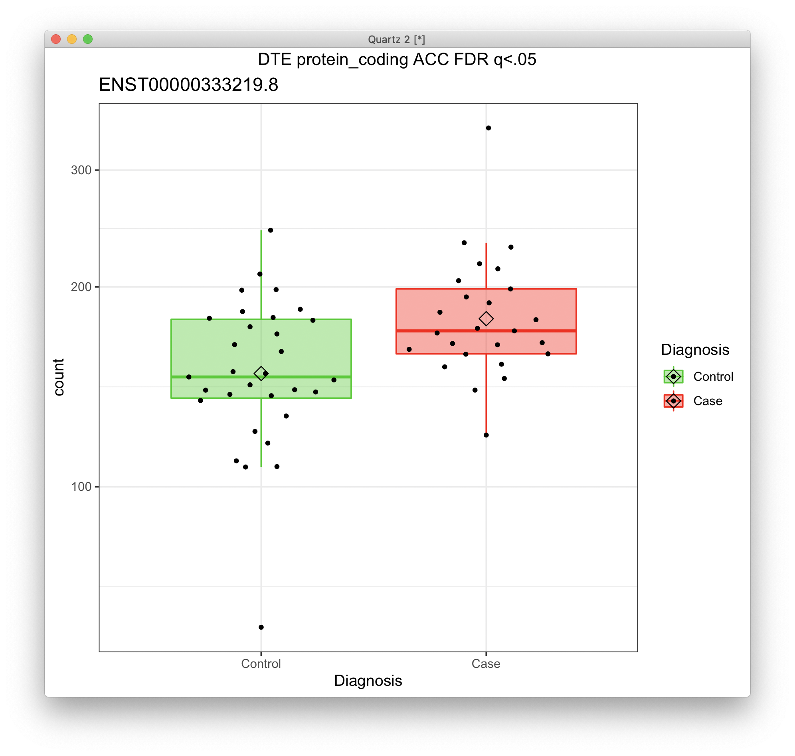
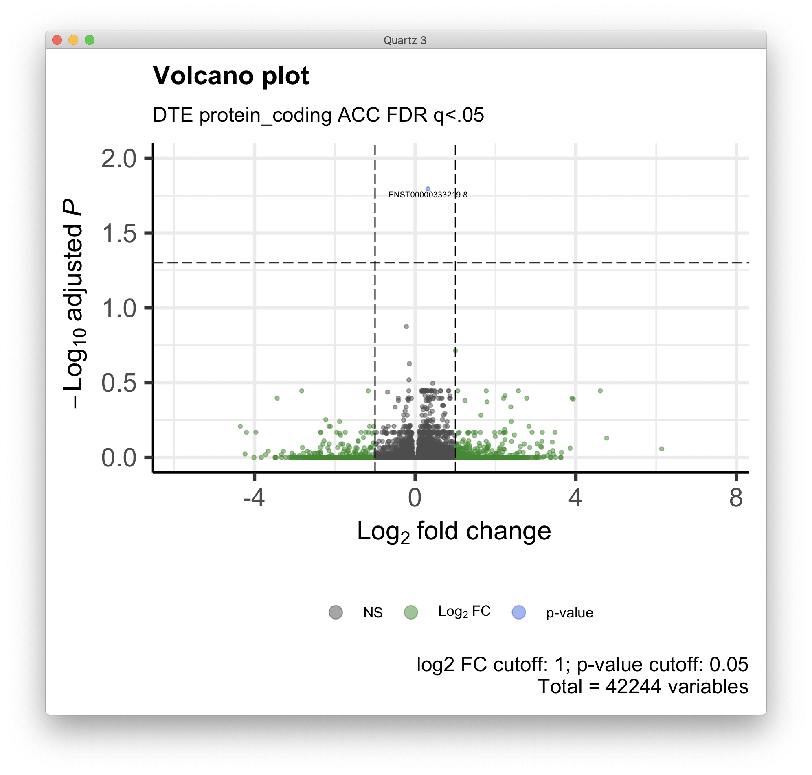
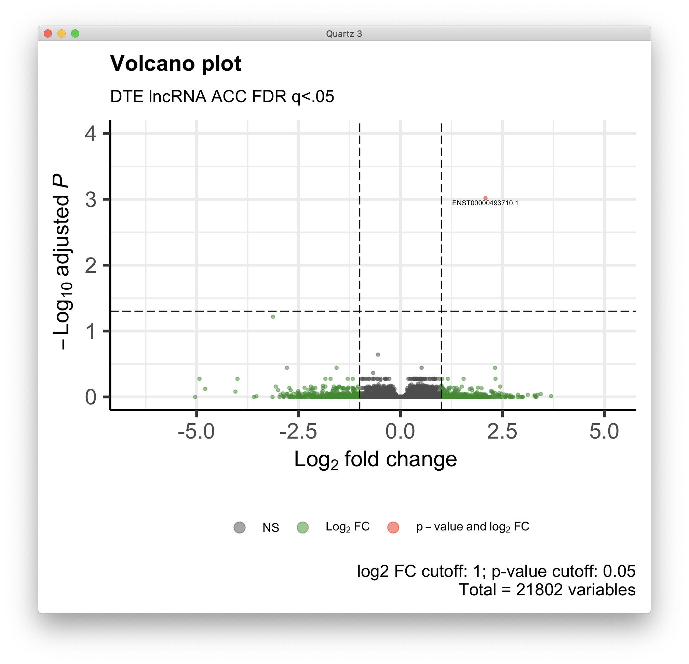
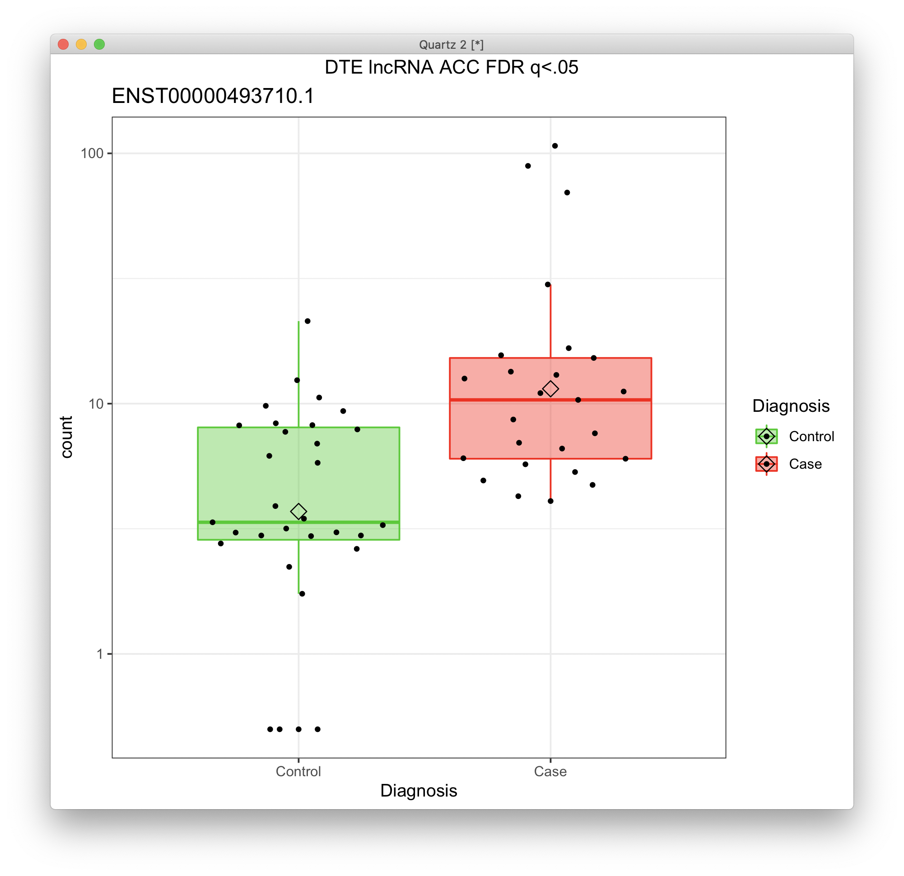
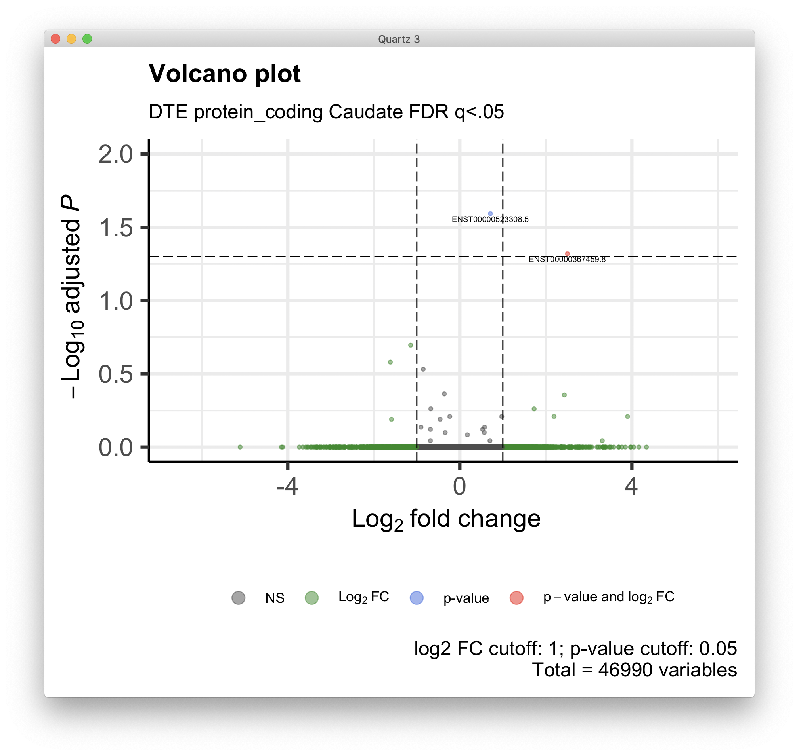
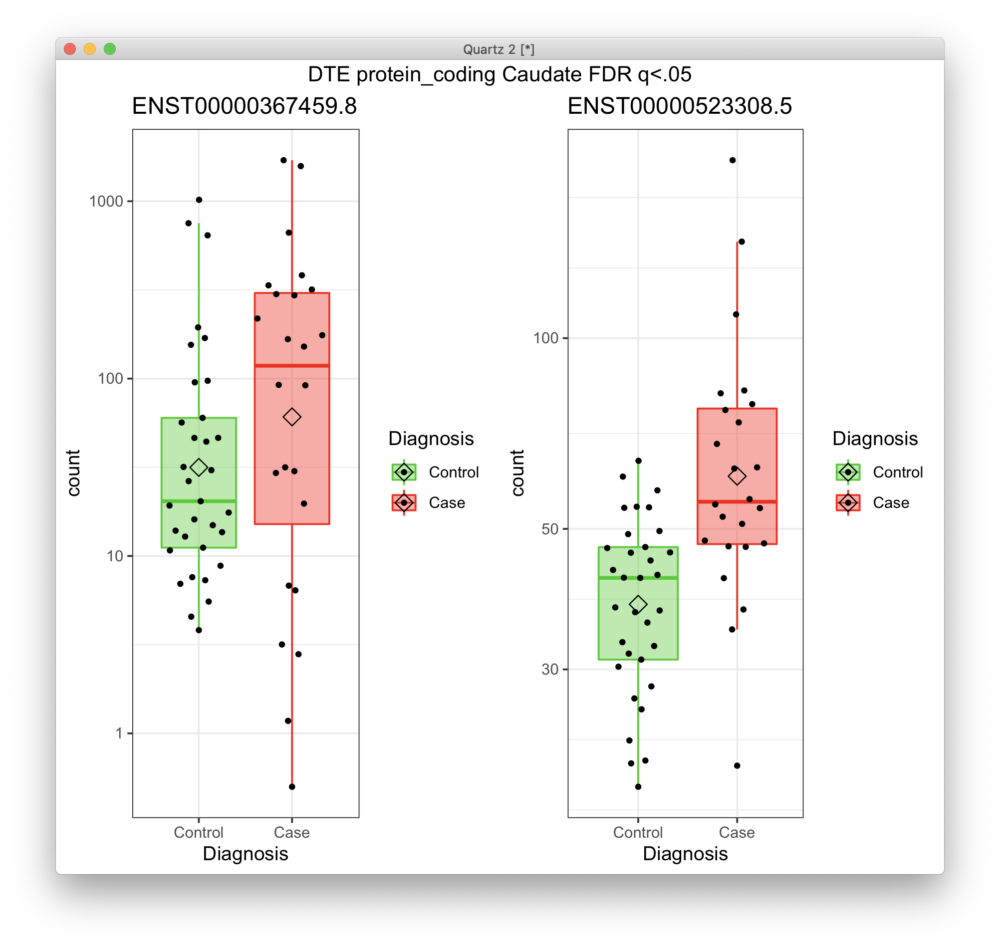
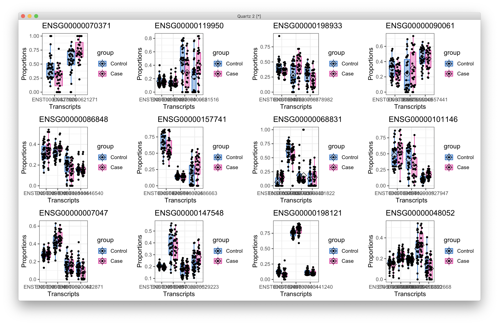
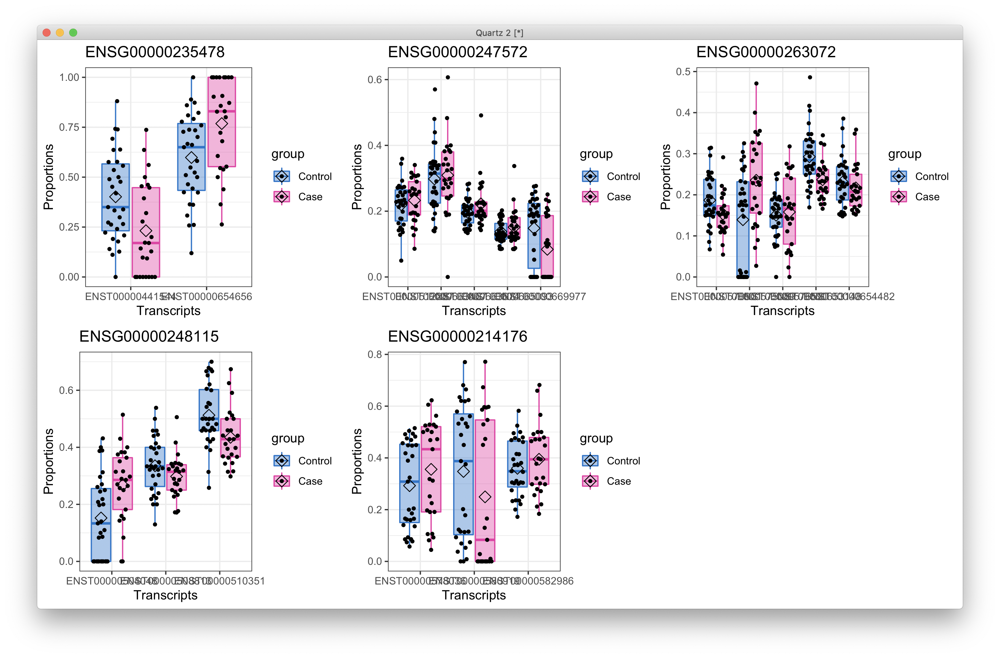
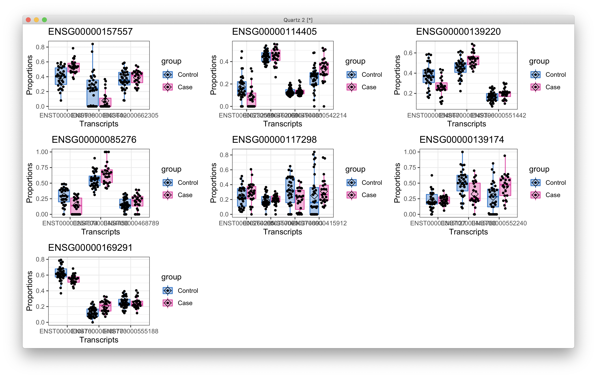
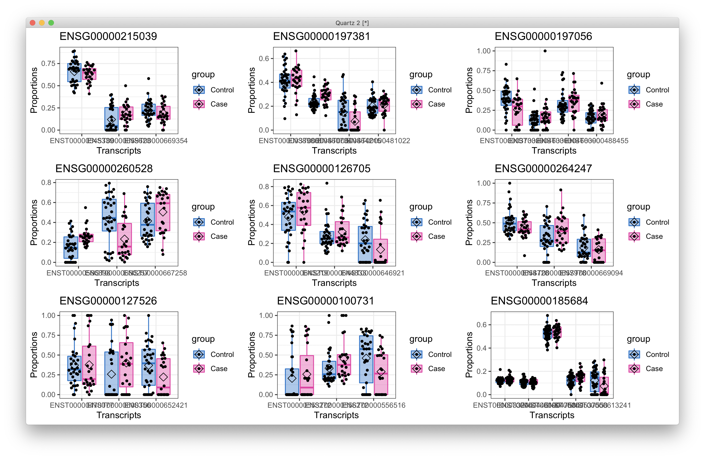

# 2021-01-14 17:08:56

I think I figured out how to add the subtype annotations to the transcriptome.
They were in the GTF file I was using all along, but the R function wasn't
importing them. So, in Python:

```bash
conda create --name rnaseq
conda activate rnaseq
conda install ipython
conda install pandas
```

```python
from gtfparse import read_gtf
fn = '/Users/sudregp/data/post_mortem/Homo_sapiens.GRCh38.97.gtf'
df = read_gtf(fn)
out_fn = '/Users/sudregp/data/post_mortem/Homo_sapiens.GRCh38.97_biotypes.csv'
my_cols = ['transcript_id', 'transcript_biotype', 'gene_id', 'gene_biotype']
df[my_cols].to_csv(out_fn)
```

Now we can just add them to our usual analysis and see where it goes. Starting
with DGE:

```r
myregion = 'ACC'
data = readRDS('~/data/rnaseq_derek/complete_rawCountData_05132020.rds')
rownames(data) = data$submitted_name  # just to ensure compatibility later
# remove obvious outlier (that's NOT caudate) labeled as ACC
rm_me = rownames(data) %in% c('68080')
data = data[!rm_me, ]
data = data[data$Region==myregion, ]
library(gdata)
more = read.xls('~/data/post_mortem/POST_MORTEM_META_DATA_JAN_2021.xlsx')
more = more[!duplicated(more$hbcc_brain_id),]
data = merge(data, more[, c('hbcc_brain_id', 'comorbid_group_update',
                            'substance_group', 'evidence_level')],
             by='hbcc_brain_id', all.x=T, all.y=F)

# at this point we have 55 samples for ACC
grex_vars = colnames(data)[grepl(colnames(data), pattern='^ENS')]
count_matrix = t(data[, grex_vars])
data = data[, !grepl(colnames(data), pattern='^ENS')]
# data only contains sample metadata, and count_matrix has actual counts

# cleaning up some variables
data$POP_CODE = as.character(data$POP_CODE)
data[data$POP_CODE=='WNH', 'POP_CODE'] = 'W'
data[data$POP_CODE=='WH', 'POP_CODE'] = 'W'
data$POP_CODE = factor(data$POP_CODE)
data$Individual = factor(data$hbcc_brain_id)
data[data$Manner.of.Death=='Suicide (probable)', 'Manner.of.Death'] = 'Suicide'
data[data$Manner.of.Death=='unknown', 'Manner.of.Death'] = 'natural'
data$MoD = factor(data$Manner.of.Death)
data$batch = factor(as.numeric(data$run_date))
data$Diagnosis = factor(data$Diagnosis, levels=c('Control', 'Case'))
data$substance_group = factor(data$substance_group)
data$comorbid_group = factor(data$comorbid_group_update)
data$evidence_level = factor(data$evidence_level)

# removing everything but autosomes
library(GenomicFeatures)
txdb <- loadDb('~/data/post_mortem/Homo_sapies.GRCh38.97.sqlite')
txdf <- select(txdb, keys(txdb, "GENEID"), columns=c('GENEID','TXCHROM'),
               "GENEID")
bt = read.csv('~/data/post_mortem/Homo_sapiens.GRCh38.97_biotypes.csv')
bt_slim = bt[, c('gene_id', 'gene_biotype')]
bt_slim = bt_slim[!duplicated(bt_slim),]
txdf = merge(txdf, bt_slim, by.x='GENEID', by.y='gene_id')
# store gene names in geneCounts without version in end of name
tx_meta = data.frame(GENEID = substr(rownames(count_matrix), 1, 15))
tx_meta = merge(tx_meta, txdf, by='GENEID', sort=F)
imautosome = which(tx_meta$TXCHROM != 'X' &
                   tx_meta$TXCHROM != 'Y' &
                   tx_meta$TXCHROM != 'MT')
count_matrix = count_matrix[imautosome, ]
tx_meta = tx_meta[imautosome, ]
```

At this point, no filtering has been done, except for keeping only autosomes.
And I added all annotations I wanted. Now, it's just a matter of filtering in
any way we want.

```r
# plotting each of the significant genes
plot_expression = function(gene_ids, dds, t_str) {
    library(ggpubr)
    library(ggbeeswarm)
    quartz()
    myplots = list()
    clrs = c("green3", "red")
    for (g in 1:length(gene_ids)) {
        cat(gene_ids[g], '\n')
        d <- plotCounts(dds, gene=gene_ids[g], intgroup="Diagnosis",
                        returnData=TRUE)
        p = (ggplot(d, aes(x=Diagnosis, y=count, color = Diagnosis,
                        fill = Diagnosis)) + 
            scale_y_log10() +
            geom_boxplot(alpha = 0.4, outlier.shape = NA, width = 0.8,
                        lwd = 0.5) +
            stat_summary(fun = mean, geom = "point", color = "black",
                        shape = 5, size = 3,
                        position=position_dodge(width = 0.8)) +
            scale_color_manual(values = clrs) +
            scale_fill_manual(values = clrs) +
            geom_quasirandom(color = "black", size = 1, dodge.width = 0.8) +
            theme_bw() +
            ggtitle(gene_ids[g]))
        myplots[[g]] = p
    }
    p = ggarrange(plotlist=myplots)
    print(annotate_figure(p, t_str))
}

plot_volcano = function(res, t_str) {
    library(EnhancedVolcano)
    quartz()
    pCutoff = 0.05
    FCcutoff = 1.0

    p = EnhancedVolcano(data.frame(res), lab = rownames(res),
                        x = 'log2FoldChange',
                        y = 'padj', xlab = bquote(~Log[2]~ 'fold change'),
                        selectLab = rownames(res)[res$padj < .05],
                        ylab = bquote(~-Log[10]~adjusted~italic(P)),
                        ylim = c(0, ceiling(max(-log10(res$padj)))),
                        pCutoff = pCutoff, FCcutoff = FCcutoff, pointSize = 1.0,
                        labSize = 2.0, title = "Volcano plot",
                        subtitle = t_str,
                        caption = paste0('log2 FC cutoff: ', FCcutoff,
                                        '; p-value cutoff: ', pCutoff,
                                        '\nTotal = ', nrow(res), ' variables'),
                        legendPosition = 'bottom', legendLabSize = 10,
                        legendIconSize = 4.0)
    print(p)
}

run_DGE = function(count_matrix, tx_meta, myregion, subtype) {
    cat('Starting with', nrow(tx_meta), 'variables\n')
    keep_me = grepl(tx_meta$gene_biotype, pattern=sprintf('%s$', subtype))
    cat('Keeping', sum(keep_me), subtype, 'variables\n')
    my_count_matrix = count_matrix[keep_me, ]
    my_tx_meta = tx_meta[keep_me, ]

    # removing variables with zero or near-zero variance
    library(caret)
    pp_order = c('zv', 'nzv')
    pp = preProcess(t(my_count_matrix), method = pp_order)
    X = t(predict(pp, t(my_count_matrix)))
    cat('Keeping', nrow(X), 'after NZ and NZV filtering\n')

    # checking which PCs are associated with our potential nuiscance variables
    set.seed(42)
    mypca <- prcomp(t(X), scale=TRUE)
    # how many PCs to keep... using Kaiser thredhold, close to eigenvalues < 1
    library(nFactors)
    eigs <- mypca$sdev^2
    nS = nScree(x=eigs)
    keep_me = seq(1, nS$Components$nkaiser)

    mydata = data.frame(mypca$x[, keep_me])
    # create main metadata data frame including metadata and PCs
    data.pm = cbind(data, mydata)
    rownames(data.pm) = data$hbcc_brain_id
    cat('Using', nS$Components$nkaiser, 'PCs from possible', ncol(X), '\n')

    # check which PCs are associated at nominal p<.01
    num_vars = c('pcnt_optical_duplicates', 'clusters', 'Age', 'RINe', 'PMI',
                'C1', 'C2', 'C3', 'C4', 'C5')
    pc_vars = colnames(mydata)
    num_corrs = matrix(nrow=length(num_vars), ncol=length(pc_vars),
                       dimnames=list(num_vars, pc_vars))
    num_pvals = num_corrs
    for (x in num_vars) {
        for (y in pc_vars) {
            res = cor.test(data.pm[, x], data.pm[, y])
            num_corrs[x, y] = res$estimate
            num_pvals[x, y] = res$p.value
        }
    }

    categ_vars = c('batch', 'Diagnosis', 'MoD', 'substance_group',
                'comorbid_group', 'POP_CODE', 'Sex', 'evidence_level')
    categ_corrs = matrix(nrow=length(categ_vars), ncol=length(pc_vars),
                         dimnames=list(categ_vars, pc_vars))
    categ_pvals = categ_corrs
    for (x in categ_vars) {
        for (y in pc_vars) {
            res = kruskal.test(data.pm[, y], data.pm[, x])
            categ_corrs[x, y] = res$statistic
            categ_pvals[x, y] = res$p.value
        }
    }
    use_pcs = unique(c(which(num_pvals < .01, arr.ind = T)[, 'col'],
                    which(categ_pvals < .01, arr.ind = T)[, 'col']))
    # only use the ones not related to Diagnosis
    keep_me = c()
    for (pc in use_pcs) {
        keep_me = c(keep_me, categ_pvals['Diagnosis', pc] > .05)
    }
    use_pcs = use_pcs[keep_me]
    
    fm_str = sprintf('~ Diagnosis + %s', paste0(pc_vars[use_pcs],
                                                collapse = ' + '))
    cat('Found', length(use_pcs), 'PCs p < .01\n')
    cat('Using formula:', fm_str, '\n')

    # removing variables with low expression
    library(edgeR)
    design=model.matrix(as.formula(fm_str), data=data.pm)
    isexpr <- filterByExpr(X, design=design)
    countsExpr = X[isexpr,]
    metaExpr = data.frame(GENEID = substr(rownames(countsExpr), 1, 15))
    metaExpr = merge(metaExpr, my_tx_meta, by='GENEID', sort=F)
    cat('Keeping', nrow(countsExpr), 'after expression filtering\n')

    # preparing DESeqData and running main analysis
    countdata = round(countsExpr)
    colnames(countdata) = rownames(data.pm)
    library(DESeq2)
    dds <- DESeqDataSetFromMatrix(countData = countdata,
                                colData = data.pm,
                                design = as.formula(fm_str))
    dds <- DESeq(dds)
    res <- results(dds, name = "Diagnosis_Case_vs_Control", alpha = 0.05)
    cat('FDR q < .05\n')
    print(summary(res))
    gene_ids = rownames(res)[res$padj < .05]
    if (length(gene_ids) > 0) {
        print(gene_ids)
        plot_expression(gene_ids, dds, sprintf('DGE %s %s FDR q<.05', subtype,
                                               myregion))
        plot_volcano(res, sprintf('DGE %s %s FDR q<.05', subtype, myregion))
    }

    library(IHW)
    resIHW <- results(dds, name = "Diagnosis_Case_vs_Control", alpha = 0.05,
                    filterFun=ihw)
    cat('IHW q < .05\n')
    print(summary(resIHW))
    gene_ids = rownames(resIHW)[resIHW$padj < .05]
    if (length(gene_ids) > 0) {
        print(gene_ids)
        plot_expression(gene_ids, dds, sprintf('DGE %s %s IHW q<.05', subtype,
                                               myregion))
        plot_volcano(resIHW, sprintf('DGE %s %s IHW q<.05', subtype, myregion))
    }
}
```

Great, all this DGE code is working. All I need to do is, for example:

```r
run_DGE(count_matrix, tx_meta, myregion, 'protein_coding')
# protein_code, lncRNA, pseudogene
```

Here are my results for ACC:

Protein coding:
```
FDR q < .05

out of 15819 with nonzero total read count
adjusted p-value < 0.05
LFC > 0 (up)       : 3, 0.019%
LFC < 0 (down)     : 1, 0.0063%
outliers [1]       : 0, 0%
low counts [2]     : 0, 0%
(mean count < 2)
[1] see 'cooksCutoff' argument of ?results
[2] see 'independentFiltering' argument of ?results

NULL
[1] "ENSG00000002016.17" "ENSG00000103995.14" "ENSG00000135245.10" "ENSG00000169245.6" 
ENSG00000002016.17 
ENSG00000103995.14 
ENSG00000135245.10 
ENSG00000169245.6 
IHW q < .05

out of 15819 with nonzero total read count
adjusted p-value < 0.05
LFC > 0 (up)       : 4, 0.025%
LFC < 0 (down)     : 1, 0.0063%
outliers [1]       : 0, 0%
[1] see 'cooksCutoff' argument of ?results
see metadata(res)$ihwResult on hypothesis weighting

NULL
[1] "ENSG00000002016.17" "ENSG00000090104.12" "ENSG00000103995.14" "ENSG00000135245.10"
[5] "ENSG00000169245.6" 
ENSG00000002016.17 
ENSG00000090104.12 
ENSG00000103995.14 
ENSG00000135245.10 
ENSG00000169245.6 
```


Same gene for FDR and IHW in lncRNA:

```
FDR q < .05

out of 6822 with nonzero total read count
adjusted p-value < 0.05
LFC > 0 (up)       : 1, 0.015%
LFC < 0 (down)     : 0, 0%
outliers [1]       : 0, 0%
low counts [2]     : 0, 0%
(mean count < 1)
[1] see 'cooksCutoff' argument of ?results
[2] see 'independentFiltering' argument of ?results

NULL
[1] "ENSG00000240758.2"
ENSG00000240758.2
```


Nothing for pseudogene, though.

For Caudate I changed the variable in the initial data preparation too. Then:

protein coding: (IHW results were the same)

```
FDR q < .05

out of 15978 with nonzero total read count
adjusted p-value < 0.05
LFC > 0 (up)       : 1, 0.0063%
LFC < 0 (down)     : 2, 0.013%
outliers [1]       : 0, 0%
low counts [2]     : 0, 0%
(mean count < 1)
[1] see 'cooksCutoff' argument of ?results
[2] see 'independentFiltering' argument of ?results

NULL
[1] "ENSG00000007908.16" "ENSG00000135245.10" "ENSG00000169245.6" 
ENSG00000007908.16 
ENSG00000135245.10 
ENSG00000169245.6 
```


lncRNA had same results for FDR and IHW too:

```
FDR q < .05

out of 6778 with nonzero total read count
adjusted p-value < 0.05
LFC > 0 (up)       : 1, 0.015%
LFC < 0 (down)     : 0, 0%
outliers [1]       : 0, 0%
low counts [2]     : 0, 0%
(mean count < 1)
[1] see 'cooksCutoff' argument of ?results
[2] see 'independentFiltering' argument of ?results

NULL
[1] "ENSG00000254561.4"
ENSG00000254561.4 
```


Similarly, results were repeated for FDR and IHW in pseudogenes:

```
FDR q < .05

out of 3162 with nonzero total read count
adjusted p-value < 0.05
LFC > 0 (up)       : 1, 0.032%
LFC < 0 (down)     : 2, 0.063%
outliers [1]       : 0, 0%
low counts [2]     : 0, 0%
(mean count < 1)
[1] see 'cooksCutoff' argument of ?results
[2] see 'independentFiltering' argument of ?results

NULL
[1] "ENSG00000196796.5" "ENSG00000214076.3" "ENSG00000226065.1"
ENSG00000196796.5 
ENSG00000214076.3 
ENSG00000226065.1 
```


# 2021-01-15 09:24:22

Let's modularize the DTE analysis now:

```r
myregion = 'ACC'

load('~/data/isoforms/tximport_rsem_DTE.RData')
txi = rsem

# I'll just use the metadata from here
data = readRDS('~/data/rnaseq_derek/complete_rawCountData_05132020.rds')
rownames(data) = data$submitted_name  # just to ensure compatibility later
data = data[data$Region==myregion, ]
library(gdata)
more = read.xls('~/data/post_mortem/POST_MORTEM_META_DATA_JAN_2021.xlsx')
more = more[!duplicated(more$hbcc_brain_id),]
data = merge(data, more[, c('hbcc_brain_id', 'comorbid_group_update',
                            'substance_group', 'evidence_level')],
             by='hbcc_brain_id', all.x=T, all.y=F)
# samples has only the metadata now
samples = data[, !grepl(colnames(data), pattern='^ENS')]

# remove samples for the other brain region from the tx counts matrices
keep_me = colnames(txi$counts) %in% samples$submitted_name
for (i in c('abundance', 'counts', 'length')) {
    txi[[i]] = txi[[i]][, keep_me]
}
# sort samples to match order in tximport matrices
rownames(samples) = samples$submitted_name
samples = samples[colnames(txi$counts), ]

# cleaning up some metadata
samples$POP_CODE = as.character(samples$POP_CODE)
samples[samples$POP_CODE=='WNH', 'POP_CODE'] = 'W'
samples[samples$POP_CODE=='WH', 'POP_CODE'] = 'W'
samples$POP_CODE = factor(samples$POP_CODE)
samples$Individual = factor(samples$hbcc_brain_id)
samples[samples$Manner.of.Death=='Suicide (probable)', 'Manner.of.Death'] = 'Suicide'
samples[samples$Manner.of.Death=='unknown', 'Manner.of.Death'] = 'natural'
samples$MoD = factor(samples$Manner.of.Death)
samples$batch = factor(as.numeric(samples$run_date))
samples$Diagnosis = factor(samples$Diagnosis, levels=c('Control', 'Case'))
samples$substance_group = factor(samples$substance_group)
samples$comorbid_group = factor(samples$comorbid_group_update)
samples$evidence_level = factor(samples$evidence_level)

# removing everything but autosomes
library(GenomicFeatures)
txdb <- loadDb('~/data/post_mortem/Homo_sapies.GRCh38.97.sqlite')
txdf <- select(txdb, keys(txdb, "TXNAME"), columns=c('GENEID','TXCHROM'),
               "TXNAME")
# keep only the remaining transcripts and their corresponding genes
txdf.sub = txdf[match(substr(rownames(txi$counts), 1, 15), txdf$TXNAME),]
bt = read.csv('~/data/post_mortem/Homo_sapiens.GRCh38.97_biotypes.csv')
bt_slim = bt[, c('transcript_id', 'transcript_biotype')]
bt_slim = bt_slim[!duplicated(bt_slim),]
tx_meta = merge(txdf.sub, bt_slim, by.x='TXNAME', by.y='transcript_id')
imautosome = which(tx_meta$TXCHROM != 'X' &
                   tx_meta$TXCHROM != 'Y' &
                   tx_meta$TXCHROM != 'MT')
count_matrix = txi$counts[imautosome, ]
tx_meta = tx_meta[imautosome, ]
```

At this point, no filtering has been done, except for keeping only autosomes.
And I added all annotations I wanted. Now, it's just a matter of filtering in
any way we want. Note that I'll need to go back to the edgeR filtering because
DRIMSeq was keeping only transcripts for genes with 2 or more transcripts, which
makes sense for DTU but not for DTE.

```r
run_DTE = function(count_matrix, tx_meta, myregion, subtype) {
    cat('Starting with', nrow(tx_meta), 'variables\n')
    keep_me = grepl(tx_meta$transcript_biotype, pattern=sprintf('%s$', subtype))
    cat('Keeping', sum(keep_me), subtype, 'variables\n')
    my_count_matrix = count_matrix[keep_me, ]
    my_tx_meta = tx_meta[keep_me, ]

    # removing variables with zero or near-zero variance
    library(caret)
    pp_order = c('zv', 'nzv')
    pp = preProcess(t(my_count_matrix), method = pp_order)
    X = t(predict(pp, t(my_count_matrix)))
    cat('Keeping', nrow(X), 'after NZ and NZV filtering\n')

    # checking which PCs are associated with our potential nuiscance variables
    set.seed(42)
    mypca <- prcomp(t(X), scale=TRUE)
    # how many PCs to keep... using Kaiser thredhold, close to eigenvalues < 1
    library(nFactors)
    eigs <- mypca$sdev^2
    nS = nScree(x=eigs)
    keep_me = seq(1, nS$Components$nkaiser)

    mydata = data.frame(mypca$x[, keep_me])
    # create main metadata data frame including metadata and PCs
    data.pm = cbind(samples, mydata)
    rownames(data.pm) = samples$hbcc_brain_id
    cat('Using', nS$Components$nkaiser, 'PCs from possible', ncol(X), '\n')

    # check which PCs are associated at nominal p<.01
    num_vars = c('pcnt_optical_duplicates', 'clusters', 'Age', 'RINe', 'PMI',
                'C1', 'C2', 'C3', 'C4', 'C5')
    pc_vars = colnames(mydata)
    num_corrs = matrix(nrow=length(num_vars), ncol=length(pc_vars),
                        dimnames=list(num_vars, pc_vars))
    num_pvals = num_corrs
    for (x in num_vars) {
        for (y in pc_vars) {
            res = cor.test(data.pm[, x], data.pm[, y])
            num_corrs[x, y] = res$estimate
            num_pvals[x, y] = res$p.value
        }
    }

    categ_vars = c('batch', 'Diagnosis', 'MoD', 'substance_group',
                'comorbid_group', 'POP_CODE', 'Sex', 'evidence_level')
    categ_corrs = matrix(nrow=length(categ_vars), ncol=length(pc_vars),
                            dimnames=list(categ_vars, pc_vars))
    categ_pvals = categ_corrs
    for (x in categ_vars) {
        for (y in pc_vars) {
            res = kruskal.test(data.pm[, y], data.pm[, x])
            categ_corrs[x, y] = res$statistic
            categ_pvals[x, y] = res$p.value
        }
    }
    use_pcs = unique(c(which(num_pvals < .01, arr.ind = T)[, 'col'],
                    which(categ_pvals < .01, arr.ind = T)[, 'col']))
    # only use the ones not related to Diagnosis
    keep_me = c()
    for (pc in use_pcs) {
        keep_me = c(keep_me, categ_pvals['Diagnosis', pc] > .05)
    }
    use_pcs = use_pcs[keep_me]
    fm_str = sprintf('~ Diagnosis + %s', paste0(pc_vars[use_pcs],
                                                collapse = ' + '))
    cat('Found', length(use_pcs), 'PCs p < .01\n')
    cat('Using formula:', fm_str, '\n')

    # removing variables with low expression
    library(edgeR)
    design=model.matrix(as.formula(fm_str), data=data.pm)
    isexpr <- filterByExpr(X, design=design)
    countsExpr = X[isexpr,]
    metaExpr = data.frame(TXNAME = substr(rownames(countsExpr), 1, 15))
    metaExpr = merge(metaExpr, my_tx_meta, by='TXNAME', sort=F)
    cat('Keeping', nrow(countsExpr), 'after expression filtering\n')

    library(DESeq2)
    # because DESeq doesn't remove outliers if there are continuous variables
    # in the formula, we need to do this iteratively
    nOutliers = Inf
    myCounts = round(countsExpr)
    while (nOutliers > 0) {
        dds <- DESeqDataSetFromMatrix(countData = myCounts,
                                    colData = data.pm,
                                    design = as.formula(fm_str))
        cat('Processing', nrow(dds), 'variables.\n')
        dds <- DESeq(dds)
        maxCooks <- apply(assays(dds)[["cooks"]], 1, max)
        # outlier cut-off uses the 99% quantile of the F(p,m-p) distribution (with 
        # p the number of parameters including the intercept and m number of
        # samples).
        m <- ncol(dds)
        # number or parameters (PCs + Diagnosis + intercept)
        p <- length(use_pcs) + 2
        co = qf(.99, p, m - p)
        keep_me = which(maxCooks < co)
        nOutliers = nrow(myCounts) - length(keep_me)
        cat('Found', nOutliers, 'outliers.\n')
        myCounts = round(myCounts)[keep_me, ]
    }
    res <- results(dds, name = "Diagnosis_Case_vs_Control", alpha = 0.05)
    cat('FDR q < .05\n')
    print(summary(res))
    tx_ids = rownames(res)[res$padj < .05]
    if (length(tx_ids) > 0) {
        print(tx_ids)
        plot_expression(tx_ids, dds, sprintf('DTE %s %s FDR q<.05', subtype,
                                            myregion))
        plot_volcano(res, sprintf('DTE %s %s FDR q<.05', subtype, myregion))
    }

    library(IHW)
    resIHW <- results(dds, name = "Diagnosis_Case_vs_Control", alpha = 0.05,
                    filterFun=ihw)
    cat('IHW q < .05\n')
    print(summary(resIHW))
    tx_ids = rownames(resIHW)[resIHW$padj < .05]
    if (length(tx_ids) > 0) {
        print(tx_ids)
        plot_expression(tx_ids, dds, sprintf('DTE %s %s IHW q<.05', subtype,
                                            myregion))
        plot_volcano(resIHW, sprintf('DTE %s %s IHW q<.05', subtype, myregion))
    }

    # stage-wise testing
    library(stageR)
    library(dplyr)
    pConfirmation <- matrix(res$pvalue, ncol=1)
    dimnames(pConfirmation) <- list(substr(rownames(res), 1, 15),
                                    c("transcript"))
    # select one qval per gene (min over transcripts)
    junk = as.data.frame(res)
    junk$TXNAME = substr(rownames(junk), 1, 15)
    m = merge(junk, metaExpr, by='TXNAME')
    qvals = m %>% group_by(GENEID) %>% slice_min(n=1, padj, with_ties=F)
    pScreen = qvals$padj
    names(pScreen) = qvals$GENEID

    stageRObj = stageRTx(pScreen=pScreen, pConfirmation=pConfirmation,
                        pScreenAdjusted=TRUE, tx2gene=metaExpr[, 1:2])
    stageRObj = stageWiseAdjustment(stageRObj, method="dte", alpha=0.05)
    cat('stageR q < .05\n')
    gene_ids = getSignificantGenes(stageRObj)
    tx_ids = getSignificantTx(stageRObj)
    if (nrow(tx_ids) > 0) {
        print(gene_ids)
        print(tx_ids)
    }
}
```

With the DTE code is working, we can now run:

```r
run_DTE(count_matrix, tx_meta, myregion, 'protein_coding')
# protein_code, lncRNA, pseudogene
```

Note that some of these results will be different from before not only because
of the subtyping, but also because of the edgeR filtering and the autosomal
restriction.

**ACC Protein coding**

```
FDR q < .05

out of 50107 with nonzero total read count
adjusted p-value < 0.05
LFC > 0 (up)       : 7, 0.014%
LFC < 0 (down)     : 1, 0.002%
outliers [1]       : 0, 0%
low counts [2]     : 0, 0%
(mean count < 0)
[1] see 'cooksCutoff' argument of ?results
[2] see 'independentFiltering' argument of ?results
ENST00000257696.5 
ENST00000295057.4 
ENST00000315422.8 
ENST00000332509.7 
ENST00000333219.8 
ENST00000372876.1 
ENST00000642695.1 
ENST00000646575.1 
```

I'll just include pictures for FDR because it's a superset of the others.


Still have an issue there on how many subjects have zeros... might need to do
some heuristic there.

```
IHW q < .05

out of 50107 with nonzero total read count
adjusted p-value < 0.05
LFC > 0 (up)       : 6, 0.012%
LFC < 0 (down)     : 1, 0.002%
outliers [1]       : 0, 0%
[1] see 'cooksCutoff' argument of ?results
see metadata(res)$ihwResult on hypothesis weighting
ENST00000257696.5 
ENST00000295057.4 
ENST00000332509.7 
ENST00000333219.8 
ENST00000372876.1 
ENST00000642695.1 
ENST00000646575.1 
```

```
stageR q < .05
                FDR adjusted p-value
ENSG00000135245         5.138018e-05
ENSG00000162951         4.509240e-63
ENSG00000167522         5.191197e-06
ENSG00000133895         5.191197e-06
ENSG00000184381         2.993995e-06
ENSG00000153487         2.455953e-03
ENSG00000167460         7.421065e-03
ENSG00000124659         4.419988e-02
                stage-wise adjusted p-value
ENST00000257696                9.974027e-06
ENST00000295057                1.750686e-64
ENST00000315422                6.449446e-06
ENST00000332509                1.859842e-06
ENST00000333219                1.716317e-03
ENST00000372876                0.000000e+00
ENST00000642695                7.831272e-06
ENST00000646575                1.008415e-02
```

I'll wait to contiue with these analysis until I figure out this zero problem.

# 2021-01-25 08:59:31

Let's play a bit with the outlier threshold in DESeq and see if that remediates
how many results with the zeros we get.

According to the DESeq2 documentation, "Note that with continuous variables in
the design, outlier detection and replacement is not automatically performed, as
our current methods involve a robust estimation of within-group variance which
does not extend easily to continuous covariates.". That's our case, so I'll need
to do some post-hoc filtering after the initial DESeq2 run. Let's start with our
candidate genes from the results above.

Or, first, let's see the maximum Cook over all transcripts:

```r
W <- res$stat
maxCooks <- apply(assays(dds)[["cooks"]],1,max)
idx <- !is.na(W)
plot(rank(W[idx]), maxCooks[idx], xlab="rank of Wald statistic", 
     ylab="maximum Cook's distance per gene")
```


There's clearly a whole bunch of outliers. Can we keep on removing variables
until there are no more outliers?

```r
nOutliers = Inf
myCounts = round(countsExpr)
while (nOutliers > 0) {
    dds <- DESeqDataSetFromMatrix(countData = myCounts,
                                  colData = data.pm,
                                  design = as.formula(fm_str))
    cat('Processing', nrow(dds), 'variables.\n')
    dds <- DESeq(dds)
    maxCooks <- apply(assays(dds)[["cooks"]], 1, max)
    # outlier cut-off uses the 99% quantile of the F(p,m-p) distribution (with 
    # p the number of parameters including the intercept and m number of
    # samples).
    m <- ncol(dds)
    # number or parameters (PCs + Diagnosis + intercept)
    p <- length(use_pcs) + 2
    co = qf(.99, p, m - p)
    keep_me = which(maxCooks < co)
    nOutliers = nrow(myCounts) - length(keep_me)
    cat('Found', nOutliers, 'outliers.\n')
    myCounts = round(myCounts)[keep_me, ]
}
```

The code above worked well, so I'll change the modularized DTE first and see if
the result is consistent across the different subtypes. If it is, I'll also
implement it for DGE, although there the issue wasn't as bad.

**ACC Protein coding**

FDR q < .05

out of 42244 with nonzero total read count
adjusted p-value < 0.05
LFC > 0 (up)       : 1, 0.0024%
LFC < 0 (down)     : 0, 0%
outliers [1]       : 0, 0%
low counts [2]     : 0, 0%
(mean count < 0)
[1] see 'cooksCutoff' argument of ?results
[2] see 'independentFiltering' argument of ?results

NULL
[1] "ENST00000333219.8"
ENST00000333219.8

(IHW results were identical)

stageR q < .05
                FDR adjusted p-value
ENSG00000153487           0.01602941
                stage-wise adjusted p-value
ENST00000333219                  0.01672342




**ACC lncRNA**

FDR q < .05

out of 21802 with nonzero total read count
adjusted p-value < 0.05
LFC > 0 (up)       : 1, 0.0046%
LFC < 0 (down)     : 0, 0%
outliers [1]       : 0, 0%
low counts [2]     : 0, 0%
(mean count < 1)
[1] see 'cooksCutoff' argument of ?results
[2] see 'independentFiltering' argument of ?results

(IHW result was identical)

stageR q < .05
                FDR adjusted p-value
ENSG00000240758         0.0009592265
                stage-wise adjusted p-value
ENST00000493710                           0





**ACC pseudogene**

There was a single result for ACC pseudogene, but everything was zero but for 5
Controls, so I'll ignore that.

**Caudate Protein coding**

FDR q < .05

out of 46990 with nonzero total read count
adjusted p-value < 0.05
LFC > 0 (up)       : 2, 0.0043%
LFC < 0 (down)     : 0, 0%
outliers [1]       : 0, 0%
low counts [2]     : 0, 0%
(mean count < 1)
[1] see 'cooksCutoff' argument of ?results
[2] see 'independentFiltering' argument of ?results

NULL
[1] "ENST00000367459.8" "ENST00000523308.5"
ENST00000367459.8 
ENST00000523308.5 

(IHW results were identical)

stageR q < .05
                FDR adjusted p-value
ENSG00000090104           0.04790720
ENSG00000105339           0.02553367
                stage-wise adjusted p-value
ENST00000367459                  0.01571792
ENST00000523308                  0.02094343




**Caudate lncRNA**

nothing

**Caudate pseudogene**

nothing

## DTU

Finally, let's modularize the subtyping DTU analysis too.

```r
myregion = 'ACC'

load('~/data/isoforms/tximport_rsem_DTU.RData')
txi = rsem
# I'll just use the metadata from here
data = readRDS('~/data/rnaseq_derek/complete_rawCountData_05132020.rds')
rownames(data) = data$submitted_name  # just to ensure compatibility later
data = data[data$Region==myregion, ]
library(gdata)
more = read.xls('~/data/post_mortem/POST_MORTEM_META_DATA_JAN_2021.xlsx')
more = more[!duplicated(more$hbcc_brain_id),]
data = merge(data, more[, c('hbcc_brain_id', 'comorbid_group_update',
                            'substance_group', 'evidence_level')],
             by='hbcc_brain_id', all.x=T, all.y=F)
# samples has only the metadata now
samples = data[, !grepl(colnames(data), pattern='^ENS')]

# remove samples for the other brain region from the tx counts matrices
keep_me = colnames(txi$counts) %in% samples$submitted_name
for (i in c('abundance', 'counts', 'length')) {
    txi[[i]] = txi[[i]][, keep_me]
}
# sort samples to match order in tximport matrices
rownames(samples) = samples$submitted_name
samples = samples[colnames(txi$counts), ]

# cleaning up some metadata
samples$POP_CODE = as.character(samples$POP_CODE)
samples[samples$POP_CODE=='WNH', 'POP_CODE'] = 'W'
samples[samples$POP_CODE=='WH', 'POP_CODE'] = 'W'
samples$POP_CODE = factor(samples$POP_CODE)
samples$Individual = factor(samples$hbcc_brain_id)
samples[samples$Manner.of.Death=='Suicide (probable)', 'Manner.of.Death'] = 'Suicide'
samples[samples$Manner.of.Death=='unknown', 'Manner.of.Death'] = 'natural'
samples$MoD = factor(samples$Manner.of.Death)
samples$batch = factor(as.numeric(samples$run_date))
samples$Diagnosis = factor(samples$Diagnosis, levels=c('Control', 'Case'))
samples$substance_group = factor(samples$substance_group)
samples$comorbid_group = factor(samples$comorbid_group_update)
samples$evidence_level = factor(samples$evidence_level)

# removing everything but autosomes
library(GenomicFeatures)
txdb <- loadDb('~/data/post_mortem/Homo_sapies.GRCh38.97.sqlite')
txdf <- select(txdb, keys(txdb, "TXNAME"), columns=c('GENEID','TXCHROM'),
               "TXNAME")
# keep only the remaining transcripts and their corresponding genes
txdf.sub = txdf[match(substr(rownames(txi$counts), 1, 15), txdf$TXNAME),]
bt = read.csv('~/data/post_mortem/Homo_sapiens.GRCh38.97_biotypes.csv')
bt_slim = bt[, c('transcript_id', 'transcript_biotype')]
bt_slim = bt_slim[!duplicated(bt_slim),]
tx_meta = merge(txdf.sub, bt_slim, by.x='TXNAME', by.y='transcript_id')
tx_meta$transcript_id = rownames(txi$counts)
imautosome = which(tx_meta$TXCHROM != 'X' &
                   tx_meta$TXCHROM != 'Y' &
                   tx_meta$TXCHROM != 'MT')
count_matrix = txi$counts[imautosome, ]
tx_meta = tx_meta[imautosome, ]
```

At this point, no filtering has been done, except for keeping only autosomes.
And I added all annotations I wanted. Now, it's just a matter of running the
rest of the analysis:

```r
plotProportion <- function(expData = NULL, geneID = NULL, samps = NULL) {
    colnames(expData)[1:2] = c("gid","tid")
    sub = subset(expData, gid == geneID)
    sub = reshape2::melt(sub, id = c("gid", "tid"))
    sub = merge(samps, sub, by.x = "sample_id", by.y = "variable")

    clrs = c("dodgerblue3", "maroon2",  "forestgreen", "darkorange1", "blueviolet", "firebrick2",
"deepskyblue", "orchid2", "chartreuse3", "gold", "slateblue1", "tomato" , "blue", "magenta", "green3",
"yellow", "purple3", "red" ,"darkslategray1", "lightpink1", "lightgreen", "khaki1", "plum3", "salmon")

    p = ggplot(sub, aes(tid, value, color = group, fill = group)) +
    geom_boxplot(alpha = 0.4, outlier.shape = NA, width = 0.8, lwd = 0.5) +
    stat_summary(fun = mean, geom = "point", color = "black", shape = 5, size = 3, position=position_dodge(width = 0.8)) +
    scale_color_manual(values = clrs) + scale_fill_manual(values = clrs) +
    geom_quasirandom(color = "black", size = 1, dodge.width = 0.8) + theme_bw() +
    ggtitle(geneID) + xlab("Transcripts")

    p = p + ylab("Proportions")
    p
}

# posthoc procedure to improve the false discovery rate (FDR) and overall false discovery rate (OFDR) control. It sets the p-values and adjusted p-values for transcripts with small per-sample proportion SD to 1
smallProportionSD <- function(d, filter = 0.1) {
        # Generate count table
        cts = as.matrix(subset(counts(d), select = -c(gene_id, feature_id)))
        # Summarise count total per gene
        gene.cts = rowsum(cts, counts(d)$gene_id)
        # Use total count per gene as count per transcript
        total.cts = gene.cts[match(counts(d)$gene_id, rownames(gene.cts)),]
        # Calculate proportion of transcript in gene
        props = cts/total.cts
        rownames(props) = rownames(total.cts)
        
        # Calculate standard deviation
        propSD = sqrt(matrixStats::rowVars(props))
        # Check if standard deviation of per-sample proportions is < 0.1
        propSD < filter
}

run_DTU = function(count_matrix, tx_meta, myregion, subtype) {

    cat('Starting with', nrow(tx_meta), 'variables\n')
    keep_me = grepl(tx_meta$transcript_biotype, pattern=sprintf('%s$', subtype))
    cat('Keeping', sum(keep_me), subtype, 'variables\n')
    my_count_matrix = count_matrix[keep_me, ]
    my_tx_meta = tx_meta[keep_me, ]

    # removing variables with zero or near-zero variance
    library(caret)
    pp_order = c('zv', 'nzv')
    pp = preProcess(t(my_count_matrix), method = pp_order)
    X = t(predict(pp, t(my_count_matrix)))
    cat('Keeping', nrow(X), 'after NZ and NZV filtering\n')

    # keep only the remaining transcripts and their corresponding genes
    txdf.sub = my_tx_meta[match(rownames(X), my_tx_meta$transcript_id),]
    counts = data.frame(gene_id = txdf.sub$GENEID, feature_id = txdf.sub$TXNAME)
    counts = cbind(counts, X)

    library(DRIMSeq)
    samples$group = samples$Diagnosis
    samples$sample_id = as.character(samples$submitted_name)
    d0 = dmDSdata(counts = counts, samples = samples)

    n = nrow(samples)
    n.small = min(table(samples$group))

    d = DRIMSeq::dmFilter(d0,
                        min_samps_feature_expr = n.small, min_feature_expr = 10,
                        min_samps_feature_prop = n.small, min_feature_prop = 0.1,
                        min_samps_gene_expr = n, min_gene_expr = 10)

    countData = round(as.matrix(counts(d)[,-c(1:2)]))
    cat('Keeping', nrow(countData), 'after DRIMSeq expression filtering\n')

    set.seed(42)
    pca <- prcomp(t(countData), scale=TRUE)
    library(nFactors)
    eigs <- pca$sdev^2
    nS = nScree(x=eigs)
    keep_me = 1:nS$Components$nkaiser
    mydata = data.frame(pca$x[, keep_me])
    data.pm = cbind(samples, mydata)
    rownames(data.pm) = samples$submitted_name
    num_vars = c('pcnt_optical_duplicates', 'clusters', 'Age', 'RINe', 'PMI',
                'C1', 'C2', 'C3', 'C4', 'C5')
    pc_vars = colnames(mydata)
    num_corrs = matrix(nrow=length(num_vars), ncol=length(pc_vars),
                    dimnames=list(num_vars, pc_vars))
    num_pvals = num_corrs
    for (x in num_vars) {
        for (y in pc_vars) {
            res = cor.test(samples[, x], mydata[, y])
            num_corrs[x, y] = res$estimate
            num_pvals[x, y] = res$p.value
        }
    }
    categ_vars = c('batch', 'Diagnosis', 'MoD', 'substance_group',
                'comorbid_group', 'POP_CODE', 'Sex', 'evidence_level')
    categ_corrs = matrix(nrow=length(categ_vars), ncol=length(pc_vars),
                    dimnames=list(categ_vars, pc_vars))
    categ_pvals = categ_corrs
    for (x in categ_vars) {
        for (y in pc_vars) {
            res = kruskal.test(mydata[, y], samples[, x])
            categ_corrs[x, y] = res$statistic
            categ_pvals[x, y] = res$p.value
        }
    }
    use_pcs = unique(c(which(num_pvals < .01, arr.ind = T)[, 'col'],
                        which(categ_pvals < .01, arr.ind = T)[, 'col']))
    # only use the ones not related to Diagnosis
    keep_me = c()
    for (pc in use_pcs) {
        keep_me = c(keep_me, categ_pvals['Diagnosis', pc] > .05)
    }
    use_pcs = use_pcs[keep_me]

    fm_str = sprintf('~ group + %s', paste0(pc_vars[use_pcs],
                                                collapse = ' + '))
    cat('Found', length(use_pcs), 'PCs p < .01\n')
    cat('Using formula:', fm_str, '\n')

    design = model.matrix(as.formula(fm_str), data = data.pm)

    set.seed(42)
    system.time({
        d <- dmPrecision(d, design = design)
        d <- dmFit(d, design = design)
        d <- dmTest(d, coef = "groupCase")     
    })
    res.g = DRIMSeq::results(d)
    res.t = DRIMSeq::results(d, level = "feature")

    # make NA pvalues to be 1 so they don't screw up future steps
    no.na <- function(x) ifelse(is.na(x), 1, x)
    res.g$pvalue <- no.na(res.g$pvalue)
    res.t$pvalue <- no.na(res.t$pvalue)

    cat('Genes surviving FDR q<.05:', sum(res.g$adj_pvalue < .05, na.rm=T), '\n')
    cat('Transcripts surviving FDR q<.05:',
        sum(res.t$adj_pvalue < .05, na.rm=T), '\n')

    filt = smallProportionSD(d)

    res.t.filt = DRIMSeq::results(d, level = "feature")
    res.t.filt$pvalue[filt] = 1
    res.t.filt$adj_pvalue[filt] = 1
    res.t.filt$pvalue <- no.na(res.t.filt$pvalue)
    cat('Transcripts removed due to small SD:', sum(filt, na.rm=T), 'out of',
        length(filt), '\n')
    cat('Transcripts surviving SD filtering and FDR q<.05:',
        sum(res.t.filt$adj_pvalue < .05, na.rm=T), '\n')

    strp <- function(x) substr(x,1,15)
    # Construct a vector of per-gene p-values for the screening stage
    pScreen = res.g$pvalue
    names(pScreen) = strp(res.g$gene_id)
    # Construct a one column matrix of the per-transcript confirmation p-values
    pConfirmation = matrix(res.t.filt$pvalue, ncol = 1)
    dimnames(pConfirmation) = list(strp(res.t.filt$feature_id), "transcript")
    # res.t is used twice to construct a 4-column data.frame that contain both original IDs and IDs without version numbers
    tx2gene = data.frame(res.t[,c("feature_id", "gene_id")], 
                        res.t[,c("feature_id", "gene_id")])
    # remove version from gene name
    for (i in 1:2) tx2gene[,i] = strp(tx2gene[,i])

    library(stageR)
    stageRObj = stageRTx(pScreen = pScreen, pConfirmation = pConfirmation, 
                        pScreenAdjusted = FALSE, tx2gene = tx2gene[,1:2])
    stageRObj = stageWiseAdjustment(stageRObj, method = "dtu", alpha = 0.05)

    drim.padj = getAdjustedPValues(stageRObj, order = FALSE,
                                onlySignificantGenes = TRUE)
    # this summarizes the adjusted p-values from the two-stage analysis. Only genes that passed the filter are included in the table.
    drim.padj = merge(tx2gene, drim.padj, by.x = c("gene_id","feature_id"),
                    by.y = c("geneID","txID"))

    cat('Screened genes at FDR q<.05:',
        length(unique(drim.padj[drim.padj$gene < 0.05,]$gene_id)), '\n')
    cat('Transcripts passing 5% OFDR:', sum(drim.padj$transcript < 0.05), '\n')

    cat('stageR q < .05\n')
    gene_ids = getSignificantGenes(stageRObj)
    tx_ids = getSignificantTx(stageRObj)
    if (nrow(tx_ids) > 0) {
        print(gene_ids)
        print(tx_ids)
    }
    cat('Genes where expression switches among isoforms:',
        length(unique(drim.padj[drim.padj$transcript < .05, 'gene_id'])), '\n')

    # condensing the counts to be converted to proportions
    drim.prop = reshape2::melt(counts[counts$feature_id %in% proportions(d)$feature_id,], id = c("gene_id", "feature_id"))
    drim.prop = drim.prop[order(drim.prop$gene_id, drim.prop$variable,
                        drim.prop$feature_id),]
    # Calculate proportions from counts
    library(dplyr)
    library(ggplot2)
    library(ggbeeswarm)
    drim.prop2 = drim.prop %>%
            group_by(gene_id, variable) %>%
            mutate(total = sum(value)) %>%
            group_by(variable, add=TRUE) %>%
            mutate(prop = value/total)
    drim.prop3 = reshape2::dcast(drim.prop2[,c(1,2,3,6)],
                                gene_id + feature_id ~ variable)

    # plotting all good genes
    library(ggpubr)
    gene_ids = unique(drim.padj[order(drim.padj$transcript, drim.padj$gene),]$gene_id.1)
    myplots = list()
    for (g in 1:length(gene_ids)) {
        cat(gene_ids[g], '\n')
        myplots[[g]] = plotProportion(drim.prop3, gene_ids[g], samples)
    }
    ggarrange(plotlist=myplots)
}
```

Let's first see what's going on on lncRNA and pseudogenes, because this code
takes a long time and those two subtypes usually don't have anything to them:

```r
run_DTU(count_matrix, tx_meta, myregion, 'protein_coding')
# protein_coding, lncRNA, pseudogene
```

**ACC Protein coding**

Screened genes at FDR q<.05: 12
Transcripts passing 5% OFDR: 8
stageR q < .05
                FDR adjusted p-value
ENSG00000119950         0.0008402307
ENSG00000007047         0.0282250058
ENSG00000147548         0.0282250058
ENSG00000198121         0.0282250058
ENSG00000198933         0.0092421589
ENSG00000101146         0.0282250058
ENSG00000068831         0.0282250058
ENSG00000090061         0.0092421589
ENSG00000086848         0.0282250058
ENSG00000048052         0.0396145202
ENSG00000070371         0.0282250058
ENSG00000157741         0.0342235232
                stage-wise adjusted p-value
ENST00000651516                0.0003089835
ENST00000537587                0.0009041122
ENST00000377489                0.0081464049
ENST00000555049                0.0014779283
ENST00000614444                0.0025957870
ENST00000427926                0.0000000000
ENST00000621271                0.0000000000
ENST00000486663                0.0045460310
Genes where expression switches among isoforms: 7



**ACC lncRNA**

Screened genes at FDR q<.05: 5
Transcripts passing 5% OFDR: 6
stageR q < .05
                FDR adjusted p-value
ENSG00000214176           0.03739371
ENSG00000235478           0.03739371
ENSG00000247572           0.02517145
ENSG00000248115           0.02517145
ENSG00000263072           0.01775926
                stage-wise adjusted p-value
ENST00000580919                0.0024210918
ENST00000441544                0.0000000000
ENST00000654656                0.0000000000
ENST00000669977                0.0003457203
ENST00000504048                0.0019561158
ENST00000575089                0.0003741297
Genes where expression switches among isoforms: 5



**ACC pseudogene**

No genes left after DRIMSeq filtering.

**Caudate Protein coding**

Screened genes at FDR q<.05: 7
Transcripts passing 5% OFDR: 5
stageR q < .05
                FDR adjusted p-value
ENSG00000114405         0.0016314386
ENSG00000117298         0.0016314386
ENSG00000085276         0.0122402399
ENSG00000169291         0.0197069510
ENSG00000139220         0.0087875195
ENSG00000139174         0.0169816753
ENSG00000157557         0.0001271722
                stage-wise adjusted p-value
ENST00000232519                6.587837e-05
ENST00000415912                2.139486e-03
ENST00000264674                7.689859e-04
ENST00000548670                7.229887e-04
ENST00000653642                1.919226e-06
Genes where expression switches among isoforms: 5



**Caudate lncRNA**

Screened genes at FDR q<.05: 9
Transcripts passing 5% OFDR: 9
stageR q < .05
                FDR adjusted p-value
ENSG00000185684          0.020535866
ENSG00000197056          0.034431319
ENSG00000197381          0.011894622
ENSG00000215039          0.005349389
ENSG00000127526          0.009019100
ENSG00000126705          0.029709385
ENSG00000100731          0.007545460
ENSG00000260528          0.002243657
ENSG00000264247          0.047947811
                stage-wise adjusted p-value
ENST00000373329                0.0029178277
ENST00000464215                0.0003963364
ENST00000659623                0.0003536767
ENST00000600356                0.0236919220
ENST00000646921                0.0044015314
ENST00000556272                0.0418592583
ENST00000566898                0.0173052322
ENST00000660257                0.0031514595
ENST00000657978                0.0194257491
Genes where expression switches among isoforms: 8



**Caudate pseudogene**

No genes left after DRIMSeq filtering.

# TODO
 * Interpret these genes
 * Kallisto?
 * Salmon?