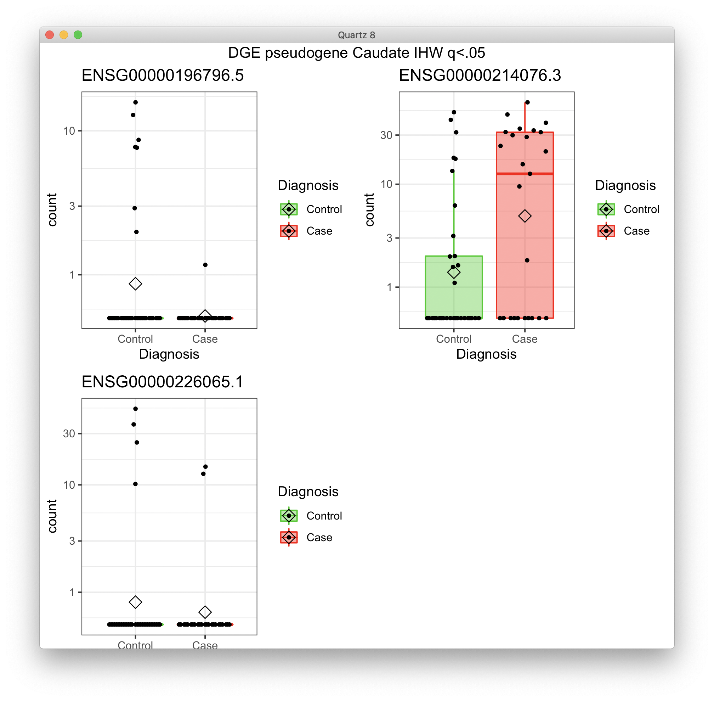
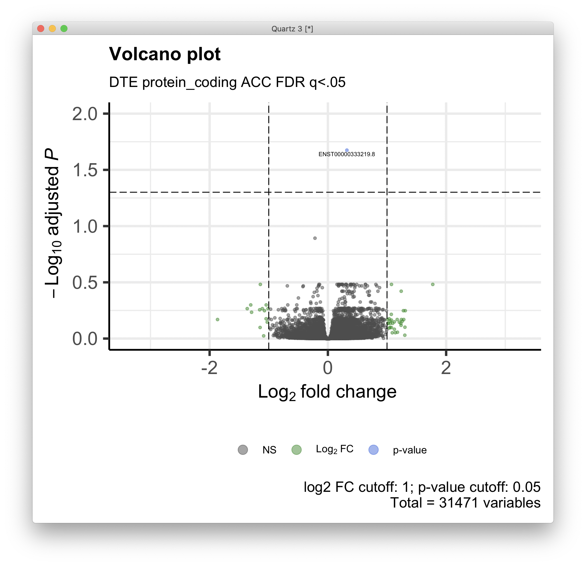
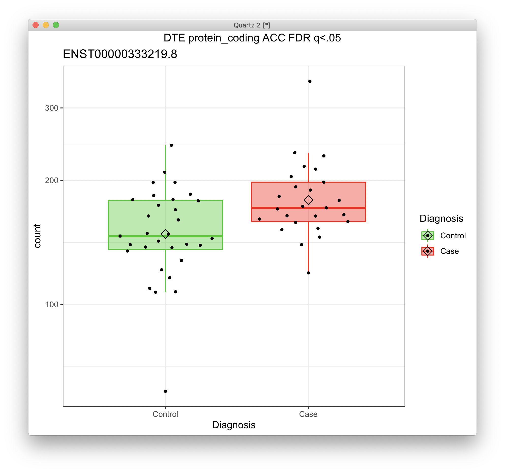
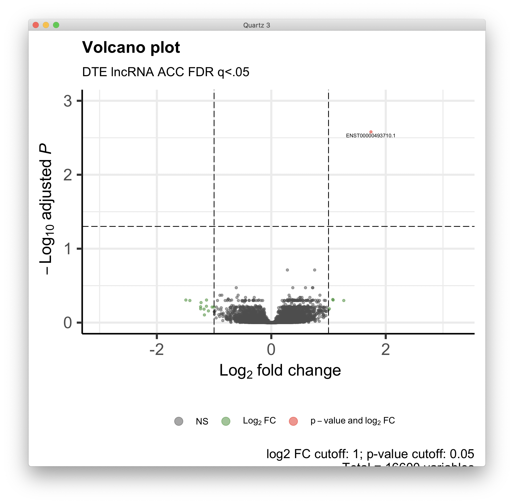
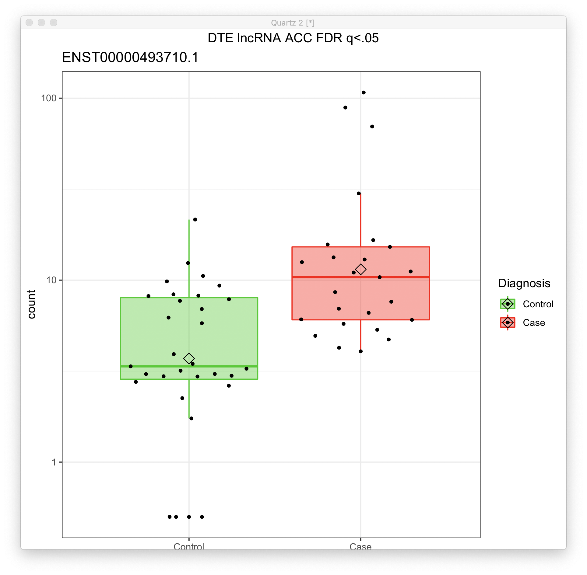
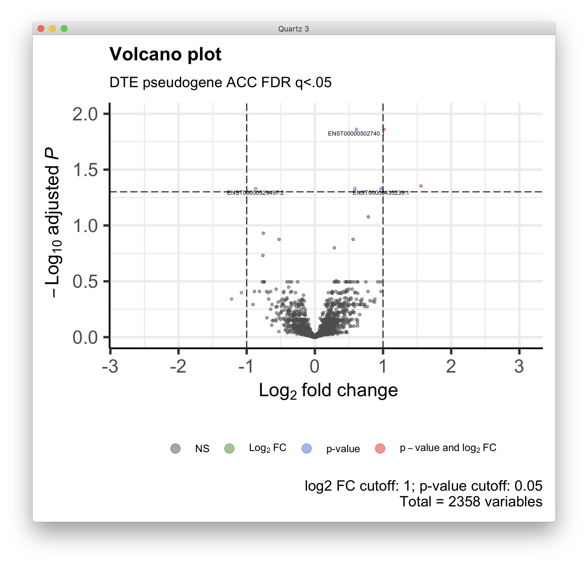
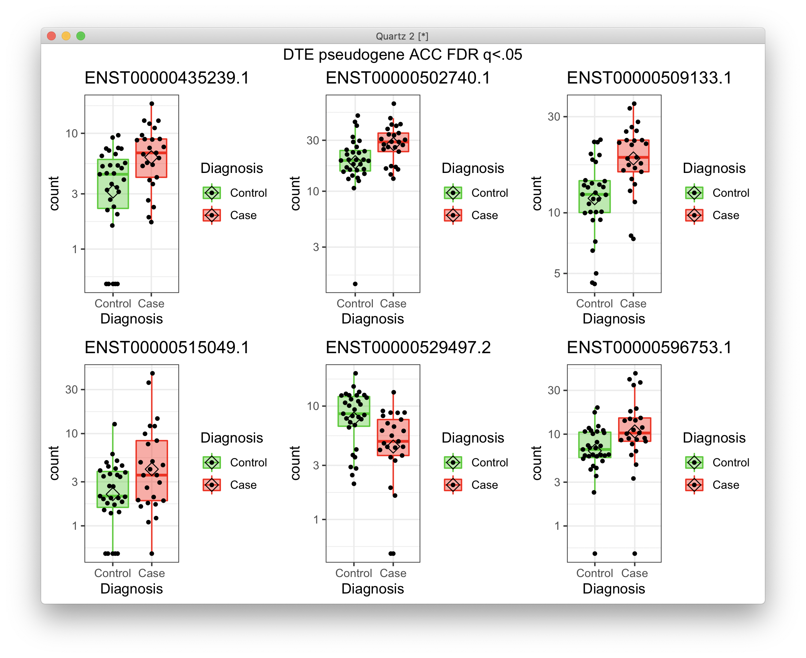
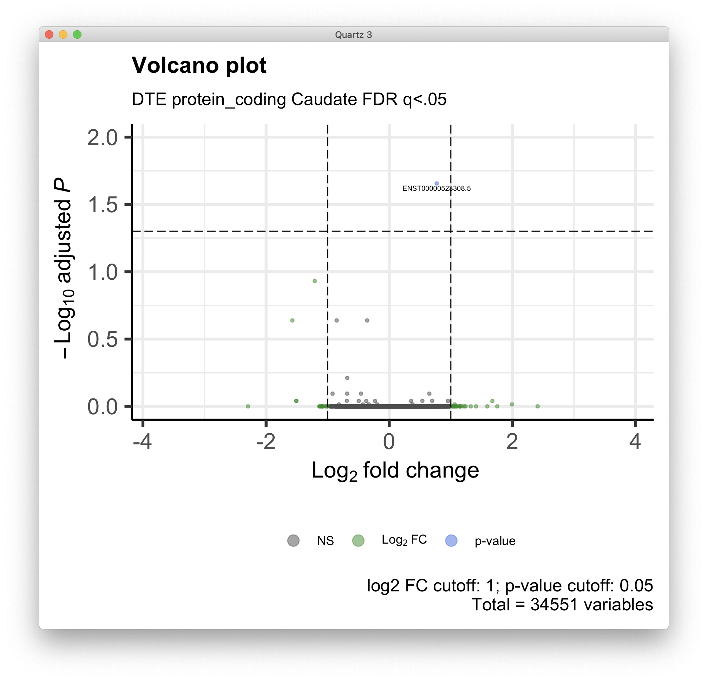
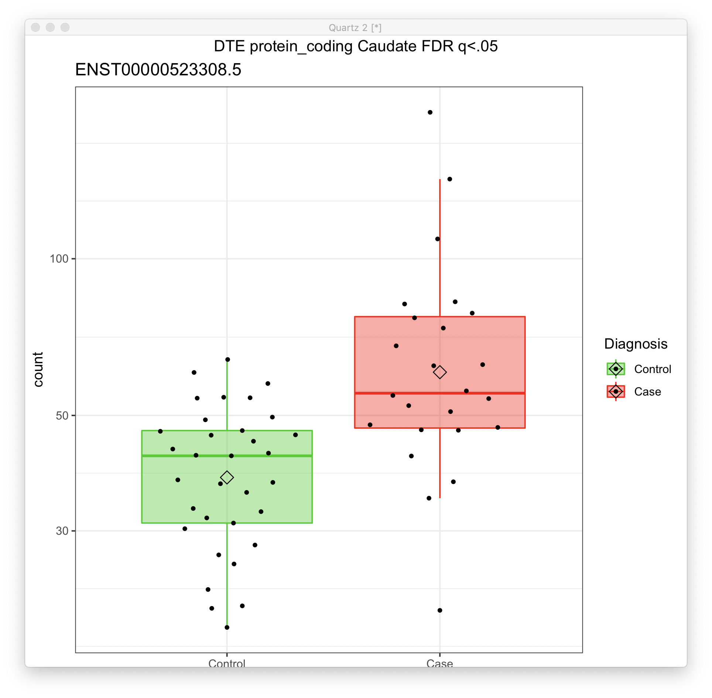

# 2021-01-25 19:32:47

Let'me see if this iterative filtering idea also works for DGE. Mostly because
I'm concerned that some results, particularly the pseudogene caudate, is still
quite odminated by zeros:



I'm also removing any variables with more than a percentage of participants with
zero counts. Let's start with 25% for now.

```r
# plotting each of the significant genes
plot_expression = function(gene_ids, dds, t_str) {
    library(ggpubr)
    library(ggbeeswarm)
    quartz()
    myplots = list()
    clrs = c("green3", "red")
    for (g in 1:length(gene_ids)) {
        cat(gene_ids[g], '\n')
        d <- plotCounts(dds, gene=gene_ids[g], intgroup="Diagnosis",
                        returnData=TRUE)
        p = (ggplot(d, aes(x=Diagnosis, y=count, color = Diagnosis,
                        fill = Diagnosis)) + 
            scale_y_log10() +
            geom_boxplot(alpha = 0.4, outlier.shape = NA, width = 0.8,
                        lwd = 0.5) +
            stat_summary(fun = mean, geom = "point", color = "black",
                        shape = 5, size = 3,
                        position=position_dodge(width = 0.8)) +
            scale_color_manual(values = clrs) +
            scale_fill_manual(values = clrs) +
            geom_quasirandom(color = "black", size = 1, dodge.width = 0.8) +
            theme_bw() +
            ggtitle(gene_ids[g]))
        myplots[[g]] = p
    }
    p = ggarrange(plotlist=myplots)
    print(annotate_figure(p, t_str))
}

plot_volcano = function(res, t_str) {
    library(EnhancedVolcano)
    quartz()
    pCutoff = 0.05
    FCcutoff = 1.0

    p = EnhancedVolcano(data.frame(res), lab = rownames(res),
                        x = 'log2FoldChange',
                        y = 'padj', xlab = bquote(~Log[2]~ 'fold change'),
                        selectLab = rownames(res)[res$padj < .05],
                        ylab = bquote(~-Log[10]~adjusted~italic(P)),
                        ylim = c(0, ceiling(max(-log10(res$padj)))),
                        pCutoff = pCutoff, FCcutoff = FCcutoff, pointSize = 1.0,
                        labSize = 2.0, title = "Volcano plot",
                        subtitle = t_str,
                        caption = paste0('log2 FC cutoff: ', FCcutoff,
                                        '; p-value cutoff: ', pCutoff,
                                        '\nTotal = ', nrow(res), ' variables'),
                        legendPosition = 'bottom', legendLabSize = 10,
                        legendIconSize = 4.0)
    print(p)
}
```

```r
myregion = 'Caudate'
data = readRDS('~/data/rnaseq_derek/complete_rawCountData_05132020.rds')
rownames(data) = data$submitted_name  # just to ensure compatibility later
# remove obvious outlier (that's NOT caudate) labeled as ACC
rm_me = rownames(data) %in% c('68080')
data = data[!rm_me, ]
data = data[data$Region==myregion, ]
library(gdata)
more = read.xls('~/data/post_mortem/POST_MORTEM_META_DATA_JAN_2021.xlsx')
more = more[!duplicated(more$hbcc_brain_id),]
data = merge(data, more[, c('hbcc_brain_id', 'comorbid_group_update',
                            'substance_group', 'evidence_level')],
             by='hbcc_brain_id', all.x=T, all.y=F)

# at this point we have 55 samples for ACC
grex_vars = colnames(data)[grepl(colnames(data), pattern='^ENS')]
count_matrix = t(data[, grex_vars])
data = data[, !grepl(colnames(data), pattern='^ENS')]
# data only contains sample metadata, and count_matrix has actual counts

# cleaning up some variables
data$POP_CODE = as.character(data$POP_CODE)
data[data$POP_CODE=='WNH', 'POP_CODE'] = 'W'
data[data$POP_CODE=='WH', 'POP_CODE'] = 'W'
data$POP_CODE = factor(data$POP_CODE)
data$Individual = factor(data$hbcc_brain_id)
data[data$Manner.of.Death=='Suicide (probable)', 'Manner.of.Death'] = 'Suicide'
data[data$Manner.of.Death=='unknown', 'Manner.of.Death'] = 'natural'
data$MoD = factor(data$Manner.of.Death)
data$batch = factor(as.numeric(data$run_date))
data$Diagnosis = factor(data$Diagnosis, levels=c('Control', 'Case'))
data$substance_group = factor(data$substance_group)
data$comorbid_group = factor(data$comorbid_group_update)
data$evidence_level = factor(data$evidence_level)

# removing everything but autosomes
library(GenomicFeatures)
txdb <- loadDb('~/data/post_mortem/Homo_sapies.GRCh38.97.sqlite')
txdf <- select(txdb, keys(txdb, "GENEID"), columns=c('GENEID','TXCHROM'),
               "GENEID")
bt = read.csv('~/data/post_mortem/Homo_sapiens.GRCh38.97_biotypes.csv')
bt_slim = bt[, c('gene_id', 'gene_biotype')]
bt_slim = bt_slim[!duplicated(bt_slim),]
txdf = merge(txdf, bt_slim, by.x='GENEID', by.y='gene_id')
# store gene names in geneCounts without version in end of name
tx_meta = data.frame(GENEID = substr(rownames(count_matrix), 1, 15))
tx_meta = merge(tx_meta, txdf, by='GENEID', sort=F)
imautosome = which(tx_meta$TXCHROM != 'X' &
                   tx_meta$TXCHROM != 'Y' &
                   tx_meta$TXCHROM != 'MT')
count_matrix = count_matrix[imautosome, ]
tx_meta = tx_meta[imautosome, ]
```

Now let's implement the function using the iteractive filter:

```r
run_DGE = function(count_matrix, tx_meta, myregion, subtype) {
    cat('Starting with', nrow(tx_meta), 'variables\n')
    keep_me = grepl(tx_meta$gene_biotype, pattern=sprintf('%s$', subtype))
    cat('Keeping', sum(keep_me), subtype, 'variables\n')
    my_count_matrix = count_matrix[keep_me, ]
    my_tx_meta = tx_meta[keep_me, ]

    # removing variables where more than half of the subjects have zero counts
    keep_me = rowSums(my_count_matrix==0) < .25*ncol(my_count_matrix)
    my_count_matrix = my_count_matrix[keep_me, ]
    cat('Keeping', nrow(my_count_matrix), 'after zero removal\n')

    # removing variables with zero or near-zero variance
    library(caret)
    pp_order = c('zv', 'nzv')
    pp = preProcess(t(my_count_matrix), method = pp_order)
    X = t(predict(pp, t(my_count_matrix)))
    cat('Keeping', nrow(X), 'after NZ and NZV filtering\n')

    # checking which PCs are associated with our potential nuiscance variables
    set.seed(42)
    mypca <- prcomp(t(X), scale=TRUE)
    # how many PCs to keep... using Kaiser thredhold, close to eigenvalues < 1
    library(nFactors)
    eigs <- mypca$sdev^2
    nS = nScree(x=eigs)
    keep_me = seq(1, nS$Components$nkaiser)

    mydata = data.frame(mypca$x[, keep_me])
    # create main metadata data frame including metadata and PCs
    data.pm = cbind(data, mydata)
    rownames(data.pm) = data$hbcc_brain_id
    cat('Using', nS$Components$nkaiser, 'PCs from possible', ncol(X), '\n')

    # check which PCs are associated at nominal p<.01
    num_vars = c('pcnt_optical_duplicates', 'clusters', 'Age', 'RINe', 'PMI',
                'C1', 'C2', 'C3', 'C4', 'C5')
    pc_vars = colnames(mydata)
    num_corrs = matrix(nrow=length(num_vars), ncol=length(pc_vars),
                       dimnames=list(num_vars, pc_vars))
    num_pvals = num_corrs
    for (x in num_vars) {
        for (y in pc_vars) {
            res = cor.test(data.pm[, x], data.pm[, y])
            num_corrs[x, y] = res$estimate
            num_pvals[x, y] = res$p.value
        }
    }

    categ_vars = c('batch', 'Diagnosis', 'MoD', 'substance_group',
                'comorbid_group', 'POP_CODE', 'Sex', 'evidence_level')
    categ_corrs = matrix(nrow=length(categ_vars), ncol=length(pc_vars),
                         dimnames=list(categ_vars, pc_vars))
    categ_pvals = categ_corrs
    for (x in categ_vars) {
        for (y in pc_vars) {
            res = kruskal.test(data.pm[, y], data.pm[, x])
            categ_corrs[x, y] = res$statistic
            categ_pvals[x, y] = res$p.value
        }
    }
    use_pcs = unique(c(which(num_pvals < .01, arr.ind = T)[, 'col'],
                    which(categ_pvals < .01, arr.ind = T)[, 'col']))
    # only use the ones not related to Diagnosis
    keep_me = c()
    for (pc in use_pcs) {
        keep_me = c(keep_me, categ_pvals['Diagnosis', pc] > .05)
    }
    use_pcs = use_pcs[keep_me]
    
    fm_str = sprintf('~ Diagnosis + %s', paste0(pc_vars[use_pcs],
                                                collapse = ' + '))
    cat('Found', length(use_pcs), 'PCs p < .01\n')
    cat('Using formula:', fm_str, '\n')

    # removing variables with low expression
    library(edgeR)
    design=model.matrix(as.formula(fm_str), data=data.pm)
    isexpr <- filterByExpr(X, design=design)
    countsExpr = X[isexpr,]
    metaExpr = data.frame(GENEID = substr(rownames(countsExpr), 1, 15))
    metaExpr = merge(metaExpr, my_tx_meta, by='GENEID', sort=F)
    cat('Keeping', nrow(countsExpr), 'after expression filtering\n')

    # preparing DESeqData and running main analysis
    countdata = round(countsExpr)
    colnames(countdata) = rownames(data.pm)
    library(DESeq2)
    # because DESeq doesn't remove outliers if there are continuous variables
    # in the formula, we need to do this iteratively
    nOutliers = Inf
    myCounts = round(countsExpr)
    while (nOutliers > 0) {
        dds <- DESeqDataSetFromMatrix(countData = myCounts,
                                    colData = data.pm,
                                    design = as.formula(fm_str))
        cat('Processing', nrow(dds), 'variables.\n')
        dds <- DESeq(dds)
        maxCooks <- apply(assays(dds)[["cooks"]], 1, max)
        # outlier cut-off uses the 99% quantile of the F(p,m-p) distribution (with 
        # p the number of parameters including the intercept and m number of
        # samples).
        m <- ncol(dds)
        # number or parameters (PCs + Diagnosis + intercept)
        p <- length(use_pcs) + 2
        co = qf(.99, p, m - p)
        keep_me = which(maxCooks < co)
        nOutliers = nrow(myCounts) - length(keep_me)
        cat('Found', nOutliers, 'outliers.\n')
        myCounts = round(myCounts)[keep_me, ]
    }
    res <- results(dds, name = "Diagnosis_Case_vs_Control", alpha = 0.05)
    cat('FDR q < .05\n')
    print(summary(res))
    gene_ids = rownames(res)[res$padj < .05]
    if (length(gene_ids) > 0) {
        print(gene_ids)
        plot_expression(gene_ids, dds, sprintf('DGE %s %s FDR q<.05', subtype,
                                               myregion))
        plot_volcano(res, sprintf('DGE %s %s FDR q<.05', subtype, myregion))
    }

    library(IHW)
    resIHW <- results(dds, name = "Diagnosis_Case_vs_Control", alpha = 0.05,
                    filterFun=ihw)
    cat('IHW q < .05\n')
    print(summary(resIHW))
    gene_ids = rownames(resIHW)[resIHW$padj < .05]
    if (length(gene_ids) > 0) {
        print(gene_ids)
        plot_expression(gene_ids, dds, sprintf('DGE %s %s IHW q<.05', subtype,
                                               myregion))
        plot_volcano(resIHW, sprintf('DGE %s %s IHW q<.05', subtype, myregion))
    }
    return(res)
}
```

And let's implement the same idea for DTE:

```r
myregion = 'ACC'

load('~/data/isoforms/tximport_rsem_DTE.RData')
txi = rsem

# I'll just use the metadata from here
data = readRDS('~/data/rnaseq_derek/complete_rawCountData_05132020.rds')
rownames(data) = data$submitted_name  # just to ensure compatibility later
data = data[data$Region==myregion, ]
library(gdata)
more = read.xls('~/data/post_mortem/POST_MORTEM_META_DATA_JAN_2021.xlsx')
more = more[!duplicated(more$hbcc_brain_id),]
data = merge(data, more[, c('hbcc_brain_id', 'comorbid_group_update',
                            'substance_group', 'evidence_level')],
             by='hbcc_brain_id', all.x=T, all.y=F)
# samples has only the metadata now
samples = data[, !grepl(colnames(data), pattern='^ENS')]

# remove samples for the other brain region from the tx counts matrices
keep_me = colnames(txi$counts) %in% samples$submitted_name
for (i in c('abundance', 'counts', 'length')) {
    txi[[i]] = txi[[i]][, keep_me]
}
# sort samples to match order in tximport matrices
rownames(samples) = samples$submitted_name
samples = samples[colnames(txi$counts), ]

# cleaning up some metadata
samples$POP_CODE = as.character(samples$POP_CODE)
samples[samples$POP_CODE=='WNH', 'POP_CODE'] = 'W'
samples[samples$POP_CODE=='WH', 'POP_CODE'] = 'W'
samples$POP_CODE = factor(samples$POP_CODE)
samples$Individual = factor(samples$hbcc_brain_id)
samples[samples$Manner.of.Death=='Suicide (probable)', 'Manner.of.Death'] = 'Suicide'
samples[samples$Manner.of.Death=='unknown', 'Manner.of.Death'] = 'natural'
samples$MoD = factor(samples$Manner.of.Death)
samples$batch = factor(as.numeric(samples$run_date))
samples$Diagnosis = factor(samples$Diagnosis, levels=c('Control', 'Case'))
samples$substance_group = factor(samples$substance_group)
samples$comorbid_group = factor(samples$comorbid_group_update)
samples$evidence_level = factor(samples$evidence_level)

# removing everything but autosomes
library(GenomicFeatures)
txdb <- loadDb('~/data/post_mortem/Homo_sapies.GRCh38.97.sqlite')
txdf <- select(txdb, keys(txdb, "TXNAME"), columns=c('GENEID','TXCHROM'),
               "TXNAME")
# keep only the remaining transcripts and their corresponding genes
txdf.sub = txdf[match(substr(rownames(txi$counts), 1, 15), txdf$TXNAME),]
bt = read.csv('~/data/post_mortem/Homo_sapiens.GRCh38.97_biotypes.csv')
bt_slim = bt[, c('transcript_id', 'transcript_biotype')]
bt_slim = bt_slim[!duplicated(bt_slim),]
tx_meta = merge(txdf.sub, bt_slim, by.x='TXNAME', by.y='transcript_id')
imautosome = which(tx_meta$TXCHROM != 'X' &
                   tx_meta$TXCHROM != 'Y' &
                   tx_meta$TXCHROM != 'MT')
count_matrix = txi$counts[imautosome, ]
tx_meta = tx_meta[imautosome, ]
```

At this point, no filtering has been done, except for keeping only autosomes.
And I added all annotations I wanted. Now, it's just a matter of filtering in
any way we want. Note that I'll need to go back to the edgeR filtering because
DRIMSeq was keeping only transcripts for genes with 2 or more transcripts, which
makes sense for DTU but not for DTE.

```r
run_DTE = function(count_matrix, tx_meta, myregion, subtype) {
    cat('Starting with', nrow(tx_meta), 'variables\n')
    keep_me = grepl(tx_meta$transcript_biotype, pattern=sprintf('%s$', subtype))
    cat('Keeping', sum(keep_me), subtype, 'variables\n')
    my_count_matrix = count_matrix[keep_me, ]
    my_tx_meta = tx_meta[keep_me, ]

    # removing variables where more than half of the subjects have zero counts
    keep_me = rowSums(my_count_matrix==0) < .25*ncol(my_count_matrix)
    my_count_matrix = my_count_matrix[keep_me, ]
    cat('Keeping', nrow(my_count_matrix), 'after zero removal\n')

    # removing variables with zero or near-zero variance
    library(caret)
    pp_order = c('zv', 'nzv')
    pp = preProcess(t(my_count_matrix), method = pp_order)
    X = t(predict(pp, t(my_count_matrix)))
    cat('Keeping', nrow(X), 'after NZ and NZV filtering\n')

    # checking which PCs are associated with our potential nuiscance variables
    set.seed(42)
    mypca <- prcomp(t(X), scale=TRUE)
    # how many PCs to keep... using Kaiser thredhold, close to eigenvalues < 1
    library(nFactors)
    eigs <- mypca$sdev^2
    nS = nScree(x=eigs)
    keep_me = seq(1, nS$Components$nkaiser)

    mydata = data.frame(mypca$x[, keep_me])
    # create main metadata data frame including metadata and PCs
    data.pm = cbind(samples, mydata)
    rownames(data.pm) = samples$hbcc_brain_id
    cat('Using', nS$Components$nkaiser, 'PCs from possible', ncol(X), '\n')

    # check which PCs are associated at nominal p<.01
    num_vars = c('pcnt_optical_duplicates', 'clusters', 'Age', 'RINe', 'PMI',
                'C1', 'C2', 'C3', 'C4', 'C5')
    pc_vars = colnames(mydata)
    num_corrs = matrix(nrow=length(num_vars), ncol=length(pc_vars),
                        dimnames=list(num_vars, pc_vars))
    num_pvals = num_corrs
    for (x in num_vars) {
        for (y in pc_vars) {
            res = cor.test(data.pm[, x], data.pm[, y])
            num_corrs[x, y] = res$estimate
            num_pvals[x, y] = res$p.value
        }
    }

    categ_vars = c('batch', 'Diagnosis', 'MoD', 'substance_group',
                'comorbid_group', 'POP_CODE', 'Sex', 'evidence_level')
    categ_corrs = matrix(nrow=length(categ_vars), ncol=length(pc_vars),
                            dimnames=list(categ_vars, pc_vars))
    categ_pvals = categ_corrs
    for (x in categ_vars) {
        for (y in pc_vars) {
            res = kruskal.test(data.pm[, y], data.pm[, x])
            categ_corrs[x, y] = res$statistic
            categ_pvals[x, y] = res$p.value
        }
    }
    use_pcs = unique(c(which(num_pvals < .01, arr.ind = T)[, 'col'],
                    which(categ_pvals < .01, arr.ind = T)[, 'col']))
    # only use the ones not related to Diagnosis
    keep_me = c()
    for (pc in use_pcs) {
        keep_me = c(keep_me, categ_pvals['Diagnosis', pc] > .05)
    }
    use_pcs = use_pcs[keep_me]
    fm_str = sprintf('~ Diagnosis + %s', paste0(pc_vars[use_pcs],
                                                collapse = ' + '))
    cat('Found', length(use_pcs), 'PCs p < .01\n')
    cat('Using formula:', fm_str, '\n')

    # removing variables with low expression
    library(edgeR)
    design=model.matrix(as.formula(fm_str), data=data.pm)
    isexpr <- filterByExpr(X, design=design)
    countsExpr = X[isexpr,]
    metaExpr = data.frame(TXNAME = substr(rownames(countsExpr), 1, 15))
    metaExpr = merge(metaExpr, my_tx_meta, by='TXNAME', sort=F)
    cat('Keeping', nrow(countsExpr), 'after expression filtering\n')

    library(DESeq2)
    # because DESeq doesn't remove outliers if there are continuous variables
    # in the formula, we need to do this iteratively
    nOutliers = Inf
    myCounts = round(countsExpr)
    while (nOutliers > 0) {
        dds <- DESeqDataSetFromMatrix(countData = myCounts,
                                    colData = data.pm,
                                    design = as.formula(fm_str))
        cat('Processing', nrow(dds), 'variables.\n')
        dds <- DESeq(dds)
        maxCooks <- apply(assays(dds)[["cooks"]], 1, max)
        # outlier cut-off uses the 99% quantile of the F(p,m-p) distribution (with 
        # p the number of parameters including the intercept and m number of
        # samples).
        m <- ncol(dds)
        # number or parameters (PCs + Diagnosis + intercept)
        p <- length(use_pcs) + 2
        co = qf(.99, p, m - p)
        keep_me = which(maxCooks < co)
        nOutliers = nrow(myCounts) - length(keep_me)
        cat('Found', nOutliers, 'outliers.\n')
        myCounts = round(myCounts)[keep_me, ]
    }
    res <- results(dds, name = "Diagnosis_Case_vs_Control", alpha = 0.05)
    cat('FDR q < .05\n')
    print(summary(res))
    tx_ids = rownames(res)[res$padj < .05]
    if (length(tx_ids) > 0) {
        print(tx_ids)
        plot_expression(tx_ids, dds, sprintf('DTE %s %s FDR q<.05', subtype,
                                            myregion))
        plot_volcano(res, sprintf('DTE %s %s FDR q<.05', subtype, myregion))
    }

    library(IHW)
    resIHW <- results(dds, name = "Diagnosis_Case_vs_Control", alpha = 0.05,
                    filterFun=ihw)
    cat('IHW q < .05\n')
    print(summary(resIHW))
    tx_ids = rownames(resIHW)[resIHW$padj < .05]
    if (length(tx_ids) > 0) {
        print(tx_ids)
        plot_expression(tx_ids, dds, sprintf('DTE %s %s IHW q<.05', subtype,
                                            myregion))
        plot_volcano(resIHW, sprintf('DTE %s %s IHW q<.05', subtype, myregion))
    }

    # stage-wise testing
    library(stageR)
    library(dplyr)
    pConfirmation <- matrix(res$pvalue, ncol=1)
    dimnames(pConfirmation) <- list(substr(rownames(res), 1, 15),
                                    c("transcript"))
    # select one qval per gene (min over transcripts)
    junk = as.data.frame(res)
    junk$TXNAME = substr(rownames(junk), 1, 15)
    m = merge(junk, metaExpr, by='TXNAME')
    qvals = m %>% group_by(GENEID) %>% slice_min(n=1, padj, with_ties=F)
    pScreen = qvals$padj
    names(pScreen) = qvals$GENEID

    stageRObj = stageRTx(pScreen=pScreen, pConfirmation=pConfirmation,
                        pScreenAdjusted=TRUE, tx2gene=metaExpr[, 1:2])
    stageRObj = stageWiseAdjustment(stageRObj, method="dte", alpha=0.05)
    cat('stageR q < .05\n')
    gene_ids = getSignificantGenes(stageRObj)
    tx_ids = getSignificantTx(stageRObj)
    if (nrow(tx_ids) > 0) {
        print(gene_ids)
        print(tx_ids)
    }
}
```

With the DTE code is working, we can now run:

```r
run_DTE(count_matrix, tx_meta, myregion, 'protein_coding')
# protein_code, lncRNA, pseudogene
```

Let's collect some results again. These don't take much time anyways.

**ACC Protein coding**

FDR q < .05

out of 31471 with nonzero total read count
adjusted p-value < 0.05
LFC > 0 (up)       : 1, 0.0032%
LFC < 0 (down)     : 0, 0%
outliers [1]       : 0, 0%
low counts [2]     : 0, 0%
(mean count < 3)
[1] see 'cooksCutoff' argument of ?results
[2] see 'independentFiltering' argument of ?results

NULL
[1] "ENST00000333219.8"
ENST00000333219.8 

(IHW result is actually zero)


NULL
stageR q < .05
                FDR adjusted p-value
ENSG00000153487           0.02112751
                stage-wise adjusted p-value
ENST00000333219                 0.009356363





**ACC lncRNA**

FDR q < .05

out of 16600 with nonzero total read count
adjusted p-value < 0.05
LFC > 0 (up)       : 1, 0.006%
LFC < 0 (down)     : 0, 0%
outliers [1]       : 0, 0%
low counts [2]     : 0, 0%
(mean count < 2)
[1] see 'cooksCutoff' argument of ?results
[2] see 'independentFiltering' argument of ?results

NULL
[1] "ENST00000493710.1"
ENST00000493710.1

(IHW results identical)

stageR q < .05
                FDR adjusted p-value
ENSG00000240758          0.002635036
                stage-wise adjusted p-value
ENST00000493710                           0




**ACC pseudogene**

FDR q < .05

out of 2358 with nonzero total read count
adjusted p-value < 0.05
LFC > 0 (up)       : 5, 0.21%
LFC < 0 (down)     : 1, 0.042%
outliers [1]       : 0, 0%
low counts [2]     : 0, 0%
(mean count < 2)
[1] see 'cooksCutoff' argument of ?results
[2] see 'independentFiltering' argument of ?results

NULL
[1] "ENST00000435239.1" "ENST00000502740.1" "ENST00000509133.1" "ENST00000515049.1"
[5] "ENST00000529497.2" "ENST00000596753.1"
ENST00000435239.1
ENST00000502740.1
ENST00000509133.1
ENST00000515049.1
ENST00000529497.2
ENST00000596753.1


(IHW results are identical)

stageR q < .05
                FDR adjusted p-value
ENSG00000226421           0.04678449
ENSG00000250483           0.01379511
ENSG00000227725           0.04678449
ENSG00000249176           0.04437379
ENSG00000254866           0.04678449
ENSG00000268100           0.01379511
                stage-wise adjusted p-value
ENST00000435239                           0
ENST00000502740                           0
ENST00000509133                           0
ENST00000515049                           0
ENST00000529497                           0
ENST00000596753                           0





**Caudate Protein coding**

FDR q < .05

out of 34551 with nonzero total read count
adjusted p-value < 0.05
LFC > 0 (up)       : 1, 0.0029%
LFC < 0 (down)     : 0, 0%
outliers [1]       : 0, 0%
low counts [2]     : 0, 0%
(mean count < 4)
[1] see 'cooksCutoff' argument of ?results
[2] see 'independentFiltering' argument of ?results

NULL
[1] "ENST00000523308.5"
ENST00000523308.5 

(IHW results are identical)

stageR q < .05
                FDR adjusted p-value
ENSG00000105339           0.02208237
                stage-wise adjusted p-value
ENST00000523308                  0.02790543





**Caudate lncRNA**

Nothing.

**Caudate pseudogene**

Nothing.

# TODO
 * Check PRS results
 * Check WG results
 * Interpret each gene result