# 2021-01-25 19:32:47

I was playing with scaling the PCs for the PRs analysis in 181, and noticed that
it does change the filtering and therefore the final FDR values for our main
results! Let's re-run everything, now with the correct scaled variables.

```r
# plotting each of the significant genes
plot_expression = function(gene_ids, dds, t_str) {
    library(ggpubr)
    library(ggbeeswarm)
    quartz()
    myplots = list()
    clrs = c("green3", "red")
    for (g in 1:length(gene_ids)) {
        cat(gene_ids[g], '\n')
        d <- plotCounts(dds, gene=gene_ids[g], intgroup="Diagnosis",
                        returnData=TRUE)
        p = (ggplot(d, aes(x=Diagnosis, y=count, color = Diagnosis,
                        fill = Diagnosis)) + 
            scale_y_log10() +
            geom_boxplot(alpha = 0.4, outlier.shape = NA, width = 0.8,
                        lwd = 0.5) +
            stat_summary(fun = mean, geom = "point", color = "black",
                        shape = 5, size = 3,
                        position=position_dodge(width = 0.8)) +
            scale_color_manual(values = clrs) +
            scale_fill_manual(values = clrs) +
            geom_quasirandom(color = "black", size = 1, dodge.width = 0.8) +
            theme_bw() +
            ggtitle(gene_ids[g]))
        myplots[[g]] = p
    }
    p = ggarrange(plotlist=myplots)
    print(annotate_figure(p, t_str))
}

plot_volcano = function(res, t_str, pCutoff = 0.05) {
    library(EnhancedVolcano)
    quartz()
    FCcutoff = 1.0

    p = EnhancedVolcano(data.frame(res), lab = rownames(res),
                        x = 'log2FoldChange',
                        y = 'padj', xlab = bquote(~Log[2]~ 'fold change'),
                        selectLab = rownames(res)[res$padj < pCutoff],
                        ylab = bquote(~-Log[10]~adjusted~italic(P)),
                        ylim = c(0, ceiling(max(-log10(res$padj)))),
                        pCutoff = pCutoff, FCcutoff = FCcutoff, pointSize = 1.0,
                        labSize = 2.0, title = "Volcano plot",
                        subtitle = t_str,
                        caption = paste0('log2 FC cutoff: ', FCcutoff,
                                        '; p-value cutoff: ', pCutoff,
                                        '\nTotal = ', nrow(res), ' variables'),
                        legendPosition = 'bottom', legendLabSize = 10,
                        legendIconSize = 4.0)
    print(p)
}
```

```r
myregion = 'ACC'
data = readRDS('~/data/rnaseq_derek/complete_rawCountData_05132020.rds')
rownames(data) = data$submitted_name  # just to ensure compatibility later
# remove obvious outlier (that's NOT caudate) labeled as ACC
rm_me = rownames(data) %in% c('68080')
data = data[!rm_me, ]
data = data[data$Region==myregion, ]
library(gdata)
more = read.xls('~/data/post_mortem/POST_MORTEM_META_DATA_JAN_2021.xlsx')
more = more[!duplicated(more$hbcc_brain_id),]
data = merge(data, more[, c('hbcc_brain_id', 'comorbid_group_update',
                            'substance_group', 'evidence_level')],
             by='hbcc_brain_id', all.x=T, all.y=F)

# at this point we have 55 samples for ACC
grex_vars = colnames(data)[grepl(colnames(data), pattern='^ENS')]
count_matrix = t(data[, grex_vars])
data = data[, !grepl(colnames(data), pattern='^ENS')]
# data only contains sample metadata, and count_matrix has actual counts

# cleaning up some variables
data$POP_CODE = as.character(data$POP_CODE)
data[data$POP_CODE=='WNH', 'POP_CODE'] = 'W'
data[data$POP_CODE=='WH', 'POP_CODE'] = 'W'
data$POP_CODE = factor(data$POP_CODE)
data$Individual = factor(data$hbcc_brain_id)
data[data$Manner.of.Death=='Suicide (probable)', 'Manner.of.Death'] = 'Suicide'
data[data$Manner.of.Death=='unknown', 'Manner.of.Death'] = 'natural'
data$MoD = factor(data$Manner.of.Death)
data$batch = factor(as.numeric(data$run_date))
data$Diagnosis = factor(data$Diagnosis, levels=c('Control', 'Case'))
data$substance_group = factor(data$substance_group)
data$comorbid_group = factor(data$comorbid_group_update)
data$evidence_level = factor(data$evidence_level)

# removing everything but autosomes
library(GenomicFeatures)
txdb <- loadDb('~/data/post_mortem/Homo_sapies.GRCh38.97.sqlite')
txdf <- select(txdb, keys(txdb, "GENEID"), columns=c('GENEID','TXCHROM'),
               "GENEID")
bt = read.csv('~/data/post_mortem/Homo_sapiens.GRCh38.97_biotypes.csv')
bt_slim = bt[, c('gene_id', 'gene_biotype')]
bt_slim = bt_slim[!duplicated(bt_slim),]
txdf = merge(txdf, bt_slim, by.x='GENEID', by.y='gene_id')
# store gene names in geneCounts without version in end of name
tx_meta = data.frame(GENEID = substr(rownames(count_matrix), 1, 15))
tx_meta = merge(tx_meta, txdf, by='GENEID', sort=F)
imautosome = which(tx_meta$TXCHROM != 'X' &
                   tx_meta$TXCHROM != 'Y' &
                   tx_meta$TXCHROM != 'MT')
count_matrix = count_matrix[imautosome, ]
tx_meta = tx_meta[imautosome, ]
```

Now let's re-implement the function, but scaling the PCs:

```r
run_DGE = function(count_matrix, tx_meta, myregion, subtype, alpha) {
    cat('Starting with', nrow(tx_meta), 'variables\n')
    keep_me = grepl(tx_meta$gene_biotype, pattern=sprintf('%s$', subtype))
    cat('Keeping', sum(keep_me), subtype, 'variables\n')
    my_count_matrix = count_matrix[keep_me, ]
    my_tx_meta = tx_meta[keep_me, ]

    # removing variables where more than half of the subjects have zero counts
    keep_me = rowSums(my_count_matrix==0) < .25*ncol(my_count_matrix)
    my_count_matrix = my_count_matrix[keep_me, ]
    cat('Keeping', nrow(my_count_matrix), 'after zero removal\n')

    # removing variables with zero or near-zero variance
    library(caret)
    pp_order = c('zv', 'nzv')
    pp = preProcess(t(my_count_matrix), method = pp_order)
    X = t(predict(pp, t(my_count_matrix)))
    cat('Keeping', nrow(X), 'after NZ and NZV filtering\n')

    # checking which PCs are associated with our potential nuiscance variables
    set.seed(42)
    mypca <- prcomp(t(X), scale=TRUE)
    # how many PCs to keep... using Kaiser thredhold, close to eigenvalues < 1
    library(nFactors)
    eigs <- mypca$sdev^2
    nS = nScree(x=eigs)
    keep_me = seq(1, nS$Components$nkaiser)

    mydata = data.frame(mypca$x[, keep_me])
    # create main metadata data frame including metadata and PCs
    data.pm = cbind(data, mydata)
    rownames(data.pm) = data$hbcc_brain_id
    cat('Using', nS$Components$nkaiser, 'PCs from possible', ncol(X), '\n')

    # check which PCs are associated at nominal p<.01
    num_vars = c('pcnt_optical_duplicates', 'clusters', 'Age', 'RINe', 'PMI',
                'C1', 'C2', 'C3', 'C4', 'C5')
    pc_vars = colnames(mydata)
    num_corrs = matrix(nrow=length(num_vars), ncol=length(pc_vars),
                       dimnames=list(num_vars, pc_vars))
    num_pvals = num_corrs
    for (x in num_vars) {
        for (y in pc_vars) {
            res = cor.test(data.pm[, x], data.pm[, y], method='spearman')
            num_corrs[x, y] = res$estimate
            num_pvals[x, y] = res$p.value
        }
    }

    categ_vars = c('batch', 'Diagnosis', 'MoD', 'substance_group',
                'comorbid_group', 'POP_CODE', 'Sex', 'evidence_level')
    categ_corrs = matrix(nrow=length(categ_vars), ncol=length(pc_vars),
                         dimnames=list(categ_vars, pc_vars))
    categ_pvals = categ_corrs
    for (x in categ_vars) {
        for (y in pc_vars) {
            res = kruskal.test(data.pm[, y], data.pm[, x])
            categ_corrs[x, y] = res$statistic
            categ_pvals[x, y] = res$p.value
        }
    }
    use_pcs = unique(c(which(num_pvals < .01, arr.ind = T)[, 'col'],
                    which(categ_pvals < .01, arr.ind = T)[, 'col']))
    # only use the ones not related to Diagnosis
    keep_me = c()
    for (pc in use_pcs) {
        keep_me = c(keep_me, categ_pvals['Diagnosis', pc] > .05)
    }
    use_pcs = use_pcs[keep_me]
    
    fm_str = sprintf('~ Diagnosis + %s', paste0(pc_vars[use_pcs],
                                                collapse = ' + '))
    cat('Found', length(use_pcs), 'PCs p < .01\n')
    cat('Using formula:', fm_str, '\n')

    # scaling PCs to assure convergence
    for (var in pc_vars[use_pcs]) {
        data.pm[, var] = scale(data.pm[, var])
    }

    # removing variables with low expression
    library(edgeR)
    design=model.matrix(as.formula(fm_str), data=data.pm)
    isexpr <- filterByExpr(X, design=design)
    countsExpr = X[isexpr,]
    metaExpr = data.frame(GENEID = substr(rownames(countsExpr), 1, 15))
    metaExpr = merge(metaExpr, my_tx_meta, by='GENEID', sort=F)
    cat('Keeping', nrow(countsExpr), 'after expression filtering\n')

    # preparing DESeqData and running main analysis
    countdata = round(countsExpr)
    colnames(countdata) = rownames(data.pm)
    library(DESeq2)
    # because DESeq doesn't remove outliers if there are continuous variables
    # in the formula, we need to do this iteratively
    nOutliers = Inf
    myCounts = round(countsExpr)
    while (nOutliers > 0) {
        dds <- DESeqDataSetFromMatrix(countData = myCounts,
                                    colData = data.pm,
                                    design = as.formula(fm_str))
        cat('Processing', nrow(dds), 'variables.\n')
        dds <- DESeq(dds)
        maxCooks <- apply(assays(dds)[["cooks"]], 1, max)
        # outlier cut-off uses the 99% quantile of the F(p,m-p) distribution (with 
        # p the number of parameters including the intercept and m number of
        # samples).
        m <- ncol(dds)
        # number or parameters (PCs + Diagnosis + intercept)
        p <- length(use_pcs) + 2
        co = qf(.99, p, m - p)
        keep_me = which(maxCooks < co)
        nOutliers = nrow(myCounts) - length(keep_me)
        cat('Found', nOutliers, 'outliers.\n')
        myCounts = round(myCounts)[keep_me, ]
    }
    res <- results(dds, name = "Diagnosis_Case_vs_Control", alpha = alpha)
    cat(sprintf('FDR q < %.2f\n', alpha))
    print(summary(res))
    gene_ids = rownames(res)[which(res$padj < alpha)]
    plot_volcano(res, sprintf('DGE Diagnosis %s %s FDR q<%.2f', subtype,
                     myregion, alpha), pCutoff = alpha)
    if (length(gene_ids) > 0) {
        print(gene_ids)
        plot_expression(gene_ids, dds,
                        sprintf('DGE Diagnosis %s %s FDR q<%.2f', subtype,
                                myregion, alpha))
    }

    library(IHW)
    resIHW <- results(dds, name = "Diagnosis_Case_vs_Control", alpha = alpha,
                    filterFun=ihw)
    cat(sprintf('IHW q < %.2f\n', alpha))
    print(summary(resIHW))
    gene_ids = rownames(resIHW)[which(resIHW$padj < alpha)]
    plot_volcano(resIHW, sprintf('DGE Diagnosis %s %s IHW q<%.2f', subtype,
                     myregion, alpha), pCutoff = alpha)
    if (length(gene_ids) > 0) {
        print(gene_ids)
        plot_expression(gene_ids, dds,
                        sprintf('DGE Diagnosis %s %s IHW q<%.2f', subtype,
                                myregion, alpha))
    }
    return(resIHW)
}
```

```r
dge_acc = list()
for (st in c('pseudogene', 'lncRNA', 'protein_coding')) {
    dge_acc[[st]] = run_DGE(count_matrix, tx_meta, myregion, st, .05)
}
dge_acc_q1 = list()
for (st in c('pseudogene', 'lncRNA', 'protein_coding')) {
    dge_acc_q1[[st]] = run_DGE(count_matrix, tx_meta, myregion, st, .1)
}
dge_cau = list()
for (st in c('pseudogene', 'lncRNA', 'protein_coding')) {
    dge_cau[[st]] = run_DGE(count_matrix, tx_meta, myregion, st, .05)
}
dge_cau_q1 = list()
for (st in c('pseudogene', 'lncRNA', 'protein_coding')) {
    dge_cau_q1[[st]] = run_DGE(count_matrix, tx_meta, myregion, st, .1)
}

```

I also ran some as dge_*_q1 just for the pictures, and saved everything to ~/data/post_mortem/DGE_01272021.RData.

**ACC Protein coding**

FDR q < 0.05

out of 15619 with nonzero total read count
adjusted p-value < 0.05
LFC > 0 (up)       : 0, 0%
LFC < 0 (down)     : 0, 0%
outliers [1]       : 0, 0%
low counts [2]     : 0, 0%
(mean count < 3)
[1] see 'cooksCutoff' argument of ?results
[2] see 'independentFiltering' argument of ?results

NULL
IHW q < 0.05

out of 15619 with nonzero total read count
adjusted p-value < 0.05
LFC > 0 (up)       : 1, 0.0064%
LFC < 0 (down)     : 0, 0%
outliers [1]       : 0, 0%
[1] see 'cooksCutoff' argument of ?results
see metadata(res)$ihwResult on hypothesis weighting

NULL
[1] "ENSG00000002016.17"
ENSG00000002016.17 

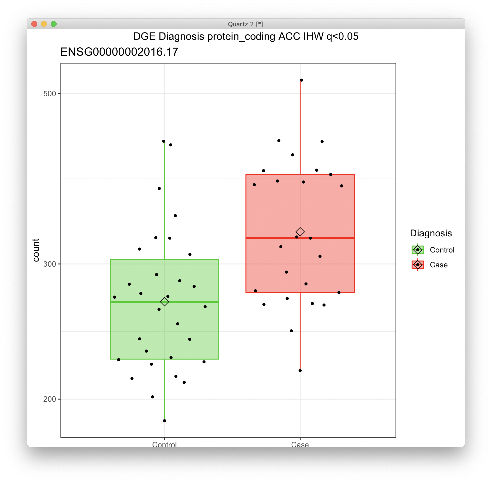
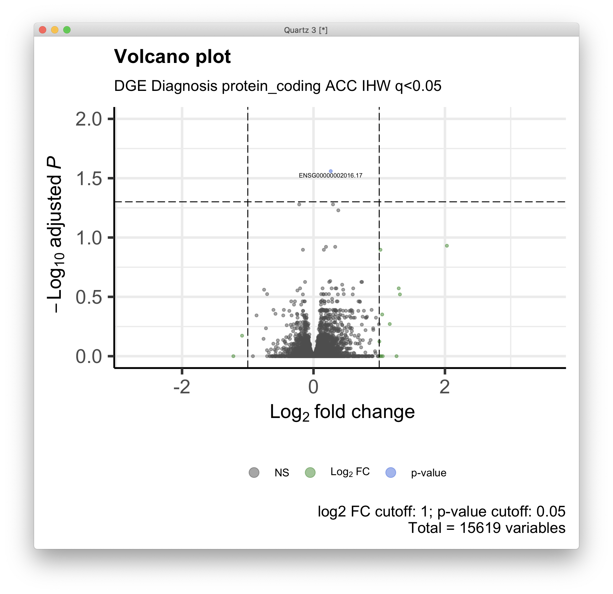

FDR q < 0.10

out of 15619 with nonzero total read count
adjusted p-value < 0.1
LFC > 0 (up)       : 2, 0.013%
LFC < 0 (down)     : 0, 0%
outliers [1]       : 0, 0%
low counts [2]     : 0, 0%
(mean count < 3)
[1] see 'cooksCutoff' argument of ?results
[2] see 'independentFiltering' argument of ?results

NULL
[1] "ENSG00000002016.17" "ENSG00000103995.14"
ENSG00000002016.17 
ENSG00000103995.14 

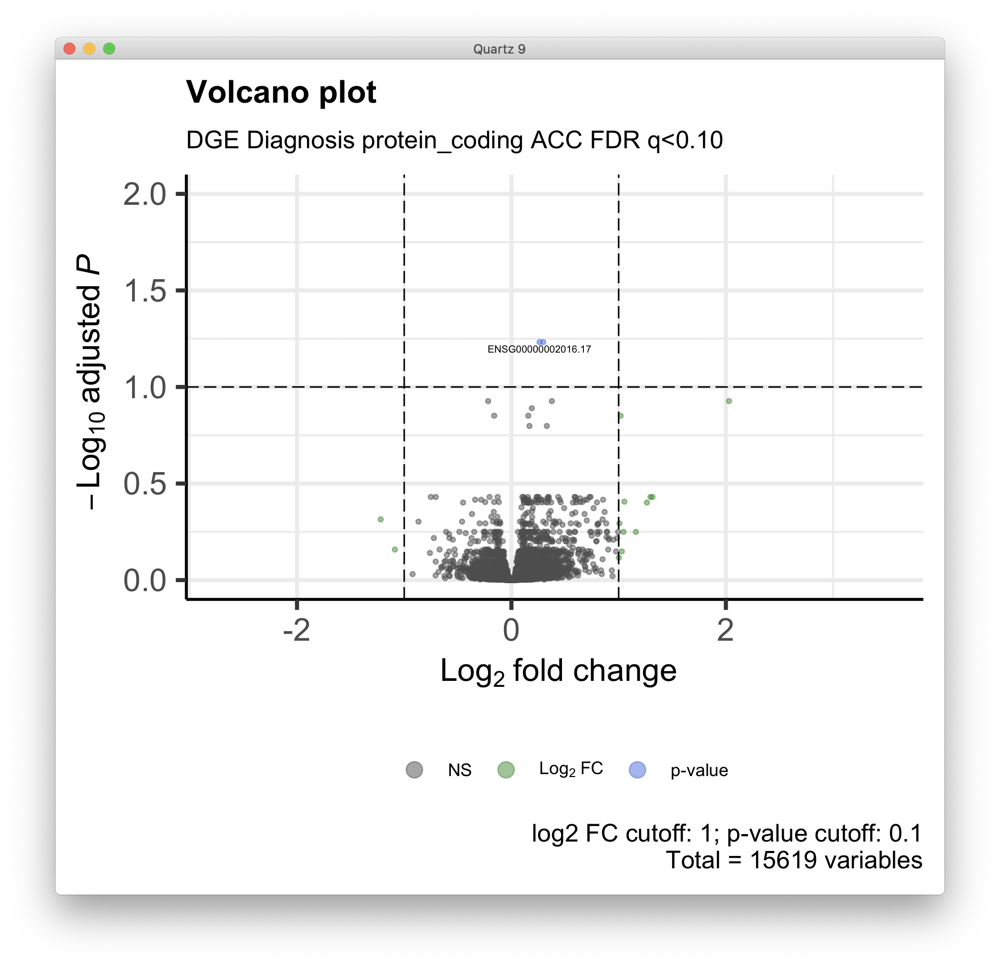
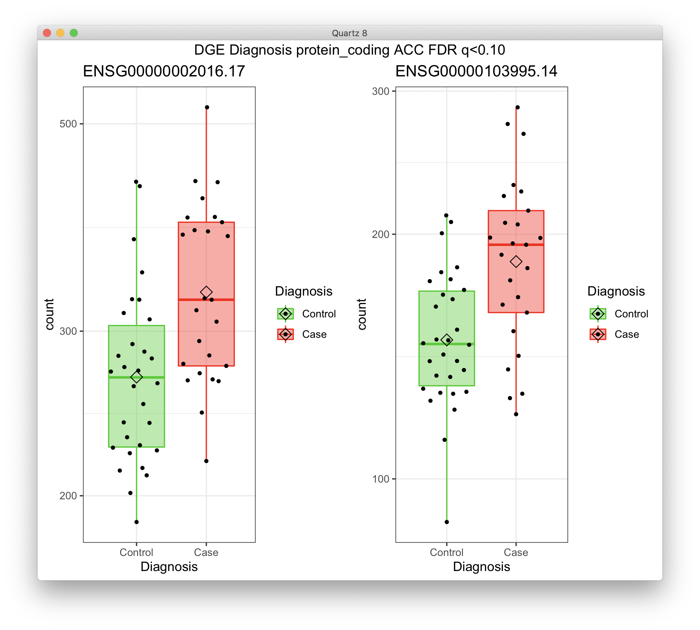

IHW q < 0.10

out of 15619 with nonzero total read count
adjusted p-value < 0.1
LFC > 0 (up)       : 7, 0.045%
LFC < 0 (down)     : 1, 0.0064%
outliers [1]       : 0, 0%
[1] see 'cooksCutoff' argument of ?results
see metadata(res)$ihwResult on hypothesis weighting

NULL
[1] "ENSG00000002016.17" "ENSG00000078401.7"  "ENSG00000090104.12" "ENSG00000103995.14"
[5] "ENSG00000124659.6"  "ENSG00000177084.16" "ENSG00000196584.3"  "ENSG00000258890.7" 
ENSG00000002016.17 : RAD52, DNA repair
ENSG00000078401.7 : EDN1, vasoconstrictive peptides
ENSG00000090104.12 : RGS1, Regulates G protein-coupled receptor signaling cascades
ENSG00000103995.14 : CEP152, centrosome function (microcephaly)
ENSG00000124659.6 : TBCC, Tubulin-folding protein
ENSG00000177084.16 : POLE, DNA polymerase epsilon, involved in DNA repair and chromosomal DNA replication
ENSG00000196584.3 : XRCC2, chromosome stability and repair DNA damage
ENSG00000258890.7 : CEP95, centrosome function

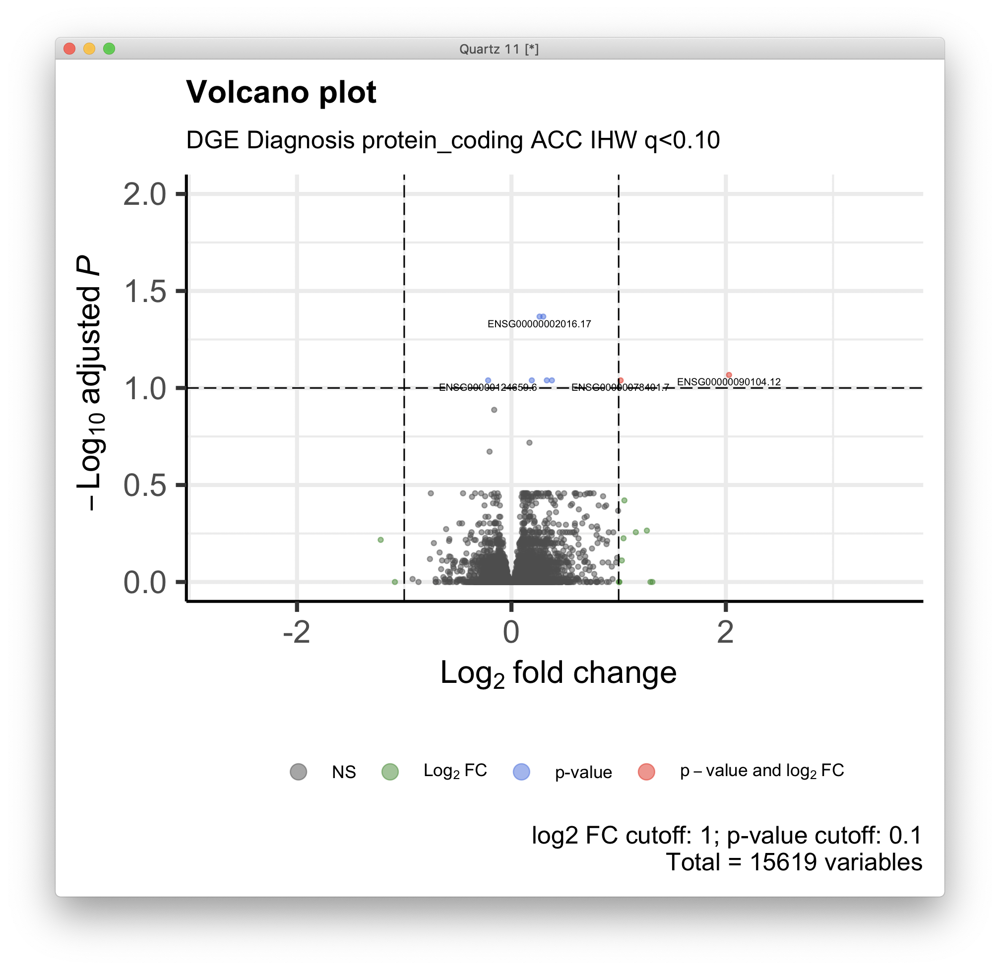
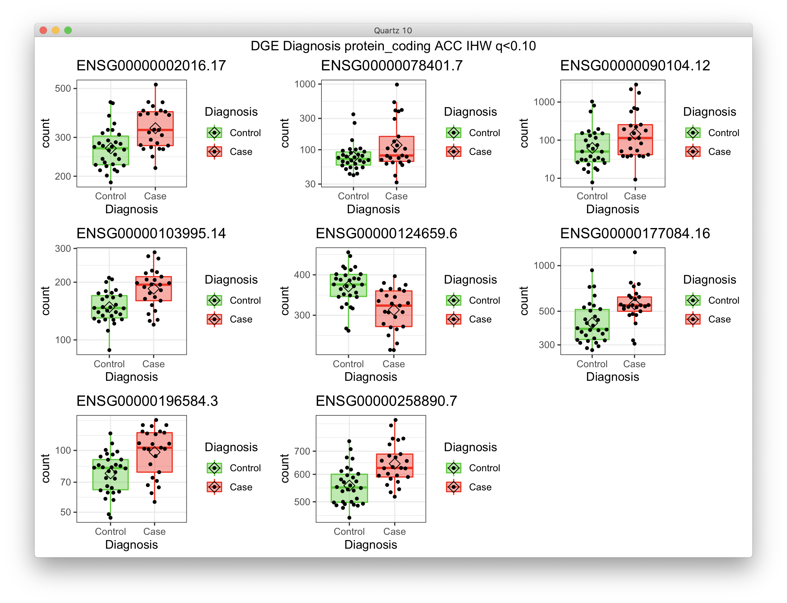

**ACC lncRNA**

Nothing at q < .05 or q < .1.

**ACC pseudogene**

Nothing at q < .05.

FDR q < 0.10

out of 2925 with nonzero total read count
adjusted p-value < 0.1
LFC > 0 (up)       : 4, 0.14%
LFC < 0 (down)     : 1, 0.034%
outliers [1]       : 0, 0%
low counts [2]     : 0, 0%
(mean count < 2)
[1] see 'cooksCutoff' argument of ?results
[2] see 'independentFiltering' argument of ?results

NULL
[1] "ENSG00000227725.3" "ENSG00000233121.1" "ENSG00000242294.6" "ENSG00000250483.1"
[5] "ENSG00000268100.1"
ENSG00000227725.3 : GCOM2 (GRINL1B), glutamate receptor
ENSG00000233121.1 : VN1R20P, Vomeronasal receptor
ENSG00000242294.6 : STAG3L5P (stromal antigen)
ENSG00000250483.1 : PPM1AP1, protein phosphatase
ENSG00000268100.1 : ZNF725P, Zinc finger protein
Only 1 bin; IHW reduces to Benjamini Hochberg (uniform weights)

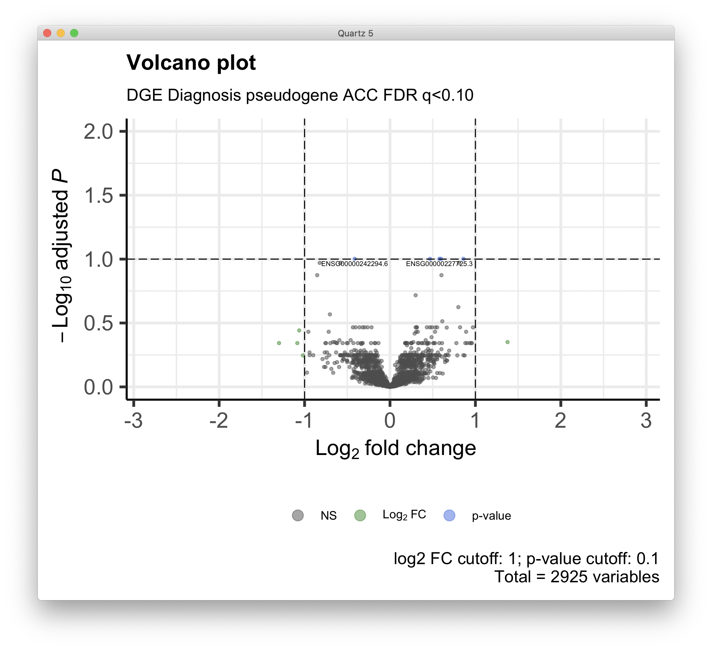


**Caudate Protein coding**

Nothing for q < .05 or .1.

**Caudate lncRNA**

Nothing for q < .05 or .1.

**Caudate pseudogene**

Nothing for q < .05 or .1.

===

And let's implement the same idea for DTE:

```r
myregion = 'ACC'

load('~/data/isoforms/tximport_rsem_DTE.RData')
txi = rsem

# I'll just use the metadata from here
data = readRDS('~/data/rnaseq_derek/complete_rawCountData_05132020.rds')
rownames(data) = data$submitted_name  # just to ensure compatibility later
data = data[data$Region==myregion, ]
library(gdata)
more = read.xls('~/data/post_mortem/POST_MORTEM_META_DATA_JAN_2021.xlsx')
more = more[!duplicated(more$hbcc_brain_id),]
data = merge(data, more[, c('hbcc_brain_id', 'comorbid_group_update',
                            'substance_group', 'evidence_level')],
             by='hbcc_brain_id', all.x=T, all.y=F)
# samples has only the metadata now
samples = data[, !grepl(colnames(data), pattern='^ENS')]

# remove samples for the other brain region from the tx counts matrices
keep_me = colnames(txi$counts) %in% samples$submitted_name
for (i in c('abundance', 'counts', 'length')) {
    txi[[i]] = txi[[i]][, keep_me]
}
# sort samples to match order in tximport matrices
rownames(samples) = samples$submitted_name
samples = samples[colnames(txi$counts), ]

# cleaning up some metadata
samples$POP_CODE = as.character(samples$POP_CODE)
samples[samples$POP_CODE=='WNH', 'POP_CODE'] = 'W'
samples[samples$POP_CODE=='WH', 'POP_CODE'] = 'W'
samples$POP_CODE = factor(samples$POP_CODE)
samples$Individual = factor(samples$hbcc_brain_id)
samples[samples$Manner.of.Death=='Suicide (probable)', 'Manner.of.Death'] = 'Suicide'
samples[samples$Manner.of.Death=='unknown', 'Manner.of.Death'] = 'natural'
samples$MoD = factor(samples$Manner.of.Death)
samples$batch = factor(as.numeric(samples$run_date))
samples$Diagnosis = factor(samples$Diagnosis, levels=c('Control', 'Case'))
samples$substance_group = factor(samples$substance_group)
samples$comorbid_group = factor(samples$comorbid_group_update)
samples$evidence_level = factor(samples$evidence_level)

# removing everything but autosomes
library(GenomicFeatures)
txdb <- loadDb('~/data/post_mortem/Homo_sapies.GRCh38.97.sqlite')
txdf <- select(txdb, keys(txdb, "TXNAME"), columns=c('GENEID','TXCHROM'),
               "TXNAME")
# keep only the remaining transcripts and their corresponding genes
txdf.sub = txdf[match(substr(rownames(txi$counts), 1, 15), txdf$TXNAME),]
bt = read.csv('~/data/post_mortem/Homo_sapiens.GRCh38.97_biotypes.csv')
bt_slim = bt[, c('transcript_id', 'transcript_biotype')]
bt_slim = bt_slim[!duplicated(bt_slim),]
tx_meta = merge(txdf.sub, bt_slim, by.x='TXNAME', by.y='transcript_id')
imautosome = which(tx_meta$TXCHROM != 'X' &
                   tx_meta$TXCHROM != 'Y' &
                   tx_meta$TXCHROM != 'MT')
count_matrix = txi$counts[imautosome, ]
tx_meta = tx_meta[imautosome, ]
```

At this point, no filtering has been done, except for keeping only autosomes.
And I added all annotations I wanted. Now, it's just a matter of filtering in
any way we want. Note that I'll need to go back to the edgeR filtering because
DRIMSeq was keeping only transcripts for genes with 2 or more transcripts, which
makes sense for DTU but not for DTE.

```r
run_DTE = function(count_matrix, tx_meta, myregion, subtype, alpha) {
    cat('Starting with', nrow(tx_meta), 'variables\n')
    keep_me = grepl(tx_meta$transcript_biotype, pattern=sprintf('%s$', subtype))
    cat('Keeping', sum(keep_me), subtype, 'variables\n')
    my_count_matrix = count_matrix[keep_me, ]
    my_tx_meta = tx_meta[keep_me, ]

    # removing variables where more than half of the subjects have zero counts
    keep_me = rowSums(my_count_matrix==0) < .25*ncol(my_count_matrix)
    my_count_matrix = my_count_matrix[keep_me, ]
    cat('Keeping', nrow(my_count_matrix), 'after zero removal\n')

    # removing variables with zero or near-zero variance
    library(caret)
    pp_order = c('zv', 'nzv')
    pp = preProcess(t(my_count_matrix), method = pp_order)
    X = t(predict(pp, t(my_count_matrix)))
    cat('Keeping', nrow(X), 'after NZ and NZV filtering\n')

    # checking which PCs are associated with our potential nuiscance variables
    set.seed(42)
    mypca <- prcomp(t(X), scale=TRUE)
    # how many PCs to keep... using Kaiser thredhold, close to eigenvalues < 1
    library(nFactors)
    eigs <- mypca$sdev^2
    nS = nScree(x=eigs)
    keep_me = seq(1, nS$Components$nkaiser)

    mydata = data.frame(mypca$x[, keep_me])
    # create main metadata data frame including metadata and PCs
    data.pm = cbind(samples, mydata)
    rownames(data.pm) = samples$hbcc_brain_id
    cat('Using', nS$Components$nkaiser, 'PCs from possible', ncol(X), '\n')

    # check which PCs are associated at nominal p<.01
    num_vars = c('pcnt_optical_duplicates', 'clusters', 'Age', 'RINe', 'PMI',
                'C1', 'C2', 'C3', 'C4', 'C5')
    pc_vars = colnames(mydata)
    num_corrs = matrix(nrow=length(num_vars), ncol=length(pc_vars),
                        dimnames=list(num_vars, pc_vars))
    num_pvals = num_corrs
    for (x in num_vars) {
        for (y in pc_vars) {
            res = cor.test(data.pm[, x], data.pm[, y], method='spearman')
            num_corrs[x, y] = res$estimate
            num_pvals[x, y] = res$p.value
        }
    }

    categ_vars = c('batch', 'Diagnosis', 'MoD', 'substance_group',
                'comorbid_group', 'POP_CODE', 'Sex', 'evidence_level')
    categ_corrs = matrix(nrow=length(categ_vars), ncol=length(pc_vars),
                            dimnames=list(categ_vars, pc_vars))
    categ_pvals = categ_corrs
    for (x in categ_vars) {
        for (y in pc_vars) {
            res = kruskal.test(data.pm[, y], data.pm[, x])
            categ_corrs[x, y] = res$statistic
            categ_pvals[x, y] = res$p.value
        }
    }
    use_pcs = unique(c(which(num_pvals < .01, arr.ind = T)[, 'col'],
                    which(categ_pvals < .01, arr.ind = T)[, 'col']))
    # only use the ones not related to Diagnosis
    keep_me = c()
    for (pc in use_pcs) {
        keep_me = c(keep_me, categ_pvals['Diagnosis', pc] > .05)
    }
    use_pcs = use_pcs[keep_me]
    fm_str = sprintf('~ Diagnosis + %s', paste0(pc_vars[use_pcs],
                                                collapse = ' + '))
    cat('Found', length(use_pcs), 'PCs p < .01\n')
    cat('Using formula:', fm_str, '\n')

    # scaling PCs to assure convergence
    for (var in pc_vars[use_pcs]) {
        data.pm[, var] = scale(data.pm[, var])
    }

    # removing variables with low expression
    library(edgeR)
    design=model.matrix(as.formula(fm_str), data=data.pm)
    isexpr <- filterByExpr(X, design=design)
    countsExpr = X[isexpr,]
    metaExpr = data.frame(TXNAME = substr(rownames(countsExpr), 1, 15))
    metaExpr = merge(metaExpr, my_tx_meta, by='TXNAME', sort=F)
    cat('Keeping', nrow(countsExpr), 'after expression filtering\n')

    library(DESeq2)
    # because DESeq doesn't remove outliers if there are continuous variables
    # in the formula, we need to do this iteratively
    nOutliers = Inf
    myCounts = round(countsExpr)
    while (nOutliers > 0) {
        dds <- DESeqDataSetFromMatrix(countData = myCounts,
                                    colData = data.pm,
                                    design = as.formula(fm_str))
        cat('Processing', nrow(dds), 'variables.\n')
        dds <- DESeq(dds)
        maxCooks <- apply(assays(dds)[["cooks"]], 1, max)
        # outlier cut-off uses the 99% quantile of the F(p,m-p) distribution (with 
        # p the number of parameters including the intercept and m number of
        # samples).
        m <- ncol(dds)
        # number or parameters (PCs + Diagnosis + intercept)
        p <- length(use_pcs) + 2
        co = qf(.99, p, m - p)
        keep_me = which(maxCooks < co)
        nOutliers = nrow(myCounts) - length(keep_me)
        cat('Found', nOutliers, 'outliers.\n')
        myCounts = round(myCounts)[keep_me, ]
    }
    res <- results(dds, name = "Diagnosis_Case_vs_Control", alpha = alpha)
    cat(sprintf('FDR q < %.2f\n', alpha))
    print(summary(res))
    tx_ids = rownames(res)[which(res$padj < alpha)]
    if (length(tx_ids) > 0) {
        print(tx_ids)
        plot_expression(tx_ids, dds,
                        sprintf('DTE Diagnosis %s %s FDR q<%.2f', subtype,
                                myregion, alpha))
        plot_volcano(res, sprintf('DTE Diagnosis %s %s FDR q<%.2f', subtype,
                     myregion, alpha), pCutoff = alpha)
    }

    library(IHW)
    resIHW <- results(dds, name = "Diagnosis_Case_vs_Control", alpha = alpha,
                    filterFun=ihw)
    cat(sprintf('IHW q < %.2f\n', alpha))
    print(summary(resIHW))
    tx_ids = rownames(resIHW)[which(resIHW$padj < alpha)]
    if (length(tx_ids) > 0) {
        print(tx_ids)
        plot_expression(tx_ids, dds,
                        sprintf('DTE Diagnosis %s %s IHW q<%.2f', subtype,
                                myregion, alpha))
        plot_volcano(resIHW, sprintf('DTE Diagnosis %s %s IHW q<%.2f', subtype,
                     myregion, alpha), pCutoff = alpha)
    }

    # stage-wise testing
    library(stageR)
    library(dplyr)
    pConfirmation <- matrix(res$pvalue, ncol=1)
    dimnames(pConfirmation) <- list(substr(rownames(res), 1, 15),
                                    c("transcript"))
    # select one qval per gene (min over transcripts)
    junk = as.data.frame(res)
    junk$TXNAME = substr(rownames(junk), 1, 15)
    m = merge(junk, metaExpr, by='TXNAME')
    qvals = m %>% group_by(GENEID) %>% slice_min(n=1, padj, with_ties=F)
    pScreen = qvals$padj
    names(pScreen) = qvals$GENEID

    stageRObj = stageRTx(pScreen=pScreen, pConfirmation=pConfirmation,
                        pScreenAdjusted=TRUE, tx2gene=metaExpr[, 1:2])
    stageRObj = stageWiseAdjustment(stageRObj, method="dte", alpha=alpha)
    cat(sprintf('stageR q < %.2f\n', alpha))
    gene_ids = getSignificantGenes(stageRObj)
    tx_ids = getSignificantTx(stageRObj)
    if (nrow(tx_ids) > 0) {
        print(gene_ids)
        print(tx_ids)
    }

    return(stageRObj)
}
```

With the DTE code working, we can now run:

```r
dte_acc = list() 
for (st in c('pseudogene', 'lncRNA', 'protein_coding')) {
    dte_acc[[st]] = run_DTE(count_matrix, tx_meta, myregion, st, .05)
}

dte_cau = list() 
for (st in c('pseudogene', 'lncRNA', 'protein_coding')) {
    dte_cau[[st]] = run_DTE(count_matrix, tx_meta, myregion, st, .05)
}
```

I then saved all dge* to ~/data/post_mortem/DTE_01272021.RData.

Let's collect some results again. These don't take much time anyways.

**ACC Protein coding**

FDR q < 0.05

out of 31574 with nonzero total read count
adjusted p-value < 0.05
LFC > 0 (up)       : 1, 0.0032%
LFC < 0 (down)     : 0, 0%
outliers [1]       : 0, 0%
low counts [2]     : 0, 0%
(mean count < 3)
[1] see 'cooksCutoff' argument of ?results
[2] see 'independentFiltering' argument of ?results

NULL
[1] "ENST00000333219.8"
ENST00000333219.8 
(IHW identical)

stageR q < 0.05
                FDR adjusted p-value
ENSG00000153487           0.02104243
                stage-wise adjusted p-value
ENST00000333219                 0.009293617

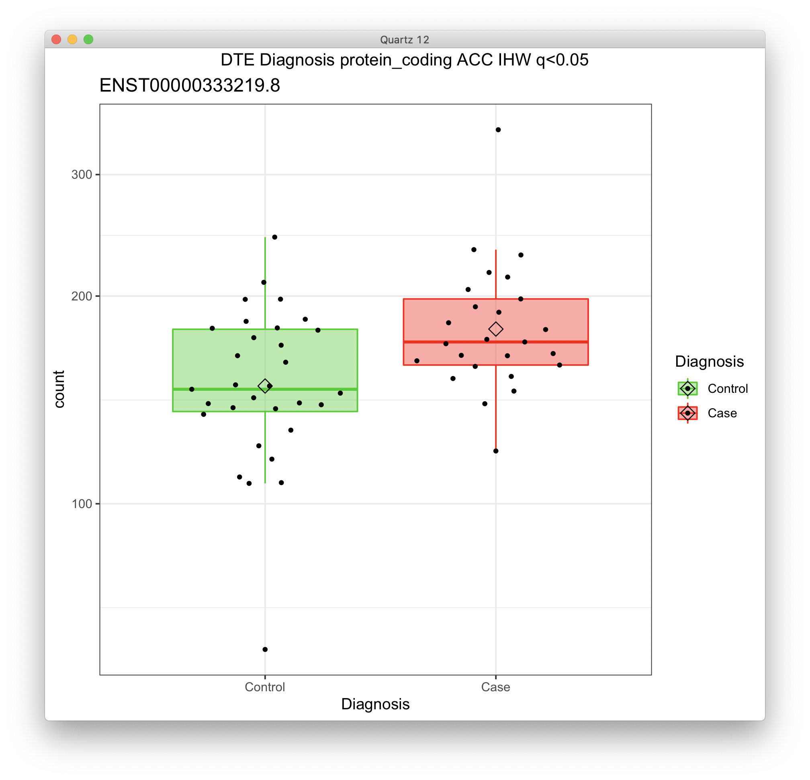
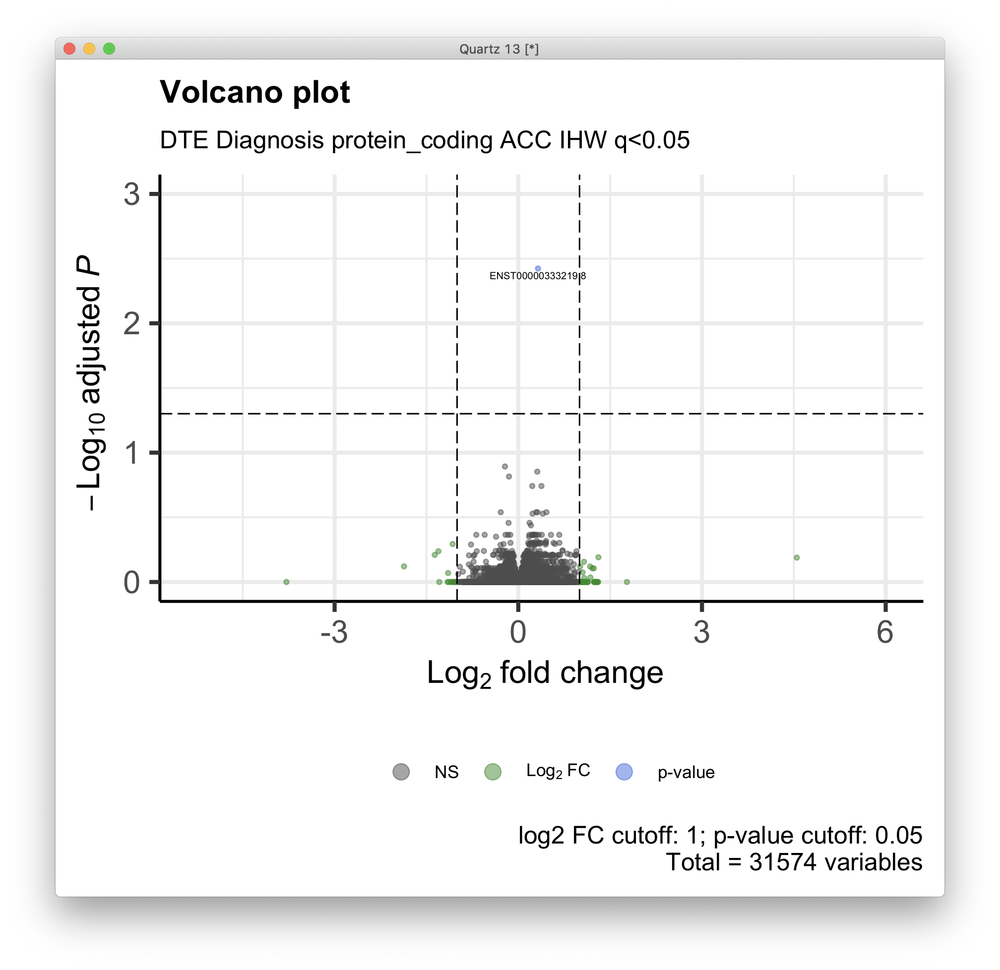

**ACC lncRNA**

FDR q < 0.05

out of 16075 with nonzero total read count
adjusted p-value < 0.05
LFC > 0 (up)       : 1, 0.0062%
LFC < 0 (down)     : 0, 0%
outliers [1]       : 0, 0%
low counts [2]     : 0, 0%
(mean count < 2)
[1] see 'cooksCutoff' argument of ?results
[2] see 'independentFiltering' argument of ?results

NULL
[1] "ENST00000493710.1"
ENST00000493710.1 

(IHW identical)

stageR q < 0.05

                FDR adjusted p-value
ENSG00000240758          0.003735354
                stage-wise adjusted p-value
ENST00000493710                           0


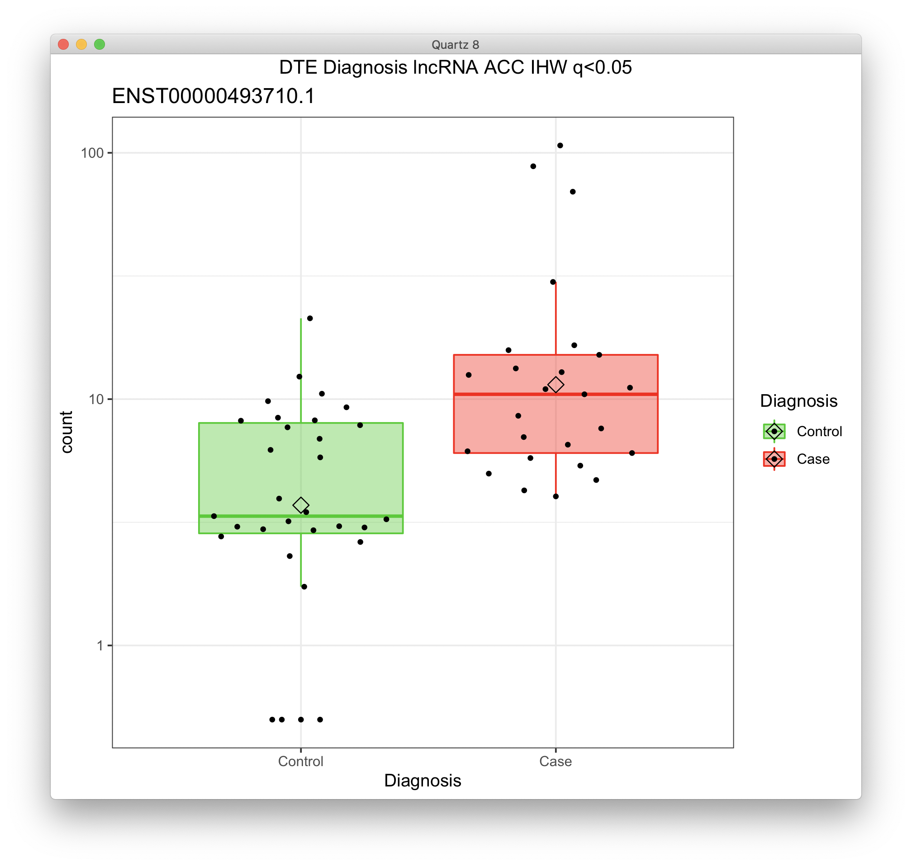
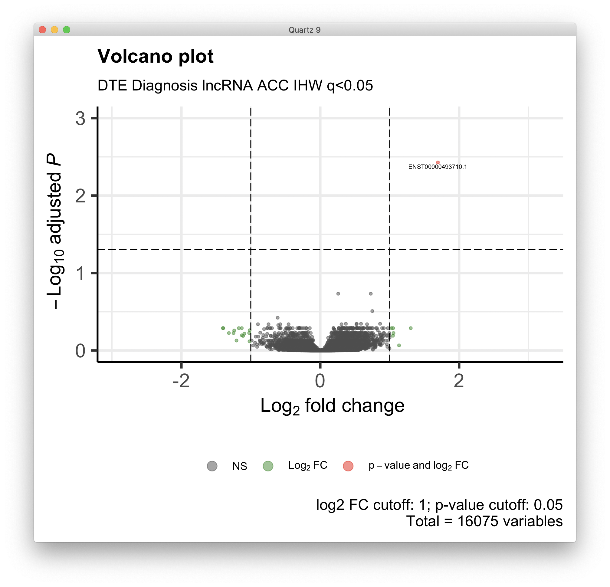

**ACC pseudogene**

FDR q < 0.05

out of 2359 with nonzero total read count
adjusted p-value < 0.05
LFC > 0 (up)       : 5, 0.21%
LFC < 0 (down)     : 1, 0.042%
outliers [1]       : 0, 0%
low counts [2]     : 0, 0%
(mean count < 2)
[1] see 'cooksCutoff' argument of ?results
[2] see 'independentFiltering' argument of ?results

NULL
[1] "ENST00000435239.1" "ENST00000502740.1" "ENST00000509133.1" "ENST00000515049.1"
[5] "ENST00000529497.2" "ENST00000596753.1"
ENST00000435239.1 
ENST00000502740.1 
ENST00000509133.1 
ENST00000515049.1 
ENST00000529497.2 
ENST00000596753.1 

(IHW identical)


stageR q < 0.05
The returned adjusted p-values are based on a stage-wise testing approach and are only valid for the provided target OFDR level of 5%. If a different target OFDR level is of interest,the entire adjustment should be re-run. 

The returned adjusted p-values are based on a stage-wise testing approach and are only valid for the provided target OFDR level of 5%. If a different target OFDR level is of interest,the entire adjustment should be re-run. 

                FDR adjusted p-value
ENSG00000226421: SLC25A5P5, Mitochondrial Carrier; Adenine Nucleotide Translocator           0.04687633
ENSG00000250483: PPM1AP1, Protein Phosphatase           0.01398035
ENSG00000227725: GCOM2, Glutamate Receptor           0.04687633
ENSG00000249176: MRTO4, MRNA Turnover 4 Homolog           0.04492382
ENSG00000254866: DEFB109D, Defensin Beta           0.04687633
ENSG00000268100: ZNF725P, Zinc Finger Protein           0.01398035
                stage-wise adjusted p-value
ENST00000435239                           0
ENST00000502740                           0
ENST00000509133                           0
ENST00000515049                           0
ENST00000529497                           0
ENST00000596753                           0

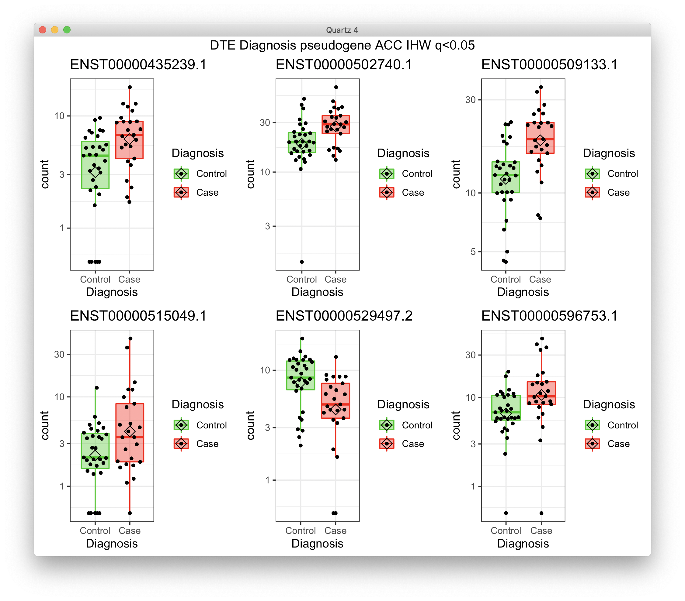


**Caudate Protein coding**

FDR q < 0.05

out of 34660 with nonzero total read count
adjusted p-value < 0.05
LFC > 0 (up)       : 1, 0.0029%
LFC < 0 (down)     : 0, 0%
outliers [1]       : 0, 0%
low counts [2]     : 0, 0%
(mean count < 4)
[1] see 'cooksCutoff' argument of ?results
[2] see 'independentFiltering' argument of ?results

NULL
[1] "ENST00000523308.5"
ENST00000523308.5 

(IHW identical)

stageR q < 0.05
                FDR adjusted p-value
ENSG00000105339           0.02195675
                stage-wise adjusted p-value
ENST00000523308                  0.02766893

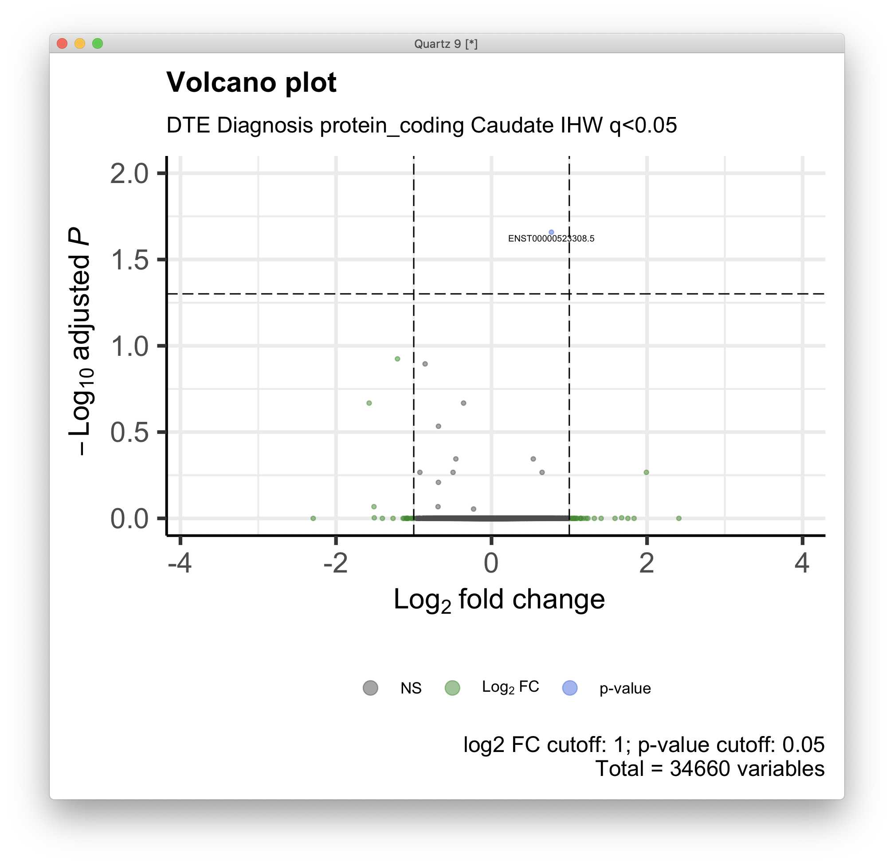

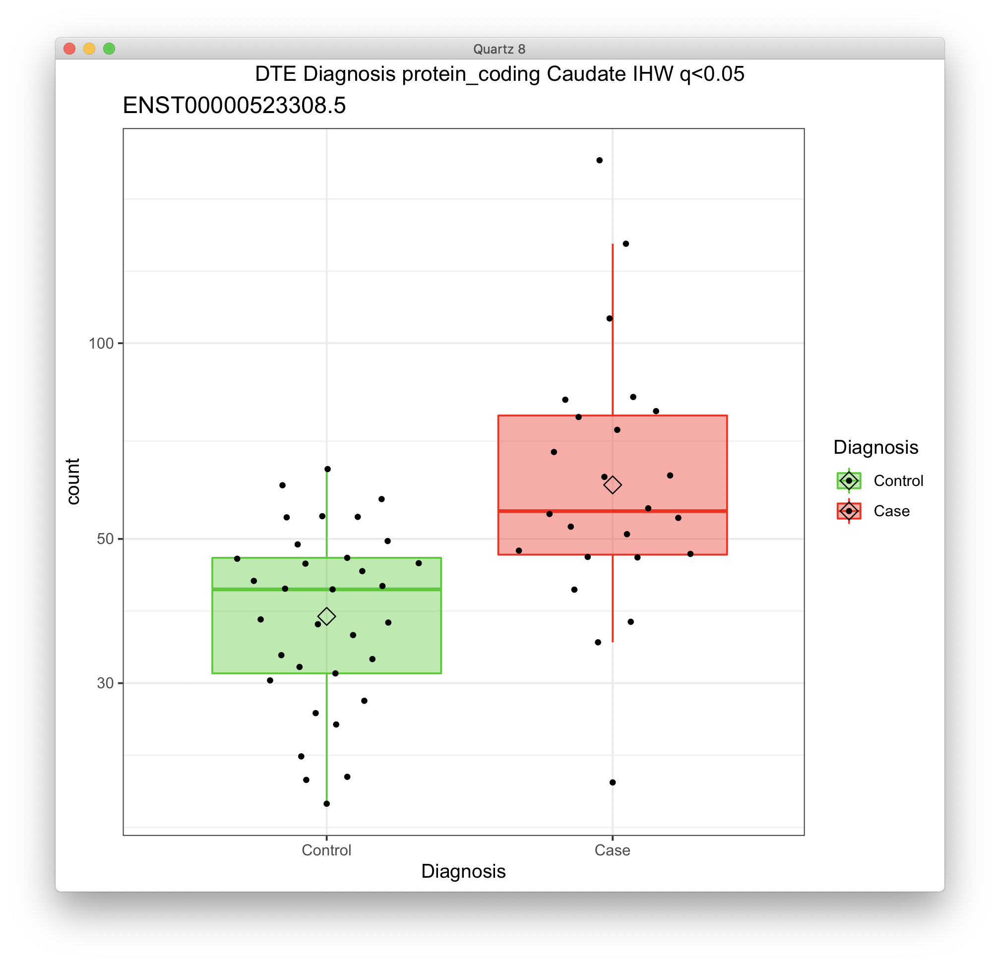

**Caudate lncRNA**

Nothing.

**Caudate pseudogene**

FDR q < 0.05

out of 2502 with nonzero total read count
adjusted p-value < 0.05
LFC > 0 (up)       : 1, 0.04%
LFC < 0 (down)     : 0, 0%
outliers [1]       : 0, 0%
low counts [2]     : 0, 0%
(mean count < 2)
[1] see 'cooksCutoff' argument of ?results
[2] see 'independentFiltering' argument of ?results

NULL
[1] "ENST00000563377.5"
ENST00000563377.5 

(IHW identical)

stageR q < 0.05
                FDR adjusted p-value
ENSG00000214331          0.004265569
                stage-wise adjusted p-value
ENST00000563377                           0

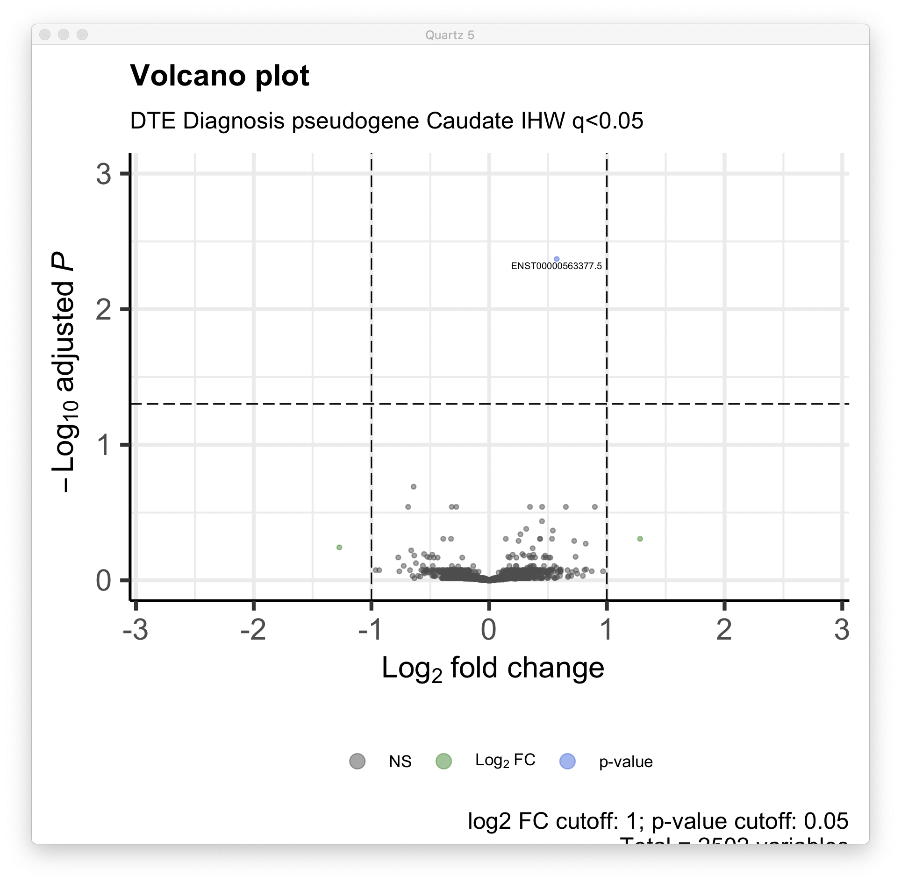
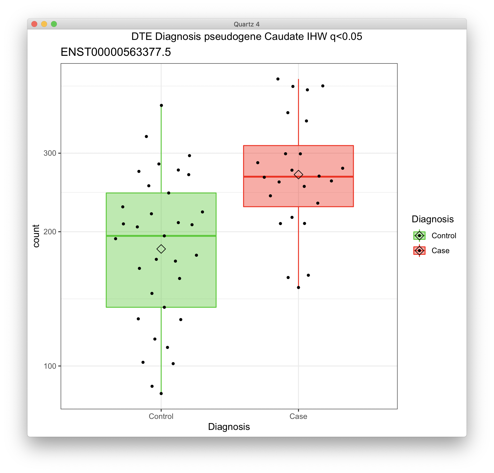

Finally, DTU:

```r
myregion = 'ACC'

load('~/data/isoforms/tximport_rsem_DTU.RData')
txi = rsem
# I'll just use the metadata from here
data = readRDS('~/data/rnaseq_derek/complete_rawCountData_05132020.rds')
rownames(data) = data$submitted_name  # just to ensure compatibility later
data = data[data$Region==myregion, ]
library(gdata)
more = read.xls('~/data/post_mortem/POST_MORTEM_META_DATA_JAN_2021.xlsx')
more = more[!duplicated(more$hbcc_brain_id),]
data = merge(data, more[, c('hbcc_brain_id', 'comorbid_group_update',
                            'substance_group', 'evidence_level')],
             by='hbcc_brain_id', all.x=T, all.y=F)
# samples has only the metadata now
samples = data[, !grepl(colnames(data), pattern='^ENS')]

# remove samples for the other brain region from the tx counts matrices
keep_me = colnames(txi$counts) %in% samples$submitted_name
for (i in c('abundance', 'counts', 'length')) {
    txi[[i]] = txi[[i]][, keep_me]
}
# sort samples to match order in tximport matrices
rownames(samples) = samples$submitted_name
samples = samples[colnames(txi$counts), ]

# cleaning up some metadata
samples$POP_CODE = as.character(samples$POP_CODE)
samples[samples$POP_CODE=='WNH', 'POP_CODE'] = 'W'
samples[samples$POP_CODE=='WH', 'POP_CODE'] = 'W'
samples$POP_CODE = factor(samples$POP_CODE)
samples$Individual = factor(samples$hbcc_brain_id)
samples[samples$Manner.of.Death=='Suicide (probable)', 'Manner.of.Death'] = 'Suicide'
samples[samples$Manner.of.Death=='unknown', 'Manner.of.Death'] = 'natural'
samples$MoD = factor(samples$Manner.of.Death)
samples$batch = factor(as.numeric(samples$run_date))
samples$Diagnosis = factor(samples$Diagnosis, levels=c('Control', 'Case'))
samples$substance_group = factor(samples$substance_group)
samples$comorbid_group = factor(samples$comorbid_group_update)
samples$evidence_level = factor(samples$evidence_level)

# removing everything but autosomes
library(GenomicFeatures)
txdb <- loadDb('~/data/post_mortem/Homo_sapies.GRCh38.97.sqlite')
txdf <- select(txdb, keys(txdb, "TXNAME"), columns=c('GENEID','TXCHROM'),
               "TXNAME")
# keep only the remaining transcripts and their corresponding genes
txdf.sub = txdf[match(substr(rownames(txi$counts), 1, 15), txdf$TXNAME),]
bt = read.csv('~/data/post_mortem/Homo_sapiens.GRCh38.97_biotypes.csv')
bt_slim = bt[, c('transcript_id', 'transcript_biotype')]
bt_slim = bt_slim[!duplicated(bt_slim),]
tx_meta = merge(txdf.sub, bt_slim, by.x='TXNAME', by.y='transcript_id')
tx_meta$transcript_id = rownames(txi$counts)
imautosome = which(tx_meta$TXCHROM != 'X' &
                   tx_meta$TXCHROM != 'Y' &
                   tx_meta$TXCHROM != 'MT')
count_matrix = txi$counts[imautosome, ]
tx_meta = tx_meta[imautosome, ]
```

At this point, no filtering has been done, except for keeping only autosomes.
And I added all annotations I wanted. Now, it's just a matter of running the
rest of the analysis:

```r
plotProportion <- function(expData = NULL, geneID = NULL, samps = NULL) {
    colnames(expData)[1:2] = c("gid","tid")
    sub = subset(expData, gid == geneID)
    sub = reshape2::melt(sub, id = c("gid", "tid"))
    sub = merge(samps, sub, by.x = "sample_id", by.y = "variable")

    clrs = c("dodgerblue3", "maroon2",  "forestgreen", "darkorange1", "blueviolet", "firebrick2",
"deepskyblue", "orchid2", "chartreuse3", "gold", "slateblue1", "tomato" , "blue", "magenta", "green3",
"yellow", "purple3", "red" ,"darkslategray1", "lightpink1", "lightgreen", "khaki1", "plum3", "salmon")

    p = ggplot(sub, aes(tid, value, color = group, fill = group)) +
    geom_boxplot(alpha = 0.4, outlier.shape = NA, width = 0.8, lwd = 0.5) +
    stat_summary(fun = mean, geom = "point", color = "black", shape = 5, size = 3, position=position_dodge(width = 0.8)) +
    scale_color_manual(values = clrs) + scale_fill_manual(values = clrs) +
    geom_quasirandom(color = "black", size = 1, dodge.width = 0.8) + theme_bw() +
    ggtitle(geneID) + xlab("Transcripts")

    p = p + ylab("Proportions")
    p
}

# posthoc procedure to improve the false discovery rate (FDR) and overall false discovery rate (OFDR) control. It sets the p-values and adjusted p-values for transcripts with small per-sample proportion SD to 1
smallProportionSD <- function(d, filter = 0.1) {
        # Generate count table
        cts = as.matrix(subset(counts(d), select = -c(gene_id, feature_id)))
        # Summarise count total per gene
        gene.cts = rowsum(cts, counts(d)$gene_id)
        # Use total count per gene as count per transcript
        total.cts = gene.cts[match(counts(d)$gene_id, rownames(gene.cts)),]
        # Calculate proportion of transcript in gene
        props = cts/total.cts
        rownames(props) = rownames(total.cts)
        
        # Calculate standard deviation
        propSD = sqrt(matrixStats::rowVars(props))
        # Check if standard deviation of per-sample proportions is < 0.1
        propSD < filter
}

run_DTU = function(count_matrix, tx_meta, myregion, subtype, alpha) {
    cat('Starting with', nrow(tx_meta), 'variables\n')
    keep_me = grepl(tx_meta$transcript_biotype, pattern=sprintf('%s$', subtype))
    cat('Keeping', sum(keep_me), subtype, 'variables\n')
    my_count_matrix = count_matrix[keep_me, ]
    my_tx_meta = tx_meta[keep_me, ]

    # removing variables where more than half of the subjects have zero counts
    keep_me = rowSums(my_count_matrix==0) < .25*ncol(my_count_matrix)
    my_count_matrix = my_count_matrix[keep_me, ]
    cat('Keeping', nrow(my_count_matrix), 'after zero removal\n')

    # removing variables with zero or near-zero variance
    library(caret)
    pp_order = c('zv', 'nzv')
    pp = preProcess(t(my_count_matrix), method = pp_order)
    X = t(predict(pp, t(my_count_matrix)))
    cat('Keeping', nrow(X), 'after NZ and NZV filtering\n')

    # keep only the remaining transcripts and their corresponding genes
    txdf.sub = my_tx_meta[match(rownames(X), my_tx_meta$transcript_id),]
    counts = data.frame(gene_id = txdf.sub$GENEID, feature_id = txdf.sub$TXNAME)
    counts = cbind(counts, X)

    library(DRIMSeq)
    samples$group = samples$Diagnosis
    samples$sample_id = as.character(samples$submitted_name)
    d0 = dmDSdata(counts = counts, samples = samples)

    n = nrow(samples)
    n.small = min(table(samples$group))

    d = DRIMSeq::dmFilter(d0,
                        min_samps_feature_expr = n.small, min_feature_expr = 10,
                        min_samps_feature_prop = n.small, min_feature_prop = 0.1,
                        min_samps_gene_expr = n, min_gene_expr = 10)

    countData = round(as.matrix(counts(d)[,-c(1:2)]))
    cat('Keeping', nrow(countData), 'after DRIMSeq expression filtering\n')

    set.seed(42)
    pca <- prcomp(t(countData), scale=TRUE)
    library(nFactors)
    eigs <- pca$sdev^2
    nS = nScree(x=eigs)
    keep_me = 1:nS$Components$nkaiser
    mydata = data.frame(pca$x[, keep_me])
    data.pm = cbind(samples, mydata)
    rownames(data.pm) = samples$submitted_name
    num_vars = c('pcnt_optical_duplicates', 'clusters', 'Age', 'RINe', 'PMI',
                'C1', 'C2', 'C3', 'C4', 'C5')
    pc_vars = colnames(mydata)
    num_corrs = matrix(nrow=length(num_vars), ncol=length(pc_vars),
                    dimnames=list(num_vars, pc_vars))
    num_pvals = num_corrs
    for (x in num_vars) {
        for (y in pc_vars) {
            res = cor.test(samples[, x], mydata[, y], method='spearman')
            num_corrs[x, y] = res$estimate
            num_pvals[x, y] = res$p.value
        }
    }
    categ_vars = c('batch', 'Diagnosis', 'MoD', 'substance_group',
                'comorbid_group', 'POP_CODE', 'Sex', 'evidence_level')
    categ_corrs = matrix(nrow=length(categ_vars), ncol=length(pc_vars),
                    dimnames=list(categ_vars, pc_vars))
    categ_pvals = categ_corrs
    for (x in categ_vars) {
        for (y in pc_vars) {
            res = kruskal.test(mydata[, y], samples[, x])
            categ_corrs[x, y] = res$statistic
            categ_pvals[x, y] = res$p.value
        }
    }
    use_pcs = unique(c(which(num_pvals < .01, arr.ind = T)[, 'col'],
                        which(categ_pvals < .01, arr.ind = T)[, 'col']))
    # only use the ones not related to Diagnosis
    keep_me = c()
    for (pc in use_pcs) {
        keep_me = c(keep_me, categ_pvals['Diagnosis', pc] > .05)
    }
    use_pcs = use_pcs[keep_me]

    fm_str = sprintf('~ group + %s', paste0(pc_vars[use_pcs],
                                                collapse = ' + '))
    cat('Found', length(use_pcs), 'PCs p < .01\n')
    cat('Using formula:', fm_str, '\n')

    # scaling PCs to assure convergence
    for (var in pc_vars[use_pcs]) {
        data.pm[, var] = scale(data.pm[, var])
    }

    design = model.matrix(as.formula(fm_str), data = data.pm)

    set.seed(42)
    system.time({
        d <- dmPrecision(d, design = design)
        d <- dmFit(d, design = design)
        d <- dmTest(d, coef = "groupCase")     
    })
    res.g = DRIMSeq::results(d)
    res.t = DRIMSeq::results(d, level = "feature")

    # make NA pvalues to be 1 so they don't screw up future steps
    no.na <- function(x) ifelse(is.na(x), 1, x)
    res.g$pvalue <- no.na(res.g$pvalue)
    res.t$pvalue <- no.na(res.t$pvalue)

    cat('Genes surviving FDR q <', alpha, ':',
        sum(res.g$adj_pvalue < alpha, na.rm=T), '\n')
    cat('Transcripts surviving FDR q<', alpha, ':',
        sum(res.t$adj_pvalue < alpha, na.rm=T), '\n')

    filt = smallProportionSD(d)

    res.t.filt = DRIMSeq::results(d, level = "feature")
    res.t.filt$pvalue[filt] = 1
    res.t.filt$adj_pvalue[filt] = 1
    res.t.filt$pvalue <- no.na(res.t.filt$pvalue)
    cat('Transcripts removed due to small SD:', sum(filt, na.rm=T), 'out of',
        length(filt), '\n')
    cat('Transcripts surviving SD filtering and FDR q<', alpha, ':',
        sum(res.t.filt$adj_pvalue < alpha, na.rm=T), '\n')

    strp <- function(x) substr(x, 1, 15)
    # Construct a vector of per-gene p-values for the screening stage
    pScreen = res.g$pvalue
    names(pScreen) = strp(res.g$gene_id)
    # Construct a one column matrix of the per-transcript confirmation p-values
    pConfirmation = matrix(res.t.filt$pvalue, ncol = 1)
    dimnames(pConfirmation) = list(strp(res.t.filt$feature_id), "transcript")
    # res.t is used twice to construct a 4-column data.frame that contain both original IDs and IDs without version numbers
    tx2gene = data.frame(res.t[,c("feature_id", "gene_id")], 
                        res.t[,c("feature_id", "gene_id")])
    # remove version from gene name
    for (i in 1:2) tx2gene[,i] = strp(tx2gene[,i])

    library(stageR)
    stageRObj = stageRTx(pScreen = pScreen, pConfirmation = pConfirmation, 
                        pScreenAdjusted = FALSE, tx2gene = tx2gene[,1:2])
    stageRObj = stageWiseAdjustment(stageRObj, method = "dtu", alpha = alpha)

    drim.padj = getAdjustedPValues(stageRObj, order = FALSE,
                                onlySignificantGenes = TRUE)
    # this summarizes the adjusted p-values from the two-stage analysis. Only genes that passed the filter are included in the table.
    drim.padj = merge(tx2gene, drim.padj, by.x = c("gene_id","feature_id"),
                    by.y = c("geneID","txID"))

    cat('Screened genes at FDR q<', alpha, ':',
        length(unique(drim.padj[drim.padj$gene < alpha,]$gene_id)), '\n')
    cat('Transcripts passing OFDR:', sum(drim.padj$transcript < alpha), '\n')

    cat('stageR q <', alpha, '\n')
    gene_ids = getSignificantGenes(stageRObj)
    tx_ids = getSignificantTx(stageRObj)
    if (nrow(tx_ids) > 0) {
        print(gene_ids)
        print(tx_ids)
    }
    cat('Genes where expression switches among isoforms:',
        length(unique(drim.padj[drim.padj$transcript < alpha, 'gene_id'])), '\n')

    # condensing the counts to be converted to proportions
    drim.prop = reshape2::melt(counts[counts$feature_id %in% proportions(d)$feature_id,], id = c("gene_id", "feature_id"))
    drim.prop = drim.prop[order(drim.prop$gene_id, drim.prop$variable,
                        drim.prop$feature_id),]
    # Calculate proportions from counts
    library(dplyr)
    library(ggplot2)
    library(ggbeeswarm)
    drim.prop2 = drim.prop %>%
            group_by(gene_id, variable) %>%
            mutate(total = sum(value)) %>%
            group_by(variable, add=TRUE) %>%
            mutate(prop = value/total)
    drim.prop3 = reshape2::dcast(drim.prop2[,c(1,2,3,6)],
                                gene_id + feature_id ~ variable)

    # plotting all good genes
    library(ggpubr)
    gene_ids = unique(drim.padj[order(drim.padj$transcript, drim.padj$gene),]$gene_id.1)
    myplots = list()
    for (g in 1:length(gene_ids)) {
        cat(gene_ids[g], '\n')
        myplots[[g]] = plotProportion(drim.prop3, gene_ids[g], samples)
    }
    quartz()
    ggarrange(plotlist=myplots)

    return(stageRObj)
}
```

Let's first see what's going on on lncRNA and pseudogenes, because this code
takes a long time and those two subtypes usually don't have anything to them:

```r
dtu_acc = list() 
for (st in c('lncRNA', 'protein_coding')) {
    dtu_acc[[st]] = run_DTU(count_matrix, tx_meta, myregion, st, .05)
}
dtu_acc[['pseudogene']] = NULL  # DRIMSeq kills the loop with the error
dtu_cau = list() 
for (st in c('lncRNA', 'protein_coding')) {
    dtu_cau[[st]] = run_DTU(count_matrix, tx_meta, myregion, st, .05)
}
dtu_cau[['pseudogene']] = NULL  # DRIMSeq kills the loop with the error
```

**ACC Protein coding**

Genes surviving FDR q < 0.05 : 11 
Transcripts surviving FDR q< 0.05 : 20 
Transcripts removed due to small SD: 8919 out of 16702 
Transcripts surviving SD filtering and FDR q< 0.05 : 14 
Screened genes at FDR q< 0.05 : 11 
Transcripts passing OFDR: 7 
stageR q < 0.05 
                FDR adjusted p-value
ENSG00000119950         0.0008834228
ENSG00000007047         0.0285152091
ENSG00000147548         0.0338061520
ENSG00000198933         0.0086166713
ENSG00000101146         0.0285152091
ENSG00000198121         0.0285152091
ENSG00000090061         0.0086166713
ENSG00000086848         0.0306666109
ENSG00000048052         0.0429535533
ENSG00000070371         0.0285152091
ENSG00000157741         0.0406697234
                stage-wise adjusted p-value
ENST00000651516                0.0003417415
ENST00000537587                0.0009220887
ENST00000555049                0.0015501229
ENST00000614444                0.0024612635
ENST00000427926                0.0000000000
ENST00000621271                0.0000000000
ENST00000486663                0.0053939390
Genes where expression switches among isoforms: 6 
Using prop as value column: use value.var to override.
ENSG00000070371 : CLTCL1, clathrin heavy chain, polyhedral coat of coated pits and vesicles
ENSG00000119950 : MXI1, oncogenic transcription factor
ENSG00000198933 : TBKBP1, antiviral innate immunity
ENSG00000090061 : CCNK, cyclin-dependent kinases
ENSG00000086848 : ALG9, lipid-linked oligosaccharide assembly
ENSG00000157741 : UBN2, ubinuclein,  Autism Spectrum Disorder and Autism
ENSG00000101146 : RAE1, involved in RNA export
ENSG00000007047 : MARK4, microtubules, Alzheimer's disease
ENSG00000198121 : LPAR1, proliferation, platelet aggregation, smooth muscle contraction, inhibition of neuroblastoma cell differentiation, chemotaxis, and tumor cell invasion
ENSG00000147548 : NSD3, Histone methyltransferase
ENSG00000048052 : HDAC9, transcriptional regulation, cell cycle progression, and developmental events

**ACC lncRNA**

Screened genes at FDR q< 0.05 : 4
Transcripts passing OFDR: 5
stageR q < 0.05
                FDR adjusted p-value
ENSG00000214176           0.04198654
ENSG00000235478           0.04198654
ENSG00000248115           0.03352590
ENSG00000263072           0.01665918
                stage-wise adjusted p-value
ENST00000580919                 0.003080259
ENST00000441544                 0.000000000
ENST00000654656                 0.000000000
ENST00000504048                 0.002175539
ENST00000575089                 0.000437511
Genes where expression switches among isoforms: 4
ENSG00000235478: LINC01664
ENSG00000263072: ZNF213-AS1, Metazoan signal recognition particle RNA
ENSG00000248115: Lnc-RASL11B-2
ENSG00000214176: PLEKHM1P1

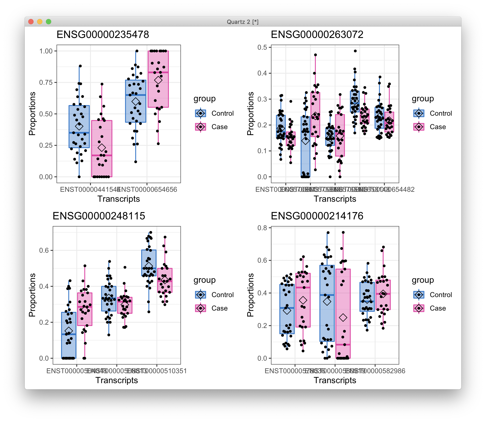

**ACC pseudogene**

No genes survive filtering.

**Caudate Protein coding**

Genes surviving FDR q < 0.05 : 6
Transcripts surviving FDR q< 0.05 : 14
Transcripts removed due to small SD: 9927 out of 17693
Transcripts surviving SD filtering and FDR q< 0.05 : 10
Screened genes at FDR q< 0.05 : 6
Transcripts passing OFDR: 4
stageR q < 0.05
                FDR adjusted p-value
ENSG00000114405          0.002570822
ENSG00000117298          0.002570822
ENSG00000085276          0.015077131
ENSG00000169291          0.023705332
ENSG00000139220          0.010458600
ENSG00000139174          0.019383508
                stage-wise adjusted p-value
ENST00000232519                8.297622e-05
ENST00000415912                2.302717e-03
ENST00000264674                8.841986e-04
ENST00000548670                7.492676e-04
Genes where expression switches among isoforms: 4
Using prop as value column: use value.var to override.
ENSG00000114405: C3orf14, Chromosome 3 Open Reading Frame 14
ENSG00000139220: PPFIA2, protein tyrosine phosphatases, axon guidance
ENSG00000085276: MECOM, hematopoiesis, apoptosis, development, and cell differentiation and proliferation
ENSG00000117298: ECE1, proteolytic processing of endothelin precursors to biologically active peptides
ENSG00000139174: PRICKLE1, nuclear membrane, progressive myoclonus epilepsy
ENSG00000169291: SHE, conjuctivitis?

**Caudate lncRNA**

Genes surviving FDR q < 0.05 : 1
Transcripts surviving FDR q< 0.05 : 7
Transcripts removed due to small SD: 2765 out of 5484
Transcripts surviving SD filtering and FDR q< 0.05 : 6
Screened genes at FDR q< 0.05 : 1
Transcripts passing OFDR: 1
stageR q < 0.05
                FDR adjusted p-value
ENSG00000260528          0.001186622
                stage-wise adjusted p-value
ENST00000660257                  0.01543238
Genes where expression switches among isoforms: 1
ENSG00000260528: FAM157C, 

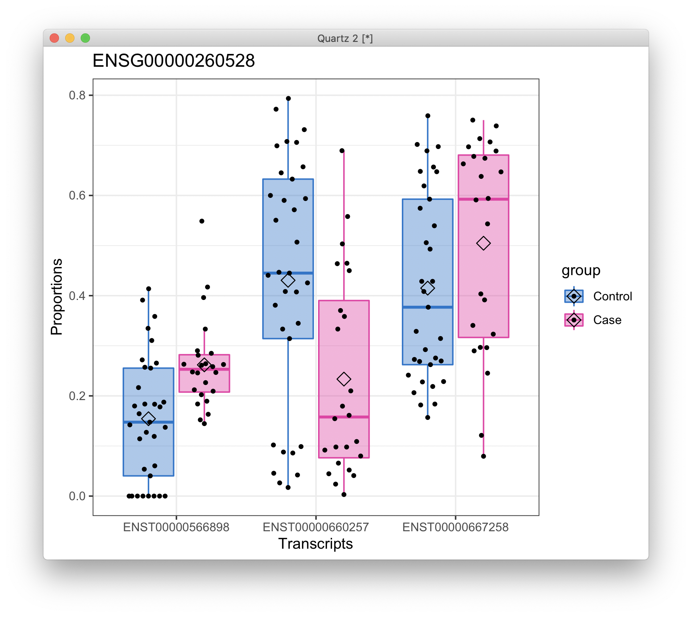

**Caudate pseudogene**

No genes survive filtering.

# 2021-01-28 10:07:47

Let's change the DTE function to return something for WG and possibly PRS
analysis:

```r
run_skinny_DTE = function(count_matrix, tx_meta, myregion, subtype) {
    cat('Starting with', nrow(tx_meta), 'variables\n')
    keep_me = grepl(tx_meta$transcript_biotype, pattern=sprintf('%s$', subtype))
    cat('Keeping', sum(keep_me), subtype, 'variables\n')
    my_count_matrix = count_matrix[keep_me, ]
    my_tx_meta = tx_meta[keep_me, ]

    # removing variables where more than half of the subjects have zero counts
    keep_me = rowSums(my_count_matrix==0) < .25*ncol(my_count_matrix)
    my_count_matrix = my_count_matrix[keep_me, ]
    cat('Keeping', nrow(my_count_matrix), 'after zero removal\n')

    # removing variables with zero or near-zero variance
    library(caret)
    pp_order = c('zv', 'nzv')
    pp = preProcess(t(my_count_matrix), method = pp_order)
    X = t(predict(pp, t(my_count_matrix)))
    cat('Keeping', nrow(X), 'after NZ and NZV filtering\n')

    # checking which PCs are associated with our potential nuiscance variables
    set.seed(42)
    mypca <- prcomp(t(X), scale=TRUE)
    # how many PCs to keep... using Kaiser thredhold, close to eigenvalues < 1
    library(nFactors)
    eigs <- mypca$sdev^2
    nS = nScree(x=eigs)
    keep_me = seq(1, nS$Components$nkaiser)

    mydata = data.frame(mypca$x[, keep_me])
    # create main metadata data frame including metadata and PCs
    data.pm = cbind(samples, mydata)
    rownames(data.pm) = samples$hbcc_brain_id
    cat('Using', nS$Components$nkaiser, 'PCs from possible', ncol(X), '\n')

    # check which PCs are associated at nominal p<.01
    num_vars = c('pcnt_optical_duplicates', 'clusters', 'Age', 'RINe', 'PMI',
                'C1', 'C2', 'C3', 'C4', 'C5')
    pc_vars = colnames(mydata)
    num_corrs = matrix(nrow=length(num_vars), ncol=length(pc_vars),
                        dimnames=list(num_vars, pc_vars))
    num_pvals = num_corrs
    for (x in num_vars) {
        for (y in pc_vars) {
            res = cor.test(data.pm[, x], data.pm[, y], method='spearman')
            num_corrs[x, y] = res$estimate
            num_pvals[x, y] = res$p.value
        }
    }

    categ_vars = c('batch', 'Diagnosis', 'MoD', 'substance_group',
                'comorbid_group', 'POP_CODE', 'Sex', 'evidence_level')
    categ_corrs = matrix(nrow=length(categ_vars), ncol=length(pc_vars),
                            dimnames=list(categ_vars, pc_vars))
    categ_pvals = categ_corrs
    for (x in categ_vars) {
        for (y in pc_vars) {
            res = kruskal.test(data.pm[, y], data.pm[, x])
            categ_corrs[x, y] = res$statistic
            categ_pvals[x, y] = res$p.value
        }
    }
    use_pcs = unique(c(which(num_pvals < .01, arr.ind = T)[, 'col'],
                    which(categ_pvals < .01, arr.ind = T)[, 'col']))
    # only use the ones not related to Diagnosis
    keep_me = c()
    for (pc in use_pcs) {
        keep_me = c(keep_me, categ_pvals['Diagnosis', pc] > .05)
    }
    use_pcs = use_pcs[keep_me]
    fm_str = sprintf('~ Diagnosis + %s', paste0(pc_vars[use_pcs],
                                                collapse = ' + '))
    cat('Found', length(use_pcs), 'PCs p < .01\n')
    cat('Using formula:', fm_str, '\n')

    # scaling PCs to assure convergence
    for (var in pc_vars[use_pcs]) {
        data.pm[, var] = scale(data.pm[, var])
    }

    # removing variables with low expression
    library(edgeR)
    design=model.matrix(as.formula(fm_str), data=data.pm)
    isexpr <- filterByExpr(X, design=design)
    countsExpr = X[isexpr,]
    metaExpr = data.frame(TXNAME = substr(rownames(countsExpr), 1, 15))
    metaExpr = merge(metaExpr, my_tx_meta, by='TXNAME', sort=F)
    cat('Keeping', nrow(countsExpr), 'after expression filtering\n')

    library(DESeq2)
    # because DESeq doesn't remove outliers if there are continuous variables
    # in the formula, we need to do this iteratively
    nOutliers = Inf
    myCounts = round(countsExpr)
    while (nOutliers > 0) {
        dds <- DESeqDataSetFromMatrix(countData = myCounts,
                                    colData = data.pm,
                                    design = as.formula(fm_str))
        cat('Processing', nrow(dds), 'variables.\n')
        dds <- DESeq(dds)
        maxCooks <- apply(assays(dds)[["cooks"]], 1, max)
        # outlier cut-off uses the 99% quantile of the F(p,m-p) distribution (with 
        # p the number of parameters including the intercept and m number of
        # samples).
        m <- ncol(dds)
        # number or parameters (PCs + Diagnosis + intercept)
        p <- length(use_pcs) + 2
        co = qf(.99, p, m - p)
        keep_me = which(maxCooks < co)
        nOutliers = nrow(myCounts) - length(keep_me)
        cat('Found', nOutliers, 'outliers.\n')
        myCounts = round(myCounts)[keep_me, ]
    }
    res <- results(dds, name = "Diagnosis_Case_vs_Control", alpha = .05)

    return(res)
}
```

```r
DTEres_acc_pc = run_skinny_DTE(count_matrix, tx_meta, myregion, 'protein_coding')
```

Then we can run WG this way:

```r
res = as.data.frame(DTEres_acc_pc)
res$TXNAME = substr(rownames(res), 1, 15)
res$rank = -log(res$pvalue) * sign(res$log2FoldChange)
m = merge(res, tx_meta, by='TXNAME')

library(dplyr)
library(WebGestaltR)
data_dir = '~/data/post_mortem/'
ncpu = 2

ranks = m %>% group_by(GENEID) %>% slice_min(n=1, pvalue, with_ties=F)
tmp2 = data.frame(geneid=ranks$GENEID, rank=ranks$rank)
tmp2 = tmp2[order(tmp2$rank, decreasing=T),]

res_str = sprintf('DTE_pc_%s', myregion)
DBs = c(sprintf('my_%s_sets', myregion))
for (db in DBs) {
    cat(res_str, db, '\n')
    db_file = sprintf('~/data/post_mortem/%s.gmt', db)
    project_name = sprintf('WG8_%s_%s_10K', res_str, db)
    enrichResult <- try(WebGestaltR(enrichMethod="GSEA",
                        organism="hsapiens",
                        enrichDatabaseFile=db_file,
                        enrichDatabaseType="genesymbol",
                        interestGene=tmp2,
                        outputDirectory = data_dir,
                        interestGeneType="ensembl_gene_id",
                        sigMethod="top", topThr=20,
                        minNum=3, projectName=project_name,
                        isOutput=T, isParallel=T,
                        nThreads=ncpu, perNum=10000, maxNum=800))
    if (class(enrichResult) != "try-error") {
        out_fname = sprintf('%s/WG8_%s_%s_10K.csv', data_dir, res_str, db)
        write.csv(enrichResult, file=out_fname, row.names=F)
    }
}

DBs = c('geneontology_Biological_Process_noRedundant',
        'geneontology_Cellular_Component_noRedundant',
        'geneontology_Molecular_Function_noRedundant')
for (db in DBs) {
    cat(res_str, db, '\n')
    project_name = sprintf('WG8_%s_%s_10K', res_str, db)

    enrichResult <- try(WebGestaltR(enrichMethod="GSEA",
                                organism="hsapiens",
                                enrichDatabase=db,
                                interestGene=tmp2,
                                interestGeneType="ensembl_gene_id",
                                sigMethod="top", topThr=20,
                                outputDirectory = data_dir,
                                minNum=5, projectName=project_name,
                                isOutput=T, isParallel=T,
                                nThreads=ncpu, perNum=10000))
    if (class(enrichResult) != "try-error") {
        out_fname = sprintf('%s/WG8_%s_%s_10K.csv', data_dir, res_str, db)
        write.csv(enrichResult, file=out_fname, row.names=F)
    }
}
```

# TODO