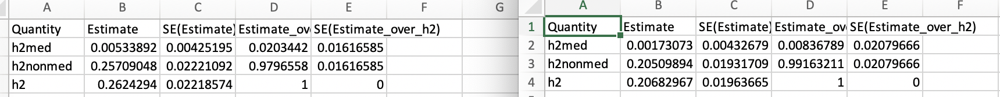

# 2021-02-04 11:45:42

Let's take a stab at running MESC:

https://github.com/douglasyao/mesc/wiki/Estimating-overall-expression-scores

First, let's make the expression matrix. Maybe I can just re-read Derek's
original file, remove the outliers, and add whatever info is still remaining.

The one caveat here is that our RNAseq is in GRCh38, and everything else (plink
files, reference 1KG files, and GWAS) is in hg19. It might be easier to just
liftOver the RNAseq to hg19, and do everything there:

```bash
# laptop
conda activate rnaseq
```

```python
cd ~/data/post_mortem/gtfparse
from gtfparse import read_gtf
fn = '/Users/sudregp/data/post_mortem/Homo_sapiens.GRCh38.97.gtf'
df = read_gtf(fn)
out_fn = '/Users/sudregp/data/post_mortem/Homo_sapiens.GRCh38.97_biotypes.csv'
my_cols = ['transcript_id', 'transcript_biotype', 'gene_id', 'gene_biotype']
df[my_cols].to_csv(out_fn)
```

```r
myregion = 'ACC'
data = readRDS('~/data/rnaseq_derek/complete_rawCountData_05132020.rds')
rownames(data) = data$submitted_name  # just to ensure compatibility later
# remove obvious outlier (that's NOT caudate) labeled as ACC
rm_me = rownames(data) %in% c('68080')
data = data[!rm_me, ]
data = data[data$Region==myregion, ]

# at this point we have 55 samples for ACC
grex_vars = colnames(data)[grepl(colnames(data), pattern='^ENS')]
count_matrix = t(data[, grex_vars])
data = data[, !grepl(colnames(data), pattern='^ENS')]
# data only contains sample metadata, and count_matrix has actual counts

library(GenomicFeatures)
txdb <- loadDb('~/data/post_mortem/Homo_sapies.GRCh38.97.sqlite')
txdf <- select(txdb, keys(txdb, "GENEID"),
               columns=c('GENEID','TXCHROM', 'TXSTART', 'TXEND'),
               "GENEID")
txdf = txdf[!duplicated(txdf$GENEID),] 
# store gene names in geneCounts without version in end of name
tx_meta = data.frame(GENEID = substr(rownames(count_matrix), 1, 15))
tx_meta = merge(tx_meta, txdf, by='GENEID', sort=F)
imautosome = which(tx_meta$TXCHROM != 'X' &
                   tx_meta$TXCHROM != 'Y' &
                   tx_meta$TXCHROM != 'MT')
count_matrix = count_matrix[imautosome, ]
tx_meta = tx_meta[imautosome, ]
```

# 2021-02-23 17:17:16

Let's go back to this analysis. I'll try to liftOver the genes, so I'll need to
get the gene coordinates. They can be start location or midpoints.

```r
tx_meta$bed = sapply(1:nrow(tx_meta),
                     function(x) sprintf('chr%s:%d-%d', tx_meta[x, 'TXCHROM'],
                                         tx_meta[x, 'TXSTART'],
                                         tx_meta[x, 'TXEND']))
write.table(tx_meta$bed, file='~/tmp/tx_meta_hg38.txt', row.names=F, quote=F,
            col.names=F)
```

Then I used the liftOver website to convert to hg19. There were a few errors, so
I'll remove those first, and then add in the converted coordinates.

```r
errs = read.table('~/tmp/hglft_genome_29a45_586cc0.err.txt')
rm_me = tx_meta$bed %in% errs[,1]
tx_meta_clean = tx_meta[!rm_me, ]
count_matrix_clean = count_matrix[!rm_me,]
colnames(count_matrix_clean) = data$hbcc_brain_id
new_pos = read.table('~/Downloads/hglft_genome_29a45_586cc0.bed')
new_pos = gsub(x=new_pos[, 1], pattern='chr', replacement='')
tx_meta_clean$CHR = sapply(new_pos, function(x) strsplit(x, ':')[[1]][1])
nochr = sapply(new_pos, function(x) strsplit(x, ':')[[1]][2])
tx_meta_clean$GENE_COORD = sapply(nochr, function(x) strsplit(x, '-')[[1]][1])
out_df = cbind(tx_meta_clean[, c(1, 6, 7)], count_matrix_clean)
colnames(out_df)[1] = 'GENE'
write.table(out_df, quote=F, row.names=F, sep='\t', file='~/tmp/acc_mesc.txt')
```

We also need to make sure our PLINK files have the same sample names as what we
have in our gene file. It's simpler to just rename the PLINK file

```bash
# bw
cd ~/data/post_mortem/genotyping/1KG;
awk '{ print $1 }' PM_1KG_genop05MAFbtp01rsbtp9_renamed.fam | cut -d"_" \
    -f 2 | sed "s/BR//g" > new_ids.txt;
awk '{ print $1, $2 }' PM_1KG_genop05MAFbtp01rsbtp9_renamed.fam > junk.txt;
paste junk.txt new_ids.txt new_ids.txt > update_ids.txt;
module load plink;
plink --bfile PM_1KG_genop05MAFbtp01rsbtp9_renamed \
    --update-ids update_ids.txt \
    --make-bed --out PM_1KG_genop05MAFbtp01rsbtp9_renamed_hbcc
plink --vcf /fdb/1000genomes/release/20130502/ALL.chr1.phase3_shapeit2_mvncall_integrated_v5a.20130502.genotypes.vcf.gz \
    --make-bed --out ch1_1KG;
mydir=~/data/post_mortem/genotyping/1KG;
cd /data/NCR_SBRB/software/mesc
./run_mesc.py --compute-expscore-indiv \
    --plink-path /usr/local/apps/plink/1.9.0-beta4.4/plink \
    --expression-matrix ~/data/tmp/acc_mesc.txt \
    --exp-bfile $mydir/PM_1KG_genop05MAFbtp01rsbtp9_renamed_hbcc \
    --geno-bfile $mydir/ch1_1KG --chr 1 --out exp_score_ACC
```

This is working, but it takes forever because it does each gene individually,
for each chromosome. We have at least 5K in chr1, so we can definitely
parallelize this.

```bash
#bw
module load plink
module load python/2.7
chr=2;

cd /data/NCR_SBRB/software/mesc;
mydir=~/data/post_mortem/genotyping/1KG;
if [[ ! -e ${mydir}/ch${chr}_1KG ]]; then
    plink --vcf /fdb/1000genomes/release/20130502/ALL.chr${chr}.phase3_shapeit2_mvncall_integrated_v5a.20130502.genotypes.vcf.gz \
        --make-bed --out ${mydir}/ch${chr}_1KG;
fi;
./run_mesc.py --compute-expscore-indiv \
    --plink-path /usr/local/apps/plink/1.9.0-beta4.4/plink \
    --expression-matrix ~/data/tmp/acc_mesc.txt \
    --exp-bfile $mydir/PM_1KG_genop05MAFbtp01rsbtp9_renamed_hbcc \
    --geno-bfile $mydir/ch${chr}_1KG --chr ${chr} --out ${mydir}/exp_score_ACC
```

Both processes take a long time: creating the PLINK file for the chromosome, and
then the actual MESC running. At least the first one only has to be run once.
When we run Caudate, and any other variations of MESc (e.g. using covariates),
we can just use the same chromosome files.

# 2021-02-25 07:15:21

I'll start the Caudate run as well.

```r
myregion = 'Caudate'
data = readRDS('~/data/rnaseq_derek/complete_rawCountData_05132020.rds')
rownames(data) = data$submitted_name  # just to ensure compatibility later
# remove obvious outlier (that's NOT caudate) labeled as ACC
rm_me = rownames(data) %in% c('68080')
data = data[!rm_me, ]
data = data[data$Region==myregion, ]

# at this point we have 55 samples for ACC
grex_vars = colnames(data)[grepl(colnames(data), pattern='^ENS')]
count_matrix = t(data[, grex_vars])
data = data[, !grepl(colnames(data), pattern='^ENS')]
# data only contains sample metadata, and count_matrix has actual counts

library(GenomicFeatures)
txdb <- loadDb('~/data/post_mortem/Homo_sapies.GRCh38.97.sqlite')
txdf <- select(txdb, keys(txdb, "GENEID"),
               columns=c('GENEID','TXCHROM', 'TXSTART', 'TXEND'),
               "GENEID")
txdf = txdf[!duplicated(txdf$GENEID),] 
# store gene names in geneCounts without version in end of name
tx_meta = data.frame(GENEID = substr(rownames(count_matrix), 1, 15))
tx_meta = merge(tx_meta, txdf, by='GENEID', sort=F)
imautosome = which(tx_meta$TXCHROM != 'X' &
                   tx_meta$TXCHROM != 'Y' &
                   tx_meta$TXCHROM != 'MT')
count_matrix = count_matrix[imautosome, ]
tx_meta = tx_meta[imautosome, ]

tx_meta$bed = sapply(1:nrow(tx_meta),
                     function(x) sprintf('chr%s:%d-%d', tx_meta[x, 'TXCHROM'],
                                         tx_meta[x, 'TXSTART'],
                                         tx_meta[x, 'TXEND']))

errs = read.table('~/tmp/hglft_genome_29a45_586cc0.err.txt')
rm_me = tx_meta$bed %in% errs[,1]
tx_meta_clean = tx_meta[!rm_me, ]
count_matrix_clean = count_matrix[!rm_me,]
colnames(count_matrix_clean) = data$hbcc_brain_id
new_pos = read.table('~/Downloads/hglft_genome_29a45_586cc0.bed')
new_pos = gsub(x=new_pos[, 1], pattern='chr', replacement='')
tx_meta_clean$CHR = sapply(new_pos, function(x) strsplit(x, ':')[[1]][1])
nochr = sapply(new_pos, function(x) strsplit(x, ':')[[1]][2])
tx_meta_clean$GENE_COORD = sapply(nochr, function(x) strsplit(x, '-')[[1]][1])
out_df = cbind(tx_meta_clean[, c(1, 6, 7)], count_matrix_clean)
colnames(out_df)[1] = 'GENE'
write.table(out_df, quote=F, row.names=F, sep='\t', file='~/tmp/caudate_mesc.txt')
```

```bash
#bw
module load plink
module load python/2.7
chr=2;

cd /data/NCR_SBRB/software/mesc;
mydir=~/data/post_mortem/genotyping/1KG;
if [[ ! -e ${mydir}/ch${chr}_1KG ]]; then
    plink --vcf /fdb/1000genomes/release/20130502/ALL.chr${chr}.phase3_shapeit2_mvncall_integrated_v5a.20130502.genotypes.vcf.gz \
        --make-bed --out ${mydir}/ch${chr}_1KG;
fi;
./run_mesc.py --compute-expscore-indiv \
    --plink-path /usr/local/apps/plink/1.9.0-beta4.4/plink \
    --expression-matrix ~/data/tmp/caudate_mesc.txt \
    --exp-bfile $mydir/PM_1KG_genop05MAFbtp01rsbtp9_renamed_hbcc \
    --geno-bfile $mydir/ch${chr}_1KG --chr ${chr} --out ${mydir}/exp_score_Caudate
```

Let's continue the MESC analysis. I used munge_stats.py back in note 168. 

```bash
cd /data/NCR_SBRB/software/mesc;
mydir=~/data/post_mortem/genotyping/1KG;
./run_mesc.py \
    --h2med ~/data/expression_impute/fusion_twas-master/adhd_eur_jun2017.sumstats.gz \
    --exp-chr ${mydir}/exp_score_ACC --out out_MESC_ACC
```

OK, so this is working. Now, we need to understand the interpretation a bit
better. Also, run the other variants I had in the TODO.

First, let's see what happens if I use the covariates and only the clean genes.
I used the code from note 191:

```r
res = run_DGE(count_matrix, data, tx_meta, myregion, NA, .05)
covars = data.frame(FID=rownames(res$design), IID=rownames(res$design))
covars = cbind(covars, res$design[, 3:ncol(res$design)])
write.table(covars, quote=F, row.names=F, sep='\t',
            file='~/tmp/acc_covars_mesc.txt')

clean_count = counts(res$dds)

library(GenomicFeatures)
txdb <- loadDb('~/data/post_mortem/Homo_sapies.GRCh38.97.sqlite')
txdf <- select(txdb, keys(txdb, "GENEID"),
               columns=c('GENEID','TXCHROM', 'TXSTART', 'TXEND'),
               "GENEID")
txdf = txdf[!duplicated(txdf$GENEID),] 
tx_meta = data.frame(GENEID = substr(rownames(clean_count), 1, 15))
tx_meta = merge(tx_meta, txdf, by='GENEID', sort=F)
imautosome = which(tx_meta$TXCHROM != 'X' &
                   tx_meta$TXCHROM != 'Y' &
                   tx_meta$TXCHROM != 'MT')
clean_count = clean_count[imautosome, ]
tx_meta = tx_meta[imautosome, ]
tx_meta$bed = sapply(1:nrow(tx_meta),
                     function(x) sprintf('chr%s:%d-%d', tx_meta[x, 'TXCHROM'],
                                         tx_meta[x, 'TXSTART'],
                                         tx_meta[x, 'TXEND']))
write.table(tx_meta$bed, file='~/tmp/tx_meta_accClean_hg38.txt',
            row.names=F, quote=F, col.names=F)

errs = read.table('~/tmp/hglft_genome_1e4cb_8004c0.err.txt')
rm_me = tx_meta$bed %in% errs[,1]
tx_meta_clean = tx_meta[!rm_me, ]
count_matrix_clean = clean_count[!rm_me,]
colnames(count_matrix_clean) = data$hbcc_brain_id
new_pos = read.table('~/tmp/hglft_genome_1e4cb_8004c0.bed')
new_pos = gsub(x=new_pos[, 1], pattern='chr', replacement='')
tx_meta_clean$CHR = sapply(new_pos, function(x) strsplit(x, ':')[[1]][1])
nochr = sapply(new_pos, function(x) strsplit(x, ':')[[1]][2])
tx_meta_clean$GENE_COORD = sapply(nochr, function(x) strsplit(x, '-')[[1]][1])
out_df = cbind(tx_meta_clean[, c(1, 6, 7)], count_matrix_clean)
colnames(out_df)[1] = 'GENE'
write.table(out_df, quote=F, row.names=F, sep='\t', file='~/tmp/accClean_mesc.txt')
```

Now we run the new file and the covars:

```bash
#bw
module load plink
module load python/2.7
chr=1;

cd /data/NCR_SBRB/software/mesc;
mydir=~/data/post_mortem/genotyping/1KG;
if [[ ! -e ${mydir}/ch${chr}_1KG ]]; then
    plink --vcf /fdb/1000genomes/release/20130502/ALL.chr${chr}.phase3_shapeit2_mvncall_integrated_v5a.20130502.genotypes.vcf.gz \
        --make-bed --out ${mydir}/ch${chr}_1KG;
fi;
./run_mesc.py --compute-expscore-indiv \
    --plink-path /usr/local/apps/plink/1.9.0-beta4.4/plink \
    --expression-matrix ~/data/tmp/accClean_mesc.txt \
    --exp-bfile $mydir/PM_1KG_genop05MAFbtp01rsbtp9_renamed_hbcc \
    --covariates ~/data/tmp/acc_covars_mesc.txt \
    --geno-bfile $mydir/ch${chr}_1KG --chr ${chr} --out ${mydir}/exp_score_cleanACC
```

And we do the same thing, but now for the Caudate:

```r
res = run_DGE(count_matrix, data, tx_meta, myregion, NA, .05)
covars = data.frame(FID=rownames(res$design), IID=rownames(res$design))
covars = cbind(covars, res$design[, 3:ncol(res$design)])
write.table(covars, quote=F, row.names=F, sep='\t',
            file='~/tmp/caudate_covars_mesc.txt')

clean_count = counts(res$dds)

library(GenomicFeatures)
txdb <- loadDb('~/data/post_mortem/Homo_sapies.GRCh38.97.sqlite')
txdf <- select(txdb, keys(txdb, "GENEID"),
               columns=c('GENEID','TXCHROM', 'TXSTART', 'TXEND'),
               "GENEID")
txdf = txdf[!duplicated(txdf$GENEID),] 
tx_meta = data.frame(GENEID = substr(rownames(clean_count), 1, 15))
tx_meta = merge(tx_meta, txdf, by='GENEID', sort=F)
imautosome = which(tx_meta$TXCHROM != 'X' &
                   tx_meta$TXCHROM != 'Y' &
                   tx_meta$TXCHROM != 'MT')
clean_count = clean_count[imautosome, ]
tx_meta = tx_meta[imautosome, ]
tx_meta$bed = sapply(1:nrow(tx_meta),
                     function(x) sprintf('chr%s:%d-%d', tx_meta[x, 'TXCHROM'],
                                         tx_meta[x, 'TXSTART'],
                                         tx_meta[x, 'TXEND']))
write.table(tx_meta$bed, file='~/tmp/tx_meta_caudateClean_hg38.txt',
            row.names=F, quote=F, col.names=F)

errs = read.table('~/tmp/hglft_genome_26baf_8035f0.err.txt')
rm_me = tx_meta$bed %in% errs[,1]
tx_meta_clean = tx_meta[!rm_me, ]
count_matrix_clean = clean_count[!rm_me,]
colnames(count_matrix_clean) = data$hbcc_brain_id
new_pos = read.table('~/tmp/hglft_genome_26baf_8035f0.bed')
new_pos = gsub(x=new_pos[, 1], pattern='chr', replacement='')
tx_meta_clean$CHR = sapply(new_pos, function(x) strsplit(x, ':')[[1]][1])
nochr = sapply(new_pos, function(x) strsplit(x, ':')[[1]][2])
tx_meta_clean$GENE_COORD = sapply(nochr, function(x) strsplit(x, '-')[[1]][1])
out_df = cbind(tx_meta_clean[, c(1, 6, 7)], count_matrix_clean)
colnames(out_df)[1] = 'GENE'
write.table(out_df, quote=F, row.names=F, sep='\t',
            file='~/tmp/caudateClean_mesc.txt')
```

```bash
#bw
./run_mesc.py --compute-expscore-indiv \
    --plink-path /usr/local/apps/plink/1.9.0-beta4.4/plink \
    --expression-matrix ~/data/tmp/caudateClean_mesc.txt \
    --exp-bfile $mydir/PM_1KG_genop05MAFbtp01rsbtp9_renamed_hbcc \
    --covariates ~/data/tmp/caudate_covars_mesc.txt \
    --geno-bfile $mydir/ch${chr}_1KG --chr ${chr} \
    --out ${mydir}/exp_score_cleanCaudate
```

# 2021-02-26 07:22:04

Let's run the all adhd GWAS as well, so that we can have a better idea of how
the population affects the results. I do have to create the sumstats file first.
I actually need to recreate the EUR as well, because I used the wrong N based on
the README. Not that it'd make that much difference, but if we're redoing it,
might as well do it right:

```bash
cd ~/data/expression_impute/fusion_twas-master/
cd ldsc-master
module load python/2.7
./munge_sumstats.py --sumstats ~/pgc2017/adhd_jun2017 --N 55374 \
    --N-cas 20183 --N-con 35191 --signed-sumstats OR,1 \
    --out ../adhd_jun2017
./munge_sumstats.py --sumstats ~/pgc2017/adhd_eur_jun2017 --N 53293 \
    --N-cas 19099 --N-con 34194 --signed-sumstats OR,1 \
    --out ../adhd_eur_jun2017

cd /data/NCR_SBRB/software/mesc;
mydir=~/data/post_mortem/genotyping/1KG;
sumstats_dir=~/data/expression_impute/fusion_twas-master
for r in ACC Caudate cleanACC cleanCaudate; do
    for p in '' '_eur'; do
        ./run_mesc.py \
            --h2med ${sumstats_dir}/adhd${p}_jun2017.sumstats.gz \
            --exp-chr ${mydir}/exp_score_${r} \
            --out out_MESC${p}_${r};
    done;
done
```

Here are some numbers from the munging process:

```
# all
Metadata:
Mean chi^2 = 1.236
Lambda GC = 1.211
Max chi^2 = 44.079
185 Genome-wide significant SNPs (some may have been removed by filtering).

#eur
Metadata:
Mean chi^2 = 1.277
Lambda GC = 1.23
Max chi^2 = 50.708
292 Genome-wide significant SNPs (some may have been removed by filtering).
```

Results weren't great. 



The left is eur_cleanACC and right is clean_ACC. Those were the only two results
that had h2med > 0. The results per category weren't very telling either.

## Gene sets

Let's try focusing on a few gene sets. We'll add our own gene sets, and then the
ones that are significant in the GSEA analysis:

```r
library(WebGestaltR)
db_file = '~/data/post_mortem/my_acc_sets.gmt'
gmt = readGmt(db_file) # already in gene symbols
for (d in unique(gmt$geneSet)) {
    genes = gmt[gmt$geneSet==d, 'gene']
    a = paste0(c(d, genes), collapse="\t")
    cat(a, '\n', file="~/data/mesc/acc_sets.txt", append=TRUE)
}
```


```r
library(WebGestaltR)
db = 'geneontology_Biological_Process_noRedundant'
gs = loadGeneSet(enrichDatabase=db)
gmt = gs$geneSet
a = idMapping(inputGene=gmt$gene, sourceIdType='entrezgene',
              targetIdType='ensembl_gene_id')
gmt2 = merge(gmt, a$mapped[, c('userId', 'ensembl_gene_id')], by.x = 'gene',
             by.y='userId', all.x=F, all.y=F, sort=F)
for (d in unique(gmt2$geneSet)[1:5]) {
    genes = gmt2[gmt2$geneSet==d, 'ensembl_gene_id']
    a = paste0(c(d, genes), collapse="\t")
    cat(a, '\n', file="~/data/mesc/goBP_acc_sets.txt", append=TRUE)
}
```

```bash
#bw
module load plink
module load python/2.7
chr=1;

cd /data/NCR_SBRB/software/mesc;
mydir=~/data/post_mortem/genotyping/1KG;
for c in {1..22}; do 
    echo $c >> chrom.txt;
done
cat chrom.txt | parallel -j 22 --max-args=1 \
    ./run_mesc.py --compute-expscore-indiv \
        --plink-path /usr/local/apps/plink/1.9.0-beta4.4/plink \
        --expression-matrix ~/data/tmp/accClean_mesc.txt \
        --exp-bfile $mydir/PM_1KG_genop05MAFbtp01rsbtp9_renamed_hbcc \
        --covariates ~/data/tmp/acc_covars_mesc.txt \
        --geno-bfile $mydir/ch{}_1KG --chr {} \
        --out ${mydir}/exp_score_cleanACC_test \
        --est-lasso-only

./gene_set_analysis.py \
    --input-prefix ${mydir}/exp_score_cleanACC_test \
    --gene-sets ~/data/tmp/goBP_acc_sets.txt \
    --bfile $mydir/ch${chr}_1KG --chr ${chr} \
    --out $mydir/goBP_acc_sets_cleanACC

# TODO
 * try all ADHD gwas, not just eur
 * interpret the results
 * use different gene sets