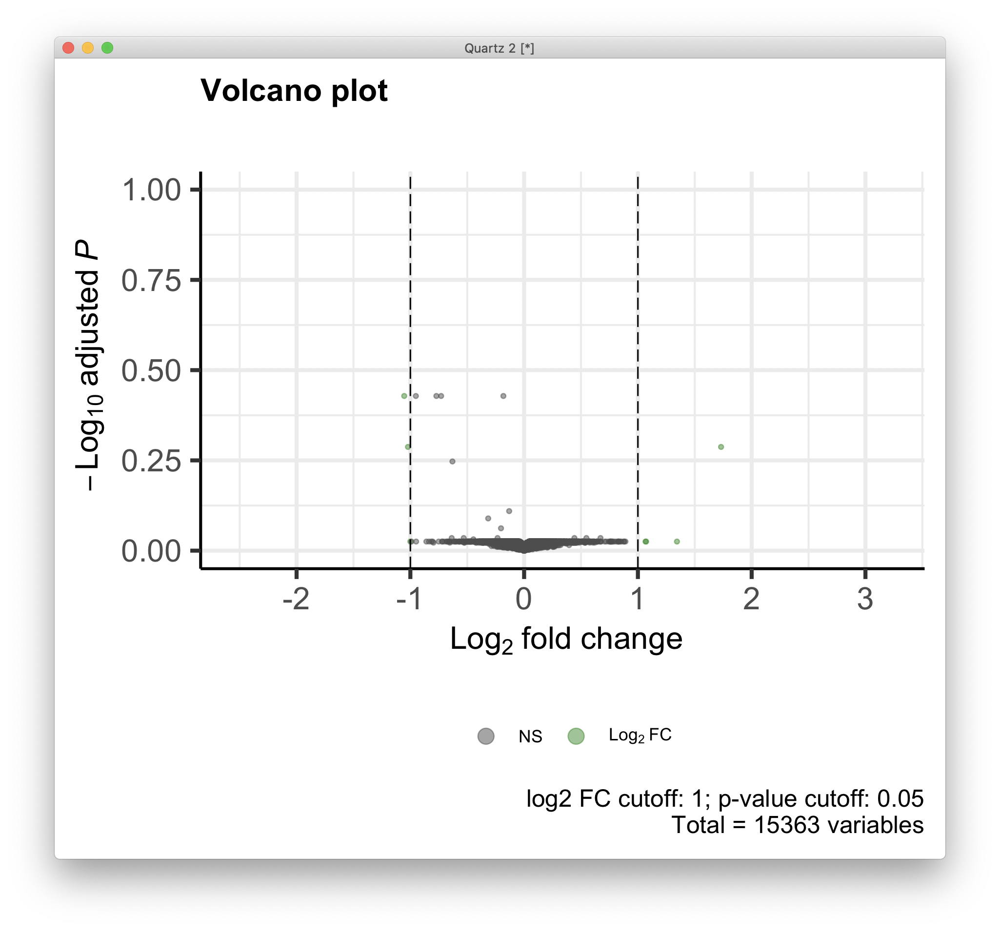
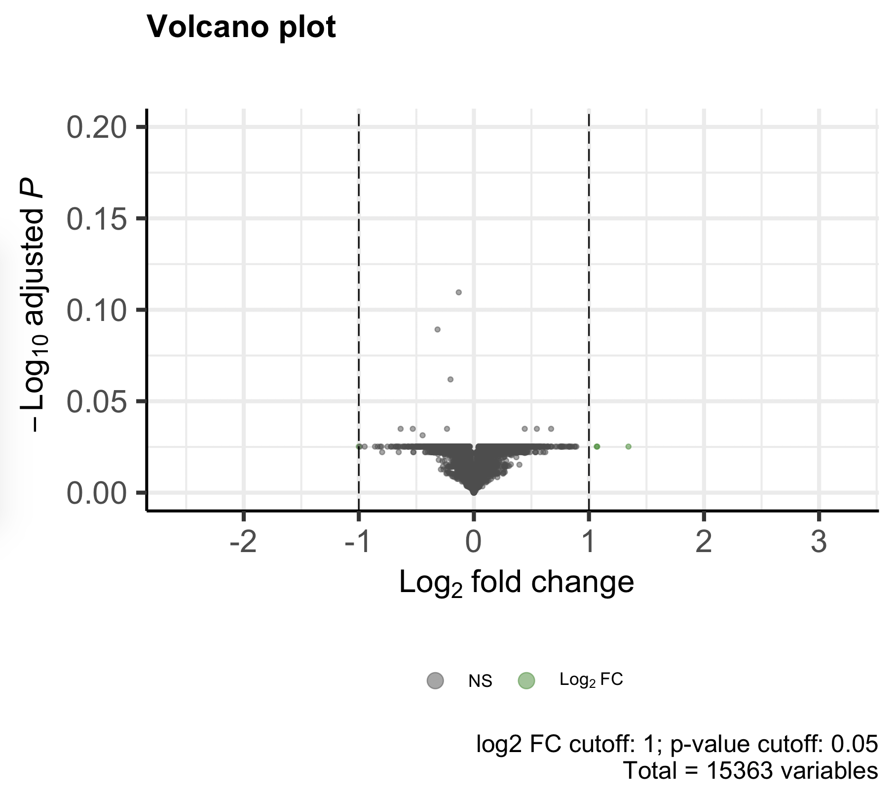
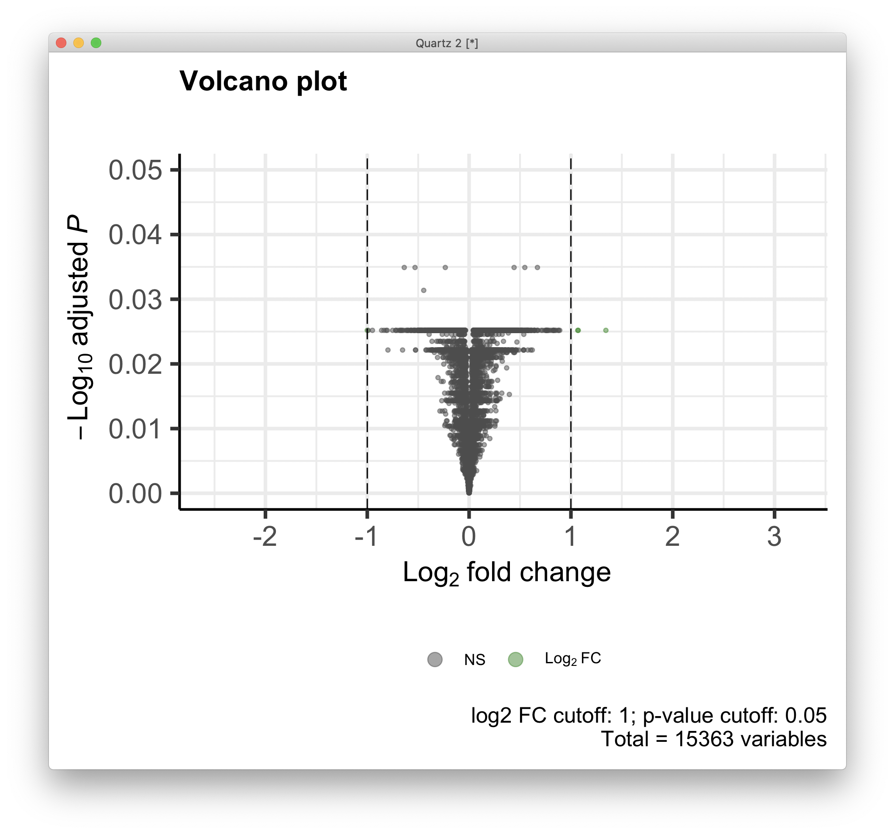
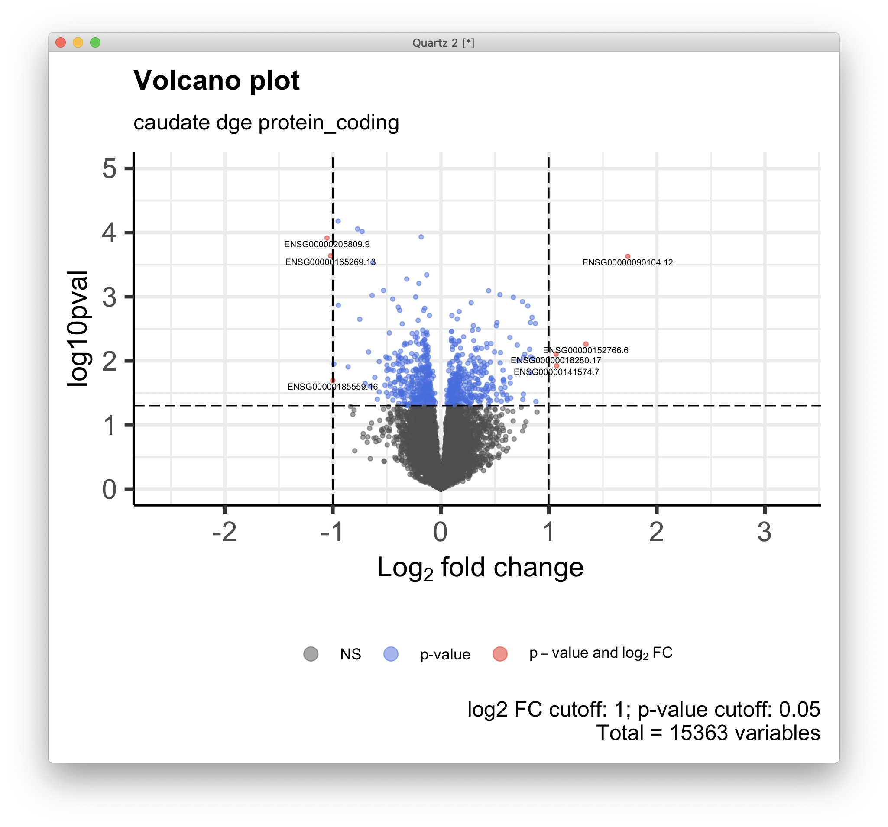
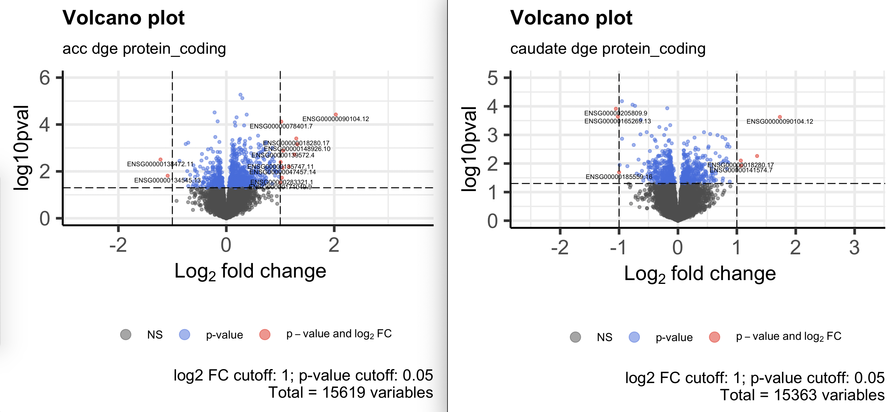
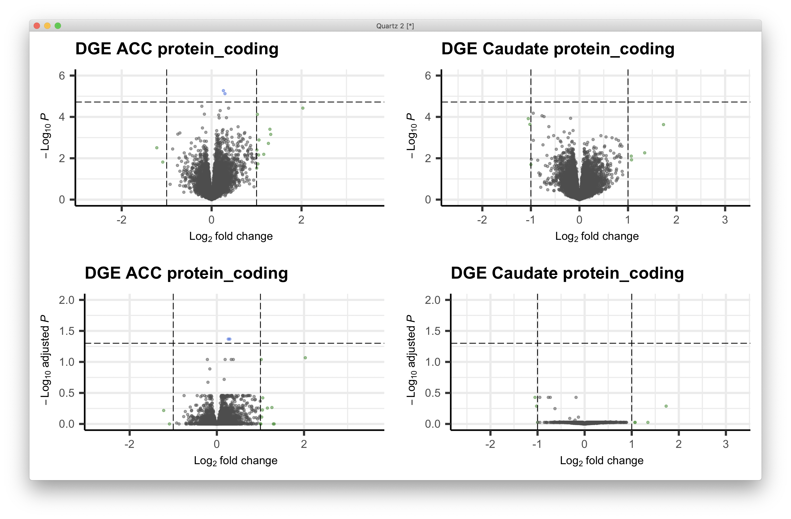

# 2021-02-05 11:23:14

OK, so is there anything funky going on with the Caudate Volcano plots?

This is the original (protein_coding):

```r
load('~/data/post_mortem/DGE_01272021.RData')
res = as.data.frame(dge_cau[['protein_coding']])

library(EnhancedVolcano)
quartz()
FCcutoff = 1.0
pCutoff = .05
t_str = ''

p = EnhancedVolcano(data.frame(res), lab = res$hgnc_symbol,
                    x = 'log2FoldChange',
                    y = 'padj', xlab = bquote(~Log[2]~ 'fold change'),
                    selectLab = res[res$padj < pCutoff, 'hgnc_symbol'],
                    ylab = bquote(~-Log[10]~adjusted~italic(P)),
                    ylim = c(0, ceiling(max(-log10(res$padj)))),
                    pCutoff = pCutoff, FCcutoff = FCcutoff, pointSize = 1.0,
                    labSize = 2.0, title = "Volcano plot",
                    subtitle = t_str,
                    caption = paste0('log2 FC cutoff: ', FCcutoff,
                                    '; p-value cutoff: ', pCutoff,
                                    '\nTotal = ', nrow(res), ' variables'),
                    legendPosition = 'bottom', legendLabSize = 10,
                    legendIconSize = 4.0)
print(p)
```



My original comment was that the axis was making it look flat. Let's check:

```r
p = EnhancedVolcano(data.frame(res), lab = res$hgnc_symbol,
                    x = 'log2FoldChange',
                    y = 'padj', xlab = bquote(~Log[2]~ 'fold change'),
                    selectLab = res[res$padj < pCutoff, 'hgnc_symbol'],
                    ylab = bquote(~-Log[10]~adjusted~italic(P)),
                    ylim = c(0, .2),
                    pCutoff = pCutoff, FCcutoff = FCcutoff, pointSize = 1.0,
                    labSize = 2.0, title = "Volcano plot",
                    subtitle = t_str,
                    caption = paste0('log2 FC cutoff: ', FCcutoff,
                                    '; p-value cutoff: ', pCutoff,
                                    '\nTotal = ', nrow(res), ' variables'),
                    legendPosition = 'bottom', legendLabSize = 10,
                    legendIconSize = 4.0)
print(p)
```



Still somewhat flat. Let try even deeper zoom:

```r
p = EnhancedVolcano(data.frame(res), lab = res$hgnc_symbol,
                    x = 'log2FoldChange',
                    y = 'padj', xlab = bquote(~Log[2]~ 'fold change'),
                    selectLab = res[res$padj < pCutoff, 'hgnc_symbol'],
                    ylab = bquote(~-Log[10]~adjusted~italic(P)),
                    ylim = c(0, .05),
                    pCutoff = pCutoff, FCcutoff = FCcutoff, pointSize = 1.0,
                    labSize = 2.0, title = "Volcano plot",
                    subtitle = t_str,
                    caption = paste0('log2 FC cutoff: ', FCcutoff,
                                    '; p-value cutoff: ', pCutoff,
                                    '\nTotal = ', nrow(res), ' variables'),
                    legendPosition = 'bottom', legendLabSize = 10,
                    legendIconSize = 4.0)
print(p)
```



It does have a weird shape. What if we plot raw pvalues instead?

```r
t_str='caudate dge protein_coding'
p = EnhancedVolcano(data.frame(res), lab=rownames(res),
                    x = 'log2FoldChange',
                    y = 'pvalue', xlab = bquote(~Log[2]~ 'fold change'),
                    ylab = 'log10pval',
                    ylim = c(0, ceiling(max(-log10(res$pvalue)))),
                    pCutoff = pCutoff, FCcutoff = FCcutoff, pointSize = 1.0,
                    labSize = 2.0, title = "Volcano plot",
                    subtitle = t_str,
                    caption = paste0('log2 FC cutoff: ', FCcutoff,
                                    '; p-value cutoff: ', pCutoff,
                                    '\nTotal = ', nrow(res), ' variables'),
                    legendPosition = 'bottom', legendLabSize = 10,
                    legendIconSize = 4.0)
print(p)
```



For comparison, here's nominal for ACC:

```r
res = as.data.frame(dge_acc[['protein_coding']])
t_str='acc dge protein_coding'
quartz()
p = EnhancedVolcano(data.frame(res), lab=rownames(res),
                    x = 'log2FoldChange',
                    y = 'pvalue', xlab = bquote(~Log[2]~ 'fold change'),
                    ylab = 'log10pval',
                    ylim = c(0, ceiling(max(-log10(res$pvalue)))),
                    pCutoff = pCutoff, FCcutoff = FCcutoff, pointSize = 1.0,
                    labSize = 2.0, title = "Volcano plot",
                    subtitle = t_str,
                    caption = paste0('log2 FC cutoff: ', FCcutoff,
                                    '; p-value cutoff: ', pCutoff,
                                    '\nTotal = ', nrow(res), ' variables'),
                    legendPosition = 'bottom', legendLabSize = 10,
                    legendIconSize = 4.0)
print(p)
```



If we move the p-value cut off line to q<.05, we get:

```r
res = as.data.frame(dge_cau[['protein_coding']])
t_str='cau dge protein_coding'
quartz()
p = EnhancedVolcano(data.frame(res), lab=rownames(res),
                    x = 'log2FoldChange',
                    y = 'pvalue', xlab = bquote(~Log[2]~ 'fold change'),
                    ylab = 'log10pval',
                    ylim = c(0, ceiling(max(-log10(res$pvalue)))),
                    pCutoff = pCutoff, FCcutoff = FCcutoff, pointSize = 1.0,
                    labSize = 2.0, title = "Volcano plot",
                    subtitle = t_str,
                    caption = paste0('log2 FC cutoff: ', FCcutoff,
                                    '; p-value cutoff: ', pCutoff,
                                    '\nTotal = ', nrow(res), ' variables'),
                    legendPosition = 'bottom', legendLabSize = 10,
                    legendIconSize = 4.0)
print(p)
```

Let's make a composite plot now:

```r
library(ggpubr)
myplots = list()
quartz()
res = as.data.frame(dge_acc_q1[['protein_coding']])
print(max(res[res$padj < .05, 'pvalue']))
# this is arbitrary in nominal pvalues, so let's set it between the 3rd and 2nd
# points, as we know there are 2 singificant ones
lp = sort(res$pvalue, decreasing=F)
pCutoff = lp[3] + (lp[2]-lp[3])/2
ymax = ceiling(max(-log10(res$pvalue)))
p = EnhancedVolcano(data.frame(res), lab=rownames(res),
                    x = 'log2FoldChange',
                    y = 'pvalue', xlab = bquote(~Log[2]~ 'fold change'),
                    ylab = bquote(~-Log[10]~italic(P)),
                    title = 'DGE ACC protein_coding',
                    ylim = c(0, ymax),
                    pCutoff = pCutoff, FCcutoff = FCcutoff, pointSize = 1.0,
                    labSize = 1.0, subtitle=NULL,
                    axisLabSize = 12,
                    caption = NULL, legendPosition = 'none')
myplots[[1]] = p
res = as.data.frame(dge_cau[['protein_coding']])
p = EnhancedVolcano(data.frame(res), lab=rownames(res),
                    x = 'log2FoldChange',
                    y = 'pvalue', xlab = bquote(~Log[2]~ 'fold change'),
                    ylab = bquote(~-Log[10]~italic(P)),
                    title = 'DGE Caudate protein_coding',
                    ylim = c(0, ymax),
                    pCutoff = pCutoff, FCcutoff = FCcutoff, pointSize = 1.0,
                    labSize = 1.0, subtitle=NULL,
                    axisLabSize = 12,
                    caption = NULL, legendPosition = 'none')
myplots[[2]] = p
res = as.data.frame(dge_acc_q1[['protein_coding']])
pCutoff = .05
ymax = ceiling(max(-log10(res$padj)))
p = EnhancedVolcano(data.frame(res), lab=rownames(res),
                    x = 'log2FoldChange',
                    y = 'padj', xlab = bquote(~Log[2]~ 'fold change'),
                    ylab = bquote(~-Log[10]~adjusted~italic(P)),
                    title = 'DGE ACC protein_coding',
                    ylim = c(0, ymax),
                    pCutoff = pCutoff, FCcutoff = FCcutoff, pointSize = 1.0,
                    labSize = 1.0, subtitle=NULL,
                    axisLabSize = 12,
                    caption = NULL, legendPosition = 'none')
myplots[[3]] = p
res = as.data.frame(dge_cau[['protein_coding']])
p = EnhancedVolcano(data.frame(res), lab=rownames(res),
                    x = 'log2FoldChange',
                    y = 'padj', xlab = bquote(~Log[2]~ 'fold change'),
                    ylab = bquote(~-Log[10]~adjusted~italic(P)),
                    title = 'DGE Caudate protein_coding',
                    ylim = c(0, ymax),
                    pCutoff = pCutoff, FCcutoff = FCcutoff, pointSize = 1.0,
                    labSize = 1.0, subtitle=NULL,
                    axisLabSize = 12,
                    caption = NULL, legendPosition = 'none')
myplots[[4]] = p

ggarrange(plotlist=myplots)
```



