# 2021-02-05 13:33:08

Let's make sure the results stay the same if we add two extra covariates: brain
bank and pH. Brain bank was highly correlated with batch, so it shouldn't change
things much. pH I hadn't added before because it was incomplete for many
subjects, and was screwing up the analysis. But now that we use the nuisancePCs
approach, it shouldn't be that big of an issue.

I also just learned form an email by Alice Young that RIN and RINe are different
things, so I'm adding both to the analysis too.

Let's also change the main functions to return a list of results, so we don't
have to keep skinny copies all over:

```r
# plotting each of the significant genes
plot_expression = function(gene_ids, dds, t_str) {
    library(ggpubr)
    library(ggbeeswarm)
    quartz()
    myplots = list()
    clrs = c("green3", "red")
    for (g in 1:length(gene_ids)) {
        cat(gene_ids[g], '\n')
        d <- plotCounts(dds, gene=gene_ids[g], intgroup="Diagnosis",
                        returnData=TRUE)
        p = (ggplot(d, aes(x=Diagnosis, y=count, color = Diagnosis,
                        fill = Diagnosis)) + 
            scale_y_log10() +
            geom_boxplot(alpha = 0.4, outlier.shape = NA, width = 0.8,
                        lwd = 0.5) +
            stat_summary(fun = mean, geom = "point", color = "black",
                        shape = 5, size = 3,
                        position=position_dodge(width = 0.8)) +
            scale_color_manual(values = clrs) +
            scale_fill_manual(values = clrs) +
            geom_quasirandom(color = "black", size = 1, dodge.width = 0.8) +
            theme_bw() +
            ggtitle(gene_ids[g]))
        myplots[[g]] = p
    }
    p = ggarrange(plotlist=myplots)
    print(annotate_figure(p, t_str))
}

plot_volcano = function(res, t_str, pCutoff = .05, FCcutoff = 1.0) {
    library(EnhancedVolcano)
    quartz()
    
    # check how many results we have under cutoff
    ngood = length(which(res$padj < pCutoff))
    # this is arbitrary in nominal pvalues, so let's set it between significant
    # and non-significant ones
    lp = sort(res$pvalue, decreasing=F)
    pCutoff = lp[ngood+1] + (lp[ngood]-lp[ngood+1])/2

    p = EnhancedVolcano(data.frame(res), lab = rownames(res),
                        x = 'log2FoldChange',
                        y = 'pvalue', xlab = bquote(~Log[2]~ 'fold change'),
                        selectLab = rownames(res)[res$padj < pCutoff],
                        ylab = bquote(~-Log[10]~italic(P)),
                        ylim = c(0, ceiling(max(-log10(res$pvalue)))),
                        pCutoff = pCutoff, FCcutoff = FCcutoff, pointSize = 1.0,
                        labSize = 2.0, title = t_str, subtitle=NULL,
                        caption = paste0('Total = ', nrow(res), ' variables'),
                        legendPosition = 'bottom', legendLabSize = 10,
                        legendIconSize = 4.0)
    print(p)
}
```

```r
run_DGE = function(count_matrix, samples, tx_meta, myregion, subtype, alpha) {
    cat('Starting with', nrow(tx_meta), 'variables\n')
    keep_me = grepl(tx_meta$gene_biotype, pattern=sprintf('%s$', subtype))
    cat('Keeping', sum(keep_me), subtype, 'variables\n')
    my_count_matrix = count_matrix[keep_me, ]
    my_tx_meta = tx_meta[keep_me, ]

    # removing variables where more than half of the subjects have zero counts
    keep_me = rowSums(my_count_matrix==0) < .25*ncol(my_count_matrix)
    my_count_matrix = my_count_matrix[keep_me, ]
    cat('Keeping', nrow(my_count_matrix), 'after zero removal\n')

    # removing variables with zero or near-zero variance
    library(caret)
    pp_order = c('zv', 'nzv')
    pp = preProcess(t(my_count_matrix), method = pp_order)
    X = t(predict(pp, t(my_count_matrix)))
    cat('Keeping', nrow(X), 'after NZ and NZV filtering\n')

    # checking which PCs are associated with our potential nuiscance variables
    set.seed(42)
    mypca <- prcomp(t(X), scale=TRUE)
    # how many PCs to keep... using Kaiser thredhold, close to eigenvalues < 1
    library(nFactors)
    eigs <- mypca$sdev^2
    nS = nScree(x=eigs)
    keep_me = seq(1, nS$Components$nkaiser)

    mydata = data.frame(mypca$x[, keep_me])
    # create main metadata data frame including metadata and PCs
    data.pm = cbind(samples, mydata)
    rownames(data.pm) = samples$hbcc_brain_id
    cat('Using', nS$Components$nkaiser, 'PCs from possible', ncol(X), '\n')

    # check which PCs are associated at nominal p<.01
    num_vars = c('pcnt_optical_duplicates', 'clusters', 'Age', 'RINe', 'PMI',
                'C1', 'C2', 'C3', 'C4', 'C5', 'pH', 'RIN')
    pc_vars = colnames(mydata)
    num_corrs = matrix(nrow=length(num_vars), ncol=length(pc_vars),
                       dimnames=list(num_vars, pc_vars))
    num_pvals = num_corrs
    for (x in num_vars) {
        for (y in pc_vars) {
            res = cor.test(data.pm[, x], data.pm[, y], method='spearman')
            num_corrs[x, y] = res$estimate
            num_pvals[x, y] = res$p.value
        }
    }

    categ_vars = c('batch', 'Diagnosis', 'MoD', 'substance_group', 'brainbank',
                'comorbid_group', 'POP_CODE', 'Sex', 'evidence_level')
    categ_corrs = matrix(nrow=length(categ_vars), ncol=length(pc_vars),
                         dimnames=list(categ_vars, pc_vars))
    categ_pvals = categ_corrs
    for (x in categ_vars) {
        for (y in pc_vars) {
            res = kruskal.test(data.pm[, y], data.pm[, x])
            categ_corrs[x, y] = res$statistic
            categ_pvals[x, y] = res$p.value
        }
    }
    use_pcs = unique(c(which(num_pvals < .01, arr.ind = T)[, 'col'],
                    which(categ_pvals < .01, arr.ind = T)[, 'col']))
    # only use the ones not related to Diagnosis
    keep_me = c()
    for (pc in use_pcs) {
        keep_me = c(keep_me, categ_pvals['Diagnosis', pc] > .05)
    }
    use_pcs = use_pcs[keep_me]
    
    fm_str = sprintf('~ Diagnosis + %s', paste0(pc_vars[use_pcs],
                                                collapse = ' + '))
    cat('Found', length(use_pcs), 'PCs p < .01\n')
    cat('Using formula:', fm_str, '\n')

    # scaling PCs to assure convergence
    for (var in pc_vars[use_pcs]) {
        data.pm[, var] = scale(data.pm[, var])
    }

    # removing variables with low expression
    library(edgeR)
    design=model.matrix(as.formula(fm_str), data=data.pm)
    isexpr <- filterByExpr(X, design=design)
    countsExpr = X[isexpr,]
    metaExpr = data.frame(GENEID = substr(rownames(countsExpr), 1, 15))
    metaExpr = merge(metaExpr, my_tx_meta, by='GENEID', sort=F)
    cat('Keeping', nrow(countsExpr), 'after expression filtering\n')

    # preparing DESeqData and running main analysis
    countdata = round(countsExpr)
    colnames(countdata) = rownames(data.pm)
    library(DESeq2)
    # because DESeq doesn't remove outliers if there are continuous variables
    # in the formula, we need to do this iteratively
    nOutliers = Inf
    myCounts = round(countsExpr)
    while (nOutliers > 0) {
        dds <- DESeqDataSetFromMatrix(countData = myCounts,
                                    colData = data.pm,
                                    design = as.formula(fm_str))
        cat('Processing', nrow(dds), 'variables.\n')
        dds <- DESeq(dds)
        maxCooks <- apply(assays(dds)[["cooks"]], 1, max)
        # outlier cut-off uses the 99% quantile of the F(p,m-p) distribution (with 
        # p the number of parameters including the intercept and m number of
        # samples).
        m <- ncol(dds)
        # number or parameters (PCs + Diagnosis + intercept)
        p <- length(use_pcs) + 2
        co = qf(.99, p, m - p)
        keep_me = which(maxCooks < co)
        nOutliers = nrow(myCounts) - length(keep_me)
        cat('Found', nOutliers, 'outliers.\n')
        myCounts = round(myCounts)[keep_me, ]
    }
    res <- results(dds, name = "Diagnosis_Case_vs_Control", alpha = alpha)
    cat(sprintf('FDR q < %.2f\n', alpha))
    print(summary(res))
    gene_ids = rownames(res)[which(res$padj < alpha)]
    plot_volcano(res, sprintf('DGE Diagnosis %s %s FDR q<%.2f', subtype,
                     myregion, alpha), pCutoff = alpha)
    if (length(gene_ids) > 0) {
        print(gene_ids)
        plot_expression(gene_ids, dds,
                        sprintf('DGE Diagnosis %s %s FDR q<%.2f', subtype,
                                myregion, alpha))
    }

    library(IHW)
    resIHW <- results(dds, name = "Diagnosis_Case_vs_Control", alpha = alpha,
                    filterFun=ihw)
    cat(sprintf('IHW q < %.2f\n', alpha))
    print(summary(resIHW))
    gene_ids = rownames(resIHW)[which(resIHW$padj < alpha)]
    plot_volcano(resIHW, sprintf('DGE Diagnosis %s %s IHW q<%.2f', subtype,
                     myregion, alpha), pCutoff = alpha)
    if (length(gene_ids) > 0) {
        print(gene_ids)
        plot_expression(gene_ids, dds,
                        sprintf('DGE Diagnosis %s %s IHW q<%.2f', subtype,
                                myregion, alpha))
    }

    my_res = list(res=res, resIHW=resIHW, dds=dds, fm_str=fm_str,
                  pcs = rbind(categ_pvals, num_pvals))
    return(my_res)
}
```

```r
myregion = 'ACC'
data = readRDS('~/data/rnaseq_derek/complete_rawCountData_05132020.rds')
rownames(data) = data$submitted_name  # just to ensure compatibility later
# remove obvious outlier (that's NOT caudate) labeled as ACC
rm_me = rownames(data) %in% c('68080')
data = data[!rm_me, ]
data = data[data$Region==myregion, ]
library(gdata)
more = read.xls('~/data/post_mortem/POST_MORTEM_META_DATA_JAN_2021.xlsx')
more = more[!duplicated(more$hbcc_brain_id),]
data = merge(data, more[, c('hbcc_brain_id', 'comorbid_group_update',
                            'substance_group', 'evidence_level')],
             by='hbcc_brain_id', all.x=T, all.y=F)

# at this point we have 55 samples for ACC
grex_vars = colnames(data)[grepl(colnames(data), pattern='^ENS')]
count_matrix = t(data[, grex_vars])
data = data[, !grepl(colnames(data), pattern='^ENS')]
# data only contains sample metadata, and count_matrix has actual counts

# cleaning up some variables
data$POP_CODE = as.character(data$POP_CODE)
data[data$POP_CODE=='WNH', 'POP_CODE'] = 'W'
data[data$POP_CODE=='WH', 'POP_CODE'] = 'W'
data$POP_CODE = factor(data$POP_CODE)
data$Individual = factor(data$hbcc_brain_id)
data[data$Manner.of.Death=='Suicide (probable)', 'Manner.of.Death'] = 'Suicide'
data[data$Manner.of.Death=='unknown', 'Manner.of.Death'] = 'natural'
data$MoD = factor(data$Manner.of.Death)
data$batch = factor(as.numeric(data$run_date))
data$Diagnosis = factor(data$Diagnosis, levels=c('Control', 'Case'))
data$substance_group = factor(data$substance_group)
data$comorbid_group = factor(data$comorbid_group_update)
data$evidence_level = factor(data$evidence_level)
data$brainbank = factor(data$bainbank)

# removing everything but autosomes
library(GenomicFeatures)
txdb <- loadDb('~/data/post_mortem/Homo_sapies.GRCh38.97.sqlite')
txdf <- select(txdb, keys(txdb, "GENEID"), columns=c('GENEID','TXCHROM'),
               "GENEID")
bt = read.csv('~/data/post_mortem/Homo_sapiens.GRCh38.97_biotypes.csv')
bt_slim = bt[, c('gene_id', 'gene_biotype')]
bt_slim = bt_slim[!duplicated(bt_slim),]
txdf = merge(txdf, bt_slim, by.x='GENEID', by.y='gene_id')
# store gene names in geneCounts without version in end of name
tx_meta = data.frame(GENEID = substr(rownames(count_matrix), 1, 15))
tx_meta = merge(tx_meta, txdf, by='GENEID', sort=F)
imautosome = which(tx_meta$TXCHROM != 'X' &
                   tx_meta$TXCHROM != 'Y' &
                   tx_meta$TXCHROM != 'MT')
count_matrix = count_matrix[imautosome, ]
tx_meta = tx_meta[imautosome, ]
```

Now let's re-implement the function, but scaling the PCs:

```r
dge_acc = list()
for (st in c('pseudogene', 'lncRNA', 'protein_coding')) {
    dge_acc[[st]] = run_DGE(count_matrix, data, tx_meta, myregion, st, .05)
}
dge_acc_q1 = list()
for (st in c('pseudogene', 'lncRNA', 'protein_coding')) {
    dge_acc_q1[[st]] = run_DGE(count_matrix, data, tx_meta, myregion, st, .1)
}
dge_cau = list()
for (st in c('pseudogene', 'lncRNA', 'protein_coding')) {
    dge_cau[[st]] = run_DGE(count_matrix, data, tx_meta, myregion, st, .05)
}
dge_cau_q1 = list()
for (st in c('pseudogene', 'lncRNA', 'protein_coding')) {
    dge_cau_q1[[st]] = run_DGE(count_matrix, data, tx_meta, myregion, st, .1)
}
```

Code is working. Now it's just a matter of running everything above and
collecting the results.

I also ran some as dge_*_q1 just for the pictures, and saved everything to ~/data/post_mortem/DGE_02082021.RData.

**ACC Protein coding**

```
FDR q < 0.05

out of 15619 with nonzero total read count
adjusted p-value < 0.05
LFC > 0 (up)       : 0, 0%
LFC < 0 (down)     : 0, 0%
outliers [1]       : 0, 0%
low counts [2]     : 0, 0%
(mean count < 3)
[1] see 'cooksCutoff' argument of ?results
[2] see 'independentFiltering' argument of ?results

NULL
IHW q < 0.05

out of 15619 with nonzero total read count
adjusted p-value < 0.05
LFC > 0 (up)       : 1, 0.0064%
LFC < 0 (down)     : 0, 0%
outliers [1]       : 0, 0%
[1] see 'cooksCutoff' argument of ?results
see metadata(res)$ihwResult on hypothesis weighting

NULL
[1] "ENSG00000002016.17"
ENSG00000002016.17 
```
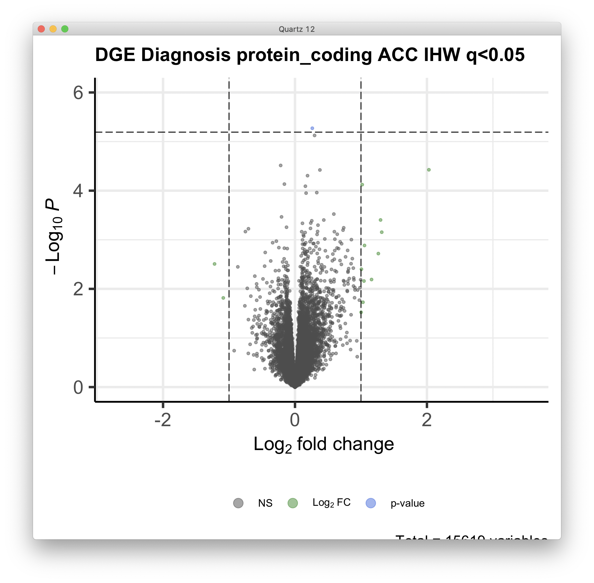
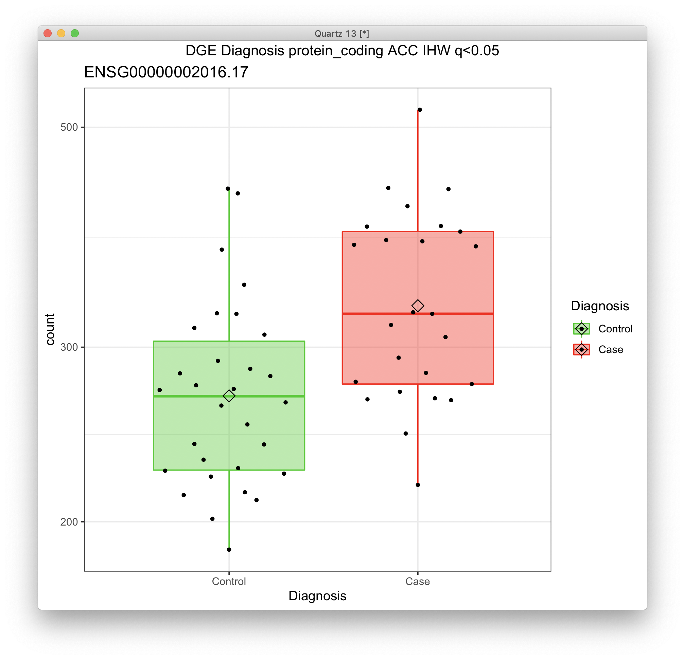

```
FDR q < 0.10

out of 15619 with nonzero total read count
adjusted p-value < 0.1
LFC > 0 (up)       : 2, 0.013%
LFC < 0 (down)     : 0, 0%
outliers [1]       : 0, 0%
low counts [2]     : 0, 0%
(mean count < 3)
[1] see 'cooksCutoff' argument of ?results
[2] see 'independentFiltering' argument of ?results

NULL
[1] "ENSG00000002016.17" "ENSG00000103995.14"
ENSG00000002016.17 
ENSG00000103995.14 
```

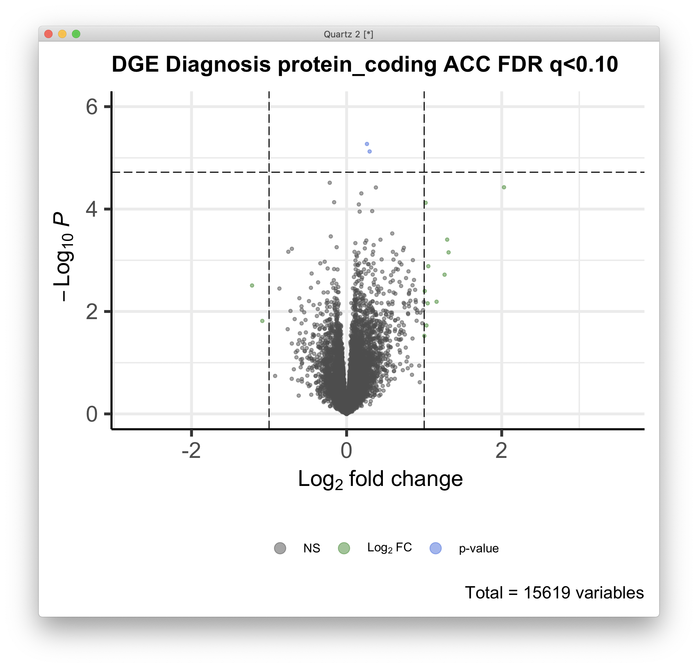
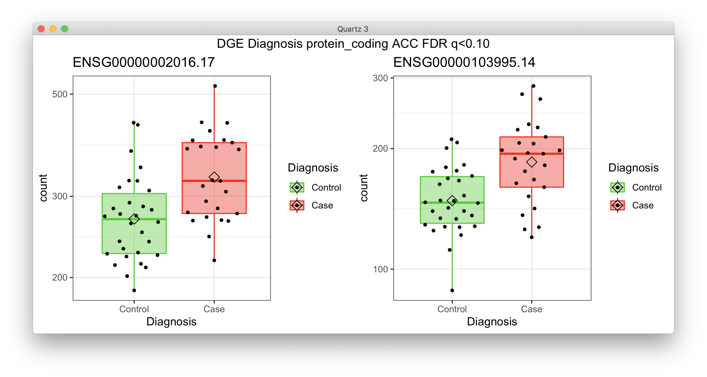

```
IHW q < 0.10

out of 15619 with nonzero total read count
adjusted p-value < 0.1
LFC > 0 (up)       : 7, 0.045%
LFC < 0 (down)     : 1, 0.0064%
outliers [1]       : 0, 0%
[1] see 'cooksCutoff' argument of ?results
see metadata(res)$ihwResult on hypothesis weighting

NULL
[1] "ENSG00000002016.17" "ENSG00000078401.7"  "ENSG00000090104.12" "ENSG00000103995.14"
[5] "ENSG00000124659.6"  "ENSG00000177084.16" "ENSG00000196584.3"  "ENSG00000258890.7" 
ENSG00000002016.17 
ENSG00000078401.7 
ENSG00000090104.12 
ENSG00000103995.14 
ENSG00000124659.6 
ENSG00000177084.16 
ENSG00000196584.3 
ENSG00000258890.7 
```

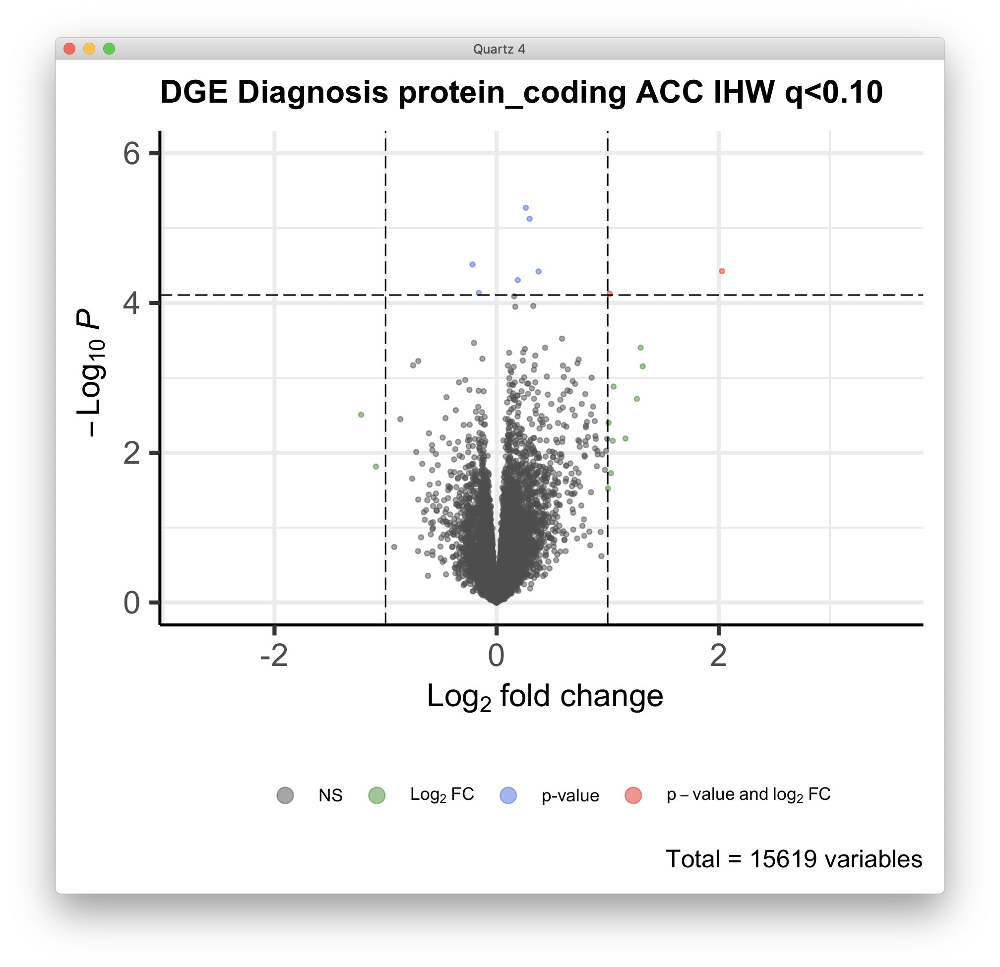
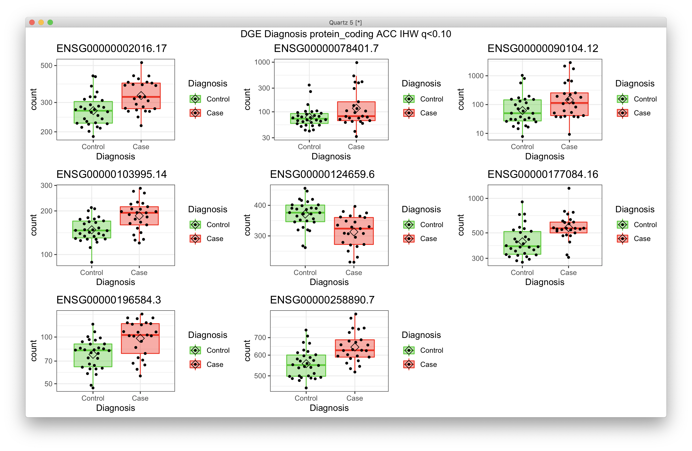

**ACC lncRNA**

Nothing at q < .05 or q < .1.

**ACC pseudogene**

Nothing at q < .05.

```
FDR q < 0.10

out of 2925 with nonzero total read count
adjusted p-value < 0.1
LFC > 0 (up)       : 4, 0.14%
LFC < 0 (down)     : 1, 0.034%
outliers [1]       : 0, 0%
low counts [2]     : 0, 0%
(mean count < 2)
[1] see 'cooksCutoff' argument of ?results
[2] see 'independentFiltering' argument of ?results

NULL
[1] "ENSG00000227725.3" "ENSG00000233121.1" "ENSG00000242294.6" "ENSG00000250483.1"
[5] "ENSG00000268100.1"
ENSG00000227725.3 : GCOM2 (GRINL1B), glutamate receptor
ENSG00000233121.1 : VN1R20P, Vomeronasal receptor
ENSG00000242294.6 : STAG3L5P (stromal antigen)
ENSG00000250483.1 : PPM1AP1, protein phosphatase
ENSG00000268100.1 : ZNF725P, Zinc finger protein
Only 1 bin; IHW reduces to Benjamini Hochberg (uniform weights)
```

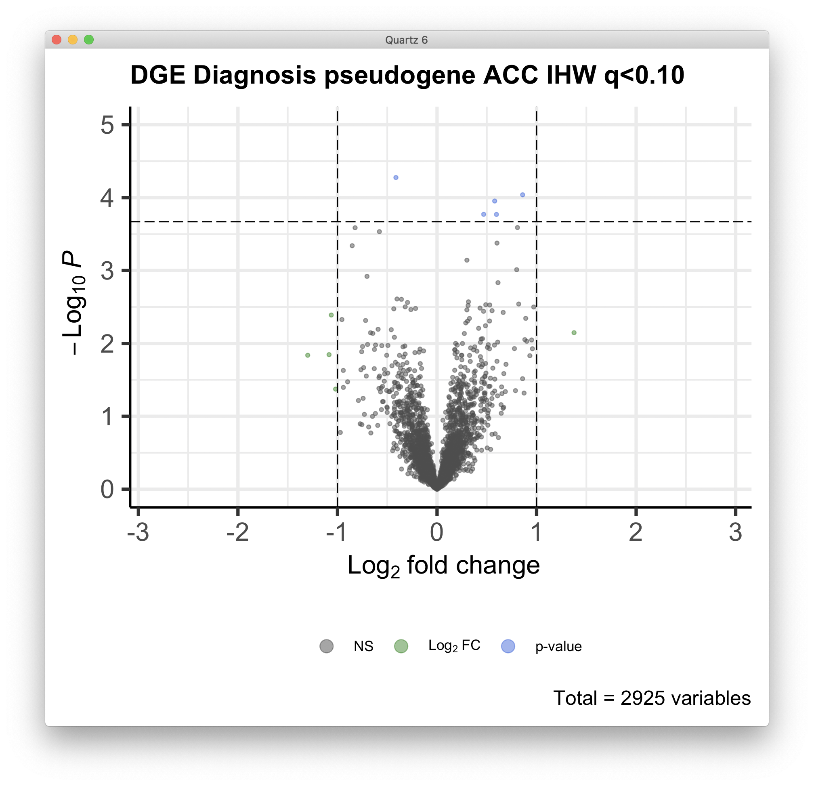
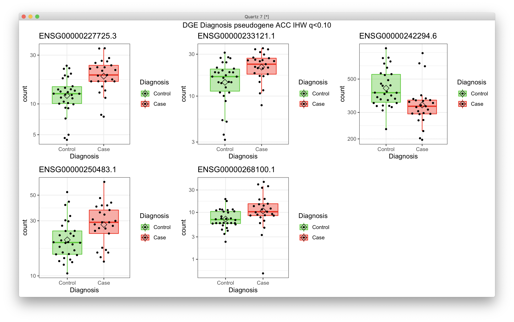

**Caudate Protein coding**

Nothing for q < .05 or q < .1.

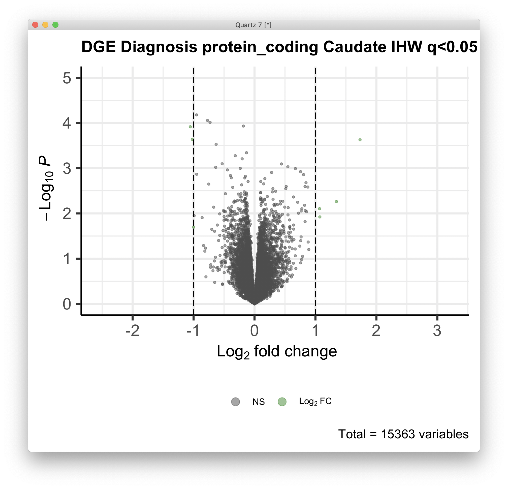

**Caudate lncRNA**

Nothing for q < .05 or q < .1.

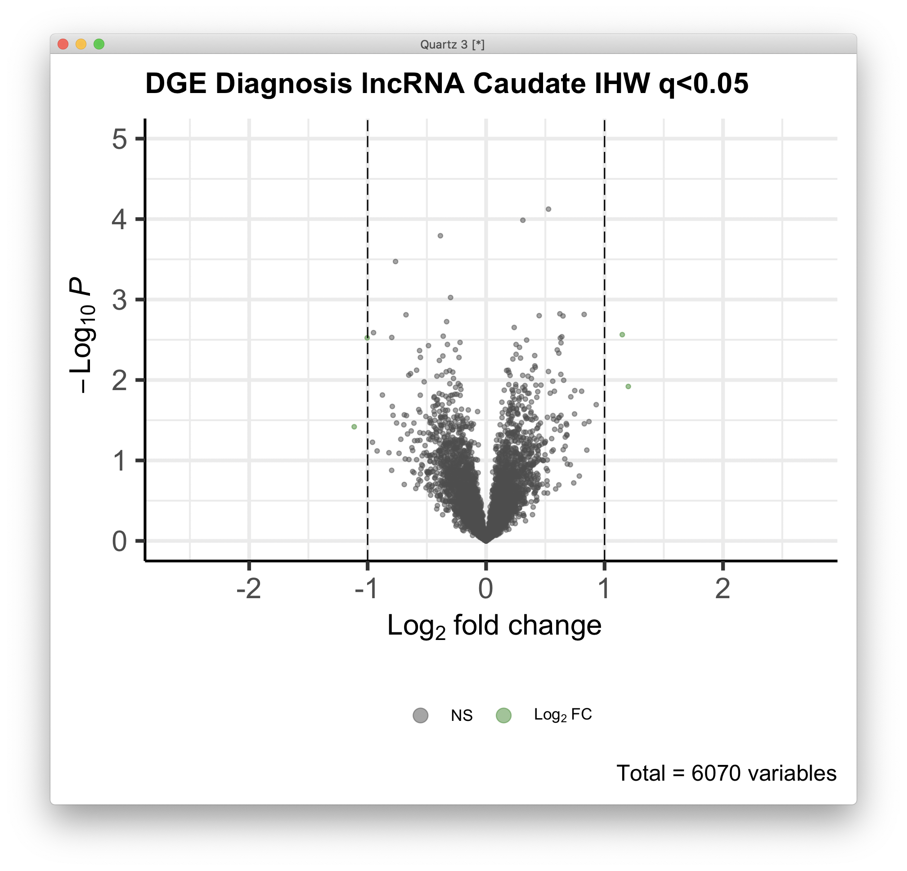

**Caudate pseudogene**

Nothing for q < .05 or q < .1.


# 2021-02-08 09:33:15

How do our results change if we remove the NVs that commited suicide?

```r
myregion = 'ACC'
data = readRDS('~/data/rnaseq_derek/complete_rawCountData_05132020.rds')
rownames(data) = data$submitted_name  # just to ensure compatibility later
# remove obvious outlier (that's NOT caudate) labeled as ACC
rm_me = rownames(data) %in% c('68080')
data = data[!rm_me, ]
data = data[data$Region==myregion, ]
library(gdata)
more = read.xls('~/data/post_mortem/POST_MORTEM_META_DATA_JAN_2021.xlsx')
more = more[!duplicated(more$hbcc_brain_id),]
data = merge(data, more[, c('hbcc_brain_id', 'comorbid_group_update',
                            'substance_group', 'evidence_level')],
             by='hbcc_brain_id', all.x=T, all.y=F)

# at this point we have 55 samples for ACC
grex_vars = colnames(data)[grepl(colnames(data), pattern='^ENS')]
count_matrix = t(data[, grex_vars])
data = data[, !grepl(colnames(data), pattern='^ENS')]
# data only contains sample metadata, and count_matrix has actual counts

# cleaning up some variables
data$POP_CODE = as.character(data$POP_CODE)
data[data$POP_CODE=='WNH', 'POP_CODE'] = 'W'
data[data$POP_CODE=='WH', 'POP_CODE'] = 'W'
data$POP_CODE = factor(data$POP_CODE)
data$Individual = factor(data$hbcc_brain_id)
data[data$Manner.of.Death=='Suicide (probable)', 'Manner.of.Death'] = 'Suicide'
data[data$Manner.of.Death=='unknown', 'Manner.of.Death'] = 'natural'
data$MoD = factor(data$Manner.of.Death)
data$batch = factor(as.numeric(data$run_date))
data$Diagnosis = factor(data$Diagnosis, levels=c('Control', 'Case'))
data$substance_group = factor(data$substance_group)
data$comorbid_group = factor(data$comorbid_group_update)
data$evidence_level = factor(data$evidence_level)
data$brainbank = factor(data$bainbank)

rm_me = data$Diagnosis == 'Control' & data$MoD == 'Suicide'
data = data[!rm_me, ]
count_matrix = count_matrix[, !rm_me]

# removing everything but autosomes
library(GenomicFeatures)
txdb <- loadDb('~/data/post_mortem/Homo_sapies.GRCh38.97.sqlite')
txdf <- select(txdb, keys(txdb, "GENEID"), columns=c('GENEID','TXCHROM'),
               "GENEID")
bt = read.csv('~/data/post_mortem/Homo_sapiens.GRCh38.97_biotypes.csv')
bt_slim = bt[, c('gene_id', 'gene_biotype')]
bt_slim = bt_slim[!duplicated(bt_slim),]
txdf = merge(txdf, bt_slim, by.x='GENEID', by.y='gene_id')
# store gene names in geneCounts without version in end of name
tx_meta = data.frame(GENEID = substr(rownames(count_matrix), 1, 15))
tx_meta = merge(tx_meta, txdf, by='GENEID', sort=F)
imautosome = which(tx_meta$TXCHROM != 'X' &
                   tx_meta$TXCHROM != 'Y' &
                   tx_meta$TXCHROM != 'MT')
count_matrix = count_matrix[imautosome, ]
tx_meta = tx_meta[imautosome, ]
```

```r
dge_acc = list()
st = 'protein_coding' # ...
dge_acc[[st]] = run_DGE(count_matrix, data, tx_meta, myregion, st, .05)

dge_cau = list()
st = 'protein_coding' # ...
dge_cau[[st]] = run_DGE(count_matrix, data, tx_meta, myregion, st, .05)
```

I also ran some as dge_*_q1 just for the pictures, and saved everything to ~/data/post_mortem/DGE_noSuicide_02082021.RData.

**ACC Protein coding**

Nothing for q < .05 or q < .1.

**ACC lncRNA**

```
FDR q < 0.05

out of 6594 with nonzero total read count
adjusted p-value < 0.05
LFC > 0 (up)       : 2, 0.03%
LFC < 0 (down)     : 0, 0%
outliers [1]       : 0, 0%
low counts [2]     : 0, 0%
(mean count < 2)
[1] see 'cooksCutoff' argument of ?results
[2] see 'independentFiltering' argument of ?results

NULL
[1] "ENSG00000240758.2" "ENSG00000285804.2"
ENSG00000240758.2 
ENSG00000285804.2 
IHW q < 0.05

out of 6594 with nonzero total read count
adjusted p-value < 0.05
LFC > 0 (up)       : 2, 0.03%
LFC < 0 (down)     : 0, 0%
outliers [1]       : 0, 0%
[1] see 'cooksCutoff' argument of ?results
see metadata(res)$ihwResult on hypothesis weighting

NULL
[1] "ENSG00000240758.2" "ENSG00000285804.2"
ENSG00000240758.2 
ENSG00000285804.2 
```


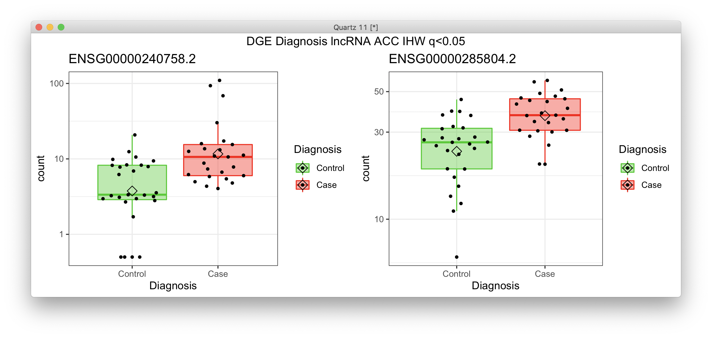

(same for q<.1)

**ACC pseudogene**

```
FDR q < 0.05

out of 2913 with nonzero total read count
adjusted p-value < 0.05
LFC > 0 (up)       : 0, 0%
LFC < 0 (down)     : 1, 0.034%
outliers [1]       : 0, 0%
low counts [2]     : 0, 0%
(mean count < 2)
[1] see 'cooksCutoff' argument of ?results
[2] see 'independentFiltering' argument of ?results

NULL
[1] "ENSG00000242294.6"
ENSG00000242294.6 
Only 1 bin; IHW reduces to Benjamini Hochberg (uniform weights)
IHW q < 0.05

out of 2913 with nonzero total read count
adjusted p-value < 0.05
LFC > 0 (up)       : 0, 0%
LFC < 0 (down)     : 1, 0.034%
outliers [1]       : 0, 0%
[1] see 'cooksCutoff' argument of ?results
see metadata(res)$ihwResult on hypothesis weighting

NULL
[1] "ENSG00000242294.6"
ENSG00000242294.6 
```

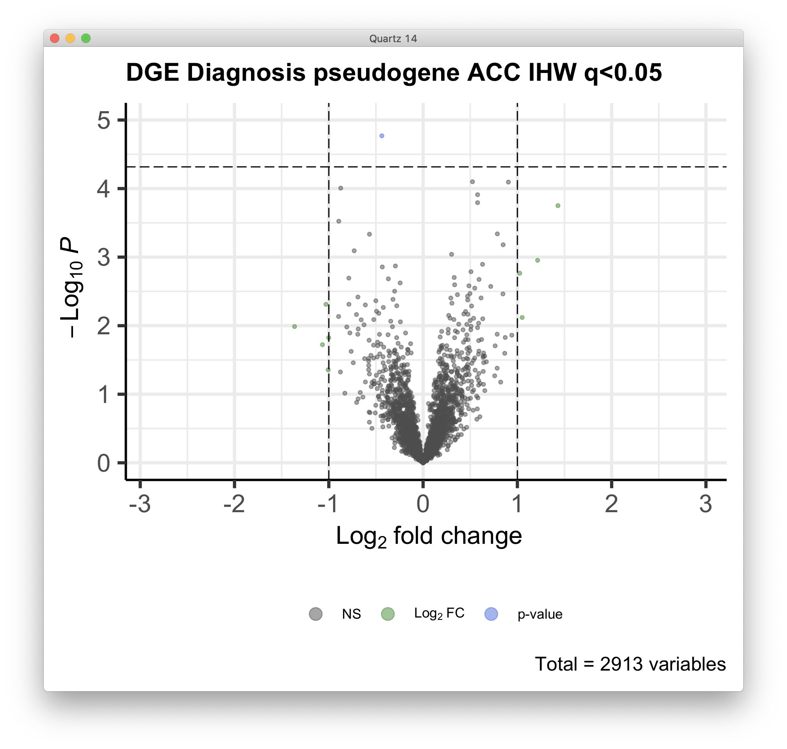
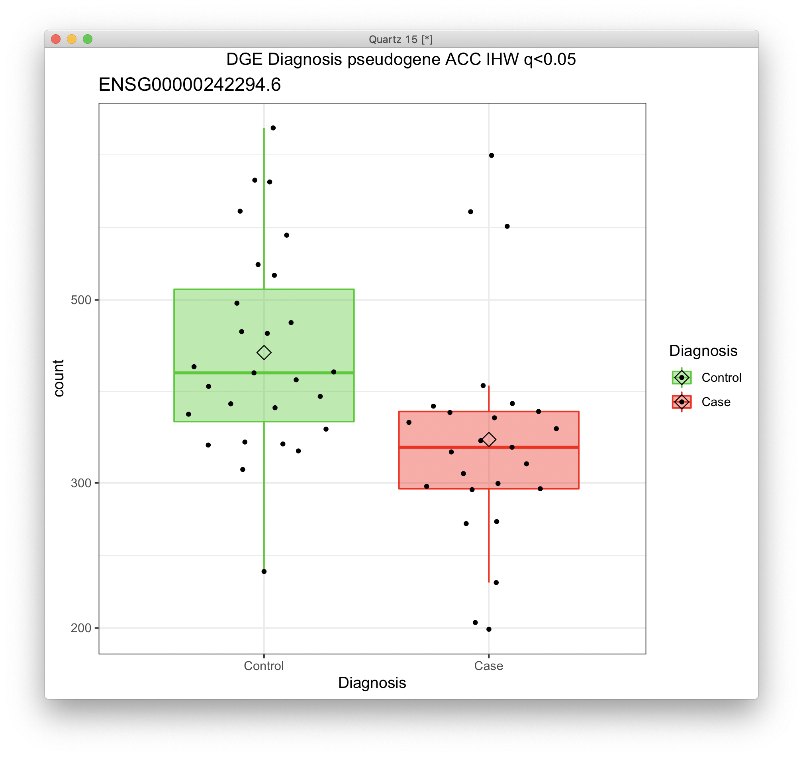

```
FDR q < 0.10

out of 2913 with nonzero total read count
adjusted p-value < 0.1
LFC > 0 (up)       : 5, 0.17%
LFC < 0 (down)     : 2, 0.069%
outliers [1]       : 0, 0%
low counts [2]     : 0, 0%
(mean count < 2)
[1] see 'cooksCutoff' argument of ?results
[2] see 'independentFiltering' argument of ?results

NULL
[1] "ENSG00000227725.3" "ENSG00000233121.1" "ENSG00000242294.6" "ENSG00000249176.1"
[5] "ENSG00000250483.1" "ENSG00000254866.2" "ENSG00000268100.1"
ENSG00000227725.3 
ENSG00000233121.1 
ENSG00000242294.6 
ENSG00000249176.1 
ENSG00000250483.1 
ENSG00000254866.2 
ENSG00000268100.1 
Only 1 bin; IHW reduces to Benjamini Hochberg (uniform weights)
IHW q < 0.10

out of 2913 with nonzero total read count
adjusted p-value < 0.1
LFC > 0 (up)       : 5, 0.17%
LFC < 0 (down)     : 2, 0.069%
outliers [1]       : 0, 0%
[1] see 'cooksCutoff' argument of ?results
see metadata(res)$ihwResult on hypothesis weighting

NULL
[1] "ENSG00000227725.3" "ENSG00000233121.1" "ENSG00000242294.6" "ENSG00000249176.1"
[5] "ENSG00000250483.1" "ENSG00000254866.2" "ENSG00000268100.1"
ENSG00000227725.3 
ENSG00000233121.1 
ENSG00000242294.6 
ENSG00000249176.1 
ENSG00000250483.1 
ENSG00000254866.2 
ENSG00000268100.1 
```

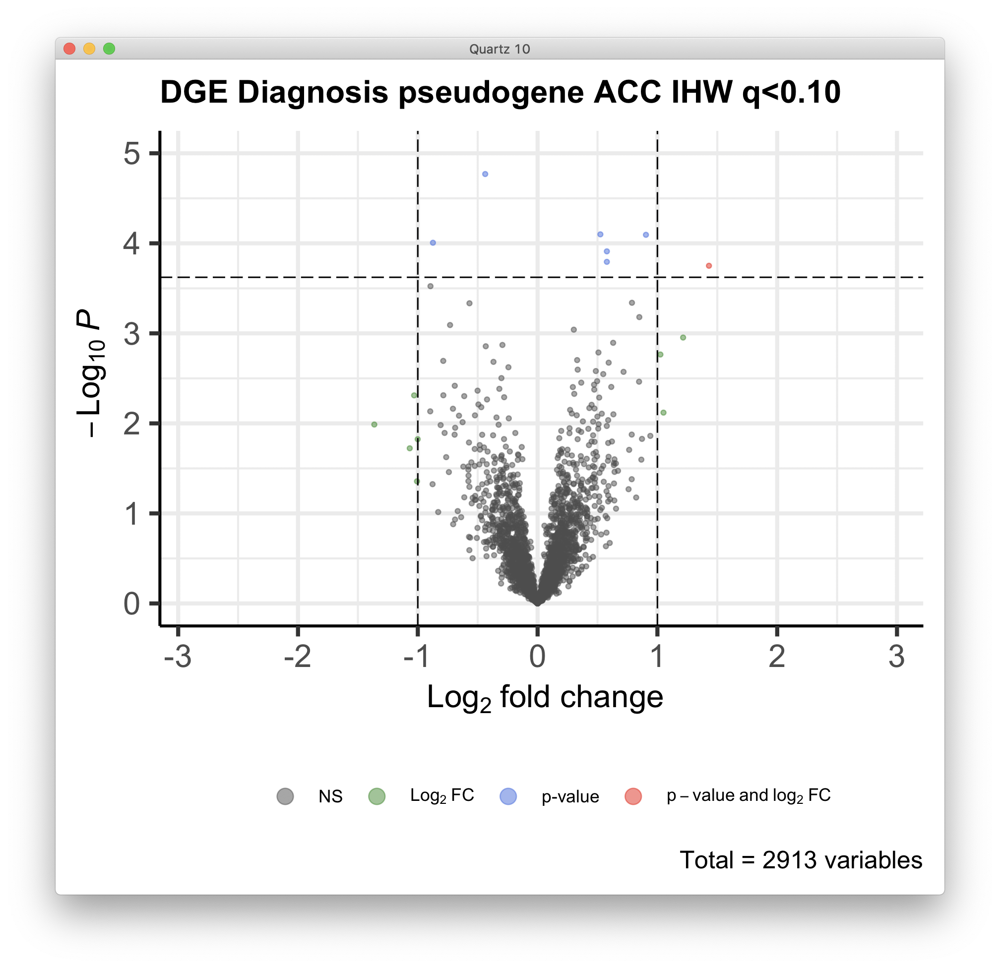
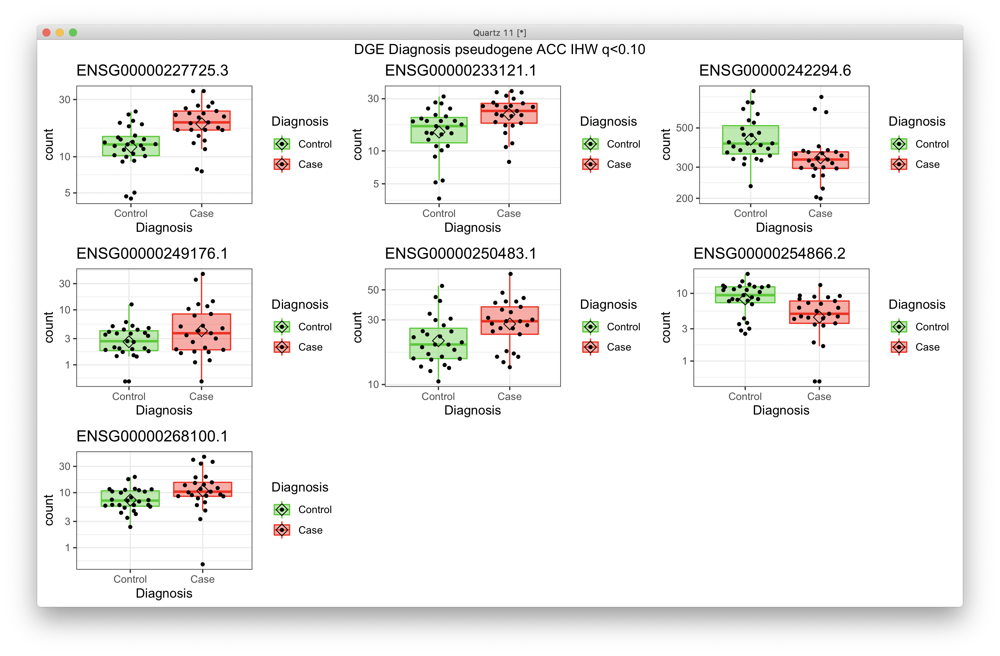

**Caudate Protein coding**

Nothing for q < .05 or q < .1.

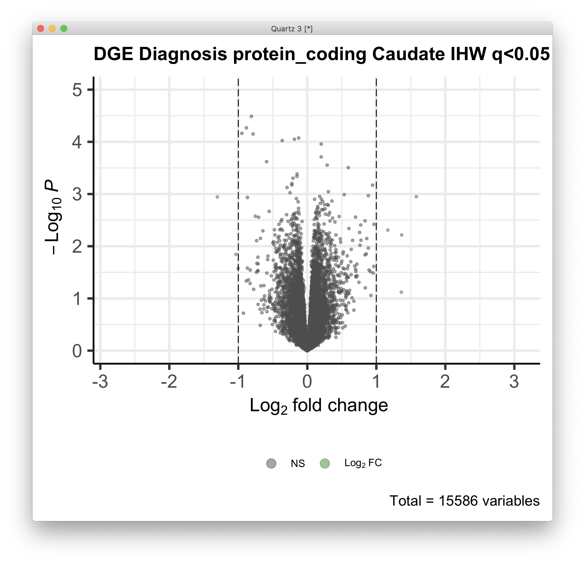

**Caudate lncRNA**

Nothing for q < .05 or q < .1.

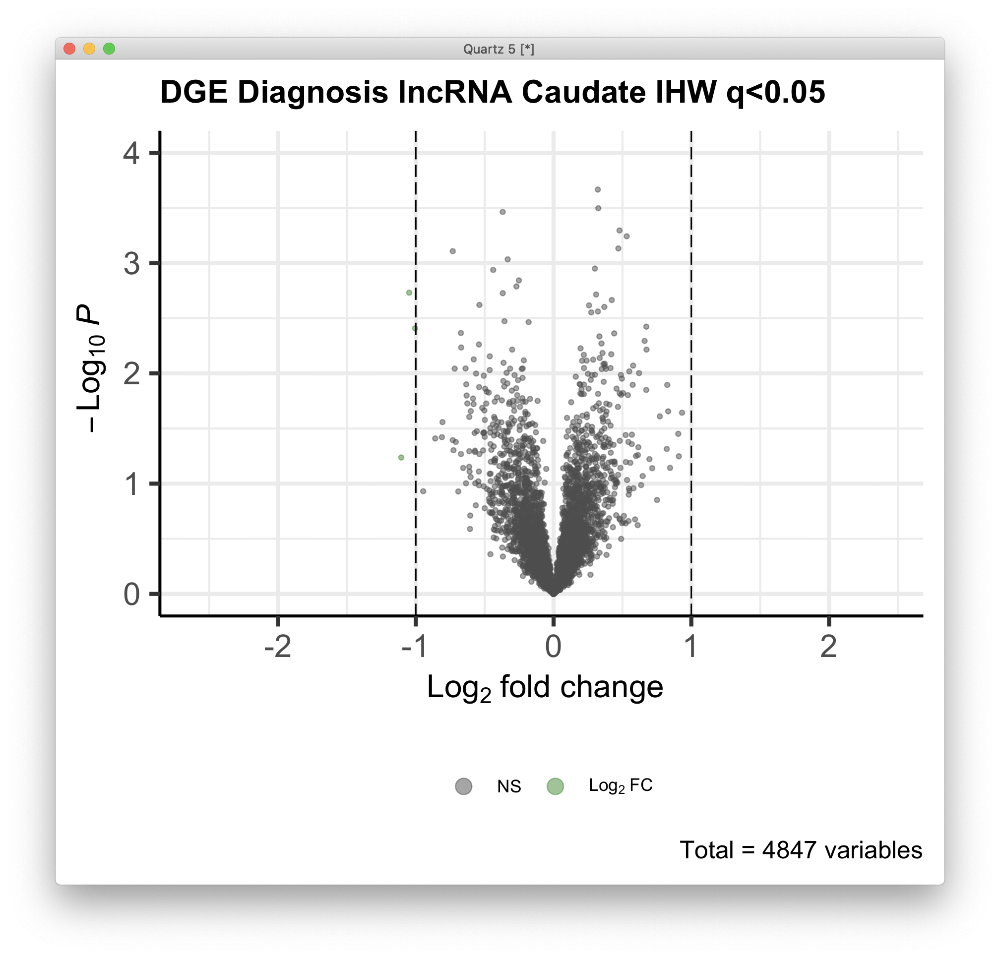

**Caudate pseudogene**

Nothing for q < .05 or q < .1.

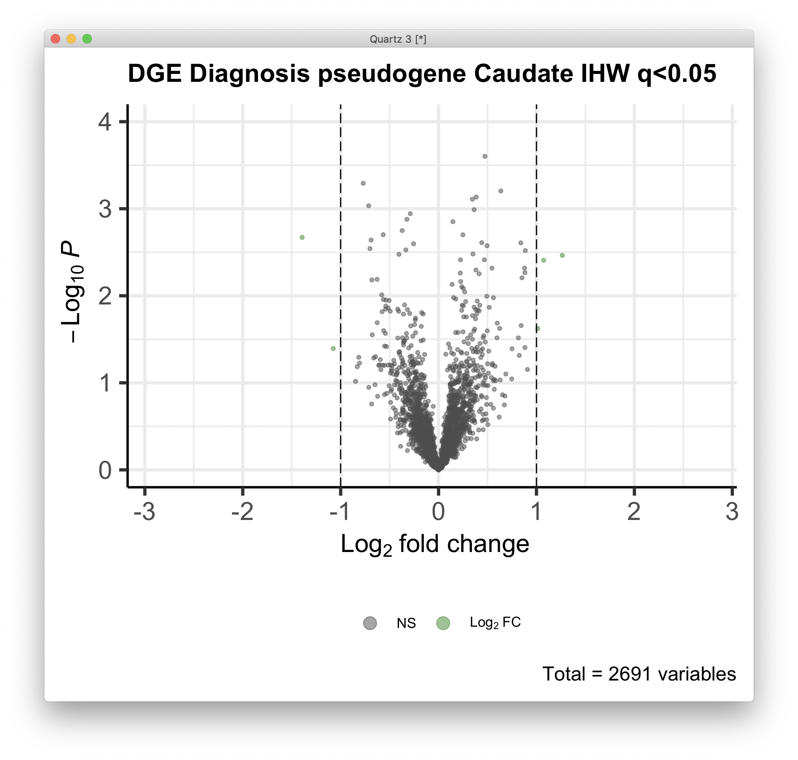

So, no major alterations in the result pattern. Let's see what's the rank
correlation between them, as a proxy for potential WG results changes:

```r
st = 'protein_coding'
load('~/data/post_mortem/DGE_noSuicide_02082021.RData.RData')
res = dge_cau[[st]][['res']]
ranks = data.frame(rank=sign(res$log2FoldChange) * -log(res$pvalue),
                   gene=rownames(res))
load('~/data/post_mortem/DGE_02082021.RData.RData')
res = dge_cau[[st]][['res']]
rank0 = data.frame(rank=sign(res$log2FoldChange) * -log(res$pvalue),
                   gene=rownames(res))
both_res = merge(ranks, rank0, by='gene', all.x=F, all.y=F)
print(cor.test(both_res$rank.x, both_res$rank.y))
```

Pearson correlation for ACC protein_coding is .97, and for Caudate is .93. We
should be fine here, and no need to remove the suicidal ones. Maybe just for robustness.

# TODO
