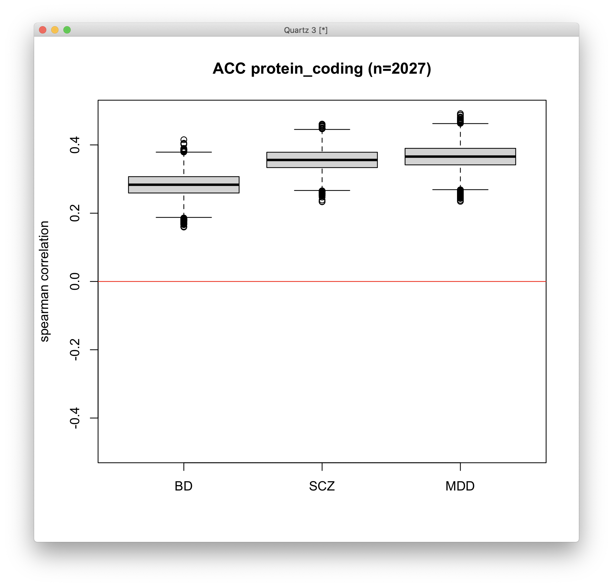
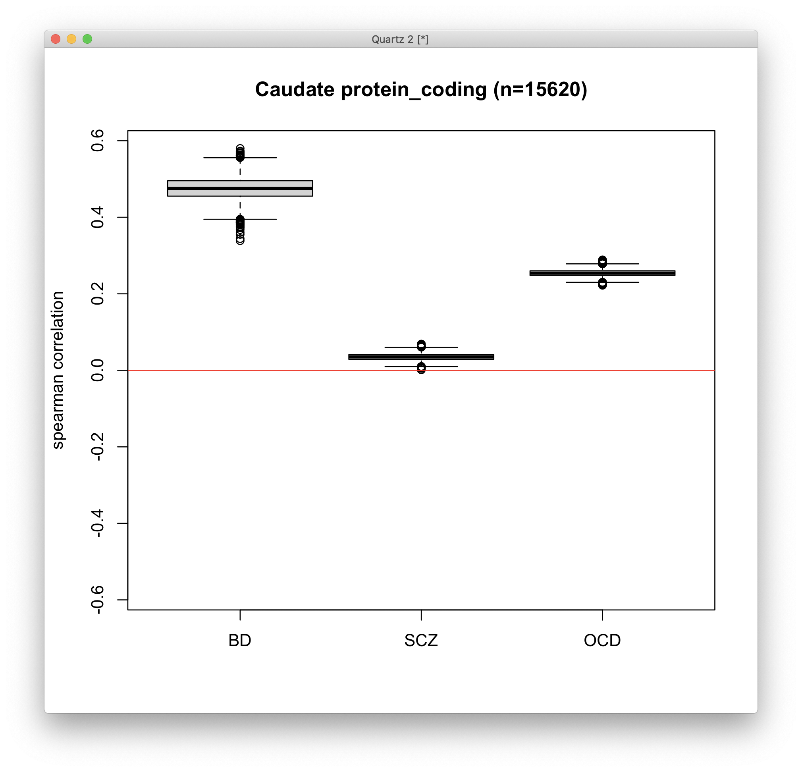

# 2021-02-09 13:54:33

First, let's reproduce the previous plotsw ehad using the meta-analysis for the
cortex, from note 184:

```r
do_boot_corrs = function(both_res, log2FC_col, method) {
    corrs = c()
    nperms = 10000
    set.seed(42)
    options(warn=-1)  # remove annoying spearman warnings
    for (p in 1:nperms) {
        idx = sample(nrow(both_res), replace = T)
        corrs = c(corrs, cor.test(both_res[idx, 'log2FoldChange'],
                                  both_res[idx, log2FC_col],
                                  method=method)$estimate)
    }
    return(corrs)
}

meta = readRDS('~/data/post_mortem/aad6469_Gandal_SM_Data-Table-S1_micro.rds')

st = 'protein_coding'
met = 'spearman'
load('~/data/post_mortem/DGE_02082021.RData')
dge = as.data.frame(dge_acc[[st]][['res']])
dge$ensembl_gene_id = substr(rownames(dge), 1, 15)
both_res = merge(dge, meta, by='ensembl_gene_id', all.x=F, all.y=F)

corrs = list()
disorders = c('ASD', 'SCZ', 'BD', 'MDD', 'AAD', 'IBD')
for (d in disorders) {
    cat(d, '\n')
    corrs[[d]] = do_boot_corrs(both_res, sprintf('%s.beta_log2FC', d), met)
}
mylim = max(abs(unlist(corrs)))
quartz()
boxplot(corrs, ylim=c(-mylim, mylim), ylab=sprintf('%s correlation', met),
        main=sprintf('ACC %s (n=%d)', st, nrow(both_res)))
abline(h=0, col='red')
# calculating p-value
for (d in disorders) {
    if (median(corrs[[d]]) > 0) {
        pval = sum(corrs[[d]] <= 0) / 10000
    } else {
        pval = sum(corrs[[d]] >= 0) / 10000
    }
    cat(d, 'pval = ', pval, '\n')
}
```


Now, let's do something similar, but now using the data from the ACC paper
Kwangmi sent: https://www.nature.com/articles/s41386-020-00949-5

```r
# read.xls was taking forever. Had to crop them into individual CSVs, from the 
# original ~/data/post_mortem/41386_2020_949_MOESM3_ESM.xlsx
library(gdata)
meta1 = read.csv('~/tmp/BD.csv')
meta2 = read.csv('~/tmp/SCZ.csv')
meta3 = read.csv('~/tmp/MDD.csv')
m = merge(meta1[, c('Ensemble.gene.ID', 'log2FoldChange')],
          meta2[, c('Ensemble.gene.ID', 'log2FoldChange')],
          by='Ensemble.gene.ID', all.x=T, all.y=T, suffix=c('.BD', '.SCZ'))
m = merge(m, meta3[, c('Ensemble.gene.ID', 'log2FoldChange')],
          by='Ensemble.gene.ID', all.x=T, all.y=T)
colnames(m)[ncol(m)] = 'log2FoldChange.MDD'
saveRDS(m, file='~/data/post_mortem/ACC_other_disorders.rds')
```

Now we try this again, now with the new data. Note that the new data only has
genes that are nominally significant at p < .05, so this might be harder:

```r
meta = readRDS('~/data/post_mortem/ACC_other_disorders.rds')

st = 'protein_coding'
met = 'spearman'
load('~/data/post_mortem/DGE_02082021.RData')
dge = as.data.frame(dge_acc[[st]][['res']])
dge$ensembl_gene_id = substr(rownames(dge), 1, 15)
both_res = merge(dge, meta, by.x='ensembl_gene_id', by.y='Ensemble.gene.ID',
                 all.x=F, all.y=F)

corrs = list()
disorders = c('BD', 'SCZ', 'MDD')
for (d in disorders) {
    cat(d, '\n')
    corrs[[d]] = do_boot_corrs(both_res, sprintf('log2FoldChange.%s', d), met)
}
mylim = max(abs(unlist(corrs)))
quartz()
boxplot(corrs, ylim=c(-mylim, mylim), ylab=sprintf('%s correlation', met),
        main=sprintf('ACC %s (n=%d)', st, nrow(both_res)))
abline(h=0, col='red')
# calculating p-value
for (d in disorders) {
    if (median(corrs[[d]]) > 0) {
        pval = sum(corrs[[d]] <= 0) / 10000
    } else {
        pval = sum(corrs[[d]] >= 0) / 10000
    }
    cat(d, 'pval = ', pval, '\n')
}
```



So, this looks good. Now we just need to find data for the Caudate.

# 2021-02-11 10:36:57

Paul found some more data for the caudate:

```
[Tuesday 6:27 PM] Sudre, Gustavo (NIH/NHGRI) [E]
    Paul, can you do some digging to see if we can find the data (hopefully log2FC) for these papers? Thanks! 
https://www.researchgate.net/publication/304567691_Transcriptome_sequencing_implicates_dorsal_striatum-specific_gene_network_immune_response_and_energy_metabolism_pathways_in_bipolar_disorder
https://www.biorxiv.org/content/10.1101/2020.07.23.216697v1.full.pdf

https://www.medrxiv.org/content/10.1101/2020.11.18.20230540v1.full.pdf
​[Yesterday 8:50 AM] Kundzicz, Paul (NIH/NIMH) [F]
    Will do. Thanks!
​[Yesterday 1:28 PM] Kundzicz, Paul (NIH/NIMH) [F]
    Sudre, Gustavo (NIH/NHGRI) [E] It looks like there is some useful data from the papers:


	
The R Pacifico and RL Davis 2017 paper lists their differential expression data in Table 1 of their article, and contains more detailed data in Supplementary Tables 3 and 4.
	The Piantadosi S.C. et al. (2020) paper has log2FC data in Supplementary Table 2.
	The Benjamin K., J.M. et al. (2020) paper has log2FC data in Supplementary Table 4.

I've downloaded the papers and the tables of interest to us to smb://ketu.nhgri.nih.gov/Labs/Shaw/Paul/for_gustavo/gene_expression_caudatevsacc_casevsctrl_data. The tables of interest are the .csv files in each paper's folder. The Pacifico/Davis tables are labeled in the spreadsheets themselves.
<https://teams.microsoft.com/l/message/19:674c9bf42bcc49d497dc3d203f7b6036@thread.skype/1612913273779?tenantId=14b77578-9773-42d5-8507-251ca2dc2b06&amp;groupId=a5feae83-fb2a-4032-86db-30d0981c5703&amp;parentMessageId=1612819614290&amp;teamName=NHGRI NCR (O365)&amp;channelName=Genomics&amp;createdTime=1612913273779>
```

Now it's just a matter of comparing it to our caudate results, which I
summarized in ~/data/post_mortem/caudate_others.xlsx.

```r
load('~/data/post_mortem/DGE_02082021.RData')

st = 'protein_coding'
met = 'spearman'
dge = as.data.frame(dge_acc[[st]][['res']])
dge$ensembl_gene_id = substr(rownames(dge), 1, 15)
mart = readRDS('~/data/rnaseq_derek/mart_rnaseq.rds')
dge = merge(dge, mart, by='ensembl_gene_id', all.x=T, all.y=F)

library(gdata)
meta = read.xls('~/data/post_mortem/caudate_others.xlsx', 'SCZ')
meta$gencodeID = substr(meta$gencodeID, 1, 15)
both_res = merge(dge, meta, by.x='ensembl_gene_id', by.y='gencodeID',
                 all.x=T, all.y=F)
colnames(both_res)[ncol(both_res)] = 'log2FC.SCZ'
meta = read.xls('~/data/post_mortem/caudate_others.xlsx', 'BD')
both_res = merge(both_res, meta, by.x='ensembl_gene_id', by.y='gencodeID',
                 all.x=T, all.y=F)
colnames(both_res)[ncol(both_res)] = 'log2FC.BD'
meta = read.xls('~/data/post_mortem/caudate_others.xlsx', 'OCD')
both_res = merge(both_res, meta, by='hgnc_symbol', all.x=T, all.y=F)
colnames(both_res)[ncol(both_res)] = 'log2FC.OCD'


corrs = list()
disorders = c('BD', 'SCZ', 'OCD')
for (d in disorders) {
    cat(d, '\n')
    corrs[[d]] = do_boot_corrs(both_res, sprintf('log2FC.%s', d), met)
}
mylim = max(abs(unlist(corrs)))
quartz()
boxplot(corrs, ylim=c(-mylim, mylim), ylab=sprintf('%s correlation', met),
        main=sprintf('Caudate %s (n=%d)', st, nrow(both_res)))
abline(h=0, col='red')
# calculating p-value
for (d in disorders) {
    if (median(corrs[[d]]) > 0) {
        pval = sum(corrs[[d]] <= 0) / 10000
    } else {
        pval = sum(corrs[[d]] >= 0) / 10000
    }
    cat(d, 'pval = ', pval, '\n')
}
```



Let's also re-run the previous analysis using the meta-analysis data just for
comparison:

```r
meta = readRDS('~/data/post_mortem/aad6469_Gandal_SM_Data-Table-S1_micro.rds')

st = 'protein_coding'
met = 'spearman'
load('~/data/post_mortem/DGE_02082021.RData')
dge = as.data.frame(dge_cau[[st]][['res']])
dge$ensembl_gene_id = substr(rownames(dge), 1, 15)
both_res = merge(dge, meta, by='ensembl_gene_id', all.x=F, all.y=F)

corrs = list()
disorders = c('ASD', 'SCZ', 'BD', 'MDD', 'AAD', 'IBD')
for (d in disorders) {
    cat(d, '\n')
    corrs[[d]] = do_boot_corrs(both_res, sprintf('%s.beta_log2FC', d), met)
}
mylim = max(abs(unlist(corrs)))
quartz()
boxplot(corrs, ylim=c(-mylim, mylim), ylab=sprintf('%s correlation', met),
        main=sprintf('Caudate %s (n=%d)', st, nrow(both_res)))
abline(h=0, col='red')
# calculating p-value
for (d in disorders) {
    if (median(corrs[[d]]) > 0) {
        pval = sum(corrs[[d]] <= 0) / 10000
    } else {
        pval = sum(corrs[[d]] >= 0) / 10000
    }
    cat(d, 'pval = ', pval, '\n')
}
```


# 2021-02-23 13:53:42

Philip sent a couple papers with ASD data I should try:

https://www.nature.com/articles/nature20612#Sec13

https://www.nature.com/articles/tp201787#Sec14

They're both frontal cortex or DLPFC, but it's still worth trying.

```r
load('~/data/post_mortem/DGE_02082021.RData')

st = 'protein_coding'
met = 'spearman'
dge = as.data.frame(dge_acc[[st]][['res']])
dge$ensembl_gene_id = substr(rownames(dge), 1, 15)

library(gdata)
meta = read.xls('~/data/post_mortem/ASD_only.xlsx', 'Wright')
both_res = merge(dge, meta, by='ensembl_gene_id', all.x=T, all.y=F)
colnames(both_res)[11] = 'log2FC.ASD_Wright'
meta = read.xls('~/data/post_mortem/ASD_only.xlsx', 'Neelroop')
both_res = merge(both_res, meta, by.x='ensembl_gene_id', by.y='ENSEMBL.ID',
                 all.x=T, all.y=F)
colnames(both_res)[17] = 'log2FC.ASD_Neelroop'

corrs = list()
disorders = c('Wright', 'Neelroop')
for (d in disorders) {
    cat(d, '\n')
    corrs[[d]] = do_boot_corrs(both_res, sprintf('log2FC.ASD_%s', d), met)
}
mylim = max(abs(unlist(corrs)))
quartz()
boxplot(corrs, ylim=c(-mylim, mylim), ylab=sprintf('%s correlation', met),
        main=sprintf('ACC %s (n=%d)', st, nrow(both_res)))
abline(h=0, col='red')
# calculating p-value
for (d in disorders) {
    if (median(corrs[[d]]) > 0) {
        pval = sum(corrs[[d]] <= 0) / 10000
    } else {
        pval = sum(corrs[[d]] >= 0) / 10000
    }
    cat(d, 'pval = ', pval, '\n')
}
```

Wright pval =  0 
Neelroop pval =  0 


Both highly significant. The Neelroop paper has more subjects, it's in Nature,
and has frontal and temporal cortex in it. 

# 2021-03-17 20:36:17

Let's create a big matrix we can use to make all boxplots at once.

```r
do_boot_corrs = function(both_res, log2FC_col, method) {
    corrs = c()
    nperms = 10000
    set.seed(42)
    options(warn=-1)  # remove annoying spearman warnings
    for (p in 1:nperms) {
        idx = sample(nrow(both_res), replace = T)
        corrs = c(corrs, cor.test(both_res[idx, 'log2FoldChange'],
                                  both_res[idx, log2FC_col],
                                  method=method)$estimate)
    }
    return(corrs)
}

meta = readRDS('~/data/post_mortem/aad6469_Gandal_SM_Data-Table-S1_micro.rds')

st = 'protein_coding'
met = 'spearman'
load('~/data/post_mortem/DGE_03022021.RData')
dge = as.data.frame(dge_acc[[st]][['res']])
dge$ensembl_gene_id = substr(rownames(dge), 1, 15)
both_res = merge(dge, meta, by='ensembl_gene_id', all.x=F, all.y=F)

corrs = list()
disorders = c('ASD', 'SCZ', 'BD', 'MDD', 'AAD', 'IBD')
for (d in disorders) {
    cat(d, '\n')
    corrs[[d]] = do_boot_corrs(both_res, sprintf('%s.beta_log2FC', d), met)
}
all_corrs = c()
for (d in disorders) {
    cat(d, '\n')
    junk = data.frame(corr=corrs[[d]])
    junk$region = 'ACC'
    junk$disorder = d
    junk$gene_overlap = nrow(both_res)
    junk$source = 'Gandal_micro'
    all_corrs = rbind(all_corrs, junk)
}

dge = as.data.frame(dge_cau[[st]][['res']])
dge$ensembl_gene_id = substr(rownames(dge), 1, 15)
both_res = merge(dge, meta, by='ensembl_gene_id', all.x=F, all.y=F)
corrs = list()
disorders = c('ASD', 'SCZ', 'BD', 'MDD', 'AAD', 'IBD')
for (d in disorders) {
    cat(d, '\n')
    corrs[[d]] = do_boot_corrs(both_res, sprintf('%s.beta_log2FC', d), met)
}
for (d in disorders) {
    junk = data.frame(corr=corrs[[d]])
    junk$region = 'Caudate'
    junk$disorder = d
    junk$gene_overlap = nrow(both_res)
    junk$source = 'Gandal_micro'
    all_corrs = rbind(all_corrs, junk)
}

saveRDS(all_corrs, file='~/tmp/all_corrs.rds')

library(gdata)
meta = read.xls('~/data/post_mortem/aad6469_Gandal_SM_Data-Table-S1.xlsx',
                'RNAseq SCZ&BD MetaAnalysis DGE')
dge = as.data.frame(dge_acc[[st]][['res']])
dge$ensembl_gene_id = substr(rownames(dge), 1, 15)
both_res = merge(dge, meta, by.x='ensembl_gene_id', by.y='X', all.x=F, all.y=F)
corrs = list()
disorders = c('SCZ', 'BD')
for (d in disorders) {
    cat(d, '\n')
    corrs[[d]] = do_boot_corrs(both_res, sprintf('%s.logFC', d), met)
}
for (d in disorders) {
    junk = data.frame(corr=corrs[[d]])
    junk$region = 'ACC'
    junk$disorder = d
    junk$gene_overlap = nrow(both_res)
    junk$source = 'Gandal_RNAseq'
    all_corrs = rbind(all_corrs, junk)
}

dge = as.data.frame(dge_cau[[st]][['res']])
dge$ensembl_gene_id = substr(rownames(dge), 1, 15)
both_res = merge(dge, meta, by.x='ensembl_gene_id', by.y='X', all.x=F, all.y=F)
corrs = list()
disorders = c('SCZ', 'BD')
for (d in disorders) {
    cat(d, '\n')
    corrs[[d]] = do_boot_corrs(both_res, sprintf('%s.logFC', d), met)
}
for (d in disorders) {
    junk = data.frame(corr=corrs[[d]])
    junk$region = 'Caudate'
    junk$disorder = d
    junk$gene_overlap = nrow(both_res)
    junk$source = 'Gandal_RNAseq'
    all_corrs = rbind(all_corrs, junk)
}

meta = read.xls('~/data/post_mortem/aad6469_Gandal_SM_Data-Table-S1.xlsx',
                'RNAseq ASD-pancortical DGE')
dge = as.data.frame(dge_acc[[st]][['res']])
dge$ensembl_gene_id = substr(rownames(dge), 1, 15)
both_res = merge(dge, meta, by.x='ensembl_gene_id', by.y='X', all.x=F, all.y=F)
corrs = list()
d = 'ASD'
junk = data.frame(corr=do_boot_corrs(both_res, 'Frontal.logFC', met))
junk$region = 'ACC'
junk$disorder = d
junk$gene_overlap = nrow(both_res)
junk$source = 'Gandal_RNAseq'
all_corrs = rbind(all_corrs, junk)

dge = as.data.frame(dge_cau[[st]][['res']])
dge$ensembl_gene_id = substr(rownames(dge), 1, 15)
both_res = merge(dge, meta, by.x='ensembl_gene_id', by.y='X', all.x=F, all.y=F)
corrs = list()
d = 'ASD'
junk = data.frame(corr=do_boot_corrs(both_res, 'Frontal.logFC', met))
junk$region = 'Caudate'
junk$disorder = d
junk$gene_overlap = nrow(both_res)
junk$source = 'Gandal_RNAseq'
all_corrs = rbind(all_corrs, junk)

# moving on to other papers: Akula
meta = readRDS('~/data/post_mortem/ACC_other_disorders.rds')
dge = as.data.frame(dge_acc[[st]][['res']])
dge$ensembl_gene_id = substr(rownames(dge), 1, 15)
both_res = merge(dge, meta, by.x='ensembl_gene_id', by.y='Ensemble.gene.ID',
                 all.x=F, all.y=F)
corrs = list()
disorders = c('BD', 'SCZ', 'MDD')
for (d in disorders) {
    cat(d, '\n')
    corrs[[d]] = do_boot_corrs(both_res, sprintf('log2FoldChange.%s', d), met)
}
for (d in disorders) {
    junk = data.frame(corr=corrs[[d]])
    junk$region = 'ACC'
    junk$disorder = d
    junk$gene_overlap = nrow(both_res)
    junk$source = 'Akula'
    all_corrs = rbind(all_corrs, junk)
}

dge = as.data.frame(dge_cau[[st]][['res']])
dge$ensembl_gene_id = substr(rownames(dge), 1, 15)
mart = readRDS('~/data/rnaseq_derek/mart_rnaseq.rds')
d = 'SCZ'
dge = merge(dge, mart, by='ensembl_gene_id', all.x=T, all.y=F)
meta = read.xls('~/data/post_mortem/caudate_others.xlsx', d)
meta$gencodeID = substr(meta$gencodeID, 1, 15)
both_res = merge(dge, meta, by.x='ensembl_gene_id', by.y='gencodeID',
                 all.x=T, all.y=F)
colnames(both_res)[ncol(both_res)] = 'log2FC.SCZ'
junk = data.frame(corr=do_boot_corrs(both_res, sprintf('log2FC.%s', d), met))
junk$region = 'Caudate'
junk$disorder = d
junk$gene_overlap = nrow(both_res)
junk$source = 'Benjamin'
all_corrs = rbind(all_corrs, junk)

d = 'BD'
meta = read.xls('~/data/post_mortem/caudate_others.xlsx', d)
both_res = merge(dge, meta, by.x='ensembl_gene_id', by.y='gencodeID',
                 all.x=T, all.y=F)
colnames(both_res)[ncol(both_res)] = 'log2FC.BD'
junk = data.frame(corr=do_boot_corrs(both_res, sprintf('log2FC.%s', d), met))
junk$region = 'Caudate'
junk$disorder = d
junk$gene_overlap = nrow(both_res)
junk$source = 'Pacifico'
all_corrs = rbind(all_corrs, junk)

d = 'OCD'
meta = read.xls('~/data/post_mortem/caudate_others.xlsx', d)
both_res = merge(dge, meta, by='hgnc_symbol', all.x=T, all.y=F)
colnames(both_res)[ncol(both_res)] = 'log2FC.OCD'
junk = data.frame(corr=do_boot_corrs(both_res, sprintf('log2FC.%s', d), met))
junk$region = 'Caudate'
junk$disorder = d
junk$gene_overlap = nrow(both_res)
junk$source = 'Piantadosi'
all_corrs = rbind(all_corrs, junk)

# last 2 ASD papers
dge = as.data.frame(dge_acc[[st]][['res']])
dge$ensembl_gene_id = substr(rownames(dge), 1, 15)
meta = read.xls('~/data/post_mortem/ASD_only.xlsx', 'Wright')
both_res = merge(dge, meta, by='ensembl_gene_id', all.x=T, all.y=F)
d = 'ASD'
junk = data.frame(corr=do_boot_corrs(both_res, 'log2FC', met))
junk$region = 'ACC'
junk$disorder = d
junk$gene_overlap = nrow(both_res)
junk$source = 'Wright_DLPFC'
all_corrs = rbind(all_corrs, junk)

meta = read.xls('~/data/post_mortem/ASD_only.xlsx', 'Neelroop')
both_res = merge(dge, meta, by.x='ensembl_gene_id', by.y='ENSEMBL.ID',
                 all.x=T, all.y=F)
junk = data.frame(corr=do_boot_corrs(both_res, 'log2FoldChange', met))
junk$region = 'ACC'
junk$disorder = d
junk$gene_overlap = nrow(both_res)
junk$source = 'Neelroop_FrontalTemporal'
all_corrs = rbind(all_corrs, junk)

saveRDS(all_corrs, file='~/data/post_mortem/all_corrs.rds')
```