# 2021-02-11 12:23:27

Let's revisit the methylation analysis, much similar to what we are doing now
for DGE and DTE.

Instead of redoing what I did in note 142, let me give this a try:

https://www.bioconductor.org/packages/release/workflows/vignettes/methylationArrayAnalysis/inst/doc/methylationArrayAnalysis.html

The previous results weren't great to begin with, so we don't have much to lose
here. I can always go back to what we had before.

```r
library(IlluminaHumanMethylation450kanno.ilmn12.hg19)
ann450k <- getAnnotation(IlluminaHumanMethylation450kanno.ilmn12.hg19)
data_dir = '~/data/methylation_post_mortem/Shaw_METH01_Methyltn450/'
targets1 <- read.metharray.sheet(data_dir,
                                 pattern="Shaw_METH01_Methyltn450_ss.csv")
data_dir = '~/data/methylation_post_mortem/Shaw_METH02_Methyltn450/'
targets2 <- read.metharray.sheet(data_dir,
                                 pattern="Shaw_METH02_Methyltn450_ss.csv")
targets = rbind(targets1, targets2)
rgSet <- read.metharray.exp(targets=targets)
sampleNames(rgSet) <- targets$Sample_Name
save(rgSet, file='~/data/methylation_post_mortem/raw_02112021.RData')
```

Like the transcriptome analysis, let's go ahead and split the samples between
caudate and ACC before we do anything else.

Yun-Ching suggested this pipeline to be used:

https://www.bioconductor.org/packages/release/bioc/vignettes/ChAMP/inst/doc/ChAMP.html

and he removed cross-reactive probes using this package:
https://github.com/markgene/maxprobes

# 2021-02-12 10:12:09

We might need to make some departures on the usual pipeline used for DGE/DTE if
we are going to go with the usual chAMP pipeline. I'm fine with that, as it's
still based on the PCA method. 

```r
library(ChAMP)
myLoad1 <- champ.load('~/data/methylation_post_mortem/Shaw_METH01_Methyltn450/')
myLoad2 <- champ.load('~/data/methylation_post_mortem/Shaw_METH02_Methyltn450/')
```

# 2021-02-16 11:22:34

I just made a mock array with the directories to be able to load everything
together, since I couldn't really tell whether the filtering was dependent on
the samples being loaded. In any case, let's also split it into acc and
cau_METH.

```r
library(ChAMP)
myLoad <- champ.load('~/data/methylation_post_mortem/acc_Meth/')
```

I'm getting too mnay errors, both using import and load. Let's import everything
just using minfi, but then use champ from then on:

```r
library(IlluminaHumanMethylation450kanno.ilmn12.hg19)
ann450k <- getAnnotation(IlluminaHumanMethylation450kanno.ilmn12.hg19)
data_dir = '~/data/methylation_post_mortem/Shaw_2019_MethEPIC01/'
targets1 <- read.metharray.sheet(data_dir,
                                 pattern="Shaw_2019_MethEPIC01_ss.csv")
data_dir = '~/data/methylation_post_mortem/Shaw_2019_MethEPIC02/'
targets2 <- read.metharray.sheet(data_dir,
                                 pattern="Shaw_2019_MethEPIC02_ss.csv")
data_dir = '~/data/methylation_post_mortem/Shaw_2019_MethEPIC03/'
targets3 <- read.metharray.sheet(data_dir,
                                 pattern="Shaw_2019_MethEPIC03_ss.csv")
# Alex has already checked the QC samples, so let's just separate the ones
# we need 
targets = rbind(targets1, targets2, targets3)
targets = targets[grepl(x=targets$Sample_Name, pattern='ACC$'), ]
# need extended for beadcount function
rgSet <- read.metharray.exp(targets=targets, extended=T)
sampleNames(rgSet) <- targets$Sample_Name
save(rgSet, targets,
     file='~/data/methylation_post_mortem/raw_ACC_02162021.RData')
```

Now let's try some filtering with champ:

```r
library(wateRmelon)  # for beadcount
bc = beadcount(rgSet)
dp = detectionP(rgSet)
betas = getBeta(rgSet)
colnames(bc) = colnames(betas)
rownames(bc) = rownames(betas)
myLoad = champ.filter(beta=betas,
                      pd=pData(rgSet),
                      detP=dp, beadcount=bc)
champ.QC()
```

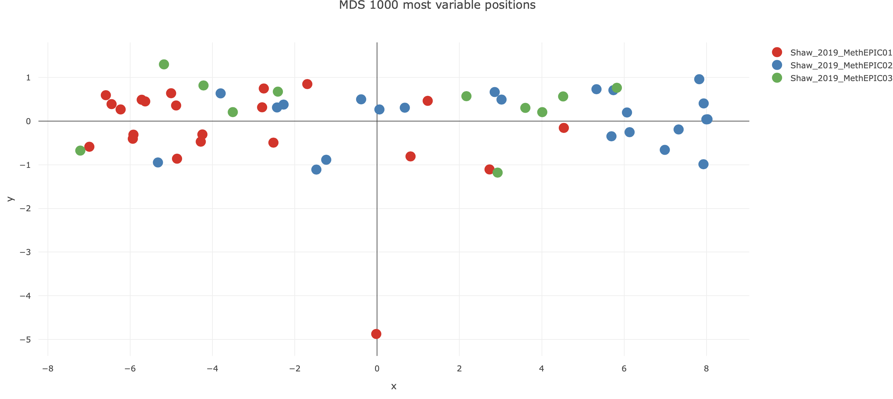

The one outlier is 1908_ACC, which I already knew based on the Failed CpG
Fraction to have 7-10x higher values than the other samples. Worth removing it.
It also doesn't look like the batch effect for the 3 different arrays is
affecting it much. In any case, it's worth adding it as a potential covariate.

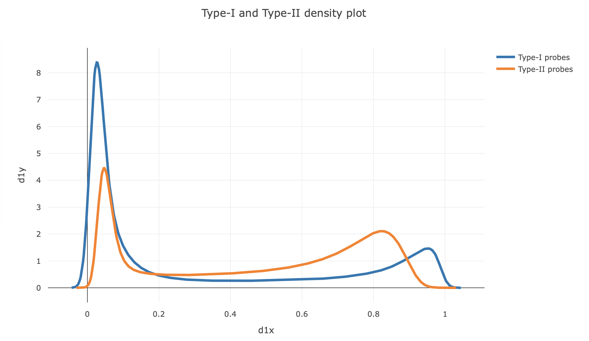

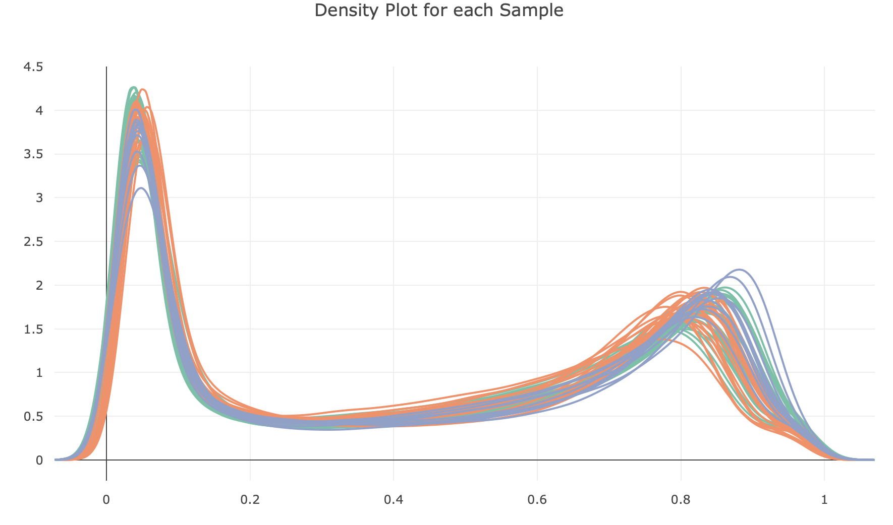

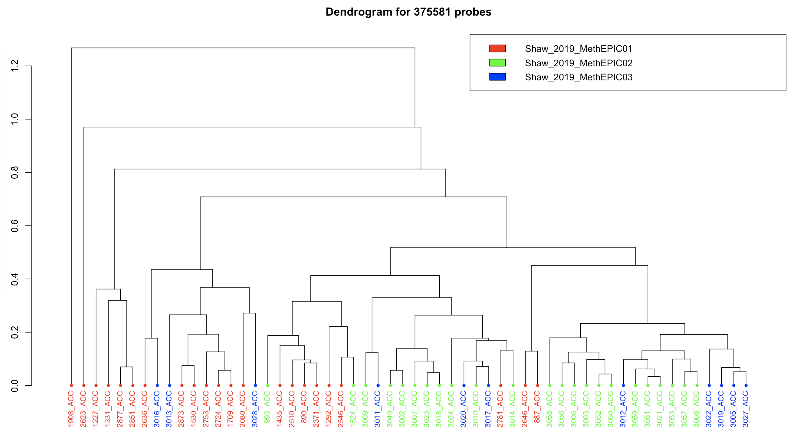

The densogram reveals a much bigger batch effect, so we'll definitely need to
include it later.

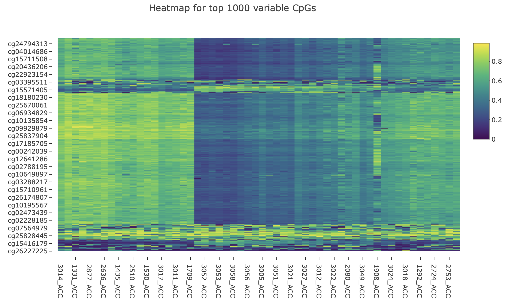

Let's remove the one bad sample and redo this analysis:

```r
load('~/data/methylation_post_mortem/raw_ACC_02162021.RData')
rgSet = rgSet[, pData(rgSet)$Sample_Name != "1908_ACC"]  
bc = beadcount(rgSet)
dp = detectionP(rgSet)
betas = getBeta(rgSet)
colnames(bc) = colnames(betas)
rownames(bc) = rownames(betas)
myLoad = champ.filter(beta=betas,
                      pd=pData(rgSet),
                      detP=dp, beadcount=bc)
QC.GUI()
```

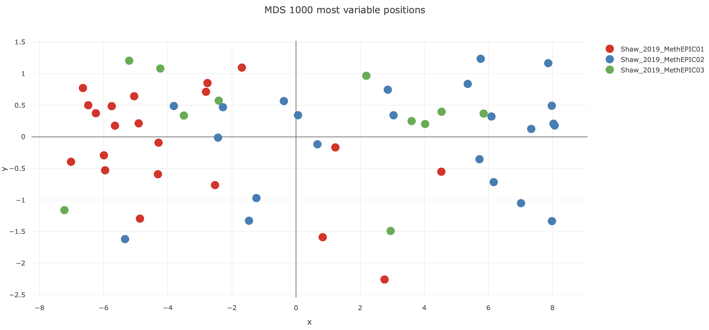
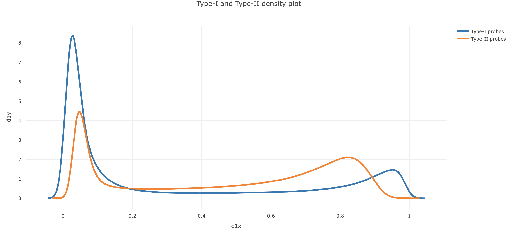
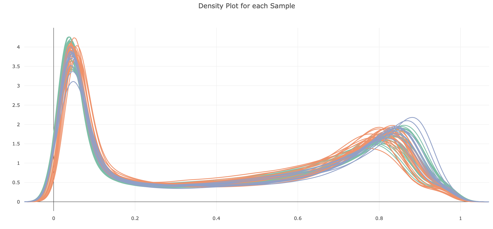
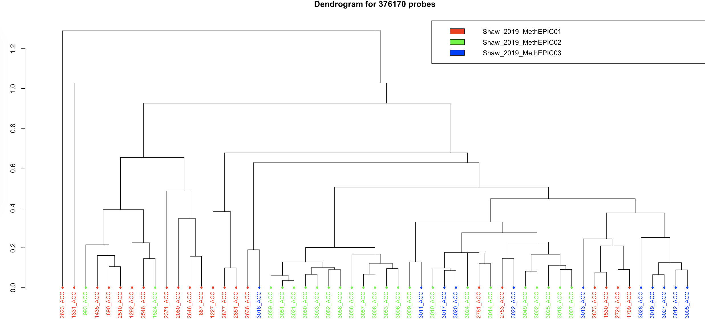
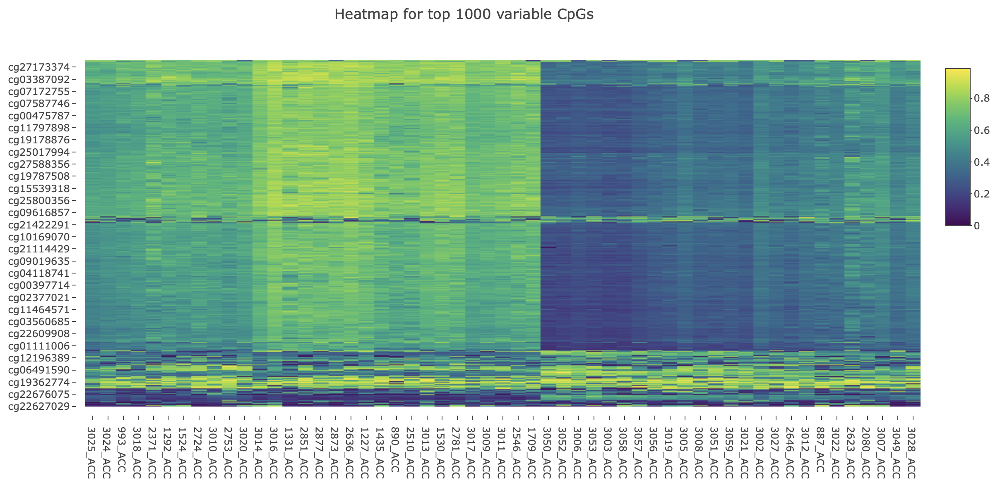

Let's proceed with normalization. The minfi guys seem to be very much in favor
of functional normalization:
https://www.bioconductor.org/help/course-materials/2015/BioC2015/methylation450k.html.

```r
# have to use the entire rgSet otherwise the Qc probes won't be there anymore
myLoad$rgSet = rgSet
champ.norm(resultsDir="./CHAMP_Normalization/", method="FunctionalNormalization")
```

That didn't work either... I might need to do everything with minfi, and just
apply the extra filters from champ. Or find a way to import using minfi within
champ, but I haven't been very successful doing that.

Actually, nevermind. champ.norm craps out regardless, even if using a single
array. Let's do the normalization using:
https://www.bioconductor.org/packages/release/workflows/vignettes/methylationArrayAnalysis/inst/doc/methylationArrayAnalysis.html

```r
load('~/data/methylation_post_mortem/raw_ACC_02162021.RData')
detP <- detectionP(rgSet)
qcReport(rgSet, sampNames=targets$ID, sampGroups=targets$Sample_Group,
         pdf="~/data/methylation_post_mortem/ACC_qcReport.pdf")
keep <- colMeans(detP) < 0.05
rgSet <- rgSet[,keep]
targets <- targets[keep,]
detP <- detP[,keep]

# I also know from looking at the data using champ that one sample is bad
keep = pData(rgSet)$Sample_Name != "1908_ACC"
rgSet <- rgSet[,keep]
targets <- targets[keep,]
detP <- detP[,keep]

mSetSq <- preprocessFunnorm(rgSet) 
```

According to the output, this is all the filtering champ.filter() is doing:

```
The fraction of failed positions per sample
 
            (You may need to delete samples with high proportion of failed probes
): 
             Failed CpG Fraction.
1524_ACC             0.0009259997
1524_Caudate         0.0006973863
[...]

Filtering probes with a detection p-value above 0.01 in one or more samples has removed 4856 probes from the analysis. If a large number of probes have been removed, ChAMP suggests you to identify potentially bad samples.
<< Filter DetP Done. >>


There is no NA values in your matrix, there is no need to imputation.

Filtering probes with a beadcount <3 in at least 5% of samples, has removed 6352 from the analysis.
<< Filter Beads Done. >>

Filtering non-cg probes, has removed 2914 from the analysis.
<< Filter NoCG Done. >>

Using general 450K SNP list for filtering.
Filtering probes with SNPs as identified in Zhou's Nucleic Acids Research Paper, 2016, has removed 54367 from the analysis.
<< Filter SNP Done. >>

Filtering probes that align to multiple locations as identified in Nordlund et al, has removed 11 from the analysis.
<< Filter MultiHit Done. >>

Filtering probes on the X or Y chromosome has removed 419047 from the analysis.
<< Filter XY chromosome Done. >>

[Beta value is selected as output.]

Zeros in your dataset have been replaced with smallest positive value.

One in your dataset have been replaced with largest value below 1.

The analysis will be proceed with 378544 probes and 48 samples.

Current Data Set contains 0 NA in [Beta] Matrix.
```

I think all these steps are also part of the pipeline I've been following. I should probably go ahead and attach the appropriate grouping though, and other metadata, before I generate plots and normalize, in case the normalization depends on sample group. 

```r
library(IlluminaHumanMethylation450kanno.ilmn12.hg19)
ann450k <- getAnnotation(IlluminaHumanMethylation450kanno.ilmn12.hg19)
data_dir = '~/data/methylation_post_mortem/Shaw_2019_MethEPIC01/'
targets1 <- read.metharray.sheet(data_dir,
                                 pattern="Shaw_2019_MethEPIC01_ss.csv")
data_dir = '~/data/methylation_post_mortem/Shaw_2019_MethEPIC02/'
targets2 <- read.metharray.sheet(data_dir,
                                 pattern="Shaw_2019_MethEPIC02_ss.csv")
data_dir = '~/data/methylation_post_mortem/Shaw_2019_MethEPIC03/'
targets3 <- read.metharray.sheet(data_dir,
                                 pattern="Shaw_2019_MethEPIC03_ss.csv")
# Alex has already checked the QC samples, so let's just separate the ones
# we need 
targets = rbind(targets1, targets2, targets3)
targets = targets[grepl(x=targets$Sample_Name, pattern='ACC$'), ]

library(gdata)
more = read.xls('~/data/post_mortem/POST_MORTEM_META_DATA_JAN_2021.xlsx')
more = more[!duplicated(more$hbcc_brain_id),]
targets$original_brain_number = as.numeric(gsub(x=targets$Sample_Name,
                                           pattern='_ACC', replacement=''))
samples = merge(targets, more, by='original_brain_number', all.x=T, all.y=F,
                sort=F)

# cleaning up some metadata
samples$Individual = factor(samples$hbcc_brain_id)
samples$MoD = factor(samples$Manner.of.Death)
samples$batch = factor(samples$Sample_Group)
samples$Diagnosis = factor(samples$Diagnosis, levels=c('Control', 'Case'))
samples$substance_group = factor(samples$substance_group)
samples$comorbid_group = factor(samples$comorbid_group_update)
samples$evidence_level = factor(samples$evidence_level)

# need extended for beadcount function
rgSet <- read.metharray.exp(targets=samples, extended=T)
sampleNames(rgSet) <- samples$original_brain_number

save(rgSet, samples,
     file='~/data/methylation_post_mortem/raw_ACC_02172021.RData')

detP <- detectionP(rgSet)
keep <- colMeans(detP) < 0.05
rgSet <- rgSet[,keep]
samples <- samples[keep,]
detP <- detP[,keep]

# I also know from looking at the data using champ that one sample is bad
keep = pData(rgSet)$Sample_Name != "1908_ACC"
rgSet <- rgSet[,keep]
samples <- samples[keep,]
detP <- detP[,keep]

qcReport(rgSet, sampNames=samples$original_brain_number,
         sampGroups=samples$Diagnosis,
         pdf="~/data/methylation_post_mortem/ACC_qcReport_02172021.pdf")

mSetSq <- preprocessFunnorm(rgSet) 
```


```r
plotMDS(getM(mSetSq), top=1000, gene.selection="common", 
        col=pal[factor(targets$Sample_Group)])
legend("top", legend=levels(factor(targets$Sample_Group)), text.col=pal,
       bg="white", cex=0.7)

# ensure probes are in the same order in the mSetSq and detP objects
detP <- detP[match(featureNames(mSetSq),rownames(detP)),] 

# remove any probes that have failed in one or more samples
keep <- rowSums(detP < 0.01) == ncol(mSetSq) 

mSetSqFlt <- mSetSq[keep,]
mSetSqFlt

# if your data includes males and females, remove probes on the sex chromosomes
keep <- !(featureNames(mSetSqFlt) %in% ann450k$Name[ann450k$chr %in% 
                                                        c("chrX","chrY")])
table(keep)
mSetSqFlt <- mSetSqFlt[keep,]

# remove probes with SNPs at CpG site
mSetSqFlt <- dropLociWithSnps(mSetSqFlt)

# exclude cross reactive probes 
xReactiveProbes <- read.csv(file=paste(dataDirectory,
                                       "48639-non-specific-probes-Illumina450k.csv",
                                       sep="/"), stringsAsFactors=FALSE)
keep <- !(featureNames(mSetSqFlt) %in% xReactiveProbes$TargetID)
mSetSqFlt <- mSetSqFlt[keep,] 

# TODO
 * look into chAMP package? BMIQ normalization?


# I found an error in the analysis in note 134 in the sorting of the samples
# matrix. So, let's re-run it here after fixing that.

# ```r
# library(doParallel)
# library(data.table)
# library(ChAMP)
# library(ChAMPdata)
# library(ewastools)
# library(MethylToSNP)
# library(qqman)
# library(EnhancedVolcano)
# library(reshape2)
# library(ggplot2)
# library(ggpubr)
# library(corrplot)
# library(ggfortify)
# library(ggbiplot)
# library(stringr)
# library(scales)
# library(writexl)
# library(limma)

# registerDoParallel(cores = 3)

# saveExcel<- function(v) {
#     name <- deparse(substitute(v))
#     writexl::write_xlsx(cbind(index=rownames(v), as.data.frame(v)),
#                         paste0(name, ".xlsx"))
# }

# addalpha <- function(colors, alpha=1.0) {
#   r <- col2rgb(colors, alpha=T)
#   # Apply alpha
#   r[4,] <- alpha*255
#   r <- r/255.0
#   return(rgb(r[1,], r[2,], r[3,], r[4,]))
# }

# rootDir <- "~/data/methylation_post_mortem"
# rawDataDir <- paste(rootDir, '/Shaw_2019', sep="")
# samplesFile <- paste(rootDir, '/samples.csv', sep="")

# # disable scientific notation
# options(scipen = 999)
# samples <- read.csv(samplesFile)
# samples$Sample_Group <- as.factor(as.character(samples$Diagnosis))
# samples$Basename <- paste0(rawDataDir, '/',  samples$Sentrix_ID, '/',
#                            samples$Sentrix_ID,'_',samples$Sentrix_Position)
# samples$Sentrix_ID <- as.factor(samples$Sentrix_ID)
# samples$Sample_Group <- as.factor(samples$Sample_Group)
# samples$Row <- as.factor(substr(samples$Sentrix_Position, 1, 3))
# samples$Scanner <- as.factor(samples$Scanner)
# samples$Region <- as.factor(samples$Region)
# samples$Sex <- as.factor(samples$Sex)
# samples$Kit <- as.factor(samples$Kit)
# samples$Sample_Plate <- as.factor(samples$Sample_Plate)

# more = readRDS('~/data/rnaseq_derek/data_from_philip_POP_and_PCs.rds')
# more = more[!duplicated(more$hbcc_brain_id),]
# samples = merge(samples, more[, c('hbcc_brain_id', 'comorbid', 'comorbid_group',
#                                   'substance', 'substance_group', 'C1', 'C2',
#                                   'C3', 'C4', 'C5', 'C6', 'C7', 'C8', 'C9',
#                                   'C10', 'POP_CODE')],
#              by='hbcc_brain_id', all.x=T, all.y=F)
# samples$POP_CODE = as.character(samples$POP_CODE)
# samples[which(samples$POP_CODE=='WNH'), 'POP_CODE'] = 'W'
# samples[which(samples$POP_CODE=='WH'), 'POP_CODE'] = 'W'
# samples$POP_CODE = factor(samples$POP_CODE)
# samples[which(samples$Manner.of.Death=='Suicide (probable)'),
#         'Manner.of.Death'] = 'Suicide'
# samples[which(samples$Manner.of.Death=='unknown'),
#         'Manner.of.Death'] = 'natural'
# samples$MoD = factor(samples$Manner.of.Death)

# raw = read_idats(samples$Basename, quiet = FALSE)
# raw$sample_names <- samples$Sample_Name
# ```

# # 2020-11-03 06:03:33

# Loading the samples took a few minutes, but it looks like it worked. Moving on
# to QC:

# ```r
# # checks control metrics according to https://support.illumina.com/content/dam/illumina-support/documents/documentation/chemistry_documentation/infinium_assays/infinium_hd_methylation/beadarray-controls-reporter-user-guide-1000000004009-00.pdf
# ctrls = control_metrics(raw)
# stripchart(ctrls$`Bisulfite Conversion I Green`, method="jitter", pch=4,
#            xlab='Bisulfite Conversion I Green',xlim=c(0,10))
# abline(v=1,col=2,lty=3)

# stripchart(ctrls$`Bisulfite Conversion I Red`, method="jitter", pch=4,
#            xlab='Bisulfite Conversion I Red',xlim=c(0,10))
# abline(v=1,col=2,lty=3)

# stripchart(ctrls$`Bisulfite Conversion II`, method="jitter", pch=4,
#            xlab='Bisulfite Conversion II',xlim=c(0,10))
# abline(v=1,col=2,lty=3)

# failed.samples <- samples[sample_failure(ctrls),
#                           c("Sample_Group", "Sentrix_ID")]
# ```

# 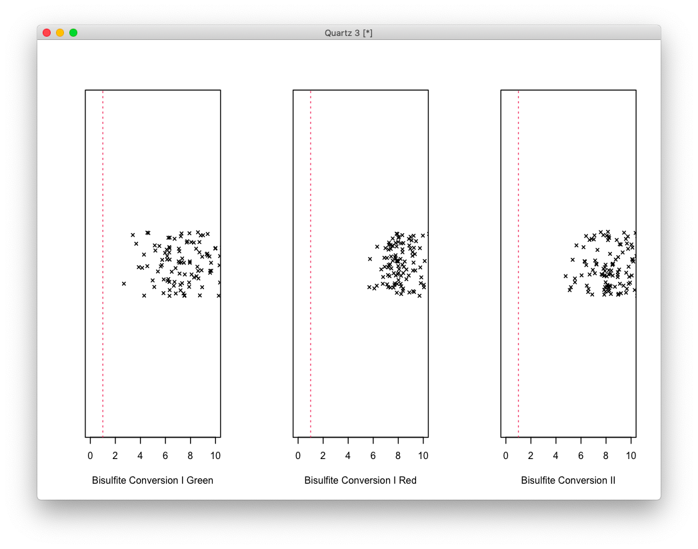

# QC looks good, no failed samples. Checking sex:

# ```r
# pheno = data.table(samples)
# pheno$sex <- tolower(pheno$Sex)
# pheno[, c("X","Y") := check_sex(raw)]
# pheno[, predicted_sex := predict_sex(X, Y, which(sex=="m"), which(sex=="f"))]

# tmp = pheno[predicted_sex==sex]
# plot(Y ~ X, data=tmp, pch=ifelse(tmp$sex=="f",1,4), asp=1,
#      xlab="Normalized X chromosome intensities",
#      ylab="Normalized Y chromosome intensities")
# tmp = pheno[predicted_sex!=sex]
# ```

# 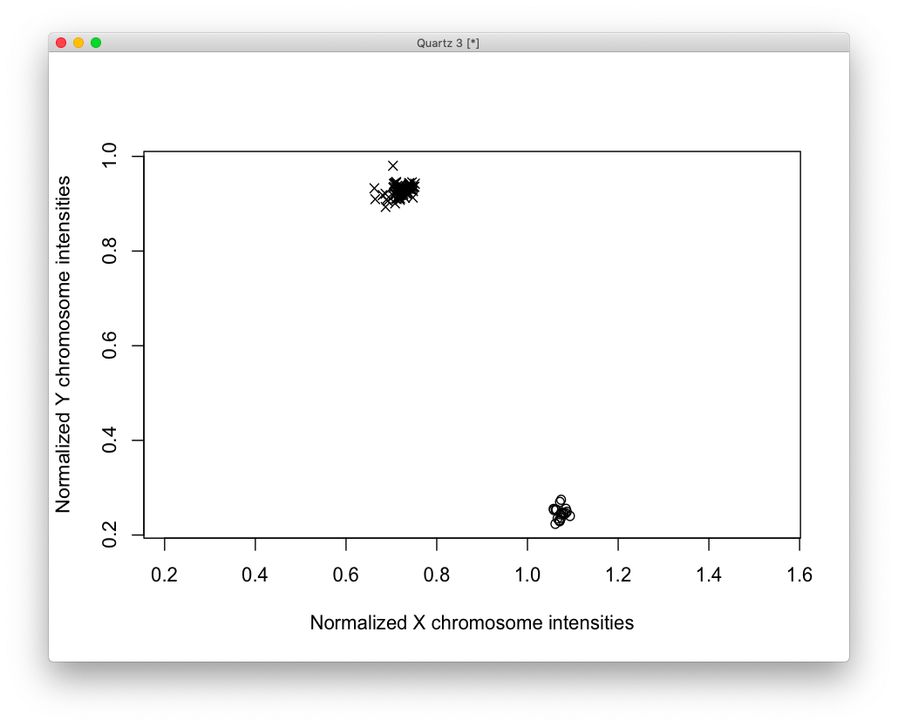

# There were no mismatches between predicted and declared sex.

# Let's continue with preprocessing:

# ```r
# #  Preprocess with normalize450k / ewastools that includes bg and dye corrections
# meth = raw %>% detectionP %>% mask(0.01) %>% correct_dye_bias() %>% dont_normalize
# # split filtered results between markers with rs in their name and without
# colnames(meth) <- samples$Sample_Name
# meth.rs <- meth[grep("rs", rownames(meth)),]
# meth.nors <-meth[grep("rs", rownames(meth), invert=TRUE),]
# # Filter probes: sex chr, SNP (general, EUR, AFR), CpG, Multi-hit
# # apply typical champ filters, including common general SNPs
# filtered <- champ.filter(beta=meth.nors, pd=samples, filterDetP = FALSE,
#                          filterXY = TRUE, autoimpute=FALSE, filterNoCG = TRUE,
#                          filterMultiHit = TRUE, filterBeads = FALSE,
#                          fixOutlier=FALSE, arraytype="EPIC")
# meth.filtered <- na.omit(filtered$beta)
# ```

# We are now down to 647K markers, from the initial 865K. I'll skip checking the
# QC control samples because Alex has already done it, and he didn't include them
# in his samples spreadsheet. I'd have to reconstruct the sheet from the sample
# sheet of each box to redo it. Not worth it if he has already confirmed that the
# QC controls match...

# So, let's get an idea about the data we're working with:

# ```r
# table(samples$Sex)
# table(samples$Diagnosis)
# table(samples$Brainbank)
# table(samples$MoD)
# table(samples$Kit)
# ```

# ```
#  F  M 
# 21 94 

#    Case Control 
#      51      64 

# nimh_hbcc      pitt      umbn 
#        50        19        46 

# Accident Homicide  natural  Suicide 
#       32       20       40       23 

# Qiagen   Zymo 
#     59     56 
# ```

# Before we run the PCA analysis, let's split the data between ACC and Caudate.

# ```r
# is.caudate <- samples$Region == 'Caudate'
# is.outlier <- samples$Sample_Name == "1908_ACC"

# samples.caudate <- samples[is.caudate, ]
# samples.acc <- samples[!is.caudate & !is.outlier, ]

# meth.caudate <- meth.filtered[, is.caudate]
# meth.acc <- meth.filtered[, !is.caudate & !is.outlier]
# ```

# Before I continue, I'll export the data Gauri will need for the clock:

# ```r
# new_names = gsub(x=colnames(meth.acc), pattern='_ACC', replacement='')
# colnames(meth.acc) = new_names
# new_names = gsub(x=colnames(meth.caudate), pattern='_Caudate', replacement='')
# colnames(meth.caudate) = new_names
# saveRDS(meth.acc, file='~/data/methylation_post_mortem/acc_methyl_raw_11032020.rds')
# saveRDS(meth.caudate, file='~/data/methylation_post_mortem/caudate_methyl_raw_11032020.rds')

# ages = samples$Age
# names(ages) = samples$Sample_Name
# new_names = gsub(x=names(ages), pattern='_ACC', replacement='')
# new_names = gsub(x=new_names, pattern='_Caudate', replacement='')
# names(ages) = new_names
# ages = ages[!duplicated(new_names)]
# df = data.frame(IID=names(ages), age=ages)
# write.csv(df, file='~/data/methylation_post_mortem/IID_age.csv', row.names=F)
# ```

# Like in the RNAseq analysis, let's figure out how many PCs to use for ACC and
# Caudate.

# ```r
# # Stratified PCA
# set.seed(42)
# meth.caudate.pca <- prcomp(t(meth.caudate), scale.=TRUE)
# meth.acc.pca <- prcomp(t(meth.acc), scale.=TRUE)

# library(nFactors)
# eigs <- meth.acc.pca$sdev^2
# nS = nScree(x=eigs)
# keep_me = 1:nS$Components$nkaiser
# pcs.acc = data.frame(meth.acc.pca$x[, keep_me])

# std_dev <- meth.acc.pca$sdev
# pr_var <- std_dev^2
# prop_varex <- pr_var/sum(pr_var)
# plot(prop_varex, xlab = "Principal Component",
#              ylab = "Proportion of Variance Explained",
#              type = "b", main='ACC')


# eigs <- meth.caudate.pca$sdev^2
# nS = nScree(x=eigs)
# keep_me = 1:nS$Components$nkaiser
# pcs.caudate = data.frame(meth.caudate.pca$x[, keep_me])

# std_dev <- meth.caudate.pca$sdev
# pr_var <- std_dev^2
# prop_varex <- pr_var/sum(pr_var)
# plot(prop_varex, xlab = "Principal Component",
#              ylab = "Proportion of Variance Explained",
#              type = "b", main='Caudate')
# ```

# We got 10 for ACC and 11 for Caudate.

# 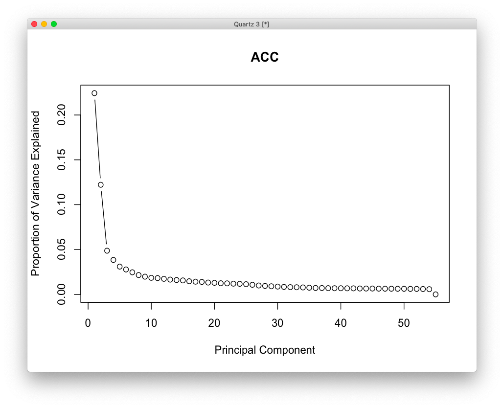
# 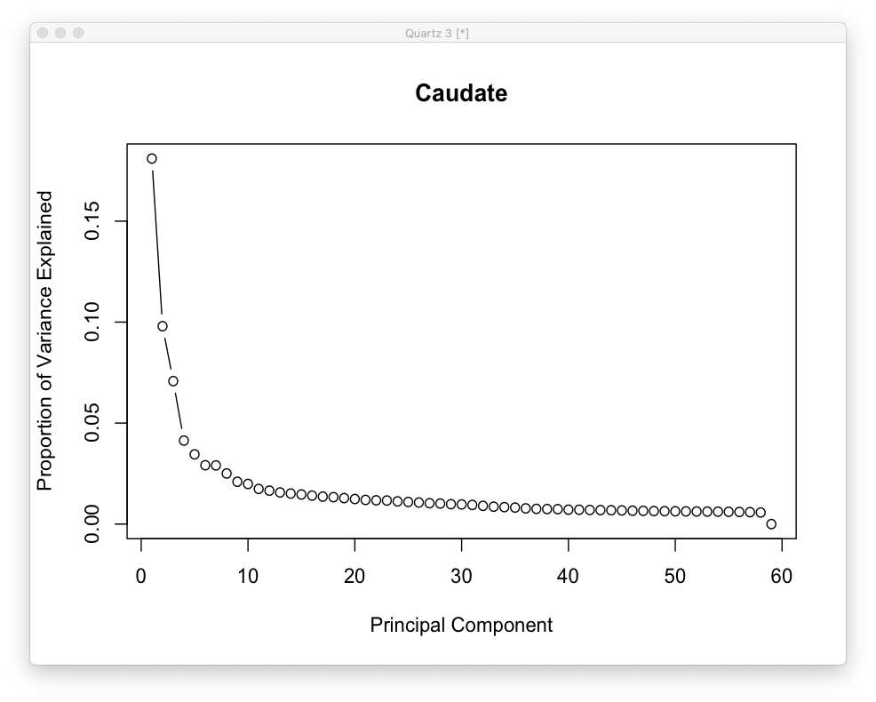

# Now let's make the same plots as the RNAseq analysis, but most importantly we
# need to see which PCs are correlated with the data at a certain threshold. We
# start with the ACC:

# ```r
# num_vars = c('pH', 'Age', 'RINe', 'PMI', 'RIN',
#              'C1', 'C2', 'C3', 'C4', 'C5', 'C6', 'C7', 'C8', 'C9', 'C10')
# pc_vars = colnames(pcs.acc)
# num_corrs = matrix(nrow=length(num_vars), ncol=length(pc_vars),
#                    dimnames=list(num_vars, pc_vars))
# num_pvals = num_corrs
# for (x in num_vars) {
#     for (y in pc_vars) {
#         res = cor.test(samples.acc[, x], pcs.acc[, y])
#         num_corrs[x, y] = res$estimate
#         num_pvals[x, y] = res$p.value
#     }
# }

# library(corrplot)
# corrplot(t(num_corrs), method='color', tl.cex=1, cl.cex=1)
# ```

# 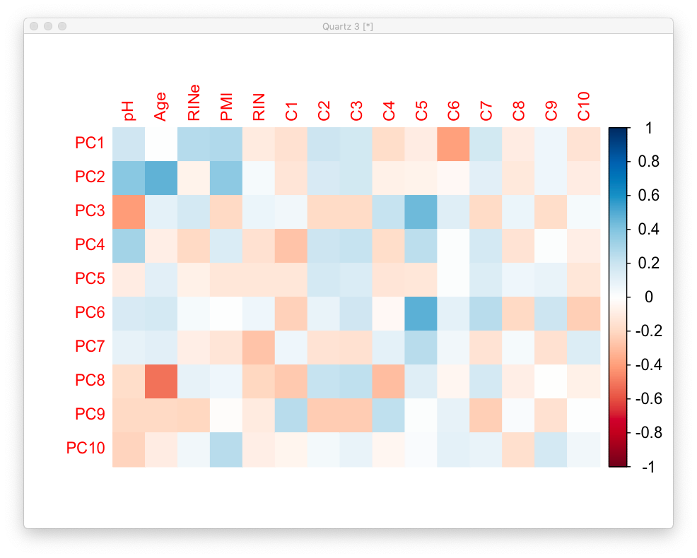

# ```r
# categ_vars = c('MoD', 'substance_group',
#                'comorbid_group', 'POP_CODE', 'Sex',
#                "Sentrix_ID", "Row", "Scanner", "Kit", "Sample_Group",
#                "Brainbank")
# categ_corrs = matrix(nrow=length(categ_vars), ncol=length(pc_vars),
#                    dimnames=list(categ_vars, pc_vars))
# categ_pvals = categ_corrs
# for (x in categ_vars) {
#     for (y in pc_vars) {
#         res = kruskal.test(pcs.acc[, y], samples.acc[, x])
#         categ_corrs[x, y] = res$statistic
#         categ_pvals[x, y] = res$p.value
#     }
# }
# corrplot(t(categ_corrs), method='color', tl.cex=1, cl.cex=1, is.corr=F)
# ```

# 

# ```
# r$> which(num_pvals < .01, arr.ind = T)                                                                             
#     row col
# C6   11   1
# pH    1   2
# Age   2   2
# PMI   4   2
# pH    1   3
# C5   10   3
# C5   10   6
# Age   2   8

# r$> which(categ_pvals < .01, arr.ind = T)                                                                           
#            row col
# Sentrix_ID   6   1
# Kit          9   1
# Brainbank   11   1
# Sentrix_ID   6   2
# Scanner      8   3
# Brainbank   11   3
# Sentrix_ID   6   4
# Kit          9   4
# Sentrix_ID   6   5
# Scanner      8   5
# Sentrix_ID   6   6
# Brainbank   11   7
# Brainbank   11  10

# r$> min(categ_pvals['Sample_Group',])                                                                               
# [1] 0.0731767
# ```

# So, for ACC we will remove PCs 1, 2, 3, 4, 5, 6, 7, 8, and 10. And the minimum p-value for
# Sample_Group was .07, so we're good there. Let's check the Caudate:

# ```r
# num_vars = c('pH', 'Age', 'RINe', 'PMI', 'RIN',
#              'C1', 'C2', 'C3', 'C4', 'C5', 'C6', 'C7', 'C8', 'C9', 'C10')
# pc_vars = colnames(pcs.caudate)
# num_corrs = matrix(nrow=length(num_vars), ncol=length(pc_vars),
#                    dimnames=list(num_vars, pc_vars))
# num_pvals = num_corrs
# for (x in num_vars) {
#     for (y in pc_vars) {
#         res = cor.test(samples.caudate[, x], pcs.caudate[, y])
#         num_corrs[x, y] = res$estimate
#         num_pvals[x, y] = res$p.value
#     }
# }
# corrplot(t(num_corrs), method='color', tl.cex=1, cl.cex=1)
# ```

# 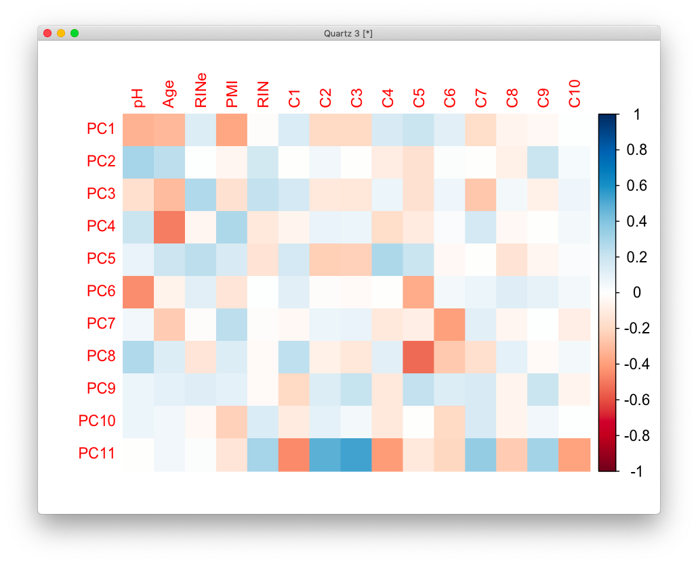

# ```r
# categ_vars = c('MoD', 'substance_group',
#                'comorbid_group', 'POP_CODE', 'Sex',
#                "Sentrix_ID", "Row", "Scanner", "Kit", "Sample_Group",
#                "Brainbank")
# categ_corrs = matrix(nrow=length(categ_vars), ncol=length(pc_vars),
#                    dimnames=list(categ_vars, pc_vars))
# categ_pvals = categ_corrs
# for (x in categ_vars) {
#     for (y in pc_vars) {
#         res = kruskal.test(pcs.caudate[, y], samples.caudate[, x])
#         categ_corrs[x, y] = res$statistic
#         categ_pvals[x, y] = res$p.value
#     }
# }
# corrplot(t(categ_corrs), method='color', tl.cex=1, cl.cex=1, is.corr=F)
# ```

# 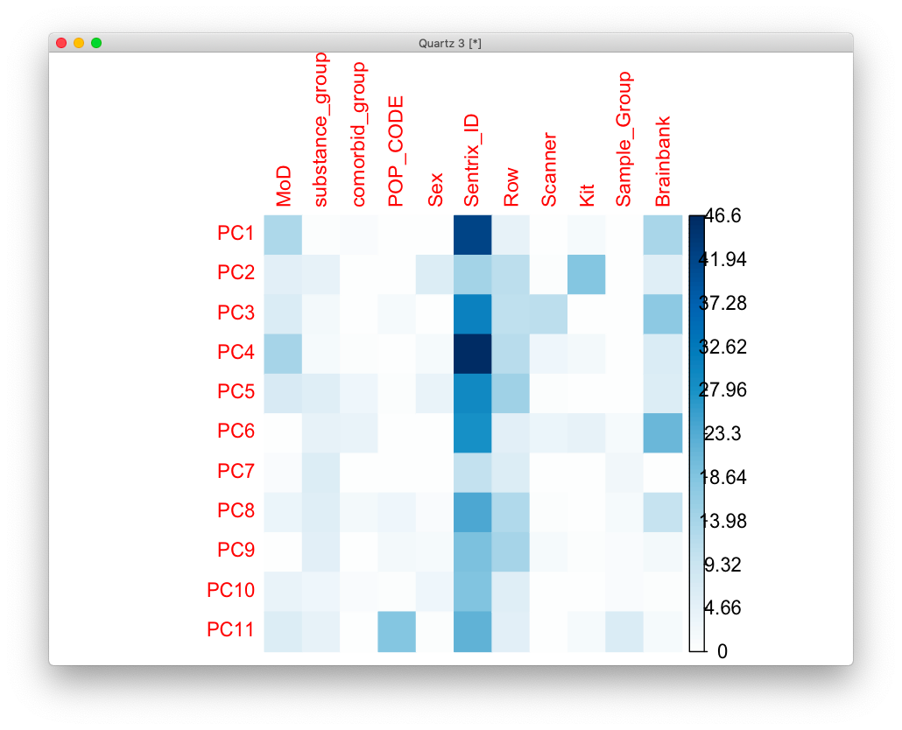

# ```
# r$> which(num_pvals < .01, arr.ind = T)                                                                             
#     row col
# PMI   4   1
# Age   2   4
# pH    1   6
# C5   10   6
# C6   11   7
# C5   10   8
# C1    6  11
# C2    7  11
# C3    8  11
# C4    9  11
# C7   12  11
# C10  15  11

# r$> which(categ_pvals < .01, arr.ind = T)                                                                           
#              row col
# MoD            1   1
# Sentrix_ID     6   1
# Brainbank     11   1
# Kit            9   2
# Sentrix_ID     6   3
# Scanner        8   3
# Brainbank     11   3
# MoD            1   4
# Sentrix_ID     6   4
# Sentrix_ID     6   5
# Brainbank     11   6
# Brainbank     11   8
# POP_CODE       4  11
# Sample_Group  10  11

# r$> min(categ_pvals['Sample_Group',])                                                                               
# [1] 0.009034045

# r$> sort(categ_pvals['Sample_Group',])                                                                              
#        PC11         PC7         PC6         PC8         PC9        PC10         PC2         PC3         PC5 
# 0.009034045 0.112324215 0.189177774 0.189177774 0.245910750 0.245910750 0.501726757 0.657938621 0.680173964 
#         PC4         PC1 
# 0.771751373 0.818857797 
# ```

# And for Caudate we will remove PCs 1, 2, 3, 4, 5, 6, 7, and 8. PC11 has a lot of
# Diagnosis info in it, so I'll keep it.

# Before we run the stats model, let's residualize the data to see if that makes
# more sense in the epiclock:

# ```r
# resids = meth.caudate
# mydata = data.frame(cbind(t(meth.caudate), pcs.caudate))
# library(MASS)
# for (v in rownames(resids)) {
#     fm_str = sprintf('%s ~ PC1 + PC2 + PC3 + PC4 + PC5 + PC6 + PC7 + PC8', v)
#     res.lm <- lm(as.formula(fm_str), data = mydata, na.action=na.exclude)
#     step <- stepAIC(res.lm, direction = "both", trace = F)
#     resids[v, ] = residuals(step)
# }
# # this takes forever!
# ```

# Now we do the actual statistical model:

# ```r
# # Differential methylation for Caudate: M-values with limma model corrected for unwanted variance
# # limma to predict DMP from M values
# vars.caudate = cbind(samples.caudate, pcs.caudate)
# var <- model.matrix(~ PC1 + PC2 + PC3 + PC4 + PC5 + PC6 + PC7 + PC8 + Sample_Group,
#                     data=vars.caudate)
# M <- logit2(meth.caudate) # convert beta to M:  log2(beta) - log2(1 - beta)
# library(limma)
# fit <- lmFit(M, var)
# fit2 <- eBayes(fit, trend=TRUE, robust=TRUE)
# probes.limma.caudate <- topTable(fit2, adjust="fdr",
#                                  coef=colnames(var)[ncol(var)], num=Inf)
# ```

# ```
# r$> head(probes.limma.caudate)                                                                                      
#                logFC   AveExpr        t        P.Value adj.P.Val        B
# cg12897947 0.4715399 -2.973068 5.298235 0.000002020613 0.6136304 2.777993
# cg03109101 0.2707579 -3.148986 5.224376 0.000002644187 0.6136304 2.605534
# cg02469347 0.2783378 -1.487961 5.193718 0.000002955567 0.6136304 2.534031
# cg18073918 0.3646369  3.137141 5.125188 0.000003788017 0.6136304 2.374401
# cg19812613 0.3091764  3.567016 5.042385 0.000005105687 0.6449798 2.181931
# cg12301347 0.7439710 -1.948643 5.003469 0.000006434240 0.6449798 2.021067
# ```

# And we do the same for ACC:

# ```r
# vars.acc = cbind(samples.acc, pcs.acc)
# var <- model.matrix(~ PC1 + PC2 + PC3 + PC4 + PC5 + PC6 + PC7 + PC8 + PC10 + Sample_Group,
#                     data=vars.acc)
# M <- logit2(meth.acc) # convert beta to M:  log2(beta) - log2(1 - beta)
# fit <- lmFit(M, var)
# fit2 <- eBayes(fit, trend=TRUE, robust=TRUE)
# probes.limma.acc <- topTable(fit2, adjust="fdr",
#                              coef=colnames(var)[ncol(var)], num=Inf)
# ```

# ```
# r$> head(probes.limma.acc)                                                                                          
#                 logFC   AveExpr         t        P.Value adj.P.Val        B
# cg24747572 -0.3614788  2.244890 -5.426898 0.000001567799 0.3859176 3.490813
# cg00192275 -0.3989329  3.261132 -5.411428 0.000001656432 0.3859176 3.452604
# cg13995516  0.3854365 -1.598190  5.292451 0.000002525499 0.3859176 3.158991
# cg21713048  0.2716786  1.284599  5.262395 0.000002808476 0.3859176 3.084902
# cg14313999  0.2752764  2.182664  5.151242 0.000004154202 0.3859176 2.811277
# cg17044843 -0.2182841  1.730037 -5.148972 0.000004187458 0.3859176 2.805695
# ```

# Again, nothing survives FDR, but not really surprising. 

# At this point, let's save our results and then we can start investigating gene
# set analysis.

# ```r
# save(meth.acc, meth.caudate, pcs.acc, pcs.caudate, probes.limma.acc,
#      probes.limma.caudate, samples.acc, samples.caudate,
#      file='~/data/methylation_post_mortem/main_results_11032020.RData')
# ```

# Now we need to attach some genes to all these probes, and since we're doing gene
# set analysis, we should keep it only to the probes annotated with genes.

# ```r
# data("probe.features.epic")
# probes.limma.caudate.annotated <- merge(probes.limma.caudate, probe.features,
#                                         by="row.names", sort=FALSE, all.x=TRUE)
# probes.limma.acc.annotated <- merge(probes.limma.acc, probe.features,
#                                     by="row.names", sort=FALSE, all.x=TRUE)
# saveRDS(probes.limma.acc.annotated,
#         file='~/data/methylation_post_mortem/acc_methyl_results_11032020.rds')
# saveRDS(probes.limma.caudate.annotated,
#         file='~/data/methylation_post_mortem/caudate_methyl_results_11032020.rds')
# idx = probes.limma.acc.annotated$gene != ''
# genes.acc = probes.limma.acc.annotated[idx, ]
# idx = probes.limma.caudate.annotated$gene != ''
# genes.caudate = probes.limma.caudate.annotated[idx, ]
# ```

# Then we run our usual gene set analysis in BW. Once again, we'll use one value
# per gene to create the ranked lists.

# ```bash
# # bw
# source /data/$USER/conda/etc/profile.d/conda.sh
# conda activate radian
# ~/.local/bin/radian
# ```

# In order to create similar lists for the methylation results, we'll need to use
# a single value per gene:

# ```r
# # bw
# library(WebGestaltR)

# data_dir = '~/data/methylation_post_mortem/'
# ncpu=31

# for (region in c('acc', 'caudate')) {
#     res = readRDS(sprintf('%s/%s_methyl_results_11032020.rds', data_dir, region))
#     idx = res$gene != ''
#     genes = res[idx, ]

#     imautosome = which(genes$CHR != 'X' &
#                        genes$CHR != 'Y' &
#                        genes$CHR != 'MT')
#     genes = genes[imautosome, ]

#     tmp = genes[, c('gene', 't')]
#     tmp2 = c()
#     # will do it this way because of the two tails of T distribution
#     for (g in unique(tmp$gene)) {
#         gene_data = tmp[tmp$gene==g, ]
#         best_res = which.max(abs(gene_data$t))
#         tmp2 = rbind(tmp2, gene_data[best_res, ])
#     }
#     for (db in c('geneontology_Biological_Process_noRedundant',
#                     'geneontology_Cellular_Component_noRedundant',
#                     'geneontology_Molecular_Function_noRedundant',
#                     'pathway_KEGG', 'disease_Disgenet',
#                     'phenotype_Human_Phenotype_Ontology',
#                     'network_PPI_BIOGRID')) {
#         cat(region, db, '\n')
#         enrichResult <- WebGestaltR(enrichMethod="GSEA",
#                                     organism="hsapiens",
#                                     enrichDatabase=db,
#                                     interestGene=tmp2,
#                                     interestGeneType="genesymbol",
#                                     sigMethod="top", topThr=10,
#                                     minNum=5,
#                                     isOutput=F, isParallel=T,
#                                     nThreads=ncpu)
#         out_fname = sprintf('%s/WG_%s_%s.csv', data_dir, region, db)
#         write.csv(enrichResult, file=out_fname, quote=F,
#                     row.names=F)
#     }
#     # my own GMTs
#     for (db in c('disorders', sprintf('%s_developmental', region))) {
#         cat(region, db, '\n')
#         db_file = sprintf('~/data/post_mortem/%s.gmt', db)
#         enrichResult <- WebGestaltR(enrichMethod="GSEA",
#                                     organism="hsapiens",
#                                     enrichDatabaseFile=db_file,
#                                     enrichDatabaseType="genesymbol",
#                                     interestGene=tmp2,
#                                     interestGeneType="genesymbol",
#                                     sigMethod="top", topThr=10,
#                                     minNum=3,
#                                     isOutput=F, isParallel=T,
#                                     nThreads=ncpu)
#         out_fname = sprintf('%s/WG_%s_%s_.csv', data_dir, region, db)
#         write.csv(enrichResult, file=out_fname, quote=F,
#                     row.names=F)
#     }
# }
# ```

# Now let's explore some of the results:

# ```r
# all_res = c()
# files = list.files(path = '~/data/methylation_post_mortem/', pattern = '^WG*')
# for (f in files) {
#     cat(f, '\n')
#     res = read.csv(sprintf('~/data/methylation_post_mortem/%s', f))
#     res$fname = f
#     # clean up a bit
#     res = res[!is.na(res$FDR),]
#     res = res[res$FDR>0,]
#     all_res = rbind(all_res, res[, c('geneSet', 'link', 'FDR', 'fname')])
# }
# ```

# So, we have a few candidates for FDR < .05. That's good. I do want to re-run
# everything using 10K permutations and creating the outputs just in case.

# ```bash
# # bw
# source /data/$USER/conda/etc/profile.d/conda.sh
# conda activate radian
# ~/.local/bin/radian
# ```

# ```r
# # bw
# library(WebGestaltR)

# data_dir = '~/data/methylation_post_mortem/'
# ncpu=31

# # region='acc'
# region='caudate'
# res = readRDS(sprintf('%s/%s_methyl_results_11032020.rds', data_dir, region))
# idx = res$gene != ''
# genes = res[idx, ]

# imautosome = which(genes$CHR != 'X' &
#                     genes$CHR != 'Y' &
#                     genes$CHR != 'MT')
# genes = genes[imautosome, ]

# tmp = genes[, c('gene', 't')]
# tmp2 = c()
# # will do it this way because of the two tails of T distribution
# for (g in unique(tmp$gene)) {
#     gene_data = tmp[tmp$gene==g, ]
#     best_res = which.max(abs(gene_data$t))
#     tmp2 = rbind(tmp2, gene_data[best_res, ])
# }
# for (db in c('geneontology_Biological_Process_noRedundant',
#                 'geneontology_Cellular_Component_noRedundant',
#                 'geneontology_Molecular_Function_noRedundant',
#                 'pathway_KEGG', 'disease_Disgenet',
#                 'phenotype_Human_Phenotype_Ontology',
#                 'network_PPI_BIOGRID')) {
#     cat(region, db, '\n')
#     project_name = sprintf('%s_%s', region, db)
#     enrichResult <- WebGestaltR(enrichMethod="GSEA",
#                                 organism="hsapiens",
#                                 enrichDatabase=db,
#                                 interestGene=tmp2,
#                                 interestGeneType="genesymbol",
#                                 sigMethod="top", topThr=150000,
#                                 outputDirectory = data_dir,
#                                 minNum=5, projectName=project_name,
#                                 isOutput=T, isParallel=T,
#                                 nThreads=ncpu, perNum=10000)
#     out_fname = sprintf('%s/WG_%s_%s_10K.csv', data_dir, region, db)
#     write.csv(enrichResult, file=out_fname, quote=F,
#                 row.names=F)
# }
# # my own GMTs
# for (db in c('disorders', sprintf('%s_developmental', region))) {
#     cat(region, db, '\n')
#     project_name = sprintf('%s_%s', region, db)
#     db_file = sprintf('~/data/post_mortem/%s.gmt', db)
#     enrichResult <- WebGestaltR(enrichMethod="GSEA",
#                                 organism="hsapiens",
#                                 enrichDatabaseFile=db_file,
#                                 enrichDatabaseType="genesymbol",
#                                 interestGene=tmp2,
#                                 outputDirectory = data_dir,
#                                 interestGeneType="genesymbol",
#                                 sigMethod="top", topThr=150000,
#                                 minNum=3, projectName=project_name,
#                                 isOutput=T, isParallel=T,
#                                 nThreads=ncpu, perNum=10000)
#     out_fname = sprintf('%s/WG_%s_%s_10K.csv', data_dir, region, db)
#     write.csv(enrichResult, file=out_fname, quote=F,
#                 row.names=F)
# }
# ```

# Remember that I need to reduce the number of cpus to run the Human Phenotype
# Ontology, otherwise it crashes. I've been using 5.

# # 2020-11-08 16:43:18

# Also run the redundant sets for a better comparisons to the camera results:

# ```r
# for (db in c('geneontology_Biological_Process',
#                 'geneontology_Cellular_Component',
#                 'geneontology_Molecular_Function')) {
# ```

# In fact, I can replicate what I did for camera and run each individual CGI:

# ```r
# # bw
# library(WebGestaltR)

# data_dir = '~/data/methylation_post_mortem/'
# ncpu=5

# region='acc'
# # region='caudate'
# res = readRDS(sprintf('%s/%s_methyl_results_11032020.rds', data_dir, region))
# idx = res$gene != ''
# genes = res[idx, ]

# imautosome = which(genes$CHR != 'X' &
#                     genes$CHR != 'Y' &
#                     genes$CHR != 'MT')
# genes = genes[imautosome, ]

# for (cgi in c("island", "opensea", "shelf", "shore")) {
#     data <- res[res$cgi==cgi, ]
#     idx = data$gene != ''
#     tmp = data[idx, c('gene', 't')]
#     tmp2 = c()
#     # will do it this way because of the two tails of T distribution
#     for (g in unique(tmp$gene)) {
#         gene_data = tmp[tmp$gene==g, ]
#         best_res = which.max(abs(gene_data$t))
#         tmp2 = rbind(tmp2, gene_data[best_res, ])
#     }
#     for (db in c('geneontology_Biological_Process_noRedundant',
#                     'geneontology_Cellular_Component_noRedundant',
#                     'geneontology_Molecular_Function_noRedundant',
#                     'pathway_KEGG', 'disease_Disgenet',
#                     'phenotype_Human_Phenotype_Ontology',
#                     'network_PPI_BIOGRID')) {
#         cat(region, db, '\n')
#         project_name = sprintf('%s_%s_%s', region, cgi, db)
#         enrichResult <- WebGestaltR(enrichMethod="GSEA",
#                                     organism="hsapiens",
#                                     enrichDatabase=db,
#                                     interestGene=tmp2,
#                                     interestGeneType="genesymbol",
#                                     sigMethod="top", topThr=150000,
#                                     outputDirectory = data_dir,
#                                     minNum=5, projectName=project_name,
#                                     isOutput=T, isParallel=T,
#                                     nThreads=ncpu, perNum=10000)
#         out_fname = sprintf('%s/WG_%s_%s_%s_10K.csv', data_dir, region, cgi, db)
#         write.csv(enrichResult, file=out_fname, quote=F,
#                     row.names=F)
#     }
#     # my own GMTs
#     for (db in c('disorders', sprintf('%s_developmental', region))) {
#         cat(region, db, '\n')
#         project_name = sprintf('%s_%s_%s', region, cgi, db)
#         db_file = sprintf('~/data/post_mortem/%s.gmt', db)
#         enrichResult <- WebGestaltR(enrichMethod="GSEA",
#                                     organism="hsapiens",
#                                     enrichDatabaseFile=db_file,
#                                     enrichDatabaseType="genesymbol",
#                                     interestGene=tmp2,
#                                     outputDirectory = data_dir,
#                                     interestGeneType="genesymbol",
#                                     sigMethod="top", topThr=150000,
#                                     minNum=3, projectName=project_name,
#                                     isOutput=T, isParallel=T,
#                                     nThreads=ncpu, perNum=10000)
#         out_fname = sprintf('%s/WG_%s_%s_%s_10K.csv', data_dir, region, cgi, db)
#         write.csv(enrichResult, file=out_fname, quote=F,
#                     row.names=F)
#     }
# }
# ```

# Exploding in memory... let's not do parallel:

# ```r
# # bw
# library(WebGestaltR)

# data_dir = '~/data/methylation_post_mortem/'

# region='acc'
# # region='caudate'
# res = readRDS(sprintf('%s/%s_methyl_results_11032020.rds', data_dir, region))
# idx = res$gene != ''
# genes = res[idx, ]

# imautosome = which(genes$CHR != 'X' &
#                     genes$CHR != 'Y' &
#                     genes$CHR != 'MT')
# genes = genes[imautosome, ]

# tmp = genes[, c('gene', 't')]
# tmp2 = c()
# # will do it this way because of the two tails of T distribution
# for (g in unique(tmp$gene)) {
#     gene_data = tmp[tmp$gene==g, ]
#     best_res = which.max(abs(gene_data$t))
#     tmp2 = rbind(tmp2, gene_data[best_res, ])
# }
# for (db in c('geneontology_Cellular_Component',
#              'geneontology_Molecular_Function',
#              'geneontology_Biological_Process')) {
#     cat(region, db, '\n')
#     project_name = sprintf('%s_%s', region, db)
#     enrichResult <- WebGestaltR(enrichMethod="GSEA",
#                                 organism="hsapiens",
#                                 enrichDatabase=db,
#                                 interestGene=tmp2,
#                                 interestGeneType="genesymbol",
#                                 sigMethod="top", topThr=150000,
#                                 outputDirectory = data_dir,
#                                 minNum=5, projectName=project_name,
#                                 isOutput=T, isParallel=F, perNum=10000)
#     out_fname = sprintf('%s/WG_%s_%s_10K.csv', data_dir, region, db)
#     write.csv(enrichResult, file=out_fname, quote=F,
#                 row.names=F)
# }
# ```

# ```r
# cgi='shelf'
# data <- res[res$cgi==cgi, ]
# idx = data$gene != ''
# tmp = data[idx, c('gene', 't')]
# tmp2 = c()
# # will do it this way because of the two tails of T distribution
# for (g in unique(tmp$gene)) {
#     gene_data = tmp[tmp$gene==g, ]
#     best_res = which.max(abs(gene_data$t))
#     tmp2 = rbind(tmp2, gene_data[best_res, ])
# }
# for (db in c('disease_Disgenet',
#                 'phenotype_Human_Phenotype_Ontology',
#                 'network_PPI_BIOGRID')) {
#     cat(region, db, '\n')
#     project_name = sprintf('%s_%s_%s', region, cgi, db)
#     enrichResult <- WebGestaltR(enrichMethod="GSEA",
#                                 organism="hsapiens",
#                                 enrichDatabase=db,
#                                 interestGene=tmp2,
#                                 interestGeneType="genesymbol",
#                                 sigMethod="top", topThr=150000,
#                                 outputDirectory = data_dir,
#                                 minNum=5, projectName=project_name,
#                                 isOutput=T, isParallel=T,
#                                 nThreads=ncpu, perNum=10000)
#     out_fname = sprintf('%s/WG_%s_%s_%s_10K.csv', data_dir, region, cgi, db)
#     write.csv(enrichResult, file=out_fname, quote=F,
#                 row.names=F)
# }
# # my own GMTs
# for (db in c('disorders', sprintf('%s_developmental', region))) {
#     cat(region, db, '\n')
#     project_name = sprintf('%s_%s_%s', region, cgi, db)
#     db_file = sprintf('~/data/post_mortem/%s.gmt', db)
#     enrichResult <- WebGestaltR(enrichMethod="GSEA",
#                                 organism="hsapiens",
#                                 enrichDatabaseFile=db_file,
#                                 enrichDatabaseType="genesymbol",
#                                 interestGene=tmp2,
#                                 outputDirectory = data_dir,
#                                 interestGeneType="genesymbol",
#                                 sigMethod="top", topThr=150000,
#                                 minNum=3, projectName=project_name,
#                                 isOutput=T, isParallel=T,
#                                 nThreads=ncpu, perNum=10000)
#     out_fname = sprintf('%s/WG_%s_%s_%s_10K.csv', data_dir, region, cgi, db)
#     write.csv(enrichResult, file=out_fname, quote=F,
#                 row.names=F)
# }
