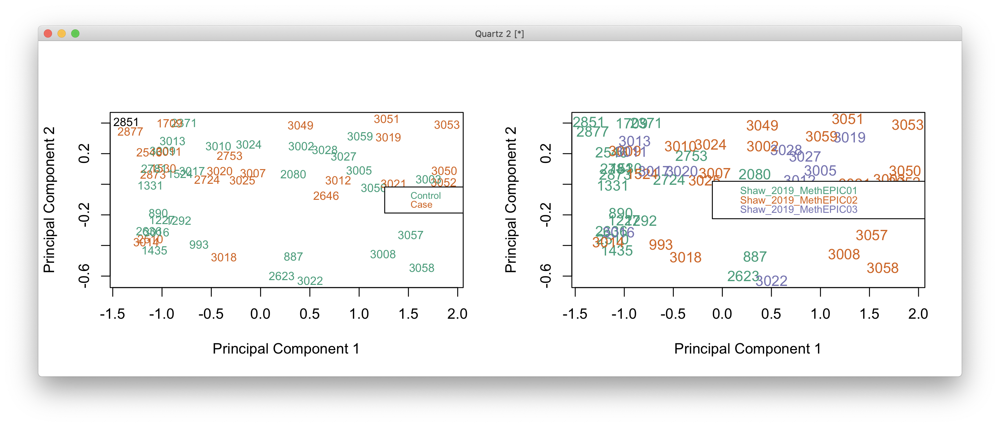

# 2021-02-11 12:23:27

Let's revisit the methylation analysis, much similar to what we are doing now
for DGE and DTE.

Instead of redoing what I did in note 142, let me give this a try:

https://www.bioconductor.org/packages/release/workflows/vignettes/methylationArrayAnalysis/inst/doc/methylationArrayAnalysis.html

The previous results weren't great to begin with, so we don't have much to lose
here. I can always go back to what we had before.

```r
library(IlluminaHumanMethylation450kanno.ilmn12.hg19)
ann450k <- getAnnotation(IlluminaHumanMethylation450kanno.ilmn12.hg19)
data_dir = '~/data/methylation_post_mortem/Shaw_METH01_Methyltn450/'
targets1 <- read.metharray.sheet(data_dir,
                                 pattern="Shaw_METH01_Methyltn450_ss.csv")
data_dir = '~/data/methylation_post_mortem/Shaw_METH02_Methyltn450/'
targets2 <- read.metharray.sheet(data_dir,
                                 pattern="Shaw_METH02_Methyltn450_ss.csv")
targets = rbind(targets1, targets2)
rgSet <- read.metharray.exp(targets=targets)
sampleNames(rgSet) <- targets$Sample_Name
save(rgSet, file='~/data/methylation_post_mortem/raw_02112021.RData')
```

Like the transcriptome analysis, let's go ahead and split the samples between
caudate and ACC before we do anything else.

Yun-Ching suggested this pipeline to be used:

https://www.bioconductor.org/packages/release/bioc/vignettes/ChAMP/inst/doc/ChAMP.html

and he removed cross-reactive probes using this package:
https://github.com/markgene/maxprobes

# 2021-02-12 10:12:09

We might need to make some departures on the usual pipeline used for DGE/DTE if
we are going to go with the usual chAMP pipeline. I'm fine with that, as it's
still based on the PCA method. 

```r
library(ChAMP)
myLoad1 <- champ.load('~/data/methylation_post_mortem/Shaw_METH01_Methyltn450/')
myLoad2 <- champ.load('~/data/methylation_post_mortem/Shaw_METH02_Methyltn450/')
```

# 2021-02-16 11:22:34

I just made a mock array with the directories to be able to load everything
together, since I couldn't really tell whether the filtering was dependent on
the samples being loaded. In any case, let's also split it into acc and
cau_METH.

```r
library(ChAMP)
myLoad <- champ.load('~/data/methylation_post_mortem/acc_Meth/')
```

I'm getting too mnay errors, both using import and load. Let's import everything
just using minfi, but then use champ from then on:

```r
library(IlluminaHumanMethylation450kanno.ilmn12.hg19)
ann450k <- getAnnotation(IlluminaHumanMethylation450kanno.ilmn12.hg19)
data_dir = '~/data/methylation_post_mortem/Shaw_2019_MethEPIC01/'
targets1 <- read.metharray.sheet(data_dir,
                                 pattern="Shaw_2019_MethEPIC01_ss.csv")
data_dir = '~/data/methylation_post_mortem/Shaw_2019_MethEPIC02/'
targets2 <- read.metharray.sheet(data_dir,
                                 pattern="Shaw_2019_MethEPIC02_ss.csv")
data_dir = '~/data/methylation_post_mortem/Shaw_2019_MethEPIC03/'
targets3 <- read.metharray.sheet(data_dir,
                                 pattern="Shaw_2019_MethEPIC03_ss.csv")
# Alex has already checked the QC samples, so let's just separate the ones
# we need 
targets = rbind(targets1, targets2, targets3)
targets = targets[grepl(x=targets$Sample_Name, pattern='ACC$'), ]
# need extended for beadcount function
rgSet <- read.metharray.exp(targets=targets, extended=T)
sampleNames(rgSet) <- targets$Sample_Name
save(rgSet, targets,
     file='~/data/methylation_post_mortem/raw_ACC_02162021.RData')
```

Now let's try some filtering with champ:

```r
library(wateRmelon)  # for beadcount
bc = beadcount(rgSet)
dp = detectionP(rgSet)
betas = getBeta(rgSet)
colnames(bc) = colnames(betas)
rownames(bc) = rownames(betas)
myLoad = champ.filter(beta=betas,
                      pd=pData(rgSet),
                      detP=dp, beadcount=bc)
champ.QC()
```


The one outlier is 1908_ACC, which I already knew based on the Failed CpG
Fraction to have 7-10x higher values than the other samples. Worth removing it.
It also doesn't look like the batch effect for the 3 different arrays is
affecting it much. In any case, it's worth adding it as a potential covariate.


The densogram reveals a much bigger batch effect, so we'll definitely need to
include it later.


Let's remove the one bad sample and redo this analysis:

```r
load('~/data/methylation_post_mortem/raw_ACC_02162021.RData')
rgSet = rgSet[, pData(rgSet)$Sample_Name != "1908_ACC"]  
bc = beadcount(rgSet)
dp = detectionP(rgSet)
betas = getBeta(rgSet)
colnames(bc) = colnames(betas)
rownames(bc) = rownames(betas)
myLoad = champ.filter(beta=betas,
                      pd=pData(rgSet),
                      detP=dp, beadcount=bc)
QC.GUI()
```


Let's proceed with normalization. The minfi guys seem to be very much in favor
of functional normalization:
https://www.bioconductor.org/help/course-materials/2015/BioC2015/methylation450k.html.

```r
# have to use the entire rgSet otherwise the Qc probes won't be there anymore
myLoad$rgSet = rgSet
champ.norm(resultsDir="./CHAMP_Normalization/", method="FunctionalNormalization")
```

That didn't work either... I might need to do everything with minfi, and just
apply the extra filters from champ. Or find a way to import using minfi within
champ, but I haven't been very successful doing that.

Actually, nevermind. champ.norm craps out regardless, even if using a single
array. Let's do the normalization using:
https://www.bioconductor.org/packages/release/workflows/vignettes/methylationArrayAnalysis/inst/doc/methylationArrayAnalysis.html

```r
load('~/data/methylation_post_mortem/raw_ACC_02162021.RData')
detP <- detectionP(rgSet)
qcReport(rgSet, sampNames=targets$ID, sampGroups=targets$Sample_Group,
         pdf="~/data/methylation_post_mortem/ACC_qcReport.pdf")
keep <- colMeans(detP) < 0.05
rgSet <- rgSet[,keep]
targets <- targets[keep,]
detP <- detP[,keep]

# I also know from looking at the data using champ that one sample is bad
keep = pData(rgSet)$Sample_Name != "1908_ACC"
rgSet <- rgSet[,keep]
targets <- targets[keep,]
detP <- detP[,keep]

mSetSq <- preprocessFunnorm(rgSet) 
```

According to the output, this is all the filtering champ.filter() is doing:

```
The fraction of failed positions per sample
 
            (You may need to delete samples with high proportion of failed probes
): 
             Failed CpG Fraction.
1524_ACC             0.0009259997
1524_Caudate         0.0006973863
[...]

Filtering probes with a detection p-value above 0.01 in one or more samples has removed 4856 probes from the analysis. If a large number of probes have been removed, ChAMP suggests you to identify potentially bad samples.
<< Filter DetP Done. >>


There is no NA values in your matrix, there is no need to imputation.

Filtering probes with a beadcount <3 in at least 5% of samples, has removed 6352 from the analysis.
<< Filter Beads Done. >>

Filtering non-cg probes, has removed 2914 from the analysis.
<< Filter NoCG Done. >>

Using general 450K SNP list for filtering.
Filtering probes with SNPs as identified in Zhou's Nucleic Acids Research Paper, 2016, has removed 54367 from the analysis.
<< Filter SNP Done. >>

Filtering probes that align to multiple locations as identified in Nordlund et al, has removed 11 from the analysis.
<< Filter MultiHit Done. >>

Filtering probes on the X or Y chromosome has removed 419047 from the analysis.
<< Filter XY chromosome Done. >>

[Beta value is selected as output.]

Zeros in your dataset have been replaced with smallest positive value.

One in your dataset have been replaced with largest value below 1.

The analysis will be proceed with 378544 probes and 48 samples.

Current Data Set contains 0 NA in [Beta] Matrix.
```

I think all these steps are also part of the pipeline I've been following. I should probably go ahead and attach the appropriate grouping though, and other metadata, before I generate plots and normalize, in case the normalization depends on sample group. 

```r
myregion = 'ACC'

library(IlluminaHumanMethylation450kanno.ilmn12.hg19)
ann450k <- getAnnotation(IlluminaHumanMethylation450kanno.ilmn12.hg19)
data_dir = '~/data/methylation_post_mortem/Shaw_2019_MethEPIC01/'
targets1 <- read.metharray.sheet(data_dir,
                                 pattern="Shaw_2019_MethEPIC01_ss.csv")
data_dir = '~/data/methylation_post_mortem/Shaw_2019_MethEPIC02/'
targets2 <- read.metharray.sheet(data_dir,
                                 pattern="Shaw_2019_MethEPIC02_ss.csv")
data_dir = '~/data/methylation_post_mortem/Shaw_2019_MethEPIC03/'
targets3 <- read.metharray.sheet(data_dir,
                                 pattern="Shaw_2019_MethEPIC03_ss.csv")
# Alex has already checked the QC samples, so let's just separate the ones
# we need 
targets = rbind(targets1, targets2, targets3)
targets = targets[grepl(x=targets$Sample_Name,
                  pattern=sprintf('%s$', myregion)), ]

meta = readRDS('~/data/rnaseq_derek/complete_rawCountData_05132020.rds')
meta = meta[meta$Region==myregion, ]
meta = meta[, !grepl(colnames(meta), pattern='^ENS')]
library(gdata)
more = read.xls('~/data/post_mortem/POST_MORTEM_META_DATA_JAN_2021.xlsx')
more = more[!duplicated(more$hbcc_brain_id),]
meta = merge(meta, more[, c('hbcc_brain_id', 'comorbid_group_update',
                            'substance_group', 'evidence_level')],
             by='hbcc_brain_id', all.x=T, all.y=F)

targets$hbcc_brain_id = as.numeric(gsub(x=targets$Sample_Name,
                                        pattern=sprintf('_%s', myregion),
                                        replacement=''))
samples = merge(targets, meta, by='hbcc_brain_id', all.x=T, all.y=F,
                sort=F)

# cleaning up some metadata
samples$POP_CODE = as.character(samples$POP_CODE)
samples[which(samples$POP_CODE=='WNH'), 'POP_CODE'] = 'W'
samples[which(samples$POP_CODE=='WH'), 'POP_CODE'] = 'W'
samples$POP_CODE = factor(samples$POP_CODE)
samples$Individual = factor(samples$hbcc_brain_id)
samples[which(samples$Manner.of.Death=='Suicide (probable)'),
        'Manner.of.Death'] = 'Suicide'
samples[which(samples$Manner.of.Death=='unknown'),
        'Manner.of.Death'] = 'natural'
samples$MoD = factor(samples$Manner.of.Death)
samples$batch = factor(samples$Sample_Group)
samples$Diagnosis = factor(samples$Diagnosis, levels=c('Control', 'Case'))
samples$substance_group = factor(samples$substance_group)
samples$comorbid_group = factor(samples$comorbid_group_update)
samples$evidence_level = factor(samples$evidence_level)
samples$brain_bank = factor(samples$bainbank)

# need extended for beadcount function
rgSet <- read.metharray.exp(targets=samples, extended=T)
sampleNames(rgSet) <- samples$hbcc_brain_id

save(rgSet, samples, myregion,
     file='~/data/methylation_post_mortem/raw_ACC_02182021.RData')
```

```r
library(IlluminaHumanMethylation450kanno.ilmn12.hg19)
ann450k <- getAnnotation(IlluminaHumanMethylation450kanno.ilmn12.hg19)
load('~/data/methylation_post_mortem/raw_ACC_02182021.RData')
detP <- detectionP(rgSet)
keep <- colMeans(detP) < 0.05
rgSet <- rgSet[,keep]
samples <- samples[keep,]
detP <- detP[,keep]

# I also know from looking at the data using champ that one sample is bad
keep = pData(rgSet)$Sample_Name != "1908_ACC"
rgSet <- rgSet[,keep]
samples <- samples[keep,]
detP <- detP[,keep]

qcReport(rgSet, sampNames=samples$original_brain_number,
         sampGroups=samples$Diagnosis,
         pdf="~/data/methylation_post_mortem/ACC_qcReport_02182021.pdf")

mSetSq <- preprocessFunnorm(rgSet) 
```

Now we start the removal of different probes:

```r
# ensure probes are in the same order in the mSetSq and detP objects
detP <- detP[match(featureNames(mSetSq),rownames(detP)),] 

# remove any probes that have failed in one or more samples
keep <- rowSums(detP < 0.01) == ncol(mSetSq) 
mSetSqFlt <- mSetSq[keep,]

# remove probes on the sex chromosomes
keep <- !(featureNames(mSetSqFlt) %in% ann450k$Name[ann450k$chr %in% 
                                                        c("chrX","chrY")])
mSetSqFlt <- mSetSqFlt[keep,]

# remove probes with SNPs at CpG site
mSetSqFlt <- dropLociWithSnps(mSetSqFlt)

# exclude cross reactive probes
dataDirectory = '~/data/methylation_post_mortem/'
xReactiveProbes <- read.csv(file=paste(dataDirectory,
                                       "48639-non-specific-probes-Illumina450k.csv",
                                       sep="/"), stringsAsFactors=FALSE)
keep <- !(featureNames(mSetSqFlt) %in% xReactiveProbes$TargetID)
mSetSqFlt <- mSetSqFlt[keep,] 
```

Now we can just use Champ to see what other probes it'd drop:

```r
library(wateRmelon)
library(ChAMP)
bc = beadcount(rgSet)
betas = getBeta(rgSet)
detP_champ <- detectionP(rgSet)
colnames(betas) = pData(rgSet)$Sample_Name
colnames(bc) = colnames(betas)
rownames(bc) = rownames(betas)
colnames(detP_champ) = colnames(betas)
rownames(detP_champ) = rownames(betas)
myLoad = champ.filter(beta=betas,
                      pd=pData(rgSet),
                      detP=detP_champ, beadcount=bc)
keep_me = rownames(mSetSqFlt) %in% rownames(myLoad$beta)
mSetSqFlt = mSetSqFlt[keep_me,]
keep_me = rownames(betas) %in% rownames(myLoad$beta)
rgSet = rgSet[keep_me,]
```

Now we can proceed with the rest of the analysis. First, let's make a few
confirmation plots:

```r
library(RColorBrewer)
# visualise what the data looks like before and after normalisation
par(mfrow=c(1,2))
densityPlot(rgSet, sampGroups=samples$Diagnosis, main="Raw", legend=FALSE)
legend("top", legend = levels(samples$Diagnosis),
        text.col=brewer.pal(8,"Dark2"))
densityPlot(getBeta(mSetSqFlt), sampGroups=samples$Diagnosis,
            main="Normalized", legend=FALSE)
legend("top", legend = levels(samples$Diagnosis), 
       text.col=brewer.pal(8,"Dark2"))
```


And a couple MDs plots:

```r
# MDS plots to look at largest sources of variation
par(mfrow=c(1,2))
pal <- brewer.pal(8,"Dark2")
plotMDS(getM(mSetSqFlt), top=1000, gene.selection="common", 
        col=pal[samples$Diagnosis], cex=0.8)
legend("right", legend=levels(samples$Diagnosis), text.col=pal,
       cex=0.65, bg="white")

plotMDS(getM(mSetSqFlt), top=1000, gene.selection="common", 
        col=pal[samples$batch])
legend("right", legend=levels(samples$batch), text.col=pal,
       cex=0.7, bg="white")
```



There isn't much of a separation in MDS, which is expected.

And stated in the workflow:

```
M-values have nicer statistical properties and are thus better for use in statistical analysis of methylation data whilst beta values are easy to interpret and are thus better for displaying data.
```

```r
# removing the one subject without ADHD DX (they actually had Anx from Stefano's
# DX file, but best not to include them especially as methylation is mostly 
# to align with RNAseq, which doesn't include that subject)
keep_me = samples$hbcc_brain_id != 2851
mSetSqFlt = mSetSqFlt[, keep_me]
rgSet = rgSet[, keep_me]
samples = samples[keep_me, ]

save(rgSet, samples, mSetSqFlt, myregion,
     file='~/data/methylation_post_mortem/filt_ACC_02182021.RData')
```

```r
library(minfi)
load('~/data/methylation_post_mortem/filt_ACC_02182021.RData')
# calculate M-values for statistical analysis
mVals <- getM(mSetSqFlt)
# and b values for display and interpretation
bVals <- getBeta(mSetSqFlt)

par(mfrow=c(1,2))
densityPlot(bVals, sampGroups=samples$Diagnosis, main="Beta values", 
            legend=FALSE, xlab="Beta values")
legend("top", legend = levels(samples$Diagnosis), 
       text.col=brewer.pal(8,"Dark2"))
densityPlot(mVals, sampGroups=samples$Diagnosis, main="M-values", 
            legend=FALSE, xlab="M values")
legend("topleft", legend = levels(samples$Diagnosis), 
       text.col=brewer.pal(8,"Dark2"))
```


Let's figure out the PCs for the analysis then:

```r
# removing variables with zero or near-zero variance
library(caret)
pp_order = c('zv', 'nzv')
pp = preProcess(t(mVals), method = pp_order)
X = t(predict(pp, t(mVals)))
cat('Keeping', nrow(X), 'after NZ and NZV filtering\n')

# remove the 2 probes with infinity
bad_probes = rownames(which(abs(mVals)==Inf, arr.ind = T))
X = X[!(rownames(X) %in% bad_probes), ]

# checking which PCs are associated with our potential nuiscance variables
set.seed(42)
mypca <- prcomp(t(X), scale=TRUE)
# how many PCs to keep... using Kaiser thredhold, close to eigenvalues < 1
library(nFactors)
eigs <- mypca$sdev^2
nS = nScree(x=eigs)
keep_me = seq(1, nS$Components$nkaiser)

mydata = data.frame(mypca$x[, keep_me])
# create main metadata data frame including metadata and PCs
data.pm = cbind(samples, mydata)
rownames(data.pm) = samples$hbcc_brain_id
cat('Using', nS$Components$nkaiser, 'PCs from possible', ncol(X), '\n')

# check which PCs are associated at nominal p<.01
num_vars = c('Age', 'PMI', 'C1', 'C2', 'C3', 'C4', 'C5', 'pH')
pc_vars = colnames(mydata)
num_corrs = matrix(nrow=length(num_vars), ncol=length(pc_vars),
                dimnames=list(num_vars, pc_vars))
num_pvals = num_corrs
for (x in num_vars) {
    for (y in pc_vars) {
        res = cor.test(samples[, x], mydata[, y], method='spearman')
        num_corrs[x, y] = res$estimate
        num_pvals[x, y] = res$p.value
    }
}
categ_vars = c('batch', 'Diagnosis', 'MoD', 'substance_group', 'brain_bank',
            'comorbid_group', 'POP_CODE', 'Sex', 'evidence_level')
categ_corrs = matrix(nrow=length(categ_vars), ncol=length(pc_vars),
                dimnames=list(categ_vars, pc_vars))
categ_pvals = categ_corrs
for (x in categ_vars) {
    for (y in pc_vars) {
        res = kruskal.test(mydata[, y], samples[, x])
        categ_corrs[x, y] = res$statistic
        categ_pvals[x, y] = res$p.value
    }
}
use_pcs = unique(c(which(num_pvals < .01, arr.ind = T)[, 'col'],
                which(categ_pvals < .01, arr.ind = T)[, 'col']))
# only use the ones not related to Diagnosis
keep_me = c()
for (pc in use_pcs) {
    keep_me = c(keep_me, categ_pvals['Diagnosis', pc] > .05)
}
use_pcs = use_pcs[keep_me]
fm_str = sprintf('~ Diagnosis + %s', paste0(pc_vars[use_pcs],
                                            collapse = ' + '))
cat('Found', length(use_pcs), 'PCs p < .01\n')
cat('Using formula:', fm_str, '\n')

# scaling PCs to assure convergence
for (var in pc_vars[use_pcs]) {
    data.pm[, var] = scale(data.pm[, var])
}

library(limma)
design = model.matrix(as.formula(fm_str), data.pm)
fit <- lmFit(X, design)
fit2 <- eBayes( fit )
summary(decideTests(fit2))
```

```
       (Intercept) DiagnosisCase    PC2    PC6    PC7    PC1    PC5
Down        174805             0  55024  14401   2988  95268  19660
NotSig        5226        372531 266676 348532 364149 151340 346165
Up          192500             0  50831   9598   5394 125923   6706
```

As usual, nothing significant.

```r
library(IlluminaHumanMethylation450kanno.ilmn12.hg19)
ann450k <- getAnnotation(IlluminaHumanMethylation450kanno.ilmn12.hg19)
# get the table of results for the first contrast (naive - rTreg)
ann450kSub <- ann450k[match(rownames(mVals),ann450k$Name),
                      c(1:4,12:19,24:ncol(ann450k))]
DMPs <- topTable(fit2, num=Inf, coef='DiagnosisCase', genelist=ann450kSub)
```

## DMR

Let's see if anything comes out of the DMR analysis:

```r
myp = .005
myAnnotation <- cpg.annotate(object = X, datatype = "array", what = "M", 
                             analysis.type = "differential", design = design, 
                             contrasts = FALSE,
                             coef = "DiagnosisCase", arraytype = "450K",
                             pcutoff=myp)
DMRs <- dmrcate(myAnnotation, lambda=1000, C=2, pcutoff=myp)
results.ranges <- extractRanges(DMRs)
```

It requires some significant probes. Since we don't have it (after FDR), I had
to use a nominal pvalue cutoff. We got 26 different ranges, so now it's a matter
of exploring them. There's code in the same workflow on how to visualize them.

I need to check the other 2 methods they mentioned, in case they give better
results, or do not rely on FDR probes.

## Differential variability analysis

```r
library(missMethyl)
fitvar <- varFit(X, design = design, coef = c(1,2))
summary(decideTests(fitvar))
```

```
       (Intercept) DiagnosisCase    PC2    PC6    PC7    PC1    PC5
Down             0             3      3   7481    709      6    127
NotSig         431        372526 372064 364854 370041 372502 372055
Up          372100             2    464    196   1781     23    349
```

That actually gives me 5 different hits... interesting.

```r
topDV <- topVar(fitvar, coef=2, number=nrow(X))
head(topDV, 6)
```

```
r$> head(topDV, 6)                                                                        
           SampleVar LogVarRatio DiffLevene         t      P.Value Adj.P.Value
cg26858423 0.9262042   0.9903271  0.6374935  5.856225 5.292082e-08  0.01553467
cg24537724 0.1836765  -1.6102527 -0.3527540 -5.683845 1.153880e-07  0.01553467
cg04459504 0.1593624   2.2792019  0.3413854  5.614015 1.630218e-07  0.01553467
cg07921777 0.6550620  -1.8047819 -0.6029856 -5.651322 1.726287e-07  0.01553467
cg15201545 1.3809214  -1.8904371 -0.7459090 -5.562552 2.085017e-07  0.01553467
cg20811856 0.9319978   1.0229771  0.6242335  4.966199 3.476637e-06  0.21585920
```

I did top 6 just to check the adjusted p-value. The β values for the top 4
differentially variable CpGs can be seen below.

```r
cpgsDV <- rownames(topDV)
par(mfrow=c(2,3))
for(i in 1:5){
    stripchart(bVals[rownames(bVals)==cpgsDV[i],] ~ design[,2],
               method="jitter", group.names=levels(samples$Diagnosis),
               pch=16, cex=1.5, col=c(4,2), ylab="Beta values",
               vertical=TRUE, cex.axis=1.5, cex.lab=1.5)
    title(cpgsDV[i],cex.main=1.5)
}
```


I can also do some region analysis here (DVMR):

```r
myAnnotation <- cpg.annotate(object = X, datatype = "array", what = "M", 
                             analysis.type = "diffVar", design = design, 
                             contrasts = FALSE,
                             varFitcoef = c(1, 2), arraytype = "450K",
                             topVarcoef = 'DiagnosisCase')
DMRs <- dmrcate(myAnnotation, lambda=1000, C=2)
results.ranges <- extractRanges(DMRs)
```

```
r$> results.ranges                                                                        
GRanges object with 1 range and 8 metadata columns:
      seqnames            ranges strand |   no.cpgs min_smoothed_fdr  Stouffer     HMFDR
         <Rle>         <IRanges>  <Rle> | <integer>        <numeric> <numeric> <numeric>
  [1]     chr6 30923327-30923750      * |        11      3.22627e-10         1  0.908295
         Fisher   maxdiff  meandiff overlapping.genes
      <numeric> <numeric> <numeric>            <list>
  [1]         1         0         0              <NA>
  -------
  seqinfo: 1 sequence from an unspecified genome; no seqlengths
```

Not much happening there, though.

## champ

Let's go back and check if CHaMP gives any different results:

```r
champ.SVD(beta = bVals, pd=pData(mSetSqFlt),
          resultsDir='~/tmp/CHAMP_SVDimages/', Rplot=F)
```

Not sure what the deal is here... how does it correct for associated
components??? Worst software ever.

## GSEA

Let's try some GSEA through
https://bioconductor.org/packages/devel/bioc/vignettes/methylGSA/inst/doc/methylGSA-vignette.html

```r
library(methylGSA)
ranks = DMPs[, 'P.Value']
names(ranks) = rownames(DMPs)
for (gs in c('GO', 'KEGG', 'Reactome')) {
    for (g in c('all', 'body', 'promoter1', 'promoter2')) {
        cat(gs, g, '\n')
        res = methylglm(cpg.pval = ranks, minsize = 3, group=g,
                    maxsize = 500, GS.type = gs, parallel=F)
        fname = sprintf('~/data/methylation_post_mortem/%s_%s_DMP_glm_%s.csv',
                        myregion, g, gs)
        write.csv(res, row.names=F, file=fname)
    }
}

for (gs in c('GO', 'KEGG', 'Reactome')) {
    for (g in c('all', 'body', 'promoter1', 'promoter2')) {
        cat(gs, g, '\n')
        res = methylRRA(cpg.pval = ranks, minsize = 3, group=g,
                    maxsize = 500, GS.type = gs, method='GSEA')
        fname = sprintf('~/data/methylation_post_mortem/%s_%s_DMP_RRA_%s.csv',
                        myregion, g, gs)
        write.csv(res, row.names=F, file=fname)
    }
}

ranks = topDV[, 'P.Value']
names(ranks) = rownames(topDV)
for (gs in c('GO', 'KEGG', 'Reactome')) {
    for (g in c('all', 'body', 'promoter1', 'promoter2')) {
        cat(gs, g, '\n')
        res = methylglm(cpg.pval = ranks, minsize = 3, group=g,
                    maxsize = 500, GS.type = gs, parallel=F)
        fname = sprintf('~/data/methylation_post_mortem/%s_%s_topVar_glm_%s.csv',
                        myregion, g, gs)
        write.csv(res, row.names=F, file=fname)
    }
}
for (gs in c('GO', 'KEGG', 'Reactome')) {
    for (g in c('all', 'body', 'promoter1', 'promoter2')) {
        cat(gs, g, '\n')
        res = methylRRA(cpg.pval = ranks, minsize = 3, group=g,
                    maxsize = 500, GS.type = gs, method='GSEA')
        fname = sprintf('~/data/methylation_post_mortem/%s_%s_topVar_RRA_%s.csv',
                        myregion, g, gs)
        write.csv(res, row.names=F, file=fname)
    }
}
```

It looks like the function takes the log of pvals already, so we don't need to
do that (I got errors in log(gene.pval) when I used my usual -log*sign(FC)
rank.)

Let's try our own sets for GSEA too:

```r
library(WebGestaltR)
db_file = sprintf('~/data/post_mortem/my_%s_sets.gmt', myregion)
gmt = readGmt(db_file) # already in gene symbols
sets = list()
for (d in unique(gmt$description)) {
    genes = gmt[gmt$description==d, 'gene']
    sets[[d]] = genes
}

ranks = DMPs[, 'P.Value']
names(ranks) = rownames(DMPs)
for (g in c('all', 'body', 'promoter1', 'promoter2')) {
    cat(g, '\n')
    res = methylglm(cpg.pval = ranks, minsize = 3, group=g,
                maxsize = 500, GS.list = sets, parallel=F)
    fname = sprintf('~/data/methylation_post_mortem/%s_%s_DMP_glm_myset.csv',
                    myregion, g)
    write.csv(res, row.names=F, file=fname)
}
for (g in c('all', 'body', 'promoter1', 'promoter2')) {
    cat(g, '\n')
    res = methylRRA(cpg.pval = ranks, minsize = 3, group=g,
                maxsize = 500, GS.list = sets, method='GSEA')
    fname = sprintf('~/data/methylation_post_mortem/%s_%s_DMP_RRA_myset.csv',
                    myregion, g)
    write.csv(res, row.names=F, file=fname)
}

ranks = topDV[, 'P.Value']
names(ranks) = rownames(topDV)
for (g in c('all', 'body', 'promoter1', 'promoter2')) {
    cat(g, '\n')
    res = methylglm(cpg.pval = ranks, minsize = 3, group=g,
                maxsize = 500, GS.list = sets, parallel=F)
    fname = sprintf('~/data/methylation_post_mortem/%s_%s_topVar_glm_myset.csv',
                    myregion, g)
    write.csv(res, row.names=F, file=fname)
}
for (g in c('all', 'body', 'promoter1', 'promoter2')) {
    cat(g, '\n')
    res = methylRRA(cpg.pval = ranks, minsize = 3, group=g,
                maxsize = 500, GS.list = sets, method='GSEA')
    fname = sprintf('~/data/methylation_post_mortem/%s_%s_topVar_RRA_myset.csv',
                    myregion, g)
    write.csv(res, row.names=F, file=fname)
}

```

We get a very significant results for GWAS using topVar and glm. It's there for
all (p<.001), and it's driven by promoter1 (p = 0.000715346) and promoter2 (p =
0.006440221). The topVar result is also there when using RRA but only for the
all set (p = 0.005316876).

DMP only worked nominally, and only using RRA. Looking at all
probes (p = 0.045954046), driven by body (p=0.02997003) and promoter1
(p=0.046953047).

For GO sets, we had a whole bunch of results. The all sets for DMP RRA have
interesting stuff, like symmetric, GABA-ergic, inhibitory synapse. 

Let's see what we get if we run the same GO sets as we did for DGE and DTE:

```r
library(WebGestaltR)

DBs = c('Biological_Process', 'Cellular_Component', 'Molecular_Function')
for (db in DBs) {
    db_file = sprintf('~/data/post_mortem/hsapiens_geneontology_%s_noRedundant_entrezgene.gmt', db)
    gmt = readGmt(db_file) # already in gene symbols
    sets = list()
    for (d in unique(gmt$description)) {
        genes = gmt[gmt$description==d, 'gene']
        sets[[d]] = genes
    }

    ranks = DMPs[, 'P.Value']
    names(ranks) = rownames(DMPs)
    for (g in c('all', 'body', 'promoter1', 'promoter2')) {
        cat(g, db, '\n')
        res = methylglm(cpg.pval = ranks, minsize = 3, group=g,
                    maxsize = 500, GS.list = sets, parallel=F,
                    GS.idtype='ENTREZID')
        fname = sprintf('~/data/methylation_post_mortem/%s_%s_DMP_glm_%s.csv',
                        myregion, g, db)
        write.csv(res, row.names=F, file=fname)
    }
    for (g in c('all', 'body', 'promoter1', 'promoter2')) {
        cat(g, db, '\n')
        res = methylRRA(cpg.pval = ranks, minsize = 3, group=g,
                    maxsize = 500, GS.list = sets, method='GSEA',
                    GS.idtype='ENTREZID')
        fname = sprintf('~/data/methylation_post_mortem/%s_%s_DMP_RRA_%s.csv',
                        myregion, g, db)
        write.csv(res, row.names=F, file=fname)
    }
}

for (db in DBs) {
    db_file = sprintf('~/data/post_mortem/hsapiens_geneontology_%s_noRedundant_entrezgene.gmt', db)
    gmt = readGmt(db_file) # already in gene symbols
    sets = list()
    for (d in unique(gmt$description)) {
        genes = gmt[gmt$description==d, 'gene']
        sets[[d]] = genes
    }

    ranks = topDV[, 'P.Value']
    names(ranks) = rownames(topDV)
    for (g in c('all', 'body', 'promoter1', 'promoter2')) {
        cat(g, db, '\n')
        res = methylglm(cpg.pval = ranks, minsize = 3, group=g,
                    maxsize = 500, GS.list = sets, parallel=F,
                    GS.idtype='ENTREZID')
        fname = sprintf('~/data/methylation_post_mortem/%s_%s_topVar_glm_%s.csv',
                        myregion, g, db)
        write.csv(res, row.names=F, file=fname)
    }
    for (g in c('all', 'body', 'promoter1', 'promoter2')) {
        cat(g, db, '\n')
        res = methylRRA(cpg.pval = ranks, minsize = 3, group=g,
                    maxsize = 500, GS.list = sets, method='GSEA',
                    GS.idtype='ENTREZID')
        fname = sprintf('~/data/methylation_post_mortem/%s_%s_topVar_RRA_%s.csv',
                        myregion, g, db)
        write.csv(res, row.names=F, file=fname)
    }
}
```

In biological processes, I get 2 non-related sets with q < .05 for DMP all glm,
and that was it.

In cellular components, I get DMP_all_RRA: euchromatin, and DMP_promoter2_RRA I
get transcription repressor complex, exon-exon junction complex, and
transcription regulator complex. This is interesting as it relates to the
changes we're seeing in the transcriptome? I also get significant results for
all_topVar_glm: proton-transporting two-sector ATPase complex. For
all_topVar_RRA I get mRNA cleavage factor complex, and promoter2_topVar_glm: proton-transporting two-sector ATPase
complex and endoplasmic reticulum quality control compartment.

Finally, in molecular function I get several hits:
 * promoter2_topVar_glm: G protein-coupled amine receptor activity, catecholamine binding
 * promoter2_DMP_RRA: transcription corepressor activity
 * promoter1_DMP_glm: lipid transporter activity
 * body_DMP_glm: transmembrane receptor protein kinase activity, ligand-activated transcription factor activity
 * all_topVar_glm: G protein-coupled amine receptor activity, catecholamine binding
 * all_DMP_glm: transmembrane receptor protein kinase activity
 * all_DMP_RRA: steroid hormone receptor activity, ligand-activated
   transcription factor activity, SNAP receptor activity, repressing transcription factor binding

Do we get anything in KEGG pathways? promoter1_topVar_glm has lipoic acid metabolism,
body_topVar_RRA has tight junction, and all_DMP_RRA has SNARE interactions in
vesicular transport (q = .0507), but it does make a parallel to the all_DMP_RRA
finding in molecular function ontology.

Finally, anything in proteomics? Lots!
 * promoter2_topVar_glm:
```
Homo sapiens: RUNX1 regulates estrogen receptor mediated transcription
Homo sapiens: Synthesis of wybutosine at G37 of tRNA(Phe)
Homo sapiens: RUNX1 regulates expression of components of tight junctions
Homo sapiens: Digestion of dietary lipid
Homo sapiens: Adrenoceptors
Homo sapiens: Insulin receptor recycling
Homo sapiens: RUNX1 and FOXP3 control the development of regulatory T lymphocytes (Tregs)
Homo sapiens: RUNX2 regulates genes involved in differentiation of myeloid cells
Homo sapiens: Release of apoptotic factors from the mitochondria
Homo sapiens: Synthesis of GDP-mannose
Homo sapiens: RUNX1 regulates transcription of genes involved in differentiation of keratinocytes
Homo sapiens: Amine ligand-binding receptors
Homo sapiens: Regulation of RUNX1 Expression and Activity
Homo sapiens: RUNX1 regulates transcription of genes involved in WNT signaling
Homo sapiens: Transferrin endocytosis and recycling
Homo sapiens: Sensing of DNA Double Strand Breaks
Homo sapiens: NGF processing
Homo sapiens: Expression and Processing of Neurotrophins
Homo sapiens: RUNX1 regulates transcription of genes involved in interleukin signaling
Homo sapiens: Defective CYP11A1 causes Adrenal insufficiency, congenital, with 46,XY sex reversal (AICSR)
Homo sapiens: RUNX2 regulates chondrocyte maturation
```
 * promoter2_DPM_glm: 
```
Homo sapiens: Uptake and function of diphtheria toxin
Homo sapiens: MECP2 regulates transcription of neuronal ligands
Homo sapiens: LDL remodeling
Homo sapiens: MECP2 regulates transcription factors
```
 * promoter1_topVar_glm:
```
Homo sapiens: RUNX1 regulates estrogen receptor mediated transcription
Homo sapiens: RUNX1 regulates expression of components of tight junctions
Homo sapiens: Sensing of DNA Double Strand Breaks
Homo sapiens: RUNX1 regulates transcription of genes involved in differentiation of keratinocytes
Homo sapiens: RUNX2 regulates chondrocyte maturation
Homo sapiens: Defective CYP11A1 causes Adrenal insufficiency, congenital, with 46,XY sex reversal (AICSR)
Homo sapiens: RUNX1 regulates transcription of genes involved in WNT signaling
Homo sapiens: RUNX3 Regulates Immune Response and Cell Migration
Homo sapiens: Cohesin Loading onto Chromatin
Homo sapiens: Lysine catabolism
Homo sapiens: RUNX1 and FOXP3 control the development of regulatory T lymphocytes (Tregs)
Homo sapiens: RUNX2 regulates genes involved in differentiation of myeloid cells
Homo sapiens: RUNX1 regulates transcription of genes involved in interleukin signaling
Homo sapiens: PTK6 Regulates Cell Cycle
Homo sapiens: Regulation of HSF1-mediated heat shock response
```
 * promoter1_topVar_RRA:
```
Homo sapiens: RUNX2 regulates genes involved in differentiation of myeloid cells
Homo sapiens: Activation of gene expression by SREBF (SREBP)
Homo sapiens: RUNX1 regulates transcription of genes involved in differentiation of myeloid cells
```
 * promoter1_DMP_glm:
```
Homo sapiens: LDL remodeling
Homo sapiens: Metabolism of vitamin K
Homo sapiens: Plasma lipoprotein remodeling
Homo sapiens: Scavenging of heme from plasma
Homo sapiens: Plasma lipoprotein assembly, remodeling, and clearance
```
 * body_DMP_glm:
```
Homo sapiens: Pyrimidine biosynthesis
Homo sapiens: WNT ligand biogenesis and trafficking
Homo sapiens: Ubiquinol biosynthesis
Homo sapiens: Fibronectin matrix formation
Homo sapiens: Nuclear Receptor transcription pathway
```
 * all_topVar_glm:
```
Homo sapiens: RUNX2 regulates genes involved in differentiation of myeloid cells
Homo sapiens: RUNX2 regulates chondrocyte maturation
Homo sapiens: RUNX1 regulates expression of components of tight junctions
Homo sapiens: Synthesis of wybutosine at G37 of tRNA(Phe)
Homo sapiens: RUNX1 regulates estrogen receptor mediated transcription
Homo sapiens: NGF processing
Homo sapiens: Expression and Processing of Neurotrophins
Homo sapiens: Release of apoptotic factors from the mitochondria
Homo sapiens: RUNX3 regulates p14-ARF
Homo sapiens: Synthesis of GDP-mannose
Homo sapiens: RUNX1 regulates transcription of genes involved in differentiation of myeloid cells
Homo sapiens: RUNX1 regulates transcription of genes involved in WNT signaling
Homo sapiens: RUNX1 and FOXP3 control the development of regulatory T lymphocytes (Tregs)
Homo sapiens: Amine ligand-binding receptors
Homo sapiens: Regulation of RUNX1 Expression and Activity
Homo sapiens: Insulin receptor recycling
Homo sapiens: RUNX1 regulates transcription of genes involved in interleukin signaling
Homo sapiens: Adrenoceptors
```
 * all_topVar_RRA:
```
Homo sapiens: RUNX1 regulates expression of components of tight junctions
Homo sapiens: RUNX1 regulates transcription of genes involved in interleukin signaling
Homo sapiens: RUNX2 regulates chondrocyte maturation
Homo sapiens: ERK/MAPK targets
Homo sapiens: EPH-ephrin mediated repulsion of cells
Homo sapiens: RUNX3 regulates p14-ARF
```
 * all_DMP_RRA:
```
Homo sapiens: Nuclear Receptor transcription pathway
Homo sapiens: Interferon Signaling
```

So, there's a lot there. Can we make up a story?

# Single probe annotation

Can we do the single probe analysis the same way we did for DTE, after
subtyping?

```r
run_methyl = function(mVals, samples, subtype, ann450kSub) {
    cat('Starting with', nrow(mVals), 'variables\n')
    if (subtype == 'all') {
        keep_me = rep(TRUE, nrow(mVals))
    } else {
      keep_me = grepl(ann450kSub$Relation_to_Island,
                      pattern=sprintf('%s$', subtype))
    }
    cat('Keeping', sum(keep_me), subtype, 'variables\n')
    mVals = mVals[keep_me, ]
    ann450kSub = ann450kSub[keep_me, ]

    # removing variables with zero or near-zero variance
    library(caret)
    pp_order = c('zv', 'nzv')
    pp = preProcess(t(mVals), method = pp_order)
    X = t(predict(pp, t(mVals)))
    cat('Keeping', nrow(X), 'after NZ and NZV filtering\n')

    # remove the 2 probes with infinity
    bad_probes = rownames(which(abs(mVals)==Inf, arr.ind = T))
    X = X[!(rownames(X) %in% bad_probes), ]

    # checking which PCs are associated with our potential nuiscance variables
    set.seed(42)
    mypca <- prcomp(t(X), scale=TRUE)
    # how many PCs to keep... using Kaiser thredhold, close to eigenvalues < 1
    library(nFactors)
    eigs <- mypca$sdev^2
    nS = nScree(x=eigs)
    keep_me = seq(1, nS$Components$nkaiser)

    mydata = data.frame(mypca$x[, keep_me])
    # create main metadata data frame including metadata and PCs
    data.pm = cbind(samples, mydata)
    rownames(data.pm) = samples$hbcc_brain_id
    cat('Using', nS$Components$nkaiser, 'PCs from possible', ncol(X), '\n')

    # check which PCs are associated at nominal p<.01
    num_vars = c('Age', 'PMI', 'C1', 'C2', 'C3', 'C4', 'C5', 'pH')
    pc_vars = colnames(mydata)
    num_corrs = matrix(nrow=length(num_vars), ncol=length(pc_vars),
                    dimnames=list(num_vars, pc_vars))
    num_pvals = num_corrs
    for (x in num_vars) {
        for (y in pc_vars) {
            res = cor.test(samples[, x], mydata[, y], method='spearman')
            num_corrs[x, y] = res$estimate
            num_pvals[x, y] = res$p.value
        }
    }
    categ_vars = c('batch', 'Diagnosis', 'MoD', 'substance_group', 'brain_bank',
                'comorbid_group', 'POP_CODE', 'Sex', 'evidence_level')
    categ_corrs = matrix(nrow=length(categ_vars), ncol=length(pc_vars),
                    dimnames=list(categ_vars, pc_vars))
    categ_pvals = categ_corrs
    for (x in categ_vars) {
        for (y in pc_vars) {
            res = kruskal.test(mydata[, y], samples[, x])
            categ_corrs[x, y] = res$statistic
            categ_pvals[x, y] = res$p.value
        }
    }
    use_pcs = unique(c(which(num_pvals < .01, arr.ind = T)[, 'col'],
                    which(categ_pvals < .01, arr.ind = T)[, 'col']))
    # only use the ones not related to Diagnosis
    keep_me = c()
    for (pc in use_pcs) {
        keep_me = c(keep_me, categ_pvals['Diagnosis', pc] > .05)
    }
    use_pcs = use_pcs[keep_me]
    fm_str = sprintf('~ Diagnosis + %s', paste0(pc_vars[use_pcs],
                                                collapse = ' + '))
    cat('Found', length(use_pcs), 'PCs p < .01\n')
    cat('Using formula:', fm_str, '\n')

    # scaling PCs to assure convergence
    for (var in pc_vars[use_pcs]) {
        data.pm[, var] = scale(data.pm[, var])
    }

    library(limma)
    design = model.matrix(as.formula(fm_str), data.pm)
    fit <- lmFit(X, design)
    fit2 <- eBayes( fit )

    DMPs <- topTable(fit2, num=Inf, coef='DiagnosisCase', genelist=ann450kSub)
    library(missMethyl)
    fitvar <- varFit(X, design = design, coef = c(1,2))
    topDV <- topVar(fitvar, coef=2, number=nrow(X))
    m = merge(topDV, ann450kSub, by=0, sort=F)

    res = list(DMPs = DMPs, topDV=m, fm_str=fm_str, design=design,
               pcs = rbind(categ_pvals, num_pvals))
    return(res)
}
```

Now it's just a matter of reloading the data and running the individual
analysis:

```r
library(minfi)
load('~/data/methylation_post_mortem/filt_ACC_02182021.RData')
mVals <- getM(mSetSqFlt)

library(IlluminaHumanMethylation450kanno.ilmn12.hg19)
ann450k <- getAnnotation(IlluminaHumanMethylation450kanno.ilmn12.hg19)
# get the table of results for the first contrast (naive - rTreg)
ann450kSub <- ann450k[match(rownames(mVals),ann450k$Name),
                      c(1:4,12:19,24:ncol(ann450k))]

res_acc = list()
for (st in c('all', 'Island', 'Shelf', 'Shore', 'Sea')) {
    res_acc[[st]] = run_methyl(mVals, samples, st, ann450kSub)
}
save(res_acc, file='~/data/methylation_post_mortem/res_ACC_02182021.RData')
```

Splitting into subtypes made no difference in getting significant results for
DMPs. For DVs, we still have 5 probes at q < .05, and they're 3 island, one Sea,
and one Shore. After splitting, I get 4 island probes, and 1 sea probe. So, not
terribly useful gains.


## bumphunter

Following the worflow from here, which uses minfi and bumphunter:

https://www.bioconductor.org/help/course-materials/2015/BioC2015/methylation450k.html#bumphunter-to-find-differentially-methylated-regions-dmrs

I did change it to use M because the other workflow did everything on M, not B.

```r
# remove probes with infinity
mVals <- getM(mSetSqFlt)
bad_probes = rownames(which(abs(mVals)==Inf, arr.ind = T))
mSetSqFlt = mSetSqFlt[!(rownames(mVals) %in% bad_probes), ]

require(doParallel)
registerDoParallel(cores = 2)
# checking number of bumps it finds to adjust cutoff
bumps <- bumphunter(mSetSqFlt, design=design, type='M', coef=2, cutoff= 0.2,
                    nullMethod="bootstrap", B=0, smooth=TRUE, verbose=TRUE)
bumps <- bumphunter(mSetSqFlt, design=design, type='M', coef=2, cutoff= 0.2,
                    nullMethod="bootstrap", smooth=TRUE, B=1000, verbose=TRUE)
```

What if I don't smooth it? 

```r
# remove probes with infinity
mVals <- getM(mSetSqFlt)
bad_probes = rownames(which(abs(mVals)==Inf, arr.ind = T))
mSetSqFlt = mSetSqFlt[!(rownames(mVals) %in% bad_probes), ]

require(doParallel)
registerDoParallel(cores = 2)
# checking number of bumps it finds to adjust cutoff
bumps <- bumphunter(mSetSqFlt, design=res$design, type='M', coef=2, cutoff= 0.2,
                    nullMethod="bootstrap", B=0, smooth=FALSE, verbose=TRUE)
bumps <- bumphunter(mSetSqFlt, design=res$design, type='M', coef=2, cutoff= 0.2,
                    nullMethod="bootstrap", smooth=FALSE, B=1000, verbose=TRUE)
```

This takes forever, so it's worth consider running it in BW next time! The
smoothed version in particular hasn't finished even after a whole night of
computation.

```
r$> head(bumps$table)                                                                                                        
       chr    start      end      value     area cluster indexStart indexEnd  L clusterL      p.value  fwer  p.valueArea
3709  chr1  2120985  2121724 -0.7447861 4.468716     568       1560     1565  6        6 3.337377e-05 0.275 0.0001564455
6013 chr17   154410   155045 -0.7653644 3.826822   67261     304976   304980  5        5 3.834636e-05 0.305 0.0002406928
2717  chr5 74908125 74908170  0.8630352 2.589106  127995     106924   106926  3        6 6.072304e-05 0.416 0.0007661623
1491 chr17 33759512 33760419  0.4384178 4.384178   70403     312791   312800 10       11 6.206182e-05 0.483 0.0001641913
7188 chr20 62200285 62200854 -0.6609544 3.304772  102700     361834   361838  5        6 8.682917e-05 0.548 0.0003682590
8381  chr6 32554481 32554481 -1.4731473 1.473147  136936     130250   130250  1        1 9.600935e-05 0.568 0.0036378363
     fwerArea
3709    0.794
6013    0.899
2717    0.994
1491    0.809
7188    0.958
8381    1.000
```

Nothing there for the non-smoothed. Not much for the smoothed results either:

```
r$> head(bumps$table)                                                                           
      chr     start       end      value      area cluster indexStart indexEnd  L clusterL
583  chr3  56590734  56590734 -0.8260103 0.8260103  110761      71413    71413  1        8
105 chr17  33759512  33760419  0.4406281 4.4062812   70403     312791   312800 10       11
128 chr19  57741988  57742444  0.4566193 4.1095741   85843     352738   352746  9        9
17   chr1 205818956 205819609  0.4990234 3.4931635   13901      30955    30961  7        9
203  chr6  31148332  31148666  0.2277432 3.1884051  136577     127239   127252 14       14
667  chr6  30923306  30923865 -0.2714442 3.5287751  136525     126969   126981 13       17
         p.value  fwer p.valueArea fwerArea
583 0.0006279161 0.340 0.093637336    1.000
105 0.0007954484 0.446 0.002946985    0.867
128 0.0012927685 0.635 0.003588092    0.905
17  0.0016792800 0.684 0.005756777    0.975
203 0.0018520888 0.760 0.007370100    0.989
667 0.0019483869 0.788 0.005606394    0.972
```

## blockFinder

It's also worth trying the blockFinder function in minfi just to see if there is
anything interesting in openSea:

```r
# remove probes with infinity
mVals <- getM(mSetSqFlt)
bad_probes = rownames(which(abs(mVals)==Inf, arr.ind = T))
mSetSqFlt = mSetSqFlt[!(rownames(mVals) %in% bad_probes), ]

require(doParallel)
registerDoParallel(cores = 2)
# checking number of bumps it finds to adjust cutoff
blocks <- blockFinder(mSetSqFlt, design=res_acc[['all']]$design, type='M', coef=2, cutoff= 0.2,
                    nullMethod="bootstrap", B=0, smooth=TRUE, verbose=TRUE)
```

blockFinder needed the cluster parameter, but it wasn't very straight-forward
how to use clusterMaker in thebumphunter package to select only opensea probes.
So, I'll ignore this for now... we have lots of results already.

# TODO
 * IHW? <- try this!
 * CAMT? https://github.com/jchen1981/CAMT  <- try this! It also has a cool
   function test possible covariates. But that one paper (below) kinda hinted
   that it should be either the meanB or sdB/M. Wroth checking them out!
 * adaFDR? https://github.com/fxia22/RadaFDR
 * adaptMT? https://cran.r-project.org/web/packages/adaptMT/index.html <- try this!
 * Caudate


# Useful links
 * https://genomebiology.biomedcentral.com/articles/10.1186/s13059-020-02001-7
 * https://www.nature.com/articles/s41467-019-11247-0
 * https://arxiv.org/abs/1909.04811
 * https://simons.berkeley.edu/sites/default/files/docs/10324/slidessimons.pdf