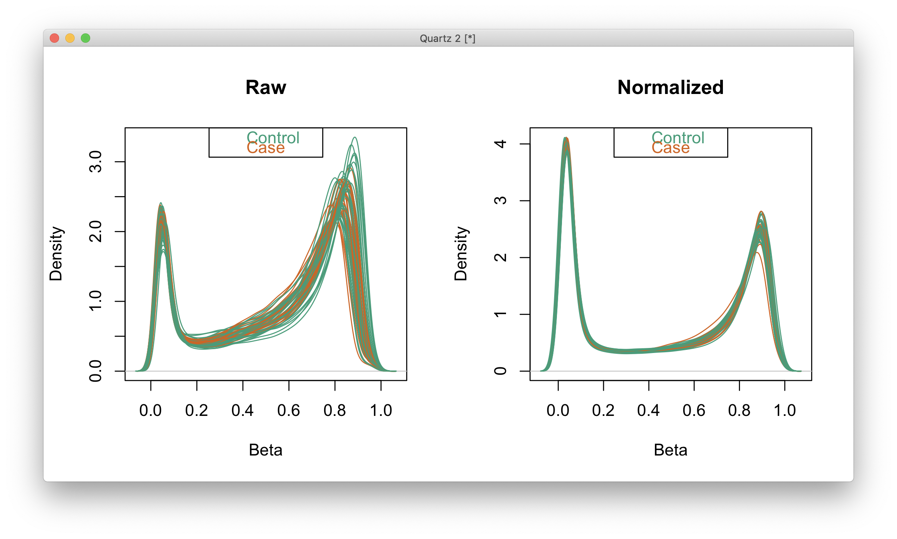
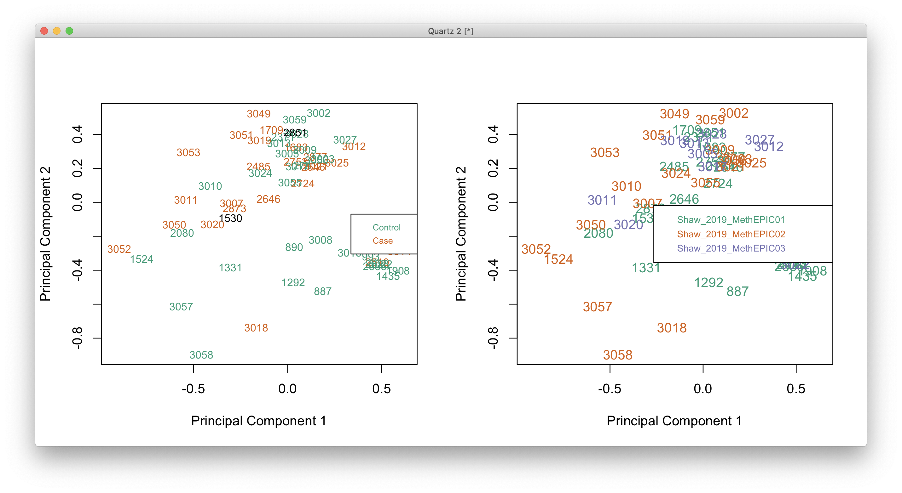
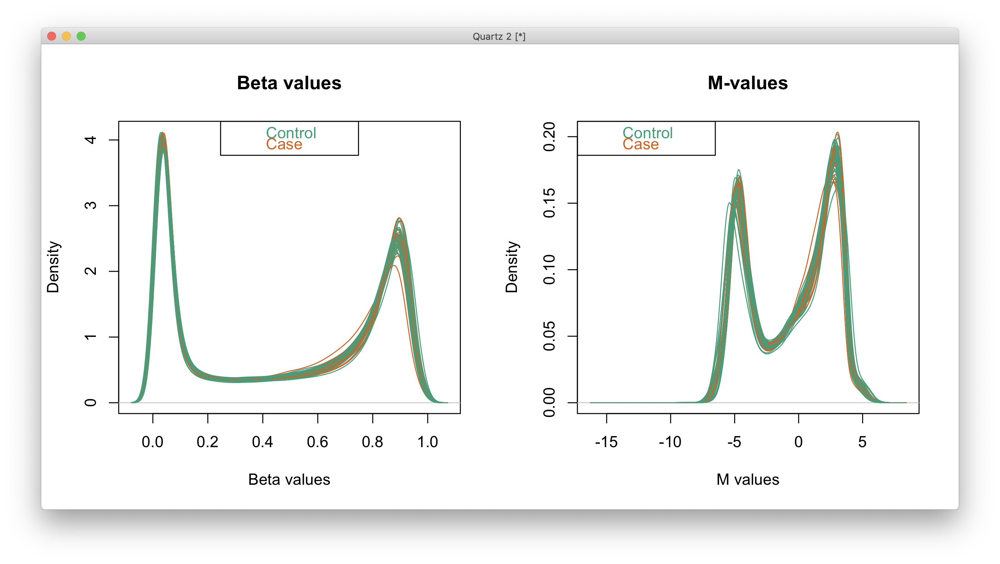

# 2021-02-22 11:20:08

Let's reuse the code for note 194 for the Caudate analysis.

```r
run_methyl = function(mVals, samples, subtype, ann450kSub) {
    cat('Starting with', nrow(mVals), 'variables\n')
    if (subtype == 'all') {
        keep_me = rep(TRUE, nrow(mVals))
    } else {
      keep_me = grepl(ann450kSub$Relation_to_Island,
                      pattern=sprintf('%s$', subtype))
    }
    cat('Keeping', sum(keep_me), subtype, 'variables\n')
    mVals = mVals[keep_me, ]
    ann450kSub = ann450kSub[keep_me, ]

    # removing variables with zero or near-zero variance
    library(caret)
    pp_order = c('zv', 'nzv')
    pp = preProcess(t(mVals), method = pp_order)
    X = t(predict(pp, t(mVals)))
    cat('Keeping', nrow(X), 'after NZ and NZV filtering\n')

    # remove the 2 probes with infinity
    bad_probes = rownames(which(abs(mVals)==Inf, arr.ind = T))
    X = X[!(rownames(X) %in% bad_probes), ]

    # checking which PCs are associated with our potential nuiscance variables
    set.seed(42)
    mypca <- prcomp(t(X), scale=TRUE)
    # how many PCs to keep... using Kaiser thredhold, close to eigenvalues < 1
    library(nFactors)
    eigs <- mypca$sdev^2
    nS = nScree(x=eigs)
    keep_me = seq(1, nS$Components$nkaiser)

    mydata = data.frame(mypca$x[, keep_me])
    # create main metadata data frame including metadata and PCs
    data.pm = cbind(samples, mydata)
    rownames(data.pm) = samples$hbcc_brain_id
    cat('Using', nS$Components$nkaiser, 'PCs from possible', ncol(X), '\n')

    # check which PCs are associated at nominal p<.01
    num_vars = c('Age', 'PMI', 'C1', 'C2', 'C3', 'C4', 'C5', 'pH')
    pc_vars = colnames(mydata)
    num_corrs = matrix(nrow=length(num_vars), ncol=length(pc_vars),
                    dimnames=list(num_vars, pc_vars))
    num_pvals = num_corrs
    for (x in num_vars) {
        for (y in pc_vars) {
            res = cor.test(samples[, x], mydata[, y], method='spearman')
            num_corrs[x, y] = res$estimate
            num_pvals[x, y] = res$p.value
        }
    }
    categ_vars = c('batch', 'Diagnosis', 'MoD', 'substance_group', 'brain_bank',
                'comorbid_group', 'POP_CODE', 'Sex', 'evidence_level')
    categ_corrs = matrix(nrow=length(categ_vars), ncol=length(pc_vars),
                    dimnames=list(categ_vars, pc_vars))
    categ_pvals = categ_corrs
    for (x in categ_vars) {
        for (y in pc_vars) {
            res = kruskal.test(mydata[, y], samples[, x])
            categ_corrs[x, y] = res$statistic
            categ_pvals[x, y] = res$p.value
        }
    }
    use_pcs = unique(c(which(num_pvals < .01, arr.ind = T)[, 'col'],
                    which(categ_pvals < .01, arr.ind = T)[, 'col']))
    # only use the ones not related to Diagnosis
    keep_me = c()
    for (pc in use_pcs) {
        keep_me = c(keep_me, categ_pvals['Diagnosis', pc] > .05)
    }
    use_pcs = use_pcs[keep_me]
    fm_str = sprintf('~ Diagnosis + %s', paste0(pc_vars[use_pcs],
                                                collapse = ' + '))
    cat('Found', length(use_pcs), 'PCs p < .01\n')
    cat('Using formula:', fm_str, '\n')

    # scaling PCs to assure convergence
    for (var in pc_vars[use_pcs]) {
        data.pm[, var] = scale(data.pm[, var])
    }

    library(limma)
    design = model.matrix(as.formula(fm_str), data.pm)
    fit <- lmFit(X, design)
    fit2 <- eBayes( fit )

    DMPs <- topTable(fit2, num=Inf, coef='DiagnosisCase', genelist=ann450kSub)
    library(missMethyl)
    fitvar <- varFit(X, design = design, coef = c(1,2))
    topDV <- topVar(fitvar, coef=2, number=nrow(X))
    m = merge(topDV, ann450kSub, by=0, sort=F)

    res = list(DMPs = DMPs, topDV=m, fm_str=fm_str, design=design,
               pcs = rbind(categ_pvals, num_pvals))
    return(res)
}
```

Time to load the actual data:

```r
myregion = 'Caudate'

library(IlluminaHumanMethylation450kanno.ilmn12.hg19)
ann450k <- getAnnotation(IlluminaHumanMethylation450kanno.ilmn12.hg19)
data_dir = '~/data/methylation_post_mortem/Shaw_2019_MethEPIC01/'
targets1 <- read.metharray.sheet(data_dir,
                                 pattern="Shaw_2019_MethEPIC01_ss.csv")
data_dir = '~/data/methylation_post_mortem/Shaw_2019_MethEPIC02/'
targets2 <- read.metharray.sheet(data_dir,
                                 pattern="Shaw_2019_MethEPIC02_ss.csv")
data_dir = '~/data/methylation_post_mortem/Shaw_2019_MethEPIC03/'
targets3 <- read.metharray.sheet(data_dir,
                                 pattern="Shaw_2019_MethEPIC03_ss.csv")
# Alex has already checked the QC samples, so let's just separate the ones
# we need 
targets = rbind(targets1, targets2, targets3)
targets = targets[grepl(x=targets$Sample_Name,
                  pattern=sprintf('%s$', myregion)), ]

meta = readRDS('~/data/rnaseq_derek/complete_rawCountData_05132020.rds')
meta = meta[meta$Region==myregion, ]
meta = meta[, !grepl(colnames(meta), pattern='^ENS')]
library(gdata)
more = read.xls('~/data/post_mortem/POST_MORTEM_META_DATA_JAN_2021.xlsx')
more = more[!duplicated(more$hbcc_brain_id),]
meta = merge(meta, more[, c('hbcc_brain_id', 'comorbid_group_update',
                            'substance_group', 'evidence_level')],
             by='hbcc_brain_id', all.x=T, all.y=F)

targets$hbcc_brain_id = as.numeric(gsub(x=targets$Sample_Name,
                                        pattern=sprintf('_%s', myregion),
                                        replacement=''))
samples = merge(targets, meta, by='hbcc_brain_id', all.x=T, all.y=F,
                sort=F)

# cleaning up some metadata
samples$POP_CODE = as.character(samples$POP_CODE)
samples[which(samples$POP_CODE=='WNH'), 'POP_CODE'] = 'W'
samples[which(samples$POP_CODE=='WH'), 'POP_CODE'] = 'W'
samples$POP_CODE = factor(samples$POP_CODE)
samples$Individual = factor(samples$hbcc_brain_id)
samples[which(samples$Manner.of.Death=='Suicide (probable)'),
        'Manner.of.Death'] = 'Suicide'
samples[which(samples$Manner.of.Death=='unknown'),
        'Manner.of.Death'] = 'natural'
samples$MoD = factor(samples$Manner.of.Death)
samples$batch = factor(samples$Sample_Group)
samples$Diagnosis = factor(samples$Diagnosis, levels=c('Control', 'Case'))
samples$substance_group = factor(samples$substance_group)
samples$comorbid_group = factor(samples$comorbid_group_update)
samples$evidence_level = factor(samples$evidence_level)
samples$brain_bank = factor(samples$bainbank)

# need extended for beadcount function
rgSet <- read.metharray.exp(targets=samples, extended=T)
sampleNames(rgSet) <- samples$hbcc_brain_id

save(rgSet, samples, myregion,
     file='~/data/methylation_post_mortem/raw_Caudate_02222021.RData')
```

We do some general cleanup in the subject level:

```r
library(IlluminaHumanMethylation450kanno.ilmn12.hg19)
ann450k <- getAnnotation(IlluminaHumanMethylation450kanno.ilmn12.hg19)
load('~/data/methylation_post_mortem/raw_Caudate_02222021.RData')
detP <- detectionP(rgSet)
keep <- colMeans(detP) < 0.05
rgSet <- rgSet[,keep]
samples <- samples[keep,]
detP <- detP[,keep]

qcReport(rgSet, sampNames=samples$original_brain_number,
         sampGroups=samples$Diagnosis,
         pdf="~/data/methylation_post_mortem/Caudate_qcReport_02222021.pdf")

mSetSq <- preprocessFunnorm(rgSet) 
```

Now we start the removal of different probes:

```r
# ensure probes are in the same order in the mSetSq and detP objects
detP <- detP[match(featureNames(mSetSq),rownames(detP)),] 

# remove any probes that have failed in one or more samples
keep <- rowSums(detP < 0.01) == ncol(mSetSq) 
mSetSqFlt <- mSetSq[keep,]

# remove probes on the sex chromosomes
keep <- !(featureNames(mSetSqFlt) %in% ann450k$Name[ann450k$chr %in% 
                                                        c("chrX","chrY")])
mSetSqFlt <- mSetSqFlt[keep,]

# remove probes with SNPs at CpG site
mSetSqFlt <- dropLociWithSnps(mSetSqFlt)

# exclude cross reactive probes
dataDirectory = '~/data/methylation_post_mortem/'
xReactiveProbes <- read.csv(file=paste(dataDirectory,
                                       "48639-non-specific-probes-Illumina450k.csv",
                                       sep="/"), stringsAsFactors=FALSE)
keep <- !(featureNames(mSetSqFlt) %in% xReactiveProbes$TargetID)
mSetSqFlt <- mSetSqFlt[keep,] 
```

And we can just use Champ to see what other probes it'd drop:

```r
library(wateRmelon)
library(ChAMP)
bc = beadcount(rgSet)
betas = getBeta(rgSet)
detP_champ <- detectionP(rgSet)
colnames(betas) = pData(rgSet)$Sample_Name
colnames(bc) = colnames(betas)
rownames(bc) = rownames(betas)
colnames(detP_champ) = colnames(betas)
rownames(detP_champ) = rownames(betas)
myLoad = champ.filter(beta=betas,
                      pd=pData(rgSet),
                      detP=detP_champ, beadcount=bc)
keep_me = rownames(mSetSqFlt) %in% rownames(myLoad$beta)
mSetSqFlt = mSetSqFlt[keep_me,]
keep_me = rownames(betas) %in% rownames(myLoad$beta)
rgSet = rgSet[keep_me,]
```

Let's proceed with the rest of the analysis. First, let's make a few
confirmation plots:

```r
library(RColorBrewer)
# visualise what the data looks like before and after normalisation
par(mfrow=c(1,2))
densityPlot(rgSet, sampGroups=samples$Diagnosis, main="Raw", legend=FALSE)
legend("top", legend = levels(samples$Diagnosis),
        text.col=brewer.pal(8,"Dark2"))
densityPlot(getBeta(mSetSqFlt), sampGroups=samples$Diagnosis,
            main="Normalized", legend=FALSE)
legend("top", legend = levels(samples$Diagnosis), 
       text.col=brewer.pal(8,"Dark2"))
```



And a couple MDs plots:

```r
# MDS plots to look at largest sources of variation
par(mfrow=c(1,2))
pal <- brewer.pal(8,"Dark2")
plotMDS(getM(mSetSqFlt), top=1000, gene.selection="common", 
        col=pal[samples$Diagnosis], cex=0.8)
legend("right", legend=levels(samples$Diagnosis), text.col=pal,
       cex=0.65, bg="white")

plotMDS(getM(mSetSqFlt), top=1000, gene.selection="common", 
        col=pal[samples$batch])
legend("right", legend=levels(samples$batch), text.col=pal,
       cex=0.7, bg="white")
```



There isn't much of a separation in MDS, which is expected. Also hard to pick
out who the "bad" Case is. If we look at the density plots there might be an off
one, but it's not obvious from the MDS plots.

```r
# removing subjects we don't have DX for
keep_me = (!samples$hbcc_brain_id %in% c(1530, 2851))
mSetSqFlt = mSetSqFlt[, keep_me]
rgSet = rgSet[, keep_me]
samples = samples[keep_me, ]

save(rgSet, samples, mSetSqFlt, myregion,
     file='~/data/methylation_post_mortem/filt_Caudate_02222021.RData')
```

We redo the plots with the clean data only:

```r
library(minfi)
library(RColorBrewer)
load('~/data/methylation_post_mortem/filt_Caudate_02222021.RData')
# calculate M-values for statistical analysis
mVals <- getM(mSetSqFlt)
# and b values for display and interpretation
bVals <- getBeta(mSetSqFlt)

par(mfrow=c(1,2))
densityPlot(bVals, sampGroups=samples$Diagnosis, main="Beta values", 
            legend=FALSE, xlab="Beta values")
legend("top", legend = levels(samples$Diagnosis), 
       text.col=brewer.pal(8,"Dark2"))
densityPlot(mVals, sampGroups=samples$Diagnosis, main="M-values", 
            legend=FALSE, xlab="M values")
legend("topleft", legend = levels(samples$Diagnosis), 
       text.col=brewer.pal(8,"Dark2"))
```



Now it's just a matter of reloading the data and running the individual
analysis:

```r
library(IlluminaHumanMethylation450kanno.ilmn12.hg19)
ann450k <- getAnnotation(IlluminaHumanMethylation450kanno.ilmn12.hg19)
# get the table of results for the first contrast (naive - rTreg)
ann450kSub <- ann450k[match(rownames(mVals),ann450k$Name),
                      c(1:4,12:19,24:ncol(ann450k))]

res_cau = list()
for (st in c('all', 'Island', 'Shelf', 'Shore', 'Sea')) {
    res_cau[[st]] = run_methyl(mVals, samples, st, ann450kSub)
}
save(res_cau, file='~/data/methylation_post_mortem/res_Caudate_02222021.RData')
```
