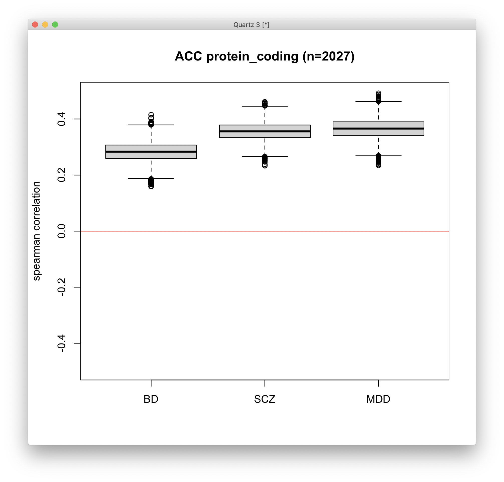
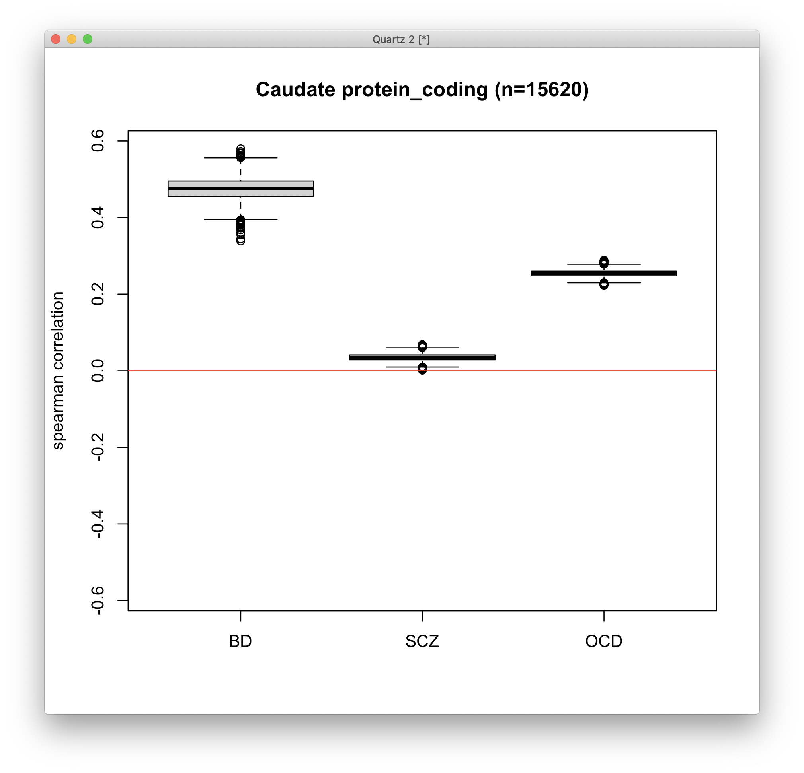
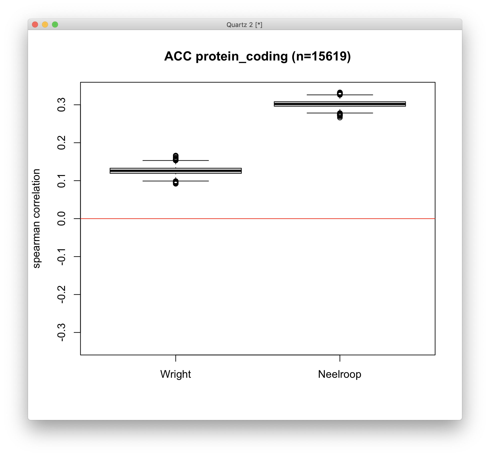

# 2021-02-26 10:55:01

This note summarizes the most recent results I got after running the following
analyses:

 * added new datasets for correlation to other disorders
 * re-ran methylation analysis
 * ran mediation through MESC

## Correlation

These were the initial results when looking at correlations to other disorders.
It used the meta-analysis results from the Gandal paper:
https://pubmed.ncbi.nlm.nih.gov/29439242/:


Kwangmi then found the Akula paper with ACC data:



And Paul dug out data for these three Caudate papers:

* https://www.researchgate.net/publication/304567691_Transcriptome_sequencing_implicates_dorsal_striatum-specific_gene_network_immune_response_and_energy_metabolism_pathways_in_bipolar_disorder
* https://www.medrxiv.org/content/10.1101/2020.11.18.20230540v1.full.pdf
* https://www.biorxiv.org/content/10.1101/2020.07.23.216697v1.full.pdf



ASD was not part of the papers above, so we tried to find papers for ACC and
Caudate RNAseq in that population. There were no exact hits, but we found a
couple for frontal cortex and DLPFC. Nothing for Caudate/Striatum/Basal ganglia
though. 

* https://www.nature.com/articles/nature20612#Sec13
* https://www.nature.com/articles/tp201787#Sec14



Both highly significant. The Neelroop paper has more subjects, it's in Nature,
and has frontal and temporal cortex in it. 

All papers mentioned above have the main text in PDF under papers_correlation folder.

## Methylation

I re-ran the methylation analysis following a combination of the current
pipeline Yun-Ching suggested, and the nuisance PC framework we used for the
DGE/DTE work. I ran them independently for ACC and Caudate, like the DGE/DTE/DTU
analyses. There are results for the following analyses:
 
 * **Differentially methylated probes (DMPs):** probe-level analysis looking for
   mean difference between Cases and Controls.
 * **Differentially variable probes (topVar):** also a probe-level analysis, but
   instead of looking for a mean difference between Cases and controls, it
   checks wheter one group has higher variance than the other.
 * **Differentially methylated regions (DMRs):** similar analysis as DMPs, but looks
  at summary regions instead of single probes.
 * **GSEA:** usual gene set analysis we run, using our own developmental + GWAS
   sets, and then the gene ontology, KEGG pathways, and protein reactome.
 * **PRS overlap:** run the exact same DMP analysis as above, but using the
   different PRS profiles as the independent variable (plus nuisancePCs),
   instead of the Diagnosis. Then, check for overlap with Diagnosis results.

### DMPs

I ran this for all probes, but also by splitting the probes between the
following subtypes: "all", "Island", "Shelf", "Shore", "Sea", "enhancer",
"body", "promoter1", and "promoter2" (akin to what was done for DGE/DTE splitting into lncRNA, etc). There were no
significant probes under FDR q < .05 for either ACC or Caudate, even after
splitting between the different probe subtypes. The only exception was the
promoter2 subtype for ACC, which had a single hit at SOX4 (this intronless gene
encodes a member of the SOX (SRY-related HMG-box) family of transcription
factors involved in the regulation of embryonic development and in the
determination of the cell fate). Could just be a spurious result though.

As a side note, I also tried other techniques besides the BH FDR procedure,
which I listed in the Genomics channel in Teams, to improve the "all" subtype
results. Unfortunately none of them helped in finding new discoveries.

### DMRs

This analysis requires a p-value threshold, which is used to define the
significant probes as seeds for the regions. It gets complicated as we didn't
have any significant results after corrections, so we're restricted to nominal
cut-offs. 

To that end, I selected a nominal p-value of p=.005, and saw 26 different
regions that showed some significance. I didn't take the analysis further
because there were many other things to try, and the methylation analysis was
mostly confirmatory. If we didn't have any strong results, I didn't pursue it.
But there's room here for further exploration if we don't mind going forward
with nominal p-value thresholds.

### topVar

Here we did get 6 5 probes significant at FDR q < .05.


I then ran an analysis similar to DMR, but this time using the top variant
probes as seeds, and it didn't pan out to anything.

I contacted Yun-Ching to see how common this variance analysis is. Here's what
he said:

```
I don't see many papers focusing on differential variability myself.
The example I remember is the paper cited in the webpage which studied methylation in cancer.
It is probably because cancer is a heterogeneous disease so we cannot expect alterations in all patients moving toward the same direction.
I would not put much attention on it unless we believe the disease is very heterogeneous and can be more explained by variability among patents rather than mean shift in one direction.
```

So, I didn't think it was worth exploring further. It didn't seem to have a very
strong basis to stand on, especially as the pattern between Controls and Cases
in the 5 significant probes is not clear (i.e. Cases more variable in some
probes, Controls in others.) If we decide to pursue it, we'd at least need to
run something similar for DGE/DTE.

### GSEA

All these results are in directory methylation_GSEA. An example file is
ACC_all_DMP_glm_Biological_Process. The naming structure includes:
 * ACC/Caudate
 * probe types used
 * analysis that generated p-values for ranking the probe list
 * probe normalization method (some genes are represented by multiple probes, so
   there are 2 different methods to adjust for that: glm and RRA)
 * gene sets

I went through all those files, and here are the main themes I found:

 * as expected, the story is very different for DMP and topVar results. I
   focused mostly on DMP, given the rationaly above. But topVar results can be
   strong too, especially for the GWAS set.
 * there isn't much of a story for our developmental sets. Nothing was really
   significant. The GWAS set is nominally significant in ACC, but only when using RRA.
   Looking at all probes (p = 0.045954046), driven by body (p=0.02997003) and
   promoter1 (p=0.046953047) probes.
 * the cellular component sets for ACC show euchromatin for DMP_all_RRA, and  transcription repressor complex, exon-exon junction complex, and
   transcription regulator complex for DMP_promoter2_RRA. This could be
   interesting as it might be related to the changes we're seeing in the
   transcriptome?
 * in molecular function sets for ACC I see transcription corepressor activity
   (promoter2_DMP_RRA), and steroid hormone receptor activity, ligand-activated
   transcription factor activity, SNAP receptor activity, repressing
   transcription factor binding for all_DMP_RRA. Again, it might be related to
   the changes we see in the transcriptome.
 * GSEA results for the Caudate had a similar pattern: topVar results varied
   from DMPs (as expected). There is a GWAS hit at 0.038961039 for
   promoter1_DMP_RRA, and non-motile cilium for the cellular components sets and
   all_DMP_RRA. The reactome had lots of hits, especially related to FGFR3 and
   FGFR4. FGF3 is fibroblast growth factor receptor 3. These proteins play a
   role in several important cellular processes, including regulation of cell growth and
division (proliferation), determination of cell type, formation of blood vessels
(angiogenesis), wound healing, and embryo development.
(https://medlineplus.gov/genetics/gene/fgfr3/#conditions). FGFR4 does something
similar. 

### PRS

I then ran the same analysis as it was done for DMPs, but replaced the DX
independent variable by different PRS profiles. Like before, I calculated the
overlap between absolute value, up, and down probes. The results are in the
PRS_overlap folder. 

Looking at the ACC results, there seems to be a significant overlap only for the
most strict values of PRS (PRS0.000050), and it's distributed across the
different types of probes. It's also somewhat distributed between up and down
regulated probes. But the effect is more pronounced for other PRS thresholds
when we split it between up and down probes.

We see a similar pattern for the Caudate. The results for the Caudate seem to be
a bit stronger though.

## MESC

Back to gene expression, the other analysis I ran was whether gene expression
mediates the effects of SNPs in the DX phenotype. It uses MESC
(https://github.com/douglasyao/mesc). It does that through heritability: it
calculates the phenotype heritability (h2), and then splits that into mediated
(h2med) and not mediated (h2nonmed) by gene expression.

To calculate those values, it uses:
 * our PM gene expression data (same data we used for DGE)
 * the genotype data for our PM samples
 * genotype data for samples that are ancestry-matched to the given GWAS of
   interest (they recommend using 1K Genomes data)
 * the PGC 2017 GWAS data.
  
Our genotype data were actually imputed to 1KG, so it makes sense to use that anyways.

I ran MESC for ACC and Caudate, using the WNH and ALL GWAS, but the results were
inconclusive. They are all in the mediation folder, and they are simple tables that
can be opened in Excel. The .all. files have all 3 h2 metrics, and you'll notice
that h2med is hardly ever above 0. Our "best" result is
out_MESC_eur_cleanACC.all.h2med.csv, which shows a tiny h2med, but it's 2% of
the total heritability. The original MESC paper estimated that, on average, only
11% of trait heritability was due to gene expression (in the GTEx cohort), so
we're not terribly off. Still, the overall result seem unsatisfactory.

MESC also estimates those metrics for different gene groups. By default it
splits the genes into quintiles by their heritability, so that's the .categ.
files you'll see in the folder. I didn't find them too informative though.

I'm working on running our own gene sets, like our developmental set and the
significant GO sets. Maybe something interesting will come out of that, but the
software is breaking, so I need to figure out why. I'll also try to run our
genotype pre-imputation, in case the imputation process is doing anything funky
(I doubt it, but worth a try).