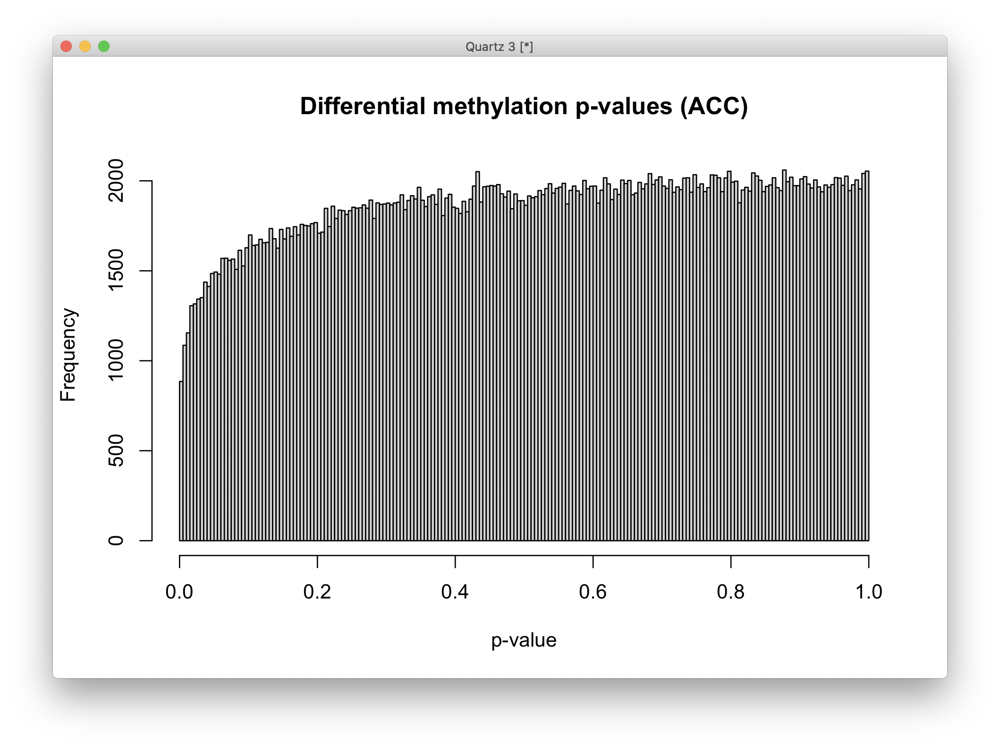

# 2021-03-10 09:57:12

Looking over Alex's slides again, I noticed he tested for some covariates I
didn't have in my gene expression data, so it might be worth checking out
whether they'd require removing different PCs. I'm using the code from note 196
as my base.

```r
run_methyl = function(mVals, samples, subtype, ann450kSub) {
    cat('Starting with', nrow(mVals), 'variables\n')
    if (subtype == 'all') {
        keep_me = rep(TRUE, nrow(mVals))
    } else {
      keep_me = grepl(ann450kSub$Relation_to_Island,
                      pattern=sprintf('%s$', subtype))
    }
    cat('Keeping', sum(keep_me), subtype, 'variables\n')
    mVals = mVals[keep_me, ]
    ann450kSub = ann450kSub[keep_me, ]

    # removing variables with zero or near-zero variance
    library(caret)
    pp_order = c('zv', 'nzv')
    pp = preProcess(t(mVals), method = pp_order)
    X = t(predict(pp, t(mVals)))
    cat('Keeping', nrow(X), 'after NZ and NZV filtering\n')

    # remove the 2 probes with infinity
    bad_probes = rownames(which(abs(mVals)==Inf, arr.ind = T))
    X = X[!(rownames(X) %in% bad_probes), ]

    # checking which PCs are associated with our potential nuiscance variables
    set.seed(42)
    mypca <- prcomp(t(X), scale=TRUE)
    # how many PCs to keep... using Kaiser thredhold, close to eigenvalues < 1
    library(nFactors)
    eigs <- mypca$sdev^2
    nS = nScree(x=eigs)
    keep_me = seq(1, nS$Components$nkaiser)

    mydata = data.frame(mypca$x[, keep_me])
    # create main metadata data frame including metadata and PCs
    data.pm = cbind(samples, mydata)
    rownames(data.pm) = samples$hbcc_brain_id
    cat('Using', nS$Components$nkaiser, 'PCs from possible', ncol(X), '\n')

    # check which PCs are associated at nominal p<.01
    qc_vars = c("Restoration", "Staining.Green", "Staining.Red",
                "Extension.Green", "Extension.Red", "Hybridization.High.Medium",
                "Hybridization.Medium.Low", "Target.Removal.1",
                "Target.Removal.2", "Bisulfite.Conversion.I.Green",
                "Bisulfite.Conversion.I.Red", "Bisulfite.Conversion.II",
                "Specificity.I.Green", "Specificity.I.Red", "Specificity.II",
                "Non.polymorphic.Green", "Non.polymorphic.Red")
    num_vars = c('Age', 'PMI', 'C1', 'C2', 'C3', 'C4', 'C5', 'pH', qc_vars)
    pc_vars = colnames(mydata)
    num_corrs = matrix(nrow=length(num_vars), ncol=length(pc_vars),
                    dimnames=list(num_vars, pc_vars))
    num_pvals = num_corrs
    for (x in num_vars) {
        for (y in pc_vars) {
            res = cor.test(samples[, x], mydata[, y], method='spearman')
            num_corrs[x, y] = res$estimate
            num_pvals[x, y] = res$p.value
        }
    }
    categ_vars = c('Diagnosis', 'MoD', 'substance_group', 'brain_bank',
                'comorbid_group', 'POP_CODE', 'Sex', 'evidence_level', 'Kit',
                'Sample_Plate', 'Sample_Group', 'Sample_Well', 'Scanner',
                'Sentrix_ID', 'Sentrix_Position')
    categ_corrs = matrix(nrow=length(categ_vars), ncol=length(pc_vars),
                    dimnames=list(categ_vars, pc_vars))
    categ_pvals = categ_corrs
    for (x in categ_vars) {
        for (y in pc_vars) {
            res = kruskal.test(mydata[, y], samples[, x])
            categ_corrs[x, y] = res$statistic
            categ_pvals[x, y] = res$p.value
        }
    }
    use_pcs = unique(c(which(num_pvals < .01, arr.ind = T)[, 'col'],
                    which(categ_pvals < .01, arr.ind = T)[, 'col']))
    # only use the ones not related to Diagnosis
    keep_me = c()
    for (pc in use_pcs) {
        keep_me = c(keep_me, categ_pvals['Diagnosis', pc] > .05)
    }
    use_pcs = use_pcs[keep_me]
    fm_str = sprintf('~ Diagnosis + %s', paste0(pc_vars[use_pcs],
                                                collapse = ' + '))
    cat('Found', length(use_pcs), 'PCs p < .01\n')
    cat('Using formula:', fm_str, '\n')

    # scaling PCs to assure convergence
    for (var in pc_vars[use_pcs]) {
        data.pm[, var] = scale(data.pm[, var])
    }

    library(limma)
    design = model.matrix(as.formula(fm_str), data.pm)
    fit <- lmFit(X, design)
    fit2 <- eBayes( fit )

    DMPs <- topTable(fit2, num=Inf, coef='DiagnosisCase', genelist=ann450kSub)
    library(missMethyl)
    fitvar <- varFit(X, design = design, coef = c(1,2))
    topDV <- topVar(fitvar, coef=2, number=nrow(X))
    m = merge(topDV, ann450kSub, by=0, sort=F)

    res = list(DMPs = DMPs, topDV=m, fm_str=fm_str, design=design,
               pcs = rbind(categ_pvals, num_pvals))
    return(res)
}
```

The thing here is that we need to add a few more covariates. Specifically, they
come from control variables and some stuff that Alex dug out in his metadata
matrix. So, let's load those data:

```r
rootDir <- "~/data/methylation_post_mortem"
rawDataDir <- paste(rootDir, '/Shaw2019', sep="")
samplesFile <- paste(rootDir, '/samples.csv', sep="")

# disable scientific notation
samples <- read.csv(samplesFile)
samples$Sample_Group <- as.factor(as.character(samples$Diagnosis))
samples$Basename <- paste0(rawDataDir, '/',  samples$Sentrix_ID, '/',
                           samples$Sentrix_ID,'_',samples$Sentrix_Position)
samples$Sentrix_ID <- as.factor(samples$Sentrix_ID)
samples$Sample_Group <- as.factor(samples$Sample_Group)
samples$Row <- as.factor(substr(samples$Sentrix_Position, 1, 3))
samples$Scanner <- as.factor(samples$Scanner)
samples$Region <- as.factor(samples$Region)
samples$Sex <- as.factor(samples$Sex)
samples$Kit <- as.factor(samples$Kit)
samples$Sample_Plate <- as.factor(samples$Sample_Plate)

library(ewastools)
raw = read_idats(samples$Basename, quiet = FALSE)
ctrls = control_metrics(raw)
df_ctrls = as.data.frame(ctrls)
rownames(df_ctrls) <- samples$Sample_Name
more_covars = cbind(samples, df_ctrls)
saveRDS(more_covars, file='~/data/methylation_post_mortem/more_covars.rds')
```

Let's use some of the work we've done in the past:

```r
library(minfi)
load('~/data/methylation_post_mortem/filt_ACC_02182021.RData')
# calculate M-values for statistical analysis
mVals <- getM(mSetSqFlt)
# and b values for display and interpretation
bVals <- getBeta(mSetSqFlt)

library(IlluminaHumanMethylation450kanno.ilmn12.hg19)
ann450k <- getAnnotation(IlluminaHumanMethylation450kanno.ilmn12.hg19)
# get the table of results for the first contrast (naive - rTreg)
ann450kSub <- ann450k[match(rownames(mVals),ann450k$Name),
                      c(1:4,12:19,24:ncol(ann450k))]
```

Now it's just a mater of adding those variables to our sample:

```r
more_covars = readRDS('~/data/methylation_post_mortem/more_covars.rds')
more_covars = more_covars[more_covars$Region == 'ACC',]
samples2 = merge(samples, more_covars[, c('hbcc_brain_id', "Sentrix_ID",
                                          "Sentrix_Position", 'Kit',
                                          colnames(more_covars)[26:42])],
                by='hbcc_brain_id', all.x=T, all.y=F, sort=F)

res = run_methyl(mVals, samples2, 'all', ann450kSub)
```

Hum... so, it does change things, because different PCs were picked... let's see
what changes in the results. Note that I realized that the 031020201 results are
bad... I forgot to unsort the samples matrix. Re-running it all now:

```r
res_acc = list()
for (st in c('all', 'Island', 'Shelf', 'Shore', 'Sea')) {
    res_acc[[st]] = run_methyl(mVals, samples2, st, ann450kSub)
}
idx = ann450kSub$Enhancer == "TRUE"
res_acc[['enhancer']] = run_methyl(mVals[idx,], samples2, 'all', ann450kSub[idx,])
idx = (grepl(x=ann450kSub$UCSC_RefGene_Group, pattern="Body") |
       grepl(x=ann450kSub$UCSC_RefGene_Group, pattern="1stExon"))
res_acc[['body']] = run_methyl(mVals[idx,], samples2, 'all', ann450kSub[idx,])
idx = (grepl(x=ann450kSub$UCSC_RefGene_Group, pattern="TSS1500") |
       grepl(x=ann450kSub$UCSC_RefGene_Group, pattern="TSS200"))
res_acc[['promoter1']] = run_methyl(mVals[idx,], samples2, 'all', ann450kSub[idx,])
idx = (grepl(x=ann450kSub$UCSC_RefGene_Group, pattern="TSS1500") |
       grepl(x=ann450kSub$UCSC_RefGene_Group, pattern="TSS200") |
       grepl(x=ann450kSub$UCSC_RefGene_Group, pattern="1stExon") |
       grepl(x=ann450kSub$UCSC_RefGene_Group, pattern="5\'UTR") )
res_acc[['promoter2']] = run_methyl(mVals[idx,], samples2, 'all', ann450kSub[idx,])
save(res_acc, file='~/data/methylation_post_mortem/res_ACC_03122021.RData')
```

Now, let's repeat the same stuff for the Caudate:

```r
library(minfi)
load('~/data/methylation_post_mortem/filt_Caudate_02222021.RData')
# calculate M-values for statistical analysis
mVals <- getM(mSetSqFlt)
# and b values for display and interpretation
bVals <- getBeta(mSetSqFlt)

library(IlluminaHumanMethylation450kanno.ilmn12.hg19)
ann450k <- getAnnotation(IlluminaHumanMethylation450kanno.ilmn12.hg19)
# get the table of results for the first contrast (naive - rTreg)
ann450kSub <- ann450k[match(rownames(mVals),ann450k$Name),
                      c(1:4,12:19,24:ncol(ann450k))]
more_covars = readRDS('~/data/methylation_post_mortem/more_covars.rds')
more_covars = more_covars[more_covars$Region == 'Caudate',]
samples2 = merge(samples, more_covars[, c('hbcc_brain_id', "Sentrix_ID",
                                          "Sentrix_Position", 'Kit',
                                          colnames(more_covars)[26:42])],
                by='hbcc_brain_id', all.x=T, all.y=F, sort=F)

res_cau = list()
for (st in c('all', 'Island', 'Shelf', 'Shore', 'Sea')) {
    res_cau[[st]] = run_methyl(mVals, samples2, st, ann450kSub)
}
idx = ann450kSub$Enhancer == "TRUE"
res_cau[['enhancer']] = run_methyl(mVals[idx,], samples2, 'all', ann450kSub[idx,])
idx = (grepl(x=ann450kSub$UCSC_RefGene_Group, pattern="Body") |
       grepl(x=ann450kSub$UCSC_RefGene_Group, pattern="1stExon"))
res_cau[['body']] = run_methyl(mVals[idx,], samples2, 'all', ann450kSub[idx,])
idx = (grepl(x=ann450kSub$UCSC_RefGene_Group, pattern="TSS1500") |
       grepl(x=ann450kSub$UCSC_RefGene_Group, pattern="TSS200"))
res_cau[['promoter1']] = run_methyl(mVals[idx,], samples2, 'all', ann450kSub[idx,])
idx = (grepl(x=ann450kSub$UCSC_RefGene_Group, pattern="TSS1500") |
       grepl(x=ann450kSub$UCSC_RefGene_Group, pattern="TSS200") |
       grepl(x=ann450kSub$UCSC_RefGene_Group, pattern="1stExon") |
       grepl(x=ann450kSub$UCSC_RefGene_Group, pattern="5\'UTR") )
res_cau[['promoter2']] = run_methyl(mVals[idx,], samples2, 'all', ann450kSub[idx,])
save(res_cau, file='~/data/methylation_post_mortem/res_Caudate_03122021.RData')
```

Finally, let's write out our methylation results.

```r
mydir = '~/data/methylation_post_mortem/'
for (r in c('acc', 'cau')) {
    region = ifelse(r=='acc', 'ACC', 'Caudate')
    load(sprintf('~/data/methylation_post_mortem/res_%s_03102021.RData',
                 region))
    for (st in c("all", "Island", "Shelf", "Shore", "Sea", "enhancer", "body",
                 "promoter1", "promoter2")) {
        res_str = sprintf('res = res_%s[["%s"]]', r, st)
        eval(parse(text=res_str))
        fname = sprintf('%s/methylDMP_%s_%s_annot_03102021.csv', mydir, r, st)

        df = as.data.frame(res$DMPs)
        df2 = df[order(df$P.Value), ]
        write.csv(df2, row.names=F, file=fname)
    }
}
```

## PRS

Because I added a few more covariates, we need to also add them to the PRS
analysis:

```r
run_methyl_PRS = function(mVals, samples, subtype, ann450kSub, prs) {
    cat('Starting with', nrow(mVals), 'variables\n')
    if (subtype == 'all') {
        keep_me = rep(TRUE, nrow(mVals))
    } else {
      keep_me = grepl(ann450kSub$Relation_to_Island,
                      pattern=sprintf('%s$', subtype))
    }
    cat('Keeping', sum(keep_me), subtype, 'variables\n')
    mVals = mVals[keep_me, ]
    ann450kSub = ann450kSub[keep_me, ]

    # removing variables with zero or near-zero variance
    library(caret)
    pp_order = c('zv', 'nzv')
    pp = preProcess(t(mVals), method = pp_order)
    X = t(predict(pp, t(mVals)))
    cat('Keeping', nrow(X), 'after NZ and NZV filtering\n')

    # remove the 2 probes with infinity
    bad_probes = rownames(which(abs(mVals)==Inf, arr.ind = T))
    X = X[!(rownames(X) %in% bad_probes), ]

    # checking which PCs are associated with our potential nuiscance variables
    set.seed(42)
    mypca <- prcomp(t(X), scale=TRUE)
    # how many PCs to keep... using Kaiser thredhold, close to eigenvalues < 1
    library(nFactors)
    eigs <- mypca$sdev^2
    nS = nScree(x=eigs)
    keep_me = seq(1, nS$Components$nkaiser)

    mydata = data.frame(mypca$x[, keep_me])
    # create main metadata data frame including metadata and PCs
    data.pm = cbind(samples, mydata)
    rownames(data.pm) = samples$hbcc_brain_id
    # scaling PRS to make computations easier to converge
    data.pm[, prs] = scale(data.pm[, prs])
    cat('Using', nS$Components$nkaiser, 'PCs from possible', ncol(X), '\n')

    # check which PCs are associated at nominal p<.01
    qc_vars = c("Restoration", "Staining.Green", "Staining.Red",
                "Extension.Green", "Extension.Red", "Hybridization.High.Medium",
                "Hybridization.Medium.Low", "Target.Removal.1",
                "Target.Removal.2", "Bisulfite.Conversion.I.Green",
                "Bisulfite.Conversion.I.Red", "Bisulfite.Conversion.II",
                "Specificity.I.Green", "Specificity.I.Red", "Specificity.II",
                "Non.polymorphic.Green", "Non.polymorphic.Red")
    num_vars = c('Age', 'PMI', 'C1', 'C2', 'C3', 'C4', 'C5', 'pH', qc_vars, prs)
    pc_vars = colnames(mydata)
    num_corrs = matrix(nrow=length(num_vars), ncol=length(pc_vars),
                    dimnames=list(num_vars, pc_vars))
    num_pvals = num_corrs
    for (x in num_vars) {
        for (y in pc_vars) {
            res = cor.test(samples[, x], mydata[, y], method='spearman')
            num_corrs[x, y] = res$estimate
            num_pvals[x, y] = res$p.value
        }
    }
    categ_vars = c('MoD', 'substance_group', 'brain_bank',
                'comorbid_group', 'POP_CODE', 'Sex', 'evidence_level', 'Kit',
                'Sample_Plate', 'Sample_Group', 'Sample_Well', 'Scanner',
                'Sentrix_ID', 'Sentrix_Position')
    categ_corrs = matrix(nrow=length(categ_vars), ncol=length(pc_vars),
                    dimnames=list(categ_vars, pc_vars))
    categ_pvals = categ_corrs
    for (x in categ_vars) {
        for (y in pc_vars) {
            res = kruskal.test(mydata[, y], samples[, x])
            categ_corrs[x, y] = res$statistic
            categ_pvals[x, y] = res$p.value
        }
    }
    use_pcs = unique(c(which(num_pvals < .01, arr.ind = T)[, 'col'],
                    which(categ_pvals < .01, arr.ind = T)[, 'col']))
    # only use the ones not related to Diagnosis
    keep_me = c()
    for (pc in use_pcs) {
        keep_me = c(keep_me, num_pvals[prs, pc] > .05)
    }
    use_pcs = use_pcs[keep_me]
    fm_str = sprintf('~ %s + %s', prs, paste0(pc_vars[use_pcs],
                                                collapse = ' + '))
    cat('Found', length(use_pcs), 'PCs p < .01\n')
    cat('Using formula:', fm_str, '\n')

    # scaling PCs to assure convergence
    for (var in pc_vars[use_pcs]) {
        data.pm[, var] = scale(data.pm[, var])
    }

    library(limma)
    design = model.matrix(as.formula(fm_str), data.pm)
    fit <- lmFit(X, design)
    fit2 <- eBayes( fit )

    DMPs <- topTable(fit2, num=Inf, coef=prs, genelist=ann450kSub)
    library(missMethyl)
    fitvar <- varFit(X, design = design, coef = c(1,2))
    topDV <- topVar(fitvar, coef=2, number=nrow(X))
    m = merge(topDV, ann450kSub, by=0, sort=F)

    res = list(DMPs = DMPs, topDV=m, fm_str=fm_str, design=design,
               pcs = rbind(categ_pvals, num_pvals))
    return(res)
}
```

```r
library(minfi)
load('~/data/methylation_post_mortem/filt_ACC_02182021.RData')
mVals = getM(mSetSqFlt)
library(IlluminaHumanMethylation450kanno.ilmn12.hg19)
ann450k <- getAnnotation(IlluminaHumanMethylation450kanno.ilmn12.hg19)
ann450kSub <- ann450k[match(rownames(mVals),ann450k$Name),
                      c(1:4,12:19,24:ncol(ann450k))]

# Grabbing PRS
fname = '~/data/post_mortem/genotyping/1KG/merged_PM_1KG_PRS_12032020.csv'
prs = read.csv(fname)
prs$hbcc_brain_id = sapply(prs$IID,
                          function(x) {
                              br = strsplit(x, '_')[[1]][2];
                              as.numeric(gsub(br, pattern='BR',
                                              replacement=''))})
imWNH = samples$C1 > 0 & samples$C2 < -.075
wnh_brains = samples[which(imWNH),]$hbcc_brain_id
# using the most appropriate PRS, make sure we don't switch subject order
m = merge(samples, prs, by='hbcc_brain_id', sort=F)
prs_names = sapply(c(.0001, .001, .01, .1, .00005, .0005, .005, .05,
                      .5, .4, .3, .2),
                   function(x) sprintf('PRS%f', x))
m[, prs_names] = NA
keep_me = m$hbcc_brain_id %in% wnh_brains
m[keep_me, prs_names] = m[keep_me, 83:94]
m[!keep_me, prs_names] = m[!keep_me, 71:82]
data.prs = m[, c(1:69, 95:106)]

mVals.prs = mVals[, samples$hbcc_brain_id %in% data.prs$hbcc_brain_id]

more_covars = readRDS('~/data/methylation_post_mortem/more_covars.rds')
more_covars = more_covars[more_covars$Region == 'ACC',]
samples2 = merge(data.prs, more_covars[, c('hbcc_brain_id', "Sentrix_ID",
                                          "Sentrix_Position", 'Kit',
                                          colnames(more_covars)[26:42])],
                 by='hbcc_brain_id', all.x=T, all.y=F, sort=F)

prs_names = sapply(c(.0001, .001, .01, .1, .00005, .0005, .005, .05,
                      .5, .4, .3, .2),
                   function(x) sprintf('PRS%f', x))
all_res = list()
for (prs in prs_names) {
    st_res = list()
    for (st in c('all', 'Island', 'Shelf', 'Shore', 'Sea')) {
        st_res[[st]] = run_methyl_PRS(mVals.prs, samples2, st, ann450kSub, prs)
    }
    idx = ann450kSub$Enhancer == "TRUE"
    st_res[['enhancer']] = run_methyl_PRS(mVals.prs[idx,], samples2, 'all',
                                          ann450kSub[idx,], prs)
    idx = (grepl(x=ann450kSub$UCSC_RefGene_Group, pattern="Body") |
        grepl(x=ann450kSub$UCSC_RefGene_Group, pattern="1stExon"))
    st_res[['body']] = run_methyl_PRS(mVals.prs[idx,], samples2, 'all',
                                      ann450kSub[idx,], prs)
    idx = (grepl(x=ann450kSub$UCSC_RefGene_Group, pattern="TSS1500") |
        grepl(x=ann450kSub$UCSC_RefGene_Group, pattern="TSS200"))
    st_res[['promoter1']] = run_methyl_PRS(mVals.prs[idx,], samples2, 'all',
                                          ann450kSub[idx,], prs)
    idx = (grepl(x=ann450kSub$UCSC_RefGene_Group, pattern="TSS1500") |
        grepl(x=ann450kSub$UCSC_RefGene_Group, pattern="TSS200") |
        grepl(x=ann450kSub$UCSC_RefGene_Group, pattern="1stExon") |
        grepl(x=ann450kSub$UCSC_RefGene_Group, pattern="5\'UTR") )
    st_res[['promoter2']] = run_methyl_PRS(mVals.prs[idx,], samples2, 'all',
                                          ann450kSub[idx,], prs)
    all_res[[prs]] = st_res
}
save(all_res, prs_names,
     file='~/data/methylation_post_mortem/res_ACC_PRS_03122021.RData')
```

As usual, repeat it for the caudate:

```r
library(minfi)
load('~/data/methylation_post_mortem/filt_Caudate_02222021.RData')
mVals = getM(mSetSqFlt)
library(IlluminaHumanMethylation450kanno.ilmn12.hg19)
ann450k <- getAnnotation(IlluminaHumanMethylation450kanno.ilmn12.hg19)
ann450kSub <- ann450k[match(rownames(mVals),ann450k$Name),
                      c(1:4,12:19,24:ncol(ann450k))]

# Grabbing PRS
fname = '~/data/post_mortem/genotyping/1KG/merged_PM_1KG_PRS_12032020.csv'
prs = read.csv(fname)
prs$hbcc_brain_id = sapply(prs$IID,
                          function(x) {
                              br = strsplit(x, '_')[[1]][2];
                              as.numeric(gsub(br, pattern='BR',
                                              replacement=''))})
imWNH = samples$C1 > 0 & samples$C2 < -.075
wnh_brains = samples[which(imWNH),]$hbcc_brain_id
# using the most appropriate PRS, make sure we don't switch subject order
m = merge(samples, prs, by='hbcc_brain_id', sort=F)
prs_names = sapply(c(.0001, .001, .01, .1, .00005, .0005, .005, .05,
                      .5, .4, .3, .2),
                   function(x) sprintf('PRS%f', x))
m[, prs_names] = NA
keep_me = m$hbcc_brain_id %in% wnh_brains
m[keep_me, prs_names] = m[keep_me, 83:94]
m[!keep_me, prs_names] = m[!keep_me, 71:82]
data.prs = m[, c(1:69, 95:106)]

mVals.prs = mVals[, samples$hbcc_brain_id %in% data.prs$hbcc_brain_id]

more_covars = readRDS('~/data/methylation_post_mortem/more_covars.rds')
more_covars = more_covars[more_covars$Region == 'Caudate',]
samples2 = merge(data.prs, more_covars[, c('hbcc_brain_id', "Sentrix_ID",
                                          "Sentrix_Position", 'Kit',
                                          colnames(more_covars)[26:42])],
                 by='hbcc_brain_id', all.x=T, all.y=F, sort=F)

prs_names = sapply(c(.0001, .001, .01, .1, .00005, .0005, .005, .05,
                      .5, .4, .3, .2),
                   function(x) sprintf('PRS%f', x))
all_res = list()
for (prs in prs_names) {
    st_res = list()
    for (st in c('all', 'Island', 'Shelf', 'Shore', 'Sea')) {
        st_res[[st]] = run_methyl_PRS(mVals.prs, samples2, st, ann450kSub, prs)
    }
    idx = ann450kSub$Enhancer == "TRUE"
    st_res[['enhancer']] = run_methyl_PRS(mVals.prs[idx,], samples2, 'all',
                                          ann450kSub[idx,], prs)
    idx = (grepl(x=ann450kSub$UCSC_RefGene_Group, pattern="Body") |
        grepl(x=ann450kSub$UCSC_RefGene_Group, pattern="1stExon"))
    st_res[['body']] = run_methyl_PRS(mVals.prs[idx,], samples2, 'all',
                                      ann450kSub[idx,], prs)
    idx = (grepl(x=ann450kSub$UCSC_RefGene_Group, pattern="TSS1500") |
        grepl(x=ann450kSub$UCSC_RefGene_Group, pattern="TSS200"))
    st_res[['promoter1']] = run_methyl_PRS(mVals.prs[idx,], samples2, 'all',
                                          ann450kSub[idx,], prs)
    idx = (grepl(x=ann450kSub$UCSC_RefGene_Group, pattern="TSS1500") |
        grepl(x=ann450kSub$UCSC_RefGene_Group, pattern="TSS200") |
        grepl(x=ann450kSub$UCSC_RefGene_Group, pattern="1stExon") |
        grepl(x=ann450kSub$UCSC_RefGene_Group, pattern="5\'UTR") )
    st_res[['promoter2']] = run_methyl_PRS(mVals.prs[idx,], samples2, 'all',
                                          ann450kSub[idx,], prs)
    all_res[[prs]] = st_res
}
save(all_res, prs_names,
     file='~/data/methylation_post_mortem/res_Caudate_PRS_03122021.RData')
```

Let's compute the PRS and DX overlaps:

```r
library(GeneOverlap)

for (r in c('ACC', 'Caudate')) {
    load(sprintf('~/data/methylation_post_mortem/res_%s_PRS_03102021.RData',
                 r))
    prs_res = all_res
    load(sprintf('~/data/methylation_post_mortem/res_%s_03102021.RData', r))
    res_str = ifelse(myregion=='ACC', 'dx_res = res_acc',
                     'dx_res = res_cau')
    eval(parse(text=res_str))

    prs_names = sapply(c(.0001, .001, .01, .1, .00005, .0005, .005, .05,
                        .5, .4, .3, .2),
                    function(x) sprintf('PRS%f', x))
    all_res = c()
    for (st in c('all', 'Island', 'Shelf', 'Shore', 'Sea', 'enhancer', 'body',
                 'promoter1', 'promoter2')) {
        res.dx = as.data.frame(dx_res[[st]]$DMPs)
        for (p in prs_names) {
            cat(st, p, '\n')
            res_str = sprintf('res.prs = prs_res[["%s"]][["%s"]]$DMPs', p, st)
            eval(parse(text=res_str))
            res.prs = as.data.frame(res.prs)

            both_res = merge(res.dx, res.prs, by=0,
                            all.x=F, all.y=F, suffixes = c('.dx', '.prs'))
            for (t in c(.05, .01, .005, .001)) {
                prs_genes = both_res[both_res$P.Value.prs < t & both_res$t.prs > 0,
                                    'Row.names']
                dx_genes = both_res[both_res$P.Value.dx < t & both_res$t.dx > 0,
                                    'Row.names']
                go.obj <- newGeneOverlap(prs_genes, dx_genes,
                                        genome.size=nrow(both_res))
                go.obj <- testGeneOverlap(go.obj)
                inter = intersect(prs_genes, dx_genes)
                pval1 = getPval(go.obj)
                allUp = union(both_res[both_res$t.prs > 0, 'Row.names'],
                            both_res[both_res$t.dx > 0, 'Row.names'])
                go.obj <- newGeneOverlap(prs_genes, dx_genes, genome.size=length(allUp))
                go.obj <- testGeneOverlap(go.obj)
                pval2 = getPval(go.obj)
                this_res = c(st, p, t, 'up', length(prs_genes),
                            length(dx_genes), length(inter), pval1, pval2)
                all_res = rbind(all_res, this_res)
            }
            for (t in c(.05, .01, .005, .001)) {
                prs_genes = both_res[both_res$P.Value.prs < t & both_res$t.prs < 0,
                                    'Row.names']
                dx_genes = both_res[both_res$P.Value.dx < t & both_res$t.dx < 0,
                                    'Row.names']
                go.obj <- newGeneOverlap(prs_genes, dx_genes,
                                        genome.size=nrow(both_res))
                go.obj <- testGeneOverlap(go.obj)
                inter = intersect(prs_genes, dx_genes)
                pval1 = getPval(go.obj)
                allDown = union(both_res[both_res$t.prs < 0, 'Row.names'],
                                both_res[both_res$t.dx < 0, 'Row.names'])
                go.obj <- newGeneOverlap(prs_genes, dx_genes, genome.size=length(allDown))
                go.obj <- testGeneOverlap(go.obj)
                pval2 = getPval(go.obj)
                this_res = c(st, p, t, 'down', length(prs_genes),
                            length(dx_genes), length(inter), pval1, pval2)
                all_res = rbind(all_res, this_res)
            }
            for (t in c(.05, .01, .005, .001)) {
                prs_genes = both_res[both_res$P.Value.prs < t, 'Row.names']
                dx_genes = both_res[both_res$P.Value.dx < t, 'Row.names']
                go.obj <- newGeneOverlap(prs_genes, dx_genes,
                                        genome.size=nrow(both_res))
                go.obj <- testGeneOverlap(go.obj)
                inter = intersect(prs_genes, dx_genes)
                pval1 = getPval(go.obj)
                pval2 = NA
                this_res = c(st, p, t, 'abs', length(prs_genes),
                            length(dx_genes), length(inter), pval1, pval2)
                all_res = rbind(all_res, this_res)
            }
        }
    }
    colnames(all_res) = c('subtype', 'PRS', 'nomPvalThresh', 'direction',
                        'PRSgenes', 'PMgenes', 'overlap', 'pvalWhole',
                        'pvalDirOnly')
    out_fname = sprintf('~/data/methylation_post_mortem/res_%s_upDown_prs_overlap_03112021.csv', r)
    write.csv(all_res, file=out_fname, row.names=F)
}
```

## GSEA

As the results start to come in, let's set up GSEA:

```r
# myregion='ACC'
myregion='Caudate'
library(methylGSA)
library(IlluminaHumanMethylation450kanno.ilmn12.hg19)
load(sprintf('~/data/methylation_post_mortem/res_%s_03102021.RData', myregion))
outdir = '~/data/methylation_post_mortem/more_covs/'
res_str = ifelse(myregion=='ACC', 'res = res_acc[["all"]]',
                 'res = res_cau[["all"]]')
eval(parse(text=res_str))

ranks = res$DMPs[, 'P.Value']
names(ranks) = rownames(res$DMPs)
for (gs in c('GO', 'KEGG', 'Reactome')) {
    for (g in c('all', 'body', 'promoter1', 'promoter2')) {
        cat(gs, g, '\n')
        res = methylglm(cpg.pval = ranks, minsize = 3, group=g,
                    maxsize = 500, GS.type = gs, parallel=F)
        fname = sprintf('%s/%s_%s_DMP_glm_%s.csv', outdir, myregion, g, gs)
        write.csv(res, row.names=F, file=fname)
    }
}

for (gs in c('GO', 'KEGG', 'Reactome')) {
    for (g in c('all', 'body', 'promoter1', 'promoter2')) {
        cat(gs, g, '\n')
        res = methylRRA(cpg.pval = ranks, minsize = 3, group=g,
                    maxsize = 500, GS.type = gs, method='GSEA')
        fname = sprintf('%s/%s_%s_DMP_RRA_%s.csv', outdir, myregion, g, gs)
        write.csv(res, row.names=F, file=fname)
    }
}

ranks = res$topDV[, 'P.Value']
names(ranks) = res$topDV$Row.names
for (gs in c('GO', 'KEGG', 'Reactome')) {
    for (g in c('all', 'body', 'promoter1', 'promoter2')) {
        cat(gs, g, '\n')
        res = methylglm(cpg.pval = ranks, minsize = 3, group=g,
                    maxsize = 500, GS.type = gs, parallel=F)
        fname = sprintf('%s/%s_%s_topVar_glm_%s.csv', outdir, myregion, g, gs)
        write.csv(res, row.names=F, file=fname)
    }
}
for (gs in c('GO', 'KEGG', 'Reactome')) {
    for (g in c('all', 'body', 'promoter1', 'promoter2')) {
        cat(gs, g, '\n')
        res = methylRRA(cpg.pval = ranks, minsize = 3, group=g,
                    maxsize = 500, GS.type = gs, method='GSEA')
        fname = sprintf('%s/%s_%s_topVar_RRA_%s.csv', outdir, myregion, g, gs)
        write.csv(res, row.names=F, file=fname)
    }
}
```

Let's try our own sets for GSEA too:

```r
library(WebGestaltR)
db_file = sprintf('~/data/post_mortem/my_%s_sets.gmt', myregion)
gmt = readGmt(db_file) # already in gene symbols
sets = list()
for (d in unique(gmt$description)) {
    genes = gmt[gmt$description==d, 'gene']
    sets[[d]] = genes
}

ranks = res$DMPs[, 'P.Value']
names(ranks) = rownames(res$DMPs)
for (g in c('all', 'body', 'promoter1', 'promoter2')) {
    cat(g, '\n')
    res2 = methylglm(cpg.pval = ranks, minsize = 3, group=g,
                maxsize = 500, GS.list = sets, parallel=F)
    fname = sprintf('%s/%s_%s_DMP_glm_myset.csv', outdir, myregion, g)
    write.csv(res2, row.names=F, file=fname)
}
for (g in c('all', 'body', 'promoter1', 'promoter2')) {
    cat(g, '\n')
    res2 = methylRRA(cpg.pval = ranks, minsize = 3, group=g,
                maxsize = 500, GS.list = sets, method='GSEA')
    fname = sprintf('%s/%s_%s_DMP_RRA_myset.csv', outdir, myregion, g)
    write.csv(res2, row.names=F, file=fname)
}

ranks = res$topDV[, 'P.Value']
names(ranks) = res$topDV$Row.names
for (g in c('all', 'body', 'promoter1', 'promoter2')) {
    cat(g, '\n')
    res2 = methylglm(cpg.pval = ranks, minsize = 3, group=g,
                maxsize = 500, GS.list = sets, parallel=F)
    fname = sprintf('%s/%s_%s_topVar_glm_myset.csv', outdir, myregion, g)
    write.csv(res2, row.names=F, file=fname)
}
for (g in c('all', 'body', 'promoter1', 'promoter2')) {
    cat(g, '\n')
    res2 = methylRRA(cpg.pval = ranks, minsize = 3, group=g,
                maxsize = 500, GS.list = sets, method='GSEA')
    fname = sprintf('%s/%s_%s_topVar_RRA_myset.csv', outdir, myregion, g)
    write.csv(res2, row.names=F, file=fname)
}
```

Let's see what we get if we run the same GO sets as we did for DGE and DTE:

```r
library(WebGestaltR)

DBs = c('Biological_Process', 'Cellular_Component', 'Molecular_Function')
for (db in DBs) {
    db_file = sprintf('~/data/post_mortem/hsapiens_geneontology_%s_noRedundant_entrezgene.gmt', db)
    gmt = readGmt(db_file) # already in gene symbols
    sets = list()
    for (d in unique(gmt$description)) {
        genes = gmt[gmt$description==d, 'gene']
        sets[[d]] = genes
    }

    ranks = res$DMPs[, 'P.Value']
    names(ranks) = rownames(res$DMPs)
    for (g in c('all', 'body', 'promoter1', 'promoter2')) {
        cat(g, db, '\n')
        res2 = methylglm(cpg.pval = ranks, minsize = 3, group=g,
                    maxsize = 500, GS.list = sets, parallel=F,
                    GS.idtype='ENTREZID')
        fname = sprintf('%s/%s_%s_DMP_glm_%s.csv', outdir, myregion, g, db)
        write.csv(res2, row.names=F, file=fname)
    }
    for (g in c('all', 'body', 'promoter1', 'promoter2')) {
        cat(g, db, '\n')
        res2 = methylRRA(cpg.pval = ranks, minsize = 3, group=g,
                    maxsize = 500, GS.list = sets, method='GSEA',
                    GS.idtype='ENTREZID')
        fname = sprintf('%s/%s_%s_DMP_RRA_%s.csv', outdir, myregion, g, db)
        write.csv(res2, row.names=F, file=fname)
    }
}

for (db in DBs) {
    db_file = sprintf('~/data/post_mortem/hsapiens_geneontology_%s_noRedundant_entrezgene.gmt', db)
    gmt = readGmt(db_file) # already in gene symbols
    sets = list()
    for (d in unique(gmt$description)) {
        genes = gmt[gmt$description==d, 'gene']
        sets[[d]] = genes
    }

    ranks = res$topDV[, 'P.Value']
    names(ranks) = res$topDV$Row.names
    for (g in c('all', 'body', 'promoter1', 'promoter2')) {
        cat(g, db, '\n')
        res2 = methylglm(cpg.pval = ranks, minsize = 3, group=g,
                    maxsize = 500, GS.list = sets, parallel=F,
                    GS.idtype='ENTREZID')
        fname = sprintf('%s/%s_%s_topVar_glm_%s.csv', outdir, myregion, g, db)
        write.csv(res2, row.names=F, file=fname)
    }
    for (g in c('all', 'body', 'promoter1', 'promoter2')) {
        cat(g, db, '\n')
        res2 = methylRRA(cpg.pval = ranks, minsize = 3, group=g,
                    maxsize = 500, GS.list = sets, method='GSEA',
                    GS.idtype='ENTREZID')
        fname = sprintf('%s/%s_%s_topVar_RRA_%s.csv', outdir, myregion, g, db)
        write.csv(res2, row.names=F, file=fname)
    }
}
```

Let's add some annotations to the GO sets results:

```r
library(WebGestaltR)
mydir = '~/data/methylation_post_mortem/more_covs/'
DBs = c('Biological_Process', 'Cellular_Component', 'Molecular_Function')
for (db in DBs) {
    enrich_db = sprintf('geneontology_%s_noRedundant', db)
    a = loadGeneSet(enrichDatabase = enrich_db)
    for (r in c('ACC', 'Caudate')) {
        for (v in c('DMP', 'topVar')) {
            for (g in c('all', 'body', 'promoter1', 'promoter2')) {
                for (y in c('glm', 'RRA')) {
                    fname = sprintf('%s_%s_%s_%s_%s', r, g, v, y, db)
                    cat(fname, '\n')
                    df = read.csv(paste0(mydir, fname, '.csv'))
                    df$GO = sapply(df$ID,
                                   function(x) { a = strsplit(x, '/')[[1]];
                                                 a[length(a)] })
                    df2 = merge(df, a$geneSetDes, sort=F, by.x='GO',
                                by.y='geneSet')
                    first_cols = c('description', 'padj')
                    others = setdiff(colnames(df2), first_cols)
                    df2 = df2[, c(first_cols, others)]
                    write.csv(df2, row.names=F,
                              file=paste0(mydir, fname, '_annot.csv'))
                }
            }
        }
    }
}
```

Do we still have a story? Starting with our own set:

 * ACC: only possible interesting stuff is infant at body_DMP_RRA (0.004945072).
   Maybe prenatal for promoter2_DMP_RRA (0.027972028) but not after adjustment.
   There is infant at promoter1_topVAR_RRA (0.014871034), but not significant.
   This new correction seems to have wiped out our GWAS previous hits.
 * Caudate: both child and prenatal (0.038961039) for promoter1_DMP_RRA, but not
   significant after adjustment (NSAA); prenatal (0.029516459) for body_DMP_glm
   NSAA; adult and prenatal for body_DMP_RRA NSAA.

So, nothing here developmentally. Even the GWAS results went away. Let's look at
our noRedundant GO sets:

 * ACC: nothing made much sense in DMP for either of the 3 categories, under q <
   .05. A handful of hits, but nothing exciting.

# 2021-03-11 22:12:43

Let's make some volcano plots:

```r
load('~/data/methylation_post_mortem/res_ACC_03102021.RData') 
load('~/data/methylation_post_mortem/res_Caudate_03102021.RData') 

library(EnhancedVolcano)

FCcutoff = 1.0

quartz()
res = as.data.frame(res_cau[['enhancer']]$DMPs)
res = res[order(res$P.Value),]
pCutoff = 1e-5
ymax = ceiling(max(-log10(res$P.Value)))
p = EnhancedVolcano(data.frame(res), lab=rownames(res),
                    x = 'logFC',
                    y = 'P.Value',
                    xlab = bquote(~Log[2]~ 'fold change'),
                    ylab = bquote(~-Log[10]~italic(P)["non-adjusted"]),
                    title = 'DMP all',
                    ylim = c(0, ymax),
                    pCutoff = pCutoff, FCcutoff = FCcutoff, pointSize = 1.0,
                    labSize = 1.0, subtitle=NULL,
                    axisLabSize = 12,
                    caption = NULL, legendPosition = 'none')
print(p)

# some histograms
res = as.data.frame(res_cau[['all']]$DMPs)
res = res[order(res$P.Value),]
hist(res$P.Value, breaks=200,
     main="Differential methylation p-values (Caudate)", xlab="p-value")

res = as.data.frame(res_acc[['all']]$DMPs)
res = res[order(res$P.Value),]
hist(res$P.Value, breaks=200,
     main="Differential methylation p-values (ACC)", xlab="p-value")
```



This looks quite funky... is there anything wrong with the analysis?

For now, let's just make some plots for the top probes:

```r
library(ggbeeswarm)
quartz()
load('~/data/methylation_post_mortem/filt_Caudate_02222021.RData') 
library(minfi)
bVals <- getBeta(mSetSqFlt)

load('~/data/methylation_post_mortem/res_Caudate_03102021.RData') 
res = as.data.frame(res_cau[['all']]$DMPs)
res = res[order(res$P.Value),]

clrs = c("green3", "red")
g = 'cg15055101'
d = data.frame(B=bVals[g,], Diagnosis=samples$Diagnosis)
p = (ggplot(d, aes(x=Diagnosis, y=B, color = Diagnosis,
                    fill = Diagnosis)) + 
        scale_y_log10() +
        geom_boxplot(alpha = 0.4, outlier.shape = NA, width = 0.8,
                    lwd = 0.5) +
        stat_summary(fun = mean, geom = "point", color = "black",
                    shape = 5, size = 3,
                    position=position_dodge(width = 0.8)) +
        scale_color_manual(values = clrs) +
        scale_fill_manual(values = clrs) +
        geom_quasirandom(color = "black", size = 1, dodge.width = 0.8) +
        theme_bw() + #theme(legend.position = "none") + 
        ggtitle(g))
print(p)
```


# TODO
* NEED TO REDO THIS WHOLE METHYLATION ANALYSIS: I THINK I FIXED THE CODE, BUT
  ALL RESULTS WERE RUN USING THE SORTED VERSION OF THE SAMPLES, WHICH IS WRONG.
  WE CANNOT SORT WHEN MERGING BECAUSE WE LOSE THE STRUCTURE OF SAMPLES TO M-VALUES.


# 2021-03-05 10:10:18

