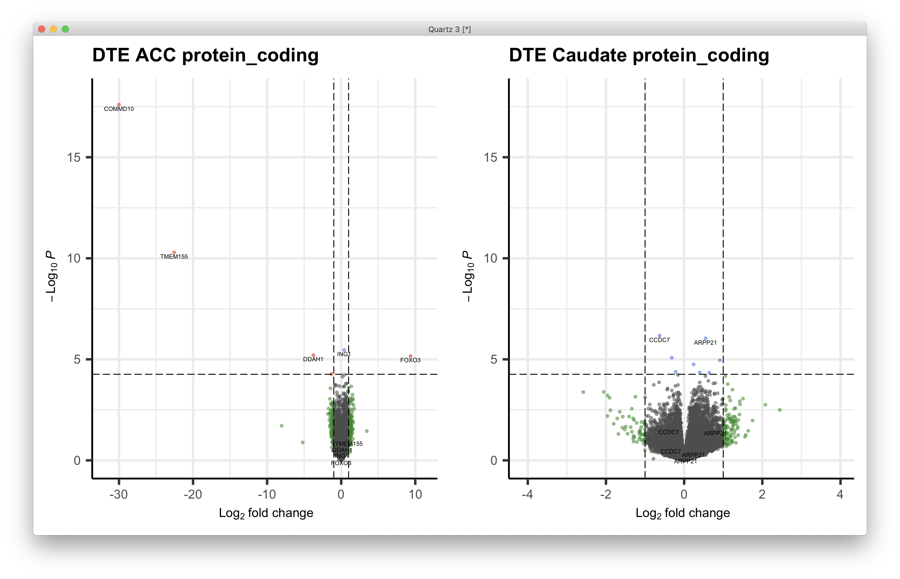
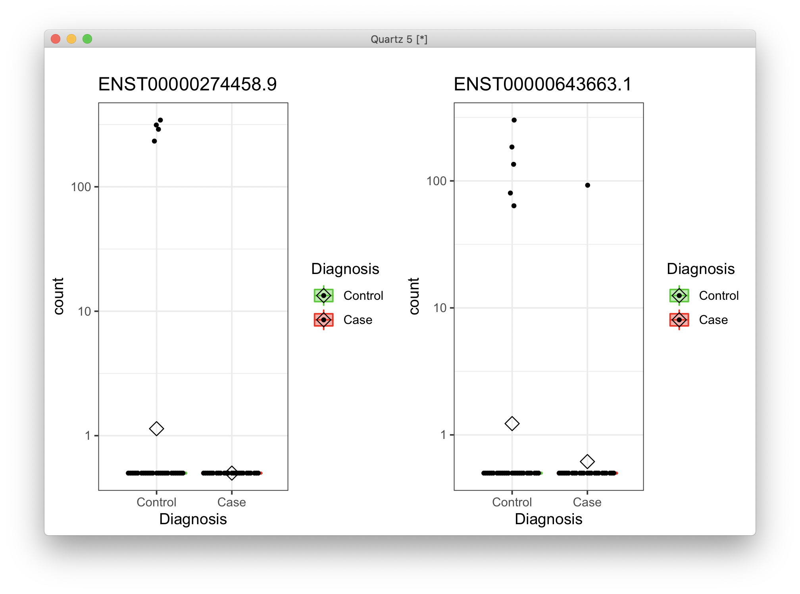

# 2021-03-16 11:29:31

Starting with the plot for developmental results in DGE:

```r
keep_me = c('overlap_c0.9', 'dev5_c0.9', 'dev1_c0.9', 'dev4_c0.9', 'dev2_c0.9',
            'dev3_c0.9')
res = read.table('/Users/sudregp/data/post_mortem/final_results/DGE_enrichment/gene_ontologies/enrichment_results_WG7_dge_acc___protein_coding____my_acc_sets_10K.txt',
                sep='\t', header=1)
res = res[res$geneSet %in% keep_me, c('link', 'normalizedEnrichmentScore',
                                      'pValue')]
res$padj.BF = p.adjust(res$pValue, method='bonferroni')
res$padj.FDR = p.adjust(res$pValue, method='fdr')

dev = res
dev$Region = 'ACC'
res = read.table('/Users/sudregp/data/post_mortem/final_results/DGE_enrichment/gene_ontologies/enrichment_results_WG7_dge_cau___protein_coding____my_caudate_sets_10K.txt',
                sep='\t', header=1)
res = res[res$geneSet %in% keep_me, c('link', 'normalizedEnrichmentScore',
                                      'pValue')]
res$padj.BF = p.adjust(res$pValue, method='bonferroni')
res$padj.FDR = p.adjust(res$pValue, method='fdr')
res$Region = 'Caudate'
dev = rbind(dev, res)

df = matrix(nrow = 2, ncol = 6, dimnames=list(c('ACC', 'Caudate'),
                                              unique(dev$link)))
df = df[, c(1, 3, 5, 6, 4, 2)]
for (i in 1:nrow(df)) {
    for (j in 1:ncol(df)) {
        idx = dev$Region == rownames(df)[i] & dev$link == colnames(df)[j]
        df[i, j] = dev[idx, 'normalizedEnrichmentScore']
    }
}

df = df[, c(1, 3, 5, 6, 4, 2)]
for (i in 1:nrow(df)) {
    for (j in 1:ncol(df)) {
        idx = dev$Region == rownames(df)[i] & dev$link == colnames(df)[j]
        if (dev[idx, 'pValue'] == 0) {
            dev[idx, 'pValue'] = 1e-5
        }
        df[i, j] = (sign(dev[idx, 'normalizedEnrichmentScore']) *
                    -log(dev[idx, 'pValue']))
    }
}

library(corrplot)
mylim = max(abs(df))
quartz()
corrplot(df, is.corr=F, cl.lim=c(-mylim, mylim))
```

# 2021-03-30 11:07:25

Let's re-make the gene ontology single-gene results:

## Leading genes for serotonin receptor signaling pathway

```r
df = read.table('~/data/post_mortem/final_results/DGE_enrichment/gene_ontologies/enrichment_results_WG12_BBB_SV1_dge_acc___protein_coding____res_geneontology_Cellular_Component_noRedundant_10K.txt', sep='\t', header=1)
genes = df[df$description=='GABA-ergic synapse', 'userId']
gene_list = strsplit(genes, ';')[[1]]

load('~/data/post_mortem/DGE_03222021_BBB_SV1.RData')
dds = dge_acc$protein_coding$dds 
library(DESeq2)
gnames = data.frame(full=rownames(counts(dds)),
                    nov=substr(rownames(counts(dds)), 1, 15))
mart = readRDS('~/data/rnaseq_derek/mart_rnaseq.rds')
gnames = merge(gnames, mart, by.x='nov', by.y='ensembl_gene_id')
keep_me = gnames$nov %in% gene_list
gene_ids = gnames[keep_me, ]

# plotting each of the significant genes
library(ggpubr)
library(ggbeeswarm)
clrs = c("green3", "red")
quartz()
myplots = list()
cnt = 1
for (g in 25:nrow(gene_ids)) {
    cat(gene_ids[g, 'nov'], '\n')
    d <- plotCounts(dds, gene=gene_ids[g, 'full'], intgroup="Diagnosis",
                    returnData=TRUE)
    p = (ggplot(d, aes(x=Diagnosis, y=count, color = Diagnosis,
                    fill = Diagnosis)) + 
        scale_y_log10() +
        geom_boxplot(alpha = 0.4, outlier.shape = NA, width = 0.8,
                    lwd = 0.5) +
        stat_summary(fun = mean, geom = "point", color = "black",
                    shape = 5, size = 3,
                    position=position_dodge(width = 0.8)) +
        scale_color_manual(values = clrs) +
        scale_fill_manual(values = clrs) +
        geom_quasirandom(color = "black", size = 1, dodge.width = 0.8) +
        theme_bw() + #theme(legend.position = "none") + 
        ggtitle(gene_ids[g, 'hgnc_symbol']))
    myplots[[cnt]] = p
    cnt = cnt + 1
}
p = ggarrange(plotlist=myplots)
print(p)
```

I split it into groups of 12 to make them easier to visualize:


# 2021-04-07 15:40:12

Going back to this note, but now we need to make the figures based on the
results using the more traditional analysis:

```r
library(ggpubr)
library(EnhancedVolcano)

FCcutoff = 1.0
quartz()

res = read.csv('~/data/post_mortem/final_results/single_geneOrTx/DTE_acc_protein_coding_BBB_SV1_annot_03292021.csv')
res = res[order(res$pvalue),]
lastP = length(which(res$padj.FDR <= .05))
# put p-value horizontal line in the middle of significant and not-significant
pCutOff = res$pvalue[lastP] - (res$pvalue[lastP] - res$pvalue[lastP + 1])/2
ymax = ceiling(max(-log10(res$pvalue)))
p1 = EnhancedVolcano(data.frame(res), lab=res$hgnc_symbol,
                    x = 'log2FoldChange',
                    y = 'pvalue', xlab = bquote(~Log[2]~ 'fold change'),
                    selectLab = res[which(res$padj.FDR < .05), 'hgnc_symbol'],
                    ylab = bquote(~-Log[10]~italic(P)),
                    title = 'DTE ACC protein_coding',
                    ylim = c(0, ymax),
                    pCutoff = pCutoff, FCcutoff = FCcutoff, pointSize = 1.0,
                    labSize = 2.0, subtitle=NULL,
                    axisLabSize = 12, caption = NULL, legendPosition = 'none')

res = read.csv('~/data/post_mortem/final_results/single_geneOrTx/DTE_cau_protein_coding_BBB_SV1_annot_03292021.csv')
res = res[order(res$pvalue),]
lastP = length(which(res$padj.FDR <= .05))
# put p-value horizontal line in the middle of significant and not-significant
pCutOff = res$pvalue[lastP] - (res$pvalue[lastP] - res$pvalue[lastP + 1])/2
p2 = EnhancedVolcano(data.frame(res), lab=res$hgnc_symbol,
                    x = 'log2FoldChange',
                    y = 'pvalue', xlab = bquote(~Log[2]~ 'fold change'),
                    selectLab = res[which(res$padj.FDR < .05), 'hgnc_symbol'],
                    ylab = bquote(~-Log[10]~italic(P)),
                    title = 'DTE Caudate protein_coding',
                    ylim = c(0, ymax),
                    pCutoff = pCutoff, FCcutoff = FCcutoff, pointSize = 1.0,
                    labSize = 2.0, subtitle=NULL,
                    axisLabSize = 12,
                    caption = NULL, legendPosition = 'none')
print(ggarrange(plotlist=list(p1, p2)))
```



Hum... I need to check what's going on with those genes. They look like outliers
to me. 

```r
plot_expressionHGNC = function(gene_ids, dds, t_str, hgnc_ids) {
    library(ggpubr)
    library(ggbeeswarm)
    quartz()
    myplots = list()
    clrs = c("green3", "red")
    for (g in 1:length(gene_ids)) {
        cat(gene_ids[g], '\n')
        d <- plotCounts(dds, gene=gene_ids[g], intgroup="Diagnosis",
                        returnData=TRUE)
        p = (ggplot(d, aes(x=Diagnosis, y=count, color = Diagnosis,
                        fill = Diagnosis)) + 
            scale_y_log10() +
            geom_boxplot(alpha = 0.4, outlier.shape = NA, width = 0.8,
                        lwd = 0.5) +
            stat_summary(fun = mean, geom = "point", color = "black",
                        shape = 5, size = 3,
                        position=position_dodge(width = 0.8)) +
            scale_color_manual(values = clrs) +
            scale_fill_manual(values = clrs) +
            geom_quasirandom(color = "black", size = 1, dodge.width = 0.8) +
            theme_bw() +
            ggtitle(hgnc_ids[g]))
        myplots[[g]] = p
    }
    p = ggarrange(plotlist=myplots)
    print(annotate_figure(p, t_str))
}

load('~/data/post_mortem/DTE_03242021_BBB_SV1.RData')
library(DESeq2)
plot_expressionHGNC(rownames(res)[1:2], dte_acc$protein_coding$dds, '',
                    rownames(res))
```



Yeah, those two transcripts should have been removed. Let's re-run it.

