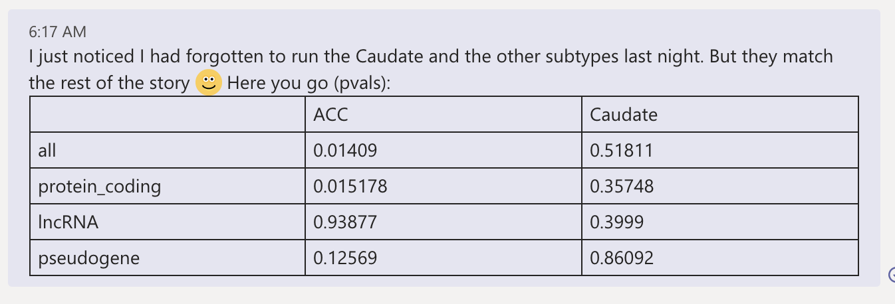

# 2021-03-15 10:33:21

Let's see if MAGMA can help with assessing DE genes for GWAS enrichment.

I downloaded the EUR 1KG reference files from their website. So, let's do a
quick run using their example:

```bash
# biowulf
module load MAGMA
cd ~/data/tmp
magma --annotate --snp-loc g1000_eur.bim --gene-loc /usr/local/apps/MAGMA/gene_location/NCBI37.3/NCBI37.3.gene.loc --out my_annot
```

That took less than a minute. Now, let's use our GWAS result. For now, we'll
stick with WNH, but later we can potentially create our own BIM for run the ALL
GWAS.

```bash
magma --bfile g1000_eur --pval ~/pgc2017/adhd_eur_jun2017 N=53293 --gene-annot my_annot.genes.annot --out my_genes
```

That took ~8min. Finally, the last step. For that we'll need a file with the
variable (significance in the PM dataset, in our case), but genes in Entrez ID
format:

```r
load('~/data/post_mortem//DGE_03022021.RData')
res = as.data.frame(dge_acc$protein_coding$res)
res$GENEID = substr(rownames(res), 1, 15)
library(biomaRt)
mart <- useDataset("hsapiens_gene_ensembl", useMart("ensembl"))
G_list0 <- getBM(filters= "ensembl_gene_id",
                 attributes= c("ensembl_gene_id", "entrezgene_id"),values=res$GENEID, mart= mart)
G_list <- G_list0[!is.na(G_list0$ensembl_gene_id),]
G_list = G_list[G_list$ensembl_gene_id!='',]
G_list <- G_list[!duplicated(G_list$ensembl_gene_id),]
imnamed = res$GENEID %in% G_list$ensembl_gene_id
res = res[imnamed, ]
res2 = merge(res, G_list, sort=F, all.x=F, all.y=F, by.x='GENEID',
             by.y='ensembl_gene_id')
library(dplyr)
ranks = res2 %>% group_by(entrezgene_id) %>% slice_min(n=1, pvalue, with_ties=F)
myres = data.frame(gene=ranks$entrezgene_id,
                   signed_rank=sign(ranks$log2FoldChange)*-log(ranks$pvalue),
                   unsigned_rank=-log(ranks$pvalue))
write.table(myres, row.names=F, sep='\t', file='~/data/tmp/dge_acc.tab',
            quote=F)
```

```bash
magma --gene-results my_genes.genes.raw --gene-covar dge_acc.tab --out my_gc
```

That ran in less than 10s. And we get something like this:

```
[sudregp@cn0980 tmp]$ cat my_gc.gcov.out 
# MEAN_SAMPLE_SIZE = 53293
# TOTAL_GENES = 14848
# CONDITIONED_INTERNAL = genesize, log_genesize, genedensity, log_genedensity, inverse_mac, log_inverse_mac
COVAR                      OBS_GENES       BETA   BETA_STD         SE            P
signed_rank                    14848   -0.00926    -0.0173    0.00476     0.051686
unsigned_rank                  14848   -0.00558   -0.00891    0.00652      0.39204
```

OK, let's start tweaking this:

* Use all our samples (no only WNH)
* play with model
* play with other MAGMA parameters

It turns out that our samples is only Whites and AA (with one unknown), so I'll
just concatenate the two populations from the MAGMA website and go with that:

```bash
module load plink
echo "g1000_afr.bed g1000_afr.bim g1000_afr.fam" > merge_list.txt;
# they suggest using MAF when subsampling, so let's use it for concatenating too
plink --bfile g1000_eur --merge-list merge_list.txt --maf 1e-5 \
    --make-bed --out g1000_BW
plink --bfile g1000_eur --merge-list merge_list.txt --maf 1e-5 \
    --flip-scan --make-bed --out g1000_BW
plink --bfile g1000_eur --exclude g1000_BW-merge.missnp \
    --make-bed --out d1
plink --bfile g1000_afr --exclude g1000_BW-merge.missnp \
    --make-bed --out d2
echo "d2.bed d2.bim d2.fam" > merge_list.txt;
plink --bfile d1 --merge-list merge_list.txt --maf 1e-5 \
    --make-bed --out g1000_BW


magma --annotate --snp-loc g1000_BW.bim \
    --gene-loc /usr/local/apps/MAGMA/gene_location/NCBI37.3/NCBI37.3.gene.loc \
    --out annot_BW
magma --bfile g1000_BW --pval ~/pgc2017/adhd_jun2017 N=55374 \
    --gene-annot annot_BW.genes.annot --out genes_BW
magma --gene-results genes_BW.genes.raw --gene-covar dge_acc.tab --out gc_BW
```

```
[sudregp@cn0980 tmp]$ cat gc_BW.gcov.out 
# MEAN_SAMPLE_SIZE = 55374
# TOTAL_GENES = 14830
# CONDITIONED_INTERNAL = genesize, log_genesize, genedensity, log_genedensity, inverse_mac, log_inverse_mac
COVAR                      OBS_GENES       BETA   BETA_STD         SE            P
signed_rank                    14830    -0.0127    -0.0242    0.00523     0.015178
unsigned_rank                  14830   -0.00566   -0.00874    0.00712       0.4264
```

# 2021-03-16 06:01:55

Let's run this for all our subtypes:

```r
load('~/data/post_mortem//DGE_03022021.RData')
library(biomaRt)
library(dplyr)
        
mart <- useDataset("hsapiens_gene_ensembl", useMart("ensembl"))
for (r in c('acc', 'cau')) {
    for (st in c('all', 'protein_coding', 'lncRNA', 'pseudogene')) {
        cat(r, st, '\n')
        res_str = sprintf('res = as.data.frame(dge_%s$%s$res)', r, st)
        eval(parse(text=res_str))

        res$GENEID = substr(rownames(res), 1, 15)
        G_list0 <- getBM(filters= "ensembl_gene_id",
                         attributes= c("ensembl_gene_id", "entrezgene_id"),values=res$GENEID, mart= mart)
        G_list <- G_list0[!is.na(G_list0$ensembl_gene_id),]
        G_list = G_list[G_list$ensembl_gene_id!='',]
        G_list <- G_list[!duplicated(G_list$ensembl_gene_id),]
        imnamed = res$GENEID %in% G_list$ensembl_gene_id
        res = res[imnamed, ]
        res2 = merge(res, G_list, sort=F, all.x=F, all.y=F, by.x='GENEID',
                     by.y='ensembl_gene_id')
        ranks = res2 %>% group_by(entrezgene_id) %>% slice_min(n=1, pvalue, with_ties=F)
        myres = data.frame(gene=ranks$entrezgene_id,
                           signed_rank=sign(ranks$log2FoldChange)*-log(ranks$pvalue),
                           unsigned_rank=-log(ranks$pvalue))
        out_fname = sprintf('~/data/post_mortem/MAGMA_dge_%s_%s.tab', r, st)
        write.table(myres, row.names=F, sep='\t', file=out_fname, quote=F)
    }
}
```

Then, for MAGMA we only need to run the last command:

```bash
cd ~/data/tmp
for r in 'acc' 'cau'; do
    for st in 'all' 'protein_coding' 'lncRNA' 'pseudogene'; do
        echo $r $st;
        magma --gene-results genes_BW.genes.raw \
            --gene-covar ~/data/post_mortem/MAGMA_dge_${r}_${st}.tab \
            --out ~/data/post_mortem/MAGMA_gc_BW_dge_${r}_${st};
    done;
done
```

Here's a table I sent to Philip in Teams:



