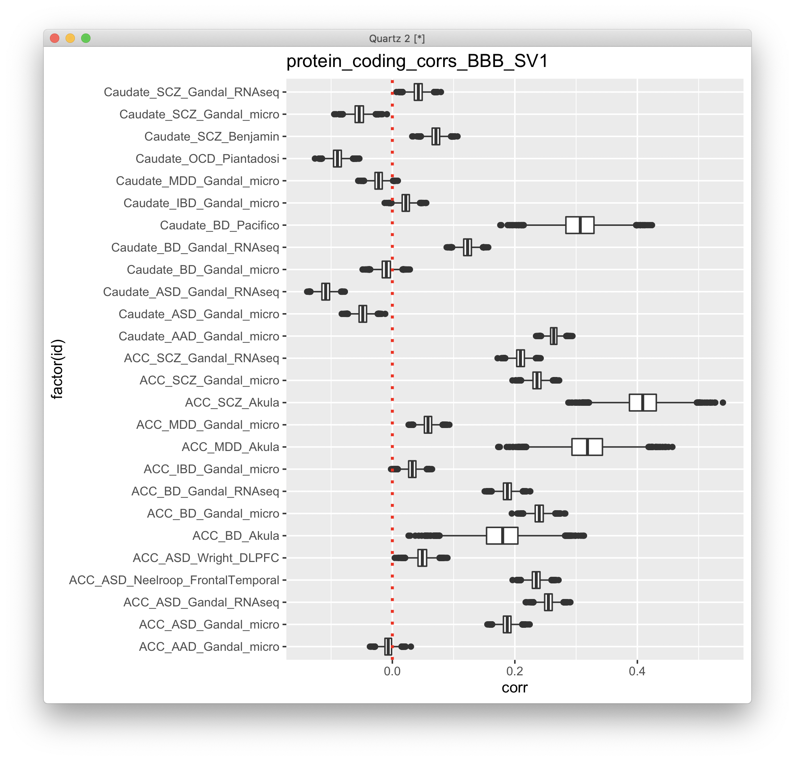
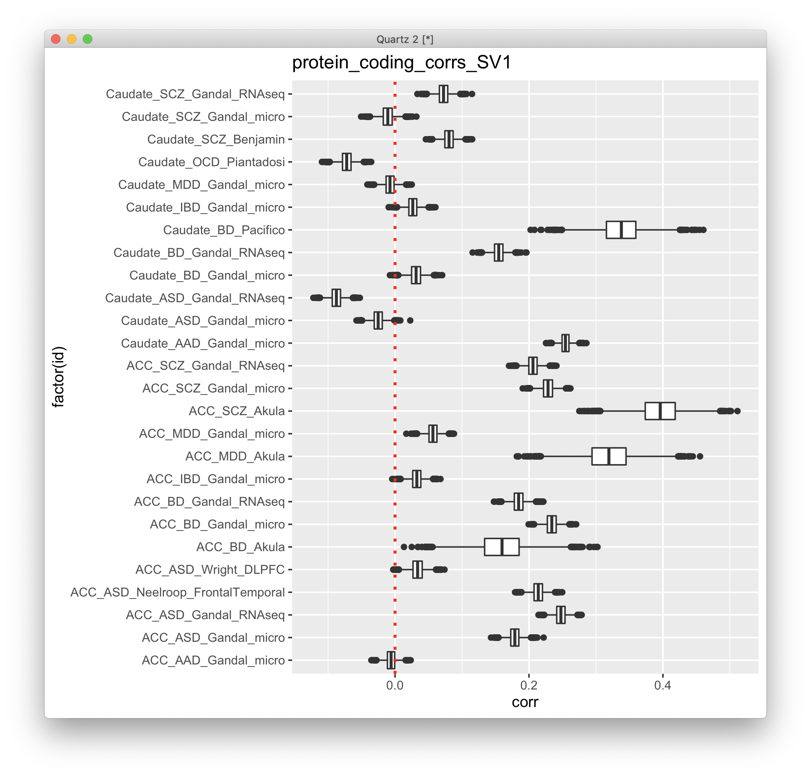
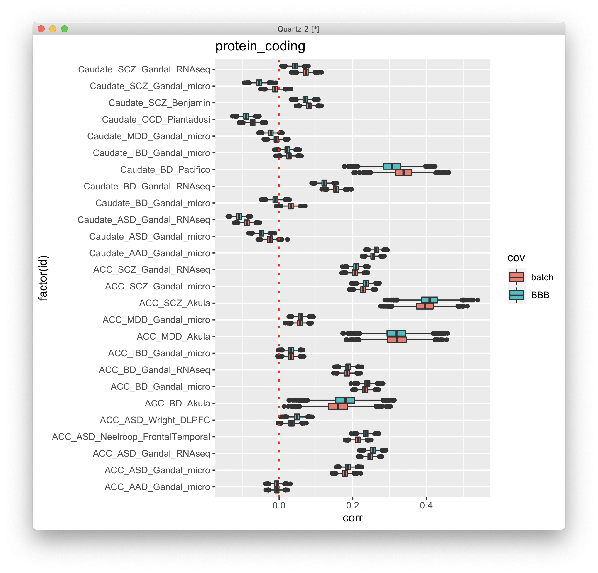
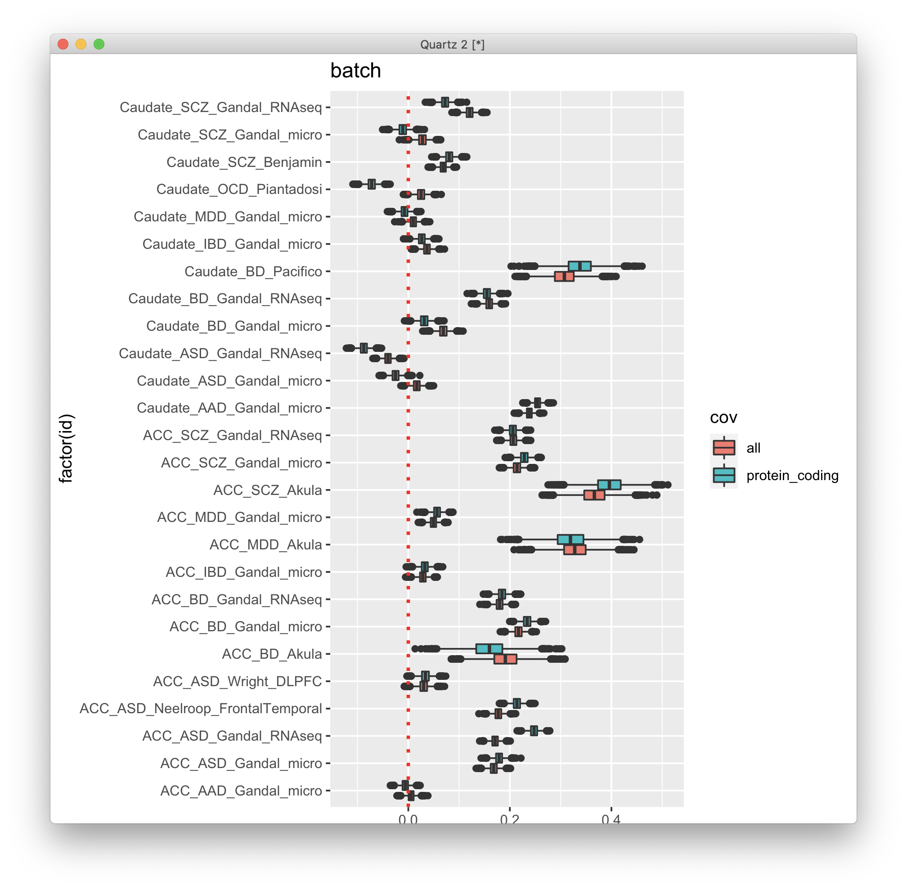

# 2021-03-18 09:42:03

Let's see if our results hold when we don't remove PCs, only the actual
covariates:

```r
run_DGE_noPCA = function(count_matrix, samples, tx_meta, myregion, subtype, alpha) {
    cat('Starting with', nrow(tx_meta), 'variables\n')
    if (is.na(subtype)) {
        keep_me = rep(TRUE, nrow(count_matrix))
    } else {
        keep_me = grepl(tx_meta$gene_biotype, pattern=sprintf('%s$', subtype))
    }
    cat('Keeping', sum(keep_me), subtype, 'variables\n')
    my_count_matrix = count_matrix[keep_me, ]
    my_tx_meta = tx_meta[keep_me, ]

    # removing variables where more than half of the subjects have zero counts
    keep_me = rowSums(my_count_matrix==0) < .25*ncol(my_count_matrix)
    my_count_matrix = my_count_matrix[keep_me, ]
    cat('Keeping', nrow(my_count_matrix), 'after zero removal\n')

    # removing variables with zero or near-zero variance
    library(caret)
    pp_order = c('zv', 'nzv')
    pp = preProcess(t(my_count_matrix), method = pp_order)
    X = t(predict(pp, t(my_count_matrix)))
    cat('Keeping', nrow(X), 'after NZ and NZV filtering\n')
    data.pm = samples

    # replace the one subject missing population PCs by the median of their
    # self-declared race and ethnicity
    idx = (data.pm$Race.x=='White' & data.pm$Ethnicity.x=='Non-Hispanic' &
           !is.na(data.pm$C1))
    pop_pcs = c('C1', 'C2', 'C3', 'C4', 'C5')
    med_pop = apply(data[idx, pop_pcs], 2, median)
    data.pm[which(is.na(data.pm$C1)), pop_pcs] = med_pop

    # removed pH because of too many NAs, RIN because we have RINe for everyone
    num_vars = c('pcnt_optical_duplicates', 'clusters', 'Age', 'RINe', 'PMI',
                'C1', 'C2', 'C3', 'C4', 'C5')
    categ_vars = c('batch', 'MoD', 'substance_group', #'brainbank',
                'comorbid_group', 'POP_CODE', 'Sex', 'evidence_level')
    use_pcs = c(num_vars, categ_vars)

    use_pcs = c('batch', 'Age', 'Sex', 'C1', 'C2', 'C3', 'RINe', 'PMI')

    fm_str = sprintf('~ Diagnosis + %s', paste0(use_pcs, collapse = ' + '))
    cat('Using formula:', fm_str, '\n')

    # scaling num_vars to assure convergence
    for (var in num_vars) {
        data.pm[, var] = scale(data.pm[, var])
    }

    # removing variables with low expression
    library(edgeR)
    design=model.matrix(as.formula(fm_str), data=data.pm)
    isexpr <- filterByExpr(X, design=design)
    countsExpr = X[isexpr,]
    metaExpr = data.frame(GENEID = substr(rownames(countsExpr), 1, 15))
    metaExpr = merge(metaExpr, my_tx_meta, by='GENEID', sort=F)
    cat('Keeping', nrow(countsExpr), 'after expression filtering\n')

    # preparing DESeqData and running main analysis
    countdata = round(countsExpr)
    colnames(countdata) = rownames(data.pm)
    library(DESeq2)
    # because DESeq doesn't remove outliers if there are continuous variables
    # in the formula, we need to do this iteratively
    nOutliers = Inf
    myCounts = round(countsExpr)
    while (nOutliers > 0) {
        dds <- DESeqDataSetFromMatrix(countData = myCounts,
                                    colData = data.pm,
                                    design = as.formula(fm_str))
        cat('Processing', nrow(dds), 'variables.\n')
        dds <- DESeq(dds)
        maxCooks <- apply(assays(dds)[["cooks"]], 1, max)
        # outlier cut-off uses the 99% quantile of the F(p,m-p) distribution (with 
        # p the number of parameters including the intercept and m number of
        # samples).
        m <- ncol(dds)
        # number or parameters (PCs + Diagnosis + intercept)
        p <- length(use_pcs) + 2
        co = qf(.99, p, m - p)
        keep_me = which(maxCooks < co)
        nOutliers = nrow(myCounts) - length(keep_me)
        cat('Found', nOutliers, 'outliers.\n')
        myCounts = round(myCounts)[keep_me, ]
    }
    res <- results(dds, name = "Diagnosis_Case_vs_Control", alpha = alpha)
    cat(sprintf('FDR q < %.2f\n', alpha))
    print(summary(res))

    library(IHW)
    resIHW <- results(dds, name = "Diagnosis_Case_vs_Control", alpha = alpha,
                    filterFun=ihw)
    cat(sprintf('IHW q < %.2f\n', alpha))
    print(summary(resIHW))

    my_res = list(res=res, resIHW=resIHW, dds=dds, fm_str=fm_str, design=design)
    return(my_res)
}
```

```r
myregion = 'ACC'
data = readRDS('~/data/rnaseq_derek/complete_rawCountData_05132020.rds')
rownames(data) = data$submitted_name  # just to ensure compatibility later
# remove obvious outlier (that's NOT caudate) labeled as ACC
rm_me = rownames(data) %in% c('68080')
data = data[!rm_me, ]
data = data[data$Region==myregion, ]
library(gdata)
more = read.xls('~/data/post_mortem/POST_MORTEM_META_DATA_JAN_2021.xlsx')
more = more[!duplicated(more$hbcc_brain_id),]
data = merge(data, more[, c('hbcc_brain_id', 'comorbid_group_update',
                            'substance_group', 'evidence_level')],
             by='hbcc_brain_id', all.x=T, all.y=F)

# at this point we have 55 samples for ACC
grex_vars = colnames(data)[grepl(colnames(data), pattern='^ENS')]
count_matrix = t(data[, grex_vars])
data = data[, !grepl(colnames(data), pattern='^ENS')]
# data only contains sample metadata, and count_matrix has actual counts

# cleaning up some variables
data$POP_CODE = as.character(data$POP_CODE)
data[data$POP_CODE=='WNH', 'POP_CODE'] = 'W'
data[data$POP_CODE=='WH', 'POP_CODE'] = 'W'
data$POP_CODE = factor(data$POP_CODE)
data$Individual = factor(data$hbcc_brain_id)
data[data$Manner.of.Death=='Suicide (probable)', 'Manner.of.Death'] = 'Suicide'
data[data$Manner.of.Death=='unknown', 'Manner.of.Death'] = 'natural'
data$MoD = factor(data$Manner.of.Death)
data$batch = factor(as.numeric(data$run_date))
data$Diagnosis = factor(data$Diagnosis, levels=c('Control', 'Case'))
data$substance_group = factor(data$substance_group)
data$comorbid_group = factor(data$comorbid_group_update)
data$evidence_level = factor(data$evidence_level)
data$brainbank = factor(data$bainbank)

# removing everything but autosomes
library(GenomicFeatures)
txdb <- loadDb('~/data/post_mortem/Homo_sapies.GRCh38.97.sqlite')
txdf <- select(txdb, keys(txdb, "GENEID"), columns=c('GENEID','TXCHROM'),
               "GENEID")
bt = read.csv('~/data/post_mortem/Homo_sapiens.GRCh38.97_biotypes.csv')
bt_slim = bt[, c('gene_id', 'gene_biotype')]
bt_slim = bt_slim[!duplicated(bt_slim),]
txdf = merge(txdf, bt_slim, by.x='GENEID', by.y='gene_id')
# store gene names in geneCounts without version in end of name
tx_meta = data.frame(GENEID = substr(rownames(count_matrix), 1, 15))
tx_meta = merge(tx_meta, txdf, by='GENEID', sort=F)
imautosome = which(tx_meta$TXCHROM != 'X' &
                   tx_meta$TXCHROM != 'Y' &
                   tx_meta$TXCHROM != 'MT')
count_matrix = count_matrix[imautosome, ]
tx_meta = tx_meta[imautosome, ]
```

Now let's re-implement the function, but scaling the PCs:

```r
dge_acc = list()
for (st in c('pseudogene', 'lncRNA', 'protein_coding', 'all')) {
    st2 = ifelse(st == 'all', NA, st)
    dge_acc[[st]] = run_DGE_noPCA(count_matrix, data, tx_meta, myregion, st2, .05)
}
dge_cau = list()
for (st in c('pseudogene', 'lncRNA', 'protein_coding', 'all')) {
    st2 = ifelse(st == 'all', NA, st)
    dge_cau[[st]] = run_DGE_noPCA(count_matrix, data, tx_meta, myregion, st2, .05)
}
save(dge_acc, dge_cau, file='~/data/post_mortem/DGE_03182021.RData')
```

Chatting with Philip, he suggested to use:

```
    # batch Age Sex C1 C2 C3 RINe PMI (maybe C4 C5)
    # what's the deal with brain bank
    # others just by themselves to check for robustness, including brainbank
```

Here's the relationship between brain bank and batch:

```
r$> table(data$batch, data$brainbank)                                                    
    
    nimh_hbcc pitt umbn
  1        10    0    0
  2         0    2   11
  3         0    7   11
  5        14    0    0
```

OK, so let's see now if our main results hold. First, GSEA:

```r
library(WebGestaltR)

data_dir = '~/data/post_mortem/'
ncpu=6

load('~/data/post_mortem/DGE_03182021.RData')

for (region in c('acc', 'caudate')) {
    res_str = ifelse(region == 'acc', 'dge_acc[["all"]]$res',
                     'dge_cau[["all"]]$res')
    ranks_str = sprintf('ranks = -log(%s$pvalue) * sign(%s$log2FoldChange)',
                        res_str, res_str)
    gid_str = sprintf('geneid=substring(rownames(%s), 1, 15)', res_str)
    
    eval(parse(text=ranks_str))
    eval(parse(text=gid_str))

    tmp2 = data.frame(geneid=geneid, rank=ranks)
    tmp2 = tmp2[order(ranks, decreasing=T),]

    DBs = c(sprintf('my_%s_sets', region))
    for (db in DBs) {
        cat(res_str, db, '\n')
        db_file = sprintf('~/data/post_mortem/%s.gmt', db)
        project_name = sprintf('WG10_%s_%s_10K', res_str, db)
        enrichResult <- try(WebGestaltR(enrichMethod="GSEA",
                            organism="hsapiens",
                            enrichDatabaseFile=db_file,
                            enrichDatabaseType="genesymbol",
                            interestGene=tmp2,
                            outputDirectory = data_dir,
                            interestGeneType="ensembl_gene_id",
                            sigMethod="top", topThr=20,
                            minNum=3, projectName=project_name,
                            isOutput=T, isParallel=T,
                            nThreads=ncpu, perNum=10000, maxNum=800))
    }

    DBs = c('geneontology_Biological_Process_noRedundant',
            'geneontology_Cellular_Component_noRedundant',
            'geneontology_Molecular_Function_noRedundant')
    for (db in DBs) {
        cat(res_str, db, '\n')
        project_name = sprintf('WG10_%s_%s_10K', res_str, db)

        enrichResult <- try(WebGestaltR(enrichMethod="GSEA",
                                    organism="hsapiens",
                                    enrichDatabase=db,
                                    interestGene=tmp2,
                                    interestGeneType="ensembl_gene_id",
                                    sigMethod="top", topThr=20,
                                    outputDirectory = data_dir,
                                    minNum=5, projectName=project_name,
                                    isOutput=T, isParallel=T,
                                    nThreads=ncpu, perNum=10000))
    }

    for (db in c('KEGG', 'Panther', 'Reactome', 'Wikipathway')) {
        cat(res_str, db, '\n')
        project_name = sprintf('WG10_%s_%s_10K', res_str, db)

        enrichResult <- try(WebGestaltR(enrichMethod="GSEA",
                                    organism="hsapiens",
                                    enrichDatabase=sprintf('pathway_%s', db),
                                    interestGene=tmp2,
                                    interestGeneType="ensembl_gene_id",
                                    sigMethod="top", minNum=3,
                                    outputDirectory = data_dir,
                                    projectName=project_name,
                                    isOutput=T, isParallel=T,
                                    nThreads=ncpu, topThr=20, perNum=10000))
    }
}
```

I ran that for all and protein_coding. 

Now, let's see what happens when we combine batch and brain bank:

```r
data$BBB = factor(sapply(1:nrow(data),
                         function(x) sprintf('%s_%s',
                                             as.character(data[x,'brainbank']),
                                             as.character(data[x, 'batch']))))
run_DGE_noPCA = function(count_matrix, samples, tx_meta, myregion, subtype, alpha) {
    cat('Starting with', nrow(tx_meta), 'variables\n')
    if (is.na(subtype)) {
        keep_me = rep(TRUE, nrow(count_matrix))
    } else {
        keep_me = grepl(tx_meta$gene_biotype, pattern=sprintf('%s$', subtype))
    }
    cat('Keeping', sum(keep_me), subtype, 'variables\n')
    my_count_matrix = count_matrix[keep_me, ]
    my_tx_meta = tx_meta[keep_me, ]

    # removing variables where more than half of the subjects have zero counts
    keep_me = rowSums(my_count_matrix==0) < .25*ncol(my_count_matrix)
    my_count_matrix = my_count_matrix[keep_me, ]
    cat('Keeping', nrow(my_count_matrix), 'after zero removal\n')

    # removing variables with zero or near-zero variance
    library(caret)
    pp_order = c('zv', 'nzv')
    pp = preProcess(t(my_count_matrix), method = pp_order)
    X = t(predict(pp, t(my_count_matrix)))
    cat('Keeping', nrow(X), 'after NZ and NZV filtering\n')
    data.pm = samples

    # replace the one subject missing population PCs by the median of their
    # self-declared race and ethnicity
    idx = (data.pm$Race.x=='White' & data.pm$Ethnicity.x=='Non-Hispanic' &
           !is.na(data.pm$C1))
    pop_pcs = c('C1', 'C2', 'C3', 'C4', 'C5')
    med_pop = apply(data[idx, pop_pcs], 2, median)
    data.pm[which(is.na(data.pm$C1)), pop_pcs] = med_pop

    # removed pH because of too many NAs, RIN because we have RINe for everyone
    num_vars = c('pcnt_optical_duplicates', 'clusters', 'Age', 'RINe', 'PMI',
                'C1', 'C2', 'C3', 'C4', 'C5')
    categ_vars = c('BBB', 'MoD', 'substance_group',
                'comorbid_group', 'POP_CODE', 'Sex', 'evidence_level')
    use_pcs = c(num_vars, categ_vars)

    use_pcs = c('BBB', 'Age', 'Sex', 'C1', 'C2', 'C3', 'RINe', 'PMI')

    fm_str = sprintf('~ Diagnosis + %s', paste0(use_pcs, collapse = ' + '))
    cat('Using formula:', fm_str, '\n')

    # scaling num_vars to assure convergence
    for (var in num_vars) {
        data.pm[, var] = scale(data.pm[, var])
    }

    # removing variables with low expression
    library(edgeR)
    design=model.matrix(as.formula(fm_str), data=data.pm)
    isexpr <- filterByExpr(X, design=design)
    countsExpr = X[isexpr,]
    metaExpr = data.frame(GENEID = substr(rownames(countsExpr), 1, 15))
    metaExpr = merge(metaExpr, my_tx_meta, by='GENEID', sort=F)
    cat('Keeping', nrow(countsExpr), 'after expression filtering\n')

    # preparing DESeqData and running main analysis
    countdata = round(countsExpr)
    colnames(countdata) = rownames(data.pm)
    library(DESeq2)
    # because DESeq doesn't remove outliers if there are continuous variables
    # in the formula, we need to do this iteratively
    nOutliers = Inf
    myCounts = round(countsExpr)
    while (nOutliers > 0) {
        dds <- DESeqDataSetFromMatrix(countData = myCounts,
                                    colData = data.pm,
                                    design = as.formula(fm_str))
        cat('Processing', nrow(dds), 'variables.\n')
        dds <- DESeq(dds)
        maxCooks <- apply(assays(dds)[["cooks"]], 1, max)
        # outlier cut-off uses the 99% quantile of the F(p,m-p) distribution (with 
        # p the number of parameters including the intercept and m number of
        # samples).
        m <- ncol(dds)
        # number or parameters (PCs + Diagnosis + intercept)
        p <- length(use_pcs) + 2
        co = qf(.99, p, m - p)
        keep_me = which(maxCooks < co)
        nOutliers = nrow(myCounts) - length(keep_me)
        cat('Found', nOutliers, 'outliers.\n')
        myCounts = round(myCounts)[keep_me, ]
    }
    res <- results(dds, name = "Diagnosis_Case_vs_Control", alpha = alpha)
    cat(sprintf('FDR q < %.2f\n', alpha))
    print(summary(res))

    library(IHW)
    resIHW <- results(dds, name = "Diagnosis_Case_vs_Control", alpha = alpha,
                    filterFun=ihw)
    cat(sprintf('IHW q < %.2f\n', alpha))
    print(summary(resIHW))

    my_res = list(res=res, resIHW=resIHW, dds=dds, fm_str=fm_str, design=design)
    return(my_res)
}

dge_acc = list()
for (st in c('pseudogene', 'lncRNA', 'protein_coding', 'all')) {
    st2 = ifelse(st == 'all', NA, st)
    dge_acc[[st]] = run_DGE_noPCA(count_matrix, data, tx_meta, myregion, st2, .05)
}
dge_cau = list()
for (st in c('pseudogene', 'lncRNA', 'protein_coding', 'all')) {
    st2 = ifelse(st == 'all', NA, st)
    dge_cau[[st]] = run_DGE_noPCA(count_matrix, data, tx_meta, myregion, st2, .05)
}
save(dge_acc, dge_cau, file='~/data/post_mortem/DGE_03182021_BBB.RData')
```

I'll run this as WG11:

```r
library(WebGestaltR)

data_dir = '~/data/post_mortem/'
ncpu=31

load('~/data/post_mortem/DGE_03182021_BBB.RData')

for (region in c('acc', 'caudate')) {
    for (st in c('all', 'protein_coding')) {
        res_str = ifelse(region == 'acc', sprintf('dge_acc[["%s"]]$res', st),
                         sprintf('dge_cau[["%s"]]$res', st))
        ranks_str = sprintf('ranks = -log(%s$pvalue) * sign(%s$log2FoldChange)',
                            res_str, res_str)
        gid_str = sprintf('geneid=substring(rownames(%s), 1, 15)', res_str)
        
        eval(parse(text=ranks_str))
        eval(parse(text=gid_str))

        tmp2 = data.frame(geneid=geneid, rank=ranks)
        tmp2 = tmp2[order(ranks, decreasing=T),]

        DBs = c(sprintf('my_%s_sets', region))
        for (db in DBs) {
            cat(res_str, db, '\n')
            db_file = sprintf('~/data/post_mortem/%s.gmt', db)
            project_name = sprintf('WG11_%s_%s_10K', res_str, db)
            enrichResult <- try(WebGestaltR(enrichMethod="GSEA",
                                organism="hsapiens",
                                enrichDatabaseFile=db_file,
                                enrichDatabaseType="genesymbol",
                                interestGene=tmp2,
                                outputDirectory = data_dir,
                                interestGeneType="ensembl_gene_id",
                                sigMethod="top", topThr=20,
                                minNum=3, projectName=project_name,
                                isOutput=T, isParallel=T,
                                nThreads=ncpu, perNum=10000, maxNum=800))
        }

        DBs = c('geneontology_Biological_Process_noRedundant',
                'geneontology_Cellular_Component_noRedundant',
                'geneontology_Molecular_Function_noRedundant')
        for (db in DBs) {
            cat(res_str, db, '\n')
            project_name = sprintf('WG11_%s_%s_10K', res_str, db)

            enrichResult <- try(WebGestaltR(enrichMethod="GSEA",
                                        organism="hsapiens",
                                        enrichDatabase=db,
                                        interestGene=tmp2,
                                        interestGeneType="ensembl_gene_id",
                                        sigMethod="top", topThr=20,
                                        outputDirectory = data_dir,
                                        minNum=5, projectName=project_name,
                                        isOutput=T, isParallel=T,
                                        nThreads=ncpu, perNum=10000))
        }

        for (db in c('KEGG', 'Panther', 'Reactome', 'Wikipathway')) {
            cat(res_str, db, '\n')
            project_name = sprintf('WG11_%s_%s_10K', res_str, db)

            enrichResult <- try(WebGestaltR(enrichMethod="GSEA",
                                        organism="hsapiens",
                                        enrichDatabase=sprintf('pathway_%s', db),
                                        interestGene=tmp2,
                                        interestGeneType="ensembl_gene_id",
                                        sigMethod="top", minNum=3,
                                        outputDirectory = data_dir,
                                        projectName=project_name,
                                        isOutput=T, isParallel=T,
                                        nThreads=ncpu, topThr=20, perNum=10000))
        }
    }
}
```

# 2021-03-22 10:21:51

Let's try each one also including 1 and 2 SVs, just for kicks:

```r
run_DGE_noPCA_SVs = function(count_matrix, samples, tx_meta, myregion, subtype,
                             alpha, BBB = FALSE, nSV = 1) {
    cat('Starting with', nrow(tx_meta), 'variables\n')
    if (is.na(subtype)) {
        keep_me = rep(TRUE, nrow(count_matrix))
    } else {
        keep_me = grepl(tx_meta$gene_biotype, pattern=sprintf('%s$', subtype))
    }
    cat('Keeping', sum(keep_me), subtype, 'variables\n')
    my_count_matrix = count_matrix[keep_me, ]
    my_tx_meta = tx_meta[keep_me, ]

    # removing variables where more than half of the subjects have zero counts
    keep_me = rowSums(my_count_matrix==0) < .25*ncol(my_count_matrix)
    my_count_matrix = my_count_matrix[keep_me, ]
    cat('Keeping', nrow(my_count_matrix), 'after zero removal\n')

    # removing variables with zero or near-zero variance
    library(caret)
    pp_order = c('zv', 'nzv')
    pp = preProcess(t(my_count_matrix), method = pp_order)
    X = t(predict(pp, t(my_count_matrix)))
    cat('Keeping', nrow(X), 'after NZ and NZV filtering\n')
    data.pm = samples

    # replace the one subject missing population PCs by the median of their
    # self-declared race and ethnicity
    idx = (data.pm$Race.x=='White' & data.pm$Ethnicity.x=='Non-Hispanic' &
           !is.na(data.pm$C1))
    pop_pcs = c('C1', 'C2', 'C3', 'C4', 'C5')
    med_pop = apply(data[idx, pop_pcs], 2, median)
    data.pm[which(is.na(data.pm$C1)), pop_pcs] = med_pop

    if (BBB) {
        data.pm$BBB = factor(sapply(1:nrow(data.pm),
                                    function(x) sprintf('%s_%s',
                                             as.character(data.pm[x,'brainbank']),
                                             as.character(data.pm[x, 'batch']))))
        use_pcs = c('BBB', 'Age', 'Sex', 'C1', 'C2', 'C3', 'RINe', 'PMI')
    } else {
        use_pcs = c('batch', 'Age', 'Sex', 'C1', 'C2', 'C3', 'RINe', 'PMI')
    }

    fm_str = sprintf('~ Diagnosis + %s', paste0(use_pcs, collapse = ' + '))
    cat('Using formula:', fm_str, '\n')

    # scaling num_vars to assure convergence
    # removed pH because of too many NAs, RIN because we have RINe for everyone
    num_vars = c('pcnt_optical_duplicates', 'clusters', 'Age', 'RINe', 'PMI',
                'C1', 'C2', 'C3', 'C4', 'C5')
    for (var in num_vars) {
        data.pm[, var] = scale(data.pm[, var])
    }

    # removing variables with low expression
    library(edgeR)
    design=model.matrix(as.formula(fm_str), data=data.pm)
    isexpr <- filterByExpr(X, design=design)
    countsExpr = X[isexpr,]
    metaExpr = data.frame(GENEID = substr(rownames(countsExpr), 1, 15))
    metaExpr = merge(metaExpr, my_tx_meta, by='GENEID', sort=F)
    cat('Keeping', nrow(countsExpr), 'after expression filtering\n')

    # preparing DESeqData and running main analysis
    countdata = round(countsExpr)
    colnames(countdata) = rownames(data.pm)
    library(DESeq2)
    # because DESeq doesn't remove outliers if there are continuous variables
    # in the formula, we need to do this iteratively
    nOutliers = Inf
    myCounts = round(countsExpr)
    while (nOutliers > 0) {
        dds <- DESeqDataSetFromMatrix(countData = myCounts,
                                    colData = data.pm,
                                    design = as.formula(fm_str))
        cat('Processing', nrow(dds), 'variables.\n')
        dds <- DESeq(dds)
        maxCooks <- apply(assays(dds)[["cooks"]], 1, max)
        # outlier cut-off uses the 99% quantile of the F(p,m-p) distribution (with 
        # p the number of parameters including the intercept and m number of
        # samples).
        m <- ncol(dds)
        # number or parameters (PCs + Diagnosis + intercept)
        p <- length(use_pcs) + 2
        co = qf(.99, p, m - p)
        keep_me = which(maxCooks < co)
        nOutliers = nrow(myCounts) - length(keep_me)
        cat('Found', nOutliers, 'outliers.\n')
        myCounts = round(myCounts)[keep_me, ]
    }

    if (nSV > 0) {
        # I get the same value whether I do this after DESeq or just estimateSizeFactors
        dat  <- counts(dds, normalized = TRUE)

        library(sva)
        mod  <- model.matrix(~ Diagnosis, colData(dds))
        mod0 <- model.matrix(~   1, colData(dds))
        svseq <- svaseq(dat, mod, mod0, n.sv = nSV)
        
        for (s in 1:nSV) {
            eval(parse(text=sprintf('data.pm$SV%d <- svseq$sv[,%d]', s, s)))
            fm_str = sprintf('%s + SV%d', fm_str, s)
        }
        dds <- DESeqDataSetFromMatrix(countData = myCounts,
                                      colData = data.pm,
                                      design = as.formula(fm_str))
        dds <- DESeq(dds)
    }

    res <- results(dds, name = "Diagnosis_Case_vs_Control", alpha = alpha)
    cat(sprintf('FDR q < %.2f\n', alpha))
    print(summary(res))

    library(IHW)
    resIHW <- results(dds, name = "Diagnosis_Case_vs_Control", alpha = alpha,
                    filterFun=ihw)
    cat(sprintf('IHW q < %.2f\n', alpha))
    print(summary(resIHW))

    my_res = list(res=res, resIHW=resIHW, dds=dds)
    return(my_res)
}
```

Then just run the multiple iterations:

```r
dge_acc = list()
for (st in c('pseudogene', 'lncRNA', 'protein_coding', 'all')) {
    st2 = ifelse(st == 'all', NA, st)
    dge_acc[[st]] = run_DGE_noPCA_SVs(count_matrix, data, tx_meta,
                                      myregion, st2, .05, BBB=T, nSV=2)
}
###
dge_cau = list()
for (st in c('pseudogene', 'lncRNA', 'protein_coding', 'all')) {
    st2 = ifelse(st == 'all', NA, st)
    dge_cau[[st]] = run_DGE_noPCA_SVs(count_matrix, data, tx_meta,
                                      myregion, st2, .05, BBB=T, nSV=2)
}
save(dge_acc, dge_cau, file='~/data/post_mortem/DGE_03222021.RData')
```

I also ran versions with BBB, and SV up to 2.

Now we just need to run GSEA on everything. I'm naming it WG12 and the iteration
prefix.

```r
library(WebGestaltR)

data_dir = '~/data/post_mortem/'
ncpu=31

load('~/data/post_mortem/DGE_03222021_BBB_SV2.RData')

for (region in c('acc', 'caudate')) {
    for (st in c('all', 'protein_coding')) {
        res_str = ifelse(region == 'acc', sprintf('dge_acc[["%s"]]$res', st),
                         sprintf('dge_cau[["%s"]]$res', st))
        ranks_str = sprintf('ranks = -log(%s$pvalue) * sign(%s$log2FoldChange)',
                            res_str, res_str)
        gid_str = sprintf('geneid=substring(rownames(%s), 1, 15)', res_str)
        
        eval(parse(text=ranks_str))
        eval(parse(text=gid_str))

        tmp2 = data.frame(geneid=geneid, rank=ranks)
        tmp2 = tmp2[order(ranks, decreasing=T),]

        DBs = c(sprintf('my_%s_sets', region))
        for (db in DBs) {
            cat(res_str, db, '\n')
            db_file = sprintf('~/data/post_mortem/%s.gmt', db)
            project_name = sprintf('WG12_BBB_SV2_%s_%s_10K', res_str, db)
            enrichResult <- try(WebGestaltR(enrichMethod="GSEA",
                                organism="hsapiens",
                                enrichDatabaseFile=db_file,
                                enrichDatabaseType="genesymbol",
                                interestGene=tmp2,
                                outputDirectory = data_dir,
                                interestGeneType="ensembl_gene_id",
                                sigMethod="top", topThr=20,
                                minNum=3, projectName=project_name,
                                isOutput=T, isParallel=T,
                                nThreads=ncpu, perNum=10000, maxNum=800))
        }

        DBs = c('geneontology_Biological_Process_noRedundant',
                'geneontology_Cellular_Component_noRedundant',
                'geneontology_Molecular_Function_noRedundant')
        for (db in DBs) {
            cat(res_str, db, '\n')
            project_name = sprintf('WG12_BBB_SV2_%s_%s_10K', res_str, db)

            enrichResult <- try(WebGestaltR(enrichMethod="GSEA",
                                        organism="hsapiens",
                                        enrichDatabase=db,
                                        interestGene=tmp2,
                                        interestGeneType="ensembl_gene_id",
                                        sigMethod="top", topThr=20,
                                        outputDirectory = data_dir,
                                        minNum=5, projectName=project_name,
                                        isOutput=T, isParallel=T,
                                        nThreads=ncpu, perNum=10000))
        }

        for (db in c('KEGG', 'Panther', 'Reactome', 'Wikipathway')) {
            cat(res_str, db, '\n')
            project_name = sprintf('WG12_BBB_SV2_%s_%s_10K', res_str, db)

            enrichResult <- try(WebGestaltR(enrichMethod="GSEA",
                                        organism="hsapiens",
                                        enrichDatabase=sprintf('pathway_%s', db),
                                        interestGene=tmp2,
                                        interestGeneType="ensembl_gene_id",
                                        sigMethod="top", minNum=3,
                                        outputDirectory = data_dir,
                                        projectName=project_name,
                                        isOutput=T, isParallel=T,
                                        nThreads=ncpu, topThr=20, perNum=10000))
        }
    }
}
```

While all this stuff is running, let's do some MAGMA, which might as well serve
as some of the cut-off too.

```r
library(biomaRt)
library(dplyr)
mart <- useDataset("hsapiens_gene_ensembl", useMart("ensembl"))

for (s in c('', '_BBB', '_SV1', '_SV2', '_BBB_SV1', '_BBB_SV2')) {
    load(sprintf('~/data/post_mortem//DGE_03222021%s.RData', s))
    for (r in c('acc', 'cau')) {
        for (st in c('all', 'protein_coding', 'lncRNA', 'pseudogene')) {
            cat(s, r, st, '\n')
            res_str = sprintf('res = as.data.frame(dge_%s$%s$res)', r, st)
            eval(parse(text=res_str))

            res$GENEID = substr(rownames(res), 1, 15)
            G_list0 <- getBM(filters= "ensembl_gene_id",
                            attributes= c("ensembl_gene_id", "entrezgene_id"),values=res$GENEID, mart= mart)
            G_list <- G_list0[!is.na(G_list0$ensembl_gene_id),]
            G_list = G_list[G_list$ensembl_gene_id!='',]
            G_list <- G_list[!duplicated(G_list$ensembl_gene_id),]
            imnamed = res$GENEID %in% G_list$ensembl_gene_id
            res = res[imnamed, ]
            res2 = merge(res, G_list, sort=F, all.x=F, all.y=F, by.x='GENEID',
                        by.y='ensembl_gene_id')
            ranks = res2 %>% group_by(entrezgene_id) %>% slice_min(n=1, pvalue, with_ties=F)
            myres = data.frame(gene=ranks$entrezgene_id,
                            signed_rank=sign(ranks$log2FoldChange)*-log(ranks$pvalue),
                            unsigned_rank=-log(ranks$pvalue))
            out_fname = sprintf('~/data/post_mortem/MAGMA_dge%s_%s_%s.tab',
                                s, r, st)
            write.table(myres, row.names=F, sep='\t', file=out_fname, quote=F)
        }
    }
}
```

Then, for MAGMA we only need to run the last command:

```bash
module load MAGMA
cd ~/data/tmp
for s in '' '_BBB' '_SV1' '_SV2' '_BBB_SV1' '_BBB_SV2'; do
    for r in 'acc' 'cau'; do
        for st in 'all' 'protein_coding' 'lncRNA' 'pseudogene'; do
            echo $r $st;
            magma --gene-results genes_BW.genes.raw \
                --gene-covar ~/data/post_mortem/MAGMA_dge${s}_${r}_${st}.tab \
                --out ~/data/post_mortem/MAGMA_gc_BW_dge${s}_${r}_${st};
        done;
    done;
done
```

```
[sudregp@cn3235 post_mortem]$ for f in `ls MAGMA_gc_BW_dge*acc*all.gcov.out`; do echo $f; cat $f; done
MAGMA_gc_BW_dge_acc_all.gcov.out
# MEAN_SAMPLE_SIZE = 55374
# TOTAL_GENES = 15096
# CONDITIONED_INTERNAL = genesize, log_genesize, genedensity, log_genedensity, inverse_mac, log_inverse_mac
COVAR                      OBS_GENES       BETA   BETA_STD         SE            P
signed_rank                    15096     -0.017    -0.0263    0.00639    0.0078607
unsigned_rank                  15096   0.000615   0.000773    0.00871      0.94366
MAGMA_gc_BW_dge_BBB_acc_all.gcov.out
# MEAN_SAMPLE_SIZE = 55374
# TOTAL_GENES = 15113
# CONDITIONED_INTERNAL = genesize, log_genesize, genedensity, log_genedensity, inverse_mac, log_inverse_mac
COVAR                      OBS_GENES       BETA   BETA_STD         SE            P
signed_rank                    15113    -0.0169    -0.0261     0.0064    0.0082997
unsigned_rank                  15113   2.43e-05   3.06e-05     0.0087      0.99777
MAGMA_gc_BW_dge_BBB_SV1_acc_all.gcov.out
# MEAN_SAMPLE_SIZE = 55374
# TOTAL_GENES = 15113
# CONDITIONED_INTERNAL = genesize, log_genesize, genedensity, log_genedensity, inverse_mac, log_inverse_mac
COVAR                      OBS_GENES       BETA   BETA_STD         SE            P
signed_rank                    15113    -0.0158    -0.0242    0.00643     0.014069
unsigned_rank                  15113    0.00282    0.00353    0.00877      0.74766
MAGMA_gc_BW_dge_BBB_SV2_acc_all.gcov.out
# MEAN_SAMPLE_SIZE = 55374
# TOTAL_GENES = 15113
# CONDITIONED_INTERNAL = genesize, log_genesize, genedensity, log_genedensity, inverse_mac, log_inverse_mac
COVAR                      OBS_GENES       BETA   BETA_STD         SE            P
signed_rank                    15113    -0.0133    -0.0213    0.00615     0.031164
unsigned_rank                  15113    -0.0011   -0.00144    0.00835      0.89548
MAGMA_gc_BW_dge_SV1_acc_all.gcov.out
# MEAN_SAMPLE_SIZE = 55374
# TOTAL_GENES = 15096
# CONDITIONED_INTERNAL = genesize, log_genesize, genedensity, log_genedensity, inverse_mac, log_inverse_mac
COVAR                      OBS_GENES       BETA   BETA_STD         SE            P
signed_rank                    15096    -0.0156    -0.0241     0.0064     0.014578
unsigned_rank                  15096    0.00311     0.0039    0.00874      0.72168
MAGMA_gc_BW_dge_SV2_acc_all.gcov.out
# MEAN_SAMPLE_SIZE = 55374
# TOTAL_GENES = 15096
# CONDITIONED_INTERNAL = genesize, log_genesize, genedensity, log_genedensity, inverse_mac, log_inverse_mac
COVAR                      OBS_GENES       BETA   BETA_STD         SE            P
signed_rank                    15096    -0.0131    -0.0209    0.00616     0.034061
unsigned_rank                  15096  -0.000939   -0.00123    0.00836      0.91062
```

Using all genes, we seem to do better without adding SVs, but they're all still
good.

```
MAGMA_gc_BW_dge_acc_protein_coding.gcov.out
# MEAN_SAMPLE_SIZE = 55374
# TOTAL_GENES = 15027
# CONDITIONED_INTERNAL = genesize, log_genesize, genedensity, log_genedensity, inverse_mac, log_inverse_mac
COVAR                      OBS_GENES       BETA   BETA_STD         SE            P
signed_rank                    15027    -0.0161    -0.0251    0.00635     0.011291
unsigned_rank                  15027   -0.00171   -0.00218    0.00861       0.8425
MAGMA_gc_BW_dge_BBB_acc_protein_coding.gcov.out
# MEAN_SAMPLE_SIZE = 55374
# TOTAL_GENES = 15044
# CONDITIONED_INTERNAL = genesize, log_genesize, genedensity, log_genedensity, inverse_mac, log_inverse_mac
COVAR                      OBS_GENES       BETA   BETA_STD         SE            P
signed_rank                    15044    -0.0164    -0.0257    0.00635    0.0097007
unsigned_rank                  15044   -0.00202   -0.00257     0.0086      0.81427
MAGMA_gc_BW_dge_BBB_SV1_acc_protein_coding.gcov.out
# MEAN_SAMPLE_SIZE = 55374
# TOTAL_GENES = 15044
# CONDITIONED_INTERNAL = genesize, log_genesize, genedensity, log_genedensity, inverse_mac, log_inverse_mac
COVAR                      OBS_GENES       BETA   BETA_STD         SE            P
signed_rank                    15044    -0.0149    -0.0239    0.00618     0.016029
unsigned_rank                  15044   0.000234   0.000304    0.00848      0.97795
MAGMA_gc_BW_dge_BBB_SV2_acc_protein_coding.gcov.out
# MEAN_SAMPLE_SIZE = 55374
# TOTAL_GENES = 15044
# CONDITIONED_INTERNAL = genesize, log_genesize, genedensity, log_genedensity, inverse_mac, log_inverse_mac
COVAR                      OBS_GENES       BETA   BETA_STD         SE            P
signed_rank                    15044    -0.0128    -0.0205    0.00619      0.03825
unsigned_rank                  15044   -0.00301   -0.00394    0.00837      0.71902
MAGMA_gc_BW_dge_SV1_acc_protein_coding.gcov.out
# MEAN_SAMPLE_SIZE = 55374
# TOTAL_GENES = 15027
# CONDITIONED_INTERNAL = genesize, log_genesize, genedensity, log_genedensity, inverse_mac, log_inverse_mac
COVAR                      OBS_GENES       BETA   BETA_STD         SE            P
signed_rank                    15027    -0.0143     -0.023    0.00617     0.020138
unsigned_rank                  15027   1.27e-05   1.65e-05    0.00844       0.9988
MAGMA_gc_BW_dge_SV2_acc_protein_coding.gcov.out
# MEAN_SAMPLE_SIZE = 55374
# TOTAL_GENES = 15027
# CONDITIONED_INTERNAL = genesize, log_genesize, genedensity, log_genedensity, inverse_mac, log_inverse_mac
COVAR                      OBS_GENES       BETA   BETA_STD         SE            P
signed_rank                    15027    -0.0123    -0.0195    0.00621      0.04838
unsigned_rank                  15027   -0.00296   -0.00387    0.00837      0.72333
```

Same for protein_coding. What's the deal with caudate though?

```
MAGMA_gc_BW_dge_BBB_cau_all.gcov.out
# MEAN_SAMPLE_SIZE = 55374
# TOTAL_GENES = 15041
# CONDITIONED_INTERNAL = genesize, log_genesize, genedensity, log_genedensity, inverse_mac, log_inverse_mac
COVAR                      OBS_GENES       BETA   BETA_STD         SE            P
signed_rank                    15041     0.0033    0.00645     0.0051      0.51692
unsigned_rank                  15041     0.0041    0.00675    0.00665      0.53726
MAGMA_gc_BW_dge_BBB_SV1_cau_all.gcov.out# MEAN_SAMPLE_SIZE = 55374
# TOTAL_GENES = 15041
# CONDITIONED_INTERNAL = genesize, log_genesize, genedensity, log_genedensity, inverse_mac, log_inverse_mac
COVAR                      OBS_GENES       BETA   BETA_STD         SE            P
signed_rank                    15041   -0.00202   -0.00385     0.0052      0.69817
unsigned_rank                  15041   -4.2e-05  -6.77e-05    0.00679      0.99506
MAGMA_gc_BW_dge_BBB_SV2_cau_all.gcov.out
# MEAN_SAMPLE_SIZE = 55374
# TOTAL_GENES = 15113
# CONDITIONED_INTERNAL = genesize, log_genesize, genedensity, log_genedensity, inverse_mac, log_inverse_mac
COVAR                      OBS_GENES       BETA   BETA_STD         SE            P
signed_rank                    15113    -0.0133    -0.0213    0.00615     0.031164
unsigned_rank                  15113    -0.0011   -0.00144    0.00835      0.89548
MAGMA_gc_BW_dge_cau_all.gcov.out
# MEAN_SAMPLE_SIZE = 55374
# TOTAL_GENES = 15020
# CONDITIONED_INTERNAL = genesize, log_genesize, genedensity, log_genedensity, inverse_mac, log_inverse_mac
COVAR                      OBS_GENES       BETA   BETA_STD         SE            P
signed_rank                    15020    0.00122    0.00244    0.00495      0.80617
unsigned_rank                  15020    0.00347    0.00589    0.00644      0.58966
MAGMA_gc_BW_dge_SV1_cau_all.gcov.out
# MEAN_SAMPLE_SIZE = 55374
# TOTAL_GENES = 15020
# CONDITIONED_INTERNAL = genesize, log_genesize, genedensity, log_genedensity, inverse_mac, log_inverse_mac
COVAR                      OBS_GENES       BETA   BETA_STD         SE            P
signed_rank                    15020   -0.00349   -0.00707    0.00491      0.47742
unsigned_rank                  15020    0.00016   0.000272    0.00643       0.9802
MAGMA_gc_BW_dge_SV2_cau_all.gcov.out
# MEAN_SAMPLE_SIZE = 55374
# TOTAL_GENES = 15020
# CONDITIONED_INTERNAL = genesize, log_genesize, genedensity, log_genedensity, inverse_mac, log_inverse_mac
COVAR                      OBS_GENES       BETA   BETA_STD         SE            P
signed_rank                    15020   -0.00235   -0.00508    0.00461      0.60945
unsigned_rank                  15020    0.00158     0.0029      0.006      0.79198
```

OK, still nothing there.

```
MAGMA_gc_BW_dge_BBB_cau_protein_coding.gcov.out
# MEAN_SAMPLE_SIZE = 55374
# TOTAL_GENES = 14988
# CONDITIONED_INTERNAL = genesize, log_genesize, genedensity, log_genedensity, inverse_mac, log_inverse_mac
COVAR                      OBS_GENES       BETA   BETA_STD         SE            P
signed_rank                    14988    0.00337    0.00669    0.00501      0.50184
unsigned_rank                  14988    0.00378    0.00633    0.00653      0.56223
MAGMA_gc_BW_dge_BBB_SV1_cau_protein_coding.gcov.out
# MEAN_SAMPLE_SIZE = 55374
# TOTAL_GENES = 14988
# CONDITIONED_INTERNAL = genesize, log_genesize, genedensity, log_genedensity, inverse_mac, log_inverse_mac
COVAR                      OBS_GENES       BETA   BETA_STD         SE            P
signed_rank                    14988     0.0003   0.000609    0.00491      0.95131
unsigned_rank                  14988    0.00133    0.00229    0.00637      0.83413
MAGMA_gc_BW_dge_BBB_SV2_cau_protein_coding.gcov.out
# MEAN_SAMPLE_SIZE = 55374
# TOTAL_GENES = 15044
# CONDITIONED_INTERNAL = genesize, log_genesize, genedensity, log_genedensity, inverse_mac, log_inverse_mac
COVAR                      OBS_GENES       BETA   BETA_STD         SE            P
signed_rank                    15044    -0.0128    -0.0205    0.00619      0.03825
unsigned_rank                  15044   -0.00301   -0.00394    0.00837      0.71902
MAGMA_gc_BW_dge_cau_protein_coding.gcov.out
# MEAN_SAMPLE_SIZE = 55374
# TOTAL_GENES = 14970
# CONDITIONED_INTERNAL = genesize, log_genesize, genedensity, log_genedensity, inverse_mac, log_inverse_mac
COVAR                      OBS_GENES       BETA   BETA_STD         SE            P
signed_rank                    14970    0.00197    0.00401    0.00489      0.68749
unsigned_rank                  14970    0.00351    0.00604    0.00634      0.57976
MAGMA_gc_BW_dge_SV1_cau_protein_coding.gcov.out
# MEAN_SAMPLE_SIZE = 55374
# TOTAL_GENES = 14970
# CONDITIONED_INTERNAL = genesize, log_genesize, genedensity, log_genedensity, inverse_mac, log_inverse_mac
COVAR                      OBS_GENES       BETA   BETA_STD         SE            P
signed_rank                    14970  -0.000348  -0.000746    0.00466      0.94039
unsigned_rank                  14970    0.00182    0.00328    0.00605       0.7636
MAGMA_gc_BW_dge_SV2_cau_protein_coding.gcov.out
# MEAN_SAMPLE_SIZE = 55374
# TOTAL_GENES = 14970
# CONDITIONED_INTERNAL = genesize, log_genesize, genedensity, log_genedensity, inverse_mac, log_inverse_mac
COVAR                      OBS_GENES       BETA   BETA_STD         SE            P
signed_rank                    14970   5.02e-05   0.000114    0.00439      0.99087
unsigned_rank                  14970    0.00278    0.00533    0.00568      0.62462
```

Same, thing, all non-significant.

# 2021-03-23 13:12:01

Based on the MAGMA results, we seem to be doing slightly better with the BBB
results compared to batch results only looking at SV1 models based on our
experiments with SVA. How about the developmental sets?

I have dev1 and overlap for ACC_all_BBB, same for ACC_all_batch. For
protein_coding, I get dev1, overlap, and dev5 in BBB, but no dev5 for batch. For
Caudate, we get dev1 and dev2 for all_BBB, and only dev1 for batch. If we look
at protein_coding only, we get dev2 only for BBB, and dev1 and dev2 for batch.
So, seems like BBB is doing slightly better here too, but batch can be useful if
we want to get dev1 and dev2 in the caudate.

Let's turn to the biological set now. BBB_all_acc seems safe, and protein_coding
is even more significant. Not much difference to batch_pc_acc, or using all.
Caudate results seem much more robust now, with lots of mitochondrial stuff, and
some transcription. We can probably pick any of them there.

Maybe looking at pathways might help decide this? Lots of results there... hard
to use for filtering though. 

Maybe we can do it based on significance of single genes? Or correlation to
other disorders?

```r
library(IHW)
for (s in c('_SV1', '_BBB_SV1')) {
    load(sprintf('~/data/post_mortem//DGE_03222021%s.RData', s))
    for (r in c('acc', 'cau')) {
        for (st in c('all', 'protein_coding', 'lncRNA', 'pseudogene')) {
            res_str = sprintf('res = as.data.frame(dge_%s$%s$res)', r, st)
            eval(parse(text=res_str))
            ngood = sum(res$padj < .05)
            cat(s, r, st, 'FDR .05', ngood, '\n')
            ngood = sum(res$padj < .1)
            cat(s, r, st, 'FDR .1', ngood, '\n')
            # redoing IHW because of using different Qs
            p2 = adj_pvalues(ihw(pvalue ~ baseMean,  data = res, alpha = 0.05))
            ngood = sum(p2 < .05)
            cat(s, r, st, 'IHW .05', ngood, '\n')
            p2 = adj_pvalues(ihw(pvalue ~ baseMean,  data = res, alpha = 0.1))
            ngood = sum(p2 < .1)
            cat(s, r, st, 'IHW .1', ngood, '\n')
        }
    }
}
```

```
_SV1 acc all FDR .05 0 
_SV1 acc all FDR .1 0 
_SV1 acc all IHW .05 0 
_SV1 acc all IHW .1 0 
_SV1 acc protein_coding FDR .05 0 
_SV1 acc protein_coding FDR .1 0 
_SV1 acc protein_coding IHW .05 0 
_SV1 acc protein_coding IHW .1 0 
_SV1 acc lncRNA FDR .05 0 
_SV1 acc lncRNA FDR .1 2 
_SV1 acc lncRNA IHW .05 0 
_SV1 acc lncRNA IHW .1 2 
_SV1 acc pseudogene FDR .05 0 
_SV1 acc pseudogene FDR .1 0 
_SV1 acc pseudogene IHW .05 0 
_SV1 acc pseudogene IHW .1 0 
_SV1 cau all FDR .05 1 
_SV1 cau all FDR .1 10 
_SV1 cau all IHW .05 1 
_SV1 cau all IHW .1 4 
_SV1 cau protein_coding FDR .05 0 
_SV1 cau protein_coding FDR .1 17 
_SV1 cau protein_coding IHW .05 0 
_SV1 cau protein_coding IHW .1 11 
_SV1 cau lncRNA FDR .05 0 
_SV1 cau lncRNA FDR .1 0 
_SV1 cau lncRNA IHW .05 0 
_SV1 cau lncRNA IHW .1 0 
_SV1 cau pseudogene FDR .05 1 
_SV1 cau pseudogene FDR .1 1 
_SV1 cau pseudogene IHW .05 1 
_SV1 cau pseudogene IHW .1 1 

_BBB_SV1 acc all FDR .05 0 
_BBB_SV1 acc all FDR .1 0 
_BBB_SV1 acc all IHW .05 0 
_BBB_SV1 acc all IHW .1 0 
_BBB_SV1 acc protein_coding FDR .05 0 
_BBB_SV1 acc protein_coding FDR .1 0 
_BBB_SV1 acc protein_coding IHW .05 0 
_BBB_SV1 acc protein_coding IHW .1 0 
_BBB_SV1 acc lncRNA FDR .05 1 
_BBB_SV1 acc lncRNA FDR .1 2 
_BBB_SV1 acc lncRNA IHW .05 1 
_BBB_SV1 acc lncRNA IHW .1 2 
_BBB_SV1 acc pseudogene FDR .05 0 
_BBB_SV1 acc pseudogene FDR .1 0 
_BBB_SV1 acc pseudogene IHW .05 0 
_BBB_SV1 acc pseudogene IHW .1 0 
_BBB_SV1 cau all FDR .05 0 
_BBB_SV1 cau all FDR .1 0 
_BBB_SV1 cau all IHW .05 0 
_BBB_SV1 cau all IHW .1 0 
_BBB_SV1 cau protein_coding FDR .05 0 
_BBB_SV1 cau protein_coding FDR .1 0 
_BBB_SV1 cau protein_coding IHW .05 0 
_BBB_SV1 cau protein_coding IHW .1 0 
_BBB_SV1 cau lncRNA FDR .05 0 
_BBB_SV1 cau lncRNA FDR .1 0 
_BBB_SV1 cau lncRNA IHW .05 0 
_BBB_SV1 cau lncRNA IHW .1 0 
_BBB_SV1 cau pseudogene FDR .05 0 
_BBB_SV1 cau pseudogene FDR .1 0 
_BBB_SV1 cau pseudogene IHW .05 0 
_BBB_SV1 cau pseudogene IHW .1 0 
```

It seems like to maximize the single hits we should go with batch instead of
BBB. Let's look at correlation to other disorders:

```r
do_boot_corrs = function(both_res, log2FC_col, method) {
    corrs = c()
    nperms = 10000
    set.seed(42)
    options(warn=-1)  # remove annoying spearman warnings
    for (p in 1:nperms) {
        idx = sample(nrow(both_res), replace = T)
        corrs = c(corrs, cor.test(both_res[idx, 'log2FoldChange'],
                                  both_res[idx, log2FC_col],
                                  method=method)$estimate)
    }
    return(corrs)
}

meta = readRDS('~/data/post_mortem/aad6469_Gandal_SM_Data-Table-S1_micro.rds')

st = 'all'
met = 'spearman'
load('~/data/post_mortem/DGE_03222021_BBB_SV1.RData')
dge = as.data.frame(dge_acc[[st]][['res']])
dge$ensembl_gene_id = substr(rownames(dge), 1, 15)
both_res = merge(dge, meta, by='ensembl_gene_id', all.x=F, all.y=F)

corrs = list()
disorders = c('ASD', 'SCZ', 'BD', 'MDD', 'AAD', 'IBD')
for (d in disorders) {
    cat(d, '\n')
    corrs[[d]] = do_boot_corrs(both_res, sprintf('%s.beta_log2FC', d), met)
}
all_corrs = c()
for (d in disorders) {
    cat(d, '\n')
    junk = data.frame(corr=corrs[[d]])
    junk$region = 'ACC'
    junk$disorder = d
    junk$gene_overlap = nrow(both_res)
    junk$source = 'Gandal_micro'
    all_corrs = rbind(all_corrs, junk)
}

dge = as.data.frame(dge_cau[[st]][['res']])
dge$ensembl_gene_id = substr(rownames(dge), 1, 15)
both_res = merge(dge, meta, by='ensembl_gene_id', all.x=F, all.y=F)
corrs = list()
disorders = c('ASD', 'SCZ', 'BD', 'MDD', 'AAD', 'IBD')
for (d in disorders) {
    cat(d, '\n')
    corrs[[d]] = do_boot_corrs(both_res, sprintf('%s.beta_log2FC', d), met)
}
for (d in disorders) {
    junk = data.frame(corr=corrs[[d]])
    junk$region = 'Caudate'
    junk$disorder = d
    junk$gene_overlap = nrow(both_res)
    junk$source = 'Gandal_micro'
    all_corrs = rbind(all_corrs, junk)
}

library(gdata)
meta = read.xls('~/data/post_mortem/aad6469_Gandal_SM_Data-Table-S1.xlsx',
                'RNAseq SCZ&BD MetaAnalysis DGE')
dge = as.data.frame(dge_acc[[st]][['res']])
dge$ensembl_gene_id = substr(rownames(dge), 1, 15)
both_res = merge(dge, meta, by.x='ensembl_gene_id', by.y='X', all.x=F, all.y=F)
corrs = list()
disorders = c('SCZ', 'BD')
for (d in disorders) {
    cat(d, '\n')
    corrs[[d]] = do_boot_corrs(both_res, sprintf('%s.logFC', d), met)
}
for (d in disorders) {
    junk = data.frame(corr=corrs[[d]])
    junk$region = 'ACC'
    junk$disorder = d
    junk$gene_overlap = nrow(both_res)
    junk$source = 'Gandal_RNAseq'
    all_corrs = rbind(all_corrs, junk)
}

dge = as.data.frame(dge_cau[[st]][['res']])
dge$ensembl_gene_id = substr(rownames(dge), 1, 15)
both_res = merge(dge, meta, by.x='ensembl_gene_id', by.y='X', all.x=F, all.y=F)
corrs = list()
disorders = c('SCZ', 'BD')
for (d in disorders) {
    cat(d, '\n')
    corrs[[d]] = do_boot_corrs(both_res, sprintf('%s.logFC', d), met)
}
for (d in disorders) {
    junk = data.frame(corr=corrs[[d]])
    junk$region = 'Caudate'
    junk$disorder = d
    junk$gene_overlap = nrow(both_res)
    junk$source = 'Gandal_RNAseq'
    all_corrs = rbind(all_corrs, junk)
}

meta = read.xls('~/data/post_mortem/aad6469_Gandal_SM_Data-Table-S1.xlsx',
                'RNAseq ASD-pancortical DGE')
dge = as.data.frame(dge_acc[[st]][['res']])
dge$ensembl_gene_id = substr(rownames(dge), 1, 15)
both_res = merge(dge, meta, by.x='ensembl_gene_id', by.y='X', all.x=F, all.y=F)
corrs = list()
d = 'ASD'
junk = data.frame(corr=do_boot_corrs(both_res, 'Frontal.logFC', met))
junk$region = 'ACC'
junk$disorder = d
junk$gene_overlap = nrow(both_res)
junk$source = 'Gandal_RNAseq'
all_corrs = rbind(all_corrs, junk)

dge = as.data.frame(dge_cau[[st]][['res']])
dge$ensembl_gene_id = substr(rownames(dge), 1, 15)
both_res = merge(dge, meta, by.x='ensembl_gene_id', by.y='X', all.x=F, all.y=F)
corrs = list()
d = 'ASD'
junk = data.frame(corr=do_boot_corrs(both_res, 'Frontal.logFC', met))
junk$region = 'Caudate'
junk$disorder = d
junk$gene_overlap = nrow(both_res)
junk$source = 'Gandal_RNAseq'
all_corrs = rbind(all_corrs, junk)

# moving on to other papers: Akula
meta = readRDS('~/data/post_mortem/ACC_other_disorders.rds')
dge = as.data.frame(dge_acc[[st]][['res']])
dge$ensembl_gene_id = substr(rownames(dge), 1, 15)
both_res = merge(dge, meta, by.x='ensembl_gene_id', by.y='Ensemble.gene.ID',
                 all.x=F, all.y=F)
corrs = list()
disorders = c('BD', 'SCZ', 'MDD')
for (d in disorders) {
    cat(d, '\n')
    corrs[[d]] = do_boot_corrs(both_res, sprintf('log2FoldChange.%s', d), met)
}
for (d in disorders) {
    junk = data.frame(corr=corrs[[d]])
    junk$region = 'ACC'
    junk$disorder = d
    junk$gene_overlap = nrow(both_res)
    junk$source = 'Akula'
    all_corrs = rbind(all_corrs, junk)
}

dge = as.data.frame(dge_cau[[st]][['res']])
dge$ensembl_gene_id = substr(rownames(dge), 1, 15)
mart = readRDS('~/data/rnaseq_derek/mart_rnaseq.rds')
d = 'SCZ'
dge = merge(dge, mart, by='ensembl_gene_id', all.x=T, all.y=F)
meta = read.xls('~/data/post_mortem/caudate_others.xlsx', d)
meta$gencodeID = substr(meta$gencodeID, 1, 15)
both_res = merge(dge, meta, by.x='ensembl_gene_id', by.y='gencodeID',
                 all.x=T, all.y=F)
colnames(both_res)[ncol(both_res)] = 'log2FC.SCZ'
junk = data.frame(corr=do_boot_corrs(both_res, sprintf('log2FC.%s', d), met))
junk$region = 'Caudate'
junk$disorder = d
junk$gene_overlap = nrow(both_res)
junk$source = 'Benjamin'
all_corrs = rbind(all_corrs, junk)

d = 'BD'
meta = read.xls('~/data/post_mortem/caudate_others.xlsx', d)
both_res = merge(dge, meta, by.x='ensembl_gene_id', by.y='gencodeID',
                 all.x=T, all.y=F)
colnames(both_res)[ncol(both_res)] = 'log2FC.BD'
junk = data.frame(corr=do_boot_corrs(both_res, sprintf('log2FC.%s', d), met))
junk$region = 'Caudate'
junk$disorder = d
junk$gene_overlap = nrow(both_res)
junk$source = 'Pacifico'
all_corrs = rbind(all_corrs, junk)

d = 'OCD'
meta = read.xls('~/data/post_mortem/caudate_others.xlsx', d)
both_res = merge(dge, meta, by='hgnc_symbol', all.x=T, all.y=F)
colnames(both_res)[ncol(both_res)] = 'log2FC.OCD'
junk = data.frame(corr=do_boot_corrs(both_res, sprintf('log2FC.%s', d), met))
junk$region = 'Caudate'
junk$disorder = d
junk$gene_overlap = nrow(both_res)
junk$source = 'Piantadosi'
all_corrs = rbind(all_corrs, junk)

# last 2 ASD papers
dge = as.data.frame(dge_acc[[st]][['res']])
dge$ensembl_gene_id = substr(rownames(dge), 1, 15)
meta = read.xls('~/data/post_mortem/ASD_only.xlsx', 'Wright')
both_res = merge(dge, meta, by='ensembl_gene_id', all.x=T, all.y=F)
d = 'ASD'
junk = data.frame(corr=do_boot_corrs(both_res, 'log2FC', met))
junk$region = 'ACC'
junk$disorder = d
junk$gene_overlap = nrow(both_res)
junk$source = 'Wright_DLPFC'
all_corrs = rbind(all_corrs, junk)

meta = read.xls('~/data/post_mortem/ASD_only.xlsx', 'Neelroop')
both_res = merge(dge, meta, by.x='ensembl_gene_id', by.y='ENSEMBL.ID',
                 all.x=T, all.y=F)
junk = data.frame(corr=do_boot_corrs(both_res, 'log2.FC..ASD.vs.CTL', met))
junk$region = 'ACC'
junk$disorder = d
junk$gene_overlap = nrow(both_res)
junk$source = 'Neelroop_FrontalTemporal'
all_corrs = rbind(all_corrs, junk)

out_fname = sprintf('~/data/post_mortem/%s_corrs_BBB_SV1.rds', st)
saveRDS(all_corrs, file=out_fname)
```

And I ran the same thing for _SV1. Let's plot them now:

```r
fname = 'protein_coding_corrs_SV1'
corrs = readRDS(sprintf('~/data/post_mortem/%s.rds', fname))
corrs$id = sapply(1:nrow(corrs),
                  function(i) sprintf('%s_%s_%s',
                                      corrs[i, 'region'],
                                      corrs[i, 'disorder'],
                                      corrs[i, 'source']))
library(ggplot2)
p <- ggplot(corrs, aes(x = factor(id), y = corr)) + coord_flip() +
  geom_boxplot() + theme(axis.text.y = element_text(angle = 0))
p + ggtitle(fname) + geom_hline(yintercept=0, linetype="dotted",
                                color = "red", size=1)
```





Actually, it makes sense to do a grouped bar plot here:

```r
st = 'all'
fname = sprintf('%s_corrs_SV1', st)
corrs = readRDS(sprintf('~/data/post_mortem/%s.rds', fname))
corrs$id = sapply(1:nrow(corrs),
                  function(i) sprintf('%s_%s_%s',
                                      corrs[i, 'region'],
                                      corrs[i, 'disorder'],
                                      corrs[i, 'source']))
corrs$cov = 'batch'
all_corrs = corrs
fname = sprintf('%s_corrs_BBB_SV1', st)
corrs = readRDS(sprintf('~/data/post_mortem/%s.rds', fname))
corrs$id = sapply(1:nrow(corrs),
                  function(i) sprintf('%s_%s_%s',
                                      corrs[i, 'region'],
                                      corrs[i, 'disorder'],
                                      corrs[i, 'source']))
corrs$cov = 'BBB'
all_corrs = rbind(all_corrs, corrs)
library(ggplot2)
p <- ggplot(all_corrs, aes(x = factor(id), y = corr, fill=cov)) + coord_flip() +
  geom_boxplot() + theme(axis.text.y = element_text(angle = 0))
p + ggtitle(st) + geom_hline(yintercept=0, linetype="dotted",
                                color = "red", size=1)
```



Not much difference here. Is there a difference if we use all genes?


Not much change either. How about all against protein_coding comparison?

```r
st = 'all'
fname = sprintf('%s_corrs_BBB_SV1', st)
corrs = readRDS(sprintf('~/data/post_mortem/%s.rds', fname))
corrs$id = sapply(1:nrow(corrs),
                  function(i) sprintf('%s_%s_%s',
                                      corrs[i, 'region'],
                                      corrs[i, 'disorder'],
                                      corrs[i, 'source']))
corrs$cov = st
all_corrs = corrs
st = 'protein_coding'
fname = sprintf('%s_corrs_BBB_SV1', st)
corrs = readRDS(sprintf('~/data/post_mortem/%s.rds', fname))
corrs$id = sapply(1:nrow(corrs),
                  function(i) sprintf('%s_%s_%s',
                                      corrs[i, 'region'],
                                      corrs[i, 'disorder'],
                                      corrs[i, 'source']))
corrs$cov = st
all_corrs = rbind(all_corrs, corrs)
library(ggplot2)
p <- ggplot(all_corrs, aes(x = factor(id), y = corr, fill=cov)) + coord_flip() +
  geom_boxplot() + theme(axis.text.y = element_text(angle = 0))
p + ggtitle('BBB') + geom_hline(yintercept=0, linetype="dotted",
                                color = "red", size=1)
```




No major differences either.


# TODO
 * run individual clinical covariates and measure correlation