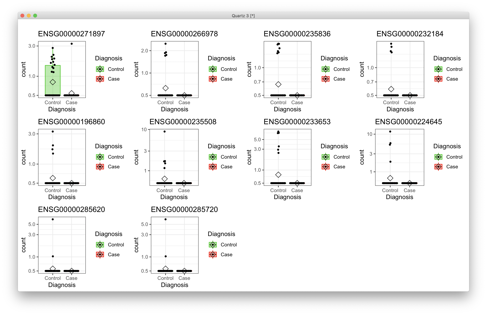
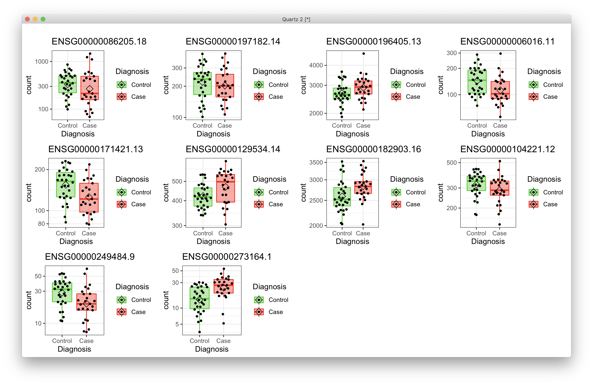

# 2021-03-19 17:33:06

A quick try with SVA, based on:

http://master.bioconductor.org/packages/release/workflows/vignettes/rnaseqGene/inst/doc/rnaseqGene.html#using-sva-with-deseq2

and

https://biodatascience.github.io/compbio/dist/sva.html


```r
myregion = 'ACC'
data = readRDS('~/data/rnaseq_derek/complete_rawCountData_05132020.rds')
rownames(data) = data$submitted_name  # just to ensure compatibility later
# remove obvious outlier (that's NOT caudate) labeled as ACC
rm_me = rownames(data) %in% c('68080')
data = data[!rm_me, ]
data = data[data$Region==myregion, ]
library(gdata)
more = read.xls('~/data/post_mortem/POST_MORTEM_META_DATA_JAN_2021.xlsx')
more = more[!duplicated(more$hbcc_brain_id),]
data = merge(data, more[, c('hbcc_brain_id', 'comorbid_group_update',
                            'substance_group', 'evidence_level')],
             by='hbcc_brain_id', all.x=T, all.y=F)

# at this point we have 55 samples for ACC
grex_vars = colnames(data)[grepl(colnames(data), pattern='^ENS')]
count_matrix = t(data[, grex_vars])
data = data[, !grepl(colnames(data), pattern='^ENS')]
# data only contains sample metadata, and count_matrix has actual counts

# cleaning up some variables
data$POP_CODE = as.character(data$POP_CODE)
data[data$POP_CODE=='WNH', 'POP_CODE'] = 'W'
data[data$POP_CODE=='WH', 'POP_CODE'] = 'W'
data$POP_CODE = factor(data$POP_CODE)
data$Individual = factor(data$hbcc_brain_id)
data[data$Manner.of.Death=='Suicide (probable)', 'Manner.of.Death'] = 'Suicide'
data[data$Manner.of.Death=='unknown', 'Manner.of.Death'] = 'natural'
data$MoD = factor(data$Manner.of.Death)
data$batch = factor(as.numeric(data$run_date))
data$Diagnosis = factor(data$Diagnosis, levels=c('Control', 'Case'))
data$substance_group = factor(data$substance_group)
data$comorbid_group = factor(data$comorbid_group_update)
data$evidence_level = factor(data$evidence_level)
data$brainbank = factor(data$bainbank)

# removing everything but autosomes
library(GenomicFeatures)
txdb <- loadDb('~/data/post_mortem/Homo_sapies.GRCh38.97.sqlite')
txdf <- select(txdb, keys(txdb, "GENEID"), columns=c('GENEID','TXCHROM'),
               "GENEID")
bt = read.csv('~/data/post_mortem/Homo_sapiens.GRCh38.97_biotypes.csv')
bt_slim = bt[, c('gene_id', 'gene_biotype')]
bt_slim = bt_slim[!duplicated(bt_slim),]
txdf = merge(txdf, bt_slim, by.x='GENEID', by.y='gene_id')
# store gene names in geneCounts without version in end of name
tx_meta = data.frame(GENEID = substr(rownames(count_matrix), 1, 15))
tx_meta = merge(tx_meta, txdf, by='GENEID', sort=F)
imautosome = which(tx_meta$TXCHROM != 'X' &
                   tx_meta$TXCHROM != 'Y' &
                   tx_meta$TXCHROM != 'MT')
count_matrix = count_matrix[imautosome, ]
tx_meta = tx_meta[imautosome, ]
```

Now we start the part specific to SVA:

```r
keep_me = rep(TRUE, nrow(count_matrix))
my_count_matrix = count_matrix[keep_me, ]
my_tx_meta = tx_meta[keep_me, ]
data.pm = data
rownames(data.pm) = data.pm$hbcc_brain_id
colnames(my_count_matrix) = rownames(data.pm)
rownames(my_count_matrix) = substr(rownames(my_count_matrix), 1, 15)

# removing variables with zero or near-zero variance
library(caret)
pp_order = c('zv', 'nzv')
pp = preProcess(t(my_count_matrix), method = pp_order)
X = t(predict(pp, t(my_count_matrix)))
cat('Keeping', nrow(X), 'after NZ and NZV filtering\n')

# replace the one subject missing population PCs by the median of their
# self-declared race and ethnicity
idx = (data.pm$Race.x=='White' & data.pm$Ethnicity.x=='Non-Hispanic' &
    !is.na(data.pm$C1))
pop_pcs = c('C1', 'C2', 'C3', 'C4', 'C5')
med_pop = apply(data[idx, pop_pcs], 2, median)
data.pm[which(is.na(data.pm$C1)), pop_pcs] = med_pop

num_vars = c('pcnt_optical_duplicates', 'clusters', 'Age', 'RINe', 'PMI',
             'C1', 'C2', 'C3', 'C4', 'C5')
categ_vars = c('batch', 'MoD', 'substance_group', 'brainbank',
                'comorbid_group', 'POP_CODE', 'Sex', 'evidence_level',
                'Diagnosis')
covars = data.pm[, c(num_vars, categ_vars)]
for (var in num_vars) {
    covars[, var] = scale(data.pm[, var])
}

countdata = round(X)
library(DESeq2)

# from https://biodatascience.github.io/compbio/dist/sva.html
dds <- DESeqDataSetFromMatrix(countData = countdata,
                                    colData = covars,
                                    design = ~Diagnosis)
dds <- estimateSizeFactors(dds)
# I get the same value whether I do this after DESeq or just estimateSizeFactors
dat  <- counts(dds, normalized = TRUE)

library(sva)
mod  <- model.matrix(~ Diagnosis, colData(dds))
mod0 <- model.matrix(~   1, colData(dds))
dat2 <- dat[rowSums(dat) > 0,]
svseq <- svaseq(dat2, mod, mod0, n.sv = 2)
```

So, this works. Let's now try splitting the data, and doing the correlation
analysis.

```r
idx1 = 1:23
idx2 = setdiff(1:nrow(covars), idx1)
dds <- DESeqDataSetFromMatrix(countData = countdata[, idx1],
                                    colData = covars[idx1, ],
                                    design = ~Diagnosis)
dds <- estimateSizeFactors(dds)
dat  <- counts(dds, normalized = TRUE)
mod  <- model.matrix(~ Diagnosis, colData(dds))
mod0 <- model.matrix(~   1, colData(dds))
dat2 <- dat[rowSums(dat) > 0,]
svseq <- svaseq(dat2, mod, mod0, n.sv = 2)
ddssva <- dds
ddssva$SV1 <- svseq$sv[,1]
ddssva$SV2 <- svseq$sv[,2]
design(ddssva) <- ~ SV1 + SV2 + Diagnosis
ddssva <- DESeq(ddssva)
res1 <- results(ddssva, name = "Diagnosis_Case_vs_Control", alpha = .05)

dds <- DESeqDataSetFromMatrix(countData = countdata[, idx2],
                                    colData = covars[idx2, ],
                                    design = ~Diagnosis)
dds <- estimateSizeFactors(dds)
dat  <- counts(dds, normalized = TRUE)
mod  <- model.matrix(~ Diagnosis, colData(dds))
mod0 <- model.matrix(~   1, colData(dds))
dat2 <- dat[rowSums(dat) > 0,]
svseq <- svaseq(dat2, mod, mod0, n.sv = 2)
ddssva <- dds
ddssva$SV1 <- svseq$sv[,1]
ddssva$SV2 <- svseq$sv[,2]
design(ddssva) <- ~ SV1 + SV2 + Diagnosis
ddssva <- DESeq(ddssva)
res2 <- results(ddssva, name = "Diagnosis_Case_vs_Control", alpha = .05)

both_res = merge(data.frame(res1), data.frame(res2), by=0)
mycorr = cor.test(both_res$log2FoldChange.x, both_res$log2FoldChange.y,
                  method='spearman')
```

OK, so this does the job. Now it's just a matter of scripting it for multiple
permutations and different nmbers of SVs. Also, start with the correct
covariates based on the earth analysis.

# 2021-03-22 15:26:39

Supposedly SVA can run permutations to determine the best number of SVs?

```r
myregion = 'ACC'
data = readRDS('~/data/rnaseq_derek/complete_rawCountData_05132020.rds')
rownames(data) = data$submitted_name  # just to ensure compatibility later
# remove obvious outlier (that's NOT caudate) labeled as ACC
rm_me = rownames(data) %in% c('68080')
data = data[!rm_me, ]
data = data[data$Region==myregion, ]
library(gdata)
more = read.xls('~/data/post_mortem/POST_MORTEM_META_DATA_JAN_2021.xlsx')
more = more[!duplicated(more$hbcc_brain_id),]
data = merge(data, more[, c('hbcc_brain_id', 'comorbid_group_update',
                            'substance_group', 'evidence_level')],
             by='hbcc_brain_id', all.x=T, all.y=F)

# at this point we have 55 samples for ACC
grex_vars = colnames(data)[grepl(colnames(data), pattern='^ENS')]
count_matrix = t(data[, grex_vars])
data = data[, !grepl(colnames(data), pattern='^ENS')]
# data only contains sample metadata, and count_matrix has actual counts

data$Diagnosis = factor(data$Diagnosis, levels=c('Control', 'Case'))

# removing everything but autosomes
library(GenomicFeatures)
txdb <- loadDb('~/data/post_mortem/Homo_sapies.GRCh38.97.sqlite')
txdf <- select(txdb, keys(txdb, "GENEID"), columns=c('GENEID','TXCHROM'),
               "GENEID")
bt = read.csv('~/data/post_mortem/Homo_sapiens.GRCh38.97_biotypes.csv')
bt_slim = bt[, c('gene_id', 'gene_biotype')]
bt_slim = bt_slim[!duplicated(bt_slim),]
txdf = merge(txdf, bt_slim, by.x='GENEID', by.y='gene_id')
# store gene names in geneCounts without version in end of name
tx_meta = data.frame(GENEID = substr(rownames(count_matrix), 1, 15))
tx_meta = merge(tx_meta, txdf, by='GENEID', sort=F)
imautosome = which(tx_meta$TXCHROM != 'X' &
                   tx_meta$TXCHROM != 'Y' &
                   tx_meta$TXCHROM != 'MT')
count_matrix = count_matrix[imautosome, ]
tx_meta = tx_meta[imautosome, ]

keep_me = rep(TRUE, nrow(count_matrix))
my_count_matrix = count_matrix[keep_me, ]
my_tx_meta = tx_meta[keep_me, ]
data.pm = data
rownames(data.pm) = data.pm$hbcc_brain_id
colnames(my_count_matrix) = rownames(data.pm)
rownames(my_count_matrix) = substr(rownames(my_count_matrix), 1, 15)

# removing variables with zero or near-zero variance
library(caret)
pp_order = c('zv', 'nzv')
pp = preProcess(t(my_count_matrix), method = pp_order)
X = t(predict(pp, t(my_count_matrix)))
cat('Keeping', nrow(X), 'after NZ and NZV filtering\n')

countdata = round(X)
library(DESeq2)

# from https://biodatascience.github.io/compbio/dist/sva.html
dds <- DESeqDataSetFromMatrix(countData = countdata,
                                    colData = data.pm,
                                    design = ~Diagnosis)
dds <- estimateSizeFactors(dds)
# I get the same value whether I do this after DESeq or just estimateSizeFactors
dat  <- counts(dds, normalized = TRUE)

library(sva)
mod  <- model.matrix(~ Diagnosis, colData(dds))
mod0 <- model.matrix(~   1, colData(dds))
dat2 <- dat[rowSums(dat) > 0,]
svseq <- svaseq(dat2, mod, mod0, n.sv = NULL)

ddssva <- dds
fm_str = '~ Diagnosis'
for (s in 1:ncol(svseq$sv)) {
    eval(parse(text=sprintf('data.pm$SV%d <- svseq$sv[,%d]', s, s)))
    fm_str = sprintf('%s + SV%d', fm_str, s)
}
dds <- DESeqDataSetFromMatrix(countData = countdata,
                              colData = data.pm,
                              design = as.formula(fm_str))
dds <- DESeq(dds)
alpha=.05
res <- results(dds, name = "Diagnosis_Case_vs_Control", alpha = alpha)
print(summary(res))

library(IHW)
resIHW <- results(dds, name = "Diagnosis_Case_vs_Control", alpha = alpha,
                filterFun=ihw)
print(summary(resIHW))
```

```
r$> print(summary(res))                                                                        

out of 42257 with nonzero total read count
adjusted p-value < 0.05
LFC > 0 (up)       : 6, 0.014%
LFC < 0 (down)     : 19, 0.045%
outliers [1]       : 0, 0%
low counts [2]     : 0, 0%
(mean count < 0)
[1] see 'cooksCutoff' argument of ?results
[2] see 'independentFiltering' argument of ?results

NULL

r$> library(IHW)                                                                               

Attaching package: ‘IHW’

The following object is masked from ‘package:ggplot2’:

    alpha


r$> resIHW <- results(dds, name = "Diagnosis_Case_vs_Control", alpha = alpha, 
                    filterFun=ihw)                                                             

r$> print(summary(resIHW))                                                                     

out of 42257 with nonzero total read count
adjusted p-value < 0.05
LFC > 0 (up)       : 15, 0.035%
LFC < 0 (down)     : 18, 0.043%
outliers [1]       : 0, 0%
[1] see 'cooksCutoff' argument of ?results
see metadata(res)$ihwResult on hypothesis weighting

NULL
```

This is looking quite interesting. I need to plot them just to make sure ther'e
not being driven by zeros, as I didn't do any cleaning whatsoever.

These are the results for Caudate:

```
Keeping 41839 after NZ and NZV filtering
converting counts to integer mode
Number of significant surrogate variables is:  11 
Iteration (out of 5 ):1  2  3  4  5  converting counts to integer mode
estimating size factors
estimating dispersions
gene-wise dispersion estimates
mean-dispersion relationship
final dispersion estimates
fitting model and testing
1 rows did not converge in beta, labelled in mcols(object)$betaConv. Use larger maxit argument with nbinomWaldTest

out of 41820 with nonzero total read count
adjusted p-value < 0.05
LFC > 0 (up)       : 3, 0.0072%
LFC < 0 (down)     : 7, 0.017%
outliers [1]       : 0, 0%
low counts [2]     : 0, 0%
(mean count < 0)
[1] see 'cooksCutoff' argument of ?results
[2] see 'independentFiltering' argument of ?results

NULL

out of 41820 with nonzero total read count
adjusted p-value < 0.05
LFC > 0 (up)       : 3, 0.0072%
LFC < 0 (down)     : 6, 0.014%
outliers [1]       : 0, 0%
[1] see 'cooksCutoff' argument of ?results
see metadata(res)$ihwResult on hypothesis weighting

NULL
```

I saved everything to ~/data/post_mortem/DGE_SV_032220201.RData.

So, it's clearly being corrupted by the zeros. For example, these are the top 10
for ACC:



But it doesn't mean it's a waste. Let's redo it, but after filtering:

```r
myregion = 'ACC'
data = readRDS('~/data/rnaseq_derek/complete_rawCountData_05132020.rds')
rownames(data) = data$submitted_name  # just to ensure compatibility later
# remove obvious outlier (that's NOT caudate) labeled as ACC
rm_me = rownames(data) %in% c('68080')
data = data[!rm_me, ]
data = data[data$Region==myregion, ]
library(gdata)
more = read.xls('~/data/post_mortem/POST_MORTEM_META_DATA_JAN_2021.xlsx')
more = more[!duplicated(more$hbcc_brain_id),]
data = merge(data, more[, c('hbcc_brain_id', 'comorbid_group_update',
                            'substance_group', 'evidence_level')],
             by='hbcc_brain_id', all.x=T, all.y=F)

# at this point we have 55 samples for ACC
grex_vars = colnames(data)[grepl(colnames(data), pattern='^ENS')]
count_matrix = t(data[, grex_vars])
data = data[, !grepl(colnames(data), pattern='^ENS')]
# data only contains sample metadata, and count_matrix has actual counts

data$Diagnosis = factor(data$Diagnosis, levels=c('Control', 'Case'))

# removing everything but autosomes
library(GenomicFeatures)
txdb <- loadDb('~/data/post_mortem/Homo_sapies.GRCh38.97.sqlite')
txdf <- select(txdb, keys(txdb, "GENEID"), columns=c('GENEID','TXCHROM'),
               "GENEID")
bt = read.csv('~/data/post_mortem/Homo_sapiens.GRCh38.97_biotypes.csv')
bt_slim = bt[, c('gene_id', 'gene_biotype')]
bt_slim = bt_slim[!duplicated(bt_slim),]
txdf = merge(txdf, bt_slim, by.x='GENEID', by.y='gene_id')
# store gene names in geneCounts without version in end of name
tx_meta = data.frame(GENEID = substr(rownames(count_matrix), 1, 15))
tx_meta = merge(tx_meta, txdf, by='GENEID', sort=F)
imautosome = which(tx_meta$TXCHROM != 'X' &
                   tx_meta$TXCHROM != 'Y' &
                   tx_meta$TXCHROM != 'MT')
count_matrix = count_matrix[imautosome, ]
tx_meta = tx_meta[imautosome, ]
```

```r
run_DGE_SVA = function(count_matrix, data.pm, tx_meta, myregion, subtype,
                       alpha, nSV = NULL) {
    cat('Starting with', nrow(tx_meta), 'variables\n')
    if (is.na(subtype)) {
        keep_me = rep(TRUE, nrow(count_matrix))
    } else {
        keep_me = grepl(tx_meta$gene_biotype, pattern=sprintf('%s$', subtype))
    }
    cat('Keeping', sum(keep_me), subtype, 'variables\n')
    my_count_matrix = count_matrix[keep_me, ]
    my_tx_meta = tx_meta[keep_me, ]

    # removing variables where more than half of the subjects have zero counts
    keep_me = rowSums(my_count_matrix==0) < .25*ncol(my_count_matrix)
    my_count_matrix = my_count_matrix[keep_me, ]
    cat('Keeping', nrow(my_count_matrix), 'after zero removal\n')

    # removing variables with zero or near-zero variance
    library(caret)
    pp_order = c('zv', 'nzv')
    pp = preProcess(t(my_count_matrix), method = pp_order)
    X = t(predict(pp, t(my_count_matrix)))
    cat('Keeping', nrow(X), 'after NZ and NZV filtering\n')

    # removing variables with low expression
    countsExpr = X
    metaExpr = data.frame(GENEID = substr(rownames(countsExpr), 1, 15))
    metaExpr = merge(metaExpr, my_tx_meta, by='GENEID', sort=F)
    
    # preparing DESeqData and running main analysis
    countdata = round(countsExpr)
    colnames(countdata) = rownames(data.pm)
    library(DESeq2)
    
    # from https://biodatascience.github.io/compbio/dist/sva.html
    dds <- DESeqDataSetFromMatrix(countData = countdata,
                                    colData = data.pm,
                                    design = ~Diagnosis)
    dds <- estimateSizeFactors(dds)
    # I get the same value whether I do this after DESeq or just estimateSizeFactors
    dat  <- counts(dds, normalized = TRUE)

    library(sva)
    mod  <- model.matrix(~ Diagnosis, colData(dds))
    mod0 <- model.matrix(~   1, colData(dds))
    set.seed(42)
    svseq <- svaseq(dat, mod, mod0, n.sv = nSV)
    # svseq <- svaseq(dat, mod, mod0, n.sv = NULL, numSVmethod = "leek")

    fm_str = '~ Diagnosis'
    for (s in 1:ncol(svseq$sv)) {
        eval(parse(text=sprintf('data.pm$SV%d <- svseq$sv[,%d]', s, s)))
        fm_str = sprintf('%s + SV%d', fm_str, s)
    }

    # because DESeq doesn't remove outliers if there are continuous variables
    # in the formula, we need to do this iteratively
    nOutliers = Inf
    myCounts = round(countsExpr)
    while (nOutliers > 0) {
        dds <- DESeqDataSetFromMatrix(countData = myCounts,
                                    colData = data.pm,
                                    design = as.formula(fm_str))
        cat('Processing', nrow(dds), 'variables.\n')
        dds <- DESeq(dds)
        maxCooks <- apply(assays(dds)[["cooks"]], 1, max)
        # outlier cut-off uses the 99% quantile of the F(p,m-p) distribution (with 
        # p the number of parameters including the intercept and m number of
        # samples).
        m <- ncol(dds)
        # number or parameters (PCs + Diagnosis + intercept)
        p <- ncol(svseq$sv) + 2
        co = qf(.99, p, m - p)
        keep_me = which(maxCooks < co)
        nOutliers = nrow(myCounts) - length(keep_me)
        cat('Found', nOutliers, 'outliers.\n')
        myCounts = round(myCounts)[keep_me, ]
    }
    res <- results(dds, name = "Diagnosis_Case_vs_Control", alpha = alpha)
    cat(sprintf('FDR q < %.2f\n', alpha))
    print(summary(res))
    
    library(IHW)
    resIHW <- results(dds, name = "Diagnosis_Case_vs_Control", alpha = alpha,
                    filterFun=ihw)
    cat(sprintf('IHW q < %.2f\n', alpha))
    print(summary(resIHW))
    
    my_res = list(res=res, resIHW=resIHW, dds=dds)
    return(my_res)
}
```

```r
dge_acc = run_DGE_SVA(count_matrix, data, tx_meta, myregion, NA, .05)
```

Saved both dge_acc and dge_cau to the same file name as above, since the
previous file was a dud because of all the zeros. How about this one?

```
# ACC
FDR q < 0.05

out of 29346 with nonzero total read count
adjusted p-value < 0.05
LFC > 0 (up)       : 4, 0.014%
LFC < 0 (down)     : 6, 0.02%
outliers [1]       : 0, 0%
low counts [2]     : 9103, 31%
(mean count < 16)
[1] see 'cooksCutoff' argument of ?results
[2] see 'independentFiltering' argument of ?results

NULL
IHW q < 0.05

out of 29346 with nonzero total read count
adjusted p-value < 0.05
LFC > 0 (up)       : 3, 0.01%
LFC < 0 (down)     : 5, 0.017%
outliers [1]       : 0, 0%
[1] see 'cooksCutoff' argument of ?results
see metadata(res)$ihwResult on hypothesis weighting

# Caudate
FDR q < 0.05

out of 29070 with nonzero total read count
adjusted p-value < 0.05
LFC > 0 (up)       : 0, 0%
LFC < 0 (down)     : 0, 0%
outliers [1]       : 0, 0%
low counts [2]     : 0, 0%
(mean count < 0)
[1] see 'cooksCutoff' argument of ?results
[2] see 'independentFiltering' argument of ?results

NULL
IHW q < 0.05

out of 29070 with nonzero total read count
adjusted p-value < 0.05
LFC > 0 (up)       : 0, 0%
LFC < 0 (down)     : 0, 0%
outliers [1]       : 0, 0%
[1] see 'cooksCutoff' argument of ?results
see metadata(res)$ihwResult on hypothesis weighting
```

But how do the ACC results look this time?



That's certainly more plausible.

What happens if we do GSEA on it?

```r
library(WebGestaltR)

data_dir = '~/data/post_mortem/'
ncpu=6

load('~/data/post_mortem/DGE_SV_03222021.RData')

for (region in c('acc', 'caudate')) {
    res_str = ifelse(region == 'acc', 'dge_acc$res', 'dge_cau$res')
    ranks_str = sprintf('ranks = -log(%s$pvalue) * sign(%s$log2FoldChange)',
                        res_str, res_str)
    gid_str = sprintf('geneid=substring(rownames(%s), 1, 15)', res_str)
    
    eval(parse(text=ranks_str))
    eval(parse(text=gid_str))

    tmp2 = data.frame(geneid=geneid, rank=ranks)
    tmp2 = tmp2[order(ranks, decreasing=T),]

    DBs = c(sprintf('my_%s_sets', region))
    for (db in DBs) {
        cat(res_str, db, '\n')
        db_file = sprintf('~/data/post_mortem/%s.gmt', db)
        project_name = sprintf('WG13_%s_%s_10K', res_str, db)
        enrichResult <- try(WebGestaltR(enrichMethod="GSEA",
                            organism="hsapiens",
                            enrichDatabaseFile=db_file,
                            enrichDatabaseType="genesymbol",
                            interestGene=tmp2,
                            outputDirectory = data_dir,
                            interestGeneType="ensembl_gene_id",
                            sigMethod="top", topThr=20,
                            minNum=3, projectName=project_name,
                            isOutput=T, isParallel=T,
                            nThreads=ncpu, perNum=10000, maxNum=800))
    }

    DBs = c('geneontology_Biological_Process_noRedundant',
            'geneontology_Cellular_Component_noRedundant',
            'geneontology_Molecular_Function_noRedundant')
    for (db in DBs) {
        cat(res_str, db, '\n')
        project_name = sprintf('WG13_%s_%s_10K', res_str, db)

        enrichResult <- try(WebGestaltR(enrichMethod="GSEA",
                                    organism="hsapiens",
                                    enrichDatabase=db,
                                    interestGene=tmp2,
                                    interestGeneType="ensembl_gene_id",
                                    sigMethod="top", topThr=20,
                                    outputDirectory = data_dir,
                                    minNum=5, projectName=project_name,
                                    isOutput=T, isParallel=T,
                                    nThreads=ncpu, perNum=10000))
    }

    for (db in c('KEGG', 'Panther', 'Reactome', 'Wikipathway')) {
        cat(res_str, db, '\n')
        project_name = sprintf('WG13_%s_%s_10K', res_str, db)

        enrichResult <- try(WebGestaltR(enrichMethod="GSEA",
                                    organism="hsapiens",
                                    enrichDatabase=sprintf('pathway_%s', db),
                                    interestGene=tmp2,
                                    interestGeneType="ensembl_gene_id",
                                    sigMethod="top", minNum=3,
                                    outputDirectory = data_dir,
                                    projectName=project_name,
                                    isOutput=T, isParallel=T,
                                    nThreads=ncpu, topThr=20, perNum=10000))
    }
}
```

Let's look into MAGMA as well:

```r
library(biomaRt)
library(dplyr)
mart <- useDataset("hsapiens_gene_ensembl", useMart("ensembl"))

load('~/data/post_mortem//DGE_SV_03222021.RData')
for (r in c('acc', 'cau')) {
    res_str = sprintf('res = as.data.frame(dge_%s$res)', r)
    eval(parse(text=res_str))

    res$GENEID = substr(rownames(res), 1, 15)
    G_list0 <- getBM(filters= "ensembl_gene_id",
                    attributes= c("ensembl_gene_id", "entrezgene_id"),values=res$GENEID, mart= mart)
    G_list <- G_list0[!is.na(G_list0$ensembl_gene_id),]
    G_list = G_list[G_list$ensembl_gene_id!='',]
    G_list <- G_list[!duplicated(G_list$ensembl_gene_id),]
    imnamed = res$GENEID %in% G_list$ensembl_gene_id
    res = res[imnamed, ]
    res2 = merge(res, G_list, sort=F, all.x=F, all.y=F, by.x='GENEID',
                by.y='ensembl_gene_id')
    ranks = res2 %>% group_by(entrezgene_id) %>% slice_min(n=1, pvalue, with_ties=F)
    myres = data.frame(gene=ranks$entrezgene_id,
                    signed_rank=sign(ranks$log2FoldChange)*-log(ranks$pvalue),
                    unsigned_rank=-log(ranks$pvalue))
    out_fname = sprintf('~/data/post_mortem/MAGMA_dge_SV_%s.tab', r)
    write.table(myres, row.names=F, sep='\t', file=out_fname, quote=F)
}
```

Then, for MAGMA we only need to run the last command:

```bash
module load MAGMA
cd ~/data/tmp
for r in 'acc' 'cau'; do
    magma --gene-results genes_BW.genes.raw \
        --gene-covar ~/data/post_mortem/MAGMA_dge_SV_${r}.tab \
        --out ~/data/post_mortem/MAGMA_gc_BW_dge_SV_${r};
done
```

Nevermind... this wipes out the MAGMA results, as I had somewhat expected given
the lack of GWAS results in our own GMTs.

I also tried using "leek" to estimate the number of SVs, because 10 and 11 does
look a bit high, but nothing there. My other option is to try to do the split
algorithm, but I should try to keep the class ratio the same:

```r
library(caret)
nperms = 300
nSV = 4
ncpu = 2
perms = createMultiFolds(data$Diagnosis, k=2, times=nperms)

library(doMC)
registerDoMC(ncpu)
l <- foreach(r=1:nperms) %dopar% { 
    idx = perms[[sprintf('Fold1.Rep%03d', r)]]
    dge1 = run_DGE_SVA(count_matrix[, idx], data[idx,], tx_meta, myregion, NA,
                    .05, nSV)
    idx = perms[[sprintf('Fold2.Rep%03d', r)]]
    dge2 = run_DGE_SVA(count_matrix[, idx], data[idx,], tx_meta, myregion, NA,
                    .05, nSV)
    m = merge(as.data.frame(dge1$res), as.data.frame(dge2$res), by=0,
            all.x=F, all.y=F)
    res = cor.test(m$log2FoldChange.x, m$log2FoldChange.y, method='spearman')
    return(c(res$estimate, res$p.value))
}
```
