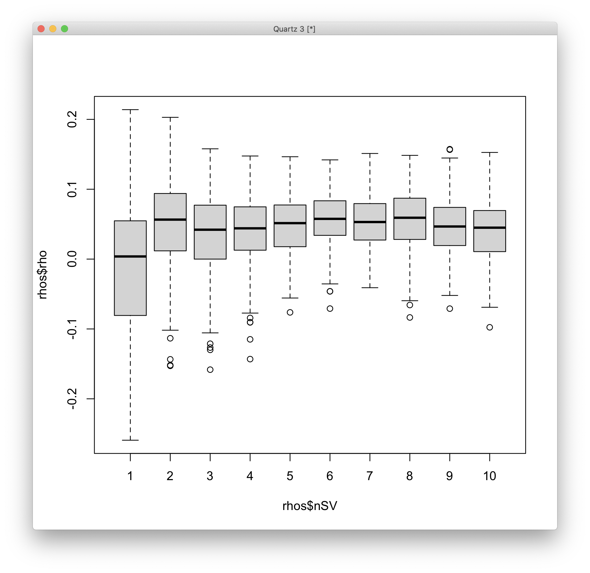

# 2021-03-24 19:39:06

The idea here is to use the exact same strategy I used for DGE, but now for DTE.
I'll code the traditional variables with SVs and run it, and then in parallel
I'll run the split analysis to find out the number of variables.

```r
run_DTE_noPCA_SVs = function(count_matrix, samples, tx_meta, myregion, subtype,
                             alpha, BBB = FALSE, nSV = 1, add_cov=NA) {
    cat('Starting with', nrow(tx_meta), 'variables\n')
    if (is.na(subtype)) {
        keep_me = rep(TRUE, nrow(count_matrix))
    } else {
        keep_me = grepl(tx_meta$transcript_biotype, pattern=sprintf('%s$', subtype))
    }
    cat('Keeping', sum(keep_me), subtype, 'variables\n')
    my_count_matrix = count_matrix[keep_me, ]
    my_tx_meta = tx_meta[keep_me, ]

    # removing variables where more than half of the subjects have zero counts
    keep_me = rowSums(my_count_matrix==0) < .25*ncol(my_count_matrix)
    my_count_matrix = my_count_matrix[keep_me, ]
    cat('Keeping', nrow(my_count_matrix), 'after zero removal\n')
    data.pm = samples

    # removing variables with zero or near-zero variance
    library(caret)
    pp_order = c('zv', 'nzv')
    pp = preProcess(t(my_count_matrix), method = pp_order)
    X = t(predict(pp, t(my_count_matrix)))
    cat('Keeping', nrow(X), 'after NZ and NZV filtering\n')

    # replace the one subject missing population PCs by the median of their
    # self-declared race and ethnicity
    idx = (data.pm$Race.x=='White' & data.pm$Ethnicity.x=='Non-Hispanic' &
           !is.na(data.pm$C1))
    pop_pcs = c('C1', 'C2', 'C3', 'C4', 'C5')
    med_pop = apply(data[idx, pop_pcs], 2, median)
    data.pm[which(is.na(data.pm$C1)), pop_pcs] = med_pop

    if (BBB) {
        data.pm$BBB = factor(sapply(1:nrow(data.pm),
                                    function(x) sprintf('%s_%s',
                                             as.character(data.pm[x,'brainbank']),
                                             as.character(data.pm[x, 'batch']))))
        use_pcs = c('BBB', 'Age', 'Sex', 'C1', 'C2', 'C3', 'RINe', 'PMI')
    } else {
        use_pcs = c('batch', 'Age', 'Sex', 'C1', 'C2', 'C3', 'RINe', 'PMI')
    }

    # add more covariates for robustness testing
    if (! is.na(add_cov)) {
        use_pcs = c(use_pcs, add_cov)
    }

    fm_str = sprintf('~ Diagnosis + %s', paste0(use_pcs, collapse = ' + '))
    cat('Using formula:', fm_str, '\n')

    # scaling num_vars to assure convergence
    # removed pH because of too many NAs, RIN because we have RINe for everyone
    num_vars = c('pcnt_optical_duplicates', 'clusters', 'Age', 'RINe', 'PMI',
                'C1', 'C2', 'C3', 'C4', 'C5')
    for (var in num_vars) {
        data.pm[, var] = scale(data.pm[, var])
    }

    # removing variables with low expression
    library(edgeR)
    design=model.matrix(as.formula(fm_str), data=data.pm)
    isexpr <- filterByExpr(X, design=design)
    countsExpr = X[isexpr,]
    metaExpr = data.frame(TXNAME = substr(rownames(countsExpr), 1, 15))
    metaExpr = merge(metaExpr, my_tx_meta, by='TXNAME', sort=F)
    cat('Keeping', nrow(countsExpr), 'after expression filtering\n')

    library(DESeq2)
    # because DESeq doesn't remove outliers if there are continuous variables
    # in the formula, we need to do this iteratively
    nOutliers = Inf
    myCounts = round(countsExpr)
    while (nOutliers > 0) {
        dds <- DESeqDataSetFromMatrix(countData = myCounts,
                                    colData = data.pm,
                                    design = as.formula(fm_str))
        cat('Processing', nrow(dds), 'variables.\n')
        dds <- DESeq(dds)
        maxCooks <- apply(assays(dds)[["cooks"]], 1, max)
        # outlier cut-off uses the 99% quantile of the F(p,m-p) distribution (with 
        # p the number of parameters including the intercept and m number of
        # samples).
        m <- ncol(dds)
        # number or parameters (PCs + Diagnosis + intercept)
        p <- length(use_pcs) + 2
        co = qf(.99, p, m - p)
        keep_me = which(maxCooks < co)
        nOutliers = nrow(myCounts) - length(keep_me)
        cat('Found', nOutliers, 'outliers.\n')
        myCounts = round(myCounts)[keep_me, ]
    }

    # let's calculate SVs only afterwards, so outlier genes don't influence them
    if ( nSV > 0 || is.null(nSV) ) {
        # I get the same value whether I do this after DESeq or just estimateSizeFactors
        dat  <- counts(dds, normalized = TRUE)

        library(sva)
        set.seed(42)
        mod  <- model.matrix(~ Diagnosis, colData(dds))
        mod0 <- model.matrix(~   1, colData(dds))
        svseq <- svaseq(dat, mod, mod0, n.sv = nSV)
        # in case it was null
        nSV = ncol(svseq$sv)
        
        for (s in 1:nSV) {
            eval(parse(text=sprintf('data.pm$SV%d <- svseq$sv[,%d]', s, s)))
            fm_str = sprintf('%s + SV%d', fm_str, s)
        }
        dds <- DESeqDataSetFromMatrix(countData = myCounts,
                                      colData = data.pm,
                                      design = as.formula(fm_str))
        dds <- DESeq(dds)
    }
    res <- results(dds, name = "Diagnosis_Case_vs_Control", alpha = alpha)
    cat(sprintf('FDR q < %.2f\n', alpha))
    print(summary(res))
    
    library(IHW)
    resIHW <- results(dds, name = "Diagnosis_Case_vs_Control", alpha = alpha,
                    filterFun=ihw)
    cat(sprintf('IHW q < %.2f\n', alpha))
    print(summary(resIHW))
    
    # stage-wise testing
    library(stageR)
    library(dplyr)
    pConfirmation <- matrix(res$pvalue, ncol=1)
    dimnames(pConfirmation) <- list(substr(rownames(res), 1, 15),
                                    c("transcript"))
    # select one qval per gene (min over transcripts)
    junk = as.data.frame(res)
    junk$TXNAME = substr(rownames(junk), 1, 15)
    m = merge(junk, metaExpr, by='TXNAME')
    qvals = m %>% group_by(GENEID) %>% slice_min(n=1, padj, with_ties=F)
    pScreen = qvals$padj
    names(pScreen) = qvals$GENEID

    stageRObj = stageRTx(pScreen=pScreen, pConfirmation=pConfirmation,
                        pScreenAdjusted=TRUE, tx2gene=metaExpr[, 1:2])
    stageRObj = stageWiseAdjustment(stageRObj, method="dte", alpha=alpha)
    cat(sprintf('stageR q < %.2f\n', alpha))
    gene_ids = getSignificantGenes(stageRObj)
    tx_ids = getSignificantTx(stageRObj)
    if (nrow(tx_ids) > 0) {
        print(gene_ids)
        print(tx_ids)
    }

    my_res = list(res=res, resIHW=resIHW, dds=dds, stageRObj=stageRObj)
    return(my_res)
}
```

And the code to load the data:

```r
myregion = 'ACC'

load('~/data/isoforms/tximport_rsem_DTE.RData')
txi = rsem

# I'll just use the metadata from here
data = readRDS('~/data/rnaseq_derek/complete_rawCountData_05132020.rds')
rownames(data) = data$submitted_name  # just to ensure compatibility later
data = data[data$Region==myregion, ]
library(gdata)
more = read.xls('~/data/post_mortem/POST_MORTEM_META_DATA_JAN_2021.xlsx')
more = more[!duplicated(more$hbcc_brain_id),]
data = merge(data, more[, c('hbcc_brain_id', 'comorbid_group_update',
                            'substance_group', 'evidence_level')],
             by='hbcc_brain_id', all.x=T, all.y=F)
# samples has only the metadata now
samples = data[, !grepl(colnames(data), pattern='^ENS')]

# remove samples for the other brain region from the tx counts matrices
keep_me = colnames(txi$counts) %in% samples$submitted_name
for (i in c('abundance', 'counts', 'length')) {
    txi[[i]] = txi[[i]][, keep_me]
}
# sort samples to match order in tximport matrices
rownames(samples) = samples$submitted_name
samples = samples[colnames(txi$counts), ]

# cleaning up some metadata
samples$POP_CODE = as.character(samples$POP_CODE)
samples[samples$POP_CODE=='WNH', 'POP_CODE'] = 'W'
samples[samples$POP_CODE=='WH', 'POP_CODE'] = 'W'
samples$POP_CODE = factor(samples$POP_CODE)
samples$Individual = factor(samples$hbcc_brain_id)
samples[samples$Manner.of.Death=='Suicide (probable)', 'Manner.of.Death'] = 'Suicide'
samples[samples$Manner.of.Death=='unknown', 'Manner.of.Death'] = 'natural'
samples$MoD = factor(samples$Manner.of.Death)
samples$batch = factor(as.numeric(samples$run_date))
samples$Diagnosis = factor(samples$Diagnosis, levels=c('Control', 'Case'))
samples$substance_group = factor(samples$substance_group)
samples$comorbid_group = factor(samples$comorbid_group_update)
samples$evidence_level = factor(samples$evidence_level)
samples$brainbank = factor(samples$bainbank)

# removing everything but autosomes
library(GenomicFeatures)
txdb <- loadDb('~/data/post_mortem/Homo_sapies.GRCh38.97.sqlite')
txdf <- select(txdb, keys(txdb, "TXNAME"), columns=c('GENEID','TXCHROM'),
               "TXNAME")
# keep only the remaining transcripts and their corresponding genes
txdf.sub = txdf[match(substr(rownames(txi$counts), 1, 15), txdf$TXNAME),]
bt = read.csv('~/data/post_mortem/Homo_sapiens.GRCh38.97_biotypes.csv')
bt_slim = bt[, c('transcript_id', 'transcript_biotype')]
bt_slim = bt_slim[!duplicated(bt_slim),]
tx_meta = merge(txdf.sub, bt_slim, by.x='TXNAME', by.y='transcript_id')
imautosome = which(tx_meta$TXCHROM != 'X' &
                   tx_meta$TXCHROM != 'Y' &
                   tx_meta$TXCHROM != 'MT')
count_matrix = txi$counts[imautosome, ]
tx_meta = tx_meta[imautosome, ]
```

First thing is to check how many SVs the package thinks we have in DTE. I'll
only check all for ACC and Caudate.

```r
dte = run_DTE_noPCA_SVs(count_matrix, samples, tx_meta,
                        myregion, NA, .05, BBB=T, nSV=NULL)
```

For ACC I got 11 and for Caudate I got 12. So, I think running the experiments
all the way up to 10 sounds plausible.

Now we need to write the function that uses just Diagnosis, like in note
205:

```r
run_DTE_SVA = function(count_matrix, samples, tx_meta, myregion, subtype,
                       alpha, BBB = FALSE, nSV = 1, add_cov=NA) {
    cat('Starting with', nrow(tx_meta), 'variables\n')
    if (is.na(subtype)) {
        keep_me = rep(TRUE, nrow(count_matrix))
    } else {
        keep_me = grepl(tx_meta$transcript_biotype, pattern=sprintf('%s$', subtype))
    }
    cat('Keeping', sum(keep_me), subtype, 'variables\n')
    my_count_matrix = count_matrix[keep_me, ]
    my_tx_meta = tx_meta[keep_me, ]

    # removing variables where more than half of the subjects have zero counts
    keep_me = rowSums(my_count_matrix==0) < .25*ncol(my_count_matrix)
    my_count_matrix = my_count_matrix[keep_me, ]
    cat('Keeping', nrow(my_count_matrix), 'after zero removal\n')
    data.pm = samples

    # removing variables with zero or near-zero variance
    library(caret)
    pp_order = c('zv', 'nzv')
    pp = preProcess(t(my_count_matrix), method = pp_order)
    X = t(predict(pp, t(my_count_matrix)))
    cat('Keeping', nrow(X), 'after NZ and NZV filtering\n')

    # removing variables with low expression
    library(edgeR)
    fm_str = '~ Diagnosis'
    design=model.matrix(as.formula(fm_str), data=data.pm)
    isexpr <- filterByExpr(X, design=design)
    countsExpr = X[isexpr,]
    metaExpr = data.frame(TXNAME = substr(rownames(countsExpr), 1, 15))
    metaExpr = merge(metaExpr, my_tx_meta, by='TXNAME', sort=F)
    cat('Keeping', nrow(countsExpr), 'after expression filtering\n')

    # preparing DESeqData and running main analysis
    countdata = round(countsExpr)
    colnames(countdata) = rownames(data.pm)
    library(DESeq2)
    
    # from https://biodatascience.github.io/compbio/dist/sva.html
    dds <- DESeqDataSetFromMatrix(countData = countdata,
                                    colData = data.pm,
                                    design = ~Diagnosis)
    dds <- estimateSizeFactors(dds)
    # I get the same value whether I do this after DESeq or just estimateSizeFactors
    dat  <- counts(dds, normalized = TRUE)

    library(sva)
    mod  <- model.matrix(~ Diagnosis, colData(dds))
    mod0 <- model.matrix(~   1, colData(dds))
    set.seed(42)
    svseq <- svaseq(dat, mod, mod0, n.sv = nSV)

    for (s in 1:ncol(svseq$sv)) {
        eval(parse(text=sprintf('data.pm$SV%d <- svseq$sv[,%d]', s, s)))
        fm_str = sprintf('%s + SV%d', fm_str, s)
    }

    library(DESeq2)
    # because DESeq doesn't remove outliers if there are continuous variables
    # in the formula, we need to do this iteratively
    nOutliers = Inf
    myCounts = round(countsExpr)
    while (nOutliers > 0) {
        dds <- DESeqDataSetFromMatrix(countData = myCounts,
                                    colData = data.pm,
                                    design = as.formula(fm_str))
        cat('Processing', nrow(dds), 'variables.\n')
        dds <- DESeq(dds)
        maxCooks <- apply(assays(dds)[["cooks"]], 1, max)
        # outlier cut-off uses the 99% quantile of the F(p,m-p) distribution (with 
        # p the number of parameters including the intercept and m number of
        # samples).
        m <- ncol(dds)
        # number or parameters (PCs + Diagnosis + intercept)
        p <- ncol(svseq$sv) + 2
        co = qf(.99, p, m - p)
        keep_me = which(maxCooks < co)
        nOutliers = nrow(myCounts) - length(keep_me)
        cat('Found', nOutliers, 'outliers.\n')
        myCounts = round(myCounts)[keep_me, ]
    }
    res <- results(dds, name = "Diagnosis_Case_vs_Control", alpha = alpha)
    cat(sprintf('FDR q < %.2f\n', alpha))
    print(summary(res))
    
    library(IHW)
    resIHW <- results(dds, name = "Diagnosis_Case_vs_Control", alpha = alpha,
                    filterFun=ihw)
    cat(sprintf('IHW q < %.2f\n', alpha))
    print(summary(resIHW))

    my_res = list(res=res, resIHW=resIHW, dds=dds)
    return(my_res)
}
```

I cut the stageR portion because I was getting lots of errors because of that.

And now we permute the halves:

```r
library(caret)
nperms = 300
ncpu = 10
perms = createMultiFolds(data$Diagnosis, k=2, times=nperms)

library(doMC)
registerDoMC(ncpu)
for (nSV in seq(7, 10, 2)) {
    l <- foreach(r=1:nperms) %dopar% { 
        cat('iteration SV', nSV, '-', r, '\n')
        idx = perms[[sprintf('Fold1.Rep%03d', r)]]
        dte1 = run_DTE_SVA(count_matrix[, idx], samples[idx,], tx_meta,
                           myregion, NA, .05, nSV=nSV)
        idx = perms[[sprintf('Fold2.Rep%03d', r)]]
        dte2 = run_DTE_SVA(count_matrix[, idx], samples[idx,], tx_meta,
                           myregion, NA, .05, nSV=nSV)
        m = merge(as.data.frame(dte1$res), as.data.frame(dte2$res), by=0,
                  all.x=F, all.y=F)
        res = cor.test(m$log2FoldChange.x, m$log2FoldChange.y,
                       method='spearman')
        return(c(res$estimate, res$p.value))
    }
    save(l, nSV, nperms,
         file=sprintf('~/data/post_mortem/dte_l%02d.rdata', nSV))
}
```

With the DTE code working, we can now run:

```r
dte_acc = list()
for (st in c('pseudogene', 'lncRNA', 'protein_coding', 'all')) {
    st2 = ifelse(st == 'all', NA, st)
    dte_acc[[st]] = run_DTE_noPCA_SVs(count_matrix, samples, tx_meta,
                                      myregion, st2, .05, BBB=F, nSV=2)
}
###
dte_cau = list()
for (st in c('pseudogene', 'lncRNA', 'protein_coding', 'all')) {
    st2 = ifelse(st == 'all', NA, st)
    dte_cau[[st]] = run_DTE_noPCA_SVs(count_matrix, samples, tx_meta,
                                      myregion, st2, .05, BBB=F, nSV=2)
}
save(dte_acc, dte_cau, file='~/data/post_mortem/DTE_03242021_SV2.RData')
```

And like for DGE, I created BBB and SV2 versions.

# 2021-03-25 11:43:16

Let's check if the number of significant genes can be informative:

```r
library(IHW)
for (s in c('_SV1', '_BBB_SV1')) {
    load(sprintf('~/data/post_mortem//DTE_03242021%s.RData', s))
    for (r in c('acc', 'cau')) {
        for (st in c('all', 'protein_coding')) {
            res_str = sprintf('res = as.data.frame(dte_%s$%s$res)', r, st)
            eval(parse(text=res_str))
            ngood = sum(res$padj < .05)
            cat(s, r, st, 'FDR .05', ngood, '\n')
            ngood = sum(res$padj < .1)
            cat(s, r, st, 'FDR .1', ngood, '\n')
            # redoing IHW because of using different Qs
            p2 = adj_pvalues(ihw(pvalue ~ baseMean,  data = res, alpha = 0.05))
            ngood = sum(p2 < .05)
            cat(s, r, st, 'IHW .05', ngood, '\n')
            p2 = adj_pvalues(ihw(pvalue ~ baseMean,  data = res, alpha = 0.1))
            ngood = sum(p2 < .1)
            cat(s, r, st, 'IHW .1', ngood, '\n')
            res_str = sprintf('stageRObj = dte_%s$%s$stageRObj', r, st)
            eval(parse(text=res_str))
            gene_ids = getSignificantGenes(stageRObj)
            cat(s, r, st, 'stageR q < .05 genes:', length(gene_ids), '\n')
            tx_ids = getSignificantTx(stageRObj)
            cat(s, r, st, 'stageR q < .05 trancripts:', length(tx_ids), '\n')
        }
    }
}
```

```
_SV1 acc all FDR .05 1
_SV1 acc all FDR .1 2
_SV1 acc all IHW .05 1
_SV1 acc all IHW .1 3
_SV1 acc all stageR q < .05 genes: 1
_SV1 acc all stageR q < .05 trancripts: 1

_SV1 acc protein_coding FDR .05 3
_SV1 acc protein_coding FDR .1 3
_SV1 acc protein_coding IHW .05 3
_SV1 acc protein_coding IHW .1 3
_SV1 acc protein_coding stageR q < .05 genes: 3
_SV1 acc protein_coding stageR q < .05 trancripts: 3

_SV1 cau all FDR .05 12
_SV1 cau all FDR .1 17
_SV1 cau all IHW .05 3
_SV1 cau all IHW .1 14
_SV1 cau all stageR q < .05 genes: 12
_SV1 cau all stageR q < .05 trancripts: 8

_SV1 cau protein_coding FDR .05 4
_SV1 cau protein_coding FDR .1 5
_SV1 cau protein_coding IHW .05 4
_SV1 cau protein_coding IHW .1 2
_SV1 cau protein_coding stageR q < .05 genes: 4
_SV1 cau protein_coding stageR q < .05 trancripts: 3

_BBB_SV1 acc all FDR .05 2
_BBB_SV1 acc all FDR .1 3
_BBB_SV1 acc all IHW .05 2
_BBB_SV1 acc all IHW .1 4
_BBB_SV1 acc all stageR q < .05 genes: 2
_BBB_SV1 acc all stageR q < .05 trancripts: 2

_BBB_SV1 acc protein_coding FDR .05 5
_BBB_SV1 acc protein_coding FDR .1 5
_BBB_SV1 acc protein_coding IHW .05 5
_BBB_SV1 acc protein_coding IHW .1 5
_BBB_SV1 acc protein_coding stageR q < .05 genes: 5
_BBB_SV1 acc protein_coding stageR q < .05 trancripts: 5

_BBB_SV1 cau all FDR .05 2
_BBB_SV1 cau all FDR .1 9
_BBB_SV1 cau all IHW .05 2 
_BBB_SV1 cau all IHW .1 8 
_BBB_SV1 cau all stageR q < .05 genes: 2
_BBB_SV1 cau all stageR q < .05 trancripts: 2

_BBB_SV1 cau protein_coding FDR .05 2
_BBB_SV1 cau protein_coding FDR .1 4
_BBB_SV1 cau protein_coding IHW .05 1
_BBB_SV1 cau protein_coding IHW .1 2
_BBB_SV1 cau protein_coding stageR q < .05 genes: 2
_BBB_SV1 cau protein_coding stageR q < .05 trancripts: 1
```

BBB results seem better for ACC, but batch for Caudate. pc seem better for ACC,
but all for Caudate... maybe we'll have to rely on DTU afterall.

# 2021-03-29 11:21:39

Let's make the boxplots for the different SVs:

```r
quartz()
rhos = c()
for (nSV in 1:10) {
    load(sprintf('~/data/post_mortem/dte_l%02d.rdata', nSV))
    df = as.data.frame(t(as.data.frame(l)))
    colnames(df) = c('rho', 'pval')
    rownames(df) = 1:nrow(df)
    df$nSV = nSV
    rhos = rbind(rhos, df)
}
boxplot(rhos$rho ~ rhos$nSV)
```



This doesn't look very helpful at all. If anything, it just looks like we don't
have enough data to draw any conclusions here.

## PRS

Let's finish by computing the PRS correlations so that we can update the results
folder:

```r
run_DTE_PRS_noPCA = function(count_matrix, tx_meta, data, subtype, prs, alpha,
                             BBB=F, nSV=1, add_cov=NA) {
    cat('Starting with', nrow(tx_meta), 'variables\n')
    if (is.na(subtype)) {
        keep_me = rep(TRUE, nrow(count_matrix))
    } else {
        keep_me = grepl(tx_meta$transcript_biotype,
                        pattern=sprintf('%s$',subtype))
    }
    cat('Keeping', sum(keep_me), subtype, 'variables\n')
    my_count_matrix = count_matrix[keep_me, ]
    my_tx_meta = tx_meta[keep_me, ]

    # removing variables where more than half of the subjects have zero counts
    keep_me = rowSums(my_count_matrix==0) < .25*ncol(my_count_matrix)
    my_count_matrix = my_count_matrix[keep_me, ]
    cat('Keeping', nrow(my_count_matrix), 'after zero removal\n')

    # removing variables with zero or near-zero variance
    library(caret)
    pp_order = c('zv', 'nzv')
    pp = preProcess(t(my_count_matrix), method = pp_order)
    X = t(predict(pp, t(my_count_matrix)))
    cat('Keeping', nrow(X), 'after NZ and NZV filtering\n')

    data.pm = data
    # replace the one subject missing population PCs by the median of their
    # self-declared race and ethnicity
    idx = (data.pm$Race.x=='White' & data.pm$Ethnicity.x=='Non-Hispanic' &
           !is.na(data.pm$C1))
    pop_pcs = c('C1', 'C2', 'C3', 'C4', 'C5')
    med_pop = apply(data[idx, pop_pcs], 2, median)
    data.pm[which(is.na(data.pm$C1)), pop_pcs] = med_pop

    if (BBB) {
        data.pm$BBB = factor(sapply(1:nrow(data.pm),
                                    function(x) sprintf('%s_%s',
                                             as.character(data.pm[x,'brainbank']),
                                             as.character(data.pm[x, 'batch']))))
        use_pcs = c('BBB', 'Age', 'Sex', 'C1', 'C2', 'C3', 'RINe', 'PMI')
    } else {
        use_pcs = c('batch', 'Age', 'Sex', 'C1', 'C2', 'C3', 'RINe', 'PMI')
    }

    # add more covariates for robustness testing
    if (! is.na(add_cov)) {
        use_pcs = c(use_pcs, add_cov)
    }

    fm_str = sprintf('~ %s + %s', prs, paste0(use_pcs, collapse = ' + '))
    cat('Using formula:', fm_str, '\n')

    # scaling num_vars to assure convergence
    # removed pH because of too many NAs, RIN because we have RINe for everyone
    num_vars = c('pcnt_optical_duplicates', 'clusters', 'Age', 'RINe', 'PMI',
                'C1', 'C2', 'C3', 'C4', 'C5', prs)
    for (var in num_vars) {
        data.pm[, var] = scale(data.pm[, var])
    }

    # removing variables with low expression
    library(edgeR)
    design=model.matrix(as.formula(fm_str), data=data.pm)
    isexpr <- filterByExpr(X, design=design)
    countsExpr = X[isexpr,]
    metaExpr = data.frame(GENEID = substr(rownames(countsExpr), 1, 15))
    metaExpr = merge(metaExpr, my_tx_meta, by='GENEID', sort=F)
    cat('Keeping', nrow(countsExpr), 'after expression filtering\n')

    # preparing DESeqData and running main analysis
    countdata = round(countsExpr)
    colnames(countdata) = rownames(data.pm)
    library(DESeq2)
    # because DESeq doesn't remove outliers if there are continuous variables
    # in the formula, we need to do this iteratively
    nOutliers = Inf
    myCounts = round(countsExpr)
    while (nOutliers > 0) {
        dds <- DESeqDataSetFromMatrix(countData = myCounts,
                                    colData = data.pm,
                                    design = as.formula(fm_str))
        cat('Processing', nrow(dds), 'variables.\n')
        dds <- DESeq(dds)
        maxCooks <- apply(assays(dds)[["cooks"]], 1, max)
        # outlier cut-off uses the 99% quantile of the F(p,m-p) distribution (with 
        # p the number of parameters including the intercept and m number of
        # samples).
        m <- ncol(dds)
        # number or parameters (PCs + Diagnosis + intercept)
        p <- length(use_pcs) + 2
        co = qf(.99, p, m - p)
        keep_me = which(maxCooks < co)
        nOutliers = nrow(myCounts) - length(keep_me)
        cat('Found', nOutliers, 'outliers.\n')
        myCounts = round(myCounts)[keep_me, ]
    }
    res <- results(dds, name = prs, alpha = alpha)
    cat(sprintf('FDR q < %.2f\n', alpha))
    print(summary(res))

    library(IHW)
    resIHW <- results(dds, name = prs, alpha = alpha, filterFun=ihw)
    cat(sprintf('IHW q < %.2f\n', alpha))
    print(summary(resIHW))

    return(resIHW)
}
```

Then we load the data as usual:

```r
myregion = 'ACC'

load('~/data/isoforms/tximport_rsem_DTE.RData')
txi = rsem

# I'll just use the metadata from here
data = readRDS('~/data/rnaseq_derek/complete_rawCountData_05132020.rds')
rownames(data) = data$submitted_name  # just to ensure compatibility later
data = data[data$Region==myregion, ]
library(gdata)
more = read.xls('~/data/post_mortem/POST_MORTEM_META_DATA_JAN_2021.xlsx')
more = more[!duplicated(more$hbcc_brain_id),]
data = merge(data, more[, c('hbcc_brain_id', 'comorbid_group_update',
                            'substance_group', 'evidence_level')],
             by='hbcc_brain_id', all.x=T, all.y=F)
# samples has only the metadata now
samples = data[, !grepl(colnames(data), pattern='^ENS')]

# remove samples for the other brain region from the tx counts matrices
keep_me = colnames(txi$counts) %in% samples$submitted_name
for (i in c('abundance', 'counts', 'length')) {
    txi[[i]] = txi[[i]][, keep_me]
}
# sort samples to match order in tximport matrices
rownames(samples) = samples$submitted_name
samples = samples[colnames(txi$counts), ]

# cleaning up some metadata
samples$POP_CODE = as.character(samples$POP_CODE)
samples[samples$POP_CODE=='WNH', 'POP_CODE'] = 'W'
samples[samples$POP_CODE=='WH', 'POP_CODE'] = 'W'
samples$POP_CODE = factor(samples$POP_CODE)
samples$Individual = factor(samples$hbcc_brain_id)
samples[samples$Manner.of.Death=='Suicide (probable)', 'Manner.of.Death'] = 'Suicide'
samples[samples$Manner.of.Death=='unknown', 'Manner.of.Death'] = 'natural'
samples$MoD = factor(samples$Manner.of.Death)
samples$batch = factor(as.numeric(samples$run_date))
samples$Diagnosis = factor(samples$Diagnosis, levels=c('Control', 'Case'))
samples$substance_group = factor(samples$substance_group)
samples$comorbid_group = factor(samples$comorbid_group_update)
samples$evidence_level = factor(samples$evidence_level)
samples$brainbank = factor(samples$bainbank)

# removing everything but autosomes
library(GenomicFeatures)
txdb <- loadDb('~/data/post_mortem/Homo_sapies.GRCh38.97.sqlite')
txdf <- select(txdb, keys(txdb, "TXNAME"), columns=c('GENEID','TXCHROM'),
               "TXNAME")
# keep only the remaining transcripts and their corresponding genes
txdf.sub = txdf[match(substr(rownames(txi$counts), 1, 15), txdf$TXNAME),]
bt = read.csv('~/data/post_mortem/Homo_sapiens.GRCh38.97_biotypes.csv')
bt_slim = bt[, c('transcript_id', 'transcript_biotype')]
bt_slim = bt_slim[!duplicated(bt_slim),]
tx_meta = merge(txdf.sub, bt_slim, by.x='TXNAME', by.y='transcript_id')
imautosome = which(tx_meta$TXCHROM != 'X' &
                   tx_meta$TXCHROM != 'Y' &
                   tx_meta$TXCHROM != 'MT')
count_matrix = txi$counts[imautosome, ]
tx_meta = tx_meta[imautosome, ]

# Grabbing PRS
fname = '~/data/post_mortem/genotyping/1KG/merged_PM_1KG_PRS_12032020.csv'
prs = read.csv(fname)
prs$hbcc_brain_id = sapply(prs$IID,
                          function(x) {
                              br = strsplit(x, '_')[[1]][2];
                              as.numeric(gsub(br, pattern='BR',
                                              replacement=''))})
imWNH = samples$C1 > 0 & samples$C2 < -.075
wnh_brains = samples[which(imWNH),]$hbcc_brain_id
# using the most appropriate PRS, make sure we don't switch subject order
m = merge(samples, prs, by='hbcc_brain_id', sort=F)
prs_names = sapply(c(.0001, .001, .01, .1, .00005, .0005, .005, .05,
                      .5, .4, .3, .2),
                   function(x) sprintf('PRS%f', x))
m[, prs_names] = NA
keep_me = m$hbcc_brain_id %in% wnh_brains
m[keep_me, prs_names] = m[keep_me, 65:76]
m[!keep_me, prs_names] = m[!keep_me, 53:64]
data.prs = m[, c(1:51, 77:88)]
count_matrix = count_matrix[, samples$hbcc_brain_id %in% data.prs$hbcc_brain_id]
data = data.prs
```

And now we go ahead and run the new analysis using PRS as a predictor:

```r
prs_names = sapply(c(.0001, .001, .01, .1, .00005, .0005, .005, .05,
                      .5, .4, .3, .2),
                   function(x) sprintf('PRS%f', x))
all_res = list()
for (st in c('pseudogene', 'lncRNA', 'protein_coding', 'all')) {
    all_res[[st]] = list()
    st2 = ifelse(st == 'all', NA, st)
    for (prs in prs_names) {
        res = run_DTE_PRS_noPCA(count_matrix, tx_meta, data, st2, prs, .05,
                                BBB=T, nSV=1)
        all_res[[st]][[prs]] = res
    }
}
dtePRS_acc = all_res

###

all_res = list()
for (st in c('pseudogene', 'lncRNA', 'protein_coding', 'all')) {
    all_res[[st]] = list()
    st2 = ifelse(st == 'all', NA, st)
    for (prs in prs_names) {
        res = run_DTE_PRS_noPCA(count_matrix, tx_meta, data, st2, prs, .05,
                                BBB=T, nSV=1)
        all_res[[st]][[prs]] = res
    }
}
dtePRS_cau = all_res

save(dtePRS_acc, dtePRS_cau, file='~/data/post_mortem/DTE_PRS_03292021.RData')
```

Let's start summarizing the results. First, ACC and Caudate overlap:

```r
library(GeneOverlap)
load('~/data/post_mortem/DTE_03242021_BBB_SV1.RData')

all_res = c()
subtypes = list(all='all', pc='protein_coding', lnc='lncRNA', pg='pseudogene')
for (st in c('all', 'pc', 'lnc', 'pg')) {
    res.acc = dte_acc[[subtypes[[st]]]]$res
    res.cau = dte_cau[[subtypes[[st]]]]$res
    
    both_res = merge(as.data.frame(res.acc), as.data.frame(res.cau), by=0,
                        all.x=F, all.y=F, suffixes = c('.dx', '.prs'))
    for (t in c(.05, .01, .005, .001)) {
        prs_genes = both_res[both_res$pvalue.prs < t & both_res$stat.prs > 0,
                                'Row.names']
        dx_genes = both_res[both_res$pvalue.dx < t & both_res$stat.dx > 0,
                            'Row.names']
        go.obj <- newGeneOverlap(prs_genes, dx_genes,
                                    genome.size=nrow(both_res))
        go.obj <- testGeneOverlap(go.obj)
        inter = intersect(prs_genes, dx_genes)
        pval1 = getPval(go.obj)
        allUp = union(both_res[both_res$stat.prs > 0, 'Row.names'],
                        both_res[both_res$stat.dx > 0, 'Row.names'])
        go.obj <- newGeneOverlap(prs_genes, dx_genes, genome.size=length(allUp))
        go.obj <- testGeneOverlap(go.obj)
        pval2 = getPval(go.obj)
        this_res = c(subtypes[[st]], t, 'up', length(prs_genes),
                        length(dx_genes), length(inter), pval1, pval2)
        all_res = rbind(all_res, this_res)
    }
    for (t in c(.05, .01, .005, .001)) {
        prs_genes = both_res[both_res$pvalue.prs < t & both_res$stat.prs < 0,
                                'Row.names']
        dx_genes = both_res[both_res$pvalue.dx < t & both_res$stat.dx < 0,
                            'Row.names']
        go.obj <- newGeneOverlap(prs_genes, dx_genes,
                                    genome.size=nrow(both_res))
        go.obj <- testGeneOverlap(go.obj)
        inter = intersect(prs_genes, dx_genes)
        pval1 = getPval(go.obj)
        allDown = union(both_res[both_res$stat.prs < 0, 'Row.names'],
                        both_res[both_res$stat.dx < 0, 'Row.names'])
        go.obj <- newGeneOverlap(prs_genes, dx_genes, genome.size=length(allDown))
        go.obj <- testGeneOverlap(go.obj)
        pval2 = getPval(go.obj)
        this_res = c(subtypes[[st]], t, 'down', length(prs_genes),
                        length(dx_genes), length(inter), pval1, pval2)
        all_res = rbind(all_res, this_res)
    }
    for (t in c(.05, .01, .005, .001)) {
        prs_genes = both_res[both_res$pvalue.prs < t, 'Row.names']
        dx_genes = both_res[both_res$pvalue.dx < t, 'Row.names']
        go.obj <- newGeneOverlap(prs_genes, dx_genes,
                                    genome.size=nrow(both_res))
        go.obj <- testGeneOverlap(go.obj)
        inter = intersect(prs_genes, dx_genes)
        pval1 = getPval(go.obj)
        pval2 = NA
        this_res = c(subtypes[[st]], t, 'abs', length(prs_genes),
                        length(dx_genes), length(inter), pval1, pval2)
        all_res = rbind(all_res, this_res)
    }
}
colnames(all_res) = c('subtype', 'nomPvalThresh', 'direction',
                      'caudateGenes', 'accGenes', 'overlap', 'pvalWhole',
                      'pvalDirOnly')
out_fname = '~/data/post_mortem/DTE_upDown_overlap_results_03292021.csv'
write.csv(all_res, file=out_fname, row.names=F)
```

But don't forget to run GSEA:

```r
library(WebGestaltR)
library(dplyr)
library(stageR)

data_dir = '~/data/post_mortem/'
ncpu=7

load('~/data/post_mortem/DTE_03242021_BBB_SV1.RData')

for (st in c('protein_coding', 'all')) {
    for (myregion in c('acc', 'caudate')) {
        res_str = ifelse(myregion == 'acc', sprintf('res = dte_acc$%s$res', st),
                         sprintf('res = dte_cau$%s$res', st))
        eval(parse(text=res_str))

        res_str = ifelse(myregion == 'acc',
                         sprintf('tmp = dte_acc$%s$stageRObj', st),
                         sprintf('tmp = dte_cau$%s$stageRObj', st))
        eval(parse(text=res_str))
        tx_meta = getTx2gene(tmp)

        res$TXNAME = substr(rownames(res), 1, 15)
        res$rank = -log(res$pvalue) * sign(res$log2FoldChange)
        m = merge(as.data.frame(res), tx_meta, by='TXNAME')

        ranks = m %>% group_by(GENEID) %>% slice_min(n=1, pvalue, with_ties=F)
        tmp2 = data.frame(geneid=ranks$GENEID, rank=ranks$rank)
        tmp2 = tmp2[order(tmp2$rank, decreasing=T),]

        res_str = sprintf('DTE_%s_%s', myregion, st)
        DBs = c(sprintf('my_%s_sets', myregion))
        for (db in DBs) {
            cat(res_str, db, '\n')
            db_file = sprintf('~/data/post_mortem/%s.gmt', db)
            project_name = sprintf('WG15_%s_%s_10K', res_str, db)
            enrichResult <- try(WebGestaltR(enrichMethod="GSEA",
                                organism="hsapiens",
                                enrichDatabaseFile=db_file,
                                enrichDatabaseType="genesymbol",
                                interestGene=tmp2,
                                outputDirectory = data_dir,
                                interestGeneType="ensembl_gene_id",
                                sigMethod="top", topThr=20,
                                minNum=3, projectName=project_name,
                                isOutput=T, isParallel=T,
                                nThreads=ncpu, perNum=10000, maxNum=800))
        }

        DBs = c('geneontology_Biological_Process_noRedundant',
                'geneontology_Cellular_Component_noRedundant',
                'geneontology_Molecular_Function_noRedundant')
        for (db in DBs) {
            cat(res_str, db, '\n')
            project_name = sprintf('WG15_%s_%s_10K', res_str, db)

            enrichResult <- try(WebGestaltR(enrichMethod="GSEA",
                                        organism="hsapiens",
                                        enrichDatabase=db,
                                        interestGene=tmp2,
                                        interestGeneType="ensembl_gene_id",
                                        sigMethod="top", topThr=20,
                                        outputDirectory = data_dir,
                                        minNum=5, projectName=project_name,
                                        isOutput=T, isParallel=T,
                                        nThreads=ncpu, perNum=10000))
        }

        DBs = c('KEGG', 'Panther', 'Reactome', 'Wikipathway')
        for (db in DBs) {
            cat(myregion, db, '\n')
            project_name = sprintf('WG15_%s_%s_10K', res_str, db)

            enrichResult <- try(WebGestaltR(enrichMethod="GSEA",
                                        organism="hsapiens",
                                        enrichDatabase=sprintf('pathway_%s', db),
                                        interestGene=tmp2,
                                        interestGeneType="ensembl_gene_id",
                                        sigMethod="top", minNum=3,
                                        outputDirectory = data_dir,
                                        projectName=project_name,
                                        isOutput=T, isParallel=T,
                                        nThreads=ncpu, topThr=20, perNum=10000))
        }
    }
}
```


# TODO