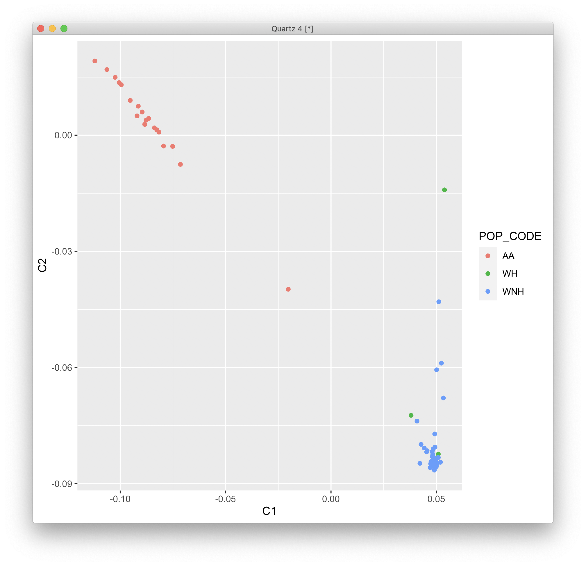
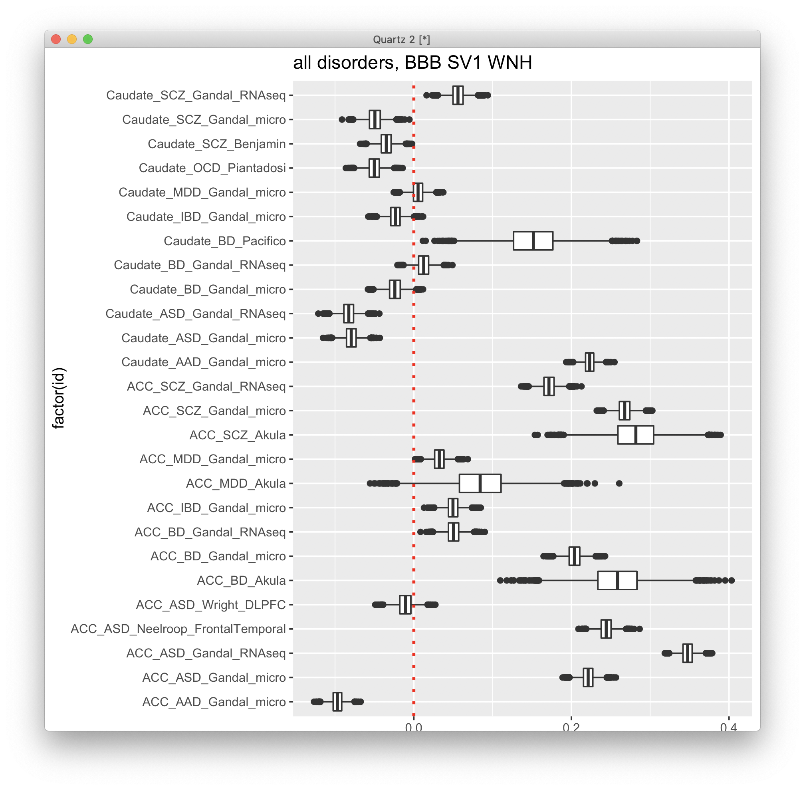

# 2021-03-30 11:32:05

Let's repeat the more traditional DGE analysis, but using WNH only. First, let's
make sure our cut-offs for WNH lookk good:

```r
data = readRDS('~/data/rnaseq_derek/complete_rawCountData_05132020.rds')
rownames(data) = data$submitted_name  # just to ensure compatibility later
data = data[!duplicated(data$hbcc_brain_id),]
data = data[, !grepl(colnames(data), pattern='^ENS')]
data$Diagnosis = factor(data$Diagnosis, levels=c('Control', 'Case'))
data$POP_CODE = as.character(data$POP_CODE)
data$POP_CODE = factor(data$POP_CODE)
imWNH = data$C1 > 0 & data$C2 < -.075

quartz()
library(ggplot2)
ggplot(data, aes(x=C1, y=C2, color=POP_CODE)) + geom_point() +
    geom_vline(aes(xintercept=0), color='red', linetype='dashed') +
    geom_hline(aes(yintercept=-.075), color='red', linetype='dashed') +
    labs(color='Groups')
```



Yes, I think 0 and -0.75 make sense here. It gets rid of 2 of the 3 green dots,
and all red ones.

Let's see if our results hold with this new dataset:

```r
myregion = 'ACC'
data = readRDS('~/data/rnaseq_derek/complete_rawCountData_05132020.rds')
rownames(data) = data$submitted_name  # just to ensure compatibility later
# remove obvious outlier (that's NOT caudate) labeled as ACC
rm_me = rownames(data) %in% c('68080')
data = data[!rm_me, ]
data = data[data$Region==myregion, ]
library(gdata)
more = read.xls('~/data/post_mortem/POST_MORTEM_META_DATA_JAN_2021.xlsx')
more = more[!duplicated(more$hbcc_brain_id),]
data = merge(data, more[, c('hbcc_brain_id', 'comorbid_group_update',
                            'substance_group', 'evidence_level')],
             by='hbcc_brain_id', all.x=T, all.y=F)

# at this point we have 55 samples for ACC
grex_vars = colnames(data)[grepl(colnames(data), pattern='^ENS')]
count_matrix = t(data[, grex_vars])
data = data[, !grepl(colnames(data), pattern='^ENS')]
# data only contains sample metadata, and count_matrix has actual counts

# cleaning up some variables

data$Individual = factor(data$hbcc_brain_id)
data[data$Manner.of.Death=='Suicide (probable)', 'Manner.of.Death'] = 'Suicide'
data[data$Manner.of.Death=='unknown', 'Manner.of.Death'] = 'natural'
data$MoD = factor(data$Manner.of.Death)
data$batch = factor(as.numeric(data$run_date))
data$Diagnosis = factor(data$Diagnosis, levels=c('Control', 'Case'))
data$substance_group = factor(data$substance_group)
data$comorbid_group = factor(data$comorbid_group_update)
data$evidence_level = factor(data$evidence_level)
data$brainbank = factor(data$bainbank)

# removing everything but autosomes
library(GenomicFeatures)
txdb <- loadDb('~/data/post_mortem/Homo_sapies.GRCh38.97.sqlite')
txdf <- select(txdb, keys(txdb, "GENEID"), columns=c('GENEID','TXCHROM'),
               "GENEID")
bt = read.csv('~/data/post_mortem/Homo_sapiens.GRCh38.97_biotypes.csv')
bt_slim = bt[, c('gene_id', 'gene_biotype')]
bt_slim = bt_slim[!duplicated(bt_slim),]
txdf = merge(txdf, bt_slim, by.x='GENEID', by.y='gene_id')
# store gene names in geneCounts without version in end of name
tx_meta = data.frame(GENEID = substr(rownames(count_matrix), 1, 15))
tx_meta = merge(tx_meta, txdf, by='GENEID', sort=F)
imautosome = which(tx_meta$TXCHROM != 'X' &
                   tx_meta$TXCHROM != 'Y' &
                   tx_meta$TXCHROM != 'MT')
count_matrix = count_matrix[imautosome, ]
tx_meta = tx_meta[imautosome, ]
```

```r
run_DGE_noPCA_SVs = function(count_matrix, samples, tx_meta, myregion, subtype,
                             alpha, BBB = FALSE, nSV = 1, add_cov=NA) {
    cat('Starting with', nrow(tx_meta), 'variables\n')
    if (is.na(subtype)) {
        keep_me = rep(TRUE, nrow(count_matrix))
    } else {
        keep_me = grepl(tx_meta$gene_biotype, pattern=sprintf('%s$', subtype))
    }
    cat('Keeping', sum(keep_me), subtype, 'variables\n')
    my_count_matrix = count_matrix[keep_me, ]
    my_tx_meta = tx_meta[keep_me, ]

    # removing variables where more than half of the subjects have zero counts
    keep_me = rowSums(my_count_matrix==0) < .25*ncol(my_count_matrix)
    my_count_matrix = my_count_matrix[keep_me, ]
    cat('Keeping', nrow(my_count_matrix), 'after zero removal\n')

    # removing variables with zero or near-zero variance
    library(caret)
    pp_order = c('zv', 'nzv')
    pp = preProcess(t(my_count_matrix), method = pp_order)
    X = t(predict(pp, t(my_count_matrix)))
    cat('Keeping', nrow(X), 'after NZ and NZV filtering\n')
    data.pm = samples

    # replace the one subject missing population PCs by the median of their
    # self-declared race and ethnicity
    idx = (data.pm$Race.x=='White' & data.pm$Ethnicity.x=='Non-Hispanic' &
           !is.na(data.pm$C1))
    pop_pcs = c('C1', 'C2', 'C3', 'C4', 'C5')
    med_pop = apply(data[idx, pop_pcs], 2, median)
    data.pm[which(is.na(data.pm$C1)), pop_pcs] = med_pop

    if (BBB) {
        data.pm$BBB = factor(sapply(1:nrow(data.pm),
                                    function(x) sprintf('%s_%s',
                                             as.character(data.pm[x,'brainbank']),
                                             as.character(data.pm[x, 'batch']))))
        # use_pcs = c('BBB', 'Age', 'Sex', 'C1', 'C2', 'C3', 'RINe', 'PMI')
        use_pcs = c('BBB', 'Age', 'Sex', 'RINe', 'PMI')
    } else {
        # use_pcs = c('batch', 'Age', 'Sex', 'C1', 'C2', 'C3', 'RINe', 'PMI')
        use_pcs = c('batch', 'Age', 'Sex', 'RINe', 'PMI')
    }

    # add more covariates for robustness testing
    if (! is.na(add_cov)) {
        use_pcs = c(use_pcs, add_cov)
    }

    fm_str = sprintf('~ Diagnosis + %s', paste0(use_pcs, collapse = ' + '))
    cat('Using formula:', fm_str, '\n')

    # scaling num_vars to assure convergence
    # removed pH because of too many NAs, RIN because we have RINe for everyone
    num_vars = c('pcnt_optical_duplicates', 'clusters', 'Age', 'RINe', 'PMI',
                'C1', 'C2', 'C3', 'C4', 'C5')
    for (var in num_vars) {
        data.pm[, var] = scale(data.pm[, var])
    }

    # removing variables with low expression
    library(edgeR)
    design=model.matrix(as.formula(fm_str), data=data.pm)
    isexpr <- filterByExpr(X, design=design)
    countsExpr = X[isexpr,]
    metaExpr = data.frame(GENEID = substr(rownames(countsExpr), 1, 15))
    metaExpr = merge(metaExpr, my_tx_meta, by='GENEID', sort=F)
    cat('Keeping', nrow(countsExpr), 'after expression filtering\n')

    # preparing DESeqData and running main analysis
    countdata = round(countsExpr)
    colnames(countdata) = rownames(data.pm)
    library(DESeq2)
    # because DESeq doesn't remove outliers if there are continuous variables
    # in the formula, we need to do this iteratively
    nOutliers = Inf
    myCounts = round(countsExpr)
    while (nOutliers > 0) {
        dds <- DESeqDataSetFromMatrix(countData = myCounts,
                                    colData = data.pm,
                                    design = as.formula(fm_str))
        cat('Processing', nrow(dds), 'variables.\n')
        dds <- DESeq(dds)
        maxCooks <- apply(assays(dds)[["cooks"]], 1, max)
        # outlier cut-off uses the 99% quantile of the F(p,m-p) distribution (with 
        # p the number of parameters including the intercept and m number of
        # samples).
        m <- ncol(dds)
        # number or parameters (PCs + Diagnosis + intercept)
        p <- length(use_pcs) + 2
        co = qf(.99, p, m - p)
        keep_me = which(maxCooks < co)
        nOutliers = nrow(myCounts) - length(keep_me)
        cat('Found', nOutliers, 'outliers.\n')
        myCounts = round(myCounts)[keep_me, ]
    }

    # let's calculate SVs only afterwards, so outlier genes don't influence them
    if (nSV > 0) {
        # I get the same value whether I do this after DESeq or just estimateSizeFactors
        dat  <- counts(dds, normalized = TRUE)

        library(sva)
        set.seed(42)
        mod  <- model.matrix(~ Diagnosis, colData(dds))
        mod0 <- model.matrix(~   1, colData(dds))
        svseq <- svaseq(dat, mod, mod0, n.sv = nSV)
        
        for (s in 1:nSV) {
            eval(parse(text=sprintf('data.pm$SV%d <- svseq$sv[,%d]', s, s)))
            fm_str = sprintf('%s + SV%d', fm_str, s)
        }
        dds <- DESeqDataSetFromMatrix(countData = myCounts,
                                      colData = data.pm,
                                      design = as.formula(fm_str))
        dds <- DESeq(dds)
    }

    res <- results(dds, name = "Diagnosis_Case_vs_Control", alpha = alpha)
    cat(sprintf('FDR q < %.2f\n', alpha))
    print(summary(res))

    library(IHW)
    resIHW <- results(dds, name = "Diagnosis_Case_vs_Control", alpha = alpha,
                    filterFun=ihw)
    cat(sprintf('IHW q < %.2f\n', alpha))
    print(summary(resIHW))

    my_res = list(res=res, resIHW=resIHW, dds=dds)
    return(my_res)
}
```

Then just run the multiple iterations:

```r
imWNH = which(data$C1 > 0 & data$C2 < -.075)
dge_acc = list()
for (st in c('pseudogene', 'lncRNA', 'protein_coding', 'all')) {
    st2 = ifelse(st == 'all', NA, st)
    dge_acc[[st]] = run_DGE_noPCA_SVs(count_matrix[, imWNH], data[imWNH, ],
                                      tx_meta, myregion, st2, .05, BBB=T,
                                      nSV=1)
}
###
dge_cau = list()
for (st in c('pseudogene', 'lncRNA', 'protein_coding', 'all')) {
    st2 = ifelse(st == 'all', NA, st)
    dge_cau[[st]] = run_DGE_noPCA_SVs(count_matrix[, imWNH], data[imWNH, ],
                                      tx_meta, myregion, st2, .05, BBB=T,
                                      nSV=1)
}
save(dge_acc, dge_cau, file='~/data/post_mortem/DGE_WNH_BBB_SV1_03302021.RData')
```

I also ran the code above, but without the population PCs in the formula, and
named the file DGE_WNH_BBB_SV1_noPop_03302021.RData.

Now we just need to run GSEA on it. I'm naming it WG17 for the version with the
same formula, and WG18 for the noPop version.

```r
library(WebGestaltR)

data_dir = '~/data/post_mortem/'
ncpu=31

load('~/data/post_mortem/DGE_WNH_BBB_SV1_03302021.RData')

for (region in c('acc', 'caudate')) {
    for (st in c('all', 'protein_coding')) {
        res_str = ifelse(region == 'acc', sprintf('dge_acc[["%s"]]$res', st),
                         sprintf('dge_cau[["%s"]]$res', st))
        ranks_str = sprintf('ranks = -log(%s$pvalue) * sign(%s$log2FoldChange)',
                            res_str, res_str)
        gid_str = sprintf('geneid=substring(rownames(%s), 1, 15)', res_str)
        
        eval(parse(text=ranks_str))
        eval(parse(text=gid_str))

        tmp2 = data.frame(geneid=geneid, rank=ranks)
        tmp2 = tmp2[order(ranks, decreasing=T),]

        DBs = c(sprintf('my_%s_sets', region))
        for (db in DBs) {
            cat(res_str, db, '\n')
            db_file = sprintf('~/data/post_mortem/%s.gmt', db)
            project_name = sprintf('WG18_%s_%s_10K', res_str, db)
            enrichResult <- try(WebGestaltR(enrichMethod="GSEA",
                                organism="hsapiens",
                                enrichDatabaseFile=db_file,
                                enrichDatabaseType="genesymbol",
                                interestGene=tmp2,
                                outputDirectory = data_dir,
                                interestGeneType="ensembl_gene_id",
                                sigMethod="top", topThr=20,
                                minNum=3, projectName=project_name,
                                isOutput=T, isParallel=T,
                                nThreads=ncpu, perNum=10000, maxNum=800))
        }

        DBs = c('geneontology_Biological_Process_noRedundant',
                'geneontology_Cellular_Component_noRedundant',
                'geneontology_Molecular_Function_noRedundant')
        for (db in DBs) {
            cat(res_str, db, '\n')
            project_name = sprintf('WG18_%s_%s_10K', res_str, db)

            enrichResult <- try(WebGestaltR(enrichMethod="GSEA",
                                        organism="hsapiens",
                                        enrichDatabase=db,
                                        interestGene=tmp2,
                                        interestGeneType="ensembl_gene_id",
                                        sigMethod="top", topThr=20,
                                        outputDirectory = data_dir,
                                        minNum=5, projectName=project_name,
                                        isOutput=T, isParallel=T,
                                        nThreads=ncpu, perNum=10000))
        }

        for (db in c('KEGG', 'Panther', 'Reactome', 'Wikipathway')) {
            cat(res_str, db, '\n')
            project_name = sprintf('WG18_%s_%s_10K', res_str, db)

            enrichResult <- try(WebGestaltR(enrichMethod="GSEA",
                                        organism="hsapiens",
                                        enrichDatabase=sprintf('pathway_%s', db),
                                        interestGene=tmp2,
                                        interestGeneType="ensembl_gene_id",
                                        sigMethod="top", minNum=3,
                                        outputDirectory = data_dir,
                                        projectName=project_name,
                                        isOutput=T, isParallel=T,
                                        nThreads=ncpu, topThr=20, perNum=10000))
        }
    }
}
```

And we also try some MAGMA:

```r
library(biomaRt)
library(dplyr)
mart <- useDataset("hsapiens_gene_ensembl", useMart("ensembl"))

for (s in c('', '_noPop')) {
    load(sprintf('~/data/post_mortem/DGE_WNH_BBB_SV1%s_03302021.RData', s))
    for (r in c('acc', 'cau')) {
        for (st in c('all', 'protein_coding', 'lncRNA', 'pseudogene')) {
            cat(s, r, st, '\n')
            res_str = sprintf('res = as.data.frame(dge_%s$%s$res)', r, st)
            eval(parse(text=res_str))

            res$GENEID = substr(rownames(res), 1, 15)
            G_list0 <- getBM(filters= "ensembl_gene_id",
                            attributes= c("ensembl_gene_id", "entrezgene_id"),values=res$GENEID, mart= mart)
            G_list <- G_list0[!is.na(G_list0$ensembl_gene_id),]
            G_list = G_list[G_list$ensembl_gene_id!='',]
            G_list <- G_list[!duplicated(G_list$ensembl_gene_id),]
            imnamed = res$GENEID %in% G_list$ensembl_gene_id
            res = res[imnamed, ]
            res2 = merge(res, G_list, sort=F, all.x=F, all.y=F, by.x='GENEID',
                        by.y='ensembl_gene_id')
            ranks = res2 %>% group_by(entrezgene_id) %>% slice_min(n=1, pvalue, with_ties=F)
            myres = data.frame(gene=ranks$entrezgene_id,
                            signed_rank=sign(ranks$log2FoldChange)*-log(ranks$pvalue),
                            unsigned_rank=-log(ranks$pvalue))
            out_fname = sprintf('~/data/post_mortem/MAGMA_WNH%s_dge_%s_%s.tab',
                                s, r, st)
            write.table(myres, row.names=F, sep='\t', file=out_fname, quote=F)
        }
    }
}
```

I'll go with WG18 (the one without population PCs). The ACC results are quite
similar though, but I have 1, 5, and 3 for WG17, and 1 and 5 for WG18. I don't
want to introduce dev3 here. Also, it makes more sense to me to not run the
population PCs in the formula, if we're just looking at WNH.

Both Caudate results have dev1 only. That's all protein_coding, BTW.
The great ACC GO results are there in both, though.

Then, for MAGMA we'll need to reconstruct the file, as we only need the WNH
samples for LD:

```bash
cd ~/data/tmp
module load plink
plink --bfile g1000_eur --maf 1e-5 --make-bed --out g1000_WNH

magma --annotate --snp-loc g1000_WNH.bim \
    --gene-loc /usr/local/apps/MAGMA/gene_location/NCBI37.3/NCBI37.3.gene.loc \
    --out annot_WNH
magma --bfile g1000_WNH --pval ~/pgc2017/adhd_eur_jun2017 N=53293 \
    --gene-annot annot_WNH.genes.annot --out genes_WNH

for s in '' '_noPop'; do
    for r in 'acc' 'cau'; do
        for st in 'all' 'protein_coding' 'lncRNA' 'pseudogene'; do
            echo $r $st;
            magma --gene-results genes_WNH.genes.raw \
                --gene-covar ~/data/post_mortem/MAGMA_WNH${s}_dge_${r}_${st}.tab \
                --out ~/data/post_mortem/MAGMA_gc_WNH${s}_dge_${r}_${st};
        done;
    done;
done
```

Let's check the results:

```bash
cd ~/data/post_mortem/
for f in `ls MAGMA_gc_WNH*_dge_acc*.gcov.out`; do echo $f; cat $f; done
```

```
MAGMA_gc_WNH_dge_acc_all.gcov.out
# MEAN_SAMPLE_SIZE = 53293
# TOTAL_GENES = 15070
# CONDITIONED_INTERNAL = genesize, log_genesize, genedensity, log_genedensity, inverse_mac, log_inverse_mac
COVAR                      OBS_GENES       BETA   BETA_STD         SE            P
signed_rank                    15070   -0.00942    -0.0152    0.00546     0.084413
unsigned_rank                  15070    0.00695    0.00977    0.00733      0.34303
MAGMA_gc_WNH_dge_acc_lncRNA.gcov.out
# MEAN_SAMPLE_SIZE = 53293
# TOTAL_GENES = 61
# CONDITIONED_INTERNAL = genesize, log_genesize, genedensity, log_genedensity, inverse_mac, log_inverse_mac
COVAR                      OBS_GENES       BETA   BETA_STD         SE            P
signed_rank                       61     -0.044     -0.052      0.118      0.71101
unsigned_rank                     61      0.281      0.248      0.188      0.14169
MAGMA_gc_WNH_dge_acc_protein_coding.gcov.out
# MEAN_SAMPLE_SIZE = 53293
# TOTAL_GENES = 15062
# CONDITIONED_INTERNAL = genesize, log_genesize, genedensity, log_genedensity, inverse_mac, log_inverse_mac
COVAR                      OBS_GENES       BETA   BETA_STD         SE            P
signed_rank                    15062    -0.0101    -0.0164    0.00544     0.063531
unsigned_rank                  15062    0.00616    0.00864    0.00735      0.40257
MAGMA_gc_WNH_dge_acc_pseudogene.gcov.out
# MEAN_SAMPLE_SIZE = 53293
# TOTAL_GENES = 13
# CONDITIONED_INTERNAL = genesize, log_genesize, genedensity, log_genedensity, inverse_mac, log_inverse_mac
COVAR                      OBS_GENES       BETA   BETA_STD         SE            P
signed_rank                       13     -0.223     -0.187      0.541      0.69689
unsigned_rank                     13      -1.02     -0.606       1.01      0.35912
MAGMA_gc_WNH_noPop_dge_acc_all.gcov.out
# MEAN_SAMPLE_SIZE = 53293
# TOTAL_GENES = 15051
# CONDITIONED_INTERNAL = genesize, log_genesize, genedensity, log_genedensity, inverse_mac, log_inverse_mac
COVAR                      OBS_GENES       BETA   BETA_STD         SE            P
signed_rank                    15051   -0.00867    -0.0138    0.00556      0.11938
unsigned_rank                  15051    0.00734     0.0101    0.00748      0.32695
MAGMA_gc_WNH_noPop_dge_acc_lncRNA.gcov.out
# MEAN_SAMPLE_SIZE = 53293
# TOTAL_GENES = 61
# CONDITIONED_INTERNAL = genesize, log_genesize, genedensity, log_genedensity, inverse_mac, log_inverse_mac
COVAR                      OBS_GENES       BETA   BETA_STD         SE            P
signed_rank                       61    -0.0449     -0.056      0.111       0.6886
unsigned_rank                     61      0.237       0.22      0.181      0.19466
MAGMA_gc_WNH_noPop_dge_acc_protein_coding.gcov.out
# MEAN_SAMPLE_SIZE = 53293
# TOTAL_GENES = 15045
# CONDITIONED_INTERNAL = genesize, log_genesize, genedensity, log_genedensity, inverse_mac, log_inverse_mac
COVAR                      OBS_GENES       BETA   BETA_STD         SE            P
signed_rank                    15045   -0.00958    -0.0152    0.00556      0.08475
unsigned_rank                  15045    0.00727    0.00998    0.00752      0.33327
MAGMA_gc_WNH_noPop_dge_acc_pseudogene.gcov.out
# MEAN_SAMPLE_SIZE = 53293
# TOTAL_GENES = 13
# CONDITIONED_INTERNAL = genesize, log_genesize, genedensity, log_genedensity, inverse_mac, log_inverse_mac
COVAR                      OBS_GENES       BETA   BETA_STD         SE            P
signed_rank                       13     -0.389     -0.345      0.545      0.50747
unsigned_rank
```

Results keeping the population PCs seems a tiny bit better, but neither one is
significant.

What's the deal with caudate?

```
; done
MAGMA_gc_WNH_dge_cau_all.gcov.out
# MEAN_SAMPLE_SIZE = 53293
# TOTAL_GENES = 15003
# CONDITIONED_INTERNAL = genesize, log_genesize, genedensity, log_genedensity, inverse_mac, log_inverse_mac
COVAR                      OBS_GENES       BETA   BETA_STD         SE            P
signed_rank                    15003    -0.0106    -0.0149    0.00628     0.092411
unsigned_rank                  15003   -0.00465   -0.00571    0.00839      0.58003
MAGMA_gc_WNH_dge_cau_lncRNA.gcov.out
# MEAN_SAMPLE_SIZE = 53293
# TOTAL_GENES = 62
# CONDITIONED_INTERNAL = genesize, log_genesize, genedensity, log_genedensity, inverse_mac, log_inverse_mac
COVAR                      OBS_GENES       BETA   BETA_STD         SE            P
signed_rank                       62     -0.316     -0.344      0.119     0.010229
unsigned_rank                     62      -0.27      -0.24      0.187      0.15365
MAGMA_gc_WNH_dge_cau_protein_coding.gcov.out
# MEAN_SAMPLE_SIZE = 53293
# TOTAL_GENES = 14967
# CONDITIONED_INTERNAL = genesize, log_genesize, genedensity, log_genedensity, inverse_mac, log_inverse_mac
COVAR                      OBS_GENES       BETA   BETA_STD         SE            P
signed_rank                    14967   -0.00989    -0.0144    0.00611      0.10572
unsigned_rank                  14967   -0.00456   -0.00578    0.00815      0.57565
MAGMA_gc_WNH_dge_cau_pseudogene.gcov.out
# MEAN_SAMPLE_SIZE = 53293
# TOTAL_GENES = 14
# CONDITIONED_INTERNAL = genesize, log_genesize, genedensity, log_genedensity, inverse_mac, log_inverse_mac
COVAR                      OBS_GENES       BETA   BETA_STD         SE            P
signed_rank                       14    -0.0456    -0.0363      0.796      0.95616
unsigned_rank                     14      0.335      0.177       1.22      0.79273
MAGMA_gc_WNH_noPop_dge_cau_all.gcov.out
# MEAN_SAMPLE_SIZE = 53293
# TOTAL_GENES = 15071
# CONDITIONED_INTERNAL = genesize, log_genesize, genedensity, log_genedensity, inverse_mac, log_inverse_mac
COVAR                      OBS_GENES       BETA   BETA_STD         SE            P
signed_rank                    15071    -0.0123    -0.0183    0.00593     0.038193
unsigned_rank                  15071    -0.0027   -0.00352    0.00791      0.73304
MAGMA_gc_WNH_noPop_dge_cau_lncRNA.gcov.out
# MEAN_SAMPLE_SIZE = 53293
# TOTAL_GENES = 61
# CONDITIONED_INTERNAL = genesize, log_genesize, genedensity, log_genedensity, inverse_mac, log_inverse_mac
COVAR                      OBS_GENES       BETA   BETA_STD         SE            P
signed_rank                       61     -0.304     -0.378      0.102    0.0042255
unsigned_rank                     61     -0.127     -0.129      0.165      0.44679
MAGMA_gc_WNH_noPop_dge_cau_protein_coding.gcov.out
# MEAN_SAMPLE_SIZE = 53293
# TOTAL_GENES = 15044
# CONDITIONED_INTERNAL = genesize, log_genesize, genedensity, log_genedensity, inverse_mac, log_inverse_mac
COVAR                      OBS_GENES       BETA   BETA_STD         SE            P
signed_rank                    15044    -0.0112    -0.0169    0.00584     0.056175
unsigned_rank                  15044   -0.00243   -0.00322    0.00779      0.75505
MAGMA_gc_WNH_noPop_dge_cau_pseudogene.gcov.out
# MEAN_SAMPLE_SIZE = 53293
# TOTAL_GENES = 14
# CONDITIONED_INTERNAL = genesize, log_genesize, genedensity, log_genedensity, inverse_mac, log_inverse_mac
COVAR                      OBS_GENES       BETA   BETA_STD         SE            P
signed_rank                       14     -0.239     -0.179       1.76      0.89622
unsigned_rank                     14    -0.0898    -0.0396       2.11      0.96738
```

Hum.. caudate looks much better now, and the noPop results are better. Only
lncRNA reaches significance though. lncRNA is rocking it though!

## Summaries

Let's start summarizing the results. First, ACC and Caudate overlap:

```r
library(GeneOverlap)
load('~/data/post_mortem/DGE_WNH_BBB_SV1_noPop_03302021.RData')

all_res = c()
subtypes = list(all='all', pc='protein_coding', lnc='lncRNA', pg='pseudogene')
for (st in c('all', 'pc', 'lnc', 'pg')) {
    res.acc = dge_acc[[subtypes[[st]]]]$res
    res.cau = dge_cau[[subtypes[[st]]]]$res
    
    both_res = merge(as.data.frame(res.acc), as.data.frame(res.cau), by=0,
                        all.x=F, all.y=F, suffixes = c('.dx', '.prs'))
    for (t in c(.05, .01, .005, .001)) {
        prs_genes = both_res[both_res$pvalue.prs < t & both_res$stat.prs > 0,
                                'Row.names']
        dx_genes = both_res[both_res$pvalue.dx < t & both_res$stat.dx > 0,
                            'Row.names']
        go.obj <- newGeneOverlap(prs_genes, dx_genes,
                                    genome.size=nrow(both_res))
        go.obj <- testGeneOverlap(go.obj)
        inter = intersect(prs_genes, dx_genes)
        pval1 = getPval(go.obj)
        allUp = union(both_res[both_res$stat.prs > 0, 'Row.names'],
                        both_res[both_res$stat.dx > 0, 'Row.names'])
        go.obj <- newGeneOverlap(prs_genes, dx_genes, genome.size=length(allUp))
        go.obj <- testGeneOverlap(go.obj)
        pval2 = getPval(go.obj)
        this_res = c(subtypes[[st]], t, 'up', length(prs_genes),
                        length(dx_genes), length(inter), pval1, pval2)
        all_res = rbind(all_res, this_res)
    }
    for (t in c(.05, .01, .005, .001)) {
        prs_genes = both_res[both_res$pvalue.prs < t & both_res$stat.prs < 0,
                                'Row.names']
        dx_genes = both_res[both_res$pvalue.dx < t & both_res$stat.dx < 0,
                            'Row.names']
        go.obj <- newGeneOverlap(prs_genes, dx_genes,
                                    genome.size=nrow(both_res))
        go.obj <- testGeneOverlap(go.obj)
        inter = intersect(prs_genes, dx_genes)
        pval1 = getPval(go.obj)
        allDown = union(both_res[both_res$stat.prs < 0, 'Row.names'],
                        both_res[both_res$stat.dx < 0, 'Row.names'])
        go.obj <- newGeneOverlap(prs_genes, dx_genes, genome.size=length(allDown))
        go.obj <- testGeneOverlap(go.obj)
        pval2 = getPval(go.obj)
        this_res = c(subtypes[[st]], t, 'down', length(prs_genes),
                        length(dx_genes), length(inter), pval1, pval2)
        all_res = rbind(all_res, this_res)
    }
    for (t in c(.05, .01, .005, .001)) {
        prs_genes = both_res[both_res$pvalue.prs < t, 'Row.names']
        dx_genes = both_res[both_res$pvalue.dx < t, 'Row.names']
        go.obj <- newGeneOverlap(prs_genes, dx_genes,
                                    genome.size=nrow(both_res))
        go.obj <- testGeneOverlap(go.obj)
        inter = intersect(prs_genes, dx_genes)
        pval1 = getPval(go.obj)
        pval2 = NA
        this_res = c(subtypes[[st]], t, 'abs', length(prs_genes),
                        length(dx_genes), length(inter), pval1, pval2)
        all_res = rbind(all_res, this_res)
    }
}
colnames(all_res) = c('subtype', 'nomPvalThresh', 'direction',
                      'caudateGenes', 'accGenes', 'overlap', 'pvalWhole',
                      'pvalDirOnly')
out_fname = '~/data/post_mortem/DGE_WNH_upDown_overlap_results_03302021.csv'
write.csv(all_res, file=out_fname, row.names=F)
```

I'm now using the same code that's in note 193 to create all_corrs.rds, and then
make the boxplot (just for reference, as I'm sure color schemes will be changed
later):

```r
quartz()
corrs = readRDS('~/data/post_mortem/all_WNH_corrs.rds')
corrs$id = sapply(1:nrow(corrs),
                  function(i) sprintf('%s_%s_%s',
                                      corrs[i, 'region'],
                                      corrs[i, 'disorder'],
                                      corrs[i, 'source']))
library(ggplot2)
p <- ggplot(corrs, aes(x = factor(id), y = corr)) + coord_flip() +
  geom_boxplot() + theme(axis.text.y = element_text(angle = 0))
p + ggtitle('all disorders, BBB SV1 WNH') + geom_hline(yintercept=0,
                                                   linetype="dotted",
                                                    color = "red", size=1)
```



Outputing single gene results:

```r
load('~/data/post_mortem/DGE_WNH_BBB_SV1_noPop_03302021.RData')
mart = readRDS('~/data/rnaseq_derek/mart_rnaseq.rds')
mydir = '~/data/post_mortem/'

library(GenomicFeatures)
txdb <- loadDb('~/data/post_mortem/Homo_sapies.GRCh38.97.sqlite')
txdf <- select(txdb, keys(txdb, "GENEID"), columns=c('GENEID','TXCHROM'),
               "GENEID")
bt = read.csv('~/data/post_mortem/Homo_sapiens.GRCh38.97_biotypes.csv')
bt_slim = bt[, c('gene_id', 'gene_biotype')]
bt_slim = bt_slim[!duplicated(bt_slim),]

for (r in c('acc', 'cau')) {
    for (st in c('all', 'protein_coding', 'lncRNA', 'pseudogene')) {
        res_str = sprintf('res = dge_%s[["%s"]]', r, st)
        eval(parse(text=res_str))
        fname = sprintf('%s/DGE_WNH_%s_%s_BBB_SV1_annot_03302021.csv', mydir, r, st)

        df = as.data.frame(res$res)
        colnames(df)[ncol(df)] = 'padj.FDR'
        df$GENEID = substr(rownames(df), 1, 15)
        df2 = merge(df, mart, sort=F,
                    by.x='GENEID', by.y='ensembl_gene_id', all.x=T, all.y=F)
        df2 = merge(df2, bt_slim, sort=F,
                    by.x='GENEID', by.y='gene_id', all.x=T, all.y=F)
        df2 = df2[order(df2$pvalue), ]
        df3 = as.data.frame(res$resIHW)
        df3$GENEID = substr(rownames(df3), 1, 15)
        df2 = merge(df2, df3[, c('GENEID', 'padj')], sort=F, by='GENEID',
                    all.x=T, all.y=F)
        colnames(df2)[ncol(df2)] = 'padj.IHW'
        write.csv(df2, row.names=F, file=fname)
    }
}
```

# 2021-04-08 15:33:36

I'll re-run this analysis with the code from note 210:

```r
myregion = 'ACC'
data = readRDS('~/data/rnaseq_derek/complete_rawCountData_05132020.rds')
rownames(data) = data$submitted_name  # just to ensure compatibility later
# remove obvious outlier (that's NOT caudate) labeled as ACC
rm_me = rownames(data) %in% c('68080')
data = data[!rm_me, ]
data = data[data$Region==myregion, ]
library(gdata)
more = read.xls('~/data/post_mortem/POST_MORTEM_META_DATA_JAN_2021.xlsx')
more = more[!duplicated(more$hbcc_brain_id),]
data = merge(data, more[, c('hbcc_brain_id', 'comorbid_group_update',
                            'substance_group', 'evidence_level')],
             by='hbcc_brain_id', all.x=T, all.y=F)

# at this point we have 55 samples for ACC
grex_vars = colnames(data)[grepl(colnames(data), pattern='^ENS')]
count_matrix = t(data[, grex_vars])
data = data[, !grepl(colnames(data), pattern='^ENS')]
# data only contains sample metadata, and count_matrix has actual counts

# cleaning up some variables

data$Individual = factor(data$hbcc_brain_id)
data[data$Manner.of.Death=='Suicide (probable)', 'Manner.of.Death'] = 'Suicide'
data[data$Manner.of.Death=='unknown', 'Manner.of.Death'] = 'natural'
data$MoD = factor(data$Manner.of.Death)
data$batch = factor(as.numeric(data$run_date))
data$Diagnosis = factor(data$Diagnosis, levels=c('Control', 'Case'))
data$substance_group = factor(data$substance_group)
data$comorbid_group = factor(data$comorbid_group_update)
data$evidence_level = factor(data$evidence_level)
data$brainbank = factor(data$bainbank)

# removing everything but autosomes
library(GenomicFeatures)
txdb <- loadDb('~/data/post_mortem/Homo_sapies.GRCh38.97.sqlite')
txdf <- select(txdb, keys(txdb, "GENEID"), columns=c('GENEID','TXCHROM'),
               "GENEID")
bt = read.csv('~/data/post_mortem/Homo_sapiens.GRCh38.97_biotypes.csv')
bt_slim = bt[, c('gene_id', 'gene_biotype')]
bt_slim = bt_slim[!duplicated(bt_slim),]
txdf = merge(txdf, bt_slim, by.x='GENEID', by.y='gene_id')
# store gene names in geneCounts without version in end of name
tx_meta = data.frame(GENEID = substr(rownames(count_matrix), 1, 15))
tx_meta = merge(tx_meta, txdf, by='GENEID', sort=F)
imautosome = which(tx_meta$TXCHROM != 'X' &
                   tx_meta$TXCHROM != 'Y' &
                   tx_meta$TXCHROM != 'MT')
count_matrix = count_matrix[imautosome, ]
tx_meta = tx_meta[imautosome, ]
```

Then just run the multiple iterations:

```r
imWNH = which(data$C1 > 0 & data$C2 < -.075)
dge_acc = list()
for (st in c('pseudogene', 'lncRNA', 'protein_coding', 'all')) {
    st2 = ifelse(st == 'all', NA, st)
    dge_acc[[st]] = run_DGE_noPCA_SVs(count_matrix[, imWNH], data[imWNH, ],
                                      tx_meta, st2, .05, BBB=T, nSV=1)
}
###
dge_cau = list()
for (st in c('pseudogene', 'lncRNA', 'protein_coding', 'all')) {
    st2 = ifelse(st == 'all', NA, st)
    dge_cau[[st]] = run_DGE_noPCA_SVs(count_matrix[, imWNH], data[imWNH, ],
                                      tx_meta, st2, .05, BBB=T, nSV=1)
}
save(dge_acc, dge_cau, file='~/data/post_mortem/DGE_WNH_BBB_SV1_04082021.RData')
```

Now I have to re-run everything, or just do the bootstrap analysis. Let's go
with the latter:

```r
do_boot_corrs = function(both_res, log2FC_col, method) {
    corrs = c()
    nperms = 10000
    set.seed(42)
    options(warn=-1)  # remove annoying spearman warnings
    for (p in 1:nperms) {
        idx = sample(nrow(both_res), replace = T)
        corrs = c(corrs, cor.test(both_res[idx, 'log2FoldChange'],
                                  both_res[idx, log2FC_col],
                                  method=method)$estimate)
    }
    return(corrs)
}

st = 'all'
met = 'spearman'
load('~/data/post_mortem/DGE_04082021_BBB_SV1.RData')
dge_all = as.data.frame(dge_cau[[st]][['res']])
load('~/data/post_mortem/DGE_WNH_BBB_SV1_04082021.RData')
dge_wnh = as.data.frame(dge_cau[[st]][['res']])

both_res = merge(dge_all, dge_wnh, by=0, all.x=F, all.y=F)
colnames(both_res)[3] = 'log2FoldChange'
corrs = do_boot_corrs(both_res, 'log2FoldChange.y', met)
```

And here's the summary():

```
# acc
r$> summary(corrs)                                                                             
   Min. 1st Qu.  Median    Mean 3rd Qu.    Max. 
 0.5301  0.5476  0.5513  0.5513  0.5550  0.5717 

# caudate
r$> summary(corrs)                                                                             
   Min. 1st Qu.  Median    Mean 3rd Qu.    Max. 
 0.5663  0.5895  0.5928  0.5928  0.5963  0.6094 
```


# TODO
