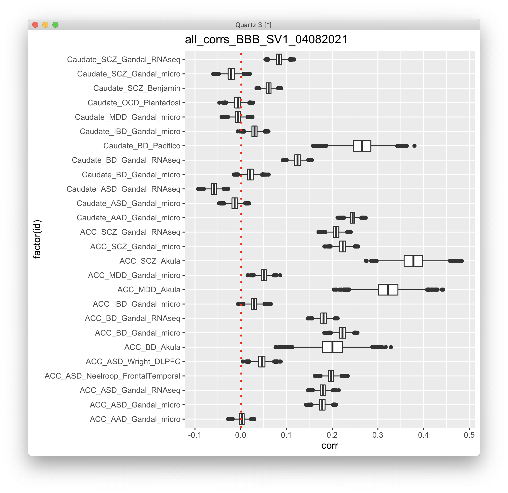
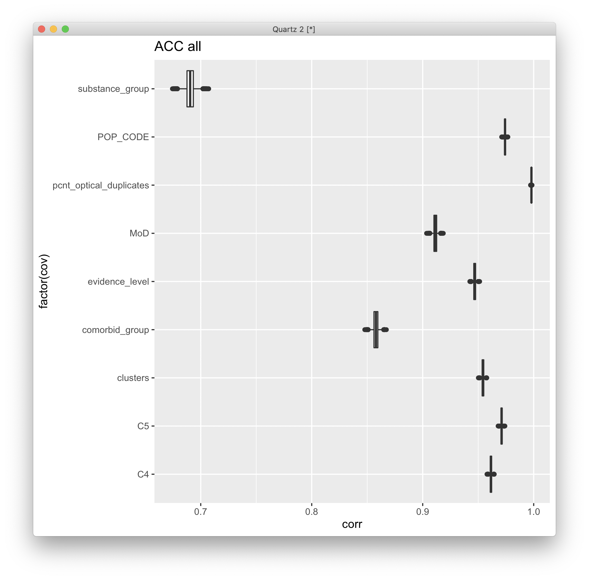

# 2021-04-07 21:06:24

I'm creating this note heavily based on 203, but it's after I found out that I
needed to round the counts before I do anything, otherwise my removal on zeros
gets screwed up. Let's re-run the analysis then.

```r
run_DGE_noPCA_SVs = function(count_matrix, samples, tx_meta, subtype,
                             alpha, BBB = FALSE, nSV = 1, add_cov=NA) {
    cat('Starting with', nrow(tx_meta), 'variables\n')
    if (is.na(subtype)) {
        keep_me = rep(TRUE, nrow(count_matrix))
    } else {
        keep_me = grepl(tx_meta$gene_biotype, pattern=sprintf('%s$', subtype))
    }
    cat('Keeping', sum(keep_me), subtype, 'variables\n')
    my_count_matrix = round(count_matrix[keep_me, ])

    # removing variables where more than half of the subjects have zero counts
    keep_me = rowSums(my_count_matrix==0) < .25*ncol(my_count_matrix)
    my_count_matrix = my_count_matrix[keep_me, ]
    cat('Keeping', nrow(my_count_matrix), 'after zero removal\n')

    # removing variables with zero or near-zero variance
    library(caret)
    pp_order = c('zv', 'nzv')
    pp = preProcess(t(my_count_matrix), method = pp_order)
    X = t(predict(pp, t(my_count_matrix)))
    cat('Keeping', nrow(X), 'after NZ and NZV filtering\n')
    data.pm = samples

    # replace the one subject missing population PCs by the median of their
    # self-declared race and ethnicity
    idx = (data.pm$Race.x=='White' & data.pm$Ethnicity.x=='Non-Hispanic' &
           !is.na(data.pm$C1))
    pop_pcs = c('C1', 'C2', 'C3', 'C4', 'C5')
    med_pop = apply(data[idx, pop_pcs], 2, median)
    data.pm[which(is.na(data.pm$C1)), pop_pcs] = med_pop

    if (BBB) {
        data.pm$BBB = factor(sapply(1:nrow(data.pm),
                                    function(x) sprintf('%s_%s',
                                             as.character(data.pm[x,'brainbank']),
                                             as.character(data.pm[x, 'batch']))))
        use_pcs = c('BBB', 'Age', 'Sex', 'C1', 'C2', 'C3', 'RINe', 'PMI')
    } else {
        use_pcs = c('batch', 'Age', 'Sex', 'C1', 'C2', 'C3', 'RINe', 'PMI')
    }

    # add more covariates for robustness testing
    if (! is.na(add_cov)) {
        use_pcs = c(use_pcs, add_cov)
    }

    fm_str = sprintf('~ Diagnosis + %s', paste0(use_pcs, collapse = ' + '))
    cat('Using formula:', fm_str, '\n')

    # scaling num_vars to assure convergence
    # removed pH because of too many NAs, RIN because we have RINe for everyone
    num_vars = c('pcnt_optical_duplicates', 'clusters', 'Age', 'RINe', 'PMI',
                'C1', 'C2', 'C3', 'C4', 'C5')
    for (var in num_vars) {
        data.pm[, var] = scale(data.pm[, var])
    }

    # removing variables with low expression
    library(edgeR)
    design=model.matrix(as.formula(fm_str), data=data.pm)
    isexpr <- filterByExpr(X, design=design)
    myCounts = X[isexpr,]
    metaExpr = data.frame(GENEID = substr(rownames(myCounts), 1, 15))
    metaExpr = merge(metaExpr, tx_meta, by='GENEID', sort=F)
    cat('Keeping', nrow(myCounts), 'after expression filtering\n')

    # preparing DESeqData and running main analysis
    colnames(myCounts) = rownames(data.pm)
    library(DESeq2)
    # because DESeq doesn't remove outliers if there are continuous variables
    # in the formula, we need to do this iteratively
    nOutliers = Inf
    while (nOutliers > 0) {
        dds <- DESeqDataSetFromMatrix(countData = myCounts,
                                    colData = data.pm,
                                    design = as.formula(fm_str))
        cat('Processing', nrow(dds), 'variables.\n')
        dds <- DESeq(dds)
        maxCooks <- apply(assays(dds)[["cooks"]], 1, max)
        # outlier cut-off uses the 99% quantile of the F(p,m-p) distribution (with 
        # p the number of parameters including the intercept and m number of
        # samples).
        m <- ncol(dds)
        # number or parameters (PCs + Diagnosis + intercept)
        p <- length(use_pcs) + 2
        co = qf(.99, p, m - p)
        keep_me = which(maxCooks < co)
        nOutliers = nrow(myCounts) - length(keep_me)
        cat('Found', nOutliers, 'outliers.\n')
        myCounts = round(myCounts)[keep_me, ]
    }

    # let's calculate SVs only afterwards, so outlier genes don't influence them
    if (nSV > 0) {
        # I get the same value whether I do this after DESeq or just estimateSizeFactors
        dat  <- counts(dds, normalized = TRUE)

        library(sva)
        set.seed(42)
        mod  <- model.matrix(~ Diagnosis, colData(dds))
        mod0 <- model.matrix(~   1, colData(dds))
        svseq <- svaseq(dat, mod, mod0, n.sv = nSV)
        
        for (s in 1:nSV) {
            eval(parse(text=sprintf('data.pm$SV%d <- svseq$sv[,%d]', s, s)))
            fm_str = sprintf('%s + SV%d', fm_str, s)
        }
        dds <- DESeqDataSetFromMatrix(countData = myCounts,
                                      colData = data.pm,
                                      design = as.formula(fm_str))
        dds <- DESeq(dds)
    }

    res <- results(dds, name = "Diagnosis_Case_vs_Control", alpha = alpha)
    cat(sprintf('FDR q < %.2f\n', alpha))
    print(summary(res))

    library(IHW)
    resIHW <- results(dds, name = "Diagnosis_Case_vs_Control", alpha = alpha,
                    filterFun=ihw)
    cat(sprintf('IHW q < %.2f\n', alpha))
    print(summary(resIHW))

    my_res = list(res=res, resIHW=resIHW, dds=dds)
    return(my_res)
}
```

Then just run the multiple iterations:

```r
myregion = 'ACC'
data = readRDS('~/data/rnaseq_derek/complete_rawCountData_05132020.rds')
rownames(data) = data$submitted_name  # just to ensure compatibility later
# remove obvious outlier (that's NOT caudate) labeled as ACC
rm_me = rownames(data) %in% c('68080')
data = data[!rm_me, ]
data = data[data$Region==myregion, ]
library(gdata)
more = read.xls('~/data/post_mortem/POST_MORTEM_META_DATA_JAN_2021.xlsx')
more = more[!duplicated(more$hbcc_brain_id),]
data = merge(data, more[, c('hbcc_brain_id', 'comorbid_group_update',
                            'substance_group', 'evidence_level')],
             by='hbcc_brain_id', all.x=T, all.y=F)

# at this point we have 55 samples for ACC
grex_vars = colnames(data)[grepl(colnames(data), pattern='^ENS')]
count_matrix = t(data[, grex_vars])
data = data[, !grepl(colnames(data), pattern='^ENS')]
# data only contains sample metadata, and count_matrix has actual counts

# cleaning up some variables
data$POP_CODE = as.character(data$POP_CODE)
data[data$POP_CODE=='WNH', 'POP_CODE'] = 'W'
data[data$POP_CODE=='WH', 'POP_CODE'] = 'W'
data$POP_CODE = factor(data$POP_CODE)
data$Individual = factor(data$hbcc_brain_id)
data[data$Manner.of.Death=='Suicide (probable)', 'Manner.of.Death'] = 'Suicide'
data[data$Manner.of.Death=='unknown', 'Manner.of.Death'] = 'natural'
data$MoD = factor(data$Manner.of.Death)
data$batch = factor(as.numeric(data$run_date))
data$Diagnosis = factor(data$Diagnosis, levels=c('Control', 'Case'))
data$substance_group = factor(data$substance_group)
data$comorbid_group = factor(data$comorbid_group_update)
data$evidence_level = factor(data$evidence_level)
data$brainbank = factor(data$bainbank)

# removing everything but autosomes
library(GenomicFeatures)
txdb <- loadDb('~/data/post_mortem/Homo_sapies.GRCh38.97.sqlite')
txdf <- select(txdb, keys(txdb, "GENEID"), columns=c('GENEID','TXCHROM'),
               "GENEID")
bt = read.csv('~/data/post_mortem/Homo_sapiens.GRCh38.97_biotypes.csv')
bt_slim = bt[, c('gene_id', 'gene_biotype')]
bt_slim = bt_slim[!duplicated(bt_slim),]
txdf = merge(txdf, bt_slim, by.x='GENEID', by.y='gene_id')
# store gene names in geneCounts without version in end of name
tx_meta = data.frame(GENEID = substr(rownames(count_matrix), 1, 15))
tx_meta = merge(tx_meta, txdf, by='GENEID', sort=F)
imautosome = which(tx_meta$TXCHROM != 'X' &
                   tx_meta$TXCHROM != 'Y' &
                   tx_meta$TXCHROM != 'MT')
count_matrix = count_matrix[imautosome, ]
tx_meta = tx_meta[imautosome, ]
```

```r
dge_acc = list()
for (st in c('pseudogene', 'lncRNA', 'protein_coding', 'all')) {
    st2 = ifelse(st == 'all', NA, st)
    dge_acc[[st]] = run_DGE_noPCA_SVs(count_matrix, data, tx_meta,
                                      st2, .05, BBB=F, nSV=1)
}
###
dge_cau = list()
for (st in c('pseudogene', 'lncRNA', 'protein_coding', 'all')) {
    st2 = ifelse(st == 'all', NA, st)
    dge_cau[[st]] = run_DGE_noPCA_SVs(count_matrix, data, tx_meta,
                                      st2, .05, BBB=F, nSV=1)
}

save(dge_acc, dge_cau, file='~/data/post_mortem/DGE_04082021_SV2.RData')
```

I also ran versions with BBB, and SV up to 2.

Looking at the results, they don't change much. Just after a few of the decimal
places, but that's because the DGE results didn't have any outliers. It's still
safe to re-run it, just to be consistent.

First, let's see if the single gene results help us decide, as I'm sure the GSEA
results will stay the same:

```r
library(IHW)
for (s in c('_SV1', '_BBB_SV1', '_SV2', '_BBB_SV2')) {
    load(sprintf('~/data/post_mortem//DGE_04082021%s.RData', s))
    for (r in c('acc', 'cau')) {
        for (st in c('all', 'protein_coding', 'lncRNA', 'pseudogene')) {
            res_str = sprintf('res = as.data.frame(dge_%s$%s$res)', r, st)
            eval(parse(text=res_str))
            ngood = sum(res$padj < .05)
            cat(s, r, st, 'FDR .05', ngood, '\n')
            ngood = sum(res$padj < .1)
            cat(s, r, st, 'FDR .1', ngood, '\n')
            # redoing IHW because of using different Qs
            p2 = adj_pvalues(ihw(pvalue ~ baseMean,  data = res, alpha = 0.05))
            ngood = sum(p2 < .05)
            cat(s, r, st, 'IHW .05', ngood, '\n')
            p2 = adj_pvalues(ihw(pvalue ~ baseMean,  data = res, alpha = 0.1))
            ngood = sum(p2 < .1)
            cat(s, r, st, 'IHW .1', ngood, '\n')
        }
    }
}
```

```
_SV1 acc all FDR .05 0                                           
_SV1 acc all FDR .1 0                                                      
_SV1 acc all IHW .05 0                                             
_SV1 acc all IHW .1 0                                            
_SV1 acc protein_coding FDR .05 0
_SV1 acc protein_coding FDR .1 0
_SV1 acc protein_coding IHW .05 0
_SV1 acc protein_coding IHW .1 0
_SV1 acc lncRNA FDR .05 0
_SV1 acc lncRNA FDR .1 2
_SV1 acc lncRNA IHW .05 0
_SV1 acc lncRNA IHW .1 2
_SV1 acc pseudogene FDR .05 0
_SV1 acc pseudogene FDR .1 0
_SV1 acc pseudogene IHW .05 0
_SV1 acc pseudogene IHW .1 0
_SV1 cau all FDR .05 1
_SV1 cau all FDR .1 10
_SV1 cau all IHW .05 1
_SV1 cau all IHW .1 2
_SV1 cau protein_coding FDR .05 0
_SV1 cau protein_coding FDR .1 17
_SV1 cau protein_coding IHW .05 0
_SV1 cau protein_coding IHW .1 11
_SV1 cau lncRNA FDR .05 0
_SV1 cau lncRNA FDR .1 0
_SV1 cau lncRNA IHW .05 0
_SV1 cau lncRNA IHW .1 0
_SV1 cau pseudogene FDR .05 1
_SV1 cau pseudogene FDR .1 1
_SV1 cau pseudogene IHW .05 1
_SV1 cau pseudogene IHW .1 1 
_SV1 cau pseudogene IHW .1 1
_BBB_SV1 acc all FDR .05 0
_BBB_SV1 acc all FDR .1 0 
_BBB_SV1 acc all IHW .05 0 
_BBB_SV1 acc all IHW .1 0 
_BBB_SV1 acc protein_coding FDR .05 0 
_BBB_SV1 acc protein_coding FDR .1 0 
_BBB_SV1 acc protein_coding IHW .05 0 
_BBB_SV1 acc protein_coding IHW .1 0 
_BBB_SV1 acc lncRNA FDR .05 1 
_BBB_SV1 acc lncRNA FDR .1 2 
_BBB_SV1 acc lncRNA IHW .05 1 
_BBB_SV1 acc lncRNA IHW .1 2 
_BBB_SV1 acc pseudogene FDR .05 0 
_BBB_SV1 acc pseudogene FDR .1 0 
_BBB_SV1 acc pseudogene IHW .05 0 
_BBB_SV1 acc pseudogene IHW .1 0 
_BBB_SV1 cau all FDR .05 0 
_BBB_SV1 cau all FDR .1 0 
_BBB_SV1 cau all IHW .05 0 
_BBB_SV1 cau all IHW .1 0 
_BBB_SV1 cau protein_coding FDR .05 0 
_BBB_SV1 cau protein_coding FDR .1 0 
_BBB_SV1 cau protein_coding IHW .05 0 
_BBB_SV1 cau protein_coding IHW .1 5 
_BBB_SV1 cau lncRNA FDR .05 0 
_BBB_SV1 cau lncRNA FDR .1 0 
_BBB_SV1 cau lncRNA IHW .05 0 
_BBB_SV1 cau lncRNA IHW .1 0 
_BBB_SV1 cau pseudogene FDR .05 0 
_BBB_SV1 cau pseudogene FDR .1 0 
_BBB_SV1 cau pseudogene IHW .05 0 
_BBB_SV1 cau pseudogene IHW .1 0 
_SV2 acc all FDR .05 0 
_SV2 acc all FDR .1 0 
_SV2 acc all IHW .05 0 
_SV2 acc all IHW .1 0 
_SV2 acc protein_coding FDR .05 0 
_SV2 acc protein_coding FDR .1 0 
_SV2 acc protein_coding IHW .05 0 
_SV2 acc protein_coding IHW .1 0 
_SV2 acc lncRNA FDR .05 0 
_SV2 acc lncRNA FDR .1 1 
_SV2 acc lncRNA IHW .05 0 
_SV2 acc lncRNA IHW .1 1 
_SV2 acc pseudogene FDR .05 0 
_SV2 acc pseudogene FDR .1 0 
_SV2 acc pseudogene IHW .05 0 
_SV2 acc pseudogene IHW .1 0 
_SV2 cau all FDR .05 3 
_SV2 cau all FDR .1 13 
_SV2 cau all IHW .05 0 
_SV2 cau all IHW .1 1 
_SV2 cau protein_coding FDR .05 5 
_SV2 cau protein_coding FDR .1 20 
_SV2 cau protein_coding IHW .05 4 
_SV2 cau protein_coding IHW .1 18 
_SV2 cau lncRNA FDR .05 0 
_SV2 cau lncRNA FDR .1 1 
_SV2 cau lncRNA IHW .05 0 
_SV2 cau lncRNA IHW .1 1 
_SV2 cau pseudogene FDR .05 1 
_SV2 cau pseudogene FDR .1 1 
_SV2 cau pseudogene IHW .05 1 
_SV2 cau pseudogene IHW .1 1 
_BBB_SV2 acc all FDR .05 0 
_BBB_SV2 acc all FDR .1 0 
_BBB_SV2 acc all IHW .05 0 
_BBB_SV2 acc all IHW .1 0 
_BBB_SV2 acc protein_coding FDR .05 0 
_BBB_SV2 acc protein_coding FDR .1 0 
_BBB_SV2 acc protein_coding IHW .05 0 
_BBB_SV2 acc protein_coding IHW .1 0 
_BBB_SV2 acc lncRNA FDR .05 1 
_BBB_SV2 acc lncRNA FDR .1 1 
_BBB_SV2 acc lncRNA IHW .05 1 
_BBB_SV2 acc lncRNA IHW .1 1 
_BBB_SV2 acc pseudogene FDR .05 0 
_BBB_SV2 acc pseudogene FDR .1 0 
_BBB_SV2 acc pseudogene IHW .05 0 
_BBB_SV2 acc pseudogene IHW .1 0 
_BBB_SV2 cau all FDR .05 0 
_BBB_SV2 cau all FDR .1 0 
_BBB_SV2 cau all IHW .05 0 
_BBB_SV2 cau all IHW .1 0 
_BBB_SV2 cau protein_coding FDR .05 1 
_BBB_SV2 cau protein_coding FDR .1 5 
_BBB_SV2 cau protein_coding IHW .05 1 
_BBB_SV2 cau protein_coding IHW .1 4 
_BBB_SV2 cau lncRNA FDR .05 0 
_BBB_SV2 cau lncRNA FDR .1 1 
_BBB_SV2 cau lncRNA IHW .05 0 
_BBB_SV2 cau lncRNA IHW .1 1 
_BBB_SV2 cau pseudogene FDR .05 0 
_BBB_SV2 cau pseudogene FDR .1 0 
_BBB_SV2 cau pseudogene IHW .05 0 
_BBB_SV2 cau pseudogene IHW .1 0 
```

For ACC ac/pc/pg it doesn't make much difference. If we look at lncRNA, BBB_SV1
is slightly better. For Caudate all and pc, we get SV2 as best. But all those
results are going away when I add BBB, so it makes me wonder if they're not just
a factor of brain_bank. I'll stick with BBB_SV1 then, and check if our GSEA
stays the same.

Now we just need to run GSEA on everything. I'm naming it WG19 and the iteration
prefix.

```r
library(WebGestaltR)

data_dir = '~/data/post_mortem/'
ncpu=31

load('~/data/post_mortem/DGE_04082021_BBB_SV1.RData')

for (region in c('acc', 'caudate')) {
    for (st in c('all', 'protein_coding')) {
        res_str = ifelse(region == 'acc', sprintf('dge_acc[["%s"]]$res', st),
                         sprintf('dge_cau[["%s"]]$res', st))
        ranks_str = sprintf('ranks = -log(%s$pvalue) * sign(%s$log2FoldChange)',
                            res_str, res_str)
        gid_str = sprintf('geneid=substring(rownames(%s), 1, 15)', res_str)
        
        eval(parse(text=ranks_str))
        eval(parse(text=gid_str))

        tmp2 = data.frame(geneid=geneid, rank=ranks)
        tmp2 = tmp2[order(ranks, decreasing=T),]

        DBs = c(sprintf('my_%s_sets', region))
        for (db in DBs) {
            cat(res_str, db, '\n')
            db_file = sprintf('~/data/post_mortem/%s.gmt', db)
            project_name = sprintf('WG19_BBB_SV1_%s_%s_10K', res_str, db)
            enrichResult <- try(WebGestaltR(enrichMethod="GSEA",
                                organism="hsapiens",
                                enrichDatabaseFile=db_file,
                                enrichDatabaseType="genesymbol",
                                interestGene=tmp2,
                                outputDirectory = data_dir,
                                interestGeneType="ensembl_gene_id",
                                sigMethod="top", topThr=20,
                                minNum=3, projectName=project_name,
                                isOutput=T, isParallel=T,
                                nThreads=ncpu, perNum=10000, maxNum=800))
        }

        DBs = c('geneontology_Biological_Process_noRedundant',
                'geneontology_Cellular_Component_noRedundant',
                'geneontology_Molecular_Function_noRedundant')
        for (db in DBs) {
            cat(res_str, db, '\n')
            project_name = sprintf('WG19_BBB_SV1_%s_%s_10K', res_str, db)

            enrichResult <- try(WebGestaltR(enrichMethod="GSEA",
                                        organism="hsapiens",
                                        enrichDatabase=db,
                                        interestGene=tmp2,
                                        interestGeneType="ensembl_gene_id",
                                        sigMethod="top", topThr=20,
                                        outputDirectory = data_dir,
                                        minNum=5, projectName=project_name,
                                        isOutput=T, isParallel=T,
                                        nThreads=ncpu, perNum=10000))
        }

        for (db in c('KEGG', 'Panther', 'Reactome', 'Wikipathway')) {
            cat(res_str, db, '\n')
            project_name = sprintf('WG19_BBB_SV1_%s_%s_10K', res_str, db)

            enrichResult <- try(WebGestaltR(enrichMethod="GSEA",
                                        organism="hsapiens",
                                        enrichDatabase=sprintf('pathway_%s', db),
                                        interestGene=tmp2,
                                        interestGeneType="ensembl_gene_id",
                                        sigMethod="top", minNum=3,
                                        outputDirectory = data_dir,
                                        projectName=project_name,
                                        isOutput=T, isParallel=T,
                                        nThreads=ncpu, topThr=20, perNum=10000))
        }
    }
}
```

Now the tiny difference we had before between protein_coding and all is not
there anymore. Maybe it makes more sense to just go with the all, and not have
to partition everything?

Let's do some MAGMA:

```r
library(biomaRt)
library(dplyr)
mart <- useDataset("hsapiens_gene_ensembl", useMart("ensembl"))

load('~/data/post_mortem//DGE_04082021_BBB_SV1.RData')
for (r in c('acc', 'cau')) {
    st = 'all'
    cat(r, st, '\n')
    res_str = sprintf('res = as.data.frame(dge_%s$%s$res)', r, st)
    eval(parse(text=res_str))

    res$GENEID = substr(rownames(res), 1, 15)
    G_list0 <- getBM(filters= "ensembl_gene_id",
                    attributes= c("ensembl_gene_id", "entrezgene_id"),values=res$GENEID, mart= mart)
    G_list <- G_list0[!is.na(G_list0$ensembl_gene_id),]
    G_list = G_list[G_list$ensembl_gene_id!='',]
    G_list <- G_list[!duplicated(G_list$ensembl_gene_id),]
    imnamed = res$GENEID %in% G_list$ensembl_gene_id
    res = res[imnamed, ]
    res2 = merge(res, G_list, sort=F, all.x=F, all.y=F, by.x='GENEID',
                by.y='ensembl_gene_id')
    ranks = res2 %>% group_by(entrezgene_id) %>% slice_min(n=1, pvalue, with_ties=F)
    myres = data.frame(gene=ranks$entrezgene_id,
                    signed_rank=sign(ranks$log2FoldChange)*-log(ranks$pvalue),
                    unsigned_rank=-log(ranks$pvalue))
    out_fname = sprintf('~/data/post_mortem/MAGMA2_dge_%s_%s.tab',
                        r, st)
    write.table(myres, row.names=F, sep='\t', file=out_fname, quote=F)
}
```

Then, for MAGMA we only need to run the last command:

```bash
module load MAGMA
cd ~/data/tmp
for r in 'acc' 'cau'; do
    st='all';
    magma --gene-results genes_BW.genes.raw \
        --gene-covar ~/data/post_mortem/MAGMA2_dge_${r}_${st}.tab \
                --out ~/data/post_mortem/MAGMA2_gc_BW_dge_${r}_${st};
done;
```

```
[sudregp@cn0869 post_mortem]$ for f in `ls MAGMA2_gc_BW_dge*all.gcov.out`; do echo $f; cat $f; done
MAGMA2_gc_BW_dge_acc_all.gcov.out
# MEAN_SAMPLE_SIZE = 55374
# TOTAL_GENES = 15112
# CONDITIONED_INTERNAL = genesize, log_genesize, genedensity, log_genedensity, inverse_mac, log_inverse_mac
COVAR                      OBS_GENES       BETA   BETA_STD         SE            P
signed_rank                    15112    -0.0158    -0.0242    0.00643     0.014216
unsigned_rank                  15112    0.00262    0.00327    0.00877      0.76548
MAGMA2_gc_BW_dge_cau_all.gcov.out
# MEAN_SAMPLE_SIZE = 55374
# TOTAL_GENES = 15042
# CONDITIONED_INTERNAL = genesize, log_genesize, genedensity, log_genedensity, inverse_mac, log_inverse_mac
COVAR                      OBS_GENES       BETA   BETA_STD         SE            P
signed_rank                    15042   -0.00201   -0.00384     0.0052      0.69939
unsigned_rank                  15042  -5.31e-05  -8.56e-05    0.00679      0.99376
```

Now we check back on the correlations:

```r
do_boot_corrs = function(both_res, log2FC_col, method) {
    corrs = c()
    nperms = 10000
    set.seed(42)
    options(warn=-1)  # remove annoying spearman warnings
    for (p in 1:nperms) {
        idx = sample(nrow(both_res), replace = T)
        corrs = c(corrs, cor.test(both_res[idx, 'log2FoldChange'],
                                  both_res[idx, log2FC_col],
                                  method=method)$estimate)
    }
    return(corrs)
}

meta = readRDS('~/data/post_mortem/aad6469_Gandal_SM_Data-Table-S1_micro.rds')

st = 'all'
met = 'spearman'
load('~/data/post_mortem/DGE_04082021_BBB_SV1.RData')
dge = as.data.frame(dge_acc[[st]][['res']])
dge$ensembl_gene_id = substr(rownames(dge), 1, 15)
both_res = merge(dge, meta, by='ensembl_gene_id', all.x=F, all.y=F)

corrs = list()
disorders = c('ASD', 'SCZ', 'BD', 'MDD', 'AAD', 'IBD')
for (d in disorders) {
    cat(d, '\n')
    corrs[[d]] = do_boot_corrs(both_res, sprintf('%s.beta_log2FC', d), met)
}
all_corrs = c()
for (d in disorders) {
    cat(d, '\n')
    junk = data.frame(corr=corrs[[d]])
    junk$region = 'ACC'
    junk$disorder = d
    junk$gene_overlap = nrow(both_res)
    junk$source = 'Gandal_micro'
    all_corrs = rbind(all_corrs, junk)
}

dge = as.data.frame(dge_cau[[st]][['res']])
dge$ensembl_gene_id = substr(rownames(dge), 1, 15)
both_res = merge(dge, meta, by='ensembl_gene_id', all.x=F, all.y=F)
corrs = list()
disorders = c('ASD', 'SCZ', 'BD', 'MDD', 'AAD', 'IBD')
for (d in disorders) {
    cat(d, '\n')
    corrs[[d]] = do_boot_corrs(both_res, sprintf('%s.beta_log2FC', d), met)
}
for (d in disorders) {
    junk = data.frame(corr=corrs[[d]])
    junk$region = 'Caudate'
    junk$disorder = d
    junk$gene_overlap = nrow(both_res)
    junk$source = 'Gandal_micro'
    all_corrs = rbind(all_corrs, junk)
}

library(gdata)
meta = read.xls('~/data/post_mortem/aad6469_Gandal_SM_Data-Table-S1.xlsx',
                'RNAseq SCZ&BD MetaAnalysis DGE')
dge = as.data.frame(dge_acc[[st]][['res']])
dge$ensembl_gene_id = substr(rownames(dge), 1, 15)
both_res = merge(dge, meta, by.x='ensembl_gene_id', by.y='X', all.x=F, all.y=F)
corrs = list()
disorders = c('SCZ', 'BD')
for (d in disorders) {
    cat(d, '\n')
    corrs[[d]] = do_boot_corrs(both_res, sprintf('%s.logFC', d), met)
}
for (d in disorders) {
    junk = data.frame(corr=corrs[[d]])
    junk$region = 'ACC'
    junk$disorder = d
    junk$gene_overlap = nrow(both_res)
    junk$source = 'Gandal_RNAseq'
    all_corrs = rbind(all_corrs, junk)
}

dge = as.data.frame(dge_cau[[st]][['res']])
dge$ensembl_gene_id = substr(rownames(dge), 1, 15)
both_res = merge(dge, meta, by.x='ensembl_gene_id', by.y='X', all.x=F, all.y=F)
corrs = list()
disorders = c('SCZ', 'BD')
for (d in disorders) {
    cat(d, '\n')
    corrs[[d]] = do_boot_corrs(both_res, sprintf('%s.logFC', d), met)
}
for (d in disorders) {
    junk = data.frame(corr=corrs[[d]])
    junk$region = 'Caudate'
    junk$disorder = d
    junk$gene_overlap = nrow(both_res)
    junk$source = 'Gandal_RNAseq'
    all_corrs = rbind(all_corrs, junk)
}

meta = read.xls('~/data/post_mortem/aad6469_Gandal_SM_Data-Table-S1.xlsx',
                'RNAseq ASD-pancortical DGE')
dge = as.data.frame(dge_acc[[st]][['res']])
dge$ensembl_gene_id = substr(rownames(dge), 1, 15)
both_res = merge(dge, meta, by.x='ensembl_gene_id', by.y='X', all.x=F, all.y=F)
corrs = list()
d = 'ASD'
junk = data.frame(corr=do_boot_corrs(both_res, 'Frontal.logFC', met))
junk$region = 'ACC'
junk$disorder = d
junk$gene_overlap = nrow(both_res)
junk$source = 'Gandal_RNAseq'
all_corrs = rbind(all_corrs, junk)

dge = as.data.frame(dge_cau[[st]][['res']])
dge$ensembl_gene_id = substr(rownames(dge), 1, 15)
both_res = merge(dge, meta, by.x='ensembl_gene_id', by.y='X', all.x=F, all.y=F)
corrs = list()
d = 'ASD'
junk = data.frame(corr=do_boot_corrs(both_res, 'Frontal.logFC', met))
junk$region = 'Caudate'
junk$disorder = d
junk$gene_overlap = nrow(both_res)
junk$source = 'Gandal_RNAseq'
all_corrs = rbind(all_corrs, junk)

# moving on to other papers: Akula
meta = readRDS('~/data/post_mortem/ACC_other_disorders.rds')
dge = as.data.frame(dge_acc[[st]][['res']])
dge$ensembl_gene_id = substr(rownames(dge), 1, 15)
both_res = merge(dge, meta, by.x='ensembl_gene_id', by.y='Ensemble.gene.ID',
                 all.x=F, all.y=F)
corrs = list()
disorders = c('BD', 'SCZ', 'MDD')
for (d in disorders) {
    cat(d, '\n')
    corrs[[d]] = do_boot_corrs(both_res, sprintf('log2FoldChange.%s', d), met)
}
for (d in disorders) {
    junk = data.frame(corr=corrs[[d]])
    junk$region = 'ACC'
    junk$disorder = d
    junk$gene_overlap = nrow(both_res)
    junk$source = 'Akula'
    all_corrs = rbind(all_corrs, junk)
}

dge = as.data.frame(dge_cau[[st]][['res']])
dge$ensembl_gene_id = substr(rownames(dge), 1, 15)
mart = readRDS('~/data/rnaseq_derek/mart_rnaseq.rds')
d = 'SCZ'
dge = merge(dge, mart, by='ensembl_gene_id', all.x=T, all.y=F)
meta = read.xls('~/data/post_mortem/caudate_others.xlsx', d)
meta$gencodeID = substr(meta$gencodeID, 1, 15)
both_res = merge(dge, meta, by.x='ensembl_gene_id', by.y='gencodeID',
                 all.x=T, all.y=F)
colnames(both_res)[ncol(both_res)] = 'log2FC.SCZ'
junk = data.frame(corr=do_boot_corrs(both_res, sprintf('log2FC.%s', d), met))
junk$region = 'Caudate'
junk$disorder = d
junk$gene_overlap = nrow(both_res)
junk$source = 'Benjamin'
all_corrs = rbind(all_corrs, junk)

d = 'BD'
meta = read.xls('~/data/post_mortem/caudate_others.xlsx', d)
both_res = merge(dge, meta, by.x='ensembl_gene_id', by.y='gencodeID',
                 all.x=T, all.y=F)
colnames(both_res)[ncol(both_res)] = 'log2FC.BD'
junk = data.frame(corr=do_boot_corrs(both_res, sprintf('log2FC.%s', d), met))
junk$region = 'Caudate'
junk$disorder = d
junk$gene_overlap = nrow(both_res)
junk$source = 'Pacifico'
all_corrs = rbind(all_corrs, junk)

d = 'OCD'
meta = read.xls('~/data/post_mortem/caudate_others.xlsx', d)
both_res = merge(dge, meta, by='hgnc_symbol', all.x=T, all.y=F)
colnames(both_res)[ncol(both_res)] = 'log2FC.OCD'
junk = data.frame(corr=do_boot_corrs(both_res, sprintf('log2FC.%s', d), met))
junk$region = 'Caudate'
junk$disorder = d
junk$gene_overlap = nrow(both_res)
junk$source = 'Piantadosi'
all_corrs = rbind(all_corrs, junk)

# last 2 ASD papers
dge = as.data.frame(dge_acc[[st]][['res']])
dge$ensembl_gene_id = substr(rownames(dge), 1, 15)
meta = read.xls('~/data/post_mortem/ASD_only.xlsx', 'Wright')
both_res = merge(dge, meta, by='ensembl_gene_id', all.x=T, all.y=F)
d = 'ASD'
junk = data.frame(corr=do_boot_corrs(both_res, 'log2FC', met))
junk$region = 'ACC'
junk$disorder = d
junk$gene_overlap = nrow(both_res)
junk$source = 'Wright_DLPFC'
all_corrs = rbind(all_corrs, junk)

meta = read.xls('~/data/post_mortem/ASD_only.xlsx', 'Neelroop')
both_res = merge(dge, meta, by.x='ensembl_gene_id', by.y='ENSEMBL.ID',
                 all.x=T, all.y=F)
junk = data.frame(corr=do_boot_corrs(both_res, 'log2.FC..ASD.vs.CTL', met))
junk$region = 'ACC'
junk$disorder = d
junk$gene_overlap = nrow(both_res)
junk$source = 'Neelroop_FrontalTemporal'
all_corrs = rbind(all_corrs, junk)

out_fname = sprintf('~/data/post_mortem/%s_corrs_BBB_SV1_04082021.rds', st)
saveRDS(all_corrs, file=out_fname)
```

Let's plot them now:

```r
fname = 'all_corrs_BBB_SV1_04082021'
corrs = readRDS(sprintf('~/data/post_mortem/%s.rds', fname))
corrs$id = sapply(1:nrow(corrs),
                  function(i) sprintf('%s_%s_%s',
                                      corrs[i, 'region'],
                                      corrs[i, 'disorder'],
                                      corrs[i, 'source']))
library(ggplot2)
p <- ggplot(corrs, aes(x = factor(id), y = corr)) + coord_flip() +
  geom_boxplot() + theme(axis.text.y = element_text(angle = 0))
p + ggtitle(fname) + geom_hline(yintercept=0, linetype="dotted",
                                color = "red", size=1)
```



Let's also run the relationship to other covariates:

```r
do_boot_corrs = function(both_res) {
    corrs = c()
    nperms = 10000
    set.seed(42)
    options(warn=-1)  # remove annoying spearman warnings
    for (p in 1:nperms) {
        idx = sample(nrow(both_res), replace = T)
        corrs = c(corrs, cor.test(both_res[idx, 'log2FoldChange.x'],
                                  both_res[idx, 'log2FoldChange.y'],
                                  method='spearman')$estimate)
    }
    return(corrs)
}

st = 'all'
load('~/data/post_mortem/DGE_04082021_BBB_SV1.RData')
res_str = ifelse(myregion == 'ACC',
                 sprintf('dge.orig = dge_acc[["%s"]]$res', st),
                 sprintf('dge.orig = dge_cau[["%s"]]$res', st))
eval(parse(text=res_str))

all_corrs = c()
st2 = ifelse(st == 'all', NA, st)

for (cov in c('comorbid_group', 'pcnt_optical_duplicates', 'clusters',
              'C4', 'C5', 'MoD', 'substance_group', 'POP_CODE',
              'evidence_level')) {
    cat(cov, '\n')
    dge = run_DGE_noPCA_SVs(count_matrix, data, tx_meta, st2, .05,
                            BBB=T, nSV=1, add_cov=c(cov))
    both_res = merge(as.data.frame(dge.orig),
                     as.data.frame(dge$res), by=0, all.x=F, all.y=F)
    junk = data.frame(corr=do_boot_corrs(both_res))
    junk$region = myregion
    junk$cov = cov
    junk$gene_overlap = nrow(both_res)
    junk$subtype = st
    all_corrs = rbind(all_corrs, junk)
}
out_fname = sprintf('~/data/post_mortem/cov_corrs_04092021_%s_%s_BBB_SV1.rds',
                    myregion, st)
saveRDS(all_corrs, file=out_fname)
```

And here are some random results as well:

```r
st = 'all'
load('~/data/post_mortem/DGE_04082021_BBB_SV1.RData')
res_str = ifelse(myregion == 'ACC',
                 sprintf('dge.orig = dge_acc[["%s"]]$res', st),
                 sprintf('dge.orig = dge_cau[["%s"]]$res', st))
eval(parse(text=res_str))
st2 = ifelse(st == 'all', NA, st)

corrs = c()
nperms = 100
set.seed(42)
all_corrs = c()
options(warn=-1)  # remove annoying spearman warnings
# i'm setting the seed inside the function, so I need to create idx first
idx = list()
for (p in 1:nperms) {
    idx[[p]] = sample(nrow(data), replace = F)
}
for (p in 1:nperms) {
    cat(p, '\n')
    dge = run_DGE_noPCA_SVs(count_matrix[, idx[[p]]], data, tx_meta,
                            NA, .05, BBB=T, nSV=1)
    both_res = merge(as.data.frame(dge.orig),
                     as.data.frame(dge$res), by=0, all.x=F, all.y=F)
    corrs = c(corrs, cor.test(both_res[, 'log2FoldChange.x'],
                              both_res[, 'log2FoldChange.y'],
                              method='spearman')$estimate)
}
out_fname = sprintf('~/data/post_mortem/random_corrs_04092021_%s_%s.rds',
                    myregion, st)
saveRDS(corrs, file=out_fname)
```


OK, let's plot the results to see if there are any trends:

```r
quartz()
st = 'all'
myregion='ACC'
fname = sprintf('cov_corrs_04092021_%s_%s_BBB_SV1', myregion, st)
corrs = readRDS(sprintf('~/data/post_mortem/%s.rds', fname))
library(ggplot2)
p <- (ggplot(corrs, aes(x = factor(cov), y = corr)) +
      coord_flip() + geom_boxplot() +
      theme(axis.text.y = element_text(angle = 0)) + 
      ggtitle(sprintf('%s %s', myregion, st))) #+
    #   geom_hline(yintercept=0, linetype="dotted", color = "red", size=1))
p
```




Outputing single gene results:

```r
load('~/data/post_mortem/DGE_04082021_BBB_SV1.RData')
mart = readRDS('~/data/rnaseq_derek/mart_rnaseq.rds')
mydir = '~/data/post_mortem/'

library(GenomicFeatures)
txdb <- loadDb('~/data/post_mortem/Homo_sapies.GRCh38.97.sqlite')
txdf <- select(txdb, keys(txdb, "GENEID"), columns=c('GENEID','TXCHROM'),
               "GENEID")
bt = read.csv('~/data/post_mortem/Homo_sapiens.GRCh38.97_biotypes.csv')
bt_slim = bt[, c('gene_id', 'gene_biotype')]
bt_slim = bt_slim[!duplicated(bt_slim),]

for (r in c('acc', 'cau')) {
    for (st in c('all', 'protein_coding', 'lncRNA', 'pseudogene')) {
        res_str = sprintf('res = dge_%s[["%s"]]', r, st)
        eval(parse(text=res_str))
        fname = sprintf('%s/DGE_%s_%s_BBB_SV1_annot_04092021.csv', mydir, r, st)

        df = as.data.frame(res$res)
        colnames(df)[ncol(df)] = 'padj.FDR'
        df$GENEID = substr(rownames(df), 1, 15)
        df2 = merge(df, mart, sort=F,
                    by.x='GENEID', by.y='ensembl_gene_id', all.x=T, all.y=F)
        df2 = merge(df2, bt_slim, sort=F,
                    by.x='GENEID', by.y='gene_id', all.x=T, all.y=F)
        df2 = df2[order(df2$pvalue), ]
        df3 = as.data.frame(res$resIHW)
        df3$GENEID = substr(rownames(df3), 1, 15)
        df2 = merge(df2, df3[, c('GENEID', 'padj')], sort=F, by='GENEID',
                    all.x=T, all.y=F)
        colnames(df2)[ncol(df2)] = 'padj.IHW'
        write.csv(df2, row.names=F, file=fname)
    }
}
```

I tried checking the nominal pvalue of genes mentioned in the GWAS, but only one
was good out of 22, so not much to go off there.

Now, Caudate and ACC overlap:

```r
library(GeneOverlap)
load('~/data/post_mortem/DGE_04082021_BBB_SV1.RData')

all_res = c()
subtypes = list(all='all', pc='protein_coding', lnc='lncRNA', pg='pseudogene')
for (st in c('all', 'pc', 'lnc', 'pg')) {
    res.acc = dge_acc[[subtypes[[st]]]]$res
    res.cau = dge_cau[[subtypes[[st]]]]$res
    
    both_res = merge(as.data.frame(res.acc), as.data.frame(res.cau), by=0,
                        all.x=F, all.y=F, suffixes = c('.dx', '.prs'))
    for (t in c(.05, .01, .005, .001)) {
        prs_genes = both_res[both_res$pvalue.prs < t & both_res$stat.prs > 0,
                                'Row.names']
        dx_genes = both_res[both_res$pvalue.dx < t & both_res$stat.dx > 0,
                            'Row.names']
        go.obj <- newGeneOverlap(prs_genes, dx_genes,
                                    genome.size=nrow(both_res))
        go.obj <- testGeneOverlap(go.obj)
        inter = intersect(prs_genes, dx_genes)
        pval1 = getPval(go.obj)
        allUp = union(both_res[both_res$stat.prs > 0, 'Row.names'],
                        both_res[both_res$stat.dx > 0, 'Row.names'])
        go.obj <- newGeneOverlap(prs_genes, dx_genes, genome.size=length(allUp))
        go.obj <- testGeneOverlap(go.obj)
        pval2 = getPval(go.obj)
        this_res = c(subtypes[[st]], t, 'up', length(prs_genes),
                        length(dx_genes), length(inter), pval1, pval2)
        all_res = rbind(all_res, this_res)
    }
    for (t in c(.05, .01, .005, .001)) {
        prs_genes = both_res[both_res$pvalue.prs < t & both_res$stat.prs < 0,
                                'Row.names']
        dx_genes = both_res[both_res$pvalue.dx < t & both_res$stat.dx < 0,
                            'Row.names']
        go.obj <- newGeneOverlap(prs_genes, dx_genes,
                                    genome.size=nrow(both_res))
        go.obj <- testGeneOverlap(go.obj)
        inter = intersect(prs_genes, dx_genes)
        pval1 = getPval(go.obj)
        allDown = union(both_res[both_res$stat.prs < 0, 'Row.names'],
                        both_res[both_res$stat.dx < 0, 'Row.names'])
        go.obj <- newGeneOverlap(prs_genes, dx_genes, genome.size=length(allDown))
        go.obj <- testGeneOverlap(go.obj)
        pval2 = getPval(go.obj)
        this_res = c(subtypes[[st]], t, 'down', length(prs_genes),
                        length(dx_genes), length(inter), pval1, pval2)
        all_res = rbind(all_res, this_res)
    }
    for (t in c(.05, .01, .005, .001)) {
        prs_genes = both_res[both_res$pvalue.prs < t, 'Row.names']
        dx_genes = both_res[both_res$pvalue.dx < t, 'Row.names']
        go.obj <- newGeneOverlap(prs_genes, dx_genes,
                                    genome.size=nrow(both_res))
        go.obj <- testGeneOverlap(go.obj)
        inter = intersect(prs_genes, dx_genes)
        pval1 = getPval(go.obj)
        pval2 = NA
        this_res = c(subtypes[[st]], t, 'abs', length(prs_genes),
                        length(dx_genes), length(inter), pval1, pval2)
        all_res = rbind(all_res, this_res)
    }
}
colnames(all_res) = c('subtype', 'nomPvalThresh', 'direction',
                      'caudateGenes', 'accGenes', 'overlap', 'pvalWhole',
                      'pvalDirOnly')
out_fname = '~/data/post_mortem/DGE_upDown_overlap_results_04092021.csv'
write.csv(all_res, file=out_fname, row.names=F)
```

I'm reading a bit more about DESeq2:

http://www.bioconductor.org/packages/release/bioc/vignettes/DESeq2/inst/doc/DESeq2.html#indfilt

Maybe I missed something that might improve our single gene results, but still
keep the other ones there?

Likelihood ratio test? No filtering? Only the Diagnosis and then slowly add
terms? Maybe just DX and SV1? More plots to see what samples to keep? Check the
tools they describe for additional diagnostic plots. Read more about outlier
counting and independent filtering. For example, we might not need to remove the
zeros, as apparently it doesn't affect DESeq2 as much. And it puts NAs where it
needs to in the results.

# TODO
 * re-run SVA split experiment!