# 2021-04-15 14:07:22

Let me try some very basic DESeq2 to see if I can get some single gene results.
I think our main results will remain there, because they're quite robust
anyways.

As usual, I'm using this:

http://www.bioconductor.org/packages/release/bioc/vignettes/DESeq2/inst/doc/DESeq2.html

But I do want to start from scratch:

```r
# I'm running all these in RStudio because it makes graphics much easier
data = read.table('~/data/rnaseq_derek/adhd_rnaseq_counts.txt', header=1)
rownames(data) = data[,1]
data[,1] = NULL
data = round(data)
sub_name = gsub(x=colnames(data), pattern='X', replacement='')
colnames(data) = sub_name

library(gdata)
df = read.xls('~/data/post_mortem/POST_MORTEM_META_DATA_JAN_2021.xlsx')
data = data[, colnames(data) %in% df$submitted_name]
df = df[df$submitted_name %in% colnames(data), ]
df = df[order(df$submitted_name), ]
data = data[, order(df$submitted_name)]
df$Diagnosis = factor(df$Diagnosis, levels=c('Control', 'Case'))

# make sure we only have 
library("DESeq2")
dds <- DESeqDataSetFromMatrix(countData = data,
                              colData = df,
                              design = ~ Diagnosis)
keep <- rowSums(counts(dds)) >= 10
dds <- dds[keep,]

library(pcaExplorer)
pcaExplorer(dds = dds)
```

I'm using the log2 of the data for dst. I get this:

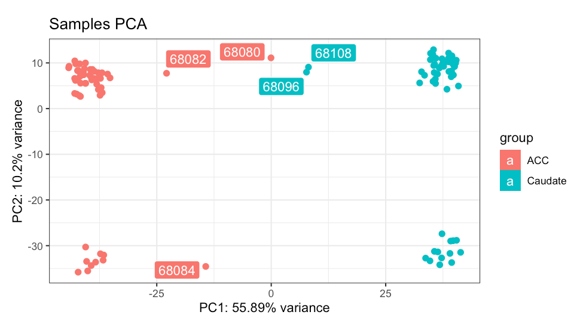

But I get the same thing for other normalizations.

Let's do this for ACC only then:

```r
idx = df$Region=='ACC'
dds <- DESeqDataSetFromMatrix(countData = data[, idx],
                              colData = df[idx, ],
                              design = ~ Diagnosis)
keep <- rowSums(counts(dds)) >= 10
dds <- dds[keep,]
dds = DESeq(dds)
library(pcaExplorer)
pcaExplorer(dds = dds)
```

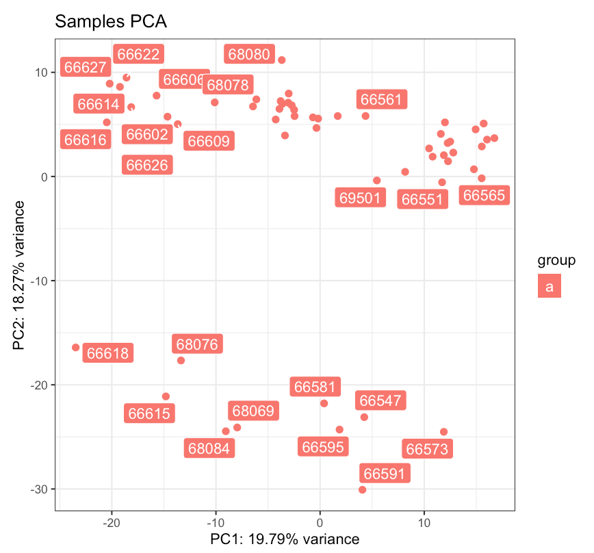

There's still something funky there. Let's see if we can find out.

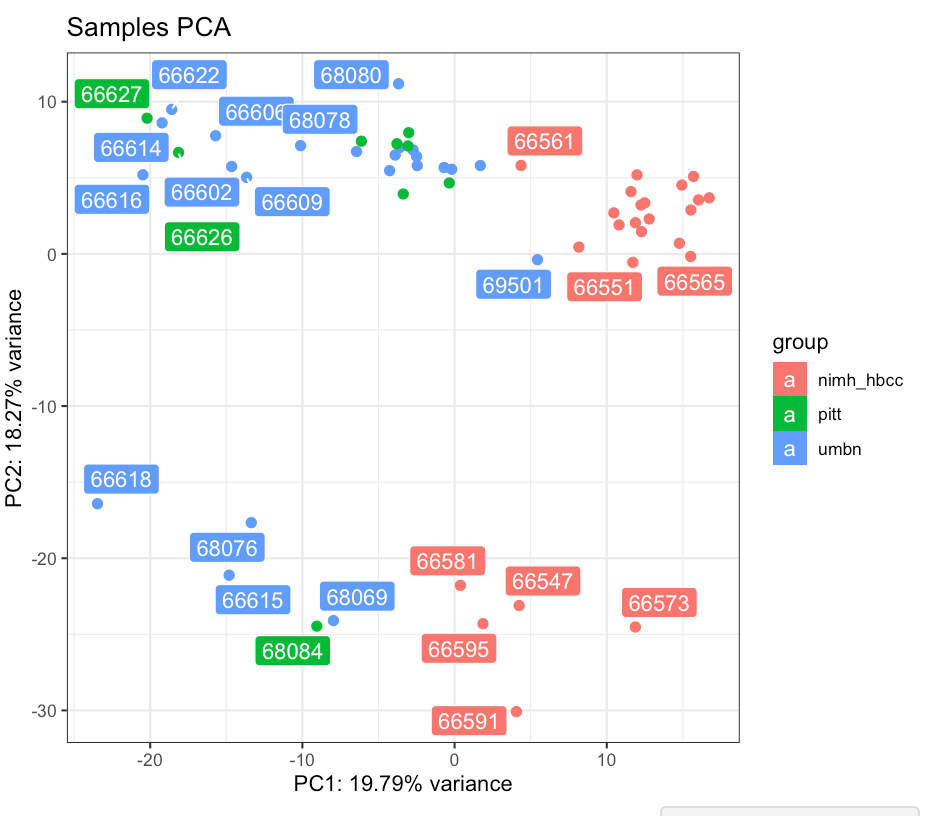

PC1 could be brainbank, but there might be a better one...

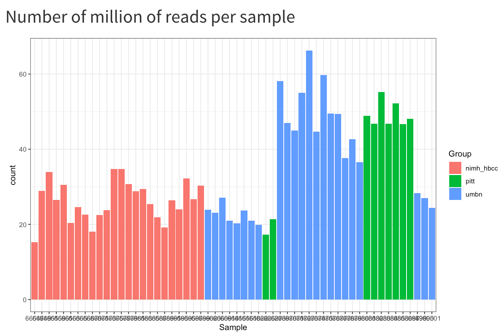

This is also worrisome. Some samples have way more reads than others... 

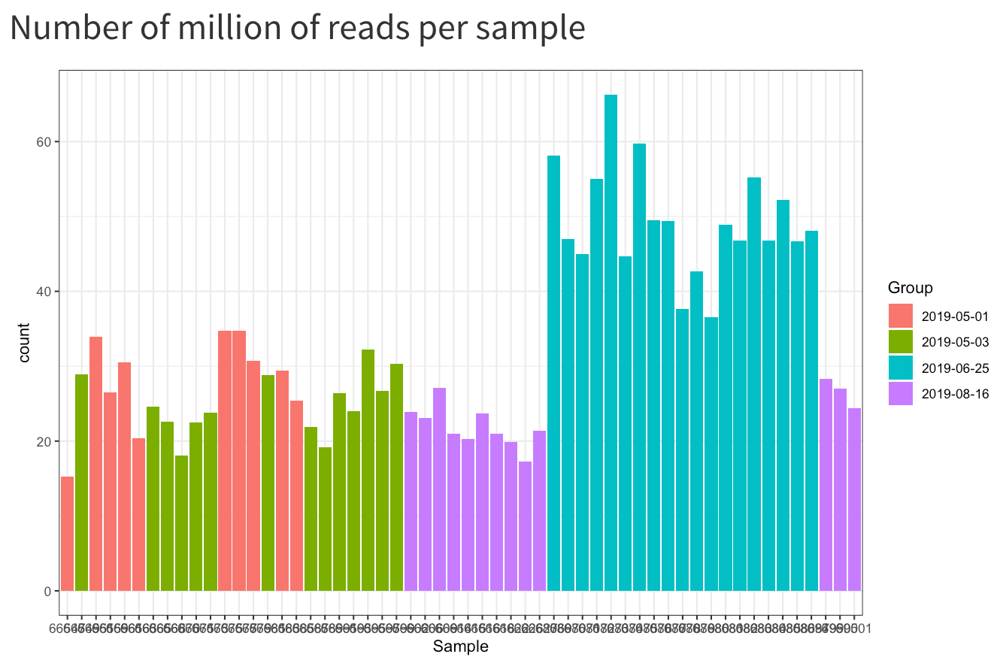

There you go. It's the same as batch. But it doesn't account for the difference
in the PCA plot, especially PC2:

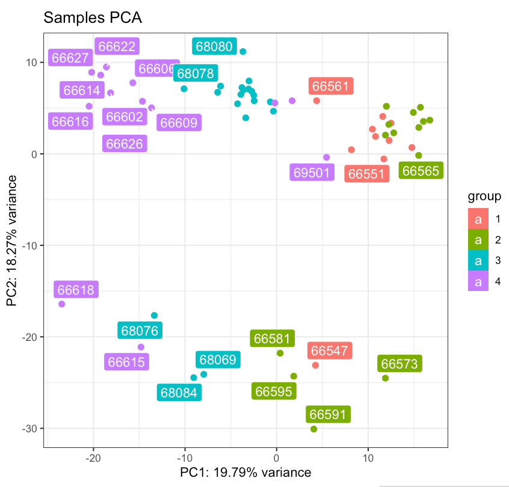

Would SV help here?

First, let's check other methods:

```r
library(Glimma)
glimmaMDS(dds)
```

This just uses the same plot we've been looking at using PCA, but now it's MDS.
But it doesn't look as nice, so I'd go with pcaExplorer anyways. It does make me
see that the second PC is related to Sex:

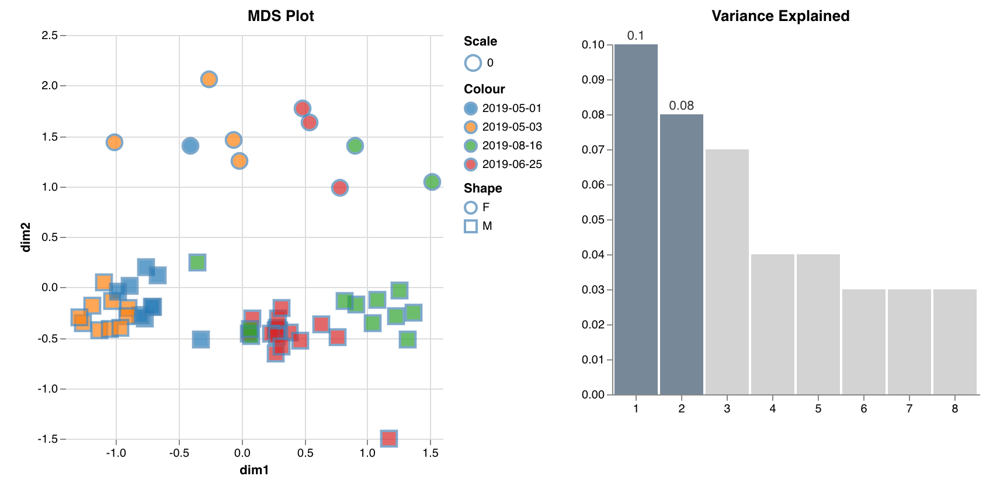

Assuming PCs and MDS align.

The other thing we can do with glima is the MDA plot, but I won't do that now.
Let me see if regionReport shows anything else we should look at:

```r
dir.create('~/tmp/DESeq2-example', showWarnings = FALSE, recursive = TRUE)
library('ggplot2')
library('regionReport')
report <- DESeq2Report(dds, project = 'DESeq2 HTML report',
    intgroup = c('Diagnosis', 'Region'), outdir = '~/tmp/DESeq2-example',
    output = 'index', theme = theme_bw())
```

That showed some histograms of the pvalues, which could be useful, but in terms
of data exploration I'd still go with pcaExplorer. 

Let's finish cleaning up the dataset and try it again. First, there's only one
sample per brain, which is good. Now, let's keep only the autosomal genes, and
see what we get in the PCA:

```r
# I'm running all these in RStudio because it makes graphics much easier
data = read.table('~/data/rnaseq_derek/adhd_rnaseq_counts.txt', header=1)
rownames(data) = data[,1]
data[,1] = NULL
data = round(data)
sub_name = gsub(x=colnames(data), pattern='X', replacement='')
colnames(data) = sub_name

library(gdata)
df = read.xls('~/data/post_mortem/POST_MORTEM_META_DATA_JAN_2021.xlsx')
data = data[, colnames(data) %in% df$submitted_name]
df = df[df$submitted_name %in% colnames(data), ]
df = df[order(df$submitted_name), ]
data = data[, order(df$submitted_name)]
df$Diagnosis = factor(df$Diagnosis, levels=c('Control', 'Case'))

# removing everything but autosomes
library(GenomicFeatures)
txdb <- loadDb('~/data/post_mortem/Homo_sapies.GRCh38.97.sqlite')
txdf <- select(txdb, keys(txdb, "GENEID"), columns=c('GENEID','TXCHROM'),
               "GENEID")
bt = read.csv('~/data/post_mortem/Homo_sapiens.GRCh38.97_biotypes.csv')
bt_slim = bt[, c('gene_id', 'gene_biotype')]
bt_slim = bt_slim[!duplicated(bt_slim),]
txdf = merge(txdf, bt_slim, by.x='GENEID', by.y='gene_id')
# store gene names in geneCounts without version in end of name
tx_meta = data.frame(GENEID = substr(rownames(data), 1, 15))
tx_meta = merge(tx_meta, txdf, by='GENEID', sort=F)
imautosome = which(tx_meta$TXCHROM != 'X' &
                   tx_meta$TXCHROM != 'Y' &
                   tx_meta$TXCHROM != 'MT')
data = data[imautosome, ]
tx_meta = tx_meta[imautosome, ]

# make sure we only have 
library("DESeq2")
idx = df$Region=='ACC'
dds <- DESeqDataSetFromMatrix(countData = data[, idx],
                              colData = df[idx, ],
                              design = ~ Diagnosis)
keep <- rowSums(counts(dds)) >= 10
dds <- dds[keep,]
dds = DESeq(dds)
library(pcaExplorer)
pcaExplorer(dds = dds)
```

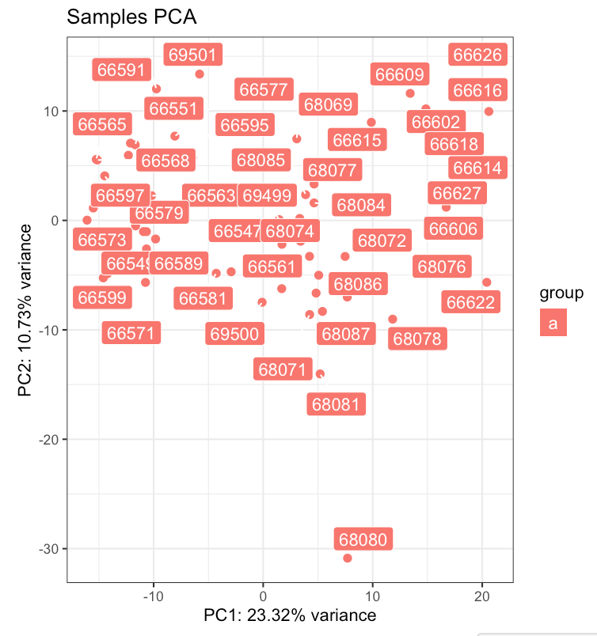

That's good that there's no visual separation anymore after we remove the sex
chromosomes. And there's the usual sample we normally, remove, so let's get rid
of it too before we try to find any other factors to remove:

```r
data = read.table('~/data/rnaseq_derek/adhd_rnaseq_counts.txt', header=1)
rownames(data) = data[,1]
data[,1] = NULL
data = round(data)
sub_name = gsub(x=colnames(data), pattern='X', replacement='')
colnames(data) = sub_name
data = data[, ! colnames(data) %in% c('68080')]

library(gdata)
df = read.xls('~/data/post_mortem/POST_MORTEM_META_DATA_JAN_2021.xlsx')
data = data[, colnames(data) %in% df$submitted_name]
df = df[df$submitted_name %in% colnames(data), ]
df = df[order(df$submitted_name), ]
data = data[, order(df$submitted_name)]
df$Diagnosis = factor(df$Diagnosis, levels=c('Control', 'Case'))
                                             
library(GenomicFeatures)
txdb <- loadDb('~/data/post_mortem/Homo_sapies.GRCh38.97.sqlite')
txdf <- select(txdb, keys(txdb, "GENEID"), columns=c('GENEID','TXCHROM'),
               "GENEID")
bt = read.csv('~/data/post_mortem/Homo_sapiens.GRCh38.97_biotypes.csv')
bt_slim = bt[, c('gene_id', 'gene_biotype')]
bt_slim = bt_slim[!duplicated(bt_slim),]
txdf = merge(txdf, bt_slim, by.x='GENEID', by.y='gene_id')
tx_meta = data.frame(GENEID = substr(rownames(data), 1, 15))
tx_meta = merge(tx_meta, txdf, by='GENEID', sort=F)
imautosome = which(tx_meta$TXCHROM != 'X' &
                   tx_meta$TXCHROM != 'Y' &
                   tx_meta$TXCHROM != 'MT')
data = data[imautosome, ]
tx_meta = tx_meta[imautosome, ]

library("DESeq2")
idx = df$Region=='ACC'
dds <- DESeqDataSetFromMatrix(countData = data[, idx],
                              colData = df[idx, ],
                              design = ~ Diagnosis)
keep <- rowSums(counts(dds)) >= 10
dds <- dds[keep,]
dds = DESeq(dds)
library(pcaExplorer)
pcaExplorer(dds = dds)
```

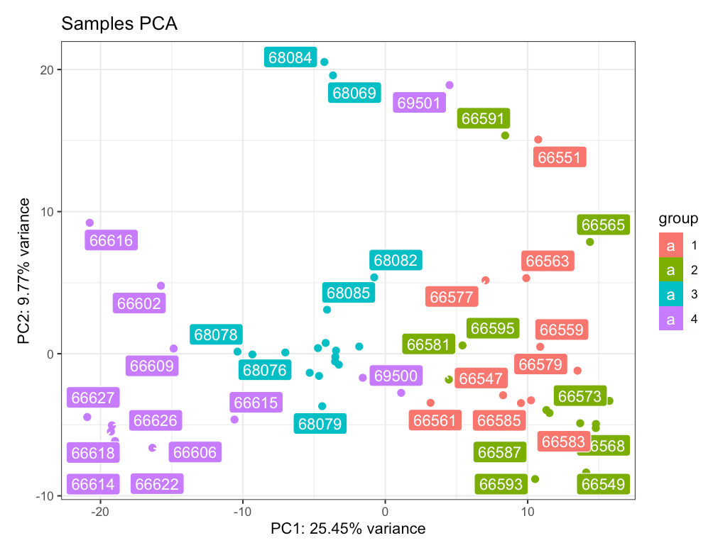

So, do I want to remove batch right away, or just go ahead and calculate an SV
and check how it correlates with batch? First, let's look at BBB and how it
looks in our PCA plot:

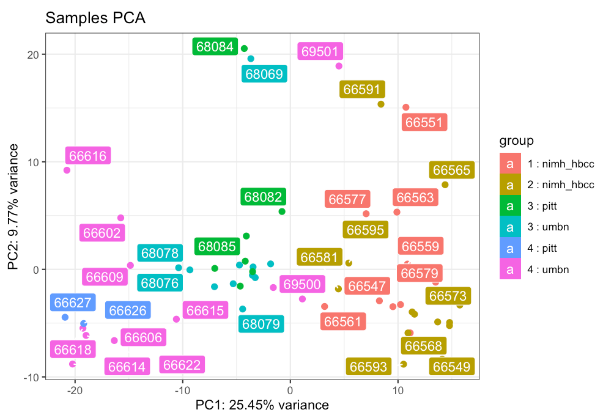

It's not as clean. But brain bank by itself does seem to reveal some structure:

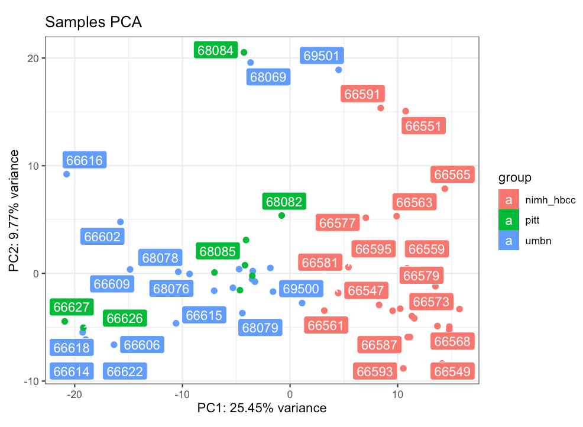

The issue here is that I cannot do both because the model doesn't run, as I
don't have data in all groups. Is there a way to deal with that in DESeq2? Or
should I just do SV and check how it relates to brain bank and batch?


# TODO
 * make sure we only have one sample for each brain
 * make sure all variables are of correct type
 * see if SVA would help get rid of those main effects in the PCA plot


data = t(data)
data = cbind(as.numeric(sn), data)
colnames(data)[1] = 'submitted_name'
df = read.csv('~/data/rnaseq_derek/UPDATED_file_for_derek_add_cause_of_death.csv')
df = df[!duplicated(df$submitted_name),]

m = merge(df, data, by='submitted_name', all.x=F, all.y=T)
pop_code = read.csv('~/data/rnaseq_derek/file_pop.csv')
m2 = merge(m, pop_code, by='hbcc_brain_id')
pcs = read.table('~/data/rnaseq_derek/HM3_b37mds.mds', header=1)
myids = sapply(1:nrow(pcs), function(x) as.numeric(gsub('BR', '',
                                                        strsplit(as.character(pcs[x,'IID']), '_')[[1]][1])))
pcs$numids = myids
m3 = merge(m2, pcs, by.x='hbcc_brain_id', by.y='numids', all.x=T, all.y=F)
```

Choosing which of the repeated sample in Caudate to keep:

```r
cdata = m3[m3$Region=='Caudate',]
grex_names = colnames(m3)[grepl(colnames(m3), pattern='^ENS')]
n0 = rowSums(cdata[, grex_names]==0)
idx = which(cdata$hbcc_brain_id==2877)
idx

[1] 25 26 27 28 29 30

n0[idx]
   49    50    51    52    53    54 
26733 26301 26410 26070 26502 24469 
```

So, row 54 has the fewest genes with zero transcription counts. We'll take that.

```r
cdata = cdata[-c(25:29), ]
m4 = rbind(cdata, m3[m3$Region=='ACC',])
saveRDS(m4, file='~/data/rnaseq_derek/complete_rawCountData_05132020.rds')
```
