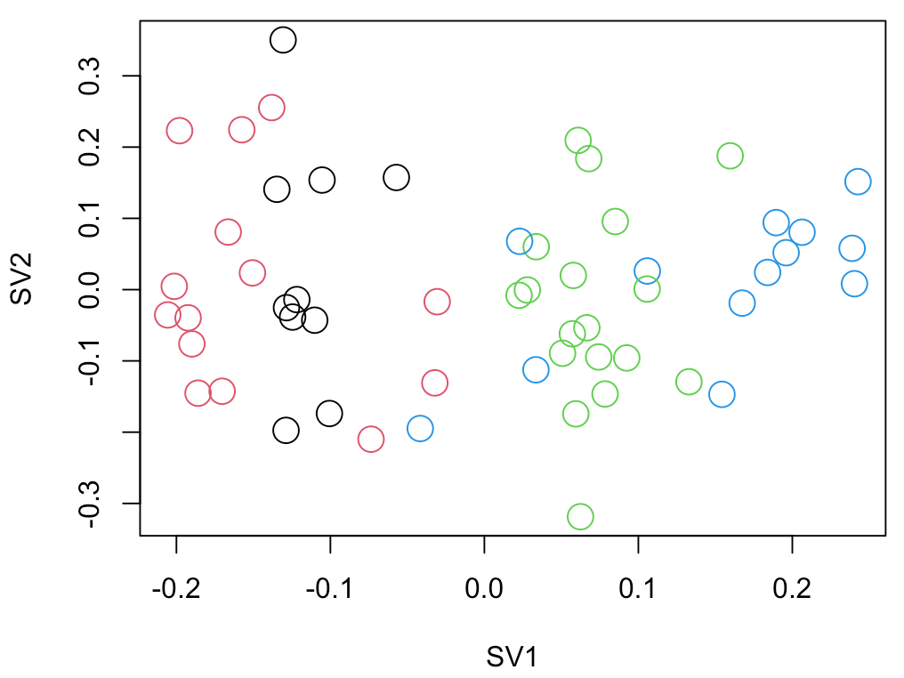
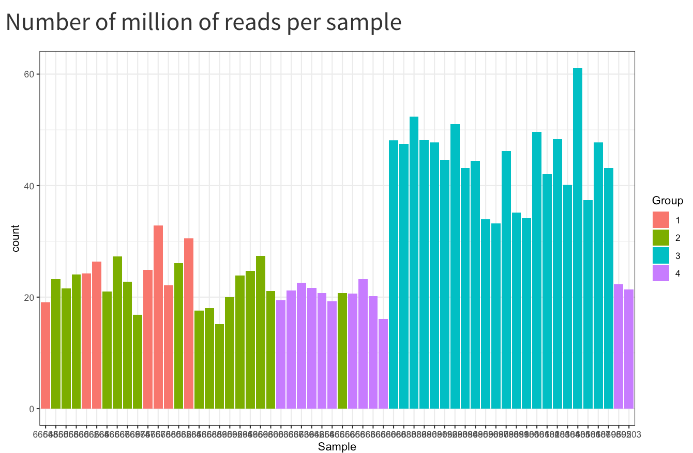

# 2021-04-15 14:07:22

Let me try some very basic DESeq2 to see if I can get some single gene results.
I think our main results will remain there, because they're quite robust
anyways.

As usual, I'm using this:

http://www.bioconductor.org/packages/release/bioc/vignettes/DESeq2/inst/doc/DESeq2.html

But I do want to start from scratch:

```r
# I'm running all these in RStudio because it makes graphics much easier
data = read.table('~/data/rnaseq_derek/adhd_rnaseq_counts.txt', header=1)
rownames(data) = data[,1]
data[,1] = NULL
data = round(data)
sub_name = gsub(x=colnames(data), pattern='X', replacement='')
colnames(data) = sub_name

library(gdata)
df = read.xls('~/data/post_mortem/POST_MORTEM_META_DATA_JAN_2021.xlsx')
data = data[, colnames(data) %in% df$submitted_name]
df = df[df$submitted_name %in% colnames(data), ]
df = df[order(df$submitted_name), ]
data = data[, order(df$submitted_name)]
df$Diagnosis = factor(df$Diagnosis, levels=c('Control', 'Case'))

# make sure we only have 
library("DESeq2")
dds <- DESeqDataSetFromMatrix(countData = data,
                              colData = df,
                              design = ~ Diagnosis)
keep <- rowSums(counts(dds)) >= 10
dds <- dds[keep,]

library(pcaExplorer)
pcaExplorer(dds = dds)
```

I'm using the log2 of the data for dst. I get this:


But I get the same thing for other normalizations.

Let's do this for ACC only then:

```r
idx = df$Region=='ACC'
dds <- DESeqDataSetFromMatrix(countData = data[, idx],
                              colData = df[idx, ],
                              design = ~ Diagnosis)
keep <- rowSums(counts(dds)) >= 10
dds <- dds[keep,]
dds = DESeq(dds)
library(pcaExplorer)
pcaExplorer(dds = dds)
```


There's still something funky there. Let's see if we can find out.


PC1 could be brainbank, but there might be a better one...


This is also worrisome. Some samples have way more reads than others... 


There you go. It's the same as batch. But it doesn't account for the difference
in the PCA plot, especially PC2:


Would SV help here?

First, let's check other methods:

```r
library(Glimma)
glimmaMDS(dds)
```

This just uses the same plot we've been looking at using PCA, but now it's MDS.
But it doesn't look as nice, so I'd go with pcaExplorer anyways. It does make me
see that the second PC is related to Sex:


Assuming PCs and MDS align.

The other thing we can do with glima is the MDA plot, but I won't do that now.
Let me see if regionReport shows anything else we should look at:

```r
dir.create('~/tmp/DESeq2-example', showWarnings = FALSE, recursive = TRUE)
library('ggplot2')
library('regionReport')
report <- DESeq2Report(dds, project = 'DESeq2 HTML report',
    intgroup = c('Diagnosis', 'Region'), outdir = '~/tmp/DESeq2-example',
    output = 'index', theme = theme_bw())
```

That showed some histograms of the pvalues, which could be useful, but in terms
of data exploration I'd still go with pcaExplorer. 

Let's finish cleaning up the dataset and try it again. First, there's only one
sample per brain, which is good. Now, let's keep only the autosomal genes, and
see what we get in the PCA:

```r
# I'm running all these in RStudio because it makes graphics much easier
data = read.table('~/data/rnaseq_derek/adhd_rnaseq_counts.txt', header=1)
rownames(data) = data[,1]
data[,1] = NULL
data = round(data)
sub_name = gsub(x=colnames(data), pattern='X', replacement='')
colnames(data) = sub_name

library(gdata)
df = read.xls('~/data/post_mortem/POST_MORTEM_META_DATA_JAN_2021.xlsx')
data = data[, colnames(data) %in% df$submitted_name]
df = df[df$submitted_name %in% colnames(data), ]
df = df[order(df$submitted_name), ]
data = data[, order(df$submitted_name)]
df$Diagnosis = factor(df$Diagnosis, levels=c('Control', 'Case'))

# removing everything but autosomes
library(GenomicFeatures)
txdb <- loadDb('~/data/post_mortem/Homo_sapies.GRCh38.97.sqlite')
txdf <- select(txdb, keys(txdb, "GENEID"), columns=c('GENEID','TXCHROM'),
               "GENEID")
bt = read.csv('~/data/post_mortem/Homo_sapiens.GRCh38.97_biotypes.csv')
bt_slim = bt[, c('gene_id', 'gene_biotype')]
bt_slim = bt_slim[!duplicated(bt_slim),]
txdf = merge(txdf, bt_slim, by.x='GENEID', by.y='gene_id')
# store gene names in geneCounts without version in end of name
tx_meta = data.frame(GENEID = substr(rownames(data), 1, 15))
tx_meta = merge(tx_meta, txdf, by='GENEID', sort=F)
imautosome = which(tx_meta$TXCHROM != 'X' &
                   tx_meta$TXCHROM != 'Y' &
                   tx_meta$TXCHROM != 'MT')
data = data[imautosome, ]
tx_meta = tx_meta[imautosome, ]

# make sure we only have 
library("DESeq2")
idx = df$Region=='ACC'
dds <- DESeqDataSetFromMatrix(countData = data[, idx],
                              colData = df[idx, ],
                              design = ~ Diagnosis)
keep <- rowSums(counts(dds)) >= 10
dds <- dds[keep,]
dds = DESeq(dds)
library(pcaExplorer)
pcaExplorer(dds = dds)
```


That's good that there's no visual separation anymore after we remove the sex
chromosomes. And there's the usual sample we normally, remove, so let's get rid
of it too before we try to find any other factors to remove:

```r
data = read.table('~/data/rnaseq_derek/adhd_rnaseq_counts.txt', header=1)
rownames(data) = data[,1]
data[,1] = NULL
data = round(data)
sub_name = gsub(x=colnames(data), pattern='X', replacement='')
colnames(data) = sub_name
data = data[, ! colnames(data) %in% c('68080')]

library(gdata)
df = read.xls('~/data/post_mortem/POST_MORTEM_META_DATA_JAN_2021.xlsx')
data = data[, colnames(data) %in% df$submitted_name]
df = df[df$submitted_name %in% colnames(data), ]
df = df[order(df$submitted_name), ]
data = data[, order(df$submitted_name)]
df$Diagnosis = factor(df$Diagnosis, levels=c('Control', 'Case'))
                                             
library(GenomicFeatures)
txdb <- loadDb('~/data/post_mortem/Homo_sapies.GRCh38.97.sqlite')
txdf <- select(txdb, keys(txdb, "GENEID"), columns=c('GENEID','TXCHROM'),
               "GENEID")
bt = read.csv('~/data/post_mortem/Homo_sapiens.GRCh38.97_biotypes.csv')
bt_slim = bt[, c('gene_id', 'gene_biotype')]
bt_slim = bt_slim[!duplicated(bt_slim),]
txdf = merge(txdf, bt_slim, by.x='GENEID', by.y='gene_id')
tx_meta = data.frame(GENEID = substr(rownames(data), 1, 15))
tx_meta = merge(tx_meta, txdf, by='GENEID', sort=F)
imautosome = which(tx_meta$TXCHROM != 'X' &
                   tx_meta$TXCHROM != 'Y' &
                   tx_meta$TXCHROM != 'MT')
data = data[imautosome, ]
tx_meta = tx_meta[imautosome, ]

library("DESeq2")
idx = df$Region=='ACC'
dds <- DESeqDataSetFromMatrix(countData = data[, idx],
                              colData = df[idx, ],
                              design = ~ Diagnosis)
keep <- rowSums(counts(dds)) >= 10
dds <- dds[keep,]
dds = DESeq(dds)
library(pcaExplorer)
pcaExplorer(dds = dds)
```


So, do I want to remove batch right away, or just go ahead and calculate an SV
and check how it correlates with batch? First, let's look at BBB and how it
looks in our PCA plot:


It's not as clean. But brain bank by itself does seem to reveal some structure:


The issue here is that I cannot do both because the model doesn't run, as I
don't have data in all groups. Is there a way to deal with that in DESeq2? Or
should I just do SV and check how it relates to brain bank and batch?

And my issue with BBB is that there are a couple categories that are quite
sparse:

```
r$> summary(df$BBB)                                                                     
nimh_hbcc_1 nimh_hbcc_2 nimh_hbcc_3      pitt_3      pitt_4      umbn_3      umbn_4 
         18          31           1          16           3          24          22 
```

# 2021-04-16 08:01:42

Let's then see what the first two SVs reveal:

```r
norm.cts <- counts(dds, normalized=TRUE)
library(sva)
mm <- model.matrix(~ Diagnosis, colData(dds))
mm0 <- model.matrix(~ 1, colData(dds))
fit <- svaseq(norm.cts, mod=mm, mod0=mm0, n.sv=2)
plot(fit$sv[,1:2], col=dds$batch, cex=2, xlab="SV1", ylab="SV2")
```




The second one is brain bank. So, SV1 seems to get everything, which is nice.
But is SV2 capturing anything?

```
> cor.test(fit$sv[,1], dds$Age, method='spearman')

	Spearman's rank correlation rho

data:  fit$sv[, 1] and dds$Age
S = 39340, p-value = 0.001445
alternative hypothesis: true rho is not equal to 0
sample estimates:
      rho 
-0.419182 
```

There was nothing for the population PCs, but something came up for age. Let's
leave it then. I'll likely have to run the analysis later adding specific
covariates and checking the results. For now, let's see what we can get with
just adding these two SVs.

```r
data = read.table('~/data/rnaseq_derek/adhd_rnaseq_counts.txt', header=1)
rownames(data) = data[,1]
data[,1] = NULL
data = round(data)
sub_name = gsub(x=colnames(data), pattern='X', replacement='')
colnames(data) = sub_name
data = data[, ! colnames(data) %in% c('68080')]

library(gdata)
df = read.xls('~/data/post_mortem/POST_MORTEM_META_DATA_JAN_2021.xlsx')
data = data[, colnames(data) %in% df$submitted_name]
df = df[df$submitted_name %in% colnames(data), ]
df = df[order(df$submitted_name), ]
data = data[, order(df$submitted_name)]
df$Diagnosis = factor(df$Diagnosis, levels=c('Control', 'Case'))
                                             
library(GenomicFeatures)
txdb <- loadDb('~/data/post_mortem/Homo_sapies.GRCh38.97.sqlite')
txdf <- select(txdb, keys(txdb, "GENEID"), columns=c('GENEID','TXCHROM'),
               "GENEID")
bt = read.csv('~/data/post_mortem/Homo_sapiens.GRCh38.97_biotypes.csv')
bt_slim = bt[, c('gene_id', 'gene_biotype')]
bt_slim = bt_slim[!duplicated(bt_slim),]
txdf = merge(txdf, bt_slim, by.x='GENEID', by.y='gene_id')
tx_meta = data.frame(GENEID = substr(rownames(data), 1, 15))
tx_meta = merge(tx_meta, txdf, by='GENEID', sort=F)
imautosome = which(tx_meta$TXCHROM != 'X' &
                   tx_meta$TXCHROM != 'Y' &
                   tx_meta$TXCHROM != 'MT')
data = data[imautosome, ]
tx_meta = tx_meta[imautosome, ]

library("DESeq2")
idx = df$Region=='ACC'
dds <- DESeqDataSetFromMatrix(countData = data[, idx],
                              colData = df[idx, ],
                              design = ~ Diagnosis)
keep <- rowSums(counts(dds)) >= 10
dds <- dds[keep,]
dds = DESeq(dds)

norm.cts <- counts(dds, normalized=TRUE)
library(sva)
mm <- model.matrix(~ Diagnosis, colData(dds))
mm0 <- model.matrix(~ 1, colData(dds))
fit <- svaseq(norm.cts, mod=mm, mod0=mm0, n.sv=2)

ddssva <- dds
ddssva$SV1 <- fit$sv[,1]
ddssva$SV2 <- fit$sv[,2]
design(ddssva) <- ~ SV1 + SV2 + Diagnosis
ddssva = DESeq(ddssva)
```

It's still corrupted by zeros, but IHW didn't seem affected by it. It doesn't
look like it's doing the automatic outlier filtering though, because of the SVs.
Let's try implementing that then:

```r
nOutliers = Inf
mydds = ddssva
while (nOutliers > 0) {
    cat('Processing', nrow(mydds), 'variables.\n')
    mydds <- DESeq(mydds)
    maxCooks <- apply(assays(mydds)[["cooks"]], 1, max)
    # outlier cut-off uses the 99% quantile of the F(p,m-p) distribution (with 
    # p the number of parameters including the intercept and m number of
    # samples).
    m <- ncol(mydds)
    # number or parameters (SVs + Diagnosis + intercept)
    p <- 2 + 1 + 1
    co = qf(.99, p, m - p)
    keep_me = which(maxCooks < co)
    nOutliers = nrow(mydds) - length(keep_me)
    cat('Found', nOutliers, 'outliers.\n')
    mydds = mydds[keep_me, ]
}
```

Removing outliers still kept the top genes as the ones with zeros... let's try
the edgeR filtering:

```r
library(edgeR)
design = model.matrix(~ SV1 + SV2 + Diagnosis, data=colData(ddssva))
isexpr <- filterByExpr(ddssva, design=design)
ddsexpr = ddssva[isexpr,]
nOutliers = Inf
mydds = ddsexpr
# ...
```

These look better. And now we have 4 hits for IHW FDR q < .1 in ACC, and one in
FDR/IHW for q< .05. If the ACC results remain for MAGMA and GSEA, we can stick
with this. And they're not just based on the zero genes.

```r
library(WebGestaltR)

data_dir = '~/data/post_mortem/'
ncpu=6

region = 'acc'
ranks = -log(res$pvalue) * sign(res$log2FoldChange)
geneid=substring(rownames(res), 1, 15)
tmp2 = data.frame(geneid=geneid, rank=ranks)
tmp2 = tmp2[order(ranks, decreasing=T),]
DBs = c(sprintf('my_%s_sets', region))
res_str = region
for (db in DBs) {
    cat(res_str, db, '\n')
    db_file = sprintf('~/data/post_mortem/%s.gmt', db)
    project_name = sprintf('WGtmp_%s_%s_10K', res_str, db)
    enrichResult <- try(WebGestaltR(enrichMethod="GSEA",
                        organism="hsapiens",
                        enrichDatabaseFile=db_file,
                        enrichDatabaseType="genesymbol",
                        interestGene=tmp2,
                        outputDirectory = data_dir,
                        interestGeneType="ensembl_gene_id",
                        sigMethod="top", topThr=20,
                        minNum=3, projectName=project_name,
                        isOutput=T, isParallel=T,
                        nThreads=ncpu, perNum=10000, maxNum=800))
}
```

GWAS is popping up, so I think we'll be good with MAGMA. We can run it later.
Let me put this into a function, so we can test extra covariates:

```r
run_skinny_DGE = function(myregion, add_cov=NA, alpha=.05) {
    cat(myregion, add_cov, alpha, '\n')
    data = read.table('~/data/rnaseq_derek/adhd_rnaseq_counts.txt', header=1)
    rownames(data) = data[,1]
    data[,1] = NULL
    data = round(data)
    sub_name = gsub(x=colnames(data), pattern='X', replacement='')
    colnames(data) = sub_name
    # this is a ACC outlier
    data = data[, ! colnames(data) %in% c('68080')]
    # this is a repeat for Caudate hbcc 2877, but has more genes with zeros than
    # its other replicate
    data = data[, ! colnames(data) %in% c('66552')]

    library(gdata)
    df = read.xls('~/data/post_mortem/POST_MORTEM_META_DATA_JAN_2021.xlsx')
    data = data[, colnames(data) %in% df$submitted_name]
    df = df[df$submitted_name %in% colnames(data), ]
    df = df[order(df$submitted_name), ]
    data = data[, order(df$submitted_name)]

    # cleaning up some variables
    df$Individual = factor(df$hbcc_brain_id)
    df[df$Manner.of.Death=='Suicide (probable)', 'Manner.of.Death'] = 'Suicide'
    df[df$Manner.of.Death=='unknown', 'Manner.of.Death'] = 'natural'
    df$MoD = factor(df$Manner.of.Death)
    df$Sex = factor(df$Sex)
    df$batch = factor(df$batch)
    df$run_date = factor(gsub(df$run_date, pattern='-', replacement=''))
    df$Diagnosis = factor(df$Diagnosis, levels=c('Control', 'Case'))
    df$substance_group = factor(df$substance_group)
    df$comorbid_group = factor(df$comorbid_group_update)
    df$evidence_level = factor(df$evidence_level)
    df$brainbank = factor(df$bainbank)
    # replace the one subject missing population PCs by the median of their
    # self-declared race and ethnicity
    idx = (df$Race.x=='White' & df$Ethnicity.x=='Non-Hispanic' & !is.na(df$C1))
    pop_pcs = c('C1', 'C2', 'C3', 'C4', 'C5')
    med_pop = apply(df[idx, pop_pcs], 2, median)
    df[which(is.na(df$C1)), pop_pcs] = med_pop
                                             
    library(GenomicFeatures)
    txdb <- loadDb('~/data/post_mortem/Homo_sapies.GRCh38.97.sqlite')
    txdf <- select(txdb, keys(txdb, "GENEID"), columns=c('GENEID','TXCHROM'),
                "GENEID")
    bt = read.csv('~/data/post_mortem/Homo_sapiens.GRCh38.97_biotypes.csv')
    bt_slim = bt[, c('gene_id', 'gene_biotype')]
    bt_slim = bt_slim[!duplicated(bt_slim),]
    txdf = merge(txdf, bt_slim, by.x='GENEID', by.y='gene_id')
    tx_meta = data.frame(GENEID = substr(rownames(data), 1, 15))
    tx_meta = merge(tx_meta, txdf, by='GENEID', sort=F)
    imautosome = which(tx_meta$TXCHROM != 'X' &
                    tx_meta$TXCHROM != 'Y' &
                    tx_meta$TXCHROM != 'MT')
    data = data[imautosome, ]
    tx_meta = tx_meta[imautosome, ]

    library("DESeq2")
    idx = df$Region==myregion
    dds <- DESeqDataSetFromMatrix(countData = data[, idx],
                                colData = df[idx, ],
                                design = ~ Diagnosis)
    keep <- rowSums(counts(dds)) >= 10
    dds <- dds[keep,]
    dds = DESeq(dds)

    norm.cts <- counts(dds, normalized=TRUE)
    library(sva)
    mm <- model.matrix(~ Diagnosis, colData(dds))
    mm0 <- model.matrix(~ 1, colData(dds))
    fit <- svaseq(norm.cts, mod=mm, mod0=mm0, n.sv=2)

    ddssva <- dds
    ddssva$SV1 <- fit$sv[,1]
    ddssva$SV2 <- fit$sv[,2]
    if (is.na(add_cov)) {
        fm_str = '~ SV1 + SV2 + Diagnosis'
    } else {
        fm_str = sprintf('~ %s + SV1 + SV2 + Diagnosis', add_cov)
    }
    design(ddssva) = as.formula(fm_str)
    ddssva = DESeq(ddssva)

    library(edgeR)
    design = model.matrix(as.formula(fm_str), data=colData(ddssva))
    isexpr <- filterByExpr(ddssva, design=design)
    ddsexpr = ddssva[isexpr,]

    nOutliers = Inf
    mydds = ddsexpr
    while (nOutliers > 0) {
        cat('Processing', nrow(mydds), 'variables.\n')
        mydds <- DESeq(mydds)
        maxCooks <- apply(assays(mydds)[["cooks"]], 1, max)
        # outlier cut-off uses the 99% quantile of the F(p,m-p) distribution (with 
        # p the number of parameters including the intercept and m number of
        # samples).
        m <- ncol(mydds)
        # number or parameters (SVs + Diagnosis + intercept)
        p <- 2 + 1 + 1
        if (! is.na(add_cov)) {
            p = p + 1 # add one more to the terms above
        }
        co = qf(.99, p, m - p)
        keep_me = which(maxCooks < co)
        nOutliers = nrow(mydds) - length(keep_me)
        cat('Found', nOutliers, 'outliers.\n')
        mydds = mydds[keep_me, ]
    }

    res <- results(mydds, name = "Diagnosis_Case_vs_Control", alpha = alpha)
    cat(sprintf('FDR q < %.2f\n', alpha))
    print(summary(res))

    library(IHW)
    resIHW <- results(mydds, name = "Diagnosis_Case_vs_Control", alpha = alpha,
                    filterFun=ihw)
    cat(sprintf('IHW q < %.2f\n', alpha))
    print(summary(resIHW))

    my_res = list(res=res, resIHW=resIHW, dds=mydds)
    return(my_res)
}
```

Let's investigate the impact of each covariate:

```r
myregion = 'Caudate'
many_res = list()
many_res$none = run_skinny_DGE(myregion)$res
for (cov in c('batch', 'Age', 'Sex', 'C1', 'C2', 'C3', 'RINe', 'PMI',
              'comorbid_group', 'pcnt_optical_duplicates',
              'C4', 'C5', 'MoD', 'substance_group', 'evidence_level',
              'brainbank')) {
    many_res[[cov]] = run_skinny_DGE(myregion, add_cov=cov)$res
}
```

run_date is making the matrix not full rank. cluster is not working either.

```r
do_boot_corrs = function(both_res) {
    corrs = c()
    nperms = 5000
    set.seed(42)
    options(warn=-1)  # remove annoying spearman warnings
    for (p in 1:nperms) {
        idx = sample(nrow(both_res), replace = T)
        corrs = c(corrs, cor.test(both_res[idx, 'log2FoldChange.x'],
                                  both_res[idx, 'log2FoldChange.y'],
                                  method='spearman')$estimate)
    }
    return(corrs)
}

all_corrs = c()
for (cov in c('batch', 'Age', 'Sex', 'C1', 'C2', 'C3', 'RINe', 'PMI',
              'comorbid_group', 'pcnt_optical_duplicates',
              'C4', 'C5', 'MoD', 'substance_group', 'evidence_level',
              'brainbank')) {
    cat(cov, '\n')
    both_res = merge(as.data.frame(many_res[['none']]),
                     as.data.frame(many_res[[cov]]), by=0, all.x=F, all.y=F)
    junk = data.frame(corr=do_boot_corrs(both_res))
    junk$cov = cov
    junk$gene_overlap = nrow(both_res)
    all_corrs = rbind(all_corrs, junk)
}
out_fname = sprintf('~/data/post_mortem/cov_corrs_skinny_%s_04162021.rds',
                    myregion)
saveRDS(all_corrs, file=out_fname)
```

I think we can run the same function for Caudate, but let me just check the
pcaexplorer plots for Caudate just to make sure nothing funky is going on:




It's pretty much the same story, but here there are no outliers (except for the
one replicate I'm removing in the code). Let's go ahead and run the same
function, and check the possible covariate effects:

# 2021-04-19 06:53:57

Let's see the effects of each covariate:

```r
quartz()
myregion = 'Caudate'
corrs = readRDS(sprintf('~/data/post_mortem/cov_corrs_skinny_%s_04162021.rds',
                        myregion))
library(ggplot2)
p <- (ggplot(corrs, aes(x = factor(cov), y = corr)) +
      coord_flip() + geom_boxplot() +
      theme(axis.text.y = element_text(angle = 0)) + 
      ggtitle(myregion))
p
```


Looking good. 

Let's also re-run our GSEA and MAGMA:

```r
library(WebGestaltR)

data_dir = '~/data/post_mortem/'
ncpu=6

for (region in c('ACC', 'Caudate')) {
    res = run_skinny_DGE(region)$res
    
    ranks = -log(res$pvalue) * sign(res$log2FoldChange)
    geneid = substring(rownames(res), 1, 15)
    
    tmp2 = data.frame(geneid=geneid, rank=ranks)
    tmp2 = tmp2[order(ranks, decreasing=T),]

    res_str = sprintf('WG22_DGE_%s_skinny', region)
    DBs = c(sprintf('my_%s_sets', region))
    for (db in DBs) {
        cat(res_str, db, '\n')
        db_file = sprintf('~/data/post_mortem/%s.gmt', db)
        project_name = sprintf('%s_%s_10K', res_str, db)
        enrichResult <- try(WebGestaltR(enrichMethod="GSEA",
                            organism="hsapiens",
                            enrichDatabaseFile=db_file,
                            enrichDatabaseType="genesymbol",
                            interestGene=tmp2,
                            outputDirectory = data_dir,
                            interestGeneType="ensembl_gene_id",
                            sigMethod="top", topThr=20,
                            minNum=3, projectName=project_name,
                            isOutput=T, isParallel=T,
                            nThreads=ncpu, perNum=10000, maxNum=800))
    }

    DBs = c('geneontology_Biological_Process_noRedundant',
            'geneontology_Cellular_Component_noRedundant',
            'geneontology_Molecular_Function_noRedundant')
    for (db in DBs) {
        cat(res_str, db, '\n')
        project_name = sprintf('%s_%s_10K', res_str, db)

        enrichResult <- try(WebGestaltR(enrichMethod="GSEA",
                                    organism="hsapiens",
                                    enrichDatabase=db,
                                    interestGene=tmp2,
                                    interestGeneType="ensembl_gene_id",
                                    sigMethod="top", topThr=20,
                                    outputDirectory = data_dir,
                                    minNum=5, projectName=project_name,
                                    isOutput=T, isParallel=T,
                                    nThreads=ncpu, perNum=10000))
    }

    for (db in c('KEGG', 'Panther', 'Reactome', 'Wikipathway')) {
        cat(res_str, db, '\n')
        project_name = sprintf('%s_%s_10K', res_str, db)

        enrichResult <- try(WebGestaltR(enrichMethod="GSEA",
                                    organism="hsapiens",
                                    enrichDatabase=sprintf('pathway_%s', db),
                                    interestGene=tmp2,
                                    interestGeneType="ensembl_gene_id",
                                    sigMethod="top", minNum=3,
                                    outputDirectory = data_dir,
                                    projectName=project_name,
                                    isOutput=T, isParallel=T,
                                    nThreads=ncpu, topThr=20, perNum=10000))
    }
}
```

Hum... the ACC results look nice, stronger if anything. But the Caudate dev
results got all messed up. Let's plot the single gene results just to see if
everything is OK there:

```r
plot_volcano = function(res, t_str, pCutoff = 0.05) {
    library(EnhancedVolcano)
    quartz()
    res = res[order(res$pvalue), ]
    FCcutoff = 1.0
    # if we have significant FDR, find it
    sigPs = sum(res$padj <= pCutoff)
    if (sigPs > 0) {
        ps = -log10(res$pvalue)
        nomPcutoff = ps[sigPs + 1] + (ps[sigPs] - ps[sigPs + 1]) / 2
        nomPcutoff = 10 ** (-nomPcutoff)
    } else {
        nomPcutoff = NA
    }
    print(sigPs)
    p = EnhancedVolcano(data.frame(res), lab = rownames(res),
                        x = 'log2FoldChange',
                        y = 'pvalue', xlab = bquote(~Log[2]~ 'fold change'),
                        selectLab = rownames(res)[res$padj < pCutoff],
                        ylab = bquote(~-Log[10]~italic(P)),
                        ylim = c(0, ceiling(max(-log10(res$pvalue)))),
                        pCutoff = nomPcutoff,
                        FCcutoff = FCcutoff, pointSize = 1.0,
                        labSize = 2.0, title = "Volcano plot",
                        subtitle = t_str,
                        caption = paste0('log2 FC cutoff: ', FCcutoff,
                                        '; p-value cutoff: ', pCutoff,
                                        '\nTotal = ', nrow(res), ' variables'),
                        legendPosition = 'bottom', legendLabSize = 10,
                        legendIconSize = 4.0)
    print(p)
}
acc = run_skinny_DGE('ACC')
cau = run_skinny_DGE('Caudate')

plot_volcano(acc$res, 'DGE ACC')
plot_volcano(cau$res, 'DGE Caudate')
```


It doesn't look like we're dealing with outliers... let's see what happens when
we plot our best hits:

```r
acc_p1 = run_skinny_DGE('ACC', alpha=.1)
cau_p1 = run_skinny_DGE('Caudate', alpha=.1)

plot_expression = function(gene_ids, dds, t_str) {
    library(ggpubr)
    library(ggbeeswarm)
    quartz()
    myplots = list()
    clrs = c("green3", "red")
    for (g in 1:length(gene_ids)) {
        cat(gene_ids[g], '\n')
        d <- plotCounts(dds, gene=gene_ids[g], intgroup="Diagnosis",
                        returnData=TRUE)
        p = (ggplot(d, aes(x=Diagnosis, y=count, color = Diagnosis,
                        fill = Diagnosis)) + 
            scale_y_log10() +
            geom_boxplot(alpha = 0.4, outlier.shape = NA, width = 0.8,
                        lwd = 0.5) +
            stat_summary(fun = mean, geom = "point", color = "black",
                        shape = 5, size = 3,
                        position=position_dodge(width = 0.8)) +
            scale_color_manual(values = clrs) +
            scale_fill_manual(values = clrs) +
            geom_quasirandom(color = "black", size = 1, dodge.width = 0.8) +
            theme_bw() +
            ggtitle(gene_ids[g]))
        myplots[[g]] = p
    }
    p = ggarrange(plotlist=myplots)
    print(annotate_figure(p, t_str))
}

my_genes = rownames(acc_p1$res)[acc_p1$resIHW$padj < .1]
plot_expression(my_genes, acc_p1$dds, 'DGE ACC IHW .1')
```


The last one ENSG00000240758.2 is also significant at q < .05. Note that nothing
is significant for Caudate even at .1. We just need to get that story of Caudate
developmental set straight.

Would other developmental sets work better?

```r
library(WebGestaltR)

data_dir = '~/data/post_mortem/'
ncpu=7

for (region in c('ACC', 'Caudate')) {
    res = run_skinny_DGE(region)$res
    
    ranks = -log(res$pvalue) * sign(res$log2FoldChange)
    geneid = substring(rownames(res), 1, 15)
    
    tmp2 = data.frame(geneid=geneid, rank=ranks)
    tmp2 = tmp2[order(ranks, decreasing=T),]

    res_str = sprintf('WG23_DGE_%s_skinny', region)
    DBs = c('my_%s_sets', '%s_developmental', '%s_developmental_noOverlap',
            '%s_manySets', '%s_manySets_co0.950', '%s_manySets_co0.990',
            '%s_noOverlap')
    for (db in DBs) {
        db2 = sprintf(db, tolower(region))
        cat(res_str, db2, '\n')
        db_file = sprintf('~/data/post_mortem/%s.gmt', db2)
        project_name = sprintf('%s_%s_10K', res_str, db2)
        enrichResult <- try(WebGestaltR(enrichMethod="GSEA",
                            organism="hsapiens",
                            enrichDatabaseFile=db_file,
                            enrichDatabaseType="genesymbol",
                            interestGene=tmp2,
                            outputDirectory = data_dir,
                            interestGeneType="ensembl_gene_id",
                            sigMethod="top", topThr=20,
                            minNum=3, projectName=project_name,
                            isOutput=T, isParallel=T,
                            nThreads=ncpu, perNum=10000, maxNum=800))
    }
}
```

Yeah, that's not doing much. What if I kept the SVA automatic extraction using
the current filtering steps?

```r
run_skinny_DGE_autoSV = function(myregion, add_cov=NA, alpha=.05) {
    cat(myregion, add_cov, alpha, '\n')
    data = read.table('~/data/rnaseq_derek/adhd_rnaseq_counts.txt', header=1)
    rownames(data) = data[,1]
    data[,1] = NULL
    data = round(data)
    sub_name = gsub(x=colnames(data), pattern='X', replacement='')
    colnames(data) = sub_name
    # this is a ACC outlier
    data = data[, ! colnames(data) %in% c('68080')]
    # this is a repeat for Caudate hbcc 2877, but has more genes with zeros than
    # its other replicate
    data = data[, ! colnames(data) %in% c('66552')]

    library(gdata)
    df = read.xls('~/data/post_mortem/POST_MORTEM_META_DATA_JAN_2021.xlsx')
    data = data[, colnames(data) %in% df$submitted_name]
    df = df[df$submitted_name %in% colnames(data), ]
    df = df[order(df$submitted_name), ]
    data = data[, order(df$submitted_name)]

    # cleaning up some variables
    df$Individual = factor(df$hbcc_brain_id)
    df[df$Manner.of.Death=='Suicide (probable)', 'Manner.of.Death'] = 'Suicide'
    df[df$Manner.of.Death=='unknown', 'Manner.of.Death'] = 'natural'
    df$MoD = factor(df$Manner.of.Death)
    df$Sex = factor(df$Sex)
    df$batch = factor(df$batch)
    df$run_date = factor(gsub(df$run_date, pattern='-', replacement=''))
    df$Diagnosis = factor(df$Diagnosis, levels=c('Control', 'Case'))
    df$substance_group = factor(df$substance_group)
    df$comorbid_group = factor(df$comorbid_group_update)
    df$evidence_level = factor(df$evidence_level)
    df$brainbank = factor(df$bainbank)
    # replace the one subject missing population PCs by the median of their
    # self-declared race and ethnicity
    idx = (df$Race.x=='White' & df$Ethnicity.x=='Non-Hispanic' & !is.na(df$C1))
    pop_pcs = c('C1', 'C2', 'C3', 'C4', 'C5')
    med_pop = apply(df[idx, pop_pcs], 2, median)
    df[which(is.na(df$C1)), pop_pcs] = med_pop
                                             
    library(GenomicFeatures)
    txdb <- loadDb('~/data/post_mortem/Homo_sapies.GRCh38.97.sqlite')
    txdf <- select(txdb, keys(txdb, "GENEID"), columns=c('GENEID','TXCHROM'),
                "GENEID")
    bt = read.csv('~/data/post_mortem/Homo_sapiens.GRCh38.97_biotypes.csv')
    bt_slim = bt[, c('gene_id', 'gene_biotype')]
    bt_slim = bt_slim[!duplicated(bt_slim),]
    txdf = merge(txdf, bt_slim, by.x='GENEID', by.y='gene_id')
    tx_meta = data.frame(GENEID = substr(rownames(data), 1, 15))
    tx_meta = merge(tx_meta, txdf, by='GENEID', sort=F)
    imautosome = which(tx_meta$TXCHROM != 'X' &
                    tx_meta$TXCHROM != 'Y' &
                    tx_meta$TXCHROM != 'MT')
    data = data[imautosome, ]
    tx_meta = tx_meta[imautosome, ]

    library("DESeq2")
    idx = df$Region==myregion
    dds <- DESeqDataSetFromMatrix(countData = data[, idx],
                                colData = df[idx, ],
                                design = ~ Diagnosis)
    keep <- rowSums(counts(dds)) >= 10
    dds <- dds[keep,]
    dds = DESeq(dds)

    norm.cts <- counts(dds, normalized=TRUE)
    library(sva)
    mm <- model.matrix(~ Diagnosis, colData(dds))
    mm0 <- model.matrix(~ 1, colData(dds))
    fit <- svaseq(norm.cts, mod=mm, mod0=mm0, n.sv=NULL)

    ddssva <- dds
    fm_str = '~ '
    for (s in 1:ncol(fit$sv)) {
        eval(parse(text=sprintf('ddssva$SV%d <- fit$sv[,%d]', s, s)))
        fm_str = sprintf('%s + SV%d', fm_str, s)
    }
    
    if (is.na(add_cov)) {
        fm_str = sprintf('%s + Diagnosis', fm_str)
    } else {
        fm_str = sprintf('%s + %s + Diagnosis', fm_str, add_cov)
    }
    design(ddssva) = as.formula(fm_str)
    ddssva = DESeq(ddssva)

    library(edgeR)
    design = model.matrix(as.formula(fm_str), data=colData(ddssva))
    isexpr <- filterByExpr(ddssva, design=design)
    ddsexpr = ddssva[isexpr,]

    nOutliers = Inf
    mydds = ddsexpr
    while (nOutliers > 0) {
        cat('Processing', nrow(mydds), 'variables.\n')
        mydds <- DESeq(mydds)
        maxCooks <- apply(assays(mydds)[["cooks"]], 1, max)
        # outlier cut-off uses the 99% quantile of the F(p,m-p) distribution (with 
        # p the number of parameters including the intercept and m number of
        # samples).
        m <- ncol(mydds)
        # number or parameters (SVs + Diagnosis + intercept)
        p <- ncol(fit$sv) + 1 + 1
        if (! is.na(add_cov)) {
            p = p + 1 # add one more to the terms above
        }
        co = qf(.99, p, m - p)
        keep_me = which(maxCooks < co)
        nOutliers = nrow(mydds) - length(keep_me)
        cat('Found', nOutliers, 'outliers.\n')
        mydds = mydds[keep_me, ]
    }

    res <- results(mydds, name = "Diagnosis_Case_vs_Control", alpha = alpha)
    cat(sprintf('FDR q < %.2f\n', alpha))
    print(summary(res))

    library(IHW)
    resIHW <- results(mydds, name = "Diagnosis_Case_vs_Control", alpha = alpha,
                    filterFun=ihw)
    cat(sprintf('IHW q < %.2f\n', alpha))
    print(summary(resIHW))

    my_res = list(res=res, resIHW=resIHW, dds=mydds)
    return(my_res)
}

acc_auto = run_skinny_DGE_autoSV('ACC')
cau_auto = run_skinny_DGE_autoSV('Caudate')
```

```
# ACC

Found 0 outliers.
FDR q < 0.05

out of 26540 with nonzero total read count
adjusted p-value < 0.05
LFC > 0 (up)       : 4, 0.015%
LFC < 0 (down)     : 5, 0.019%
outliers [1]       : 0, 0%
low counts [2]     : 6175, 23%
(mean count < 15)
[1] see 'cooksCutoff' argument of ?results
[2] see 'independentFiltering' argument of ?results

NULL
IHW q < 0.05

out of 26540 with nonzero total read count
adjusted p-value < 0.05
LFC > 0 (up)       : 5, 0.019%
LFC < 0 (down)     : 3, 0.011%
outliers [1]       : 0, 0%
[1] see 'cooksCutoff' argument of ?results
see metadata(res)$ihwResult on hypothesis weighting

NULL

# Caudate
Found 0 outliers.
FDR q < 0.05

out of 26485 with nonzero total read count
adjusted p-value < 0.05
LFC > 0 (up)       : 0, 0%
LFC < 0 (down)     : 2, 0.0076%
outliers [1]       : 0, 0%
low counts [2]     : 0, 0%
(mean count < 1)
[1] see 'cooksCutoff' argument of ?results
[2] see 'independentFiltering' argument of ?results

NULL
IHW q < 0.05

out of 26485 with nonzero total read count
adjusted p-value < 0.05
LFC > 0 (up)       : 0, 0%
LFC < 0 (down)     : 2, 0.0076%
outliers [1]       : 0, 0%
[1] see 'cooksCutoff' argument of ?results
see metadata(res)$ihwResult on hypothesis weighting

NULL
```

I got 12 SVs for ACC again, and 11 for Caudate.

```r
library(WebGestaltR)

data_dir = '~/data/post_mortem/'
ncpu=6

res = cau_auto$res
region = 'caudate'
ranks = -log(res$pvalue) * sign(res$log2FoldChange)
geneid=substring(rownames(res), 1, 15)
tmp2 = data.frame(geneid=geneid, rank=ranks)
tmp2 = tmp2[order(ranks, decreasing=T),]
DBs = c(sprintf('my_%s_sets', region))
res_str = region
for (db in DBs) {
    cat(res_str, db, '\n')
    db_file = sprintf('~/data/post_mortem/%s.gmt', db)
    project_name = sprintf('WGtmp_%s_%s_10K', res_str, db)
    enrichResult <- try(WebGestaltR(enrichMethod="GSEA",
                        organism="hsapiens",
                        enrichDatabaseFile=db_file,
                        enrichDatabaseType="genesymbol",
                        interestGene=tmp2,
                        outputDirectory = data_dir,
                        interestGeneType="ensembl_gene_id",
                        sigMethod="top", topThr=20,
                        minNum=3, projectName=project_name,
                        isOutput=T, isParallel=T,
                        nThreads=ncpu, perNum=10000, maxNum=800))
}
```

Everything is significant in both... let's see if I remove more zeros:

```r
myregion = 'Caudate'
data = read.table('~/data/rnaseq_derek/adhd_rnaseq_counts.txt', header=1)
rownames(data) = data[,1]
data[,1] = NULL
data = round(data)
sub_name = gsub(x=colnames(data), pattern='X', replacement='')
colnames(data) = sub_name
# this is a ACC outlier
data = data[, ! colnames(data) %in% c('68080')]
# this is a repeat for Caudate hbcc 2877, but has more genes with zeros than
# its other replicate
data = data[, ! colnames(data) %in% c('66552')]

library(gdata)
df = read.xls('~/data/post_mortem/POST_MORTEM_META_DATA_JAN_2021.xlsx')
data = data[, colnames(data) %in% df$submitted_name]
df = df[df$submitted_name %in% colnames(data), ]
df = df[order(df$submitted_name), ]
data = data[, order(df$submitted_name)]

# cleaning up some variables
df$Individual = factor(df$hbcc_brain_id)
df[df$Manner.of.Death=='Suicide (probable)', 'Manner.of.Death'] = 'Suicide'
df[df$Manner.of.Death=='unknown', 'Manner.of.Death'] = 'natural'
df$MoD = factor(df$Manner.of.Death)
df$Sex = factor(df$Sex)
df$batch = factor(df$batch)
df$run_date = factor(gsub(df$run_date, pattern='-', replacement=''))
df$Diagnosis = factor(df$Diagnosis, levels=c('Control', 'Case'))
df$substance_group = factor(df$substance_group)
df$comorbid_group = factor(df$comorbid_group_update)
df$evidence_level = factor(df$evidence_level)
df$brainbank = factor(df$bainbank)
# replace the one subject missing population PCs by the median of their
# self-declared race and ethnicity
idx = (df$Race.x=='White' & df$Ethnicity.x=='Non-Hispanic' & !is.na(df$C1))
pop_pcs = c('C1', 'C2', 'C3', 'C4', 'C5')
med_pop = apply(df[idx, pop_pcs], 2, median)
df[which(is.na(df$C1)), pop_pcs] = med_pop
                                            
library(GenomicFeatures)
txdb <- loadDb('~/data/post_mortem/Homo_sapies.GRCh38.97.sqlite')
txdf <- select(txdb, keys(txdb, "GENEID"), columns=c('GENEID','TXCHROM'),
            "GENEID")
bt = read.csv('~/data/post_mortem/Homo_sapiens.GRCh38.97_biotypes.csv')
bt_slim = bt[, c('gene_id', 'gene_biotype')]
bt_slim = bt_slim[!duplicated(bt_slim),]
txdf = merge(txdf, bt_slim, by.x='GENEID', by.y='gene_id')
tx_meta = data.frame(GENEID = substr(rownames(data), 1, 15))
tx_meta = merge(tx_meta, txdf, by='GENEID', sort=F)
imautosome = which(tx_meta$TXCHROM != 'X' &
                tx_meta$TXCHROM != 'Y' &
                tx_meta$TXCHROM != 'MT')
data = data[imautosome, ]
tx_meta = tx_meta[imautosome, ]

library("DESeq2")
idx = df$Region==myregion
dds <- DESeqDataSetFromMatrix(countData = data[, idx],
                            colData = df[idx, ],
                            design = ~ Diagnosis)
# don't allow genes with more zeros than the subjects in smallest group
min_subjs = min(table(df[idx,]$Diagnosis))
keep <- rowSums(counts(dds) == 0) <= min_subjs
dds <- dds[keep,]
dds = DESeq(dds)

norm.cts <- counts(dds, normalized=TRUE)
library(sva)
mm <- model.matrix(~ Diagnosis, colData(dds))
mm0 <- model.matrix(~ 1, colData(dds))
fit <- svaseq(norm.cts, mod=mm, mod0=mm0, n.sv=2)

ddssva <- dds
fm_str = '~ '
for (s in 1:ncol(fit$sv)) {
    eval(parse(text=sprintf('ddssva$SV%d <- fit$sv[,%d]', s, s)))
    fm_str = sprintf('%s + SV%d', fm_str, s)
}

if (is.na(add_cov)) {
    fm_str = sprintf('%s + Diagnosis', fm_str)
} else {
    fm_str = sprintf('%s + %s + Diagnosis', fm_str, add_cov)
}
design(ddssva) = as.formula(fm_str)
ddssva = DESeq(ddssva)

library(edgeR)
design = model.matrix(as.formula(fm_str), data=colData(ddssva))
isexpr <- filterByExpr(ddssva, design=design)
ddsexpr = ddssva[isexpr,]

nOutliers = Inf
mydds = ddsexpr
while (nOutliers > 0) {
    cat('Processing', nrow(mydds), 'variables.\n')
    mydds <- DESeq(mydds)
    maxCooks <- apply(assays(mydds)[["cooks"]], 1, max)
    # outlier cut-off uses the 99% quantile of the F(p,m-p) distribution (with 
    # p the number of parameters including the intercept and m number of
    # samples).
    m <- ncol(mydds)
    # number or parameters (SVs + Diagnosis + intercept)
    p <- 2 + 1 + 1
    if (! is.na(add_cov)) {
        p = p + 1 # add one more to the terms above
    }
    co = qf(.99, p, m - p)
    keep_me = which(maxCooks < co)
    nOutliers = nrow(mydds) - length(keep_me)
    cat('Found', nOutliers, 'outliers.\n')
    mydds = mydds[keep_me, ]
}

res <- results(mydds, name = "Diagnosis_Case_vs_Control", alpha = alpha)
cat(sprintf('FDR q < %.2f\n', alpha))
print(summary(res))

library(IHW)
resIHW <- results(mydds, name = "Diagnosis_Case_vs_Control", alpha = alpha,
                filterFun=ihw)
cat(sprintf('IHW q < %.2f\n', alpha))
print(summary(resIHW))

my_res = list(res=res, resIHW=resIHW, dds=mydds)
```


# TODO
 * maybe plot correlation of both SVs to our measured covariates?
 * what's going on with the Caudate dev results? Plot main results individually
   to see if that's OK, then maybe play with dev sets? Is everything OK in the
   code?
 * LRT?
 * remove more zeros
 * try doing ACC and Caudate combined