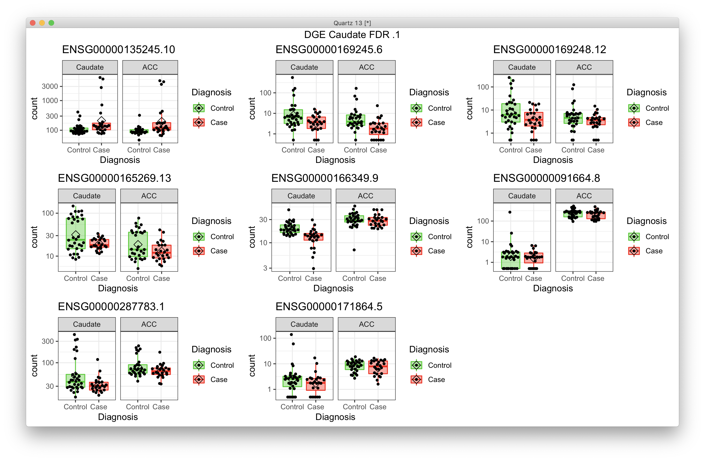

# 2021-04-19 15:25:45

I was reading the main DESeq2 tutorial, as well as the man page for results(),
and it made me wonder if I cannot get a better result if I model both Caudate
and ACC together.

```r
add_cov=NA


data = read.table('~/data/rnaseq_derek/adhd_rnaseq_counts.txt', header=1)
rownames(data) = data[,1]
data[,1] = NULL
data = round(data)
sub_name = gsub(x=colnames(data), pattern='X', replacement='')
colnames(data) = sub_name
# this is a ACC outlier
data = data[, ! colnames(data) %in% c('68080')]
# this is a repeat for Caudate hbcc 2877, but has more genes with zeros than
# its other replicate
data = data[, ! colnames(data) %in% c('66552')]

library(gdata)
df = read.xls('~/data/post_mortem/POST_MORTEM_META_DATA_JAN_2021.xlsx')
data = data[, colnames(data) %in% df$submitted_name]
df = df[df$submitted_name %in% colnames(data), ]
df = df[order(df$submitted_name), ]
data = data[, order(df$submitted_name)]

# cleaning up some variables
df$Individual = factor(df$hbcc_brain_id)
df[df$Manner.of.Death=='Suicide (probable)', 'Manner.of.Death'] = 'Suicide'
df[df$Manner.of.Death=='unknown', 'Manner.of.Death'] = 'natural'
df$MoD = factor(df$Manner.of.Death)
df$Sex = factor(df$Sex)
df$batch = factor(df$batch)
df$run_date = factor(gsub(df$run_date, pattern='-', replacement=''))
df$Diagnosis = factor(df$Diagnosis, levels=c('Control', 'Case'))
df$Region = factor(df$Region, levels=c('Caudate', 'ACC'))
df$substance_group = factor(df$substance_group)
df$comorbid_group = factor(df$comorbid_group_update)
df$evidence_level = factor(df$evidence_level)
df$brainbank = factor(df$bainbank)
# replace the one subject missing population PCs by the median of their
# self-declared race and ethnicity
idx = (df$Race.x=='White' & df$Ethnicity.x=='Non-Hispanic' & !is.na(df$C1))
pop_pcs = c('C1', 'C2', 'C3', 'C4', 'C5')
med_pop = apply(df[idx, pop_pcs], 2, median)
df[which(is.na(df$C1)), pop_pcs] = med_pop
                                            
library(GenomicFeatures)
txdb <- loadDb('~/data/post_mortem/Homo_sapies.GRCh38.97.sqlite')
txdf <- select(txdb, keys(txdb, "GENEID"), columns=c('GENEID','TXCHROM'),
            "GENEID")
bt = read.csv('~/data/post_mortem/Homo_sapiens.GRCh38.97_biotypes.csv')
bt_slim = bt[, c('gene_id', 'gene_biotype')]
bt_slim = bt_slim[!duplicated(bt_slim),]
txdf = merge(txdf, bt_slim, by.x='GENEID', by.y='gene_id')
tx_meta = data.frame(GENEID = substr(rownames(data), 1, 15))
tx_meta = merge(tx_meta, txdf, by='GENEID', sort=F)
imautosome = which(tx_meta$TXCHROM != 'X' &
                tx_meta$TXCHROM != 'Y' &
                tx_meta$TXCHROM != 'MT')
data = data[imautosome, ]
tx_meta = tx_meta[imautosome, ]

library("DESeq2")
dds <- DESeqDataSetFromMatrix(countData = data,
                            colData = df,
                            design = ~ Diagnosis)
# don't allow genes with more zeros than the subjects in smallest group
min_subjs = min(table(df$Diagnosis))
keep <- rowSums(counts(dds) == 0) <= min_subjs
dds <- dds[keep,]

dds = DESeq(dds)
norm.cts <- counts(dds, normalized=TRUE)
library(sva)
mm <- model.matrix(~ Region + Diagnosis + Region:Diagnosis, colData(dds))
mm0 <- model.matrix(~ 1, colData(dds))
fit <- svaseq(norm.cts, mod=mm, mod0=mm0, n.sv=2)

ddssva <- dds
fm_str = '~ '
for (s in 1:ncol(fit$sv)) {
    eval(parse(text=sprintf('ddssva$SV%d <- fit$sv[,%d]', s, s)))
    fm_str = sprintf('%s + SV%d', fm_str, s)
}

if (is.na(add_cov)) {
    fm_str = sprintf('%s + Region + Diagnosis + Region:Diagnosis', fm_str)
} else {
    fm_str = sprintf('%s + %s + Region + Diagnosis + Region:Diagnosis',
    fm_str, add_cov)
}
design(ddssva) = as.formula(fm_str)
ddssva = DESeq(ddssva)

library(edgeR)
design = model.matrix(as.formula(fm_str), data=colData(ddssva))
isexpr <- filterByExpr(ddssva, design=design)
ddsexpr = ddssva[isexpr,]

nOutliers = Inf
mydds = ddsexpr
while (nOutliers > 0) {
    cat('Processing', nrow(mydds), 'variables.\n')
    mydds <- DESeq(mydds)
    maxCooks <- apply(assays(mydds)[["cooks"]], 1, max)
    # outlier cut-off uses the 99% quantile of the F(p,m-p) distribution (with 
    # p the number of parameters including the intercept and m number of
    # samples).
    m <- ncol(mydds)
    # number or parameters (SVs + Diagnosis + intercept)
    p <- ncol(design)
    if (! is.na(add_cov)) {
        p = p + 1 # add one more to the terms above
    }
    co = qf(.99, p, m - p)
    keep_me = which(maxCooks < co)
    nOutliers = nrow(mydds) - length(keep_me)
    cat('Found', nOutliers, 'outliers.\n')
    mydds = mydds[keep_me, ]
}

resultsNames(mydds)
# the condition effect for Caudate (the main effect, reference level)
results(mydds, contrast=c("Diagnosis","Case","Control"))

# the condition effect for ACC
# this is, by definition, the main effect *plus* the interaction term
# (the extra condition effect in ACC compared to Caudate). 
results(mydds, list( c("Diagnosis_Case_vs_Control", "RegionACC.DiagnosisCase") ))

# the interaction term, answering: is the Case effect *different* across regions?
results(mydds, name="RegionACC.DiagnosisCase")

dds_2sv = mydds

# ...

dds_autosv = mydds

save(dds_2sv, dds_autosv, file='~/data/post_mortem/both_regions.RData')
```

I then created the same as above, but with the auto SV, which gave me 17 SVs.
That might be too much, but we'll see how the results look.

Let me first check the developmental sets:

```r
library(WebGestaltR)

data_dir = '~/data/post_mortem/'
ncpu=7

for (region in c('ACC', 'Caudate')) {
    if (region == 'ACC') {
        res = results(dds_autosv,
                      list(c("Diagnosis_Case_vs_Control",
                             "RegionACC.DiagnosisCase"))) }
    else {
        res = results(dds_autosv, contrast=c("Diagnosis","Case","Control"))
    }
    
    ranks = -log(res$pvalue) * sign(res$log2FoldChange)
    geneid = substring(rownames(res), 1, 15)
    
    tmp2 = data.frame(geneid=geneid, rank=ranks)
    tmp2 = tmp2[order(ranks, decreasing=T),]

    res_str = sprintf('WG25_DGE_%s_skinny', region)
    DBs = c('my_%s_sets', '%s_developmental', '%s_developmental_noOverlap',
            '%s_manySets', '%s_manySets_co0.950', '%s_manySets_co0.990',
            '%s_noOverlap')
    for (db in DBs) {
        db2 = sprintf(db, tolower(region))
        cat(res_str, db2, '\n')
        db_file = sprintf('~/data/post_mortem/%s.gmt', db2)
        project_name = sprintf('%s_%s_10K', res_str, db2)
        enrichResult <- try(WebGestaltR(enrichMethod="GSEA",
                            organism="hsapiens",
                            enrichDatabaseFile=db_file,
                            enrichDatabaseType="genesymbol",
                            interestGene=tmp2,
                            outputDirectory = data_dir,
                            interestGeneType="ensembl_gene_id",
                            sigMethod="top", topThr=20,
                            minNum=3, projectName=project_name,
                            isOutput=T, isParallel=T,
                            nThreads=ncpu, perNum=10000, maxNum=800))
    }
}
```

I did WG24 for dds_2sv and WG25 for dds_autosv.

Let's also plot what's going on for individual results.

```r
plot_volcano = function(res, t_str, pCutoff = 0.05) {
    library(EnhancedVolcano)
    quartz()
    res = res[order(res$pvalue), ]
    FCcutoff = 1.0
    # if we have significant FDR, find it
    sigPs = sum(res$padj <= pCutoff, na.rm=T)
    if (sigPs > 0) {
        ps = -log10(res$pvalue)
        nomPcutoff = ps[sigPs + 1] + (ps[sigPs] - ps[sigPs + 1]) / 2
        nomPcutoff = 10 ** (-nomPcutoff)
    } else {
        nomPcutoff = NA
    }
    print(sigPs)
    p = EnhancedVolcano(data.frame(res), lab = rownames(res),
                        x = 'log2FoldChange',
                        y = 'pvalue', xlab = bquote(~Log[2]~ 'fold change'),
                        selectLab = rownames(res)[res$padj < pCutoff],
                        ylab = bquote(~-Log[10]~italic(P)),
                        ylim = c(0, ceiling(max(-log10(res$pvalue)))),
                        pCutoff = nomPcutoff,
                        FCcutoff = FCcutoff, pointSize = 1.0,
                        labSize = 2.0, title = "Volcano plot",
                        subtitle = t_str,
                        caption = paste0('log2 FC cutoff: ', FCcutoff,
                                        '; p-value cutoff: ', pCutoff,
                                        '\nTotal = ', nrow(res), ' variables'),
                        legendPosition = 'bottom', legendLabSize = 10,
                        legendIconSize = 4.0)
    print(p)
}

plot_expression = function(gene_ids, dds, t_str) {
    library(ggpubr)
    library(ggbeeswarm)
    quartz()
    myplots = list()
    clrs = c("green3", "red")
    for (g in 1:length(gene_ids)) {
        cat(gene_ids[g], '\n')
        d <- plotCounts(dds, gene=gene_ids[g], intgroup=c('Diagnosis', 'Region'),
                        returnData=TRUE)
        p = (ggplot(d, aes(x=Diagnosis, y=count, color = Diagnosis,
                        fill = Diagnosis)) + 
            scale_y_log10() + facet_wrap(~Region) + 
            geom_boxplot(alpha = 0.4, outlier.shape = NA, width = 0.8,
                        lwd = 0.5) +
            stat_summary(fun = mean, geom = "point", color = "black",
                        shape = 5, size = 3,
                        position=position_dodge(width = 0.8)) +
            scale_color_manual(values = clrs) +
            scale_fill_manual(values = clrs) +
            geom_quasirandom(color = "black", size = 1, dodge.width = 0.8) +
            theme_bw() +
            ggtitle(gene_ids[g]))
        myplots[[g]] = p
    }
    p = ggarrange(plotlist=myplots)
    print(annotate_figure(p, t_str))
}
```

## 2sv

```r
res_cau = results(dds_2sv, contrast=c("Diagnosis","Case","Control"))
res_acc = results(dds_2sv, list(c("Diagnosis_Case_vs_Control",
                                  "RegionACC.DiagnosisCase")))
res_diff = results(dds_2sv, name="RegionACC.DiagnosisCase")
plot_volcano(res_acc, 'ACC 2sv', pCutoff = 0.1)
plot_volcano(res_cau, 'Caudate 2sv', pCutoff = 0.1)
plot_volcano(res_diff, 'Diff 2sv', pCutoff = 0.1)

library(IHW)
res_cauIHW = results(dds_2sv, contrast=c("Diagnosis","Case","Control"),
                     filterFun=ihw)
res_accIHW = results(dds_2sv, list(c("Diagnosis_Case_vs_Control",
                                     "RegionACC.DiagnosisCase")), filterFun=ihw)
res_diffIHW = results(dds_2sv, name="RegionACC.DiagnosisCase", filterFun=ihw)
```


Plotting the IHW results is a bit harder because the nominal o-value is not
necessarily the best. But while I get 0, 10, and 2 significant q < .1 using FDR,
I get 9, 10, and 2 with IHW. We just need to see if they're real:

```r
my_genes = rownames(res_accIHW)[res_accIHW$padj < .1]
plot_expression(my_genes, acc_p1$dds, 'DGE ACC IHW .1')
```

## auto-SV

```r
res_cau = results(dds_autosv, contrast=c("Diagnosis","Case","Control"))
res_acc = results(dds_autosv, list(c("Diagnosis_Case_vs_Control",
                                  "RegionACC.DiagnosisCase")))
res_diff = results(dds_autosv, name="RegionACC.DiagnosisCase")
plot_volcano(res_acc, 'ACC autosv', pCutoff = 0.1)
plot_volcano(res_cau, 'Caudate autosv', pCutoff = 0.1)
plot_volcano(res_diff, 'Diff autosv', pCutoff = 0.1)

library(IHW)
res_cauIHW = results(dds_autosv, contrast=c("Diagnosis","Case","Control"),
                     filterFun=ihw)
res_accIHW = results(dds_autosv, list(c("Diagnosis_Case_vs_Control",
                                     "RegionACC.DiagnosisCase")), filterFun=ihw)
res_diffIHW = results(dds_autosv, name="RegionACC.DiagnosisCase", filterFun=ihw)
```


While with FDR at q < .1 I got, 22, 12, 0 (ACC, Caudate, Diff), with IHW I get
21, 9, and 0.

What if I put our usual covariates there, but no SVA? The thing with SVa is that
it will pull SVs related to batch. If we are adding batch and other stuff, then
it doesn't make much sense to compute SVs. If we do, we need to first remove batch.

```r
data = read.table('~/data/rnaseq_derek/adhd_rnaseq_counts.txt', header=1)
rownames(data) = data[,1]
data[,1] = NULL
data = round(data)
sub_name = gsub(x=colnames(data), pattern='X', replacement='')
colnames(data) = sub_name
# this is a ACC outlier
data = data[, ! colnames(data) %in% c('68080')]
# this is a repeat for Caudate hbcc 2877, but has more genes with zeros than
# its other replicate
data = data[, ! colnames(data) %in% c('66552')]

library(gdata)
df = read.xls('~/data/post_mortem/POST_MORTEM_META_DATA_JAN_2021.xlsx')
data = data[, colnames(data) %in% df$submitted_name]
df = df[df$submitted_name %in% colnames(data), ]
df = df[order(df$submitted_name), ]
data = data[, order(df$submitted_name)]

# cleaning up some variables
df$Individual = factor(df$hbcc_brain_id)
df[df$Manner.of.Death=='Suicide (probable)', 'Manner.of.Death'] = 'Suicide'
df[df$Manner.of.Death=='unknown', 'Manner.of.Death'] = 'natural'
df$MoD = factor(df$Manner.of.Death)
df$Sex = factor(df$Sex)
df$batch = factor(df$batch)
df$run_date = factor(gsub(df$run_date, pattern='-', replacement=''))
df$Diagnosis = factor(df$Diagnosis, levels=c('Control', 'Case'))
df$Region = factor(df$Region, levels=c('Caudate', 'ACC'))
df$substance_group = factor(df$substance_group)
df$comorbid_group = factor(df$comorbid_group_update)
df$evidence_level = factor(df$evidence_level)
df$brainbank = factor(df$bainbank)
# replace the one subject missing population PCs by the median of their
# self-declared race and ethnicity
idx = (df$Race.x=='White' & df$Ethnicity.x=='Non-Hispanic' & !is.na(df$C1))
pop_pcs = c('C1', 'C2', 'C3', 'C4', 'C5')
med_pop = apply(df[idx, pop_pcs], 2, median)
df[which(is.na(df$C1)), pop_pcs] = med_pop
df$BBB = factor(sapply(1:nrow(df),
                        function(x) sprintf('%s_%s',
                                    as.character(df[x,'brainbank']),
                                    as.character(df[x, 'batch']))))
                                            
library(GenomicFeatures)
txdb <- loadDb('~/data/post_mortem/Homo_sapies.GRCh38.97.sqlite')
txdf <- select(txdb, keys(txdb, "GENEID"), columns=c('GENEID','TXCHROM'),
            "GENEID")
bt = read.csv('~/data/post_mortem/Homo_sapiens.GRCh38.97_biotypes.csv')
bt_slim = bt[, c('gene_id', 'gene_biotype')]
bt_slim = bt_slim[!duplicated(bt_slim),]
txdf = merge(txdf, bt_slim, by.x='GENEID', by.y='gene_id')
tx_meta = data.frame(GENEID = substr(rownames(data), 1, 15))
tx_meta = merge(tx_meta, txdf, by='GENEID', sort=F)
imautosome = which(tx_meta$TXCHROM != 'X' &
                tx_meta$TXCHROM != 'Y' &
                tx_meta$TXCHROM != 'MT')
data = data[imautosome, ]
tx_meta = tx_meta[imautosome, ]

library("DESeq2")
dds <- DESeqDataSetFromMatrix(countData = data,
                            colData = df,
                            design = ~ Diagnosis)
# don't allow genes with more zeros than the subjects in smallest group
min_subjs = min(table(df$Diagnosis))
keep <- rowSums(counts(dds) == 0) <= min_subjs
dds <- dds[keep,]

dds = DESeq(dds)
norm.cts <- counts(dds, normalized=TRUE)
library(sva)
base_model = '~ BBB + Age + Sex + C1 + C2 + C3 + RINe + PMI'
mm <- model.matrix(as.formula(sprintf('%s + Region + Diagnosis + Region:Diagnosis',
                           base_model)), colData(dds))
mm0 <- model.matrix(as.formula(base_model), colData(dds))
fit <- svaseq(norm.cts, mod=mm, mod0=mm0, n.sv=NULL)
```

No, that's nuts. It estimated 20 additional SVs. Let's not do that. Let's see
what we get without SVA first:

```r
num_vars = c('pcnt_optical_duplicates', 'clusters', 'Age', 'RINe', 'PMI',
                'C1', 'C2', 'C3', 'C4', 'C5')
for (var in num_vars) {
    df[, var] = scale(df[, var])
}
library("DESeq2")
fm_str = '~ BBB + Age + Sex + C1 + C2 + C3 + RINe + PMI + Region + Diagnosis + Region:Diagnosis'
dds <- DESeqDataSetFromMatrix(countData = data,
                            colData = df,
                            design = as.formula(fm_str))
# don't allow genes with more zeros than the subjects in smallest group
min_subjs = min(table(df$Diagnosis))
keep <- rowSums(counts(dds) == 0) <= min_subjs
dds <- dds[keep,]
dds = DESeq(dds)

library(edgeR)
design = model.matrix(as.formula(fm_str), data=colData(dds))
isexpr <- filterByExpr(dds, design=design)
ddsexpr = dds[isexpr,]

nOutliers = Inf
mydds = ddsexpr
while (nOutliers > 0) {
    cat('Processing', nrow(mydds), 'variables.\n')
    mydds <- DESeq(mydds)
    maxCooks <- apply(assays(mydds)[["cooks"]], 1, max)
    # outlier cut-off uses the 99% quantile of the F(p,m-p) distribution (with 
    # p the number of parameters including the intercept and m number of
    # samples).
    m <- ncol(mydds)
    # number or parameters (SVs + Diagnosis + intercept)
    p <- ncol(design)
    co = qf(.99, p, m - p)
    keep_me = which(maxCooks < co)
    nOutliers = nrow(mydds) - length(keep_me)
    cat('Found', nOutliers, 'outliers.\n')
    mydds = mydds[keep_me, ]
}
dds_fixed = mydds

save(dds_fixed, file='~/data/post_mortem/both_regions2.RData')
```

```r
res_cau = results(dds_fixed, contrast=c("Diagnosis","Case","Control"))
res_acc = results(dds_fixed, list(c("Diagnosis_Case_vs_Control",
                                  "RegionACC.DiagnosisCase")))
res_diff = results(dds_fixed, name="RegionACC.DiagnosisCase")
plot_volcano(res_acc, 'ACC fixed', pCutoff = 0.1)
plot_volcano(res_cau, 'Caudate fixed', pCutoff = 0.1)
plot_volcano(res_diff, 'Diff fixed', pCutoff = 0.1)

library(IHW)
res_cauIHW = results(dds_fixed, contrast=c("Diagnosis","Case","Control"),
                     filterFun=ihw)
res_accIHW = results(dds_fixed, list(c("Diagnosis_Case_vs_Control",
                                     "RegionACC.DiagnosisCase")), filterFun=ihw)
res_diffIHW = results(dds_fixed, name="RegionACC.DiagnosisCase", filterFun=ihw)
```


Now I get absolutely nothing in either FDR or IHW. Not sur eif this is the best
route.


That's the plot_expression for res_diff... there's still some zero corruption. I
probably need to go back to the old filtering based on percentage of the data.

# 2021-04-20 06:13:33

Let's take a step back, and do pcaexplorer on the whole dataset. Is it true that
Region and batch drive the variance?

```r
data = read.table('~/data/rnaseq_derek/adhd_rnaseq_counts.txt', header=1)
rownames(data) = data[,1]
data[,1] = NULL
data = round(data)
sub_name = gsub(x=colnames(data), pattern='X', replacement='')
colnames(data) = sub_name
# this is a ACC outlier
data = data[, ! colnames(data) %in% c('68080')]
# this is a repeat for Caudate hbcc 2877, but has more genes with zeros than
# its other replicate
data = data[, ! colnames(data) %in% c('66552')]

library(gdata)
df = read.xls('~/data/post_mortem/POST_MORTEM_META_DATA_JAN_2021.xlsx')
data = data[, colnames(data) %in% df$submitted_name]
df = df[df$submitted_name %in% colnames(data), ]
df = df[order(df$submitted_name), ]
data = data[, order(df$submitted_name)]

# cleaning up some variables
df$Individual = factor(df$hbcc_brain_id)
df[df$Manner.of.Death=='Suicide (probable)', 'Manner.of.Death'] = 'Suicide'
df[df$Manner.of.Death=='unknown', 'Manner.of.Death'] = 'natural'
df$MoD = factor(df$Manner.of.Death)
df$Sex = factor(df$Sex)
df$batch = factor(df$batch)
df$run_date = factor(gsub(df$run_date, pattern='-', replacement=''))
df$Diagnosis = factor(df$Diagnosis, levels=c('Control', 'Case'))
df$Region = factor(df$Region, levels=c('Caudate', 'ACC'))
df$substance_group = factor(df$substance_group)
df$comorbid_group = factor(df$comorbid_group_update)
df$evidence_level = factor(df$evidence_level)
df$brainbank = factor(df$bainbank)
# replace the one subject missing population PCs by the median of their
# self-declared race and ethnicity
idx = (df$Race.x=='White' & df$Ethnicity.x=='Non-Hispanic' & !is.na(df$C1))
pop_pcs = c('C1', 'C2', 'C3', 'C4', 'C5')
med_pop = apply(df[idx, pop_pcs], 2, median)
df[which(is.na(df$C1)), pop_pcs] = med_pop
df$BBB = factor(sapply(1:nrow(df),
                        function(x) sprintf('%s_%s',
                                    as.character(df[x,'brainbank']),
                                    as.character(df[x, 'batch']))))
                                            
library(GenomicFeatures)
txdb <- loadDb('~/data/post_mortem/Homo_sapies.GRCh38.97.sqlite')
txdf <- select(txdb, keys(txdb, "GENEID"), columns=c('GENEID','TXCHROM'),
            "GENEID")
bt = read.csv('~/data/post_mortem/Homo_sapiens.GRCh38.97_biotypes.csv')
bt_slim = bt[, c('gene_id', 'gene_biotype')]
bt_slim = bt_slim[!duplicated(bt_slim),]
txdf = merge(txdf, bt_slim, by.x='GENEID', by.y='gene_id')
tx_meta = data.frame(GENEID = substr(rownames(data), 1, 15))
tx_meta = merge(tx_meta, txdf, by='GENEID', sort=F)
imautosome = which(tx_meta$TXCHROM != 'X' &
                tx_meta$TXCHROM != 'Y' &
                tx_meta$TXCHROM != 'MT')
data = data[imautosome, ]
tx_meta = tx_meta[imautosome, ]

library("DESeq2")
dds <- DESeqDataSetFromMatrix(countData = data,
                            colData = df,
                            design = ~ Diagnosis)
# don't allow genes with more zeros than the subjects in smallest group
min_subjs = min(table(df$Diagnosis, df$Region))
keep <- rowSums(counts(dds) == 0) <= min_subjs
dds <- dds[keep,]
dds = DESeq(dds)

library(pcaExplorer)
pcaExplorer(dds = dds)
```


I'm actually gonna change the code to do the min of the table with Region in it.
Does it change the plot?


It doesn't, which makes sense as the plot only takes the 300 most variant genes.
But let's remove those samples that look like outliers:

```r
# outliers based on PCA plots
outliers = c('68096', '68108', '68084', '68082')
data = data[, ! colnames(data) %in% outliers]
df = df[df$submitted_name %in% colnames(data), ]
dds <- DESeqDataSetFromMatrix(countData = data,
                            colData = df,
                            design = ~ Diagnosis)
min_subjs = min(table(df$Diagnosis, df$Region))
keep <- rowSums(counts(dds) == 0) <= min_subjs
dds <- dds[keep,]
dds = DESeq(dds)
pcaExplorer(dds = dds)
```


Batch 3 has clearly more reads across samples.

Knowing that PC1 is clearly Region, let's plot PC2 and PC3 instead:


Maybe the best approach here is to just run batch, as we can see its clear
influence on reads, and then see if adding any other covariates makes a
difference.

OK, let's try for the nested model. Following their example, group is Diagnosis,
ind is hbcc_brain_id, and cnd is Region. I'l also add batch to it, based on our
plots above. But actually that won't work too well, because I can only get
group-specific condition effects. In other words, I can only get the condition
ACC vs Caudate effect for group ADHD samples, and likewise for group Control
samples. Or I could test if the condition ACC vs Caudate effect is different
across groups. But I couldn't test anything else. Based on this:
https://support.bioconductor.org/p/118077/, I cannot estimate the treatment
(group) effect and simultaneously control for Region (condition), because those
are directly confounded. I'd have to use the duplicateCorrelation approach to also
perform that comparison.

Let's for now ignore that and see if we can have some interesting results
without taking into account the nested aspect:

```r
library("DESeq2")
outliers = c('68096', '68108', '68084', '68082')
data = data[, ! colnames(data) %in% outliers]
df = df[df$submitted_name %in% colnames(data), ]
fm_str = '~ batch + Region + Diagnosis + Region:Diagnosis'
dds <- DESeqDataSetFromMatrix(countData = data,
                              colData = df,
                              design = as.formula(fm_str))
# don't allow genes with more zeros than the subjects in smallest group
min_subjs = min(table(df$Diagnosis, df$Region))
keep <- rowSums(counts(dds) == 0) <= min_subjs
dds <- dds[keep,]
dds = DESeq(dds)
```

Let's try it without edgeR filtering first:

```r
res_cau = results(dds, contrast=c("Diagnosis","Case","Control"))
res_acc = results(dds, list(c("Diagnosis_Case_vs_Control",
                                  "RegionACC.DiagnosisCase")))
res_diff = results(dds, name="RegionACC.DiagnosisCase")
plot_volcano(res_acc, 'ACC fixed', pCutoff = 0.1)
plot_volcano(res_cau, 'Caudate fixed', pCutoff = 0.1)
plot_volcano(res_diff, 'Diff fixed', pCutoff = 0.1)

library(IHW)
res_cauIHW = results(dds, contrast=c("Diagnosis","Case","Control"),
                     filterFun=ihw)
res_accIHW = results(dds, list(c("Diagnosis_Case_vs_Control",
                                     "RegionACC.DiagnosisCase")), filterFun=ihw)
res_diffIHW = results(dds, name="RegionACC.DiagnosisCase", filterFun=ihw)
```

We got 3, 5, and 0 for FDR q < .1, and 10, 4, and 0 for IHW. Are zeros
corrupting this?

```r
res = res_acc
res = res[order(res$pvalue),]
my_genes = rownames(res)[which(res$padj < .1)]
plot_expression(my_genes, dds, 'DGE ACC FDR .1')
```


We're still seeing more contributions from low-counting genes than I'd like to.
I'll have to either using edgeR filtering and/or increase my threshold for
allowing zeros.

```r
library(edgeR)
design = model.matrix(as.formula(fm_str), data=colData(dds))
isexpr <- filterByExpr(dds, design=design)
ddsexpr = dds[isexpr,]
ddsexpr = DESeq(ddsexpr)

res_cau = results(ddsexpr, contrast=c("Diagnosis","Case","Control"))
res_acc = results(ddsexpr, list(c("Diagnosis_Case_vs_Control",
                                  "RegionACC.DiagnosisCase")))
res_diff = results(ddsexpr, name="RegionACC.DiagnosisCase")
plot_volcano(res_acc, 'ACC fixed', pCutoff = 0.1)
plot_volcano(res_cau, 'Caudate fixed', pCutoff = 0.1)
plot_volcano(res_diff, 'Diff fixed', pCutoff = 0.1)
res_cauIHW = results(ddsexpr, contrast=c("Diagnosis","Case","Control"),
                     filterFun=ihw)
res_accIHW = results(ddsexpr, list(c("Diagnosis_Case_vs_Control",
                                     "RegionACC.DiagnosisCase")), filterFun=ihw)
res_diffIHW = results(ddsexpr, name="RegionACC.DiagnosisCase", filterFun=ihw)
```

Now we have 3, 8, and 0 for FDR q < .1, and 10, 8, and 0 for IHW. Are zeros
corrupting this now?

```r
res = res_acc
res = res[order(res$pvalue),]
my_genes = rownames(res)[which(res$padj < .1)]
plot_expression(my_genes, dds, 'DGE ACC FDR .1')
```




Yeah, that seems to be true for a few instances of Caudate. I might need to look
into the densities here.


# TODO
 * plot densities again?
 * Go back to limma?
 * if we get good results without nesting subjects, maybe we could just run the
   same code within brain region and check the similarity of results?
 * maybe blend SV approach with correlations? Keeping up to last SV that's
   correlated with one of our metrics? +1 in case we didn't measure something?
 * add our usual covariates?
 * plot_expression is fixed... use it to plot each result and see which ones
   makes more sense
 * see if we can run GSEA for dev sets in diff
 * use just batch, instead of BBB?
 * check what the SVs are measuring
 * split gene types?
 * re-run 2sv model correcting the calculation of parameters for outliers

# USeful links
 * https://academic.oup.com/biostatistics/article/17/1/29/1744261