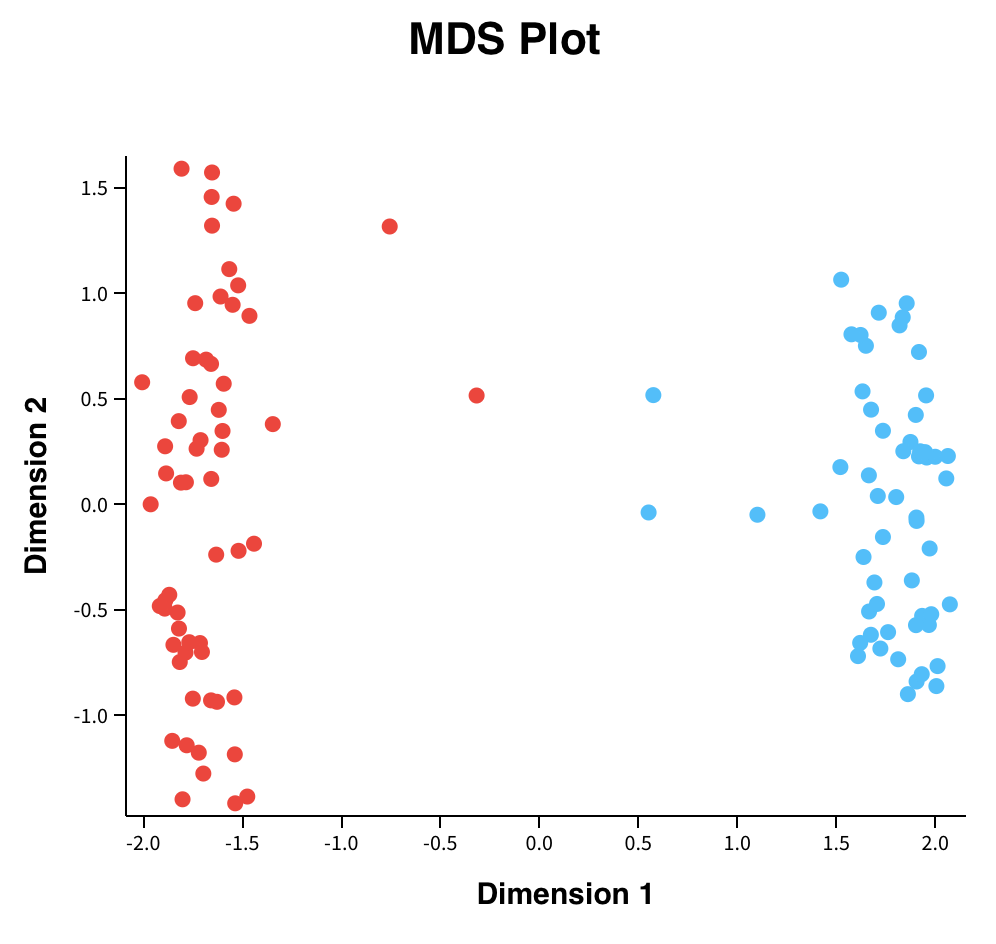
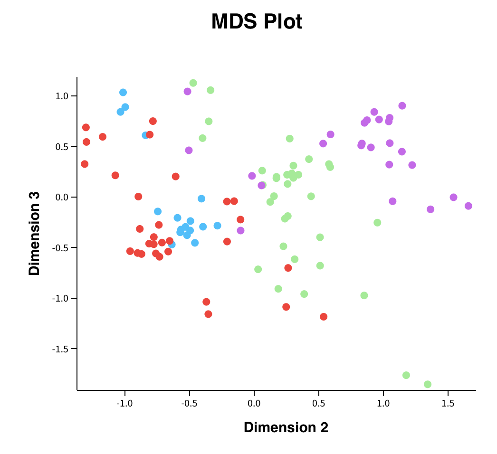
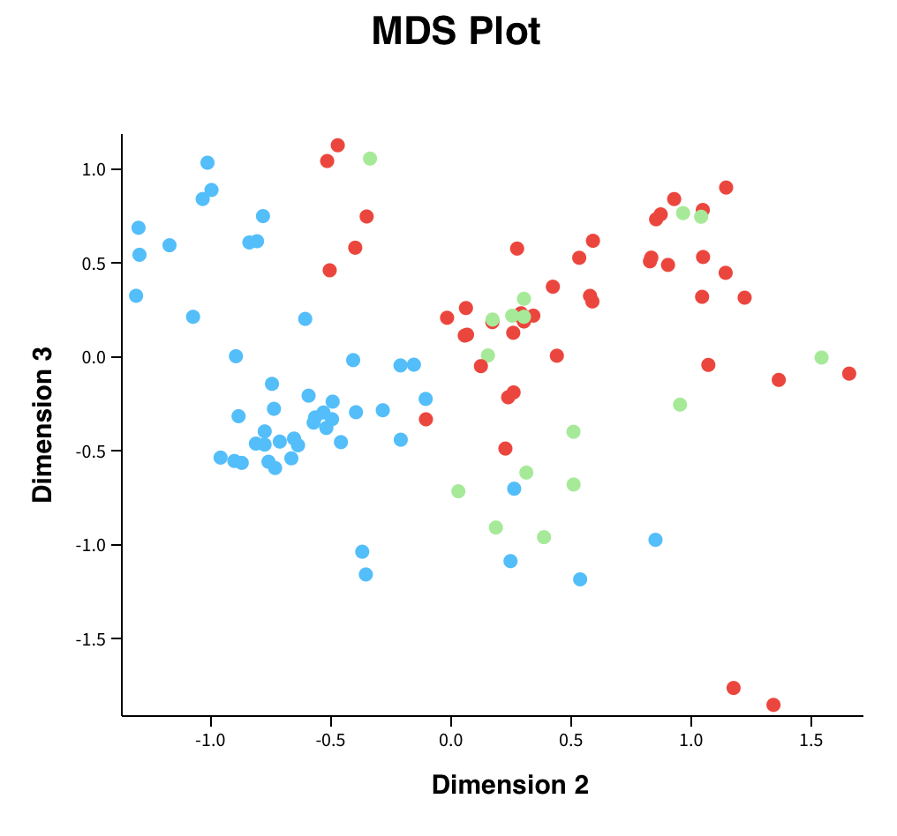
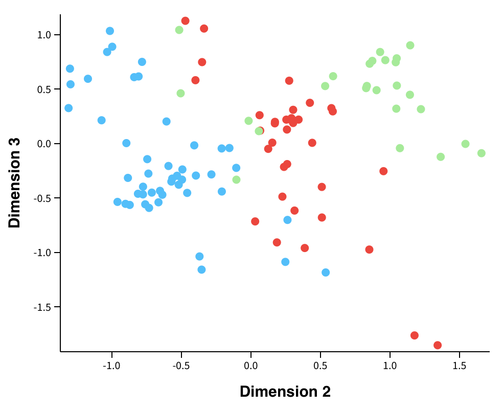
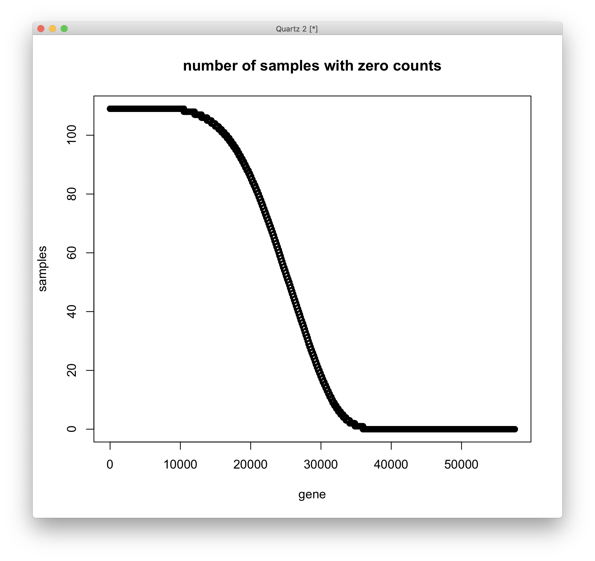
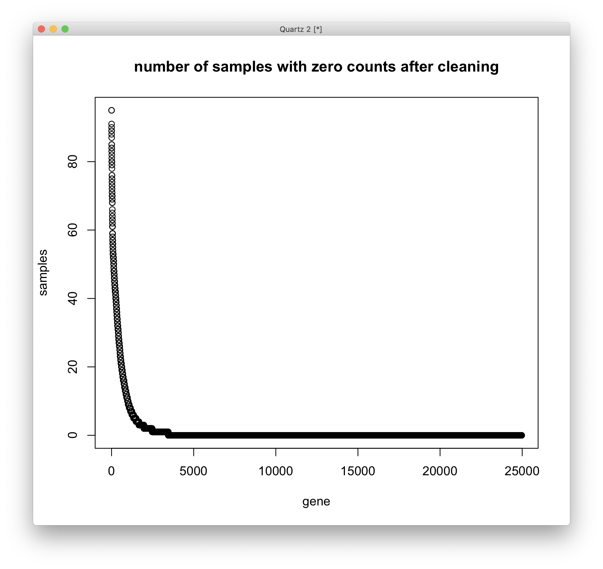
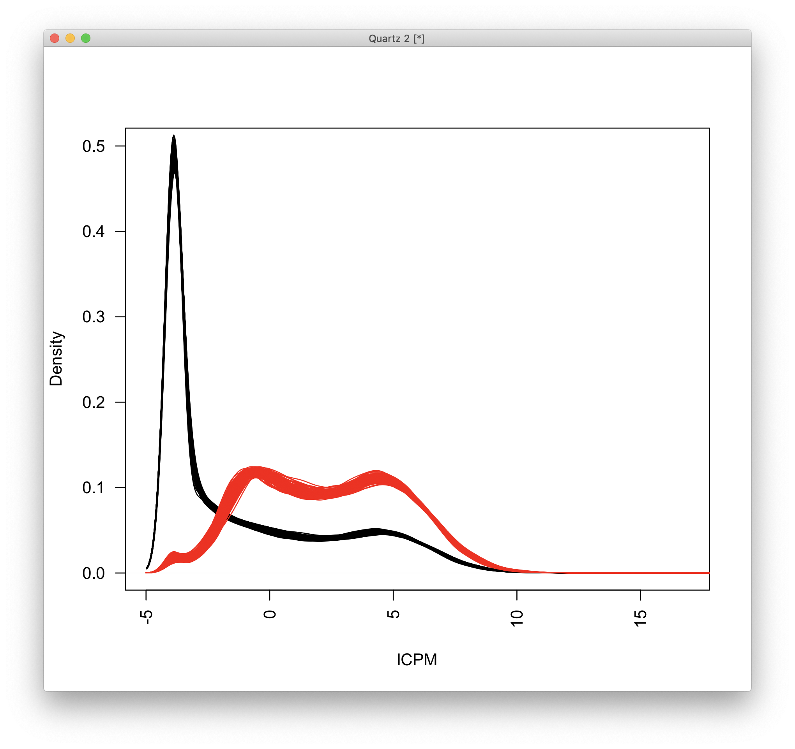

# 2021-04-20 11:04:10

I just want to circle back to limma to see if running dupCor might make sense
here. First, a few good sources:

* https://www.biostars.org/p/54565/
* https://bioconductor.org/packages/release/bioc/vignettes/limma/inst/doc/usersguide.pdf
* https://support.bioconductor.org/p/59700/

In particular, I'll be mostly using the same design as the multi-level
experiment from section 9.7 of the manual. This one was also useful to
understand the contrasts:

 * https://support.bioconductor.org/p/69328/

```r
data = read.table('~/data/rnaseq_derek/adhd_rnaseq_counts.txt', header=1)
rownames(data) = data[,1]
data[,1] = NULL
data = round(data)
sub_name = gsub(x=colnames(data), pattern='X', replacement='')
colnames(data) = sub_name
# this is a ACC outlier
data = data[, ! colnames(data) %in% c('68080')]
# this is a repeat for Caudate hbcc 2877, but has more genes with zeros than
# its other replicate
data = data[, ! colnames(data) %in% c('66552')]
# outliers based on PCA plots
outliers = c('68096', '68108', '68084', '68082')
data = data[, ! colnames(data) %in% outliers]

library(gdata)
df = read.xls('~/data/post_mortem/POST_MORTEM_META_DATA_JAN_2021.xlsx')
data = data[, colnames(data) %in% df$submitted_name]
df = df[df$submitted_name %in% colnames(data), ]
df = df[order(df$submitted_name), ]
data = data[, order(df$submitted_name)]

# cleaning up some variables
df$Individual = factor(df$hbcc_brain_id)
df[df$Manner.of.Death=='Suicide (probable)', 'Manner.of.Death'] = 'Suicide'
df[df$Manner.of.Death=='unknown', 'Manner.of.Death'] = 'natural'
df$MoD = factor(df$Manner.of.Death)
df$Sex = factor(df$Sex)
df$batch = factor(df$batch)
df$run_date = factor(gsub(df$run_date, pattern='-', replacement=''))
df$Diagnosis = factor(df$Diagnosis, levels=c('Control', 'Case'))
df$Region = factor(df$Region, levels=c('Caudate', 'ACC'))
df$substance_group = factor(df$substance_group)
df$comorbid_group = factor(df$comorbid_group_update)
df$evidence_level = factor(df$evidence_level)
df$brainbank = factor(df$bainbank)
# replace the one subject missing population PCs by the median of their
# self-declared race and ethnicity
idx = (df$Race.x=='White' & df$Ethnicity.x=='Non-Hispanic' & !is.na(df$C1))
pop_pcs = c('C1', 'C2', 'C3', 'C4', 'C5')
med_pop = apply(df[idx, pop_pcs], 2, median)
df[which(is.na(df$C1)), pop_pcs] = med_pop
df$BBB = factor(sapply(1:nrow(df),
                        function(x) sprintf('%s_%s',
                                    as.character(df[x,'brainbank']),
                                    as.character(df[x, 'batch']))))
                                            
library(GenomicFeatures)
txdb <- loadDb('~/data/post_mortem/Homo_sapies.GRCh38.97.sqlite')
txdf <- select(txdb, keys(txdb, "GENEID"), columns=c('GENEID','TXCHROM'),
            "GENEID")
bt = read.csv('~/data/post_mortem/Homo_sapiens.GRCh38.97_biotypes.csv')
bt_slim = bt[, c('gene_id', 'gene_biotype')]
bt_slim = bt_slim[!duplicated(bt_slim),]
txdf = merge(txdf, bt_slim, by.x='GENEID', by.y='gene_id')
tx_meta = data.frame(GENEID = substr(rownames(data), 1, 15))
tx_meta = merge(tx_meta, txdf, by='GENEID', sort=F)
imautosome = which(tx_meta$TXCHROM != 'X' &
                tx_meta$TXCHROM != 'Y' &
                tx_meta$TXCHROM != 'MT')
data = data[imautosome, ]
tx_meta = tx_meta[imautosome, ]

library(limma)
library(edgeR)
# filter genes by number of counts
isexpr = rowSums(cpm(data)>0.1) >= 5
# Standard usage of limma/voom
geneExpr = DGEList( data[isexpr,] )
geneExpr = calcNormFactors( geneExpr )

df$Treat <- factor(paste(df$Diagnosis,df$Region,sep="."))
design <- model.matrix(~0+Treat+batch, data=df)
# apply duplicateCorrelation is two rounds
vobj_tmp = voom( geneExpr, design, plot=FALSE)
dupcor <- duplicateCorrelation(vobj_tmp, design, block=factor(df$hbcc_brain_id))
# run voom considering the duplicateCorrelation results
# in order to compute more accurate precision weights
# Otherwise, use the results from the first voom run
vobj = voom( geneExpr, design, plot=FALSE, block=factor(df$hbcc_brain_id),
             correlation=dupcor$consensus)
# Estimate linear mixed model with a single variance component
# Fit the model for each gene, 
dupcor <- duplicateCorrelation(vobj, design, block=factor(df$hbcc_brain_id))
# But this step uses only the genome-wide average for the random effect
fitDupCor <- lmFit(vobj, design, block=factor(df$hbcc_brain_id),
                   correlation=dupcor$consensus)

cm <- makeContrasts(CasevsControlACC = TreatCase.ACC - TreatControl.ACC,
                    CasevsControlCaudate = TreatCase.Caudate - TreatControl.Caudate,
                    ACCvsCaudateCases = TreatCase.ACC - TreatCase.Caudate,
                    ACCvsCaudateControls = TreatControl.ACC - TreatControl.Caudate,
                    levels=design)
fit2 <- contrasts.fit(fitDupCor, cm)
# Fit Empirical Bayes for moderated t-statistics
fit2 <- eBayes(fit2)
topTable(fit2, coef="CasevsControlACC")
```

OK, this code is working. I just now need to exclude low expressed genes, and
maybe use some density plots, MDS, and IHW.

```r
data = read.table('~/data/rnaseq_derek/adhd_rnaseq_counts.txt', header=1)
rownames(data) = data[,1]
data[,1] = NULL
data = round(data)
sub_name = gsub(x=colnames(data), pattern='X', replacement='')
colnames(data) = sub_name

library(gdata)
df = read.xls('~/data/post_mortem/POST_MORTEM_META_DATA_JAN_2021.xlsx')
data = data[, colnames(data) %in% df$submitted_name]
df = df[df$submitted_name %in% colnames(data), ]
df = df[order(df$submitted_name), ]
data = data[, order(df$submitted_name)]

# cleaning up some variables
df$Individual = factor(df$hbcc_brain_id)
df[df$Manner.of.Death=='Suicide (probable)', 'Manner.of.Death'] = 'Suicide'
df[df$Manner.of.Death=='unknown', 'Manner.of.Death'] = 'natural'
df$MoD = factor(df$Manner.of.Death)
df$Sex = factor(df$Sex)
df$batch = factor(df$batch)
df$run_date = factor(gsub(df$run_date, pattern='-', replacement=''))
df$Diagnosis = factor(df$Diagnosis, levels=c('Control', 'Case'))
df$Region = factor(df$Region, levels=c('Caudate', 'ACC'))
df$substance_group = factor(df$substance_group)
df$comorbid_group = factor(df$comorbid_group_update)
df$evidence_level = factor(df$evidence_level)
df$brainbank = factor(df$bainbank)
# replace the one subject missing population PCs by the median of their
# self-declared race and ethnicity
idx = (df$Race.x=='White' & df$Ethnicity.x=='Non-Hispanic' & !is.na(df$C1))
pop_pcs = c('C1', 'C2', 'C3', 'C4', 'C5')
med_pop = apply(df[idx, pop_pcs], 2, median)
df[which(is.na(df$C1)), pop_pcs] = med_pop
df$BBB = factor(sapply(1:nrow(df),
                        function(x) sprintf('%s_%s',
                                    as.character(df[x,'brainbank']),
                                    as.character(df[x, 'batch']))))
                                            
library(GenomicFeatures)
txdb <- loadDb('~/data/post_mortem/Homo_sapies.GRCh38.97.sqlite')
txdf <- select(txdb, keys(txdb, "GENEID"), columns=c('GENEID','TXCHROM'),
            "GENEID")
bt = read.csv('~/data/post_mortem/Homo_sapiens.GRCh38.97_biotypes.csv')
bt_slim = bt[, c('gene_id', 'gene_biotype')]
bt_slim = bt_slim[!duplicated(bt_slim),]
txdf = merge(txdf, bt_slim, by.x='GENEID', by.y='gene_id')
tx_meta = data.frame(GENEID = substr(rownames(data), 1, 15))
tx_meta = merge(tx_meta, txdf, by='GENEID', sort=F)
imautosome = which(tx_meta$TXCHROM != 'X' &
                tx_meta$TXCHROM != 'Y' &
                tx_meta$TXCHROM != 'MT')
data = data[imautosome, ]
tx_meta = tx_meta[imautosome, ]

library(limma)
library(edgeR)
geneExpr = DGEList(data)
geneExpr = calcNormFactors(geneExpr)
lcpm <- cpm(geneExpr, log=TRUE)
library(Glimma)
glMDSPlot(lcpm, labels=colnames(data), groups=df, launch=T)
```



So MDS gives us the same idea as PCA. Let's remove the outliers:

```r
data = read.table('~/data/rnaseq_derek/adhd_rnaseq_counts.txt', header=1)
rownames(data) = data[,1]
data[,1] = NULL
data = round(data)
sub_name = gsub(x=colnames(data), pattern='X', replacement='')
colnames(data) = sub_name
# this is a repeat for Caudate hbcc 2877, but has more genes with zeros than
# its other replicate
data = data[, ! colnames(data) %in% c('66552')]
# outliers based on PCA plots
outliers = c('68080','68096', '68108', '68084', '68082')
data = data[, ! colnames(data) %in% outliers]

library(gdata)
df = read.xls('~/data/post_mortem/POST_MORTEM_META_DATA_JAN_2021.xlsx')
data = data[, colnames(data) %in% df$submitted_name]
df = df[df$submitted_name %in% colnames(data), ]
df = df[order(df$submitted_name), ]
data = data[, order(df$submitted_name)]

# cleaning up some variables
df$Individual = factor(df$hbcc_brain_id)
df[df$Manner.of.Death=='Suicide (probable)', 'Manner.of.Death'] = 'Suicide'
df[df$Manner.of.Death=='unknown', 'Manner.of.Death'] = 'natural'
df$MoD = factor(df$Manner.of.Death)
df$Sex = factor(df$Sex)
df$batch = factor(df$batch)
df$run_date = factor(gsub(df$run_date, pattern='-', replacement=''))
df$Diagnosis = factor(df$Diagnosis, levels=c('Control', 'Case'))
df$Region = factor(df$Region, levels=c('Caudate', 'ACC'))
df$substance_group = factor(df$substance_group)
df$comorbid_group = factor(df$comorbid_group_update)
df$evidence_level = factor(df$evidence_level)
df$brainbank = factor(df$bainbank)
# replace the one subject missing population PCs by the median of their
# self-declared race and ethnicity
idx = (df$Race.x=='White' & df$Ethnicity.x=='Non-Hispanic' & !is.na(df$C1))
pop_pcs = c('C1', 'C2', 'C3', 'C4', 'C5')
med_pop = apply(df[idx, pop_pcs], 2, median)
df[which(is.na(df$C1)), pop_pcs] = med_pop
df$BBB = factor(sapply(1:nrow(df),
                        function(x) sprintf('%s_%s',
                                    as.character(df[x,'brainbank']),
                                    as.character(df[x, 'batch']))))
                                            
library(GenomicFeatures)
txdb <- loadDb('~/data/post_mortem/Homo_sapies.GRCh38.97.sqlite')
txdf <- select(txdb, keys(txdb, "GENEID"), columns=c('GENEID','TXCHROM'),
            "GENEID")
bt = read.csv('~/data/post_mortem/Homo_sapiens.GRCh38.97_biotypes.csv')
bt_slim = bt[, c('gene_id', 'gene_biotype')]
bt_slim = bt_slim[!duplicated(bt_slim),]
txdf = merge(txdf, bt_slim, by.x='GENEID', by.y='gene_id')
tx_meta = data.frame(GENEID = substr(rownames(data), 1, 15))
tx_meta = merge(tx_meta, txdf, by='GENEID', sort=F)
imautosome = which(tx_meta$TXCHROM != 'X' &
                tx_meta$TXCHROM != 'Y' &
                tx_meta$TXCHROM != 'MT')
data = data[imautosome, ]
tx_meta = tx_meta[imautosome, ]

library(limma)
library(edgeR)
geneExpr = DGEList(data)
geneExpr = calcNormFactors(geneExpr)
lcpm <- cpm(geneExpr, log=TRUE)
library(Glimma)
glMDSPlot(lcpm, labels=colnames(data), groups=df, launch=T)
```

The plot with the first PC doesn't have the outliers anymore.



batch is visible in dimensions 2 and 3.



And so is brainbank. I then created a variable that combines all the nimh
samples into one bucket, and splits the other 2 batches, with makes sense
looking at components 2 and 3:

```r
df$BBB2 = NA                                                                        
df[df$brainbank=='nimh_hbcc', 'BBB2'] = 1                                           
df[df$batch==3, 'BBB2'] = 2                                                         
df[df$batch==4, 'BBB2'] = 3      
df$BBB2 = factor(df$BBB2)                                                   
glMDSPlot(lcpm, labels=colnames(data), groups=df, launch=T)
```

```
r$> table(df$BBB2)                                                                      

 1  2  3 
48 36 25 
```



Let's now tackle the expression issues. First, how many genes have zeros? Note
that we're working with 109 samples:

```r
zeros = rowSums(data == 0)
plot(1:length(zeros), sort(zeros, decreasing=T), ylab='samples', xlab='gene',
     main='number of samples with zero counts') 
```



There isn't necessarily a good cutoff. Let's try the edgeR function:

```r
df$Treat <- factor(paste(df$Diagnosis,df$Region,sep="."))
design <- model.matrix(~0+Treat+BBB2, data=df)
isexpr <- filterByExpr(geneExpr, design=design)
geneExpr2 <- geneExpr[isexpr, keep.lib.sizes=FALSE]
geneExpr2 = calcNormFactors(geneExpr2)
lcpm2 <- cpm(geneExpr2, log=TRUE)
```

Does the number of zeros change?

```r
zeros = rowSums(geneExpr2$counts == 0)
plot(1:length(zeros), sort(zeros, decreasing=T), ylab='samples', xlab='gene',
     main='number of samples with zero counts after cleaning') 
```



Looks much better, but we can still clean it even further if needed. Let's plot
the actual density:

```r
# black before cleaning
plot(density(lcpm[, 1]), las=2, main="", xlab="lCPM")
for (s in 2:ncol(lcpm)) {
  lines(density(lcpm[, s]), las=2)
}
# and now we plot in red after cleaning
for (s in 1:ncol(lcpm2)) {
  lines(density(lcpm2[, s]), las=2, col='red')
}
```



Let's go with this for now.

```r
# apply duplicateCorrelation is two rounds
vobj_tmp = voom( geneExpr2, design, plot=FALSE)
dupcor <- duplicateCorrelation(vobj_tmp, design, block=factor(df$hbcc_brain_id))
# run voom considering the duplicateCorrelation results
# in order to compute more accurate precision weights
vobj = voom( geneExpr2, design, plot=FALSE, block=factor(df$hbcc_brain_id),
             correlation=dupcor$consensus)
# Estimate linear mixed model with a single variance component
# Fit the model for each gene, 
dupcor <- duplicateCorrelation(vobj, design, block=factor(df$hbcc_brain_id))
# But this step uses only the genome-wide average for the random effect
fitDupCor <- lmFit(vobj, design, block=factor(df$hbcc_brain_id),
                   correlation=dupcor$consensus)

cm <- makeContrasts(CasevsControlACC = TreatCase.ACC - TreatControl.ACC,
                    CasevsControlCaudate = TreatCase.Caudate - TreatControl.Caudate,
                    ACCvsCaudateCases = TreatCase.ACC - TreatCase.Caudate,
                    ACCvsCaudateControls = TreatControl.ACC - TreatControl.Caudate,
                    levels=design)
fit2 <- contrasts.fit(fitDupCor, cm)
# Fit Empirical Bayes for moderated t-statistics
fit2 <- eBayes(fit2)
res = topTable(fit2, coef="CasevsControlACC", number = Inf, sort.by = 'p')
```

This is not looking right, especially when I look at the within Diagnosis
differences:

```
r$> res = topTable(fit2, coef="ACCvsCaudateControls", number = Inf, sort.by = 'p')      

r$> head(res)                                                                           
                       logFC  AveExpr         t      P.Value    adj.P.Val        B
ENSG00000106089.12  3.708723 5.320283  68.96720 6.479791e-91 1.618004e-86 197.5040
ENSG00000170011.14  2.489051 4.982017  67.31201 8.351012e-90 1.042624e-85 194.9865
ENSG00000136928.7   3.676194 6.548456  66.08725 5.755883e-89 4.790814e-85 193.1478
ENSG00000183379.9  -7.830474 5.391269 -63.96291 1.778200e-87 1.110041e-83 189.2387
ENSG00000128578.10 -3.990723 6.762303 -62.04845 4.299835e-86 2.147338e-82 186.5554
ENSG00000162374.17  4.483151 4.747518  61.83927 6.124279e-86 2.548721e-82 186.0550
```

# TODO
 * plot densities?