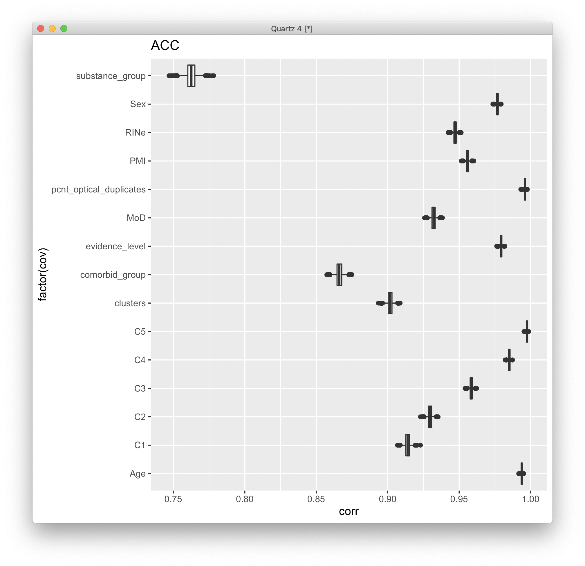
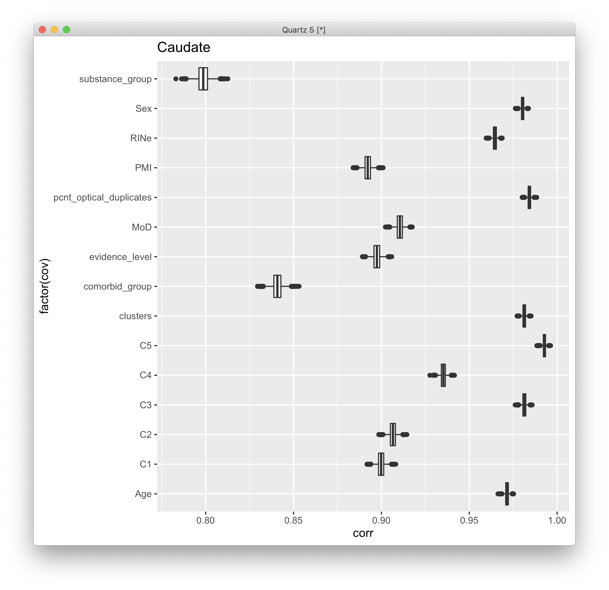
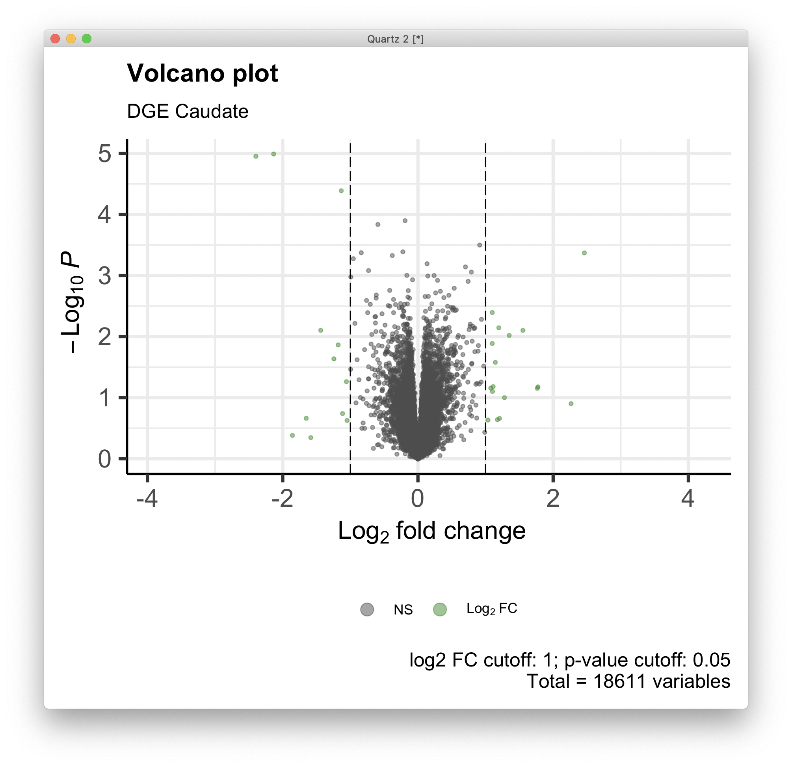
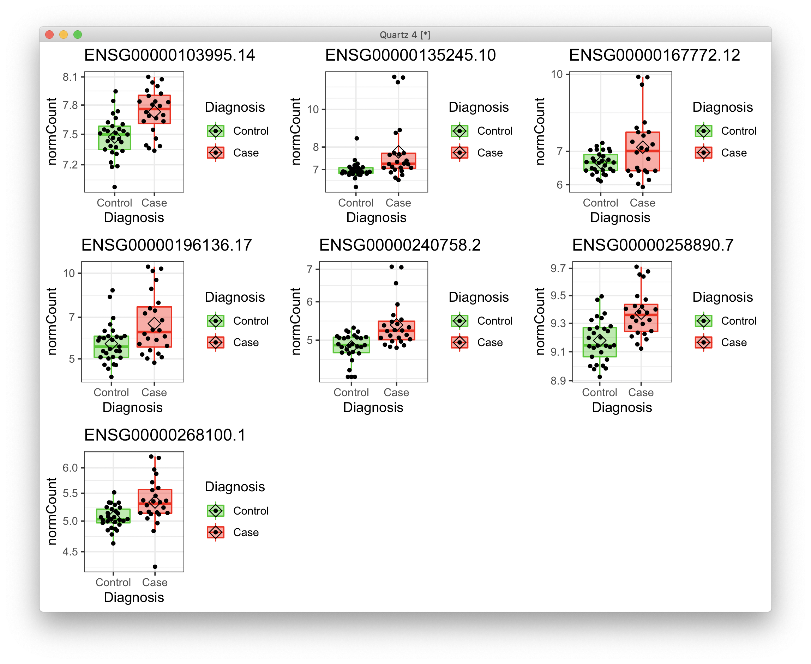
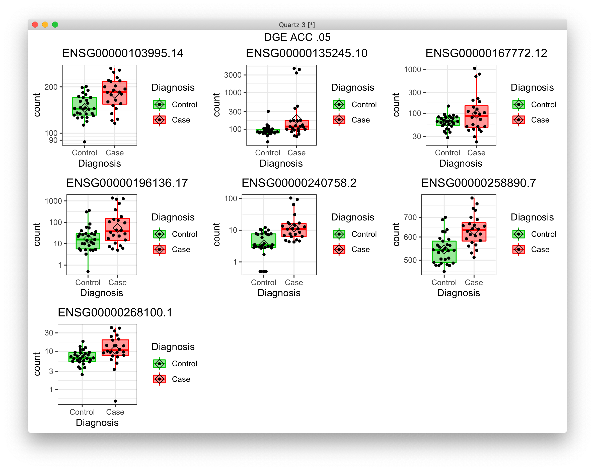

# 2021-04-20 14:48:29

I'll go back to DESeq2, and model within brain region:

```r
data = read.table('~/data/rnaseq_derek/adhd_rnaseq_counts.txt', header=1)
rownames(data) = data[,1]
data[,1] = NULL
data = round(data)
sub_name = gsub(x=colnames(data), pattern='X', replacement='')
colnames(data) = sub_name
# this is a repeat for Caudate hbcc 2877, but has more genes with zeros than
# its other replicate
data = data[, ! colnames(data) %in% c('66552')]
# outliers based on PCA plots
outliers = c('68080','68096', '68108', '68084', '68082')
data = data[, ! colnames(data) %in% outliers]

library(gdata)
df = read.xls('~/data/post_mortem/POST_MORTEM_META_DATA_JAN_2021.xlsx')
data = data[, colnames(data) %in% df$submitted_name]
df = df[df$submitted_name %in% colnames(data), ]
df = df[order(df$submitted_name), ]
data = data[, order(df$submitted_name)]

# cleaning up some variables
df$Individual = factor(df$hbcc_brain_id)
df[df$Manner.of.Death=='Suicide (probable)', 'Manner.of.Death'] = 'Suicide'
df[df$Manner.of.Death=='unknown', 'Manner.of.Death'] = 'natural'
df$MoD = factor(df$Manner.of.Death)
df$Sex = factor(df$Sex)
df$batch = factor(df$batch)
df$run_date = factor(gsub(df$run_date, pattern='-', replacement=''))
df$Diagnosis = factor(df$Diagnosis, levels=c('Control', 'Case'))
df$Region = factor(df$Region, levels=c('Caudate', 'ACC'))
df$substance_group = factor(df$substance_group)
df$comorbid_group = factor(df$comorbid_group_update)
df$evidence_level = factor(df$evidence_level)
df$brainbank = factor(df$bainbank)
# replace the one subject missing population PCs by the median of their
# self-declared race and ethnicity
idx = (df$Race.x=='White' & df$Ethnicity.x=='Non-Hispanic' & !is.na(df$C1))
pop_pcs = c('C1', 'C2', 'C3', 'C4', 'C5')
med_pop = apply(df[idx, pop_pcs], 2, median)
df[which(is.na(df$C1)), pop_pcs] = med_pop
df$BBB = factor(sapply(1:nrow(df),
                        function(x) sprintf('%s_%s',
                                    as.character(df[x,'brainbank']),
                                    as.character(df[x, 'batch']))))
df$BBB2 = NA                                                                        
df[df$brainbank=='nimh_hbcc', 'BBB2'] = 1                                           
df[df$batch==3, 'BBB2'] = 2                                                         
df[df$batch==4, 'BBB2'] = 3      
df$BBB2 = factor(df$BBB2)                                                   
                       
library(GenomicFeatures)
txdb <- loadDb('~/data/post_mortem/Homo_sapies.GRCh38.97.sqlite')
txdf <- select(txdb, keys(txdb, "GENEID"), columns=c('GENEID','TXCHROM'),
            "GENEID")
bt = read.csv('~/data/post_mortem/Homo_sapiens.GRCh38.97_biotypes.csv')
bt_slim = bt[, c('gene_id', 'gene_biotype')]
bt_slim = bt_slim[!duplicated(bt_slim),]
txdf = merge(txdf, bt_slim, by.x='GENEID', by.y='gene_id')
tx_meta = data.frame(GENEID = substr(rownames(data), 1, 15))
tx_meta = merge(tx_meta, txdf, by='GENEID', sort=F)
imautosome = which(tx_meta$TXCHROM != 'X' &
                tx_meta$TXCHROM != 'Y' &
                tx_meta$TXCHROM != 'MT')
data = data[imautosome, ]
tx_meta = tx_meta[imautosome, ]
```

Let's make sure everything is still good in pcaExplorer:

```r
library("DESeq2")
fm_str = '~ BBB2 + Diagnosis'
dds <- DESeqDataSetFromMatrix(countData = data,
                            colData = df,
                            design = as.formula(fm_str))

library(pcaExplorer)
pcaExplorer(dds = dds)
```

Looks clean:


Let's do the same clean up as I was doing with limma:

```r
myregion = 'ACC'

library(DESeq2)
fm_str = '~ BBB2 + Diagnosis'
dds <- DESeqDataSetFromMatrix(countData = data,
                            colData = df,
                            design = as.formula(fm_str))
keep_me = colData(dds)$Region == myregion
dds = dds[, keep_me]

zeros = rowSums(counts(dds) == 0)
plot(1:length(zeros), sort(zeros, decreasing=T), ylab='samples', xlab='gene',
     main='number of samples with zero counts') 
```


There isn't necessarily a good cutoff. Let's try the edgeR function:

```r
design = model.matrix(as.formula(fm_str), data=colData(dds))
dds = DESeq(dds)
vsd <- vst(dds, blind=FALSE)
norm.cts <- assay(vsd)

library(edgeR)
isexpr <- filterByExpr(counts(dds), design=design)
ddsExpr = dds[isexpr, ]
ddsExpr = DESeq(ddsExpr)
vsd <- vst(ddsExpr, blind=FALSE)
norm.cts2 <- assay(vsd)
```

Does the number of zeros change?

```r
zeros = rowSums(counts(ddsExpr) == 0)
plot(sort(zeros, decreasing=T), type='l', ylab='samples', xlab='gene',
     main='number of samples with zero counts after cleaning') 
```


Looks much better, but we can still clean it even further if needed. Let's plot
the actual density:

```r
# black before cleaning
plot(density(norm.cts[, 1]), las=2, main="", xlab="lCPM")
for (s in 2:ncol(norm.cts)) {
  lines(density(norm.cts[, s]), las=2)
}
# and now we plot in red after cleaning
for (s in 1:ncol(norm.cts2)) {
  lines(density(norm.cts2[, s]), las=2, col='red')
}
```


OK, what are our actual results?

```r
alpha = .1
res <- results(ddsExpr, name = "Diagnosis_Case_vs_Control", alpha = alpha)
print(summary(res))

library(IHW)
resIHW <- results(ddsExpr, name = "Diagnosis_Case_vs_Control", alpha = alpha,
                filterFun=ihw)
print(summary(resIHW))
```

We're getting a ton of results now. Maybe BBB2 is working, but it's likely due
to some zeros too. Let's plot some:

```r
plot_expression = function(gene_ids, dds, t_str) {
    library(ggpubr)
    library(ggbeeswarm)
    quartz()
    myplots = list()
    clrs = c("green3", "red")
    for (g in 1:length(gene_ids)) {
        cat(gene_ids[g], '\n')
        d <- plotCounts(dds, gene=gene_ids[g], intgroup="Diagnosis",
                        returnData=TRUE)
        p = (ggplot(d, aes(x=Diagnosis, y=count, color = Diagnosis,
                        fill = Diagnosis)) + 
            scale_y_log10() +
            geom_boxplot(alpha = 0.4, outlier.shape = NA, width = 0.8,
                        lwd = 0.5) +
            stat_summary(fun = mean, geom = "point", color = "black",
                        shape = 5, size = 3,
                        position=position_dodge(width = 0.8)) +
            scale_color_manual(values = clrs) +
            scale_fill_manual(values = clrs) +
            geom_quasirandom(color = "black", size = 1, dodge.width = 0.8) +
            theme_bw() +
            ggtitle(gene_ids[g]))
        myplots[[g]] = p
    }
    p = ggarrange(plotlist=myplots)
    print(annotate_figure(p, t_str))
}

my_genes = rownames(res)[which(res$padj < .05)]
plot_expression(my_genes, ddsExpr, sprintf('DGE %s .05', myregion))
```


It actually didn't look like it. Let's check what's going on with Caudate, and
then we can decide to remove more zeros... there was actually nothing
significant for Caudate. That's a promising start. Let's see if our GSEA results
remain:

```r
library(WebGestaltR)

data_dir = '~/data/post_mortem/'
ncpu=7

region = 'caudate'
res <- results(cau, name = "Diagnosis_Case_vs_Control")
    
ranks = -log(res$pvalue) * sign(res$log2FoldChange)
geneid = substring(rownames(res), 1, 15)

tmp2 = data.frame(geneid=geneid, rank=ranks)
tmp2 = tmp2[order(ranks, decreasing=T),]

res_str = sprintf('WGtmp_DGE_%s_BBB2', region)
DBs = c('my_%s_sets')
for (db in DBs) {
    db2 = sprintf(db, tolower(region))
    cat(res_str, db2, '\n')
    db_file = sprintf('~/data/post_mortem/%s.gmt', db2)
    project_name = sprintf('%s_%s_10K', res_str, db2)
    enrichResult <- try(WebGestaltR(enrichMethod="GSEA",
                        organism="hsapiens",
                        enrichDatabaseFile=db_file,
                        enrichDatabaseType="genesymbol",
                        interestGene=tmp2,
                        outputDirectory = data_dir,
                        interestGeneType="ensembl_gene_id",
                        sigMethod="top", topThr=20,
                        minNum=3, projectName=project_name,
                        isOutput=T, isParallel=T,
                        nThreads=ncpu, perNum=10000, maxNum=800))
}
```

There were indeed some promising results here. So, let's modularize it and start
running other tests:

```r
basic_DGE = function(myregion, add_cov=NA) {
    data = read.table('~/data/rnaseq_derek/adhd_rnaseq_counts.txt', header=1)
    rownames(data) = data[,1]
    data[,1] = NULL
    data = round(data)
    sub_name = gsub(x=colnames(data), pattern='X', replacement='')
    colnames(data) = sub_name
    # this is a repeat for Caudate hbcc 2877, but has more genes with zeros than
    # its other replicate
    data = data[, ! colnames(data) %in% c('66552')]
    # outliers based on PCA plots
    outliers = c('68080','68096', '68108', '68084', '68082')
    data = data[, ! colnames(data) %in% outliers]

    library(gdata)
    df = read.xls('~/data/post_mortem/POST_MORTEM_META_DATA_JAN_2021.xlsx')
    data = data[, colnames(data) %in% df$submitted_name]
    df = df[df$submitted_name %in% colnames(data), ]
    df = df[order(df$submitted_name), ]
    data = data[, order(df$submitted_name)]

    # cleaning up some variables
    df$Individual = factor(df$hbcc_brain_id)
    df[df$Manner.of.Death=='Suicide (probable)', 'Manner.of.Death'] = 'Suicide'
    df[df$Manner.of.Death=='unknown', 'Manner.of.Death'] = 'natural'
    df$MoD = factor(df$Manner.of.Death)
    df$Sex = factor(df$Sex)
    df$batch = factor(df$batch)
    df$run_date = factor(gsub(df$run_date, pattern='-', replacement=''))
    df$Diagnosis = factor(df$Diagnosis, levels=c('Control', 'Case'))
    df$Region = factor(df$Region, levels=c('Caudate', 'ACC'))
    df$substance_group = factor(df$substance_group)
    df$comorbid_group = factor(df$comorbid_group_update)
    df$evidence_level = factor(df$evidence_level)
    df$brainbank = factor(df$bainbank)
    # replace the one subject missing population PCs by the median of their
    # self-declared race and ethnicity
    idx = (df$Race.x=='White' & df$Ethnicity.x=='Non-Hispanic' & !is.na(df$C1))
    pop_pcs = c('C1', 'C2', 'C3', 'C4', 'C5')
    med_pop = apply(df[idx, pop_pcs], 2, median)
    df[which(is.na(df$C1)), pop_pcs] = med_pop
    df$BBB = factor(sapply(1:nrow(df),
                            function(x) sprintf('%s_%s',
                                        as.character(df[x,'brainbank']),
                                        as.character(df[x, 'batch']))))
    df$BBB2 = NA                                                                        
    df[df$brainbank=='nimh_hbcc', 'BBB2'] = 1                                           
    df[df$batch==3, 'BBB2'] = 2                                                         
    df[df$batch==4, 'BBB2'] = 3      
    df$BBB2 = factor(df$BBB2)                                                   
                        
    library(GenomicFeatures)
    txdb <- loadDb('~/data/post_mortem/Homo_sapies.GRCh38.97.sqlite')
    txdf <- select(txdb, keys(txdb, "GENEID"), columns=c('GENEID','TXCHROM'),
                "GENEID")
    bt = read.csv('~/data/post_mortem/Homo_sapiens.GRCh38.97_biotypes.csv')
    bt_slim = bt[, c('gene_id', 'gene_biotype')]
    bt_slim = bt_slim[!duplicated(bt_slim),]
    txdf = merge(txdf, bt_slim, by.x='GENEID', by.y='gene_id')
    tx_meta = data.frame(GENEID = substr(rownames(data), 1, 15))
    tx_meta = merge(tx_meta, txdf, by='GENEID', sort=F)
    imautosome = which(tx_meta$TXCHROM != 'X' &
                    tx_meta$TXCHROM != 'Y' &
                    tx_meta$TXCHROM != 'MT')
    data = data[imautosome, ]
    tx_meta = tx_meta[imautosome, ]

    library("DESeq2")
    if (is.na(add_cov)) {
        fm_str = '~ BBB2 + Diagnosis'
    } else {
        fm_str = sprintf('~ %s + BBB2 + Diagnosis', add_cov)
        # making sure any numeric covariates are scaled
        num_vars = c('pcnt_optical_duplicates', 'clusters', 'Age', 'RINe', 'PMI',
                'C1', 'C2', 'C3', 'C4', 'C5')
        for (var in num_vars) {
            df[, var] = scale(df[, var])
        }
    }
    cat('Running', fm_str)
    dds <- DESeqDataSetFromMatrix(countData = data,
                                  colData = df,
                                  design = as.formula(fm_str))

    keep_me = colData(dds)$Region == myregion
    dds = dds[, keep_me]
    design = model.matrix(as.formula(fm_str), data=colData(dds))
    dds = DESeq(dds)

    library(edgeR)
    isexpr <- filterByExpr(counts(dds), design=design)
    ddsExpr = dds[isexpr, ]
    ddsExpr = DESeq(ddsExpr)

    return(ddsExpr)
}
```

Let's run the complete GSEA under WG26:

```r
library(WebGestaltR)

data_dir = '~/data/post_mortem/'
ncpu=7

for (region in c('ACC', 'Caudate')) {
    res = results(basic_DGE(region), name = "Diagnosis_Case_vs_Control")
    
    ranks = -log(res$pvalue) * sign(res$log2FoldChange)
    geneid = substring(rownames(res), 1, 15)
    
    tmp2 = data.frame(geneid=geneid, rank=ranks)
    tmp2 = tmp2[order(ranks, decreasing=T),]

    res_str = sprintf('WG26_DGE_%s_BBB2', region)
    DBs = c(sprintf('%s_developmental', tolower(region)))
    for (db in DBs) {
        cat(res_str, db, '\n')
        db_file = sprintf('~/data/post_mortem/%s.gmt', db)
        project_name = sprintf('%s_%s_10K', res_str, db)
        enrichResult <- try(WebGestaltR(enrichMethod="GSEA",
                            organism="hsapiens",
                            enrichDatabaseFile=db_file,
                            enrichDatabaseType="genesymbol",
                            interestGene=tmp2,
                            outputDirectory = data_dir,
                            interestGeneType="ensembl_gene_id",
                            sigMethod="top", topThr=20,
                            minNum=3, projectName=project_name,
                            isOutput=T, isParallel=T,
                            nThreads=ncpu, perNum=10000, maxNum=800))
    }

    DBs = c('geneontology_Biological_Process_noRedundant',
            'geneontology_Cellular_Component_noRedundant',
            'geneontology_Molecular_Function_noRedundant')
    for (db in DBs) {
        cat(res_str, db, '\n')
        project_name = sprintf('%s_%s_10K', res_str, db)

        enrichResult <- try(WebGestaltR(enrichMethod="GSEA",
                                    organism="hsapiens",
                                    enrichDatabase=db,
                                    interestGene=tmp2,
                                    interestGeneType="ensembl_gene_id",
                                    sigMethod="top", topThr=20,
                                    outputDirectory = data_dir,
                                    minNum=5, projectName=project_name,
                                    isOutput=T, isParallel=T,
                                    nThreads=ncpu, perNum=10000))
    }

    for (db in c('KEGG', 'Panther', 'Reactome', 'Wikipathway')) {
        cat(res_str, db, '\n')
        project_name = sprintf('%s_%s_10K', res_str, db)

        enrichResult <- try(WebGestaltR(enrichMethod="GSEA",
                                    organism="hsapiens",
                                    enrichDatabase=sprintf('pathway_%s', db),
                                    interestGene=tmp2,
                                    interestGeneType="ensembl_gene_id",
                                    sigMethod="top", minNum=3,
                                    outputDirectory = data_dir,
                                    projectName=project_name,
                                    isOutput=T, isParallel=T,
                                    nThreads=ncpu, topThr=20, perNum=10000))
    }
}
```

These results are looking nice, but it'll highly depend on how we can get away
with the covariates, and the other results. Let's work on MAGMA. But first,
let's solidify the results:

```r
dds.ACC = basic_DGE('ACC')
dds.Caudate = basic_DGE('Caudate')
save(dds.ACC, dds.Caudate, file='~/data/post_mortem/basic_DGE_04202021.RData')
```

Now we can open the same results across the board.

```r
library(biomaRt)
library(dplyr)
mart <- useDataset("hsapiens_gene_ensembl", useMart("ensembl"))

load('~/data/post_mortem/basic_DGE_04202021.RData')
for (r in c('ACC', 'Caudate')) {
    res_str = sprintf('dds = dds.%s', r)
    eval(parse(text=res_str))

    res = as.data.frame(results(dds, name = "Diagnosis_Case_vs_Control"))

    res$GENEID = substr(rownames(res), 1, 15)
    G_list0 <- getBM(filters= "ensembl_gene_id",
                    attributes= c("ensembl_gene_id", "entrezgene_id"),values=res$GENEID, mart= mart)
    G_list <- G_list0[!is.na(G_list0$ensembl_gene_id),]
    G_list = G_list[G_list$ensembl_gene_id!='',]
    G_list <- G_list[!duplicated(G_list$ensembl_gene_id),]
    imnamed = res$GENEID %in% G_list$ensembl_gene_id
    res = res[imnamed, ]
    res2 = merge(res, G_list, sort=F, all.x=F, all.y=F, by.x='GENEID',
                by.y='ensembl_gene_id')
    ranks = res2 %>% group_by(entrezgene_id) %>% slice_min(n=1, pvalue, with_ties=F)
    myres = data.frame(gene=ranks$entrezgene_id,
                    signed_rank=sign(ranks$log2FoldChange)*-log(ranks$pvalue),
                    unsigned_rank=-log(ranks$pvalue))
    out_fname = sprintf('~/data/post_mortem/MAGMA_BBB2_dge_%s.tab', r)
    write.table(myres, row.names=F, sep='\t', file=out_fname, quote=F)
}
```

Then, for MAGMA we only need to run the last command:

```bash
module load MAGMA
cd ~/data/tmp
for r in 'ACC' 'Caudate'; do
    magma --gene-results genes_BW.genes.raw \
        --gene-covar ~/data/post_mortem/MAGMA_BBB2_dge_${r}.tab \
                --out ~/data/post_mortem/MAGMA_BBB2_gc_BW_dge_${r};
done;
```

```
(base) [sudregp@cn3341 post_mortem]$ for f in `ls MAGMA_BBB2_gc_BW_dge*.gsa.out`; do echo $f; cat $f; done
MAGMA_BBB2_gc_BW_dge_ACC.gsa.out
# MEAN_SAMPLE_SIZE = 55374
# TOTAL_GENES = 14679
# TEST_DIRECTION = one-sided, positive (set), two-sided (covar)
# CONDITIONED_INTERNAL = gene size, gene density, inverse mac, log(gene size), log(gene density), log(inverse mac)
VARIABLE           TYPE  NGENES         BETA     BETA_STD           SE            P
signed_rank       COVAR   14671    -0.011835    -0.022117    0.0042938     0.005855
unsigned_rank     COVAR   14671   -0.0070443   -0.0092266    0.0061057      0.24863
MAGMA_BBB2_gc_BW_dge_Caudate.gsa.out
# MEAN_SAMPLE_SIZE = 55374
# TOTAL_GENES = 14734
# TEST_DIRECTION = one-sided, positive (set), two-sided (covar)
# CONDITIONED_INTERNAL = gene size, gene density, inverse mac, log(gene size), log(gene density), log(inverse mac)
VARIABLE           TYPE  NGENES         BETA     BETA_STD           SE            P
signed_rank       COVAR   14715   -0.0019694    -0.002719    0.0059307      0.73984
unsigned_rank     COVAR   14715    0.0011938    0.0011443    0.0081502      0.88355
```

Now we check back on the correlations:

```r
do_boot_corrs = function(both_res, log2FC_col, method) {
    corrs = c()
    nperms = 10000
    set.seed(42)
    options(warn=-1)  # remove annoying spearman warnings
    for (p in 1:nperms) {
        idx = sample(nrow(both_res), replace = T)
        corrs = c(corrs, cor.test(both_res[idx, 'log2FoldChange'],
                                  both_res[idx, log2FC_col],
                                  method=method)$estimate)
    }
    return(corrs)
}

library(DESeq2)
meta = readRDS('~/data/post_mortem/aad6469_Gandal_SM_Data-Table-S1_micro.rds')

met = 'spearman'
load('~/data/post_mortem/basic_DGE_04202021.RData')
dge = as.data.frame(results(dds.ACC, name = "Diagnosis_Case_vs_Control"))
dge$ensembl_gene_id = substr(rownames(dge), 1, 15)
both_res = merge(dge, meta, by='ensembl_gene_id', all.x=F, all.y=F)

corrs = list()
disorders = c('ASD', 'SCZ', 'BD', 'MDD', 'AAD', 'IBD')
for (d in disorders) {
    cat(d, '\n')
    corrs[[d]] = do_boot_corrs(both_res, sprintf('%s.beta_log2FC', d), met)
}
all_corrs = c()
for (d in disorders) {
    cat(d, '\n')
    junk = data.frame(corr=corrs[[d]])
    junk$region = 'ACC'
    junk$disorder = d
    junk$gene_overlap = nrow(both_res)
    junk$source = 'Gandal_micro'
    all_corrs = rbind(all_corrs, junk)
}

dge = as.data.frame(results(dds.Caudate, name = "Diagnosis_Case_vs_Control"))
dge$ensembl_gene_id = substr(rownames(dge), 1, 15)
both_res = merge(dge, meta, by='ensembl_gene_id', all.x=F, all.y=F)
corrs = list()
disorders = c('ASD', 'SCZ', 'BD', 'MDD', 'AAD', 'IBD')
for (d in disorders) {
    cat(d, '\n')
    corrs[[d]] = do_boot_corrs(both_res, sprintf('%s.beta_log2FC', d), met)
}
for (d in disorders) {
    junk = data.frame(corr=corrs[[d]])
    junk$region = 'Caudate'
    junk$disorder = d
    junk$gene_overlap = nrow(both_res)
    junk$source = 'Gandal_micro'
    all_corrs = rbind(all_corrs, junk)
}

library(gdata)
meta = read.xls('~/data/post_mortem/aad6469_Gandal_SM_Data-Table-S1.xlsx',
                'RNAseq SCZ&BD MetaAnalysis DGE')
dge = as.data.frame(results(dds.ACC, name = "Diagnosis_Case_vs_Control"))
dge$ensembl_gene_id = substr(rownames(dge), 1, 15)
both_res = merge(dge, meta, by.x='ensembl_gene_id', by.y='X', all.x=F, all.y=F)
corrs = list()
disorders = c('SCZ', 'BD')
for (d in disorders) {
    cat(d, '\n')
    corrs[[d]] = do_boot_corrs(both_res, sprintf('%s.logFC', d), met)
}
for (d in disorders) {
    junk = data.frame(corr=corrs[[d]])
    junk$region = 'ACC'
    junk$disorder = d
    junk$gene_overlap = nrow(both_res)
    junk$source = 'Gandal_RNAseq'
    all_corrs = rbind(all_corrs, junk)
}

dge = as.data.frame(results(dds.Caudate, name = "Diagnosis_Case_vs_Control"))
dge$ensembl_gene_id = substr(rownames(dge), 1, 15)
both_res = merge(dge, meta, by.x='ensembl_gene_id', by.y='X', all.x=F, all.y=F)
corrs = list()
disorders = c('SCZ', 'BD')
for (d in disorders) {
    cat(d, '\n')
    corrs[[d]] = do_boot_corrs(both_res, sprintf('%s.logFC', d), met)
}
for (d in disorders) {
    junk = data.frame(corr=corrs[[d]])
    junk$region = 'Caudate'
    junk$disorder = d
    junk$gene_overlap = nrow(both_res)
    junk$source = 'Gandal_RNAseq'
    all_corrs = rbind(all_corrs, junk)
}

meta = read.xls('~/data/post_mortem/aad6469_Gandal_SM_Data-Table-S1.xlsx',
                'RNAseq ASD-pancortical DGE')
dge = as.data.frame(results(dds.ACC, name = "Diagnosis_Case_vs_Control"))
dge$ensembl_gene_id = substr(rownames(dge), 1, 15)
both_res = merge(dge, meta, by.x='ensembl_gene_id', by.y='X', all.x=F, all.y=F)
corrs = list()
d = 'ASD'
junk = data.frame(corr=do_boot_corrs(both_res, 'Frontal.logFC', met))
junk$region = 'ACC'
junk$disorder = d
junk$gene_overlap = nrow(both_res)
junk$source = 'Gandal_RNAseq'
all_corrs = rbind(all_corrs, junk)

dge = as.data.frame(results(dds.Caudate, name = "Diagnosis_Case_vs_Control"))
dge$ensembl_gene_id = substr(rownames(dge), 1, 15)
both_res = merge(dge, meta, by.x='ensembl_gene_id', by.y='X', all.x=F, all.y=F)
corrs = list()
d = 'ASD'
junk = data.frame(corr=do_boot_corrs(both_res, 'Frontal.logFC', met))
junk$region = 'Caudate'
junk$disorder = d
junk$gene_overlap = nrow(both_res)
junk$source = 'Gandal_RNAseq'
all_corrs = rbind(all_corrs, junk)

# moving on to other papers: Akula
meta = readRDS('~/data/post_mortem/ACC_other_disorders.rds')
dge = as.data.frame(results(dds.ACC, name = "Diagnosis_Case_vs_Control"))
dge$ensembl_gene_id = substr(rownames(dge), 1, 15)
both_res = merge(dge, meta, by.x='ensembl_gene_id', by.y='Ensemble.gene.ID',
                 all.x=F, all.y=F)
corrs = list()
disorders = c('BD', 'SCZ', 'MDD')
for (d in disorders) {
    cat(d, '\n')
    corrs[[d]] = do_boot_corrs(both_res, sprintf('log2FoldChange.%s', d), met)
}
for (d in disorders) {
    junk = data.frame(corr=corrs[[d]])
    junk$region = 'ACC'
    junk$disorder = d
    junk$gene_overlap = nrow(both_res)
    junk$source = 'Akula'
    all_corrs = rbind(all_corrs, junk)
}

dge = as.data.frame(results(dds.Caudate, name = "Diagnosis_Case_vs_Control"))
dge$ensembl_gene_id = substr(rownames(dge), 1, 15)
mart = readRDS('~/data/rnaseq_derek/mart_rnaseq.rds')
d = 'SCZ'
dge = merge(dge, mart, by='ensembl_gene_id', all.x=T, all.y=F)
meta = read.xls('~/data/post_mortem/caudate_others.xlsx', d)
meta$gencodeID = substr(meta$gencodeID, 1, 15)
both_res = merge(dge, meta, by.x='ensembl_gene_id', by.y='gencodeID',
                 all.x=T, all.y=F)
colnames(both_res)[ncol(both_res)] = 'log2FC.SCZ'
junk = data.frame(corr=do_boot_corrs(both_res, sprintf('log2FC.%s', d), met))
junk$region = 'Caudate'
junk$disorder = d
junk$gene_overlap = nrow(both_res)
junk$source = 'Benjamin'
all_corrs = rbind(all_corrs, junk)

d = 'BD'
meta = read.xls('~/data/post_mortem/caudate_others.xlsx', d)
both_res = merge(dge, meta, by.x='ensembl_gene_id', by.y='gencodeID',
                 all.x=T, all.y=F)
colnames(both_res)[ncol(both_res)] = 'log2FC.BD'
junk = data.frame(corr=do_boot_corrs(both_res, sprintf('log2FC.%s', d), met))
junk$region = 'Caudate'
junk$disorder = d
junk$gene_overlap = nrow(both_res)
junk$source = 'Pacifico'
all_corrs = rbind(all_corrs, junk)

d = 'OCD'
meta = read.xls('~/data/post_mortem/caudate_others.xlsx', d)
both_res = merge(dge, meta, by='hgnc_symbol', all.x=T, all.y=F)
colnames(both_res)[ncol(both_res)] = 'log2FC.OCD'
junk = data.frame(corr=do_boot_corrs(both_res, sprintf('log2FC.%s', d), met))
junk$region = 'Caudate'
junk$disorder = d
junk$gene_overlap = nrow(both_res)
junk$source = 'Piantadosi'
all_corrs = rbind(all_corrs, junk)

# last 2 ASD papers
dge = as.data.frame(results(dds.ACC, name = "Diagnosis_Case_vs_Control"))
dge$ensembl_gene_id = substr(rownames(dge), 1, 15)
meta = read.xls('~/data/post_mortem/ASD_only.xlsx', 'Wright')
both_res = merge(dge, meta, by='ensembl_gene_id', all.x=T, all.y=F)
d = 'ASD'
junk = data.frame(corr=do_boot_corrs(both_res, 'log2FC', met))
junk$region = 'ACC'
junk$disorder = d
junk$gene_overlap = nrow(both_res)
junk$source = 'Wright_DLPFC'
all_corrs = rbind(all_corrs, junk)

meta = read.xls('~/data/post_mortem/ASD_only.xlsx', 'Neelroop')
both_res = merge(dge, meta, by.x='ensembl_gene_id', by.y='ENSEMBL.ID',
                 all.x=T, all.y=F)
junk = data.frame(corr=do_boot_corrs(both_res, 'log2.FC..ASD.vs.CTL', met))
junk$region = 'ACC'
junk$disorder = d
junk$gene_overlap = nrow(both_res)
junk$source = 'Neelroop_FrontalTemporal'
all_corrs = rbind(all_corrs, junk)

out_fname = '~/data/post_mortem/disorders_corrs_BBB2_04202021.rds'
saveRDS(all_corrs, file=out_fname)
```

Let's plot them now:

```r
fname = 'disorders_corrs_BBB2_04202021'
corrs = readRDS(sprintf('~/data/post_mortem/%s.rds', fname))
corrs$id = sapply(1:nrow(corrs),
                  function(i) sprintf('%s_%s_%s',
                                      corrs[i, 'region'],
                                      corrs[i, 'disorder'],
                                      corrs[i, 'source']))
library(ggplot2)
quartz()
p <- ggplot(corrs, aes(x = factor(id), y = corr)) + coord_flip() +
  geom_boxplot() + theme(axis.text.y = element_text(angle = 0))
p + ggtitle(fname) + geom_hline(yintercept=0, linetype="dotted",
                                color = "red", size=1)
```


OK, we're still good.

Let's also run the relationship to other covariates:

```r
do_boot_corrs = function(both_res) {
    corrs = c()
    nperms = 10000
    set.seed(42)
    options(warn=-1)  # remove annoying spearman warnings
    for (p in 1:nperms) {
        idx = sample(nrow(both_res), replace = T)
        corrs = c(corrs, cor.test(both_res[idx, 'log2FoldChange.x'],
                                  both_res[idx, 'log2FoldChange.y'],
                                  method='spearman')$estimate)
    }
    return(corrs)
}

library(DESeq2)
myregion = 'ACC'
load('~/data/post_mortem/basic_DGE_04202021.RData')
res_str = sprintf('dge.orig = results(dds.%s, name = "Diagnosis_Case_vs_Control")',
                  myregion)
eval(parse(text=res_str))

covs = c('clusters', 'Age', 'Sex', 'C1', 'C2', 'C3', 'RINe', 'PMI',
              'comorbid_group', 'pcnt_optical_duplicates',
              'C4', 'C5', 'MoD', 'substance_group', 'evidence_level')
all_corrs = c()
for (mycov in covs) {
    cat(mycov, '\n')
    dds = basic_DGE(myregion, add_cov=mycov)
    dge.cov = results(dds, name = "Diagnosis_Case_vs_Control")
    both_res = merge(as.data.frame(dge.orig),
                     as.data.frame(dge.cov), by=0, all.x=F, all.y=F)
    junk = data.frame(corr=do_boot_corrs(both_res))
    junk$region = myregion
    junk$cov = mycov
    junk$gene_overlap = nrow(both_res)
    all_corrs = rbind(all_corrs, junk)
}
out_fname = sprintf('~/data/post_mortem/cov_corrs_BBB2_04202021_%s.rds',
                    myregion)
saveRDS(all_corrs, file=out_fname)
```

OK, let's plot the results to see if there are any trends:

```r
quartz()
myregion='Caudate'
fname = sprintf('cov_corrs_BBB2_04202021_%s', myregion)
corrs = readRDS(sprintf('~/data/post_mortem/%s.rds', fname))
library(ggplot2)
p <- (ggplot(corrs, aes(x = factor(cov), y = corr)) +
      coord_flip() + geom_boxplot() +
      theme(axis.text.y = element_text(angle = 0)) + 
      ggtitle(sprintf('%s', myregion)))
p
```





I should definitely check the effect of the strongest covariates on the top
hits, and also the p-value for the top results. But I wonder how much of those
effects is just an unbalanced group, that would do better by removing the small
group?

```
r$> table(dds.ACC$comorbid_group)                                                       

 no yes 
 44   9 

r$> table(dds.Caudate$comorbid_group)                                                   

 no yes 
 46  10 

r$> table(dds.ACC$substance_group)                                                      

 0  1  2 
42  7  4 

r$> table(dds.Caudate$substance_group)                                                  

 0  1  2 
45  6  5 
```

Yeah, I should try running the clean sets only just to see if the correlation is
that small. Note that it's not even that small: it's still .75 and .8. It's just
a bit smaller than the other ones. Icing on the cake, though.

Let's make a few volcano and expression plots:

```r
plot_volcano = function(res, t_str, pCutoff = 0.05) {
    library(EnhancedVolcano)
    quartz()
    res = res[order(res$pvalue), ]
    FCcutoff = 1.0
    # if we have significant FDR, find it
    sigPs = sum(res$padj <= pCutoff, na.rm=T)
    if (sigPs > 0) {
        ps = -log10(res$pvalue)
        nomPcutoff = ps[sigPs + 1] + (ps[sigPs] - ps[sigPs + 1]) / 2
        nomPcutoff = 10 ** (-nomPcutoff)
    } else {
        nomPcutoff = NA
    }
    print(sigPs)
    p = EnhancedVolcano(data.frame(res), lab = rownames(res),
                        x = 'log2FoldChange',
                        y = 'pvalue', xlab = bquote(~Log[2]~ 'fold change'),
                        selectLab = rownames(res)[res$padj < pCutoff],
                        ylab = bquote(~-Log[10]~italic(P)),
                        ylim = c(0, ceiling(max(-log10(res$pvalue)))),
                        pCutoff = nomPcutoff,
                        FCcutoff = FCcutoff, pointSize = 1.0,
                        labSize = 2.0, title = "Volcano plot",
                        subtitle = t_str,
                        caption = paste0('log2 FC cutoff: ', FCcutoff,
                                        '; p-value cutoff: ', pCutoff,
                                        '\nTotal = ', nrow(res), ' variables'),
                        legendPosition = 'bottom', legendLabSize = 10,
                        legendIconSize = 4.0)
    print(p)
}
library(DESeq2)
library(dplyr)
load('~/data/post_mortem/basic_DGE_04202021.RData')
alpha = .05
res = results(dds.ACC, name = "Diagnosis_Case_vs_Control", alpha=alpha)
res$ensembl_gene_id = substr(rownames(res), 1, 15)
mart = readRDS('~/data/rnaseq_derek/mart_rnaseq.rds')
res = merge(as.data.frame(res), mart, by='ensembl_gene_id', all.x=T, all.y=F)
res2 = res %>% group_by(hgnc_symbol) %>% slice_min(n=1, pvalue, with_ties=F)
res2 = as.data.frame(res2)
res2 = res2[res2$hgnc_symbol != '', ]
res2 = res2[!is.na(res2$hgnc_symbol), ]
rownames(res2) = res2$hgnc_symbol
plot_volcano(res2, 'DGE ACC', pCutoff=alpha)
```




I might have to do this figure manually, because one name is not showing, and
one of the 7 hits doesn't have HGNC symbol. They should actually be:

```
r$> res[which(res$padj < .05), c('ensembl_gene_id', 'log2FoldChange', 'pvalue', 'hgnc_sy
    mbol')]                                                                             
      ensembl_gene_id log2FoldChange       pvalue hgnc_symbol
2442  ENSG00000103995      0.3340871 1.324525e-05      CEP152
5951  ENSG00000135245      2.7185073 1.133895e-10      HILPDA
10293 ENSG00000167772      1.4848855 1.790537e-06     ANGPTL4
13467 ENSG00000196136      2.8488522 9.596301e-07    SERPINA3
17399 ENSG00000240758      2.1580732 1.621981e-08            
19208 ENSG00000258890      0.2218314 1.026123e-05       CEP95
20432 ENSG00000268100      1.0771396 1.268706e-05     ZNF725P
```

More importantly, can we plot their expression after accounting for BBB2?

```r
# from http://www.bioconductor.org/packages/release/bioc/vignettes/DESeq2/inst/doc/DESeq2.html#why-after-vst-are-there-still-batches-in-the-pca-plot
vsd <- vst(dds.ACC, blind=FALSE)
norm.cts <- assay(vsd)
mat <- limma::removeBatchEffect(norm.cts, vsd$BBB2)
res = results(dds.ACC, name = "Diagnosis_Case_vs_Control", alpha=alpha)
gene_list = rownames(res)[which(res$padj < .05)]
resid_expr = reshape2::melt(mat[gene_list,])
colnames(resid_expr) = c('gene', 'submitted_name', 'normCount')
junk = colData(vsd)[, c('Diagnosis', 'submitted_name')]
resid_expr = merge(resid_expr, junk, by='submitted_name')

library(ggpubr)
library(ggbeeswarm)
quartz()
myplots = list()
clrs = c("green3", "red")
for (g in 1:length(gene_list)) {
    cat(gene_list[g], '\n')
    d = as.data.frame(resid_expr[resid_expr$gene == gene_list[g],])
    p = (ggplot(d, aes(x=Diagnosis, y=normCount, color = Diagnosis,
                    fill = Diagnosis)) + 
        scale_y_log10() +
        geom_boxplot(alpha = 0.4, outlier.shape = NA, width = 0.8,
                    lwd = 0.5) +
        stat_summary(fun = mean, geom = "point", color = "black",
                    shape = 5, size = 3,
                    position=position_dodge(width = 0.8)) +
        scale_color_manual(values = clrs) +
        scale_fill_manual(values = clrs) +
        geom_quasirandom(color = "black", size = 1, dodge.width = 0.8) +
        theme_bw() +
        ggtitle(gene_list[g]))
    myplots[[g]] = p
}
p = ggarrange(plotlist=myplots)
print(annotate_figure(p, t_str))
```



How does that compare to the uncorrected version?

```r
plot_expression(gene_list, dds.ACC, 'DGE ACC .05')
```



The overall shape is the same, but there are some subtle changes. And of course,
the count axis changed.


# 2021-04-21 06:53:48

Outputing single gene results:

```r
library(DESeq2)
library(IHW)
load('~/data/post_mortem/basic_DGE_04202021.RData')
mart = readRDS('~/data/rnaseq_derek/mart_rnaseq.rds')
mydir = '~/data/post_mortem/'

library(GenomicFeatures)
txdb <- loadDb('~/data/post_mortem/Homo_sapies.GRCh38.97.sqlite')
txdf <- select(txdb, keys(txdb, "GENEID"), columns=c('GENEID','TXCHROM'),
               "GENEID")
bt = read.csv('~/data/post_mortem/Homo_sapiens.GRCh38.97_biotypes.csv')
bt_slim = bt[, c('gene_id', 'gene_biotype')]
bt_slim = bt_slim[!duplicated(bt_slim),]

for (r in c('ACC', 'Caudate')) {
    res_str = sprintf('res = results(dds.%s, name = "Diagnosis_Case_vs_Control", alpha=.05)',
                      r)
    eval(parse(text=res_str))
    fname = sprintf('%s/DGE_%s_BBB2_annot_04212021.csv', mydir, r)

    df = as.data.frame(res)
    colnames(df)[ncol(df)] = 'padj.FDR'
    df$GENEID = substr(rownames(df), 1, 15)
    df2 = merge(df, mart, sort=F,
                by.x='GENEID', by.y='ensembl_gene_id', all.x=T, all.y=F)
    df2 = merge(df2, bt_slim, sort=F,
                by.x='GENEID', by.y='gene_id', all.x=T, all.y=F)
    df2 = df2[order(df2$pvalue), ]

    df2$padj.IHW = adj_pvalues(ihw(pvalue ~ baseMean,  data=df2, alpha=0.05))
    
    write.csv(df2, row.names=F, file=fname)
}
```

Let's investigate those 7 hits:

* ENSG00000103995: CEP152: involved with centrosome function. Mutations in this gene have been associated with primary microcephaly
* ENSG00000135245: HILPDA: ncreases intracellular lipid accumulation. Enhances cell growth and proliferation
* ENSG00000167772: ANGPTL4: regulates glucose homeostasis, lipid metabolism, and insulin sensitivity.
* ENSG00000196136: SERPINA3: inhibit serine proteases. This gene is one in a cluster of serpin genes located on the q arm of chromosome 14. Tissue specific and influence protease targeting, implicated in Alzheimer's disease.
* ENSG00000240758: (lncRNA) related to HILPDA
* ENSG00000258890: CEP95: centrosomal protein 95
* ENSG00000268100: ZNF725P (pseudogene): zinc finger protein

Even though there isn't anything significant in Caudate, there's a whole bunch
of stuff if we run IHW in ACC. Let's check the overlap of that with nominal
significance in Caudate:

```r
acc = read.csv('~/data/post_mortem/DGE_ACC_BBB2_annot_04212021.csv')
cau = read.csv('~/data/post_mortem/DGE_Caudate_BBB2_annot_04212021.csv')
m = merge(acc, cau, by='GENEID', suffix=c('.acc', '.cau'), all.x=T, all.y=T)
```

```
r$> sum(m$padj.IHW.acc < .05, na.rm=T)                                                  
[1] 40
r$> sum(m$padj.IHW.acc < .05 & m$padj.FDR.acc < .05, na.rm=T)                           
[1] 7
r$> sum(m$padj.IHW.acc < .05 & m$padj.FDR.acc < .1, na.rm=T)                            
[1] 40
r$> sum(m$padj.IHW.acc < .05 & m$pvalue.cau < .05, na.rm=T)                             
[1] 14
r$> m[which(m$padj.IHW.acc < .05 & m$pvalue.cau < .05), c('GENEID', 'hgnc_symbol.cau')] 
               GENEID hgnc_symbol.cau
324   ENSG00000018280         SLC11A1
1257  ENSG00000078401            EDN1
1994  ENSG00000100292           HMOX1
5756  ENSG00000133048          CHI3L1
6017  ENSG00000135063        FAM189A2
6479  ENSG00000137752           CASP1
6728  ENSG00000139211          AMIGO2
7888  ENSG00000148926             ADM
13892 ENSG00000196584           XRCC2
14515 ENSG00000203747          FCGR3A
18131 ENSG00000240758                
19044 ENSG00000250483         PPM1AP1
19589 ENSG00000254995    STX16-NPEPL1
23764 ENSG00000282508       LINC01002
```

So, let's see what else we have here:

* ENSG00000018280, SLC11A1: encodes a multi-pass membrane protein. The protein functions as a divalent transition metal (iron and manganese) transporter involved in iron metabolism and host resistance to certain pathogens
* ENSG00000078401, EDN1: This peptide is a potent vasoconstrictor and its cognate receptors are therapeutic targets in the treatment of pulmonary arterial hypertension.
* ENSG00000100292, HMOX1:  Heme oxygenase activity is induced by its substrate heme and by various nonheme substances
* ENSG00000133048, CHI3L1: This gene encodes a glycoprotein member of the glycosyl hydrolase 18 family. The protein lacks chitinase activity and is secreted by activated macrophages, chondrocytes, neutrophils and synovial cells. The protein is thought to play a role in the process of inflammation and tissue remodeling.
* ENSG00000135063, FAM189A2:  Diseases associated with FAM189A2 include Friedreich Ataxia
* ENSG00000137752, CASP1: Sequential activation of caspases plays a central role in the execution-phase of cell apoptosis.
* ENSG00000139211, AMIGO2: Diseases associated with AMIGO2 include Parkinson
  Disease 8, Autosomal Dominant and Gastric Adenocarcinoma. Required for
  depolarization-dependent survival of cultured cerebellar granule neurons.
* ENSG00000148926, ADM: vasodilation, regulation of hormone secretion, promotion of angiogenesis, and antimicrobial activity
* ENSG00000196584, XRCC2: maintain chromosome stability and repair DNA damage
* ENSG00000203747, FCGR3A: nvolved in the removal of antigen-antibody complexes from the circulation, as well as other responses, including antibody dependent cellular mediated cytotoxicity and antibody dependent enhancement of virus infections
* ENSG00000240758: (lncRNA, same as above)
* ENSG00000250483, PPM1AP1: (pseudogene) Protein Phosphatase
* ENSG00000254995, STX16-NPEPL1: lncRNA
* ENSG00000282508, LINC01002: lcRNA: 


# TODO
 * check what happens to our main
   results (e.g. pvalues, GSEA, etc) as we add the strongest covariates