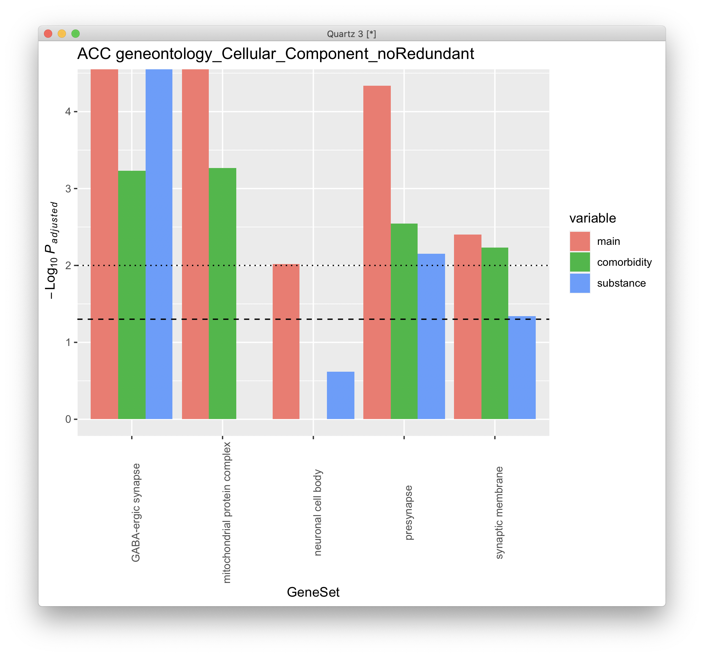

# 2021-04-21 10:58:33

Let's run the same DGE analysis while we keep only clean sets:

```r
basic_DGE_clean = function(myregion, varvec) {
    add_cov = NA
    # varvec has a variable name and the group to keep
    data = read.table('~/data/rnaseq_derek/adhd_rnaseq_counts.txt', header=1)
    rownames(data) = data[,1]
    data[,1] = NULL
    data = round(data)
    sub_name = gsub(x=colnames(data), pattern='X', replacement='')
    colnames(data) = sub_name
    # this is a repeat for Caudate hbcc 2877, but has more genes with zeros than
    # its other replicate
    data = data[, ! colnames(data) %in% c('66552')]
    # outliers based on PCA plots
    outliers = c('68080','68096', '68108', '68084', '68082')
    data = data[, ! colnames(data) %in% outliers]

    library(gdata)
    df = read.xls('~/data/post_mortem/POST_MORTEM_META_DATA_JAN_2021.xlsx')
    for (v in 1:length(varvec)) {
        keep_me = which(df[, names(varvec)[v]] == varvec[v])
        df = df[keep_me, ]
    }

    data = data[, colnames(data) %in% df$submitted_name]
    df = df[df$submitted_name %in% colnames(data), ]
    df = df[order(df$submitted_name), ]
    data = data[, order(df$submitted_name)]

    # cleaning up some variables
    df$Individual = factor(df$hbcc_brain_id)
    df[df$Manner.of.Death=='Suicide (probable)', 'Manner.of.Death'] = 'Suicide'
    df[df$Manner.of.Death=='unknown', 'Manner.of.Death'] = 'natural'
    df$MoD = factor(df$Manner.of.Death)
    df$Sex = factor(df$Sex)
    df$batch = factor(df$batch)
    df$run_date = factor(gsub(df$run_date, pattern='-', replacement=''))
    df$Diagnosis = factor(df$Diagnosis, levels=c('Control', 'Case'))
    df$Region = factor(df$Region, levels=c('Caudate', 'ACC'))
    df$substance_group = factor(df$substance_group)
    df$comorbid_group = factor(df$comorbid_group_update)
    df$evidence_level = factor(df$evidence_level)
    df$brainbank = factor(df$bainbank)
    # replace the one subject missing population PCs by the median of their
    # self-declared race and ethnicity
    idx = (df$Race.x=='White' & df$Ethnicity.x=='Non-Hispanic' & !is.na(df$C1))
    pop_pcs = c('C1', 'C2', 'C3', 'C4', 'C5')
    med_pop = apply(df[idx, pop_pcs], 2, median)
    df[which(is.na(df$C1)), pop_pcs] = med_pop
    df$BBB = factor(sapply(1:nrow(df),
                            function(x) sprintf('%s_%s',
                                        as.character(df[x,'brainbank']),
                                        as.character(df[x, 'batch']))))
    df$BBB2 = NA                                                                        
    df[df$brainbank=='nimh_hbcc', 'BBB2'] = 1                                           
    df[df$batch==3, 'BBB2'] = 2                                                         
    df[df$batch==4, 'BBB2'] = 3      
    df$BBB2 = factor(df$BBB2)                                                   
                        
    library(GenomicFeatures)
    txdb <- loadDb('~/data/post_mortem/Homo_sapies.GRCh38.97.sqlite')
    txdf <- select(txdb, keys(txdb, "GENEID"), columns=c('GENEID','TXCHROM'),
                "GENEID")
    bt = read.csv('~/data/post_mortem/Homo_sapiens.GRCh38.97_biotypes.csv')
    bt_slim = bt[, c('gene_id', 'gene_biotype')]
    bt_slim = bt_slim[!duplicated(bt_slim),]
    txdf = merge(txdf, bt_slim, by.x='GENEID', by.y='gene_id')
    tx_meta = data.frame(GENEID = substr(rownames(data), 1, 15))
    tx_meta = merge(tx_meta, txdf, by='GENEID', sort=F)
    imautosome = which(tx_meta$TXCHROM != 'X' &
                    tx_meta$TXCHROM != 'Y' &
                    tx_meta$TXCHROM != 'MT')
    data = data[imautosome, ]
    tx_meta = tx_meta[imautosome, ]

    library("DESeq2")
    if (is.na(add_cov)) {
        fm_str = '~ BBB2 + Diagnosis'
    } else {
        fm_str = sprintf('~ %s + BBB2 + Diagnosis', add_cov)
        # making sure any numeric covariates are scaled
        num_vars = c('pcnt_optical_duplicates', 'clusters', 'Age', 'RINe', 'PMI',
                'C1', 'C2', 'C3', 'C4', 'C5')
        for (var in num_vars) {
            df[, var] = scale(df[, var])
        }
    }
    cat('Running', fm_str)
    dds <- DESeqDataSetFromMatrix(countData = data,
                                  colData = df,
                                  design = as.formula(fm_str))

    keep_me = colData(dds)$Region == myregion
    dds = dds[, keep_me]
    design = model.matrix(as.formula(fm_str), data=colData(dds))
    dds = DESeq(dds)

    library(edgeR)
    isexpr <- filterByExpr(counts(dds), design=design)
    ddsExpr = dds[isexpr, ]
    ddsExpr = DESeq(ddsExpr)

    return(ddsExpr)
}
```

```r
varvec = vector(mode='numeric')
varvec[1] = 0
names(varvec) = 'substance_group'
dds.ACC = basic_DGE_clean('ACC', varvec)
dds.Caudate = basic_DGE_clean('Caudate', varvec)
save(dds.ACC, dds.Caudate,
     file='~/data/post_mortem/basic_DGE_substance_group_04212021.RData')

varvec = vector(mode='character')
varvec[1] = 'no'
names(varvec) = 'comorbid_group_update'
dds.ACC = basic_DGE_clean('ACC', varvec)
dds.Caudate = basic_DGE_clean('Caudate', varvec)
save(dds.ACC, dds.Caudate,
     file='~/data/post_mortem/basic_DGE_comorbid_group_04212021.RData')

varvec = list()
varvec$substance_group = 0
varvec$comorbid_group_update = 'no'
dds.ACC = basic_DGE_clean('ACC', varvec)
dds.Caudate = basic_DGE_clean('Caudate', varvec)
save(dds.ACC, dds.Caudate,
     file='~/data/post_mortem/basic_DGE_clean_group_04212021.RData')
```

We suffer some drops in our number of subjects, but it’s not terrible:
no-comorbidities: 44 ACC and 46 Caudate; substance-abuse free: 42 AC, 45
Caudate. The clean set has 38 for ACC and 39 for Caudate. 

Let's run the complete GSEA under WG28, but only 1K for starters:

```r
library(WebGestaltR)
library(DESeq2)

data_dir = '~/data/post_mortem/'
ncpu=31

for (g in c('substance', 'comorbid')) {
    load(sprintf('~/data/post_mortem/basic_DGE_%s_group_04212021.RData', g))
    for (region in c('ACC', 'Caudate')) {
        res_str = sprintf('dds = dds.%s', region)
        eval(parse(text=res_str))

        res = as.data.frame(results(dds, name = "Diagnosis_Case_vs_Control"))
        
        ranks = -log(res$pvalue) * sign(res$log2FoldChange)
        geneid = substring(rownames(res), 1, 15)
        
        tmp2 = data.frame(geneid=geneid, rank=ranks)
        tmp2 = tmp2[order(ranks, decreasing=T),]

        res_str = sprintf('WG28_DGE_%s_%s_BBB2', region, g)
        DBs = c(sprintf('%s_developmental', tolower(region)))
        for (db in DBs) {
            cat(res_str, db, '\n')
            db_file = sprintf('~/data/post_mortem/%s.gmt', db)
            project_name = sprintf('%s_%s_10K', res_str, db)
            enrichResult <- try(WebGestaltR(enrichMethod="GSEA",
                                organism="hsapiens",
                                enrichDatabaseFile=db_file,
                                enrichDatabaseType="genesymbol",
                                interestGene=tmp2,
                                outputDirectory = data_dir,
                                interestGeneType="ensembl_gene_id",
                                sigMethod="top", topThr=20,
                                minNum=3, projectName=project_name,
                                isOutput=T, isParallel=T,
                                nThreads=ncpu, perNum=10000, maxNum=800))
        }

        DBs = c('geneontology_Biological_Process_noRedundant',
                'geneontology_Cellular_Component_noRedundant',
                'geneontology_Molecular_Function_noRedundant')
        for (db in DBs) {
            cat(res_str, db, '\n')
            project_name = sprintf('%s_%s_10K', res_str, db)

            enrichResult <- try(WebGestaltR(enrichMethod="GSEA",
                                        organism="hsapiens",
                                        enrichDatabase=db,
                                        interestGene=tmp2,
                                        interestGeneType="ensembl_gene_id",
                                        sigMethod="top", topThr=20,
                                        outputDirectory = data_dir,
                                        minNum=5, projectName=project_name,
                                        isOutput=T, isParallel=T,
                                        nThreads=ncpu, perNum=10000))
        }

        for (db in c('KEGG', 'Panther', 'Reactome', 'Wikipathway')) {
            cat(res_str, db, '\n')
            project_name = sprintf('%s_%s_10K', res_str, db)

            enrichResult <- try(WebGestaltR(enrichMethod="GSEA",
                                        organism="hsapiens",
                                        enrichDatabase=sprintf('pathway_%s', db),
                                        interestGene=tmp2,
                                        interestGeneType="ensembl_gene_id",
                                        sigMethod="top", minNum=3,
                                        outputDirectory = data_dir,
                                        projectName=project_name,
                                        isOutput=T, isParallel=T,
                                        nThreads=ncpu, topThr=20, perNum=10000))
        }
    }
}
```

I'll export the single gene results to see hown our main guys do on the clean
sets:

```r
library(DESeq2)
library(IHW)
mart = readRDS('~/data/rnaseq_derek/mart_rnaseq.rds')
mydir = '~/data/post_mortem/'

library(GenomicFeatures)
txdb <- loadDb('~/data/post_mortem/Homo_sapies.GRCh38.97.sqlite')
txdf <- select(txdb, keys(txdb, "GENEID"), columns=c('GENEID','TXCHROM'),
               "GENEID")
bt = read.csv('~/data/post_mortem/Homo_sapiens.GRCh38.97_biotypes.csv')
bt_slim = bt[, c('gene_id', 'gene_biotype')]
bt_slim = bt_slim[!duplicated(bt_slim),]

for (g in c('substance', 'comorbid')) {
    load(sprintf('~/data/post_mortem/basic_DGE_%s_group_04212021.RData', g))
    for (r in c('ACC', 'Caudate')) {
        res_str = sprintf('res = results(dds.%s, name = "Diagnosis_Case_vs_Control", alpha=.05)',
                        r)
        eval(parse(text=res_str))
        fname = sprintf('%s/DGE_%s_BBB2_%s_annot_04212021.csv', mydir, r, g)

        df = as.data.frame(res)
        colnames(df)[ncol(df)] = 'padj.FDR'
        df$GENEID = substr(rownames(df), 1, 15)
        df2 = merge(df, mart, sort=F,
                    by.x='GENEID', by.y='ensembl_gene_id', all.x=T, all.y=F)
        df2 = merge(df2, bt_slim, sort=F,
                    by.x='GENEID', by.y='gene_id', all.x=T, all.y=F)
        df2 = df2[order(df2$pvalue), ]

        df2$padj.IHW = adj_pvalues(ihw(pvalue ~ baseMean,  data=df2, alpha=0.05))
        
        write.csv(df2, row.names=F, file=fname)
    }
}
```

```r
orig = read.csv('~/data/post_mortem/DGE_ACC_BBB2_annot_04212021.csv')
com = read.csv('~/data/post_mortem/DGE_ACC_BBB2_comorbid_annot_04212021.csv')
subs = read.csv('~/data/post_mortem/DGE_ACC_BBB2_substance_annot_04212021.csv')
m = merge(orig, com, by='GENEID', suffix=c('.orig', '.com'), all.x=T, all.y=T)
m = merge(m, subs, by='GENEID', all.x=T, all.y=T)

imgood = which(m$padj.IHW.orig < .05) 
df = m[imgood, c('GENEID', 'pvalue.orig', 'pvalue.com', 'pvalue')] 
colnames(df) = c('GENEID', 'main', 'comorbidity', 'substance')
plot_df = reshape2::melt(df)

library(ggplot2)
quartz()
ggplot(data=plot_df, aes(x=GENEID, y=-log10(value), fill=variable)) +
    geom_bar(stat="identity", position=position_dodge()) +
    theme(axis.text.x = element_text(angle = 90)) +
    ggtitle('ACC genes IHW q < .05') + 
    ylab(bquote(~-Log[10]~italic(P))) +
    geom_hline(yintercept=-log10(.05), linetype="dashed", color = "black") +
    geom_hline(yintercept=-log10(.01), linetype="dotted", color = "black")
```


Let's do a similar plot, but this time for the developmental gene sets:

```r
r = 'ACC'

orig = read.table(sprintf('~/data/post_mortem/Project_WG26_DGE_%s_BBB2_%s_developmental_10K/enrichment_results_WG26_DGE_%s_BBB2_%s_developmental_10K.txt',
                          r, tolower(r), r, tolower(r)),
                  header=1, sep='\t')[, 1:6]
com = read.table(sprintf('~/data/post_mortem/Project_WG28_DGE_%s_comorbid_BBB2_%s_developmental_10K/enrichment_results_WG28_DGE_%s_comorbid_BBB2_%s_developmental_10K.txt',
                         r, tolower(r), r, tolower(r)),
                 header=1, sep='\t')[, 1:6]
subs = read.table(sprintf('~/data/post_mortem/Project_WG28_DGE_%s_substance_BBB2_%s_developmental_10K/enrichment_results_WG28_DGE_%s_substance_BBB2_%s_developmental_10K.txt',
                  r, tolower(r), r, tolower(r)),
                 header=1, sep='\t')[, 1:6]
m = merge(orig, com, by='link', suffix=c('.orig', '.com'), all.x=T, all.y=T)
m = merge(m, subs, by='link', all.x=T, all.y=T)

imgood = 1:nrow(m) 
# df = m[imgood, c('link', 'pValue.orig', 'pValue.com', 'pValue')] 
df = m[imgood, c('link', 'FDR.orig', 'FDR.com', 'FDR')] 
colnames(df) = c('GeneSet', 'main', 'comorbidity', 'substance')
plot_df = reshape2::melt(df)

library(ggplot2)
quartz()
ggplot(data=plot_df, aes(x=GeneSet, y=-log10(value), fill=variable)) +
    geom_bar(stat="identity", position=position_dodge()) +
    theme(axis.text.x = element_text(angle = 90)) +
    ggtitle(sprintf('%s developmental sets', r)) + 
    ylab(bquote(~-Log[10]~italic(P[adjusted]))) +
    geom_hline(yintercept=-log10(.05), linetype="dashed", color = "black") +
    geom_hline(yintercept=-log10(.01), linetype="dotted", color = "black")
```


And for some of the ontologies:

```r
r = 'ACC'
db = 'geneontology_Cellular_Component_noRedundant'
my_categs = c('GABA-ergic synapse', 'mitochondrial protein complex',
              'presynapse', 'neuronal cell body', 'synaptic membrane')

orig = read.table(sprintf('~/data/post_mortem/Project_WG26_DGE_%s_BBB2_%s_10K/enrichment_results_WG26_DGE_%s_BBB2_%s_10K.txt',
                          r, db, r, db),
                  header=1, sep='\t')[, 1:7]
com = read.table(sprintf('~/data/post_mortem/Project_WG28_DGE_%s_comorbid_BBB2_%s_10K/enrichment_results_WG28_DGE_%s_comorbid_BBB2_%s_10K.txt',
                         r, db, r, db),
                 header=1, sep='\t')[, 1:7]
subs = read.table(sprintf('~/data/post_mortem/Project_WG28_DGE_%s_substance_BBB2_%s_10K/enrichment_results_WG28_DGE_%s_substance_BBB2_%s_10K.txt',
                  r, db, r, db),
                 header=1, sep='\t')[, 1:7]
m = merge(orig, com, by='description', suffix=c('.orig', '.com'), all.x=T, all.y=T)
m = merge(m, subs, by='description', all.x=T, all.y=T)


imgood = which(m$description %in% my_categs) 
df = m[imgood, c('description', 'FDR.orig', 'FDR.com', 'FDR')] 
colnames(df) = c('GeneSet', 'main', 'comorbidity', 'substance')
plot_df = reshape2::melt(df)

library(ggplot2)
quartz()
ggplot(data=plot_df, aes(x=GeneSet, y=-log10(value), fill=variable)) +
    geom_bar(stat="identity", position=position_dodge()) +
    theme(axis.text.x = element_text(angle = 90)) +
    ggtitle(sprintf('%s %s', r, db)) + 
    ylab(bquote(~-Log[10]~italic(P[adjusted]))) +
    geom_hline(yintercept=-log10(.05), linetype="dashed", color = "black") +
    geom_hline(yintercept=-log10(.01), linetype="dotted", color = "black")
```



But I can probably find a better set of properties though.

Let's prepare the files for MAGMA:

```r
library(org.Hs.eg.db)
library(GenomicFeatures)
G_list0 = select(org.Hs.eg.db, keys(org.Hs.eg.db, 'ENSEMBL'),
                 columns=c('ENSEMBL', 'ENTREZID', 'SYMBOL'), 'ENSEMBL')
library(dplyr)
library(DESeq2)
for (g in c('substance', 'comorbid', 'clean')) {
    cat(g, '\n')
    load(sprintf('~/data/post_mortem/basic_DGE_%s_group_04212021.RData', g))
    for (r in c('ACC', 'Caudate')) {
        res_str = sprintf('dds = dds.%s', r)
        eval(parse(text=res_str))

        res = as.data.frame(results(dds, name = "Diagnosis_Case_vs_Control"))

        res$GENEID = substr(rownames(res), 1, 15)
        G_list <- G_list0[!is.na(G_list0$ENSEMBL),]
        G_list = G_list[G_list$ENSEMBL!='',]
        G_list <- G_list[!duplicated(G_list$ENSEMBL),]
        imnamed = res$GENEID %in% G_list$ENSEMBL
        res = res[imnamed, ]
        res2 = merge(res, G_list, sort=F, all.x=F, all.y=F, by.x='GENEID',
                    by.y='ENSEMBL')
        ranks = res2 %>% group_by(ENTREZID) %>% slice_min(n=1, pvalue, with_ties=F)
        myres = data.frame(gene=ranks$ENTREZID,
                        signed_rank=sign(ranks$log2FoldChange)*-log(ranks$pvalue),
                        unsigned_rank=-log(ranks$pvalue))
        out_fname = sprintf('~/data/post_mortem/MAGMA_BBB2_%s_dge_%s.tab', g, r)
        write.table(myres, row.names=F, sep='\t', file=out_fname, quote=F)
    }
}
```

Note that bioMart wasn't working because of problems connecting to the UCSC
server and its mirrors. So I had to do the mapping to Entrez ID differently
above.

Then, for MAGMA we only need to run the last command:

```bash
module load MAGMA
cd ~/data/tmp
for g in 'substance' 'comorbid' 'clean'; do
    for r in 'ACC' 'Caudate'; do
        magma --gene-results genes_BW.genes.raw \
            --gene-covar ~/data/post_mortem/MAGMA_BBB2_${g}_dge_${r}.tab \
                    --out ~/data/post_mortem/MAGMA_BBB2_gc_${g}_dge_${r};
    done;
done
```

```
(base) [sudregp@cn3341 post_mortem]$ for f in `ls MAGMA_BBB2_gc_co*_dge_*.gsa.out`; do echo $f; cat $f; done                                                                    
MAGMA_BBB2_gc_comorbid_dge_ACC.gsa.out
# MEAN_SAMPLE_SIZE = 55374
# TOTAL_GENES = 14776
# TEST_DIRECTION = one-sided, positive (set), two-sided (covar)
# CONDITIONED_INTERNAL = gene size, gene density, inverse mac, log(gene size), log(gene density), log(inverse mac)
VARIABLE           TYPE  NGENES         BETA     BETA_STD           SE            P
signed_rank       COVAR   14774    -0.010836    -0.018858    0.0045841     0.018101
unsigned_rank     COVAR   14774   -0.0071263    -0.008494    0.0066213      0.28183
MAGMA_BBB2_gc_comorbid_dge_Caudate.gsa.out
# MEAN_SAMPLE_SIZE = 55374
# TOTAL_GENES = 14653
# TEST_DIRECTION = one-sided, positive (set), two-sided (covar)
# CONDITIONED_INTERNAL = gene size, gene density, inverse mac, log(gene size), log(gene density), log(inverse mac)
VARIABLE           TYPE  NGENES         BETA     BETA_STD           SE            P
signed_rank       COVAR   14621   0.00032964    0.0005226    0.0052625      0.95005
unsigned_rank     COVAR   14621    0.0040999    0.0044535    0.0071052      0.56393
(base) [sudregp@cn3341 post_mortem]$ 
(base) [sudregp@cn3341 post_mortem]$ for f in `ls MAGMA_BBB2_gc_su*_dge_*.gsa.out`; do echo $f; cat $f; done                                                                    
MAGMA_BBB2_gc_substance_dge_ACC.gsa.out
# MEAN_SAMPLE_SIZE = 55374
# TOTAL_GENES = 14726
# TEST_DIRECTION = one-sided, positive (set), two-sided (covar)
# CONDITIONED_INTERNAL = gene size, gene density, inverse mac, log(gene size), log(gene density), log(inverse mac)
VARIABLE           TYPE  NGENES         BETA     BETA_STD           SE            P
signed_rank       COVAR   14723    -0.011678    -0.022477    0.0042602     0.006131
unsigned_rank     COVAR   14723    -0.012673    -0.018497    0.0056023     0.023706
MAGMA_BBB2_gc_substance_dge_Caudate.gsa.out
# MEAN_SAMPLE_SIZE = 55374
# TOTAL_GENES = 14724
# TEST_DIRECTION = one-sided, positive (set), two-sided (covar)
# CONDITIONED_INTERNAL = gene size, gene density, inverse mac, log(gene size), log(gene density), log(inverse mac)
VARIABLE           TYPE  NGENES         BETA     BETA_STD           SE            P
signed_rank       COVAR   14724   0.00047696   0.00071677    0.0055035      0.93094
unsigned_rank     COVAR   14724  -9.9832e-05  -0.00010526    0.0075392      0.98944
(base) [sudregp@cn3341 post_mortem]$ for f in `ls MAGMA_BBB2_gc_cl*_dge_*.gsa.out`; do echo $f; cat $f; done
MAGMA_BBB2_gc_clean_dge_ACC.gsa.out
# MEAN_SAMPLE_SIZE = 55374
# TOTAL_GENES = 14777
# TEST_DIRECTION = one-sided, positive (set), two-sided (covar)
# CONDITIONED_INTERNAL = gene size, gene density, inverse mac, log(gene size), log(gene density), log(inverse mac)
VARIABLE           TYPE  NGENES         BETA     BETA_STD           SE            P
signed_rank       COVAR   14771   -0.0065083    -0.011139    0.0047073      0.16682
unsigned_rank     COVAR   14771    -0.011468    -0.013467    0.0067457     0.089133
MAGMA_BBB2_gc_clean_dge_Caudate.gsa.out
# MEAN_SAMPLE_SIZE = 55374
# TOTAL_GENES = 14694
# TEST_DIRECTION = one-sided, positive (set), two-sided (covar)
# CONDITIONED_INTERNAL = gene size, gene density, inverse mac, log(gene size), log(gene density), log(inverse mac)
VARIABLE           TYPE  NGENES         BETA     BETA_STD           SE            P
signed_rank       COVAR   14655    0.0076255     0.014047    0.0044828     0.088957
unsigned_rank     COVAR   14655    0.0045121    0.0057886    0.0061235      0.46122

```


Now we check back on the correlations to other disorders:

```r
g = 'comorbid'

do_boot_corrs = function(both_res, log2FC_col, method) {
    corrs = c()
    nperms = 10000
    set.seed(42)
    options(warn=-1)  # remove annoying spearman warnings
    for (p in 1:nperms) {
        idx = sample(nrow(both_res), replace = T)
        corrs = c(corrs, cor.test(both_res[idx, 'log2FoldChange'],
                                  both_res[idx, log2FC_col],
                                  method=method)$estimate)
    }
    return(corrs)
}

library(DESeq2)
meta = readRDS('~/data/post_mortem/aad6469_Gandal_SM_Data-Table-S1_micro.rds')

met = 'spearman'
load(sprintf('~/data/post_mortem/basic_DGE_%s_group_04212021.RData', g))
dge = as.data.frame(results(dds.ACC, name = "Diagnosis_Case_vs_Control"))
dge$ensembl_gene_id = substr(rownames(dge), 1, 15)
both_res = merge(dge, meta, by='ensembl_gene_id', all.x=F, all.y=F)

corrs = list()
disorders = c('ASD', 'SCZ', 'BD', 'MDD', 'AAD', 'IBD')
for (d in disorders) {
    cat(d, '\n')
    corrs[[d]] = do_boot_corrs(both_res, sprintf('%s.beta_log2FC', d), met)
}
all_corrs = c()
for (d in disorders) {
    cat(d, '\n')
    junk = data.frame(corr=corrs[[d]])
    junk$region = 'ACC'
    junk$disorder = d
    junk$gene_overlap = nrow(both_res)
    junk$source = 'Gandal_micro'
    all_corrs = rbind(all_corrs, junk)
}

dge = as.data.frame(results(dds.Caudate, name = "Diagnosis_Case_vs_Control"))
dge$ensembl_gene_id = substr(rownames(dge), 1, 15)
both_res = merge(dge, meta, by='ensembl_gene_id', all.x=F, all.y=F)
corrs = list()
disorders = c('ASD', 'SCZ', 'BD', 'MDD', 'AAD', 'IBD')
for (d in disorders) {
    cat(d, '\n')
    corrs[[d]] = do_boot_corrs(both_res, sprintf('%s.beta_log2FC', d), met)
}
for (d in disorders) {
    junk = data.frame(corr=corrs[[d]])
    junk$region = 'Caudate'
    junk$disorder = d
    junk$gene_overlap = nrow(both_res)
    junk$source = 'Gandal_micro'
    all_corrs = rbind(all_corrs, junk)
}

library(gdata)
meta = read.xls('~/data/post_mortem/aad6469_Gandal_SM_Data-Table-S1.xlsx',
                'RNAseq SCZ&BD MetaAnalysis DGE')
dge = as.data.frame(results(dds.ACC, name = "Diagnosis_Case_vs_Control"))
dge$ensembl_gene_id = substr(rownames(dge), 1, 15)
both_res = merge(dge, meta, by.x='ensembl_gene_id', by.y='X', all.x=F, all.y=F)
corrs = list()
disorders = c('SCZ', 'BD')
for (d in disorders) {
    cat(d, '\n')
    corrs[[d]] = do_boot_corrs(both_res, sprintf('%s.logFC', d), met)
}
for (d in disorders) {
    junk = data.frame(corr=corrs[[d]])
    junk$region = 'ACC'
    junk$disorder = d
    junk$gene_overlap = nrow(both_res)
    junk$source = 'Gandal_RNAseq'
    all_corrs = rbind(all_corrs, junk)
}

dge = as.data.frame(results(dds.Caudate, name = "Diagnosis_Case_vs_Control"))
dge$ensembl_gene_id = substr(rownames(dge), 1, 15)
both_res = merge(dge, meta, by.x='ensembl_gene_id', by.y='X', all.x=F, all.y=F)
corrs = list()
disorders = c('SCZ', 'BD')
for (d in disorders) {
    cat(d, '\n')
    corrs[[d]] = do_boot_corrs(both_res, sprintf('%s.logFC', d), met)
}
for (d in disorders) {
    junk = data.frame(corr=corrs[[d]])
    junk$region = 'Caudate'
    junk$disorder = d
    junk$gene_overlap = nrow(both_res)
    junk$source = 'Gandal_RNAseq'
    all_corrs = rbind(all_corrs, junk)
}

meta = read.xls('~/data/post_mortem/aad6469_Gandal_SM_Data-Table-S1.xlsx',
                'RNAseq ASD-pancortical DGE')
dge = as.data.frame(results(dds.ACC, name = "Diagnosis_Case_vs_Control"))
dge$ensembl_gene_id = substr(rownames(dge), 1, 15)
both_res = merge(dge, meta, by.x='ensembl_gene_id', by.y='X', all.x=F, all.y=F)
corrs = list()
d = 'ASD'
junk = data.frame(corr=do_boot_corrs(both_res, 'Frontal.logFC', met))
junk$region = 'ACC'
junk$disorder = d
junk$gene_overlap = nrow(both_res)
junk$source = 'Gandal_RNAseq'
all_corrs = rbind(all_corrs, junk)

dge = as.data.frame(results(dds.Caudate, name = "Diagnosis_Case_vs_Control"))
dge$ensembl_gene_id = substr(rownames(dge), 1, 15)
both_res = merge(dge, meta, by.x='ensembl_gene_id', by.y='X', all.x=F, all.y=F)
corrs = list()
d = 'ASD'
junk = data.frame(corr=do_boot_corrs(both_res, 'Frontal.logFC', met))
junk$region = 'Caudate'
junk$disorder = d
junk$gene_overlap = nrow(both_res)
junk$source = 'Gandal_RNAseq'
all_corrs = rbind(all_corrs, junk)

# moving on to other papers: Akula
meta = readRDS('~/data/post_mortem/ACC_other_disorders.rds')
dge = as.data.frame(results(dds.ACC, name = "Diagnosis_Case_vs_Control"))
dge$ensembl_gene_id = substr(rownames(dge), 1, 15)
both_res = merge(dge, meta, by.x='ensembl_gene_id', by.y='Ensemble.gene.ID',
                 all.x=F, all.y=F)
corrs = list()
disorders = c('BD', 'SCZ', 'MDD')
for (d in disorders) {
    cat(d, '\n')
    corrs[[d]] = do_boot_corrs(both_res, sprintf('log2FoldChange.%s', d), met)
}
for (d in disorders) {
    junk = data.frame(corr=corrs[[d]])
    junk$region = 'ACC'
    junk$disorder = d
    junk$gene_overlap = nrow(both_res)
    junk$source = 'Akula'
    all_corrs = rbind(all_corrs, junk)
}

dge = as.data.frame(results(dds.Caudate, name = "Diagnosis_Case_vs_Control"))
dge$ensembl_gene_id = substr(rownames(dge), 1, 15)
mart = readRDS('~/data/rnaseq_derek/mart_rnaseq.rds')
d = 'SCZ'
dge = merge(dge, mart, by='ensembl_gene_id', all.x=T, all.y=F)
meta = read.xls('~/data/post_mortem/caudate_others.xlsx', d)
meta$gencodeID = substr(meta$gencodeID, 1, 15)
both_res = merge(dge, meta, by.x='ensembl_gene_id', by.y='gencodeID',
                 all.x=T, all.y=F)
colnames(both_res)[ncol(both_res)] = 'log2FC.SCZ'
junk = data.frame(corr=do_boot_corrs(both_res, sprintf('log2FC.%s', d), met))
junk$region = 'Caudate'
junk$disorder = d
junk$gene_overlap = nrow(both_res)
junk$source = 'Benjamin'
all_corrs = rbind(all_corrs, junk)

d = 'BD'
meta = read.xls('~/data/post_mortem/caudate_others.xlsx', d)
both_res = merge(dge, meta, by.x='ensembl_gene_id', by.y='gencodeID',
                 all.x=T, all.y=F)
colnames(both_res)[ncol(both_res)] = 'log2FC.BD'
junk = data.frame(corr=do_boot_corrs(both_res, sprintf('log2FC.%s', d), met))
junk$region = 'Caudate'
junk$disorder = d
junk$gene_overlap = nrow(both_res)
junk$source = 'Pacifico'
all_corrs = rbind(all_corrs, junk)

d = 'OCD'
meta = read.xls('~/data/post_mortem/caudate_others.xlsx', d)
both_res = merge(dge, meta, by='hgnc_symbol', all.x=T, all.y=F)
colnames(both_res)[ncol(both_res)] = 'log2FC.OCD'
junk = data.frame(corr=do_boot_corrs(both_res, sprintf('log2FC.%s', d), met))
junk$region = 'Caudate'
junk$disorder = d
junk$gene_overlap = nrow(both_res)
junk$source = 'Piantadosi'
all_corrs = rbind(all_corrs, junk)

# last 2 ASD papers
dge = as.data.frame(results(dds.ACC, name = "Diagnosis_Case_vs_Control"))
dge$ensembl_gene_id = substr(rownames(dge), 1, 15)
meta = read.xls('~/data/post_mortem/ASD_only.xlsx', 'Wright')
both_res = merge(dge, meta, by='ensembl_gene_id', all.x=T, all.y=F)
d = 'ASD'
junk = data.frame(corr=do_boot_corrs(both_res, 'log2FC', met))
junk$region = 'ACC'
junk$disorder = d
junk$gene_overlap = nrow(both_res)
junk$source = 'Wright_DLPFC'
all_corrs = rbind(all_corrs, junk)

meta = read.xls('~/data/post_mortem/ASD_only.xlsx', 'Neelroop')
both_res = merge(dge, meta, by.x='ensembl_gene_id', by.y='ENSEMBL.ID',
                 all.x=T, all.y=F)
junk = data.frame(corr=do_boot_corrs(both_res, 'log2.FC..ASD.vs.CTL', met))
junk$region = 'ACC'
junk$disorder = d
junk$gene_overlap = nrow(both_res)
junk$source = 'Neelroop_FrontalTemporal'
all_corrs = rbind(all_corrs, junk)

out_fname = sprintf('~/data/post_mortem/disorders_corrs_BBB2_%s_04212021.rds',
                    g)
saveRDS(all_corrs, file=out_fname)
```

Let's plot them now, against the main results:

```r
fname = 'disorders_corrs_BBB2_04202021'
corrs = readRDS(sprintf('~/data/post_mortem/%s.rds', fname))
corrs$covar = 'main'
all_corrs = corrs
g = 'comorbid'
fname = sprintf('disorders_corrs_BBB2_%s_04212021', g)
corrs = readRDS(sprintf('~/data/post_mortem/%s.rds', fname))
corrs$covar = g
all_corrs = rbind(all_corrs, corrs)
g = 'substance'
fname = sprintf('disorders_corrs_BBB2_%s_04212021', g)
corrs = readRDS(sprintf('~/data/post_mortem/%s.rds', fname))
corrs$covar = g
all_corrs = rbind(all_corrs, corrs)

all_corrs$id = sapply(1:nrow(all_corrs),
                     function(i) sprintf('%s_%s_%s',
                                      all_corrs[i, 'region'],
                                      all_corrs[i, 'disorder'],
                                      all_corrs[i, 'source']))
library(ggplot2)
p <- (ggplot(all_corrs, aes(x = factor(id), y = corr, fill=covar)) +
      coord_flip() + geom_boxplot() +
      theme(axis.text.y = element_text(angle = 0)) + 
      geom_hline(yintercept=0, linetype="dotted", color = "red", size=1))
p
```


# TODO
 * finish plotting very clean set