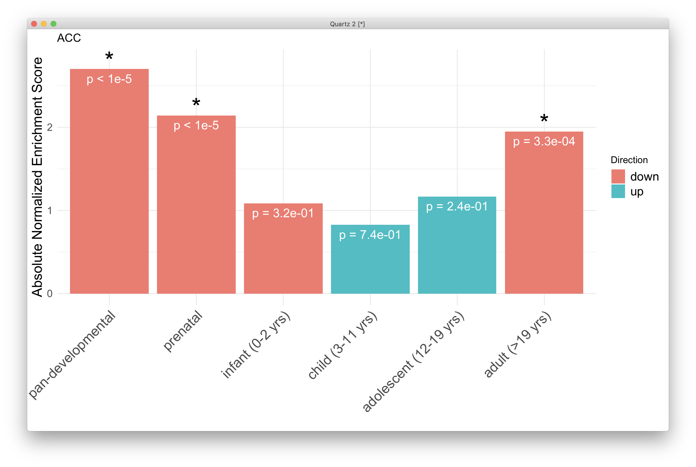
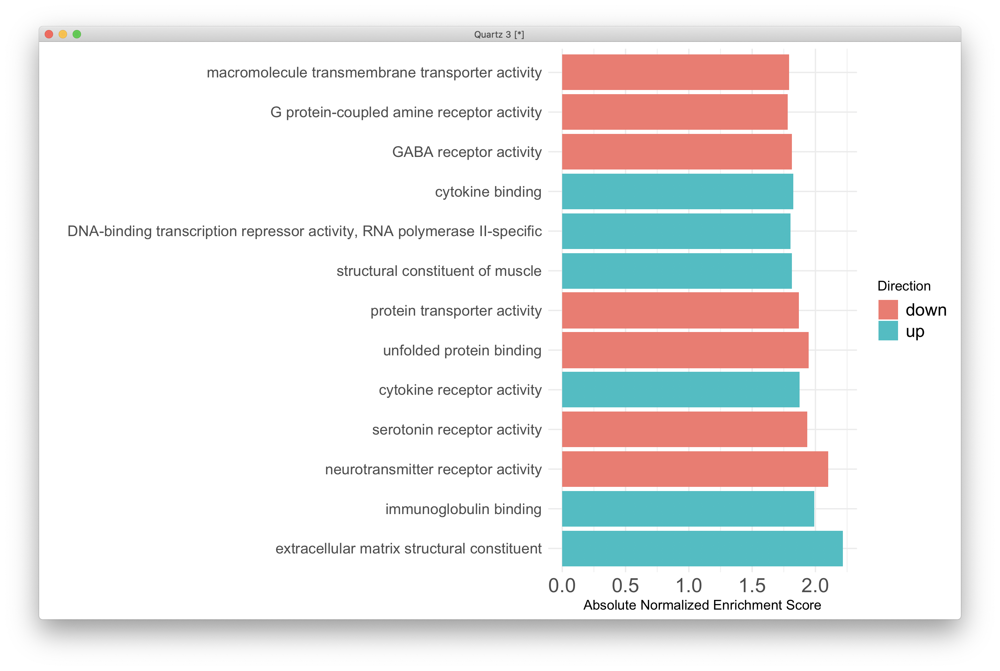
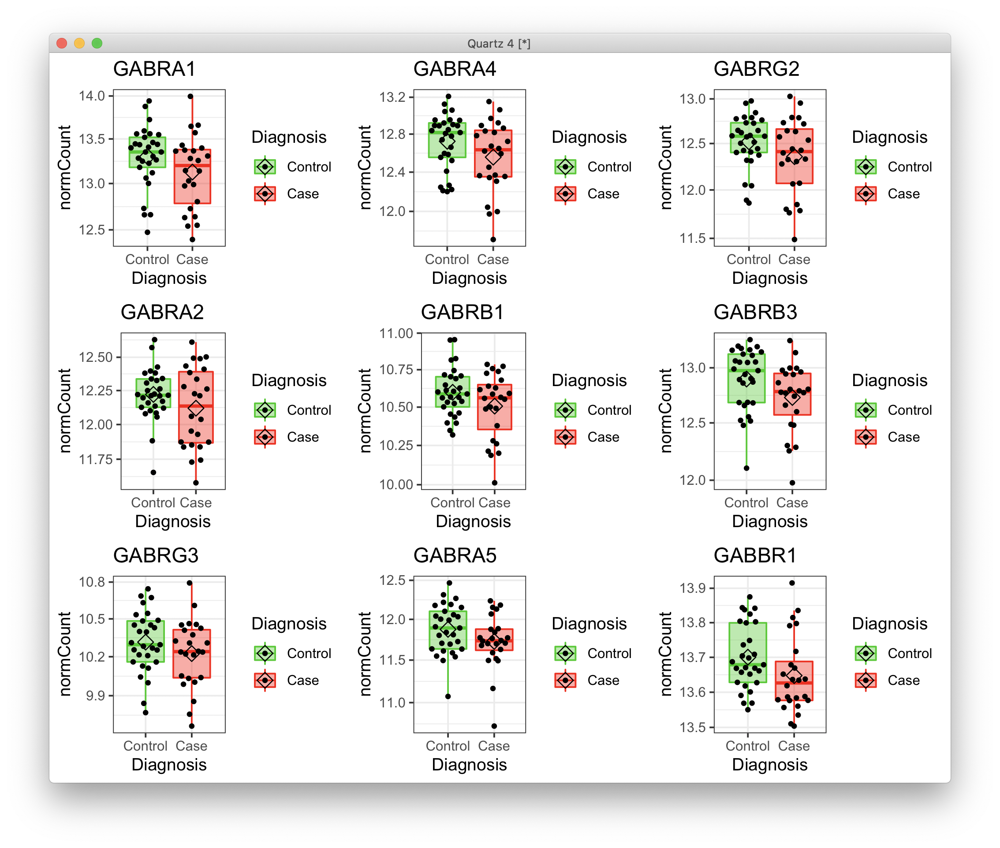
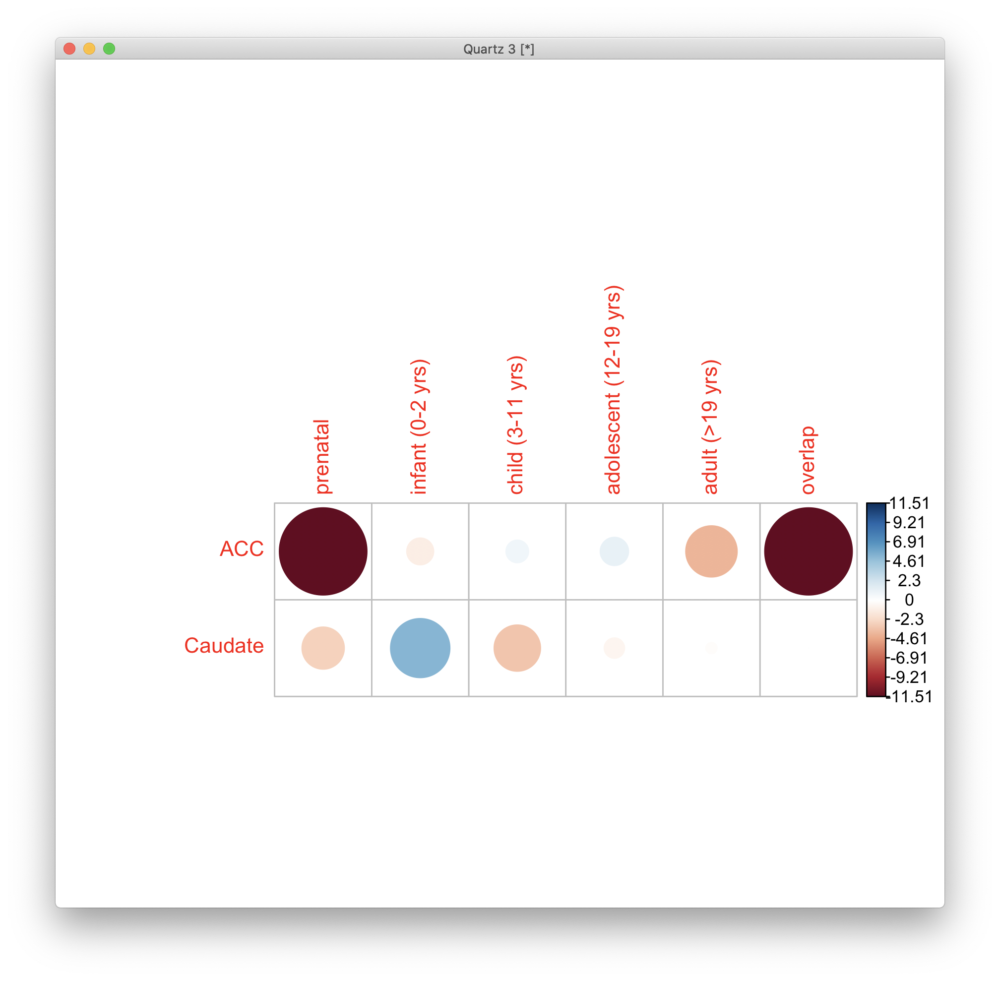
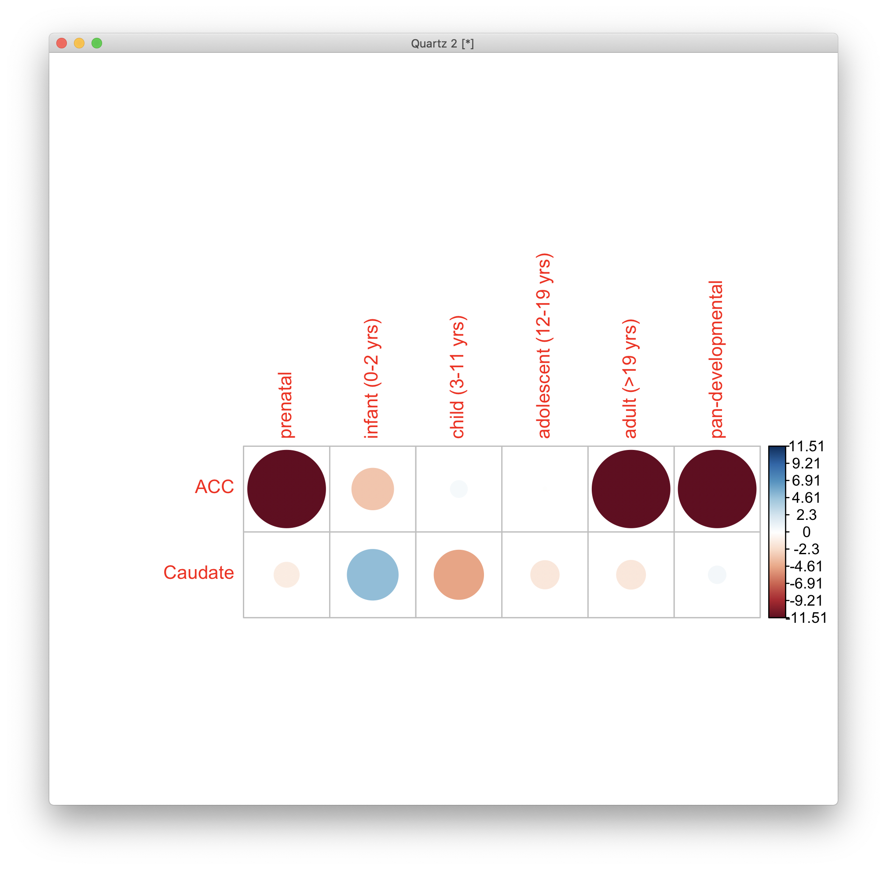
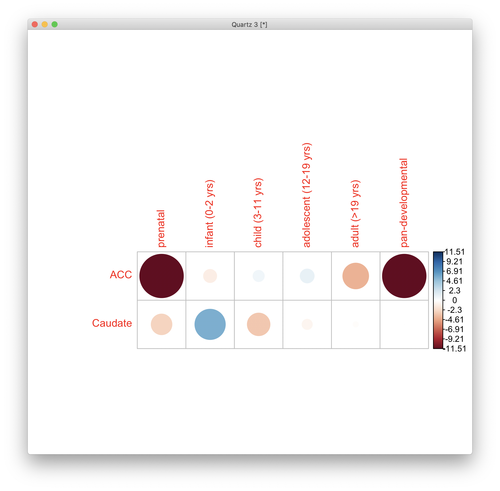
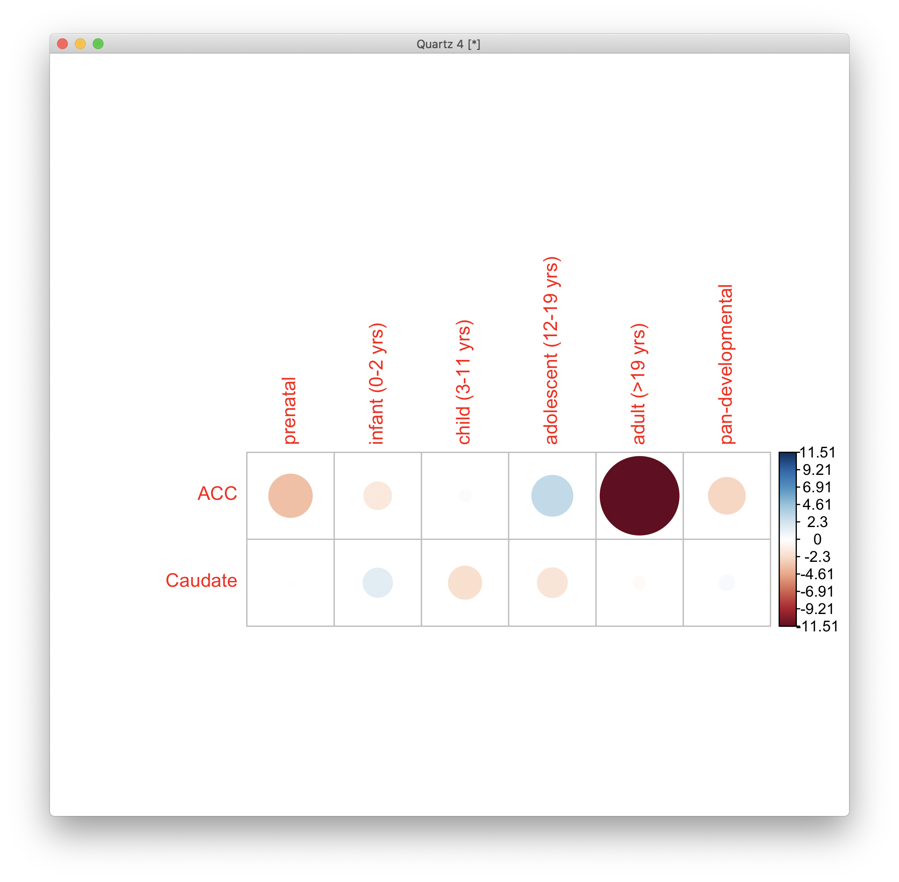
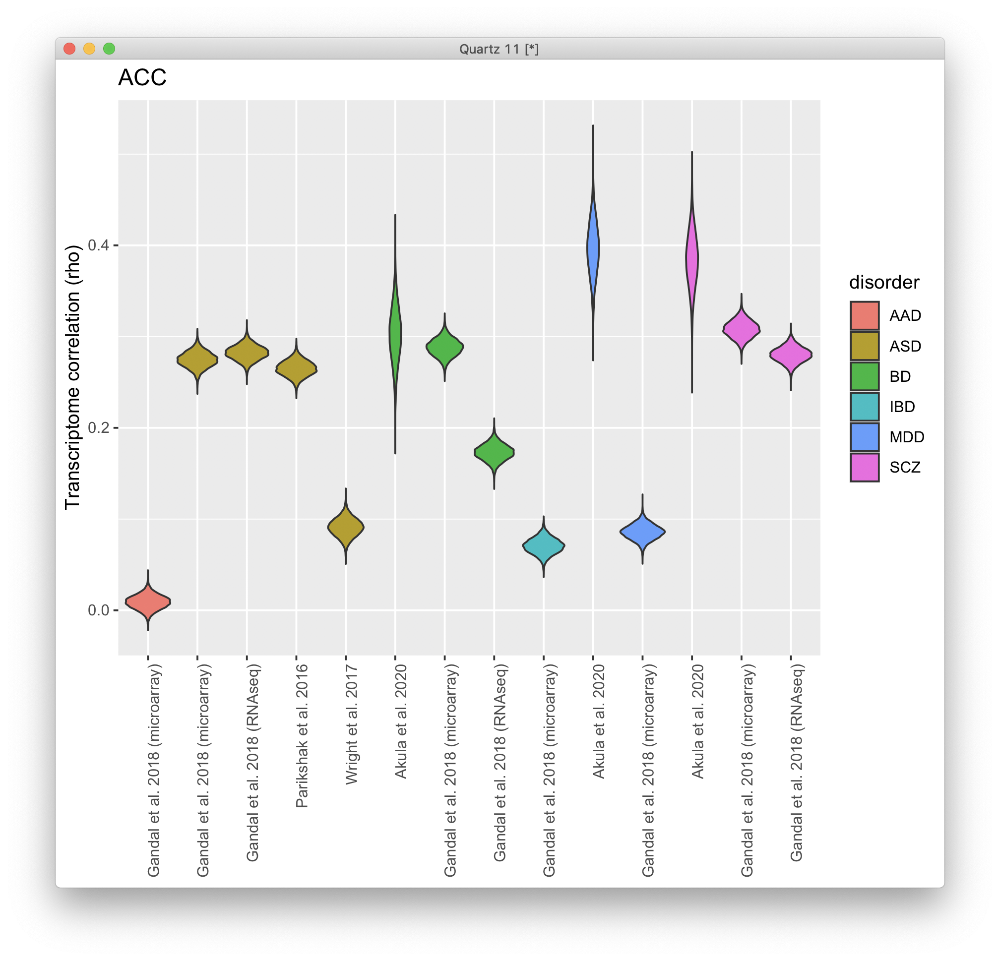
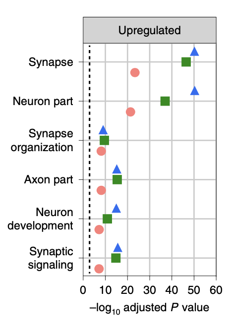

# 2021-04-21 14:15:21

Let's do the PCA figures:

```r
data = read.table('~/data/rnaseq_derek/adhd_rnaseq_counts.txt', header=1)
rownames(data) = data[,1]
data[,1] = NULL
data = round(data)
sub_name = gsub(x=colnames(data), pattern='X', replacement='')
colnames(data) = sub_name
# # this is a repeat for Caudate hbcc 2877, but has more genes with zeros than
# # its other replicate
# data = data[, ! colnames(data) %in% c('66552')]
# # outliers based on PCA plots
# outliers = c('68080','68096', '68108', '68084', '68082')
# data = data[, ! colnames(data) %in% outliers]

library(gdata)
df = read.xls('~/data/post_mortem/POST_MORTEM_META_DATA_JAN_2021.xlsx')
data = data[, colnames(data) %in% df$submitted_name]
df = df[df$submitted_name %in% colnames(data), ]
df = df[order(df$submitted_name), ]
data = data[, order(df$submitted_name)]

# cleaning up some variables
df$Individual = factor(df$hbcc_brain_id)
df[df$Manner.of.Death=='Suicide (probable)', 'Manner.of.Death'] = 'Suicide'
df[df$Manner.of.Death=='unknown', 'Manner.of.Death'] = 'natural'
df$MoD = factor(df$Manner.of.Death)
df$Sex = factor(df$Sex)
df$batch = factor(df$batch)
df$run_date = factor(gsub(df$run_date, pattern='-', replacement=''))
df$Diagnosis = factor(df$Diagnosis, levels=c('Control', 'Case'))
df$Region = factor(df$Region, levels=c('Caudate', 'ACC'))
df$substance_group = factor(df$substance_group)
df$comorbid_group = factor(df$comorbid_group_update)
df$evidence_level = factor(df$evidence_level)
df$brainbank = factor(df$bainbank)
# replace the one subject missing population PCs by the median of their
# self-declared race and ethnicity
idx = (df$Race.x=='White' & df$Ethnicity.x=='Non-Hispanic' & !is.na(df$C1))
pop_pcs = c('C1', 'C2', 'C3', 'C4', 'C5')
med_pop = apply(df[idx, pop_pcs], 2, median)
df[which(is.na(df$C1)), pop_pcs] = med_pop
df$BBB = factor(sapply(1:nrow(df),
                        function(x) sprintf('%s_%s',
                                    as.character(df[x,'brainbank']),
                                    as.character(df[x, 'batch']))))
df$BBB2 = NA                                                                        
df[df$brainbank=='nimh_hbcc', 'BBB2'] = 1                                           
df[df$batch==3, 'BBB2'] = 2                                                         
df[df$batch==4, 'BBB2'] = 3      
df$BBB2 = factor(df$BBB2)                                                   
                    
library(GenomicFeatures)
txdb <- loadDb('~/data/post_mortem/Homo_sapies.GRCh38.97.sqlite')
txdf <- select(txdb, keys(txdb, "GENEID"), columns=c('GENEID','TXCHROM'),
            "GENEID")
bt = read.csv('~/data/post_mortem/Homo_sapiens.GRCh38.97_biotypes.csv')
bt_slim = bt[, c('gene_id', 'gene_biotype')]
bt_slim = bt_slim[!duplicated(bt_slim),]
txdf = merge(txdf, bt_slim, by.x='GENEID', by.y='gene_id')
tx_meta = data.frame(GENEID = substr(rownames(data), 1, 15))
tx_meta = merge(tx_meta, txdf, by='GENEID', sort=F)
imautosome = which(tx_meta$TXCHROM != 'X' &
                tx_meta$TXCHROM != 'Y' &
                tx_meta$TXCHROM != 'MT')
data = data[imautosome, ]
tx_meta = tx_meta[imautosome, ]

library("DESeq2")
fm_str = '~ BBB2 + Diagnosis'
dds <- DESeqDataSetFromMatrix(countData = data,
                                colData = df,
                                design = as.formula(fm_str))
library(pcaExplorer)
pcaExplorer(dds)
```

Grabbed the PCa figures I needed. Let's grab the data for Table 2:

```
r$> load('~/data/post_mortem/basic_DGE_04202021.RData')                                 

r$> dim(dds.ACC)                                                                        
[1] 23675    53

r$> dim(dds.Caudate)                                                                    
[1] 24059    56

r$> df = rbind(colData(dds.ACC), colData(dds.Caudate))

r$> chisq.test(table(df$Region, df$Diagnosis))                                          

        Pearson's Chi-squared test with Yates' continuity correction

data:  table(df$Region, df$Diagnosis)
X-squared = 0.0038412, df = 1, p-value = 0.9506


r$> dim(df)                                                                             
[1] 109  61

r$> idx = df$Region=='ACC'                                                              

r$> mean(df[idx,'RINe'])                                                                
[1] 5.330189

r$> sd(df[idx,'RINe'])                                                                  
[1] 0.7556416

r$> mean(df[idx,'pcnt_optical_duplicates'])                                             
[1] 3.33

r$> sd(df[idx,'pcnt_optical_duplicates'])                                               
[1] 1.644002

r$> mean(df[!idx,'RINe'])                                                               
[1] 5.910714

r$> sd(df[!idx,'RINe'])                                                                 
[1] 0.5895078

r$> mean(df[!idx,'pcnt_optical_duplicates'])                                            
[1] 2.960179

r$> sd(df[!idx,'pcnt_optical_duplicates'])                                              
[1] 1.307745

r$> mean(df[!idx,'clusters'])                                                           
[1] 113772537

r$> sd(df[!idx,'clusters'])                                                             
[1] 33776915

r$> mean(df[idx,'clusters'])                                                            
[1] 108093178

r$> sd(df[idx,'clusters'])                                                              
[1] 30783939

r$> x='RINe'; t.test(df[idx & df$Diagnosis!='Control', x], df[idx&df$Diagnosis=='Control', x])
                                                                                              
l
         Welch Two Sample t-test

data:  df[idx & df$Diagnosis != "Control", x] and df[idx & df$Diagnosis == "Control", x]
t = -1.2432, df = 46.513, p-value = 0.22
alternative hypothesis: true difference in means is not equal to 0
95 percent confidence interval:
 -0.6828642  0.1613125
sample estimates:
mean of x mean of y 
 5.187500  5.448276 


r$> x='RINe'; t.test(df[!idx&df$Diagnosis!='Control',x], df[!idx&df$Diagnosis=='Control',x])  

        Welch Two Sample t-test

data:  df[!idx & df$Diagnosis != "Control", x] and df[!idx & df$Diagnosis == "Control", x]
t = 0.87704, df = 53.999, p-value = 0.3844
alternative hypothesis: true difference in means is not equal to 0
95 percent confidence interval:
 -0.1728015  0.4415515
sample estimates:
mean of x mean of y 
 5.987500  5.853125 

r$> x='pcnt_optical_duplicates'; t.test(df[!idx&df$Diagnosis!='Control',x], df[!idx&df$Diagnos
    is=='Control',x])                                                                         

        Welch Two Sample t-test

data:  df[!idx & df$Diagnosis != "Control", x] and df[!idx & df$Diagnosis == "Control", x]
t = 0.65519, df = 53.993, p-value = 0.5151
alternative hypothesis: true difference in means is not equal to 0
95 percent confidence interval:
 -0.4604934  0.9075767
sample estimates:
mean of x mean of y 
 3.087917  2.864375 


r$> x='pcnt_optical_duplicates'; t.test(df[idx&df$Diagnosis!='Control',x], df[idx&df$Diagnosis
    =='Control',x])                                                                           

        Welch Two Sample t-test

data:  df[idx & df$Diagnosis != "Control", x] and df[idx & df$Diagnosis == "Control", x]
t = 1.5047, df = 50.385, p-value = 0.1387
alternative hypothesis: true difference in means is not equal to 0
95 percent confidence interval:
 -0.2239922  1.5626991
sample estimates:
mean of x mean of y 
 3.696250  3.026897 
```

## Developmental sets

```r
r = 'Caudate'

df = read.table(sprintf('~/data/post_mortem/Project_WG26_DGE_%s_BBB2_%s_developmental_10K/enrichment_results_WG26_DGE_%s_BBB2_%s_developmental_10K.txt',
                          r, tolower(r), r, tolower(r)),
                  header=1, sep='\t')[, 1:6]
df[df$link=='overlap', 'link'] = 'pan-developmental'
df$link = as.character(df$link)
df$link = factor(df$link, levels=c("pan-developmental", "prenatal",
                                   "infant (0-2 yrs)", "child (3-11 yrs)",
                                   "adolescent (12-19 yrs)", "adult (>19 yrs)"))
df$Direction = ifelse(df$normalizedEnrichmentScore > 0, 'up', 'down')
df$str = sapply(df$pValue, function(x) sprintf('p = %.1e', x))
df$star_pos = abs(df$normalizedEnrichmentScore) + .1
df[df$pValue ==0, 'str'] = 'p < 1e-5'

star_me = as.character(df[df$FDR < .05, 'link'])
stars.df <- df[df$link %in% star_me, c('link', 'star_pos')]

quartz()
library(ggplot2)
ggplot(data=df, aes(x=link, y=abs(normalizedEnrichmentScore), fill=Direction)) +
  geom_bar(stat="identity")+
  geom_text(aes(label=str), vjust=1.6, size=5, color='white')+
  theme_minimal() + ylab('Absolute Normalized Enrichment Score') + xlab('') +
  theme(axis.text.x = element_text(angle = 45, hjust=1, size=16),
        axis.title.y = element_text(size=16),
        axis.text.y = element_text(size=12),
        legend.text = element_text(size=14)) +
  geom_text(data = stars.df, aes(y = star_pos, fill=NA), label = "*",
            size = 10) + ggtitle(r)
```




## ACC Mollecular Functions

```r
r = 'ACC'
db = 'geneontology_Molecular_Function_noRedundant'

df = read.table(sprintf('~/data/post_mortem/Project_WG26_DGE_%s_BBB2_%s_10K/enrichment_results_WG26_DGE_%s_BBB2_%s_10K.txt',
                          r, db, r, db),
                  header=1, sep='\t')[, 1:7]
df = df[df$FDR < .05, c('description', 'normalizedEnrichmentScore')]
df$Direction = ifelse(df$normalizedEnrichmentScore > 0, 'up', 'down')
df$star_pos = abs(df$normalizedEnrichmentScore)
my_order = order(df$star_pos)
df$description = as.character(df$description)
# organizing based on separate groups (for now, don't do anything)
mylevels = c("respiratory burst",
             "pri-miRNA transcription by RNA polymerase II",
             "microtubule organizing center organization",
             "regulation of synapse structure or activity",
             "regulation of trans-synaptic signaling",
             "chemical synaptic transmission, postsynaptic",
             "synapse organization",
             "vascular endothelial growth factor receptor signaling pathway",
             "gamma-aminobutyric acid signaling pathway",
             "serotonin receptor signaling pathway"
             )
mylevels = df$description
df$description = factor(df$description, levels=mylevels)

library(ggplot2)
ggplot(data=df, aes(x=description, y=abs(normalizedEnrichmentScore), fill=Direction)) +
  geom_bar(stat="identity")+ coord_flip() +
  theme_minimal() + ylab('Absolute Normalized Enrichment Score') + xlab('') +
  theme(axis.text.x = element_text(size=16),
        axis.title.y = element_text(size=16),
        axis.text.y = element_text(size=12),
        legend.text = element_text(size=14))
```



# Specific genes of a given pathway

```r
r = 'ACC'
db = 'geneontology_Molecular_Function_noRedundant'

df = read.table(sprintf('~/data/post_mortem/Project_WG26_DGE_%s_BBB2_%s_10K/enrichment_results_WG26_DGE_%s_BBB2_%s_10K.txt',
                          r, db, r, db),
                  header=1, sep='\t')
genes = df[df$description=='GABA receptor activity', 'userId']
gene_list = strsplit(genes, ';')[[1]]

load('~/data/post_mortem/basic_DGE_04202021.RData')
res_str = sprintf('dds = dds.%s', r)
eval(parse(text=res_str))

vsd <- vst(dds, blind=FALSE)
norm.cts <- assay(vsd)
mat <- limma::removeBatchEffect(norm.cts, vsd$BBB2)

gnames = data.frame(full=rownames(counts(dds)),
                    nov=substr(rownames(counts(dds)), 1, 15))
mart = readRDS('~/data/rnaseq_derek/mart_rnaseq.rds')
gnames = merge(gnames, mart, by.x='nov', by.y='ensembl_gene_id')
keep_me = gnames$nov %in% gene_list
gene_ids = gnames[keep_me, ]

resid_expr = reshape2::melt(mat[gene_ids$full,])
colnames(resid_expr) = c('gene', 'submitted_name', 'normCount')
junk = colData(vsd)[, c('Diagnosis', 'submitted_name')]
resid_expr = merge(resid_expr, junk, by='submitted_name')
resid_expr = merge(resid_expr, gene_ids, by.x='gene', by.y='full')

# plotting each of the significant genes
library(ggpubr)
library(ggbeeswarm)
quartz()
myplots = list()
clrs = c("green3", "red")
for (g in 1:nrow(gene_ids)) {
    cat(gene_ids[g, 'nov'], '\n')
    d = as.data.frame(resid_expr[resid_expr$nov == gene_list[g],])
    p = (ggplot(d, aes(x=Diagnosis, y=normCount, color = Diagnosis,
                    fill = Diagnosis)) + 
        scale_y_log10() +
        geom_boxplot(alpha = 0.4, outlier.shape = NA, width = 0.8,
                    lwd = 0.5) +
        stat_summary(fun = mean, geom = "point", color = "black",
                    shape = 5, size = 3,
                    position=position_dodge(width = 0.8)) +
        scale_color_manual(values = clrs) +
        scale_fill_manual(values = clrs) +
        geom_quasirandom(color = "black", size = 1, dodge.width = 0.8) +
        theme_bw() + #theme(legend.position = "none") + 
        ggtitle(gene_ids[g, 'hgnc_symbol']))
    myplots[[g]] = p
}
p = ggarrange(plotlist=myplots)
print(p)
```



# 2021-04-26 20:15:32

Let's put the two volcano plots in the same axis:

```r
quartz()

library(ggpubr)
library(EnhancedVolcano)
FCcutoff = 1.0
pCutoff = .05

myplots = list()
res = read.csv('~/data/post_mortem/DGE_ACC_RINe_BBB2_annot_04262021.csv')
res = res[order(res$pvalue), ]
sigPs = sum(res$padj.FDR <= pCutoff, na.rm=T)
ps = -log10(res$pvalue)
nomPcutoff = ps[sigPs + 1] + (ps[sigPs] - ps[sigPs + 1]) / 2
nomPcutoff = 10 ** (-nomPcutoff)
ymax = ceiling(max(-log10(res$pvalue), na.rm=T))
p = EnhancedVolcano(data.frame(res), lab=res$hgnc_symbol,
                    x = 'log2FoldChange',
                    y = 'pvalue', xlab = bquote(~Log[2]~ 'fold change'),
                    ylab = bquote(~-Log[10]~italic(P)),
                    title = 'ACC',
                    ylim = c(0, ymax),
                    pCutoff = nomPcutoff, FCcutoff = FCcutoff, pointSize = 1.0,
                    labSize = 2.0, subtitle=NULL,
                    axisLabSize = 12,
                    caption = NULL, legendPosition = 'none')
myplots[[1]] = p

res = read.csv('~/data/post_mortem/DGE_Caudate_RINe_BBB2_annot_04262021.csv')
sigPs = sum(res$padj.FDR <= pCutoff, na.rm=T)
ps = -log10(res$pvalue)
nomPcutoff = ps[sigPs + 1] + (ps[sigPs] - ps[sigPs + 1]) / 2
nomPcutoff = 10 ** (-nomPcutoff)
p = EnhancedVolcano(data.frame(res), lab=res$hgnc_symbol,
                    x = 'log2FoldChange',
                    y = 'pvalue', xlab = bquote(~Log[2]~ 'fold change'),
                    ylab = bquote(~-Log[10]~italic(P)),
                    title = 'Caudate',
                    ylim = c(0, ymax),
                    pCutoff = nomPcutoff, FCcutoff = FCcutoff, pointSize = 1.0,
                    labSize = 2.0, subtitle=NULL,
                    axisLabSize = 12,
                    caption = NULL, legendPosition = 'none')
myplots[[2]] = p
ggarrange(plotlist=myplots)
```


## Ellyptical plot for developmental results

```r
res = read.csv('~/data/post_mortem/WG30_DGE_ACC_RINe_BBB2_acc_developmental_10K.csv')
res = res[order(res$geneSet), c('link', 'normalizedEnrichmentScore', 'pValue', 'FDR')]

dev = res
dev$Region = 'ACC'
res = read.csv('~/data/post_mortem/WG30_DGE_Caudate_RINe_BBB2_caudate_developmental_10K.csv')
res = res[order(res$geneSet), c('link', 'normalizedEnrichmentScore', 'pValue', 'FDR')]
res$Region = 'Caudate'
dev = rbind(dev, res)

df = matrix(nrow = 2, ncol = 6, dimnames=list(c('ACC', 'Caudate'),
                                              res$link))
for (i in 1:nrow(df)) {
    for (j in 1:ncol(df)) {
        idx = dev$Region == rownames(df)[i] & dev$link == colnames(df)[j]
        if (dev[idx, 'pValue'] == 0) {
            dev[idx, 'pValue'] = 1e-5
        }
        df[i, j] = (sign(dev[idx, 'normalizedEnrichmentScore']) *
                    -log(dev[idx, 'pValue']))
    }
}

library(corrplot)
mylim = max(abs(df))
quartz()
corrplot(df, is.corr=F, cl.lim=c(-mylim, mylim))
```



# 2021-04-27 14:48:28

I ran the different sets, so maybe this will be better:

```r
keep_me = c("dev1_c0.950_devSpec", "dev2_c0.950_devSpec", "dev3_c0.950_devSpec",
            "dev4_c0.950_devSpec", "dev5_c0.950_devSpec", "overlap_c0.950")

db = 'manySets_co0_950'
r = 'ACC'
dev_str = sprintf('%s_%s', tolower(r), db)
dir_name = sprintf('~/data/post_mortem/Project_WG30_DGE_%s_RINe_BBB2_%s_10K/',
                   r, dev_str)
file_name = sprintf('enrichment_results_WG30_DGE_%s_RINe_BBB2_%s_10K.txt',
                    r, dev_str)
res = read.table(sprintf('%s/%s', dir_name, file_name), header=1, sep='\t')
res = res[res$geneSet %in% keep_me, ]
res = res[order(res$geneSet), c('link', 'normalizedEnrichmentScore', 'pValue')]
dev = res
dev$Region = r

r = 'Caudate'
dev_str = sprintf('%s_%s', tolower(r), db)
dir_name = sprintf('~/data/post_mortem/Project_WG30_DGE_%s_RINe_BBB2_%s_10K/',
                   r, dev_str)
file_name = sprintf('enrichment_results_WG30_DGE_%s_RINe_BBB2_%s_10K.txt',
                    r, dev_str)
res = read.table(sprintf('%s/%s', dir_name, file_name), header=1, sep='\t')
res = res[res$geneSet %in% keep_me, ]
res = res[order(res$geneSet), c('link', 'normalizedEnrichmentScore', 'pValue')]
res$Region = r
dev = rbind(dev, res)

df = matrix(nrow = 2, ncol = 6, dimnames=list(c('ACC', 'Caudate'),
                                              res$link))
for (i in 1:nrow(df)) {
    for (j in 1:ncol(df)) {
        idx = dev$Region == rownames(df)[i] & dev$link == colnames(df)[j]
        if (dev[idx, 'pValue'] == 0) {
            dev[idx, 'pValue'] = 1e-5
        }
        df[i, j] = (sign(dev[idx, 'normalizedEnrichmentScore']) *
                    -log(dev[idx, 'pValue']))
    }
}

colnames(df)[ncol(df)] = 'pan-developmental'
library(corrplot)
mylim = max(abs(df))
quartz()
corrplot(df, is.corr=F, cl.lim=c(-mylim, mylim))
```



Now, let's make the same plot using the .9 threshold:

```r
keep_me = c("dev1_c0.900_devSpec", "dev2_c0.900_devSpec", "dev3_c0.900_devSpec",
            "dev4_c0.900_devSpec", "dev5_c0.900_devSpec", "overlap_c0.900")

db = 'manySets_co0_900'
r = 'ACC'
dev_str = sprintf('%s_%s', tolower(r), db)
dir_name = sprintf('~/data/post_mortem/Project_WG30_DGE_%s_RINe_BBB2_%s_10K/',
                   r, dev_str)
file_name = sprintf('enrichment_results_WG30_DGE_%s_RINe_BBB2_%s_10K.txt',
                    r, dev_str)
res = read.table(sprintf('%s/%s', dir_name, file_name), header=1, sep='\t')
res = res[res$geneSet %in% keep_me, ]
res = res[order(res$geneSet), c('link', 'normalizedEnrichmentScore', 'pValue')]
dev = res
dev$Region = r

r = 'Caudate'
dev_str = sprintf('%s_%s', tolower(r), db)
dir_name = sprintf('~/data/post_mortem/Project_WG30_DGE_%s_RINe_BBB2_%s_10K/',
                   r, dev_str)
file_name = sprintf('enrichment_results_WG30_DGE_%s_RINe_BBB2_%s_10K.txt',
                    r, dev_str)
res = read.table(sprintf('%s/%s', dir_name, file_name), header=1, sep='\t')
res = res[res$geneSet %in% keep_me, ]
res = res[order(res$geneSet), c('link', 'normalizedEnrichmentScore', 'pValue')]
res$Region = r
dev = rbind(dev, res)

df = matrix(nrow = 2, ncol = 6, dimnames=list(c('ACC', 'Caudate'),
                                              res$link))
for (i in 1:nrow(df)) {
    for (j in 1:ncol(df)) {
        idx = dev$Region == rownames(df)[i] & dev$link == colnames(df)[j]
        if (dev[idx, 'pValue'] == 0) {
            dev[idx, 'pValue'] = 1e-5
        }
        df[i, j] = (sign(dev[idx, 'normalizedEnrichmentScore']) *
                    -log(dev[idx, 'pValue']))
    }
}

colnames(df)[ncol(df)] = 'pan-developmental'
library(corrplot)
mylim = max(abs(df))
quartz()
corrplot(df, is.corr=F, cl.lim=c(-mylim, mylim))
```



And we use co.9 to make the regionSpec plots too, as we don't have all sets in
.95:

```r
keep_me = c("dev1_c0.900_devSpec_regSpec", "dev2_c0.900_devSpec_regSpec",
            "dev3_c0.900_devSpec_regSpec", "dev4_c0.900_devSpec_regSpec",
            "dev5_c0.900_devSpec_regSpec", "overlap_c0.900_regSpec")

db = 'manySets_co0_900'
r = 'ACC'
dev_str = sprintf('%s_%s', tolower(r), db)
dir_name = sprintf('~/data/post_mortem/Project_WG30_DGE_%s_RINe_BBB2_%s_10K/',
                   r, dev_str)
file_name = sprintf('enrichment_results_WG30_DGE_%s_RINe_BBB2_%s_10K.txt',
                    r, dev_str)
res = read.table(sprintf('%s/%s', dir_name, file_name), header=1, sep='\t')
res = res[res$geneSet %in% keep_me, ]
res = res[order(res$geneSet), c('link', 'normalizedEnrichmentScore', 'pValue')]
dev = res
dev$Region = r

r = 'Caudate'
dev_str = sprintf('%s_%s', tolower(r), db)
dir_name = sprintf('~/data/post_mortem/Project_WG30_DGE_%s_RINe_BBB2_%s_10K/',
                   r, dev_str)
file_name = sprintf('enrichment_results_WG30_DGE_%s_RINe_BBB2_%s_10K.txt',
                    r, dev_str)
res = read.table(sprintf('%s/%s', dir_name, file_name), header=1, sep='\t')
res = res[res$geneSet %in% keep_me, ]
res = res[order(res$geneSet), c('link', 'normalizedEnrichmentScore', 'pValue')]
res$Region = r
dev = rbind(dev, res)

df = matrix(nrow = 2, ncol = 6, dimnames=list(c('ACC', 'Caudate'),
                                              res$link))
for (i in 1:nrow(df)) {
    for (j in 1:ncol(df)) {
        idx = dev$Region == rownames(df)[i] & dev$link == colnames(df)[j]
        if (dev[idx, 'pValue'] == 0) {
            dev[idx, 'pValue'] = 1e-5
        }
        df[i, j] = (sign(dev[idx, 'normalizedEnrichmentScore']) *
                    -log(dev[idx, 'pValue']))
    }
}

colnames(df)[ncol(df)] = 'pan-developmental'
library(corrplot)
mylim = max(abs(df))
quartz()
corrplot(df, is.corr=F, cl.lim=c(-mylim, mylim))
```



# 2021-04-28 11:56:46

Let's make some stylistic changes to the correlation plot:

```r
library(corrplot)
keep_me = c("dev1_c0.950_devSpec", "dev2_c0.950_devSpec", "dev3_c0.950_devSpec",
            "dev4_c0.950_devSpec", "dev5_c0.950_devSpec", "overlap_c0.950")

db = 'manySets_co0_950'
r = 'ACC'
ncomps = 12
dev_str = sprintf('%s_%s', tolower(r), db)
dir_name = sprintf('~/data/post_mortem/Project_WG30_DGE_%s_RINe_BBB2_%s_10K/',
                   r, dev_str)
file_name = sprintf('enrichment_results_WG30_DGE_%s_RINe_BBB2_%s_10K.txt',
                    r, dev_str)
res = read.table(sprintf('%s/%s', dir_name, file_name), header=1, sep='\t')
res = res[res$geneSet %in% keep_me, ]
res = res[order(res$geneSet), c('link', 'normalizedEnrichmentScore', 'pValue')]
res[res$pValue == 0, 'pValue'] = 1e-5
df_plot = t(as.matrix(sign(res$normalizedEnrichmentScore) * -log(res$pValue)))
colnames(df_plot) = res$link
rownames(df_plot) = r
colnames(df_plot)[ncol(df_plot)] = 'pan-developmental'
mylim = max(abs(df_plot))
pvals = t(as.matrix(res$pValue))
colnames(pvals) = colnames(df_plot)
rownames(pvals) = rownames(df_plot)

# just to get color for the overlap
quartz()
corrplot(df_plot, is.corr=F, cl.lim=c(-mylim, mylim), tl.col='black',
         p.mat=pvals,
         insig = "label_sig", pch.col = "white",
         sig.level=.01/ncomps)
# ACC plot without overlap
plot_matrix = t(as.matrix(df_plot[, 1:5]))
pvals_matrix = t(as.matrix(pvals[, 1:5]))
rownames(plot_matrix) = r
rownames(pvals_matrix) = r
corrplot(plot_matrix, is.corr=F, cl.lim=c(-mylim, mylim), tl.col='black',
         p.mat=pvals_matrix, insig = "label_sig", pch.col = "white",
         sig.level=.01/ncomps)

r = 'Caudate'
dev_str = sprintf('%s_%s', tolower(r), db)
dir_name = sprintf('~/data/post_mortem/Project_WG30_DGE_%s_RINe_BBB2_%s_10K/',
                   r, dev_str)
file_name = sprintf('enrichment_results_WG30_DGE_%s_RINe_BBB2_%s_10K.txt',
                    r, dev_str)
res = read.table(sprintf('%s/%s', dir_name, file_name), header=1, sep='\t')
res = res[res$geneSet %in% keep_me, ]
res = res[order(res$geneSet), c('link', 'normalizedEnrichmentScore', 'pValue')]
res[res$pValue == 0, 'pValue'] = 1e-5
df_plot = t(as.matrix(sign(res$normalizedEnrichmentScore) * -log(res$pValue)))
colnames(df_plot) = res$link
rownames(df_plot) = r
colnames(df_plot)[ncol(df_plot)] = 'pan-developmental'
pvals = t(as.matrix(res$pValue))
colnames(pvals) = colnames(df_plot)
rownames(pvals) = rownames(df_plot)

quartz()
# just to get color for the overlap
if (!any(pvals < .01/ncomps)) {
    # getting some plotting errors when nothing was significant
    corrplot(df_plot, is.corr=F, cl.lim=c(-mylim, mylim), tl.col='black')
} else {
    corrplot(df_plot, is.corr=F, cl.lim=c(-mylim, mylim), tl.col='black', p.mat=pvals,
            insig = "label_sig", pch.col = "white",
            sig.level=.01/ncomps)
}
# Caudate
quartz()
plot_matrix = t(as.matrix(df_plot[, 1:5]))
pvals_matrix = t(as.matrix(pvals[, 1:5]))
rownames(plot_matrix) = r
rownames(pvals_matrix) = r
if (!any(pvals_matrix < .01/ncomps)) {
    # getting some plotting errors when nothing was significant
    corrplot(plot_matrix, is.corr=F, cl.lim=c(-mylim, mylim), tl.col='black')
} else {
    corrplot(plot_matrix, is.corr=F, cl.lim=c(-mylim, mylim), tl.col='black',
            p.mat=pvals_matrix,
            insig = "label_sig", pch.col = "white",
            sig.level=.01/ncomps)
}
```

Now we make the correlation to other disorder plots again:

```r
fname = 'disorders_corrs_RINe_BBB2_04262021'
corrs = readRDS(sprintf('~/data/post_mortem/%s.rds', fname))
corrs$disorder = factor(corrs$disorder)
# just to share axis
ymax = max(corrs$corr)
ymin = min(corrs$corr)
my_colors = RColorBrewer::brewer.pal(7, "Accent")

r = 'ACC' 
mycorrs = corrs[corrs$region == r, ]
mycorrs$id = sapply(1:nrow(mycorrs),
                  function(i) sprintf('%s_%s',
                                      mycorrs[i, 'disorder'],
                                      mycorrs[i, 'source']))
library(ggplot2)
quartz()
my_labels = c('Gandal et al. 2018 (microarray)',
              'Gandal et al. 2018 (microarray)',
              'Gandal et al. 2018 (RNAseq)',
              'Parikshak et al. 2016',
              'Wright et al. 2017',
              'Akula et al. 2020',
              'Gandal et al. 2018 (microarray)',
              'Gandal et al. 2018 (RNAseq)',
              'Gandal et al. 2018 (microarray)',
              'Akula et al. 2020',
              'Gandal et al. 2018 (microarray)',
              'Akula et al. 2020',
              'Gandal et al. 2018 (microarray)',
              'Gandal et al. 2018 (RNAseq)'
              )
p <- ggplot(mycorrs, aes(x = factor(id), y = corr, fill=disorder)) +
    geom_violin(trim=FALSE) +
    theme(axis.text.x = element_text(angle = 90, hjust=1, vjust=0.5),
          axis.title.x = element_blank())
p + ggtitle(r) + geom_hline(yintercept=0, linetype="dotted",
                                color = "red", size=1) +
   ylab('Transcriptome correlation (rho)') + ylim(ymin, ymax) + 
   scale_fill_manual(breaks = levels(corrs$disorder),
                                     values = my_colors) +
   scale_x_discrete(labels=my_labels) 


r = 'Caudate' 
mycorrs = corrs[corrs$region == r, ]
mycorrs$id = sapply(1:nrow(mycorrs),
                  function(i) sprintf('%s_%s',
                                      mycorrs[i, 'disorder'],
                                      mycorrs[i, 'source']))
library(ggplot2)
quartz()
my_labels = c('Gandal et al. 2018 (microarray)',
              'Gandal et al. 2018 (microarray)',
              'Gandal et al. 2018 (RNAseq)',
              'Gandal et al. 2018 (microarray)',
              'Gandal et al. 2018 (RNAseq)',
              'Pacifico and Davis, 2017',
              'Gandal et al. 2018 (microarray)',
              'Gandal et al. 2018 (microarray)',
              'Piantadosi et al. 2021',
              'Benjamin et al. 2020',
              'Gandal et al. 2018 (microarray)',
              'Gandal et al. 2018 (RNAseq)'
              )
p <- ggplot(mycorrs, aes(x = factor(id), y = corr, fill=disorder)) +
    geom_violin(trim=FALSE) +
    theme(axis.text.x = element_text(angle = 90, hjust=1, vjust=0.5),
          axis.title.x = element_blank())
p + ggtitle(r) + geom_hline(yintercept=0, linetype="dotted",
                                color = "red", size=1) +
   ylab('Transcriptome correlation (rho)') + ylim(ymin, ymax) + 
   scale_fill_manual(breaks = levels(corrs$disorder),
                                     values = my_colors) +
   scale_x_discrete(labels=my_labels) 

```



## GSEA ontology

Time to plot the GSEA results. I looked a bit and the Molecular function sets
look the best, but we can make other ones for Supplemental. Let's do the top 20
sets, with log10FDR on the X axis, similar to this: 



Except that the colors will be up/down regulated, with one plot per region. Then
we can add different markers for robustness.

```r
mytop = 20
df = read.csv('~/data/post_mortem/WG30_DGE_ACC_RINe_BBB2_geneontology_Cellular_Component_noRedundant_10K.csv')
df = df[order(df$FDR), c('description', 'normalizedEnrichmentScore', 'FDR')]
df$Behavior = 'Upregulated'
df[df$normalizedEnrichmentScore <= 0, 'Behavior'] = 'Downregulated'
df = df[1:mytop, ]

df$description = factor(df$description,
                        levels=df$description[sort(df$FDR,
                                                   index.return=T,
                                                   decreasing=T)$ix])
p <- ggplot(df, aes(y=-log10(FDR), x=description, fill=Behavior)) +
  geom_dotplot(binaxis='y', stackdir='center') + coord_flip() +
  geom_hline(yintercept=-log10(.1), linetype="dotted",
                                color = "black", size=1) + theme(legend.position="bottom")
p + ggtitle('ACC') + ylim(0.5, 2.8) + ylab(bquote(~-Log[10]~italic(P[adjusted])))

df = read.csv('~/data/post_mortem/WG30_DGE_Caudate_RINe_BBB2_geneontology_Cellular_Component_noRedundant_10K.csv')
df = df[order(df$FDR), c('description', 'normalizedEnrichmentScore', 'FDR')]
df$Behavior = 'Upregulated'
df[df$normalizedEnrichmentScore <= 0, 'Behavior'] = 'Downregulated'
df = df[1:mytop, ]

df$description = factor(df$description,
                        levels=df$description[sort(df$FDR,
                                                   index.return=T,
                                                   decreasing=T)$ix])
p <- ggplot(df, aes(y=-log10(FDR), x=description, fill=Behavior)) +
  geom_dotplot(binaxis='y', stackdir='center') + coord_flip() +
  geom_hline(yintercept=-log10(.1), linetype="dotted",
                                color = "black", size=1) + theme(legend.position="bottom")
p + ggtitle('Caudate') + ylim(0.5, 2.8) + ylab(bquote(~-Log[10]~italic(P[adjusted])))
```

## RegSpec supplemental plot

```r
keep_me = c("dev1_c0.900_devSpec_regSpec", "dev2_c0.900_devSpec_regSpec",
            "dev3_c0.900_devSpec_regSpec", "dev4_c0.900_devSpec_regSpec",
            "dev5_c0.900_devSpec_regSpec", "overlap_c0.900_regSpec")

db = 'manySets_co0_900'
r = 'ACC'
dev_str = sprintf('%s_%s', tolower(r), db)
dir_name = sprintf('~/data/post_mortem/Project_WG30_DGE_%s_RINe_BBB2_%s_10K/',
                   r, dev_str)
file_name = sprintf('enrichment_results_WG30_DGE_%s_RINe_BBB2_%s_10K.txt',
                    r, dev_str)
res = read.table(sprintf('%s/%s', dir_name, file_name), header=1, sep='\t')
res = res[res$geneSet %in% keep_me, ]
res = res[order(res$geneSet), c('link', 'normalizedEnrichmentScore', 'pValue')]
dev = res
dev$Region = r

df = matrix(nrow = 1, ncol = 6, dimnames=list(r, res$link))
pvals = df
for (i in 1:nrow(df)) {
    for (j in 1:ncol(df)) {
        idx = dev$Region == rownames(df)[i] & dev$link == colnames(df)[j]
        if (dev[idx, 'pValue'] == 0) {
            dev[idx, 'pValue'] = 1e-5
        }
        df[i, j] = (sign(dev[idx, 'normalizedEnrichmentScore']) *
                    -log(dev[idx, 'pValue']))
        pvals[i, j] = dev[idx, 'pValue'] / ncomps
    }
}
colnames(df)[ncol(df)] = 'pan-developmental'
mylim = max(abs(df))
# just to get color for the overlap
corrplot(df, is.corr=F, cl.lim=c(-mylim, mylim), tl.col='black', p.mat=pvals,
         insig = "label_sig", pch.col = "white",
         sig.level=.01/ncomps)
# ACC
plot_matrix = t(as.matrix(df[, 1:5]))
pvals_matrix = t(as.matrix(pvals[, 1:5]))
rownames(plot_matrix) = r
rownames(pvals_matrix) = r
corrplot(plot_matrix, is.corr=F, cl.lim=c(-mylim, mylim), tl.col='black',
         p.mat=pvals_matrix, insig = "label_sig", pch.col = "white",
         sig.level=.01/ncomps)

r = 'Caudate'
dev_str = sprintf('%s_%s', tolower(r), db)
dir_name = sprintf('~/data/post_mortem/Project_WG30_DGE_%s_RINe_BBB2_%s_10K/',
                   r, dev_str)
file_name = sprintf('enrichment_results_WG30_DGE_%s_RINe_BBB2_%s_10K.txt',
                    r, dev_str)
res = read.table(sprintf('%s/%s', dir_name, file_name), header=1, sep='\t')
res = res[res$geneSet %in% keep_me, ]
res = res[order(res$geneSet), c('link', 'normalizedEnrichmentScore', 'pValue')]
res$Region = r
dev = res

df = matrix(nrow = 1, ncol = 6, dimnames=list(r, res$link))
pvals = df
for (i in 1:nrow(df)) {
    for (j in 1:ncol(df)) {
        idx = dev$Region == rownames(df)[i] & dev$link == colnames(df)[j]
        if (dev[idx, 'pValue'] == 0) {
            dev[idx, 'pValue'] = 1e-5
        }
        df[i, j] = (sign(dev[idx, 'normalizedEnrichmentScore']) *
                    -log(dev[idx, 'pValue']))
        pvals[i, j] = dev[idx, 'pValue'] / ncomps
    }
}
colnames(df)[ncol(df)] = 'pan-developmental'
# just to get color for the overlap
corrplot(df, is.corr=F, cl.lim=c(-mylim, mylim), tl.col='black', p.mat=pvals,
         insig = "label_sig", pch.col = "white",
         sig.level=.01/ncomps)
# Caudate
plot_matrix = t(as.matrix(df[, 1:5]))
pvals_matrix = t(as.matrix(pvals[, 1:5]))
rownames(plot_matrix) = r
rownames(pvals_matrix) = r
corrplot(plot_matrix, is.corr=F, cl.lim=c(-mylim, mylim), tl.col='black')
corrplot(plot_matrix, is.corr=F, cl.lim=c(-mylim, mylim), tl.col='black',
         p.mat=pvals_matrix, insig = "label_sig", pch.col = "white",
         sig.level=.01/ncomps)
```

## Some other Gene Ontologies

```r
mytop = 20
df = read.csv('~/data/post_mortem/WG30_DGE_ACC_RINe_BBB2_Wikipathway_10K.csv')
df = df[order(df$FDR), c('description', 'normalizedEnrichmentScore', 'FDR')]
df$Behavior = 'Upregulated'
df[df$normalizedEnrichmentScore <= 0, 'Behavior'] = 'Downregulated'
df = df[1:mytop, ]
df[df$FDR == 0, 'FDR'] = 1e-5
df$description = factor(df$description,
                        levels=df$description[sort(df$FDR,
                                                   index.return=T,
                                                   decreasing=T)$ix])
p <- ggplot(df, aes(y=-log10(FDR), x=description, fill=Behavior)) +
  geom_dotplot(binaxis='y', stackdir='center') + coord_flip() +
  geom_hline(yintercept=-log10(.1), linetype="dotted",
                                color = "black", size=1) + theme(legend.position="bottom")
p + ggtitle('ACC (Wikipathways)') + ylim(0.5, 5.1) + ylab(bquote(~-Log[10]~italic(P[adjusted])))

df = read.csv('~/data/post_mortem/WG30_DGE_Caudate_RINe_BBB2_Panther_10K.csv')
df = df[order(df$FDR), c('description', 'normalizedEnrichmentScore', 'FDR')]
df$Behavior = 'Upregulated'
df[df$normalizedEnrichmentScore <= 0, 'Behavior'] = 'Downregulated'
df = df[1:mytop, ]

df$description = factor(df$description,
                        levels=df$description[sort(df$FDR,
                                                   index.return=T,
                                                   decreasing=T)$ix])
p <- ggplot(df, aes(y=-log10(FDR), x=description, fill=Behavior)) +
  geom_dotplot(binaxis='y', stackdir='center') + coord_flip() +
  geom_hline(yintercept=-log10(.1), linetype="dotted",
                                color = "black", size=1) + theme(legend.position="bottom")
p + ggtitle('Caudate (Panther)') + ylim(0.5, 1.5) + ylab(bquote(~-Log[10]~italic(P[adjusted])))
```

## Robustness

Let's do the comparative p-value figure:

```r
orig = read.csv('~/data/post_mortem/DGE_ACC_RINe_BBB2_annot_04262021.csv')
com = read.csv('~/data/post_mortem/DGE_ACC_RINe_BBB2_comorbid_annot_04262021.csv')
subs = read.csv('~/data/post_mortem/DGE_ACC_RINe_BBB2_substance_annot_04262021.csv')
wnh = read.csv('~/data/post_mortem/DGE_ACC_RINe_BBB2_WNH_annot_04262021.csv')
m1 = merge(orig, com, by='GENEID', suffix=c('.orig', '.com'), all.x=T, all.y=T)
m2 = merge(subs, wnh, by='GENEID', suffix=c('.subs', '.wnh'), all.x=T, all.y=T)
m = merge(m1, m2, by='GENEID', all.x=T, all.y=T)
imnamed = which(m$hgnc_symbol.orig != '')
m$gene_str = m$GENEID
m[imnamed, 'gene_str'] = m[imnamed, 'hgnc_symbol.orig']

imgood = which(m$padj.FDR.orig < .05) 
df = m[imgood, c('gene_str', 'pvalue.orig', 'pvalue.com', 'pvalue.subs', 'pvalue.wnh')] 
colnames(df) = c('gene_str', 'main', 'comorbidity', 'substance', 'WNH')
plot_df = reshape2::melt(df)

library(ggplot2)
quartz()
ggplot(data=plot_df, aes(x=gene_str, y=-log10(value), fill=variable)) +
    geom_bar(stat="identity", position=position_dodge()) +
    theme(axis.text.x = element_text(angle = 90, hjust=1, vjust=0.5)) +
    ggtitle('ACC genes FDR q < .05') + 
    ylab(bquote(~-Log[10]~italic(P))) +
    geom_hline(yintercept=-log10(.05), linetype="dashed", color = "black") +
    geom_hline(yintercept=-log10(.01), linetype="dotted", color = "black")
```

And also the developmental one:

```r
r = 'ACC'
keep_me = c("dev1_c0.950_devSpec", "dev2_c0.950_devSpec",
            "dev3_c0.950_devSpec", "dev4_c0.950_devSpec",
            "dev5_c0.950_devSpec", "overlap_c0.950")

orig = read.table(sprintf('~/data/post_mortem/Project_WG30_DGE_%s_RINe_BBB2_%s_manySets_co0_950_10K/enrichment_results_WG30_DGE_%s_RINe_BBB2_%s_manySets_co0_950_10K.txt',
                          r, tolower(r), r, tolower(r)),
                  header=1, sep='\t')[, 1:6]
com = read.table(sprintf('~/data/post_mortem/Project_WG30_DGE_%s_comorbidClean_RINe_BBB2_%s_manySets_co0_950_10K/enrichment_results_WG30_DGE_%s_comorbidClean_RINe_BBB2_%s_manySets_co0_950_10K.txt',
                  r, tolower(r), r, tolower(r)),
                 header=1, sep='\t')[, 1:6]
sub = read.table(sprintf('~/data/post_mortem/Project_WG30_DGE_%s_substanceClean_RINe_BBB2_%s_manySets_co0_950_10K/enrichment_results_WG30_DGE_%s_substanceClean_RINe_BBB2_%s_manySets_co0_950_10K.txt',
                  r, tolower(r), r, tolower(r)),
                 header=1, sep='\t')[, 1:6]
wnh = read.table(sprintf('~/data/post_mortem/Project_WG30_DGE_%s_WNH_RINe_BBB2_%s_manySets_co0_950_10K/enrichment_results_WG30_DGE_%s_WNH_RINe_BBB2_%s_manySets_co0_950_10K.txt',
                  r, tolower(r), r, tolower(r)),
                 header=1, sep='\t')[, 1:6]

m1 = merge(orig, com, by='geneSet', suffix=c('.orig', '.com'), all.x=T, all.y=T)
m2 = merge(sub, wnh, by='geneSet', suffix=c('.sub', '.wnh'), all.x=T, all.y=T)
m = merge(m1, m2, by='geneSet', all.x=T, all.y=T)

df = m[m$geneSet %in% keep_me,
       c('link.orig', 'pValue.orig', 'pValue.com', 'pValue.sub', 'pValue.wnh')] 
colnames(df) = c('GeneSet', 'main', 'comorbidity', 'substance', 'WNH')
df[df$GeneSet == 'overlap', 'GeneSet'] = 'pan-developmental'
plot_df = reshape2::melt(df)
plot_df[plot_df$value == 0, 'value'] = 1e-5
my_order = c("prenatal", "infant (0-2 yrs)", "child (3-11 yrs)",
             "adolescent (12-19 yrs)", "adult (>19 yrs)", "pan-developmental")
plot_df$GeneSet = factor(plot_df$GeneSet, levels=my_order)

library(ggplot2)
quartz()
ggplot(data=plot_df, aes(x=GeneSet, y=-log10(value), fill=variable)) +
    geom_bar(stat="identity", position=position_dodge()) +
    theme(axis.text.x = element_text(angle = 90)) +
    ggtitle(sprintf('%s developmental sets', r)) + 
    ylab(bquote(~-Log[10]~italic(P))) +
    geom_hline(yintercept=-log10(.05), linetype="dashed", color = "black") +
    geom_hline(yintercept=-log10(.01), linetype="dotted", color = "black")
```

## Robustness correlation to disorders

```r
fname = 'disorders_corrs_RINe_BBB2_04262021'
corrs = readRDS(sprintf('~/data/post_mortem/%s.rds', fname))
corrs$disorder = factor(corrs$disorder)
# just to share axis
ymax = max(corrs$corr)
ymin = min(corrs$corr)
my_colors = RColorBrewer::brewer.pal(7, "Accent")
all_disorders = levels(corrs$disorder)

r = 'ACC' 
mycorrs = corrs[corrs$region == r, ]
mycorrs$id = sapply(1:nrow(mycorrs),
                  function(i) sprintf('%s_%s',
                                      mycorrs[i, 'disorder'],
                                      mycorrs[i, 'source']))
df = data.frame()
for (st in unique(mycorrs$id)) {
    idx = mycorrs$id == st
    res = list(st=st, dis=as.character(unique(mycorrs[idx, 'disorder'])),
               val=median(mycorrs[idx, 'corr']),
               err=sd(mycorrs[idx, 'corr']), Analysis='main')
    df = rbind(df, res)
}
df$Disorder = factor(df$dis, level=levels(corrs$disorder))
all_df = df

mycovs = c('comorbidClean', 'substanceClean', 'WNH')
for (cv in mycovs) {
    fname = sprintf('disorders_corrs_RINe_BBB2_%s_04262021', cv)
    corrs = readRDS(sprintf('~/data/post_mortem/%s.rds', fname))
    corrs$disorder = factor(corrs$disorder)
    mycorrs = corrs[corrs$region == r, ]
    mycorrs$id = sapply(1:nrow(mycorrs),
                    function(i) sprintf('%s_%s',
                                        mycorrs[i, 'disorder'],
                                        mycorrs[i, 'source']))
    df = data.frame()
    for (st in unique(mycorrs$id)) {
        idx = mycorrs$id == st
        res = list(st=st, dis=as.character(unique(mycorrs[idx, 'disorder'])),
                val=median(mycorrs[idx, 'corr']),
                err=sd(mycorrs[idx, 'corr']), Analysis=cv)
        df = rbind(df, res)
    }
    df$Disorder = factor(df$dis, level=levels(corrs$disorder))
    all_df = rbind(all_df, df)
}
all_df$Analysis = factor(all_df$Analysis, levels=c('main', mycovs))

library(ggplot2)
quartz()
my_labels = c('Gandal et al. 2018 (microarray)',
              'Gandal et al. 2018 (microarray)',
              'Gandal et al. 2018 (RNAseq)',
              'Parikshak et al. 2016',
              'Wright et al. 2017',
              'Akula et al. 2020',
              'Gandal et al. 2018 (microarray)',
              'Gandal et al. 2018 (RNAseq)',
              'Gandal et al. 2018 (microarray)',
              'Akula et al. 2020',
              'Gandal et al. 2018 (microarray)',
              'Akula et al. 2020',
              'Gandal et al. 2018 (microarray)',
              'Gandal et al. 2018 (RNAseq)'
              )

p = ggplot(all_df, aes(y=val, x=st, fill=Disorder, color=Disorder)) + 
        geom_pointrange(aes(ymin=val-2*err, ymax=val+2*err, shape=Analysis),
                        position='jitter') + 
        geom_hline(yintercept=0, linetype="dotted",
                    color = "red", size=1)
p + theme(axis.text.x = element_text(angle = 90, hjust=1, vjust=0.5),
          axis.title.x = element_blank()) +
    scale_fill_manual(breaks = all_disorders, values = my_colors) +
    ggtitle(r) + 
    scale_x_discrete(labels=my_labels) + ylab('Transcriptome correlation (rho)')


# repating, but now for Caudate, fixing the labels too
fname = 'disorders_corrs_RINe_BBB2_04262021'
corrs = readRDS(sprintf('~/data/post_mortem/%s.rds', fname))
corrs$disorder = factor(corrs$disorder)
# just to share axis
ymax = max(corrs$corr)
ymin = min(corrs$corr)
my_colors = RColorBrewer::brewer.pal(7, "Accent")
all_disorders = levels(corrs$disorder)

r = 'Caudate' 
mycorrs = corrs[corrs$region == r, ]
mycorrs$id = sapply(1:nrow(mycorrs),
                  function(i) sprintf('%s_%s',
                                      mycorrs[i, 'disorder'],
                                      mycorrs[i, 'source']))
df = data.frame()
for (st in unique(mycorrs$id)) {
    idx = mycorrs$id == st
    res = list(st=st, dis=as.character(unique(mycorrs[idx, 'disorder'])),
               val=median(mycorrs[idx, 'corr']),
               err=sd(mycorrs[idx, 'corr']), Analysis='main')
    df = rbind(df, res)
}
df$Disorder = factor(df$dis, level=levels(corrs$disorder))
all_df = df

mycovs = c('comorbid', 'substance', 'WNH')
for (cv in mycovs) {
    fname = sprintf('disorders_corrs_RINe_BBB2_%s_04262021', cv)
    corrs = readRDS(sprintf('~/data/post_mortem/%s.rds', fname))
    corrs$disorder = factor(corrs$disorder)
    mycorrs = corrs[corrs$region == r, ]
    mycorrs$id = sapply(1:nrow(mycorrs),
                    function(i) sprintf('%s_%s',
                                        mycorrs[i, 'disorder'],
                                        mycorrs[i, 'source']))
    df = data.frame()
    for (st in unique(mycorrs$id)) {
        idx = mycorrs$id == st
        res = list(st=st, dis=as.character(unique(mycorrs[idx, 'disorder'])),
                val=median(mycorrs[idx, 'corr']),
                err=sd(mycorrs[idx, 'corr']), Analysis=cv)
        df = rbind(df, res)
    }
    df$Disorder = factor(df$dis, level=levels(corrs$disorder))
    all_df = rbind(all_df, df)
}
all_df$Analysis = factor(all_df$Analysis, levels=c('main', mycovs))

library(ggplot2)
quartz()
my_labels = c('Gandal et al. 2018 (microarray)',
              'Gandal et al. 2018 (microarray)',
              'Gandal et al. 2018 (RNAseq)',
              'Gandal et al. 2018 (microarray)',
              'Gandal et al. 2018 (RNAseq)',
              'Pacifico and Davis, 2017',
              'Gandal et al. 2018 (microarray)',
              'Gandal et al. 2018 (microarray)',
              'Piantadosi et al. 2021',
              'Benjamin et al. 2020',
              'Gandal et al. 2018 (microarray)',
              'Gandal et al. 2018 (RNAseq)'
              )

p = ggplot(all_df, aes(y=val, x=st, fill=Disorder, color=Disorder)) + 
        geom_pointrange(aes(ymin=val-2*err, ymax=val+2*err, shape=Analysis),
                        position='jitter') + 
        geom_hline(yintercept=0, linetype="dotted",
                    color = "red", size=1)
p + theme(axis.text.x = element_text(angle = 90, hjust=1, vjust=0.5),
          axis.title.x = element_blank()) +
    scale_fill_manual(breaks = all_disorders, values = my_colors) +
    ggtitle(r) + 
    scale_x_discrete(labels=my_labels) + ylab('Transcriptome correlation (rho)')
```

And finally for the gene ontologies:

```r
mytop = 20
mydir = '~/data/post_mortem/'
fname = 'WG30_DGE_ACC%s_RINe_BBB2_geneontology_Cellular_Component_noRedundant'
df = read.csv(sprintf('%s/%s_10K.csv', mydir, sprintf(fname, '')))
df = df[order(df$FDR), c('description', 'normalizedEnrichmentScore', 'FDR')]
df$Behavior = 'Upregulated'
df[df$normalizedEnrichmentScore <= 0, 'Behavior'] = 'Downregulated'
df = df[1:mytop, ]
my_levels = df$description[sort(df$FDR, index.return=T, decreasing=T)$ix]
df$description = factor(df$description, levels=my_levels)
df$variable = 'main'
all_df = df

mycovs = c('comorbid', 'substance', 'WNH')
fname = 'ROB2_DGE_ACC_%s_RINe_BBB2_geneontology_Cellular_Component_noRedundant'
for (cv in mycovs) {
    df = read.csv(sprintf('%s/%s_10K.csv', mydir, sprintf(fname, cv)))
    df = df[order(df$FDR), c('description', 'normalizedEnrichmentScore', 'FDR')]
    df$Behavior = 'Upregulated'
    df[df$normalizedEnrichmentScore <= 0, 'Behavior'] = 'Downregulated'
    df = df[df$description %in% my_levels, ]
    df$description = factor(df$description, levels=my_levels)
    df$variable = cv
    all_df = rbind(all_df, df)
}
all_df$Analysis = factor(all_df$variable, levels=c('main', mycovs))

p <- ggplot(all_df,
            aes(y=-log10(FDR), x=description, color=Behavior)) +
  geom_pointrange(aes(ymin=-log10(FDR), ymax=-log10(FDR), shape=Analysis),
                        position='jitter') + coord_flip() +
  geom_hline(yintercept=-log10(.05), linetype="dotted",
                                color = "black", size=1) + 
  geom_hline(yintercept=-log10(.1), linetype="dashed",
                                color = "black", size=1) + 
    theme(legend.position="right")
p + ylab(bquote(~-Log[10]~italic(P[adjusted])))
```