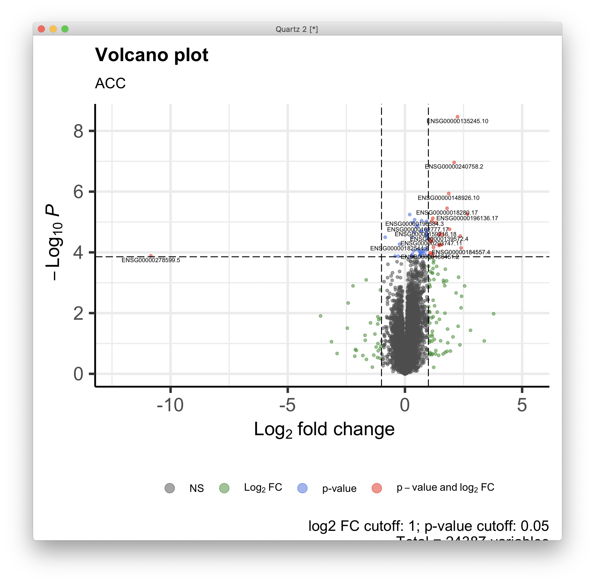
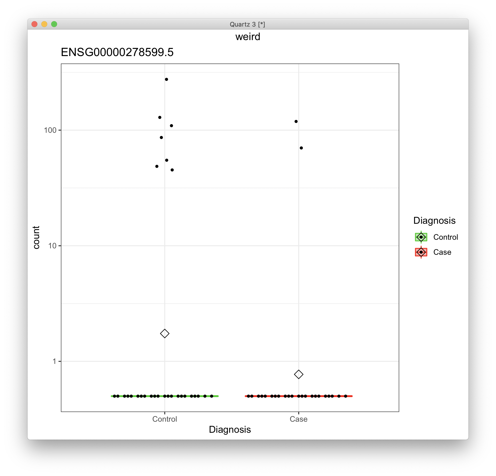
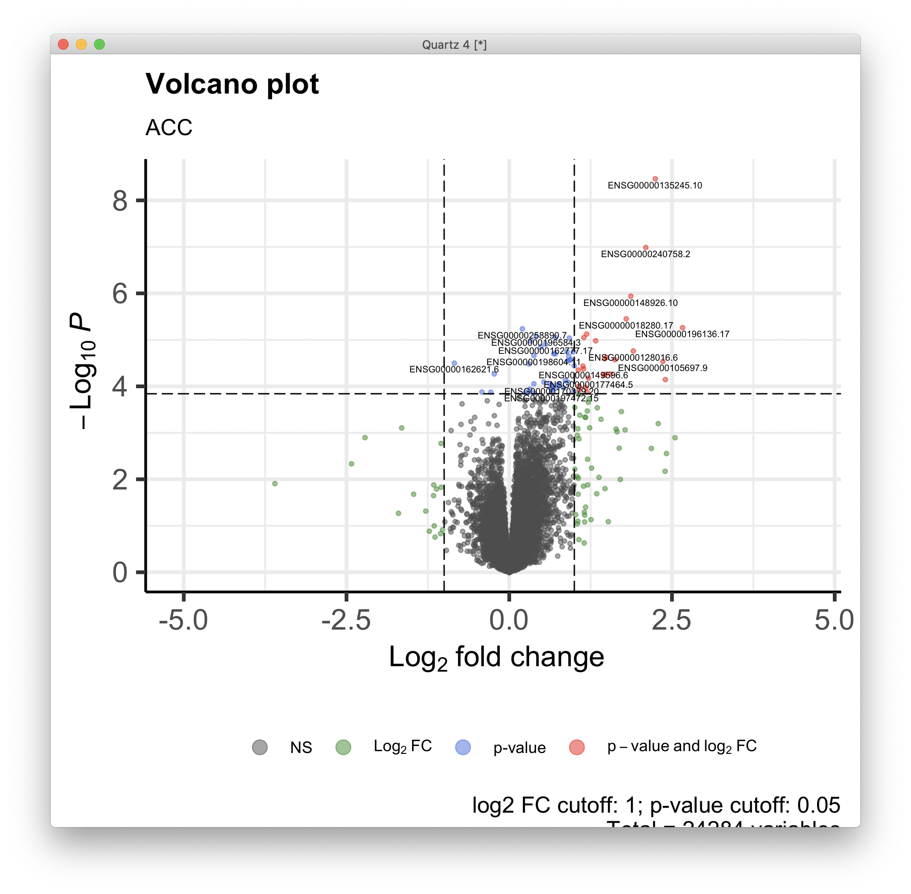
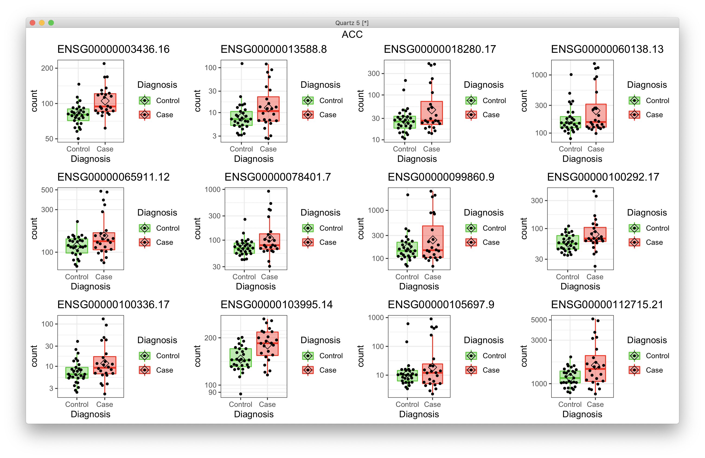
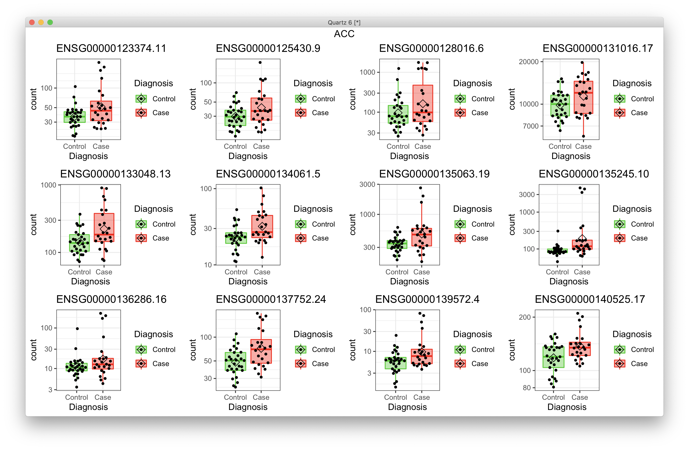
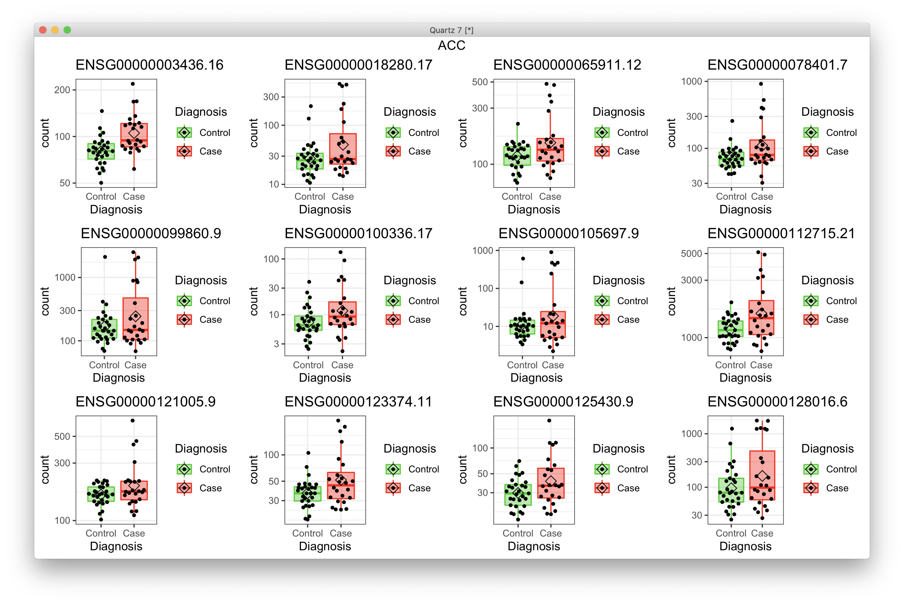
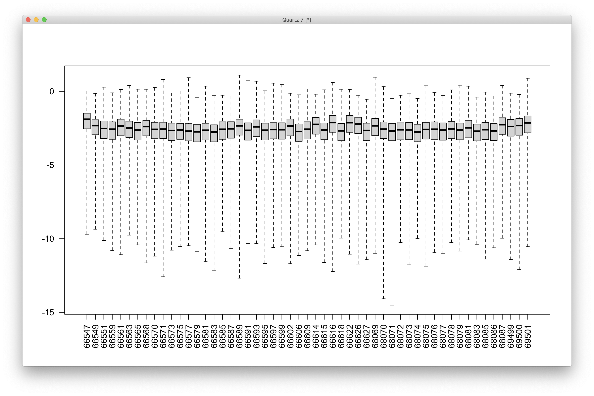
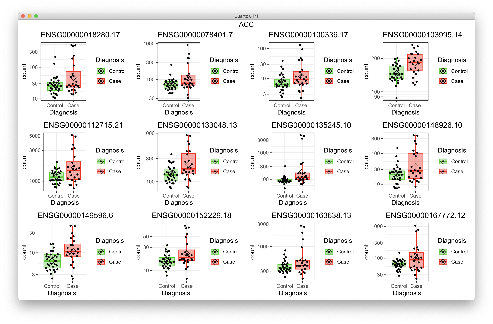
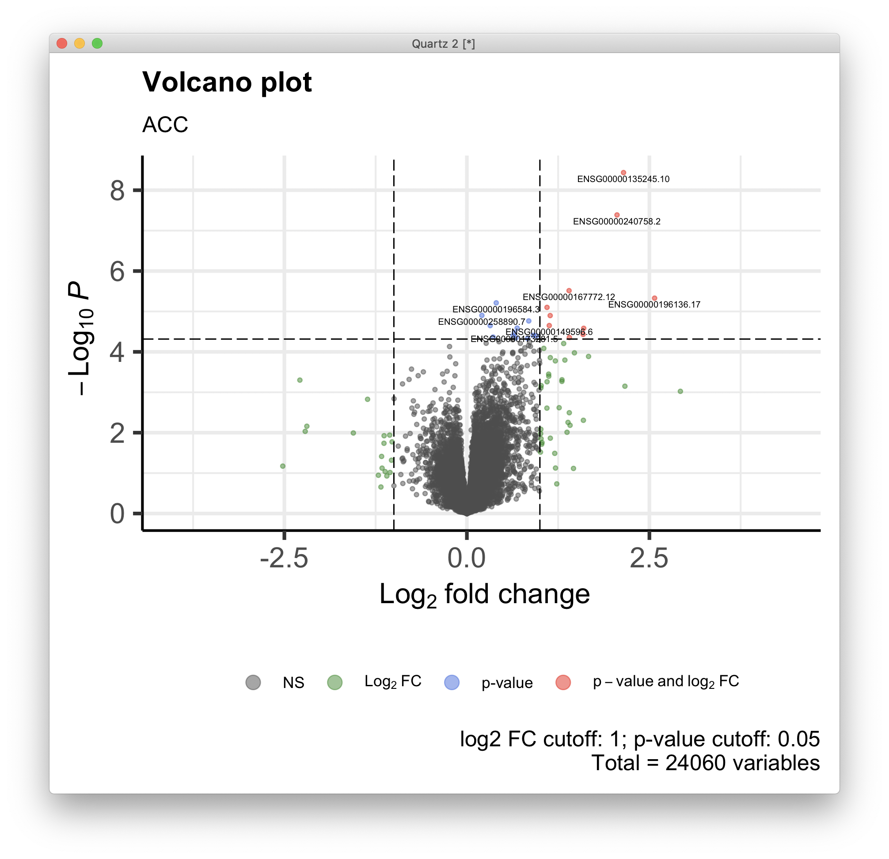
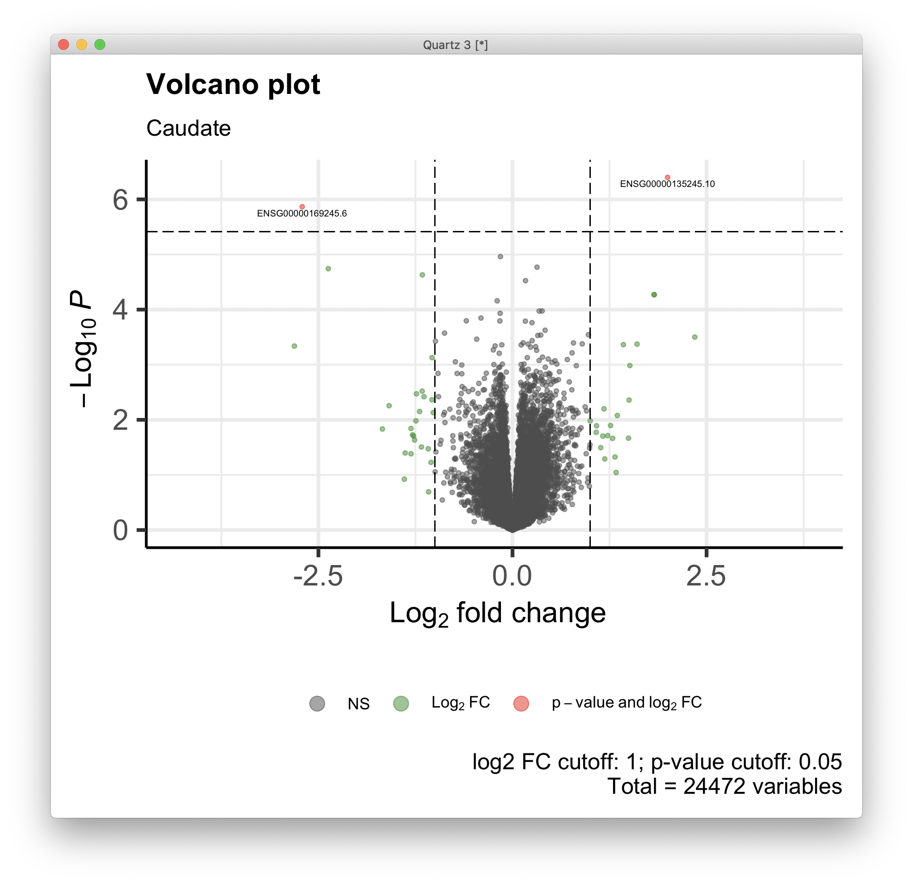

# 2021-04-23 12:05:30

Philip was going through a list of models for testing covariates that people
have tried, and he found a paper from a good NIMH group that did this (mcMahon's
group):

```
Covariate selection: Since many factors can affect expression measurements in postmortem tissue, we employed a two-tiered strategy aimed at controlling for 1) variables for which diagnostic groups were substantially imbalanced, and 2) variables that were associated with major sources of variance in the gene expression data. We tested 32 known variables for association with diagnosis. These included RNA quality metrics (mapping percentage, GC percentage, 5-3’bias, RIN, extraction batch, library batch), available demographic data (age, gender, reported race, BMI, marital status, and manner of death), post-mortem interval (PMI), source of brain donor, tissue pH, and brain weight, along with post-mortem toxicology (the binary toxicology variables included were alcohol, opioids, major stimulants, hallucinogens, cocaine, sedative hypnotic anxiolitics, non psychiatric drugs, nicotine-cotinine, benzos, cannabinoids, antidepressants, anticholinergics, other psychotropic drugs, antipsychotics, mood stabilizers, anti-epileptics, and THC) results. In addition, 10 ancestry vectors were derived from genotyping on Illumina SNP arrays using Eigensoft [4, 5]. 

Stepwise logistic regression analysis was used to test association with the multinomial dependent variable of diagnostic group (bipolar, major depression, schizophrenia, control). Nominally significant associations were detected between diagnostic groups and race, source of brain donor, and antipsychotic exposure (Supplementary Table 3a). Of these, only antipsychotic exposure remained significant after Bonferroni-correction for the 43 covariates tested. Diagnostic groups were well-balanced in terms of the remaining variables.

Principal component (PC) analysis of the RNA counts data revealed that the top 10 PCs explained ~45% of the variance. Each of these PCs were tested for association with the known covariates by stepwise linear regression. Only race, RIN, and GC percent were significantly associated with one or more PCs at Bonferroni p<0.05 (Supplementary Table 3b). Note that the derived PCs were more strongly associated with reported race than with ancestry vectors.

On the basis of these results, downstream analyses of differential expression between diagnostic groups included race, RIN, and GC percent as covariates, while potential effects of antipsychotic exposure were tested in post-hoc analyses using approximate posterior estimation for GLM coefficients in DESeq2. In QTL analyses, which did not break down the sample by diagnosis and where ancestry-associated differences in linkage disequilibrium are important, 10 ancestry vectors were used along with RIN, race and GC percent.
```

Let's try the same thing on our data, which is somewhat similar to the approach
we were using before anyways. However, before we get into that, let's try the
minimalistic approach that's common across papers: 

```
age, gender, PMI, RINe, race (W vs other- not too fine grained),  and the BBB variable
```

```r
minimal_DGE = function(myregion, add_cov=NA) {
    data = read.table('~/data/rnaseq_derek/adhd_rnaseq_counts.txt', header=1)
    rownames(data) = data[,1]
    data[,1] = NULL
    data = round(data)
    sub_name = gsub(x=colnames(data), pattern='X', replacement='')
    colnames(data) = sub_name
    # this is a repeat for Caudate hbcc 2877, but has more genes with zeros than
    # its other replicate
    data = data[, ! colnames(data) %in% c('66552')]
    # outliers based on PCA plots
    outliers = c('68080','68096', '68108', '68084', '68082')
    data = data[, ! colnames(data) %in% outliers]

    library(gdata)
    df = read.xls('~/data/post_mortem/POST_MORTEM_META_DATA_JAN_2021.xlsx')
    data = data[, colnames(data) %in% df$submitted_name]
    df = df[df$submitted_name %in% colnames(data), ]
    df = df[order(df$submitted_name), ]
    data = data[, order(df$submitted_name)]

    keep_me = df$Region == myregion
    data = data[, keep_me]
    df = df[keep_me, ]
    
    # cleaning up some variables
    df$Individual = factor(df$hbcc_brain_id)
    df[df$Manner.of.Death=='Suicide (probable)', 'Manner.of.Death'] = 'Suicide'
    df[df$Manner.of.Death=='unknown', 'Manner.of.Death'] = 'natural'
    df$MoD = factor(df$Manner.of.Death)
    df$Sex = factor(df$Sex)
    df$batch = factor(df$batch)
    df$run_date = factor(gsub(df$run_date, pattern='-', replacement=''))
    df$Diagnosis = factor(df$Diagnosis, levels=c('Control', 'Case'))
    df$Region = factor(df$Region, levels=c('Caudate', 'ACC'))
    df$substance_group = factor(df$substance_group)
    df$comorbid_group = factor(df$comorbid_group_update)
    df$evidence_level = factor(df$evidence_level)
    df$brainbank = factor(df$bainbank)
    # replace the one subject missing population PCs by the median of their
    # self-declared race and ethnicity
    idx = (df$Race.x=='White' & df$Ethnicity.x=='Non-Hispanic' & !is.na(df$C1))
    pop_pcs = c('C1', 'C2', 'C3', 'C4', 'C5')
    med_pop = apply(df[idx, pop_pcs], 2, median)
    df[which(is.na(df$C1)), pop_pcs] = med_pop
    df$BBB = factor(sapply(1:nrow(df),
                            function(x) sprintf('%s_%s',
                                        as.character(df[x,'brainbank']),
                                        as.character(df[x, 'batch']))))
    df$BBB2 = NA                                                                        
    df[df$brainbank=='nimh_hbcc', 'BBB2'] = 1                                           
    df[df$batch==3, 'BBB2'] = 2                                                         
    df[df$batch==4, 'BBB2'] = 3      
    df$BBB2 = factor(df$BBB2)
    imWNH = which(df$C1 > 0 & df$C2 < -.075)
    df$POP_BIN = 'other'
    df[imWNH, 'POP_BIN'] = 'WNH'
    df$POP_BIN = factor(df$POP_BIN)        
    # df$RINc = cut(df$RINe, breaks = 4)    
    breaks = quantile(df$RINe, probs = seq(0, 1, by = 0.25))
    df$RINc = cut(df$RINe, breaks=breaks, labels=c('q1', 'q2', 'q3', 'q4'),
                  include.lowest=T)
    print(summary(df$RINc))

    library(GenomicFeatures)
    txdb <- loadDb('~/data/post_mortem/Homo_sapies.GRCh38.97.sqlite')
    txdf <- select(txdb, keys(txdb, "GENEID"), columns=c('GENEID','TXCHROM'),
                "GENEID")
    bt = read.csv('~/data/post_mortem/Homo_sapiens.GRCh38.97_biotypes.csv')
    bt_slim = bt[, c('gene_id', 'gene_biotype')]
    bt_slim = bt_slim[!duplicated(bt_slim),]
    txdf = merge(txdf, bt_slim, by.x='GENEID', by.y='gene_id')
    tx_meta = data.frame(GENEID = substr(rownames(data), 1, 15))
    tx_meta = merge(tx_meta, txdf, by='GENEID', sort=F)
    imautosome = which(tx_meta$TXCHROM != 'X' &
                    tx_meta$TXCHROM != 'Y' &
                    tx_meta$TXCHROM != 'MT')
    data = data[imautosome, ]
    tx_meta = tx_meta[imautosome, ]

    library("DESeq2")
    if (is.na(add_cov)) {
        fm_str = '~ RINc + BBB2 + Diagnosis'
    } else {
        cov_str = paste0(add_cov, collapse = ' + ')
        fm_str = sprintf('~ %s + RINc + BBB2 + Diagnosis',
                         cov_str)
    }
    # making sure any numeric covariates are scaled
    num_vars = c('pcnt_optical_duplicates', 'clusters', 'Age', 'RINe', 'PMI',
            'C1', 'C2', 'C3', 'C4', 'C5')
    for (var in num_vars) {
        df[, var] = scale(df[, var])
    }

    cat('Running', fm_str, '\n')
    dds <- DESeqDataSetFromMatrix(countData = data,
                                  colData = df,
                                  design = as.formula(fm_str))
    dds = DESeq(dds)

    library(edgeR)
    design = model.matrix(as.formula(fm_str), data=colData(dds))
    isexpr <- filterByExpr(counts(dds), design=design)
    ddsExpr = dds[isexpr, ]
    ddsExpr = DESeq(ddsExpr)

    return(ddsExpr)
}
```

```r
dds.ACC = minimal_DGE('ACC')
dds.Caudate = minimal_DGE('Caudate')
save(dds.ACC, dds.Caudate, file='~/data/post_mortem/minimal_DGE_04232021.RData')
```

OK, let's see what we got:

```
r$> res = results(dds, name = "Diagnosis_Case_vs_Control", alpha=.05)                   

r$> summary(res)                                                                        

out of 25091 with nonzero total read count
adjusted p-value < 0.05
LFC > 0 (up)       : 2, 0.008%
LFC < 0 (down)     : 1, 0.004%
outliers [1]       : 0, 0%
low counts [2]     : 0, 0%
(mean count < 2)
[1] see 'cooksCutoff' argument of ?results
[2] see 'independentFiltering' argument of ?results


r$> res = results(dds, name = "Diagnosis_Case_vs_Control", alpha=.1)                    

r$> summary(res)                                                                        

out of 25091 with nonzero total read count
adjusted p-value < 0.1
LFC > 0 (up)       : 5, 0.02%
LFC < 0 (down)     : 1, 0.004%
outliers [1]       : 0, 0%
low counts [2]     : 0, 0%
(mean count < 2)
[1] see 'cooksCutoff' argument of ?results
[2] see 'independentFiltering' argument of ?results

r$> library(IHW)                                                                        

r$> padj.IHW = adj_pvalues(ihw(pvalue ~ baseMean,  data=as.data.frame(res), alpha=0.05))
                                                                                        
r$> sum(padj.IHW < .05)                                                                 
[1] 3

r$> padj.IHW = adj_pvalues(ihw(pvalue ~ baseMean,  data=as.data.frame(res), alpha=0.1)) 

r$> sum(padj.IHW < .1)                                                                  
[1] 8
```

Could these be outliers? Yes, the top one was much larger l2FC than everyone
else. Let's try the iterative filtering...

## PCA approach

For the PCA approach, it'll be somewhat similar to what we were doing in the
past:

```r
myregion = 'ACC'

data = read.table('~/data/rnaseq_derek/adhd_rnaseq_counts.txt', header=1)
rownames(data) = data[,1]
data[,1] = NULL
data = round(data)
sub_name = gsub(x=colnames(data), pattern='X', replacement='')
colnames(data) = sub_name
# this is a repeat for Caudate hbcc 2877, but has more genes with zeros than
# its other replicate
data = data[, ! colnames(data) %in% c('66552')]
# outliers based on PCA plots
outliers = c('68080','68096', '68108', '68084', '68082')
data = data[, ! colnames(data) %in% outliers]

library(gdata)
df = read.xls('~/data/post_mortem/POST_MORTEM_META_DATA_JAN_2021.xlsx')
data = data[, colnames(data) %in% df$submitted_name]
df = df[df$submitted_name %in% colnames(data), ]
df = df[order(df$submitted_name), ]
data = data[, order(df$submitted_name)]

keep_me = df$Region == myregion
data = data[, keep_me]
df = df[keep_me, ]

# cleaning up some variables
df$Individual = factor(df$hbcc_brain_id)
df[df$Manner.of.Death=='Suicide (probable)', 'Manner.of.Death'] = 'Suicide'
df[df$Manner.of.Death=='unknown', 'Manner.of.Death'] = 'natural'
df$MoD = factor(df$Manner.of.Death)
df$Sex = factor(df$Sex)
df$batch = factor(df$batch)
df$run_date = factor(gsub(df$run_date, pattern='-', replacement=''))
df$Diagnosis = factor(df$Diagnosis, levels=c('Control', 'Case'))
df$Region = factor(df$Region, levels=c('Caudate', 'ACC'))
df$substance_group = factor(df$substance_group)
df$comorbid_group = factor(df$comorbid_group_update)
df$evidence_level = factor(df$evidence_level)
df$brainbank = factor(df$bainbank)
# replace the one subject missing population PCs by the median of their
# self-declared race and ethnicity
idx = (df$Race.x=='White' & df$Ethnicity.x=='Non-Hispanic' & !is.na(df$C1))
pop_pcs = c('C1', 'C2', 'C3', 'C4', 'C5')
med_pop = apply(df[idx, pop_pcs], 2, median)
df[which(is.na(df$C1)), pop_pcs] = med_pop
df$BBB = factor(sapply(1:nrow(df),
                        function(x) sprintf('%s_%s',
                                    as.character(df[x,'brainbank']),
                                    as.character(df[x, 'batch']))))
df$BBB2 = NA                                                                        
df[df$brainbank=='nimh_hbcc', 'BBB2'] = 1                                           
df[df$batch==3, 'BBB2'] = 2                                                         
df[df$batch==4, 'BBB2'] = 3      
df$BBB2 = factor(df$BBB2)
imWNH = which(df$C1 > 0 & df$C2 < -.075)
df$POP_BIN = 'other'
df[imWNH, 'POP_BIN'] = 'WNH'
df$POP_BIN = factor(df$POP_BIN)        
# df$RINc = cut(df$RINe, breaks = 4)  
# bining so DESeq2 can do its own filyering automatically
breaks = quantile(df$RINe, probs = seq(0, 1, by = 0.25))
df$RINc = cut(df$RINe, breaks=breaks, labels=c('q1', 'q2', 'q3', 'q4'),
              include.lowest=T)

library(GenomicFeatures)
txdb <- loadDb('~/data/post_mortem/Homo_sapies.GRCh38.97.sqlite')
txdf <- select(txdb, keys(txdb, "GENEID"), columns=c('GENEID','TXCHROM'),
            "GENEID")
bt = read.csv('~/data/post_mortem/Homo_sapiens.GRCh38.97_biotypes.csv')
bt_slim = bt[, c('gene_id', 'gene_biotype')]
bt_slim = bt_slim[!duplicated(bt_slim),]
txdf = merge(txdf, bt_slim, by.x='GENEID', by.y='gene_id')
tx_meta = data.frame(GENEID = substr(rownames(data), 1, 15))
tx_meta = merge(tx_meta, txdf, by='GENEID', sort=F)
imautosome = which(tx_meta$TXCHROM != 'X' &
                tx_meta$TXCHROM != 'Y' &
                tx_meta$TXCHROM != 'MT')
data = data[imautosome, ]
tx_meta = tx_meta[imautosome, ]

# remove constant genes (including zeros) as it breaks PCA
const_genes = apply(data, 1, sd) == 0
data = data[!const_genes, ]

# checking which PCs are associated with our potential nuiscance variables
set.seed(42)
mypca <- prcomp(t(data), scale=TRUE)
# how many PCs to keep... using Kaiser thredhold, close to eigenvalues < 1
library(nFactors)
eigs <- mypca$sdev^2
nS = nScree(x=eigs)
keep_me = seq(1, nS$Components$nkaiser)

mydata = data.frame(mypca$x[, keep_me])
# create main metadata data frame including metadata and PCs
data.pm = cbind(df, mydata)
rownames(data.pm) = df$hbcc_brain_id
cat('Using', nS$Components$nkaiser, 'PCs from possible', ncol(data), '\n')

# check which PCs are associated at nominal p<.01
num_vars = c('Age', 'PMI',
            'C1', 'C2', 'C3', 'C4', 'C5')
pc_vars = colnames(mydata)
num_corrs = matrix(nrow=length(num_vars), ncol=length(pc_vars),
                    dimnames=list(num_vars, pc_vars))
num_pvals = num_corrs
for (x in num_vars) {
    for (y in pc_vars) {
        res = cor.test(data.pm[, x], data.pm[, y], method='spearman')
        num_corrs[x, y] = res$estimate
        num_pvals[x, y] = res$p.value
    }
}

categ_vars = c('BBB2', 'MoD', 'substance_group', 'RINc',
            'comorbid_group', 'Sex', 'evidence_level')
categ_corrs = matrix(nrow=length(categ_vars), ncol=length(pc_vars),
                        dimnames=list(categ_vars, pc_vars))
categ_pvals = categ_corrs
for (x in categ_vars) {
    for (y in pc_vars) {
        res = kruskal.test(data.pm[, y], data.pm[, x])
        categ_corrs[x, y] = res$statistic
        categ_pvals[x, y] = res$p.value
    }
}
mypvals = rbind(categ_pvals, num_pvals)
print(which(mypvals < .01/(ncol(mypvals)*nrow(mypvals)), arr.ind = T) )
print(which(mypvals < .05/(ncol(mypvals)*nrow(mypvals)), arr.ind = T) )
```

For ACC we have 7 PCs:

```
     row col
BBB2   1   1
RINc   4   2
BBB2   1   3
     row col
BBB2   1   1
RINc   4   2
BBB2   1   3
```

and for Caudate we have 8 PCs:

```
     row col
BBB2   1   1
BBB2   1   2
     row col
BBB2   1   1
BBB2   1   2
```

So, let's run a function:

```r
pca_DGE = function(myregion, fm_str) {
    data = read.table('~/data/rnaseq_derek/adhd_rnaseq_counts.txt', header=1)
    rownames(data) = data[,1]
    data[,1] = NULL
    data = round(data)
    sub_name = gsub(x=colnames(data), pattern='X', replacement='')
    colnames(data) = sub_name
    # this is a repeat for Caudate hbcc 2877, but has more genes with zeros than
    # its other replicate
    data = data[, ! colnames(data) %in% c('66552')]
    # outliers based on PCA plots
    outliers = c('68080','68096', '68108', '68084', '68082')
    data = data[, ! colnames(data) %in% outliers]

    library(gdata)
    df = read.xls('~/data/post_mortem/POST_MORTEM_META_DATA_JAN_2021.xlsx')
    data = data[, colnames(data) %in% df$submitted_name]
    df = df[df$submitted_name %in% colnames(data), ]
    df = df[order(df$submitted_name), ]
    data = data[, order(df$submitted_name)]

    keep_me = df$Region == myregion
    data = data[, keep_me]
    df = df[keep_me, ]

    # cleaning up some variables
    df$Individual = factor(df$hbcc_brain_id)
    df[df$Manner.of.Death=='Suicide (probable)', 'Manner.of.Death'] = 'Suicide'
    df[df$Manner.of.Death=='unknown', 'Manner.of.Death'] = 'natural'
    df$MoD = factor(df$Manner.of.Death)
    df$Sex = factor(df$Sex)
    df$batch = factor(df$batch)
    df$run_date = factor(gsub(df$run_date, pattern='-', replacement=''))
    df$Diagnosis = factor(df$Diagnosis, levels=c('Control', 'Case'))
    df$Region = factor(df$Region, levels=c('Caudate', 'ACC'))
    df$substance_group = factor(df$substance_group)
    df$comorbid_group = factor(df$comorbid_group_update)
    df$evidence_level = factor(df$evidence_level)
    df$brainbank = factor(df$bainbank)
    # replace the one subject missing population PCs by the median of their
    # self-declared race and ethnicity
    idx = (df$Race.x=='White' & df$Ethnicity.x=='Non-Hispanic' & !is.na(df$C1))
    pop_pcs = c('C1', 'C2', 'C3', 'C4', 'C5')
    med_pop = apply(df[idx, pop_pcs], 2, median)
    df[which(is.na(df$C1)), pop_pcs] = med_pop
    df$BBB = factor(sapply(1:nrow(df),
                            function(x) sprintf('%s_%s',
                                        as.character(df[x,'brainbank']),
                                        as.character(df[x, 'batch']))))
    df$BBB2 = NA                                                                        
    df[df$brainbank=='nimh_hbcc', 'BBB2'] = 1                                           
    df[df$batch==3, 'BBB2'] = 2                                                         
    df[df$batch==4, 'BBB2'] = 3      
    df$BBB2 = factor(df$BBB2)
    imWNH = which(df$C1 > 0 & df$C2 < -.075)
    df$POP_BIN = 'other'
    df[imWNH, 'POP_BIN'] = 'WNH'
    df$POP_BIN = factor(df$POP_BIN)        
    # df$RINc = cut(df$RINe, breaks = 4)  
    # bining so DESeq2 can do its own filyering automatically
    breaks = quantile(df$RINe, probs = seq(0, 1, by = 0.25))
    df$RINc = cut(df$RINe, breaks=breaks, labels=c('q1', 'q2', 'q3', 'q4'),
                include.lowest=T)

    library(GenomicFeatures)
    txdb <- loadDb('~/data/post_mortem/Homo_sapies.GRCh38.97.sqlite')
    txdf <- select(txdb, keys(txdb, "GENEID"), columns=c('GENEID','TXCHROM'),
                "GENEID")
    bt = read.csv('~/data/post_mortem/Homo_sapiens.GRCh38.97_biotypes.csv')
    bt_slim = bt[, c('gene_id', 'gene_biotype')]
    bt_slim = bt_slim[!duplicated(bt_slim),]
    txdf = merge(txdf, bt_slim, by.x='GENEID', by.y='gene_id')
    tx_meta = data.frame(GENEID = substr(rownames(data), 1, 15))
    tx_meta = merge(tx_meta, txdf, by='GENEID', sort=F)
    imautosome = which(tx_meta$TXCHROM != 'X' &
                    tx_meta$TXCHROM != 'Y' &
                    tx_meta$TXCHROM != 'MT')
    data = data[imautosome, ]
    tx_meta = tx_meta[imautosome, ]

    # remove constant genes (including zeros) as it breaks PCA
    const_genes = apply(data, 1, sd) == 0
    data = data[!const_genes, ]

    library("DESeq2")
    # making sure any numeric covariates are scaled
    num_vars = c('pcnt_optical_duplicates', 'clusters', 'Age', 'RINe', 'PMI',
            'C1', 'C2', 'C3', 'C4', 'C5')
    for (var in num_vars) {
        df[, var] = scale(df[, var])
    }

    cat('Running', fm_str, '\n')
    dds <- DESeqDataSetFromMatrix(countData = data,
                                  colData = df,
                                  design = as.formula(fm_str))
    dds = DESeq(dds)

    library(edgeR)
    dsn = model.matrix(as.formula(fm_str), data=colData(dds))
    isexpr <- filterByExpr(counts(dds), design=dsn)
    ddsExpr = dds[isexpr, ]
    ddsExpr = DESeq(ddsExpr)

    return(ddsExpr)
}
```

```r
dds.ACC = pca_DGE('ACC', '~ RINc + BBB2 + Diagnosis')
dds.Caudate = pca_DGE('Caudate', '~ BBB2 + Diagnosis')
save(dds.ACC, dds.Caudate, file='~/data/post_mortem/pca_DGE_04262021.RData')
```

Let's check out our results then:

```
r$> library(IHW)                                                                        

r$> summary(results(dds.ACC, name = "Diagnosis_Case_vs_Control", alpha=.05))            

out of 24387 with nonzero total read count
adjusted p-value < 0.05
LFC > 0 (up)       : 60, 0.25%
LFC < 0 (down)     : 5, 0.021%
outliers [1]       : 13, 0.053%
low counts [2]     : 946, 3.9%
(mean count < 7)
[1] see 'cooksCutoff' argument of ?results
[2] see 'independentFiltering' argument of ?results


r$> summary(results(dds.ACC, name = "Diagnosis_Case_vs_Control", alpha=.05, filterFun=ih
    w))                                                                                 

out of 24387 with nonzero total read count
adjusted p-value < 0.05
LFC > 0 (up)       : 71, 0.29%
LFC < 0 (down)     : 6, 0.025%
outliers [1]       : 13, 0.053%
[1] see 'cooksCutoff' argument of ?results
see metadata(res)$ihwResult on hypothesis weighting

r$> summary(results(dds.Caudate, name = "Diagnosis_Case_vs_Control", alpha=.05))        

out of 24059 with nonzero total read count
adjusted p-value < 0.05
LFC > 0 (up)       : 0, 0%
LFC < 0 (down)     : 0, 0%
outliers [1]       : 23, 0.096%
low counts [2]     : 0, 0%
(mean count < 3)
[1] see 'cooksCutoff' argument of ?results
[2] see 'independentFiltering' argument of ?results


r$> summary(results(dds.Caudate, name = "Diagnosis_Case_vs_Control", alpha=.05, filterFu
    n=ihw))                                                                             

out of 24059 with nonzero total read count
adjusted p-value < 0.05
LFC > 0 (up)       : 0, 0%
LFC < 0 (down)     : 0, 0%
outliers [1]       : 23, 0.096%
[1] see 'cooksCutoff' argument of ?results
see metadata(res)$ihwResult on hypothesis weighting
```

A bit too much? Outliers?

```r
plot_volcano = function(res, t_str, pCutoff = 0.05) {
    library(EnhancedVolcano)
    quartz()
    res = res[order(res$pvalue), ]
    FCcutoff = 1.0
    # if we have significant FDR, find it
    sigPs = sum(res$padj <= pCutoff, na.rm=T)
    if (sigPs > 0) {
        ps = -log10(res$pvalue)
        nomPcutoff = ps[sigPs + 1] + (ps[sigPs] - ps[sigPs + 1]) / 2
        nomPcutoff = 10 ** (-nomPcutoff)
    } else {
        nomPcutoff = NA
    }
    print(sigPs)
    p = EnhancedVolcano(data.frame(res), lab = rownames(res),
                        x = 'log2FoldChange',
                        y = 'pvalue', xlab = bquote(~Log[2]~ 'fold change'),
                        selectLab = rownames(res)[res$padj < pCutoff],
                        ylab = bquote(~-Log[10]~italic(P)),
                        ylim = c(0, ceiling(max(-log10(res$pvalue)))),
                        pCutoff = nomPcutoff,
                        FCcutoff = FCcutoff, pointSize = 1.0,
                        labSize = 2.0, title = "Volcano plot",
                        subtitle = t_str,
                        caption = paste0('log2 FC cutoff: ', FCcutoff,
                                        '; p-value cutoff: ', pCutoff,
                                        '\nTotal = ', nrow(res), ' variables'),
                        legendPosition = 'bottom', legendLabSize = 10,
                        legendIconSize = 4.0)
    print(p)
}

res = results(dds.ACC, name = "Diagnosis_Case_vs_Control", alpha=.05)
plot_volcano(res, 'ACC', pCutoff = 0.05)
```



There's definitely an outlier there for log2FC. Let's see what's going on with
it:

```r
plot_expression = function(gene_ids, dds, t_str) {
    library(ggpubr)
    library(ggbeeswarm)
    quartz()
    myplots = list()
    clrs = c("green3", "red")
    for (g in 1:length(gene_ids)) {
        cat(gene_ids[g], '\n')
        d <- plotCounts(dds, gene=gene_ids[g], intgroup="Diagnosis",
                        returnData=TRUE)
        p = (ggplot(d, aes(x=Diagnosis, y=count, color = Diagnosis,
                        fill = Diagnosis)) + 
            scale_y_log10() +
            geom_boxplot(alpha = 0.4, outlier.shape = NA, width = 0.8,
                        lwd = 0.5) +
            stat_summary(fun = mean, geom = "point", color = "black",
                        shape = 5, size = 3,
                        position=position_dodge(width = 0.8)) +
            scale_color_manual(values = clrs) +
            scale_fill_manual(values = clrs) +
            geom_quasirandom(color = "black", size = 1, dodge.width = 0.8) +
            theme_bw() +
            ggtitle(gene_ids[g]))
        myplots[[g]] = p
    }
    p = ggarrange(plotlist=myplots)
    print(annotate_figure(p, t_str))
}
plot_expression(c('ENSG00000278599.5'), dds.ACC, 'weird')
```



So, apparently filterByExpr() is not enough here. How about using the smallest
group as the smallest amount?  

```r
pca_DGE = function(myregion, fm_str) {
    data = read.table('~/data/rnaseq_derek/adhd_rnaseq_counts.txt', header=1)
    rownames(data) = data[,1]
    data[,1] = NULL
    data = round(data)
    sub_name = gsub(x=colnames(data), pattern='X', replacement='')
    colnames(data) = sub_name
    # this is a repeat for Caudate hbcc 2877, but has more genes with zeros than
    # its other replicate
    data = data[, ! colnames(data) %in% c('66552')]
    # outliers based on PCA plots
    outliers = c('68080','68096', '68108', '68084', '68082')
    data = data[, ! colnames(data) %in% outliers]

    library(gdata)
    df = read.xls('~/data/post_mortem/POST_MORTEM_META_DATA_JAN_2021.xlsx')
    data = data[, colnames(data) %in% df$submitted_name]
    df = df[df$submitted_name %in% colnames(data), ]
    df = df[order(df$submitted_name), ]
    data = data[, order(df$submitted_name)]

    keep_me = df$Region == myregion
    data = data[, keep_me]
    df = df[keep_me, ]

    # cleaning up some variables
    df$Individual = factor(df$hbcc_brain_id)
    df[df$Manner.of.Death=='Suicide (probable)', 'Manner.of.Death'] = 'Suicide'
    df[df$Manner.of.Death=='unknown', 'Manner.of.Death'] = 'natural'
    df$MoD = factor(df$Manner.of.Death)
    df$Sex = factor(df$Sex)
    df$batch = factor(df$batch)
    df$run_date = factor(gsub(df$run_date, pattern='-', replacement=''))
    df$Diagnosis = factor(df$Diagnosis, levels=c('Control', 'Case'))
    df$Region = factor(df$Region, levels=c('Caudate', 'ACC'))
    df$substance_group = factor(df$substance_group)
    df$comorbid_group = factor(df$comorbid_group_update)
    df$evidence_level = factor(df$evidence_level)
    df$brainbank = factor(df$bainbank)
    # replace the one subject missing population PCs by the median of their
    # self-declared race and ethnicity
    idx = (df$Race.x=='White' & df$Ethnicity.x=='Non-Hispanic' & !is.na(df$C1))
    pop_pcs = c('C1', 'C2', 'C3', 'C4', 'C5')
    med_pop = apply(df[idx, pop_pcs], 2, median)
    df[which(is.na(df$C1)), pop_pcs] = med_pop
    df$BBB = factor(sapply(1:nrow(df),
                            function(x) sprintf('%s_%s',
                                        as.character(df[x,'brainbank']),
                                        as.character(df[x, 'batch']))))
    df$BBB2 = NA                                                                        
    df[df$brainbank=='nimh_hbcc', 'BBB2'] = 1                                           
    df[df$batch==3, 'BBB2'] = 2                                                         
    df[df$batch==4, 'BBB2'] = 3      
    df$BBB2 = factor(df$BBB2)
    imWNH = which(df$C1 > 0 & df$C2 < -.075)
    df$POP_BIN = 'other'
    df[imWNH, 'POP_BIN'] = 'WNH'
    df$POP_BIN = factor(df$POP_BIN)        
    # bining so DESeq2 can do its own filyering automatically
    # breaks = quantile(df$RINe, probs = seq(0, 1, by = 0.25))
    # df$RINc = cut(df$RINe, breaks=breaks, labels=c('q1', 'q2', 'q3', 'q4'),
    #             include.lowest=T)
    df$RINc = cut(df$RINe, breaks = 5, include.lowest=T)  

    library(GenomicFeatures)
    txdb <- loadDb('~/data/post_mortem/Homo_sapies.GRCh38.97.sqlite')
    txdf <- select(txdb, keys(txdb, "GENEID"), columns=c('GENEID','TXCHROM'),
                "GENEID")
    bt = read.csv('~/data/post_mortem/Homo_sapiens.GRCh38.97_biotypes.csv')
    bt_slim = bt[, c('gene_id', 'gene_biotype')]
    bt_slim = bt_slim[!duplicated(bt_slim),]
    txdf = merge(txdf, bt_slim, by.x='GENEID', by.y='gene_id')
    tx_meta = data.frame(GENEID = substr(rownames(data), 1, 15))
    tx_meta = merge(tx_meta, txdf, by='GENEID', sort=F)
    imautosome = which(tx_meta$TXCHROM != 'X' &
                    tx_meta$TXCHROM != 'Y' &
                    tx_meta$TXCHROM != 'MT')
    data = data[imautosome, ]
    tx_meta = tx_meta[imautosome, ]

    # remove constant genes (including zeros) as it breaks PCA
    const_genes = apply(data, 1, sd) == 0
    data = data[!const_genes, ]

    library("DESeq2")
    # making sure any numeric covariates are scaled
    num_vars = c('pcnt_optical_duplicates', 'clusters', 'Age', 'RINe', 'PMI',
            'C1', 'C2', 'C3', 'C4', 'C5')
    for (var in num_vars) {
        df[, var] = scale(df[, var])
    }

    cat('Running', fm_str, '\n')
    dds <- DESeqDataSetFromMatrix(countData = data,
                                  colData = df,
                                  design = as.formula(fm_str))

    min_subjs = min(table(df$Diagnosis))
    keep <- rowSums(counts(dds) == 0) <= min_subjs
    dds <- dds[keep,]
    dds = DESeq(dds)

    library(edgeR)
    design = model.matrix(as.formula(fm_str), data=colData(dds))
    isexpr <- filterByExpr(counts(dds), design=design)
    ddsExpr = dds[isexpr, ]
    ddsExpr = DESeq(ddsExpr)

    return(ddsExpr)
}
```



This is looking much better. But ar ethese mostly outliers though, if we plot
their expression?





These are only the top 24 out of the 65, but it's a bit annoying that there are
a few outliers corrupting the results. Let's see if they're still there if we
cut it differently. At least the log2FC outlier went away when adding the
min_subjs criteria.



Still not great. We have only 46 good genes now, and 8 outliers, but it still
looks like the results are driven by those samples.



I wouldn't say one sample is consistently higher in Cook's cutoff than others. 

Do I have the same issues if I keep RINe as continuous?



We're down to 24 hits, but some still seem contaminated by outliers. At least we
don't have to decide on how to cut RINe.

Let's make sure it still works with PCA and re-run it, before going for GSEA:

```r
myregion = 'ACC'

data = read.table('~/data/rnaseq_derek/adhd_rnaseq_counts.txt', header=1)
rownames(data) = data[,1]
data[,1] = NULL
data = round(data)
sub_name = gsub(x=colnames(data), pattern='X', replacement='')
colnames(data) = sub_name
# this is a repeat for Caudate hbcc 2877, but has more genes with zeros than
# its other replicate
data = data[, ! colnames(data) %in% c('66552')]
# outliers based on PCA plots
outliers = c('68080','68096', '68108', '68084', '68082')
data = data[, ! colnames(data) %in% outliers]

library(gdata)
df = read.xls('~/data/post_mortem/POST_MORTEM_META_DATA_JAN_2021.xlsx')
data = data[, colnames(data) %in% df$submitted_name]
df = df[df$submitted_name %in% colnames(data), ]
df = df[order(df$submitted_name), ]
data = data[, order(df$submitted_name)]

keep_me = df$Region == myregion
data = data[, keep_me]
df = df[keep_me, ]

# cleaning up some variables
df$Individual = factor(df$hbcc_brain_id)
df[df$Manner.of.Death=='Suicide (probable)', 'Manner.of.Death'] = 'Suicide'
df[df$Manner.of.Death=='unknown', 'Manner.of.Death'] = 'natural'
df$MoD = factor(df$Manner.of.Death)
df$Sex = factor(df$Sex)
df$batch = factor(df$batch)
df$run_date = factor(gsub(df$run_date, pattern='-', replacement=''))
df$Diagnosis = factor(df$Diagnosis, levels=c('Control', 'Case'))
df$Region = factor(df$Region, levels=c('Caudate', 'ACC'))
df$substance_group = factor(df$substance_group)
df$comorbid_group = factor(df$comorbid_group_update)
df$evidence_level = factor(df$evidence_level)
df$brainbank = factor(df$bainbank)
# replace the one subject missing population PCs by the median of their
# self-declared race and ethnicity
idx = (df$Race.x=='White' & df$Ethnicity.x=='Non-Hispanic' & !is.na(df$C1))
pop_pcs = c('C1', 'C2', 'C3', 'C4', 'C5')
med_pop = apply(df[idx, pop_pcs], 2, median)
df[which(is.na(df$C1)), pop_pcs] = med_pop
df$BBB = factor(sapply(1:nrow(df),
                        function(x) sprintf('%s_%s',
                                    as.character(df[x,'brainbank']),
                                    as.character(df[x, 'batch']))))
df$BBB2 = NA                                                                        
df[df$brainbank=='nimh_hbcc', 'BBB2'] = 1                                           
df[df$batch==3, 'BBB2'] = 2                                                         
df[df$batch==4, 'BBB2'] = 3      
df$BBB2 = factor(df$BBB2)
imWNH = which(df$C1 > 0 & df$C2 < -.075)
df$POP_BIN = 'other'
df[imWNH, 'POP_BIN'] = 'WNH'
df$POP_BIN = factor(df$POP_BIN)        
# df$RINc = cut(df$RINe, breaks = 4)  
# bining so DESeq2 can do its own filyering automatically
breaks = quantile(df$RINe, probs = seq(0, 1, by = 0.25))
df$RINc = cut(df$RINe, breaks=breaks, labels=c('q1', 'q2', 'q3', 'q4'),
            include.lowest=T)

library(GenomicFeatures)
txdb <- loadDb('~/data/post_mortem/Homo_sapies.GRCh38.97.sqlite')
txdf <- select(txdb, keys(txdb, "GENEID"), columns=c('GENEID','TXCHROM'),
            "GENEID")
bt = read.csv('~/data/post_mortem/Homo_sapiens.GRCh38.97_biotypes.csv')
bt_slim = bt[, c('gene_id', 'gene_biotype')]
bt_slim = bt_slim[!duplicated(bt_slim),]
txdf = merge(txdf, bt_slim, by.x='GENEID', by.y='gene_id')
tx_meta = data.frame(GENEID = substr(rownames(data), 1, 15))
tx_meta = merge(tx_meta, txdf, by='GENEID', sort=F)
imautosome = which(tx_meta$TXCHROM != 'X' &
                tx_meta$TXCHROM != 'Y' &
                tx_meta$TXCHROM != 'MT')
data = data[imautosome, ]
tx_meta = tx_meta[imautosome, ]

# remove constant genes (including zeros) as it breaks PCA
const_genes = apply(data, 1, sd) == 0
data = data[!const_genes, ]

library("DESeq2")
# making sure any numeric covariates are scaled
num_vars = c('pcnt_optical_duplicates', 'clusters', 'Age', 'RINe', 'PMI',
        'C1', 'C2', 'C3', 'C4', 'C5')
for (var in num_vars) {
    df[, var] = scale(df[, var])
}

min_subjs = min(table(df$Diagnosis))
keep <- rowSums(data == 0) <= min_subjs
data <- data[keep,]

# checking which PCs are associated with our potential nuiscance variables
set.seed(42)
mypca <- prcomp(t(data), scale=TRUE)
# how many PCs to keep... using Kaiser thredhold, close to eigenvalues < 1
library(nFactors)
eigs <- mypca$sdev^2
nS = nScree(x=eigs)
keep_me = seq(1, nS$Components$nkaiser)

mydata = data.frame(mypca$x[, keep_me])
# create main metadata data frame including metadata and PCs
data.pm = cbind(df, mydata)
rownames(data.pm) = df$hbcc_brain_id
cat('Using', nS$Components$nkaiser, 'PCs from possible', ncol(data), '\n')

# check which PCs are associated at nominal p<.01
num_vars = c('Age', 'PMI', 'RINe',
            'C1', 'C2', 'C3', 'C4', 'C5')
pc_vars = colnames(mydata)
num_corrs = matrix(nrow=length(num_vars), ncol=length(pc_vars),
                    dimnames=list(num_vars, pc_vars))
num_pvals = num_corrs
for (x in num_vars) {
    for (y in pc_vars) {
        res = cor.test(data.pm[, x], data.pm[, y], method='spearman')
        num_corrs[x, y] = res$estimate
        num_pvals[x, y] = res$p.value
    }
}

categ_vars = c('BBB2', 'MoD', 'substance_group',
            'comorbid_group', 'Sex', 'evidence_level')
categ_corrs = matrix(nrow=length(categ_vars), ncol=length(pc_vars),
                        dimnames=list(categ_vars, pc_vars))
categ_pvals = categ_corrs
for (x in categ_vars) {
    for (y in pc_vars) {
        res = kruskal.test(data.pm[, y], data.pm[, x])
        categ_corrs[x, y] = res$statistic
        categ_pvals[x, y] = res$p.value
    }
}
mypvals = rbind(categ_pvals, num_pvals)
print(which(mypvals < .01/(ncol(mypvals)*nrow(mypvals)), arr.ind = T) )
print(which(mypvals < .05/(ncol(mypvals)*nrow(mypvals)), arr.ind = T) )
```

```
# ACC
     row col
BBB2   1   1
RINe   9   2
BBB2   1   3
     row col
BBB2   1   1
RINe   9   2
BBB2   1   3

# Caudate
     row col
BBB2   1   1
RINe   9   2
     row col
BBB2   1   1
BBB2   1   2
RINe   9   2
BBB2   1   6
```

OK, let's do the analysis then:

```r
dds.ACC = pca_DGE('ACC', '~ RINe + BBB2 + Diagnosis')
dds.Caudate = pca_DGE('Caudate', '~ RINe + BBB2 + Diagnosis')
save(dds.ACC, dds.Caudate, file='~/data/post_mortem/pca_DGE_RINe_04262021.RData')
```

```
r$> library(IHW)                                                                        

r$> summary(results(dds.ACC, name = "Diagnosis_Case_vs_Control", alpha=.05))            

out of 24060 with nonzero total read count
adjusted p-value < 0.05
LFC > 0 (up)       : 22, 0.091%
LFC < 0 (down)     : 0, 0%
outliers [1]       : 19, 0.079%
low counts [2]     : 466, 1.9%
(mean count < 7)
[1] see 'cooksCutoff' argument of ?results
[2] see 'independentFiltering' argument of ?results


r$> summary(results(dds.ACC, name = "Diagnosis_Case_vs_Control", alpha=.05, filterFun=ih
    w))                                                                                 

out of 24060 with nonzero total read count
adjusted p-value < 0.05
LFC > 0 (up)       : 44, 0.18%
LFC < 0 (down)     : 2, 0.0083%
outliers [1]       : 19, 0.079%
[1] see 'cooksCutoff' argument of ?results
see metadata(res)$ihwResult on hypothesis weighting


r$> summary(results(dds.Caudate, name = "Diagnosis_Case_vs_Control", alpha=.05))        

out of 24472 with nonzero total read count
adjusted p-value < 0.05
LFC > 0 (up)       : 1, 0.0041%
LFC < 0 (down)     : 1, 0.0041%
outliers [1]       : 13, 0.053%
low counts [2]     : 0, 0%
(mean count < 3)
[1] see 'cooksCutoff' argument of ?results
[2] see 'independentFiltering' argument of ?results

r$> summary(results(dds.Caudate, name = "Diagnosis_Case_vs_Control", alpha=.05, filterFu
    n=ihw))                                                                             

out of 24472 with nonzero total read count
adjusted p-value < 0.05
LFC > 0 (up)       : 1, 0.0041%
LFC < 0 (down)     : 1, 0.0041%
outliers [1]       : 13, 0.053%
[1] see 'cooksCutoff' argument of ?results
see metadata(res)$ihwResult on hypothesis weighting
```




```r
library(WebGestaltR)
library(DESeq2)

data_dir = '~/data/post_mortem/'
ncpu=7

load('~/data/post_mortem/pca_DGE_RINe_04262021.RData')
for (region in c('ACC', 'Caudate')) {
    res_str = sprintf('dds = dds.%s', region)
    eval(parse(text=res_str))

    res = as.data.frame(results(dds, name = "Diagnosis_Case_vs_Control"))
    
    ranks = -log(res$pvalue) * sign(res$log2FoldChange)
    geneid = substring(rownames(res), 1, 15)
    
    tmp2 = data.frame(geneid=geneid, rank=ranks)
    tmp2 = tmp2[order(ranks, decreasing=T),]

    res_str = sprintf('WG30_DGE_%s_RINe_BBB2', region)
    DBs = c(sprintf('%s_developmental', tolower(region)))
    for (db in DBs) {
        cat(res_str, db, '\n')
        db_file = sprintf('~/data/post_mortem/%s.gmt', db)
        project_name = sprintf('%s_%s_10K', res_str, db)
        enrichResult <- try(WebGestaltR(enrichMethod="GSEA",
                            organism="hsapiens",
                            enrichDatabaseFile=db_file,
                            enrichDatabaseType="genesymbol",
                            interestGene=tmp2,
                            outputDirectory = data_dir,
                            interestGeneType="ensembl_gene_id",
                            sigMethod="top", topThr=20,
                            minNum=3, projectName=project_name,
                            isOutput=F, isParallel=T,
                            nThreads=ncpu, perNum=10000, maxNum=800))
        out_fname = sprintf('%s/%s.csv', data_dir, project_name)
        write.csv(enrichResult, file=out_fname, row.names=F, quote=T)
    }

    DBs = c('geneontology_Biological_Process_noRedundant',
            'geneontology_Cellular_Component_noRedundant',
            'geneontology_Molecular_Function_noRedundant')
    for (db in DBs) {
        cat(res_str, db, '\n')
        project_name = sprintf('%s_%s_10K', res_str, db)

        enrichResult <- try(WebGestaltR(enrichMethod="GSEA",
                                    organism="hsapiens",
                                    enrichDatabase=db,
                                    interestGene=tmp2,
                                    interestGeneType="ensembl_gene_id",
                                    sigMethod="top", topThr=150000,
                                    outputDirectory = data_dir,
                                    minNum=5, projectName=project_name,
                                    isOutput=F, isParallel=T,
                                    nThreads=ncpu, perNum=10000))
        out_fname = sprintf('%s/%s.csv', data_dir, project_name)
        write.csv(enrichResult, file=out_fname, row.names=F, quote=T)
    }

    for (db in c('KEGG', 'Panther', 'Reactome', 'Wikipathway')) {
        cat(res_str, db, '\n')
        project_name = sprintf('%s_%s_10K', res_str, db)

        enrichResult <- try(WebGestaltR(enrichMethod="GSEA",
                                    organism="hsapiens",
                                    enrichDatabase=sprintf('pathway_%s', db),
                                    interestGene=tmp2,
                                    interestGeneType="ensembl_gene_id",
                                    sigMethod="top", minNum=3,
                                    outputDirectory = data_dir,
                                    projectName=project_name,
                                    isOutput=F, isParallel=T,
                                    nThreads=ncpu, topThr=150000, perNum=10000))
        out_fname = sprintf('%s/%s.csv', data_dir, project_name)
        write.csv(enrichResult, file=out_fname, row.names=F, quote=T)
    }
}
```

Time for MAGMA and correlations:

```r
library(org.Hs.eg.db)
library(GenomicFeatures)
G_list0 = select(org.Hs.eg.db, keys(org.Hs.eg.db, 'ENSEMBL'),
                 columns=c('ENSEMBL', 'ENTREZID', 'SYMBOL'), 'ENSEMBL')
library(dplyr)
library(DESeq2)

load('~/data/post_mortem/pca_DGE_RINe_04262021.RData')
for (r in c('ACC', 'Caudate')) {
    res_str = sprintf('dds = dds.%s', r)
    eval(parse(text=res_str))

    res = as.data.frame(results(dds, name = "Diagnosis_Case_vs_Control"))

    res$GENEID = substr(rownames(res), 1, 15)
    G_list <- G_list0[!is.na(G_list0$ENSEMBL),]
    G_list = G_list[G_list$ENSEMBL!='',]
    G_list <- G_list[!duplicated(G_list$ENSEMBL),]
    imnamed = res$GENEID %in% G_list$ENSEMBL
    res = res[imnamed, ]
    res2 = merge(res, G_list, sort=F, all.x=F, all.y=F, by.x='GENEID',
                by.y='ENSEMBL')
    ranks = res2 %>% group_by(ENTREZID) %>% slice_min(n=1, pvalue, with_ties=F)
    myres = data.frame(gene=ranks$ENTREZID,
                    signed_rank=sign(ranks$log2FoldChange)*-log(ranks$pvalue),
                    unsigned_rank=-log(ranks$pvalue))
    out_fname = sprintf('~/data/post_mortem/MAGMA_RINe_BBB2_dge_%s.tab', r)
    write.table(myres, row.names=F, sep='\t', file=out_fname, quote=F)
}
```

Then, for MAGMA we only need to run the last command:

```bash
module load MAGMA
cd ~/data/tmp
for r in 'ACC' 'Caudate'; do
    magma --gene-results genes_BW.genes.raw \
        --gene-covar ~/data/post_mortem/MAGMA_RINe_BBB2_dge_${r}.tab \
                --out ~/data/post_mortem/MAGMA_RINe_BBB2_gc_dge_${r};
done
```

```
(base) [sudregp@cn3158 post_mortem]$ cat MAGMA_RINe_BBB2_gc_dge_Caudate.gsa.out
# MEAN_SAMPLE_SIZE = 55374
# TOTAL_GENES = 14851
# TEST_DIRECTION = one-sided, positive (set), two-sided (covar)
# CONDITIONED_INTERNAL = gene size, gene density, inverse mac, log(gene size), log(gene density), log(inverse mac)
VARIABLE           TYPE  NGENES         BETA     BETA_STD           SE            P
signed_rank       COVAR   14843  -0.00070688   -0.0011456    0.0050003      0.88758
unsigned_rank     COVAR   14843    0.0015836    0.0017994    0.0067243      0.81382
(base) [sudregp@cn3158 post_mortem]$ cat MAGMA_RINe_BBB2_gc_dge_ACC.gsa.out
# MEAN_SAMPLE_SIZE = 55374
# TOTAL_GENES = 14766
# TEST_DIRECTION = one-sided, positive (set), two-sided (covar)
# CONDITIONED_INTERNAL = gene size, gene density, inverse mac, log(gene size), log(gene density), log(inverse mac)
VARIABLE           TYPE  NGENES         BETA     BETA_STD           SE            P
signed_rank       COVAR   14753    -0.014102    -0.024594    0.0046056    0.0022033
unsigned_rank     COVAR   14753    -0.007608   -0.0097411    0.0062276      0.22186
```

Finally, we run our usual correlation analysis:

```r
do_boot_corrs = function(both_res, log2FC_col, method) {
    corrs = c()
    nperms = 10000
    set.seed(42)
    options(warn=-1)  # remove annoying spearman warnings
    for (p in 1:nperms) {
        idx = sample(nrow(both_res), replace = T)
        corrs = c(corrs, cor.test(both_res[idx, 'log2FoldChange'],
                                  both_res[idx, log2FC_col],
                                  method=method)$estimate)
    }
    return(corrs)
}

library(DESeq2)
meta = readRDS('~/data/post_mortem/aad6469_Gandal_SM_Data-Table-S1_micro.rds')

met = 'spearman'
load('~/data/post_mortem/pca_DGE_RINe_04262021.RData')
dge = as.data.frame(results(dds.ACC, name = "Diagnosis_Case_vs_Control"))
dge$ensembl_gene_id = substr(rownames(dge), 1, 15)
both_res = merge(dge, meta, by='ensembl_gene_id', all.x=F, all.y=F)

corrs = list()
disorders = c('ASD', 'SCZ', 'BD', 'MDD', 'AAD', 'IBD')
for (d in disorders) {
    cat(d, '\n')
    corrs[[d]] = do_boot_corrs(both_res, sprintf('%s.beta_log2FC', d), met)
}
all_corrs = c()
for (d in disorders) {
    cat(d, '\n')
    junk = data.frame(corr=corrs[[d]])
    junk$region = 'ACC'
    junk$disorder = d
    junk$gene_overlap = nrow(both_res)
    junk$source = 'Gandal_micro'
    all_corrs = rbind(all_corrs, junk)
}

dge = as.data.frame(results(dds.Caudate, name = "Diagnosis_Case_vs_Control"))
dge$ensembl_gene_id = substr(rownames(dge), 1, 15)
both_res = merge(dge, meta, by='ensembl_gene_id', all.x=F, all.y=F)
corrs = list()
disorders = c('ASD', 'SCZ', 'BD', 'MDD', 'AAD', 'IBD')
for (d in disorders) {
    cat(d, '\n')
    corrs[[d]] = do_boot_corrs(both_res, sprintf('%s.beta_log2FC', d), met)
}
for (d in disorders) {
    junk = data.frame(corr=corrs[[d]])
    junk$region = 'Caudate'
    junk$disorder = d
    junk$gene_overlap = nrow(both_res)
    junk$source = 'Gandal_micro'
    all_corrs = rbind(all_corrs, junk)
}

library(gdata)
meta = read.xls('~/data/post_mortem/aad6469_Gandal_SM_Data-Table-S1.xlsx',
                'RNAseq SCZ&BD MetaAnalysis DGE')
dge = as.data.frame(results(dds.ACC, name = "Diagnosis_Case_vs_Control"))
dge$ensembl_gene_id = substr(rownames(dge), 1, 15)
both_res = merge(dge, meta, by.x='ensembl_gene_id', by.y='X', all.x=F, all.y=F)
corrs = list()
disorders = c('SCZ', 'BD')
for (d in disorders) {
    cat(d, '\n')
    corrs[[d]] = do_boot_corrs(both_res, sprintf('%s.logFC', d), met)
}
for (d in disorders) {
    junk = data.frame(corr=corrs[[d]])
    junk$region = 'ACC'
    junk$disorder = d
    junk$gene_overlap = nrow(both_res)
    junk$source = 'Gandal_RNAseq'
    all_corrs = rbind(all_corrs, junk)
}

dge = as.data.frame(results(dds.Caudate, name = "Diagnosis_Case_vs_Control"))
dge$ensembl_gene_id = substr(rownames(dge), 1, 15)
both_res = merge(dge, meta, by.x='ensembl_gene_id', by.y='X', all.x=F, all.y=F)
corrs = list()
disorders = c('SCZ', 'BD')
for (d in disorders) {
    cat(d, '\n')
    corrs[[d]] = do_boot_corrs(both_res, sprintf('%s.logFC', d), met)
}
for (d in disorders) {
    junk = data.frame(corr=corrs[[d]])
    junk$region = 'Caudate'
    junk$disorder = d
    junk$gene_overlap = nrow(both_res)
    junk$source = 'Gandal_RNAseq'
    all_corrs = rbind(all_corrs, junk)
}

meta = read.xls('~/data/post_mortem/aad6469_Gandal_SM_Data-Table-S1.xlsx',
                'RNAseq ASD-pancortical DGE')
dge = as.data.frame(results(dds.ACC, name = "Diagnosis_Case_vs_Control"))
dge$ensembl_gene_id = substr(rownames(dge), 1, 15)
both_res = merge(dge, meta, by.x='ensembl_gene_id', by.y='X', all.x=F, all.y=F)
corrs = list()
d = 'ASD'
junk = data.frame(corr=do_boot_corrs(both_res, 'Frontal.logFC', met))
junk$region = 'ACC'
junk$disorder = d
junk$gene_overlap = nrow(both_res)
junk$source = 'Gandal_RNAseq'
all_corrs = rbind(all_corrs, junk)

dge = as.data.frame(results(dds.Caudate, name = "Diagnosis_Case_vs_Control"))
dge$ensembl_gene_id = substr(rownames(dge), 1, 15)
both_res = merge(dge, meta, by.x='ensembl_gene_id', by.y='X', all.x=F, all.y=F)
corrs = list()
d = 'ASD'
junk = data.frame(corr=do_boot_corrs(both_res, 'Frontal.logFC', met))
junk$region = 'Caudate'
junk$disorder = d
junk$gene_overlap = nrow(both_res)
junk$source = 'Gandal_RNAseq'
all_corrs = rbind(all_corrs, junk)

# moving on to other papers: Akula
meta = readRDS('~/data/post_mortem/ACC_other_disorders.rds')
dge = as.data.frame(results(dds.ACC, name = "Diagnosis_Case_vs_Control"))
dge$ensembl_gene_id = substr(rownames(dge), 1, 15)
both_res = merge(dge, meta, by.x='ensembl_gene_id', by.y='Ensemble.gene.ID',
                 all.x=F, all.y=F)
corrs = list()
disorders = c('BD', 'SCZ', 'MDD')
for (d in disorders) {
    cat(d, '\n')
    corrs[[d]] = do_boot_corrs(both_res, sprintf('log2FoldChange.%s', d), met)
}
for (d in disorders) {
    junk = data.frame(corr=corrs[[d]])
    junk$region = 'ACC'
    junk$disorder = d
    junk$gene_overlap = nrow(both_res)
    junk$source = 'Akula'
    all_corrs = rbind(all_corrs, junk)
}

dge = as.data.frame(results(dds.Caudate, name = "Diagnosis_Case_vs_Control"))
dge$ensembl_gene_id = substr(rownames(dge), 1, 15)
mart = readRDS('~/data/rnaseq_derek/mart_rnaseq.rds')
d = 'SCZ'
dge = merge(dge, mart, by='ensembl_gene_id', all.x=T, all.y=F)
meta = read.xls('~/data/post_mortem/caudate_others.xlsx', d)
meta$gencodeID = substr(meta$gencodeID, 1, 15)
both_res = merge(dge, meta, by.x='ensembl_gene_id', by.y='gencodeID',
                 all.x=T, all.y=F)
colnames(both_res)[ncol(both_res)] = 'log2FC.SCZ'
junk = data.frame(corr=do_boot_corrs(both_res, sprintf('log2FC.%s', d), met))
junk$region = 'Caudate'
junk$disorder = d
junk$gene_overlap = nrow(both_res)
junk$source = 'Benjamin'
all_corrs = rbind(all_corrs, junk)

d = 'BD'
meta = read.xls('~/data/post_mortem/caudate_others.xlsx', d)
both_res = merge(dge, meta, by.x='ensembl_gene_id', by.y='gencodeID',
                 all.x=T, all.y=F)
colnames(both_res)[ncol(both_res)] = 'log2FC.BD'
junk = data.frame(corr=do_boot_corrs(both_res, sprintf('log2FC.%s', d), met))
junk$region = 'Caudate'
junk$disorder = d
junk$gene_overlap = nrow(both_res)
junk$source = 'Pacifico'
all_corrs = rbind(all_corrs, junk)

d = 'OCD'
meta = read.xls('~/data/post_mortem/caudate_others.xlsx', d)
both_res = merge(dge, meta, by='hgnc_symbol', all.x=T, all.y=F)
colnames(both_res)[ncol(both_res)] = 'log2FC.OCD'
junk = data.frame(corr=do_boot_corrs(both_res, sprintf('log2FC.%s', d), met))
junk$region = 'Caudate'
junk$disorder = d
junk$gene_overlap = nrow(both_res)
junk$source = 'Piantadosi'
all_corrs = rbind(all_corrs, junk)

# last 2 ASD papers
dge = as.data.frame(results(dds.ACC, name = "Diagnosis_Case_vs_Control"))
dge$ensembl_gene_id = substr(rownames(dge), 1, 15)
meta = read.xls('~/data/post_mortem/ASD_only.xlsx', 'Wright')
both_res = merge(dge, meta, by='ensembl_gene_id', all.x=T, all.y=F)
d = 'ASD'
junk = data.frame(corr=do_boot_corrs(both_res, 'log2FC', met))
junk$region = 'ACC'
junk$disorder = d
junk$gene_overlap = nrow(both_res)
junk$source = 'Wright_DLPFC'
all_corrs = rbind(all_corrs, junk)

meta = read.xls('~/data/post_mortem/ASD_only.xlsx', 'Neelroop')
both_res = merge(dge, meta, by.x='ensembl_gene_id', by.y='ENSEMBL.ID',
                 all.x=T, all.y=F)
junk = data.frame(corr=do_boot_corrs(both_res, 'log2.FC..ASD.vs.CTL', met))
junk$region = 'ACC'
junk$disorder = d
junk$gene_overlap = nrow(both_res)
junk$source = 'Neelroop_FrontalTemporal'
all_corrs = rbind(all_corrs, junk)

out_fname = '~/data/post_mortem/disorders_corrs_RINe_BBB2_04262021.rds'
saveRDS(all_corrs, file=out_fname)
```

Let's plot them now:

```r
fname = 'disorders_corrs_RINe_BBB2_04262021'
corrs = readRDS(sprintf('~/data/post_mortem/%s.rds', fname))
corrs$id = sapply(1:nrow(corrs),
                  function(i) sprintf('%s_%s_%s',
                                      corrs[i, 'region'],
                                      corrs[i, 'disorder'],
                                      corrs[i, 'source']))
library(ggplot2)
quartz()
p <- ggplot(corrs, aes(x = factor(id), y = corr)) + coord_flip() +
  geom_boxplot() + theme(axis.text.y = element_text(angle = 0))
p + ggtitle(fname) + geom_hline(yintercept=0, linetype="dotted",
                                color = "red", size=1)
```


## Robustness

Let's run just the covariates related to DX, and display them in that table
format Philip suggested.

First, let's figure out which covariate change with DX:

```r
# not going to worry about people we don't have data for, or are outliers
data = read.table('~/data/rnaseq_derek/adhd_rnaseq_counts.txt', header=1)
rownames(data) = data[,1]
data[,1] = NULL
data = round(data)
sub_name = gsub(x=colnames(data), pattern='X', replacement='')
colnames(data) = sub_name
# this is a repeat for Caudate hbcc 2877, but has more genes with zeros than
# its other replicate
data = data[, ! colnames(data) %in% c('66552')]
# outliers based on PCA plots
outliers = c('68080','68096', '68108', '68084', '68082')
data = data[, ! colnames(data) %in% outliers]

library(gdata)
df = read.xls('~/data/post_mortem/POST_MORTEM_META_DATA_JAN_2021.xlsx')
data = data[, colnames(data) %in% df$submitted_name]
df = df[df$submitted_name %in% colnames(data), ]
df = df[order(df$submitted_name), ]
data = data[, order(df$submitted_name)]

# cleaning up some variables
df$Individual = factor(df$hbcc_brain_id)
df[df$Manner.of.Death=='Suicide (probable)', 'Manner.of.Death'] = 'Suicide'
df[df$Manner.of.Death=='unknown', 'Manner.of.Death'] = 'natural'
df$MoD = factor(df$Manner.of.Death)
df$Sex = factor(df$Sex)
df$batch = factor(df$batch)
df$run_date = factor(gsub(df$run_date, pattern='-', replacement=''))
df$Diagnosis = factor(df$Diagnosis, levels=c('Control', 'Case'))
df$Region = factor(df$Region, levels=c('Caudate', 'ACC'))
df$substance_group = factor(df$substance_group)
df$comorbid_group = factor(df$comorbid_group_update)
df$evidence_level = factor(df$evidence_level)
df$brainbank = factor(df$bainbank)
# replace the one subject missing population PCs by the median of their
# self-declared race and ethnicity
idx = (df$Race.x=='White' & df$Ethnicity.x=='Non-Hispanic' & !is.na(df$C1))
pop_pcs = c('C1', 'C2', 'C3', 'C4', 'C5')
med_pop = apply(df[idx, pop_pcs], 2, median)
df[which(is.na(df$C1)), pop_pcs] = med_pop
df$BBB = factor(sapply(1:nrow(df),
                        function(x) sprintf('%s_%s',
                                    as.character(df[x,'brainbank']),
                                    as.character(df[x, 'batch']))))
df$BBB2 = NA                                                                        
df[df$brainbank=='nimh_hbcc', 'BBB2'] = 1                                           
df[df$batch==3, 'BBB2'] = 2                                                         
df[df$batch==4, 'BBB2'] = 3      
df$BBB2 = factor(df$BBB2)
imWNH = which(df$C1 > 0 & df$C2 < -.075)
df$POP_BIN = 'other'
df[imWNH, 'POP_BIN'] = 'WNH'
df$POP_BIN = factor(df$POP_BIN)        
# df$RINc = cut(df$RINe, breaks = 4)  
# bining so DESeq2 can do its own filyering automatically
breaks = quantile(df$RINe, probs = seq(0, 1, by = 0.25))
df$RINc = cut(df$RINe, breaks=breaks, labels=c('q1', 'q2', 'q3', 'q4'),
            include.lowest=T)

df2 = df[!duplicated(df$hbcc_brain_id), ]

# run nonparametric t-tests for numeric variables
num_vars = c('Age', 'PMI', 'C1', 'C2', 'C3', 'C4', 'C5')
mypvals = c()
for (x in num_vars) {
    res = wilcox.test(as.formula(sprintf('%s ~ Diagnosis', x)), data=df2)
    mypvals = c(mypvals, res$p.value)
}

categ_vars = c('MoD', 'substance_group', 'comorbid_group', 'Sex', 'evidence_level')
for (x in categ_vars) {
    res = chisq.test(table(df2$Diagnosis, df2[, x]))
    mypvals = c(mypvals, res$p.value)
}
print(c(num_vars, categ_vars)[which(mypvals < .01/length(mypvals))])
print(c(num_vars, categ_vars)[which(mypvals < .05/length(mypvals))])
```

```
[1] "substance_group"
[1] "C1"              "substance_group" "comorbid_group" 
```

So, I think it makes sense to run the WNH and clean sets, and just compare them
on a table?

```r
pca_DGE_WNH = function(myregion, fm_str) {
    data = read.table('~/data/rnaseq_derek/adhd_rnaseq_counts.txt', header=1)
    rownames(data) = data[,1]
    data[,1] = NULL
    data = round(data)
    sub_name = gsub(x=colnames(data), pattern='X', replacement='')
    colnames(data) = sub_name
    # this is a repeat for Caudate hbcc 2877, but has more genes with zeros than
    # its other replicate
    data = data[, ! colnames(data) %in% c('66552')]
    # outliers based on PCA plots
    outliers = c('68080','68096', '68108', '68084', '68082')
    data = data[, ! colnames(data) %in% outliers]

    library(gdata)
    df = read.xls('~/data/post_mortem/POST_MORTEM_META_DATA_JAN_2021.xlsx')
    imWNH = which(df$C1 > 0 & df$C2 < -.075)
    df = df[imWNH, ]

    data = data[, colnames(data) %in% df$submitted_name]
    df = df[df$submitted_name %in% colnames(data), ]
    df = df[order(df$submitted_name), ]
    data = data[, order(df$submitted_name)]

    keep_me = df$Region == myregion
    data = data[, keep_me]
    df = df[keep_me, ]

    # cleaning up some variables
    df$Individual = factor(df$hbcc_brain_id)
    df[df$Manner.of.Death=='Suicide (probable)', 'Manner.of.Death'] = 'Suicide'
    df[df$Manner.of.Death=='unknown', 'Manner.of.Death'] = 'natural'
    df$MoD = factor(df$Manner.of.Death)
    df$Sex = factor(df$Sex)
    df$batch = factor(df$batch)
    df$run_date = factor(gsub(df$run_date, pattern='-', replacement=''))
    df$Diagnosis = factor(df$Diagnosis, levels=c('Control', 'Case'))
    df$Region = factor(df$Region, levels=c('Caudate', 'ACC'))
    df$substance_group = factor(df$substance_group)
    df$comorbid_group = factor(df$comorbid_group_update)
    df$evidence_level = factor(df$evidence_level)
    df$brainbank = factor(df$bainbank)
    # replace the one subject missing population PCs by the median of their
    # self-declared race and ethnicity
    idx = (df$Race.x=='White' & df$Ethnicity.x=='Non-Hispanic' & !is.na(df$C1))
    pop_pcs = c('C1', 'C2', 'C3', 'C4', 'C5')
    med_pop = apply(df[idx, pop_pcs], 2, median)
    df[which(is.na(df$C1)), pop_pcs] = med_pop
    df$BBB = factor(sapply(1:nrow(df),
                            function(x) sprintf('%s_%s',
                                        as.character(df[x,'brainbank']),
                                        as.character(df[x, 'batch']))))
    df$BBB2 = NA                                                                        
    df[df$brainbank=='nimh_hbcc', 'BBB2'] = 1                                           
    df[df$batch==3, 'BBB2'] = 2                                                         
    df[df$batch==4, 'BBB2'] = 3      
    df$BBB2 = factor(df$BBB2)
    imWNH = which(df$C1 > 0 & df$C2 < -.075)
    df$POP_BIN = 'other'
    df[imWNH, 'POP_BIN'] = 'WNH'
    df$POP_BIN = factor(df$POP_BIN)        
    # bining so DESeq2 can do its own filyering automatically
    # breaks = quantile(df$RINe, probs = seq(0, 1, by = 0.25))
    # df$RINc = cut(df$RINe, breaks=breaks, labels=c('q1', 'q2', 'q3', 'q4'),
    #             include.lowest=T)
    df$RINc = cut(df$RINe, breaks = 5, include.lowest=T)  

    library(GenomicFeatures)
    txdb <- loadDb('~/data/post_mortem/Homo_sapies.GRCh38.97.sqlite')
    txdf <- select(txdb, keys(txdb, "GENEID"), columns=c('GENEID','TXCHROM'),
                "GENEID")
    bt = read.csv('~/data/post_mortem/Homo_sapiens.GRCh38.97_biotypes.csv')
    bt_slim = bt[, c('gene_id', 'gene_biotype')]
    bt_slim = bt_slim[!duplicated(bt_slim),]
    txdf = merge(txdf, bt_slim, by.x='GENEID', by.y='gene_id')
    tx_meta = data.frame(GENEID = substr(rownames(data), 1, 15))
    tx_meta = merge(tx_meta, txdf, by='GENEID', sort=F)
    imautosome = which(tx_meta$TXCHROM != 'X' &
                    tx_meta$TXCHROM != 'Y' &
                    tx_meta$TXCHROM != 'MT')
    data = data[imautosome, ]
    tx_meta = tx_meta[imautosome, ]

    # remove constant genes (including zeros) as it breaks PCA
    const_genes = apply(data, 1, sd) == 0
    data = data[!const_genes, ]

    library("DESeq2")
    # making sure any numeric covariates are scaled
    num_vars = c('pcnt_optical_duplicates', 'clusters', 'Age', 'RINe', 'PMI',
            'C1', 'C2', 'C3', 'C4', 'C5')
    for (var in num_vars) {
        df[, var] = scale(df[, var])
    }

    cat('Running', fm_str, '\n')
    dds <- DESeqDataSetFromMatrix(countData = data,
                                  colData = df,
                                  design = as.formula(fm_str))

    min_subjs = min(table(df$Diagnosis))
    keep <- rowSums(counts(dds) == 0) <= min_subjs
    dds <- dds[keep,]
    dds = DESeq(dds)

    library(edgeR)
    design = model.matrix(as.formula(fm_str), data=colData(dds))
    isexpr <- filterByExpr(counts(dds), design=design)
    ddsExpr = dds[isexpr, ]
    ddsExpr = DESeq(ddsExpr)

    return(ddsExpr)
}
```

```r
dds.ACC = pca_DGE_WNH('ACC', '~ RINe + BBB2 + Diagnosis')
dds.Caudate = pca_DGE_WNH('Caudate', '~ RINe + BBB2 + Diagnosis')
save(dds.ACC, dds.Caudate, file='~/data/post_mortem/pca_DGE_RINe_WNH_04262021.RData')
```

```r
pca_DGE_clean = function(myregion, fm_str) {
    data = read.table('~/data/rnaseq_derek/adhd_rnaseq_counts.txt', header=1)
    rownames(data) = data[,1]
    data[,1] = NULL
    data = round(data)
    sub_name = gsub(x=colnames(data), pattern='X', replacement='')
    colnames(data) = sub_name
    # this is a repeat for Caudate hbcc 2877, but has more genes with zeros than
    # its other replicate
    data = data[, ! colnames(data) %in% c('66552')]
    # outliers based on PCA plots
    outliers = c('68080','68096', '68108', '68084', '68082')
    data = data[, ! colnames(data) %in% outliers]

    library(gdata)
    df = read.xls('~/data/post_mortem/POST_MORTEM_META_DATA_JAN_2021.xlsx')
    keep_me = df$substance_group == 0
    df = df[keep_me, ]
    keep_me = df$comorbid_group_update == 'no'
    df = df[keep_me, ]

    data = data[, colnames(data) %in% df$submitted_name]
    df = df[df$submitted_name %in% colnames(data), ]
    df = df[order(df$submitted_name), ]
    data = data[, order(df$submitted_name)]

    keep_me = df$Region == myregion
    data = data[, keep_me]
    df = df[keep_me, ]

    # cleaning up some variables
    df$Individual = factor(df$hbcc_brain_id)
    df[df$Manner.of.Death=='Suicide (probable)', 'Manner.of.Death'] = 'Suicide'
    df[df$Manner.of.Death=='unknown', 'Manner.of.Death'] = 'natural'
    df$MoD = factor(df$Manner.of.Death)
    df$Sex = factor(df$Sex)
    df$batch = factor(df$batch)
    df$run_date = factor(gsub(df$run_date, pattern='-', replacement=''))
    df$Diagnosis = factor(df$Diagnosis, levels=c('Control', 'Case'))
    df$Region = factor(df$Region, levels=c('Caudate', 'ACC'))
    df$substance_group = factor(df$substance_group)
    df$comorbid_group = factor(df$comorbid_group_update)
    df$evidence_level = factor(df$evidence_level)
    df$brainbank = factor(df$bainbank)
    # replace the one subject missing population PCs by the median of their
    # self-declared race and ethnicity
    idx = (df$Race.x=='White' & df$Ethnicity.x=='Non-Hispanic' & !is.na(df$C1))
    pop_pcs = c('C1', 'C2', 'C3', 'C4', 'C5')
    med_pop = apply(df[idx, pop_pcs], 2, median)
    df[which(is.na(df$C1)), pop_pcs] = med_pop
    df$BBB = factor(sapply(1:nrow(df),
                            function(x) sprintf('%s_%s',
                                        as.character(df[x,'brainbank']),
                                        as.character(df[x, 'batch']))))
    df$BBB2 = NA                                                                        
    df[df$brainbank=='nimh_hbcc', 'BBB2'] = 1                                           
    df[df$batch==3, 'BBB2'] = 2                                                         
    df[df$batch==4, 'BBB2'] = 3      
    df$BBB2 = factor(df$BBB2)
    imWNH = which(df$C1 > 0 & df$C2 < -.075)
    df$POP_BIN = 'other'
    df[imWNH, 'POP_BIN'] = 'WNH'
    df$POP_BIN = factor(df$POP_BIN)        
    # bining so DESeq2 can do its own filyering automatically
    # breaks = quantile(df$RINe, probs = seq(0, 1, by = 0.25))
    # df$RINc = cut(df$RINe, breaks=breaks, labels=c('q1', 'q2', 'q3', 'q4'),
    #             include.lowest=T)
    df$RINc = cut(df$RINe, breaks = 5, include.lowest=T)  

    library(GenomicFeatures)
    txdb <- loadDb('~/data/post_mortem/Homo_sapies.GRCh38.97.sqlite')
    txdf <- select(txdb, keys(txdb, "GENEID"), columns=c('GENEID','TXCHROM'),
                "GENEID")
    bt = read.csv('~/data/post_mortem/Homo_sapiens.GRCh38.97_biotypes.csv')
    bt_slim = bt[, c('gene_id', 'gene_biotype')]
    bt_slim = bt_slim[!duplicated(bt_slim),]
    txdf = merge(txdf, bt_slim, by.x='GENEID', by.y='gene_id')
    tx_meta = data.frame(GENEID = substr(rownames(data), 1, 15))
    tx_meta = merge(tx_meta, txdf, by='GENEID', sort=F)
    imautosome = which(tx_meta$TXCHROM != 'X' &
                    tx_meta$TXCHROM != 'Y' &
                    tx_meta$TXCHROM != 'MT')
    data = data[imautosome, ]
    tx_meta = tx_meta[imautosome, ]

    # remove constant genes (including zeros) as it breaks PCA
    const_genes = apply(data, 1, sd) == 0
    data = data[!const_genes, ]

    library("DESeq2")
    # making sure any numeric covariates are scaled
    num_vars = c('pcnt_optical_duplicates', 'clusters', 'Age', 'RINe', 'PMI',
            'C1', 'C2', 'C3', 'C4', 'C5')
    for (var in num_vars) {
        df[, var] = scale(df[, var])
    }

    cat('Running', fm_str, '\n')
    dds <- DESeqDataSetFromMatrix(countData = data,
                                  colData = df,
                                  design = as.formula(fm_str))

    min_subjs = min(table(df$Diagnosis))
    keep <- rowSums(counts(dds) == 0) <= min_subjs
    dds <- dds[keep,]
    dds = DESeq(dds)

    library(edgeR)
    design = model.matrix(as.formula(fm_str), data=colData(dds))
    isexpr <- filterByExpr(counts(dds), design=design)
    ddsExpr = dds[isexpr, ]
    ddsExpr = DESeq(ddsExpr)

    return(ddsExpr)
}
```

```r
dds.ACC = pca_DGE_clean('ACC', '~ RINe + BBB2 + Diagnosis')
dds.Caudate = pca_DGE_clean('Caudate', '~ RINe + BBB2 + Diagnosis')
save(dds.ACC, dds.Caudate, file='~/data/post_mortem/pca_DGE_RINe_clean_04262021.RData')
```

Now, it's just a matter of running the code above, but using these 2 groups (WNH
and clean). Actually, "clean" was killing all results, especially MAGMA.

Let's compare the actual groups, meaning "WNH", "comorbidity", and "substance".

```r
dds.ACC = pca_DGE('ACC', '~ substance_group + RINe + BBB2 + Diagnosis')
dds.Caudate = pca_DGE('Caudate', '~ substance_group + RINe + BBB2 + Diagnosis')
save(dds.ACC, dds.Caudate, file='~/data/post_mortem/pca_DGE_RINe_substance_04262021.RData')

dds.ACC = pca_DGE('ACC', '~ comorbid_group + RINe + BBB2 + Diagnosis')
dds.Caudate = pca_DGE('Caudate', '~ comorbid_group + RINe + BBB2 + Diagnosis')
save(dds.ACC, dds.Caudate, file='~/data/post_mortem/pca_DGE_RINe_comorbid_04262021.RData')
```


```r
library(WebGestaltR)
library(DESeq2)

data_dir = '~/data/post_mortem/'
ncpu=31
region = 'ACC'

covs = c('WNH', 'comorbid', 'substance')

for (mycov in covs) {
    load(sprintf('~/data/post_mortem/pca_DGE_RINe_%s_04262021.RData', mycov))

    res_str = sprintf('dds = dds.%s', region)
    eval(parse(text=res_str))
    res = as.data.frame(results(dds, name = "Diagnosis_Case_vs_Control"))
    
    ranks = -log(res$pvalue) * sign(res$log2FoldChange)
    geneid = substring(rownames(res), 1, 15)
    
    tmp2 = data.frame(geneid=geneid, rank=ranks)
    tmp2 = tmp2[order(ranks, decreasing=T),]

    res_str = sprintf('ROB2_DGE_%s_%s_RINe_BBB2', region, mycov)
    DBs = c(sprintf('%s_developmental', tolower(region)))
    for (db in DBs) {
        cat(res_str, db, '\n')
        db_file = sprintf('~/data/post_mortem/%s.gmt', db)
        project_name = sprintf('%s_%s_10K', res_str, db)
        enrichResult <- try(WebGestaltR(enrichMethod="GSEA",
                            organism="hsapiens",
                            enrichDatabaseFile=db_file,
                            enrichDatabaseType="genesymbol",
                            interestGene=tmp2,
                            outputDirectory = data_dir,
                            interestGeneType="ensembl_gene_id",
                            sigMethod="top", topThr=20,
                            minNum=3, projectName=project_name,
                            isOutput=T, isParallel=T,
                            nThreads=ncpu, perNum=10000, maxNum=800))
    }
    DBs = c('geneontology_Biological_Process_noRedundant',
            'geneontology_Cellular_Component_noRedundant',
            'geneontology_Molecular_Function_noRedundant')
    for (db in DBs) {
        cat(res_str, db, '\n')
        project_name = sprintf('%s_%s_10K', res_str, db)
        enrichResult <- try(WebGestaltR(enrichMethod="GSEA",
                                    organism="hsapiens",
                                    enrichDatabase=db,
                                    interestGene=tmp2,
                                    interestGeneType="ensembl_gene_id",
                                    sigMethod="top", topThr=150000,
                                    outputDirectory = data_dir,
                                    minNum=3, projectName=project_name,
                                    isOutput=F, isParallel=T,
                                    nThreads=ncpu, perNum=10000))
        out_fname = sprintf('%s/%s.csv', data_dir, project_name)
        write.csv(enrichResult, file=out_fname, row.names=F, quote=T)
    }
    for (db in c('KEGG', 'Panther', 'Reactome', 'Wikipathway')) {
        cat(res_str, db, '\n')
        project_name = sprintf('%s_%s_10K', res_str, db)

        enrichResult <- try(WebGestaltR(enrichMethod="GSEA",
                                    organism="hsapiens",
                                    enrichDatabase=sprintf('pathway_%s', db),
                                    interestGene=tmp2,
                                    interestGeneType="ensembl_gene_id",
                                    sigMethod="top", minNum=3, 
                                    outputDirectory = data_dir,
                                    projectName=project_name,
                                    isOutput=F, isParallel=T,
                                    nThreads=ncpu, topThr=150000, perNum=10000))
        out_fname = sprintf('%s/%s.csv', data_dir, project_name)
        write.csv(enrichResult, file=out_fname, row.names=F, quote=T)
    }
}
```

Now we do MAGMA:

```r
library(org.Hs.eg.db)
library(GenomicFeatures)
G_list0 = select(org.Hs.eg.db, keys(org.Hs.eg.db, 'ENSEMBL'),
                 columns=c('ENSEMBL', 'ENTREZID', 'SYMBOL'), 'ENSEMBL')
library(dplyr)
library(DESeq2)
for (g in c('WNH', 'clean', 'comorbid', 'substance')) {
    cat(g, '\n')
    load(sprintf('~/data/post_mortem/pca_DGE_RINe_%s_04262021.RData', g))
    for (r in c('ACC', 'Caudate')) {
        res_str = sprintf('dds = dds.%s', r)
        eval(parse(text=res_str))

        res = as.data.frame(results(dds, name = "Diagnosis_Case_vs_Control"))

        res$GENEID = substr(rownames(res), 1, 15)
        G_list <- G_list0[!is.na(G_list0$ENSEMBL),]
        G_list = G_list[G_list$ENSEMBL!='',]
        G_list <- G_list[!duplicated(G_list$ENSEMBL),]
        imnamed = res$GENEID %in% G_list$ENSEMBL
        res = res[imnamed, ]
        res2 = merge(res, G_list, sort=F, all.x=F, all.y=F, by.x='GENEID',
                    by.y='ENSEMBL')
        ranks = res2 %>% group_by(ENTREZID) %>% slice_min(n=1, pvalue, with_ties=F)
        myres = data.frame(gene=ranks$ENTREZID,
                        signed_rank=sign(ranks$log2FoldChange)*-log(ranks$pvalue),
                        unsigned_rank=-log(ranks$pvalue))
        out_fname = sprintf('~/data/post_mortem/MAGMA_RINe_BBB2_%s_dge_%s.tab',
                            g, r)
        write.table(myres, row.names=F, sep='\t', file=out_fname, quote=F)
    }
}
```

Then, for MAGMA we only need to run the last command:

```bash
module load MAGMA
cd ~/data/tmp
for g in 'WNH' 'clean' 'substance' 'comorbid'; do
    for r in 'ACC' 'Caudate'; do
        magma --gene-results genes_BW.genes.raw \
            --gene-covar ~/data/post_mortem/MAGMA_RINe_BBB2_${g}_dge_${r}.tab \
            --out ~/data/post_mortem/MAGMA_RINe_BBB2_gc_${g}_dge_${r};
    done;
done
```

```
(base) [sudregp@cn3158 post_mortem]$ for f in `ls MAGMA_RINe_BBB2_gc_co*_dge_*.gsa.out`; do echo $f; cat $f; done
MAGMA_RINe_BBB2_gc_comorbid_dge_ACC.gsa.out
# MEAN_SAMPLE_SIZE = 55374
# TOTAL_GENES = 14862
# TEST_DIRECTION = one-sided, positive (set), two-sided (covar)
# CONDITIONED_INTERNAL = gene size, gene density, inverse mac, log(gene size), log(gene density), log(inverse mac)
VARIABLE           TYPE  NGENES         BETA     BETA_STD           SE            P
signed_rank       COVAR   14850    -0.012208    -0.018358    0.0052749     0.020667
unsigned_rank     COVAR   14850   -0.0038145   -0.0040523    0.0073585       0.6042
MAGMA_RINe_BBB2_gc_comorbid_dge_Caudate.gsa.out
# MEAN_SAMPLE_SIZE = 55374
# TOTAL_GENES = 14908
# TEST_DIRECTION = one-sided, positive (set), two-sided (covar)
# CONDITIONED_INTERNAL = gene size, gene density, inverse mac, log(gene size), log(gene density), log(inverse mac)
VARIABLE           TYPE  NGENES         BETA     BETA_STD           SE            P
signed_rank       COVAR   14902    0.0042303    0.0068048    0.0050761      0.40464
unsigned_rank     COVAR   14902    0.0047233    0.0052758    0.0068172      0.48842
(base) [sudregp@cn3158 post_mortem]$ for f in `ls MAGMA_RINe_BBB2_gc_s*_dge_*.gsa.out`; do echo $f; cat $f; done
MAGMA_RINe_BBB2_gc_substance_dge_ACC.gsa.out
# MEAN_SAMPLE_SIZE = 55374
# TOTAL_GENES = 14925
# TEST_DIRECTION = one-sided, positive (set), two-sided (covar)
# CONDITIONED_INTERNAL = gene size, gene density, inverse mac, log(gene size), log(gene density), log(inverse mac)
VARIABLE           TYPE  NGENES         BETA     BETA_STD           SE            P
signed_rank       COVAR   14913     -0.01222    -0.023484    0.0042367    0.0039274
unsigned_rank     COVAR   14913    -0.010031    -0.014895    0.0054608     0.066252
MAGMA_RINe_BBB2_gc_substance_dge_Caudate.gsa.out
# MEAN_SAMPLE_SIZE = 55374
# TOTAL_GENES = 14980
# TEST_DIRECTION = one-sided, positive (set), two-sided (covar)
# CONDITIONED_INTERNAL = gene size, gene density, inverse mac, log(gene size), log(gene density), log(inverse mac)
VARIABLE           TYPE  NGENES         BETA     BETA_STD           SE            P
signed_rank       COVAR   14974    0.0011555    0.0019164    0.0049158      0.81417
unsigned_rank     COVAR   14974   0.00063057   0.00073608    0.0067145      0.92518
(base) [sudregp@cn3158 post_mortem]$ for f in `ls MAGMA_RINe_BBB2_gc_W*_dge_*.gsa.out`; do echo $f; cat $f; done
MAGMA_RINe_BBB2_gc_WNH_dge_ACC.gsa.out
# MEAN_SAMPLE_SIZE = 55374
# TOTAL_GENES = 14789
# TEST_DIRECTION = one-sided, positive (set), two-sided (covar)
# CONDITIONED_INTERNAL = gene size, gene density, inverse mac, log(gene size), log(gene density), log(inverse mac)
VARIABLE           TYPE  NGENES         BETA     BETA_STD           SE            P
signed_rank       COVAR   14789    -0.009964     -0.01743    0.0046435     0.031907
unsigned_rank     COVAR   14789   -0.0001908  -0.00024096     0.006319      0.97591
MAGMA_RINe_BBB2_gc_WNH_dge_Caudate.gsa.out
# MEAN_SAMPLE_SIZE = 55374
# TOTAL_GENES = 14982
# TEST_DIRECTION = one-sided, positive (set), two-sided (covar)
# CONDITIONED_INTERNAL = gene size, gene density, inverse mac, log(gene size), log(gene density), log(inverse mac)
VARIABLE           TYPE  NGENES         BETA     BETA_STD           SE            P
signed_rank       COVAR   14982    0.0015146    0.0022336    0.0055349      0.78436
unsigned_rank     COVAR   14982   6.3254e-05   6.3377e-05    0.0077218      0.99346
```

We might as well use the same code to export the single gene results:

```r
library(DESeq2)
library(IHW)
mart = readRDS('~/data/rnaseq_derek/mart_rnaseq.rds')
mydir = '~/data/post_mortem/'

library(GenomicFeatures)
txdb <- loadDb('~/data/post_mortem/Homo_sapies.GRCh38.97.sqlite')
txdf <- select(txdb, keys(txdb, "GENEID"), columns=c('GENEID','TXCHROM'),
               "GENEID")
bt = read.csv('~/data/post_mortem/Homo_sapiens.GRCh38.97_biotypes.csv')
bt_slim = bt[, c('gene_id', 'gene_biotype')]
bt_slim = bt_slim[!duplicated(bt_slim),]

for (g in c('', '_substance', '_comorbid', '_WNH')) {
    load(sprintf('~/data/post_mortem/pca_DGE_RINe%s_04262021.RData', g))
    for (r in c('ACC', 'Caudate')) {
        res_str = sprintf('res = results(dds.%s, name = "Diagnosis_Case_vs_Control", alpha=.05)',
                        r)
        eval(parse(text=res_str))
        fname = sprintf('%s/DGE_%s_RINe_BBB2%s_annot_04262021.csv', mydir, r, g)

        df = as.data.frame(res)
        colnames(df)[ncol(df)] = 'padj.FDR'
        df$padj.IHW = adj_pvalues(ihw(pvalue ~ baseMean,  data=df, alpha=0.05))
        df$GENEID = substr(rownames(df), 1, 15)
        df2 = merge(df, mart, sort=F,
                    by.x='GENEID', by.y='ensembl_gene_id', all.x=T, all.y=F)
        df2 = merge(df2, bt_slim, sort=F,
                    by.x='GENEID', by.y='gene_id', all.x=T, all.y=F)
        df2 = df2[order(df2$pvalue), ]
        
        write.csv(df2, row.names=F, file=fname)
    }
}
```

# 2021-04-27 07:19:10

What do we get if we look at all our dev sets?

```r
library(WebGestaltR)
library(DESeq2)

data_dir = '~/data/post_mortem/'
ncpu=7

load('~/data/post_mortem/pca_DGE_RINe_04262021.RData')
for (region in c('ACC', 'Caudate')) {
    res_str = sprintf('dds = dds.%s', region)
    eval(parse(text=res_str))

    res = as.data.frame(results(dds, name = "Diagnosis_Case_vs_Control"))
    
    ranks = -log(res$pvalue) * sign(res$log2FoldChange)
    geneid = substring(rownames(res), 1, 15)
    
    tmp2 = data.frame(geneid=geneid, rank=ranks)
    tmp2 = tmp2[order(ranks, decreasing=T),]

    res_str = sprintf('WG30_DGE_%s_RINe_BBB2', region)

    DBs = c('%s_manySets_co0.900', '%s_manySets_co0.950')#, '%s_manySets_co0.990')
    for (db in DBs) {
        db2 = sprintf(db, tolower(region))
        cat(res_str, db2, '\n')
        db_file = sprintf('~/data/post_mortem/%s.gmt', db2)
        project_name = sprintf('%s_%s_10K', res_str, db2)
        enrichResult <- try(WebGestaltR(enrichMethod="GSEA",
                            organism="hsapiens",
                            enrichDatabaseFile=db_file,
                            enrichDatabaseType="genesymbol",
                            interestGene=tmp2,
                            outputDirectory = data_dir,
                            interestGeneType="ensembl_gene_id",
                            sigMethod="top", topThr=50,
                            minNum=3, projectName=project_name,
                            isOutput=T, isParallel=T,
                            nThreads=ncpu, perNum=10000, maxNum=2000))
    }
}
```

It's worth looking into this a bit deeper, and seeing how the expression
threshold affects these results. Let's evaluate them based on nominal pvalues.
And recall that dev1_c0.90_devSpec from manySets is the same as dev1_c0.90 in
_developmental GMTs.

```r
r = 'ACC'
db = 'manySets_co0_900'
dev_str = sprintf('%s_%s', tolower(r), db)
dir_name = sprintf('~/data/post_mortem/Project_WG30_DGE_%s_RINe_BBB2_%s_10K/',
                   r, dev_str)
file_name = sprintf('enrichment_results_WG30_DGE_%s_RINe_BBB2_%s_10K.txt',
                    r, dev_str)
df = read.table(sprintf('%s/%s', dir_name, file_name), header=1, sep='\t')
df = df[, c('geneSet', 'size', 'normalizedEnrichmentScore', 'pValue', 'FDR')]
df$geneSet = gsub(df$geneSet, pattern='_c0.900', replacement = '')
cnames = sapply(colnames(df), function(x) sprintf('%s_c0.9', x))
colnames(df) = cnames
df1 = df

db = 'manySets_co0_950'
dev_str = sprintf('%s_%s', tolower(r), db)
dir_name = sprintf('~/data/post_mortem/Project_WG30_DGE_%s_RINe_BBB2_%s_10K/',
                   r, dev_str)
file_name = sprintf('enrichment_results_WG30_DGE_%s_RINe_BBB2_%s_10K.txt',
                    r, dev_str)
df = read.table(sprintf('%s/%s', dir_name, file_name), header=1, sep='\t')
df = df[, c('geneSet', 'size', 'normalizedEnrichmentScore', 'pValue', 'FDR')]
df$geneSet = gsub(df$geneSet, pattern='_c0.950', replacement = '')
cnames = sapply(colnames(df), function(x) sprintf('%s_c0.95', x))
colnames(df) = cnames

m = merge(df1, df, by=1, all.x=T, all.y=T)

db = 'manySets_co0_990'
dev_str = sprintf('%s_%s', tolower(r), db)
dir_name = sprintf('~/data/post_mortem/Project_WG30_DGE_%s_RINe_BBB2_%s_10K/',
                   r, dev_str)
file_name = sprintf('enrichment_results_WG30_DGE_%s_RINe_BBB2_%s_10K.txt',
                    r, dev_str)
df = read.table(sprintf('%s/%s', dir_name, file_name), header=1, sep='\t')
df = df[, c('geneSet', 'size', 'normalizedEnrichmentScore', 'pValue', 'FDR')]
df$geneSet = gsub(df$geneSet, pattern='_c0.990', replacement = '')
cnames = sapply(colnames(df), function(x) sprintf('%s_c0.99', x))
colnames(df) = cnames

m = merge(m, df, by=1, all.x=T, all.y=T)

fname = sprintf('~/data/post_mortem/dev_comps_%s.csv', r)
write.csv(m, row.names=F, file=fname)
```

When comparing across expression thresholds, it's clear that our sets are not
big enough at .99. Things remain stable from .9 to .95, except that we get a
more clear result for dev5 in ACC at .95, so let's stick with that, and report
Bonferroni threshold, which is more conservative, but I'm a bit skeedish of
running FDR on only 6 sets.

Because the overlap is so significant in ACC, it carries every single dev if
they still contain overlap (i.e. the non devSpec ones). If we go down to .9
expression, we can also see a nice pattern for dev5_regSpec_devSpec, which would
also be true if we had enough genes in the .95 sample. But that's dine, because
we could go with .9 here and .95 for non-region specific. Or just go with .9
total, if we're keeping both results, as this one kinda makes the point about
dev.5 already. I can make all plots too (.9 and .95)

# 2021-04-28 21:22:03

We need to run this for robustness as well:

```r
library(WebGestaltR)
library(DESeq2)

data_dir = '~/data/post_mortem/'
ncpu=7

region = 'ACC'

covs = c('WNH', 'comorbid', 'substance')

for (mycov in covs) {
    load(sprintf('~/data/post_mortem/pca_DGE_RINe_%s_04262021.RData', mycov))

    res_str = sprintf('dds = dds.%s', region)
    eval(parse(text=res_str))

    res = as.data.frame(results(dds, name = "Diagnosis_Case_vs_Control"))
    
    ranks = -log(res$pvalue) * sign(res$log2FoldChange)
    geneid = substring(rownames(res), 1, 15)
    
    tmp2 = data.frame(geneid=geneid, rank=ranks)
    tmp2 = tmp2[order(ranks, decreasing=T),]

    res_str = sprintf('WG30_DGE_%s_%s_RINe_BBB2', region, mycov)

    DBs = c('%s_manySets_co0.900', '%s_manySets_co0.950')
    for (db in DBs) {
        db2 = sprintf(db, tolower(region))
        cat(res_str, db2, '\n')
        db_file = sprintf('~/data/post_mortem/%s.gmt', db2)
        project_name = sprintf('%s_%s_10K', res_str, db2)
        enrichResult <- try(WebGestaltR(enrichMethod="GSEA",
                            organism="hsapiens",
                            enrichDatabaseFile=db_file,
                            enrichDatabaseType="genesymbol",
                            interestGene=tmp2,
                            outputDirectory = data_dir,
                            interestGeneType="ensembl_gene_id",
                            sigMethod="top", topThr=50,
                            minNum=3, projectName=project_name,
                            isOutput=T, isParallel=T,
                            nThreads=ncpu, perNum=10000, maxNum=2000))
    }
}
```

# 2021-04-29 13:37:24

I'm curious about the effects of running substanc as a binary group:

## Robustness

Let's run just the covariates related to DX, and display them in that table
format Philip suggested.

First, let's figure out which covariate change with DX:

```r
# not going to worry about people we don't have data for, or are outliers
data = read.table('~/data/rnaseq_derek/adhd_rnaseq_counts.txt', header=1)
rownames(data) = data[,1]
data[,1] = NULL
data = round(data)
sub_name = gsub(x=colnames(data), pattern='X', replacement='')
colnames(data) = sub_name
# this is a repeat for Caudate hbcc 2877, but has more genes with zeros than
# its other replicate
data = data[, ! colnames(data) %in% c('66552')]
# outliers based on PCA plots
outliers = c('68080','68096', '68108', '68084', '68082')
data = data[, ! colnames(data) %in% outliers]

library(gdata)
df = read.xls('~/data/post_mortem/POST_MORTEM_META_DATA_JAN_2021.xlsx')
data = data[, colnames(data) %in% df$submitted_name]
df = df[df$submitted_name %in% colnames(data), ]
df = df[order(df$submitted_name), ]
data = data[, order(df$submitted_name)]

# cleaning up some variables
df$Individual = factor(df$hbcc_brain_id)
df[df$Manner.of.Death=='Suicide (probable)', 'Manner.of.Death'] = 'Suicide'
df[df$Manner.of.Death=='unknown', 'Manner.of.Death'] = 'natural'
df$MoD = factor(df$Manner.of.Death)
df$Sex = factor(df$Sex)
df$batch = factor(df$batch)
df$run_date = factor(gsub(df$run_date, pattern='-', replacement=''))
df$Diagnosis = factor(df$Diagnosis, levels=c('Control', 'Case'))
df$Region = factor(df$Region, levels=c('Caudate', 'ACC'))
df$SUB2 = 'no'
df[df$substance_group > 0, 'SUB2'] = 'yes'
df$SUB2 = factor(df$SUB2)
df$substance_group = factor(df$substance_group)
df$comorbid_group = factor(df$comorbid_group_update)
df$evidence_level = factor(df$evidence_level)
df$brainbank = factor(df$bainbank)
# replace the one subject missing population PCs by the median of their
# self-declared race and ethnicity
idx = (df$Race.x=='White' & df$Ethnicity.x=='Non-Hispanic' & !is.na(df$C1))
pop_pcs = c('C1', 'C2', 'C3', 'C4', 'C5')
med_pop = apply(df[idx, pop_pcs], 2, median)
df[which(is.na(df$C1)), pop_pcs] = med_pop
df$BBB = factor(sapply(1:nrow(df),
                        function(x) sprintf('%s_%s',
                                    as.character(df[x,'brainbank']),
                                    as.character(df[x, 'batch']))))
df$BBB2 = NA                                                                        
df[df$brainbank=='nimh_hbcc', 'BBB2'] = 1                                           
df[df$batch==3, 'BBB2'] = 2                                                         
df[df$batch==4, 'BBB2'] = 3      
df$BBB2 = factor(df$BBB2)
imWNH = which(df$C1 > 0 & df$C2 < -.075)
df$POP_BIN = 'other'
df[imWNH, 'POP_BIN'] = 'WNH'
df$POP_BIN = factor(df$POP_BIN)        
# df$RINc = cut(df$RINe, breaks = 4)  
# bining so DESeq2 can do its own filyering automatically
breaks = quantile(df$RINe, probs = seq(0, 1, by = 0.25))
df$RINc = cut(df$RINe, breaks=breaks, labels=c('q1', 'q2', 'q3', 'q4'),
            include.lowest=T)

df2 = df[!duplicated(df$hbcc_brain_id), ]

# run nonparametric t-tests for numeric variables
num_vars = c('Age', 'PMI', 'C1', 'C2', 'C3', 'C4', 'C5')
mypvals = c()
for (x in num_vars) {
    res = wilcox.test(as.formula(sprintf('%s ~ Diagnosis', x)), data=df2)
    mypvals = c(mypvals, res$p.value)
}

categ_vars = c('MoD', 'SUB2', 'comorbid_group', 'Sex', 'evidence_level')
for (x in categ_vars) {
    res = chisq.test(table(df2$Diagnosis, df2[, x]))
    mypvals = c(mypvals, res$p.value)
}
print(c(num_vars, categ_vars)[which(mypvals < .01/length(mypvals))])
print(c(num_vars, categ_vars)[which(mypvals < .05/length(mypvals))])
```

```
[1] "SUB2"
[1] "C1"              "SUB2" "comorbid_group" 
```

OK, so it's still signitifcant. Let's me try to run it in the model just to see
what we get. For the record, I'm spliting it into 2 just to make the groups a
bit bigger.


# TODO
