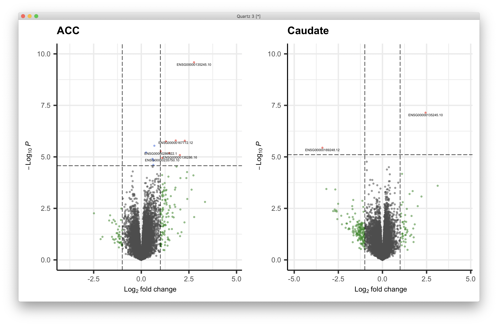
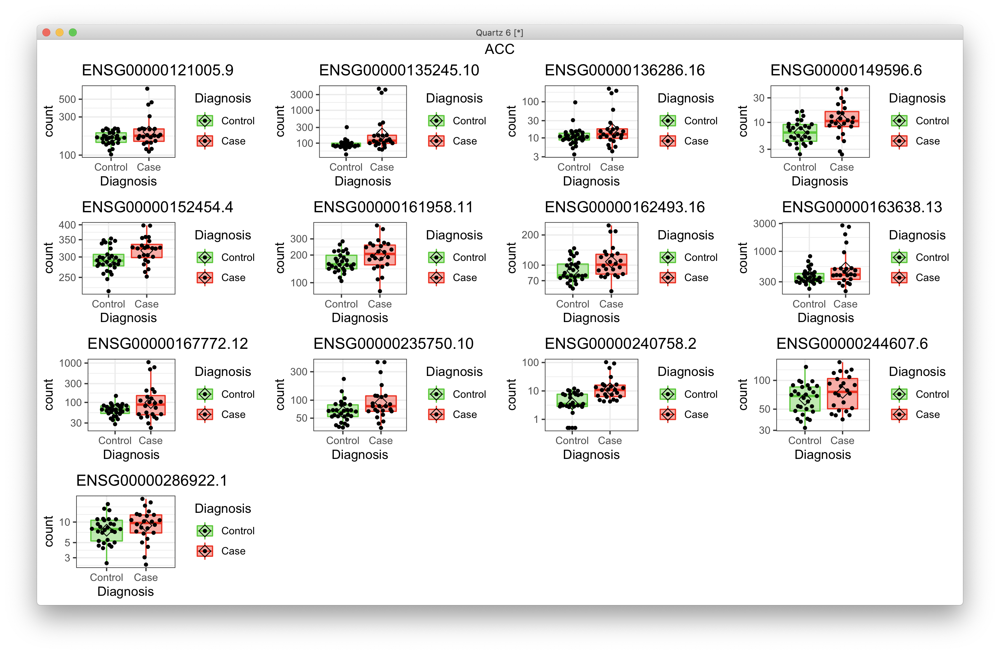
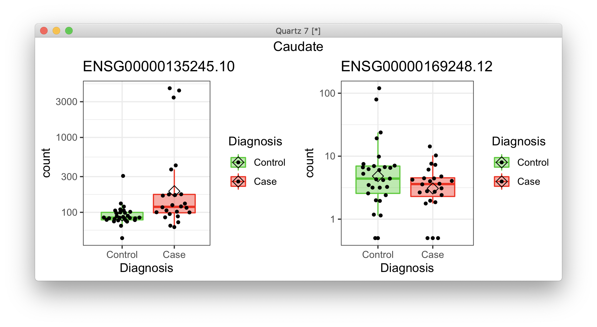
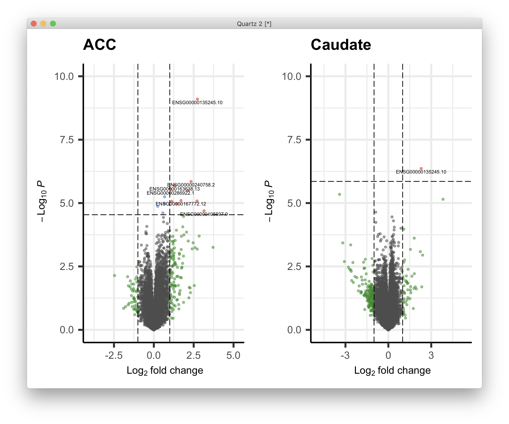
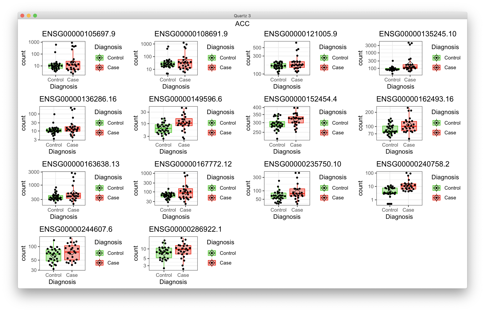
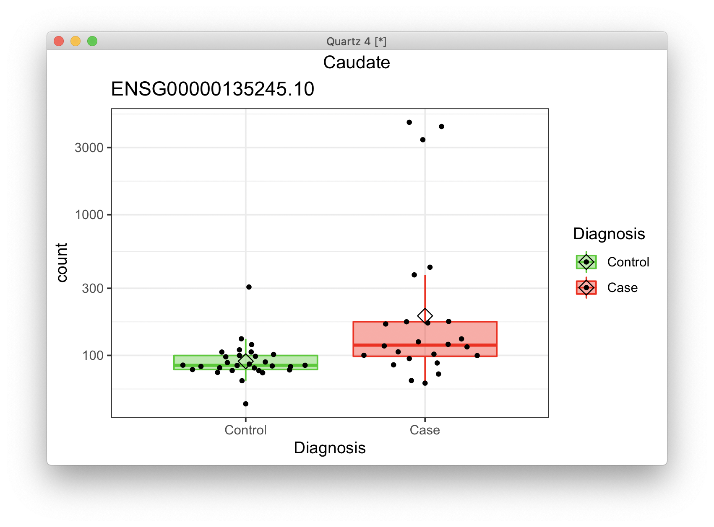

# 2021-04-29 11:04:29

WE saw that DX was dependent on comorbidity and substance abuse. But, for WNH,
we removed everyone else but WNH. Why don't we try the same approach for
comorbidity and substance, and see how it goes?

```r
pca_DGE_clean = function(myregion, fm_str, varvec, wnhOnly=FALSE) {
    # varvec is a list of variable name and the group to keep
    data = read.table('~/data/rnaseq_derek/adhd_rnaseq_counts.txt', header=1)
    rownames(data) = data[,1]
    data[,1] = NULL
    data = round(data)
    sub_name = gsub(x=colnames(data), pattern='X', replacement='')
    colnames(data) = sub_name
    # this is a repeat for Caudate hbcc 2877, but has more genes with zeros than
    # its other replicate
    data = data[, ! colnames(data) %in% c('66552')]
    # outliers based on PCA plots
    outliers = c('68080','68096', '68108', '68084', '68082')
    data = data[, ! colnames(data) %in% outliers]

    library(gdata)
    df = read.xls('~/data/post_mortem/POST_MORTEM_META_DATA_JAN_2021.xlsx')
    if (!is.na(varvec)) {
        for (v in 1:length(varvec)) {
            keep_me = which(df[, names(varvec)[v]] == varvec[v])
            df = df[keep_me, ]
        }
    }
    if (wnhOnly) {
        imWNH = which(df$C1 > 0 & df$C2 < -.075)
        df = df[imWNH, ]
    }

    # sync data and df
    data = data[, colnames(data) %in% df$submitted_name]
    df = df[df$submitted_name %in% colnames(data), ]
    df = df[order(df$submitted_name), ]
    data = data[, order(df$submitted_name)]

    keep_me = df$Region == myregion
    data = data[, keep_me]
    df = df[keep_me, ]

    # cleaning up some variables
    df$Individual = factor(df$hbcc_brain_id)
    df[df$Manner.of.Death=='Suicide (probable)', 'Manner.of.Death'] = 'Suicide'
    df[df$Manner.of.Death=='unknown', 'Manner.of.Death'] = 'natural'
    df$MoD = factor(df$Manner.of.Death)
    df$Sex = factor(df$Sex)
    df$batch = factor(df$batch)
    df$run_date = factor(gsub(df$run_date, pattern='-', replacement=''))
    df$Diagnosis = factor(df$Diagnosis, levels=c('Control', 'Case'))
    df$Region = factor(df$Region, levels=c('Caudate', 'ACC'))
    df$SUB2 = 'no'
    df[df$substance_group > 0, 'SUB2'] = 'yes'
    df$SUB2 = factor(df$SUB2)
    df$substance_group = factor(df$substance_group)
    df$comorbid_group = factor(df$comorbid_group_update)
    df$evidence_level = factor(df$evidence_level)
    df$brainbank = factor(df$bainbank)
    # replace the one subject missing population PCs by the median of their
    # self-declared race and ethnicity
    idx = (df$Race.x=='White' & df$Ethnicity.x=='Non-Hispanic' & !is.na(df$C1))
    pop_pcs = c('C1', 'C2', 'C3', 'C4', 'C5')
    med_pop = apply(df[idx, pop_pcs], 2, median)
    df[which(is.na(df$C1)), pop_pcs] = med_pop
    df$BBB = factor(sapply(1:nrow(df),
                            function(x) sprintf('%s_%s',
                                        as.character(df[x,'brainbank']),
                                        as.character(df[x, 'batch']))))
    df$BBB2 = NA                                                                        
    df[df$brainbank=='nimh_hbcc', 'BBB2'] = 1                                           
    df[df$batch==3, 'BBB2'] = 2                                                         
    df[df$batch==4, 'BBB2'] = 3      
    df$BBB2 = factor(df$BBB2)
    imWNH = which(df$C1 > 0 & df$C2 < -.075)
    df$POP_BIN = 'other'
    df[imWNH, 'POP_BIN'] = 'WNH'
    df$POP_BIN = factor(df$POP_BIN)        
    # bining so DESeq2 can do its own filyering automatically
    # breaks = quantile(df$RINe, probs = seq(0, 1, by = 0.25))
    # df$RINc = cut(df$RINe, breaks=breaks, labels=c('q1', 'q2', 'q3', 'q4'),
    #             include.lowest=T)
    df$RINc = cut(df$RINe, breaks = 5, include.lowest=T)  

    library(GenomicFeatures)
    txdb <- loadDb('~/data/post_mortem/Homo_sapies.GRCh38.97.sqlite')
    txdf <- select(txdb, keys(txdb, "GENEID"), columns=c('GENEID','TXCHROM'),
                "GENEID")
    bt = read.csv('~/data/post_mortem/Homo_sapiens.GRCh38.97_biotypes.csv')
    bt_slim = bt[, c('gene_id', 'gene_biotype')]
    bt_slim = bt_slim[!duplicated(bt_slim),]
    txdf = merge(txdf, bt_slim, by.x='GENEID', by.y='gene_id')
    tx_meta = data.frame(GENEID = substr(rownames(data), 1, 15))
    tx_meta = merge(tx_meta, txdf, by='GENEID', sort=F)
    imautosome = which(tx_meta$TXCHROM != 'X' &
                    tx_meta$TXCHROM != 'Y' &
                    tx_meta$TXCHROM != 'MT')
    data = data[imautosome, ]
    tx_meta = tx_meta[imautosome, ]

    # remove constant genes (including zeros) as it breaks PCA
    const_genes = apply(data, 1, sd) == 0
    data = data[!const_genes, ]

    library("DESeq2")
    # making sure any numeric covariates are scaled
    num_vars = c('pcnt_optical_duplicates', 'clusters', 'Age', 'RINe', 'PMI',
            'C1', 'C2', 'C3', 'C4', 'C5')
    for (var in num_vars) {
        df[, var] = scale(df[, var])
    }

    cat('Running', fm_str, '\n')
    dds <- DESeqDataSetFromMatrix(countData = data,
                                  colData = df,
                                  design = as.formula(fm_str))

    min_subjs = min(table(df$Diagnosis))
    keep <- rowSums(counts(dds) == 0) <= min_subjs
    dds <- dds[keep,]
    dds = DESeq(dds)

    library(edgeR)
    design = model.matrix(as.formula(fm_str), data=colData(dds))
    isexpr <- filterByExpr(counts(dds), design=design)
    ddsExpr = dds[isexpr, ]
    ddsExpr = DESeq(ddsExpr)

    return(ddsExpr)
}
```

OK, let's do the analysis then. I'm also keeping the old dates to make the
scripts run easier:

```r
varvec = vector(mode='numeric')
varvec[1] = 0
names(varvec) = 'substance_group'
dds.ACC = pca_DGE_clean('ACC', '~ RINe + BBB2 + Diagnosis', varvec)
dds.Caudate = pca_DGE_clean('Caudate', '~ RINe + BBB2 + Diagnosis', varvec)
save(dds.ACC, dds.Caudate,
     file='~/data/post_mortem/pca_DGE_RINe_substanceClean_04262021.RData')

varvec = vector(mode='character')
varvec[1] = 'no'
names(varvec) = 'comorbid_group_update'
dds.ACC = pca_DGE_clean('ACC', '~ RINe + BBB2 + Diagnosis', varvec)
dds.Caudate = pca_DGE_clean('Caudate', '~ RINe + BBB2 + Diagnosis', varvec)
save(dds.ACC, dds.Caudate,
     file='~/data/post_mortem/pca_DGE_RINe_comorbidClean_04262021.RData')
```

And we need to run the rest of the posthoc analysis for these two new sets:

```r
library(WebGestaltR)
library(DESeq2)

data_dir = '~/data/post_mortem/'
ncpu=31
region = 'ACC'

covs = c('comorbidClean', 'substanceClean')

for (mycov in covs) {
    load(sprintf('~/data/post_mortem/pca_DGE_RINe_%s_04262021.RData', mycov))

    res_str = sprintf('dds = dds.%s', region)
    eval(parse(text=res_str))
    res = as.data.frame(results(dds, name = "Diagnosis_Case_vs_Control"))
    
    ranks = -log(res$pvalue) * sign(res$log2FoldChange)
    geneid = substring(rownames(res), 1, 15)
    
    tmp2 = data.frame(geneid=geneid, rank=ranks)
    tmp2 = tmp2[order(ranks, decreasing=T),]

    res_str = sprintf('ROB2_DGE_%s_%s_RINe_BBB2', region, mycov)
    DBs = c(sprintf('%s_developmental', tolower(region)))
    for (db in DBs) {
        cat(res_str, db, '\n')
        db_file = sprintf('~/data/post_mortem/%s.gmt', db)
        project_name = sprintf('%s_%s_10K', res_str, db)
        enrichResult <- try(WebGestaltR(enrichMethod="GSEA",
                            organism="hsapiens",
                            enrichDatabaseFile=db_file,
                            enrichDatabaseType="genesymbol",
                            interestGene=tmp2,
                            outputDirectory = data_dir,
                            interestGeneType="ensembl_gene_id",
                            sigMethod="top", topThr=20,
                            minNum=3, projectName=project_name,
                            isOutput=T, isParallel=T,
                            nThreads=ncpu, perNum=10000, maxNum=800))
    }
    DBs = c('geneontology_Biological_Process_noRedundant',
            'geneontology_Cellular_Component_noRedundant',
            'geneontology_Molecular_Function_noRedundant')
    for (db in DBs) {
        cat(res_str, db, '\n')
        project_name = sprintf('%s_%s_10K', res_str, db)
        enrichResult <- try(WebGestaltR(enrichMethod="GSEA",
                                    organism="hsapiens",
                                    enrichDatabase=db,
                                    interestGene=tmp2,
                                    interestGeneType="ensembl_gene_id",
                                    sigMethod="top", topThr=150000,
                                    outputDirectory = data_dir,
                                    minNum=3, projectName=project_name,
                                    isOutput=F, isParallel=T,
                                    nThreads=ncpu, perNum=10000))
        out_fname = sprintf('%s/%s.csv', data_dir, project_name)
        write.csv(enrichResult, file=out_fname, row.names=F, quote=T)
    }
    for (db in c('KEGG', 'Panther', 'Reactome', 'Wikipathway')) {
        cat(res_str, db, '\n')
        project_name = sprintf('%s_%s_10K', res_str, db)

        enrichResult <- try(WebGestaltR(enrichMethod="GSEA",
                                    organism="hsapiens",
                                    enrichDatabase=sprintf('pathway_%s', db),
                                    interestGene=tmp2,
                                    interestGeneType="ensembl_gene_id",
                                    sigMethod="top", minNum=3, 
                                    outputDirectory = data_dir,
                                    projectName=project_name,
                                    isOutput=F, isParallel=T,
                                    nThreads=ncpu, topThr=150000, perNum=10000))
        out_fname = sprintf('%s/%s.csv', data_dir, project_name)
        write.csv(enrichResult, file=out_fname, row.names=F, quote=T)
    }
}
```

Now we do MAGMA:

```r
library(org.Hs.eg.db)
library(GenomicFeatures)
G_list0 = select(org.Hs.eg.db, keys(org.Hs.eg.db, 'ENSEMBL'),
                 columns=c('ENSEMBL', 'ENTREZID', 'SYMBOL'), 'ENSEMBL')
library(dplyr)
library(DESeq2)
for (g in c('comorbidClean', 'substanceClean')) {
    cat(g, '\n')
    load(sprintf('~/data/post_mortem/pca_DGE_RINe_%s_04262021.RData', g))
    for (r in c('ACC', 'Caudate')) {
        res_str = sprintf('dds = dds.%s', r)
        eval(parse(text=res_str))

        res = as.data.frame(results(dds, name = "Diagnosis_Case_vs_Control"))

        res$GENEID = substr(rownames(res), 1, 15)
        G_list <- G_list0[!is.na(G_list0$ENSEMBL),]
        G_list = G_list[G_list$ENSEMBL!='',]
        G_list <- G_list[!duplicated(G_list$ENSEMBL),]
        imnamed = res$GENEID %in% G_list$ENSEMBL
        res = res[imnamed, ]
        res2 = merge(res, G_list, sort=F, all.x=F, all.y=F, by.x='GENEID',
                    by.y='ENSEMBL')
        ranks = res2 %>% group_by(ENTREZID) %>% slice_min(n=1, pvalue, with_ties=F)
        myres = data.frame(gene=ranks$ENTREZID,
                        signed_rank=sign(ranks$log2FoldChange)*-log(ranks$pvalue),
                        unsigned_rank=-log(ranks$pvalue))
        out_fname = sprintf('~/data/post_mortem/MAGMA_RINe_BBB2_%s_dge_%s.tab',
                            g, r)
        write.table(myres, row.names=F, sep='\t', file=out_fname, quote=F)
    }
}
```

Then, for MAGMA we only need to run the last command:

```bash
module load MAGMA
cd ~/data/tmp
for g in 'substanceClean' 'comorbidClean'; do
    for r in 'ACC' 'Caudate'; do
        magma --gene-results genes_BW.genes.raw \
            --gene-covar ~/data/post_mortem/MAGMA_RINe_BBB2_${g}_dge_${r}.tab \
            --out ~/data/post_mortem/MAGMA_RINe_BBB2_gc_${g}_dge_${r};
    done;
done
```

```
(base) [sudregp@cn3158 post_mortem]$ for f in `ls MAGMA_RINe_BBB2_gc_*Clean_dge_*.gsa.out`; do echo $f; cat $f; done
MAGMA_RINe_BBB2_gc_comorbidClean_dge_ACC.gsa.out
# MEAN_SAMPLE_SIZE = 55374
# TOTAL_GENES = 14821
# TEST_DIRECTION = one-sided, positive (set), two-sided (covar)
# CONDITIONED_INTERNAL = gene size, gene density, inverse mac, log(gene size), log(gene density), log(inverse mac)
VARIABLE           TYPE  NGENES         BETA     BETA_STD           SE            P
signed_rank       COVAR   14809     -0.01204     -0.01874    0.0051165     0.018633
unsigned_rank     COVAR   14809    -0.004466   -0.0049087    0.0071283      0.53099
MAGMA_RINe_BBB2_gc_comorbidClean_dge_Caudate.gsa.out
# MEAN_SAMPLE_SIZE = 55374
# TOTAL_GENES = 14803
# TEST_DIRECTION = one-sided, positive (set), two-sided (covar)
# CONDITIONED_INTERNAL = gene size, gene density, inverse mac, log(gene size), log(gene density), log(inverse mac)
VARIABLE           TYPE  NGENES         BETA     BETA_STD           SE            P
signed_rank       COVAR   14797    0.0014783    0.0026013    0.0046974        0.753
unsigned_rank     COVAR   14797    0.0027191     0.003304    0.0062765      0.66487
MAGMA_RINe_BBB2_gc_substanceClean_dge_ACC.gsa.out
# MEAN_SAMPLE_SIZE = 55374
# TOTAL_GENES = 14832
# TEST_DIRECTION = one-sided, positive (set), two-sided (covar)
# CONDITIONED_INTERNAL = gene size, gene density, inverse mac, log(gene size), log(gene density), log(inverse mac)
VARIABLE           TYPE  NGENES         BETA     BETA_STD           SE            P
signed_rank       COVAR   14818    -0.011074    -0.022048    0.0040788    0.0066361
unsigned_rank     COVAR   14818    -0.010543     -0.01605    0.0052946     0.046475
MAGMA_RINe_BBB2_gc_substanceClean_dge_Caudate.gsa.out
# MEAN_SAMPLE_SIZE = 55374
# TOTAL_GENES = 14827
# TEST_DIRECTION = one-sided, positive (set), two-sided (covar)
# CONDITIONED_INTERNAL = gene size, gene density, inverse mac, log(gene size), log(gene density), log(inverse mac)
VARIABLE           TYPE  NGENES         BETA     BETA_STD           SE            P
signed_rank       COVAR   14820     0.001826    0.0028977    0.0051442      0.72263
unsigned_rank     COVAR   14820   0.00047722   0.00053239    0.0070515      0.94604
```

We might as well use the same code to export the single gene results:

```r
library(DESeq2)
library(IHW)
mart = readRDS('~/data/rnaseq_derek/mart_rnaseq.rds')
mydir = '~/data/post_mortem/'

library(GenomicFeatures)
txdb <- loadDb('~/data/post_mortem/Homo_sapies.GRCh38.97.sqlite')
txdf <- select(txdb, keys(txdb, "GENEID"), columns=c('GENEID','TXCHROM'),
               "GENEID")
bt = read.csv('~/data/post_mortem/Homo_sapiens.GRCh38.97_biotypes.csv')
bt_slim = bt[, c('gene_id', 'gene_biotype')]
bt_slim = bt_slim[!duplicated(bt_slim),]

for (g in c('_substanceClean', '_comorbidClean')) {
    load(sprintf('~/data/post_mortem/pca_DGE_RINe%s_04262021.RData', g))
    for (r in c('ACC', 'Caudate')) {
        res_str = sprintf('res = results(dds.%s, name = "Diagnosis_Case_vs_Control", alpha=.05)',
                        r)
        eval(parse(text=res_str))
        fname = sprintf('%s/DGE_%s_RINe_BBB2%s_annot_04262021.csv', mydir, r, g)

        df = as.data.frame(res)
        colnames(df)[ncol(df)] = 'padj.FDR'
        df$padj.IHW = adj_pvalues(ihw(pvalue ~ baseMean,  data=df, alpha=0.05))
        df$GENEID = substr(rownames(df), 1, 15)
        df2 = merge(df, mart, sort=F,
                    by.x='GENEID', by.y='ensembl_gene_id', all.x=T, all.y=F)
        df2 = merge(df2, bt_slim, sort=F,
                    by.x='GENEID', by.y='gene_id', all.x=T, all.y=F)
        df2 = df2[order(df2$pvalue), ]
        
        write.csv(df2, row.names=F, file=fname)
    }
}
```

Looking at all dev sets:

```r
library(WebGestaltR)
library(DESeq2)

data_dir = '~/data/post_mortem/'
ncpu=7

region = 'ACC'

covs = c('comorbidClean', 'substanceClean')

for (mycov in covs) {
    load(sprintf('~/data/post_mortem/pca_DGE_RINe_%s_04262021.RData', mycov))

    res_str = sprintf('dds = dds.%s', region)
    eval(parse(text=res_str))

    res = as.data.frame(results(dds, name = "Diagnosis_Case_vs_Control"))
    
    ranks = -log(res$pvalue) * sign(res$log2FoldChange)
    geneid = substring(rownames(res), 1, 15)
    
    tmp2 = data.frame(geneid=geneid, rank=ranks)
    tmp2 = tmp2[order(ranks, decreasing=T),]

    res_str = sprintf('WG30_DGE_%s_%s_RINe_BBB2', region, mycov)

    DBs = c('%s_manySets_co0.900', '%s_manySets_co0.950')
    for (db in DBs) {
        db2 = sprintf(db, tolower(region))
        cat(res_str, db2, '\n')
        db_file = sprintf('~/data/post_mortem/%s.gmt', db2)
        project_name = sprintf('%s_%s_10K', res_str, db2)
        enrichResult <- try(WebGestaltR(enrichMethod="GSEA",
                            organism="hsapiens",
                            enrichDatabaseFile=db_file,
                            enrichDatabaseType="genesymbol",
                            interestGene=tmp2,
                            outputDirectory = data_dir,
                            interestGeneType="ensembl_gene_id",
                            sigMethod="top", topThr=50,
                            minNum=3, projectName=project_name,
                            isOutput=T, isParallel=T,
                            nThreads=ncpu, perNum=10000, maxNum=2000))
    }
}
```

For correlation to other disorders, just use the code from note 215, changing
the data that's loaded and then the filename to save.

## Big model

How does a bigger model behave, then? Maybe the results will be even better?

```r
varvec = NA
fm_str = '~ RINe + BBB2 + comorbid_group + SUB2 + Diagnosis'
dds.ACC = pca_DGE_clean('ACC', fm_str, varvec)
dds.Caudate = pca_DGE_clean('Caudate', fm_str, varvec)
save(dds.ACC, dds.Caudate,
     file='~/data/post_mortem/pca_DGE_big_04292021.RData')
```

Volcano plots:

```r
quartz()

library(ggpubr)
library(EnhancedVolcano)
FCcutoff = 1.0
pCutoff = .05

myplots = list()
res = results(dds.ACC, name = "Diagnosis_Case_vs_Control", alpha=.05)
res = res[order(res$pvalue), ]
sigPs = sum(res$padj <= pCutoff, na.rm=T)
ps = -log10(res$pvalue)
nomPcutoff = ps[sigPs + 1] + (ps[sigPs] - ps[sigPs + 1]) / 2
nomPcutoff = 10 ** (-nomPcutoff)
ymax = ceiling(max(-log10(res$pvalue), na.rm=T))
p = EnhancedVolcano(data.frame(res), lab=rownames(res),
                    x = 'log2FoldChange',
                    y = 'pvalue', xlab = bquote(~Log[2]~ 'fold change'),
                    ylab = bquote(~-Log[10]~italic(P)),
                    title = 'ACC',
                    ylim = c(0, ymax),
                    pCutoff = nomPcutoff, FCcutoff = FCcutoff, pointSize = 1.0,
                    labSize = 2.0, subtitle=NULL,
                    axisLabSize = 12,
                    caption = NULL, legendPosition = 'none')
myplots[[1]] = p

res = results(dds.Caudate, name = "Diagnosis_Case_vs_Control", alpha=.05)
res = res[order(res$pvalue), ]
sigPs = sum(res$padj <= pCutoff, na.rm=T)
ps = -log10(res$pvalue)
nomPcutoff = ps[sigPs + 1] + (ps[sigPs] - ps[sigPs + 1]) / 2
nomPcutoff = 10 ** (-nomPcutoff)
p = EnhancedVolcano(data.frame(res), lab=rownames(res),
                    x = 'log2FoldChange',
                    y = 'pvalue', xlab = bquote(~Log[2]~ 'fold change'),
                    ylab = bquote(~-Log[10]~italic(P)),
                    title = 'Caudate',
                    ylim = c(0, ymax),
                    pCutoff = nomPcutoff, FCcutoff = FCcutoff, pointSize = 1.0,
                    labSize = 2.0, subtitle=NULL,
                    axisLabSize = 12,
                    caption = NULL, legendPosition = 'none')
myplots[[2]] = p
ggarrange(plotlist=myplots)
```



Are these mostly ouliers?

```r
plot_expression = function(gene_ids, dds, t_str) {
    library(ggpubr)
    library(ggbeeswarm)
    quartz()
    myplots = list()
    clrs = c("green3", "red")
    for (g in 1:length(gene_ids)) {
        cat(gene_ids[g], '\n')
        d <- plotCounts(dds, gene=gene_ids[g], intgroup="Diagnosis",
                        returnData=TRUE)
        p = (ggplot(d, aes(x=Diagnosis, y=count, color = Diagnosis,
                        fill = Diagnosis)) + 
            scale_y_log10() +
            geom_boxplot(alpha = 0.4, outlier.shape = NA, width = 0.8,
                        lwd = 0.5) +
            stat_summary(fun = mean, geom = "point", color = "black",
                        shape = 5, size = 3,
                        position=position_dodge(width = 0.8)) +
            scale_color_manual(values = clrs) +
            scale_fill_manual(values = clrs) +
            geom_quasirandom(color = "black", size = 1, dodge.width = 0.8) +
            theme_bw() +
            ggtitle(gene_ids[g]))
        myplots[[g]] = p
    }
    p = ggarrange(plotlist=myplots)
    print(annotate_figure(p, t_str))
}
res = results(dds.ACC, name = "Diagnosis_Case_vs_Control", alpha=.05)
plot_expression(rownames(res)[which(res$padj < .05)], dds.ACC, 'ACC')
res = results(dds.Caudate, name = "Diagnosis_Case_vs_Control", alpha=.05)
plot_expression(rownames(res)[which(res$padj < .05)], dds.ACC, 'Caudate')
```





Not necessarily. There are still those 3 subjects carrying some of them, but not
all the time.

```r
library(WebGestaltR)
library(DESeq2)

data_dir = '~/data/post_mortem/'
ncpu=7

load('~/data/post_mortem/pca_DGE_big_04292021.RData')
for (region in c('ACC', 'Caudate')) {
    res_str = sprintf('dds = dds.%s', region)
    eval(parse(text=res_str))

    res = as.data.frame(results(dds, name = "Diagnosis_Case_vs_Control"))
    
    ranks = -log(res$pvalue) * sign(res$log2FoldChange)
    geneid = substring(rownames(res), 1, 15)
    
    tmp2 = data.frame(geneid=geneid, rank=ranks)
    tmp2 = tmp2[order(ranks, decreasing=T),]

    res_str = sprintf('WG31_DGE_%s_big', region)

    DBs = c('%s_manySets_co0.900', '%s_manySets_co0.950')
    for (db in DBs) {
        db2 = sprintf(db, tolower(region))
        cat(res_str, db2, '\n')
        db_file = sprintf('~/data/post_mortem/%s.gmt', db2)
        project_name = sprintf('%s_%s_10K', res_str, db2)
        enrichResult <- try(WebGestaltR(enrichMethod="GSEA",
                            organism="hsapiens",
                            enrichDatabaseFile=db_file,
                            enrichDatabaseType="genesymbol",
                            interestGene=tmp2,
                            outputDirectory = data_dir,
                            interestGeneType="ensembl_gene_id",
                            sigMethod="top", topThr=50,
                            minNum=3, projectName=project_name,
                            isOutput=T, isParallel=T,
                            nThreads=ncpu, perNum=10000, maxNum=2000))
    }
}
```

And do the rest of the sets, but we need CSVs on those:

```r
library(WebGestaltR)
library(DESeq2)

data_dir = '~/data/post_mortem/'
ncpu=31
region = 'ACC'

load('~/data/post_mortem/pca_DGE_big_04292021.RData')

res_str = sprintf('dds = dds.%s', region)
eval(parse(text=res_str))
res = as.data.frame(results(dds, name = "Diagnosis_Case_vs_Control"))

ranks = -log(res$pvalue) * sign(res$log2FoldChange)
geneid = substring(rownames(res), 1, 15)

tmp2 = data.frame(geneid=geneid, rank=ranks)
tmp2 = tmp2[order(ranks, decreasing=T),]

res_str = sprintf('WG31_DGE_%s_big', region)
DBs = c('geneontology_Biological_Process_noRedundant',
        'geneontology_Cellular_Component_noRedundant',
        'geneontology_Molecular_Function_noRedundant')
for (db in DBs) {
    cat(res_str, db, '\n')
    project_name = sprintf('%s_%s_10K', res_str, db)
    enrichResult <- try(WebGestaltR(enrichMethod="GSEA",
                                organism="hsapiens",
                                enrichDatabase=db,
                                interestGene=tmp2,
                                interestGeneType="ensembl_gene_id",
                                sigMethod="top", topThr=150000,
                                outputDirectory = data_dir,
                                minNum=3, projectName=project_name,
                                isOutput=F, isParallel=T,
                                nThreads=ncpu, perNum=10000))
    out_fname = sprintf('%s/%s.csv', data_dir, project_name)
    write.csv(enrichResult, file=out_fname, row.names=F, quote=T)
}
for (db in c('KEGG', 'Panther', 'Reactome', 'Wikipathway')) {
    cat(res_str, db, '\n')
    project_name = sprintf('%s_%s_10K', res_str, db)

    enrichResult <- try(WebGestaltR(enrichMethod="GSEA",
                                organism="hsapiens",
                                enrichDatabase=sprintf('pathway_%s', db),
                                interestGene=tmp2,
                                interestGeneType="ensembl_gene_id",
                                sigMethod="top", minNum=3, 
                                outputDirectory = data_dir,
                                projectName=project_name,
                                isOutput=F, isParallel=T,
                                nThreads=ncpu, topThr=150000, perNum=10000))
    out_fname = sprintf('%s/%s.csv', data_dir, project_name)
    write.csv(enrichResult, file=out_fname, row.names=F, quote=T)
}
```

Now we do MAGMA:

```r
library(org.Hs.eg.db)
library(GenomicFeatures)
G_list0 = select(org.Hs.eg.db, keys(org.Hs.eg.db, 'ENSEMBL'),
                 columns=c('ENSEMBL', 'ENTREZID', 'SYMBOL'), 'ENSEMBL')
library(dplyr)
library(DESeq2)

load('~/data/post_mortem/pca_DGE_big_04292021.RData')
for (r in c('ACC', 'Caudate')) {
    res_str = sprintf('dds = dds.%s', r)
    eval(parse(text=res_str))

    res = as.data.frame(results(dds, name = "Diagnosis_Case_vs_Control"))

    res$GENEID = substr(rownames(res), 1, 15)
    G_list <- G_list0[!is.na(G_list0$ENSEMBL),]
    G_list = G_list[G_list$ENSEMBL!='',]
    G_list <- G_list[!duplicated(G_list$ENSEMBL),]
    imnamed = res$GENEID %in% G_list$ENSEMBL
    res = res[imnamed, ]
    res2 = merge(res, G_list, sort=F, all.x=F, all.y=F, by.x='GENEID',
                by.y='ENSEMBL')
    ranks = res2 %>% group_by(ENTREZID) %>% slice_min(n=1, pvalue, with_ties=F)
    myres = data.frame(gene=ranks$ENTREZID,
                    signed_rank=sign(ranks$log2FoldChange)*-log(ranks$pvalue),
                    unsigned_rank=-log(ranks$pvalue))
    out_fname = sprintf('~/data/post_mortem/MAGMA_big_dge_%s.tab', r)
    write.table(myres, row.names=F, sep='\t', file=out_fname, quote=F)
}
```

Then, for MAGMA we only need to run the last command:

```bash
module load MAGMA
cd ~/data/tmp
for r in 'ACC' 'Caudate'; do
    magma --gene-results genes_BW.genes.raw \
        --gene-covar ~/data/post_mortem/MAGMA_big_dge_${r}.tab \
        --out ~/data/post_mortem/MAGMA_big_gc_dge_${r};
done
```

```
(base) [sudregp@cn3158 post_mortem]$ for f in `ls MAGMA_big_gc*.gsa.out`; do echo $f; cat $f; done

MAGMA_big_gc_dge_ACC.gsa.out
# MEAN_SAMPLE_SIZE = 55374
# TOTAL_GENES = 14925
# TEST_DIRECTION = one-sided, positive (set), two-sided (covar)
# CONDITIONED_INTERNAL = gene size, gene density, inverse mac, log(gene size), log(gene density), log(inverse mac)
VARIABLE           TYPE  NGENES         BETA     BETA_STD           SE            P
signed_rank       COVAR   14913    -0.012695    -0.020689    0.0049399     0.010186
unsigned_rank     COVAR   14913   -0.0095631    -0.011555    0.0065897      0.14674
MAGMA_big_gc_dge_Caudate.gsa.out
# MEAN_SAMPLE_SIZE = 55374
# TOTAL_GENES = 14908
# TEST_DIRECTION = one-sided, positive (set), two-sided (covar)
# CONDITIONED_INTERNAL = gene size, gene density, inverse mac, log(gene size), log(gene density), log(inverse mac)
VARIABLE           TYPE  NGENES         BETA     BETA_STD           SE            P
signed_rank       COVAR   14903    0.0070827     0.011743    0.0049406      0.15171
unsigned_rank     COVAR   14903    0.0035122    0.0040067     0.006856      0.60847
```

Finally, correlation to other disorders:

```r
load('~/data/post_mortem/pca_DGE_big_04292021.RData')
out_fname = '~/data/post_mortem/disorders_corrs_big_04292021.rds'

do_boot_corrs = function(both_res, log2FC_col, method) {
    corrs = c()
    nperms = 10000
    set.seed(42)
    options(warn=-1)  # remove annoying spearman warnings
    for (p in 1:nperms) {
        idx = sample(nrow(both_res), replace = T)
        corrs = c(corrs, cor.test(both_res[idx, 'log2FoldChange'],
                                  both_res[idx, log2FC_col],
                                  method=method)$estimate)
    }
    return(corrs)
}

library(DESeq2)
meta = readRDS('~/data/post_mortem/aad6469_Gandal_SM_Data-Table-S1_micro.rds')

met = 'spearman'
dge = as.data.frame(results(dds.ACC, name = "Diagnosis_Case_vs_Control"))
dge$ensembl_gene_id = substr(rownames(dge), 1, 15)
both_res = merge(dge, meta, by='ensembl_gene_id', all.x=F, all.y=F)

corrs = list()
disorders = c('ASD', 'SCZ', 'BD', 'MDD', 'AAD', 'IBD')
for (d in disorders) {
    cat(d, '\n')
    corrs[[d]] = do_boot_corrs(both_res, sprintf('%s.beta_log2FC', d), met)
}
all_corrs = c()
for (d in disorders) {
    cat(d, '\n')
    junk = data.frame(corr=corrs[[d]])
    junk$region = 'ACC'
    junk$disorder = d
    junk$gene_overlap = nrow(both_res)
    junk$source = 'Gandal_micro'
    all_corrs = rbind(all_corrs, junk)
}

dge = as.data.frame(results(dds.Caudate, name = "Diagnosis_Case_vs_Control"))
dge$ensembl_gene_id = substr(rownames(dge), 1, 15)
both_res = merge(dge, meta, by='ensembl_gene_id', all.x=F, all.y=F)
corrs = list()
disorders = c('ASD', 'SCZ', 'BD', 'MDD', 'AAD', 'IBD')
for (d in disorders) {
    cat(d, '\n')
    corrs[[d]] = do_boot_corrs(both_res, sprintf('%s.beta_log2FC', d), met)
}
for (d in disorders) {
    junk = data.frame(corr=corrs[[d]])
    junk$region = 'Caudate'
    junk$disorder = d
    junk$gene_overlap = nrow(both_res)
    junk$source = 'Gandal_micro'
    all_corrs = rbind(all_corrs, junk)
}

library(gdata)
meta = read.xls('~/data/post_mortem/aad6469_Gandal_SM_Data-Table-S1.xlsx',
                'RNAseq SCZ&BD MetaAnalysis DGE')
dge = as.data.frame(results(dds.ACC, name = "Diagnosis_Case_vs_Control"))
dge$ensembl_gene_id = substr(rownames(dge), 1, 15)
both_res = merge(dge, meta, by.x='ensembl_gene_id', by.y='X', all.x=F, all.y=F)
corrs = list()
disorders = c('SCZ', 'BD')
for (d in disorders) {
    cat(d, '\n')
    corrs[[d]] = do_boot_corrs(both_res, sprintf('%s.logFC', d), met)
}
for (d in disorders) {
    junk = data.frame(corr=corrs[[d]])
    junk$region = 'ACC'
    junk$disorder = d
    junk$gene_overlap = nrow(both_res)
    junk$source = 'Gandal_RNAseq'
    all_corrs = rbind(all_corrs, junk)
}

dge = as.data.frame(results(dds.Caudate, name = "Diagnosis_Case_vs_Control"))
dge$ensembl_gene_id = substr(rownames(dge), 1, 15)
both_res = merge(dge, meta, by.x='ensembl_gene_id', by.y='X', all.x=F, all.y=F)
corrs = list()
disorders = c('SCZ', 'BD')
for (d in disorders) {
    cat(d, '\n')
    corrs[[d]] = do_boot_corrs(both_res, sprintf('%s.logFC', d), met)
}
for (d in disorders) {
    junk = data.frame(corr=corrs[[d]])
    junk$region = 'Caudate'
    junk$disorder = d
    junk$gene_overlap = nrow(both_res)
    junk$source = 'Gandal_RNAseq'
    all_corrs = rbind(all_corrs, junk)
}

meta = read.xls('~/data/post_mortem/aad6469_Gandal_SM_Data-Table-S1.xlsx',
                'RNAseq ASD-pancortical DGE')
dge = as.data.frame(results(dds.ACC, name = "Diagnosis_Case_vs_Control"))
dge$ensembl_gene_id = substr(rownames(dge), 1, 15)
both_res = merge(dge, meta, by.x='ensembl_gene_id', by.y='X', all.x=F, all.y=F)
corrs = list()
d = 'ASD'
junk = data.frame(corr=do_boot_corrs(both_res, 'Frontal.logFC', met))
junk$region = 'ACC'
junk$disorder = d
junk$gene_overlap = nrow(both_res)
junk$source = 'Gandal_RNAseq'
all_corrs = rbind(all_corrs, junk)

dge = as.data.frame(results(dds.Caudate, name = "Diagnosis_Case_vs_Control"))
dge$ensembl_gene_id = substr(rownames(dge), 1, 15)
both_res = merge(dge, meta, by.x='ensembl_gene_id', by.y='X', all.x=F, all.y=F)
corrs = list()
d = 'ASD'
junk = data.frame(corr=do_boot_corrs(both_res, 'Frontal.logFC', met))
junk$region = 'Caudate'
junk$disorder = d
junk$gene_overlap = nrow(both_res)
junk$source = 'Gandal_RNAseq'
all_corrs = rbind(all_corrs, junk)

# moving on to other papers: Akula
meta = readRDS('~/data/post_mortem/ACC_other_disorders.rds')
dge = as.data.frame(results(dds.ACC, name = "Diagnosis_Case_vs_Control"))
dge$ensembl_gene_id = substr(rownames(dge), 1, 15)
both_res = merge(dge, meta, by.x='ensembl_gene_id', by.y='Ensemble.gene.ID',
                 all.x=F, all.y=F)
corrs = list()
disorders = c('BD', 'SCZ', 'MDD')
for (d in disorders) {
    cat(d, '\n')
    corrs[[d]] = do_boot_corrs(both_res, sprintf('log2FoldChange.%s', d), met)
}
for (d in disorders) {
    junk = data.frame(corr=corrs[[d]])
    junk$region = 'ACC'
    junk$disorder = d
    junk$gene_overlap = nrow(both_res)
    junk$source = 'Akula'
    all_corrs = rbind(all_corrs, junk)
}

dge = as.data.frame(results(dds.Caudate, name = "Diagnosis_Case_vs_Control"))
dge$ensembl_gene_id = substr(rownames(dge), 1, 15)
mart = readRDS('~/data/rnaseq_derek/mart_rnaseq.rds')
d = 'SCZ'
dge = merge(dge, mart, by='ensembl_gene_id', all.x=T, all.y=F)
meta = read.xls('~/data/post_mortem/caudate_others.xlsx', d)
meta$gencodeID = substr(meta$gencodeID, 1, 15)
both_res = merge(dge, meta, by.x='ensembl_gene_id', by.y='gencodeID',
                 all.x=T, all.y=F)
colnames(both_res)[ncol(both_res)] = 'log2FC.SCZ'
junk = data.frame(corr=do_boot_corrs(both_res, sprintf('log2FC.%s', d), met))
junk$region = 'Caudate'
junk$disorder = d
junk$gene_overlap = nrow(both_res)
junk$source = 'Benjamin'
all_corrs = rbind(all_corrs, junk)

d = 'BD'
meta = read.xls('~/data/post_mortem/caudate_others.xlsx', d)
both_res = merge(dge, meta, by.x='ensembl_gene_id', by.y='gencodeID',
                 all.x=T, all.y=F)
colnames(both_res)[ncol(both_res)] = 'log2FC.BD'
junk = data.frame(corr=do_boot_corrs(both_res, sprintf('log2FC.%s', d), met))
junk$region = 'Caudate'
junk$disorder = d
junk$gene_overlap = nrow(both_res)
junk$source = 'Pacifico'
all_corrs = rbind(all_corrs, junk)

d = 'OCD'
meta = read.xls('~/data/post_mortem/caudate_others.xlsx', d)
both_res = merge(dge, meta, by='hgnc_symbol', all.x=T, all.y=F)
colnames(both_res)[ncol(both_res)] = 'log2FC.OCD'
junk = data.frame(corr=do_boot_corrs(both_res, sprintf('log2FC.%s', d), met))
junk$region = 'Caudate'
junk$disorder = d
junk$gene_overlap = nrow(both_res)
junk$source = 'Piantadosi'
all_corrs = rbind(all_corrs, junk)

# last 2 ASD papers
dge = as.data.frame(results(dds.ACC, name = "Diagnosis_Case_vs_Control"))
dge$ensembl_gene_id = substr(rownames(dge), 1, 15)
meta = read.xls('~/data/post_mortem/ASD_only.xlsx', 'Wright')
both_res = merge(dge, meta, by='ensembl_gene_id', all.x=T, all.y=F)
d = 'ASD'
junk = data.frame(corr=do_boot_corrs(both_res, 'log2FC', met))
junk$region = 'ACC'
junk$disorder = d
junk$gene_overlap = nrow(both_res)
junk$source = 'Wright_DLPFC'
all_corrs = rbind(all_corrs, junk)

meta = read.xls('~/data/post_mortem/ASD_only.xlsx', 'Neelroop')
both_res = merge(dge, meta, by.x='ensembl_gene_id', by.y='ENSEMBL.ID',
                 all.x=T, all.y=F)
junk = data.frame(corr=do_boot_corrs(both_res, 'log2.FC..ASD.vs.CTL', met))
junk$region = 'ACC'
junk$disorder = d
junk$gene_overlap = nrow(both_res)
junk$source = 'Neelroop_FrontalTemporal'
all_corrs = rbind(all_corrs, junk)

saveRDS(all_corrs, file=out_fname)
```

These results are looking good, especially for Caudate. But I need to find a way
to justify including the two clinical covariates in the analysis, but not C1,
which is also significant using Bonferroni.

Maybe we can try the stepwise logistic regression they used in the McMahon's
group paper (the Akula paper). [note 221, didn't help much]

# 2021-04-29 19:14:40

It turns out that I'd need to include C1 as well, if what I care about is
relationship to DX. Let's run that again though:

```r
# not going to worry about people we don't have data for, or are outliers
data = read.table('~/data/rnaseq_derek/adhd_rnaseq_counts.txt', header=1)
rownames(data) = data[,1]
data[,1] = NULL
data = round(data)
sub_name = gsub(x=colnames(data), pattern='X', replacement='')
colnames(data) = sub_name
# this is a repeat for Caudate hbcc 2877, but has more genes with zeros than
# its other replicate
data = data[, ! colnames(data) %in% c('66552')]
# outliers based on PCA plots
outliers = c('68080','68096', '68108', '68084', '68082')
data = data[, ! colnames(data) %in% outliers]

library(gdata)
df = read.xls('~/data/post_mortem/POST_MORTEM_META_DATA_JAN_2021.xlsx')
data = data[, colnames(data) %in% df$submitted_name]
df = df[df$submitted_name %in% colnames(data), ]
df = df[order(df$submitted_name), ]
data = data[, order(df$submitted_name)]

# cleaning up some variables
df$Individual = factor(df$hbcc_brain_id)
df[df$Manner.of.Death=='Suicide (probable)', 'Manner.of.Death'] = 'Suicide'
df[df$Manner.of.Death=='unknown', 'Manner.of.Death'] = 'natural'
df$MoD = factor(df$Manner.of.Death)
df$Sex = factor(df$Sex)
df$batch = factor(df$batch)
df$run_date = factor(gsub(df$run_date, pattern='-', replacement=''))
df$Diagnosis = factor(df$Diagnosis, levels=c('Control', 'Case'))
df$Region = factor(df$Region, levels=c('Caudate', 'ACC'))
df$SUB2 = 'no'
df[df$substance_group > 0, 'SUB2'] = 'yes'
df$SUB2 = factor(df$SUB2)
df$substance_group = factor(df$substance_group)
df$comorbid_group = factor(df$comorbid_group_update)
df$evidence_level = factor(df$evidence_level)
df$brainbank = factor(df$bainbank)
# replace the one subject missing population PCs by the median of their
# self-declared race and ethnicity
idx = (df$Race.x=='White' & df$Ethnicity.x=='Non-Hispanic' & !is.na(df$C1))
pop_pcs = c('C1', 'C2', 'C3', 'C4', 'C5')
med_pop = apply(df[idx, pop_pcs], 2, median)
df[which(is.na(df$C1)), pop_pcs] = med_pop
df$BBB = factor(sapply(1:nrow(df),
                        function(x) sprintf('%s_%s',
                                    as.character(df[x,'brainbank']),
                                    as.character(df[x, 'batch']))))
df$BBB2 = NA                                                                        
df[df$brainbank=='nimh_hbcc', 'BBB2'] = 1                                           
df[df$batch==3, 'BBB2'] = 2                                                         
df[df$batch==4, 'BBB2'] = 3      
df$BBB2 = factor(df$BBB2)
imWNH = which(df$C1 > 0 & df$C2 < -.075)
df$POP_BIN = 'other'
df[imWNH, 'POP_BIN'] = 'WNH'
df$POP_BIN = factor(df$POP_BIN)        
# df$RINc = cut(df$RINe, breaks = 4)  
# bining so DESeq2 can do its own filyering automatically
breaks = quantile(df$RINe, probs = seq(0, 1, by = 0.25))
df$RINc = cut(df$RINe, breaks=breaks, labels=c('q1', 'q2', 'q3', 'q4'),
            include.lowest=T)

df2 = df[!duplicated(df$hbcc_brain_id), ]

# run nonparametric t-tests for numeric variables
num_vars = c('Age', 'PMI', 'C1', 'C2', 'C3', 'C4', 'C5', 'RINe')
mypvals = c()
for (x in num_vars) {
    res = wilcox.test(as.formula(sprintf('%s ~ Diagnosis', x)), data=df2)
    mypvals = c(mypvals, res$p.value)
}

categ_vars = c('MoD', 'SUB2', 'comorbid_group', 'Sex', 'evidence_level', 'BBB2')
for (x in categ_vars) {
    res = chisq.test(table(df2$Diagnosis, df2[, x]))
    mypvals = c(mypvals, res$p.value)
}
print(c(num_vars, categ_vars)[which(mypvals < .01/length(mypvals))])
print(c(num_vars, categ_vars)[which(mypvals < .05/length(mypvals))])
```

```
[1] "SUB2"
[1] "C1"             "SUB2"           "comorbid_group"
```

And this is the same list of variables for PCA, according to note 219. OK, so
does adding C1 screw up anything?

## Bigger model

```r
varvec = NA
fm_str = '~ RINe + C1 + BBB2 + comorbid_group + SUB2 + Diagnosis'
dds.ACC = pca_DGE_clean('ACC', fm_str, varvec)
dds.Caudate = pca_DGE_clean('Caudate', fm_str, varvec)
save(dds.ACC, dds.Caudate,
     file='~/data/post_mortem/pca_DGE_bigger_04292021.RData')
```

Volcano plots:

```r
quartz()

library(ggpubr)
library(EnhancedVolcano)
FCcutoff = 1.0
pCutoff = .05

myplots = list()
res = results(dds.ACC, name = "Diagnosis_Case_vs_Control", alpha=.05)
res = res[order(res$pvalue), ]
sigPs = sum(res$padj <= pCutoff, na.rm=T)
ps = -log10(res$pvalue)
nomPcutoff = ps[sigPs + 1] + (ps[sigPs] - ps[sigPs + 1]) / 2
nomPcutoff = 10 ** (-nomPcutoff)
ymax = ceiling(max(-log10(res$pvalue), na.rm=T))
p = EnhancedVolcano(data.frame(res), lab=rownames(res),
                    x = 'log2FoldChange',
                    y = 'pvalue', xlab = bquote(~Log[2]~ 'fold change'),
                    ylab = bquote(~-Log[10]~italic(P)),
                    title = 'ACC',
                    ylim = c(0, ymax),
                    pCutoff = nomPcutoff, FCcutoff = FCcutoff, pointSize = 1.0,
                    labSize = 2.0, subtitle=NULL,
                    axisLabSize = 12,
                    caption = NULL, legendPosition = 'none')
myplots[[1]] = p

res = results(dds.Caudate, name = "Diagnosis_Case_vs_Control", alpha=.05)
res = res[order(res$pvalue), ]
sigPs = sum(res$padj <= pCutoff, na.rm=T)
ps = -log10(res$pvalue)
nomPcutoff = ps[sigPs + 1] + (ps[sigPs] - ps[sigPs + 1]) / 2
nomPcutoff = 10 ** (-nomPcutoff)
p = EnhancedVolcano(data.frame(res), lab=rownames(res),
                    x = 'log2FoldChange',
                    y = 'pvalue', xlab = bquote(~Log[2]~ 'fold change'),
                    ylab = bquote(~-Log[10]~italic(P)),
                    title = 'Caudate',
                    ylim = c(0, ymax),
                    pCutoff = nomPcutoff, FCcutoff = FCcutoff, pointSize = 1.0,
                    labSize = 2.0, subtitle=NULL,
                    axisLabSize = 12,
                    caption = NULL, legendPosition = 'none')
myplots[[2]] = p
ggarrange(plotlist=myplots)
```



Are these mostly ouliers?

```r
plot_expression = function(gene_ids, dds, t_str) {
    library(ggpubr)
    library(ggbeeswarm)
    quartz()
    myplots = list()
    clrs = c("green3", "red")
    for (g in 1:length(gene_ids)) {
        cat(gene_ids[g], '\n')
        d <- plotCounts(dds, gene=gene_ids[g], intgroup="Diagnosis",
                        returnData=TRUE)
        p = (ggplot(d, aes(x=Diagnosis, y=count, color = Diagnosis,
                        fill = Diagnosis)) + 
            scale_y_log10() +
            geom_boxplot(alpha = 0.4, outlier.shape = NA, width = 0.8,
                        lwd = 0.5) +
            stat_summary(fun = mean, geom = "point", color = "black",
                        shape = 5, size = 3,
                        position=position_dodge(width = 0.8)) +
            scale_color_manual(values = clrs) +
            scale_fill_manual(values = clrs) +
            geom_quasirandom(color = "black", size = 1, dodge.width = 0.8) +
            theme_bw() +
            ggtitle(gene_ids[g]))
        myplots[[g]] = p
    }
    p = ggarrange(plotlist=myplots)
    print(annotate_figure(p, t_str))
}
res = results(dds.ACC, name = "Diagnosis_Case_vs_Control", alpha=.05)
plot_expression(rownames(res)[which(res$padj < .05)], dds.ACC, 'ACC')
res = results(dds.Caudate, name = "Diagnosis_Case_vs_Control", alpha=.05)
plot_expression(rownames(res)[which(res$padj < .05)], dds.ACC, 'Caudate')
```





Not necessarily. There are still those 3 subjects carrying some of them, but not
all the time.

```r
library(WebGestaltR)
library(DESeq2)

data_dir = '~/data/post_mortem/'
ncpu=7

load('~/data/post_mortem/pca_DGE_bigger_04292021.RData')
for (region in c('ACC', 'Caudate')) {
    res_str = sprintf('dds = dds.%s', region)
    eval(parse(text=res_str))

    res = as.data.frame(results(dds, name = "Diagnosis_Case_vs_Control"))
    
    ranks = -log(res$pvalue) * sign(res$log2FoldChange)
    geneid = substring(rownames(res), 1, 15)
    
    tmp2 = data.frame(geneid=geneid, rank=ranks)
    tmp2 = tmp2[order(ranks, decreasing=T),]

    res_str = sprintf('WG32_DGE_%s_bigger', region)

    DBs = c('%s_manySets_co0.900', '%s_manySets_co0.950')
    for (db in DBs) {
        set.seed(42)
        db2 = sprintf(db, tolower(region))
        cat(res_str, db2, '\n')
        db_file = sprintf('~/data/post_mortem/%s.gmt', db2)
        project_name = sprintf('%s_%s_10K', res_str, db2)
        enrichResult <- try(WebGestaltR(enrichMethod="GSEA",
                            organism="hsapiens",
                            enrichDatabaseFile=db_file,
                            enrichDatabaseType="genesymbol",
                            interestGene=tmp2,
                            outputDirectory = data_dir,
                            interestGeneType="ensembl_gene_id",
                            sigMethod="top", topThr=50,
                            minNum=3, projectName=project_name,
                            isOutput=T, isParallel=T,
                            nThreads=ncpu, perNum=10000, maxNum=2000))
    }
}
```

And do the rest of the sets, but we need CSVs on those:

```r
library(WebGestaltR)
library(DESeq2)

data_dir = '~/data/post_mortem/'
ncpu=31
region = 'ACC'

load('~/data/post_mortem/pca_DGE_bigger_04292021.RData')

res_str = sprintf('dds = dds.%s', region)
eval(parse(text=res_str))
res = as.data.frame(results(dds, name = "Diagnosis_Case_vs_Control"))

ranks = -log(res$pvalue) * sign(res$log2FoldChange)
geneid = substring(rownames(res), 1, 15)

tmp2 = data.frame(geneid=geneid, rank=ranks)
tmp2 = tmp2[order(ranks, decreasing=T),]

res_str = sprintf('WG32_DGE_%s_bigger', region)
DBs = c('geneontology_Biological_Process_noRedundant',
        'geneontology_Cellular_Component_noRedundant',
        'geneontology_Molecular_Function_noRedundant')
for (db in DBs) {
    set.seed(42)
    cat(res_str, db, '\n')
    project_name = sprintf('%s_%s_10K', res_str, db)
    enrichResult <- try(WebGestaltR(enrichMethod="GSEA",
                                organism="hsapiens",
                                enrichDatabase=db,
                                interestGene=tmp2,
                                interestGeneType="ensembl_gene_id",
                                sigMethod="top", topThr=150000,
                                outputDirectory = data_dir,
                                minNum=3, projectName=project_name,
                                isOutput=F, isParallel=T,
                                nThreads=ncpu, perNum=10000))
    out_fname = sprintf('%s/%s.csv', data_dir, project_name)
    write.csv(enrichResult, file=out_fname, row.names=F, quote=T)
}
for (db in c('KEGG', 'Panther', 'Reactome', 'Wikipathway')) {
    set.seed(42)
    cat(res_str, db, '\n')
    project_name = sprintf('%s_%s_10K', res_str, db)

    enrichResult <- try(WebGestaltR(enrichMethod="GSEA",
                                organism="hsapiens",
                                enrichDatabase=sprintf('pathway_%s', db),
                                interestGene=tmp2,
                                interestGeneType="ensembl_gene_id",
                                sigMethod="top", minNum=3, 
                                outputDirectory = data_dir,
                                projectName=project_name,
                                isOutput=F, isParallel=T,
                                nThreads=ncpu, topThr=150000, perNum=10000))
    out_fname = sprintf('%s/%s.csv', data_dir, project_name)
    write.csv(enrichResult, file=out_fname, row.names=F, quote=T)
}
```

Now we do MAGMA:

```r
library(org.Hs.eg.db)
library(GenomicFeatures)
G_list0 = select(org.Hs.eg.db, keys(org.Hs.eg.db, 'ENSEMBL'),
                 columns=c('ENSEMBL', 'ENTREZID', 'SYMBOL'), 'ENSEMBL')
library(dplyr)
library(DESeq2)

load('~/data/post_mortem/pca_DGE_bigger_04292021.RData')
for (r in c('ACC', 'Caudate')) {
    res_str = sprintf('dds = dds.%s', r)
    eval(parse(text=res_str))

    res = as.data.frame(results(dds, name = "Diagnosis_Case_vs_Control"))

    res$GENEID = substr(rownames(res), 1, 15)
    G_list <- G_list0[!is.na(G_list0$ENSEMBL),]
    G_list = G_list[G_list$ENSEMBL!='',]
    G_list <- G_list[!duplicated(G_list$ENSEMBL),]
    imnamed = res$GENEID %in% G_list$ENSEMBL
    res = res[imnamed, ]
    res2 = merge(res, G_list, sort=F, all.x=F, all.y=F, by.x='GENEID',
                by.y='ENSEMBL')
    ranks = res2 %>% group_by(ENTREZID) %>% slice_min(n=1, pvalue, with_ties=F)
    myres = data.frame(gene=ranks$ENTREZID,
                    signed_rank=sign(ranks$log2FoldChange)*-log(ranks$pvalue),
                    unsigned_rank=-log(ranks$pvalue))
    out_fname = sprintf('~/data/post_mortem/MAGMA_bigger_dge_%s.tab', r)
    write.table(myres, row.names=F, sep='\t', file=out_fname, quote=F)
}
```

Then, for MAGMA we only need to run the last command:

```bash
module load MAGMA
cd ~/data/tmp
for r in 'ACC' 'Caudate'; do
    magma --gene-results genes_BW.genes.raw \
        --gene-covar ~/data/post_mortem/MAGMA_bigger_dge_${r}.tab \
        --out ~/data/post_mortem/MAGMA_bigger_gc_dge_${r};
done
```

```
(base) [sudregp@cn3098 post_mortem]$ for f in `ls MAGMA_bigger_gc*.gsa.out`; do echo $f; cat $f; done
MAGMA_bigger_gc_dge_ACC.gsa.out
# MEAN_SAMPLE_SIZE = 55374
# TOTAL_GENES = 14925
# TEST_DIRECTION = one-sided, positive (set), two-sided (covar)
# CONDITIONED_INTERNAL = gene size, gene density, inverse mac, log(gene size), log(gene density), log(inverse mac)
VARIABLE           TYPE  NGENES         BETA     BETA_STD           SE            P
signed_rank       COVAR   14925    -0.013188    -0.020644     0.005147     0.010408
unsigned_rank     COVAR   14925    -0.010129    -0.011798    0.0068374      0.13853
MAGMA_bigger_gc_dge_Caudate.gsa.out
# MEAN_SAMPLE_SIZE = 55374
# TOTAL_GENES = 14908
# TEST_DIRECTION = one-sided, positive (set), two-sided (covar)
# CONDITIONED_INTERNAL = gene size, gene density, inverse mac, log(gene size), log(gene density), log(inverse mac)
VARIABLE           TYPE  NGENES         BETA     BETA_STD           SE            P
signed_rank       COVAR   14908    0.0079008     0.013252     0.004895      0.10654
unsigned_rank     COVAR   14908    0.0040709    0.0046964    0.0067818      0.54834
```

Finally, correlation to other disorders:

```r
load('~/data/post_mortem/pca_DGE_bigger_04292021.RData')
out_fname = '~/data/post_mortem/disorders_corrs_bigger_04292021.rds'

do_boot_corrs = function(both_res, log2FC_col, method) {
    corrs = c()
    nperms = 10000
    set.seed(42)
    options(warn=-1)  # remove annoying spearman warnings
    for (p in 1:nperms) {
        idx = sample(nrow(both_res), replace = T)
        corrs = c(corrs, cor.test(both_res[idx, 'log2FoldChange'],
                                  both_res[idx, log2FC_col],
                                  method=method)$estimate)
    }
    return(corrs)
}

library(DESeq2)
meta = readRDS('~/data/post_mortem/aad6469_Gandal_SM_Data-Table-S1_micro.rds')

met = 'spearman'
dge = as.data.frame(results(dds.ACC, name = "Diagnosis_Case_vs_Control"))
dge$ensembl_gene_id = substr(rownames(dge), 1, 15)
both_res = merge(dge, meta, by='ensembl_gene_id', all.x=F, all.y=F)

corrs = list()
disorders = c('ASD', 'SCZ', 'BD', 'MDD', 'AAD', 'IBD')
for (d in disorders) {
    cat(d, '\n')
    corrs[[d]] = do_boot_corrs(both_res, sprintf('%s.beta_log2FC', d), met)
}
all_corrs = c()
for (d in disorders) {
    cat(d, '\n')
    junk = data.frame(corr=corrs[[d]])
    junk$region = 'ACC'
    junk$disorder = d
    junk$gene_overlap = nrow(both_res)
    junk$source = 'Gandal_micro'
    all_corrs = rbind(all_corrs, junk)
}

dge = as.data.frame(results(dds.Caudate, name = "Diagnosis_Case_vs_Control"))
dge$ensembl_gene_id = substr(rownames(dge), 1, 15)
both_res = merge(dge, meta, by='ensembl_gene_id', all.x=F, all.y=F)
corrs = list()
disorders = c('ASD', 'SCZ', 'BD', 'MDD', 'AAD', 'IBD')
for (d in disorders) {
    cat(d, '\n')
    corrs[[d]] = do_boot_corrs(both_res, sprintf('%s.beta_log2FC', d), met)
}
for (d in disorders) {
    junk = data.frame(corr=corrs[[d]])
    junk$region = 'Caudate'
    junk$disorder = d
    junk$gene_overlap = nrow(both_res)
    junk$source = 'Gandal_micro'
    all_corrs = rbind(all_corrs, junk)
}

library(gdata)
meta = read.xls('~/data/post_mortem/aad6469_Gandal_SM_Data-Table-S1.xlsx',
                'RNAseq SCZ&BD MetaAnalysis DGE')
dge = as.data.frame(results(dds.ACC, name = "Diagnosis_Case_vs_Control"))
dge$ensembl_gene_id = substr(rownames(dge), 1, 15)
both_res = merge(dge, meta, by.x='ensembl_gene_id', by.y='X', all.x=F, all.y=F)
corrs = list()
disorders = c('SCZ', 'BD')
for (d in disorders) {
    cat(d, '\n')
    corrs[[d]] = do_boot_corrs(both_res, sprintf('%s.logFC', d), met)
}
for (d in disorders) {
    junk = data.frame(corr=corrs[[d]])
    junk$region = 'ACC'
    junk$disorder = d
    junk$gene_overlap = nrow(both_res)
    junk$source = 'Gandal_RNAseq'
    all_corrs = rbind(all_corrs, junk)
}

dge = as.data.frame(results(dds.Caudate, name = "Diagnosis_Case_vs_Control"))
dge$ensembl_gene_id = substr(rownames(dge), 1, 15)
both_res = merge(dge, meta, by.x='ensembl_gene_id', by.y='X', all.x=F, all.y=F)
corrs = list()
disorders = c('SCZ', 'BD')
for (d in disorders) {
    cat(d, '\n')
    corrs[[d]] = do_boot_corrs(both_res, sprintf('%s.logFC', d), met)
}
for (d in disorders) {
    junk = data.frame(corr=corrs[[d]])
    junk$region = 'Caudate'
    junk$disorder = d
    junk$gene_overlap = nrow(both_res)
    junk$source = 'Gandal_RNAseq'
    all_corrs = rbind(all_corrs, junk)
}

meta = read.xls('~/data/post_mortem/aad6469_Gandal_SM_Data-Table-S1.xlsx',
                'RNAseq ASD-pancortical DGE')
dge = as.data.frame(results(dds.ACC, name = "Diagnosis_Case_vs_Control"))
dge$ensembl_gene_id = substr(rownames(dge), 1, 15)
both_res = merge(dge, meta, by.x='ensembl_gene_id', by.y='X', all.x=F, all.y=F)
corrs = list()
d = 'ASD'
junk = data.frame(corr=do_boot_corrs(both_res, 'Frontal.logFC', met))
junk$region = 'ACC'
junk$disorder = d
junk$gene_overlap = nrow(both_res)
junk$source = 'Gandal_RNAseq'
all_corrs = rbind(all_corrs, junk)

dge = as.data.frame(results(dds.Caudate, name = "Diagnosis_Case_vs_Control"))
dge$ensembl_gene_id = substr(rownames(dge), 1, 15)
both_res = merge(dge, meta, by.x='ensembl_gene_id', by.y='X', all.x=F, all.y=F)
corrs = list()
d = 'ASD'
junk = data.frame(corr=do_boot_corrs(both_res, 'Frontal.logFC', met))
junk$region = 'Caudate'
junk$disorder = d
junk$gene_overlap = nrow(both_res)
junk$source = 'Gandal_RNAseq'
all_corrs = rbind(all_corrs, junk)

# moving on to other papers: Akula
meta = readRDS('~/data/post_mortem/ACC_other_disorders.rds')
dge = as.data.frame(results(dds.ACC, name = "Diagnosis_Case_vs_Control"))
dge$ensembl_gene_id = substr(rownames(dge), 1, 15)
both_res = merge(dge, meta, by.x='ensembl_gene_id', by.y='Ensemble.gene.ID',
                 all.x=F, all.y=F)
corrs = list()
disorders = c('BD', 'SCZ', 'MDD')
for (d in disorders) {
    cat(d, '\n')
    corrs[[d]] = do_boot_corrs(both_res, sprintf('log2FoldChange.%s', d), met)
}
for (d in disorders) {
    junk = data.frame(corr=corrs[[d]])
    junk$region = 'ACC'
    junk$disorder = d
    junk$gene_overlap = nrow(both_res)
    junk$source = 'Akula'
    all_corrs = rbind(all_corrs, junk)
}

dge = as.data.frame(results(dds.Caudate, name = "Diagnosis_Case_vs_Control"))
dge$ensembl_gene_id = substr(rownames(dge), 1, 15)
mart = readRDS('~/data/rnaseq_derek/mart_rnaseq.rds')
d = 'SCZ'
dge = merge(dge, mart, by='ensembl_gene_id', all.x=T, all.y=F)
meta = read.xls('~/data/post_mortem/caudate_others.xlsx', d)
meta$gencodeID = substr(meta$gencodeID, 1, 15)
both_res = merge(dge, meta, by.x='ensembl_gene_id', by.y='gencodeID',
                 all.x=T, all.y=F)
colnames(both_res)[ncol(both_res)] = 'log2FC.SCZ'
junk = data.frame(corr=do_boot_corrs(both_res, sprintf('log2FC.%s', d), met))
junk$region = 'Caudate'
junk$disorder = d
junk$gene_overlap = nrow(both_res)
junk$source = 'Benjamin'
all_corrs = rbind(all_corrs, junk)

d = 'BD'
meta = read.xls('~/data/post_mortem/caudate_others.xlsx', d)
both_res = merge(dge, meta, by.x='ensembl_gene_id', by.y='gencodeID',
                 all.x=T, all.y=F)
colnames(both_res)[ncol(both_res)] = 'log2FC.BD'
junk = data.frame(corr=do_boot_corrs(both_res, sprintf('log2FC.%s', d), met))
junk$region = 'Caudate'
junk$disorder = d
junk$gene_overlap = nrow(both_res)
junk$source = 'Pacifico'
all_corrs = rbind(all_corrs, junk)

d = 'OCD'
meta = read.xls('~/data/post_mortem/caudate_others.xlsx', d)
both_res = merge(dge, meta, by='hgnc_symbol', all.x=T, all.y=F)
colnames(both_res)[ncol(both_res)] = 'log2FC.OCD'
junk = data.frame(corr=do_boot_corrs(both_res, sprintf('log2FC.%s', d), met))
junk$region = 'Caudate'
junk$disorder = d
junk$gene_overlap = nrow(both_res)
junk$source = 'Piantadosi'
all_corrs = rbind(all_corrs, junk)

# last 2 ASD papers
dge = as.data.frame(results(dds.ACC, name = "Diagnosis_Case_vs_Control"))
dge$ensembl_gene_id = substr(rownames(dge), 1, 15)
meta = read.xls('~/data/post_mortem/ASD_only.xlsx', 'Wright')
both_res = merge(dge, meta, by='ensembl_gene_id', all.x=T, all.y=F)
d = 'ASD'
junk = data.frame(corr=do_boot_corrs(both_res, 'log2FC', met))
junk$region = 'ACC'
junk$disorder = d
junk$gene_overlap = nrow(both_res)
junk$source = 'Wright_DLPFC'
all_corrs = rbind(all_corrs, junk)

meta = read.xls('~/data/post_mortem/ASD_only.xlsx', 'Neelroop')
both_res = merge(dge, meta, by.x='ensembl_gene_id', by.y='ENSEMBL.ID',
                 all.x=T, all.y=F)
junk = data.frame(corr=do_boot_corrs(both_res, 'log2.FC..ASD.vs.CTL', met))
junk$region = 'ACC'
junk$disorder = d
junk$gene_overlap = nrow(both_res)
junk$source = 'Neelroop_FrontalTemporal'
all_corrs = rbind(all_corrs, junk)

saveRDS(all_corrs, file=out_fname)
```

This seems to have worked quite well. Let's run WNH on top of that, and call it
quits.

## Bigger model WNH

```r
varvec = NA
fm_str = '~ RINe + C1 + BBB2 + comorbid_group + SUB2 + Diagnosis'
dds.ACC = pca_DGE_clean('ACC', fm_str, varvec, wnhOnly=T)
dds.Caudate = pca_DGE_clean('Caudate', fm_str, varvec, wnhOnly=T)
save(dds.ACC, dds.Caudate,
     file='~/data/post_mortem/pca_DGE_bigger_WNH_04292021.RData')
```

```r
library(WebGestaltR)
library(DESeq2)

data_dir = '~/data/post_mortem/'
ncpu=7

load('~/data/post_mortem/pca_DGE_bigger_WNH_04292021.RData')
for (region in c('ACC', 'Caudate')) {
    res_str = sprintf('dds = dds.%s', region)
    eval(parse(text=res_str))

    res = as.data.frame(results(dds, name = "Diagnosis_Case_vs_Control"))
    
    ranks = -log(res$pvalue) * sign(res$log2FoldChange)
    geneid = substring(rownames(res), 1, 15)
    
    tmp2 = data.frame(geneid=geneid, rank=ranks)
    tmp2 = tmp2[order(ranks, decreasing=T),]

    res_str = sprintf('ROB3_DGE_%s_bigger_WNH', region)

    DBs = c('%s_manySets_co0.900', '%s_manySets_co0.950')
    for (db in DBs) {
        set.seed(42)
        db2 = sprintf(db, tolower(region))
        cat(res_str, db2, '\n')
        db_file = sprintf('~/data/post_mortem/%s.gmt', db2)
        project_name = sprintf('%s_%s_10K', res_str, db2)
        enrichResult <- try(WebGestaltR(enrichMethod="GSEA",
                            organism="hsapiens",
                            enrichDatabaseFile=db_file,
                            enrichDatabaseType="genesymbol",
                            interestGene=tmp2,
                            outputDirectory = data_dir,
                            interestGeneType="ensembl_gene_id",
                            sigMethod="top", topThr=50,
                            minNum=3, projectName=project_name,
                            isOutput=T, isParallel=T,
                            nThreads=ncpu, perNum=10000, maxNum=2000))
    }
}
```

And do the rest of the sets, but we need CSVs on those:

```r
library(WebGestaltR)
library(DESeq2)

data_dir = '~/data/post_mortem/'
ncpu=31
region = 'ACC'

load('~/data/post_mortem/pca_DGE_bigger_WNH_04292021.RData')

res_str = sprintf('dds = dds.%s', region)
eval(parse(text=res_str))
res = as.data.frame(results(dds, name = "Diagnosis_Case_vs_Control"))

ranks = -log(res$pvalue) * sign(res$log2FoldChange)
geneid = substring(rownames(res), 1, 15)

tmp2 = data.frame(geneid=geneid, rank=ranks)
tmp2 = tmp2[order(ranks, decreasing=T),]

res_str = sprintf('ROB3_DGE_%s_bigger_WNH', region)
DBs = c('geneontology_Biological_Process_noRedundant',
        'geneontology_Cellular_Component_noRedundant',
        'geneontology_Molecular_Function_noRedundant')
for (db in DBs) {
    set.seed(42)
    cat(res_str, db, '\n')
    project_name = sprintf('%s_%s_10K', res_str, db)
    enrichResult <- try(WebGestaltR(enrichMethod="GSEA",
                                organism="hsapiens",
                                enrichDatabase=db,
                                interestGene=tmp2,
                                interestGeneType="ensembl_gene_id",
                                sigMethod="top", topThr=150000,
                                outputDirectory = data_dir,
                                minNum=3, projectName=project_name,
                                isOutput=F, isParallel=T,
                                nThreads=ncpu, perNum=10000))
    out_fname = sprintf('%s/%s.csv', data_dir, project_name)
    write.csv(enrichResult, file=out_fname, row.names=F, quote=T)
}
for (db in c('KEGG', 'Panther', 'Reactome', 'Wikipathway')) {
    set.seed(42)
    cat(res_str, db, '\n')
    project_name = sprintf('%s_%s_10K', res_str, db)

    enrichResult <- try(WebGestaltR(enrichMethod="GSEA",
                                organism="hsapiens",
                                enrichDatabase=sprintf('pathway_%s', db),
                                interestGene=tmp2,
                                interestGeneType="ensembl_gene_id",
                                sigMethod="top", minNum=3, 
                                outputDirectory = data_dir,
                                projectName=project_name,
                                isOutput=F, isParallel=T,
                                nThreads=ncpu, topThr=150000, perNum=10000))
    out_fname = sprintf('%s/%s.csv', data_dir, project_name)
    write.csv(enrichResult, file=out_fname, row.names=F, quote=T)
}
```

Now we do MAGMA:

```r
library(org.Hs.eg.db)
library(GenomicFeatures)
G_list0 = select(org.Hs.eg.db, keys(org.Hs.eg.db, 'ENSEMBL'),
                 columns=c('ENSEMBL', 'ENTREZID', 'SYMBOL'), 'ENSEMBL')
library(dplyr)
library(DESeq2)

load('~/data/post_mortem/pca_DGE_bigger_WNH_04292021.RData')
for (r in c('ACC', 'Caudate')) {
    res_str = sprintf('dds = dds.%s', r)
    eval(parse(text=res_str))

    res = as.data.frame(results(dds, name = "Diagnosis_Case_vs_Control"))

    res$GENEID = substr(rownames(res), 1, 15)
    G_list <- G_list0[!is.na(G_list0$ENSEMBL),]
    G_list = G_list[G_list$ENSEMBL!='',]
    G_list <- G_list[!duplicated(G_list$ENSEMBL),]
    imnamed = res$GENEID %in% G_list$ENSEMBL
    res = res[imnamed, ]
    res2 = merge(res, G_list, sort=F, all.x=F, all.y=F, by.x='GENEID',
                by.y='ENSEMBL')
    ranks = res2 %>% group_by(ENTREZID) %>% slice_min(n=1, pvalue, with_ties=F)
    myres = data.frame(gene=ranks$ENTREZID,
                    signed_rank=sign(ranks$log2FoldChange)*-log(ranks$pvalue),
                    unsigned_rank=-log(ranks$pvalue))
    out_fname = sprintf('~/data/post_mortem/MAGMA_bigger_WNH_dge_%s.tab', r)
    write.table(myres, row.names=F, sep='\t', file=out_fname, quote=F)
}
```

Then, for MAGMA we only need to run the last command:

```bash
module load MAGMA
cd ~/data/tmp
for r in 'ACC' 'Caudate'; do
    magma --gene-results genes_WNH.genes.raw \
        --gene-covar ~/data/post_mortem/MAGMA_bigger_WNH_dge_${r}.tab \
        --out ~/data/post_mortem/MAGMA_bigger_WNH_gc_dge_${r};
done
```

```
(base) [sudregp@cn3098 post_mortem]$ for f in `ls MAGMA_bigger_WNH_gc*.gsa.out`; do echo $f; cat $f; done
(base) [sudregp@cn3098 post_mortem]$ for f in `ls MAGMA_bigger_WNH_gc*.gsa.out`; do echo $f; cat $f; doneMAGMA_bigger_WNH_gc_dge_ACC.gsa.out
# MEAN_SAMPLE_SIZE = 53293
# TOTAL_GENES = 15035
# TEST_DIRECTION = one-sided, positive (set), two-sided (covar)
# CONDITIONED_INTERNAL = gene size, gene density, inverse mac, log(gene size), log(gene density), log(inverse mac)
VARIABLE           TYPE  NGENES         BETA     BETA_STD           SE            P
signed_rank       COVAR   15035   -0.0038223   -0.0064844    0.0042365      0.36694
unsigned_rank     COVAR   15035    0.0014235    0.0017363    0.0057303      0.80382
MAGMA_bigger_WNH_gc_dge_Caudate.gsa.out
# MEAN_SAMPLE_SIZE = 53293
# TOTAL_GENES = 15108
# TEST_DIRECTION = one-sided, positive (set), two-sided (covar)
# CONDITIONED_INTERNAL = gene size, gene density, inverse mac, log(gene size), log(gene density), log(inverse mac)
VARIABLE           TYPE  NGENES         BETA     BETA_STD           SE            P
signed_rank       COVAR   15108    0.0051882      0.00872    0.0042865      0.22616
unsigned_rank     COVAR   15108    0.0032763    0.0037824    0.0059049      0.57901
```

This didn't work too well. Maybe if we recompute the covariates? Let's see the
other results first

Finally, correlation to other disorders:

```r
load('~/data/post_mortem/pca_DGE_bigger_WNH_04292021.RData')
out_fname = '~/data/post_mortem/disorders_corrs_bigger_WNH_04292021.rds'

do_boot_corrs = function(both_res, log2FC_col, method) {
    corrs = c()
    nperms = 10000
    set.seed(42)
    options(warn=-1)  # remove annoying spearman warnings
    for (p in 1:nperms) {
        idx = sample(nrow(both_res), replace = T)
        corrs = c(corrs, cor.test(both_res[idx, 'log2FoldChange'],
                                  both_res[idx, log2FC_col],
                                  method=method)$estimate)
    }
    return(corrs)
}

library(DESeq2)
meta = readRDS('~/data/post_mortem/aad6469_Gandal_SM_Data-Table-S1_micro.rds')

met = 'spearman'
dge = as.data.frame(results(dds.ACC, name = "Diagnosis_Case_vs_Control"))
dge$ensembl_gene_id = substr(rownames(dge), 1, 15)
both_res = merge(dge, meta, by='ensembl_gene_id', all.x=F, all.y=F)

corrs = list()
disorders = c('ASD', 'SCZ', 'BD', 'MDD', 'AAD', 'IBD')
for (d in disorders) {
    cat(d, '\n')
    corrs[[d]] = do_boot_corrs(both_res, sprintf('%s.beta_log2FC', d), met)
}
all_corrs = c()
for (d in disorders) {
    cat(d, '\n')
    junk = data.frame(corr=corrs[[d]])
    junk$region = 'ACC'
    junk$disorder = d
    junk$gene_overlap = nrow(both_res)
    junk$source = 'Gandal_micro'
    all_corrs = rbind(all_corrs, junk)
}

dge = as.data.frame(results(dds.Caudate, name = "Diagnosis_Case_vs_Control"))
dge$ensembl_gene_id = substr(rownames(dge), 1, 15)
both_res = merge(dge, meta, by='ensembl_gene_id', all.x=F, all.y=F)
corrs = list()
disorders = c('ASD', 'SCZ', 'BD', 'MDD', 'AAD', 'IBD')
for (d in disorders) {
    cat(d, '\n')
    corrs[[d]] = do_boot_corrs(both_res, sprintf('%s.beta_log2FC', d), met)
}
for (d in disorders) {
    junk = data.frame(corr=corrs[[d]])
    junk$region = 'Caudate'
    junk$disorder = d
    junk$gene_overlap = nrow(both_res)
    junk$source = 'Gandal_micro'
    all_corrs = rbind(all_corrs, junk)
}

library(gdata)
meta = read.xls('~/data/post_mortem/aad6469_Gandal_SM_Data-Table-S1.xlsx',
                'RNAseq SCZ&BD MetaAnalysis DGE')
dge = as.data.frame(results(dds.ACC, name = "Diagnosis_Case_vs_Control"))
dge$ensembl_gene_id = substr(rownames(dge), 1, 15)
both_res = merge(dge, meta, by.x='ensembl_gene_id', by.y='X', all.x=F, all.y=F)
corrs = list()
disorders = c('SCZ', 'BD')
for (d in disorders) {
    cat(d, '\n')
    corrs[[d]] = do_boot_corrs(both_res, sprintf('%s.logFC', d), met)
}
for (d in disorders) {
    junk = data.frame(corr=corrs[[d]])
    junk$region = 'ACC'
    junk$disorder = d
    junk$gene_overlap = nrow(both_res)
    junk$source = 'Gandal_RNAseq'
    all_corrs = rbind(all_corrs, junk)
}

dge = as.data.frame(results(dds.Caudate, name = "Diagnosis_Case_vs_Control"))
dge$ensembl_gene_id = substr(rownames(dge), 1, 15)
both_res = merge(dge, meta, by.x='ensembl_gene_id', by.y='X', all.x=F, all.y=F)
corrs = list()
disorders = c('SCZ', 'BD')
for (d in disorders) {
    cat(d, '\n')
    corrs[[d]] = do_boot_corrs(both_res, sprintf('%s.logFC', d), met)
}
for (d in disorders) {
    junk = data.frame(corr=corrs[[d]])
    junk$region = 'Caudate'
    junk$disorder = d
    junk$gene_overlap = nrow(both_res)
    junk$source = 'Gandal_RNAseq'
    all_corrs = rbind(all_corrs, junk)
}

meta = read.xls('~/data/post_mortem/aad6469_Gandal_SM_Data-Table-S1.xlsx',
                'RNAseq ASD-pancortical DGE')
dge = as.data.frame(results(dds.ACC, name = "Diagnosis_Case_vs_Control"))
dge$ensembl_gene_id = substr(rownames(dge), 1, 15)
both_res = merge(dge, meta, by.x='ensembl_gene_id', by.y='X', all.x=F, all.y=F)
corrs = list()
d = 'ASD'
junk = data.frame(corr=do_boot_corrs(both_res, 'Frontal.logFC', met))
junk$region = 'ACC'
junk$disorder = d
junk$gene_overlap = nrow(both_res)
junk$source = 'Gandal_RNAseq'
all_corrs = rbind(all_corrs, junk)

dge = as.data.frame(results(dds.Caudate, name = "Diagnosis_Case_vs_Control"))
dge$ensembl_gene_id = substr(rownames(dge), 1, 15)
both_res = merge(dge, meta, by.x='ensembl_gene_id', by.y='X', all.x=F, all.y=F)
corrs = list()
d = 'ASD'
junk = data.frame(corr=do_boot_corrs(both_res, 'Frontal.logFC', met))
junk$region = 'Caudate'
junk$disorder = d
junk$gene_overlap = nrow(both_res)
junk$source = 'Gandal_RNAseq'
all_corrs = rbind(all_corrs, junk)

# moving on to other papers: Akula
meta = readRDS('~/data/post_mortem/ACC_other_disorders.rds')
dge = as.data.frame(results(dds.ACC, name = "Diagnosis_Case_vs_Control"))
dge$ensembl_gene_id = substr(rownames(dge), 1, 15)
both_res = merge(dge, meta, by.x='ensembl_gene_id', by.y='Ensemble.gene.ID',
                 all.x=F, all.y=F)
corrs = list()
disorders = c('BD', 'SCZ', 'MDD')
for (d in disorders) {
    cat(d, '\n')
    corrs[[d]] = do_boot_corrs(both_res, sprintf('log2FoldChange.%s', d), met)
}
for (d in disorders) {
    junk = data.frame(corr=corrs[[d]])
    junk$region = 'ACC'
    junk$disorder = d
    junk$gene_overlap = nrow(both_res)
    junk$source = 'Akula'
    all_corrs = rbind(all_corrs, junk)
}

dge = as.data.frame(results(dds.Caudate, name = "Diagnosis_Case_vs_Control"))
dge$ensembl_gene_id = substr(rownames(dge), 1, 15)
mart = readRDS('~/data/rnaseq_derek/mart_rnaseq.rds')
d = 'SCZ'
dge = merge(dge, mart, by='ensembl_gene_id', all.x=T, all.y=F)
meta = read.xls('~/data/post_mortem/caudate_others.xlsx', d)
meta$gencodeID = substr(meta$gencodeID, 1, 15)
both_res = merge(dge, meta, by.x='ensembl_gene_id', by.y='gencodeID',
                 all.x=T, all.y=F)
colnames(both_res)[ncol(both_res)] = 'log2FC.SCZ'
junk = data.frame(corr=do_boot_corrs(both_res, sprintf('log2FC.%s', d), met))
junk$region = 'Caudate'
junk$disorder = d
junk$gene_overlap = nrow(both_res)
junk$source = 'Benjamin'
all_corrs = rbind(all_corrs, junk)

d = 'BD'
meta = read.xls('~/data/post_mortem/caudate_others.xlsx', d)
both_res = merge(dge, meta, by.x='ensembl_gene_id', by.y='gencodeID',
                 all.x=T, all.y=F)
colnames(both_res)[ncol(both_res)] = 'log2FC.BD'
junk = data.frame(corr=do_boot_corrs(both_res, sprintf('log2FC.%s', d), met))
junk$region = 'Caudate'
junk$disorder = d
junk$gene_overlap = nrow(both_res)
junk$source = 'Pacifico'
all_corrs = rbind(all_corrs, junk)

d = 'OCD'
meta = read.xls('~/data/post_mortem/caudate_others.xlsx', d)
both_res = merge(dge, meta, by='hgnc_symbol', all.x=T, all.y=F)
colnames(both_res)[ncol(both_res)] = 'log2FC.OCD'
junk = data.frame(corr=do_boot_corrs(both_res, sprintf('log2FC.%s', d), met))
junk$region = 'Caudate'
junk$disorder = d
junk$gene_overlap = nrow(both_res)
junk$source = 'Piantadosi'
all_corrs = rbind(all_corrs, junk)

# last 2 ASD papers
dge = as.data.frame(results(dds.ACC, name = "Diagnosis_Case_vs_Control"))
dge$ensembl_gene_id = substr(rownames(dge), 1, 15)
meta = read.xls('~/data/post_mortem/ASD_only.xlsx', 'Wright')
both_res = merge(dge, meta, by='ensembl_gene_id', all.x=T, all.y=F)
d = 'ASD'
junk = data.frame(corr=do_boot_corrs(both_res, 'log2FC', met))
junk$region = 'ACC'
junk$disorder = d
junk$gene_overlap = nrow(both_res)
junk$source = 'Wright_DLPFC'
all_corrs = rbind(all_corrs, junk)

meta = read.xls('~/data/post_mortem/ASD_only.xlsx', 'Neelroop')
both_res = merge(dge, meta, by.x='ensembl_gene_id', by.y='ENSEMBL.ID',
                 all.x=T, all.y=F)
junk = data.frame(corr=do_boot_corrs(both_res, 'log2.FC..ASD.vs.CTL', met))
junk$region = 'ACC'
junk$disorder = d
junk$gene_overlap = nrow(both_res)
junk$source = 'Neelroop_FrontalTemporal'
all_corrs = rbind(all_corrs, junk)

saveRDS(all_corrs, file=out_fname)
```

If these look good when compared to main results, and so do the GO results, then
let's just go with that. We can't have everything, so we won't take MAGMA for
robustness I guess.

# 2021-04-30 06:31:27

Exporting single variable results:

We might as well use the same code to export the single gene results:

```r
library(DESeq2)
library(IHW)
mart = readRDS('~/data/rnaseq_derek/mart_rnaseq.rds')
mydir = '~/data/post_mortem/'

library(GenomicFeatures)
txdb <- loadDb('~/data/post_mortem/Homo_sapies.GRCh38.97.sqlite')
txdf <- select(txdb, keys(txdb, "GENEID"), columns=c('GENEID','TXCHROM'),
               "GENEID")
bt = read.csv('~/data/post_mortem/Homo_sapiens.GRCh38.97_biotypes.csv')
bt_slim = bt[, c('gene_id', 'gene_biotype')]
bt_slim = bt_slim[!duplicated(bt_slim),]

for (g in c('', '_WNH')) {
    load(sprintf('~/data/post_mortem/pca_DGE_bigger%s_04292021.RData', g))
    for (r in c('ACC', 'Caudate')) {
        res_str = sprintf('res = results(dds.%s, name = "Diagnosis_Case_vs_Control", alpha=.05)',
                        r)
        eval(parse(text=res_str))
        fname = sprintf('%s/DGE_%s_bigger%s_annot_04292021.csv', mydir, r, g)

        df = as.data.frame(res)
        colnames(df)[ncol(df)] = 'padj.FDR'
        df$padj.IHW = adj_pvalues(ihw(pvalue ~ baseMean,  data=df, alpha=0.05))
        df$GENEID = substr(rownames(df), 1, 15)
        df2 = merge(df, mart, sort=F,
                    by.x='GENEID', by.y='ensembl_gene_id', all.x=T, all.y=F)
        df2 = merge(df2, bt_slim, sort=F,
                    by.x='GENEID', by.y='gene_id', all.x=T, all.y=F)
        df2 = df2[order(df2$pvalue), ]
        
        write.csv(df2, row.names=F, file=fname)
    }
}
```

# 2021-04-30 15:41:46

I want to do a quick experiment: if I use log10 instead of log, do the results
change much?

```r
library(WebGestaltR)
library(DESeq2)

data_dir = '~/data/post_mortem/'
ncpu=7

load('~/data/post_mortem/pca_DGE_bigger_04292021.RData')
for (region in c('ACC', 'Caudate')) {
    res_str = sprintf('dds = dds.%s', region)
    eval(parse(text=res_str))

    res = as.data.frame(results(dds, name = "Diagnosis_Case_vs_Control"))
    
    ranks = -log10(res$pvalue) * sign(res$log2FoldChange)
    geneid = substring(rownames(res), 1, 15)
    
    tmp2 = data.frame(geneid=geneid, rank=ranks)
    tmp2 = tmp2[order(ranks, decreasing=T),]

    res_str = sprintf('WG32_DGE_%s_bigger_log10', region)

    DBs = c('%s_manySets_co0.900', '%s_manySets_co0.950')
    for (db in DBs) {
        set.seed(42)
        db2 = sprintf(db, tolower(region))
        cat(res_str, db2, '\n')
        db_file = sprintf('~/data/post_mortem/%s.gmt', db2)
        project_name = sprintf('%s_%s_10K', res_str, db2)
        enrichResult <- try(WebGestaltR(enrichMethod="GSEA",
                            organism="hsapiens",
                            enrichDatabaseFile=db_file,
                            enrichDatabaseType="genesymbol",
                            interestGene=tmp2,
                            outputDirectory = data_dir,
                            interestGeneType="ensembl_gene_id",
                            sigMethod="top", topThr=50,
                            minNum=3, projectName=project_name,
                            isOutput=T, isParallel=T,
                            nThreads=ncpu, perNum=10000, maxNum=2000))
    }
}
```

And do the rest of the sets, but we need CSVs on those:

```r
library(WebGestaltR)
library(DESeq2)

data_dir = '~/data/post_mortem/'
ncpu=31
region = 'ACC'

load('~/data/post_mortem/pca_DGE_bigger_04292021.RData')

res_str = sprintf('dds = dds.%s', region)
eval(parse(text=res_str))
res = as.data.frame(results(dds, name = "Diagnosis_Case_vs_Control"))

ranks = -log10(res$pvalue) * sign(res$log2FoldChange)
geneid = substring(rownames(res), 1, 15)

tmp2 = data.frame(geneid=geneid, rank=ranks)
tmp2 = tmp2[order(ranks, decreasing=T),]

res_str = sprintf('WG32_DGE_%s_bigger_log10', region)
DBs = c('geneontology_Biological_Process_noRedundant',
        'geneontology_Cellular_Component_noRedundant',
        'geneontology_Molecular_Function_noRedundant')
for (db in DBs) {
    set.seed(42)
    cat(res_str, db, '\n')
    project_name = sprintf('%s_%s_10K', res_str, db)
    enrichResult <- try(WebGestaltR(enrichMethod="GSEA",
                                organism="hsapiens",
                                enrichDatabase=db,
                                interestGene=tmp2,
                                interestGeneType="ensembl_gene_id",
                                sigMethod="top", topThr=150000,
                                outputDirectory = data_dir,
                                minNum=3, projectName=project_name,
                                isOutput=F, isParallel=T,
                                nThreads=ncpu, perNum=10000))
    out_fname = sprintf('%s/%s.csv', data_dir, project_name)
    write.csv(enrichResult, file=out_fname, row.names=F, quote=T)
}
for (db in c('KEGG', 'Panther', 'Reactome', 'Wikipathway')) {
    set.seed(42)
    cat(res_str, db, '\n')
    project_name = sprintf('%s_%s_10K', res_str, db)

    enrichResult <- try(WebGestaltR(enrichMethod="GSEA",
                                organism="hsapiens",
                                enrichDatabase=sprintf('pathway_%s', db),
                                interestGene=tmp2,
                                interestGeneType="ensembl_gene_id",
                                sigMethod="top", minNum=3, 
                                outputDirectory = data_dir,
                                projectName=project_name,
                                isOutput=F, isParallel=T,
                                nThreads=ncpu, topThr=150000, perNum=10000))
    out_fname = sprintf('%s/%s.csv', data_dir, project_name)
    write.csv(enrichResult, file=out_fname, row.names=F, quote=T)
}
```

Results seem to be holding up, so let's run it for WNH as well, just so we're
consistent across the paper.

```r
library(WebGestaltR)
library(DESeq2)

data_dir = '~/data/post_mortem/'
ncpu=7

load('~/data/post_mortem/pca_DGE_bigger_WNH_04292021.RData')
for (region in c('ACC', 'Caudate')) {
    res_str = sprintf('dds = dds.%s', region)
    eval(parse(text=res_str))

    res = as.data.frame(results(dds, name = "Diagnosis_Case_vs_Control"))
    
    ranks = -log10(res$pvalue) * sign(res$log2FoldChange)
    geneid = substring(rownames(res), 1, 15)
    
    tmp2 = data.frame(geneid=geneid, rank=ranks)
    tmp2 = tmp2[order(ranks, decreasing=T),]

    res_str = sprintf('WG32_DGE_%s_bigger_WNH_log10', region)

    DBs = c('%s_manySets_co0.900', '%s_manySets_co0.950')
    for (db in DBs) {
        set.seed(42)
        db2 = sprintf(db, tolower(region))
        cat(res_str, db2, '\n')
        db_file = sprintf('~/data/post_mortem/%s.gmt', db2)
        project_name = sprintf('%s_%s_10K', res_str, db2)
        enrichResult <- try(WebGestaltR(enrichMethod="GSEA",
                            organism="hsapiens",
                            enrichDatabaseFile=db_file,
                            enrichDatabaseType="genesymbol",
                            interestGene=tmp2,
                            outputDirectory = data_dir,
                            interestGeneType="ensembl_gene_id",
                            sigMethod="top", topThr=50,
                            minNum=3, projectName=project_name,
                            isOutput=T, isParallel=T,
                            nThreads=ncpu, perNum=10000, maxNum=2000))
    }
}
```

```r
library(WebGestaltR)
library(DESeq2)

data_dir = '~/data/post_mortem/'
ncpu=31
region = 'ACC'

load('~/data/post_mortem/pca_DGE_bigger_WNH_04292021.RData')

res_str = sprintf('dds = dds.%s', region)
eval(parse(text=res_str))
res = as.data.frame(results(dds, name = "Diagnosis_Case_vs_Control"))

ranks = -log10(res$pvalue) * sign(res$log2FoldChange)
geneid = substring(rownames(res), 1, 15)

tmp2 = data.frame(geneid=geneid, rank=ranks)
tmp2 = tmp2[order(ranks, decreasing=T),]

res_str = sprintf('WG32_DGE_%s_bigger_WNH_log10', region)
DBs = c('geneontology_Biological_Process_noRedundant',
        'geneontology_Cellular_Component_noRedundant',
        'geneontology_Molecular_Function_noRedundant')
for (db in DBs) {
    set.seed(42)
    cat(res_str, db, '\n')
    project_name = sprintf('%s_%s_10K', res_str, db)
    enrichResult <- try(WebGestaltR(enrichMethod="GSEA",
                                organism="hsapiens",
                                enrichDatabase=db,
                                interestGene=tmp2,
                                interestGeneType="ensembl_gene_id",
                                sigMethod="top", topThr=150000,
                                outputDirectory = data_dir,
                                minNum=3, projectName=project_name,
                                isOutput=F, isParallel=T,
                                nThreads=ncpu, perNum=10000))
    out_fname = sprintf('%s/%s.csv', data_dir, project_name)
    write.csv(enrichResult, file=out_fname, row.names=F, quote=T)
}
for (db in c('KEGG', 'Panther', 'Reactome', 'Wikipathway')) {
    set.seed(42)
    cat(res_str, db, '\n')
    project_name = sprintf('%s_%s_10K', res_str, db)

    enrichResult <- try(WebGestaltR(enrichMethod="GSEA",
                                organism="hsapiens",
                                enrichDatabase=sprintf('pathway_%s', db),
                                interestGene=tmp2,
                                interestGeneType="ensembl_gene_id",
                                sigMethod="top", minNum=3, 
                                outputDirectory = data_dir,
                                projectName=project_name,
                                isOutput=F, isParallel=T,
                                nThreads=ncpu, topThr=150000, perNum=10000))
    out_fname = sprintf('%s/%s.csv', data_dir, project_name)
    write.csv(enrichResult, file=out_fname, row.names=F, quote=T)
}
```

And MAGMA uses rank as well, so let's rerun it:

```r
library(org.Hs.eg.db)
library(GenomicFeatures)
G_list0 = select(org.Hs.eg.db, keys(org.Hs.eg.db, 'ENSEMBL'),
                 columns=c('ENSEMBL', 'ENTREZID', 'SYMBOL'), 'ENSEMBL')
library(dplyr)
library(DESeq2)

load('~/data/post_mortem/pca_DGE_bigger_WNH_04292021.RData')
for (r in c('ACC', 'Caudate')) {
    res_str = sprintf('dds = dds.%s', r)
    eval(parse(text=res_str))

    res = as.data.frame(results(dds, name = "Diagnosis_Case_vs_Control"))

    res$GENEID = substr(rownames(res), 1, 15)
    G_list <- G_list0[!is.na(G_list0$ENSEMBL),]
    G_list = G_list[G_list$ENSEMBL!='',]
    G_list <- G_list[!duplicated(G_list$ENSEMBL),]
    imnamed = res$GENEID %in% G_list$ENSEMBL
    res = res[imnamed, ]
    res2 = merge(res, G_list, sort=F, all.x=F, all.y=F, by.x='GENEID',
                by.y='ENSEMBL')
    ranks = res2 %>% group_by(ENTREZID) %>% slice_min(n=1, pvalue, with_ties=F)
    myres = data.frame(gene=ranks$ENTREZID,
                    signed_rank=sign(ranks$log2FoldChange)*-log10(ranks$pvalue),
                    unsigned_rank=-log10(ranks$pvalue))
    out_fname = sprintf('~/data/post_mortem/MAGMA_bigger_WNH_log10_dge_%s.tab', r)
    write.table(myres, row.names=F, sep='\t', file=out_fname, quote=F)
}
```

Then, for MAGMA we only need to run the last command:

```bash
module load MAGMA
cd ~/data/tmp
for r in 'ACC' 'Caudate'; do
    magma --gene-results genes_BW.genes.raw \
        --gene-covar ~/data/post_mortem/MAGMA_bigger_log10_dge_${r}.tab \
        --out ~/data/post_mortem/MAGMA_bigger_log10_gc_dge_${r};
done
```

And repeat it for WNH.

```
(base) [sudregp@cn3098 post_mortem]$ for f in `ls MAGMA_bigger_*log10_gc*.gsa.out`; do echo $f; cat $f; done
MAGMA_bigger_log10_gc_dge_ACC.gsa.out
# MEAN_SAMPLE_SIZE = 55374
# TOTAL_GENES = 14925
# TEST_DIRECTION = one-sided, positive (set), two-sided (covar)
# CONDITIONED_INTERNAL = gene size, gene density, inverse mac, log(gene size), log(gene density), log(inverse mac)
VARIABLE           TYPE  NGENES         BETA     BETA_STD           SE            P
signed_rank       COVAR   14925    -0.030367    -0.020644     0.011851     0.010408
unsigned_rank     COVAR   14925    -0.023322    -0.011798     0.015744      0.13853
MAGMA_bigger_log10_gc_dge_Caudate.gsa.out
# MEAN_SAMPLE_SIZE = 55374
# TOTAL_GENES = 14908
# TEST_DIRECTION = one-sided, positive (set), two-sided (covar)
# CONDITIONED_INTERNAL = gene size, gene density, inverse mac, log(gene size), log(gene density), log(inverse mac)
VARIABLE           TYPE  NGENES         BETA     BETA_STD           SE            P
signed_rank       COVAR   14908     0.018192     0.013252     0.011271      0.10654
unsigned_rank     COVAR   14908    0.0093736    0.0046964     0.015616      0.54834
MAGMA_bigger_WNH_log10_gc_dge_ACC.gsa.out
# MEAN_SAMPLE_SIZE = 53293
# TOTAL_GENES = 15035
# TEST_DIRECTION = one-sided, positive (set), two-sided (covar)
# CONDITIONED_INTERNAL = gene size, gene density, inverse mac, log(gene size), log(gene density), log(inverse mac)
VARIABLE           TYPE  NGENES         BETA     BETA_STD           SE            P
signed_rank       COVAR   15035   -0.0088013   -0.0064844    0.0097548      0.36694
unsigned_rank     COVAR   15035    0.0032777    0.0017363     0.013195      0.80382
MAGMA_bigger_WNH_log10_gc_dge_Caudate.gsa.out
# MEAN_SAMPLE_SIZE = 53293
# TOTAL_GENES = 15108
# TEST_DIRECTION = one-sided, positive (set), two-sided (covar)
# CONDITIONED_INTERNAL = gene size, gene density, inverse mac, log(gene size), log(gene density), log(inverse mac)
VARIABLE           TYPE  NGENES         BETA     BETA_STD           SE            P
signed_rank       COVAR   15108     0.011946      0.00872      0.00987      0.22616
unsigned_rank     COVAR   15108     0.007544    0.0037824     0.013597      0.57901
```

So, the whole story is that when I was running only RINe + BBB2, the results
looked good, especially for ACC, but when I ran robustness tests for substance,
comorbid, and WNH, there wasn't that much overlap. Especially for substance. I
tried it using clean sets and also just using them as covariates. However, the
results with substance actually looked better. So, I decided to add them to the
main model, but if we do that, based on the rationale of looking for
significance between DX and the 14 variables, I need to include C1 as well. When
I do that, the developmental results look fine, and so do the Caudate GSEA, much
better than ACC. But the good ACC results go away.

With all variables now, the only thing that doesn't hold is MAGMA.

# TODO
