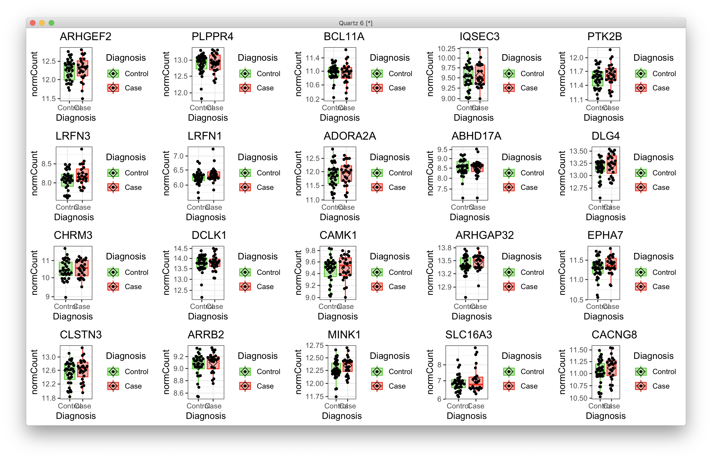

# 2021-04-30 06:28:23

We seem to have reached a nice set of results using the bigger model (note 220).
Let's change here and make the robustness plots first:

## Robustness

Let's do the comparative p-value figure:

```r
orig = read.csv('~/data/post_mortem/DGE_ACC_bigger_annot_04292021.csv')
wnh = read.csv('~/data/post_mortem/DGE_ACC_bigger_WNH_annot_04292021.csv')
m = merge(orig, wnh, by='GENEID', suffix=c('.orig', '.wnh'), all.x=T, all.y=T)
imnamed = which(m$hgnc_symbol.orig != '')
m$gene_str = m$GENEID
m[imnamed, 'gene_str'] = m[imnamed, 'hgnc_symbol.orig']

imgood = which(m$padj.FDR.orig < .05) 
df = m[imgood, c('gene_str', 'pvalue.orig', 'pvalue.wnh')] 
colnames(df) = c('gene_str', 'main', 'WNH')
plot_df = reshape2::melt(df)
colnames(plot_df)[2] = 'Analysis' 

library(ggplot2)
quartz()
ggplot(data=plot_df, aes(x=gene_str, y=-log10(value), fill=Analysis)) +
    geom_bar(stat="identity", position=position_dodge()) +
    theme(axis.text.x = element_text(angle = 90, hjust=1, vjust=0.5),
          axis.title.x = element_blank()) +
    ggtitle('ACC genes FDR q < .05') + 
    ylab(bquote(~-Log[10]~italic(P))) +
    geom_hline(yintercept=-log10(.05), linetype="dashed", color = "black") +
    geom_hline(yintercept=-log10(.01), linetype="dotted", color = "black")
```


And also the developmental one:

```r
r = 'ACC'
keep_me = c("dev1_c0.900_devSpec_regSpec", "dev2_c0.900_devSpec_regSpec",
            "dev3_c0.900_devSpec_regSpec", "dev4_c0.900_devSpec_regSpec",
            "dev5_c0.900_devSpec_regSpec", "overlap_c0.900_regSpec")

orig = read.table(sprintf('~/data/post_mortem/Project_WG32_DGE_%s_bigger_log10_%s_manySets_co0_900_10K/enrichment_results_WG32_DGE_%s_bigger_log10_%s_manySets_co0_900_10K.txt',
                          r, tolower(r), r, tolower(r)),
                  header=1, sep='\t')[, 1:6]
wnh = read.table(sprintf('~/data/post_mortem/Project_WG32_DGE_%s_bigger_WNH_log10_%s_manySets_co0_900_10K/enrichment_results_WG32_DGE_%s_bigger_WNH_log10_%s_manySets_co0_900_10K.txt',
                  r, tolower(r), r, tolower(r)),
                 header=1, sep='\t')[, 1:6]

m = merge(orig, wnh, by='geneSet', suffix=c('.orig', '.wnh'), all.x=T, all.y=T)

df = m[m$geneSet %in% keep_me, c('link.orig', 'pValue.orig', 'pValue.wnh')] 
colnames(df) = c('GeneSet', 'main', 'WNH')
df[df$GeneSet == 'overlap', 'GeneSet'] = 'pan-developmental'
plot_df = reshape2::melt(df)
colnames(plot_df)[2] = 'Analysis'
plot_df[plot_df$value == 0, 'value'] = 1e-5
my_order = c("prenatal", "infant (0-2 yrs)", "child (3-11 yrs)",
             "adolescent (12-19 yrs)", "adult (>19 yrs)", "pan-developmental")
plot_df$GeneSet = factor(plot_df$GeneSet, levels=my_order)

library(ggplot2)
quartz()
ggplot(data=plot_df, aes(x=GeneSet, y=-log10(value), fill=Analysis)) +
    geom_bar(stat="identity", position=position_dodge()) +
    theme(axis.text.x = element_text(angle = 90),
          axis.title.x = element_blank()) +
    ggtitle(sprintf('%s developmental sets', r)) + 
    ylab(bquote(~-Log[10]~italic(P))) +
    geom_hline(yintercept=-log10(.05), linetype="dashed", color = "black") +
    geom_hline(yintercept=-log10(.01), linetype="dotted", color = "black")
```


## Robustness correlation to disorders

```r
fname = 'disorders_corrs_bigger_04292021'
r = 'ACC'

corrs = readRDS(sprintf('~/data/post_mortem/%s.rds', fname))
corrs$disorder = factor(corrs$disorder)
# just to share axis
ymax = max(corrs$corr)
ymin = min(corrs$corr)
my_colors = RColorBrewer::brewer.pal(7, "Accent")
all_disorders = levels(corrs$disorder)
mycorrs = corrs[corrs$region == r, ]
mycorrs$id = sapply(1:nrow(mycorrs),
                  function(i) sprintf('%s_%s',
                                      mycorrs[i, 'disorder'],
                                      mycorrs[i, 'source']))
df = data.frame()
for (st in unique(mycorrs$id)) {
    idx = mycorrs$id == st
    res = list(st=st, dis=as.character(unique(mycorrs[idx, 'disorder'])),
               val=median(mycorrs[idx, 'corr']),
               err=sd(mycorrs[idx, 'corr']), Analysis='main')
    df = rbind(df, res)
}
df$Disorder = factor(df$dis, level=levels(corrs$disorder))
all_df = df

mycovs = c('WNH')
for (cv in mycovs) {
    fname = sprintf('disorders_corrs_bigger_%s_04292021', cv)
    corrs = readRDS(sprintf('~/data/post_mortem/%s.rds', fname))
    corrs$disorder = factor(corrs$disorder)
    mycorrs = corrs[corrs$region == r, ]
    mycorrs$id = sapply(1:nrow(mycorrs),
                    function(i) sprintf('%s_%s',
                                        mycorrs[i, 'disorder'],
                                        mycorrs[i, 'source']))
    df = data.frame()
    for (st in unique(mycorrs$id)) {
        idx = mycorrs$id == st
        res = list(st=st, dis=as.character(unique(mycorrs[idx, 'disorder'])),
                val=median(mycorrs[idx, 'corr']),
                err=sd(mycorrs[idx, 'corr']), Analysis=cv)
        df = rbind(df, res)
    }
    df$Disorder = factor(df$dis, level=levels(corrs$disorder))
    all_df = rbind(all_df, df)
}
all_df$Analysis = factor(all_df$Analysis, levels=c('main', mycovs))

library(ggplot2)
quartz()
my_labels = c('Gandal et al. 2018 (microarray)',
              'Gandal et al. 2018 (microarray)',
              'Gandal et al. 2018 (RNAseq)',
              'Parikshak et al. 2016',
              'Wright et al. 2017',
              'Akula et al. 2020',
              'Gandal et al. 2018 (microarray)',
              'Gandal et al. 2018 (RNAseq)',
              'Gandal et al. 2018 (microarray)',
              'Akula et al. 2020',
              'Gandal et al. 2018 (microarray)',
              'Akula et al. 2020',
              'Gandal et al. 2018 (microarray)',
              'Gandal et al. 2018 (RNAseq)'
              )

p = ggplot(all_df, aes(y=val, x=st, fill=Disorder, color=Disorder)) + 
        geom_pointrange(aes(ymin=val-2*err, ymax=val+2*err, shape=Analysis),
                        position='jitter') + 
        geom_hline(yintercept=0, linetype="dotted",
                    color = "red", size=1)
p + theme(axis.text.x = element_text(angle = 90, hjust=1, vjust=0.5),
          axis.title.x = element_blank()) +
    scale_fill_manual(breaks = all_disorders, values = my_colors) +
    ggtitle(r) + 
    scale_x_discrete(labels=my_labels) + ylab('Transcriptome correlation (rho)')


# repating, but now for Caudate, fixing the labels too
fname = 'disorders_corrs_bigger_04292021'
corrs = readRDS(sprintf('~/data/post_mortem/%s.rds', fname))
corrs$disorder = factor(corrs$disorder)
# just to share axis
ymax = max(corrs$corr)
ymin = min(corrs$corr)
my_colors = RColorBrewer::brewer.pal(7, "Accent")
all_disorders = levels(corrs$disorder)

r = 'Caudate' 
mycorrs = corrs[corrs$region == r, ]
mycorrs$id = sapply(1:nrow(mycorrs),
                  function(i) sprintf('%s_%s',
                                      mycorrs[i, 'disorder'],
                                      mycorrs[i, 'source']))
df = data.frame()
for (st in unique(mycorrs$id)) {
    idx = mycorrs$id == st
    res = list(st=st, dis=as.character(unique(mycorrs[idx, 'disorder'])),
               val=median(mycorrs[idx, 'corr']),
               err=sd(mycorrs[idx, 'corr']), Analysis='main')
    df = rbind(df, res)
}
df$Disorder = factor(df$dis, level=levels(corrs$disorder))
all_df = df

mycovs = c('WNH')
for (cv in mycovs) {
    fname = sprintf('disorders_corrs_bigger_%s_04292021', cv)
    corrs = readRDS(sprintf('~/data/post_mortem/%s.rds', fname))
    corrs$disorder = factor(corrs$disorder)
    mycorrs = corrs[corrs$region == r, ]
    mycorrs$id = sapply(1:nrow(mycorrs),
                    function(i) sprintf('%s_%s',
                                        mycorrs[i, 'disorder'],
                                        mycorrs[i, 'source']))
    df = data.frame()
    for (st in unique(mycorrs$id)) {
        idx = mycorrs$id == st
        res = list(st=st, dis=as.character(unique(mycorrs[idx, 'disorder'])),
                val=median(mycorrs[idx, 'corr']),
                err=sd(mycorrs[idx, 'corr']), Analysis=cv)
        df = rbind(df, res)
    }
    df$Disorder = factor(df$dis, level=levels(corrs$disorder))
    all_df = rbind(all_df, df)
}
all_df$Analysis = factor(all_df$Analysis, levels=c('main', mycovs))

library(ggplot2)
my_labels = c('Gandal et al. 2018 (microarray)',
              'Gandal et al. 2018 (microarray)',
              'Gandal et al. 2018 (RNAseq)',
              'Gandal et al. 2018 (microarray)',
              'Gandal et al. 2018 (RNAseq)',
              'Pacifico and Davis, 2017',
              'Gandal et al. 2018 (microarray)',
              'Gandal et al. 2018 (microarray)',
              'Piantadosi et al. 2021',
              'Benjamin et al. 2020',
              'Gandal et al. 2018 (microarray)',
              'Gandal et al. 2018 (RNAseq)'
              )

p = ggplot(all_df, aes(y=val, x=st, color=Disorder)) + 
        geom_pointrange(aes(ymin=val-2*err, ymax=val+2*err, shape=Analysis),
                        position='jitter') + 
        geom_hline(yintercept=0, linetype="dotted",
                    color = "red", size=1)
p + theme(axis.text.x = element_text(angle = 90, hjust=1, vjust=0.5),
          axis.title.x = element_blank()) +
    scale_fill_manual(breaks = all_disorders, values = my_colors) +
    ggtitle(r) + 
    scale_x_discrete(labels=my_labels) + ylab('Transcriptome correlation (rho)')
```


And finally for the gene ontologies:

```r
mytop = 10
mydir = '~/data/post_mortem/'
fname = 'WG32_DGE_Caudate_bigger%s_log10_geneontology_Molecular_Function_noRedundant'
df = read.csv(sprintf('%s/%s_10K.csv', mydir, sprintf(fname, '')))
df = df[order(df$FDR), c('description', 'normalizedEnrichmentScore', 'FDR')]
df$Behavior = 'Upregulated'
df[df$normalizedEnrichmentScore <= 0, 'Behavior'] = 'Downregulated'
df = df[1:mytop, ]
my_levels = df$description[sort(df$FDR, index.return=T, decreasing=T)$ix]
df$description = factor(df$description, levels=my_levels)
df$variable = 'main'
all_df = df

mycovs = c('WNH')
fname = 'WG32_DGE_Caudate_bigger_%s_log10_geneontology_Molecular_Function_noRedundant'
for (cv in mycovs) {
    df = read.csv(sprintf('%s/%s_10K.csv', mydir, sprintf(fname, cv)))
    df = df[order(df$FDR), c('description', 'normalizedEnrichmentScore', 'FDR')]
    df$Behavior = 'Upregulated'
    df[df$normalizedEnrichmentScore <= 0, 'Behavior'] = 'Downregulated'
    df = df[df$description %in% my_levels, ]
    df$description = factor(df$description, levels=my_levels)
    df$variable = cv
    all_df = rbind(all_df, df)
}
all_df$Analysis = factor(all_df$variable, levels=c('main', mycovs))
all_df[all_df$FDR == 0, 'FDR'] = 1e-5

p <- ggplot(all_df,
            aes(y=-log10(FDR), x=description, color=Behavior)) +
  geom_pointrange(aes(ymin=-log10(FDR), ymax=-log10(FDR), shape=Analysis),
                        position='jitter') + coord_flip() +
  geom_hline(yintercept=-log10(.05), linetype="dotted",
                                color = "black", size=1) + 
  geom_hline(yintercept=-log10(.1), linetype="dashed",
                                color = "black", size=1) + 
    theme(legend.position="right")
p + ggtitle('Caudate') + ylab(bquote(~-Log[10]~italic(P[adjusted]))) + ylim(0.25, 2.5)
```


```r
mytop = 10
mydir = '~/data/post_mortem/'
fname = 'WG32_DGE_ACC_bigger%s_log10_geneontology_Molecular_Function_noRedundant'
df = read.csv(sprintf('%s/%s_10K.csv', mydir, sprintf(fname, '')))
df = df[order(df$FDR), c('description', 'normalizedEnrichmentScore', 'FDR')]
df$Behavior = 'Upregulated'
df[df$normalizedEnrichmentScore <= 0, 'Behavior'] = 'Downregulated'
df = df[1:mytop, ]
my_levels = df$description[sort(df$FDR, index.return=T, decreasing=T)$ix]
df$description = factor(df$description, levels=my_levels)
df$variable = 'main'
all_df = df

mycovs = c('WNH')
fname = 'WG32_DGE_ACC_bigger_%s_log10_geneontology_Molecular_Function_noRedundant'
for (cv in mycovs) {
    df = read.csv(sprintf('%s/%s_10K.csv', mydir, sprintf(fname, cv)))
    df = df[order(df$FDR), c('description', 'normalizedEnrichmentScore', 'FDR')]
    df$Behavior = 'Upregulated'
    df[df$normalizedEnrichmentScore <= 0, 'Behavior'] = 'Downregulated'
    df = df[df$description %in% my_levels, ]
    df$description = factor(df$description, levels=my_levels)
    df$variable = cv
    all_df = rbind(all_df, df)
}
all_df$Analysis = factor(all_df$variable, levels=c('main', mycovs))
all_df[all_df$FDR == 0, 'FDR'] = 1e-5

p <- ggplot(all_df,
            aes(y=-log10(FDR), x=description, color=Behavior)) +
  geom_pointrange(aes(ymin=-log10(FDR), ymax=-log10(FDR), shape=Analysis),
                        position='jitter') + coord_flip() +
  geom_hline(yintercept=-log10(.05), linetype="dotted",
                                color = "black", size=1) + 
  geom_hline(yintercept=-log10(.1), linetype="dashed",
                                color = "black", size=1) + 
    theme(legend.position="right")
p + ggtitle('ACC') + ylab(bquote(~-Log[10]~italic(P[adjusted]))) # + ylim(0.25, 2.5)
```


# Specific genes of a given pathway

```r
r = 'Caudate'

fname = 'WG32_DGE_Caudate_bigger%s_geneontology_Cellular_Component_noRedundant'
df = read.csv(sprintf('%s/%s_10K.csv', mydir, sprintf(fname, '')))

genes = df[df$description=='postsynaptic specialization', 'userId']
gene_list = strsplit(genes, ';')[[1]]

gene_list = gene_list[41:60]

load('~/data/post_mortem/pca_DGE_bigger_04292021.RData')
res_str = sprintf('dds = dds.%s', r)
eval(parse(text=res_str))

vsd <- vst(dds, blind=FALSE)
norm.cts <- assay(vsd)
mat <- limma::removeBatchEffect(norm.cts, vsd$BBB2)

gnames = data.frame(full=rownames(counts(dds)),
                    nov=substr(rownames(counts(dds)), 1, 15))
mart = readRDS('~/data/rnaseq_derek/mart_rnaseq.rds')
gnames = merge(gnames, mart, by.x='nov', by.y='ensembl_gene_id')
keep_me = gnames$nov %in% gene_list
gene_ids = gnames[keep_me, ]

resid_expr = reshape2::melt(mat[gene_ids$full,])
colnames(resid_expr) = c('gene', 'submitted_name', 'normCount')
junk = colData(vsd)[, c('Diagnosis', 'submitted_name')]
resid_expr = merge(resid_expr, junk, by='submitted_name')
resid_expr = merge(resid_expr, gene_ids, by.x='gene', by.y='full')

# plotting each of the significant genes
library(ggpubr)
library(ggbeeswarm)
myplots = list()
clrs = c("green3", "red")
for (g in 1:nrow(gene_ids)) {
    cat(gene_ids[g, 'nov'], '\n')
    d = as.data.frame(resid_expr[resid_expr$nov == gene_list[g],])
    p = (ggplot(d, aes(x=Diagnosis, y=normCount, color = Diagnosis,
                    fill = Diagnosis)) + 
        scale_y_log10() +
        geom_boxplot(alpha = 0.4, outlier.shape = NA, width = 0.8,
                    lwd = 0.5) +
        stat_summary(fun = mean, geom = "point", color = "black",
                    shape = 5, size = 3,
                    position=position_dodge(width = 0.8)) +
        scale_color_manual(values = clrs) +
        scale_fill_manual(values = clrs) +
        geom_quasirandom(color = "black", size = 1, dodge.width = 0.8) +
        theme_bw() + #theme(legend.position = "none") + 
        ggtitle(gene_ids[g, 'hgnc_symbol']))
    myplots[[g]] = p
}
p = ggarrange(plotlist=myplots)
print(p)
```

I couldn't find anything suspicious... for example, these are genes 41 to 60,
out of 120 of the top ranking pathway:




## Volcano plots

Let's put the two volcano plots in the same axis:

```r
quartz()

library(ggpubr)
library(EnhancedVolcano)
FCcutoff = 1.0
pCutoff = .05

myplots = list()
res = read.csv('~/data/post_mortem/DGE_ACC_bigger_annot_04292021.csv')
res = res[order(res$pvalue), ]
sigPs = sum(res$padj.FDR <= pCutoff, na.rm=T)
ps = -log10(res$pvalue)
nomPcutoff = ps[sigPs + 1] + (ps[sigPs] - ps[sigPs + 1]) / 2
nomPcutoff = 10 ** (-nomPcutoff)
ymax = ceiling(max(-log10(res$pvalue), na.rm=T))
p = EnhancedVolcano(data.frame(res), lab=res$hgnc_symbol,
                    x = 'log2FoldChange',
                    y = 'pvalue', xlab = bquote(~Log[2]~ 'fold change'),
                    ylab = bquote(~-Log[10]~italic(P)),
                    title = 'ACC',
                    ylim = c(0, ymax),
                    pCutoff = nomPcutoff, FCcutoff = FCcutoff, pointSize = 1.0,
                    labSize = 2.0, subtitle=NULL,
                    axisLabSize = 12,
                    caption = NULL, legendPosition = 'none')
myplots[[1]] = p

res = read.csv('~/data/post_mortem/DGE_Caudate_bigger_annot_04292021.csv')
sigPs = sum(res$padj.FDR <= pCutoff, na.rm=T)
ps = -log10(res$pvalue)
nomPcutoff = ps[sigPs + 1] + (ps[sigPs] - ps[sigPs + 1]) / 2
nomPcutoff = 10 ** (-nomPcutoff)
p = EnhancedVolcano(data.frame(res), lab=res$hgnc_symbol,
                    x = 'log2FoldChange',
                    y = 'pvalue', xlab = bquote(~Log[2]~ 'fold change'),
                    ylab = bquote(~-Log[10]~italic(P)),
                    title = 'Caudate',
                    ylim = c(0, ymax),
                    pCutoff = nomPcutoff, FCcutoff = FCcutoff, pointSize = 1.0,
                    labSize = 2.0, subtitle=NULL,
                    axisLabSize = 12,
                    caption = NULL, legendPosition = 'none')
myplots[[2]] = p
ggarrange(plotlist=myplots)
```


## Ellyptical developmental plot

```r
library(corrplot)
keep_me = c("dev1_c0.900_devSpec_regSpec", "dev2_c0.900_devSpec_regSpec",
            "dev3_c0.900_devSpec_regSpec", "dev4_c0.900_devSpec_regSpec",
            "dev5_c0.900_devSpec_regSpec", "overlap_c0.900_regSpec")
ncomps = 12
db = 'manySets_co0_900'
r = 'ACC'
dev_str = sprintf('%s_%s', tolower(r), db)
dir_name = sprintf('~/data/post_mortem/Project_WG32_DGE_%s_bigger_log10_%s_10K/',
                   r, dev_str)
file_name = sprintf('enrichment_results_WG32_DGE_%s_bigger_log10_%s_10K.txt',
                    r, dev_str)
res = read.table(sprintf('%s/%s', dir_name, file_name), header=1, sep='\t')
res = res[res$geneSet %in% keep_me, ]
res = res[order(res$geneSet), c('link', 'normalizedEnrichmentScore', 'pValue')]
dev = res
dev$Region = r

df = matrix(nrow = 1, ncol = 6, dimnames=list(r, res$link))
pvals = df
for (i in 1:nrow(df)) {
    for (j in 1:ncol(df)) {
        idx = dev$Region == rownames(df)[i] & dev$link == colnames(df)[j]
        if (dev[idx, 'pValue'] == 0) {
            dev[idx, 'pValue'] = 1e-5
        }
        df[i, j] = (sign(dev[idx, 'normalizedEnrichmentScore']) *
                    -log(dev[idx, 'pValue']))
        pvals[i, j] = dev[idx, 'pValue'] / ncomps
    }
}
colnames(df)[ncol(df)] = 'pan-developmental'
mylim = max(abs(df))
# just to get color for the overlap
corrplot(df, is.corr=F, cl.lim=c(-mylim, mylim), tl.col='black', p.mat=pvals,
         insig = "label_sig", pch.col = "white",
         sig.level=.01/ncomps)
# ACC
plot_matrix = t(as.matrix(df[, 1:5]))
pvals_matrix = t(as.matrix(pvals[, 1:5]))
rownames(plot_matrix) = r
rownames(pvals_matrix) = r
corrplot(plot_matrix, is.corr=F, cl.lim=c(-mylim, mylim), tl.col='black',
         p.mat=pvals_matrix, insig = "label_sig", pch.col = "white",
         sig.level=.01/ncomps)

r = 'Caudate'
dev_str = sprintf('%s_%s', tolower(r), db)
dir_name = sprintf('~/data/post_mortem/Project_WG32_DGE_%s_bigger_log10_%s_10K/',
                   r, dev_str)
file_name = sprintf('enrichment_results_WG32_DGE_%s_bigger_log10_%s_10K.txt',
                    r, dev_str)
res = read.table(sprintf('%s/%s', dir_name, file_name), header=1, sep='\t')
res = res[res$geneSet %in% keep_me, ]
res = res[order(res$geneSet), c('link', 'normalizedEnrichmentScore', 'pValue')]
res$Region = r
dev = res

df = matrix(nrow = 1, ncol = 6, dimnames=list(r, res$link))
pvals = df
for (i in 1:nrow(df)) {
    for (j in 1:ncol(df)) {
        idx = dev$Region == rownames(df)[i] & dev$link == colnames(df)[j]
        if (dev[idx, 'pValue'] == 0) {
            dev[idx, 'pValue'] = 1e-5
        }
        df[i, j] = (sign(dev[idx, 'normalizedEnrichmentScore']) *
                    -log(dev[idx, 'pValue']))
        pvals[i, j] = dev[idx, 'pValue'] / ncomps
    }
}
colnames(df)[ncol(df)] = 'pan-developmental'
# just to get color for the overlap
corrplot(df, is.corr=F, cl.lim=c(-mylim, mylim), tl.col='black', p.mat=pvals,
         insig = "label_sig", pch.col = "white",
         sig.level=.01/ncomps)
# Caudate
plot_matrix = t(as.matrix(df[, 1:5]))
pvals_matrix = t(as.matrix(pvals[, 1:5]))
rownames(plot_matrix) = r
rownames(pvals_matrix) = r
corrplot(plot_matrix, is.corr=F, cl.lim=c(-mylim, mylim), tl.col='black')
corrplot(plot_matrix, is.corr=F, cl.lim=c(-mylim, mylim), tl.col='black',
         p.mat=pvals_matrix, insig = "label_sig", pch.col = "white",
         sig.level=.01/ncomps)
```


# Disorders correlation plot

Now we make the correlation to other disorder plots again:

```r
fname = 'disorders_corrs_bigger_04292021'
corrs = readRDS(sprintf('~/data/post_mortem/%s.rds', fname))
corrs$disorder = factor(corrs$disorder)
# just to share axis
ymax = max(corrs$corr)
ymin = min(corrs$corr)
my_colors = RColorBrewer::brewer.pal(7, "Accent")

r = 'ACC' 
mycorrs = corrs[corrs$region == r, ]
mycorrs$id = sapply(1:nrow(mycorrs),
                  function(i) sprintf('%s_%s',
                                      mycorrs[i, 'disorder'],
                                      mycorrs[i, 'source']))
library(ggplot2)
quartz()
my_labels = c('Gandal et al. 2018 (microarray)',
              'Gandal et al. 2018 (microarray)',
              'Gandal et al. 2018 (RNAseq)',
              'Parikshak et al. 2016',
              'Wright et al. 2017',
              'Akula et al. 2020',
              'Gandal et al. 2018 (microarray)',
              'Gandal et al. 2018 (RNAseq)',
              'Gandal et al. 2018 (microarray)',
              'Akula et al. 2020',
              'Gandal et al. 2018 (microarray)',
              'Akula et al. 2020',
              'Gandal et al. 2018 (microarray)',
              'Gandal et al. 2018 (RNAseq)'
              )
p <- ggplot(mycorrs, aes(x = factor(id), y = corr, fill=disorder)) +
    geom_violin(trim=FALSE) +
    theme(axis.text.x = element_text(angle = 90, hjust=1, vjust=0.5),
          axis.title.x = element_blank())
p + ggtitle(r) + geom_hline(yintercept=0, linetype="dotted",
                                color = "red", size=1) +
   ylab('Transcriptome correlation (rho)') + ylim(ymin, ymax) + 
   scale_fill_manual(breaks = levels(corrs$disorder),
                                     values = my_colors) +
   scale_x_discrete(labels=my_labels) 


r = 'Caudate' 
mycorrs = corrs[corrs$region == r, ]
mycorrs$id = sapply(1:nrow(mycorrs),
                  function(i) sprintf('%s_%s',
                                      mycorrs[i, 'disorder'],
                                      mycorrs[i, 'source']))
library(ggplot2)
quartz()
my_labels = c('Gandal et al. 2018 (microarray)',
              'Gandal et al. 2018 (microarray)',
              'Gandal et al. 2018 (RNAseq)',
              'Gandal et al. 2018 (microarray)',
              'Gandal et al. 2018 (RNAseq)',
              'Pacifico and Davis, 2017',
              'Gandal et al. 2018 (microarray)',
              'Gandal et al. 2018 (microarray)',
              'Piantadosi et al. 2021',
              'Benjamin et al. 2020',
              'Gandal et al. 2018 (microarray)',
              'Gandal et al. 2018 (RNAseq)'
              )
p <- ggplot(mycorrs, aes(x = factor(id), y = corr, fill=disorder)) +
    geom_violin(trim=FALSE) +
    theme(axis.text.x = element_text(angle = 90, hjust=1, vjust=0.5),
          axis.title.x = element_blank())
p + ggtitle(r) + geom_hline(yintercept=0, linetype="dotted",
                                color = "red", size=1) +
   ylab('Transcriptome correlation (rho)') + ylim(ymin, ymax) + 
   scale_fill_manual(breaks = levels(corrs$disorder),
                                     values = my_colors) +
   scale_x_discrete(labels=my_labels) 
```


## GSEA ontology

Let's do top 10 Molecular Function for each, and then we can do a separate
figure for top 25 cellular function for Caudate, showing how nice it is.

```r
mytop = 25
df = read.csv('~/data/post_mortem/WG32_DGE_ACC_bigger_log10_geneontology_Cellular_Component_noRedundant_10K.csv')
df = df[order(df$FDR), c('description', 'normalizedEnrichmentScore', 'FDR')]
df$Behavior = 'Upregulated'
df[df$normalizedEnrichmentScore <= 0, 'Behavior'] = 'Downregulated'
df = df[1:mytop, ]

df$description = factor(df$description,
                        levels=df$description[sort(df$FDR,
                                                   index.return=T,
                                                   decreasing=T)$ix])
p <- ggplot(df, aes(y=-log10(FDR), x=description, fill=Behavior)) +
  geom_dotplot(binaxis='y', stackdir='center') + coord_flip() +
  geom_hline(yintercept=-log10(.1), linetype="dotted",
                                color = "black", size=1) + theme(legend.position="bottom")
p + ggtitle('ACC') + ylim(0.5, 5.5) + ylab(bquote(~-Log[10]~italic(P[adjusted])))

df = read.csv('~/data/post_mortem/WG32_DGE_Caudate_bigger_log10_geneontology_Cellular_Component_noRedundant_10K.csv')
df = df[order(df$FDR), c('description', 'normalizedEnrichmentScore', 'FDR')]
df$Behavior = 'Upregulated'
df[df$normalizedEnrichmentScore <= 0, 'Behavior'] = 'Downregulated'
df = df[1:mytop, ]
df[df$FDR == 0, 'FDR'] = 1e-5

df$description = factor(df$description,
                        levels=df$description[sort(df$FDR,
                                                   index.return=T,
                                                   decreasing=T)$ix])
p <- ggplot(df, aes(y=-log10(FDR), x=description, fill=Behavior)) +
  geom_dotplot(binaxis='y', stackdir='center') + coord_flip() +
  geom_hline(yintercept=-log10(.1), linetype="dotted",
                                color = "black", size=1) + theme(legend.position="bottom")
p + ggtitle('Caudate') + ylim(0.5, 5.5) + ylab(bquote(~-Log[10]~italic(P[adjusted])))
```


```r
mytop = 30
df = read.csv('~/data/post_mortem/WG32_DGE_Caudate_bigger_log10_geneontology_Cellular_Component_noRedundant_10K.csv')
df = df[order(df$FDR), c('description', 'normalizedEnrichmentScore', 'FDR')]
df$Behavior = 'Upregulated'
df[df$normalizedEnrichmentScore <= 0, 'Behavior'] = 'Downregulated'
df = df[1:mytop, ]
df[df$FDR == 0, 'FDR'] = 1e-5

df$description = factor(df$description,
                        levels=df$description[sort(df$FDR,
                                                   index.return=T,
                                                   decreasing=T)$ix])
p <- ggplot(df, aes(y=-log10(FDR), x=description, fill=Behavior)) +
  geom_dotplot(binaxis='y', stackdir='center') + coord_flip() +
  geom_hline(yintercept=-log10(.1), linetype="dashed",
                                color = "black", size=1) + theme(legend.position="bottom") +
    geom_hline(yintercept=-log10(.05), linetype="dotted",
                                color = "black", size=1) + theme(legend.position="bottom")

p + ggtitle('Caudate') + ylim(0.5, 5.5) + ylab(bquote(~-Log[10]~italic(P[adjusted])))
```


# Combined ACC and Caudate plot for Molecular Function

```r
mytop = 10
mydir = '~/data/post_mortem/'
fname = 'WG32_DGE_ACC_bigger_log10_geneontology_Molecular_Function_noRedundant'
df = read.csv(sprintf('%s/%s_10K.csv', mydir, fname))
df = df[order(df$FDR), c('description', 'normalizedEnrichmentScore', 'FDR')]
keep_me = df[1:mytop, 'description']
fname = 'WG32_DGE_Caudate_bigger_log10_geneontology_Molecular_Function_noRedundant'
df = read.csv(sprintf('%s/%s_10K.csv', mydir, fname))
df = df[order(df$FDR), c('description', 'normalizedEnrichmentScore', 'FDR')]
keep_me = c(keep_me, df[1:mytop, 'description'])
keep_me = unique(keep_me)

# getting only the sets we need
fname = 'WG32_DGE_ACC_bigger_log10_geneontology_Molecular_Function_noRedundant'
df = read.csv(sprintf('%s/%s_10K.csv', mydir, fname))
df = df[df$description %in% keep_me,
        c('description', 'normalizedEnrichmentScore', 'FDR')]
df$Behavior = 'Upregulated'
df[df$normalizedEnrichmentScore <= 0, 'Behavior'] = 'Downregulated'
df$Region = 'ACC'
all_df = df
fname = 'WG32_DGE_Caudate_bigger_log10_geneontology_Molecular_Function_noRedundant'
df = read.csv(sprintf('%s/%s_10K.csv', mydir, fname))
df = df[df$description %in% keep_me,
        c('description', 'normalizedEnrichmentScore', 'FDR')]
df$Behavior = 'Upregulated'
df[df$normalizedEnrichmentScore <= 0, 'Behavior'] = 'Downregulated'
df$Region = 'Caudate'
all_df = rbind(all_df, df)
all_df[all_df$FDR == 0, 'FDR'] = 1e-5

# let's order the sets based on average -log10FDR
all_df$rank = -log10(all_df$FDR)
library(dplyr)
ranks = all_df %>% group_by(description) %>% dplyr::summarize(Mean = mean(rank, na.rm=TRUE))
all_df$description = factor(all_df$description,
                            levels=ranks$description[sort(ranks$Mean,
                                                   index.return=T,
                                                   decreasing=T)$ix])

p <- ggplot(all_df,
            aes(y=-log10(FDR), x=description, color=Behavior)) +
  geom_pointrange(aes(ymin=-log10(FDR), ymax=-log10(FDR), shape=Region),
                        position='jitter') + coord_flip() +
  geom_hline(yintercept=-log10(.05), linetype="dotted",
                                color = "black", size=1) + 
  geom_hline(yintercept=-log10(.1), linetype="dashed",
                                color = "black", size=1) + 
    theme(legend.position="right")
p + ylab(bquote(~-Log[10]~italic(P[adjusted]))) # + ylim(0.25, 2.5)
```

That didn't look very good. Not a lot of overlap there:


I'll just do two individual plots then.

```r
df = read.csv('~/data/post_mortem/WG32_DGE_Caudate_bigger_log10_geneontology_Molecular_Function_noRedundant_10K.csv')
df = df[order(df$FDR), c('description', 'normalizedEnrichmentScore', 'FDR')]
df$Behavior = 'Upregulated'
df[df$normalizedEnrichmentScore <= 0, 'Behavior'] = 'Downregulated'
df = df[df$FDR <= 0.05, ]
df[df$FDR == 0, 'FDR'] = 1e-5

df$description = factor(df$description,
                        levels=df$description[sort(df$FDR,
                                                   index.return=T,
                                                   decreasing=T)$ix])
p <- ggplot(df, aes(y=-log10(FDR), x=description, fill=Behavior)) +
  geom_dotplot(binaxis='y', stackdir='center') + coord_flip() +
  geom_hline(yintercept=-log10(.1), linetype="dashed",
                                color = "black", size=1) + theme(legend.position="bottom") +
    geom_hline(yintercept=-log10(.05), linetype="dotted",
                                color = "black", size=1) + theme(legend.position="bottom")

p + ggtitle('Caudate') + ylab(bquote(~-Log[10]~italic(P[adjusted]))) #+ ylim(0.5, 5.5) 
```

```r
df = read.csv('~/data/post_mortem/WG32_DGE_ACC_bigger_log10_geneontology_Molecular_Function_noRedundant_10K.csv')
df = df[order(df$FDR), c('description', 'normalizedEnrichmentScore', 'FDR')]
df$Behavior = 'Upregulated'
df[df$normalizedEnrichmentScore <= 0, 'Behavior'] = 'Downregulated'
df = df[df$FDR <= 0.05, ]
df[df$FDR == 0, 'FDR'] = 1e-5

df$description = factor(df$description,
                        levels=df$description[sort(df$FDR,
                                                   index.return=T,
                                                   decreasing=T)$ix])
p <- ggplot(df, aes(y=-log10(FDR), x=description, fill=Behavior)) +
  geom_dotplot(binaxis='y', stackdir='center') + coord_flip() +
  geom_hline(yintercept=-log10(.1), linetype="dashed",
                                color = "black", size=1) + theme(legend.position="bottom") +
    geom_hline(yintercept=-log10(.05), linetype="dotted",
                                color = "black", size=1) + theme(legend.position="bottom")

quartz()
p + ggtitle('ACC') + ylab(bquote(~-Log[10]~italic(P[adjusted]))) #+ ylim(0.5, 5.5) 
```


## More WNH comparison

Let's try the gene ontology robustness again, but this time using nominal
Pvalues:

```r
mydir = '~/data/post_mortem/'
fname = 'WG32_DGE_Caudate_bigger%s_log10_geneontology_Molecular_Function_noRedundant'
df = read.csv(sprintf('%s/%s_10K.csv', mydir, sprintf(fname, '')))
df = df[order(df$FDR), c('description', 'normalizedEnrichmentScore',
                         'FDR', 'pValue')]
df = df[df$FDR < .05, ]
df$Behavior = 'Upregulated'
df[df$normalizedEnrichmentScore <= 0, 'Behavior'] = 'Downregulated'
my_levels = df$description[sort(df$FDR, index.return=T, decreasing=T)$ix]
df$description = factor(df$description, levels=my_levels)
df$variable = 'main'
all_df = df

mycovs = c('WNH')
fname = 'WG32_DGE_Caudate_bigger_%s_log10_geneontology_Molecular_Function_noRedundant'
for (cv in mycovs) {
    df = read.csv(sprintf('%s/%s_10K.csv', mydir, sprintf(fname, cv)))
    df = df[order(df$FDR), c('description', 'normalizedEnrichmentScore',
                             'FDR', 'pValue')]
    df$Behavior = 'Upregulated'
    df[df$normalizedEnrichmentScore <= 0, 'Behavior'] = 'Downregulated'
    df = df[df$description %in% my_levels, ]
    df$description = factor(df$description, levels=my_levels)
    df$variable = cv
    all_df = rbind(all_df, df)
}
all_df$Analysis = factor(all_df$variable, levels=c('main', mycovs))
all_df[all_df$pValue == 0, 'pValue'] = 1e-5

p <- ggplot(all_df,
            aes(y=-log10(pValue), x=description, color=Behavior)) +
  geom_pointrange(aes(ymin=-log10(pValue), ymax=-log10(pValue), shape=Analysis),
                        position='jitter') + coord_flip() +
  geom_hline(yintercept=-log10(.01), linetype="dotted",
                                color = "black", size=1) + 
  geom_hline(yintercept=-log10(.05), linetype="dashed",
                                color = "black", size=1) + 
    theme(legend.position="right")
p + ggtitle('Caudate') + ylab(bquote(~-Log[10]~italic(P))) + ylim(0.25, 5.5)
```


```r
mydir = '~/data/post_mortem/'
fname = 'WG32_DGE_ACC_bigger%s_log10_geneontology_Molecular_Function_noRedundant'
df = read.csv(sprintf('%s/%s_10K.csv', mydir, sprintf(fname, '')))
df = df[order(df$FDR), c('description', 'normalizedEnrichmentScore',
                         'FDR', 'pValue')]
df = df[df$FDR < .05, ]
df$Behavior = 'Upregulated'
df[df$normalizedEnrichmentScore <= 0, 'Behavior'] = 'Downregulated'
my_levels = df$description[sort(df$FDR, index.return=T, decreasing=T)$ix]
df$description = factor(df$description, levels=my_levels)
df$variable = 'main'
all_df = df

mycovs = c('WNH')
fname = 'WG32_DGE_ACC_bigger_%s_log10_geneontology_Molecular_Function_noRedundant'
for (cv in mycovs) {
    df = read.csv(sprintf('%s/%s_10K.csv', mydir, sprintf(fname, cv)))
    df = df[order(df$FDR), c('description', 'normalizedEnrichmentScore',
                             'FDR', 'pValue')]
    df$Behavior = 'Upregulated'
    df[df$normalizedEnrichmentScore <= 0, 'Behavior'] = 'Downregulated'
    df = df[df$description %in% my_levels, ]
    df$description = factor(df$description, levels=my_levels)
    df$variable = cv
    all_df = rbind(all_df, df)
}
all_df$Analysis = factor(all_df$variable, levels=c('main', mycovs))
all_df[all_df$pValue == 0, 'pValue'] = 1e-5

p <- ggplot(all_df,
            aes(y=-log10(pValue), x=description, color=Behavior)) +
  geom_pointrange(aes(ymin=-log10(pValue), ymax=-log10(pValue), shape=Analysis),
                        position='jitter') + coord_flip() +
  geom_hline(yintercept=-log10(.01), linetype="dotted",
                                color = "black", size=1) + 
  geom_hline(yintercept=-log10(.05), linetype="dashed",
                                color = "black", size=1) + 
    theme(legend.position="right")
p + ggtitle('ACC') + ylab(bquote(~-Log[10]~italic(P))) + ylim(0.25, 5.5)
```


## Correlation p-values

For sanity check, let's make a plot of the random correlations:

```r
fname = 'disorders_corrs_bigger_RND_04292021'
corrs = readRDS(sprintf('~/data/post_mortem/%s.rds', fname))
corrs$disorder = factor(corrs$disorder)
# just to share axis
ymax = max(corrs$corr)
ymin = min(corrs$corr)
my_colors = RColorBrewer::brewer.pal(7, "Accent")

r = 'ACC' 
mycorrs = corrs[corrs$region == r, ]
mycorrs$id = sapply(1:nrow(mycorrs),
                  function(i) sprintf('%s_%s',
                                      mycorrs[i, 'disorder'],
                                      mycorrs[i, 'source']))
library(ggplot2)
quartz()
my_labels = c('Gandal et al. 2018 (microarray)',
              'Gandal et al. 2018 (microarray)',
              'Gandal et al. 2018 (RNAseq)',
              'Parikshak et al. 2016',
              'Wright et al. 2017',
              'Akula et al. 2020',
              'Gandal et al. 2018 (microarray)',
              'Gandal et al. 2018 (RNAseq)',
              'Gandal et al. 2018 (microarray)',
              'Akula et al. 2020',
              'Gandal et al. 2018 (microarray)',
              'Akula et al. 2020',
              'Gandal et al. 2018 (microarray)',
              'Gandal et al. 2018 (RNAseq)'
              )
p <- ggplot(mycorrs, aes(x = factor(id), y = corr, fill=disorder)) +
    geom_violin(trim=FALSE) +
    theme(axis.text.x = element_text(angle = 90, hjust=1, vjust=0.5),
          axis.title.x = element_blank())
p + ggtitle(r) + geom_hline(yintercept=0, linetype="dotted",
                                color = "red", size=1) +
   ylab('Transcriptome correlation (rho)') + ylim(ymin, ymax) + 
   scale_fill_manual(breaks = levels(corrs$disorder),
                                     values = my_colors) +
   scale_x_discrete(labels=my_labels) 


r = 'Caudate' 
mycorrs = corrs[corrs$region == r, ]
mycorrs$id = sapply(1:nrow(mycorrs),
                  function(i) sprintf('%s_%s',
                                      mycorrs[i, 'disorder'],
                                      mycorrs[i, 'source']))
library(ggplot2)
quartz()
my_labels = c('Gandal et al. 2018 (microarray)',
              'Gandal et al. 2018 (microarray)',
              'Gandal et al. 2018 (RNAseq)',
              'Gandal et al. 2018 (microarray)',
              'Gandal et al. 2018 (RNAseq)',
              'Pacifico and Davis, 2017',
              'Gandal et al. 2018 (microarray)',
              'Gandal et al. 2018 (microarray)',
              'Piantadosi et al. 2021',
              'Benjamin et al. 2020',
              'Gandal et al. 2018 (microarray)',
              'Gandal et al. 2018 (RNAseq)'
              )
p <- ggplot(mycorrs, aes(x = factor(id), y = corr, fill=disorder)) +
    geom_violin(trim=FALSE) +
    theme(axis.text.x = element_text(angle = 90, hjust=1, vjust=0.5),
          axis.title.x = element_blank())
p + ggtitle(r) + geom_hline(yintercept=0, linetype="dotted",
                                color = "red", size=1) +
   ylab('Transcriptome correlation (rho)') + ylim(ymin, ymax) + 
   scale_fill_manual(breaks = levels(corrs$disorder),
                                     values = my_colors) +
   scale_x_discrete(labels=my_labels) 
```


Yep, that looks good. So, I think it's intuitive that the pvalue would be
1-overlap of the two plots, divided by nperms.

```r
fname = 'disorders_corrs_bigger_RND_04292021'
rndcorrs = readRDS(sprintf('~/data/post_mortem/%s.rds', fname))
rndcorrs$id = sapply(1:nrow(rndcorrs),
                  function(i) sprintf('%s_%s_%s',
                                      rndcorrs[i, 'disorder'],
                                      rndcorrs[i, 'source'],
                                      rndcorrs[i, 'region']))

fname = 'disorders_corrs_bigger_04292021'
corrs = readRDS(sprintf('~/data/post_mortem/%s.rds', fname))
corrs$id = sapply(1:nrow(corrs),
                  function(i) sprintf('%s_%s_%s',
                                      corrs[i, 'disorder'],
                                      corrs[i, 'source'],
                                      corrs[i, 'region']))

for (i in unique(corrs$id)) {
    idx = which(corrs$id == i)
    mymax = max(corrs[idx, 'corr'])
    mymin = min(corrs[idx, 'corr'])

    idx = which(rndcorrs$id == i)
    if (mymax > max(rndcorrs[idx, 'corr'])) {
        nout = sum(rndcorrs[idx, 'corr'] >= mymin)
    } else {
        nout = sum(rndcorrs[idx, 'corr'] <= mymax)
    }
    cat(i, nout/10000, '\n')
}
```

```
ASD_Gandal_micro_ACC 0 
SCZ_Gandal_micro_ACC 0 
BD_Gandal_micro_ACC 0 
MDD_Gandal_micro_ACC 1 
AAD_Gandal_micro_ACC 0.9993 
IBD_Gandal_micro_ACC 0 
ASD_Gandal_micro_Caudate 0 
SCZ_Gandal_micro_Caudate 0 
BD_Gandal_micro_Caudate 0 
MDD_Gandal_micro_Caudate 0 
AAD_Gandal_micro_Caudate 0 
IBD_Gandal_micro_Caudate 0.9992 
SCZ_Gandal_RNAseq_ACC 0 
BD_Gandal_RNAseq_ACC 0.9742 
SCZ_Gandal_RNAseq_Caudate 0 
BD_Gandal_RNAseq_Caudate 0.1017 
ASD_Gandal_RNAseq_ACC 0 
ASD_Gandal_RNAseq_Caudate 0 
BD_Akula_ACC 0.6229 
SCZ_Akula_ACC 0.2675 
MDD_Akula_ACC 0.6758 
SCZ_Benjamin_Caudate 0 
BD_Pacifico_Caudate 0.9989 
OCD_Piantadosi_Caudate 0 
ASD_Wright_DLPFC_ACC 0 
ASD_Neelroop_FrontalTemporal_ACC 0 
```

Another option would be to just count how many samples go above or below zero:

```r
for (i in unique(corrs$id)) {
    idx = which(corrs$id == i)
    mymax = max(corrs[idx, 'corr'])
    mymin = min(corrs[idx, 'corr'])

    if (abs(mymax) > abs(mymin)) {
        nout = sum(corrs[idx, 'corr'] <= 0)
    } else {
        nout = sum(corrs[idx, 'corr'] >= 0)
    }
    cat(i, nout/10000, '\n')
}
```

```
ASD_Gandal_micro_ACC 0 
SCZ_Gandal_micro_ACC 0 
BD_Gandal_micro_ACC 0 
MDD_Gandal_micro_ACC 0.2606 
AAD_Gandal_micro_ACC 0.2823 
IBD_Gandal_micro_ACC 0 
ASD_Gandal_micro_Caudate 0 
SCZ_Gandal_micro_Caudate 0 
BD_Gandal_micro_Caudate 0 
MDD_Gandal_micro_Caudate 0 
AAD_Gandal_micro_Caudate 0 
IBD_Gandal_micro_Caudate 0.1398 
SCZ_Gandal_RNAseq_ACC 0 
BD_Gandal_RNAseq_ACC 0.0154 
SCZ_Gandal_RNAseq_Caudate 0 
BD_Gandal_RNAseq_Caudate 0 
ASD_Gandal_RNAseq_ACC 0 
ASD_Gandal_RNAseq_Caudate 0 
BD_Akula_ACC 2e-04 
SCZ_Akula_ACC 0 
MDD_Akula_ACC 7e-04 
SCZ_Benjamin_Caudate 0 
BD_Pacifico_Caudate 0.294 
OCD_Piantadosi_Caudate 0 
ASD_Wright_DLPFC_ACC 0 
ASD_Neelroop_FrontalTemporal_ACC 0 
```

# TODO
 * tables of covariates