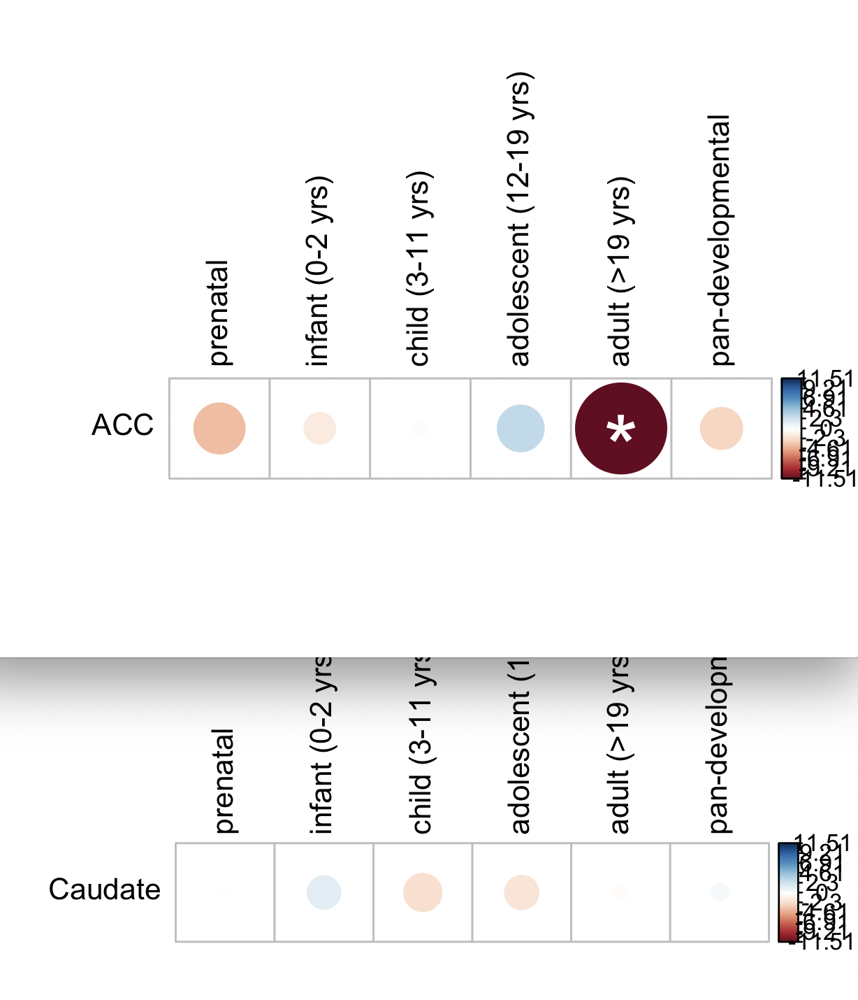

# 2021-05-04 09:14:58

Philip asked me to make similar figures for the RINe + BBB2 results. HEre they
are:

## Ellyptical developmental plot

```r
library(corrplot)
keep_me = c("dev1_c0.900_devSpec_regSpec", "dev2_c0.900_devSpec_regSpec",
            "dev3_c0.900_devSpec_regSpec", "dev4_c0.900_devSpec_regSpec",
            "dev5_c0.900_devSpec_regSpec", "overlap_c0.900_regSpec")
ncomps = 12
db = 'manySets_co0_900'
r = 'ACC'
dev_str = sprintf('%s_%s', tolower(r), db)
dir_name = sprintf('~/data/post_mortem/Project_WG30_DGE_%s_RINe_BBB2_%s_10K/',
                   r, dev_str)
file_name = sprintf('enrichment_results_WG30_DGE_%s_RINe_BBB2_%s_10K.txt',
                    r, dev_str)
res = read.table(sprintf('%s/%s', dir_name, file_name), header=1, sep='\t')
res = res[res$geneSet %in% keep_me, ]
res = res[order(res$geneSet), c('link', 'normalizedEnrichmentScore', 'pValue')]
dev = res
dev$Region = r

df = matrix(nrow = 1, ncol = 6, dimnames=list(r, res$link))
pvals = df
for (i in 1:nrow(df)) {
    for (j in 1:ncol(df)) {
        idx = dev$Region == rownames(df)[i] & dev$link == colnames(df)[j]
        if (dev[idx, 'pValue'] == 0) {
            dev[idx, 'pValue'] = 1e-5
        }
        df[i, j] = (sign(dev[idx, 'normalizedEnrichmentScore']) *
                    -log(dev[idx, 'pValue']))
        pvals[i, j] = dev[idx, 'pValue'] / ncomps
    }
}
colnames(df)[ncol(df)] = 'pan-developmental'
mylim = max(abs(df))
# just to get color for the overlap
corrplot(df, is.corr=F, cl.lim=c(-mylim, mylim), tl.col='black', p.mat=pvals,
         insig = "label_sig", pch.col = "white",
         sig.level=.01/ncomps)

r = 'Caudate'
dev_str = sprintf('%s_%s', tolower(r), db)
dir_name = sprintf('~/data/post_mortem/Project_WG30_DGE_%s_RINe_BBB2_%s_10K/',
                   r, dev_str)
file_name = sprintf('enrichment_results_WG30_DGE_%s_RINe_BBB2_%s_10K.txt',
                    r, dev_str)
res = read.table(sprintf('%s/%s', dir_name, file_name), header=1, sep='\t')
res = res[res$geneSet %in% keep_me, ]
res = res[order(res$geneSet), c('link', 'normalizedEnrichmentScore', 'pValue')]
res$Region = r
dev = res

df = matrix(nrow = 1, ncol = 6, dimnames=list(r, res$link))
pvals = df
for (i in 1:nrow(df)) {
    for (j in 1:ncol(df)) {
        idx = dev$Region == rownames(df)[i] & dev$link == colnames(df)[j]
        if (dev[idx, 'pValue'] == 0) {
            dev[idx, 'pValue'] = 1e-5
        }
        df[i, j] = (sign(dev[idx, 'normalizedEnrichmentScore']) *
                    -log(dev[idx, 'pValue']))
        pvals[i, j] = dev[idx, 'pValue'] / ncomps
    }
}
colnames(df)[ncol(df)] = 'pan-developmental'
quartz()
# just to get color for the overlap
# corrplot(df, is.corr=F, cl.lim=c(-mylim, mylim), tl.col='black', p.mat=pvals,
#          insig = "label_sig", pch.col = "white",
#          sig.level=.01/ncomps)
corrplot(df, is.corr=F, cl.lim=c(-mylim, mylim), tl.col='black')
```




