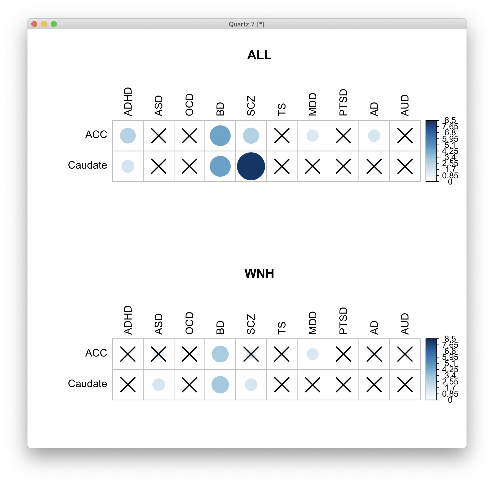

# 2021-05-05 19:36:44

Let's look into running MAGMA for other GWAS as well. I'll re-run the ADHD
analysis using the same code as note 202, but this time not in the temporary
folder:

```bash
# BW
conda activate base

cd ~/data/post_mortem
mkdir MAGMA

cd MAGMA
module load plink/1.9.0-beta4.4
echo "g1000_afr.bed g1000_afr.bim g1000_afr.fam" > merge_list.txt;
# they suggest using MAF when subsampling, so let's use it for concatenating too
# I got the g1000 files form their website: https://ctg.cncr.nl/software/magma
plink --bfile g1000_eur --merge-list merge_list.txt --maf 1e-5 \
    --flip-scan --make-bed --out g1000_BW
plink --bfile g1000_eur --exclude g1000_BW-merge.missnp \
    --make-bed --out d1
plink --bfile g1000_afr --exclude g1000_BW-merge.missnp \
    --make-bed --out d2
echo "d2.bed d2.bim d2.fam" > merge_list.txt;
plink --bfile d1 --merge-list merge_list.txt --maf 1e-5 \
    --make-bed --out g1000_BW

module load MAGMA/1.09a
magma --annotate --snp-loc g1000_BW.bim \
    --gene-loc /usr/local/apps/MAGMA/gene_location/NCBI37.3/NCBI37.3.gene.loc \
    --out annot_BW
magma --bfile g1000_BW --pval ~/pgc2017/adhd_jun2017 N=55374 \
    --gene-annot annot_BW.genes.annot --out genes_BW
for r in 'ACC' 'Caudate'; do
    magma --gene-results genes_BW.genes.raw \
        --gene-covar ../MAGMA_bigger_log10_dge_${r}.tab \
        --out MAGMA_bigger_log10_gc_dge_${r};
done;

magma --annotate --snp-loc g1000_eur.bim \
    --gene-loc /usr/local/apps/MAGMA/gene_location/NCBI37.3/NCBI37.3.gene.loc \
    --out annot_WNH
magma --bfile g1000_eur --pval ~/pgc2017/adhd_eur_jun2017 N=53293 \
    --gene-annot annot_WNH.genes.annot --out genes_WNH
for r in 'ACC' 'Caudate'; do
    magma --gene-results genes_WNH.genes.raw \
        --gene-covar ../MAGMA_bigger_WNH_log10_dge_${r}.tab \
        --out MAGMA_bigger_WNH_log10_gc_dge_${r};
done;
```

Then, we just run the other GWASes we find, keeping in mind that they use
different populations:

```bash
# AAD
# keep only rsid for each SNP
cut -d" " -f 2 pgc_alcdep.discovery.aug2018_release.txt | cut -d":" -f 1 > rsids.txt;
awk '{ print $1,$3,$4,$5,$6,$7,$8}' pgc_alcdep.discovery.aug2018_release.txt > tmp.txt;
paste rsids.txt tmp.txt > aad.txt;
magma --bfile g1000_BW --pval aad.txt N=52848 \
    --gene-annot annot_BW.genes.annot --out AAD_genes_BW
for r in 'ACC' 'Caudate'; do
    magma --gene-results AAD_genes_BW.genes.raw \
        --gene-covar ../MAGMA_bigger_log10_dge_${r}.tab \
        --out MAGMA_AAD_bigger_log10_gc_dge_${r};
done;

# AAD, WNH
cut -d" " -f 2 pgc_alcdep.eur_discovery.aug2018_release.txt | cut -d":" -f 1 > rsids.txt;
awk '{ print $1,$3,$4,$5,$6,$7,$8}' pgc_alcdep.eur_discovery.aug2018_release.txt > tmp.txt;
paste rsids.txt tmp.txt > aad_WNH.txt;
magma --bfile g1000_eur --pval aad_WNH.txt N=46568 \
    --gene-annot annot_WNH.genes.annot --out AAD_genes_WNH
for r in 'ACC' 'Caudate'; do
    magma --gene-results AAD_genes_WNH.genes.raw \
        --gene-covar ../MAGMA_bigger_log10_dge_${r}.tab \
        --out MAGMA_AAD_WNH_bigger_log10_gc_dge_${r};
done;

# ASD is eur only
magma --bfile g1000_eur --pval iPSYCH-PGC_ASD_Nov2017 N=46351 \
    --gene-annot annot_WNH.genes.annot --out ASD_genes
for r in 'ACC' 'Caudate'; do
    magma --gene-results ASD_genes.genes.raw \
        --gene-covar ../MAGMA_bigger_log10_dge_${r}.tab \
        --out MAGMA_ASD_bigger_log10_gc_dge_${r};
done;
for r in 'ACC' 'Caudate'; do
    magma --gene-results ASD_genes.genes.raw \
        --gene-covar ../MAGMA_bigger_log10_dge_${r}.tab \
        --out MAGMA_ASD_WNH_bigger_log10_gc_dge_${r};
done;
```

I'll give a break on these because they take a while to find the right GWAS.
Maybe I'll ask one of the IRTAs to do it. I'll work on the other figures for
now.

# 2021-05-13 11:10:01

Gauri sent me some new GWAS. Let's run them from scratch.

## Generic files

```bash
module load MAGMA/1.09a
# annotation
magma --annotate --seed 42 --snp-loc g1000_BW.bim \
    --gene-loc /usr/local/apps/MAGMA/gene_location/NCBI37.3/NCBI37.3.gene.loc \
    --out annot_BW
magma --annotate --seed 42 --snp-loc g1000_eur.bim \
    --gene-loc /usr/local/apps/MAGMA/gene_location/NCBI37.3/NCBI37.3.gene.loc \
    --out annot_WNH
```

## ADHD

```bash
magma --bfile g1000_BW --seed 42 --pval adhd_jul2017 N=55374 \
    --gene-annot annot_BW.genes.annot --out genes_ADHD_BW
for r in 'ACC' 'Caudate'; do
    magma --seed 42 --gene-results genes_ADHD_BW.genes.raw \
        --gene-covar ../MAGMA_bigger_log10_dge_${r}.tab \
        --out MAGMA_bigger_log10_gc_dge_ADHD_BW_${r};
done;

magma --bfile g1000_eur --seed 42 --pval adhd_eur_jun2017 N=53293 \
    --gene-annot annot_WNH.genes.annot --out genes_ADHD_WNH
for r in 'ACC' 'Caudate'; do
    magma --seed 42 --gene-results genes_ADHD_WNH.genes.raw \
        --gene-covar ../MAGMA_bigger_WNH_log10_dge_${r}.tab \
        --out MAGMA_bigger_log10_gc_dge_ADHD_WNH_${r};
done;
for f in `ls MAGMA_bigger_log10_gc_dge_ADHD*gsa.out`; do echo $f; cat $f; done
```

```
MAGMA_bigger_log10_gc_dge_ADHD_BW_ACC.gsa.out
# MEAN_SAMPLE_SIZE = 55374
# TOTAL_GENES = 14914
# TEST_DIRECTION = one-sided, positive (set), two-sided (covar)
# CONDITIONED_INTERNAL = gene size, gene density, inverse mac, log(gene size), log(gene density), log(inverse mac)
VARIABLE           TYPE  NGENES         BETA     BETA_STD           SE            P
signed_rank       COVAR   14914    -0.036989    -0.025153     0.012375    0.0028029
unsigned_rank     COVAR   14914    -0.027582    -0.013956     0.016483     0.094277
MAGMA_bigger_log10_gc_dge_ADHD_BW_Caudate.gsa.out
# MEAN_SAMPLE_SIZE = 55374
# TOTAL_GENES = 14896
# TEST_DIRECTION = one-sided, positive (set), two-sided (covar)
# CONDITIONED_INTERNAL = gene size, gene density, inverse mac, log(gene size), log(gene density), log(inverse mac)
VARIABLE           TYPE  NGENES         BETA     BETA_STD           SE            P
signed_rank       COVAR   14896     0.027055     0.019706     0.011722     0.021014
unsigned_rank     COVAR   14896     0.011238    0.0056296     0.016257      0.48941
MAGMA_bigger_log10_gc_dge_ADHD_WNH_ACC.gsa.out
# MEAN_SAMPLE_SIZE = 53293
# TOTAL_GENES = 15040
# TEST_DIRECTION = one-sided, positive (set), two-sided (covar)
# CONDITIONED_INTERNAL = gene size, gene density, inverse mac, log(gene size), log(gene density), log(inverse mac)
VARIABLE           TYPE  NGENES         BETA     BETA_STD           SE            P
signed_rank       COVAR   15040   -0.0062089   -0.0045761     0.010058      0.53703
unsigned_rank     COVAR   15040    0.0075737    0.0040138     0.013613      0.57796
MAGMA_bigger_log10_gc_dge_ADHD_WNH_Caudate.gsa.out
# MEAN_SAMPLE_SIZE = 53293
# TOTAL_GENES = 15112
# TEST_DIRECTION = one-sided, positive (set), two-sided (covar)
# CONDITIONED_INTERNAL = gene size, gene density, inverse mac, log(gene size), log(gene density), log(inverse mac)
VARIABLE           TYPE  NGENES         BETA     BETA_STD           SE            P
signed_rank       COVAR   15112     0.012642    0.0092281     0.010181      0.21438
unsigned_rank     COVAR   15112    0.0094588    0.0047426      0.01401       0.4996
```

## ASD (WNH only)

```bash
magma --bfile g1000_eur --seed 42 --pval iPSYCH-PGC_ASD_Nov2017 N=46351 \
    --gene-annot annot_WNH.genes.annot --out genes_ASD_WNH
for r in 'ACC' 'Caudate'; do
    magma --seed 42 --gene-results genes_ASD_WNH.genes.raw \
        --gene-covar ../MAGMA_bigger_WNH_log10_dge_${r}.tab \
        --out MAGMA_bigger_log10_gc_dge_ASD_WNH_${r};
    magma --seed 42 --gene-results genes_ASD_WNH.genes.raw \
        --gene-covar ../MAGMA_bigger_log10_dge_${r}.tab \
        --out MAGMA_bigger_log10_gc_dge_ASD_BW_${r};
done;
for f in `ls MAGMA_bigger_log10_gc_dge_ASD*gsa.out`; do echo $f; cat $f; done
```

```
MAGMA_bigger_log10_gc_dge_ASD_BW_ACC.gsa.out
# MEAN_SAMPLE_SIZE = 46351
# TOTAL_GENES = 15112
# TEST_DIRECTION = one-sided, positive (set), two-sided (covar)
# CONDITIONED_INTERNAL = gene size, gene density, inverse mac, log(gene size), log(gene density), log(inverse mac)
VARIABLE           TYPE  NGENES         BETA     BETA_STD           SE            P
signed_rank       COVAR   15112     0.011357     0.007738     0.010529      0.28077
unsigned_rank     COVAR   15112   -0.0098732   -0.0050088     0.014023      0.48141
MAGMA_bigger_log10_gc_dge_ASD_BW_Caudate.gsa.out
# MEAN_SAMPLE_SIZE = 46351# TOTAL_GENES = 15089
# TEST_DIRECTION = one-sided, positive (set), two-sided (covar)
# CONDITIONED_INTERNAL = gene size, gene density, inverse mac, log(gene size), log(gene density), log(inverse mac)
VARIABLE           TYPE  NGENES         BETA     BETA_STD           SE            P
signed_rank       COVAR   15089      0.01248    0.0090814    0.0099311       0.2089
unsigned_rank     COVAR   15089   -0.0081825   -0.0040959     0.013854      0.55477
MAGMA_bigger_log10_gc_dge_ASD_WNH_ACC.gsa.out
# MEAN_SAMPLE_SIZE = 46351
# TOTAL_GENES = 15206
# TEST_DIRECTION = one-sided, positive (set), two-sided (covar)
# CONDITIONED_INTERNAL = gene size, gene density, inverse mac, log(gene size), log(gene density), log(inverse mac)
VARIABLE           TYPE  NGENES         BETA     BETA_STD           SE            P
signed_rank       COVAR   15206     0.016567     0.012206    0.0097312     0.088692
unsigned_rank     COVAR   15206   -0.0079768   -0.0042277     0.013233      0.54666
MAGMA_bigger_log10_gc_dge_ASD_WNH_Caudate.gsa.out
# MEAN_SAMPLE_SIZE = 46351
# TOTAL_GENES = 15282
# TEST_DIRECTION = one-sided, positive (set), two-sided (covar)
# CONDITIONED_INTERNAL = gene size, gene density, inverse mac, log(gene size), log(gene density), log(inverse mac)
VARIABLE           TYPE  NGENES         BETA     BETA_STD           SE            P
signed_rank       COVAR   15282     0.022253     0.016214    0.0099774     0.025742
unsigned_rank     COVAR   15282   -0.0033155   -0.0016595     0.013709       0.8089
```

## Bipolar (all only)

```bash
# only grab columns we'll need
tail -n +73 pgc-bip2021-all.vcf.tsv > BP.txt;
# remove number sign manually, change SNP and P header

magma --bfile g1000_BW --seed 42 --pval BP.txt N=51710 \
    --gene-annot annot_BW.genes.annot --out genes_BD_BW
for r in 'ACC' 'Caudate'; do
    magma --seed 42 --gene-results genes_BD_BW.genes.raw \
        --gene-covar ../MAGMA_bigger_log10_dge_${r}.tab \
        --out MAGMA_bigger_log10_gc_dge_BD_BW_${r};
    magma --seed 42 --gene-results genes_BD_BW.genes.raw \
        --gene-covar ../MAGMA_bigger_WNH_log10_dge_${r}.tab \
        --out MAGMA_bigger_log10_gc_dge_BD_WNH_${r};
done;
for f in `ls MAGMA_bigger_log10_gc_dge_BD*gsa.out`; do echo $f; cat $f; done
```

```
MAGMA_bigger_log10_gc_dge_BD_BW_ACC.gsa.out
# MEAN_SAMPLE_SIZE = 51710
# TOTAL_GENES = 15105
# TEST_DIRECTION = one-sided, positive (set), two-sided (covar)
# CONDITIONED_INTERNAL = gene size, gene density, inverse mac, log(gene size), log(gene density), log(inverse mac)
VARIABLE           TYPE  NGENES         BETA     BETA_STD           SE            P
signed_rank       COVAR   15105    -0.055771    -0.037989     0.013393   3.1427e-05
unsigned_rank     COVAR   15105    -0.062996    -0.031953     0.017882   0.00042834
MAGMA_bigger_log10_gc_dge_BD_BW_Caudate.gsa.out
# MEAN_SAMPLE_SIZE = 51710
# TOTAL_GENES = 15080
# TEST_DIRECTION = one-sided, positive (set), two-sided (covar)
# CONDITIONED_INTERNAL = gene size, gene density, inverse mac, log(gene size), log(gene density), log(inverse mac)
VARIABLE           TYPE  NGENES         BETA     BETA_STD           SE            P
signed_rank       COVAR   15080     0.053509     0.038896      0.01278    2.843e-05
unsigned_rank     COVAR   15080     0.047473     0.023741     0.017691    0.0072953
MAGMA_bigger_log10_gc_dge_BD_WNH_ACC.gsa.out
# MEAN_SAMPLE_SIZE = 51710
# TOTAL_GENES = 15197
# TEST_DIRECTION = one-sided, positive (set), two-sided (covar)
# CONDITIONED_INTERNAL = gene size, gene density, inverse mac, log(gene size), log(gene density), log(inverse mac)
VARIABLE           TYPE  NGENES         BETA     BETA_STD           SE            P
signed_rank       COVAR   15197    -0.040326    -0.029686     0.012403    0.0011512
unsigned_rank     COVAR   15197    -0.032502    -0.017208     0.016888     0.054303
MAGMA_bigger_log10_gc_dge_BD_WNH_Caudate.gsa.out
# MEAN_SAMPLE_SIZE = 51710
# TOTAL_GENES = 15270
# TEST_DIRECTION = one-sided, positive (set), two-sided (covar)
# CONDITIONED_INTERNAL = gene size, gene density, inverse mac, log(gene size), log(gene density), log(inverse mac)
VARIABLE           TYPE  NGENES         BETA     BETA_STD           SE            P
signed_rank       COVAR   15270     0.043326     0.031563     0.012809   0.00072054
unsigned_rank     COVAR   15270     0.028356     0.014192     0.017392      0.10304
```

## SCZ

```bash
magma --bfile g1000_BW --seed 42 --pval PGC3_SCZ_wave3_public.clumped.v2.tsv N=161405 \
    --gene-annot annot_BW.genes.annot --out genes_SCZ_BW
for r in 'ACC' 'Caudate'; do
    magma --seed 42 --gene-results genes_SCZ_BW.genes.raw \
        --gene-covar ../MAGMA_bigger_log10_dge_${r}.tab \
        --out MAGMA_bigger_log10_gc_dge_SCZ_BW_${r};
done;

# only use the rs SNPs
head -n 1 daner_natgen_pgc_eur > SCZ.txt;
grep rs daner_natgen_pgc_eur >> SCZ.txt;
magma --bfile g1000_eur --seed 42 --pval SCZ.txt N=147521 \
    --gene-annot annot_WNH.genes.annot --out genes_SCZ_WNH
for r in 'ACC' 'Caudate'; do
    magma --seed 42 --gene-results genes_SCZ_WNH.genes.raw \
        --gene-covar ../MAGMA_bigger_WNH_log10_dge_${r}.tab \
        --out MAGMA_bigger_log10_gc_dge_SCZ_WNH_${r};
done;
for f in `ls MAGMA_bigger_log10_gc_dge_SCZ*gsa.out`; do echo $f; cat $f; done
```

```
MAGMA_bigger_log10_gc_dge_SCZ_BW_ACC.gsa.out
# MEAN_SAMPLE_SIZE = 161405
# TOTAL_GENES = 8035
# TEST_DIRECTION = one-sided, positive (set), two-sided (covar)
# CONDITIONED_INTERNAL = gene size, gene density, inverse mac, log(gene size), log(gene density), log(inverse mac)
VARIABLE           TYPE  NGENES         BETA     BETA_STD           SE            P
signed_rank       COVAR    8035    -0.063987    -0.044744     0.020652    0.0019532
unsigned_rank     COVAR    8035     -0.10229    -0.053539     0.027516    0.0002025
MAGMA_bigger_log10_gc_dge_SCZ_BW_Caudate.gsa.out
# MEAN_SAMPLE_SIZE = 161405
# TOTAL_GENES = 8027
# TEST_DIRECTION = one-sided, positive (set), two-sided (covar)
# CONDITIONED_INTERNAL = gene size, gene density, inverse mac, log(gene size), log(gene density), log(inverse mac)
VARIABLE           TYPE  NGENES         BETA     BETA_STD           SE            P
signed_rank       COVAR    8027      0.11614     0.084902     0.019866    5.227e-09
unsigned_rank     COVAR    8027     0.069261     0.034585     0.028857     0.016411
MAGMA_bigger_log10_gc_dge_SCZ_WNH_ACC.gsa.out
# TOTAL_GENES = 15305
# TEST_DIRECTION = one-sided, positive (set), two-sided (covar)
# CONDITIONED_INTERNAL = gene size, gene density, inverse mac, log(gene size), log(gene density), log(inverse mac)
VARIABLE           TYPE  NGENES         BETA     BETA_STD           SE            P
signed_rank       COVAR   15305    -0.019519    -0.014411      0.01135     0.085495
unsigned_rank     COVAR   15305    -0.016354   -0.0086837     0.015353      0.28678
MAGMA_bigger_log10_gc_dge_SCZ_WNH_Caudate.gsa.out
# TOTAL_GENES = 15386
# TEST_DIRECTION = one-sided, positive (set), two-sided (covar)
# CONDITIONED_INTERNAL = gene size, gene density, inverse mac, log(gene size), log(gene density), log(inverse mac)
VARIABLE           TYPE  NGENES         BETA     BETA_STD           SE            P
signed_rank       COVAR   15386     0.026129     0.019054     0.011758     0.026286
unsigned_rank     COVAR   15386     0.040709     0.020408     0.016129     0.011617
```

## MDD (all only)

```bash
# changed SNP in header
magma --bfile g1000_BW --seed 42 --pval PGC_UKB_depression_genome-wide.txt N=500199 \
    --gene-annot annot_BW.genes.annot --out genes_MDD_BW
for r in 'ACC' 'Caudate'; do
    magma --seed 42 --gene-results genes_MDD_BW.genes.raw \
        --gene-covar ../MAGMA_bigger_log10_dge_${r}.tab \
        --out MAGMA_bigger_log10_gc_dge_MDD_BW_${r};
    magma --seed 42 --gene-results genes_MDD_BW.genes.raw \
        --gene-covar ../MAGMA_bigger_WNH_log10_dge_${r}.tab \
        --out MAGMA_bigger_log10_gc_dge_MDD_WNH_${r};
done;
for f in `ls MAGMA_bigger_log10_gc_dge_MDD*gsa.out`; do echo $f; cat $f; done
```

```
MAGMA_bigger_log10_gc_dge_MDD_BW_ACC.gsa.out
# TOTAL_GENES = 14984
# TEST_DIRECTION = one-sided, positive (set), two-sided (covar)
# CONDITIONED_INTERNAL = gene size, gene density, inverse mac, log(gene size), log(gene density), log(inverse mac)
VARIABLE           TYPE  NGENES         BETA     BETA_STD           SE            P
signed_rank       COVAR   14984     -0.02704    -0.018421     0.012998     0.037514
unsigned_rank     COVAR   14984    -0.034208    -0.017352     0.017232     0.047148
MAGMA_bigger_log10_gc_dge_MDD_BW_Caudate.gsa.out
# TOTAL_GENES = 14967
# TEST_DIRECTION = one-sided, positive (set), two-sided (covar)
# CONDITIONED_INTERNAL = gene size, gene density, inverse mac, log(gene size), log(gene density), log(inverse mac)
VARIABLE           TYPE  NGENES         BETA     BETA_STD           SE            P
signed_rank       COVAR   14967    0.0045266     0.003295     0.012514      0.71757
unsigned_rank     COVAR   14967     0.015415     0.007716     0.017214      0.37052
MAGMA_bigger_log10_gc_dge_MDD_WNH_ACC.gsa.out
# TOTAL_GENES = 15079
# TEST_DIRECTION = one-sided, positive (set), two-sided (covar)
# CONDITIONED_INTERNAL = gene size, gene density, inverse mac, log(gene size), log(gene density), log(inverse mac)
VARIABLE           TYPE  NGENES         BETA     BETA_STD           SE            P
signed_rank       COVAR   15079    -0.025153    -0.018528     0.012088     0.037472
unsigned_rank     COVAR   15079   -0.0057851   -0.0030629     0.016342      0.72334
MAGMA_bigger_log10_gc_dge_MDD_WNH_Caudate.gsa.out
# TOTAL_GENES = 15157
# TEST_DIRECTION = one-sided, positive (set), two-sided (covar)
# CONDITIONED_INTERNAL = gene size, gene density, inverse mac, log(gene size), log(gene density), log(inverse mac)
VARIABLE           TYPE  NGENES         BETA     BETA_STD           SE            P
signed_rank       COVAR   15157   -0.0039601   -0.0028885     0.012527      0.75192
unsigned_rank     COVAR   15157    0.0030459    0.0015255      0.01689      0.85689
```

## OCD (all only)

```bash
magma --bfile g1000_BW --seed 42 --pval PGC_OCD_Aug2017/ocd_aug2017 N=9725 \
    --gene-annot annot_BW.genes.annot --out genes_OCD_BW
for r in 'ACC' 'Caudate'; do
    magma --seed 42 --gene-results genes_OCD_BW.genes.raw \
        --gene-covar ../MAGMA_bigger_log10_dge_${r}.tab \
        --out MAGMA_bigger_log10_gc_dge_OCD_BW_${r};
    magma --seed 42 --gene-results genes_OCD_BW.genes.raw \
        --gene-covar ../MAGMA_bigger_WNH_log10_dge_${r}.tab \
        --out MAGMA_bigger_log10_gc_dge_OCD_WNH_${r};
done;
for f in `ls MAGMA_bigger_log10_gc_dge_OCD*gsa.out`; do echo $f; cat $f; done
```

```
MAGMA_bigger_log10_gc_dge_OCD_BW_ACC.gsa.out
# MEAN_SAMPLE_SIZE = 9725
# TOTAL_GENES = 15054
# TEST_DIRECTION = one-sided, positive (set), two-sided (covar)
# CONDITIONED_INTERNAL = gene size, gene density, inverse mac, log(gene size), log(gene density), log(inverse mac)
VARIABLE           TYPE  NGENES         BETA     BETA_STD           SE            P
signed_rank       COVAR   15054     0.010128    0.0068951     0.011464      0.37701
unsigned_rank     COVAR   15054   -0.0044455    -0.002253     0.015247      0.77063
MAGMA_bigger_log10_gc_dge_OCD_BW_Caudate.gsa.out
# MEAN_SAMPLE_SIZE = 9725
# TOTAL_GENES = 15029
# TEST_DIRECTION = one-sided, positive (set), two-sided (covar)
# CONDITIONED_INTERNAL = gene size, gene density, inverse mac, log(gene size), log(gene density), log(inverse mac)
VARIABLE           TYPE  NGENES         BETA     BETA_STD           SE            P
signed_rank       COVAR   15029    0.0060786    0.0044205     0.010988      0.58014
unsigned_rank     COVAR   15029    -0.024651    -0.012332     0.015165      0.10408
MAGMA_bigger_log10_gc_dge_OCD_WNH_ACC.gsa.out
# MEAN_SAMPLE_SIZE = 9725
# TOTAL_GENES = 15147
# TEST_DIRECTION = one-sided, positive (set), two-sided (covar)
# CONDITIONED_INTERNAL = gene size, gene density, inverse mac, log(gene size), log(gene density), log(inverse mac)
VARIABLE           TYPE  NGENES         BETA     BETA_STD           SE            P
signed_rank       COVAR   15147     0.010164    0.0074813     0.010623       0.3387
unsigned_rank     COVAR   15147      0.00289    0.0015294     0.014409      0.84104
MAGMA_bigger_log10_gc_dge_OCD_WNH_Caudate.gsa.out
# MEAN_SAMPLE_SIZE = 9725
# TOTAL_GENES = 15219
# TEST_DIRECTION = one-sided, positive (set), two-sided (covar)
# CONDITIONED_INTERNAL = gene size, gene density, inverse mac, log(gene size), log(gene density), log(inverse mac)
VARIABLE           TYPE  NGENES         BETA     BETA_STD           SE            P
signed_rank       COVAR   15219  -0.00040115  -0.00029245     0.010994      0.97089
unsigned_rank     COVAR   15219    -0.021045     -0.01054     0.014857      0.15666
```

## PTSD

```bash
magma --bfile g1000_BW --seed 42 --pval pts_all_freeze2_overall.results N=206655 \
    --gene-annot annot_BW.genes.annot --out genes_PTSD_BW
for r in 'ACC' 'Caudate'; do
    magma --seed 42 --gene-results genes_PTSD_BW.genes.raw \
        --gene-covar ../MAGMA_bigger_log10_dge_${r}.tab \
        --out MAGMA_bigger_log10_gc_dge_PTSD_BW_${r};
done;

magma --bfile g1000_eur --seed 42 --pval pts_eur_freeze2_overall.results N=174659 \
    --gene-annot annot_WNH.genes.annot --out genes_PTSD_WNH
for r in 'ACC' 'Caudate'; do
    magma --seed 42 --gene-results genes_PTSD_WNH.genes.raw \
        --gene-covar ../MAGMA_bigger_WNH_log10_dge_${r}.tab \
        --out MAGMA_bigger_log10_gc_dge_PTSD_WNH_${r};
done;
for f in `ls MAGMA_bigger_log10_gc_dge_PTSD*gsa.out`; do echo $f; cat $f; done
```

```
MAGMA_bigger_log10_gc_dge_PTSD_BW_ACC.gsa.out
# TOTAL_GENES = 15155
# TEST_DIRECTION = one-sided, positive (set), two-sided (covar)
# CONDITIONED_INTERNAL = gene size, gene density, inverse mac, log(gene size), log(gene density), log(inverse mac)
VARIABLE           TYPE  NGENES         BETA     BETA_STD           SE            P
signed_rank       COVAR   15155   -0.0011738   -0.0007998     0.010671      0.91241
unsigned_rank     COVAR   15155    -0.002017    -0.001023     0.014174      0.88684
MAGMA_bigger_log10_gc_dge_PTSD_BW_Caudate.gsa.out
# TOTAL_GENES = 15131
# TEST_DIRECTION = one-sided, positive (set), two-sided (covar)
# CONDITIONED_INTERNAL = gene size, gene density, inverse mac, log(gene size), log(gene density), log(inverse mac)
VARIABLE           TYPE  NGENES         BETA     BETA_STD           SE            P
signed_rank       COVAR   15131    0.0016688    0.0012143     0.010106      0.86885
unsigned_rank     COVAR   15131    -0.031208    -0.015624     0.014025     0.026083
MAGMA_bigger_log10_gc_dge_PTSD_WNH_ACC.gsa.out
# TOTAL_GENES = 15261
# TEST_DIRECTION = one-sided, positive (set), two-sided (covar)
# CONDITIONED_INTERNAL = gene size, gene density, inverse mac, log(gene size), log(gene density), log(inverse mac)
VARIABLE           TYPE  NGENES         BETA     BETA_STD           SE            P
signed_rank       COVAR   15261    0.0049892    0.0036805    0.0091988      0.58756
unsigned_rank     COVAR   15261    -0.010803    -0.005733     0.012503      0.38755
MAGMA_bigger_log10_gc_dge_PTSD_WNH_Caudate.gsa.out
# TOTAL_GENES = 15338
# TEST_DIRECTION = one-sided, positive (set), two-sided (covar)
# CONDITIONED_INTERNAL = gene size, gene density, inverse mac, log(gene size), log(gene density), log(inverse mac)
VARIABLE           TYPE  NGENES         BETA     BETA_STD           SE            P
signed_rank       COVAR   15338   -0.0039387   -0.0028722    0.0094507      0.67686
unsigned_rank     COVAR   15338    -0.020036    -0.010041     0.013005      0.12343
```

## Tourette (WNH only)

```bash
magma --bfile g1000_eur --seed 42 --pval TS_Oct2018 N=14307 \
    --gene-annot annot_WNH.genes.annot --out genes_TS_WNH
for r in 'ACC' 'Caudate'; do
    magma --seed 42 --gene-results genes_TS_WNH.genes.raw \
        --gene-covar ../MAGMA_bigger_WNH_log10_dge_${r}.tab \
        --out MAGMA_bigger_log10_gc_dge_TS_WNH_${r};
    magma --seed 42 --gene-results genes_TS_WNH.genes.raw \
        --gene-covar ../MAGMA_bigger_log10_dge_${r}.tab \
        --out MAGMA_bigger_log10_gc_dge_TS_BW_${r};
done;
for f in `ls MAGMA_bigger_log10_gc_dge_TS*gsa.out`; do echo $f; cat $f; done
```

```
MAGMA_bigger_log10_gc_dge_TS_BW_ACC.gsa.out
# MEAN_SAMPLE_SIZE = 14307
# TOTAL_GENES = 15092
# TEST_DIRECTION = one-sided, positive (set), two-sided (covar)
# CONDITIONED_INTERNAL = gene size, gene density, inverse mac, log(gene size), log(gene density), log(inverse mac)
VARIABLE           TYPE  NGENES         BETA     BETA_STD           SE            P
signed_rank       COVAR   15092   -0.0056409   -0.0038415     0.010315      0.58446
unsigned_rank     COVAR   15092    -0.010911   -0.0055331     0.013786      0.42872
MAGMA_bigger_log10_gc_dge_TS_BW_Caudate.gsa.out
# MEAN_SAMPLE_SIZE = 14307
# TOTAL_GENES = 15075
# TEST_DIRECTION = one-sided, positive (set), two-sided (covar)
# CONDITIONED_INTERNAL = gene size, gene density, inverse mac, log(gene size), log(gene density), log(inverse mac)
VARIABLE           TYPE  NGENES         BETA     BETA_STD           SE            P
signed_rank       COVAR   15075    0.0094596    0.0068807    0.0097579      0.33235
unsigned_rank     COVAR   15075      0.00606    0.0030326     0.013575       0.6553
MAGMA_bigger_log10_gc_dge_TS_WNH_ACC.gsa.out
# MEAN_SAMPLE_SIZE = 14307
# TOTAL_GENES = 15185
# TEST_DIRECTION = one-sided, positive (set), two-sided (covar)
# CONDITIONED_INTERNAL = gene size, gene density, inverse mac, log(gene size), log(gene density), log(inverse mac)
VARIABLE           TYPE  NGENES         BETA     BETA_STD           SE            P
signed_rank       COVAR   15185   -0.0095257    -0.007013    0.0095568       0.3189
unsigned_rank     COVAR   15185    0.0062125    0.0032893     0.012972        0.632
MAGMA_bigger_log10_gc_dge_TS_WNH_Caudate.gsa.out
# MEAN_SAMPLE_SIZE = 14307
# TOTAL_GENES = 15265
# TEST_DIRECTION = one-sided, positive (set), two-sided (covar)
# CONDITIONED_INTERNAL = gene size, gene density, inverse mac, log(gene size), log(gene density), log(inverse mac)
VARIABLE           TYPE  NGENES         BETA     BETA_STD           SE            P
signed_rank       COVAR   15265    0.0073593    0.0053651    0.0098252      0.45386
unsigned_rank     COVAR   15265    -0.012695   -0.0063576     0.013432      0.34461
```

## Alcohol Dependence

```bash
# keep only rsid for each SNP
cut -d" " -f 2 pgc_alcdep.discovery.aug2018_release.txt | cut -d":" -f 1 > rsids.txt;
awk '{ print $1,$3,$4,$5,$6,$7,$8}' pgc_alcdep.discovery.aug2018_release.txt > tmp.txt;
paste rsids.txt tmp.txt > aad.txt;

magma --bfile g1000_BW --seed 42 --pval aad.txt N=52848 \
    --gene-annot annot_BW.genes.annot --out genes_AD_BW
for r in 'ACC' 'Caudate'; do
    magma --seed 42 --gene-results genes_AD_BW.genes.raw \
        --gene-covar ../MAGMA_bigger_log10_dge_${r}.tab \
        --out MAGMA_bigger_log10_gc_dge_AD_BW_${r};
done;

cut -d" " -f 2 pgc_alcdep.eur_discovery.aug2018_release.txt | cut -d":" -f 1 > rsids.txt;
awk '{ print $1,$3,$4,$5,$6,$7,$8}' pgc_alcdep.eur_discovery.aug2018_release.txt > tmp.txt;
paste rsids.txt tmp.txt > aad_WNH.txt;

magma --bfile g1000_eur --seed 42 --pval aad_WNH.txt N=46568 \
    --gene-annot annot_WNH.genes.annot --out genes_AD_WNH
for r in 'ACC' 'Caudate'; do
    magma --seed 42 --gene-results genes_AD_WNH.genes.raw \
        --gene-covar ../MAGMA_bigger_WNH_log10_dge_${r}.tab \
        --out MAGMA_bigger_log10_gc_dge_AD_WNH_${r};
done;
for f in `ls MAGMA_bigger_log10_gc_dge_AD_*gsa.out`; do echo $f; cat $f; done
```

```
MAGMA_bigger_log10_gc_dge_AD_BW_ACC.gsa.out
# MEAN_SAMPLE_SIZE = 52848
# TOTAL_GENES = 15114
# TEST_DIRECTION = one-sided, positive (set), two-sided (covar)
# CONDITIONED_INTERNAL = gene size, gene density, inverse mac, log(gene size), log(gene density), log(inverse mac)
VARIABLE           TYPE  NGENES         BETA     BETA_STD           SE            P
signed_rank       COVAR   15114    -0.023059     -0.01569     0.010539     0.028697
unsigned_rank     COVAR   15114     0.018603    0.0094221     0.014084      0.18657
MAGMA_bigger_log10_gc_dge_AD_BW_Caudate.gsa.out
# MEAN_SAMPLE_SIZE = 52848
# TOTAL_GENES = 15089
# TEST_DIRECTION = one-sided, positive (set), two-sided (covar)
# CONDITIONED_INTERNAL = gene size, gene density, inverse mac, log(gene size), log(gene density), log(inverse mac)
VARIABLE           TYPE  NGENES         BETA     BETA_STD           SE            P
signed_rank       COVAR   15089      0.01364    0.0099286     0.010048      0.17466
unsigned_rank     COVAR   15089    -0.012526   -0.0062717     0.013905      0.36769
MAGMA_bigger_log10_gc_dge_AD_WNH_ACC.gsa.out
# MEAN_SAMPLE_SIZE = 46568
# TOTAL_GENES = 15199
# TEST_DIRECTION = one-sided, positive (set), two-sided (covar)
# CONDITIONED_INTERNAL = gene size, gene density, inverse mac, log(gene size), log(gene density), log(inverse mac)
VARIABLE           TYPE  NGENES         BETA     BETA_STD           SE            P
signed_rank       COVAR   15199    -0.012424     -0.00915    0.0090768      0.17111
unsigned_rank     COVAR   15199     0.013649    0.0072311     0.012273       0.2661
MAGMA_bigger_log10_gc_dge_AD_WNH_Caudate.gsa.out
# MEAN_SAMPLE_SIZE = 46568
# TOTAL_GENES = 15274
# TEST_DIRECTION = one-sided, positive (set), two-sided (covar)
# CONDITIONED_INTERNAL = gene size, gene density, inverse mac, log(gene size), log(gene density), log(inverse mac)
VARIABLE           TYPE  NGENES         BETA     BETA_STD           SE            P
signed_rank       COVAR   15274    0.0069296    0.0050529    0.0092786      0.45517
unsigned_rank     COVAR   15274    -0.018376   -0.0092042      0.01278      0.15048
```

## Alcohol Use Disorder

```bash
# grab only rsids
head -n 1 AUDIT_UKB_2018_AJP.txt > AUD.txt;
grep rs AUDIT_UKB_2018_AJP.txt >> AUD.txt
# manually change SNP ahd t_p header (AUDIT total score)
magma --bfile g1000_eur --seed 42 --pval AUD.txt N=121604 \
    --gene-annot annot_WNH.genes.annot --out genes_AUD_WNH
for r in 'ACC' 'Caudate'; do
    magma --seed 42 --gene-results genes_AUD_WNH.genes.raw \
        --gene-covar ../MAGMA_bigger_WNH_log10_dge_${r}.tab \
        --out MAGMA_bigger_log10_gc_dge_AUD_WNH_${r};
    magma --seed 42 --gene-results genes_AUD_WNH.genes.raw \
        --gene-covar ../MAGMA_bigger_log10_dge_${r}.tab \
        --out MAGMA_bigger_log10_gc_dge_AUD_BW_${r};
done;
for f in `ls MAGMA_bigger_log10_gc_dge_AUD*gsa.out`; do echo $f; cat $f; done
```

```
MAGMA_bigger_log10_gc_dge_AUD_BW_ACC.gsa.out
# MEAN_SAMPLE_SIZE = 121604
# TOTAL_GENES = 15232
# TEST_DIRECTION = one-sided, positive (set), two-sided (covar)
# CONDITIONED_INTERNAL = gene size, gene density, inverse mac, log(gene size), log(gene density), log(inverse mac)
VARIABLE           TYPE  NGENES         BETA     BETA_STD           SE            P
signed_rank       COVAR   15232   -0.0075976   -0.0051858      0.01084      0.48337
unsigned_rank     COVAR   15232    -0.022757    -0.011562      0.01454      0.11759
MAGMA_bigger_log10_gc_dge_AUD_BW_Caudate.gsa.out
# MEAN_SAMPLE_SIZE = 121604
# TOTAL_GENES = 15211
# TEST_DIRECTION = one-sided, positive (set), two-sided (covar)
# CONDITIONED_INTERNAL = gene size, gene density, inverse mac, log(gene size), log(gene density), log(inverse mac)
VARIABLE           TYPE  NGENES         BETA     BETA_STD           SE            P
signed_rank       COVAR   15211     0.010862    0.0079011     0.010285      0.29097
unsigned_rank     COVAR   15211   -0.0036524   -0.0018281     0.014267      0.79795
MAGMA_bigger_log10_gc_dge_AUD_WNH_ACC.gsa.out
# MEAN_SAMPLE_SIZE = 121604
# TOTAL_GENES = 15327
# TEST_DIRECTION = one-sided, positive (set), two-sided (covar)
# CONDITIONED_INTERNAL = gene size, gene density, inverse mac, log(gene size), log(gene density), log(inverse mac)
VARIABLE           TYPE  NGENES         BETA     BETA_STD           SE            P
signed_rank       COVAR   15327   -0.0029765      -0.0022    0.0098487      0.76248
unsigned_rank     COVAR   15327    -0.012935   -0.0068778     0.013464      0.33673
MAGMA_bigger_log10_gc_dge_AUD_WNH_Caudate.gsa.out
# MEAN_SAMPLE_SIZE = 121604
# TOTAL_GENES = 15411
# TEST_DIRECTION = one-sided, positive (set), two-sided (covar)
# CONDITIONED_INTERNAL = gene size, gene density, inverse mac, log(gene size), log(gene density), log(inverse mac)
VARIABLE           TYPE  NGENES         BETA     BETA_STD           SE            P
signed_rank       COVAR   15411     0.011632    0.0084832     0.010357      0.26142
unsigned_rank     COVAR   15411    0.0063176    0.0031666     0.014095        0.654
```

## Collecting results

Let's collect all results in R and save them in a matrix for plotting:

```r
mydir = '~/data/post_mortem/MAGMA/'
dis = c('ADHD', 'ASD', 'OCD', 'BD', 'SCZ', 'TS', 'MDD', 'PTSD', 'AD', 'AUD')
res = data.frame()
for (d in dis) {
    for (p in c('BW', 'WNH')) {
        for (r in c('ACC', 'Caudate')) {
            fname = sprintf('%s/MAGMA_bigger_log10_gc_dge_%s_%s_%s.gsa.out',
                            mydir, d, p, r)
            a = read.table(fname, header=1)
            b = a[1, 3:7]
            b$DISORDER = d
            b$POP = p
            b$REGION = r
            res = rbind(res, b)
        }
    }
}
saveRDS(res, file='~/data/post_mortem/MAGMA/all_res.rds')
```

Not much to be done about SCZ BW...  it only has half of the genes, but the file
itself is quite short.

Let's make some plots then:

```r
library(corrplot)
res = readRDS('~/data/post_mortem/all_res.rds')
res = res[res$POP == 'BW', c('REGION', 'DISORDER', 'P')]
plot_mat = matrix(nrow=2, ncol=length(unique(res$DISORDER)))
colnames(plot_mat) = unique(res$DISORDER)
rownames(plot_mat) = unique(res$REGION)
pvals = plot_mat
for (i in 1:nrow(res)) {
    plot_mat[res[i, 'REGION'], res[i, 'DISORDER']] = -log10(res[i, 'P'])
    pvals[res[i, 'REGION'], res[i, 'DISORDER']] = res[i, 'P']
}
quartz()
par(mfrow=c(2,1))
corrplot(plot_mat, is.corr=F, tl.col='black', p.mat = pvals, sig.level = .05,
         cl.lim=c(0,8.5))
title('ALL')

res = readRDS('~/data/post_mortem/all_res.rds')
res = res[res$POP == 'WNH', c('REGION', 'DISORDER', 'P')]
plot_mat = matrix(nrow=2, ncol=length(unique(res$DISORDER)))
colnames(plot_mat) = unique(res$DISORDER)
rownames(plot_mat) = unique(res$REGION)
pvals = plot_mat
for (i in 1:nrow(res)) {
    plot_mat[res[i, 'REGION'], res[i, 'DISORDER']] = -log10(res[i, 'P'])
    pvals[res[i, 'REGION'], res[i, 'DISORDER']] = res[i, 'P']
}
corrplot(plot_mat, is.corr=F, tl.col='black', p.mat = pvals, sig.level = .05,
         cl.lim=c(0,8.5))
title('WNH')
```

