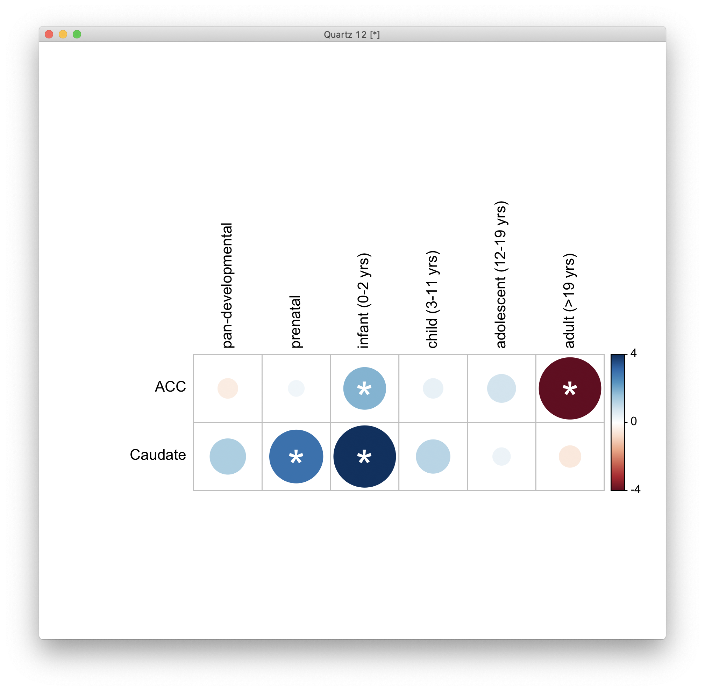
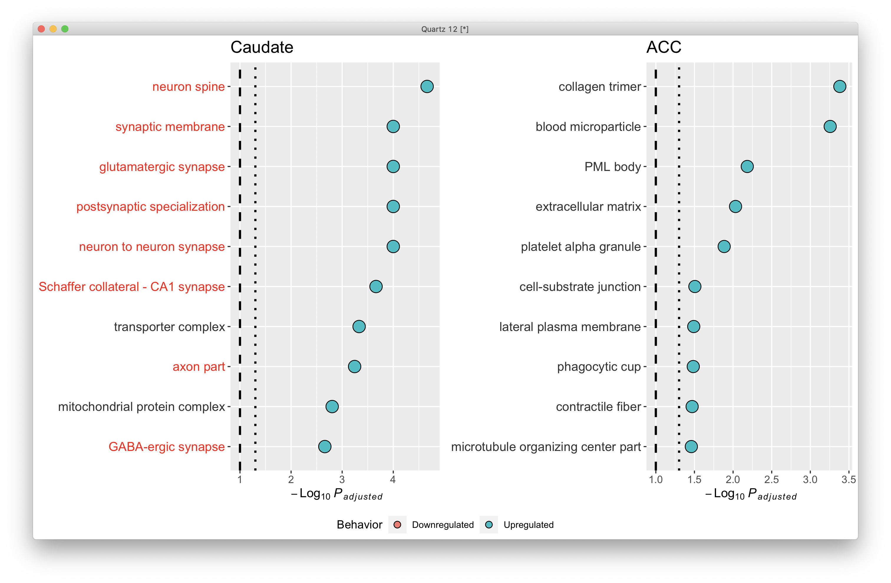
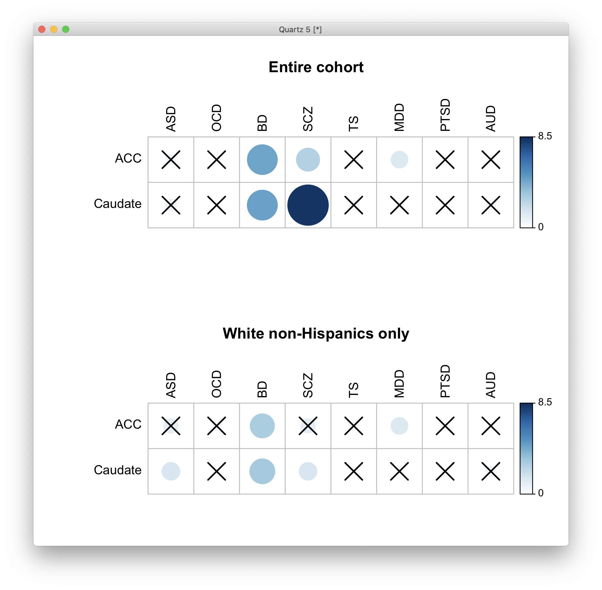
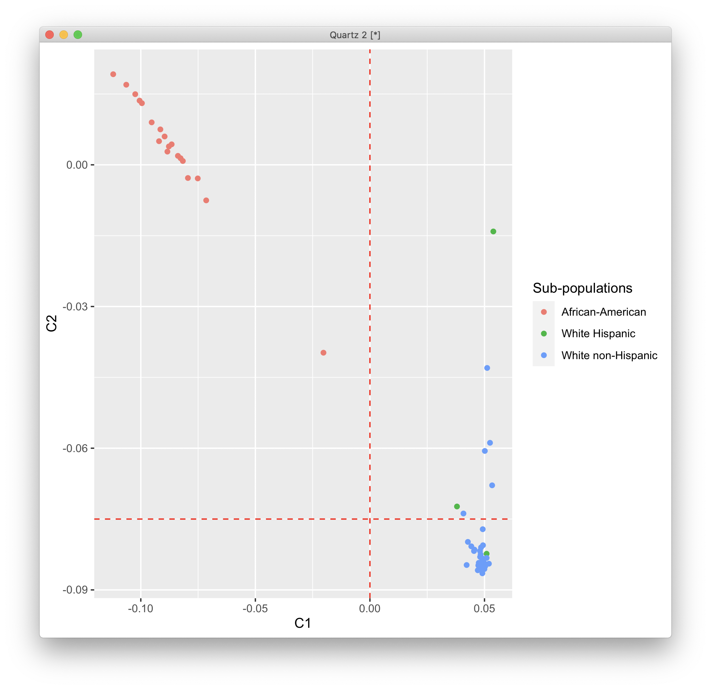
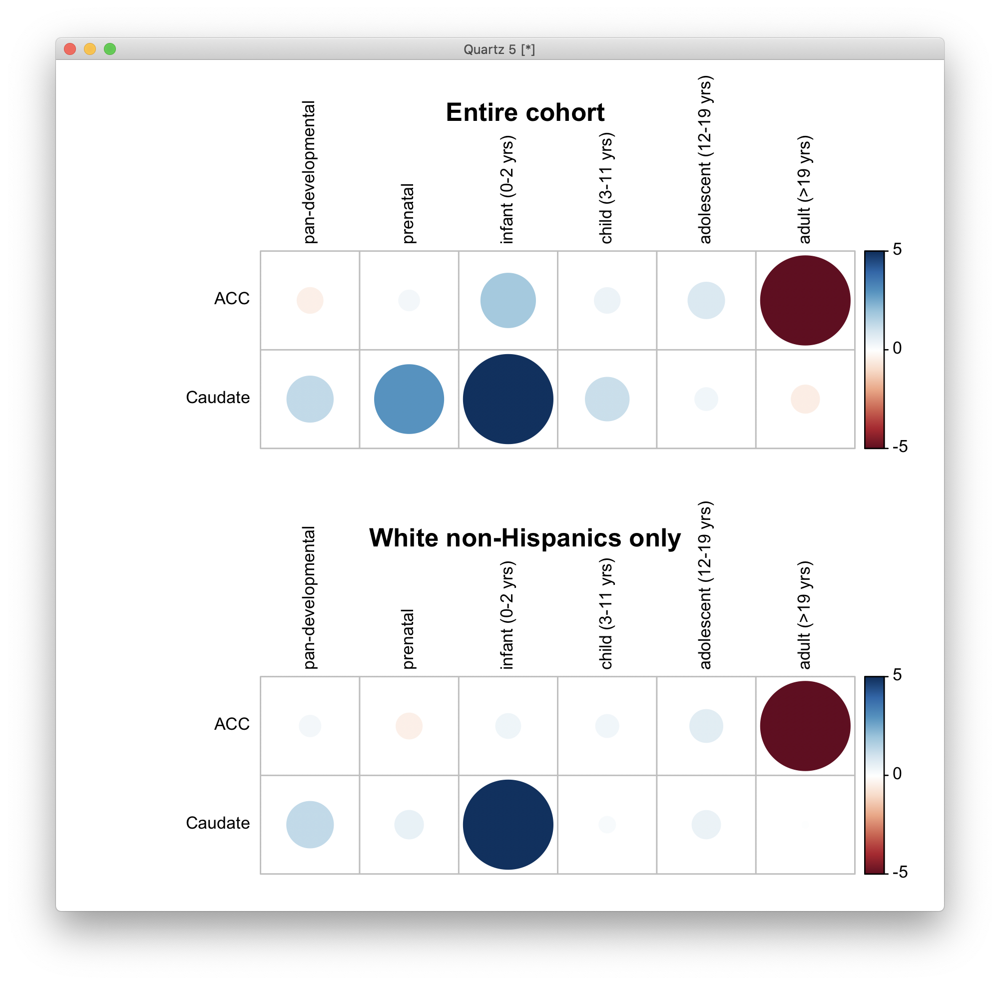
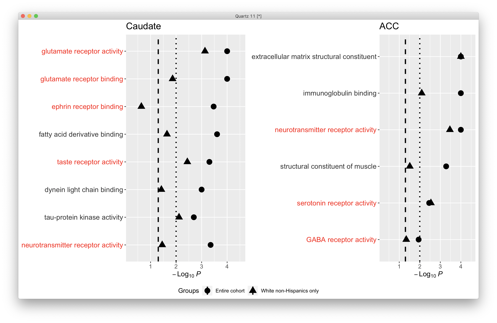
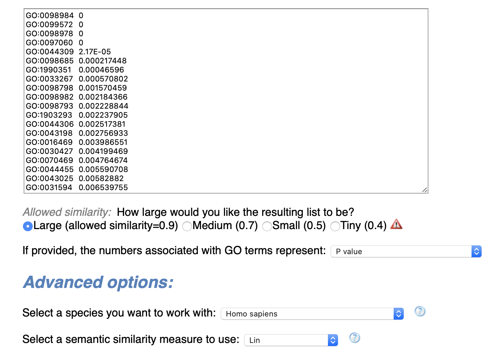
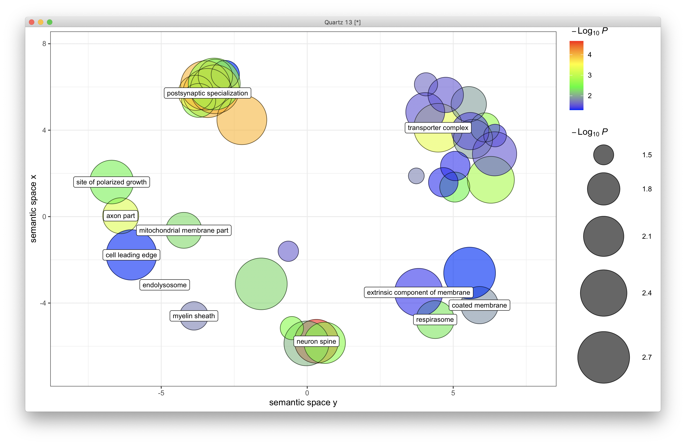
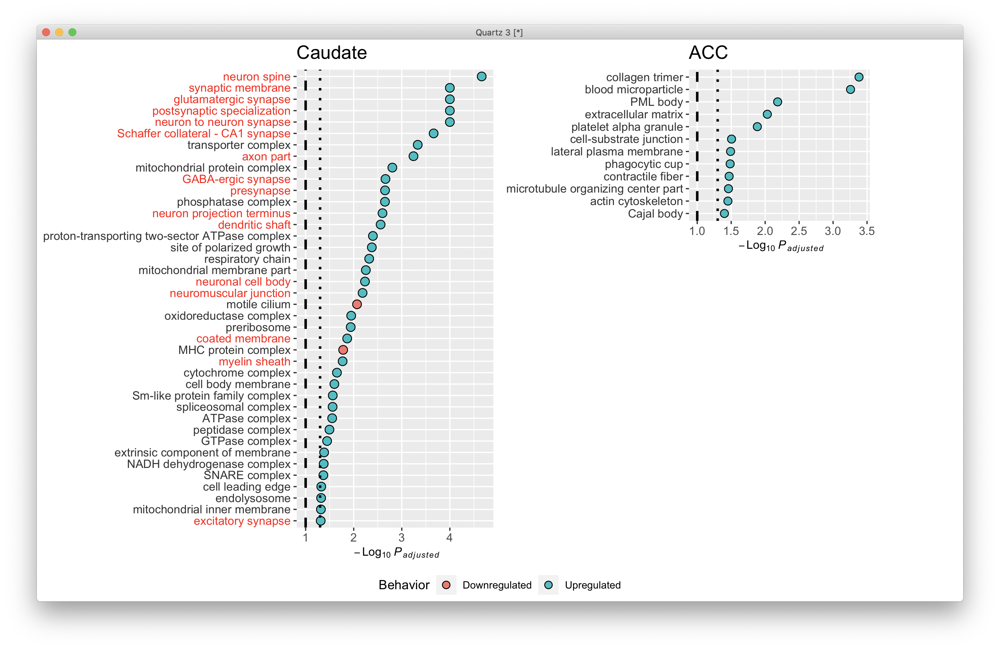
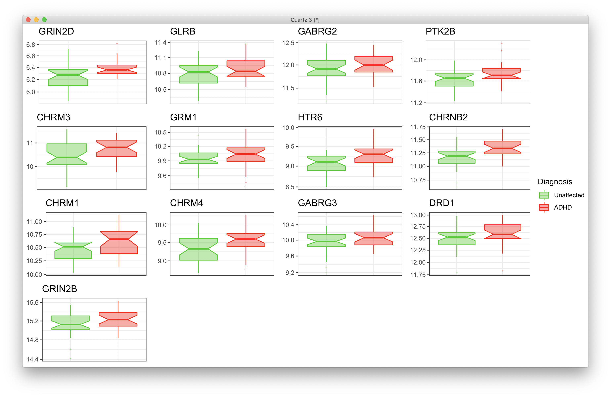

# 2021-05-24 16:10:56

Let's redo some figures after Philip's comments.

## Volcano plots

```r
quartz()

library(ggpubr)
library(EnhancedVolcano)
FCcutoff = 1.0
pCutoff = .05

myplots = list()
res = read.csv('~/data/post_mortem/DGE_ACC_bigger_annot_04292021.csv')
res = res[order(res$pvalue), ]
sigPs = sum(res$padj.FDR <= pCutoff, na.rm=T)
ps = -log10(res$pvalue)
nomPcutoff = ps[sigPs + 1] + (ps[sigPs] - ps[sigPs + 1]) / 2
nomPcutoff = 10 ** (-nomPcutoff)
ymax = ceiling(max(-log10(res$pvalue), na.rm=T))
xmin = floor(min(res$log2FoldChange, na.rm=T))
xmax = ceiling(max(res$log2FoldChange, na.rm=T))
p = EnhancedVolcano(data.frame(res),
                    x = 'log2FoldChange', lab=NA,
                    y = 'pvalue', xlab = bquote(~Log[2]~ 'fold change'),
                    ylab = bquote(~-Log[10]~italic(P)),
                    title = 'ACC',
                    ylim = c(0, ymax),
                    xlim = c(xmin, xmax),
                    pCutoff = nomPcutoff, FCcutoff = FCcutoff, pointSize = 1.0,
                    labSize = 2.0, subtitle=NULL,
                    axisLabSize = 12,
                    caption = NULL, legendPosition = 'none',
                    col = c("grey30", "forestgreen", "red2", "red2"))
myplots[[1]] = p

res = read.csv('~/data/post_mortem/DGE_Caudate_bigger_annot_04292021.csv')
sigPs = sum(res$padj.FDR <= pCutoff, na.rm=T)
ps = -log10(res$pvalue)
nomPcutoff = ps[sigPs + 1] + (ps[sigPs] - ps[sigPs + 1]) / 2
nomPcutoff = 10 ** (-nomPcutoff)
p = EnhancedVolcano(data.frame(res),
                    x = 'log2FoldChange', lab=NA,
                    y = 'pvalue', xlab = bquote(~Log[2]~ 'fold change'),
                    ylab = bquote(~-Log[10]~italic(P)),
                    title = 'Caudate',
                    ylim = c(0, ymax),
                    xlim = c(xmin, xmax),
                    pCutoff = nomPcutoff, FCcutoff = FCcutoff, pointSize = 1.0,
                    labSize = 2.0, subtitle=NULL,
                    axisLabSize = 12,
                    caption = NULL, legendPosition = 'none',
                    col = c("grey30", "forestgreen", "red2", "red2"))
myplots[[2]] = p
ggarrange(plotlist=myplots)
```


## Expression plots

```r
r = 'Caudate'
load('~/data/post_mortem/pca_DGE_bigger_04292021.RData')

res_str = sprintf('dds = dds.%s', r)
eval(parse(text=res_str))
res = results(dds, name = "Diagnosis_Case_vs_Control", alpha=.05)
res = res[order(res$pvalue), ]
gene_list = rownames(res)[which(res$padj <= .05)]
gene_list = rownames(res)[1:14]
# just to get the same size

vsd <- vst(dds, blind=FALSE)
norm.cts <- assay(vsd)

covars = model.matrix(~ RINe + C1 + BBB2 + comorbid_group + SUB2,
                      data=colData(dds))
dsn = model.matrix(~ Diagnosis, data=colData(dds))
mat <- limma::removeBatchEffect(norm.cts, covariates=covars, design=dsn)

gnames = data.frame(full=rownames(counts(dds)),
                    nov=substr(rownames(counts(dds)), 1, 15))
mart = readRDS('~/data/rnaseq_derek/mart_rnaseq.rds')
gnames = merge(gnames, mart, by.x='nov', by.y='ensembl_gene_id')
keep_me = gnames$full %in% gene_list
gene_ids = gnames[keep_me, ]

resid_expr = reshape2::melt(mat[gene_ids$full,])
colnames(resid_expr) = c('gene', 'submitted_name', 'normCount')
junk = colData(vsd)[, c('Diagnosis', 'submitted_name')]
resid_expr = merge(resid_expr, junk, by='submitted_name')
resid_expr = merge(resid_expr, gene_ids, by.x='gene', by.y='full')

# plotting each of the significant genes
library(ggpubr)
library(ggbeeswarm)
myplots = list()
clrs = c("green3", "red")
for (g in 1:nrow(gene_ids)) {
    hgnc = gene_ids[g, 'hgnc_symbol']
    if (hgnc == '') {
        hgnc = gene_ids[g, 'nov']
    }
    cat(gene_ids[g, 'nov'], hgnc, '\n')
    d = as.data.frame(resid_expr[resid_expr$gene == gene_list[g],])
    p = (ggplot(d, aes(x=Diagnosis, y=normCount, color = Diagnosis,
                        fill = Diagnosis)) + 
            scale_y_log10() +
            geom_boxplot(alpha = 0.4, outlier.shape = '+', width = 0.8,
                        lwd = 0.5, notch=T) +
            scale_color_manual(values = clrs, labels=c('Unaffected', 'ADHD')) +
            scale_fill_manual(values = clrs, labels=c('Unaffected', 'ADHD')) +
            theme_bw() + theme(axis.text.x = element_blank(),
                               axis.title.x = element_blank(),
                               axis.ticks.x = element_blank(),
                               axis.title.y = element_blank(),) +
            ggtitle(hgnc))
    myplots[[g]] = p + theme(legend.position = "none")
}
p = ggarrange(plotlist=myplots, common.legend=T, legend='right')
print(p)
```


## Developmental plot

```r
library(corrplot)
keep_me = c("dev1_c0.900_devSpec_regSpec", "dev2_c0.900_devSpec_regSpec",
            "dev3_c0.900_devSpec_regSpec", "dev4_c0.900_devSpec_regSpec",
            "dev5_c0.900_devSpec_regSpec", "overlap_c0.900_regSpec")
ncomps = 1
db = 'manySets_co0_900'
r = 'ACC'
dev_str = sprintf('%s_%s', tolower(r), db)
dir_name = sprintf('~/data/post_mortem/Project_WG32_DGE_%s_bigger_log10_%s_10K/',
                   r, dev_str)
file_name = sprintf('enrichment_results_WG32_DGE_%s_bigger_log10_%s_10K.txt',
                    r, dev_str)
res = read.table(sprintf('%s/%s', dir_name, file_name), header=1, sep='\t')
res = res[res$geneSet %in% keep_me, ]
res = res[order(res$geneSet), c('link', 'normalizedEnrichmentScore', 'pValue')]
dev = res
dev$Region = r

df = matrix(nrow = 2, ncol = 6, dimnames=list(c('ACC', 'Caudate'),
                                              c('overlap', res$link[1:5])))
pvals = df
i = 1
for (j in 1:ncol(df)) {
    idx = dev$Region == rownames(df)[i] & dev$link == colnames(df)[j]
    if (dev[idx, 'pValue'] == 0) {
        dev[idx, 'pValue'] = 1e-4
    }
    df[i, j] = (sign(dev[idx, 'normalizedEnrichmentScore']) *
                -log10(dev[idx, 'pValue']))
    pvals[i, j] = dev[idx, 'pValue'] / ncomps
}

r = 'Caudate'
dev_str = sprintf('%s_%s', tolower(r), db)
dir_name = sprintf('~/data/post_mortem/Project_WG32_DGE_%s_bigger_log10_%s_10K/',
                   r, dev_str)
file_name = sprintf('enrichment_results_WG32_DGE_%s_bigger_log10_%s_10K.txt',
                    r, dev_str)
res = read.table(sprintf('%s/%s', dir_name, file_name), header=1, sep='\t')
res = res[res$geneSet %in% keep_me, ]
res = res[order(res$geneSet), c('link', 'normalizedEnrichmentScore', 'pValue')]
res$Region = r
dev = res

i = 2
for (j in 1:ncol(df)) {
    idx = dev$Region == rownames(df)[i] & dev$link == colnames(df)[j]
    if (dev[idx, 'pValue'] == 0) {
        dev[idx, 'pValue'] = 1e-4
    }
    df[i, j] = (sign(dev[idx, 'normalizedEnrichmentScore']) *
                -log10(dev[idx, 'pValue']))
    pvals[i, j] = dev[idx, 'pValue'] / ncomps
}
mylim = max(abs(df))
colnames(df)[1] = 'pan-developmental'

# i checked and it comes out in the correct order
pvals2 = matrix(p.adjust(pvals, method='fdr'), ncol=6, nrow=2)

# just to get significant ones
corrplot(df, is.corr=F, cl.lim=c(-mylim, mylim), tl.col='black', p.mat=pvals2,
         insig = "label_sig", pch.col = "white",
         sig.level=.05/ncomps, cl.length=3, cl.align.text='l', cl.offset=.2)
# no stars
quartz()
corrplot(df, is.corr=F, cl.lim=c(-mylim, mylim), tl.col='black',
         cl.length=3, cl.align.text='l', cl.offset=.2)
```




# 2021-05-25 06:23:29

## Molecular function plots (FDR q < .05)

```r
tsize = 16
ysize = 12
xsize = 10
msize = 2

df = read.csv('~/data/post_mortem/WG32_DGE_Caudate_bigger_log10_geneontology_Molecular_Function_noRedundant_10K.csv')
df = df[order(df$FDR), c('description', 'normalizedEnrichmentScore', 'FDR')]
df$Behavior = 'Upregulated'
df[df$normalizedEnrichmentScore <= 0, 'Behavior'] = 'Downregulated'
df = df[df$FDR <= 0.05, ]
df[df$FDR == 0, 'FDR'] = 1e-4

df$description = factor(df$description,
                        levels=df$description[sort(df$FDR,
                                                   index.return=T,
                                                   decreasing=T)$ix])
color_me = c('fatty acid derivative binding', 'dynein light chain binding',
             'tau-protein kinase activity')
label_colors <- ifelse(levels(df$description) %in% color_me, "grey20", "red")


p <- ggplot(df, aes(y=-log10(FDR), x=description, fill=Behavior)) +
  geom_dotplot(dotsize=msize, binaxis='y', stackdir='center') + coord_flip() +
  geom_hline(yintercept=-log10(.1), linetype="dashed",
                                color = "black", size=1) + theme(legend.position="bottom") +
    geom_hline(yintercept=-log10(.05), linetype="dotted",
                                color = "black", size=1) + theme(legend.position="bottom") +
    theme(axis.text.y = element_text(colour = label_colors, size=ysize),
          axis.title.y = element_blank(),
          plot.title = element_text(size = tsize),
          axis.text.x = element_text(size=xsize),
          axis.title.x = element_text(size=ysize))

library(ggpubr)
p1 = p + ggtitle('Caudate') + ylab(bquote(~-Log[10]~italic(P[adjusted]))) 

df = read.csv('~/data/post_mortem/WG32_DGE_ACC_bigger_log10_geneontology_Molecular_Function_noRedundant_10K.csv')
df = df[order(df$FDR), c('description', 'normalizedEnrichmentScore', 'FDR')]
df$Behavior = 'Upregulated'
df[df$normalizedEnrichmentScore <= 0, 'Behavior'] = 'Downregulated'
df = df[df$FDR <= 0.05, ]
df[df$FDR == 0, 'FDR'] = 1e-4

df$description = factor(df$description,
                        levels=df$description[sort(df$FDR,
                                                   index.return=T,
                                                   decreasing=T)$ix])

color_me = c('neurotransmitter receptor activity',
             'serotonin receptor activity', 'GABA receptor activity')
label_colors <- ifelse(levels(df$description) %in% color_me, "red", "grey20")

p <- ggplot(df, aes(y=-log10(FDR), x=description, fill=Behavior, size=msize)) +
  geom_dotplot(dotsize=1.25*msize, binaxis='y', stackdir='center') + coord_flip() +
  geom_hline(yintercept=-log10(.1), linetype="dashed",
                                color = "black", size=1) + theme(legend.position="bottom") +
    geom_hline(yintercept=-log10(.05), linetype="dotted",
                                color = "black", size=1) + theme(legend.position="bottom") +
    theme(axis.text.y = element_text(colour = label_colors, size=ysize),
          axis.title.y = element_blank(),
          plot.title = element_text(size = tsize),
          axis.text.x = element_text(size=xsize),
          axis.title.x = element_text(size=ysize))

p2 = p + ggtitle('ACC') + ylab(bquote(~-Log[10]~italic(P[adjusted]))) 

p = ggarrange(p1, p2, common.legend=T, ncol=2, nrow=1, legend='bottom')
print(p)
```


## Top 10 Cellular components

```r
tsize = 16
ysize = 12
xsize = 10
msize = 2
ntop = 10

df = read.csv('~/data/post_mortem/WG32_DGE_Caudate_bigger_log10_geneontology_Cellular_Component_noRedundant_10K.csv')
df = df[order(df$FDR), c('description', 'normalizedEnrichmentScore', 'FDR')]
df$Behavior = 'Upregulated'
df[df$normalizedEnrichmentScore <= 0, 'Behavior'] = 'Downregulated'
df$Behavior = factor(df$Behavior, levels=c('Downregulated', 'Upregulated'))
df = df[1:ntop, ]
df[df$FDR == 0, 'FDR'] = 1e-4

df$description = factor(df$description,
                        levels=df$description[sort(df$FDR,
                                                   index.return=T,
                                                   decreasing=T)$ix])
color_me = c('transporter complex', 'mitochondrial protein complex')
label_colors <- ifelse(levels(df$description) %in% color_me, "grey20", "red")


p <- ggplot(df, aes(y=-log10(FDR), x=description, fill=Behavior)) +
  geom_dotplot(dotsize=msize, binaxis='y', stackdir='center') + coord_flip() +
  geom_hline(yintercept=-log10(.1), linetype="dashed",
                                color = "black", size=1) + theme(legend.position="bottom") +
    geom_hline(yintercept=-log10(.05), linetype="dotted",
                                color = "black", size=1) + theme(legend.position="bottom") +
    theme(axis.text.y = element_text(colour = label_colors, size=ysize),
          axis.title.y = element_blank(),
          plot.title = element_text(size = tsize),
          axis.text.x = element_text(size=xsize),
          axis.title.x = element_text(size=ysize)) +
    scale_fill_discrete(drop = FALSE)

library(ggpubr)
p1 = p + ggtitle('Caudate') + ylab(bquote(~-Log[10]~italic(P[adjusted]))) 

df = read.csv('~/data/post_mortem/WG32_DGE_ACC_bigger_log10_geneontology_Cellular_Component_noRedundant_10K.csv')
df = df[order(df$FDR), c('description', 'normalizedEnrichmentScore', 'FDR')]
df$Behavior = 'Upregulated'
df[df$normalizedEnrichmentScore <= 0, 'Behavior'] = 'Downregulated'
df$Behavior = factor(df$Behavior, levels=c('Downregulated', 'Upregulated'))
df = df[1:ntop, ]
df[df$FDR == 0, 'FDR'] = 1e-4

df$description = factor(df$description,
                        levels=df$description[sort(df$FDR,
                                                   index.return=T,
                                                   decreasing=T)$ix])

color_me = c('nothing')
label_colors <- ifelse(levels(df$description) %in% color_me, "red", "grey20")

p <- ggplot(df, aes(y=-log10(FDR), x=description, fill=Behavior, size=msize)) +
  geom_dotplot(dotsize=msize, binaxis='y', stackdir='center') + coord_flip() +
  geom_hline(yintercept=-log10(.1), linetype="dashed",
                                color = "black", size=1) + theme(legend.position="bottom") +
    geom_hline(yintercept=-log10(.05), linetype="dotted",
                                color = "black", size=1) + theme(legend.position="bottom") +
    theme(axis.text.y = element_text(colour = label_colors, size=ysize),
          axis.title.y = element_blank(),
          plot.title = element_text(size = tsize),
          axis.text.x = element_text(size=xsize),
          axis.title.x = element_text(size=ysize)) +
    scale_fill_discrete(drop = FALSE)

p2 = p + ggtitle('ACC') + ylab(bquote(~-Log[10]~italic(P[adjusted]))) 

p = ggarrange(p1, p2, common.legend=T, ncol=2, nrow=1, legend='bottom')
print(p)
```




# 2021-05-26 06:47:20

## Disorder correlation plot

```r
library(ggplot2)
library(ggpubr)
quartz()

fname = 'disorders_corrs_bigger_04292021'
corrs = readRDS(sprintf('~/data/post_mortem/%s.rds', fname))
sources = unique(corrs$source)

# this leveling only affects the color ordering
dis_order = c('ASD', 'SCZ', 'BD', 'MDD', 'AAD', 'OCD', 'IBD')
col_labels = c('Autism Spectrum Disorder', 'Schizophernia', 'Bipolar Disorder',
               'Major Depression Disorder', 'Alcohol Abuse or Dependene',
               'Obsessive Compulsive Disorder', 'Irritable Bowel Disorder')
corrs$Disorders = factor(corrs$disorder,
                        levels=dis_order)

# just to share axis
ymax = .4
ymin = -.4
my_colors = RColorBrewer::brewer.pal(7, "Accent")

r = 'ACC' 
mycorrs = corrs[corrs$region == r, ]
mycorrs$id = sapply(1:nrow(mycorrs),
                  function(i) sprintf('%s [%d]',
                                      mycorrs[i, 'disorder'],
                                      which(sources == mycorrs[i, 'source'])))
# setting the order results appear in X axis
library(dplyr)
ranks = mycorrs %>% group_by(id) %>% summarize(Median = abs(median(corr, na.rm=TRUE)))
mylevels = c()
for (d in dis_order) {
    # assumes IDs start with the disorder
    myranks = ranks[grepl(ranks$id, pattern=paste0('^',d)),]
    mylevels = c(mylevels, myranks$id[order(myranks$Median, decreasing=T)])
}
# regroup levels based on the order we established before
mycorrs$xorder = factor(mycorrs$id, levels=mylevels)

p1 = ggplot(mycorrs, aes(x = xorder, y = corr, fill=Disorders)) +
    geom_violin(trim=FALSE) + 
    # fake continuous axis to add vertical lines later
    geom_line(aes(x = as.numeric(xorder), y=0), size = 1, color="red", alpha=0) + 
    # vertical lines separating disorders
    geom_vline(xintercept=c(4.5, 7.5, 10.5, 12.5, 13.5),
               linetype="dashed", color = "grey", size=.5) +
    theme(axis.text.x = element_text(angle = 90, hjust=1, vjust=0.5),
          axis.title.x = element_blank()) +
    ggtitle(r) + geom_hline(yintercept=0, linetype="dotted",
                                color = "red", size=1) +
   ylab('Transcriptome correlation (rho)') + ylim(ymin, ymax) + 
   scale_fill_manual(breaks = levels(corrs$Disorder),
                     values = my_colors,
                     labels = col_labels,
                     drop=FALSE)

r = 'Caudate'
mycorrs = corrs[corrs$region == r, ]
mycorrs$id = sapply(1:nrow(mycorrs),
                  function(i) sprintf('%s [%d]',
                                      mycorrs[i, 'disorder'],
                                      which(sources == mycorrs[i, 'source'])))
# setting the order results appear in X axis
library(dplyr)
ranks = mycorrs %>% group_by(id) %>% summarize(Median = abs(median(corr, na.rm=TRUE)))
mylevels = c()
for (d in dis_order) {
    # assumes IDs start with the disorder
    myranks = ranks[grepl(ranks$id, pattern=paste0('^',d)),]
    mylevels = c(mylevels, myranks$id[order(myranks$Median, decreasing=T)])
}
# regroup levels based on the order we established before
mycorrs$xorder = factor(mycorrs$id, levels=mylevels)

p2 = ggplot(mycorrs, aes(x = xorder, y = corr, fill=Disorders)) +
    geom_violin(trim=FALSE) + 
    # fake continuous axis to add vertical lines later
    geom_line(aes(x = as.numeric(xorder), y=0), size = 1, color="red", alpha=0) + 
    # vertical lines separating disorders
    geom_vline(xintercept=c(2.5, 5.5, 8.5, 9.5, 10.5, 11.5),
               linetype="dashed", color = "grey", size=.5) +
    theme(axis.text.x = element_text(angle = 90, hjust=1, vjust=0.5),
          axis.title.x = element_blank()) +
    ggtitle(r) + geom_hline(yintercept=0, linetype="dotted",
                                color = "red", size=1) +
   ylab('Transcriptome correlation (rho)') + ylim(ymin, ymax) + 
   scale_fill_manual(breaks = levels(corrs$Disorder),
                     values = my_colors,
                     labels = col_labels,
                     drop=FALSE)

ggarrange(p1, p2, common.legend = T, legend='right', nrow=2, ncol=1,
          legend.grob=get_legend(p2)) 
```


# 2021-06-01 11:26:45


## MAGMA plots

```r
library(corrplot)
res = readRDS('~/data/post_mortem/all_res.rds')
res = res[res$POP == 'BW', c('REGION', 'DISORDER', 'P')]
res = res[res$DISORDER != 'ADHD', ]
# AUD and AD are too similar. Keeping AUD as it reproduces in WNH
res = res[res$DISORDER != 'AD', ]

plot_mat = matrix(nrow=2, ncol=length(unique(res$DISORDER)))
colnames(plot_mat) = unique(res$DISORDER)
rownames(plot_mat) = unique(res$REGION)
pvals = plot_mat
for (i in 1:nrow(res)) {
    plot_mat[res[i, 'REGION'], res[i, 'DISORDER']] = -log10(res[i, 'P'])
    pvals[res[i, 'REGION'], res[i, 'DISORDER']] = res[i, 'P']
}
quartz()
par(mfrow=c(2,1))
corrplot(plot_mat, is.corr=F, tl.col='black', p.mat = pvals, sig.level = .05,
         cl.lim=c(0,8.5), cl.length=2, cl.align.text='l', cl.offset=.2)
title('Entire cohort')

res = readRDS('~/data/post_mortem/all_res.rds')
res = res[res$POP == 'WNH', c('REGION', 'DISORDER', 'P')]
res = res[res$DISORDER != 'ADHD', ]
# AUD and AD are too similar. Keeping AUD as it reproduces in WNH
res = res[res$DISORDER != 'AD', ]

plot_mat = matrix(nrow=2, ncol=length(unique(res$DISORDER)))
colnames(plot_mat) = unique(res$DISORDER)
rownames(plot_mat) = unique(res$REGION)
pvals = plot_mat
for (i in 1:nrow(res)) {
    plot_mat[res[i, 'REGION'], res[i, 'DISORDER']] = -log10(res[i, 'P'])
    pvals[res[i, 'REGION'], res[i, 'DISORDER']] = res[i, 'P']
}
corrplot(plot_mat, is.corr=F, tl.col='black', p.mat = pvals, sig.level = .05,
         cl.lim=c(0,8.5), cl.length=2, cl.align.text='l', cl.offset=.2)
title('White non-Hispanics only')
```

The main figure in the text is just a cropped version of this one.




# 2021-06-02 07:23:39

# Subpopulation plots

```r
data = readRDS('~/data/rnaseq_derek/complete_rawCountData_05132020.rds')
rownames(data) = data$submitted_name  # just to ensure compatibility later
data = data[!duplicated(data$hbcc_brain_id),]
data = data[, !grepl(colnames(data), pattern='^ENS')]
data$Diagnosis = factor(data$Diagnosis, levels=c('Control', 'Case'))
data$POP_CODE = as.character(data$POP_CODE)
idx = which(data$POP_CODE == 'AA')
data[idx, 'POP_CODE'] = 'African-American'
idx = which(data$POP_CODE == 'WNH')
data[idx, 'POP_CODE'] = 'White non-Hispanic'
idx = which(data$POP_CODE == 'WH')
data[idx, 'POP_CODE'] = 'White Hispanic'

data$POP_CODE = factor(data$POP_CODE)
imWNH = data$C1 > 0 & data$C2 < -.075

quartz()
library(ggplot2)
ggplot(data, aes(x=C1, y=C2, color=POP_CODE)) + geom_point() +
    geom_vline(aes(xintercept=0), color='red', linetype='dashed') +
    geom_hline(aes(yintercept=-.075), color='red', linetype='dashed') +
    labs(color='Sub-populations')
```




## Comparison of WNH and main developmental results

```r
library(corrplot)
keep_me = c("dev1_c0.900_devSpec_regSpec", "dev2_c0.900_devSpec_regSpec",
            "dev3_c0.900_devSpec_regSpec", "dev4_c0.900_devSpec_regSpec",
            "dev5_c0.900_devSpec_regSpec", "overlap_c0.900_regSpec")
ncomps = 1
db = 'manySets_co0_900'
r = 'ACC'
dev_str = sprintf('%s_%s', tolower(r), db)
dir_name = sprintf('~/data/post_mortem/Project_WG32_DGE_%s_bigger_log10_%s_10K/',
                   r, dev_str)
file_name = sprintf('enrichment_results_WG32_DGE_%s_bigger_log10_%s_10K.txt',
                    r, dev_str)
res = read.table(sprintf('%s/%s', dir_name, file_name), header=1, sep='\t')
res = res[res$geneSet %in% keep_me, ]
res = res[order(res$geneSet), c('link', 'normalizedEnrichmentScore', 'pValue')]
dev = res
dev$Region = r

df = matrix(nrow = 2, ncol = 6, dimnames=list(c('ACC', 'Caudate'),
                                              c('overlap', res$link[1:5])))
pvals = df
i = 1
for (j in 1:ncol(df)) {
    idx = dev$Region == rownames(df)[i] & dev$link == colnames(df)[j]
    if (dev[idx, 'pValue'] == 0) {
        dev[idx, 'pValue'] = 1e-4
    }
    df[i, j] = (sign(dev[idx, 'normalizedEnrichmentScore']) *
                -log10(dev[idx, 'pValue']))
    pvals[i, j] = dev[idx, 'pValue'] / ncomps
}

r = 'Caudate'
dev_str = sprintf('%s_%s', tolower(r), db)
dir_name = sprintf('~/data/post_mortem/Project_WG32_DGE_%s_bigger_log10_%s_10K/',
                   r, dev_str)
file_name = sprintf('enrichment_results_WG32_DGE_%s_bigger_log10_%s_10K.txt',
                    r, dev_str)
res = read.table(sprintf('%s/%s', dir_name, file_name), header=1, sep='\t')
res = res[res$geneSet %in% keep_me, ]
res = res[order(res$geneSet), c('link', 'normalizedEnrichmentScore', 'pValue')]
res$Region = r
dev = res

i = 2
for (j in 1:ncol(df)) {
    idx = dev$Region == rownames(df)[i] & dev$link == colnames(df)[j]
    if (dev[idx, 'pValue'] == 0) {
        dev[idx, 'pValue'] = 1e-4
    }
    df[i, j] = (sign(dev[idx, 'normalizedEnrichmentScore']) *
                -log10(dev[idx, 'pValue']))
    pvals[i, j] = dev[idx, 'pValue'] / ncomps
}
mylim = max(abs(df))
colnames(df)[1] = 'pan-developmental'

# i checked and it comes out in the correct order
pvals2 = matrix(p.adjust(pvals, method='fdr'), ncol=6, nrow=2)

quartz()
# just to get significant ones
corrplot(df, is.corr=F, cl.lim=c(-mylim, mylim), tl.col='black', p.mat=pvals2,
         insig = "label_sig", pch.col = "white",
         sig.level=.05/ncomps, cl.length=3, cl.align.text='l', cl.offset=.2)
df_main = df

# grabbing WNH results
r = 'ACC'
dev_str = sprintf('%s_%s', tolower(r), db)
dir_name = sprintf('~/data/post_mortem/Project_WG32_DGE_%s_bigger_WNH_log10_%s_10K/',
                   r, dev_str)
file_name = sprintf('enrichment_results_WG32_DGE_%s_bigger_WNH_log10_%s_10K.txt',
                    r, dev_str)
res = read.table(sprintf('%s/%s', dir_name, file_name), header=1, sep='\t')
res = res[res$geneSet %in% keep_me, ]
res = res[order(res$geneSet), c('link', 'normalizedEnrichmentScore', 'pValue')]
dev = res
dev$Region = r

df = matrix(nrow = 2, ncol = 6, dimnames=list(c('ACC', 'Caudate'),
                                              c('overlap', res$link[1:5])))
pvals = df
i = 1
for (j in 1:ncol(df)) {
    idx = dev$Region == rownames(df)[i] & dev$link == colnames(df)[j]
    if (dev[idx, 'pValue'] == 0) {
        dev[idx, 'pValue'] = 1e-4
    }
    df[i, j] = (sign(dev[idx, 'normalizedEnrichmentScore']) *
                -log10(dev[idx, 'pValue']))
    pvals[i, j] = dev[idx, 'pValue'] / ncomps
}

r = 'Caudate'
dev_str = sprintf('%s_%s', tolower(r), db)
dir_name = sprintf('~/data/post_mortem/Project_WG32_DGE_%s_bigger_WNH_log10_%s_10K/',
                   r, dev_str)
file_name = sprintf('enrichment_results_WG32_DGE_%s_bigger_WNH_log10_%s_10K.txt',
                    r, dev_str)
res = read.table(sprintf('%s/%s', dir_name, file_name), header=1, sep='\t')
res = res[res$geneSet %in% keep_me, ]
res = res[order(res$geneSet), c('link', 'normalizedEnrichmentScore', 'pValue')]
res$Region = r
dev = res

i = 2
for (j in 1:ncol(df)) {
    idx = dev$Region == rownames(df)[i] & dev$link == colnames(df)[j]
    if (dev[idx, 'pValue'] == 0) {
        dev[idx, 'pValue'] = 1e-4
    }
    df[i, j] = (sign(dev[idx, 'normalizedEnrichmentScore']) *
                -log10(dev[idx, 'pValue']))
    pvals[i, j] = dev[idx, 'pValue'] / ncomps
}
mylim = max(abs(df))
colnames(df)[1] = 'pan-developmental'

# i checked and it comes out in the correct order
pvals2 = matrix(p.adjust(pvals, method='fdr'), ncol=6, nrow=2)

quartz()
# just to get significant ones
corrplot(df, is.corr=F, cl.lim=c(-mylim, mylim), tl.col='black', p.mat=pvals2,
         insig = "label_sig", pch.col = "white",
         sig.level=.05/ncomps, cl.length=3, cl.align.text='l', cl.offset=.2)


# making both plots side by side
# no stars
quartz()
par(mfrow=c(2, 1))
corrplot(df_main, is.corr=F, cl.lim=c(-mylim, mylim), tl.col='black', tl.cex=.8,
         cl.length=3, cl.align.text='l', cl.offset=.2)
title('Entire cohort')
corrplot(df, is.corr=F, cl.lim=c(-mylim, mylim), tl.col='black', tl.cex=.8,
         cl.length=3, cl.align.text='l', cl.offset=.2)
title('White non-Hispanics only')
```



## Comparative DGE p-value picture

```r
library(ggplot2)
library(ggpubr)
quartz()

orig = read.csv('~/data/post_mortem/DGE_ACC_bigger_annot_04292021.csv')
wnh = read.csv('~/data/post_mortem/DGE_ACC_bigger_WNH_annot_04292021.csv')
m = merge(orig, wnh, by='GENEID', suffix=c('.orig', '.wnh'), all.x=T, all.y=T)
imnamed = which(m$hgnc_symbol.orig != '')
m$gene_str = m$GENEID
m[imnamed, 'gene_str'] = m[imnamed, 'hgnc_symbol.orig']

imgood = which(m$padj.FDR.orig < .05) 
df = m[imgood, c('gene_str', 'pvalue.orig', 'pvalue.wnh')] 
colnames(df) = c('gene_str', 'Entire cohort', 'White non-Hispanics only')
plot_df = reshape2::melt(df)
colnames(plot_df)[2] = 'Groups' 

plot_df$star_pos = -log10(plot_df$value) + .5
sig_wnh = m[which(m$padj.FDR.wnh < .05), 'gene_str']
stars.df <- plot_df[plot_df$gene_str %in% sig_wnh,
                    c('gene_str', 'Groups', 'star_pos')]
# keep only the cohort with higher bars
stars.df = stars.df[stars.df$Groups == 'Entire cohort',]

p1 = ggplot(data=plot_df, aes(x=gene_str, y=-log10(value), fill=Groups)) +
    geom_bar(stat="identity", position=position_dodge()) +
    theme(axis.text.x = element_text(angle = 90, hjust=1, vjust=0.5),
          axis.title.x = element_blank()) +
    ggtitle('ACC') + 
    ylab(bquote(~-Log[10]~italic(P))) +
    geom_hline(yintercept=-log10(.05), linetype="dashed", color = "black") +
    geom_hline(yintercept=-log10(.01), linetype="dotted", color = "black") +
    geom_text(data = stars.df, aes(y = star_pos, fill=NA), label = "*",
            size = 10)
mylim = max(-log10(plot_df$value))

orig = read.csv('~/data/post_mortem/DGE_Caudate_bigger_annot_04292021.csv')
wnh = read.csv('~/data/post_mortem/DGE_Caudate_bigger_WNH_annot_04292021.csv')
m = merge(orig, wnh, by='GENEID', suffix=c('.orig', '.wnh'), all.x=T, all.y=T)
imnamed = which(m$hgnc_symbol.orig != '')
m$gene_str = m$GENEID
m[imnamed, 'gene_str'] = m[imnamed, 'hgnc_symbol.orig']

imgood = which(m$padj.FDR.orig < .05) 
df = m[imgood, c('gene_str', 'pvalue.orig', 'pvalue.wnh')] 
colnames(df) = c('gene_str', 'Entire cohort', 'White non-Hispanics only')
plot_df = reshape2::melt(df)
colnames(plot_df)[2] = 'Groups' 

# nothing significant for Caudate WNH
p2 = ggplot(data=plot_df, aes(x=gene_str, y=-log10(value), fill=Groups)) +
    geom_bar(stat="identity", position=position_dodge()) + ylim(c(0, mylim)) +
    theme(axis.text.x = element_text(angle = 90, hjust=1, vjust=0.5),
          axis.title.x = element_blank(),
          axis.title.y = element_blank(),
          plot.margin = margin(5.5, 5.5, 50, 5.5, "pt")) +
    ggtitle('Caudate') + 
    geom_hline(yintercept=-log10(.05), linetype="dashed", color = "black") +
    geom_hline(yintercept=-log10(.01), linetype="dotted", color = "black")

ggarrange(p1, p2, common.legend = T, legend='right', nrow=1, ncol=2,
          legend.grob=get_legend(p1), widths=c(.885, .115)) 
```

## Comparing main and WNH across disorders

```r
fname = 'disorders_corrs_bigger_04292021'
r = 'ACC'
sources = unique(corrs$source)

corrs = readRDS(sprintf('~/data/post_mortem/%s.rds', fname))
dis_order = c('ASD', 'SCZ', 'BD', 'MDD', 'AAD', 'OCD', 'IBD')
col_labels = c('Autism Spectrum Disorder', 'Schizophernia', 'Bipolar Disorder',
               'Major Depression Disorder', 'Alcohol Abuse or Dependene',
               'Obsessive Compulsive Disorder', 'Irritable Bowel Disorder')
corrs$Disorders = factor(corrs$disorder, levels=dis_order)

# just to share axis
ymax = .4
ymin = -.4

my_colors = RColorBrewer::brewer.pal(7, "Accent")
all_disorders = levels(corrs$disorder)
mycorrs = corrs[corrs$region == r, ]
mycorrs$id = sapply(1:nrow(mycorrs),
                  function(i) sprintf('%s [%d]',
                                      mycorrs[i, 'disorder'],
                                      which(sources == mycorrs[i, 'source'])))
df = data.frame()
for (st in unique(mycorrs$id)) {
    idx = mycorrs$id == st
    res = list(st=st, dis=as.character(unique(mycorrs[idx, 'disorder'])),
               val=median(mycorrs[idx, 'corr']),
               err=sd(mycorrs[idx, 'corr']), Groups='Entire cohort')
    df = rbind(df, res)
}
df$Disorders = factor(df$dis, level=dis_order)
all_df = df

cv = 'WNH'
fname = sprintf('disorders_corrs_bigger_%s_04292021', cv)
corrs = readRDS(sprintf('~/data/post_mortem/%s.rds', fname))
corrs$disorder = factor(corrs$disorder)
sources = unique(corrs$source)
mycorrs = corrs[corrs$region == r, ]
mycorrs$id = sapply(1:nrow(mycorrs),
                  function(i) sprintf('%s [%d]',
                                      mycorrs[i, 'disorder'],
                                      which(sources == mycorrs[i, 'source'])))

df = data.frame()
for (st in unique(mycorrs$id)) {
    idx = mycorrs$id == st
    res = list(st=st, dis=as.character(unique(mycorrs[idx, 'disorder'])),
            val=median(mycorrs[idx, 'corr']),
            err=sd(mycorrs[idx, 'corr']), Groups='White non-Hispanic')
    df = rbind(df, res)
}
df$Disorders = factor(df$dis, level=dis_order)
all_df = rbind(all_df, df)
all_df$Groups = factor(all_df$Groups)

mylevels = c()
ranks = all_df[all_df$Groups=='Entire cohort', ]
for (d in dis_order) {
    # assumes IDs start with the disorder
    myranks = ranks[grepl(ranks$st, pattern=paste0('^',d)),]
    mylevels = c(mylevels, myranks$st[order(myranks$val, decreasing=T)])
}
# regroup levels based on the order we established before
all_df$xorder = factor(all_df$st, levels=mylevels)


library(ggplot2)
quartz()

p = ggplot(all_df, aes(y=val, x=xorder, color=Disorders)) + 
        geom_pointrange(aes(ymin=val-2*err, ymax=val+2*err, shape=Groups),
                        size=1) +
        ylim(ymin, ymax) + 
        geom_hline(yintercept=0, linetype="dotted",
                    color = "red", size=1) +
        # fake continuous axis to add vertical lines later
        geom_line(aes(x = as.numeric(xorder), y=0), size = 1, color="red",
                      alpha=0) + 
        # vertical lines separating disorders
        geom_vline(xintercept=c(4.5, 7.5, 10.5, 12.5, 13.5),
                    linetype="dashed", color = "grey", size=.5)
p1 = p + theme(axis.text.x = element_text(angle = 90, hjust=1, vjust=0.5),
          axis.title.x = element_blank()) +
    scale_color_manual(breaks = dis_order,
                     values = my_colors,
                     labels = col_labels,
                     drop=FALSE) +
    ggtitle(r) + ylab('Transcriptome correlation (rho)')

# repeat the same stuff with some hard code modifications for Caudate
fname = 'disorders_corrs_bigger_04292021'
r = 'Caudate'

corrs = readRDS(sprintf('~/data/post_mortem/%s.rds', fname))
corrs$Disorders = factor(corrs$disorder, levels=dis_order)
mycorrs = corrs[corrs$region == r, ]
mycorrs$id = sapply(1:nrow(mycorrs),
                  function(i) sprintf('%s [%d]',
                                      mycorrs[i, 'disorder'],
                                      which(sources == mycorrs[i, 'source'])))
df = data.frame()
for (st in unique(mycorrs$id)) {
    idx = mycorrs$id == st
    res = list(st=st, dis=as.character(unique(mycorrs[idx, 'disorder'])),
               val=median(mycorrs[idx, 'corr']),
               err=sd(mycorrs[idx, 'corr']), Groups='Entire cohort')
    df = rbind(df, res)
}
df$Disorders = factor(df$dis, level=dis_order)
all_df = df

cv = 'WNH'
fname = sprintf('disorders_corrs_bigger_%s_04292021', cv)
corrs = readRDS(sprintf('~/data/post_mortem/%s.rds', fname))
corrs$disorder = factor(corrs$disorder)
mycorrs = corrs[corrs$region == r, ]
mycorrs$id = sapply(1:nrow(mycorrs),
                  function(i) sprintf('%s [%d]',
                                      mycorrs[i, 'disorder'],
                                      which(sources == mycorrs[i, 'source'])))

df = data.frame()
for (st in unique(mycorrs$id)) {
    idx = mycorrs$id == st
    res = list(st=st, dis=as.character(unique(mycorrs[idx, 'disorder'])),
            val=median(mycorrs[idx, 'corr']),
            err=sd(mycorrs[idx, 'corr']), Groups='White non-Hispanic')
    df = rbind(df, res)
}
df$Disorders = factor(df$dis, level=dis_order)
all_df = rbind(all_df, df)
all_df$Groups = factor(all_df$Groups)

mylevels = c()
ranks = all_df[all_df$Groups=='Entire cohort', ]
for (d in dis_order) {
    # assumes IDs start with the disorder
    myranks = ranks[grepl(ranks$st, pattern=paste0('^',d)),]
    mylevels = c(mylevels, myranks$st[order(myranks$val, decreasing=T)])
}
# regroup levels based on the order we established before
all_df$xorder = factor(all_df$st, levels=mylevels)

p = ggplot(all_df, aes(y=val, x=xorder, color=Disorders)) + 
        geom_pointrange(aes(ymin=val-2*err, ymax=val+2*err, shape=Groups),
                        size=1) + ylim(ymin, ymax) + 
        geom_hline(yintercept=0, linetype="dotted",
                    color = "red", size=1) +
        # fake continuous axis to add vertical lines later
        geom_line(aes(x = as.numeric(xorder), y=0), size = 1, color="red",
                      alpha=0) + 
        # vertical lines separating disorders
        geom_vline(xintercept=c(2.5, 5.5, 8.5, 9.5, 10.5, 11.5),
                    linetype="dashed", color = "grey", size=.5)
p2 = p + theme(axis.text.x = element_text(angle = 90, hjust=1, vjust=0.5),
          axis.title.x = element_blank()) +
    scale_color_manual(breaks = dis_order,
                     values = my_colors,
                     labels = col_labels,
                     drop=FALSE) +
    ggtitle(r) + ylab('Transcriptome correlation (rho)')

ggarrange(p1, p2, common.legend = T, legend='right', nrow=2, ncol=1,
          legend.grob=get_legend(p2)) 
```


## Molecular function comparison to WNH results

```r
tsize = 16
ysize = 12
xsize = 10
msize = 1

mydir = '~/data/post_mortem/'
fname = 'WG32_DGE_ACC_bigger%s_log10_geneontology_Molecular_Function_noRedundant'
df = read.csv(sprintf('%s/%s_10K.csv', mydir, sprintf(fname, '')))
df = df[order(df$FDR), c('description', 'normalizedEnrichmentScore',
                         'FDR', 'pValue')]
df = df[df$FDR < .05, ]
my_levels = df$description[sort(df$FDR, index.return=T, decreasing=T)$ix]
df$description = factor(df$description, levels=my_levels)
df$Groups = 'Entire cohort'
all_df = df

cv = 'WNH'
fname = 'WG32_DGE_ACC_bigger_%s_log10_geneontology_Molecular_Function_noRedundant'
df = read.csv(sprintf('%s/%s_10K.csv', mydir, sprintf(fname, cv)))
df = df[order(df$FDR), c('description', 'normalizedEnrichmentScore',
                            'FDR', 'pValue')]
df = df[df$description %in% my_levels, ]
df$description = factor(df$description, levels=my_levels)
df$Groups = 'White non-Hispanics only'
all_df = rbind(all_df, df)
all_df$Groups = factor(all_df$Groups)
all_df[all_df$pValue == 0, 'pValue'] = 1e-4

color_me = c('neurotransmitter receptor activity',
             'serotonin receptor activity', 'GABA receptor activity')
label_colors <- ifelse(levels(all_df$description) %in% color_me, "red", "grey20")

p <- ggplot(all_df,
            aes(y=-log10(pValue), x=description)) +
  geom_pointrange(aes(ymin=-log10(pValue), ymax=-log10(pValue), shape=Groups),
                  size=msize) + coord_flip() +
  geom_hline(yintercept=-log10(.01), linetype="dotted",
                                color = "black", size=1) + 
  geom_hline(yintercept=-log10(.05), linetype="dashed",
                                color = "black", size=1) + 
    theme(axis.text.y = element_text(colour = label_colors, size=ysize),
          axis.title.y = element_blank(),
          plot.title = element_text(size = tsize),
          axis.text.x = element_text(size=xsize),
          axis.title.x = element_text(size=ysize))
p1 = p + ggtitle('ACC') + ylab(bquote(~-Log[10]~italic(P))) + ylim(0.25, 4.5)

fname = 'WG32_DGE_Caudate_bigger%s_log10_geneontology_Molecular_Function_noRedundant'
df = read.csv(sprintf('%s/%s_10K.csv', mydir, sprintf(fname, '')))
df = df[order(df$FDR), c('description', 'normalizedEnrichmentScore',
                         'FDR', 'pValue')]
df = df[df$FDR < .05, ]
my_levels = df$description[sort(df$FDR, index.return=T, decreasing=T)$ix]
df$description = factor(df$description, levels=my_levels)
df$Groups = 'Entire cohort'
all_df = df

cv = 'WNH'
fname = 'WG32_DGE_Caudate_bigger_%s_log10_geneontology_Molecular_Function_noRedundant'
df = read.csv(sprintf('%s/%s_10K.csv', mydir, sprintf(fname, cv)))
df = df[order(df$FDR), c('description', 'normalizedEnrichmentScore',
                            'FDR', 'pValue')]
df = df[df$description %in% my_levels, ]
df$description = factor(df$description, levels=my_levels)
df$Groups = 'White non-Hispanics only'
all_df = rbind(all_df, df)
all_df$Groups = factor(all_df$Groups)
all_df[all_df$pValue == 0, 'pValue'] = 1e-4

color_me = c('fatty acid derivative binding', 'dynein light chain binding',
             'tau-protein kinase activity')
label_colors <- ifelse(levels(all_df$description) %in% color_me, "grey20", "red")

p <- ggplot(all_df,
            aes(y=-log10(pValue), x=description)) +
  geom_pointrange(aes(ymin=-log10(pValue), ymax=-log10(pValue), shape=Groups),
                  size=msize) + coord_flip() +
  geom_hline(yintercept=-log10(.01), linetype="dotted",
                                color = "black", size=1) + 
  geom_hline(yintercept=-log10(.05), linetype="dashed",
                                color = "black", size=1) + 
    theme(axis.text.y = element_text(colour = label_colors, size=ysize),
          axis.title.y = element_blank(),
          plot.title = element_text(size = tsize),
          axis.text.x = element_text(size=xsize),
          axis.title.x = element_text(size=ysize))
p2 = p + ggtitle('Caudate') + ylab(bquote(~-Log[10]~italic(P))) + ylim(0.25, 4.5)

ggarrange(p2, p1, common.legend=T, ncol=2, nrow=1, legend='bottom')
```



# 2021-06-03 06:16:12

## Semantic space plot

Here are the configurations I used for REVIGO using the Cellular Component
Caudate results:



That generated the following figures plus R code:

```r
# A plotting R script produced by the REVIGO server at http://revigo.irb.hr/
# If you found REVIGO useful in your work, please cite the following reference:
# Supek F et al. "REVIGO summarizes and visualizes long lists of Gene Ontology
# terms" PLoS ONE 2011. doi:10.1371/journal.pone.0021800

# --------------------------------------------------------------------------
# If you don't have the ggplot2 package installed, uncomment the following line:
# install.packages( "ggplot2" );
library( ggplot2 );

# --------------------------------------------------------------------------
# If you don't have the scales package installed, uncomment the following line:
# install.packages( "scales" );
library( scales );

# --------------------------------------------------------------------------
# Here is your data from REVIGO. Scroll down for plot configuration options.

revigo.names <- c("term_ID","description","frequency_%","plot_X","plot_Y","plot_size","value","uniqueness","dispensability");
revigo.data <- rbind(c("GO:0033267","(obsolete) axon part",0.466,-6.389,0.040,1.924,-3.244,1.000,0.000),
c("GO:0044455","(obsolete) mitochondrial membrane part",0.466,-4.226,-0.635,1.924,-2.253,1.000,0.000),
c("GO:0099572","postsynaptic specialization",1.884,-3.413,5.719,2.550,-300.000,0.748,0.000),
c("GO:1990351","transporter complex",1.782,4.485,4.112,2.526,-3.332,0.821,0.000),
c("GO:0043209","myelin sheath",0.250,-3.880,-4.594,1.681,-1.770,0.998,0.002),
c("GO:0070469","respirasome",0.532,4.381,-4.765,2.004,-2.322,0.940,0.002),
c("GO:0030427","site of polarized growth",0.968,-6.699,1.600,2.262,-2.377,0.997,0.002),
c("GO:0044309","neuron spine",0.979,0.316,-5.769,2.267,-4.664,0.922,0.002),
c("GO:0031252","cell leading edge",2.219,-6.021,-1.772,2.621,-1.325,0.997,0.002),
c("GO:0036019","endolysosome",0.133,-4.881,-3.158,1.415,-1.322,0.975,0.058),
c("GO:0048475","coated membrane",0.500,5.901,-4.097,1.978,-1.865,0.940,0.126),
c("GO:0019898","extrinsic component of membrane",1.623,3.818,-3.506,2.486,-1.384,0.934,0.142),
c("GO:0070069","cytochrome complex",0.186,4.068,6.122,1.556,-1.651,0.852,0.243),
c("GO:1903293","phosphatase complex",0.261,6.089,4.127,1.699,-2.650,0.804,0.251),
c("GO:0016469","proton-transporting two-sector ATPase complex",0.277,5.053,1.366,1.724,-2.399,0.779,0.252),
c("GO:0030684","preribosome",0.415,5.532,5.204,1.898,-1.938,0.823,0.263),
c("GO:0120114","Sm-like protein family complex",0.420,4.744,5.632,1.903,-1.564,0.842,0.264),
c("GO:1904949","ATPase complex",0.580,4.042,4.840,2.041,-1.552,0.838,0.273),
c("GO:0098798","mitochondrial protein-containing complex",1.405,6.289,1.703,2.423,-2.804,0.783,0.302),
c("GO:0042611","MHC protein complex",0.144,3.736,1.884,1.447,-1.780,0.781,0.427),
c("GO:1905360","GTPase complex",0.181,6.433,3.751,1.544,-1.447,0.809,0.429),
c("GO:0031201","SNARE complex",0.266,4.660,1.588,1.708,-1.369,0.776,0.449),
c("GO:0031514","motile cilium",1.096,-0.027,-5.868,2.316,-2.069,0.912,0.469),
c("GO:1990204","oxidoreductase complex",0.596,5.677,3.594,2.053,-1.948,0.791,0.476),
c("GO:0030964","NADH dehydrogenase complex",0.266,5.070,2.343,1.708,-1.375,0.737,0.477),
c("GO:0043198","dendritic shaft",0.186,-0.526,-5.160,1.556,-2.560,0.900,0.481),
c("GO:1905368","peptidase complex",0.500,5.584,3.956,1.978,-1.495,0.794,0.505),
c("GO:0060076","excitatory synapse",0.245,-2.806,6.577,1.672,-1.313,0.802,0.529),
c("GO:0044306","neuron projection terminus",0.745,0.598,-5.843,2.149,-2.599,0.923,0.551),
c("GO:0098982","GABA-ergic synapse",0.372,-3.717,5.377,1.851,-2.661,0.795,0.552),
c("GO:0031594","neuromuscular junction",0.383,-3.146,6.493,1.863,-2.184,0.795,0.554),
c("GO:0098685","Schaffer collateral - CA1 synapse",0.415,-3.813,5.729,1.898,-3.663,0.793,0.559),
c("GO:0005743","mitochondrial inner membrane",2.628,5.561,-2.609,2.695,-1.318,0.883,0.616),
c("GO:0043025","neuronal cell body",2.660,-1.574,-3.113,2.700,-2.234,0.931,0.624),
c("GO:0005681","spliceosomal complex",1.016,6.416,2.906,2.283,-1.561,0.793,0.661),
c("GO:0098978","glutamatergic synapse",1.804,-3.165,5.892,2.531,-300.000,0.764,0.661),
c("GO:0098984","neuron to neuron synapse",1.921,-3.489,6.072,2.559,-300.000,0.763,0.667),
c("GO:0097060","synaptic membrane",2.038,-2.239,4.480,2.584,-300.000,0.697,0.673),
c("GO:0044298","cell body membrane",0.165,-0.647,-1.603,1.505,-1.598,0.903,0.696),
c("GO:0098793","presynapse",2.692,-3.186,6.136,2.705,-2.652,0.755,0.703));

one.data <- data.frame(revigo.data);
names(one.data) <- revigo.names;
one.data <- one.data [(one.data$plot_X != "null" & one.data$plot_Y != "null"), ];
one.data$plot_X <- as.numeric( as.character(one.data$plot_X) );
one.data$plot_Y <- as.numeric( as.character(one.data$plot_Y) );
one.data$plot_size <- as.numeric( as.character(one.data$plot_size) );
one.data$value <- as.numeric( as.character(one.data$value) );
one.data$frequency <- as.numeric( as.character(one.data$frequency) );
one.data$uniqueness <- as.numeric( as.character(one.data$uniqueness) );
one.data$dispensability <- as.numeric( as.character(one.data$dispensability) );
#head(one.data);


# --------------------------------------------------------------------------
# Names of the axes, sizes of the numbers and letters, names of the columns,
# etc. can be changed below

p1 <- ggplot( data = one.data );
p1 <- p1 + geom_point( aes( plot_X, plot_Y, colour = value, size = plot_size), alpha = I(0.6) ) + scale_size_area();
p1 <- p1 + scale_colour_gradientn( colours = c("blue", "green", "yellow", "red"), limits = c( min(one.data$value), 0) );
p1 <- p1 + geom_point( aes(plot_X, plot_Y, size = plot_size), shape = 21, fill = "transparent", colour = I (alpha ("black", 0.6) )) + scale_size_area();
p1 <- p1 + scale_size( range=c(5, 30)) + theme_bw(); # + scale_fill_gradientn(colours = heat_hcl(7), limits = c(-300, 0) );
ex <- one.data [ one.data$dispensability < 0.15, ];
p1 <- p1 + geom_text( data = ex, aes(plot_X, plot_Y, label = description), colour = I(alpha("black", 0.85)), size = 3 );
p1 <- p1 + labs (y = "semantic space x", x = "semantic space y");
p1 <- p1 + theme(legend.key = element_blank()) ;
one.x_range = max(one.data$plot_X) - min(one.data$plot_X);
one.y_range = max(one.data$plot_Y) - min(one.data$plot_Y);
p1 <- p1 + xlim(min(one.data$plot_X)-one.x_range/10,max(one.data$plot_X)+one.x_range/10);
p1 <- p1 + ylim(min(one.data$plot_Y)-one.y_range/10,max(one.data$plot_Y)+one.y_range/10);


# --------------------------------------------------------------------------
# Output the plot to screen

p1;

# Uncomment the line below to also save the plot to a file.
# The file type depends on the extension (default=pdf).

# ggsave("/path_to_your_file/revigo-plot.pdf");
```

So, let's modify that a bit:

```r
library( ggplot2 );
library( scales );

revigo.names <- c("term_ID","description","frequency_%","plot_X","plot_Y","plot_size","value","uniqueness","dispensability");
# removing obsolete tag as it was not present in the sets I used in WebGestalt
revigo.data <- rbind(c("GO:0033267","axon part",0.466,-6.389,0.040,1.924,-3.244,1.000,0.000),
c("GO:0044455","mitochondrial membrane part",0.466,-4.226,-0.635,1.924,-2.253,1.000,0.000),
c("GO:0099572","postsynaptic specialization",1.884,-3.413,5.719,2.550,-300.000,0.748,0.000),
c("GO:1990351","transporter complex",1.782,4.485,4.112,2.526,-3.332,0.821,0.000),
c("GO:0043209","myelin sheath",0.250,-3.880,-4.594,1.681,-1.770,0.998,0.002),
c("GO:0070469","respirasome",0.532,4.381,-4.765,2.004,-2.322,0.940,0.002),
c("GO:0030427","site of polarized growth",0.968,-6.699,1.600,2.262,-2.377,0.997,0.002),
c("GO:0044309","neuron spine",0.979,0.316,-5.769,2.267,-4.664,0.922,0.002),
c("GO:0031252","cell leading edge",2.219,-6.021,-1.772,2.621,-1.325,0.997,0.002),
c("GO:0036019","endolysosome",0.133,-4.881,-3.158,1.415,-1.322,0.975,0.058),
c("GO:0048475","coated membrane",0.500,5.901,-4.097,1.978,-1.865,0.940,0.126),
c("GO:0019898","extrinsic component of membrane",1.623,3.818,-3.506,2.486,-1.384,0.934,0.142),
c("GO:0070069","cytochrome complex",0.186,4.068,6.122,1.556,-1.651,0.852,0.243),
c("GO:1903293","phosphatase complex",0.261,6.089,4.127,1.699,-2.650,0.804,0.251),
c("GO:0016469","proton-transporting two-sector ATPase complex",0.277,5.053,1.366,1.724,-2.399,0.779,0.252),
c("GO:0030684","preribosome",0.415,5.532,5.204,1.898,-1.938,0.823,0.263),
c("GO:0120114","Sm-like protein family complex",0.420,4.744,5.632,1.903,-1.564,0.842,0.264),
c("GO:1904949","ATPase complex",0.580,4.042,4.840,2.041,-1.552,0.838,0.273),
c("GO:0098798","mitochondrial protein-containing complex",1.405,6.289,1.703,2.423,-2.804,0.783,0.302),
c("GO:0042611","MHC protein complex",0.144,3.736,1.884,1.447,-1.780,0.781,0.427),
c("GO:1905360","GTPase complex",0.181,6.433,3.751,1.544,-1.447,0.809,0.429),
c("GO:0031201","SNARE complex",0.266,4.660,1.588,1.708,-1.369,0.776,0.449),
c("GO:0031514","motile cilium",1.096,-0.027,-5.868,2.316,-2.069,0.912,0.469),
c("GO:1990204","oxidoreductase complex",0.596,5.677,3.594,2.053,-1.948,0.791,0.476),
c("GO:0030964","NADH dehydrogenase complex",0.266,5.070,2.343,1.708,-1.375,0.737,0.477),
c("GO:0043198","dendritic shaft",0.186,-0.526,-5.160,1.556,-2.560,0.900,0.481),
c("GO:1905368","peptidase complex",0.500,5.584,3.956,1.978,-1.495,0.794,0.505),
c("GO:0060076","excitatory synapse",0.245,-2.806,6.577,1.672,-1.313,0.802,0.529),
c("GO:0044306","neuron projection terminus",0.745,0.598,-5.843,2.149,-2.599,0.923,0.551),
c("GO:0098982","GABA-ergic synapse",0.372,-3.717,5.377,1.851,-2.661,0.795,0.552),
c("GO:0031594","neuromuscular junction",0.383,-3.146,6.493,1.863,-2.184,0.795,0.554),
c("GO:0098685","Schaffer collateral - CA1 synapse",0.415,-3.813,5.729,1.898,-3.663,0.793,0.559),
c("GO:0005743","mitochondrial inner membrane",2.628,5.561,-2.609,2.695,-1.318,0.883,0.616),
c("GO:0043025","neuronal cell body",2.660,-1.574,-3.113,2.700,-2.234,0.931,0.624),
c("GO:0005681","spliceosomal complex",1.016,6.416,2.906,2.283,-1.561,0.793,0.661),
c("GO:0098978","glutamatergic synapse",1.804,-3.165,5.892,2.531,-300.000,0.764,0.661),
c("GO:0098984","neuron to neuron synapse",1.921,-3.489,6.072,2.559,-300.000,0.763,0.667),
c("GO:0097060","synaptic membrane",2.038,-2.239,4.480,2.584,-300.000,0.697,0.673),
c("GO:0044298","cell body membrane",0.165,-0.647,-1.603,1.505,-1.598,0.903,0.696),
c("GO:0098793","presynapse",2.692,-3.186,6.136,2.705,-2.652,0.755,0.703));

one.data <- data.frame(revigo.data);
names(one.data) <- revigo.names;
one.data <- one.data [(one.data$plot_X != "null" & one.data$plot_Y != "null"), ];
one.data$plot_X <- as.numeric( as.character(one.data$plot_X) );
one.data$plot_Y <- as.numeric( as.character(one.data$plot_Y) );
one.data$plot_size <- as.numeric( as.character(one.data$plot_size) );
# data$value is already log10(pvalue)!
one.data$value <- -as.numeric( as.character(one.data$value) );
one.data$frequency <- as.numeric( as.character(one.data$frequency) );
one.data$uniqueness <- as.numeric( as.character(one.data$uniqueness) );
one.data$dispensability <- as.numeric( as.character(one.data$dispensability) );

#p-value for 0 shouldn't be -300
one.data$value[one.data$value == 300] = -log10(1e-4)
p1 <- ggplot( data = one.data );
p1 <- p1 + geom_point( aes( plot_X, plot_Y, colour = value, size = plot_size), alpha = I(0.6) ) + scale_size_area();
p1 <- p1 + scale_colour_gradientn( colours = c("blue", "green", "yellow", "red"), limits = c( min(one.data$value), max(one.data$value)));
p1 <- p1 + geom_point( aes(plot_X, plot_Y, size = plot_size), shape = 21, fill = "transparent", colour = I (alpha ("black", 0.6) )) + scale_size_area();
p1 <- p1 + scale_size( range=c(5, 30)) + theme_bw(); # + scale_fill_gradientn(colours = heat_hcl(7), limits = c(-300, 0) );
ex <- one.data [ one.data$dispensability < 0.15, ];
p1 <- p1 + geom_label( data = ex, aes(plot_X, plot_Y, label = description), colour = I(alpha("black", 1)), size = 3 , fill='white');
p1 <- p1 + labs (y = "semantic space x", x = "semantic space y");
p1 <- p1 + theme(legend.key = element_blank()) ;
one.x_range = max(one.data$plot_X) - min(one.data$plot_X);
one.y_range = max(one.data$plot_Y) - min(one.data$plot_Y);
p1 <- p1 + xlim(min(one.data$plot_X)-one.x_range/10,max(one.data$plot_X)+one.x_range/10);
p1 <- p1 + ylim(min(one.data$plot_Y)-one.y_range/10,max(one.data$plot_Y)+one.y_range/10) + labs(size = bquote(~-Log[10]~italic(P)),
                   colour=bquote(~-Log[10]~italic(P)))

p1;
```




## All significant Cellular Component

## Top 10 Cellular components

```r
tsize = 16
ysize = 10
xsize = 10
msize = 1.5

df = read.csv('~/data/post_mortem/WG32_DGE_Caudate_bigger_log10_geneontology_Cellular_Component_noRedundant_10K.csv')
df = df[order(df$FDR), c('description', 'normalizedEnrichmentScore', 'FDR')]
df$Behavior = 'Upregulated'
df[df$normalizedEnrichmentScore <= 0, 'Behavior'] = 'Downregulated'
df$Behavior = factor(df$Behavior, levels=c('Downregulated', 'Upregulated'))
df = df[df$FDR < .05, ]
df[df$FDR == 0, 'FDR'] = 1e-4

df$description = factor(df$description,
                        levels=df$description[sort(df$FDR,
                                                   index.return=T,
                                                   decreasing=T)$ix])
color_me = c('neuron spine', 'synaptic membrane', 'glutamatergic synapse',
             'postsynaptic specialization', 'neuron to neuron synapse',
             'Schaffer collateral - CA1 synapse', 'axon part',
             'GABA-ergic synapse', 'presynapse',
             'neuron projection terminus', 'dendritic shaft',
             'neuronal cell body', 'neuromuscular junction', 'coated membrane',
             'myelin sheath', 'excitatory synapse')
label_colors <- ifelse(levels(df$description) %in% color_me, "red", "grey20")


p <- ggplot(df, aes(y=-log10(FDR), x=description, fill=Behavior)) +
  geom_dotplot(dotsize=msize, binaxis='y', stackdir='center') + coord_flip() +
  geom_hline(yintercept=-log10(.1), linetype="dashed",
                                color = "black", size=1) + theme(legend.position="bottom") +
    geom_hline(yintercept=-log10(.05), linetype="dotted",
                                color = "black", size=1) + theme(legend.position="bottom") +
    theme(axis.text.y = element_text(colour = label_colors, size=ysize),
          axis.title.y = element_blank(),
          plot.title = element_text(size = tsize),
          axis.text.x = element_text(size=xsize),
          axis.title.x = element_text(size=ysize)) +
    scale_fill_discrete(drop = FALSE)

library(ggpubr)
p1 = p + ggtitle('Caudate') + ylab(bquote(~-Log[10]~italic(P[adjusted]))) 

df = read.csv('~/data/post_mortem/WG32_DGE_ACC_bigger_log10_geneontology_Cellular_Component_noRedundant_10K.csv')
df = df[order(df$FDR), c('description', 'normalizedEnrichmentScore', 'FDR')]
df$Behavior = 'Upregulated'
df[df$normalizedEnrichmentScore <= 0, 'Behavior'] = 'Downregulated'
df$Behavior = factor(df$Behavior, levels=c('Downregulated', 'Upregulated'))
df = df[df$FDR < .05, ]
df[df$FDR == 0, 'FDR'] = 1e-4

df$description = factor(df$description,
                        levels=df$description[sort(df$FDR,
                                                   index.return=T,
                                                   decreasing=T)$ix])

color_me = c('nothing')
label_colors <- ifelse(levels(df$description) %in% color_me, "red", "grey20")

p <- ggplot(df, aes(y=-log10(FDR), x=description, fill=Behavior, size=msize)) +
  geom_dotplot(dotsize=msize, binaxis='y', stackdir='center') + coord_flip() +
  geom_hline(yintercept=-log10(.1), linetype="dashed",
                                color = "black", size=1) + theme(legend.position="bottom") +
    geom_hline(yintercept=-log10(.05), linetype="dotted",
                                color = "black", size=1) + theme(legend.position="bottom") +
    theme(axis.text.y = element_text(colour = label_colors, size=ysize),
          axis.title.y = element_blank(),
          plot.title = element_text(size = tsize),
          axis.text.x = element_text(size=xsize),
          axis.title.x = element_text(size=ysize),
          plot.margin = margin(5.5, 80, 270, 5.5, "pt")) +
    scale_fill_discrete(drop = FALSE)

p2 = p + ggtitle('ACC') + ylab(bquote(~-Log[10]~italic(P[adjusted]))) 

p = ggarrange(p1, p2, common.legend=T, ncol=2, nrow=1, legend='bottom')
print(p)
```



# Specific genes of a given pathway

```r
mydir = '~/data/post_mortem/'
fname = 'WG32_DGE_ACC_bigger_geneontology_Molecular_Function_noRedundant'
df = read.csv(sprintf('%s/%s_10K.csv', mydir, fname))
genes = df[df$description=='neurotransmitter receptor activity', 'userId']
gene_list.acc = strsplit(genes, ';')[[1]]

fname = 'WG32_DGE_Caudate_bigger_geneontology_Molecular_Function_noRedundant'
df = read.csv(sprintf('%s/%s_10K.csv', mydir, fname))
genes = df[df$description=='neurotransmitter receptor activity', 'userId']
gene_list.caudate = strsplit(genes, ';')[[1]]

gene_list = intersect(gene_list.acc, gene_list.caudate)

load('~/data/post_mortem/pca_DGE_bigger_04292021.RData')

r = 'ACC'
res_str = sprintf('dds = dds.%s', r)
eval(parse(text=res_str))

library(DESeq2)
vsd <- vst(dds, blind=FALSE)
norm.cts <- assay(vsd)
covars = model.matrix(~ RINe + C1 + BBB2 + comorbid_group + SUB2,
                      data=colData(dds))
dsn = model.matrix(~ Diagnosis, data=colData(dds))
mat <- limma::removeBatchEffect(norm.cts, covariates=covars, design=dsn)

gnames = data.frame(full=rownames(counts(dds)),
                    nov=substr(rownames(counts(dds)), 1, 15))
mart = readRDS('~/data/rnaseq_derek/mart_rnaseq.rds')
gnames = merge(gnames, mart, by.x='nov', by.y='ensembl_gene_id')
keep_me = gnames$nov %in% gene_list
gene_ids = gnames[keep_me, ]

resid_expr = reshape2::melt(mat[gene_ids$full,])
colnames(resid_expr) = c('gene', 'submitted_name', 'normCount')
junk = colData(vsd)[, c('Diagnosis', 'submitted_name')]
resid_expr = merge(resid_expr, junk, by='submitted_name')
resid_expr = merge(resid_expr, gene_ids, by.x='gene', by.y='full')

# plotting each of the significant genes
library(ggpubr)
library(ggbeeswarm)
myplots = list()
clrs = c("green3", "red")
for (g in 1:length(gene_list)) {
    hgnc = gene_ids[g, 'hgnc_symbol']
    if (hgnc == '' || is.na(hgnc)) {
        hgnc = gene_ids[g, 'nov']
    }
    cat(gene_ids[g, 'nov'], hgnc, '\n')
    d = as.data.frame(resid_expr[resid_expr$nov == gene_list[g],])
    p = (ggplot(d, aes(x=Diagnosis, y=normCount, color = Diagnosis,
                        fill = Diagnosis)) + 
            scale_y_log10() +
            geom_boxplot(alpha = 0.4, outlier.shape = '+', width = 0.8,
                        lwd = 0.5, notch=T) +
            scale_color_manual(values = clrs, labels=c('Unaffected', 'ADHD')) +
            scale_fill_manual(values = clrs, labels=c('Unaffected', 'ADHD')) +
            theme_bw() + theme(axis.text.x = element_blank(),
                               axis.title.x = element_blank(),
                               axis.ticks.x = element_blank(),
                               axis.title.y = element_blank(),) +
            ggtitle(hgnc))
    myplots[[g]] = p + theme(legend.position = "none")
}
p = ggarrange(plotlist=myplots, common.legend=T, legend='right')
print(p)
```




# 2021-06-04 14:02:51

## DGE overlap

```r
res = read.csv('~/data/post_mortem/DGE_ACC_bigger_annot_04292021.csv')
res2 = read.csv('~/data/post_mortem/DGE_ACC_bigger_WNH_annot_04292021.csv')
tmp = intersect(res[which(res$padj.FDR < .05), 'hgnc_symbol'],
                res2[which(res2$padj.FDR < .05), 'hgnc_symbol'])
tmp = intersect(res[which(res$padj.FDR < .1), 'hgnc_symbol'],
                res2[which(res2$padj.FDR < .1), 'hgnc_symbol'])

res = read.csv('~/data/post_mortem/DGE_Caudate_bigger_annot_04292021.csv')
res2 = read.csv('~/data/post_mortem/DGE_Caudate_bigger_WNH_annot_04292021.csv')
tmp = intersect(res[which(res$padj.FDR < .05), 'hgnc_symbol'],
                res2[which(res2$padj.FDR < .05), 'hgnc_symbol'])
tmp = intersect(res[which(res$padj.FDR < .1), 'hgnc_symbol'],
                res2[which(res2$padj.FDR < .1), 'hgnc_symbol'])
```

## ACC and caudate surface views

Those were a bitch to make. I ended up using SUMA. First, convert the FSL labels
to SUMA surfaces:

```bash
# laptop
cd /usr/local/fsl/data/atlases;
IsoSurface -isorois -input HarvardOxford/HarvardOxford-sub-maxprob-thr50-1mm.nii.gz -o_gii ~/tmp/auto.all;
suma -onestate -i auto.all.k16.gii auto.all.k2.gii
# draw ROIs by hand in SUMA and save them
ROI2dataset -prefix acc -input acc.niml.roi 
ROI2dataset -prefix caudate -input caudate.niml.roi
# reload the ROIs in SUMA and use whatever color you want
```

# 2021-06-21 15:28:44

In today's group meeting I showed the current version of the figures, and people
seemd to enjoy them. There are a few changes that were suggested:
 * Figure 3 and Fig S6-- dont give up and down regulation ---just the
   enrichment score.   Color the circles according to whether or not they are
   neural gene set (the same color as the labels on the y axis in other words).
   But keep label red too.
 * Fig 4: thicker lines between the disorders
 * Fig 1: do only red and grey, no green
 * Fig 4: remove IBD
 * S2: Put the stuff in the arrows inside the box, and name first box Brain
   tissue with RNA, without N=115. Similar to how I was explaining it
 * Check if person with unknown race in the table is the same without genotype
 * Semantic space
   * color by cluster
   * move it to main figures
   * are there only two colors for p-values in the bottom figure?
   * make semantic labels bigger
 * S9: B: move cohort labels to the side, A: add line for FDR without stars
 * Check if other disorders transcriptome cohorts were all WNH. What were they?
 * Panelize figures, similar to Nature Genetics papers, like the PTSD one
 * dump fig S8
 * 