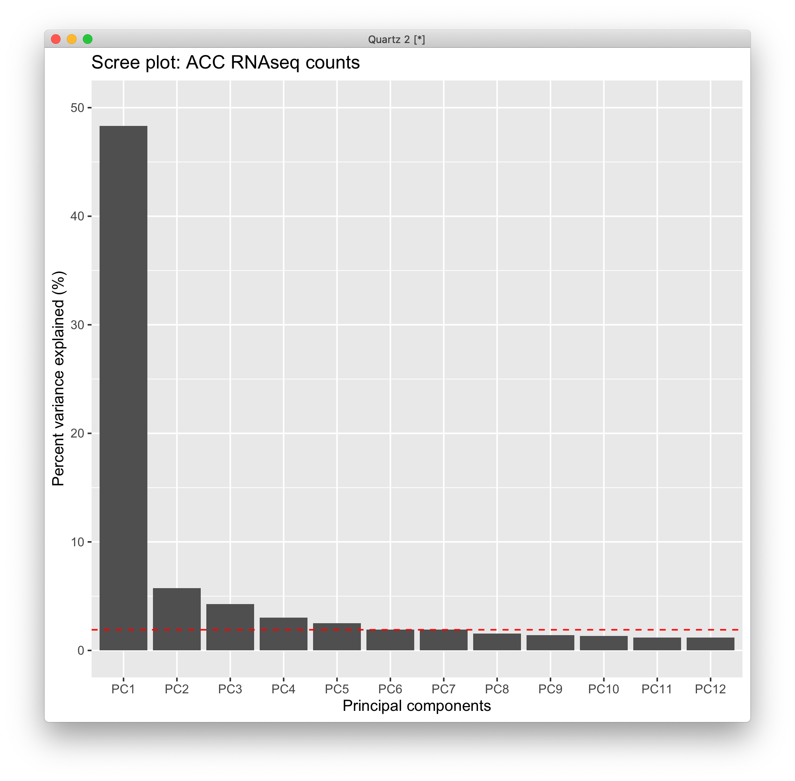
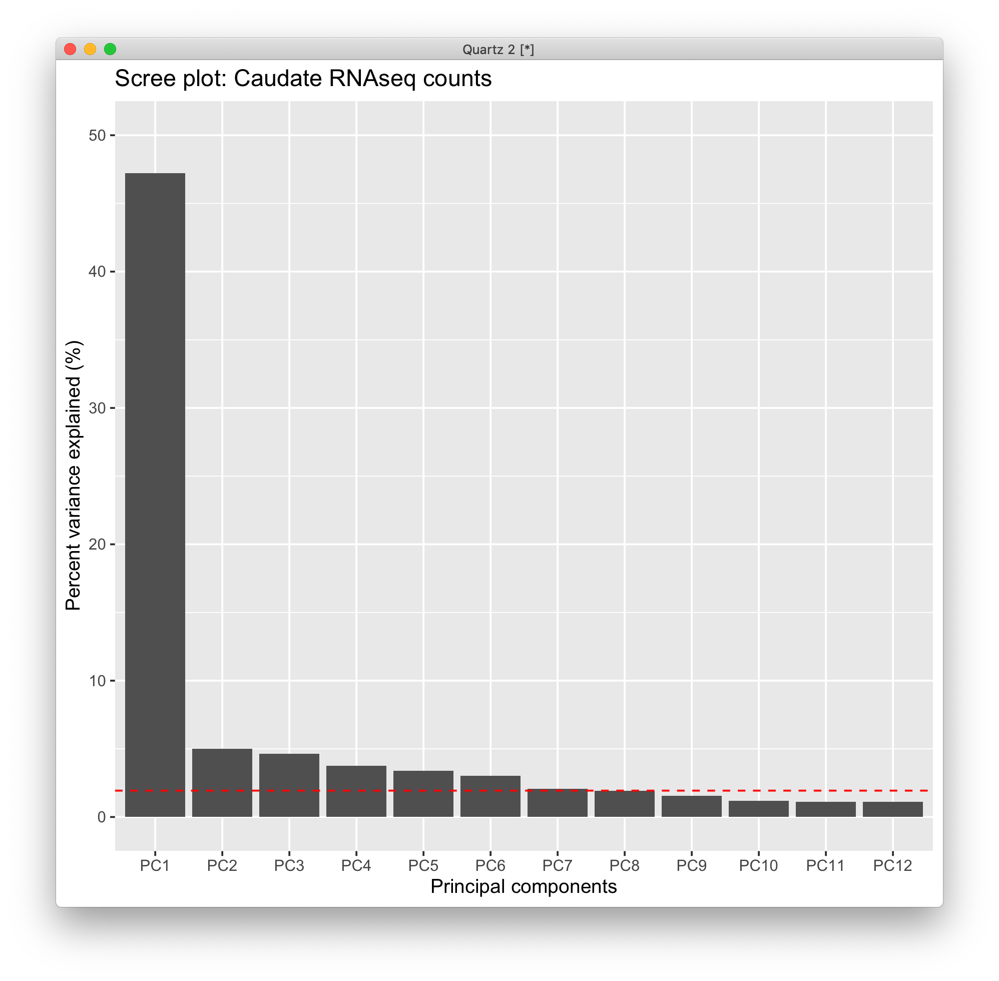
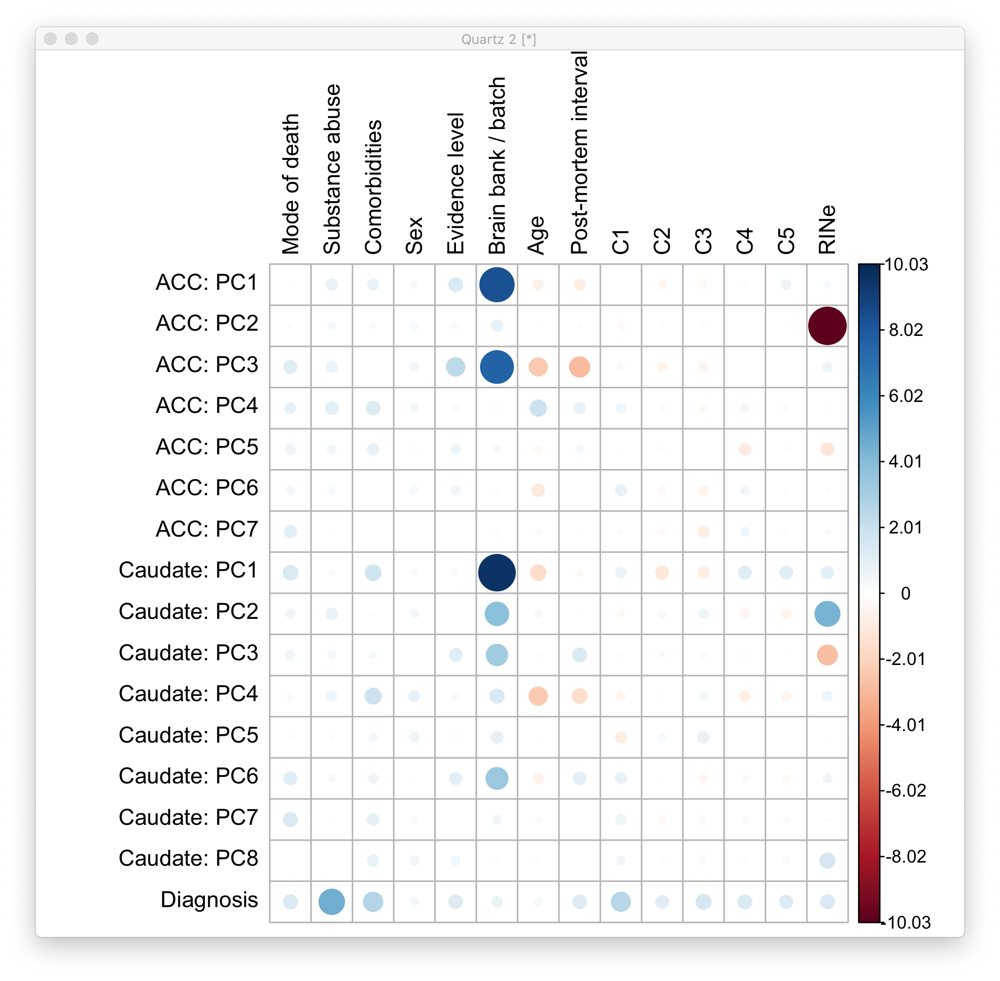
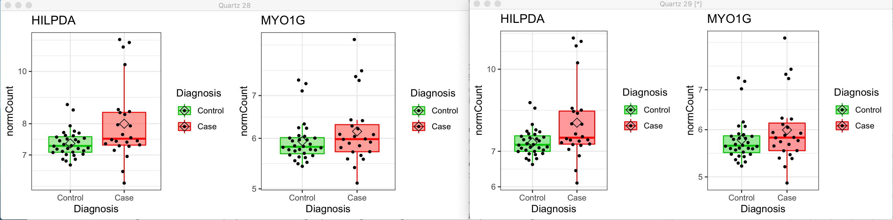
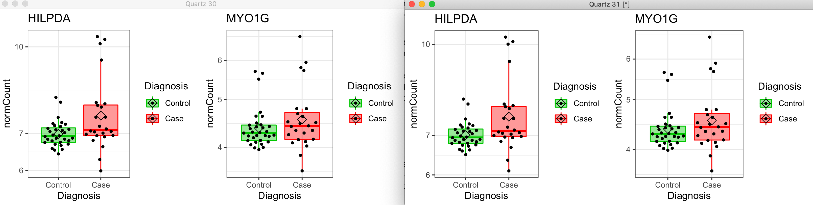
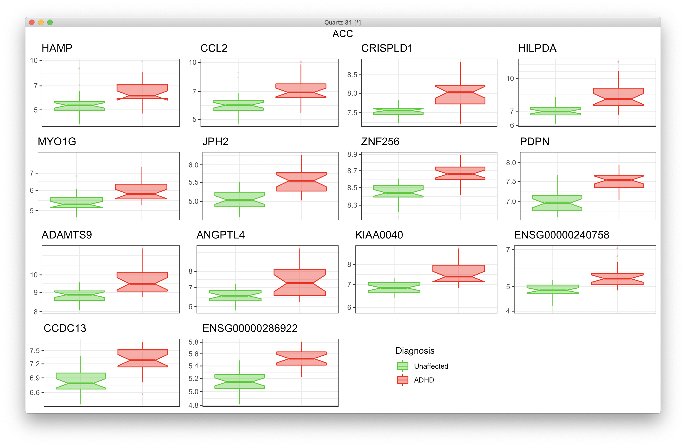

# 2021-05-24 16:10:56

Let's redo some figures after Philip's comments.

## Volcano plots

```r
quartz()

library(ggpubr)
library(EnhancedVolcano)
FCcutoff = 1.0
pCutoff = .05

myplots = list()
res = read.csv('~/data/post_mortem/DGE_ACC_bigger_annot_04292021.csv')
res = res[order(res$pvalue), ]
sigPs = sum(res$padj.FDR <= pCutoff, na.rm=T)
ps = -log10(res$pvalue)
nomPcutoff = ps[sigPs + 1] + (ps[sigPs] - ps[sigPs + 1]) / 2
nomPcutoff = 10 ** (-nomPcutoff)
ymax = ceiling(max(-log10(res$pvalue), na.rm=T))
xmin = floor(min(res$log2FoldChange, na.rm=T))
xmax = ceiling(max(res$log2FoldChange, na.rm=T))
p = EnhancedVolcano(data.frame(res),
                    x = 'log2FoldChange', lab=NA,
                    y = 'pvalue', xlab = bquote(~Log[2]~ 'fold change'),
                    ylab = bquote(~-Log[10]~italic(P)),
                    title = 'ACC',
                    ylim = c(0, ymax),
                    xlim = c(xmin, xmax),
                    pCutoff = nomPcutoff, FCcutoff = FCcutoff, pointSize = 1.0,
                    labSize = 2.0, subtitle=NULL,
                    axisLabSize = 12,
                    caption = NULL, legendPosition = 'none',
                    col = c("grey30", "forestgreen", "red2", "red2"))
myplots[[1]] = p

res = read.csv('~/data/post_mortem/DGE_Caudate_bigger_annot_04292021.csv')
sigPs = sum(res$padj.FDR <= pCutoff, na.rm=T)
ps = -log10(res$pvalue)
nomPcutoff = ps[sigPs + 1] + (ps[sigPs] - ps[sigPs + 1]) / 2
nomPcutoff = 10 ** (-nomPcutoff)
p = EnhancedVolcano(data.frame(res),
                    x = 'log2FoldChange', lab=NA,
                    y = 'pvalue', xlab = bquote(~Log[2]~ 'fold change'),
                    ylab = bquote(~-Log[10]~italic(P)),
                    title = 'Caudate',
                    ylim = c(0, ymax),
                    xlim = c(xmin, xmax),
                    pCutoff = nomPcutoff, FCcutoff = FCcutoff, pointSize = 1.0,
                    labSize = 2.0, subtitle=NULL,
                    axisLabSize = 12,
                    caption = NULL, legendPosition = 'none',
                    col = c("grey30", "forestgreen", "red2", "red2"))
myplots[[2]] = p
ggarrange(plotlist=myplots)
```


## Expression plots

```r
r = 'Caudate'
load('~/data/post_mortem/pca_DGE_bigger_04292021.RData')

res_str = sprintf('dds = dds.%s', r)
eval(parse(text=res_str))
res = results(dds, name = "Diagnosis_Case_vs_Control", alpha=.05)
res = res[order(res$pvalue), ]
gene_list = rownames(res)[which(res$padj <= .05)]
gene_list = rownames(res)[1:14]
# just to get the same size

vsd <- vst(dds, blind=FALSE)
norm.cts <- assay(vsd)

covars = model.matrix(~ RINe + C1 + BBB2 + comorbid_group + SUB2,
                      data=colData(dds))
dsn = model.matrix(~ Diagnosis, data=colData(dds))
mat <- limma::removeBatchEffect(norm.cts, covariates=covars, design=dsn)

gnames = data.frame(full=rownames(counts(dds)),
                    nov=substr(rownames(counts(dds)), 1, 15))
mart = readRDS('~/data/rnaseq_derek/mart_rnaseq.rds')
gnames = merge(gnames, mart, by.x='nov', by.y='ensembl_gene_id')
keep_me = gnames$full %in% gene_list
gene_ids = gnames[keep_me, ]

resid_expr = reshape2::melt(mat[gene_ids$full,])
colnames(resid_expr) = c('gene', 'submitted_name', 'normCount')
junk = colData(vsd)[, c('Diagnosis', 'submitted_name')]
resid_expr = merge(resid_expr, junk, by='submitted_name')
resid_expr = merge(resid_expr, gene_ids, by.x='gene', by.y='full')

# plotting each of the significant genes
library(ggpubr)
library(ggbeeswarm)
myplots = list()
clrs = c("green3", "red")
for (g in 1:nrow(gene_ids)) {
    hgnc = gene_ids[g, 'hgnc_symbol']
    if (hgnc == '') {
        hgnc = gene_ids[g, 'nov']
    }
    cat(gene_ids[g, 'nov'], hgnc, '\n')
    d = as.data.frame(resid_expr[resid_expr$gene == gene_list[g],])
    p = (ggplot(d, aes(x=Diagnosis, y=normCount, color = Diagnosis,
                        fill = Diagnosis)) + 
            scale_y_log10() +
            geom_boxplot(alpha = 0.4, outlier.shape = '+', width = 0.8,
                        lwd = 0.5, notch=T) +
            scale_color_manual(values = clrs, labels=c('Unaffected', 'ADHD')) +
            scale_fill_manual(values = clrs, labels=c('Unaffected', 'ADHD')) +
            theme_bw() + theme(axis.text.x = element_blank(),
                               axis.title.x = element_blank(),
                               axis.ticks.x = element_blank(),
                               axis.title.y = element_blank(),) +
            ggtitle(hgnc))
    myplots[[g]] = p + theme(legend.position = "none")
}
p = ggarrange(plotlist=myplots, common.legend=T, legend='right')
print(p)
```


## Developmental plot

```r
library(corrplot)
keep_me = c("dev1_c0.900_devSpec_regSpec", "dev2_c0.900_devSpec_regSpec",
            "dev3_c0.900_devSpec_regSpec", "dev4_c0.900_devSpec_regSpec",
            "dev5_c0.900_devSpec_regSpec", "overlap_c0.900_regSpec")
ncomps = 1
db = 'manySets_co0_900'
r = 'ACC'
dev_str = sprintf('%s_%s', tolower(r), db)
dir_name = sprintf('~/data/post_mortem/Project_WG32_DGE_%s_bigger_log10_%s_10K/',
                   r, dev_str)
file_name = sprintf('enrichment_results_WG32_DGE_%s_bigger_log10_%s_10K.txt',
                    r, dev_str)
res = read.table(sprintf('%s/%s', dir_name, file_name), header=1, sep='\t')
res = res[res$geneSet %in% keep_me, ]
res = res[order(res$geneSet), c('link', 'normalizedEnrichmentScore', 'pValue')]
dev = res
dev$Region = r

df = matrix(nrow = 2, ncol = 6, dimnames=list(c('ACC', 'Caudate'),
                                              c('overlap', res$link[1:5])))
pvals = df
i = 1
for (j in 1:ncol(df)) {
    idx = dev$Region == rownames(df)[i] & dev$link == colnames(df)[j]
    if (dev[idx, 'pValue'] == 0) {
        dev[idx, 'pValue'] = 1e-5
    }
    df[i, j] = (sign(dev[idx, 'normalizedEnrichmentScore']) *
                -log10(dev[idx, 'pValue']))
    pvals[i, j] = dev[idx, 'pValue'] / ncomps
}

r = 'Caudate'
dev_str = sprintf('%s_%s', tolower(r), db)
dir_name = sprintf('~/data/post_mortem/Project_WG32_DGE_%s_bigger_log10_%s_10K/',
                   r, dev_str)
file_name = sprintf('enrichment_results_WG32_DGE_%s_bigger_log10_%s_10K.txt',
                    r, dev_str)
res = read.table(sprintf('%s/%s', dir_name, file_name), header=1, sep='\t')
res = res[res$geneSet %in% keep_me, ]
res = res[order(res$geneSet), c('link', 'normalizedEnrichmentScore', 'pValue')]
res$Region = r
dev = res

i = 2
for (j in 1:ncol(df)) {
    idx = dev$Region == rownames(df)[i] & dev$link == colnames(df)[j]
    if (dev[idx, 'pValue'] == 0) {
        dev[idx, 'pValue'] = 1e-5
    }
    df[i, j] = (sign(dev[idx, 'normalizedEnrichmentScore']) *
                -log10(dev[idx, 'pValue']))
    pvals[i, j] = dev[idx, 'pValue'] / ncomps
}
mylim = max(abs(df))
colnames(df)[1] = 'pan-developmental'

# i checked and it comes out in the correct order
pvals2 = matrix(p.adjust(pvals, method='fdr'), ncol=6, nrow=2)

# just to get significant ones
corrplot(df, is.corr=F, cl.lim=c(-mylim, mylim), tl.col='black', p.mat=pvals2,
         insig = "label_sig", pch.col = "white",
         sig.level=.05/ncomps, cl.length=3, cl.align.text='l', cl.offset=.2)
# no stars
quartz()
corrplot(df, is.corr=F, cl.lim=c(-mylim, mylim), tl.col='black',
         cl.length=3, cl.align.text='l', cl.offset=.2)
```


# 2021-05-25 06:23:29

## Molecular function plots (FDR q < .05)

```r
tsize = 16
ysize = 12
xsize = 10
msize = 2

df = read.csv('~/data/post_mortem/WG32_DGE_Caudate_bigger_log10_geneontology_Molecular_Function_noRedundant_10K.csv')
df = df[order(df$FDR), c('description', 'normalizedEnrichmentScore', 'FDR')]
df$Behavior = 'Upregulated'
df[df$normalizedEnrichmentScore <= 0, 'Behavior'] = 'Downregulated'
df = df[df$FDR <= 0.05, ]
df[df$FDR == 0, 'FDR'] = 1e-5

df$description = factor(df$description,
                        levels=df$description[sort(df$FDR,
                                                   index.return=T,
                                                   decreasing=T)$ix])
color_me = c('fatty acid derivative binding', 'dynein light chain binding',
             'tau-protein kinase activity')
label_colors <- ifelse(levels(df$description) %in% color_me, "grey20", "red")


p <- ggplot(df, aes(y=-log10(FDR), x=description, fill=Behavior)) +
  geom_dotplot(dotsize=msize, binaxis='y', stackdir='center') + coord_flip() +
  geom_hline(yintercept=-log10(.1), linetype="dashed",
                                color = "black", size=1) + theme(legend.position="bottom") +
    geom_hline(yintercept=-log10(.05), linetype="dotted",
                                color = "black", size=1) + theme(legend.position="bottom") +
    theme(axis.text.y = element_text(colour = label_colors, size=ysize),
          axis.title.y = element_blank(),
          plot.title = element_text(size = tsize),
          axis.text.x = element_text(size=xsize),
          axis.title.x = element_text(size=ysize))

library(ggpubr)
p1 = p + ggtitle('Caudate') + ylab(bquote(~-Log[10]~italic(P[adjusted]))) 

df = read.csv('~/data/post_mortem/WG32_DGE_ACC_bigger_log10_geneontology_Molecular_Function_noRedundant_10K.csv')
df = df[order(df$FDR), c('description', 'normalizedEnrichmentScore', 'FDR')]
df$Behavior = 'Upregulated'
df[df$normalizedEnrichmentScore <= 0, 'Behavior'] = 'Downregulated'
df = df[df$FDR <= 0.05, ]
df[df$FDR == 0, 'FDR'] = 1e-5

df$description = factor(df$description,
                        levels=df$description[sort(df$FDR,
                                                   index.return=T,
                                                   decreasing=T)$ix])

color_me = c('neurotransmitter receptor activity',
             'serotonin receptor activity', 'GABA receptor activity')
label_colors <- ifelse(levels(df$description) %in% color_me, "red", "grey20")

p <- ggplot(df, aes(y=-log10(FDR), x=description, fill=Behavior, size=msize)) +
  geom_dotplot(dotsize=1.25*msize, binaxis='y', stackdir='center') + coord_flip() +
  geom_hline(yintercept=-log10(.1), linetype="dashed",
                                color = "black", size=1) + theme(legend.position="bottom") +
    geom_hline(yintercept=-log10(.05), linetype="dotted",
                                color = "black", size=1) + theme(legend.position="bottom") +
    theme(axis.text.y = element_text(colour = label_colors, size=ysize),
          axis.title.y = element_blank(),
          plot.title = element_text(size = tsize),
          axis.text.x = element_text(size=xsize),
          axis.title.x = element_text(size=ysize))

p2 = p + ggtitle('ACC') + ylab(bquote(~-Log[10]~italic(P[adjusted]))) 

p = ggarrange(p1, p2, common.legend=T, ncol=2, nrow=1, legend='bottom')
print(p)
```


## Top 10 Cellular components

```r
tsize = 16
ysize = 12
xsize = 10
msize = 2
ntop = 10

df = read.csv('~/data/post_mortem/WG32_DGE_Caudate_bigger_log10_geneontology_Cellular_Component_noRedundant_10K.csv')
df = df[order(df$FDR), c('description', 'normalizedEnrichmentScore', 'FDR')]
df$Behavior = 'Upregulated'
df[df$normalizedEnrichmentScore <= 0, 'Behavior'] = 'Downregulated'
df$Behavior = factor(df$Behavior, levels=c('Downregulated', 'Upregulated'))
df = df[1:ntop, ]
df[df$FDR == 0, 'FDR'] = 1e-5

df$description = factor(df$description,
                        levels=df$description[sort(df$FDR,
                                                   index.return=T,
                                                   decreasing=T)$ix])
color_me = c('transporter complex', 'mitochondrial protein complex')
label_colors <- ifelse(levels(df$description) %in% color_me, "grey20", "red")


p <- ggplot(df, aes(y=-log10(FDR), x=description, fill=Behavior)) +
  geom_dotplot(dotsize=msize, binaxis='y', stackdir='center') + coord_flip() +
  geom_hline(yintercept=-log10(.1), linetype="dashed",
                                color = "black", size=1) + theme(legend.position="bottom") +
    geom_hline(yintercept=-log10(.05), linetype="dotted",
                                color = "black", size=1) + theme(legend.position="bottom") +
    scale_fill_manual(values=clrs, labels=levels(df$Behavior)) +
    theme(axis.text.y = element_text(colour = label_colors, size=ysize),
          axis.title.y = element_blank(),
          plot.title = element_text(size = tsize),
          axis.text.x = element_text(size=xsize),
          axis.title.x = element_text(size=ysize)) +
    scale_fill_discrete(drop = FALSE)

library(ggpubr)
p1 = p + ggtitle('Caudate') + ylab(bquote(~-Log[10]~italic(P[adjusted]))) 

df = read.csv('~/data/post_mortem/WG32_DGE_ACC_bigger_log10_geneontology_Cellular_Component_noRedundant_10K.csv')
df = df[order(df$FDR), c('description', 'normalizedEnrichmentScore', 'FDR')]
df$Behavior = 'Upregulated'
df[df$normalizedEnrichmentScore <= 0, 'Behavior'] = 'Downregulated'
df$Behavior = factor(df$Behavior, levels=c('Downregulated', 'Upregulated'))
df = df[1:ntop, ]
df[df$FDR == 0, 'FDR'] = 1e-5

df$description = factor(df$description,
                        levels=df$description[sort(df$FDR,
                                                   index.return=T,
                                                   decreasing=T)$ix])

color_me = c('nothing')
label_colors <- ifelse(levels(df$description) %in% color_me, "red", "grey20")

p <- ggplot(df, aes(y=-log10(FDR), x=description, fill=Behavior, size=msize)) +
  geom_dotplot(dotsize=msize, binaxis='y', stackdir='center') + coord_flip() +
  geom_hline(yintercept=-log10(.1), linetype="dashed",
                                color = "black", size=1) + theme(legend.position="bottom") +
    geom_hline(yintercept=-log10(.05), linetype="dotted",
                                color = "black", size=1) + theme(legend.position="bottom") +
    theme(axis.text.y = element_text(colour = label_colors, size=ysize),
          axis.title.y = element_blank(),
          plot.title = element_text(size = tsize),
          axis.text.x = element_text(size=xsize),
          axis.title.x = element_text(size=ysize)) +
    scale_fill_discrete(drop = FALSE)

p2 = p + ggtitle('ACC') + ylab(bquote(~-Log[10]~italic(P[adjusted]))) 

p = ggarrange(p1, p2, common.legend=T, ncol=2, nrow=1, legend='bottom')
print(p)
```


# 2021-05-26 06:47:20

## Disorder correlation plot

```r
library(ggplot2)
library(ggpubr)
quartz()

fname = 'disorders_corrs_bigger_04292021'
corrs = readRDS(sprintf('~/data/post_mortem/%s.rds', fname))
sources = unique(corrs$source)

# this leveling only affects the color ordering
dis_order = c('ASD', 'SCZ', 'BD', 'MDD', 'AAD', 'OCD', 'IBD')
col_labels = c('Autism Spectrum Disorder', 'Schizophernia', 'Bipolar Disorder',
               'Major Depression Disorder', 'Alcohol Abuse or Dependene',
               'Obsessive Compulsive Disorder', 'Irritable Bowel Disorder')
corrs$Disorders = factor(corrs$disorder,
                        levels=dis_order)

# just to share axis
ymax = .4
ymin = -.4
my_colors = RColorBrewer::brewer.pal(7, "Accent")

r = 'ACC' 
mycorrs = corrs[corrs$region == r, ]
mycorrs$id = sapply(1:nrow(mycorrs),
                  function(i) sprintf('%s [%d]',
                                      mycorrs[i, 'disorder'],
                                      which(sources == mycorrs[i, 'source'])))
# setting the order results appear in X axis
library(dplyr)
ranks = mycorrs %>% group_by(id) %>% summarize(Median = abs(median(corr, na.rm=TRUE)))
mylevels = c()
for (d in dis_order) {
    # assumes IDs start with the disorder
    myranks = ranks[grepl(ranks$id, pattern=paste0('^',d)),]
    mylevels = c(mylevels, myranks$id[order(myranks$Median, decreasing=T)])
}
# regroup levels based on the order we established before
mycorrs$xorder = factor(mycorrs$id, levels=mylevels)

p1 = ggplot(mycorrs, aes(x = xorder, y = corr, fill=Disorders)) +
    geom_violin(trim=FALSE) + 
    # fake continuous axis to add vertical lines later
    geom_line(aes(x = as.numeric(xorder), y=0), size = 1, color="red", alpha=0) + 
    # vertical lines separating disorders
    geom_vline(xintercept=c(4.5, 7.5, 10.5, 12.5, 13.5),
               linetype="dashed", color = "grey", size=.5) +
    theme(axis.text.x = element_text(angle = 90, hjust=1, vjust=0.5),
          axis.title.x = element_blank()) +
    ggtitle(r) + geom_hline(yintercept=0, linetype="dotted",
                                color = "red", size=1) +
   ylab('Transcriptome correlation (rho)') + ylim(ymin, ymax) + 
   scale_fill_manual(breaks = levels(corrs$Disorder),
                     values = my_colors,
                     labels = col_labels,
                     drop=FALSE)

r = 'Caudate'
mycorrs = corrs[corrs$region == r, ]
mycorrs$id = sapply(1:nrow(mycorrs),
                  function(i) sprintf('%s [%d]',
                                      mycorrs[i, 'disorder'],
                                      which(sources == mycorrs[i, 'source'])))
# setting the order results appear in X axis
library(dplyr)
ranks = mycorrs %>% group_by(id) %>% summarize(Median = abs(median(corr, na.rm=TRUE)))
mylevels = c()
for (d in dis_order) {
    # assumes IDs start with the disorder
    myranks = ranks[grepl(ranks$id, pattern=paste0('^',d)),]
    mylevels = c(mylevels, myranks$id[order(myranks$Median, decreasing=T)])
}
# regroup levels based on the order we established before
mycorrs$xorder = factor(mycorrs$id, levels=mylevels)

p2 = ggplot(mycorrs, aes(x = xorder, y = corr, fill=Disorders)) +
    geom_violin(trim=FALSE) + 
    # fake continuous axis to add vertical lines later
    geom_line(aes(x = as.numeric(xorder), y=0), size = 1, color="red", alpha=0) + 
    # vertical lines separating disorders
    geom_vline(xintercept=c(2.5, 5.5, 8.5, 9.5, 10.5, 11.5),
               linetype="dashed", color = "grey", size=.5) +
    theme(axis.text.x = element_text(angle = 90, hjust=1, vjust=0.5),
          axis.title.x = element_blank()) +
    ggtitle(r) + geom_hline(yintercept=0, linetype="dotted",
                                color = "red", size=1) +
   ylab('Transcriptome correlation (rho)') + ylim(ymin, ymax) + 
   scale_fill_manual(breaks = levels(corrs$Disorder),
                     values = my_colors,
                     labels = col_labels,
                     drop=FALSE)

ggarrange(p1, p2, common.legend = T, legend='right', nrow=2, ncol=1,
          legend.grob=get_legend(p2)) 
```


Let's make a few more figures.

## PCA details

The goal is to make within-region scree plots, and then a matrix of
-log10P*sign(stat) which will include DX.

```r
# not going to worry about people we don't have data for, or are outliers
data = read.table('~/data/rnaseq_derek/adhd_rnaseq_counts.txt', header=1)
rownames(data) = data[,1]
data[,1] = NULL
data = round(data)
sub_name = gsub(x=colnames(data), pattern='X', replacement='')
colnames(data) = sub_name
# this is a repeat for Caudate hbcc 2877, but has more genes with zeros than
# its other replicate
data = data[, ! colnames(data) %in% c('66552')]
# outliers based on PCA plots
outliers = c('68080','68096', '68108', '68084', '68082')
data = data[, ! colnames(data) %in% outliers]

library(gdata)
df = read.xls('~/data/post_mortem/POST_MORTEM_META_DATA_JAN_2021.xlsx')
data = data[, colnames(data) %in% df$submitted_name]
df = df[df$submitted_name %in% colnames(data), ]
df = df[order(df$submitted_name), ]
data = data[, order(df$submitted_name)]

# cleaning up some variables
df$Individual = factor(df$hbcc_brain_id)
df[df$Manner.of.Death=='Suicide (probable)', 'Manner.of.Death'] = 'Suicide'
df[df$Manner.of.Death=='unknown', 'Manner.of.Death'] = 'natural'
df$MoD = factor(df$Manner.of.Death)
df$Sex = factor(df$Sex)
df$batch = factor(df$batch)
df$run_date = factor(gsub(df$run_date, pattern='-', replacement=''))
df$Diagnosis = factor(df$Diagnosis, levels=c('Control', 'Case'))
df$Region = factor(df$Region, levels=c('Caudate', 'ACC'))
df$SUB2 = 'no'
df[df$substance_group > 0, 'SUB2'] = 'yes'
df$SUB2 = factor(df$SUB2)
df$substance_group = factor(df$substance_group)
df$comorbid_group = factor(df$comorbid_group_update)
df$evidence_level = factor(df$evidence_level)
df$brainbank = factor(df$bainbank)
# replace the one subject missing population PCs by the median of their
# self-declared race and ethnicity
idx = (df$Race.x=='White' & df$Ethnicity.x=='Non-Hispanic' & !is.na(df$C1))
pop_pcs = c('C1', 'C2', 'C3', 'C4', 'C5')
med_pop = apply(df[idx, pop_pcs], 2, median)
df[which(is.na(df$C1)), pop_pcs] = med_pop
df$BBB = factor(sapply(1:nrow(df),
                        function(x) sprintf('%s_%s',
                                    as.character(df[x,'brainbank']),
                                    as.character(df[x, 'batch']))))
df$BBB2 = NA                                                                        
df[df$brainbank=='nimh_hbcc', 'BBB2'] = 1                                           
df[df$batch==3, 'BBB2'] = 2                                                         
df[df$batch==4, 'BBB2'] = 3      
df$BBB2 = factor(df$BBB2)
imWNH = which(df$C1 > 0 & df$C2 < -.075)
df$POP_BIN = 'other'
df[imWNH, 'POP_BIN'] = 'WNH'
df$POP_BIN = factor(df$POP_BIN)        
# df$RINc = cut(df$RINe, breaks = 4)  
# bining so DESeq2 can do its own filyering automatically
breaks = quantile(df$RINe, probs = seq(0, 1, by = 0.25))
df$RINc = cut(df$RINe, breaks=breaks, labels=c('q1', 'q2', 'q3', 'q4'),
            include.lowest=T)

df2 = df[!duplicated(df$hbcc_brain_id), ]

# run nonparametric t-tests for numeric variables
num_vars = c('Age', 'PMI', 'C1', 'C2', 'C3', 'C4', 'C5', 'RINe')
mypvals = c()
mystats = c()
for (x in num_vars) {
    res = wilcox.test(as.formula(sprintf('%s ~ Diagnosis', x)), data=df2)
    mypvals = c(mypvals, res$p.value)
    mystats = c(mystats, res$statistic)
}

categ_vars = c('MoD', 'SUB2', 'comorbid_group', 'Sex', 'evidence_level', 'BBB2')
for (x in categ_vars) {
    res = chisq.test(table(df2$Diagnosis, df2[, x]))
    mypvals = c(mypvals, res$p.value)
    mystats = c(mystats, res$statistic)
}
print(c(num_vars, categ_vars)[which(mypvals < .05/length(mypvals))])
```

```
[1] "SUB2"
[1] "C1"             "SUB2"           "comorbid_group"
```

```r
myvars = c(num_vars, categ_vars)
DX_pvals = mypvals
DX_plot = -log10(mypvals) * sign(mystats)
names(DX_plot) = myvars
```

Now we run it for the PCA of ACC. Make sure we save the data for the scree plot
as well:

```r
myregion = 'ACC'

data = read.table('~/data/rnaseq_derek/adhd_rnaseq_counts.txt', header=1)
rownames(data) = data[,1]
data[,1] = NULL
data = round(data)
sub_name = gsub(x=colnames(data), pattern='X', replacement='')
colnames(data) = sub_name
# this is a repeat for Caudate hbcc 2877, but has more genes with zeros than
# its other replicate
data = data[, ! colnames(data) %in% c('66552')]
# outliers based on PCA plots
outliers = c('68080','68096', '68108', '68084', '68082')
data = data[, ! colnames(data) %in% outliers]

library(gdata)
df = read.xls('~/data/post_mortem/POST_MORTEM_META_DATA_JAN_2021.xlsx')
data = data[, colnames(data) %in% df$submitted_name]
df = df[df$submitted_name %in% colnames(data), ]
df = df[order(df$submitted_name), ]
data = data[, order(df$submitted_name)]

keep_me = df$Region == myregion
data = data[, keep_me]
df = df[keep_me, ]

# cleaning up some variables
df$Individual = factor(df$hbcc_brain_id)
df[df$Manner.of.Death=='Suicide (probable)', 'Manner.of.Death'] = 'Suicide'
df[df$Manner.of.Death=='unknown', 'Manner.of.Death'] = 'natural'
df$MoD = factor(df$Manner.of.Death)
df$Sex = factor(df$Sex)
df$batch = factor(df$batch)
df$run_date = factor(gsub(df$run_date, pattern='-', replacement=''))
df$Diagnosis = factor(df$Diagnosis, levels=c('Control', 'Case'))
df$Region = factor(df$Region, levels=c('Caudate', 'ACC'))
df$comorbid_group = factor(df$comorbid_group_update)
df$evidence_level = factor(df$evidence_level)
df$brainbank = factor(df$bainbank)
# replace the one subject missing population PCs by the median of their
# self-declared race and ethnicity
idx = (df$Race.x=='White' & df$Ethnicity.x=='Non-Hispanic' & !is.na(df$C1))
pop_pcs = c('C1', 'C2', 'C3', 'C4', 'C5')
med_pop = apply(df[idx, pop_pcs], 2, median)
df[which(is.na(df$C1)), pop_pcs] = med_pop
df$BBB = factor(sapply(1:nrow(df),
                        function(x) sprintf('%s_%s',
                                    as.character(df[x,'brainbank']),
                                    as.character(df[x, 'batch']))))
df$BBB2 = NA                                                                        
df[df$brainbank=='nimh_hbcc', 'BBB2'] = 1                                           
df[df$batch==3, 'BBB2'] = 2                                                         
df[df$batch==4, 'BBB2'] = 3      
df$BBB2 = factor(df$BBB2)
df$SUB2 = 'no'
df[df$substance_group > 0, 'SUB2'] = 'yes'
df$SUB2 = factor(df$SUB2)
df$substance_group = factor(df$substance_group)
imWNH = which(df$C1 > 0 & df$C2 < -.075)
df$POP_BIN = 'other'
df[imWNH, 'POP_BIN'] = 'WNH'
df$POP_BIN = factor(df$POP_BIN)        
# df$RINc = cut(df$RINe, breaks = 4)  
# bining so DESeq2 can do its own filyering automatically
breaks = quantile(df$RINe, probs = seq(0, 1, by = 0.25))
df$RINc = cut(df$RINe, breaks=breaks, labels=c('q1', 'q2', 'q3', 'q4'),
            include.lowest=T)

library(GenomicFeatures)
txdb <- loadDb('~/data/post_mortem/Homo_sapies.GRCh38.97.sqlite')
txdf <- select(txdb, keys(txdb, "GENEID"), columns=c('GENEID','TXCHROM'),
            "GENEID")
bt = read.csv('~/data/post_mortem/Homo_sapiens.GRCh38.97_biotypes.csv')
bt_slim = bt[, c('gene_id', 'gene_biotype')]
bt_slim = bt_slim[!duplicated(bt_slim),]
txdf = merge(txdf, bt_slim, by.x='GENEID', by.y='gene_id')
tx_meta = data.frame(GENEID = substr(rownames(data), 1, 15))
tx_meta = merge(tx_meta, txdf, by='GENEID', sort=F)
imautosome = which(tx_meta$TXCHROM != 'X' &
                tx_meta$TXCHROM != 'Y' &
                tx_meta$TXCHROM != 'MT')
data = data[imautosome, ]
tx_meta = tx_meta[imautosome, ]

# remove constant genes (including zeros) as it breaks PCA
const_genes = apply(data, 1, sd) == 0
data = data[!const_genes, ]

library("DESeq2")
# making sure any numeric covariates are scaled
for (var in num_vars) {
    df[, var] = scale(df[, var])
}

min_subjs = min(table(df$Diagnosis))
keep <- rowSums(data == 0) <= min_subjs
data <- data[keep,]

# checking which PCs are associated with our potential nuiscance variables
set.seed(42)
mypca <- prcomp(t(data), scale=TRUE)
# how many PCs to keep... using Kaiser thredhold, close to eigenvalues < 1
library(nFactors)
eigs <- mypca$sdev^2
nS = nScree(x=eigs)
keep_me = seq(1, nS$Components$nkaiser)

mydata = data.frame(mypca$x[, keep_me])
# create main metadata data frame including metadata and PCs
data.pm = cbind(df, mydata)
rownames(data.pm) = df$hbcc_brain_id
cat('Using', nS$Components$nkaiser, 'PCs from possible', ncol(data), '\n')

# check which PCs are associated at nominal p<.01
pc_vars = colnames(mydata)
num_corrs = matrix(nrow=length(num_vars), ncol=length(pc_vars),
                    dimnames=list(num_vars, pc_vars))
num_pvals = num_corrs
for (x in num_vars) {
    for (y in pc_vars) {
        res = cor.test(data.pm[, x], data.pm[, y], method='spearman')
        num_corrs[x, y] = res$estimate
        num_pvals[x, y] = res$p.value
    }
}

categ_corrs = matrix(nrow=length(categ_vars), ncol=length(pc_vars),
                        dimnames=list(categ_vars, pc_vars))
categ_pvals = categ_corrs
for (x in categ_vars) {
    for (y in pc_vars) {
        res = kruskal.test(data.pm[, y], data.pm[, x])
        categ_corrs[x, y] = res$statistic
        categ_pvals[x, y] = res$p.value
    }
}
mypvals = rbind(categ_pvals, num_pvals)
mycorrs = rbind(categ_corrs, num_corrs)
print(which(mypvals < .01/(ncol(mypvals)*nrow(mypvals)), arr.ind = T) )
print(which(mypvals < .05/(ncol(mypvals)*nrow(mypvals)), arr.ind = T) )
```

```
# ACC
Using 7 PCs from possible 53 
There were 21 warnings (use warnings() to see them)
     row col
BBB2   6   1
RINe  14   2
BBB2   6   3
     row col
BBB2   6   1
RINe  14   2
BBB2   6   3

# Caudate
Using 8 PCs from possible 56 
There were 50 or more warnings (use warnings() to see the first 50)
     row col
BBB2   6   1
RINe  14   2
     row col
BBB2   6   1
BBB2   6   2
RINe  14   2
BBB2   6   6
```

```r
ACC_pvals = mypvals
ACC_plot = -log10(mypvals) * sign(mycorrs)
names(ACC_plot) = myvars
ACC_pca = mypca
```

Now, let's work on plotting them. Scree first:

```r
library(ggplot2)
quartz()
pca_obj = ACC_pca
npcs = 12
var_explained_df <- data.frame(PC=factor(colnames(pca_obj$x)[1:npcs],
                                         levels=colnames(pca_obj$x)[1:npcs]),
                               var_explained=100*(pca_obj$sdev[1:npcs])^2/sum((pca_obj$sdev)^2))
ggplot(aes(x=PC, y=var_explained), data=var_explained_df)+
  geom_col()+
  geom_hline(yintercept=var_explained_df[7, 2], linetype="dashed", color = "red") +
  labs(title="Scree plot: ACC RNAseq counts",
        y='Percent variance explained (%)',
        x='Principal components') +
   ylim(0, 50)

pca_obj = mypca
var_explained_df <- data.frame(PC=factor(colnames(pca_obj$x)[1:npcs],
                                         levels=colnames(pca_obj$x)[1:npcs]),
                               var_explained=100*(pca_obj$sdev[1:npcs])^2/sum((pca_obj$sdev)^2))
ggplot(aes(x=PC, y=var_explained), data=var_explained_df)+
  geom_col()+
  geom_hline(yintercept=var_explained_df[8, 2], linetype="dashed", color = "red") +
  labs(title="Scree plot: Caudate RNAseq counts",
        y='Percent variance explained (%)',
        x='Principal components') +
   ylim(0, 50)

```





Now the correlation plot:

```r
cnames = sapply(colnames(ACC_plot), function(x) sprintf('ACC: %s', x))
plot_df = t(ACC_plot)
rownames(plot_df) = cnames
Caudate_plot = -log10(mypvals) * sign(mycorrs)
cnames = sapply(colnames(Caudate_plot), function(x) sprintf('Caudate: %s', x))
colnames(Caudate_plot) = cnames
plot_df = rbind(plot_df, t(Caudate_plot))
junk = t(data.frame(DX_plot))
plot_df2 = rbind(plot_df, junk[, match(colnames(plot_df), colnames(junk))])
rownames(plot_df2)[nrow(plot_df2)] = 'Diagnosis'
mylim = max(abs(plot_df2))

colnames(plot_df2) = c("Mode of death", "Substance abuse", "Comorbidities",
                       "Sex", "Evidence level", "Brain bank / batch", "Age",
                       "Post-mortem interval", "C1", "C2", "C3", "C4", "C5",
                       "RINe")
library(corrplot)
corrplot(plot_df2, is.corr=F, cl.lim=c(-mylim, mylim), tl.col='black')
```




# 2021-05-07 12:07:07

Let's see if I normalize them differently I can reduce the weight of some of
those outliers:

```r
gene_list = c('HILPDA', 'MYO1G')
r = 'Caudate'

load('~/data/post_mortem/pca_DGE_bigger_04292021.RData')
res_str = sprintf('dds = dds.%s', r)
eval(parse(text=res_str))

res = results(dds, name = "Diagnosis_Case_vs_Control", alpha=.05)
vsd <- rlog(dds, blind=TRUE)
norm.cts <- assay(vsd)

covars = model.matrix(~RINe + C1 + BBB2 + comorbid_group + SUB2,
                      data=colData(dds))
dsn = model.matrix(~Diagnosis, data=colData(dds))
mat <- limma::removeBatchEffect(norm.cts, covariates=covars, design=dsn)
# mat <- limma::removeBatchEffect(norm.cts, covariates=NULL, design=NULL)

gnames = data.frame(full=rownames(counts(dds)),
                    nov=substr(rownames(counts(dds)), 1, 15))
mart = readRDS('~/data/rnaseq_derek/mart_rnaseq.rds')
gnames = merge(gnames, mart, by.x='nov', by.y='ensembl_gene_id')
keep_me = gnames$hgnc_symbol %in% gene_list
gene_ids = gnames[keep_me, ]

resid_expr = reshape2::melt(mat[gene_ids$full,])
colnames(resid_expr) = c('gene', 'submitted_name', 'normCount')
junk = colData(vsd)[, c('Diagnosis', 'submitted_name')]
resid_expr = merge(resid_expr, junk, by='submitted_name')
resid_expr = merge(resid_expr, gene_ids, by.x='gene', by.y='full')

# plotting each of the significant genes
library(ggpubr)
library(ggbeeswarm)
myplots = list()
clrs = c("green3", "red")
for (g in 1:nrow(gene_ids)) {
    cat(gene_ids[g, 'nov'], '\n')
    d = as.data.frame(resid_expr[resid_expr$hgnc_symbol == gene_list[g],])
    p = (ggplot(d, aes(x=Diagnosis, y=normCount, color = Diagnosis,
                    fill = Diagnosis)) + 
        scale_y_log10() +
        geom_boxplot(alpha = 0.4, outlier.shape = NA, width = 0.8,
                    lwd = 0.5) +
        stat_summary(fun = mean, geom = "point", color = "black",
                    shape = 5, size = 3,
                    position=position_dodge(width = 0.8)) +
        scale_color_manual(values = clrs) +
        scale_fill_manual(values = clrs) +
        geom_quasirandom(color = "black", size = 1, dodge.width = 0.8) +
        theme_bw() + #theme(legend.position = "none") + 
        ggtitle(gene_ids[g, 'hgnc_symbol']))
    myplots[[g]] = p
}
p = ggarrange(plotlist=myplots)
print(p)
```



Those two use vsd with blind=F on the left, and TRUE on right. Not much
difference, but looks like the boxplots are a bit more well-behaved. Not much
difference between that and rlog (below), excpet that vst is much faster.



Let's then redo the figures using the normalized data:

```r
r = 'ACC'
r='Caudate'
load('~/data/post_mortem/pca_DGE_bigger_04292021.RData')

res_str = sprintf('dds = dds.%s', r)
eval(parse(text=res_str))
res = results(dds, name = "Diagnosis_Case_vs_Control", alpha=.05)
gene_list = rownames(res)[which(res$padj <= .06)]

vsd <- vst(dds, blind=FALSE)
norm.cts <- assay(vsd)

covars = model.matrix(~ RINe + C1 + BBB2 + comorbid_group + SUB2,
                      data=colData(dds))
dsn = model.matrix(~ Diagnosis, data=colData(dds))
mat <- limma::removeBatchEffect(norm.cts, covariates=covars, design=dsn)

gnames = data.frame(full=rownames(counts(dds)),
                    nov=substr(rownames(counts(dds)), 1, 15))
mart = readRDS('~/data/rnaseq_derek/mart_rnaseq.rds')
gnames = merge(gnames, mart, by.x='nov', by.y='ensembl_gene_id')
keep_me = gnames$full %in% gene_list
gene_ids = gnames[keep_me, ]

resid_expr = reshape2::melt(mat[gene_ids$full,])
colnames(resid_expr) = c('gene', 'submitted_name', 'normCount')
junk = colData(vsd)[, c('Diagnosis', 'submitted_name')]
resid_expr = merge(resid_expr, junk, by='submitted_name')
resid_expr = merge(resid_expr, gene_ids, by.x='gene', by.y='full')

# plotting each of the significant genes
library(ggpubr)
library(ggbeeswarm)
myplots = list()
clrs = c("green3", "red")
for (g in 1:nrow(gene_ids)) {
    hgnc = gene_ids[g, 'hgnc_symbol']
    if (hgnc == '') {
        hgnc = gene_ids[g, 'nov']
    }
    cat(gene_ids[g, 'nov'], hgnc, '\n')
    d = as.data.frame(resid_expr[resid_expr$gene == gene_list[g],])
    p = (ggplot(d, aes(x=Diagnosis, y=normCount, color = Diagnosis,
                        fill = Diagnosis)) + 
            scale_y_log10() +
            geom_boxplot(alpha = 0.4, outlier.shape = '+', width = 0.8,
                        lwd = 0.5, notch=T) +
            scale_color_manual(values = clrs, labels=c('Unaffected', 'ADHD')) +
            scale_fill_manual(values = clrs, labels=c('Unaffected', 'ADHD')) +
            theme_bw() + theme(axis.text.x = element_blank(),
                               axis.title.x = element_blank(),
                               axis.ticks.x = element_blank(),
                               axis.title.y = element_blank(),) +
            ggtitle(hgnc))
    myplots[[g]] = p + theme(legend.position = "none")
}
myplots[[g + 1]] = get_legend(p)
p = ggarrange(plotlist=myplots)
print(annotate_figure(p, r))
```




I plotted 3 because one was screwing up the dimensions and the functions weren't
working. Just crop it.


## Redoing PCA plots

```r
data = read.table('~/data/rnaseq_derek/adhd_rnaseq_counts.txt', header=1)
rownames(data) = data[,1]
data[,1] = NULL
data = round(data)
sub_name = gsub(x=colnames(data), pattern='X', replacement='')
colnames(data) = sub_name
# this is a repeat for Caudate hbcc 2877, but has more genes with zeros than
# its other replicate
data = data[, ! colnames(data) %in% c('66552')]
# # outliers based on PCA plots
# outliers = c('68080','68096', '68108', '68084', '68082')
# data = data[, ! colnames(data) %in% outliers]

library(gdata)
df = read.xls('~/data/post_mortem/POST_MORTEM_META_DATA_JAN_2021.xlsx')
data = data[, colnames(data) %in% df$submitted_name]
df = df[df$submitted_name %in% colnames(data), ]
df = df[order(df$submitted_name), ]
data = data[, order(df$submitted_name)]

# cleaning up some variables
df$Individual = factor(df$hbcc_brain_id)
df[df$Manner.of.Death=='Suicide (probable)', 'Manner.of.Death'] = 'Suicide'
df[df$Manner.of.Death=='unknown', 'Manner.of.Death'] = 'natural'
df$MoD = factor(df$Manner.of.Death)
df$Sex = factor(df$Sex)
df$batch = factor(df$batch)
df$run_date = factor(gsub(df$run_date, pattern='-', replacement=''))
df$Diagnosis = factor(df$Diagnosis, levels=c('Control', 'Case'))
df$Region = factor(df$Region, levels=c('Caudate', 'ACC'))
df$SUB2 = 'no'
df[df$substance_group > 0, 'SUB2'] = 'yes'
df$SUB2 = factor(df$SUB2)
df$substance_group = factor(df$substance_group)
df$comorbid_group = factor(df$comorbid_group_update)
df$evidence_level = factor(df$evidence_level)
df$brainbank = factor(df$bainbank)
# replace the one subject missing population PCs by the median of their
# self-declared race and ethnicity
idx = (df$Race.x=='White' & df$Ethnicity.x=='Non-Hispanic' & !is.na(df$C1))
pop_pcs = c('C1', 'C2', 'C3', 'C4', 'C5')
med_pop = apply(df[idx, pop_pcs], 2, median)
df[which(is.na(df$C1)), pop_pcs] = med_pop
df$BBB = factor(sapply(1:nrow(df),
                        function(x) sprintf('%s_%s',
                                    as.character(df[x,'brainbank']),
                                    as.character(df[x, 'batch']))))
df$BBB2 = NA                                                                        
df[df$brainbank=='nimh_hbcc', 'BBB2'] = 1                                           
df[df$batch==3, 'BBB2'] = 2                                                         
df[df$batch==4, 'BBB2'] = 3      
df$BBB2 = factor(df$BBB2)                                                   

num_vars = c('pcnt_optical_duplicates', 'clusters', 'Age', 'RINe', 'PMI',
            'C1', 'C2', 'C3', 'C4', 'C5')
for (var in num_vars) {
    df[, var] = scale(df[, var])
}

library(GenomicFeatures)
txdb <- loadDb('~/data/post_mortem/Homo_sapies.GRCh38.97.sqlite')
txdf <- select(txdb, keys(txdb, "GENEID"), columns=c('GENEID','TXCHROM'),
            "GENEID")
bt = read.csv('~/data/post_mortem/Homo_sapiens.GRCh38.97_biotypes.csv')
bt_slim = bt[, c('gene_id', 'gene_biotype')]
bt_slim = bt_slim[!duplicated(bt_slim),]
txdf = merge(txdf, bt_slim, by.x='GENEID', by.y='gene_id')
tx_meta = data.frame(GENEID = substr(rownames(data), 1, 15))
tx_meta = merge(tx_meta, txdf, by='GENEID', sort=F)
imautosome = which(tx_meta$TXCHROM != 'X' &
                tx_meta$TXCHROM != 'Y' &
                tx_meta$TXCHROM != 'MT')
data = data[imautosome, ]
tx_meta = tx_meta[imautosome, ]

min_subjs = nrow(df) - 1 
keep <- rowSums(data == 0) <= min_subjs
data <- data[keep,]

library("DESeq2")
fm_str = '~ RINe + BBB2 + comorbid_group + SUB2 + Diagnosis'
dds <- DESeqDataSetFromMatrix(countData = data,
                                colData = df,
                                design = as.formula(fm_str))

vsd <- vst(dds, blind=FALSE)
norm.cts <- assay(vsd)

mysds = apply(norm.cts, 1, sd)
smysds = sort(mysds, decreasing=T, index.return=T)

set.seed(42)
mypca <- prcomp(t(norm.cts[smysds$ix[1:300], ]), scale=TRUE)
pca_obj = mypca

library(ggplot2)
library(ggpubr)
quartz()
pca_obj = mypca
npcs = 12
var_explained_df <- data.frame(PC=factor(colnames(pca_obj$x)[1:npcs],
                                         levels=colnames(pca_obj$x)[1:npcs]),
                               var_explained=100*(pca_obj$sdev[1:npcs])^2/sum((pca_obj$sdev)^2))
p1 = ggplot(aes(x=PC, y=var_explained), data=var_explained_df)+
  geom_col()+
  labs(title="Scree plot: RNAseq counts",
        y='Percent variance explained (%)',
        x='Principal components') +
   ylim(0, 75)
p1

plot_df = data.frame(pca_obj$x)
p2 = ggplot(aes(x=PC1, y=PC2, color=df$Region), data=plot_df) + geom_point() + 
     scale_color_discrete(name='Region', labels=levels(df$Region))
p3 = ggplot(aes(x=PC2, y=PC3, color=df$BBB2), data=plot_df) + geom_point() + 
     scale_color_discrete(name='Batches (Brain bank)',
                          labels=c('1 and 2 (NIMH)', '3 (Pitt and UMBN)',
                                   '4 (Pitt and UMBN)'))
ggarrange(p2, p3, nrow=2, ncol=1, legend='bottom') 
```


## Getting the correct numbers

```r
data = read.table('~/data/rnaseq_derek/adhd_rnaseq_counts.txt', header=1)
rownames(data) = data[,1]
data[,1] = NULL
data = round(data)
sub_name = gsub(x=colnames(data), pattern='X', replacement='')
colnames(data) = sub_name

df = read.csv('~/data/rnaseq_derek/UPDATED_file_for_derek_add_cause_of_death.csv')
df = df[!duplicated(df$submitted_name),]
```

```
r$> dim(df)                                                                             
[1] 120  28

r$> table(df$Region)                                                                    

    ACC Caudate 
     56      64 

r$> table(df$Region, df$hbcc_brain_id)                                                  
         
          887 890 993 1227 1292 1331 1435 1524 1530 1683 1709 1908 2080 2371 2485 2510
  ACC       1   1   1    1    1    1    1    1    1    0    1    1    1    1    0    1
  Caudate   1   1   1    1    1    1    1    1    1    1    1    1    1    1    1    1
         
          2546 2623 2636 2646 2724 2753 2781 2842 2873 2877 3002 3003 3005 3006 3007
  ACC        1    1    1    1    1    1    1    1    1    1    1    1    1    1    1
  Caudate    1    1    1    1    1    1    1    1    1    6    1    1    1    0    1
         
          3008 3009 3010 3011 3012 3013 3014 3016 3017 3018 3019 3020 3021 3022 3023
  ACC        1    1    1    1    1    1    1    1    1    1    1    1    1    1    0
  Caudate    1    1    1    1    1    1    1    1    1    1    1    1    1    1    1
         
          3024 3025 3027 3028 3049 3050 3051 3052 3053 3055 3056 3057 3058 3059
  ACC        1    1    1    1    1    1    1    1    1    0    1    1    1    1
  Caudate    1    1    1    1    1    1    1    1    1    1    1    1    1    1

r$> df[df$hbcc_brain_id==2877 & df$Region=='Caudate' & 'submitted_name']  
[1] 66552 66553 66554 66556 66557 68068
```

```r
library(gdata)
df = read.xls('~/data/post_mortem/POST_MORTEM_META_DATA_JAN_2021.xlsx')
data = data[, colnames(data) %in% df$submitted_name]
df = df[df$submitted_name %in% colnames(data), ]

# this is a repeat for Caudate hbcc 2877, but has more genes with zeros than
# its other replicate
data = data[, ! colnames(data) %in% c('66552')]
df = df[df$submitted_name %in% colnames(data), ]

# outliers based on PCA plots
outliers = c('68080','68096', '68108', '68084', '68082')
data = data[, ! colnames(data) %in% outliers]
df = df[df$submitted_name %in% colnames(data), ]
```

```
r$> table(df$Region)                                                                    

    ACC Caudate 
     53      56 

r$> length(unique(df$hbcc_brain_id))                                                    
[1] 60

r$> table(df$Region, df$hbcc_brain_id)                                                  
         
          887 890 993 1227 1292 1331 1435 1524 1530 1683 1709 1908 2080 2371 2485 2510
  ACC       1   1   1    1    1    1    1    1    1    0    1    1    1    1    0    1
  Caudate   1   1   1    1    1    1    1    1    0    1    1    1    1    1    1    1
         
          2546 2623 2636 2646 2724 2753 2781 2842 2873 2877 3002 3003 3005 3006 3007
  ACC        1    1    1    1    1    1    1    1    1    1    1    1    1    1    1
  Caudate    1    1    1    1    1    1    1    1    1    1    1    1    1    0    1
         
          3008 3009 3010 3011 3012 3013 3014 3016 3017 3018 3019 3020 3021 3022 3023
  ACC        1    1    1    1    1    1    1    1    1    1    1    1    1    1    0
  Caudate    1    1    1    1    1    1    1    1    1    1    1    1    1    1    1
         
          3024 3025 3027 3028 3049 3050 3051 3052 3053 3055 3056 3057 3058 3059
  ACC        1    1    1    1    1    1    1    1    1    0    1    1    1    1
  Caudate    1    1    1    1    1    1    1    1    1    1    1    1    1    1
```

And get numbers for the intersection of DGE results:

```r
res = read.csv('~/data/post_mortem/DGE_ACC_bigger_annot_04292021.csv')
resw = read.csv('~/data/post_mortem/DGE_ACC_bigger_WNH_annot_04292021.csv')
m = res[which(res$padj.FDR < .05), c('GENEID', 'hgnc_symbol')]
w = resw[which(resw$padj.FDR < .05), c('GENEID', 'hgnc_symbol')]
m2 = merge(m, w, by='GENEID', all.x=F, all.y=F)
```

# 2021-05-12 19:54:19

Getting some more numbers:

```
r$> fname = 'disorders_corrs_bigger_04292021' 
    corrs = readRDS(sprintf('~/data/post_mortem/%s.rds', fname))                        

r$> r = 'ACC'                                                                           

r$> mycorrs = corrs[corrs$region == r, ]                                                

r$> mean(mycorrs[mycorrs$disorder=='ASD' & mycorrs$source=='Gandal_RNAseq', 'corr'])    
[1] 0.2950491

r$> sd(mycorrs[mycorrs$disorder=='ASD' & mycorrs$source=='Gandal_RNAseq', 'corr'])      
[1] 0.007907018

r$> mean(mycorrs[mycorrs$disorder=='BD' & mycorrs$source=='Gandal_micro', 'corr'])      
[1] 0.1630773

r$> sd(mycorrs[mycorrs$disorder=='BD' & mycorrs$source=='Gandal_micro', 'corr'])        
[1] 0.009873048

r$> mean(mycorrs[mycorrs$disorder=='MDD' & mycorrs$source=='Akula', 'corr'])            
[1] 0.1088986

r$> sd(mycorrs[mycorrs$disorder=='MDD' & mycorrs$source=='Akula', 'corr'])              
[1] 0.03250252

r$> mean(mycorrs[mycorrs$disorder=='SCZ' & mycorrs$source=='Gandal_micro', 'corr'])     
[1] 0.1781614

r$> sd(mycorrs[mycorrs$disorder=='SCZ' & mycorrs$source=='Gandal_micro', 'corr'])       
[1] 0.009996115
```

# 2021-05-20 06:23:15

Some more numbers for the paper:


```r
data = read.table('~/data/rnaseq_derek/adhd_rnaseq_counts.txt', header=1)
rownames(data) = data[,1]
data[,1] = NULL
data = round(data)
sub_name = gsub(x=colnames(data), pattern='X', replacement='')
colnames(data) = sub_name
# this is a repeat for Caudate hbcc 2877, but has more genes with zeros than
# its other replicate
data = data[, ! colnames(data) %in% c('66552')]
# # outliers based on PCA plots
outliers = c('68080','68096', '68108', '68084', '68082')
data = data[, ! colnames(data) %in% outliers]

library(gdata)
df = read.xls('~/data/post_mortem/POST_MORTEM_META_DATA_JAN_2021.xlsx')
data = data[, colnames(data) %in% df$submitted_name]
df = df[df$submitted_name %in% colnames(data), ]
df = df[order(df$submitted_name), ]
data = data[, order(df$submitted_name)]

# cleaning up some variables
df$Individual = factor(df$hbcc_brain_id)
df[df$Manner.of.Death=='Suicide (probable)', 'Manner.of.Death'] = 'Suicide'
df[df$Manner.of.Death=='unknown', 'Manner.of.Death'] = 'natural'
df$MoD = factor(df$Manner.of.Death)
df$Sex = factor(df$Sex)
df$batch = factor(df$batch)
df$run_date = factor(gsub(df$run_date, pattern='-', replacement=''))
df$Diagnosis = factor(df$Diagnosis, levels=c('Control', 'Case'))
df$Region = factor(df$Region, levels=c('Caudate', 'ACC'))
df$substance_group = factor(df$substance_group)
df$comorbid_group = factor(df$comorbid_group_update)
df$evidence_level = factor(df$evidence_level)
df$brainbank = factor(df$bainbank)
# replace the one subject missing population PCs by the median of their
# self-declared race and ethnicity
idx = (df$Race.x=='White' & df$Ethnicity.x=='Non-Hispanic' & !is.na(df$C1))
pop_pcs = c('C1', 'C2', 'C3', 'C4', 'C5')
med_pop = apply(df[idx, pop_pcs], 2, median)
df[which(is.na(df$C1)), pop_pcs] = med_pop
df$BBB = factor(sapply(1:nrow(df),
                        function(x) sprintf('%s_%s',
                                    as.character(df[x,'brainbank']),
                                    as.character(df[x, 'batch']))))
df$BBB2 = NA                                                                        
df[df$brainbank=='nimh_hbcc', 'BBB2'] = 1                                           
df[df$batch==3, 'BBB2'] = 2                                                         
df[df$batch==4, 'BBB2'] = 3      
df$BBB2 = factor(df$BBB2)                                                   
```

```
r$> dim(df)                                                                                  
[1] 109  59

r$> idx = df$Region=='ACC'                                                                   

r$> x='RINe'; t.test(df[idx & df$Diagnosis!='Control', x], df[idx&df$Diagnosis=='Control', x]
    )                                                                                        

        Welch Two Sample t-test

data:  df[idx & df$Diagnosis != "Control", x] and df[idx & df$Diagnosis == "Control", x]
t = -1.2432, df = 46.513, p-value = 0.22
alternative hypothesis: true difference in means is not equal to 0
95 percent confidence interval:
 -0.6828642  0.1613125
sample estimates:
mean of x mean of y 
 5.187500  5.448276 


r$> mean(df[idx & df$Diagnosis!='Control', x])                                               
[1] 5.1875

r$> sd(df[idx & df$Diagnosis!='Control', x])                                                 
[1] 0.7996263

r$> sd(df[idx & df$Diagnosis=='Control', x])                                                 
[1] 0.7094367

r$> idx = df$Region=='Caudate'                                                               

r$> x='RINe'; t.test(df[idx & df$Diagnosis!='Control', x], df[idx&df$Diagnosis=='Control', x]
    )                                                                                        

        Welch Two Sample t-test

data:  df[idx & df$Diagnosis != "Control", x] and df[idx & df$Diagnosis == "Control", x]
t = 0.87704, df = 53.999, p-value = 0.3844
alternative hypothesis: true difference in means is not equal to 0
95 percent confidence interval:
 -0.1728015  0.4415515
sample estimates:
mean of x mean of y 
 5.987500  5.853125 


r$> sd(df[idx & df$Diagnosis!='Control', x])                                                 
[1] 0.4910614

r$> sd(df[idx & df$Diagnosis=='Control', x])                                                 
[1] 0.6554902

```
