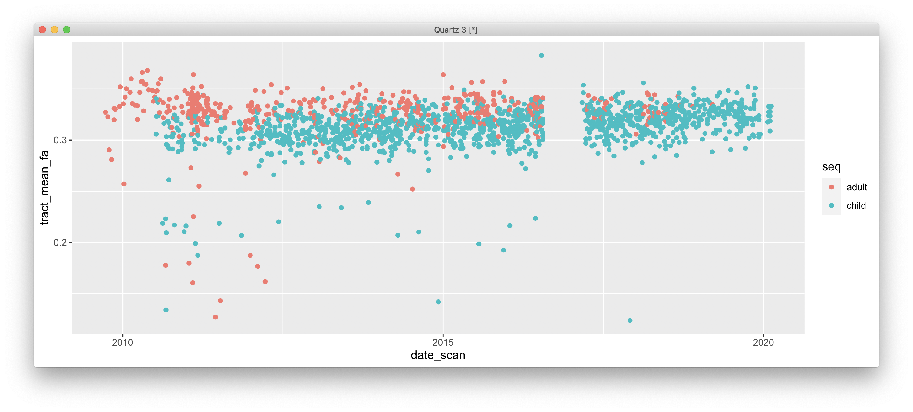

# 2021-06-04 16:06:21

Let's see if we see that bimodal pattern in the data we sent to Gang, and if
there is any correlation to when each scan happened, like the picture Marine
sent. For context, this is what Gang sent:


And this is what Marine found:


First, can we reproduce Gang's plots?

```r
ncr = read.csv('~/data/all_DTI_tracts_03222021.csv')
fa_cols = which(grepl(colnames(ncr), pattern='^FA'))
mean_fa = rowMeans(ncr[, fa_cols], na.rm=T)
plot(density(mean_fa[1:length(mean_fa)-1]))  # last value is NaN
```


Not if I look at all my data... let's double check the actual data I sent him:

```r
ncr = read.csv('~/data/long_data_for_gang_with_FAMID.csv')
mean_fa = c()
for (s in unique(ncr$SID)) {
    srows = ncr$SID == s
    mean_fa = c(mean_fa, mean(ncr[srows, 'FA'], na.rm=T))
}
plot(density(mean_fa)) 
```


Not sure where the bimodal is coming from... maybe he's plotting the entire
dataset, without the mean?

```r
plot(density(ncr$FA))
```


Yeah, that's what's going on. So, let's plot the two extremes, say left_ilf and
right_slf:

```r
plot(density(ncr[ncr$tract=='left_ilf', 'FA']), xlim=c(0, .5), ylim=c(0, 16))
lines(density(ncr[ncr$tract=='right_slf', 'FA']), col='red')
lines(density(ncr$FA), col='blue')
```

Now, the other question is whether our data has the same banding Marine
identified, regardless of atlas. Or is it TORTOISE artifact? First, let's
reproduce Marine's plots:

```r
ncr = read.csv('~/data/all_DTI_tracts_03222021.csv')
ncr = ncr[ncr$maskid != 1090, ]  # remove one scan we didn't finish processing
fa_cols = which(grepl(colnames(ncr), pattern='^FA'))
ncr$seq = 'adult'
ncr[which(ncr$numVolumes < 80), 'seq'] = 'child'
ncr$tract_mean_fa = rowMeans(ncr[, fa_cols], na.rm=T)

library(ggplot2)
ggplot(data = ncr, aes(x = maskid, y = tract_mean_fa, color=seq)) +
    geom_point()
```


That's not xactly the same plot, but at first we cannot see any terribly trends.
Let's try the actual mean_fa.

```r
ggplot(data = ncr, aes(x = maskid, y = mean_fa, color=seq)) +
    geom_point()
```


Also not terrible. What if I use the actual scan dates?

```r
scan_dates = read.csv('~/data/scan_dates.csv')
scan_dates$maskid = as.numeric(scan_dates$Mask.ID)
scan_dates$date_scan = as.Date(scan_dates$record.date.collected, "%m/%d/%Y")
m = merge(ncr, scan_dates, by='maskid', all.x=T, all.y=F)

ggplot(data = m, aes(x = date_scan, y = tract_mean_fa, color=seq)) +
    geom_point()
```



```r
ggplot(data = m, aes(x = date_scan, y = mean_fa, color=seq)) +
    geom_point()
```


Still not much... what if I only plot the second bit of the plot?


