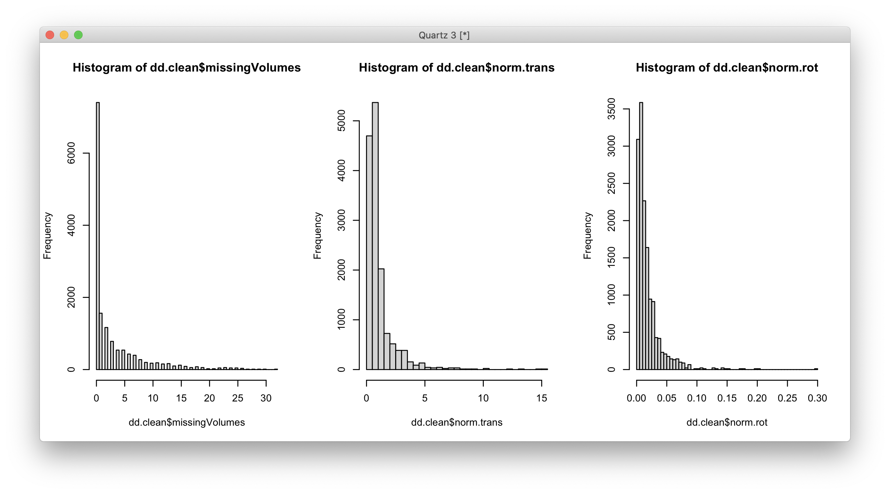
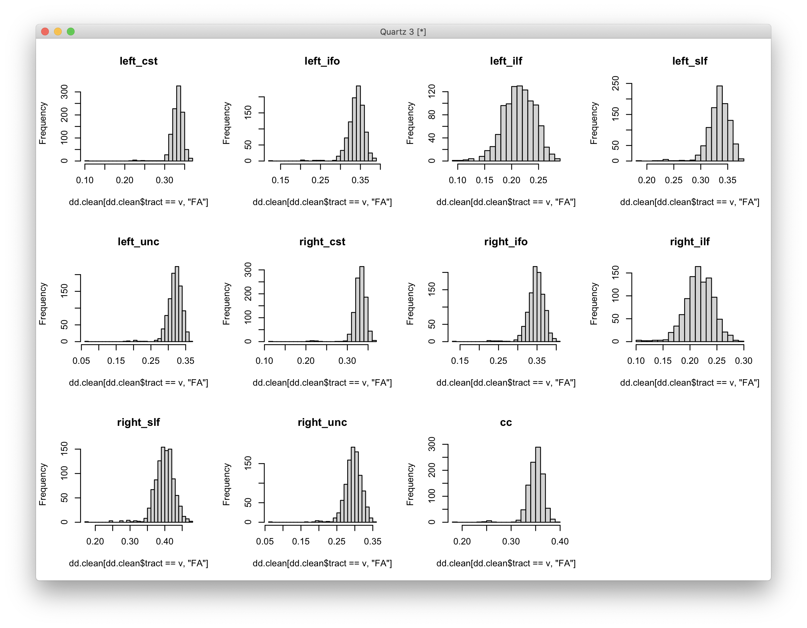
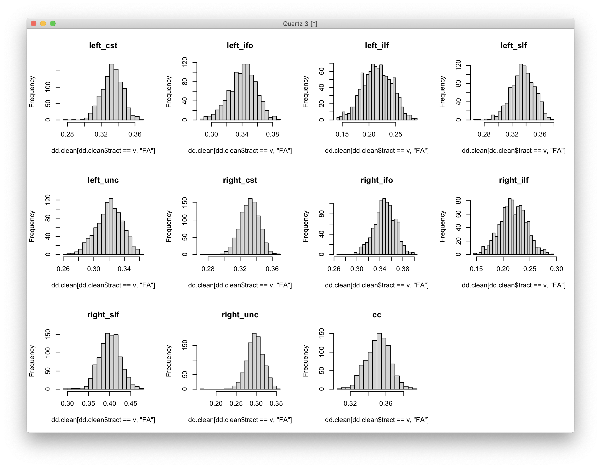
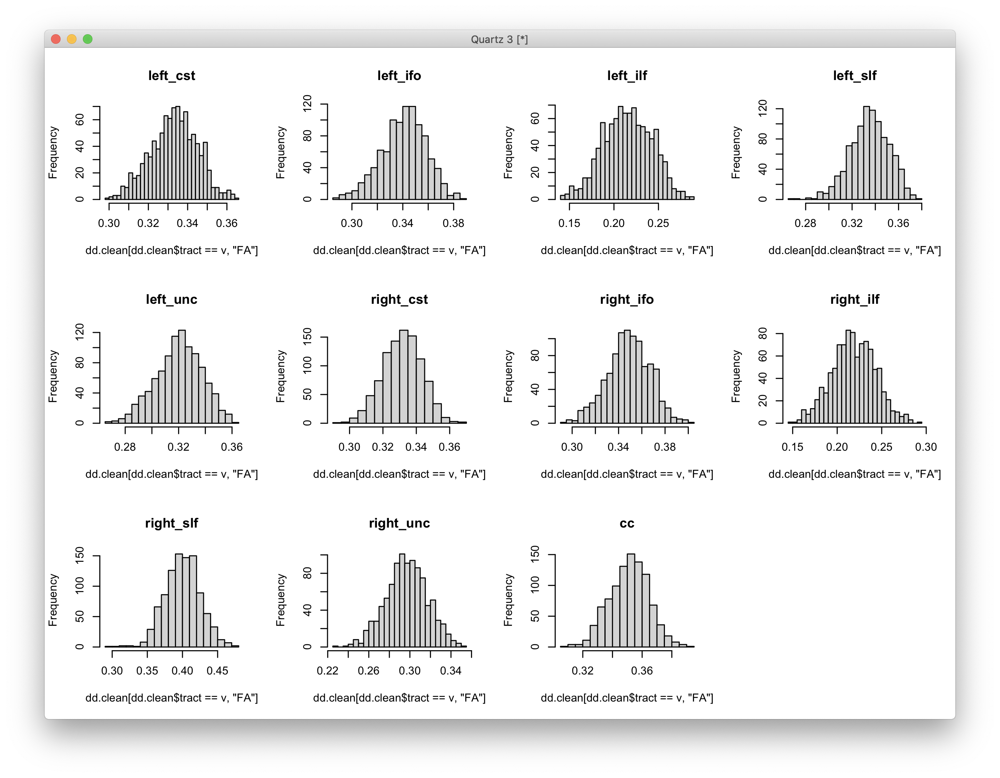

# 2021-06-08 05:58:17

Let's see what we get running the univariate analysis on the same data we sent
to Gang. First, no outlier removal. I'll even use the same code he did all the
way up until I can't anymore.

## All data, univariate, random slope and intercept

```r
dat <- read.csv('~/data/long_data_for_gang_with_FAMID.csv', header=T)
dat$famID <- as.factor(dat$famID) # 522 families
dat$SID <- as.factor(dat$SID) # 925 subjects
dd <- dat[complete.cases(dat), ] # 20053 observations remaining
dd$grp <- ifelse(dd$group=='NV', -0.5, 0.5)  # dummy code group
dd$GA <- dd$grp*dd$age_scan   # group-by-age interaction

fm_str = 'FA ~ grp+age_scan+GA+scanner_update+sex+norm.trans+norm.rot+missingVolumes+ (age_scan|famID)+(age_scan|SID)'

library(lme4)
tracts = unique(dd$tract)

this_data = dd[dd$tract == tracts[1], ]
fit = lmer(as.formula(fm_str), data=this_data, REML = FALSE)
```

I got an error running a single tract:

```
r$> fit = lmer(as.formula(fm_str), data=this_data, REML = FALSE)                          
Error: number of observations (=1823) <= number of random effects (=1834) for term (age_scan | SID); the random-effects parameters and the residual variance (or scale parameter) are probably unidentifiable
```

I wonder if adding this term in the Bayesian model could be causing those
results? Worth re-running it with and without it.

## All data, univariate, random intercept only

```r
library(car)

fm_str = '%s ~ grp+age_scan+GA+scanner_update+sex+norm.trans+norm.rot+missingVolumes+ (1|famID/SID)'

tracts = unique(dd$tract)

res = c()
for (md in c('FA', 'AD', 'RD')) {
    fm = as.formula(sprintf(fm_str, md))
    for (tr in tracts) {
        this_data = dd[dd$tract == tr, ]
        fit = lmer(fm, data=this_data, REML = FALSE)
        p = Anova(fit)
        temp = c(md, tr, p[1,3], summary(fit)$AIC[1:4], fm_str)
        res = rbind(res, temp)
    }
}
res.df = data.frame(res)
colnames(res.df) = c('prop', 'tract', 'pval_grp', 'AIC', 'BIC', 'logLik',
                     'deviance', 'formula')
write.csv(res.df, file='~/data/bayesian/univar_all_rndIntercept.csv',
          row.names=F)
```

```
r$> # quick assessment 
    res.df[res.df$pval_grp < .05, 1:3]
        prop     tract             pval_grp
temp.6    FA right_ifo   0.0128237473046893
temp.8    FA right_slf   0.0243673966451264
temp.23   RD  left_ifo  0.00694181538202031
temp.28   RD right_ifo   0.0014938787235355
temp.30   RD right_slf 0.000256452532878001
temp.31   RD right_unc  0.00163695177969821
```

## Clean data, univariate, random intercept only

Let's do some cleaning and see how that affects the univariate results. I want
to bring in the master spreadsheet so we can keep it only to 60 volumes scans.

```r
ncr = read.csv('~/data/all_DTI_tracts_03222021.csv')
ncr = ncr[ncr$maskid != 1090, ]  # remove one scan we didn't finish processing
ncr$seq = 'adult'
ncr[which(ncr$numVolumes < 80), 'seq'] = 'child'
kid_scans = ncr[ncr$seq == 'child', 'maskid']

dd.clean = dd[dd$maskid %in% kid_scans, ] # 14784 observations remaining

# some histograms to remove QC outliers
quartz()
par(mfrow = c(1,3))
hist(dd.clean$missingVolumes, breaks=50)
hist(dd.clean$norm.trans, breaks=50)
hist(dd.clean$norm.rot, breaks=50)
```

 

A bit crude, but for now this will do:

```r
keep_idx = (dd.clean$missingVolumes <= 4 & dd.clean$norm.trans <= 2.5 &
            dd.clean$norm.rot <= .04)
dd.clean = dd.clean[keep_idx,]  # 10824 observations remaining
```

Let's remove based on the data quality as well:

```r
par(mfrow=c(3, 4))
for (v in tracts) {
    hist(dd.clean[dd.clean$tract == v, 'FA'], breaks=25, main=v)
}
```



```r
keep_scans = dd.clean[dd.clean$tract=='left_unc' & dd.clean$FA > .25, 'maskid']
dd.clean = dd.clean[dd.clean$maskid %in% keep_scans,]  # 10703 observations

par(mfrow=c(3, 4))
for (v in tracts) {
    hist(dd.clean[dd.clean$tract == v, 'FA'], breaks=25, main=v)
}
```



Maybe just another one:

```r
keep_scans = dd.clean[dd.clean$tract=='right_unc' & dd.clean$FA > .22, 'maskid']
dd.clean = dd.clean[dd.clean$maskid %in% keep_scans,]  # 10692 observations
keep_scans = dd.clean[dd.clean$tract=='left_cst' & dd.clean$FA > .29, 'maskid']
dd.clean = dd.clean[dd.clean$maskid %in% keep_scans,]  # 10670 observations

par(mfrow=c(3, 4))
for (v in tracts) {
    hist(dd.clean[dd.clean$tract == v, 'FA'], breaks=25, main=v)
}
```



That looks better. Let's save it and re-run all analyses:

```r
write.csv(dd.clean, file='~/data/long_data_for_gang_with_FAMID_clean.csv',
          row.names=F)
```

```r
library(lme4)
library(car)

dat <- read.csv('~/data/long_data_for_gang_with_FAMID_clean.csv', header=T)
dat$famID <- as.factor(dat$famID) # 277 families
dat$SID <- as.factor(dat$SID) # 415 subjects
dd <- dat[complete.cases(dat), ] # 10670 observations remaining
dd$grp <- ifelse(dd$group=='NV', -0.5, 0.5)  # dummy code group
dd$GA <- dd$grp*dd$age_scan   # group-by-age interaction

tracts = unique(dd$tract)

fm_str = '%s ~ grp+age_scan+GA+scanner_update+sex+norm.trans+norm.rot+missingVolumes+ (1|famID/SID)'

res = c()
for (md in c('FA', 'AD', 'RD')) {
    fm = as.formula(sprintf(fm_str, md))
    for (tr in tracts) {
        this_data = dd[dd$tract == tr, ]
        fit = lmer(fm, data=this_data, REML = FALSE)
        p = Anova(fit)
        temp = c(md, tr, p[1,3], summary(fit)$AIC[1:4], fm_str)
        res = rbind(res, temp)
    }
}
res.df = data.frame(res)
colnames(res.df) = c('prop', 'tract', 'pval_grp', 'AIC', 'BIC', 'logLik',
                     'deviance', 'formula')
write.csv(res.df, file='~/data/bayesian/univar_clean_rndIntercept.csv',
          row.names=F)
```

```
r$> # quick assessment 
    res.df[res.df$pval_grp < .05, 1:3]
        prop     tract            pval_grp
temp      FA  left_cst  0.0146252351616683
temp.2    FA  left_ilf  0.0133132661423609
temp.7    FA right_ilf  0.0141072577552538
temp.13   AD  left_ilf 0.00051669816065722
temp.29   RD right_ilf  0.0435892170760677
temp.31   RD right_unc  0.0495423982674764
```

Results change a bit from using all data points. 

## Clean data, univariate, random intercept and slope

However, now we can actually run the random slopes as well (lots of singular fits, though):

```r
fm_str = '%s ~ grp+age_scan+GA+scanner_update+sex+norm.trans+norm.rot+missingVolumes+ (age_scan|famID/SID)'

res = c()
for (md in c('FA', 'AD', 'RD')) {
    fm = as.formula(sprintf(fm_str, md))
    for (tr in tracts) {
        this_data = dd[dd$tract == tr, ]
        fit = lmer(fm, data=this_data, REML = FALSE)
        p = Anova(fit)
        temp = c(md, tr, p[1,3], summary(fit)$AIC[1:4], fm_str)
        res = rbind(res, temp)
    }
}
res.df = data.frame(res)
colnames(res.df) = c('prop', 'tract', 'pval_grp', 'AIC', 'BIC', 'logLik',
                     'deviance', 'formula')
write.csv(res.df, file='~/data/bayesian/univar_clean_rndInterceptSlope.csv',
          row.names=F)
print(res.df[res.df$pval_grp < .05, 1:3])
```

```
        prop    tract           pval_grp
temp      FA left_cst 0.0215027658358196
temp.2    FA left_ilf 0.0199250826036848
temp.13   AD left_ilf 0.0103914545675075
```


# All data, Bayesian model, random intercept only

Let's then use Gang's code to run the Bayesian model.

# Clean data, Bayesian model, random intercept only

# Clean data, Bayesian model, random intercept and slope