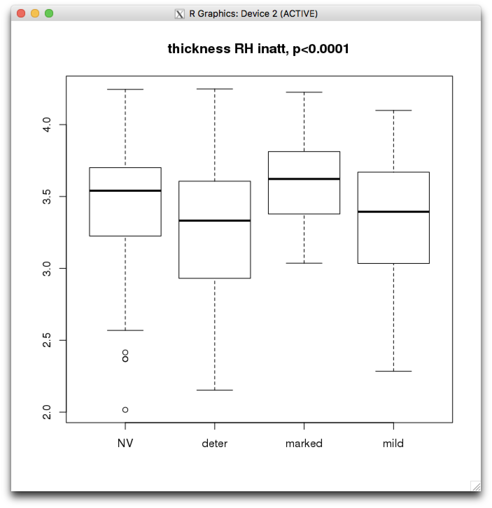
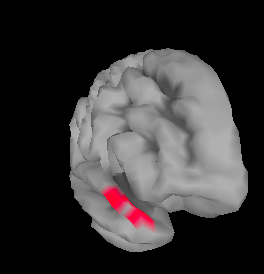

# 2019-01-14 10:07:57

After looking at the results from logistic regression using the cluster I got in
the regular regressions to OLS (see .Rmd), Philip and I decided to try to find
the clusters on the residual data. Let's do that first for structural, try to
find the clusters, and then just repeat it for the other imaging modalities.

```r
library(nlme)
mydir = '/data/NCR_SBRB/baseline_prediction/'
for (var in c('volume', 'area', 'thickness')) {
    in_fname = sprintf('%s/struct_%s_11142018_260timeDiff12mo.RData.gz',
                        mydir, var)
    print(in_fname)
    load(in_fname)
    brain_vars = colnames(data)[grepl(pattern = '^v', colnames(data))]
    clin = read.csv('/data/NCR_SBRB/baseline_prediction/long_clin_11302018.csv')
    df = merge(clin, data, by='MRN')
    qc = read.csv('/data/NCR_SBRB/baseline_prediction/master_qc.csv')
    df = merge(df, qc, by.x='mask.id', by.y='Mask.ID')
    library(gdata)
    mprage = read.xls('/data/NCR_SBRB/baseline_prediction/long_scans_08072018.xlsx',
                    sheet='mprage')
    df = merge(df, mprage, by.x='mask.id', by.y='Mask.ID...Scan')
    fm = as.formula("y ~ Sex...Subjects + ext_avg_freesurfer5.3 + int_avg_freesurfer5.3 + mprage_QC + age_at_scan + I(age_at_scan^2)")
    res = sapply(brain_vars, function(x) {
        mydata = df[, c('Sex...Subjects', 'mprage_QC', 'ext_avg_freesurfer5.3',
                        'int_avg_freesurfer5.3', 'age_at_scan', 'nuclearFamID')]
        mydata$y = df[, x];
        fit = try(lme(fm, random=~1|nuclearFamID, data=mydata, na.action=na.omit));
        if (length(fit) > 1) {
            return(as.vector(residuals(fit)))}
        else {
            return(NA)
        }})
    data[, brain_vars] = res
    out_fname = sprintf('%s/struct_%s_01142019_260timeDiff12mo_resids.RData.gz',
                        mydir, var)
    save(data, file=out_fname)
}
```

Hum... actually, I'm not sure I like this approach. We're forcing residuals in
different brain regions that don't necessarily apply to them. Maybe a better
approach is to filter out the brain based on the correllation/ANOVA results,
check what voxels are good, and residualize the cluster. Then, we can commence
the logisitc analysis.

We use ANOVA for iltering because it gives us a single p-value. Then we can
worry about which categories give decent odds ratios.

Let's run it for structural then:

```bash
job_name=categOLSstruct;
mydir=/data/NCR_SBRB/baseline_prediction/;
swarm_file=swarm.desc_${job_name};
rm -rf $swarm_file;
for f in `/bin/ls struct_*_11142018_260timeDiff12mo.RData.gz`; do
    for pp in None subjScale; do
        for target in OLS_inatt_categ OLS_HI_categ; do
            echo "Rscript --vanilla ~/research_code/baseline_prediction/descriptives/structural_anova.R ${mydir}/${f} ${mydir}/long_clin_11302018.csv ${target} 42 $pp" >> $swarm_file;
            for i in {1..250}; do
                echo "Rscript --vanilla ~/research_code/baseline_prediction/descriptives/structural_anova.R ${mydir}/${f} ${mydir}/long_clin_11302018.csv ${target} -${RANDOM} $pp" >> $swarm_file;
            done;
        done;
    done;
done
split -l 3000 $swarm_file ${job_name}_split;
for f in `/bin/ls ${job_name}_split??`; do
    echo "ERROR" > swarm_wait_${USER}
    while grep -q ERROR swarm_wait_${USER}; do
        echo "Trying $f"
        swarm -f $f -g 4 -t 2 --time 20:00 --partition norm --logdir trash_desc_${job_name} --job-name ${job_name} -m R,afni --gres=lscratch:2 2> swarm_wait_${USER};
        if grep -q ERROR swarm_wait_${USER}; then
            echo -e "\tError, sleeping..."
            sleep 10m;
        fi;
    done;
done
```

And let's see if this brings up some more DTI results as well:

```bash
job_name=categOLSdti;
mydir=/data/NCR_SBRB/baseline_prediction/;
swarm_file=swarm.desc_${job_name};
rm -rf $swarm_file;
for f in `/bin/ls dti_??_voxelwise_n2??_09212018.RData.gz`; do
    for pp in None subjScale; do
        for target in OLS_inatt_categ OLS_HI_categ; do
            echo "Rscript --vanilla ~/research_code/baseline_prediction/descriptives/dti_anova.R ${mydir}/${f} ${mydir}/long_clin_11302018.csv ${target} 42 $pp" >> $swarm_file;
            for i in {1..250}; do
                echo "Rscript --vanilla ~/research_code/baseline_prediction/descriptives/dti_anova.R ${mydir}/${f} ${mydir}/long_clin_11302018.csv ${target} -${RANDOM} $pp" >> $swarm_file;
            done;
        done;
    done;
done
split -l 3000 $swarm_file ${job_name}_split;
for f in `/bin/ls ${job_name}_split??`; do
    echo "ERROR" > swarm_wait_${USER}
    while grep -q ERROR swarm_wait_${USER}; do
        echo "Trying $f"
        swarm -f $f -g 4 -t 2 --time 30:00 --partition norm --logdir trash_desc_${job_name} --job-name ${job_name} -m R,afni --gres=lscratch:2 2> swarm_wait_${USER};
        if grep -q ERROR swarm_wait_${USER}; then
            echo -e "\tError, sleeping..."
            sleep 10m;
        fi;
    done;
done
```

And because we had so many results in fMRI, we should definitely play there too:

```bash
job_name=categOLSmelodic;
mydir=/data/NCR_SBRB/baseline_prediction/;
swarm_file=swarm.desc_${job_name};
rm -rf $swarm_file;
for f in `/bin/ls melodic_fancy_IC*12142018.RData.gz melodic_inter_IC*12142018.RData.gz`; do
    for pp in None subjScale; do
        for target in OLS_inatt_categ OLS_HI_categ; do
            echo "Rscript --vanilla ~/research_code/baseline_prediction/descriptives/melodic_anova.R ${mydir}/${f} ${mydir}/long_clin_11302018.csv ${target} 42 $pp" >> $swarm_file;
            for i in {1..250}; do
                echo "Rscript --vanilla ~/research_code/baseline_prediction/descriptives/melodic_anova.R ${mydir}/${f} ${mydir}/long_clin_11302018.csv ${target} -${RANDOM} $pp" >> $swarm_file;
            done;
        done;
    done;
done
split -l 3000 $swarm_file ${job_name}_split;
for f in `/bin/ls ${job_name}_split??`; do
    echo "ERROR" > swarm_wait_${USER}
    while grep -q ERROR swarm_wait_${USER}; do
        echo "Trying $f"
        swarm -f $f -g 8 -t 2 --time 10:00:00 --partition norm --logdir trash_desc_${job_name} --job-name ${job_name} -m R,afni --gres=lscratch:2 2> swarm_wait_${USER};
        if grep -q ERROR swarm_wait_${USER}; then
            echo -e "\tError, sleeping..."
            sleep 10m;
        fi;
    done;
done
```

## Compiling results

### structural

```bash
myfile=struct_categOLSdescriptives.txt
rm $myfile; touch $myfile;
for f in `/bin/ls /data/NCR_SBRB/tmp/struct_*_11142018_260timeDiff12mo/OLS*categ_*42_?h_ClstTable_e1_a1.0.1D`; do
    if ! grep -q 'rnd' $f; then
        # spits out each result and its top 5 clusters
        echo $f >> $myfile;
        grep -v \# $f | head -n 5 >> $myfile;
    fi
done
```

```bash
/bin/ls -1 /data/NCR_SBRB/tmp/struct_*_11142018_260timeDiff12mo/OLS*categ_*_42_?h_ClstTable_e1_a1.0.1D | grep -v rnd > result_files.txt;
sed -i -e 's/_42_lh_ClstTable_e1_a1.0.1D//g' result_files.txt;
sed -i -e 's/_42_rh_ClstTable_e1_a1.0.1D//g' result_files.txt;
for root_file in `cat result_files.txt`; do
    collect_name_lh=${root_file}_lh_top_rnd_clusters.txt;
    collect_name_rh=${root_file}_rh_top_rnd_clusters.txt;
    echo $collect_name_lh;
    echo $collect_name_rh;
    if [ -e $collect_name_lh ]; then
        rm $collect_name_lh $collect_name_rh;
    fi;
    for f in `ls ${root_file}_rnd*lh_ClstTable_e1_a1.0.1D`; do
        grep -v \# $f | head -n 1 >> $collect_name_lh;
    done
    for f in `ls ${root_file}_rnd*rh_ClstTable_e1_a1.0.1D`; do
        grep -v \# $f | head -n 1 >> $collect_name_rh;
    done
done
cd /data/NCR_SBRB/tmp
tar -zcvf struct_OLS_categ_top_rnd_clusters.tar.gz struct_*_11142018_260timeDiff12mo/OLS_*_categ*top_rnd_clusters.txt
```

Then, bring both the results and the tar.gz files locally for future storage, and:

```r
res_fname = '~/tmp/struct_categOLSdescriptives.txt'
out_file = '~/tmp/pvals_struct_categOLSdescriptives.txt'
res_lines = readLines(res_fname)
for (line in res_lines) {
  # starting new file summary
  if (grepl(pattern='data', line)) {
    root_fname = strsplit(line, '/')[[1]]
    dir_name = root_fname[length(root_fname)-1]
    root_fname = strsplit(root_fname[length(root_fname)], '_')[[1]]
    root_fname = paste0(root_fname[1:(length(root_fname)-5)], sep='', collapse='_')
    if (grepl(pattern='lh', line)) {
      rnd_fname = sprintf('~/tmp/%s/%s_lh_top_rnd_clusters.txt', dir_name, root_fname)
    } else {
      rnd_fname = sprintf('~/tmp/%s/%s_rh_top_rnd_clusters.txt', dir_name, root_fname)
    }
    if (file.exists(rnd_fname)) {
        rnd_results = read.table(rnd_fname)[, 3]
        nperms = length(rnd_results)
    } else {
        rnd_results = NA
        nperms = NA
    }
    if (grepl(pattern='lh', line)) {
      cat(sprintf('%s (LH): %s (%d perms)\n', dir_name, root_fname, nperms),
          file=out_file, append=T)
    } else {
      cat(sprintf('%s (RH): %s (%d perms)\n', dir_name, root_fname, nperms),
          file=out_file, append=T)
    }
  } 
  else {
    parsed = strsplit(line, ' +')
    clus_size = as.numeric(parsed[[1]][4])
    pval = sum(rnd_results >= clus_size) / nperms
    cat(sprintf('Cluster size: %.2f, p<%.3f', clus_size, pval),
        file=out_file, append=T)
    if ( !is.na(pval) && pval < .05) {
      cat(' *', file=out_file, append=T)
    }
    if ( !is.na(pval) && pval < .01) {
      cat('*', file=out_file, append=T)
    }
    cat('\n', file=out_file, append=T)
  }
}
```

```bash
HG-01982271-LM1:tmp sudregp$ grep -B 1 "*" pvals_struct_categOLSdescriptives.txt
struct_thickness_11142018_260timeDiff12mo (RH): OLS_inatt_categ_None (249 perms)
Cluster size: 513.80, p<0.012 *
--
struct_thickness_11142018_260timeDiff12mo (RH): OLS_inatt_categ_subjScale (248 perms)
Cluster size: 580.47, p<0.000 **
```

The subjScale result is a bit better, but let's see if this pattern remains
across modalities before going further with it. Interestingly, we didn't see
anything in volume or area, only thickness.

## DTI

```bash
myfile=dti_categOLSdescriptives.txt
rm $myfile; touch $myfile;
for f in `/bin/ls \
    /data/NCR_SBRB/tmp/dti_??_voxelwise_n2??_09212018/OLS*categ*_42_clusters.txt`; do
    echo $f >> $myfile;
    grep -v \# $f | head -n 5 >> $myfile;
done
```

```bash
/bin/ls -1 /data/NCR_SBRB/tmp/dti_??_voxelwise_n2??_09212018/OLS*categ*_42_clusters.txt > result_files.txt;
for root_file in `cat result_files.txt | sed -e 's/_42_clusters.txt//g'`; do
    collect_name=${root_file}_top_rnd_clusters.txt;
    echo $collect_name;
    if [ -e $collect_name ]; then
        rm $collect_name;
    fi;
    for f in `ls ${root_file}*rnd*clusters.txt`; do
        grep -v \# $f | head -n 1 >> $collect_name;
    done
done
cd /data/NCR_SBRB/tmp/
tar -zcvf dti_OLS_categ_top_rnd_clusters.tar.gz dti_??_voxelwise_n2??_09212018/OLS*categ*top_rnd_clusters.txt
```

```r
res_fname = '~/tmp/dti_categOLSdescriptives.txt'
out_file = '~/tmp/pvals_dti_categOLSdescriptives.txt'
res_lines = readLines(res_fname)
for (line in res_lines) {
  # starting new file summary
  if (grepl(pattern='clusters', line)) {
    root_fname = strsplit(line, '/')[[1]]
    dir_name = root_fname[length(root_fname)-1]
    root_fname = strsplit(root_fname[length(root_fname)], '_')[[1]]
    root_fname = paste0(root_fname[1:(length(root_fname)-2)], sep='', collapse='_')
    rnd_fname = sprintf('~/tmp/%s/%s_top_rnd_clusters.txt', dir_name, root_fname)
    if (file.exists(rnd_fname)) {
        rnd_results = read.table(rnd_fname)[, 1]
        nperms = length(rnd_results)
    } else {
        rnd_results = NA
        nperms = NA
    }
    cat(sprintf('%s: %s (%d perms)\n', dir_name, root_fname, nperms),
        file=out_file, append=T)
  } 
  else {
    parsed = strsplit(line, ' +')
    clus_size = as.numeric(parsed[[1]][2])
    pval = sum(rnd_results >= clus_size) / nperms
    cat(sprintf('Cluster size: %d, p<%.3f', clus_size, pval),
        file=out_file, append=T)
    if (!is.na(pval) && pval < .05) {
      cat(' *', file=out_file, append=T)
    }
    if (!is.na(pval) && pval < .01) {
      cat('*', file=out_file, append=T)
    }
    cat('\n', file=out_file, append=T)
  }
}
```

```bash
HG-01982271-LM1:tmp sudregp$ grep -B 1 "*" pvals_dti_categOLSdescriptives.txt
dti_ad_voxelwise_n223_09212018: OLS_inatt_categ_None (250 perms)
Cluster size: 31, p<0.044 *
```

Unfortunately not much going on in DTI. Maybe if we run more permutations...
let's wait to do that after we residualize the cluster results. We should
eventually visualize them too.


# 2019-01-15 12:19:18

Had to re-run melodic because many of them were killed due to lack of time.
Increased it from 5 to 10h.

# 2019-01-17 11:57:02

```bash
myfile=melodic_categOLSdescriptives.txt
rm $myfile; touch $myfile;
for f in `/bin/ls \
    /data/NCR_SBRB/tmp/melodic_*IC*/OLS*categ*_42_clusters.txt`; do
    echo $f >> $myfile;
    grep -v \# $f | head -n 5 >> $myfile;
done
```

```bash
/bin/ls -1 /data/NCR_SBRB/tmp/melodic_*_IC*/OLS*categ*_42_clusters.txt > result_files.txt;
for root_file in `cat result_files.txt | sed -e 's/_42_clusters.txt//g'`; do
    collect_name=${root_file}_top_rnd_clusters.txt;
    echo $collect_name;
    if [ -e $collect_name ]; then
        rm $collect_name;
    fi;
    for f in `ls ${root_file}*rnd*clusters.txt`; do
        grep -v \# $f | head -n 1 >> $collect_name;
    done
done
tar -zcvf melodic_OLS_categ_top_rnd_clusters.tar.gz melodic_*_IC*/OLS*categ*top_rnd_clusters.txt
```

```r
res_fname = '~/tmp/melodic_categOLSdescriptives.txt'
out_file = '~/tmp/pvals_melodic_categOLSdescriptives.txt'
res_lines = readLines(res_fname)
for (line in res_lines) {
  # starting new file summary
  if (grepl(pattern='clusters', line)) {
    root_fname = strsplit(line, '/')[[1]]
    dir_name = root_fname[length(root_fname)-1]
    root_fname = strsplit(root_fname[length(root_fname)], '_')[[1]]
    root_fname = paste0(root_fname[1:(length(root_fname)-2)], sep='', collapse='_')
    rnd_fname = sprintf('~/tmp/%s/%s_top_rnd_clusters.txt', dir_name, root_fname)
    if (file.exists(rnd_fname)) {
        rnd_results = read.table(rnd_fname)[, 1]
        nperms = length(rnd_results)
    } else {
        rnd_results = NA
        nperms = NA
    }
    cat(sprintf('%s: %s (%d perms)\n', dir_name, root_fname, nperms),
        file=out_file, append=T)
  } 
  else {
    parsed = strsplit(line, ' +')
    clus_size = as.numeric(parsed[[1]][2])
    pval = sum(rnd_results >= clus_size) / nperms
    cat(sprintf('Cluster size: %d, p<%.3f', clus_size, pval),
        file=out_file, append=T)
    if (!is.na(pval) && pval < .05) {
      cat(' *', file=out_file, append=T)
    }
    if (!is.na(pval) && pval < .01) {
      cat('*', file=out_file, append=T)
    }
    cat('\n', file=out_file, append=T)
  }
}
```

```
(base) sudregp@HG-02070684-DM2:~/tmp$ grep -B 1 "*" pvals_melodic_categOLSdescriptives.txt 
melodic_fancy_IC54_12142018: OLS_inatt_categ_subjScale (88 perms)
Cluster size: 93, p<0.045 *
--
melodic_inter_IC2_12142018: OLS_HI_categ_None (496 perms)
Cluster size: 144, p<0.038 *
--
melodic_inter_IC31_12142018: OLS_inatt_categ_None (499 perms)
Cluster size: 263, p<0.000 **
```

Wel, the intersection mask is good enough. And we get DMN (IC2) and limbic
(IC31), also not bad, but we do need to check where the clusters are.  

# 2019-01-23 13:43:02

Let's check the cluster locations and their scatterplots before we combine them
for single cluster decoding.

# structural

So, the only result is:

struct_thickness_11142018_260timeDiff12mo (RH): OLS_inatt_categ_None (249 perms)
Cluster size: 513.80, p<0.012 *

```bash
awk 'NR>=13 && NR<2575' /data/NCR_SBRB/tmp/struct_thickness_11142018_260timeDiff12mo/OLS_inatt_categ_None_42_rh_ClstMsk_e1_a1.0.niml.dset > ~/tmp/clusters.txt
```

```r
clin = read.csv('/data/NCR_SBRB/baseline_prediction/long_clin_11302018.csv')
load('/data/NCR_SBRB/baseline_prediction/struct_thickness_11142018_260timeDiff12mo.RData.gz')
df = merge(clin, data, by='MRN')
df$OLS_inatt_categ = NULL
df[df$OLS_inatt_slope <= -.33, 'OLS_inatt_categ'] = 'marked'
df[df$OLS_inatt_slope > -.33 & df$OLS_inatt_slope <= 0, 'OLS_inatt_categ'] = 'mild'
df[df$OLS_inatt_slope > 0, 'OLS_inatt_categ'] = 'deter'
df[df$DX == 'NV', 'OLS_inatt_categ'] = 'NV'
df$OLS_inatt_categ = as.factor(df$OLS_inatt_categ)
df$OLS_inatt_categ = relevel(df$OLS_inatt_categ, ref='NV')
x = colnames(df)[grepl(pattern = '^v_rh', colnames(df))]
a = read.table('~/tmp/clusters.txt')[,1]
idx = which(a==1)
mycluster = rowMeans(df[, x[idx]])
fm = as.formula(mycluster ~ df$OLS_inatt_categ)
fit = aov(lm(fm))
boxplot(fm)
title(sprintf('thickness RH inatt, p<%.4f', summary(fit)[[1]][1, 'Pr(>F)']))
```



Nice pattern with marked improvement approaching NVs. But keep in mind that it
means that the region in the brain already looks like NVs at baseline... protective?

```bash
awk 'NR>=13 && NR<2575' ~/tmp/struct_thickness_11142018_260timeDiff12mo/OLS_inatt_categ_None_42_rh_ClstMsk_e1_a1.0.niml.dset > ~/tmp/clusters.txt
# single out the one region
awk '{ if ($1 != 1 ) print 0; else print 1 }' ~/tmp/clusters.txt > rh_inatt.txt
# in Lubuntu
suma -i_fs /Volumes/Shaw/freesurfer5.3_subjects/fsaverage4/SUMA/rh.pial.asc
```



Not a particularly good location, though. 

