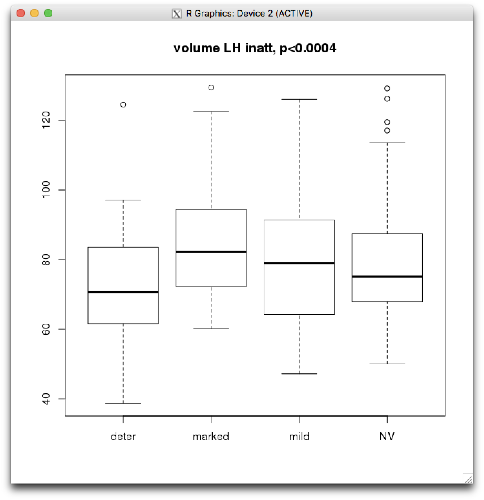

# 2019-01-24 10:51:05

Philip suggested I should try grouping the results I had using OLS regressions
into the 4 groups, and see if there is any difference there.

## structural

I'll start with the ACC result:

```bash
awk 'NR>=13 && NR<2575' /data/NCR_SBRB/tmp/struct_volume_11142018_260timeDiff12mo/ADHDNOS_OLS_inatt_slope_winsorize_None_42_lh_ClstMsk_e1_a1.0.niml.dset > vol_inatt_lh.txt
```

```r
clin = read.csv('/data/NCR_SBRB/baseline_prediction/long_clin_11302018.csv')
load('/data/NCR_SBRB/baseline_prediction/struct_volume_11142018_260timeDiff12mo.RData.gz')
df = merge(clin, data, by='MRN')
x = colnames(df)[grepl(pattern = '^v_lh', colnames(df))]
a = read.table('~/tmp/vol_inatt_lh.txt')[,1]
idx = which(a==1)
df$OLS_inatt_categ = NULL
df[df$OLS_inatt_slope <= -.33, 'OLS_inatt_categ'] = 'marked'
df[df$OLS_inatt_slope > -.33 & df$OLS_inatt_slope <= 0, 'OLS_inatt_categ'] = 'mild'
df[df$OLS_inatt_slope > 0, 'OLS_inatt_categ'] = 'deter'
df[df$DX == 'NV', 'OLS_inatt_categ'] = 'NV'
df$OLS_inatt_categ = as.factor(df$OLS_inatt_categ)
mycluster = rowMeans(df[, x[idx]])
fm = as.formula(mycluster ~ df$OLS_inatt_categ)
fit = aov(lm(fm))
boxplot(fm)
title(sprintf('volume LH inatt, p<%.4f', summary(fit)[[1]][1, 'Pr(>F)']))
```



So the ANOVA looks good, but do I need to residualize this cluster before
proceeding? Also, note that this plot includes the new_onsets! But the results
without them are comparable.

So, the reasoning would be: say ADHD moves more than NVs. So, regardless of
brain phenotype being used, if we do movement ~ DX it would be significant. But
we can remove the contributions of movement to brain phenotype. Then, if we're
trying to predict DX, then we'd be using a movement-free brain phenotype.

```r
# switching to Desktop
x = colnames(df)[grepl(pattern = '^v_lh', colnames(df))]
a = read.table('~/tmp/vol_inatt_lh.txt')[,1]
idx = which(a==1)
for (t in c('age_at_scan', 'I(age_at_scan^2)', 'ext_avg_freesurfer5.3', 'int_avg_freesurfer5.3', 'mprage_QC', 'as.numeric(Sex...Subjects)')) {
  fm_str = sprintf('df$%s ~ mycluster', t)
  print(fm_str)
  print(summary(aov(lm(as.formula(fm_str), data=df))))
}
```

I'm going to move this back to an R notebook because it makes more sense to save
the images there.

# TODO
* check if ANOVAs still hold after residualizing
* check logistic regression results
* apply same strategy for other imaging modalities