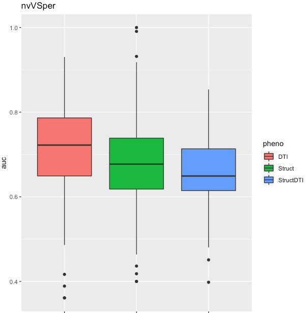
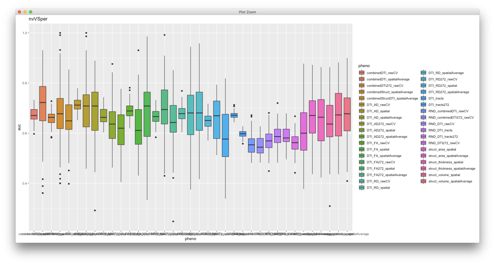
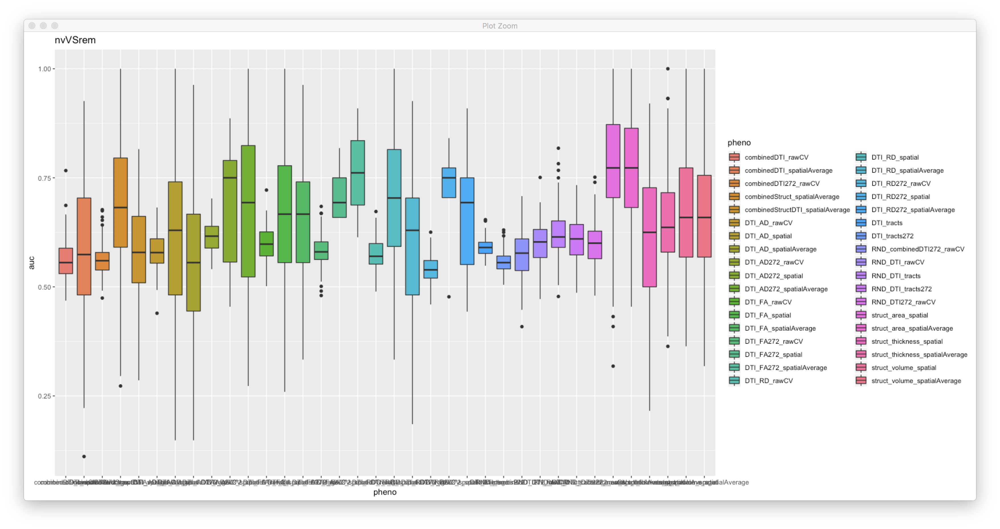
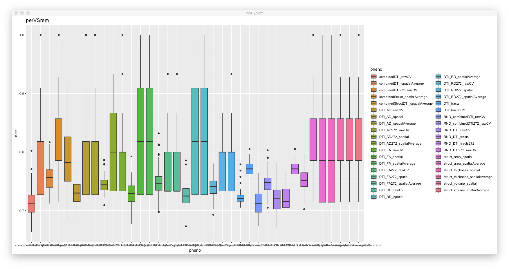
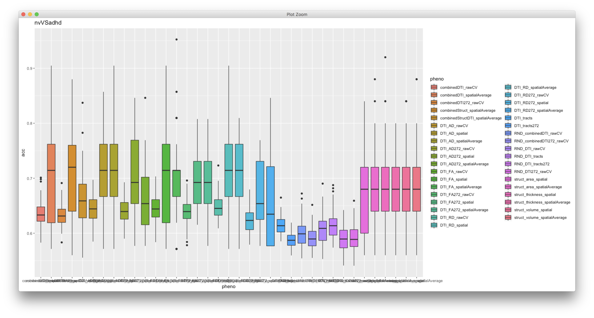

# 2018-11-09 15:51:33

This is the first try combining data cross domains. Let's reduce the variables before we do anything, but we should try it differently later. Also, let's combine everything we have, and we can tailor it down later.

```bash
job_name=combineStructDTI_spatialAvgTestDL;
mydir=/data/NCR_SBRB/baseline_prediction/;
swarm_file=swarm.automl_${job_name};
rm -rf $swarm_file;
f="${mydir}/struct_thickness_09192018_260timeDiff12mo.RData.gz,${mydir}/struct_area_09192018_260timeDiff12mo.RData.gz,${mydir}/struct_volume_09192018_260timeDiff12mo.RData.gz,${mydir}/dti_fa_voxelwise_n223_09212018.RData.gz,${mydir}/dti_ad_voxelwise_n223_09212018.RData.gz,${mydir}/dti_rd_voxelwise_n223_09212018.RData.gz";
mincluster='35,35,35,8,8,8'
for target in nvVSper nvVSrem perVSrem nvVSadhd; do
    for i in {1..100}; do
        echo "Rscript --vanilla ~/research_code/automl/uni_spatialAverage_multiDomain_test_autoValidation_DL.R $f ${mydir}/long_clin_0918.csv ${target} ${mydir}/models_spatial_across_DL/${USER} $RANDOM $mincluster" >> $swarm_file;
    done;
done
sed -i -e "s/^/unset http_proxy; /g" $swarm_file;
swarm -f $swarm_file -g 40 -t 16 --time 6:00:00 --partition norm --logdir trash_${job_name} --job-name ${job_name} -m R,afni --gres=lscratch:10 2> swarm_wait_${USER};
```

But of course we should look into combining just within domain for comparison:

```bash
job_name=combineStruct_spatialAvgTestDL;
mydir=/data/NCR_SBRB/baseline_prediction/;
swarm_file=swarm.automl_${job_name};
rm -rf $swarm_file;
f="${mydir}/struct_thickness_09192018_260timeDiff12mo.RData.gz,${mydir}/struct_area_09192018_260timeDiff12mo.RData.gz,${mydir}/struct_volume_09192018_260timeDiff12mo.RData.gz";
mincluster='35,35,35'
for target in nvVSper nvVSrem perVSrem nvVSadhd; do
    for i in {1..100}; do
        echo "Rscript --vanilla ~/research_code/automl/uni_spatialAverage_multiDomain_test_autoValidation_DL.R $f ${mydir}/long_clin_0918.csv ${target} ${mydir}/models_spatial_across_DL/${USER} $RANDOM $mincluster" >> $swarm_file;
    done;
done
sed -i -e "s/^/unset http_proxy; /g" $swarm_file;
swarm -f $swarm_file -g 40 -t 16 --time 6:00:00 --partition norm --logdir trash_${job_name} --job-name ${job_name} -m R,afni --gres=lscratch:10 2> swarm_wait_${USER};
```

```bash
job_name=combineDTI_spatialAvgTestDL;
mydir=/data/NCR_SBRB/baseline_prediction/;
swarm_file=swarm.automl_${job_name};
rm -rf $swarm_file;
f="${mydir}/dti_fa_voxelwise_n223_09212018.RData.gz,${mydir}/dti_ad_voxelwise_n223_09212018.RData.gz,${mydir}/dti_rd_voxelwise_n223_09212018.RData.gz";
mincluster='8,8,8'
for target in nvVSper nvVSrem perVSrem nvVSadhd; do
    for i in {1..100}; do
        echo "Rscript --vanilla ~/research_code/automl/uni_spatialAverage_multiDomain_test_autoValidation_DL.R $f ${mydir}/long_clin_0918.csv ${target} ${mydir}/models_spatial_across_DL/${USER} $RANDOM $mincluster" >> $swarm_file;
    done;
done
sed -i -e "s/^/unset http_proxy; /g" $swarm_file;
swarm -f $swarm_file -g 40 -t 16 --time 6:00:00 --partition norm --logdir trash_${job_name} --job-name ${job_name} -m R,afni --gres=lscratch:10 2> swarm_wait_${USER};
```

# 2018-11-13 13:43:57

Let's evaluate the results:

```bash
echo "target,pheno,var,seed,nfeat,model,auc,f1,acc,ratio" > combinedSpatialAverageTest_summary.csv;
for dir in DTI Struct StructDTI; do
    echo $dir;
    for f in `ls -1 trash_combine${dir}_spatialAvgTestDL/*o`; do
        phen=$dir;
        target=`head -n 2 $f | tail -1 | awk '{FS=" "; print $9}'`;
        seed=`head -n 2 $f | tail -1 | awk '{FS=" "; print $11}'`;
        var=`head -n 2 $f | tail -1 | awk '{FS=" "; print $6}' | cut -d"/" -f 4 | sed -e "s/\.R//g"`;
        model=`grep -A 1 model_id $f | tail -1 | awk '{FS=" "; print $2}' | cut -d"_" -f 1`;
        auc=`grep -A 1 model_id $f | tail -1 | awk '{FS=" "; print $3}'`;
        nfeat=`grep "Running model on" $f | awk '{FS=" "; print $5}'`;
        ratio=`grep -A 1 "Class distribution" $f | tail -1 | awk '{FS=" "; {for (i=2; i<=NF; i++) printf $i ";"}}'`;
        f1=`grep -A 2 "Maximum Metrics:" $f | tail -1 | awk '{FS=" "; print $5}'`;
        acc=`grep -A 5 "Maximum Metrics:" $f | tail -1 | awk '{FS=" "; print $5}'`;
        echo $target,$phen,$var,$seed,$nfeat,$model,$auc,$f1,$acc,$ratio >> combinedSpatialAverageTest_summary.csv;
    done;
done;
```




## State of the union

It's wise to create some plots that combine where we are in all our experiments.
Of interest here, we should plot within domain (spatial, spatial average, raw),
then across domain. Let's do every target for AUC and accuracy.

I don't think it's necessary to include the other failed attempts of
dimensionality reduction. The only other thing after this will be adding in
rsFMRI.

```r
> data = read.csv('~/Documents/baseline_prediction/summary_11132018.csv')
> target='nvVSper'
> p1<-ggplot(data[data$target == target,], aes(x=pheno, y=auc, fill=pheno))
> print(p1+geom_boxplot() + ggtitle(target))
```







And these are for accuracy:







OK, so what are the main points?

 * rawCV has way smaller variance than using a test set. The median using a test
   set might actually be higher, but we'd need to find a better ratio for
   test/train, which might reduce the median even further.
 * we need to test a combined version for rawCV, but it doesn't run for struct,
   so we'd need to downsample that first.
 * if we selected trully good clusters, would it make a difference in the variance?
 * there isn't much of a difference between spatial and spatialAverage.
 * combining structural and DTI after spatialaverage actually didn't help. 

What if I switched strategies? Basically, make it into a neuroimaging study,
using either 3dClustSim or, ideally, permutations to get only good clusters.
Then use those clusters for the entire dataset, produce the best model we can
with that (cheating, but we're upfront about it), and then actually test it on a
new dataset Wendy is putting together? The trick here is the case when no
significant cluster comes up. We might need to play with thereholds there. Or
maybe go back to running older tests, instead of pairwise as we're doing now.

