# 2018-12-10 10:51:50

BAsed on my latest thoughts from robust_descriptives.md last Friday, let's
include ADHD_NOS in our analysis, and re-run some of the results.

```bash
job_name=NOSstruct;
mydir=/data/NCR_SBRB/baseline_prediction/;
swarm_file=swarm.desc_${job_name};
rm -rf $swarm_file;
for f in `/bin/ls struct_*_11142018_260timeDiff12mo.RData.gz`; do
    for nn in nonew_ ''; do
        for pp in None subjScale; do
            for target in OLS_inatt_slope OLS_HI_slope; do
                echo "Rscript --vanilla ~/research_code/baseline_prediction/descriptives/structural.R ${mydir}/${f} ${mydir}/long_clin_11302018.csv ADHDNOS_${nn}${target} 42 winsorize_$pp" >> $swarm_file;
                for i in {1..250}; do
                    echo "Rscript --vanilla ~/research_code/baseline_prediction/descriptives/structural.R ${mydir}/${f} ${mydir}/long_clin_11302018.csv ADHDNOS_${nn}${target} -${RANDOM} winsorize_$pp" >> $swarm_file;
                done;
            done;
        done;
    done;
done
split -l 3000 $swarm_file ${job_name}_split;
for f in `/bin/ls ${job_name}_split??`; do
    echo "ERROR" > swarm_wait_${USER}
    while grep -q ERROR swarm_wait_${USER}; do
        echo "Trying $f"
        swarm -f $f -g 4 -t 2 --time 30:00 --partition norm --logdir trash_desc_${job_name} --job-name ${job_name} -m R,afni --gres=lscratch:2 2> swarm_wait_${USER};
        if grep -q ERROR swarm_wait_${USER}; then
            echo -e "\tError, sleeping..."
            sleep 10m;
        fi;
    done;
done
```

And let's see if this brings up some more DTI results as well:

```bash
job_name=NOSdti;
mydir=/data/NCR_SBRB/baseline_prediction/;
swarm_file=swarm.desc_${job_name};
rm -rf $swarm_file;
for f in `/bin/ls dti_??_voxelwise_n2??_09212018.RData.gz`; do
    for nn in nonew_ ''; do
        for pp in None subjScale; do
            for target in OLS_inatt_slope OLS_HI_slope; do
                echo "Rscript --vanilla ~/research_code/baseline_prediction/descriptives/dti.R ${mydir}/${f} ${mydir}/long_clin_11302018.csv ADHDNOS_${nn}${target} 42 winsorize_$pp" >> $swarm_file;
                for i in {1..250}; do
                    echo "Rscript --vanilla ~/research_code/baseline_prediction/descriptives/dti.R ${mydir}/${f} ${mydir}/long_clin_11302018.csv ADHDNOS_${nn}${target} -${RANDOM} winsorize_$pp" >> $swarm_file;
                done;
            done;
        done;
    done;
done
split -l 3000 $swarm_file ${job_name}_split;
for f in `/bin/ls ${job_name}_split??`; do
    echo "ERROR" > swarm_wait_${USER}
    while grep -q ERROR swarm_wait_${USER}; do
        echo "Trying $f"
        swarm -f $f -g 4 -t 2 --time 30:00 --partition norm --logdir trash_desc_${job_name} --job-name ${job_name} -m R,afni --gres=lscratch:2 2> swarm_wait_${USER};
        if grep -q ERROR swarm_wait_${USER}; then
            echo -e "\tError, sleeping..."
            sleep 10m;
        fi;
    done;
done
```

And because we had so many results in fMRI, we should definitely play there too:

```bash
job_name=NOSmelodic;
mydir=/data/NCR_SBRB/baseline_prediction/;
swarm_file=swarm.desc_${job_name};
rm -rf $swarm_file;
for f in `/bin/ls melodic_fancy_IC*12142018.RData.gz melodic_inter_IC*12142018.RData.gz`; do
    for nn in nonew_ ''; do
        for pp in None subjScale; do
            for target in OLS_inatt_slope OLS_HI_slope; do
                echo "Rscript --vanilla ~/research_code/baseline_prediction/descriptives/melodic.R ${mydir}/${f} ${mydir}/long_clin_11302018.csv ADHDNOS_${nn}${target} 42 winsorize_$pp" >> $swarm_file;
                for i in {1..250}; do
                    echo "Rscript --vanilla ~/research_code/baseline_prediction/descriptives/melodic.R ${mydir}/${f} ${mydir}/long_clin_11302018.csv ADHDNOS_${nn}${target} -${RANDOM} winsorize_$pp" >> $swarm_file;
                done;
            done;
        done;
    done;
done
split -l 3000 ${swarm_file} ${job_name}_split;
for f in `/bin/ls ${job_name}_split??`; do
    echo "ERROR" > swarm_wait_${USER}
    while grep -q ERROR swarm_wait_${USER}; do
        echo "Trying $f"
        swarm -f $f -g 8 -t 2 --time 5:00:00 --partition norm --logdir trash_desc_${job_name} --job-name ${job_name} -m R,afni 2> swarm_wait_${USER};
        if grep -q ERROR swarm_wait_${USER}; then
            echo -e "\tError, sleeping..."
            sleep 10m;
        fi;
    done;
done
```

## Compiling results

### structural

```bash
myfile=struct_NOSdescriptives.txt
rm $myfile; touch $myfile;
for f in `/bin/ls /data/NCR_SBRB/tmp/struct_*_11142018_260timeDiff12mo/ADHDNOS*_42_?h_ClstTable_e1_a1.0.1D`; do
    if ! grep -q 'rnd' $f; then
        echo $f >> $myfile;
        grep -v \# $f | head -n 5 >> $myfile;
    fi
done
```

```bash
/bin/ls -1 /data/NCR_SBRB/tmp/struct_*_11142018_260timeDiff12mo/ADHDNOS*_42_?h_ClstTable_e1_a1.0.1D | grep -v rnd > result_files.txt;
sed -i -e 's/_42_lh_ClstTable_e1_a1.0.1D//g' result_files.txt;
sed -i -e 's/_42_rh_ClstTable_e1_a1.0.1D//g' result_files.txt;
for root_file in `cat result_files.txt`; do
    collect_name_lh=${root_file}_lh_top_rnd_clusters.txt;
    collect_name_rh=${root_file}_rh_top_rnd_clusters.txt;
    echo $collect_name_lh;
    echo $collect_name_rh;
    if [ -e $collect_name_lh ]; then
        rm $collect_name_lh $collect_name_rh;
    fi;
    for f in `ls ${root_file}_rnd*lh_ClstTable_e1_a1.0.1D`; do
        grep -v \# $f | head -n 1 >> $collect_name_lh;
    done
    for f in `ls ${root_file}_rnd*rh_ClstTable_e1_a1.0.1D`; do
        grep -v \# $f | head -n 1 >> $collect_name_rh;
    done
done
tar -zcvf struct_ADHDNOS_top_rnd_clusters.tar.gz struct_*_11142018_260timeDiff12mo/ADHDNOS*top_rnd_clusters.txt
```

```r
res_fname = '~/tmp/struct_NOSdescriptives.txt'
out_file = '~/tmp/pvals_NOSstruct.txt'
res_lines = readLines(res_fname)
for (line in res_lines) {
  # starting new file summary
  if (grepl(pattern='data', line)) {
    root_fname = strsplit(line, '/')[[1]]
    dir_name = root_fname[length(root_fname)-1]
    root_fname = strsplit(root_fname[length(root_fname)], '_')[[1]]
    root_fname = paste0(root_fname[1:(length(root_fname)-5)], sep='', collapse='_')
    if (grepl(pattern='lh', line)) {
      rnd_fname = sprintf('~/tmp/%s/%s_lh_top_rnd_clusters.txt', dir_name, root_fname)
    } else {
      rnd_fname = sprintf('~/tmp/%s/%s_rh_top_rnd_clusters.txt', dir_name, root_fname)
    }
    if (file.exists(rnd_fname)) {
        rnd_results = read.table(rnd_fname)[, 3]
        nperms = length(rnd_results)
    } else {
        rnd_results = NA
        nperms = NA
    }
    if (grepl(pattern='lh', line)) {
      cat(sprintf('%s (LH): %s (%d perms)\n', dir_name, root_fname, nperms),
          file=out_file, append=T)
    } else {
      cat(sprintf('%s (RH): %s (%d perms)\n', dir_name, root_fname, nperms),
          file=out_file, append=T)
    }
  } 
  else {
    parsed = strsplit(line, ' +')
    clus_size = as.numeric(parsed[[1]][4])
    pval = sum(rnd_results >= clus_size) / nperms
    cat(sprintf('Cluster size: %.2f, p<%.3f', clus_size, pval),
        file=out_file, append=T)
    if ( !is.na(pval) && pval < .05) {
      cat(' *', file=out_file, append=T)
    }
    if ( !is.na(pval) && pval < .01) {
      cat('*', file=out_file, append=T)
    }
    cat('\n', file=out_file, append=T)
  }
}
```

```bash
sudregp@HG-02070684-DM2:~/tmp$ grep -B 1 "*" pvals_NOSstruct.txt
struct_area_11142018_260timeDiff12mo (RH): ADHDNOS_nonew_OLS_HI_slope_winsorize_None (249 perms)
Cluster size: 1015.21, p<0.008 **
--
struct_area_11142018_260timeDiff12mo (RH): ADHDNOS_nonew_OLS_HI_slope_winsorize_subjScale (249 perms)
Cluster size: 751.57, p<0.008 **
--
struct_area_11142018_260timeDiff12mo (LH): ADHDNOS_OLS_inatt_slope_winsorize_None (248 perms)
Cluster size: 1098.04, p<0.016 *
Cluster size: 825.97, p<0.040 *
--
struct_thickness_11142018_260timeDiff12mo (LH): ADHDNOS_OLS_inatt_slope_winsorize_None (249 perms)
Cluster size: 306.69, p<0.032 *
--
struct_thickness_11142018_260timeDiff12mo (LH): ADHDNOS_OLS_inatt_slope_winsorize_subjScale (250 perms)
Cluster size: 372.06, p<0.020 *
--
struct_volume_11142018_260timeDiff12mo (RH): ADHDNOS_nonew_OLS_HI_slope_winsorize_None (250 perms)
Cluster size: 885.11, p<0.000 **
--
struct_volume_11142018_260timeDiff12mo (LH): ADHDNOS_nonew_OLS_inatt_slope_winsorize_None (250 perms)
Cluster size: 574.77, p<0.000 **
--
struct_volume_11142018_260timeDiff12mo (RH): ADHDNOS_nonew_OLS_inatt_slope_winsorize_None (250 perms)
Cluster size: 489.02, p<0.016 *
--
struct_volume_11142018_260timeDiff12mo (LH): ADHDNOS_nonew_OLS_inatt_slope_winsorize_subjScale (248 perms)
Cluster size: 387.28, p<0.012 *
--
struct_volume_11142018_260timeDiff12mo (RH): ADHDNOS_nonew_OLS_inatt_slope_winsorize_subjScale (248 perms)
Cluster size: 246.19, p<0.044 *
--
struct_volume_11142018_260timeDiff12mo (RH): ADHDNOS_OLS_HI_slope_winsorize_None (249 perms)
Cluster size: 604.57, p<0.008 **
--
struct_volume_11142018_260timeDiff12mo (RH): ADHDNOS_OLS_HI_slope_winsorize_subjScale (240 perms)
Cluster size: 447.18, p<0.037 *
--
struct_volume_11142018_260timeDiff12mo (LH): ADHDNOS_OLS_inatt_slope_winsorize_None (248 perms)
Cluster size: 911.02, p<0.000 **
--
struct_volume_11142018_260timeDiff12mo (RH): ADHDNOS_OLS_inatt_slope_winsorize_None (248 perms)
Cluster size: 804.45, p<0.000 **
--
struct_volume_11142018_260timeDiff12mo (LH): ADHDNOS_OLS_inatt_slope_winsorize_subjScale (248 perms)
Cluster size: 489.78, p<0.008 **
```

Like before, the none results were much better, but we need to be careful we're
not being fooled by outliers. So, let's filter them a bit:

```bash
sudregp@HG-02070684-DM2:~/tmp$ grep -B 1 "*" pvals_NOSstruct.txt | grep None
struct_area_11142018_260timeDiff12mo (RH): ADHDNOS_nonew_OLS_HI_slope_winsorize_None (249 perms)
struct_area_11142018_260timeDiff12mo (LH): ADHDNOS_OLS_inatt_slope_winsorize_None (248 perms)
struct_thickness_11142018_260timeDiff12mo (LH): ADHDNOS_OLS_inatt_slope_winsorize_None (249 perms)
struct_volume_11142018_260timeDiff12mo (RH): ADHDNOS_nonew_OLS_HI_slope_winsorize_None (250 perms)
struct_volume_11142018_260timeDiff12mo (LH): ADHDNOS_nonew_OLS_inatt_slope_winsorize_None (250 perms)
struct_volume_11142018_260timeDiff12mo (RH): ADHDNOS_nonew_OLS_inatt_slope_winsorize_None (250 perms)
struct_volume_11142018_260timeDiff12mo (RH): ADHDNOS_OLS_HI_slope_winsorize_None (249 perms)
struct_volume_11142018_260timeDiff12mo (LH): ADHDNOS_OLS_inatt_slope_winsorize_None (248 perms)
struct_volume_11142018_260timeDiff12mo (RH): ADHDNOS_OLS_inatt_slope_winsorize_None (248 perms)
```

So it looks like nonew is not making much difference here. We should probably
use the scatterplots and the other imaging modalities to see if we should go
with nonew or the entire ADHD dataset.

# 2018-12-11 10:27:56

Let me run the other networks Philip requested in MELODIC while I compile the other results.

```bash
job_name=NOSmelodic;
mydir=/data/NCR_SBRB/baseline_prediction/;
swarm_file=swarm.desc_${job_name};
rm -rf $swarm_file;
for f in `/bin/ls melodic_*_IC*_12102018.RData.gz`; do
    for nn in nonew_ ''; do
        for pp in None subjScale; do
            for target in OLS_inatt_slope OLS_HI_slope; do
                echo "Rscript --vanilla ~/research_code/baseline_prediction/descriptives/dti.R ${mydir}/${f} ${mydir}/long_clin_11302018.csv ADHDNOS_${nn}${target} 42 winsorize_$pp" >> $swarm_file;
                for i in {1..250}; do
                    echo "Rscript --vanilla ~/research_code/baseline_prediction/descriptives/dti.R ${mydir}/${f} ${mydir}/long_clin_11302018.csv ADHDNOS_${nn}${target} -${RANDOM} winsorize_$pp" >> $swarm_file;
                done;
            done;
        done;
    done;
done
grep -v union $swarm_file > ${swarm_file}2;
split -l 3000 ${swarm_file}2 ${job_name}_split;
for f in `/bin/ls ${job_name}_split??`; do
    echo "ERROR" > swarm_wait_${USER}
    while grep -q ERROR swarm_wait_${USER}; do
        echo "Trying $f"
        swarm -f $f -g 8 -t 2 --time 5:00:00 --partition norm --logdir trash_desc_${job_name} --job-name ${job_name} -m R,afni 2> swarm_wait_${USER};
        if grep -q ERROR swarm_wait_${USER}; then
            echo -e "\tError, sleeping..."
            sleep 10m;
        fi;
    done;
done
```

Alright, now we're back to compiling results. struct is above, so let's look at DTI, and then we can take the first peek at MELODIC when the last ICs finish running so we don't have to repeat it.

##DTI

```bash
myfile=dti_NOSdescriptives.txt
rm $myfile; touch $myfile;
for f in `/bin/ls \
    /data/NCR_SBRB/tmp/dti_??_voxelwise_n2??_09212018/ADHDNOS*_42_clusters.txt`; do
    echo $f >> $myfile;
    grep -v \# $f | head -n 5 >> $myfile;
done
```

```bash
/bin/ls -1 /data/NCR_SBRB/tmp/dti_??_voxelwise_n2??_09212018/ADHDNOS*_42_clusters.txt > result_files.txt;
for root_file in `cat result_files.txt | sed -e 's/_42_clusters.txt//g'`; do
    collect_name=${root_file}_top_rnd_clusters.txt;
    echo $collect_name;
    if [ -e $collect_name ]; then
        rm $collect_name;
    fi;
    for f in `ls ${root_file}*rnd*clusters.txt`; do
        grep -v \# $f | head -n 1 >> $collect_name;
    done
done
tar -zcvf dti_ADHDNOS_top_rnd_clusters.tar.gz dti_??_voxelwise_n2??_09212018/ADHDNOS*top_rnd_clusters.txt
```

```r
res_fname = '~/tmp/dti_NOSdescriptives.txt'
out_file = '~/tmp/pvals_NOSdti.txt'
res_lines = readLines(res_fname)
for (line in res_lines) {
  # starting new file summary
  if (grepl(pattern='clusters', line)) {
    root_fname = strsplit(line, '/')[[1]]
    dir_name = root_fname[length(root_fname)-1]
    root_fname = strsplit(root_fname[length(root_fname)], '_')[[1]]
    root_fname = paste0(root_fname[1:(length(root_fname)-2)], sep='', collapse='_')
    rnd_fname = sprintf('~/tmp/%s/%s_top_rnd_clusters.txt', dir_name, root_fname)
    if (file.exists(rnd_fname)) {
        rnd_results = read.table(rnd_fname)[, 1]
        nperms = length(rnd_results)
    } else {
        rnd_results = NA
        nperms = NA
    }
    cat(sprintf('%s: %s (%d perms)\n', dir_name, root_fname, nperms),
        file=out_file, append=T)
  } 
  else {
    parsed = strsplit(line, ' +')
    clus_size = as.numeric(parsed[[1]][2])
    pval = sum(rnd_results >= clus_size) / nperms
    cat(sprintf('Cluster size: %d, p<%.3f', clus_size, pval),
        file=out_file, append=T)
    if (!is.na(pval) && pval < .05) {
      cat(' *', file=out_file, append=T)
    }
    if (!is.na(pval) && pval < .01) {
      cat('*', file=out_file, append=T)
    }
    cat('\n', file=out_file, append=T)
  }
}
```

```bash
hg-02127244-lw0:tmp sudregp$ grep -B 1 "*" pvals_NOSdti.txt
dti_ad_voxelwise_n272_09212018: ADHDNOS_nonew_OLS_inatt_slope_winsorize_None (248 perms)
Cluster size: 41, p<0.012 *
Cluster size: 31, p<0.044 *
--
dti_ad_voxelwise_n272_09212018: ADHDNOS_OLS_inatt_slope_winsorize_None (250 perms)
Cluster size: 38, p<0.036 *
--
dti_rd_voxelwise_n272_09212018: ADHDNOS_nonew_OLS_HI_slope_winsorize_None (249 perms)
Cluster size: 92, p<0.004 **
--
dti_rd_voxelwise_n272_09212018: ADHDNOS_OLS_HI_slope_winsorize_None (249 perms)
Cluster size: 87, p<0.012 *
```

It looks like the nonew results are stronger. Let's start doing scatterplots of those results then, both in structural and DTI results, while we wait for MELODIC.

```bash
3dclust -NN1 1 -orient LPI -savemask mycluster.nii /data/NCR_SBRB/tmp/dti_ad_voxelwise_n272_09212018/ADHDNOS_nonew_OLS_inatt_slope_winsorize_None_42+orig
3dmaskdump -mask /data/NCR_SBRB/baseline_prediction/mean_272_fa_skeleton_mask.nii.gz mycluster.nii > out.txt
```

```r
winsorize = function(x, cut = 0.01){
  cut_point_top <- quantile(x, 1 - cut, na.rm = T)
  cut_point_bottom <- quantile(x, cut, na.rm = T)
  i = which(x >= cut_point_top) 
  x[i] = cut_point_top
  j = which(x <= cut_point_bottom) 
  x[j] = cut_point_bottom
  return(x)
}
load('/data/NCR_SBRB/baseline_prediction/dti_ad_voxelwise_n272_09212018.RData.gz')
a = read.table('~/tmp/out.txt')[,4]
idx = which(a==1)
clin = read.csv('/data/NCR_SBRB/baseline_prediction/long_clin_11302018.csv')
df = merge(clin, data, by='MRN')
x = colnames(df)[grepl(pattern = '^v', colnames(df))]
idx2 = df$diag_group != 'new_onset' & df$DX != 'NV'
tgt = winsorize(df[idx2,]$OLS_inatt_slope)
plot(tgt, rowMeans(df[idx2, x[idx]]))
b = cor.test(tgt, rowMeans(df[idx2, x[idx]]))
title(sprintf('ADHDNOS nonew AD272 inatt, r=%.2f, p<%.2f', b$estimate, b$p.value))
```

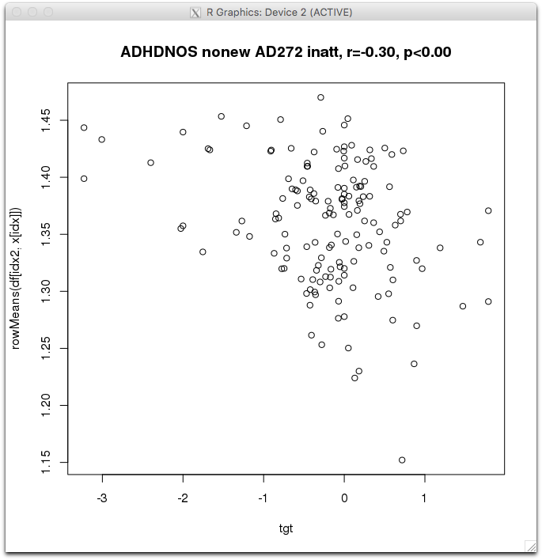

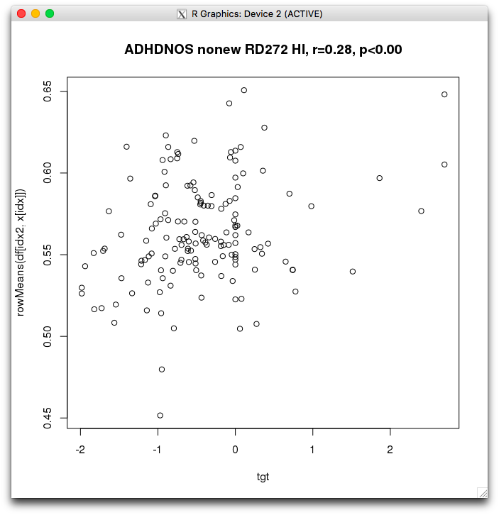

It's hard to say if those are truly outliers. Out of curiosity, even though the clusters are not as big, let's see how the scatterplots look when including the new_onset cases:

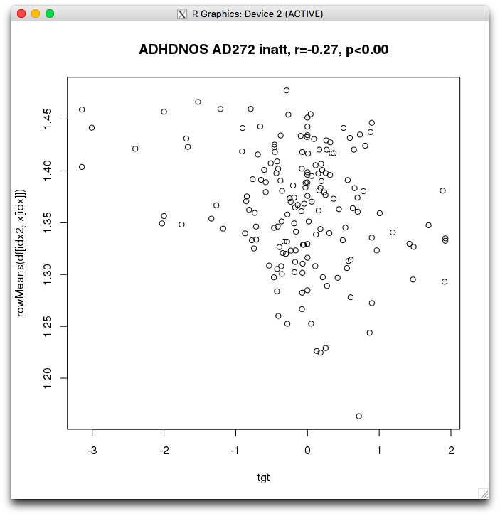
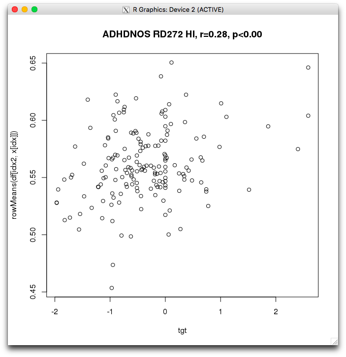

Not much difference. Might as well stick with nonew for now.

```bash
3dclust -NN1 1 -orient LPI -savemask mycluster.nii -overwrite /data/NCR_SBRB/tmp/dti_ad_voxelwise_n272_09212018/ADHDNOS_nonew_OLS_inatt_slope_winsorize_None_42+orig
3dcalc -a mycluster.nii -prefix myres.nii -overwrite -expr "amongst(a, 1)"
flirt -in myres.nii -ref /usr/local/apps/fsl/6.0.0/data/standard/MNI152_T1_1mm.nii.gz -out myres_inMNI152.nii.gz -applyxfm -init ~/data/aging_to_MNI152.mat -interp nearestneighbour
# just to get the COM for labeling
3dclust -NN1 1 -orient LPI myres_inMNI152.nii.gz
```

inattention (AD):
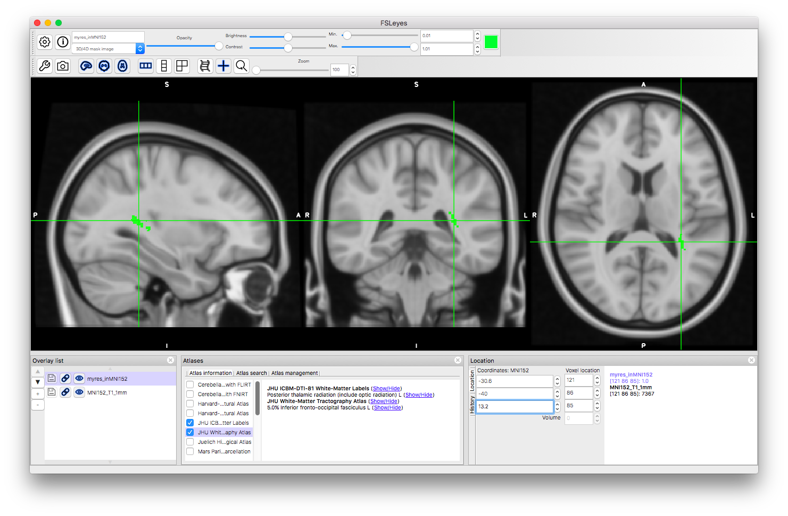

HI (RD):


## struct

We'll focus on volume, which has the most results and combine area and thickness. For convenience, these are the nonew results:

```
struct_volume_11142018_260timeDiff12mo (RH): ADHDNOS_nonew_OLS_HI_slope_winsorize_None (250 perms)
struct_volume_11142018_260timeDiff12mo (LH): ADHDNOS_nonew_OLS_inatt_slope_winsorize_None (250 perms)
struct_volume_11142018_260timeDiff12mo (RH): ADHDNOS_nonew_OLS_inatt_slope_winsorize_None (250 perms)
```

```bash
awk 'NR>=13 && NR<2575' /data/NCR_SBRB/tmp/struct_volume_11142018_260timeDiff12mo/ADHDNOS_nonew_OLS_HI_slope_winsorize_None_42_rh_ClstMsk_e1_a1.0.niml.dset > ~/tmp/clusters.txt
```

```r
winsorize = function(x, cut = 0.01){
  cut_point_top <- quantile(x, 1 - cut, na.rm = T)
  cut_point_bottom <- quantile(x, cut, na.rm = T)
  i = which(x >= cut_point_top) 
  x[i] = cut_point_top
  j = which(x <= cut_point_bottom) 
  x[j] = cut_point_bottom
  return(x)
}
clin = read.csv('/data/NCR_SBRB/baseline_prediction/long_clin_11302018.csv')
load('/data/NCR_SBRB/baseline_prediction/struct_volume_11142018_260timeDiff12mo.RData.gz')
df = merge(clin, data, by='MRN')
x = colnames(df)[grepl(pattern = '^v_rh', colnames(df))]
a = read.table('~/tmp/clusters.txt')[,1]
idx = which(a==1)
idx2 = df$diag_group != 'new_onset' & df$DX != 'NV'
tgt = winsorize(df[idx2,]$OLS_HI_slope)
plot(tgt, rowMeans(df[idx2, x[idx]]))
b = cor.test(tgt, rowMeans(df[idx2, x[idx]]))
title(sprintf('ADHDNOS nonew volume RH HI, r=%.2f, p<%.2f', b$estimate, b$p.value))
```

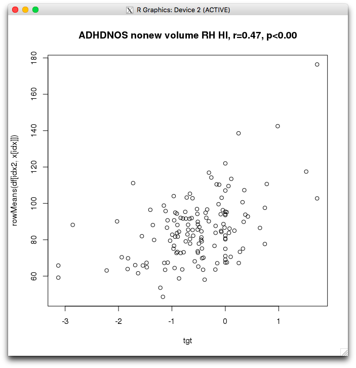
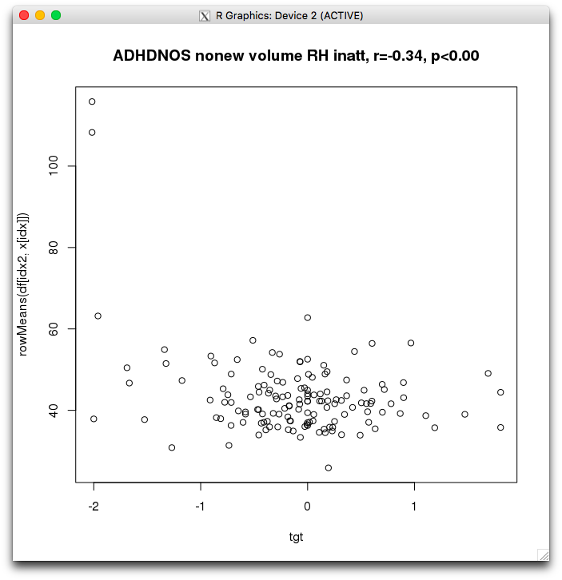

This second one is clearly moved by outliers...

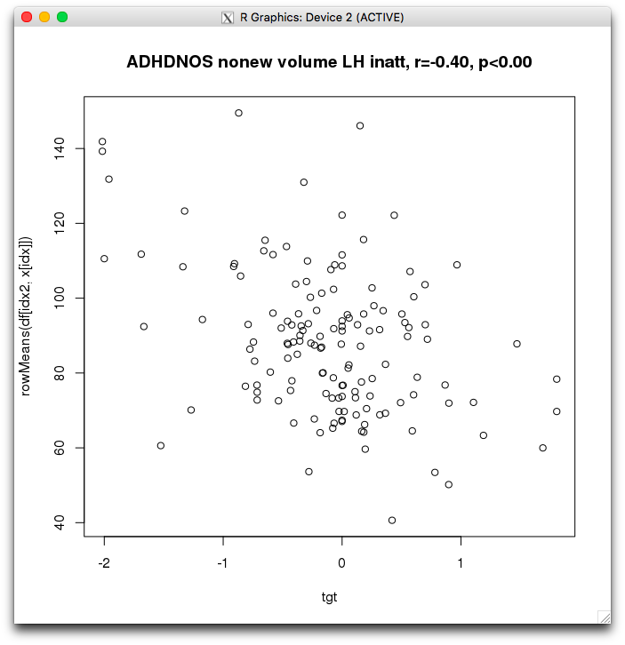

```bash
awk 'NR>=13 && NR<2575' ~/tmp/struct_volume_11142018_260timeDiff12mo/ADHDNOS_nonew_OLS_HI_slope_winsorize_None_42_rh_ClstMsk_e1_a1.0.niml.dset > ~/tmp/clusters.txt
# single out the one region
awk '{ if ($1 != 1 ) print 0; else print 1 }' ~/tmp/clusters.txt > rh_HI.txt
awk 'NR>=13 && NR<2575' ~/tmp/struct_volume_11142018_260timeDiff12mo/ADHDNOS_nonew_OLS_inatt_slope_winsorize_None_42_lh_ClstMsk_e1_a1.0.niml.dset > ~/tmp/clusters.txt
awk '{ if ($1 != 1 ) print 0; else print 1 }' ~/tmp/clusters.txt > lh_inatt.txt
suma -i_fs /Volumes/Shaw/freesurfer5.3_subjects/fsaverage4/SUMA/lh.pial.asc
```

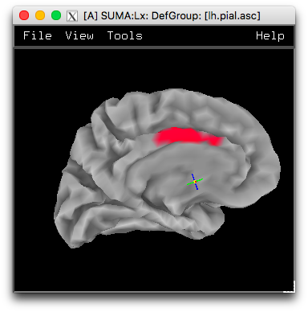


# 2018-12-13 13:11:17

Let's run some crappy domain descriptives.

```bash
mydir=~/data/baseline_prediction/;
for f in cog_all_09242018.RData.gz geno3_prs_09192018.RData.gz \
    social_09262018.RData.gz clinics_binary_sx_baseline_10022018.RData.gz \
    adhd200_10042018.RData.gz; do
    for target in OLS_inatt_slope OLS_HI_slope; do
        echo ==== $f $target ====;
        Rscript --vanilla ~/research_code/baseline_prediction/descriptives/generic.R ${mydir}/${f} ${mydir}/long_clin_11302018.csv ADHDNOS_nonew_${target} 42 winsorize_None;
    done;
done
```

Note that I'm only running that for the nonew subset, conforming to the previous
results. I used script to output the results, and here are the main findings:

```
==== cog_all_09242018.RData.gz OLS_HI_slope ====
[1] "Variables at p<.05: 2 / 25"
[1] "v_Raw_SS_total" "v_Raw_SSB"
==== geno3_prs_09192018.RData.gz OLS_inatt_slope ====
[1] "Variables at p<.05: 2 / 13"
[1] "v_PROFILES.0.0001.profile" "v_PROFILES.0.0005.profile"
==== geno3_prs_09192018.RData.gz OLS_HI_slope ====
[1] "Variables at p<.05: 1 / 13"
[1] "v_PROFILES.0.00001.profile"
==== social_09262018.RData.gz OLS_HI_slope ====
[1] "Variables at p<.05: 1 / 18"
[1] "v_Priv_School"
==== clinics_binary_sx_baseline_10022018.RData.gz OLS_inatt_slope ====
[1] "Variables at p<.05: 8 / 8"
[1] "v_SX_inatt"          "v_SX_HI"             "vCateg_diff.organ"  
[4] "vCateg_avoids"       "vCateg_loses"        "vCateg_easily.distr"
[7] "vCateg_forgetful"    "vCateg_waiting.turn"
==== clinics_binary_sx_baseline_10022018.RData.gz OLS_HI_slope ====
[1] "Variables at p<.05: 3 / 11"
[1] "v_SX_HI"             "vCateg_fidgety"      "vCateg_waiting.turn"
[1] "Variables at q<.05: 2 / 11"
[1] "v_SX_HI"             "vCateg_waiting.turn"
==== adhd200_10042018.RData.gz OLS_inatt_slope ====
[1] "Variables at p<.05: 1 / 3"
[1] "v_Age"
[1] "Variables at q<.05: 1 / 3"
[1] "v_Age"
```

I decided to report only the nominal p-values because I didn't want to restrict
the number of variables we're using for FDR or Meff. If they're crappy in the
end, the ML algorithm will likely throw it away. The results not listed did not
have any nominal results. Also, I think we could probably get rid of the
socioeconomic variables for now.

The baseline SX results are interesting, especially the individual binary
symptoms. The baseline SX makes sense, as one cannot have negative OLS at zero,
not positive at 9, so that makes the distribution somewhat diagonal, creating a
correlation. One could also argue that the more symptoms at baseline, the more
one has to lose, so there's your correlation.


Now, it's a matter of putting those variables together in a model, to combine
with the neural cluster averages.

# 2018-12-14 09:37:15

##melodic

```bash
myfile=melodic_NOSdescriptives.txt
rm $myfile; touch $myfile;
for f in `/bin/ls \
    /data/NCR_SBRB/tmp/melodic_*IC*/ADHDNOS*_42_clusters.txt`; do
    echo $f >> $myfile;
    grep -v \# $f | head -n 5 >> $myfile;
done
```

```bash
/bin/ls -1 /data/NCR_SBRB/tmp/melodic_*_IC*/ADHDNOS*_42_clusters.txt > result_files.txt;
for root_file in `cat result_files.txt | sed -e 's/_42_clusters.txt//g'`; do
    collect_name=${root_file}_top_rnd_clusters.txt;
    echo $collect_name;
    if [ -e $collect_name ]; then
        rm $collect_name;
    fi;
    for f in `ls ${root_file}*rnd*clusters.txt`; do
        grep -v \# $f | head -n 1 >> $collect_name;
    done
done
tar -zcvf melodic_ADHDNOS_top_rnd_clusters.tar.gz melodic_*_IC*/ADHDNOS*top_rnd_clusters.txt
```

```r
res_fname = '~/tmp/melodic_NOSdescriptives.txt'
out_file = '~/tmp/pvals_NOSmelodic.txt'
res_lines = readLines(res_fname)
for (line in res_lines) {
  # starting new file summary
  if (grepl(pattern='clusters', line)) {
    root_fname = strsplit(line, '/')[[1]]
    dir_name = root_fname[length(root_fname)-1]
    root_fname = strsplit(root_fname[length(root_fname)], '_')[[1]]
    root_fname = paste0(root_fname[1:(length(root_fname)-2)], sep='', collapse='_')
    rnd_fname = sprintf('~/tmp/%s/%s_top_rnd_clusters.txt', dir_name, root_fname)
    if (file.exists(rnd_fname)) {
        rnd_results = read.table(rnd_fname)[, 1]
        nperms = length(rnd_results)
    } else {
        rnd_results = NA
        nperms = NA
    }
    cat(sprintf('%s: %s (%d perms)\n', dir_name, root_fname, nperms),
        file=out_file, append=T)
  } 
  else {
    parsed = strsplit(line, ' +')
    clus_size = as.numeric(parsed[[1]][2])
    pval = sum(rnd_results >= clus_size) / nperms
    cat(sprintf('Cluster size: %d, p<%.3f', clus_size, pval),
        file=out_file, append=T)
    if (!is.na(pval) && pval < .05) {
      cat(' *', file=out_file, append=T)
    }
    if (!is.na(pval) && pval < .01) {
      cat('*', file=out_file, append=T)
    }
    cat('\n', file=out_file, append=T)
  }
}
```

Overall, every time there was a subjScale and None results, the subjScale
clusters were bigger, but the actual p-value for None was smaller. So, let's
focus on those for now. 

But there might be something odd here, as all results are either
ADHDNOS_nonew_OLS_HI with 40 voxels, or ADHDNOS_OLS_inatt for 56 voxels. Across
all 7 ICs in fancy, but nothing in inter.


```bash
hg-02127244-lw0:tmp sudregp$ grep -B 1 "*" pvals_NOSmelodic.txt
dti_ad_voxelwise_n272_09212018: ADHDNOS_nonew_OLS_inatt_slope_winsorize_None (248 perms)
Cluster size: 41, p<0.012 *
Cluster size: 31, p<0.044 *
--
dti_ad_voxelwise_n272_09212018: ADHDNOS_OLS_inatt_slope_winsorize_None (250 perms)
Cluster size: 38, p<0.036 *
--
dti_rd_voxelwise_n272_09212018: ADHDNOS_nonew_OLS_HI_slope_winsorize_None (249 perms)
Cluster size: 92, p<0.004 **
--
dti_rd_voxelwise_n272_09212018: ADHDNOS_OLS_HI_slope_winsorize_None (249 perms)
Cluster size: 87, p<0.012 *
```

It looks like the nonew results are stronger. Let's start doing scatterplots of those results then, both in structural and DTI results, while we wait for MELODIC.

```bash
3dclust -NN1 1 -orient LPI -savemask mycluster.nii /data/NCR_SBRB/tmp/dti_ad_voxelwise_n272_09212018/ADHDNOS_nonew_OLS_inatt_slope_winsorize_None_42+orig
3dmaskdump -mask /data/NCR_SBRB/baseline_prediction/mean_272_fa_skeleton_mask.nii.gz mycluster.nii > out.txt
```

```r
winsorize = function(x, cut = 0.01){
  cut_point_top <- quantile(x, 1 - cut, na.rm = T)
  cut_point_bottom <- quantile(x, cut, na.rm = T)
  i = which(x >= cut_point_top) 
  x[i] = cut_point_top
  j = which(x <= cut_point_bottom) 
  x[j] = cut_point_bottom
  return(x)
}
load('/data/NCR_SBRB/baseline_prediction/dti_ad_voxelwise_n272_09212018.RData.gz')
a = read.table('~/tmp/out.txt')[,4]
idx = which(a==1)
clin = read.csv('/data/NCR_SBRB/baseline_prediction/long_clin_11302018.csv')
df = merge(clin, data, by='MRN')
x = colnames(df)[grepl(pattern = '^v', colnames(df))]
idx2 = df$diag_group != 'new_onset' & df$DX != 'NV'
tgt = winsorize(df[idx2,]$OLS_inatt_slope)
plot(tgt, rowMeans(df[idx2, x[idx]]))
b = cor.test(tgt, rowMeans(df[idx2, x[idx]]))
title(sprintf('ADHDNOS nonew AD272 inatt, r=%.2f, p<%.2f', b$estimate, b$p.value))
```

# 2018-12-17 15:14:56

##melodic

```bash
myfile=melodic_NOSdescriptives.txt
rm $myfile; touch $myfile;
for f in `/bin/ls \
    /data/NCR_SBRB/tmp/melodic_*_IC*12142018/ADHDNOS*_42_clusters.txt`; do
    echo $f >> $myfile;
    grep -v \# $f | head -n 5 >> $myfile;
done
```

```bash
/bin/ls -1 /data/NCR_SBRB/tmp/melodic_*_IC*_12142018/ADHDNOS*_42_clusters.txt > result_files.txt;
for root_file in `cat result_files.txt | sed -e 's/_42_clusters.txt//g'`; do
    collect_name=${root_file}_top_rnd_clusters.txt;
    echo $collect_name;
    if [ -e $collect_name ]; then
        rm $collect_name;
    fi;
    for f in `ls ${root_file}*rnd*clusters.txt`; do
        grep -v \# $f | head -n 1 >> $collect_name;
    done
done
tar -zcvf melodic_ADHDNOS_top_rnd_clusters.tar.gz melodic_*_IC*_12142018/ADHDNOS*top_rnd_clusters.txt
```

```r
res_fname = '~/tmp/melodic_NOSdescriptives.txt'
out_file = '~/tmp/pvals_NOSmelodic.txt'
res_lines = readLines(res_fname)
for (line in res_lines) {
  # starting new file summary
  if (grepl(pattern='clusters', line)) {
    root_fname = strsplit(line, '/')[[1]]
    dir_name = root_fname[length(root_fname)-1]
    root_fname = strsplit(root_fname[length(root_fname)], '_')[[1]]
    root_fname = paste0(root_fname[1:(length(root_fname)-2)], sep='', collapse='_')
    rnd_fname = sprintf('~/tmp/%s/%s_top_rnd_clusters.txt', dir_name, root_fname)
    if (file.exists(rnd_fname)) {
        rnd_results = read.table(rnd_fname)[, 1]
        nperms = length(rnd_results)
    } else {
        rnd_results = NA
        nperms = NA
    }
    cat(sprintf('%s: %s (%d perms)\n', dir_name, root_fname, nperms),
        file=out_file, append=T)
  } 
  else {
    parsed = strsplit(line, ' +')
    clus_size = as.numeric(parsed[[1]][2])
    pval = sum(rnd_results >= clus_size) / nperms
    cat(sprintf('Cluster size: %d, p<%.3f', clus_size, pval),
        file=out_file, append=T)
    if (!is.na(pval) && pval < .05) {
      cat(' *', file=out_file, append=T)
    }
    if (!is.na(pval) && pval < .01) {
      cat('*', file=out_file, append=T)
    }
    cat('\n', file=out_file, append=T)
  }
}
```

For melodic our results using subjScale were actually better. 

```bash
hg-02127244-lw0:tmp sudregp$ grep -B 1 "*" pvals_NOSmelodic.txt | grep nonew
melodic_fancy_IC37_12142018: ADHDNOS_nonew_OLS_inatt_slope_winsorize_subjScale (249 perms)
melodic_fancy_IC57_12142018: ADHDNOS_nonew_OLS_HI_slope_winsorize_None (250 perms)
melodic_inter_IC11_12142018: ADHDNOS_nonew_OLS_inatt_slope_winsorize_subjScale (249 perms)
melodic_inter_IC2_12142018: ADHDNOS_nonew_OLS_inatt_slope_winsorize_subjScale (248 perms)
melodic_inter_IC31_12142018: ADHDNOS_nonew_OLS_inatt_slope_winsorize_subjScale (250 perms)
```

Those networks are VAN, limbic, and DMN. Let's make the usual scatterplots.

```bash
3dclust -NN1 1 -orient LPI -savemask mycluster.nii -overwrite /data/NCR_SBRB/tmp/melodic_inter_IC31_12142018/ADHDNOS_nonew_OLS_inatt_slope_winsorize_subjScale_42+tlrc
3dmaskdump -mask ~/data/baseline_prediction/same_space/epi/group_epi_mask_inter.nii mycluster.nii > out.txt
```

```r
winsorize = function(x, cut = 0.01){
  cut_point_top <- quantile(x, 1 - cut, na.rm = T)
  cut_point_bottom <- quantile(x, cut, na.rm = T)
  i = which(x >= cut_point_top) 
  x[i] = cut_point_top
  j = which(x <= cut_point_bottom) 
  x[j] = cut_point_bottom
  return(x)
}
load('/data/NCR_SBRB/baseline_prediction/melodic_inter_IC31_12142018.RData.gz')
a = read.table('~/tmp/out.txt')[,4]
idx = which(a==1)
clin = read.csv('/data/NCR_SBRB/baseline_prediction/long_clin_11302018.csv')
df = merge(clin, data, by='MRN')
x = colnames(df)[grepl(pattern = '^v', colnames(df))]
idx2 = df$diag_group != 'new_onset' & df$DX != 'NV'
tgt = winsorize(df[idx2,]$OLS_inatt_slope)
plot(tgt, rowMeans(df[idx2, x[idx]]))
b = cor.test(tgt, rowMeans(df[idx2, x[idx]]))
title(sprintf('ADHDNOS inter IC 31 limbic inatt, r=%.2f, p<%.2f', b$estimate, b$p.value))
```

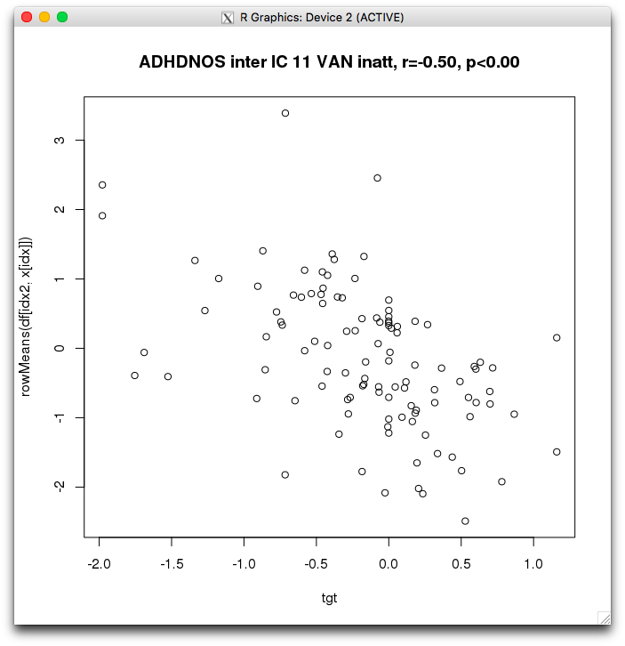

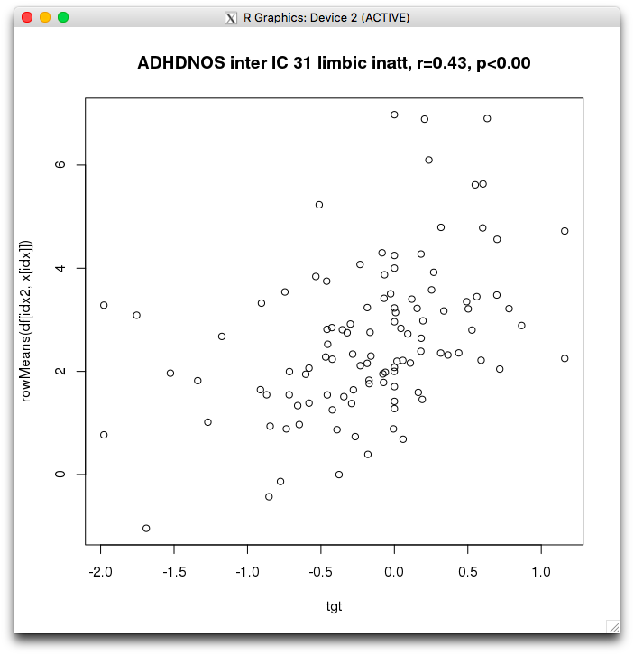

And we should probably check out where in the brain they are, before setting them up for classification. I'm not going to make the 95 percentile masks we used in the paper for now, but we can have an idea of where the cluster is base don the pictures, and then compare to the actual networks in the Yeo paper to see if they make sense.

```bash
3dclust -NN1 1 -orient LPI -savemask mycluster.nii -overwrite /data/NCR_SBRB/tmp/melodic_inter_IC31_12142018/ADHDNOS_nonew_OLS_inatt_slope_winsorize_subjScale_42+tlrc
3dcalc -a mycluster.nii -prefix res31.nii -overwrite -expr "amongst(a, 1)"
3dclust -NN1 1 -orient LPI -savemask mycluster.nii -overwrite /data/NCR_SBRB/tmp/melodic_inter_IC2_12142018/ADHDNOS_nonew_OLS_inatt_slope_winsorize_subjScale_42+tlrc
3dcalc -a mycluster.nii -prefix res2.nii -overwrite -expr "amongst(a, 1)"
3dclust -NN1 1 -orient LPI -savemask mycluster.nii -overwrite /data/NCR_SBRB/tmp/melodic_inter_IC11_12142018/ADHDNOS_nonew_OLS_inatt_slope_winsorize_subjScale_42+tlrc
3dcalc -a mycluster.nii -prefix res11.nii -overwrite -expr "amongst(a, 1)"
```

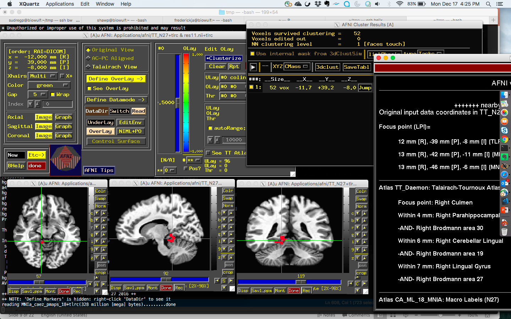
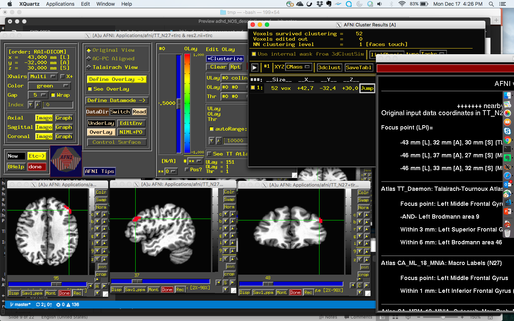
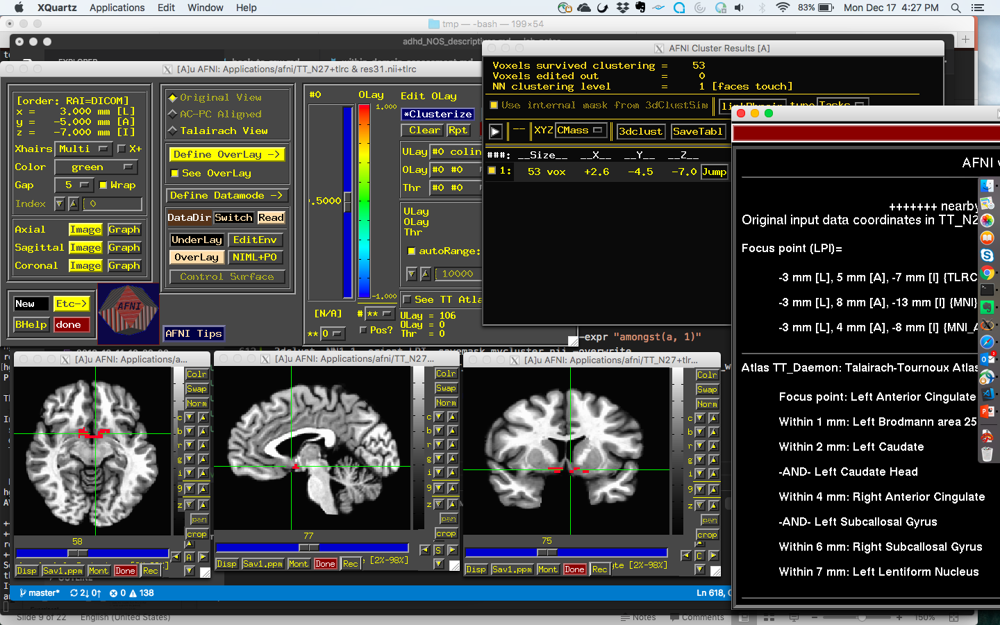

We got a couple hard hits there. For DMN (IC2), we got LMFG, which is neat. But limbic (IC31) we got left ACC, quite inferior, and VAN (IC11) we got cerebellum. We coudl restrict it to DMN, so we'll see.


# TODO
* plot clusters in the brain