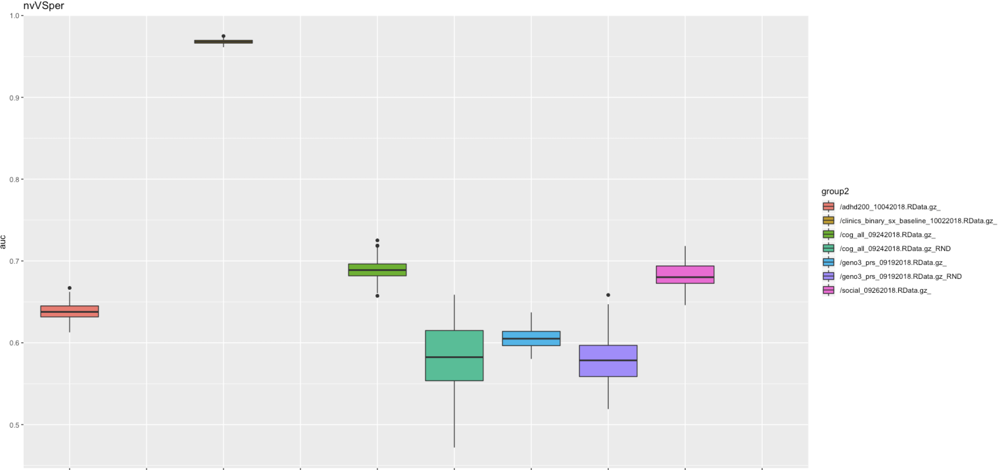

# 2018-10-22 17:12:04

As I wait for the rndTFilter results (see dummy note), let's re-run some of the
raw variables, but now using the pairwise comparisons. 

```bash
job_name=adRaw;
swarm_file=swarm.automl_${job_name};
f=/data/NCR_SBRB/baseline_prediction/dti_ad_voxelwise_n223_09212018.RData.gz;
rm -rf $swarm_file;
for target in nvVSper perVSrem nvVSrem; do
    for i in {1..100}; do
        echo "Rscript --vanilla ~/research_code/automl/raw_autoValidation.R $f /data/NCR_SBRB/baseline_prediction/long_clin_0918.csv ${target} /data/NCR_SBRB/baseline_prediction/models_test_raw/${USER} $RANDOM" >> $swarm_file;
    done;
done;
sed -i -e "s/^/unset http_proxy; /g" $swarm_file;
swarm -f $swarm_file -g 60 -t 32 --time 1-0:00:00 --logdir trash_${job_name} --job-name ${job_name} -m R --gres=lscratch:10;
```

```bash
job_name=rsfmriRaw;
swarm_file=swarm.automl_${job_name};
f=/data/NCR_SBRB/baseline_prediction/aparc.a2009s_trimmed_n215_09182018.RData.gz;
rm -rf $swarm_file;
for target in nvVSper perVSrem nvVSrem; do
    for i in {1..100}; do
        echo "Rscript --vanilla ~/research_code/automl/raw_autoValidation.R $f /data/NCR_SBRB/baseline_prediction/long_clin_0918.csv ${target} /data/NCR_SBRB/baseline_prediction/models_test_raw/${USER} $RANDOM" >> $swarm_file;
    done;
done;
sed -i -e "s/^/unset http_proxy; /g" $swarm_file;
swarm -f $swarm_file -g 60 -t 32 --time 1-0:00:00 --logdir trash_${job_name} --job-name ${job_name} -m R --gres=lscratch:10;
```

So, I left rsfmriRaw running with Jen, who is also running rnd_trainRaw for AD.
Philip is running adRaw, and I'm still running rnd_trainRF.

# 2018-10-23 09:34:00

Let's compile some of the raw results with real data.

```bash
echo "target,pheno,var,seed,nfeat,model,auc,f1,acc,ratio" > raw_summary.csv;
for dir in adRaw rsfmriRaw rnd_trainRaw; do
    echo $dir;
    for f in `ls trash_${dir}/*o`; do
        phen=`head -n 2 $f | tail -1 | awk '{FS=" "; print $6}' | cut -d"/" -f 5`;
        target=`head -n 2 $f | tail -1 | awk '{FS=" "; print $8}'`;
        seed=`head -n 2 $f | tail -1 | awk '{FS=" "; print $10}'`;
        var=`head -n 2 $f | tail -1 | awk '{FS=" "; print $5}' | cut -d"/" -f 4 | sed -e "s/\.R//g"`;
        model=`grep -A 1 model_id $f | tail -1 | awk '{FS=" "; print $2}' | cut -d"_" -f 1`;
        auc=`grep -A 1 model_id $f | tail -1 | awk '{FS=" "; print $3}'`;
        nfeat=`grep "Running model on" $f | awk '{FS=" "; print $5}'`;
        ratio=`grep -A 1 "Class distribution" $f | tail -1 | awk '{FS=" "; {for (i=2; i<=NF; i++) printf $i ";"}}'`;
        f1=`grep -A 2 "Maximum Metrics:" $f | tail -1 | awk '{FS=" "; print $5}'`;
        acc=`grep -A 5 "Maximum Metrics:" $f | tail -1 | awk '{FS=" "; print $5}'`;
        echo $target,$phen,$var,$seed,$nfeat,$model,$auc,$f1,$acc,$ratio >> raw_summary.csv;
    done;
done
```

?? HOW ABOUT DOING ICASSO ON INPUT, AND USING JUST THE STABLE COMPONENTS? WE CAN
KEEP THE FILE VERY STATIC, AND JUST PLAY WITH THE STABILITY METRIC IF THERE IS
NOT REALLY A CONSENSUS ON WHAT TO USE. THE MAIN IDEA HERE IS TO DO OPTIMIZATION
WITHIN DATASETS, AND LOAD IN THE OPTIMIZED DATA, INSTEAD OF OPTIMIZING INSIDE
THE CLASSIFICATION FRAMEWORK. THIS IS POSSIBLE AS WE'RE ONLY USING UNSUPERVISED
METHODS. FINALLY, WE SHOULD ALSO CONSIDER HOW TO OPTIMIZE THE AUTOENCODER.

```r
load('/data/NCR_SBRB/baseline_prediction/dti_ad_voxelwise_n223_09212018.RData.gz')
colnames(data)[1:10]
 [1] "mask.id" "MRN"     "v00001"  "v00002"  "v00003"  "v00004"  "v00005"  "v00006"  "v00007"  "v00008" 
write.csv(data[, 3:ncol(data)], file='~/data/tmp/tmp.csv', row.names=F, col.names=F) 
```

```matlab
restoredefaultpath()
addpath('/data/NCR_SBRB/software/FastICA_25/')
addpath('/data/NCR_SBRB/software/icasso122/')
addpath('/data/NCR_SBRB/')
Ydd = dlmread(['/data/sudregp/tmp/tmp.csv'], ',', 1, 0);

sR=icassoEst('both', Ydd, 1000, 'lastEig', 40, 'g', 'pow3', 'approach', 'defl');
# or
sR=icassoEst('both', Ydd, 1000, 'lastEig', 50, 'g', 'pow3', 'approach', 'defl');

sR=icassoExp(sR);
[iq,A,W,S]=icassoResult(sR);
save(['/data/sudregp/tmp/ica_results_dti_ad_223_1Kperms_50ics.mat'],'A','S','W','iq','sR','-v7.3')
```

That didn't run because of lack of memory, so I'm going with 50 and 40 ICs.

(running both in interactive sessions as myself)

Getting close to 72Gb of memory to get icassoExp... also, note that I cnanot use
-nojvm because one of the functions dies!

# 2018-10-29 10:06:26

I'll either have to go to an even lower number of ICs, or kill this branch
completely. I'm running out of time in the interactive sessions even for 40
ICs... just because we have time, I'll run 30, like what we did for that paper.

```matlab
restoredefaultpath()
addpath('/data/NCR_SBRB/software/FastICA_25/')
addpath('/data/NCR_SBRB/software/icasso122/')
addpath('/data/NCR_SBRB/')
Ydd = dlmread(['/data/sudregp/tmp/tmp.csv'], ',', 1, 0);
sR=icassoEst('both', Ydd, 1000, 'lastEig', 30, 'g', 'pow3', 'approach', 'defl');
sR=icassoExp(sR);
[iq,A,W,S]=icassoResult(sR);
save(['/data/sudregp/tmp/ica_results_dti_ad_223_1Kperms_30ics.mat'],'A','S','W','iq','sR','-v7.3')
```

# 2018-11-19 14:08:53

I already have the best raw result for each domain (still waiting on fMRI after
some transforms, though). But let's just run the bad datasets through the
current framework once so we can compare all of them in the binary tests:

```bash
job_name=crappyDomains_rawCV;
mydir=/data/NCR_SBRB/baseline_prediction/;
swarm_file=swarm.automl_${job_name};
rm -rf $swarm_file;
for f in cog_all_09242018.RData.gz geno3_prs_09192018.RData.gz \
    social_09262018.RData.gz clinics_binary_sx_baseline_10022018.RData.gz \
    adhd200_10042018.RData.gz; do
    for target in nvVSadhd perVSrem nvVSper nvVSrem; do
        pp=None;
        algo=DeepLearning;
        for i in {1..100}; do
            myseed=$RANDOM;
            echo "Rscript --vanilla ~/research_code/automl/raw_multiDomain_autoValidation_oneAlgo.R ${mydir}/$f ${mydir}/long_clin_0918.csv ${target} ${mydir}/models_raw_crappy/${USER} $myseed $algo $pp" >> $swarm_file;
            echo "Rscript --vanilla ~/research_code/automl/raw_multiDomain_autoValidation_oneAlgo.R ${mydir}/$f ${mydir}/long_clin_0918.csv ${target} ${mydir}/models_raw_crappy/${USER} -$myseed $algo $pp" >> $swarm_file;
        done;
    done;
done
sed -i -e "s/^/unset http_proxy; /g" $swarm_file;
split -l 1000 $swarm_file ${job_name}_split;
for f in `/bin/ls ${job_name}_split??`; do
    echo "ERROR" > swarm_wait_${USER}
    while grep -q ERROR swarm_wait_${USER}; do
        echo "Trying $f"
        swarm -f $f -g 30 -t 16 --time 3:00:00 --partition quick --logdir trash_${job_name} --job-name ${job_name} -m R --gres=lscratch:10 2> swarm_wait_${USER};
        if grep -q ERROR swarm_wait_${USER}; then
            echo -e "\tError, sleeping..."
            sleep 10m;
        fi;
    done;
done
```

# 2018-11-20 09:20:42

Let's collect the crappy domain results.

```bash
echo "target,pheno,var,seed,nfeat,model,auc,f1,acc,ratio" > crappyDomains_summary.csv;
dir=crappyDomains_rawCV;
for f in `ls -1 trash_${dir}/*o`; do
    phen=`head -n 2 $f | tail -1 | awk '{FS=" "; print $7}'`;
    target=`head -n 2 $f | tail -1 | awk '{FS=" "; print $9}'`;
    seed=`head -n 2 $f | tail -1 | awk '{FS=" "; print $11}'`;
    var=`head -n 2 $f | tail -1 | awk '{FS=" "; print $13}'`;
    model=`grep -A 1 model_id $f | tail -1 | awk '{FS=" "; print $2}' | cut -d"_" -f 1`;
    auc=`grep -A 1 model_id $f | tail -1 | awk '{FS=" "; print $3}'`;
    nfeat=`grep "Running model on" $f | awk '{FS=" "; print $5}'`;
    ratio=`grep -A 1 "Class distribution" $f | tail -1 | awk '{FS=" "; {for (i=2; i<=NF; i++) printf $i ";"}}'`;
    f1=`grep -A 2 "Maximum Metrics:" $f | tail -1 | awk '{FS=" "; print $5}'`;
    acc=`grep -A 5 "Maximum Metrics:" $f | tail -1 | awk '{FS=" "; print $5}'`;
    echo $target,$phen,$var,$seed,$nfeat,$model,$auc,$f1,$acc,$ratio >> crappyDomains_summary.csv;
done;
```

```r
data = read.csv('~/tmp/crappyDomains_summary.csv')
data$pheno = gsub('/data/NCR_SBRB/baseline_prediction//', '', data$pheno)
data$group = ''
data[data$seed<0,]$group = 'RND'
data$group2 = sapply(1:nrow(data), function(x) { sprintf('%s_%s', data$pheno[x], data$group[x])} )
# then, for each target
target='nvVSper'
p1<-ggplot(data[data$target == target,], aes(x=group2, y=auc, fill=group2))
print(p1+geom_boxplot() + ggtitle(target))
```



I need to change the code so that it's possible to make random data for
factors... but it's clear that with actual data it's very easy to do nvVSper...


perVSrem is certainly harder, but the cognitive variables don't seem to do
poorly? huge variation in its random counterpart though...

Let's re-run the random swarms for the datasets with categorical variables:

```bash
job_name=crappyDomainsRND_rawCV;
mydir=/data/NCR_SBRB/baseline_prediction/;
swarm_file=swarm.automl_${job_name};
rm -rf $swarm_file;
for f in social_09262018.RData.gz clinics_binary_sx_baseline_10022018.RData.gz \
    adhd200_10042018.RData.gz; do
    for target in nvVSadhd perVSrem nvVSper nvVSrem; do
        pp=None;
        algo=DeepLearning;
        for i in {1..100}; do
            myseed=$RANDOM;
            echo "Rscript --vanilla ~/research_code/automl/raw_multiDomain_autoValidation_oneAlgo.R ${mydir}/$f ${mydir}/long_clin_0918.csv ${target} ${mydir}/models_raw_crappy/${USER} -$myseed $algo $pp" >> $swarm_file;
        done;
    done;
done
sed -i -e "s/^/unset http_proxy; /g" $swarm_file;
split -l 1000 $swarm_file ${job_name}_split;
for f in `/bin/ls ${job_name}_split??`; do
    echo "ERROR" > swarm_wait_${USER}
    while grep -q ERROR swarm_wait_${USER}; do
        echo "Trying $f"
        swarm -f $f -g 30 -t 16 --time 3:00:00 --partition quick --logdir trash_${job_name} --job-name ${job_name} -m R --gres=lscratch:10 2> swarm_wait_${USER};
        if grep -q ERROR swarm_wait_${USER}; then
            echo -e "\tError, sleeping..."
            sleep 10m;
        fi;
    done;
done
```

